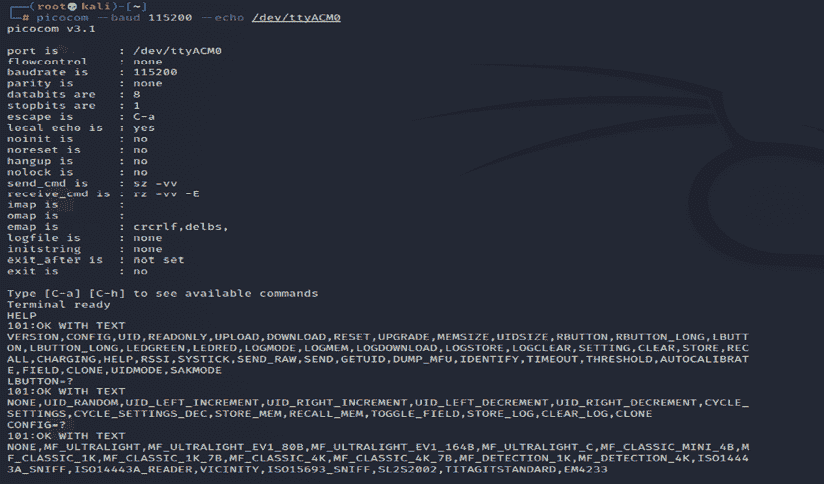
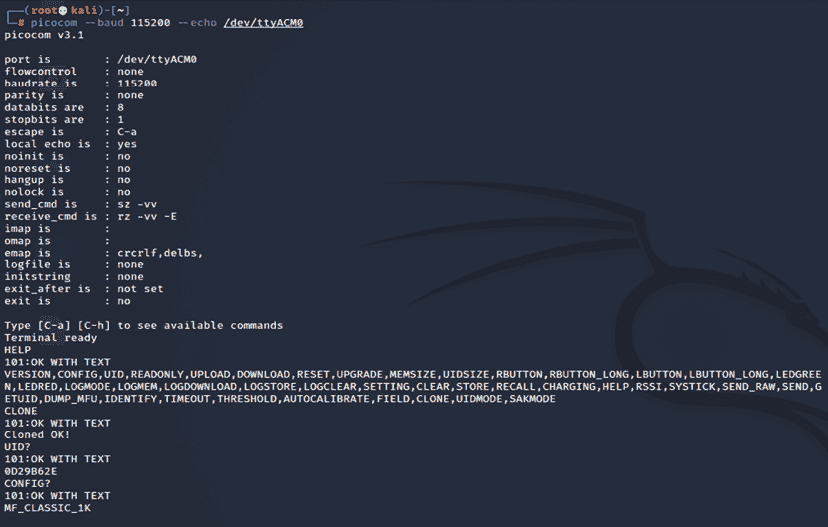

# 第十四章：嵌入式设备与 RFID 攻击

嵌入式系统市场受到了消费者采用**物联网**（**IoT**）的巨大推动。现代联网嵌入式设备变得越来越有吸引力，并广泛部署于许多大公司、**小型办公室/家庭办公室**（**SOHO**）、**中小型企业**（**SMB**），并被全球家庭消费者直接使用。根据[www.statista.com](http://www.statista.com)，联网物联网设备从 2015 年的 15.41 亿台增长到 2021 年的 35.82 亿台，预计到 2025 年将达到 75.44 亿台。同样，威胁也在增长，这些设备的安全性已成为制造商和消费者最关注的领域。一个最近的典型例子是发现了 Realtek 芯片组中的漏洞（CVE-2021-35395），该漏洞影响了 65 多个生产智能设备的供应商。这些攻击的来源表明，它们可能是由与 2016 年使美国东海岸大部分地区断网的 Mirai 僵尸网络攻击相同的攻击者所发起。

在本章中，我们将介绍嵌入式系统的基础知识、外设的角色，并探索可以用于执行传统硬件/固件渗透测试或使用 Kali Linux 进行给定设备产品评估的不同工具和技术。我们还将设置 ChameleonMini，以模拟 NFC 卡并重放存储的内存内容，以绕过任何物理访问控制，在红队演习或物理渗透测试中进行测试。

在本章中，你将学习以下内容：

+   嵌入式系统和硬件架构

+   UART 串行总线

+   USB JTAG

+   解包固件和常见的引导加载程序

+   使用 ChameleonMini 进行 RFID 攻击

# 嵌入式系统和硬件架构

嵌入式系统是由硬件和软件组合而成，旨在执行特定任务。嵌入式硬件通常基于微控制器和微处理器。在本节中，我们将快速了解嵌入式系统的不同架构元素，包括内存和这些设备之间的通信。几乎我们日常使用的所有设备都是嵌入式设备，包括手机、DVD 播放器、GPS 系统和智能语音助手，如 Alexa 和其他基于硬件的解决方案。

## 嵌入式系统基本架构

嵌入式系统的基本架构通常包括硬件和软件组件。*图 14.1* 描绘了一个简单嵌入式设备的典型架构组件：


图 14.1：基本的嵌入式系统架构

嵌入式系统的组件如下：

+   **软件**：这是用于控制设备及其功能的定制应用程序；通常是一个用于配置或更新设备的 Web 应用程序。

    +   **微处理器或微控制器**：典型的嵌入式设备以微处理器和微控制器为基础。微控制器和微处理器的唯一区别在于，微处理器没有内置的 RAM/ROM，必须外部添加。如今，大多数嵌入式设备/系统都使用包含 CPU 和固定容量的 RAM/ROM 的微控制器。

+   **硬件**：这包括带有芯片组的外部设备，如 ARM（最广泛部署）、MIPS、Ambarella、Axis CRIS、Atmel AVR、Intel 8051 或 Motorola 功率微控制器。

    +   **嵌入式操作系统**：大多数嵌入式系统基于 Linux，并且它们是为设备定制的**实时操作系统**（**RTOSes**）。测试人员可能会产生一些疑问，比如操作系统和固件之间有什么区别？固件使设备制造商能够使用通用的可编程芯片，而不是定制的硬件。

### 理解固件

在电子系统和计算中，固件是能够连接特定硬件并提供低级控制的软件。每个设备都由产品制造商提供自己的固件。

以下是通常配备定制固件的设备类别和类型，且大多数是基于 Linux 的。以下列表并不完全：


图 14.2：不同类型的设备

以下表格列出了大多数嵌入式设备中使用的内存类型：

| **内存类型** | **描述** |
| --- | --- |
| **DRAM**（**动态随机存取内存**） | 这是一种可以在读写模式下访问的易失性内存。它速度快，且需要访问内存内容。DRAM 是一些架构中采用缓存机制的原因之一。在启动加载程序的初期阶段，DRAM 内存访问是有时间限制的。 |
| **SRAM**（**静态随机存取内存**） | 这是一种类似于 DRAM 的易失性内存，可以以读写模式访问，速度比 DRAM 快。通常，设备中包含的 SRAM 容量较小，通常少于 1 MB（出于商业原因）。 |
| **ROM**（**只读内存**） | 这是一种只能读取的非易失性内存。掩码启动加载程序就是嵌入式设备中的 ROM 示例。 |
| **内存映射 NOR Flash** | 这是一种可以以读/写模式访问的非易失性内存，通常在启动代码时使用。 |
| **NAND Flash** | 这是一种非易失性存储技术，断电后仍能保留数据。 |
| **SD**（**Secure Digital**）**卡** | 这是一种用于便携设备的非易失性存储卡格式。 |

表 14.1：不同类型的内存

### 不同类型的固件

几乎所有嵌入式设备都由不同的固件驱动，具体取决于其复杂性。执行重型任务的嵌入式系统肯定需要像 Linux 或 Windows NT 这样的完整操作系统。以下是在固件分析期间通常发现的操作系统的非尽述列表：

+   **Ambarella**：主要用于视频摄像机、无人机等的嵌入式操作系统。

+   **思科 IOS**：思科的企业级互联网操作系统。

+   **DOS**：被认为已过时的磁盘操作系统。但在评估期间，测试人员永远不知道会发现什么。

+   **eCos（嵌入式可配置操作系统）**：这是来自 eCos 社区的开源实时操作系统。

+   **Junos OS 或 JunOS**：这是 Juniper Networks 针对其路由器设备基于 FreeBSD 的定制操作系统。

+   **L4 微内核家族**：这些是第二代微内核，看起来像类 Unix 操作系统。

+   **VxWorks/Wind River**：一种流行的专有实时操作系统。

+   **Windows CE/NT**：微软启用的嵌入式紧凑设备操作系统；在设备上很难找到。

了解固件与操作系统之间的区别非常重要。 *表 14.2* 提供了基本的区别：

| **固件** | **操作系统** |
| --- | --- |
| 它始终是嵌入在任何外围设备或电子设备中的固定数据/代码。 | 它是设计为提供多程序环境的系统软件；它充当基础层。 |
| 它驻留在非易失性存储器（ROM）中，例如 BIOS、键盘、冰箱和洗衣机。 | 它驻留在磁盘上，例如 Microsoft Windows、Google Android 和 Apple iOS/macOS。 |
| 它是低级操作，主要用于单一目的。 | 它是高级接口和多用途系统，允许不同类型的软件在多个硬件上运行。 |

表 14.2：固件与操作系统

### 理解引导加载程序

每个设备都有一个引导加载程序。引导加载程序仅仅是在掩码 ROM 引导加载程序之后加载和执行的第一个软件部分。它们主要用于将操作系统的部分加载到内存中，并确保系统在内核定义状态下加载。一些引导加载程序采用两步方法；在这些场景中，只有第一步会知道如何加载第二步，而第二步将提供对文件系统的访问等。以下是到目前为止在产品评估中遇到的引导加载程序的列表：

+   `U-Boot`：通用启动加载器，这是开源的，几乎在所有架构（68k、ARM、Blackfin、MicroBlaze、MIPS、Nios、SuperH、PPC、RISC-V 和 x86）中都可以使用。

+   `RedBoot`：使用 eCos 实时操作系统硬件抽象层为嵌入式系统提供引导固件。

+   `BareBox`：另一个开源的主要引导加载程序，广泛用于嵌入式设备。它支持 RM、Blackfin、MIPS、Nios II 和 x86。

### 常用工具

以下工具列表可以在调试或反向工程设备固件时使用。部分工具可以作为 Kali Linux 工具包使用：

+   **binwalk**：这是一种反向工程工具，可以对任何镜像或二进制文件进行分析和提取。它支持脚本化，且可以添加特定固件的自定义模块。

+   **firmware-mod-kit**：这是一个工具包的集合，包含多个脚本和实用工具，在评估过程中可以用于提取和重建基于 Linux 的固件镜像。测试人员还可以重构或解构固件镜像。

+   **ERESI 框架**：这是一个多架构二进制分析框架的软件接口，用于执行程序的反向工程和操作。

+   **cnu-fpu**：Cisco IP 电话固件打包/解包工具。可以在[`github.com/kbdfck/cnu-fpu`](https://github.com/kbdfck/cnu-fpu)找到。

+   **ardrone-tool**：该工具处理所有 Parrot 格式文件，并允许用户通过 USB 刷写并加载新固件。可以在[`github.com/scorp2kk/ardrone-tool`](https://github.com/scorp2kk/ardrone-tool)找到。

# 固件解包和更新

在基本了解引导加载程序和不同类型的固件后，我们将探索如何解包一些固件，并在 Cisco Meraki MR18 无线接入点（一个具有 Cisco 固件的嵌入式设备）上使用自定义固件进行更新。在硬件渗透测试中，大多数固件镜像通常不包含构建完整嵌入式系统所需的所有文件。通常我们在每个嵌入式设备中发现以下内容：

+   引导加载程序（1 阶/2 阶）

+   内核

+   文件系统镜像

+   用户空间二进制文件

+   资源和支持文件

+   Web 服务器/网页界面

现代嵌入式设备通过其固件阻止安装不同的操作系统，因此要将设备升级到可定制的操作系统，我们将使用 OpenWRT，这是一个为住宅网关创建的开源固件，最初为 Linksys WRT54G 无线路由器开发。它已经发展成一个嵌入式 Linux 发行版，并且现在支持多种设备。由于设备的限制，要执行升级或更新，通常需要使用 JTAG（即联合测试行动组，工业标准，用于验证设计并在生产后测试印刷电路板）。

JTAG 可以更多地从 **TAP**（**测试访问端口**）的角度来使用，无论设备有多么受限。制造商通常会留有串口或几个 TAP。在我们的经验中，如果串行访问未能产生良好的结果，或者设备锁定得太严格，那么可能更容易使用 JTAG 端口（但这并不总是如此，因为设备可能完全被锁定）。

JTAG 架构由芯片制造商指定，在大多数情况下，即使是链式连接的 JTAG，JTAG 也遵循主芯片组的命令和控制规范。所有产品都分配了一个 FCC ID，用于提供设备的详细信息。你可以通过访问 [`www.fcc.gov/oet/ea/fccid`](https://www.fcc.gov/oet/ea/fccid) 查找 FCC ID。我们必须获得正确的电压，否则我们可能会损坏设备或导致硬件故障。一旦确定了 JTAG 架构类型，我们就可以开始查看配置连接所需的规格和命令。

我们将使用预配置了设备列表、不同类别和类型的**USB JTAG NT**工具。这个工具可以直接从 [`www.usbjtag.com/filedownload/`](https://www.usbjtag.com/filedownload/) 下载，我们将在这个例子中使用 USB JTAG NT 电缆。作为第一步，USB JTAG 电缆的 USB 端必须连接到我们的 Kali Linux 设备，而 JTAG 端则连接到设备的电路板（有关如何找到正确的连接引脚，请参考 [`blog.senr.io/blog/jtag-explained`](https://blog.senr.io/blog/jtag-explained)）。与路由器的物理连接将如*图 14.3*所示：


图 14.3：USB JTAG NT 电缆连接到 Cisco Meraki 路由器

由于 USB JTAG NT 严重依赖 QTLib 库，为了在 Kali Linux 上成功运行此工具，需要执行以下步骤：

1.  从 [`www.usbjtag.com/filedownload/usbjtagnt-for-linux64.php`](https://www.usbjtag.com/filedownload/usbjtagnt-for-linux64.php) 下载 USB JTAG NT。

1.  从 [`www.usbjtag.com/filedownload/library-for-linux64.php`](https://www.usbjtag.com/filedownload/library-for-linux64.php) 下载 QTLib。

1.  通过运行 `tar xvf <nameofthefile.tar>` 解压存档文件。

1.  确保通过运行 `export LD_LIBRARY_PATH=/home/kali/Downloads/QtLib` 设置 QT 库路径（如果你将文件下载到其他文件夹，确保路径反映出这个位置）。

1.  最后，在终端中运行 `./USBJTAGNT` 启动应用程序。然后，你应该能够顺利启动应用程序，不会遇到任何问题，如*图 14.4*所示：

    图 14.4：在 Kali Linux 中成功加载 USB JTAG NT

一旦选择了**类别**、**协议**类型和**目标选择**，我们将设置**路由器**为**类别**，**EJTAG**为**协议**，然后选择路由器的型号作为目标。我们将利用 OpenWRT 将其加载到硬件中。如果连接的 JTAG 物理上工作正常，那么我们就可以开始调试设备，如*图 14.5*所示：


图 14.5：将 OpenWRT 刷入并安装到设备上

`program`命令用于刷新**OEM**（**原始设备制造商**）操作系统。一旦程序完成，我们可以将新的`.bin`文件上传到设备，这将加载 OpenWRT 到所选的路由器并赋予完全权限。

一旦刷新完成并加载了 OpenWRT，我们可以通过直接 SSH 访问 root 权限来验证与设备的通信，方法是从 Kali Linux 终端运行`ssh root@192.168.1.1`。

在 Windows 上，你可以使用 PuTTY 通过默认网关 IP（`192.168.1.1`）访问设备，如*图 14.6*所示（确保你已将物理以太网线连接到路由器和笔记本，并为设备设置静态 IP）：


图 14.6：通过 PuTTY 连接到 Meraki 无线接入点，使用 root 账号且没有密码

# RouterSploit 框架介绍

类似于 Metasploit 框架，Threat9 的（https://www.threat9.com）RouterSploit 框架是一个开源的漏洞利用框架，用于攻击嵌入式设备（特别是路由器）。该工具可以通过在终端运行`sudo apt install routersploit`来安装在 Kali 中。RouterSploit 的最新版本是 3.4.1，并且它带有 132 个已知的漏洞利用程序和 4 种不同的扫描器，具体取决于设备类型。我们知道这个过程可以通过移动设备完成，因为我们可以按照《第一章 目标导向渗透测试》中*安卓手机上安装 Kali（无 root 权限手机）*的说明，在任何安卓手机上安装 Kali。

以下是 RouterSploit 的模块：

+   `exploits`：一个用于攻击所有已识别漏洞的模块

+   `creds`：一个用于测试登录凭证的模块，具有预定义的用户名和密码

+   `scanners`：一个运行扫描的模块，使用预配置的漏洞列表

+   `payloads`：一个根据设备类型生成负载的模块

+   `generic/encoders`：一个包含通用负载和编码器的模块

在以下示例中，我们将使用 RouterSploit 的扫描器功能来识别我们连接的路由器（DLink）是否存在已知漏洞。我们将对运行在`192.168.0.1`上的路由器使用`scanners/autopwn`，如*图 14.7*所示：


图 14.7：使用 RouterSploit 利用 DLink 路由器漏洞

扫描器将从`exploits`模块运行 132 个漏洞利用程序。由于我们已经使用了`autopwn`，扫描结束时你应该能够看到我们的路由器所存在的漏洞列表，如*图 14.8*所示：


图 14.8：autopwn 模块的输出，显示可被利用的漏洞列表

一旦运行`autopwn`，你应该能够看到可以被利用的漏洞。在这个例子中，我们知道该设备存在两个不同的漏洞，所以我们将继续使用漏洞利用程序，运行：

```
use exploits/routers/dlink/dir_300_320_600_615_info_disclosure
set port 80
run 
```

这个漏洞利用了**本地文件包含**（**LFI**）并访问`httaccess`文件，提取用户名和密码。成功的漏洞利用应该会导致登录信息，如*图 14.9*所示：


图 14.9：成功提取路由器密码，使用 RouterSploit

让我们尝试另一种漏洞，通过操控 URL 绕过身份验证，无需使用有效凭据登录。我们可以通过运行`routersploit`来利用路由器，如*图 14.10*所示；在路由器运行在`443`端口的情况下，将`ssl`值设置为`true`：

```
use exploits/routers/dlink/dir_300_320_615_auth_bypass
run 
```


图 14.10：在 RouterSploit 中运行身份验证绕过模块

最后，URL 可以用于访问路由器的网页界面，从而允许直接访问设置页面，如*图 14.11*所示：


图 14.11：无需任何身份验证即可访问路由器设置

我们已经探索了 RouterSploit，利用了易受攻击的路由器。攻击者可以使用一个简单的非 root 安卓设备来执行这些攻击。

如果你的任务是对新设计的硬件进行硬件渗透测试，以下部分提供了一种简要方法，攻击者可以使用 UART 设备在路由器上获取 root shell。

# UART

**UART** 代表 **通用异步接收器/发送器**。它是最早用于计算机通信的模式之一。追溯到 1960 年，当时它被用来连接迷你计算机与电传打字机（电传）。UART 的主要目的是像独立的集成电路一样传输和接收串行数据；它不是像 **SPI** (**串行外设接口**) 或 **I2C** (**集成电路间接口**) 这样的协议。制造商通常使用它将微控制器连接到存储和加载程序。每个 UART 设备都有优缺点。以下是 UART 的优点：

+   它只有两根线，所以相当简单。一根是发送（TX），另一根是接收（RX）。

+   无需时钟信号。

+   可以通过奇偶校验位进行错误检查。

+   如果两端都设置好了，则数据包的结构可以更改。

+   它广泛使用，因为互联网上有大量文档可供查阅。

它有以下限制：

+   测试人员无法增加数据帧：最多只能限制为 9 位

+   没有办法设置多个从设备或主设备系统

+   UART 波特率必须在 10%以内

在本节中，我们将使用 **USB 到** **TTL**（**晶体管/晶体管逻辑**）适配器，通过连接到设备电路板的串行端口来进行 UART 通信。

这些适配器通常包括四个端口：

+   **GND**：接地（0V）电源

+   **VCC**：电压电源，3.3V（默认）或 5V

+   **TX**：串行传输

+   **RX**：串行接收

攻击者在硬件攻击中面临的一个大挑战是识别正确的串口。这可以通过使用万用表读取电压输出，以确认 TX（通常当设备开机时，电压会不断波动）、RX（最初波动，但会在某个时刻稳定）、和 GND（零电压）来完成。

在本例中，我们将使用一个知名的无线接入点（Cisco Meraki MR18），并将 UART 连接到 TTL 设备，以便直接与硬件通信，如*图 14.12*所示：


图 14.12：将 UART 连接到 Cisco Meraki MR18 无线接入点

当正确的 TX/RX 和地线被识别出来时（要识别正确的 UART 引脚，可以找到相邻的 3 到 4 个引脚；不过，这可能会根据设备的类型而有所不同），我们可以使用 Kali Linux 通过运行`baudrate.py` Python 文件 ([`github.com/PacktPublishing/Mastering-Kali-Linux-for-Advanced-Penetration-Testing-4E/blob/main/Chapter%2014/Baudrate.py`](https://github.com/PacktPublishing/Mastering-Kali-Linux-for-Advanced-Penetration-Testing-4E/blob/main/Chapter%2014/Baudrate.py))来了解当前连接的设备。

如果串口设备已经连接，你应该能够在 Kali 中看到以下界面，且没有任何问题。大多数时候，配置 115,200 波特率对于路由器来说是有效的：


图 14.13：使用 Python 脚本以 115,200 波特率成功连接到设备

一旦设备成功被我们的 Kali Linux 读取，我们就可以通过在命令行中运行`screen /dev/ttyUSB0 115200`开始与设备交互，这应该会直接提供 shell 访问，如*图 14.14*所示。测试人员需要注意，在这个例子中，我们使用的是一台已知的路由器，它提供了直接的 root 权限，这在其他设备上可能并不相同。最近制造的设备会提示用户输入用户名和密码：


图 14.14：使用 screen 命令访问设备

理解设备的调试日志总是很有用的：我们在很多 IoT 设备中看到了硬编码的凭证。我们已经学会如何使用 UART 电缆连接到设备，并作为一个高权限用户与设备进行通信。在下一节中，我们将探索克隆 RFID，这可以在物理渗透测试或红队演练中使用。

# 使用 ChameleonMini 克隆 RFID

**RFID** 代表 **射频识别**，它利用无线电波来识别物品。最基本的 RFID 系统包含标签、读卡器和天线。RFID 标签有主动标签和被动标签之分。主动 RFID 标签含有自己的电源，能够广播信号，读取范围可达 100 米。被动 RFID 标签没有自己的电源，而是通过 RFID 读卡器传输的电磁能量供电。

**NFC** 代表 **近场通信**，它是 RFID 的一个子集，但具有更高的频率。NFC 和 RFID 都在 13.56 MHz 频率下工作。NFC 还被设计为可以作为 NFC 读卡器和 NFC 标签运行，这是 NFC 设备的一项独特功能，允许它们与其他设备进行通信。在本节中，我们将探索一种在物理渗透测试/社交工程或红队演练中非常实用的设备，用于实现特定目标。例如，如果你报名展示某个组织的真实威胁，包括获得该组织办公场所、数据中心或董事会会议室的访问权限，你可以使用 ChameleonMini 在一个信用卡大小的便携设备中存储六个不同的 UID：


图 14.15：ChameleonMini 设备/卡片克隆器

ChameleonMini 是由 ProxGrind 创建的一款设备，旨在分析 NFC 安全问题，用于模拟和克隆非接触式卡片、读取 RFID 标签，并且还可以嗅探 RF 数据。对于开发者而言，这款设备是可自由编程的。此设备可以在网上购买，网址为 [`lab401.com/`](https://lab401.com/)。在本例中，我们使用了 ProxGrind ChameleonMini RevG 来演示克隆 UID。

在 Kali Linux 中，我们可以通过直接连接 USB 来验证设备。`lsusb` 命令应显示 ChameleonMini 为 MCS，且所有连接到 Kali Linux 的串口设备都会列出在 `/dev/` 中。在这种情况下，我们的设备显示为名为 `ttyACM0` 的串口，如 *图 14.16* 所示：


图 14.16：在 Kali Linux 中识别设备

我们可以通过运行 `picocom --baud 115200 --echo /dev/ttyACM0` 来直接与串口通信，如 *图 14.17* 所示。可以通过运行 `apt-get install picocom` 来安装 `picocom`：



图 14.17：以 115,200 波特率通过 picocom 连接设备

你将需要想要克隆的卡片。你可以通过将卡片放置在 ChameleonMini 上，执行一步操作来克隆卡片。输入 `CLONE`，任务就完成了，如 *图 14.18* 所示：



图 14.18：成功克隆卡片并完成配置

以下是手动操作的详细步骤：

1.  使用命令行，执行以下操作：

    +   一旦 Kali Linux 和设备之间建立了串口通信，输入`HELP`命令以显示 ChameleonMini 的所有可用命令。

    +   ChameleonMini 配有八个插槽，每个插槽都可以作为独立的 NFC 卡使用。可以通过使用`SETTINGS=`命令来设置插槽。例如，我们可以通过输入`settings=2`命令将插槽设置为 2；它应该返回`100:OK`。

    +   运行`CONFIG?`以查看当前配置。新设备应该返回以下内容：

        ```
         101:OK WITH TEXT
          NONE 
        ```

1.  下一步是将卡片读取器设置为*reader*模式。可以通过输入`CONFIG=ISO14443A_READER`来实现。

1.  现在我们可以将需要克隆的卡片放入卡片读取器中，并输入`Identify`命令。

1.  一旦识别出卡片类型，就可以使用`CONFIG`命令设置配置：在我们的案例中，它是 MIFARE Classic 1K，因此我们将运行`CONFIG=` `MF_CLASSIC_1K`。

1.  现在我们已经设置好配置，可以通过运行`UID=CARD NUMBER`命令从卡片中获取 UID，然后将其添加到我们的 ChameleonMini 中，如*图 14.19*所示：

    图 14.19：手动克隆卡片

1.  我们现在已经准备好将 ChameleonMini 用作卡片。

1.  渗透测试人员还可以预编程此设备，通过设备上的两个按钮执行克隆任务。例如，在进行社会工程学测试时，当测试人员与目标公司员工交谈时，他们按下按钮并克隆其(NFC)身份证卡。这可以通过以下命令来执行：

    +   `LBUTTON=CLONE`：这将设置左键单击以克隆卡片。

    +   `RBUTTON=CYCLE_SETTINGS`：这将设置右键单击以旋转插槽。例如，如果卡片 A 被克隆到插槽 1，并且你想克隆另一张卡片，可以通过点击右键来执行此操作，这会将卡片 A 的详细信息移到插槽 2。然后，你可以继续按左键来克隆新卡片。

## 其他工具

还有其他工具，例如 HackRF One，它是一种软件定义无线电，也可以被渗透测试人员用来执行任何类型的射频嗅探或传输你自己的信号，甚至重新播放捕获的无线电数据包。

我们将简要介绍如何使用 HackRF One SDR 在 Kali Linux 中嗅探射频。需要通过在终端中运行`sudo apt install hackrf gqrx-sdr`来安装 HackRF 库。测试人员应该能够通过在终端运行`sudo hackrf_info`来识别设备。如果设备被识别，你应该能够看到以下截图，显示固件、部件 ID 等详细信息：


图 14.20：在 Kali Linux 中读取 HackRF 设备

渗透测试人员可以利用`kalibrate`工具扫描任何 GSM 基站。该工具可以从[`github.com/scateu/kalibrate-hackrf`](https://github.com/scateu/kalibrate-hackrf)下载，并可以通过以下命令构建：

```
git clone https://github.com/scateu/kalibrate-hackrf
cd kalibrate-hackrf
./bootstrap
./configure
./make && make install 
```

一旦安装完成，`sudo kal`将是用来扫描特定频段的工具。我们将使用 root 终端运行命令，因为它必须调用硬件，可以通过指定频率来运行工具（`kal –s GSM900`），如*图 14.21*所示：


图 14.21：使用 HackRF 在 Kali Linux 中扫描 GSM 频道

如果测试人员在现场评估期间能够识别外设类型，并发现公司使用了某些易受攻击的硬件，那么他们也可以利用 Crazyradio PA，这是一款长程 2.4 GHz USB 无线电接收器，可以通过无线电信号将有效负载传输到使用易受攻击设备的任何计算机上。

# 总结

本章中，我们简要介绍了基本的嵌入式系统及其架构，并了解了不同类型的固件、引导加载程序、UART、无线电嗅探以及在硬件攻击中可以使用的常见工具。我们还学习了如何解包固件并使用 USB JTAG NT 在路由器上加载新固件。此外，我们探讨了如何使用 RouterSploit 来识别嵌入式设备的特定漏洞。最后，我们学习了如何使用 ChameleonMini 克隆物理 RFID/NFC 卡，这可以在红队演练中使用。

我们希望这本书帮助你理解基本的风险，以及攻击者如何利用这些工具在几秒钟内危害网络/设备，此外，你也可以使用相同的工具和技术来了解你的基础设施的漏洞，以及在你的基础设施被攻破之前，修复和补丁管理的重要性。关于这一点，本章结束了*《Kali Linux 高级渗透测试指南（第四版）》*。
