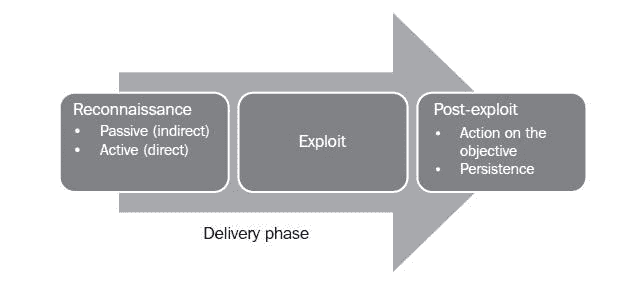

# 前言

本书致力于使用 Kali Linux 对网络进行渗透测试。渗透测试模拟了恶意的外部或内部人员对网络或系统的攻击。与漏洞评估不同，渗透测试旨在包括利用阶段。因此，它证明了利用是存在的，并且伴随着非常真实的被攻击的风险，如果不加以处理。

### 注意

在本书中，我们将“渗透测试人员”、“攻击者”和“黑客”互换使用，因为他们使用相同的技术和工具来评估网络和数据系统的安全性。他们之间唯一的区别是他们的最终目标——一个安全的数据网络，或者数据泄露。

大多数测试人员和攻击者遵循非正式的、开源的或专有的定义的测试方法，指导测试过程。遵循方法论有一定的优势：

+   方法确定了测试过程中可以自动化的部分（例如，测试人员可能总是使用 ping 扫描来识别潜在目标；因此，这可以被脚本化），允许测试人员专注于发现和利用漏洞的创造性技术

+   结果是可重复的，允许它们随时间进行比较，或者交叉验证一个测试人员的结果与另一个测试人员的结果，或者确定目标的安全性随时间改善（或没有！）。

+   定义好的方法论在时间和人员需求方面是可预测的，可以控制和最小化成本

+   已经得到客户预先批准的方法，可以保护测试人员免受网络或数据损害的责任

正式的方法包括以下著名的例子：

+   **Kevin Orrey 的渗透测试框架**：该方法论指导测试人员按顺序进行渗透测试的步骤，并提供工具和相关命令的超链接。更多信息可以在[www.vulnerabilityassessment.co.uk](http://www.vulnerabilityassessment.co.uk)找到。

+   **信息系统安全评估框架（ISSAF）**：这个全面的指南旨在成为测试网络的单一来源。更多信息可以在[www.oissg.org](http://www.oissg.org)找到。

+   **NIST SP 800-115，信息安全测试和评估技术指南**：这是 2008 年编写的，四步方法有些过时。然而，它确实提供了渗透测试基本步骤的良好概述。你可以在[`csrc.nist.gov/publications/nistpubs/800-115/SP800-115.pdf`](http://csrc.nist.gov/publications/nistpubs/800-115/SP800-115.pdf)获得更多信息。

+   **开放源安全测试方法手册（OSSTMM）**：这是较早的方法之一，最新版本试图量化确定的风险。更多细节可以在[www.osstmm.org](http://www.osstmm.org)找到。

+   **开放 Web 应用安全项目（OWASP）**：这个项目专注于 Web 应用程序中最常见的 10 个漏洞。更多信息可以在[www.owasp.org](http://www.owasp.org)找到。

+   **渗透测试执行标准（PTES）**：这个方法论是经过积极维护的，完整地准确反映了恶意人员的活动。你可以在[www.pentest-standard.org](http://www.pentest-standard.org)获得更多信息。

+   **攻击性（Web）测试框架（OWTF）**：该框架于 2012 年推出，将 OWASP 方法与更完整严格的 PTES 方法相结合，是一个非常有前途的方向。更多细节可以在[`github.com/7a/owtf`](https://github.com/7a/owtf)找到。

不幸的是，使用结构化的方法可能会在测试过程中引入弱点：

+   方法很少考虑进行渗透测试的原因，或者业务中哪些数据是关键的，需要受到保护。在缺乏这一重要的第一步的情况下，渗透测试失去了焦点。

+   许多渗透测试人员不愿意遵循定义的方法论，担心这会阻碍他们在利用网络方面的创造力。

+   渗透测试未能反映恶意攻击者的实际活动。客户经常希望看到您是否能够在特定系统上获得管理访问权限（“您能够获取系统的 root 权限吗？”）。然而，攻击者可能专注于以不需要 root 访问权限的方式复制关键数据，或者造成拒绝服务。

为了解决正式测试方法中固有的限制，它们必须集成在一个从攻击者的角度看待网络的框架中，“杀伤链”。

# 渗透测试的“杀伤链”方法

2009 年，洛克希德·马丁公司 CERT 的 Mike Cloppert 提出了现在被称为“攻击者杀伤链”的概念。这包括对手在攻击网络时采取的步骤。它并不总是按线性流程进行，因为一些步骤可能同时发生。可能会在同一目标上随时间启动多次攻击，并且可能同时发生重叠阶段。

在本书中，我们修改了 Cloppert 的杀伤链，以更准确地反映攻击者在利用网络和数据服务时如何应用这些步骤。以下图表显示了攻击者的典型杀伤链：



攻击者的典型杀伤链可以描述如下：

+   **侦察阶段** - 大多数军事组织采用的格言“侦察时间永远不会浪费时间”承认在与敌人交战之前尽可能多地了解敌人是更好的。出于同样的原因，攻击者在攻击之前将对目标进行广泛的侦察。事实上，据估计，至少 70％的渗透测试或攻击的“工作任务”都花在进行侦察上！通常，他们将使用两种类型的侦察：

+   **被动侦察** - 这不会以敌对的方式直接与目标互动。例如，攻击者将查看公开可用的网站，评估在线媒体（尤其是社交媒体网站），并尝试确定目标的“攻击面”。

一个特定的任务将是生成过去和现在员工姓名的列表。这些姓名将成为暴力破解或猜测密码的尝试的基础。它们也将用于社会工程攻击。

这种类型的侦察很难，甚至不可能与常规用户的行为区分开来。

+   **主动侦察** - 这可以被目标检测到，但很难将大多数在线组织的面孔与常规背景区分开来。

在主动侦察期间发生的活动包括对目标场所的实际访问、端口扫描和远程漏洞扫描。

+   **交付阶段** - 交付是选择和开发将用于攻击期间完成利用的武器。选择的确切武器将取决于攻击者的意图以及交付途径（例如，通过网络、无线或通过基于 Web 的服务）。交付阶段的影响将在本书的后半部分进行检查。

+   **利用或妥协阶段** - 这是特定利用成功应用的时刻，允许攻击者达到他们的目标。妥协可能发生在单个阶段（例如，利用已知的操作系统漏洞使用缓冲区溢出），也可能是多阶段妥协（例如，攻击者物理访问场所窃取公司电话簿。这些姓名被用来创建用于针对门户登录的暴力攻击的列表。此外，向所有员工发送电子邮件，要求点击嵌入链接以下载篡改其计算机的 PDF 文件。）。当恶意攻击者针对特定企业时，多阶段攻击是常态。

+   **利用后：对目标的行动** - 这经常被错误地称为“外泄阶段”，因为人们只关注将攻击视为窃取敏感数据（如登录信息、个人信息和财务信息）的途径；攻击者可能有不同的目标。例如，一家企业可能希望在竞争对手的网络中造成拒绝服务，以吸引客户访问自己的网站。因此，这个阶段必须关注攻击者的许多可能行动。

最常见的利用活动之一是，攻击者试图提高他们的访问权限到最高可能的水平（垂直升级），并妥协尽可能多的帐户（水平升级）。

+   **利用后：持久性** - 如果妥协网络或系统具有价值，那么如果可以持续访问，这个价值很可能会增加。这使攻击者能够与被妥协的系统保持通信。从防御者的角度来看，这通常是最容易检测到的 kill chain 的部分。

Kill chains 是攻击者在试图 compromise 网络或特定数据系统时的行为元模型。作为元模型，它可以包含任何专有或商业渗透测试方法。然而，与方法论不同的是，它确保了对攻击者如何接近网络的战略级关注。对攻击者活动的关注将指导本书的布局和内容。

# 本书涵盖的内容

本书分为两个部分。在第一部分中，*攻击者的 Kill Chain*，我们将按照 kill chain 的步骤，详细分析每个阶段。在第二部分中，*交付阶段*，我们将专注于交付阶段和一些可用的方法，以了解攻击是如何发生的，以及如何利用这些知识来保护网络。

第一章, *开始使用 Kali Linux*，向读者介绍了 Kali Linux 的基础知识，以及支持渗透测试的最佳配置。

第二章, *确定目标-被动侦察*，提供了如何利用公开可用的来源收集有关目标的信息以及可以简化侦察和信息管理的工具的背景。

第三章, *主动侦察和漏洞扫描*，向读者介绍了可以用来获取有关目标的信息的隐秘方法，特别是识别可能被利用的漏洞的信息。

第四章, *利用*，演示了可以用来查找和执行允许攻击者妥协系统的利用的方法。

第五章，“后期利用-对目标的行动”，描述了攻击者如何提升其权限以实现其对系统的妥协目标，包括窃取数据、更改数据、发动额外攻击或创建拒绝服务。

第六章，“后期利用-持久性”，提供了如何配置被攻陷的系统，以便攻击者可以随意返回并继续后期利用活动的背景知识。

第七章，“物理攻击和社会工程”，演示了为什么能够物理访问系统或与管理系统的人类进行交互提供了最成功的利用途径。

第八章，“利用无线通信”，演示了如何利用常见的无线连接来访问数据网络和隔离系统。

第九章，“对基于 Web 的应用程序进行侦察和利用”，提供了一个简要概述，即如何保护最复杂的交付阶段之一：暴露在公共互联网上的基于 Web 的应用程序。

第十章，“利用远程访问通信”，提供了一个越来越重要的进入系统的途径，因为越来越多的组织采用依赖于远程访问通信的分布式和远程办公模式，这些通信本身容易受到攻击。

第十一章，“客户端利用”，重点介绍了针对最终用户系统上的应用程序的攻击，这些系统通常没有得到与组织主要网络相同程度的保护。

附录，“安装 Kali Linux”，提供了如何安装 Kali Linux 以及如何使用整个磁盘加密来避免机密测试数据被拦截的概述。

# 本书需要什么

为了实践本书中提出的材料，您将需要诸如 VMware 或 VirtualBox 之类的虚拟化工具。

您将需要下载和配置 Kali Linux 操作系统及其套件工具。为了确保其是最新的，并且您拥有所有工具，您将需要接入互联网。

遗憾的是，Kali Linux 系统上的并非所有工具都会被介绍，因为它们太多了。本书的重点不是让读者被所有工具和选项淹没，而是提供一种测试方法，让他们有机会随着经验和知识的变化学习和整合新的工具。

尽管本书中大多数示例都集中在 Microsoft Windows 上，但方法和大多数工具都可以转移到其他操作系统，如 Linux 和其他 Unix 版本。

最后，本书应用 Kali 来完成对目标系统的攻击链。您将需要一个目标操作系统。本书中的许多示例使用 Microsoft Windows XP。尽管它在 2014 年 4 月已被弃用，但它为许多工具提供了标准行为的“基线”。如果您知道如何将方法应用于一个操作系统，您就可以将其应用于更近期的操作系统，如 Windows 7 和 Windows 8。

# 本书适合谁

本书适用于想要了解更多关于数据安全的人。特别是，它针对的是那些想要了解在使用特定工具时*为什么*使用它们的人，而不是那些试图尽可能多地向系统投放工具以查看是否会发生漏洞利用的人。我的目标是让读者制定自己的方法和途径进行有效的渗透测试，这将使他们在进步的过程中进行实验和学习。我相信这种方法是了解恶意人员如何攻击数据系统的唯一有效方式，因此也是了解如何在漏洞被利用之前进行调解的唯一方式。

如果您是安全专业人士、渗透测试人员，或者对复杂数据环境的安全感兴趣，那么这本书适合您。

# 约定

在本书中，您会发现一些文本样式，用于区分不同类型的信息。以下是一些样式的示例，以及它们的含义解释。

文本中的代码词、数据库表名、文件夹名、文件名、文件扩展名、路径名、虚拟 URL、用户输入和 Twitter 句柄都显示如下：“在这种情况下，VM 被分配了 IP 地址`192.168.204.132`。”

代码块设置如下：

```
# MSF port scanner
onhost_add {
  println("[*] MSF Port Scanner New Host OpenPorts on$1");
  $console = console();
  cmd($console, "use auxiliary/scanner/portscan/tcp");
  cmd($console, "set THREADS 12");
  cmd($console, "set PORTS 139, 143");
  # enter other ports as required
  cmd($console, "set RHOSTS $1");
  cmd($console, "run -j");
  cmd($console, "use auxiliary/scanner/discovery/udp_sweep");
  cmd($console, "set THREADS 12");
  cmd($console, "set BATCHSIZE 256");
  cmd($console, "set RHOSTS $1");
  cmd($console, "run -j");
  db_sync(); 
}
```

任何命令行输入或输出都以以下形式编写：

```
root@kali~# update-rc.d networking defaults

```

**新术语**和**重要单词**以粗体显示。例如，屏幕上显示的单词，菜单或对话框中的单词等，都会以这种形式出现在文本中：“如果您双击**truecrypt1**图标，您将进入**文件浏览器**视图。”

### 注意

警告或重要说明会以以下形式出现在方框中。

### 提示

技巧和窍门会以以下形式出现。
