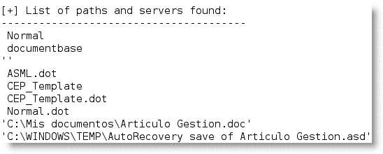

# 第二章：识别目标-被动侦察

侦察是进行渗透测试或对网络或服务器目标进行攻击时的杀伤链的第一步。攻击者通常会将渗透测试的整体工作量的高达 75%用于侦察，因为正是这个阶段允许定义、映射和探索漏洞，最终导致利用。

有两种类型的侦察：**被动侦察**和**主动侦察**。

通常，被动侦察涉及分析公开可用的信息，通常来自目标本身或在线公共来源。在访问这些信息时，测试人员或攻击者不会以异常的方式与目标进行交互——请求和活动不会被记录，或者不会直接追踪到测试人员。因此，首先进行被动侦察以最小化可能会发出即将发动攻击的信号或识别攻击者的直接接触。

在本章中，您将学习被动侦察的原则和实践，包括以下内容：

+   侦察的基本原则

+   **开源情报**（**OSINT**）

+   DNS 侦察和路由映射，包括 IPv4 和 IPv6 的问题

+   获取用户信息

+   为密码列表创建用户档案

直接与目标进行互动的主动侦察将在第三章中进行介绍，*主动侦察和漏洞扫描*。

# 侦察的基本原则

侦察，或者 recon，在对数据目标进行渗透测试或攻击时是杀伤链的第一步。这是在实际测试或攻击目标网络之前进行的。调查结果将指导需要进行额外侦察的方向，或者在利用阶段攻击的漏洞。

侦察活动在与目标网络或设备的互动程度梯度上进行分段。


被动侦察不涉及与目标网络的直接互动。攻击者的源 IP 地址和活动不会被记录（例如，对目标电子邮件地址进行谷歌搜索）。目标很难，甚至不可能将被动侦察与正常业务活动区分开来。

一般来说，被动侦察侧重于商业和监管环境、公司和员工。这类信息可以在互联网或其他公共来源获取，有时被称为开源情报，或者 OSINT。

+   被动侦察还涉及攻击者以预期方式与目标进行的正常互动。例如，攻击者将登录企业网站，查看各种页面，并下载文件以供进一步研究。这些互动是预期的用户活动，很少被检测为对目标进行攻击的前兆。

+   主动侦察涉及直接查询或其他互动（例如，对目标网络进行端口扫描），可能会触发系统警报或允许目标捕获攻击者的 IP 地址和活动。这些信息可以用于识别和逮捕攻击者，或者在法律诉讼中使用。因为主动侦察需要测试人员采取额外的技术来保持不被发现，所以将在第三章中进行介绍，*主动侦察和漏洞扫描*。

渗透测试人员或攻击者通常遵循结构化信息收集的过程，从广泛范围（商业和监管环境）到非常具体（用户帐户数据）。

为了有效，测试人员在收集开始之前应该清楚知道他们在寻找什么以及数据将如何使用。使用被动侦察并限制收集的数据量可以最大程度地减少被目标发现的风险。

# 开源情报

一般来说，渗透测试或攻击的第一步是收集开源情报，或者 OSINT。

OSINT 是从公共来源，特别是互联网上收集的信息。可用信息的数量是相当可观的——大多数情报和军事组织都在积极从事 OSINT 活动，以收集有关他们的目标的信息，并防范有关他们的数据泄漏。

OSINT 收集和分析的过程是复杂的，可能构成一本书；因此，我们只会涵盖基本要点。

### 提示

美国陆军手册 ATP 2-22.9（[`www.fas.org/irp/doddir/army/atp2-22-9.pdf`](http://www.fas.org/irp/doddir/army/atp2-22-9.pdf)）和北约 OSINT 手册（[`information-retrieval.info/docs/NATO-OSINT.html`](http://information-retrieval.info/docs/NATO-OSINT.html)）都可以在线获取，并提供了如何收集和评估 OSINT 的出色技术评论。

针对收集的信息取决于渗透测试的初始目标。例如，如果测试人员想要访问财务数据，他们将需要相关员工（CFO、应收和应付账款等）的姓名和生物信息，他们的用户名和密码。如果攻击的途径涉及社会工程，他们可能会补充这些信息，以使信息请求更加可信。

OSINT 收集通常从审查目标的官方在线存在开始（网站、博客、社交媒体页面和第三方数据存储库，如公共财务记录）。感兴趣的信息包括以下内容：

+   办公室的地理位置，特别是共享企业信息但可能缺乏严格安全控制的远程或卫星办公室。

+   母公司和任何子公司的概述，特别是通过合并或收购获得的任何新公司（这些公司通常没有母公司安全）。

+   员工姓名和联系信息，特别是姓名、电子邮件地址和电话号码。

+   有关企业文化和语言的线索；这将有助于社会工程攻击。

+   可能连接到目标网络的商业伙伴或供应商。

+   使用的技术。例如，如果目标发布了关于采用新设备或软件的新闻稿，攻击者将会查看供应商的网站，寻找漏洞报告、已知或疑似的漏洞，以及可能用于促成各种攻击的详细信息。

攻击者可能使用的其他在线信息来源包括以下内容：

+   谷歌和必应等搜索引擎。从历史上看，这些搜索是高度手动的；攻击者输入特定于感兴趣信息的搜索词；例如，搜索词“公司名称”+密码 filetype:xls 可能会识别出包含员工密码的 Excel 电子表格。这些搜索词被称为**谷歌 dorks**（[www.exploit-db.com/google-dorks/](http://www.exploit-db.com/google-dorks/)）。大多数搜索引擎已经发布了 API 以便进行自动查找，使得诸如**Maltego**之类的工具特别有效。

### 提示

最有效的搜索引擎之一是**Yandex**（[www.yandex.com](http://www.yandex.com)）。这家俄语搜索引擎是世界第四大搜索引擎，允许用户用多种语言进行搜索，包括英语。它还支持非常精细的搜索表达式，使其在搜索特定信息时比谷歌更有效。

其他应该搜索的在线来源包括：

+   提供有关合并和收购、关键人员姓名和支持数据的政府、金融或其他监管网站。

+   Usenet 新闻组，特别是目标员工寻求特定技术帮助的帖子

+   提供员工信息的 LinkedIn、Jigsaw 和其他网站

+   求职网站，特别是提供成功申请者必须支持的技术和服务列表的技术职位

+   通过搜索引擎检索的历史或缓存内容（在 Google 中的 cache:url，或在[www.archive.org](http://www.archive.org)的 WayBack Machine）

+   特定国家和语言的社交和业务相关网站（参考[`searchenginecolossus.com`](http://searchenginecolossus.com)）

+   聚合和比较多个搜索引擎结果的网站，如 Zuula（[www.zuula.com](http://www.zuula.com)）

+   企业和员工博客，以及关键员工的个人博客

+   社交网络（LinkedIn、Facebook 和 Twitter）

+   提供 DNS、路由和服务器信息查找的网站，特别是 DNSstuff（[www.dnsstuff.com](http://www.dnsstuff.com)）、ServerSniff（[www.serversniff.net](http://www.serversniff.net)）、Netcraft（[www.netcraft.com](http://www.netcraft.com)）和[myIPneighbors.com](http://myIPneighbors.com)

+   Shodan（[www.shodanHQ.com](http://www.shodanHQ.com)），有时被称为“黑客的谷歌”；Shodan 列出了可通过互联网访问的设备，并允许测试人员搜索已知漏洞的设备

+   密码转储站点（pastebin，使用`site:pastebin.com "targetURL"`进行搜索）

管理发现可能很困难；然而，Kali 配备了 KeepNote，支持快速导入和管理不同类型的数据。

# DNS 侦察和路由映射

一旦测试人员确定了具有在线存在并包含感兴趣项目的目标，下一步就是确定目标的 IP 地址和路由。

DNS 侦察涉及确定谁拥有特定的域或一系列 IP 地址（`whois`类型的信息），定义实际域名和 IP 地址分配给目标的 DNS 信息，以及穿透测试人员或攻击者与最终目标之间的路由。

这种信息收集是半主动的——一些信息来自免费开放的来源，而其他信息来自 DNS 注册商等第三方。尽管注册商可能收集攻击者的 IP 地址和请求相关的数据，但很少提供给最终目标。目标可以直接监控的信息，例如 DNS 服务器日志，几乎从不被审查或保留。

因为所需的信息可以使用定义的系统化和有条理的方法查询，所以可以自动收集这些信息。

### 提示

请注意，DNS 信息可能包含过时或不正确的条目。为了最小化不准确的信息，查询不同的源服务器并使用不同的工具来交叉验证结果。审查结果，并手动验证任何可疑的发现。使用脚本自动收集这些信息。脚本应该为渗透测试创建一个文件夹，然后为每个运行的应用程序创建一系列文件夹。在脚本执行每个命令后，将结果直接传送到特定的保存文件夹。

## WHOIS

研究 IP 地址空间的第一步是确定分配给目标站点的地址。通常使用`whois`命令来完成这一步，该命令允许人们查询存储有关互联网资源的注册用户信息的数据库，例如域名或 IP 地址。

根据查询的数据库，对`whois`请求的响应将提供姓名、地址、电话号码和电子邮件地址（有助于促进社会工程攻击），以及 IP 地址和 DNS 服务器名称。

攻击者可以使用`whois`查询的信息来：

+   支持对查询中确定的位置或人员进行社会工程攻击

+   确定进行物理攻击的位置

+   识别可用于**战争拨号**攻击的电话号码，或进行社会工程攻击

+   进行递归搜索，以查找与目标托管在同一服务器上或由同一用户操作的其他域；如果它们不安全，攻击者可以利用它们来获得对服务器的管理访问权限，然后妥协目标服务器

+   在域名即将到期的情况下，攻击者可以尝试夺取该域名，并创建一个类似的网站来妥协那些认为自己在原始网站上的访问者

+   攻击者将使用权威 DNS 服务器，这些服务器是用于查找该域的记录，以促进 DNS 侦察

请注意，第三方用于保护这些数据的使用增加了，并且一些域，如`.gov`和`.mil`，可能无法访问公共域。对这些域的请求通常会被记录。有几个在线列表可用于描述分配给政府使用的域和 IP 地址；大多数工具接受“无联系”地址的选项，并且政府域应该输入这些字段以避免错误类型的关注！

发出`whois`查询的最简单方法是从命令行。以下屏幕截图显示了对 Digital Defence 域运行的`whois`命令：


返回的`whois`记录包含地理信息、名称和联系信息，所有这些都可以用来促进社会工程攻击。

有几个网站可以自动化`whois`查询，攻击者可以使用这些网站在目标和自己之间插入一步；然而，进行查询的网站可能会记录请求者的 IP 地址。

## DNS 侦察

**域名系统**（**DNS**）是一个分布式数据库，将名称（[www.digitaldefence.ca](http://www.digitaldefence.ca)）解析为其 IP 地址（`192.150.2.140`）。

攻击者使用 DNS 信息的以下方式：

+   使用暴力攻击，允许攻击者识别与目标相关的新域名。

+   如果 DNS 服务器配置为允许任何请求者进行区域传输，它将提供互联网可访问系统的主机名和 IP 地址，从而更容易识别潜在目标。如果目标没有将公共（外部）DNS 信息与私有（内部）DNS 信息分开，区域传输可能会公开内部设备的主机名和 IP 地址。（请注意，如果触发区域传输请求，大多数 IDS 和 IPS 系统将触发警报）。

+   查找可能容易受攻击（例如 FTP）或其他有趣的服务（远程管理面板和远程访问）。

+   查找配置错误和/或未打补丁的服务器（`dbase.test.target.com`）。

+   **服务记录**（**SRV**）提供有关服务、传输、端口和服务重要性顺序的信息。这可以让攻击者推断出软件。

+   **DomainKeys Identified Mail**（**DKIM**）和**Sender Policy Framework**（**SPF**）记录用于控制垃圾邮件。如果识别出这些记录，攻击者会知道：

+   他们比大多数组织更注重安全。

+   这可能会影响网络钓鱼和其他社会工程攻击。

Windows 和 Unix 都支持基本的命令行工具，如**nslookup**，而 Unix 系统支持额外的命令行选项，如`dig`。不幸的是，这些命令通常一次只询问一个服务器，并且需要交互式响应才能有效。

Kali 具有几个旨在迭代地查询特定目标的 DNS 信息的工具。所选工具必须适应与目标进行通信的互联网协议版本——IPv4 或 IPv6。

### IPv4

IP 地址，或者互联网协议地址，是用来识别连接到私人网络或公共互联网的设备的唯一数字。今天，互联网主要基于版本 4，即 IPv4。Kali 包括几个工具来促进 DNS 侦察，如下表所示：

| 应用 | 描述 |
| --- | --- |
| `dnsenum`，`dnsmap`和`dnsrecon` | 这些是全面的 DNS 扫描器——DNS 记录枚举（A，MX，TXT，SOA，通配符等），子域暴力攻击，Google 查找，反向查找，区域传输和区域遍历。`dsnrecon`通常是第一选择——它非常可靠，结果被很好地解析，并且数据可以直接导入 Metasploit 框架。 |
| `dnstracer` | 这确定给定域名系统从哪里获取其信息，并跟随 DNS 服务器链返回到知道数据的服务器。 |
| `dnswalk` | 这个 DNS 调试器检查指定的域名的内部一致性和准确性。 |
| `fierce` | 通过尝试区域传输，然后尝试暴力攻击以获取 DNS 信息，来定位指定域名的非连续 IP 空间和主机名。 |

在测试过程中，大多数调查员运行`fierce`来确认已经识别出所有可能的目标，然后运行至少两个综合工具（例如`dnsenum`和`dnsrecon`）来生成最大量的数据，并提供一定程度的交叉验证。

在下面的屏幕截图中，`dnsrecon`用于生成标准的 DNS 记录搜索，以及特定于 SRV 记录的搜索。每种情况下都显示了部分结果。


`DNSrecon`允许渗透测试人员获取 SOA 记录、**域名服务器**（**NS**）、使用**发件人策略框架**（SPF）发送电子邮件的服务器，以及正在使用的 IP 地址范围。

### IPv6

尽管 IPv4 似乎允许一个大的地址空间，但几年前已经耗尽了可用的 IP 地址，迫使采用 NAT 和 DHCP 来增加可用地址的数量。在 IPv6 的改进 IP 地址方案的采用中找到了一个更为永久的解决方案。尽管它只占互联网地址的不到五分之一，但它的使用率正在增加，渗透测试人员必须准备好应对 IPv4 和 IPv6 之间的差异。

在 IPv6 中，源地址和目的地址的长度为 128 位，可以产生 2128 个可能的地址，也就是 340 个不可思议的地址！

可寻址地址空间的增加大小给渗透测试人员带来了一些问题，特别是在使用扫描器遍历可用地址空间寻找活动服务器时。然而，IPv6 协议的一些特性已经简化了发现，特别是使用 ICMPv6 来识别活动的链路本地地址。

在进行初始扫描时考虑 IPv6 是很重要的，原因如下：

+   测试工具对 IPv6 功能的支持不均衡，因此测试人员必须确保每个工具都经过验证，以确定其在 IPv4、IPv6 和混合网络中的性能和准确性。

+   因为 IPv6 是一个相对较新的协议，目标网络可能包含泄露重要数据的错误配置；测试人员必须准备好识别和利用这些信息。

+   旧的网络控制（防火墙、IDS 和 IPS）可能无法检测到 IPv6。在这种情况下，渗透测试人员可以使用 IPv6 隧道来与网络保持隐蔽通信，并且无法被检测到地泄露数据。

Kali 包括几个专门用于利用 IPv6 的工具（大多数综合扫描器，如`nmap`，现在支持 IPv6），其中一些如下；专门用于 IPv6 的工具主要源自 THC-IPv6 攻击工具包。

| 应用 | 描述 |
| --- | --- |
| `dnsdict6` | 使用基于提供的字典文件或其自己的内部列表的暴力搜索，列举子域以获取 IPv4 和 IPv6 地址（如果存在）。 |
| `dnsrevenum6` | 给定 IPv6 地址，执行反向 DNS 枚举。 |

下面的屏幕截图显示了`dnsdict6`命令的执行：


## 映射到目标的路线

路由映射最初是作为一种诊断工具使用的，它允许您查看 IP 数据包从一个主机到下一个主机的路径。使用 IP 数据包中的**生存时间**（**TTL**）字段，从一个点到下一个点的每个*跳*都会从接收路由器那里引发一个**ICMP TIME_EXCEEDED**消息，将 TTL 字段中的值减少 1。数据包计算跳数和路径。 

从攻击者或渗透测试人员的角度来看，`traceroute`数据提供了以下重要数据：

+   攻击者和目标之间的确切路径

+   有关网络外部拓扑的提示

+   识别访问控制设备（防火墙和数据包过滤路由器）可能正在过滤攻击流量

+   如果网络配置错误，可能会识别内部寻址

### 提示

使用基于 Web 的`traceroute`（[www.traceroute.org](http://www.traceroute.org)），可以追踪各种地理起源站点到目标网络。这些类型的扫描通常会识别连接到目标的多个不同网络，这是仅从靠近目标的位置进行单个`traceroute`可能会错过的信息。基于 Web 的`traceroute`还可以识别连接两个或更多网络的多宿主机。这些主机是攻击者的重要目标，因为它们大大增加了导致目标的攻击面。

在 Kali 中，`traceroute`是一个使用 ICMP 数据包映射路由的命令行程序；在 Windows 中，该程序是`tracert`。

如果您从 Kali 启动`traceroute`，很可能会看到大多数跳数被过滤（数据显示为* * *）。例如，从作者目前的位置到[www.google.com](http://www.google.com)的`traceroute`将产生以下结果：


然而，如果使用 Windows 命令行运行`tracert`相同的请求，我们会看到以下内容：


我们不仅可以获得完整的路径，还可以看到[www.google.com](http://www.google.com)解析为稍有不同的 IP 地址，表明负载均衡器正在生效（您可以使用 Kali 的`lbd`脚本来确认这一点；但是，这种活动可能会被目标站点记录）。

不同路径数据的原因是，默认情况下，`traceroute`使用 UDP 数据包，而 Windows 的`tracert`使用 ICMP echo 请求（ICMP 类型 8）。因此，使用 Kali 工具完成`traceroute`时，重要的是使用多个协议以获得最完整的路径，并绕过数据包过滤设备。

Kali 提供以下工具来完成路由跟踪： 

| 应用程序 | 描述 |
| --- | --- |
| `hping3` | 这是一个 TCP/IP 数据包组装器和分析器。它支持 TCP、UDP、ICMP 和原始 IP，并使用类似 ping 的界面。 |
| `intrace` | 这使用户能够通过利用现有的 TCP 连接枚举 IP 跳数，这些连接可以来自本地系统或网络，也可以来自本地主机。这使得它非常有用，可以绕过外部过滤器，如防火墙。`intrace`是不太可靠的 0trace 程序的替代品。 |
| `trace6` | 这是一个使用 ICMP6 的`traceroute`程序。 |

`hping3`是最有用的工具之一，因为它可以控制数据包类型、源数据包和目标数据包。例如，谷歌不允许 ping 请求。但是，如果将数据包发送为 TCP SYN 请求，则可以 ping 服务器。

在下面的示例中，测试人员尝试从命令行 ping 谷歌。返回的数据表明[www.google.com](http://www.google.com)是一个未知的主机；谷歌显然正在阻止基于 ICMP 的 ping 命令。然而，下一个命令调用`hping3`，指示它执行以下操作：

1.  使用设置了 SYN 标志的 TCP 向谷歌发送类似 ping 的命令（`-S`）。

1.  将数据包定向到端口 80；这种类型的合法请求很少被阻止（`- p 80`）。

1.  设置发送三个数据包到目标的计数（`-c 3`）。

要执行前面的步骤，请使用以下截图中显示的命令：


`hping3`命令成功识别目标在线，并提供一些基本的路由信息。

# 获取用户信息

许多渗透测试人员收集用户名称和电子邮件地址，因为这些信息经常用于登录到目标系统。

最常用的工具是网络浏览器，用于手动搜索目标组织的网站以及 LinkedIn 或 Jigsaw 等第三方网站。

Kali 中包含的一些自动化工具可以补充手动搜索。

### 提示

前员工的电子邮件地址仍然可能有用。在进行社会工程攻击时，将信息请求引导到前员工通常会导致重定向，使攻击者获得与之前员工打交道的“可信度”。此外，许多组织未能正确终止员工帐户，这些凭据可能仍然可以访问目标系统。

## 收集姓名和电子邮件地址

`theharvester` 工具是一个 Python 脚本，通过流行的搜索引擎和其他网站搜索电子邮件地址、主机和子域。

使用 `theharvester` 相对简单，因为只有几个命令开关需要设置。可用的选项包括：

+   `-d`：这标识要搜索的域；通常是域或目标网站。

+   `- b`：这标识提取数据的来源；必须是以下之一：

必应、BingAPI、谷歌、谷歌-配置文件、Jigsaw、LinkedIn、People123、PGP 或全部

+   `- l`：此限制选项指示 `theharvester` 仅从返回的搜索结果中收集指定数量的数据。

+   `-f`：此选项用于将最终结果保存到 HTML 和 XML 文件中。如果省略此选项，结果将显示在屏幕上而不保存。

以下截图显示了对 [digitaldefence.ca](http://digitaldefence.ca) 域的谷歌索引进行简单搜索的结果：


## 收集文档元数据

文档元数据是指附加到文档中的信息，以便应用程序在创建和存储过程中对其进行管理。通常附加到文档的元数据示例包括以下内容：

+   创建文档的计算机网络上的位置

+   文档的作者姓名

+   文档创建的时间和日期

+   文件最后打印或修改的日期；在某些情况下，它将确定谁进行了修改

+   创建文档的计算机网络上的位置

+   某些文件，特别是由相机或移动设备创建的文件，可能包含地理标记，用于标识图像创建的位置

元数据对最终用户不是立即可见的，因此大多数文档都以元数据完整的形式发布。不幸的是，这种数据泄漏可能会透露出可以被测试人员或攻击者用来促成攻击的信息。至少，测试人员和攻击者可以通过将其与文档中的数据进行比较来收集用户名；他们可以识别与特定数据类型相关联的人，例如年度财务报告或战略规划。

随着移动设备变得更加普遍，与地理元数据相关的风险也在增加。攻击者寻找经常访问的地点（度假屋、酒店和餐馆），这些地点可能使他们能够针对在公司边界之外放松警惕的用户发动攻击。例如，如果目标组织的员工经常在社交媒体网站上发布等待通勤火车的照片，攻击者可能会针对该员工进行实体攻击（盗窃移动设备）、无线攻击，甚至偷看受害者的用户名和密码。

在 Kali 上，工具 `Metagoofil` 执行谷歌搜索，以识别并下载目标网站的文档（doc、docx、pdf、pptx、xls 和 xlsx），并提取用户名、软件版本、路径存储名称以及服务器或工作站名称，如下图所示：


`Metagoofil`将指定数量的文档下载到临时文件夹，并提取和整理相关的元数据。它还针对先前下载并现在存储在本地的文件执行此功能。

`Metagoofil`的第一个返回之一是找到的用户列表。以下是一个截断列表的截图：


`Metagoofil`还识别文档的服务器和路径名。如果某些感兴趣的文档是与特定用户定位的（例如，在行政助理的工作站上找到的财务报告草稿），那么该系统可以在测试期间稍后被定位为目标，如下图所示：



# 为密码列表对用户进行个人资料分析

到目前为止，您已经学会了使用被动侦察来收集目标测试用户的姓名和生物信息；这是黑客使用的相同过程。下一步是使用这些信息来创建特定于用户和目标的密码列表。

常用密码列表可供下载，并存储在 Kali 的`/usr/share/wordlists`目录中。这些列表反映了大量用户的选择，对于应用程序在移动到队列中的下一个密码之前尝试使用每个可能的密码可能需要很长时间。

幸运的是，**常用用户密码分析器**（**CUPP**）允许测试人员生成特定于特定用户的`wordlist`。CUPP 在 Backtrack 5r3 上存在；但是，在 Kali 上使用时需要下载。要获取 CUPP，请输入以下命令：

```
git clone https://github.com/Mebus/cupp.git

```

这将下载 CUPP 到本地目录。

CUPP 是一个 Python 脚本，可以通过在 CUPP 目录中输入以下命令来简单地调用：

```
root@kali:~# python cupp.py -i

```

这将在交互模式下启动 CUPP，提示用户使用特定信息元素来创建`wordlist`。以下是一个示例截图：


当交互模式完成创建`wordlist`时，它将放置在 CUPP 目录中。

# 摘要

攻击过程或杀链的第一步是进行侦察，以识别目标和潜在的攻击路径。被动侦察评估公开可用的数据。这是一种隐秘的评估——攻击者的 IP 地址或活动几乎无法与正常访问区分开。然而，当进行社会工程攻击或促进其他攻击类型时，这些信息可能是至关重要的。

在下一章中，我们将评估更积极的侦察类型。尽管这些技术产生了更多的信息，但检测风险增加了。因此，重点将放在高级隐身技术上。

