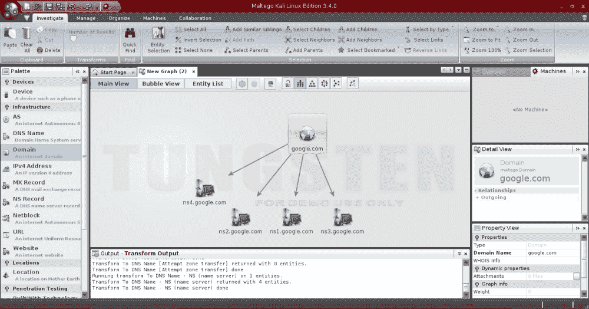
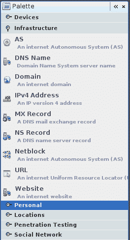

# 第三章：积极侦察和漏洞扫描

侦察阶段的目标是尽可能多地收集有关目标的信息，以便促进杀链的利用阶段。

我们已经看到，几乎不可检测的被动侦察可以为目标组织及其用户提供大量信息。

主动侦察建立在开源情报和被动侦察的结果之上，重点是使用探针来识别目标的路径和目标的暴露*攻击面*。一般来说，复杂的系统具有更大的攻击面，每个攻击面都可能被利用，然后被用来支持额外的攻击。

尽管主动侦察可以产生更多信息，更有用的信息，但与目标系统的交互可能会被记录，从而触发防护设备（如防火墙和入侵检测系统）的警报。随着数据对攻击者的有用性增加，被发现的风险也会增加；这在下图中有所体现：


为了提高主动侦察在提供详细信息方面的效果，我们的重点将放在使用隐秘或难以检测的技术上。

在本章中，您将学习：

+   隐身扫描策略

+   网络基础设施、主机发现和枚举

+   全面的侦察应用，特别是`recon-ng`

+   有针对性的漏洞扫描

# 隐身扫描策略

主动侦察的最大风险是被目标发现。使用测试人员的时间和数据戳、源 IP 地址和其他信息，目标可以确定传入侦察的来源。因此，采用隐身技术以最小化被发现的机会。

在使用隐身支持侦察时，模拟黑客行为的测试人员将执行以下操作：

+   伪装工具签名以避免被检测和触发警报

+   在合法流量中隐藏攻击

+   修改攻击以隐藏流量的来源和类型

+   使用非标准流量类型或加密使攻击不可见

隐身扫描技术可以包括以下一些或全部内容：

+   调整源 IP 堆栈和工具识别设置

+   修改数据包参数（`nmap`）

+   使用匿名网络的代理（ProxyChains 和 Tor 网络）

## 调整源 IP 堆栈和工具识别设置

在渗透测试人员（或攻击者）开始测试之前，必须确保 Kali 上的所有不必要的服务都已禁用或关闭。

例如，如果本地 DHCP 守护程序已启用且不需要，则可能会导致 DHCP 与目标系统交互，这可能会被记录并发送警报给目标的管理员。

大多数测试人员还会禁用在测试系统上运行的 IPv6。这将阻止 IPv6 在目标网络上宣布您的存在，并确保所有流量首先通过 IPv4 代理路由。禁用 IPv6 可以通过编辑`/etc/sysctl.conf`文件来实现，其中包括以下行：

```
#disable ipv6
  net.ipv6.conf.all.disable_ipv6 = 1
  net.ipv6.conf.default.disable_ipv6 = 1
  net.ipv6.conf.lo.disable = 1 

```

一些商业和开源工具（例如 Metasploit Framework）会对其数据包进行标记。尽管这在系统事件日志的后期分析中可能会有用（可以直接将特定测试工具发起的事件与系统事件日志进行比较，以确定网络如何检测和响应攻击），但也可能触发某些入侵检测系统。测试您的工具以确定哪些数据包被标记，并更改标记，或谨慎使用该工具。

识别标记的最简单方法是将工具应用于新创建的虚拟镜像作为目标，并查看工具名称的系统日志。此外，使用 Wireshark 捕获攻击者和目标虚拟机之间的流量，然后搜索**数据包捕获**（**pcap**）文件以查找可以归因于测试工具的任何关键字（工具名称、供应商、许可证号等）。

Metasploit Framework 中的`UserAgent`可以通过修改`http_form_field`选项来更改。从 msfconsole 提示符中，选择使用`auxiliary/fuzzers/http/http_form_field`选项，然后设置一个新的用户代理，如下图所示：


在此示例中，`UserAgent` 被设置为 Google 的索引蜘蛛，Googlebot。这是一个常见的自动应用程序，用于访问和索引网站，并且很少会引起网站所有者的注意。

### 注意

要识别合法的`UserAgents`，请参考[www.useragentstring.com](http://www.useragentstring.com)上的示例。

## 修改数据包参数

主动侦察的最常见方法是对目标进行扫描——向目标发送定义的数据包，然后使用返回的数据包获取信息。这种类型的最流行工具是**网络映射器**（**nmap**）。

要有效使用`nmap`，必须以 root 级别权限运行。这是操纵数据包的应用程序的典型特征，这也是为什么 Kali 在启动时默认为 root 的原因。

在尝试最小化检测时，一些隐秘技术以避免检测和随后的警报包括以下内容：

+   在测试之前确定扫描的目标，并发送最少数量的数据包以确定目标。例如，如果您希望确认 Web 主机的存在，首先需要确定端口 80 是否开放，这是用于基于 Web 的服务的默认端口。

+   避免可能连接到目标系统并泄露数据的扫描。不要对目标进行 ping 操作，也不要使用同步（SYN）和非常规数据包扫描，如确认（ACK）、完成（FIN）和重置（RST）数据包。

+   随机化或欺骗数据包设置，如源 IP 和端口地址以及 MAC 地址。

+   调整时间以减慢数据包到达目标站点的速度。

+   通过对数据包进行分片或附加随机数据来改变数据包大小，以混淆数据包检查设备。

例如，如果您想进行隐秘扫描并最小化检测，可以使用以下`nmap`命令：

```
#nmap --spoof-mac- Cisco --data-length 24 –T paranoid –max-hostgroup 1 – max-parallelism 10 -PN  -f –D 10.1.20.5,RND:5,ME --v –n –sS –sV–oA /desktop/pentest/nmap/out –p T:1-1024 –random-hosts 10.1.1.10 10.1.1.15

```

以下表格详细解释了上一个命令：

| 命令 | 原因 |
| --- | --- |
| `--spoof-mac-Cisco` | 伪装 MAC 地址以匹配思科产品。将`Cisco`替换为`0`将创建一个完全随机的 MAC 地址。 |
| `--data-length 24` | 在发送的大多数数据包中附加二十四个随机字节。 |
| `-T paranoid` | 将时间设置为最慢的设置——`paranoid`。 |
| `-- max-hostgroup` | 限制同时扫描的主机数量。 |
| `-- max-parallelism` | 限制发送的未完成探测的数量。您还可以使用`--scan-delay`选项设置探测之间的暂停；但是，此选项与`--max_parallelism`选项不兼容。 |
| `-PN` | 不进行 ping 以识别活动系统（这可能会泄需数据）。 |
| `-f` | 对数据包进行分片；这通常会欺骗低端和配置不当的 IDS。 |
| `-D 10.1.20.5, RND:5,ME` | 创建伪装扫描，与攻击者的扫描同时运行；隐藏实际攻击。 |
| `-n` | 不进行 DNS 解析；nmap 不会主动查询内部或外部 DNS 服务器以获取 DNS 信息。此类查询经常被记录，因此应禁用查询功能。 |
| `-sS` | 进行隐秘的 TCP SYN 扫描，不完成 TCP 握手。也可以使用其他扫描类型（例如 Null 扫描）；然而，这些大多数会触发检测设备。 |
| `-sV` | 启用版本检测。 |
| `-oA /desktop/pentest/nmap` | 输出结果到所有格式（普通、可搜索和 XML）。 |
| `-p T:1-1024` | 指定要扫描的 TCP 端口。 |
| `-- random-hosts` | 随机化目标主机顺序。 |

这些选项将创建一个隐藏源真实身份的非常缓慢的扫描。然而，如果数据包太不寻常，复杂的修改实际上可能会引起目标的注意；因此，许多测试人员和攻击者使用匿名网络来最小化检测。

## 使用匿名网络（Tor 和 Privoxy）的代理

**Tor** ([www.torproject.org](http://www.torproject.org))是第三代洋葱路由的开源实现，提供免费访问匿名代理网络。洋葱路由通过加密用户流量然后通过一系列洋葱路由器传输来实现在线匿名。在每个路由器处，会移除一层加密以获取路由信息，然后将消息传输到下一个节点。它被比喻为逐渐剥离洋葱的过程，因此得名。它通过保护用户 IP 流量的源和目的地来防范流量分析攻击。

在这个例子中，Tor 将与 Privoxy 一起使用，Privoxy 是一个非缓存的 Web 代理，*位于*与互联网通信的应用程序中间，并使用高级过滤来确保隐私并删除发送给测试人员的广告和潜在的敌对数据。

要安装 Tor，请执行以下步骤：

1.  发出`apt-get update`和`apt-get upgrade`命令，然后使用以下命令：

```
apt-get install tor

```

1.  安装 Tor 后，编辑位于`/etc`目录中的`Proxychains.conf`文件。

该文件规定了测试系统在通往 Tor 网络的途中将使用的代理的数量和顺序。代理服务器可能宕机，或者可能正在经历严重负载（导致连接缓慢或延迟）；如果发生这种情况，定义或严格的 proxychain 将失败，因为缺少预期的链接。因此，禁用`strict_chains`的使用，并启用`dynamic_chains`，以确保连接将被路由，如下面的屏幕截图所示：


1.  接下来，编辑`[ProxyList]`部分，确保`socks5`代理存在，如下面的屏幕截图所示：

可以在网上轻松找到开放代理并将其添加到`proxychains`文件中。测试人员可以利用这一点进一步混淆他们的身份。例如，如果有报告称某个国家或一系列 IP 地址最近负责在线攻击，可以在该位置寻找开放代理并将其添加到您的列表或单独的配置文件中。

1.  要从终端窗口启动 Tor 服务，请输入以下命令：

```
root@kali:~# service tor start

```

1.  使用以下命令验证 Tor 是否已启动：

```
root@kali:~# service tor status

```

1.  验证 Tor 网络是否正常工作并提供匿名连接非常重要。首先验证您的源 IP 地址。从终端输入以下命令：

```
root@kali:~# iceweasel www.whatismyip.com

```

这将启动 Iceweasel 浏览器，并打开一个网站，该网站提供与该网页连接的源 IP 地址。注意 IP 地址，然后使用以下`proxychains`命令调用 Tor 路由：

```
root@kali:~# proxychainsiceweasel www.whatismyip.com

```

在这种特定情况下，IP 地址被识别为`96.47.226.60`。从终端窗口对该 IP 地址进行`whois`查找表明，传输现在正在从 Tor 出口节点退出，如下面的屏幕截图所示：


您还可以通过访问[`check.torproject.org`](https://check.torproject.org)来验证 Tor 是否正常运行。

尽管通信现在受到 Tor 网络的保护，但可能会发生 DNS 泄漏，当您的系统发出 DNS 请求以向 ISP 提供您的身份时就会发生。您可以在[www.dnsleaktest.com](http://www.dnsleaktest.com)上检查 DNS 泄漏。

当您测试 DNS 泄漏时，Kali 的 proxychains 配置会以**美国**的**Level 3 Communications**服务器的默认源 IP 地址作出响应，如下面的屏幕截图所示。这为测试人员的身份提供了额外的保护。


大多数命令行可以使用`proxychains`从控制台运行以访问 Tor 网络。

使用 Tor 时，需要牢记以下一些考虑事项：

+   Tor 提供了匿名服务，但并不保证隐私。出口节点的所有者能够嗅探流量，并据报道可能能够访问用户凭据。

+   据报道，Tor 浏览器捆绑包中的漏洞曾被执法部门用来利用系统并获取用户信息。

+   ProxyChains 无法处理 UDP 流量。

+   一些应用程序和服务无法在这种环境下运行，特别是 Metasploit 和`nmap`可能会出错。`nmap`的隐秘 SYN 扫描会打破 proxychains，并且会调用连接扫描；这可能会向目标泄露信息。

+   一些浏览器应用程序（ActiveX、Adobe 的 PDF 应用程序、Flash、Java、RealPlay 和 QuickTime）可以用来获取您的 IP 地址。

+   确保在浏览之前清除和阻止 cookie。

### 提示

Tor-Buddy 脚本允许您控制 Tor IP 地址刷新的频率，自动使识别用户信息更加困难（[`sourceforge.net/projects/linuxscripts/files/Tor-Buddy/`](http://sourceforge.net/projects/linuxscripts/files/Tor-Buddy/)）。

# 识别网络基础设施

一旦测试人员的身份得到保护，识别互联网可访问部分网络上的设备是扫描网络的下一个关键的第一步。

攻击者和渗透测试人员利用这些信息进行以下操作：

+   识别可能混淆（负载均衡器）或消除（防火墙和数据包检查设备）测试结果的设备

+   识别已知漏洞的设备

+   识别继续实施*隐秘*扫描的要求

+   了解目标对安全架构和安全性的关注

`traceroute`提供有关数据包过滤能力的基本信息；Kali 上的其他一些应用程序包括以下内容：

| 应用 | 描述 |
| --- | --- |
| lbd | 使用两种基于 DNS 和 HTTP 的技术来检测负载均衡器（如下图所示） |
| miranda.py | 识别通用即插即用和 UPNP 设备 |
| `nmap` | 检测设备并确定其操作系统及版本 |
| SHODAN | 基于 Web 的搜索引擎，可识别连接到互联网的设备，包括具有默认密码、已知配置错误和漏洞的设备 |

以下屏幕截图显示了针对 Google 运行`lbd`脚本所获得的结果；正如您所看到的，Google 在其网站上既使用了`DNS 负载平衡`，也使用了`HTTP 负载平衡`。从渗透测试人员的角度来看，这些信息可以用来解释为什么会得到虚假的结果，因为负载均衡器将特定工具的活动从一个服务器转移到另一个服务器。


# 枚举主机

主机枚举是获取有关特定主机的具体细节的过程。仅仅知道服务器或无线接入点存在是不够的；相反，我们需要通过识别开放端口、基本操作系统、正在运行的服务和支持应用程序来扩大攻击面。

这是非常侵入性的，除非小心，主动侦察将被目标组织检测并记录。

## 活动主机发现

第一步是对目标地址空间运行网络 ping 扫描，并寻找指示特定目标是活动的并且能够响应的响应。在历史上，ping 是指使用 ICMP；然而，TCP、UDP、ICMP 和 ARP 流量也可以用来识别活动主机。

可以从互联网的远程位置运行各种扫描程序，以识别活动主机。尽管主要扫描程序是`nmap`，但 Kali 还提供了其他几个同样有用的应用程序，如下表所示：

| 应用 | 描述 |
| --- | --- |
| `alive6` 和 `detect-new-ip6` | IPv6 主机检测。`detect-new-ip6`定期运行并在添加新的 IPv6 设备时进行识别。 |
| `dnmap`和`nmap` | `nmap`是标准的网络枚举工具。`dnmap`是`nmap`扫描器的分布式客户端-服务器实现。PBNJ 将`nmap`结果存储在数据库中，然后进行历史分析以识别新主机。 |
| `fping`、`hping2`、`hping3`和`nping` | 响应目标以不同方式识别活动主机的数据包生成器 |

对于渗透测试人员或攻击者来说，从活动主机发现返回的数据将确定攻击目标。

### 提示

在进行渗透测试时运行多个主机发现扫描。某些设备可能是时间相关的。在一次渗透测试中，发现系统管理员在正常工作时间之后设置了一个游戏服务器。因为它不是一个经过批准的业务系统，管理员没有按照正常的流程来保护服务器；存在多个易受攻击的服务，并且没有接收到必要的安全补丁。测试人员能够攻破游戏服务器并利用管理员游戏服务器中的漏洞访问底层企业网络。

# 端口、操作系统和服务发现

Kali 提供了几种有用于识别远程主机上开放端口、操作系统和已安装服务的不同工具。大多数这些功能可以使用`nmap`完成。虽然我们将重点关注使用`nmap`的示例，但基本原则也适用于其他工具。

## 端口扫描

端口扫描是连接到 TCP 和 UDP 端口以确定目标设备上运行的服务和应用程序的过程。每个系统上 TCP 和 UDP 都有 65,535 个端口。一些端口已知与特定服务相关联（TCP 20 和 21 是**文件传输协议**服务（**FTP**）的通常端口）。前 1024 个是众所周知的端口，大多数定义的服务都在这个范围内运行；接受的服务和端口由 IANA 维护（[`www.iana.org/assignments/service-names-port-numbers/service-names-port-numbers.xhtml`](http://www.iana.org/assignments/service-names-port-numbers/service-names-port-numbers.xhtml)）。

### 提示

尽管特定服务有接受的端口，比如端口 80 用于基于网络的流量，服务可以被指定使用*任何*端口。这个选项经常被用来隐藏特定服务，特别是如果该服务已知容易受到攻击。然而，如果攻击者完成了端口扫描却没有找到预期的服务，或者发现它使用了不寻常的端口，他们将被促使进一步调查。

通用端口映射工具`nmap`依赖于主动堆栈指纹识别。特制的数据包被发送到目标系统，操作系统对这些数据包的响应允许`nmap`识别操作系统。为了让`nmap`工作，至少一个监听端口必须是开放的，并且操作系统必须是已知的并且有指纹，该指纹的副本在本地数据库中。

使用`nmap`进行端口发现非常*嘈杂*——它将被网络安全设备检测并记录。需要记住的一些要点如下：

+   专注于隐秘的攻击者和渗透测试人员只会测试对他们特定目标的杀伤链产生影响的端口。如果他们发起的攻击利用了 Web 服务器的漏洞，他们将寻找可访问`端口 80`或`端口 8080`的目标。

+   大多数端口扫描器都有默认的端口列表进行扫描——确保你知道列表上有什么，以及有什么被省略了。考虑 TCP 和 UDP 端口。

+   成功的扫描需要对 TCP/IP 和相关协议、网络以及特定工具的工作原理有深入的了解。例如，SCTP 是网络上越来越常见的协议，但在企业网络上很少被测试。

+   端口扫描，即使速度较慢，也会对网络产生影响。一些较旧的网络设备和特定厂商的设备在接收或传输端口扫描时会被锁定，从而将扫描变成拒绝服务攻击。

+   用于扫描端口的工具，特别是`nmap`，正在扩展功能。它们还可以用于检测漏洞并利用简单的安全漏洞。

## 指纹识别操作系统

确定远程系统的操作系统使用两种类型的扫描：

+   **主动指纹识别**：攻击者向目标发送正常和畸形的数据包，并记录其响应模式，称为*指纹*。通过将指纹与本地数据库进行比较，可以确定操作系统。

+   被动指纹识别：攻击者*嗅探*，或记录和分析数据包流以确定数据包的特征。

主动指纹识别比被动指纹识别更快更准确。在 Kali 中，两个主要的主动工具是`nmap`和`xprobe2`。

`nmap`工具向目标网络注入数据包并分析其接收到的响应。在下面的屏幕截图中，`-O`标志命令`nmap`确定操作系统。因为它向目标注入数据包，所以`nmap`对操作系统的确定的准确性取决于开放端口的数量。它通常有效地区分 Windows 和 Unix 系统，但可能不提供非常具体的信息，比如区分各种 Unix 内核。下面的屏幕截图显示了对 Windows 系统进行`nmap`扫描的结果。目标系统上只有少数端口可用于测试，因此无法区分 Windows 7 企业版和 Windows XP sp3。


相关程序`xprobe2`使用不同的 TCP、UDP 和 ICMP 数据包来绕过防火墙，并避免被 IDS/IPS 系统检测到。`xprobe2`还使用模糊模式匹配——操作系统不被确定为某一类型；而是被分配为可能是几种可能的变体之一的概率。正如您在下面的屏幕截图中所看到的，这使测试人员能够测试特定于操作系统变体的漏洞；这种特异性增加了成功的机会，并最大程度地减少了在尝试使用错误的工具进行利用时可能发生的风险。


请注意，目标系统很容易隐藏真实的操作系统。由于指纹识别软件依赖于数据包设置，如生存时间或初始窗口大小，对这些值或其他用户可配置的设置的更改可能会改变工具的结果。一些组织积极改变这些值，以使侦察的最后阶段更加困难。

## 确定活动服务

侦察的枚举部分的最终目标是确定目标系统上正在运行的服务和应用程序。如果可能的话，攻击者希望知道服务类型、供应商和版本，以便于识别任何漏洞。

以下是用于确定活动服务的一些技术：

+   **识别默认端口和服务**：如果远程系统被识别为具有 Microsoft 操作系统并且开放了`端口 80`（WWW 服务），攻击者可能会假定安装了默认的 Microsoft IIS。将使用其他测试来验证这一假设（`nmap`）。

+   **横幅抓取**：使用 amap、netcat、`nmap`和 Telnet 等工具进行。

+   **审查默认网页**：一些应用程序安装了默认的管理、错误或其他页面。如果攻击者访问这些页面，它们将提供有关可能易受攻击的已安装应用程序的指导。在下面的屏幕截图中，攻击者可以轻松地识别已安装在目标系统上的 Apache Tomcat 的版本。

+   **审查源代码**：配置不良的基于 Web 的应用程序可能会对某些 HTTP 请求（如`HEAD`或`OPTIONS`）做出响应，其中包括 Web 服务器软件版本，可能还包括基本操作系统或正在使用的脚本环境。在下面的屏幕截图中，netcat 从命令行启动，并用于向特定网站发送原始`HEAD`数据包。这个请求生成了一个错误消息（**404 未找到**）；然而，它也确定了服务器正在运行 Microsoft IIS，版本 7.5。

# 使用全面的侦察应用程序

尽管 Kali 包含多个工具来促进侦察，但许多工具具有重叠的功能，并且从一个工具导入数据到另一个工具通常是一个复杂的手动过程。大多数测试人员选择一部分工具，并使用脚本调用它们。

最初是具有一组定义功能的命令行工具的综合工具，其中最常用的是**Deepmagic 信息收集工具**（**DMitry**）。DMitry 可以执行`whois`查找、检索 netcraft.com 信息、搜索子域和电子邮件地址，并执行 TCP 扫描。不幸的是，它在这些功能之外无法扩展。

最近的进展已经创造了综合的框架应用程序，结合了被动和主动侦察；我们将审查`nmap`，`recon-ng`和`maltego`。

## nmap

传统上，`nmap`被认为是一个简单的映射工具，提供有关主机和端口可用性的数据，以及一些其他数据，如目标设备的可能操作系统。

**Nmap 脚本引擎**（**NSE**）已将`nmap`转变为一个可以进行被动和主动侦察，甚至进行基本漏洞扫描的工具（完整的脚本列表可在[`nmap.org/nsedoc/`](http://nmap.org/nsedoc/)找到）。

因为脚本是用 Lua 脚本语言编写的，所以渗透测试社区很容易修改和发布脚本。目前，脚本化功能包括以下内容：

+   IPv4 和 IPv6 DNS 数据的侦察

+   识别 Web 应用程序防火墙、IDS、IPS 和其他防护控制的存在

+   测试防火墙规则集（通过 firewalk）并尝试绕过防火墙

+   从目标和在线站点收集用户名

+   针对各种服务和应用程序进行密码暴力破解

+   爬取目标网络以识别网络共享

+   从指定网站的图像中提取 EXIF 元数据

+   IP 地址的地理定位

+   进行网络攻击，如 IPv6 数据包洪泛

+   漏洞扫描，包括模糊测试和 SQL 注入测试

正如你所看到的，使用 Lua 等可扩展语言对`nmap`活动进行脚本编写的能力增加了这个工具的重要性。

一个有用的脚本是 Marc Ruef 的**vulscan**（[`www.computec.ch/mruef/software/nmap_nse_vulscan-1.0.tar.gz`](http://www.computec.ch/mruef/software/nmap_nse_vulscan-1.0.tar.gz)），它结合了`nmap`的指纹特性（使用`-sV`标志）与对主要漏洞的查找，如 MITRE、OSVDB 和 SecurityFocus。

下载脚本包后，解压文件并将脚本文件移动到`usr/share/nmap/scripts`。

要从命令行调用其中一个脚本，请使用`--script`标志，然后识别脚本名称。经常使用的一个脚本是`nmap`的通用漏洞扫描程序，使用以下命令启动：

```
root@kali:~# nmap -sV --script=vulscan.nse digitaldefence.ca

```

在这种特殊情况下，漏洞扫描未发现任何已知漏洞的漏洞，如下面的屏幕截图所示：


### 提示

必备脚本是 SpiderLabs 脚本，用于截取网络服务的屏幕截图。它需要下载**wkhtmltoimage**工具（[`wkhtmltopdf.googlecode.com`](http://wkhtmltopdf.googlecode.com)）并放置在`/usr/local/bin`文件夹中。然后应下载屏幕截图脚本本身（[`github.com/SpiderLabs/Nmap-Tools/blob/master/NSE/http-screenshot.nse`](https://github.com/SpiderLabs/Nmap-Tools/blob/master/NSE/http-screenshot.nse)）并放置在`/usr/local/share/nmap/scripts`中。当调用时，此脚本会生成所有已识别的网络服务的视觉记录，从而更容易选择以后进行测试的目标。

## recon-ng 框架

`recon-ng`框架是用于进行侦察（被动和主动）的开源框架。

与 Metasploit Framework 和 Social Engineer Toolkit 一样，`recon-ng`使用模块化框架。每个模块都是一个定制的*cmd*解释器，预先配置以执行特定任务。

`recon-ng`框架及其模块均以 Python 编写，允许渗透测试人员轻松构建或更改模块以便进行测试。

`recon-ng`工具利用第三方 API 进行一些评估；这种额外的灵活性意味着`recon-ng`进行的一些活动可能会被这些方面跟踪。用户可以指定自定义的`UserAgent`字符串或代理请求以最小化警报目标网络。

`recon-ng`收集的所有数据都存储在数据库中，允许您针对存储的数据创建各种报告。用户可以选择报告模块之一自动生成 CVS 报告或 HTML 报告。

要使用 recon，执行以下步骤：

1.  如果您的 Kali 版本上没有安装`recon-ng`，请使用以下命令：

```
apt-get install recon-ng

```

1.  要启动应用程序，请在提示符下输入`recon-ng`，如下面的屏幕截图所示。启动屏幕将指示模块的数量，并且帮助命令将显示可用于导航的命令。

1.  要显示可用的模块，请在`recon-ng>`提示符下键入`show`。要加载特定模块，请键入`load`，然后输入模块的名称。在输入时按 Tab 键将自动完成命令。如果模块有唯一的名称，您可以输入名称的唯一部分，模块将加载而无需输入完整路径。

输入`info`，如下面的屏幕截图所示，将为您提供有关模块如何工作以及如何获取 API 密钥（如果需要）的信息。


1.  加载模块后，使用`set`命令设置选项，然后输入`run`执行，如下面的屏幕截图所示：

一般来说，测试人员依赖`recon-ng`来执行以下操作：

+   使用`whois`，`jigsaw`，`linkedin`和`twitter`收集联系人（使用 mangle 模块提取和呈现电子邮件数据）

+   识别主机

+   使用`hostop`，`ipinfodb`，`maxmind`，`uniapple`和`wigle`识别主机和个人的地理位置

+   使用 netcraft 和相关模块识别主机信息

+   识别先前已经泄露到互联网上的帐户和密码信息（`pwnedlist`模块，`wascompanyhacked`，`xssed`和`punkspider`）

## Maltego

**Maltego** ([www.paterva.com](http://www.paterva.com))是一款开源情报和取证应用程序。Kali 附带的社区版本对搜索的大小设置了限制；但是，它是一款用于可视化数据关系的优秀工具，使用数据挖掘和链接分析。

Maltego 允许您枚举个人信息，将特定人员与公司、电子邮件地址、网站、社交网络组和电话号码联系起来。它还促进了`whois`信息、域名、DNS 信息、IP 地址和网络块的被动和主动侦察。

1.  要打开应用程序，请输入`maltego`作为命令提示符。第一次打开时，您需要注册并验证您的电子邮件地址与 Paterva。

1.  完成注册和转换更新后，您将看到一个多面板的 GUI，允许您检查各种数据对象之间的连接，如下面的屏幕截图所示：

Maltego 依赖于存储在应用程序左侧调色板中的一系列转换或模块。通过从左侧列中选择它们，然后将它们拖到应用程序中心来选择转换。

默认情况下，初始选择时图标可能被称为**pantera.com**；但是，您可以使用右侧列中的数据操作区域来重命名和更改数据。

社区版中存在几种不同的转换；这些被分成几个组，如**设备**，**基础设施**，**个人**，**位置**，**渗透测试**和**社交网络**，如下面的屏幕截图所示：



1.  将适当的转换拖到工作表上，右键单击以显示将针对该转换身份完成的转换。请记住，如果选择**全部**选项，处理将需要大量时间。

分析关系的能力在执行社会工程攻击时特别有用。例如，如果目标网站包含多个链接到另一个网站，攻击者可以利用这种关系进行钓鱼攻击。

# 漏洞扫描

漏洞扫描利用自动化流程和应用程序来识别网络、系统、操作系统或应用程序中可能存在的漏洞。

当漏洞扫描正确执行时，它会提供设备清单（经授权和*流氓*设备），已经主动扫描的已知漏洞，通常还会确认设备在各种政策和法规方面的合规性。

不幸的是，漏洞扫描是*喧闹的*——它们会传递多个数据包，大多数网络控制都很容易检测到，并且几乎不可能实现隐身。它们还存在以下额外的限制：

+   在大多数情况下，漏洞扫描仪是基于签名的——它们只能检测已知的漏洞，只有在扫描仪可以应用于目标的现有识别签名时才能检测到。对于渗透测试人员来说，最有效的扫描仪是开源的，并允许测试人员快速修改代码以检测新的漏洞。

+   扫描仪产生大量输出，经常包含可能误导测试人员的假阳性结果；特别是，具有不同操作系统的网络可能会产生高达七十％的假阳性。

+   扫描仪可能对网络产生负面影响——它们可能会导致网络延迟或导致某些设备的故障（请参阅[www.digininja.org](http://www.digininja.org)上的网络扫描观察列表，了解因漏洞测试而导致故障的设备）。

+   在某些司法管辖区，扫描被视为*黑客行为*，可能构成非法行为。

有多种商业和开源产品可以执行漏洞扫描。在 Kali 中，扫描工具可以在**漏洞分析**子菜单以及**Web 漏洞扫描仪**菜单中找到；然而，主要的漏洞扫描仪是**开放漏洞评估系统**（**OpenVAS**）。

Kali 支持安装额外的扫描仪。如果决定在测试期间牺牲隐蔽性以获得完整性，始终使用至少两种不同的扫描仪来最小化误报结果。推荐的扫描仪包括 Nexpose（[www.rapid7.com](http://www.rapid7.com)）和著名的 Nessus（[www.nessus.org](http://www.nessus.org)）。

# 总结

在主动侦察期间，攻击者面临着他们的活动被识别的真实机会，使他们面临风险。这必须与绘制网络、查找开放端口以及确定安装的操作系统和应用程序的需求进行平衡。

为了降低风险，攻击者必须采用隐蔽的扫描技术。手动方法用于创建缓慢的扫描；然而，这种方法并不总是有效的。因此，攻击者利用 Tor 网络和各种代理应用程序来隐藏他们的身份。

在下一章中，我们将专注于分析侦察阶段和其他来源的数据，并将其用于计划和执行针对目标网络或系统的远程利用。我们将审查各种攻击技术和工具，并专注于如何确保利用不能被正常手段检测到。我们还将研究远程利用作为一个持续的过程——一旦您成功地攻击了一个目标，如何利用这一成功来转移到新的目标。

