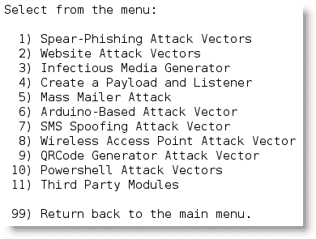
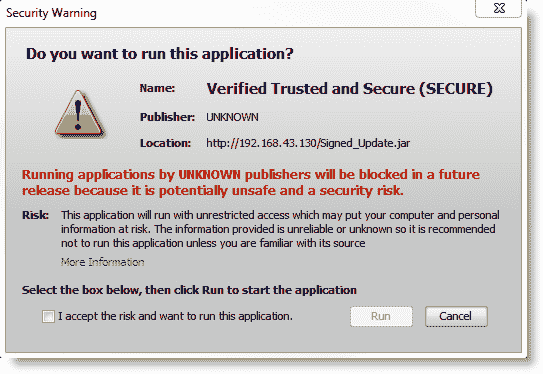
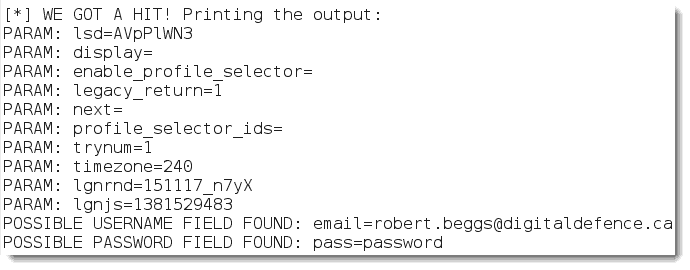
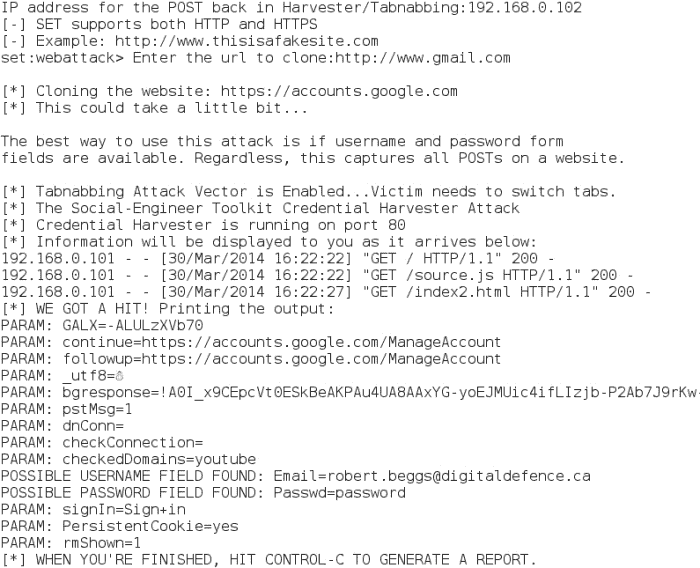
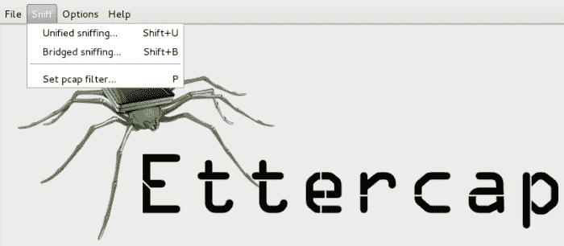
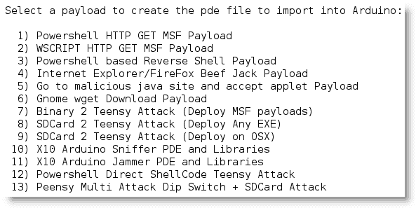
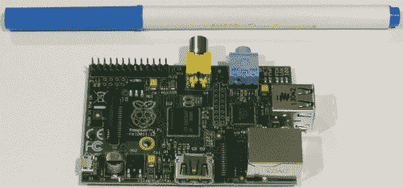

# 第七章：物理攻击和社会工程

社会工程，特别是与对目标系统的物理访问相结合时，是用于渗透测试或实际攻击的最成功的攻击向量。

作为支持杀链的攻击路径，社会工程侧重于攻击的非技术方面，利用人们的信任和天生的乐于助人来欺骗和操纵他们，使其妥协网络及其资源。

社会工程攻击的成功依赖于两个关键因素：

+   在侦察阶段获得的知识。攻击者必须了解与目标相关的名称和用户名；更重要的是，攻击者必须了解网络用户的关注点。

+   了解如何应用这些知识来说服潜在目标通过点击链接或执行程序来激活攻击。例如，如果目标公司刚刚与以前的竞争对手合并，员工的工作安全可能是最关注的问题。因此，与该主题相关的电子邮件或文件很可能会被目标个人打开。

Kali Linux 提供了几种工具和框架，如果以社会工程为借口影响受害者打开文件或执行某些操作，成功的几率会增加。例如脚本攻击（包括 Visual Basic、WMI 和 PowerShell 脚本）、由 Metasploit Framework 创建的可执行文件，以及**BeEF**（**浏览器利用框架**）。

在本章中，我们将专注于社会工程工具包或 SEToolkit。使用这些工具的技术将作为使用社会工程从其他工具部署攻击的模型。

在本章结束时，您将学会如何使用 SEToolkit 执行以下操作：

+   使用鱼叉式网络钓鱼和 Java 小程序攻击获取远程 shell

+   使用凭证收割者攻击收集用户名和密码

+   启动 tabnabbing 和 webjacking 攻击

+   使用多攻击网络方法

+   使用 PowerShell 的字母数字 shellcode 注入攻击

为支持 SET 的社会工程攻击，将描述以下一般实施做法：

+   隐藏恶意可执行文件和混淆攻击者的 URL

+   通过 DNS 重定向升级攻击

您还将学习如何创建和实施基于 Raspberry PI 微型计算机的敌对物理设备。

# 社会工程工具包

Social-Engineer Toolkit（SEToolkit）是由 David Kennedy（ReL1K）创建和编写的，并由一群活跃的合作者维护（[www.social-engineer.org](http://www.social-engineer.org)）。它是一个开源的 Python 驱动框架，专门设计用于促进社会工程攻击。

SEToolkit 的一个重要优势是它与 Metasploit Framework 的互连性，提供了所需的利用载荷、用于绕过防病毒的加密，以及当被攻击系统向攻击者发送 shell 时连接到受损系统的监听器模块。

在启动 SEToolkit 之前，您可能希望对配置文件进行一些修改。

社会工程工具包预先配置了常见的默认设置；但是，这些设置可以被修改以适应特定的攻击场景。在 Kali 中，配置文件是`/usr/share/set/config/set_config`。修改此文件允许您控制以下内容：

+   Metasploit 变量，包括位置、要使用的数据库、有效负载应该被编码的次数以及一旦建立了 meterpreter 会话后自动运行的命令。

+   **Ettercap**和**dsniff**开关用于促进 DNS 重定向攻击和捕获认证凭据。通过控制 DNS，攻击者可以自动将一群人引导到使用`setoolkit`创建的虚假网站。

+   配置`sendmail`或其他邮件程序以在需要伪造电子邮件地址的攻击中使用；这允许社会工程师通过使用看似来自可信来源的电子邮件地址（例如同一公司的高级经理）来增强攻击的可信度。

+   要使用的电子邮件提供程序，包括 Gmail、Hotmail 和 Yahoo。

+   使用伪造的发布者创建自签名的 Java 小程序，激活 SSL 证书，并窃取数字签名。

+   其他变量，如 IP 地址、端口分配和编码参数。

要在 Kali 发行版中打开社会工程工具包（SET），请转到**应用程序** | **Kali Linux** | **利用工具** | **社会工程工具包** | **setoolkit**，或在 shell 提示符下输入`setoolkit`。将显示主菜单，如下截图所示：


如果选择“1）社会工程攻击”，将显示以下子菜单：



以下是对社会工程攻击的简要解释：

+   `鱼叉式网络钓鱼攻击向量`允许攻击者创建电子邮件消息并将其发送给有附加攻击的目标受害者。

+   `网站攻击向量`利用多种基于 Web 的攻击，包括以下内容：

+   `Java 小程序攻击方法`伪造 Java 证书并传递基于 Metasploit 的有效负载。这是最成功的攻击之一，对 Windows、Linux 或 OSX 目标有效。

+   `Metasploit 浏览器利用方法`使用 iFrame 攻击传递 Metasploit 有效负载。

+   `凭证收割者攻击方法`克隆一个网站并自动重写 POST 参数，以允许攻击者拦截和收割用户凭证；然后在收割完成后将受害者重定向回原始网站。

+   `Tabnabbing 攻击方法`用克隆页面替换非活动浏览器选项卡上的信息，该页面链接回攻击者。当受害者登录时，凭证将发送给攻击者。

+   `网络劫持攻击方法`利用 iFrame 替换使突出显示的 URL 链接看起来合法；但是，当它被点击时，会弹出一个窗口，然后被恶意链接替换。

+   `多攻击 Web 方法`允许攻击者选择一次性发动的几种攻击，包括`Java 小程序攻击方法`、`Metasploit 浏览器利用方法`、`凭证收割者攻击方法`、`Tabnabbing 攻击方法`和`中间人攻击方法`。

+   `传染性媒体生成器`创建一个`autorun.inf`文件和 Metasploit 有效负载。一旦刻录或复制到 USB 设备或物理媒体（CD 或 DVD）并插入目标系统，它将触发自动运行（如果自动运行已启用）并 compromise 系统。

+   `创建有效负载和监听器`模块是一种快速的菜单驱动方法，用于创建 Metasploit 有效负载。攻击者必须使用单独的社会工程攻击来说服目标启动它。

+   `MassMailer 攻击`允许攻击者向单个电子邮件地址或收件人列表发送多个定制的电子邮件。

+   `基于 Arduino 的攻击向量`程序化 Arduino 设备，如 Teensy。因为这些设备在连接到物理 Windows 系统时注册为 USB 键盘，它们可以绕过基于禁用自动运行或其他端点保护的安全性。

+   `短信欺骗攻击向量`允许攻击者向某人的移动设备发送精心制作的短信服务文本，并伪装消息的来源。

+   `无线接入点攻击向量`将在攻击者系统上创建一个虚假的无线接入点和 DHCP 服务器，并将所有 DNS 查询重定向到攻击者。攻击者随后可以发动各种攻击，如 Java 小程序攻击或凭证窃取攻击。

+   `QR 码生成器攻击向量`创建一个与攻击相关的定义 URL 的 QR 码。

+   `Powershell 攻击向量`允许攻击者创建依赖于 PowerShell 的攻击，PowerShell 是一种命令行 shell 和脚本语言，适用于所有 Windows Vista 及更高版本。

+   `第三方模块`允许攻击者使用**远程管理工具 Tommy Edition**（**RATTE**），作为 Java 小程序攻击的一部分或作为独立有效载荷。RATTE 是一个文本菜单驱动的远程访问工具。

SEToolkit 还提供了`快速跟踪渗透测试`的菜单项，该菜单项可以快速访问一些支持 SQL 数据库的暴力识别和密码破解的专门工具，以及一些基于 Python、SCCM 攻击向量、戴尔计算机 DRAC/机箱利用、用户枚举和 PSEXEC PowerShell 注入的定制利用。

菜单还提供了更新 Metasploit Framework、SEToolkit 和 SEToolkit 配置的选项。但是，应避免使用这些附加选项，因为它们在 Kali 上得到的支持不完整，并且可能会导致依赖冲突。

作为 SEToolkit 优势的一个初始示例，我们将看到如何使用它来获得远程 shell——从受损系统到攻击者系统的连接。

## 网络钓鱼攻击

网络钓鱼是针对大量受害者进行的电子邮件欺诈攻击，比如已知的美国互联网用户名单。目标通常没有联系，电子邮件也不试图吸引任何特定个人。相反，它包含一个普遍感兴趣的项目（例如，“点击这里购买便宜的药物”）和一个恶意链接或附件。攻击者打赌至少有一些人会点击链接或附件来发起攻击。

另一方面，钓鱼攻击是一种高度特定的网络钓鱼攻击形式——通过以特定方式制作电子邮件消息，攻击者希望吸引特定受众的注意。例如，如果攻击者知道销售部门使用特定应用程序来管理其客户关系，他可能伪装成应用程序供应商发送一封电子邮件，主题是“<应用程序>的紧急修复-点击链接下载”。

### 提示

网络钓鱼攻击的成功率通常低于 5%；然而，网络钓鱼攻击的成功率范围为 40%至 80%。这就是为什么侦察阶段的信息对于这种类型的攻击的成功至关重要。

平均而言，只需要向目标发送十到十五封电子邮件，就至少会有一封被点击。

在发动攻击之前，请确保 Kali 上安装了`sendmail`（`apt-get install sendmail`）并将`set_config`文件从`SENDMAIL=OFF`更改为`SENDMAIL=ON`。

要发动攻击，请从主 SEToolkit 菜单中选择`社会工程攻击`，然后从子菜单中选择`网络钓鱼攻击向量`。这将启动攻击的开始选项，如下截图所示：


选择`1`执行大规模电子邮件攻击；然后将显示攻击有效负载列表，如下截图所示：


最有效的攻击之一是`15) Adobe PDF Embedded EXE Social Engineering`；然而，所选择的攻击将取决于攻击者在侦察阶段获得的可用目标的知识。

在提示要使用您自己的 PDF 还是内置的空白 PDF 进行攻击时，选择内置的空白有效载荷的选项`2`，如下面的屏幕截图所示。然后将提示您选择有效载荷。


通过在多个网络上进行测试，我们发现选项`1`和`2`（`Windows Reverse TCP shell`和`Windows Meterpreter Reverse TCP`）是最可靠的有效载荷。在本示例中，我们将选择`Windows Meterpreter Reverse TCP`——当打开 PDF 时，它将执行一个反向 shell 返回到攻击系统。

在隐蔽性比可靠性更重要的情况下，`Windows Meterpreter Reverse HTTPS`是最佳选择。

SEToolkit 将提示输入有效载荷侦听器（攻击者的 IP 地址）和侦听端口，默认端口为`443`。

下一个菜单提示更改 PDF 文件的文件名；默认名称为`moo.pdf`，如下面的屏幕截图所示。


默认名称不太可能吸引潜在受害者打开文件；此外，它可能会被客户端安全识别。出于这些原因，文件名应更改。名称应反映被攻击的目标受众。例如，如果您的目标是财务组，给 PDF 文件一个标题，比如税法修正案。

现在，您将被提供攻击单个电子邮件地址或群发邮件的选项（例如，目标公司的员工列表或公司内的特定群体）。本示例选择了选项`1`。

SEToolkit 然后会提示您使用预定义模板或制作一次性电子邮件模板。如果您选择预定义模板，将提供以下选项：


有效的社会工程攻击是为目标而制定的；因此，选择选项`2`，`一次性使用电子邮件模板`，以创建一次性使用电子邮件模板，如下面的屏幕截图所示：


您将被提供使用您自己的 Gmail 帐户发动攻击（`1`）或使用您自己的服务器或开放中继（`2`）的选项。如果您使用 Gmail 帐户，攻击很可能会失败，您将收到以下消息：

```
[!] Unable to deliver email. Printing exceptions message
below, this is most likely due to an illegal attachment. If using GMAIL they inspect PDFs and it is most likely getting caught. 

```

Gmail 检查出站电子邮件中的恶意文件，并且非常有效地识别 SEToolkit 和 Metasploit Framework 生成的有效载荷。如果您必须使用 GMail 发送有效载荷，请使用`Veil-Evasion`对其进行编码。

建议您使用`sendmail`选项发送可执行文件；此外，它允许您伪造电子邮件的来源，使其看起来好像来自可信任的来源。

目标将收到以下电子邮件消息：


为了确保电子邮件的有效性，攻击者应该注意以下几点：

+   内容应提供“胡萝卜”（新服务器将更快，具有改进的防病毒功能）和“棍棒”（您必须在访问电子邮件之前进行的更改）。大多数人对立即行动的呼吁做出反应，特别是当它影响到他们时。

+   在先前给出的示例中，附加的文档标题为`template.doc`。在实际情况下，这将更改为`Email instructions.doc`。

+   确保您的拼写和语法正确，并且消息的语气与内容相匹配。

+   发送电子邮件的个人的标题应与内容相匹配。如果目标组织很小，您可能需要伪造一个真实个人的名字，并将电子邮件发送给一个通常不与该人互动的小组。

+   包括电话号码 - 这使得电子邮件看起来更“正式”，并且有各种方法可以使用商业 VoIP 解决方案获得带有本地区号的临时电话号码。

一旦攻击邮件发送给目标，成功激活（接收者启动可执行文件）将在攻击者的系统上创建一个反向 Meterpreter 隧道。然后，攻击者将利用 Meterpreter 和其他工具进行典型的后渗透活动。

## 使用网站攻击向量 - Java 小程序攻击方法

`Java 小程序攻击方法`使用感染的 Java 小程序将恶意应用加载到目标系统上。许多攻击者青睐这种攻击，因为它非常可靠，并且对 Windows、Linux 和 Mac OS X 系统都有效。

要发动攻击，打开 SEToolkit 并从主菜单中选择选项`2) 网站攻击向量`。然后选择选项`1) Java 小程序攻击方法`，启动初始菜单，如下截图所示：


网页模板的选项包括`Java Required`、`Gmail`、`Google`、`Facebook`、`Twitter`和`Yahoo`。如下截图所示的**Java Required**页面通常很有效，因为它直接提示用户在继续之前更新重要的软件。


您还可以选择克隆现有网站，比如目标公司的网站。

在做出选择后，攻击者将被提示确定是否使用端口/NAT 转发，并提供攻击机器的 IP 地址进行反向连接，如下截图所示：


### 提示

SEToolkit 对文字换行处理不佳，通常输入的响应会回卷并覆盖命令行的一部分。

在提供所需的 URL 后，SEToolkit 将开始网站克隆过程，如下截图所示。完成后，应用程序将开始生成有效载荷和支持文件（`.jar`存档和克隆的`index.html`文件）。


下一阶段包括有效载荷的选择。如果隐蔽特别重要，使用选项`17`选择使用`veil`编码的可执行文件，如下截图所示：


选择编码选项以绕过目标系统上的本地防病毒软件；其中最有效的是第四个选项`Backdoored Executable`，如下截图所示：


该应用程序将提示输入监听端口，然后开始在受害者的计算机上生成常用端口（`25`、`53`、`80`、`443`等）的代码，如下截图所示：


现在是社会工程学的步骤 - 攻击者必须说服目标人员连接到监听系统的 IP 地址。如果目标进入该系统，他们将被引导到监听器上托管的克隆站点。

该网站将向目标人员显示安全警告，如下截图所示，指示需要执行应用程序才能访问该网站。



如果用户选择执行该应用程序，将在他们的计算机和攻击者的计算机之间形成一个反向 shell（取决于所选的有效负载）。

所呈现的两种攻击展示了 SEToolkit 用于使用反向 shell 或类似有效载荷控制目标计算机的不同方法。攻击者可以通过多种方式扩展控制，例如使用 VNC 有效载荷或放置 RATTE。

然而，这些攻击是具有侵入性的 - 反向 shell 可能会触发防火墙的出站警报，因为它连接到攻击者的机器。更重要的是，有效载荷可能被反向工程化以识别有关攻击者的信息。

最后，攻击的目标可能不是立即妥协；相反，攻击者可能希望收集用户凭证以支持以后的攻击，或在互联网上的多个地方重复使用凭证。因此，让我们来看一下凭证收割攻击。

## 使用网站攻击向量 - 凭证收割者攻击方法

凭证通常是用户名和密码，可以让一个人访问网络、计算系统和数据。攻击者可以间接使用这些信息（通过登录受害者的 Gmail 帐户并发送电子邮件来促成对受害者信任连接的攻击），或直接针对用户的帐户。鉴于凭证的广泛重复使用，这种攻击尤其相关 - 用户通常在多个地方重复使用密码。

特别珍贵的是具有特权访问权限的人的凭证，例如系统管理员或数据库管理员，这可以让攻击者访问多个帐户和数据存储库。

SEToolkit 的凭证收割攻击使用克隆站点来收集凭证。

要发动这种攻击，从主菜单中选择`网站攻击向量`，然后选择`凭证收割者攻击方法`。在这个例子中，我们将按照菜单选择来克隆一个网站，比如 Facebook。

再次，目标 IP 地址必须发送给预定目标。当目标点击链接或输入 IP 地址时，他们将看到一个类似于 Facebook 常规登录页面的克隆页面，并被提示输入他们的用户名和密码。

完成后，用户将被重定向到常规的 Facebook 网站，在那里他们将登录到他们的帐户。

在后台，他们的访问凭证将被收集并转发给攻击者。他们将在监听窗口中看到以下条目：



当攻击者收集完凭证后，输入*CTRL* + *C* 将在`/SET/reports`目录中以 XML 和 HTML 格式生成两份报告。

类似的攻击选项是`Web Jacking Attack`。当受害者打开攻击者的链接时，他们将看到一个页面，通知他们选择的页面已经移动，如下面的屏幕截图所示：


当用户点击链接前往新位置时，他们将看到一个看起来像预期页面的克隆页面，如下面的屏幕截图所示；同样，页面将收割他们的登录凭证。


### 注意

请注意，URL 栏中的地址不是 Google 的有效地址；大多数用户如果能看到这个地址，就会意识到有问题。成功的利用需要攻击者准备好一个合适的借口或故事，使受害者接受异常的 URL。例如，向一个非技术经理的目标群体发送电子邮件，宣布“本地 Google 邮件站现在由 IT 托管，以减少邮件系统中的延迟”。

凭据收割攻击是评估企业网络安全的绝佳工具。要有效，组织必须首先培训所有员工如何识别和应对钓鱼攻击。大约两周后，发送一封包含一些明显错误（公司 CEO 的错误姓名或包含错误地址的地址块）和一个收集凭据的程序链接的公司范围内的电子邮件。计算回复其凭据的收件人的百分比，然后调整培训计划以减少这一百分比。

## 使用网站攻击向量 - Tabnabbing 攻击方法

Tabnabbing 通过在浏览器的一个打开标签中加载一个假页面来利用用户的信任。通过冒充 Gmail、Facebook 或任何其他*发布*数据的网站的页面（通常是用户名和密码），Tabnabbing 攻击可以收集受害者的凭据。社会工程工具包调用了我们之前描述的凭据收割攻击。

要发动这次攻击，从控制台提示中启动社会工程工具包，然后选择`1) 社会工程攻击`。在下一个菜单中，选择`2) 网站攻击向量`。通过选择`4) Tabnabbing 攻击方法`来发动 Tabnabbing 攻击。

攻击发动时，您将被提示三个选项来生成用于收集凭据的假网站。攻击者可以允许`setoolkit`导入预定义的网站应用程序列表，克隆网站（如 Gmail），或导入他们自己的网站。在这个例子中，我们将选择`2) 网站克隆器`。

这将提示攻击者输入服务器将 POST 到的 IP 地址；这通常是攻击者系统的 IP 地址。然后攻击者将被提示输入要克隆的网站的 URL。在下图中，选择了 Gmail 的网站。

然后攻击者必须利用社会工程学来迫使受害者访问用于回传操作的 IP 地址（例如，URL 缩短）。受害者将收到一个网站正在加载的消息（因为攻击脚本在浏览器的不同标签中加载克隆的网站，如下图所示）：


然后目标将被呈现出假页面（假 IP 地址仍然可见）。如果用户输入他们的用户名和密码，数据将被发布到攻击者系统上的监听器。如下图所示，它已经捕获了用户名和密码。



## 使用网站攻击向量 - 多重攻击 Web 方法

网站攻击向量的“hail Mary”攻击是`多重攻击 Web 方法`，允许攻击者一次实施多种不同的攻击。默认情况下，所有攻击都被禁用，攻击者选择要针对受害者运行的攻击，如下图所示：


如果您不确定哪些攻击对目标组织有效，这是一个有效的选择；选择一个员工，确定成功的攻击，然后对其他员工重复使用这些攻击。

# 使用 PowerShell 字母数字 shellcode 注入攻击

社会工程工具包还包括基于 PowerShell 的更有效攻击，这在发布 Microsoft Vista 后的所有 Microsoft 操作系统上都可用。因为 PowerShell shellcode 可以轻松注入到目标的物理内存中，使用这个向量的攻击不会触发反病毒警报。

要使用`setoolkit`发动 PowerShell 注入攻击，从主菜单中选择`1) 社会工程攻击`。然后从下一个菜单中选择`10) Powershell 攻击向量`。

这将给攻击者四种攻击类型的选择；在这个例子中，选择`1`来调用`PowerShell 字母数字 shellcode 注入器`。

这将设置攻击参数，并提示攻击者输入载荷监听器的 IP 地址，通常是攻击者的 IP 地址。输入后，程序将创建利用代码并启动本地监听器。

启动攻击的 PowerShell shellcode 存储在`/root/.set/reports/powershell/x86_powershell_injection.txt`中。

当攻击者说服受害者在命令提示符上复制`x86_powershell_injection.txt`的内容，并执行代码时，社会工程攻击的一部分就发生了，如下截图所示。


如下截图所示，执行 shellcode 并没有在目标系统上触发反病毒警报。相反，当代码执行时，它在攻击系统上打开了一个 meterpreter 会话，并允许攻击者与远程系统建立交互式 shell。


# 隐藏可执行文件并混淆攻击者的 URL

如前面的例子所示，发动社会工程攻击的成功有两个关键。第一个是获取使其生效所需的信息——用户名、业务信息以及有关网络、系统和应用程序的支持细节。

然而，大部分工作重点放在第二个方面上——精心设计攻击，诱使目标打开可执行文件或点击链接。

几种攻击会生成需要受害者执行才能成功的模块。不幸的是，用户越来越警惕执行未知软件。然而，有一些方法可以增加攻击成功执行的可能性，包括以下方法：

+   从受害者已知和信任的系统发起攻击，或者欺骗攻击源。如果攻击似乎来自帮助台或 IT 支持，并声称是“紧急软件更新”，那么它很可能会被执行。

+   将可执行文件重命名为类似于受信任软件的名称，比如“Java 更新”。

+   将恶意载荷嵌入到诸如 PDF 文件之类的良性文件中，使用 Metasploit 的`adobe_pdf_embedded_exe_nojs`攻击之类的攻击。可执行文件也可以绑定到 Microsoft Office 文件、MSI 安装文件或配置为在桌面上静默运行的 BAT 文件。

+   让用户点击一个链接，下载恶意可执行文件。

由于 SEToolkit 使用攻击者的 URL 作为其攻击的目的地，关键的成功因素是确保攻击者的 URL 对受害者是可信的。有几种技术可以实现这一点，包括以下方法：

+   使用像[goo.gl](http://goo.gl)或[tinyurl.com](http://tinyurl.com)这样的服务缩短 URL。缩短的 URL 在 Twitter 等社交媒体中很常见，受害者很少在点击此类链接时采取预防措施。

+   在社交媒体网站上输入链接，如 Facebook 或 LinkedIn；该网站将创建自己的链接来替换你的链接，并附上目标页面的图片。然后，删除你输入的链接，只留下新的社交媒体链接。

+   在 LinkedIn 或 Facebook 上创建一个假的网页——作为攻击者，你控制内容，并可以创建一个引人注目的故事，驱使成员点击链接或下载可执行文件。一个精心设计的页面不仅会针对员工，还会针对供应商、合作伙伴和他们的客户，最大程度地提高社会工程攻击的成功率。

+   将链接嵌入到诸如 PowerPoint 之类的文件中。

要在 PowerPoint 中嵌入链接，启动它并将扩展名保存为`.pps`，创建一个幻灯片放映。给演示文稿一个对目标人感兴趣的标题，并创建一些通用内容文件。在首页，插入一个文本框，并将框拖动到覆盖该幻灯片的整个表面。单击**插入**，然后选择**操作**选项卡。在对话框中，单击**超链接**单选按钮，然后从下拉菜单中选择**URL**。输入用于发动攻击的 URL，如下面的屏幕截图所示：


文件打开后，它将作为全屏幻灯片放映。因为攻击是通过鼠标悬停启动的，用户在尝试关闭文档时将启动攻击。

# 使用 DNS 重定向升级攻击

如果攻击者或渗透测试人员已经攻破了内部网络上的主机，他们可以使用 DNS 重定向来升级攻击。这通常被认为是一种水平攻击（它会危害大致具有相同访问权限的人）；但是，如果捕获了特权人员的凭据，它也可以垂直升级。

在这个例子中，我们将使用 ettercap 作为交换式局域网的嗅探器、拦截器和记录器。它促进了中间人攻击，但我们将使用它来发动 DNS 重定向攻击，将用户转移到我们用于社会工程攻击的网站。

要启动攻击，我们必须首先修改位于`/etc/ettercap/etter.dns`的 ettercap 配置文件，将查询重定向到我们的恶意站点。在配置文件中找到使用 Microsoft 站点的示例；复制相同的细节以将目标站点请求重定向到恶意 IP 地址，如下面的屏幕截图所示：


通过在命令提示符下键入`ettercap –G`以图形模式启动 ettercap。从**嗅探**选项卡中，从下拉菜单中选择**统一**嗅探，如下面的屏幕截图所示：



在提示选择网络接口时，选择内部网络的**eth0**（如您所见，ettercap 还将在选择不同接口时支持无线攻击）。您会看到选项卡式菜单发生变化，给您更多选项。

从**主机**选项卡中，从下拉菜单中选择**扫描主机**。它将进行快速扫描，然后报告“x 个主机已添加到主机列表”。从**主机**选项卡中，选择**主机列表**以查看可能的目标系统列表，如下面的屏幕截图所示：


突出显示您希望定位的已识别系统（例如，位于交换式局域网相同段上的所有主机），并选择**添加到目标 1**选项卡。

完成后，选择**插件**选项卡，这将为您提供可供使用的 ettercap 插件列表。选择**ec_dns_spoof.so**插件，如下面的屏幕截图所示：


要发动攻击，选择**Mitm**选项卡，并从下拉菜单中选择**ARP 欺骗**，如下面的屏幕截图所示。ettercap 将在所选系统上毒化地址解析协议表或缓存。


当选择 ARP 欺骗时，将提供可选参数。选择嗅探远程连接的参数。然后，转到**开始**选项卡，并选择开始统一嗅探。

当任何一个被攻击的系统上的用户尝试访问 Facebook 时，他们的缓存表将无法为他们提供互联网上的位置。Ettercap 将把他们的查找重定向到你在配置文件中提供的 URL，并且用户将被引导到攻击者准备的敌对网页，并且将受到诸如凭证窃取之类的攻击。

在任何时候，被攻击的人都会在他们的浏览器窗口中看到一个明显正确的 URL。

DNS 重定向可以用于促进依赖用户点击 URL 链接发起攻击的所有攻击，并且这适用于有线和无线网络。

# 物理接触和敌对设备

Kali 和 SEToolkit 还可以促进攻击，入侵者直接物理接触系统和网络。这可能是一种风险攻击，因为入侵者可能会被警觉的人发现，或者被监视设备抓住。然而，奖励可能是巨大的，因为入侵者可以 compromise 具有有价值数据的特定系统。

物理接触通常是社会工程学的直接结果，特别是在使用冒充的情况下。常见的冒充包括以下内容：

+   一个声称来自帮助台或 IT 支持的人，只需要快速打断受害者安装系统升级。

+   一个供应商去拜访客户，然后借口去和其他人交谈或去洗手间。

+   一个送货员送货。攻击者可以选择在网上购买送货员制服；然而，由于大多数人认为任何穿着全身棕色并推着装满箱子的手推车的人都是 UPS 的送货员，制服很少是社会工程学的必要条件！

+   穿着工作服的工匠，携带着他们打印出来的“工作订单”，通常被允许进入布线间和其他区域，特别是当他们声称是应建筑经理的要求而在场时。

+   穿着昂贵的西装，携带剪贴板，走得很快——员工会认为你是一个不认识的经理。在进行这种类型的渗透时，我们通常会告诉人们我们是审计员，我们的检查很少受到质疑。

敌对物理接触的目标是迅速损害选定的系统；这通常是通过在目标上安装后门或类似设备来实现的。

经典攻击之一是将 CD-ROM、DVD 或 USB 键放入系统中，并让系统使用自动播放选项安装它；然而，许多组织在整个网络上禁用了自动播放。

攻击者还可以创建“有毒诱饵”陷阱——包含邀请人点击文件并检查其内容的文件的移动设备。一些例子包括以下内容：

+   USB 键带有标签，如员工工资或医疗保险更新。

+   Metasploit 允许攻击者将一个有效载荷（如反向 shell）绑定到一个可执行文件，如屏幕保护程序。攻击者可以使用公开可用的公司图像创建一个屏幕保护程序，并将 CD 邮寄给员工，带有新的*认可的屏幕保护程序*。当用户安装该程序时，后门也被安装，并连接到攻击者。

+   如果你知道员工最近参加了一个会议，攻击者可以冒充出席的供应商，并发送给目标一封暗示这是供应商展会后续的信件。一个典型的消息将是，“如果你错过了我们的产品演示和一年免费试用，请通过点击 start.exe 查看附加的 USB 键上的幻灯片展示”。

一个有趣的变种是 SanDisk U3 USB 键，或者 Smart Drive。U3 键预装了启动软件，当插入时自动允许键直接向主机计算机写入文件或注册表信息，以帮助启动批准的程序。`u3-pwn`工具（**Kali Linux** | **维持访问** | **操作系统后门** | **u3**-**pwn**）从 SanDisk U3 中删除原始 ISO 文件，并用敌意的 Metasploit 有效负载替换，然后对其进行编码，以避免在目标系统上被检测到。

不幸的是，对这些 USB 设备的支持正在减少，它们仍然容易受到与其他 Metasploit 有效负载相同程度的检测。

一个新兴的选择是使用 Teensy——一个小型集成电路设备，插入 Windows 系统后会注册为 USB 键盘。这使得它可以绕过禁用自动运行或使用客户端反病毒软件的系统。Teensy 可以在亚马逊上购买，价格大约为 20 到 25 美元。

`setoolkit`生成了 Teensy 所需的代码，将其转变为攻击向量，如下图所示：



配置为敌意代理的 Teensy 非常强大；在对企业客户进行渗透测试时，我们的测试人员已经证明了至少有百分之百的机会能够感染每个被测试网络上的至少一个系统！

不幸的是，这些设备存在一个重大限制——它们只能执行它们被编程执行的任务，攻击者或渗透测试人员在发现后的利用能力有限。

为了弥补这一不足，攻击者现在正在使用微型计算机，比如树莓派，作为攻击向量。

## 树莓派攻击向量

树莓派是一台微型计算机——大约尺寸为 8.5 厘米 X5.5 厘米，但它装有 512MB 的 RAM，两个 USB 端口和一个由 ARM 处理器运行的 700MHz 的以 Broadcom 芯片支持的以太网端口（可以超频到 1GHz）。它不包括硬盘，而是使用 SD 卡进行数据存储。如下图所示，树莓派大约是笔的三分之二长度；它很容易隐藏在网络中（在工作站或服务器后面，放在服务器柜内，或者隐藏在数据中心的地板板下）。



要将树莓派配置为攻击向量，需要以下物品：

+   树莓派 B 型，或更新版本

+   一个 HDMI 电缆

+   一个 Micro USB 电缆和充电块

+   一个以太网电缆或迷你无线适配器

+   一张至少 8GB 的 SD 卡，Class 10

所有这些物品通常可以在线购买，总价不到 100 美元。

要配置树莓派，下载最新版本的 Kali Linux ARM 版，并从源存档中提取。如果你是从基于 Windows 的桌面配置的，那么下载并提取 Win32DiskImager（[`sourceforge.net/projects/win32diskimager/`](http://sourceforge.net/projects/win32diskimager/)）。

使用读卡器，将 SD 卡连接到基于 Windows 的计算机，并打开**Win32DiskImager**。选择 Kali 的 ARM 版本，`kali-custom-rpi.img`，该版本已经下载并提取，然后将其写入 SD 卡。这将需要一些时间。

从 Mac 或 Linux 系统刷写 SD 卡的单独说明可在 Kali 网站上找到。

将新刷好的 SD 卡插入树莓派，并将以太网电缆或无线适配器连接到 Windows 工作站，HDMI 电缆连接到显示器，Micro USB 电源线连接到电源。供电后，它将直接启动 Kali Linux。树莓派依赖外部电源，没有单独的开关；但是，Kali 仍然可以通过命令行关闭。

安装 Kali 后，确保使用 apt-get 命令进行更新。

确保尽快更改 SSH 主机密钥，因为所有的树莓派镜像都有相同的密钥。使用以下命令：

```
root@kali:~rm /etc/ssh/ssh_host_*
root@kali:~dpkg-reconfigure openssh-server
root@kali:~ service ssh restart

```

同时，确保更改默认用户名和密码。

下一步是配置树莓派定期连接回攻击者的计算机（使用静态 IP 地址或动态 DNS 寻址服务）使用**cron**。

然后，攻击者必须亲自进入目标的场所，并将树莓派连接到网络。大多数网络会自动分配设备一个 DHCP 地址，并且对这种类型的攻击有限的控制。

一旦树莓派连接回攻击者的 IP 地址，攻击者可以从远程位置使用 SSH 发出命令，对受害者的内部网络进行侦察和利用应用程序。

如果连接了无线适配器，比如 EW-7811Un，150 Mbps 无线 802.11b/g/n 纳米 USB 适配器，攻击者可以无线连接，或者使用树莓派发动无线攻击（第八章，*利用无线通信*）。

# 摘要

社会工程学是一种*黑客人类*的方法-利用人的天生信任和乐于助人的特点来攻击网络及其设备。

在本章中，我们研究了社会工程如何被用来促进旨在收集网络凭证、激活恶意软件或协助发动进一步攻击的攻击。大多数攻击依赖于社会工程工具包；然而，Kali 还有其他几个应用程序，可以使用社会工程学方法进行改进。我们还研究了如何利用物理访问，通常与社会工程学结合使用，来在目标网络上放置敌对设备。

在下一章中，我们将研究如何对无线网络进行侦察，并攻击开放网络以及受到基于 WEP、WPA 和 WPA2 加密方案保护的网络。我们还将研究无线协议的一般弱点，使其容易受到拒绝服务攻击和冒充攻击的影响。

