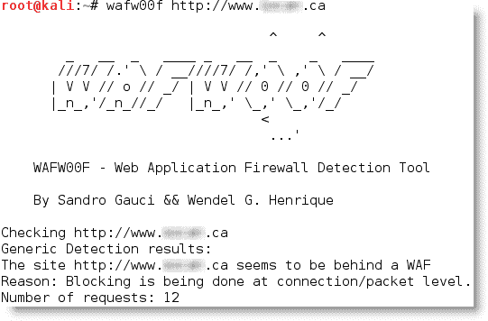
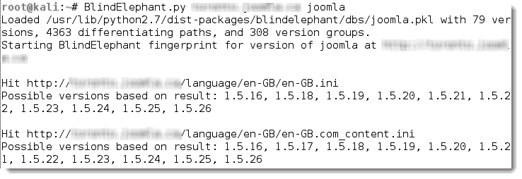
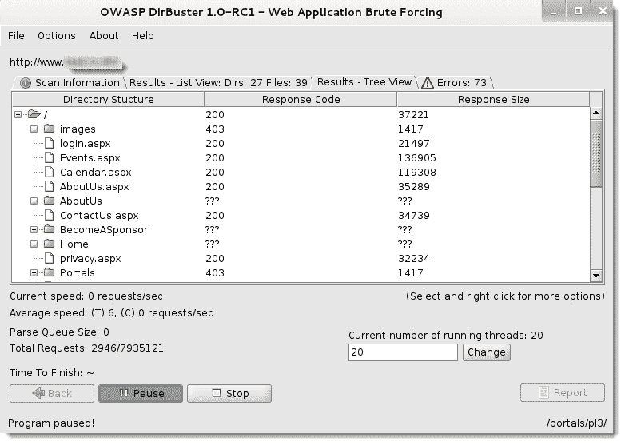
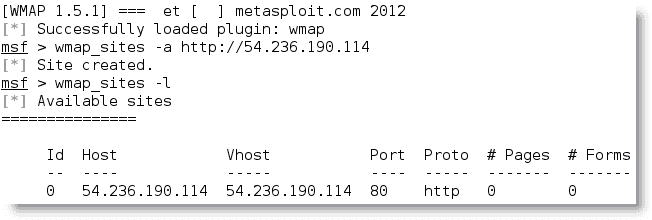
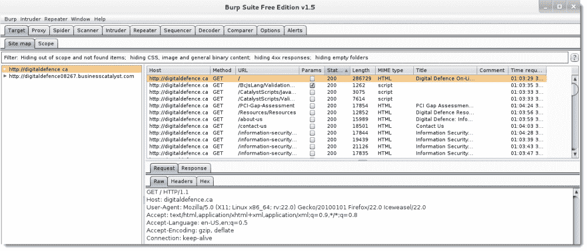
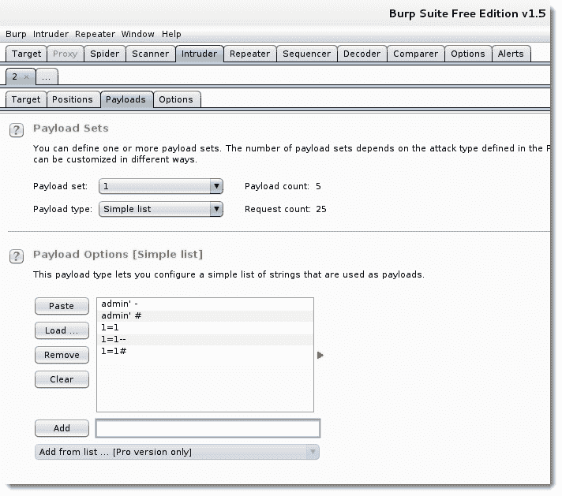
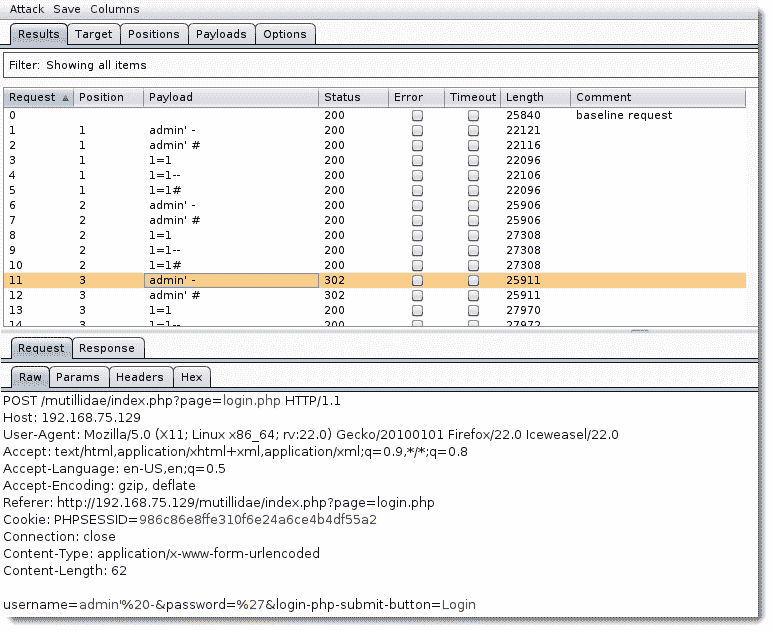
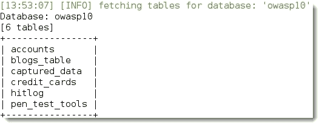

# 第九章：对基于 Web 的应用程序的侦察和利用

在前几章中，我们审查了攻击者的杀伤链——用于破坏网络和设备、披露数据或阻碍对网络资源的访问的具体方法。在第七章中，*物理攻击和社会工程*，我们研究了攻击的途径，从物理攻击和社会工程开始。在第八章中，*利用无线通信*，我们看到了无线网络如何被 compromise。在本章中，我们将重点关注通过网站和基于 Web 的应用程序的最常见的攻击途径之一。

提供内容和基于 Web 的服务（例如电子邮件和 FTP）的网站是无处不在的，大多数组织几乎始终允许远程访问这些服务。然而，对于渗透测试人员和攻击者来说，网站暴露了发生在网络上的后端服务，访问网站的用户的客户端活动以及用户与网站数据之间的连接频繁攻击。本章将重点关注攻击者对网站和 Web 服务的视角，我们将在第十章中审查对连接的攻击，*利用远程访问通信*和第十一章中的客户端攻击，*客户端利用*。

到本章结束时，您将学到以下内容：

+   将侦察原则扩展到 Web 服务

+   漏洞扫描

+   使用客户端代理

+   利用 Web 服务中的漏洞

+   使用 Web 后门维持对受损系统的访问

### 提示

在许多练习中，我们将使用 NOWASP 或 Mutillidae 作为目标网站，该网站包含可以利用的已知漏洞；它可以从[www.owasp.org/index.php/Category:OWASP_Mutillidae](http://www.owasp.org/index.php/Category:OWASP_Mutillidae)下载。这个 Web 应用程序可以直接安装到 Linux 或 Windows 上，使用 LAMP、WAMP 和 XAMPP。它也预先安装在 SamauraiWTF 和 Metasploitable 测试环境中。请参考附录，*安装 Kali Linux*，了解创建 Metasploitable 测试环境的说明。

# 对网站进行侦察

网站及其服务的交付特别复杂。通常，服务是使用多层架构交付给最终用户的，其中 Web 服务器可以被公共互联网访问，同时与位于网络上的后端服务器和数据库进行通信。

测试期间必须考虑的几个额外因素增加了复杂性，其中包括以下内容：

+   网络架构，包括安全控制（防火墙、IDS/IPS 和蜜罐）和负载平衡等配置

+   平台架构（硬件、操作系统和附加应用程序）托管 Web 服务的系统

+   应用程序、中间件和最终层数据库可能采用不同的平台（Unix 或 Windows）、供应商、编程语言和商业和专有软件的混合

+   认证和授权流程，包括在应用程序中维护会话状态的流程

+   规定应用程序将如何使用的基础业务逻辑

+   客户端与网络服务的交互和通信

鉴于网络服务的复杂性已经得到证明，渗透测试人员需要适应每个站点特定的架构和服务参数。同时，测试过程必须一贯应用，并确保没有遗漏。已经提出了几种方法来实现这些目标。最广泛接受的方法是开放式 Web 应用安全项目（OWASP）（[www.owasp.org](http://www.owasp.org)）及其十大漏洞清单。

作为最低标准，OWASP 为测试人员提供了强有力的指导。然而，仅关注十大漏洞是短视的，该方法在发现应用程序应如何支持业务实践的逻辑漏洞时已经表现出一些缺陷。

使用杀链方法，一些特定于网络服务侦察的活动应该被突出，包括以下内容：

+   确定目标站点，特别是关于它的托管位置和方式。

+   列举目标网站的站点目录结构和文件，包括确定是否使用内容管理系统（CMS）。这可能包括下载网站进行离线分析，包括文档元数据分析，并使用网站创建用于密码破解的自定义字典（使用 crunch 等程序）。还要确保所有支持文件也被识别。

+   识别认证和授权机制，并确定在与该网络服务进行交易时如何维护会话状态。这通常涉及对 cookie 的分析以及它们的使用方式。

+   列举所有表单。由于这些是客户端输入数据和与网络服务交互的主要手段，这些是一些可利用的漏洞的特定位置，比如 SQL 注入攻击和跨站脚本。

+   识别其他接受输入的区域，比如允许文件上传的页面以及对接受的上传类型的任何限制。

+   确定如何处理错误，以及用户收到的实际错误消息；通常，错误会提供有价值的内部信息，比如使用的软件版本，或者内部文件名和进程。

+   确定哪些页面需要并维护安全套接字层或其他安全协议（参见第十章，“利用远程访问通信”）。

第一步是进行先前描述的被动和主动侦察（参见第二章，“确定目标-被动侦察”和第三章，“主动侦察和漏洞扫描”）；特别是确保识别托管站点，然后使用 DNS 映射来识别由同一服务器提供的所有托管站点（攻击的最常见和成功的手段之一是攻击与目标网站托管在同一物理服务器上的非目标站点，利用服务器的弱点获取根访问权限，然后使用升级后的权限攻击目标站点）。

下一步是识别网络防护设备的存在，比如防火墙、IDS/IPS 和蜜罐。一个越来越常见的防护设备是 Web 应用防火墙（WAF）。

如果使用了 WAF，测试人员将需要确保攻击，特别是依赖精心制作的输入的攻击，被编码以绕过 WAF。

WAF 可以通过手动检查 cookie（一些 WAF 会标记或修改在 Web 服务器和客户端之间通信的 cookie），或者通过头信息的更改（当测试人员使用 Telnet 等命令行工具连接到端口 80 时识别）来识别。

WAF 检测的过程可以使用`nmap`脚本`http-waf-detect.nse`自动化，如下截图所示：


nmap 脚本识别出 WAF 的存在；然而，对脚本的测试表明，它在发现方面并不总是准确的，返回的数据可能过于一般化，无法指导有效的绕过防火墙的策略。

wafw00f 脚本是一个自动化工具，用于识别和指纹 Web 防火墙；测试表明，它是最准确的工具。该脚本可以轻松从 Kali 中调用，并在以下截图中显示了大量输出：



**负载均衡检测器**（**lbd**）是一个 bash shell 脚本，用于确定给定域名是否使用 DNS 和/或 HTTP 负载均衡。这对于测试人员来说是重要信息，因为当测试一个服务器，然后负载均衡器将请求转发到另一个服务器时，可以解释看似异常的结果。Lbd 使用各种检查来识别负载平衡的存在；以下截图显示了一个示例输出：


应检查网站以确定可能用于构建和维护网站的 CMS。诸如 Drupal、Joomla 和 WordPress 等 CMS 应用程序可能配置有易受攻击的管理界面，允许访问提升的权限，或者可能包含可利用的漏洞。

Kali 包括一个自动化扫描程序**BlindElephant**，用于指纹识别 CMS 以确定版本信息。以下截图显示了一个示例输出：



BlindElephant 审查 CMS 的组件指纹，然后提供了存在版本的最佳猜测。然而，与其他应用程序一样，我们发现它可能无法检测到存在的 CMS；因此，始终要根据其他爬行网站特定目录和文件的扫描器的结果进行验证，或者手动检查网站。

一种特定的扫描工具，自动网络爬虫，可用于验证已收集的信息，以及确定特定网站的现有目录和文件结构。网络爬虫的典型发现包括管理门户、配置文件（当前和以前的版本）可能包含硬编码访问凭据和内部结构信息、网站的备份副本、管理员注释、机密个人信息和源代码。

Kali 支持多个网络爬虫，包括 Burp Suite、DirBuster、OWASP-ZAP、Vega、WebScarab 和 WebSlayer。最常用的工具是 DirBuster。

DirBuster 是一个使用可能的目录和文件列表进行暴力分析网站结构的 GUI 驱动应用程序。响应可以以列表或树状格式查看，更准确地反映了网站的结构。执行该应用程序针对目标网站的输出如下截图所示：



还可以直接复制网站到测试人员的位置。这种“网站克隆”允许测试人员有时间审查目录结构及其内容，从本地文件中提取元数据，并使用网站内容作为`crunch`等程序的输入，以生成支持密码破解的个性化字典。

要将网站克隆到本地系统，请使用 HTTrack。如果 Kali 中没有该软件，可以使用`apt-get`命令进行下载，然后在命令提示符中输入`httrack`来执行。您将被提示选择一个目录位置来存储下载的网站。程序执行完毕后，您将拥有目标网站的备份。

一旦您已经映射出正在交付的网站和/或 Web 服务的基本结构，杀伤链的下一个阶段是识别可以利用的漏洞。

# 漏洞扫描仪

使用自动化工具进行漏洞扫描可能存在问题。Web 漏洞扫描仪遭受所有扫描仪的常见缺点（扫描仪只能检测已知漏洞的签名；它们无法确定漏洞是否实际可利用；存在高比例的*假阳性*报告）。此外，Web 漏洞扫描仪无法识别业务逻辑中的复杂错误，并且它们无法准确模拟黑客使用的复杂链式攻击。

为了提高可靠性，大多数渗透测试人员使用多种工具来扫描 Web 服务；当多个工具报告可能存在特定漏洞时，这种共识将指导测试人员需要手动验证的区域。

Kali 配备了大量用于 Web 服务的漏洞扫描仪，并提供了一个稳定的平台，用于安装新的扫描仪并扩展其功能。这使得渗透测试人员可以通过选择扫描工具来增加测试的有效性：

+   最大化测试的完整性（已识别的漏洞的总数）和准确性（真实的漏洞而不是假阳性结果）。

+   最小化获取可用结果所需的时间。

+   最小化对正在测试的 Web 服务的负面影响。这可能包括由于流量增加而导致系统减速。例如，最常见的负面影响之一是由于测试将数据输入到数据库然后通过电子邮件向个人提供已经进行的更改的更新的表单而导致的—对这些表单的不受控制的测试可能导致发送超过 30,000 封电子邮件！

选择最有效的工具存在相当大的复杂性。除了已列出的因素外，一些漏洞扫描仪还将启动适当的利用并支持后利用活动。对于我们的目的，我们将考虑所有扫描可利用弱点的工具为“漏洞扫描仪”。Kali 提供了对几种不同的漏洞扫描仪的访问，包括以下内容：

+   扩展传统漏洞扫描仪的功能以包括网站和相关服务（Metasploit Framework 和 Websploit）

+   扩展功能以支持 Web 服务漏洞扫描（OWASP Mantra）的非传统应用程序的扫描仪

+   专门开发以支持网站和 Web 服务中的侦察和利用检测的扫描仪（Arachnid、Nikto、Skipfish、Vega、w3af 等）

## 扩展传统漏洞扫描仪的功能

这种类型的漏洞扫描仪的最佳示例是 Metasploit Framework of Rapid7 中打包的`wmap`模块。要使用此模块，您必须首先确保`postgresql`数据库服务已启动；使用以下命令：

```
root@kali:~# service postgresql start 

```

接下来，从命令提示符启动`msfconsole`并输入`load wmap`命令。与大多数框架应用程序一样，在命令提示符中输入`help`或`-h`将显示可用于使用的命令。

管理目标站点，请使用`wmap_sites`命令。`-a`选项将目标的 IP 地址添加到应用程序的数据库中。`-l`选项提供了一个可用站点的列表，用于测试目标，如下面的截图所示：



选择目标后，测试人员现在可以使用以下命令运行`wmap`模块：

```
msf> wmap_run –e

```

上一个命令的执行显示在以下截图中：


执行此命令可能需要一些时间才能完成（这取决于网站页面的数量，以及网站的结构复杂性，以及所选模块操作以检测漏洞的方式）。

Metasploit 框架并不是为网站和网络服务的复杂性而设计的；这在使用该产品与使用专门为网站和网络服务设计的漏洞扫描器所得到的有限发现数量中是可见的。然而，由于它始终在更新，值得监控其扫描能力的变化。

**Websploit**应用程序还使用`wmap`模块。

## 扩展 Web 浏览器功能

Web 浏览器被设计用于与 Web 服务交互。因此，它们被选为漏洞评估和利用工具是很自然的。

这种工具集的最佳示例是 OWASP 的 Mantra——一个建立在 Firefox 网络浏览器上的第三方安全实用程序集。OWASP 的 Mantra 支持 Windows、Linux 和 Macintosh 测试系统，并提供支持以下活动的实用程序：

+   **信息收集**：这些实用程序提供被动侦察，报告目标的物理位置，揭示底层站点技术，并搜索和测试站点的超链接

+   **编辑器**：一组编辑、调试和监视 HTML、CSS 和 JavaScript 的实用程序

+   **代理**：提供代理管理工具的实用程序，包括 FoxyProxy，这是一个方便在代理之间切换的工具

+   **网络实用程序**：这些实用程序提供 FTP 和 SSH 通信的客户端，并简化 DNS 缓存管理。

+   **应用程序审计**：这些工具在各种用户代理之间切换，访问 Web 开发人员工具，控制每个站点发送的 HTTP 引用者，查找 SQL 注入和 XSS 漏洞，允许测试人员篡改数据，并访问 Websecurify 工具

+   **杂项**：生成脚本，管理会话和下载，并访问加密、解密和哈希标签功能

Mantra 框架可用于促进对网站的半自动侦察。

在以下截图中显示的示例中，Mutillidae 登录页面已在 Mantra 浏览器中打开。使用下拉菜单（从右上角的蓝色标志激活），从可用工具中选择了 SQL Inject Me 应用程序，并显示在左侧面板中。


## 特定于 Web 服务的漏洞扫描器

漏洞扫描器是自动化工具，用于爬行应用程序以识别已知漏洞的签名。

Kali 预装了几种不同的漏洞扫描器；可以通过导航到**Kali Linux** | **Web 应用程序** | **Web 漏洞扫描器**来访问它们。渗透测试人员通常会针对同一目标使用两到三个综合扫描器，以确保有效的结果。请注意，一些漏洞扫描器还包括攻击功能。

漏洞扫描器相当“喧闹”，通常会被受害者检测到。然而，扫描经常被忽略作为互联网上的常规后台探测的一部分。事实上，一些攻击者已知会对目标发起大规模扫描，以掩盖真正的攻击或诱使防御者禁用检测系统，以减少他们需要管理的报告的涌入。

对最重要的漏洞扫描器进行快速调查包括以下内容：

| 应用 | 描述 |
| --- | --- |
| Arachnid | 一个分析扫描期间接收的 HTTP 响应以验证响应并消除误报的开源 Ruby 框架。 |
| GoLismero | 它映射 Web 应用程序并检测常见的漏洞。结果以 TXT、CVS、HTML 和 RAW 格式保存。 |
| Nikto | 一个基于 Perl 的开源扫描器，允许 IDS 回避和用户更改扫描模块；然而，这个“原始”的网络扫描器开始显露其年龄，不如一些更现代的扫描器准确。 |
| Skipfish | 这个扫描器完成递归爬行和基于字典的爬行，生成一个带有来自其他漏洞扫描输出的交互式站点地图。 |
| Vega | 这是一个基于 GUI 的开源漏洞扫描器。由于它是用 Java 编写的，它是跨平台的（Linux、OS X 和 Windows），并且可以由用户定制。 |
| w3af | 这个扫描器为全面的 Python 测试平台提供了图形和命令行界面。它映射目标网站并扫描漏洞。这个项目被 Rapid7 收购，所以将来会与 Metasploit 框架更紧密地集成。 |
| Wapiti | 这是一个基于 Python 的开源漏洞扫描器。 |
| Webscarab | 这是 OWASP 基于 Java 的框架，用于分析 HTTP 和 HTTPS 协议。它可以充当拦截代理、模糊器和简单的漏洞扫描器。 |
| Webshag | 这是一个基于 Python 的网站爬虫和扫描器，可以利用复杂的 IDS 回避。 |
| Websploit | 这是一个针对有线和无线网络攻击的框架。 |

大多数测试人员开始使用 Nikto 来测试网站，这是一个简单的扫描器（特别是在报告方面），通常提供准确但有限的结果；这个扫描的样本输出如下图所示：


接下来要使用更先进的扫描器，扫描更多的漏洞；反过来，它们可能需要更长的时间才能完成。复杂的漏洞扫描（由要扫描的页面数量和站点的复杂性决定，可能包括允许用户输入的多个页面，如搜索功能或收集用户数据的表单，用于后端数据库）通常需要几天的时间才能完成。

根据发现的已验证漏洞数量，最有效的扫描器之一是 Subgraph 的 Vega。如下图所示，它扫描目标并将漏洞分类为高、中、低或信息。测试人员可以点击识别的结果“深入”到具体的发现。测试人员还可以修改用 Java 编写的搜索模块，以便专注于特定的漏洞或识别新的漏洞。


另一个值得使用的扫描器是**Web 应用攻击和审计框架**（**w3af**），这是一个基于 Python 的开源 Web 应用安全扫描器。它提供了预配置的漏洞扫描，支持 OWASP 等标准。扫描器的广泛选项是有代价的——它花费的时间比其他扫描器长得多，并且在长时间的测试期间容易出现故障。下面的屏幕截图显示了一个配置为对样本网站进行全面审计的 w3af 实例：


Kali 还包括一些特定应用的漏洞扫描器。例如，WPScan 专门针对**WordPress CMS**应用程序。

# 使用客户端代理进行安全测试

与自动化漏洞扫描器不同，客户端代理需要大量人工交互才能发挥作用。客户端代理拦截 HTTP 和 HTTPS 流量，允许渗透测试人员检查用户和应用程序之间的通信。它允许测试人员复制数据或与发送到应用程序的请求进行交互。

Kali 自带了几个客户端代理，包括 Burp Suite、OWASP ZAP、Paros、ProxyStrike、漏洞扫描器 Vega 和 WebScarab。经过广泛测试，我们已经开始依赖 Burp Proxy，并将 ZAP 作为备用工具。

Burp 主要用于拦截 HTTP(S)流量；然而，它是一个更大工具套件的一部分，具有几个额外的功能，包括：

+   一个能够识别网站的应用程序感知蜘蛛

+   漏洞扫描器，包括一个用于测试会话令牌随机性的顺序器，以及一个用于在客户端和网站之间操纵和重新发送请求的重复器（漏洞扫描器未包含在 Kali 打包的 Burp 代理的免费版本中）

+   一个可以用来发起定制攻击的入侵者工具（Kali 包含的免费版本工具有速度限制；如果购买了软件的商业版本，则这些限制将被移除）

+   编辑现有插件或编写新插件以扩展可以使用的攻击数量和类型的能力

要使用 Burp，请确保您的网络浏览器配置为使用本地代理；通常，您需要调整网络设置以指定 HTTP 和 HTTPS 流量必须使用本地主机（127.0.0.1）的 8080 端口。

设置浏览器和代理一起工作后，手动映射应用程序。这是通过关闭代理拦截，然后浏览整个应用程序来完成的。跟踪每个链接，提交表单，并尽可能多地登录到网站的各个区域。额外的内容将从各种响应中推断出来。站点地图将在**目标**选项卡下的一个区域中填充（也可以通过右键单击站点并选择**Spider This Host**来使用自动化爬行；然而，手动技术给了测试人员深入了解目标的机会，并且可能识别需要避免的区域）。

目标映射完成后，通过选择站点地图中的分支并使用**添加到范围**命令来定义目标-范围。完成后，您可以使用显示过滤器隐藏站点地图上不感兴趣的项目。下面的截图显示了目标网站的站点地图：



爬行完成后，手动审查目录和文件列表，查看是否有任何看起来不属于公共网站的结构，或者无意中泄露的内容。例如，名为 admin、backup、documentation 或 notes 的目录应该进行手动审查。

使用单引号作为输入手动测试登录页面产生了一个错误代码，表明可能容易受到 SQL 注入攻击的影响；错误代码的示例返回如下截图所示：


代理的真正优势在于其拦截和修改命令的能力。对于这个特定的例子，我们将使用 Mutillidae 网站——这是作为 Metasploitable 测试框架的一部分安装的一个“破损”网站，用于执行绕过 SQL 注入认证的攻击。

要发动这种攻击，请确保 Burp 代理已配置为拦截通信，方法是转到**代理**选项卡，然后选择**拦截**子选项卡。单击**拦截已打开**按钮，如下一张屏幕截图所示。完成后，打开浏览器窗口，并输入`<IP 地址>/mutillidae/index.php?page=login.php`以访问 Mutillidae 登录页面。在名称和密码字段中输入变量，然后单击登录按钮。

如果返回到 Burp 代理，您会看到用户在网页表单中输入的信息已被拦截。


单击**操作**按钮，然后选择**发送到入侵者**选项。打开主**入侵者**选项卡，您将看到四个子选项卡——**目标**、**位置**、**有效载荷**和**选项**，如下一张屏幕截图所示。如果选择**位置**，您将看到从拦截信息中识别出的五个有效载荷位置。


这种攻击将使用 Burp 代理的狙击手模式，它从测试人员提供的列表中获取单个输入，并将此输入逐个发送到单个有效载荷位置。在本例中，我们将针对用户名字段进行攻击，我们怀疑该字段基于返回的错误消息是易受攻击的。

为了定义有效载荷位置，我们选择子选项卡**有效载荷**。



要发动攻击，请从顶部菜单中选择**入侵者**，然后选择**开始攻击**。代理将迭代字典攻击所选有效载荷位置，作为合法的 HTTP 请求，并返回服务器的状态代码。如下一张屏幕截图所示，大多数选项产生**200**状态代码（请求成功）；但是，一些数据返回**302**状态代码（找到请求；表示所请求的资源目前位于不同的 URI 下）。



**302**状态表示成功的攻击，并且获取的数据可以用于成功登录到目标站点。

不幸的是，这只是对 Burp 代理及其功能的简要概述。Kali 附带的免费版本对许多测试任务已经足够；但是，严肃的测试人员（和攻击者）应考虑购买商业版本。

# 服务器漏洞利用

由于它们拥有广泛的“攻击面”（通信渠道、客户端软件、服务器操作系统、应用程序、中间件和后端数据库），Web 服务容易受到多种攻击类型的攻击。可能的攻击范围需要一本专门的书来描述；因此，我们只会展示一些类型，以突出 Kali 的功能。

在本示例中，我们将演示 Kali 如何用于对网络服务器发动拒绝服务（**DoS**）攻击。

一般来说，攻击提供 Web 服务的主机操作系统遵循先前描述的方法；但是，它们的架构特别容易受到 DoS 攻击。

Kali 包括几个被描述为压力测试应用程序的工具，因为它们模拟对服务器的高活动负载，以评估其对额外压力的应对能力。如果服务器或其应用程序失败，则它已遭受 DoS 攻击。

许多工具依赖于 IPv4 系统无法处理更新的 IPv6 协议（denail6、dos-new-ip6、flood_advertise6 等）。

然而，最成功的 DoS 攻击工具——**低轨道离子炮**（**LOIC**）——必须通过以下步骤手动添加到 Kali 中：

1.  使用`apt-get install`命令，安装以下软件包及其依赖项：`mono-gmcs`、`mono-mcs`、`monodevelop`和`liblog4net-cil-dev`。

1.  从 GitHub（[`github.com/NewEraCracker/LOIC/downloads`](https://github.com/NewEraCracker/LOIC/downloads)）下载 LOIC 到一个单独的文件夹中。使用解压命令将压缩文件解压到文件夹中。

1.  转到文件夹并使用以下命令编译应用程序：

```
mdtool build

```

1.  应用程序的编译版本将位于`/<path> bin/Debug/LOIC.exe`目录中。

输入攻击参数后，LOIC 可以针对目标网站启动。攻击使用直观的 GUI 界面启动，如下截图所示：


# 特定应用程序的攻击

特定应用程序的攻击数量超过了针对特定操作系统的攻击；考虑到可能影响每个在线应用程序的错误配置、漏洞和逻辑错误，令人惊讶的是任何应用程序都可以被认为是“安全”的。我们将重点介绍一些针对 Web 服务的重要攻击。

## 暴力破解访问凭证

针对网站或其服务的最常见的初始攻击之一是针对访问认证的暴力破解攻击——猜测用户名和密码。这种攻击成功率很高，因为用户倾向于选择易记的凭据或重复使用凭据，而且系统管理员经常不控制多次访问尝试。

Kali 自带 hydra，一个命令行工具，以及带有 GUI 界面的 hydra-gtk。这两个工具允许测试人员针对指定的服务暴力破解或迭代可能的用户名和密码。支持多种通信协议，包括 FTP、FTPS、HTTP、HTTPS、ICQ、IRC、LDAP、MySQL、Oracle、POP3、pcAnywhere、SNMP、SSH、VNC 等。以下截图显示了 hydra 使用暴力破解攻击来确定 HTTP 页面上的访问凭证：


## 对数据库的注入攻击

网站中最常见且可利用的漏洞是注入漏洞，当受害网站不监控用户输入时，攻击者可以与后端系统进行交互。攻击者可以构造输入数据来修改或窃取数据库中的内容，将可执行文件放置到服务器上，或向操作系统发出命令。

评估 SQL 注入漏洞最有用的工具之一是**sqlmap**，这是一个 Python 工具，可以自动进行对 Firebird、Microsoft SQL、MySQL、Oracle、PostgreSQL、Sybase 和 SAP MaxDB 数据库的侦察和利用。

我们将演示对 Mutillidae 数据库的 SQL 注入攻击。第一步是确定 Web 服务器、后端数据库管理系统和可用的数据库。

启动一个 Metasploitable 虚拟机，并访问 Mutillidae 网站。完成后，查看网页，以确定接受用户输入的页面（例如，接受远程用户的用户名和密码的用户登录表单）；这些页面可能容易受到 SQL 注入攻击。然后，打开 Kali，并从命令提示符输入以下内容（使用适当的目标 IP 地址）：

```
root@kali:~# sqlmap -u 
  'http://192.168.75.129/mutillidae/index.php?page=user-
  info.php&username=admin&password=&user-info-php-submit-
  button=View+Account+Details' --dbs 

```

Sqlmap 将返回数据，如下截图所示：


最有可能存储应用程序数据的数据库是`owasp10`数据库；因此，我们将使用以下命令检查该数据库的所有表：

```
root@kali:~# sqlmap -u 
  'http://192.168.75.129/mutillidae/index.php?page=user-
  info.php&username=admin&password=&user-info-php-submit-
  button=View+Account+Details' –D owasp10 --tables 

```

执行该命令后返回的数据显示在以下截图中：



在枚举的六个表中，有一个名为`accounts`。我们将尝试从表的这一部分中转储数据。如果成功，帐户凭据将允许我们在进一步的 SQL 注入攻击失败时返回到数据库。要转储凭据，请使用以下命令：

```
root@kali:~# sqlmap -u 
  'http://192.168.75.129/mutillidae/index.php?page=user-
  info.php&username=admin&password=&user-info-php-submit-
  button=View+Account+Details' –D owasp10 – T accounts --dump 

```


类似的攻击也可以用于数据库，以提取信用卡号码。

# 使用 Web 后门维持访问

一旦 Web 服务器及其服务被攻破，就很重要确保可以保持安全访问。通常使用 Web shell 来实现这一点——这是一个提供隐蔽后门访问并允许使用系统命令来促进后期利用活动的小型程序。

Kali 自带了几个 Web shell；在这里我们将使用一个名为**Weevely**的流行 PHP Web shell。

Weevely 模拟 Telnet 会话，并允许测试者或攻击者利用 30 多个模块进行后期利用任务，包括以下内容：

+   浏览目标文件系统

+   与受攻击系统之间的文件传输

+   执行常见服务器配置错误的审计

+   通过目标系统对 SQL 账户进行暴力破解

+   生成反向 TCP shell

+   在已经受到攻击的远程系统上执行命令，即使已经应用了 PHP 安全限制

最后，Weevely 努力隐藏 HTTP cookie 中的通信，以避免被检测。要创建 Weevely，请从命令提示符中发出以下命令：

```
root@kali:~# weevely generate <password> <path>

```

这将在根目录中创建文件`weevely.php`。在已经受到攻击的远程系统上执行命令，即使已经应用了 PHP 安全限制：


使用文件上传漏洞或任何其他受损，包括可以访问 meterpreter 文件上传功能的漏洞，将`weevely.php`上传到受攻击的网站。

要与 Web shell 通信，请从命令提示符中发出以下命令，确保目标 IP 地址、目录和密码变量已更改以反映受攻击系统的情况：

```
root@kali:~# weevely http://<target IP address> <directory> 
  <password> 

```

在下面的屏幕截图示例中，我们已经验证了使用`whoami`命令（用于识别正确的目录）和`ls`命令（用于获取文件列表，再次确认连接源为`weevely.php`）。使用`cat /etc/password`命令查看密码。


Web shell 还可以用于建立反向 shell 连接到测试者，使用 Netcat 或 Metasploit Framework 作为本地监听器。

# 总结

在本章中，我们从攻击者的角度审查了网站及其为授权用户提供的服务。我们应用了杀伤链视角来理解对 Web 服务的正确应用侦察和漏洞扫描。

介绍了几种不同的漏洞扫描器；我们重点是对现有扫描器进行修改以支持网站和 Web 服务的评估，使用基于浏览器的漏洞扫描器，以及专门设计用于评估网站及其服务的漏洞扫描器。我们只审查了少数几个利用，最后通过对专门用于 Web 服务的 Web shell 进行了审查。

在下一章中，我们将学习如何识别和攻击将用户连接到 Web 服务的远程访问通信。

