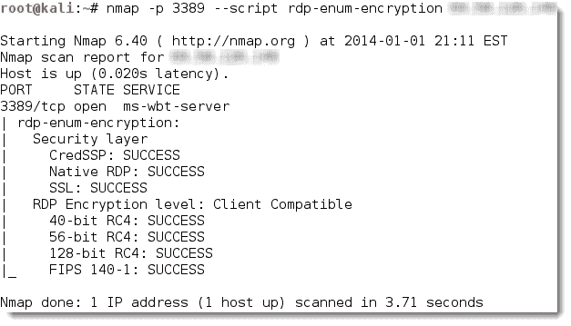
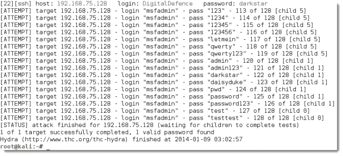
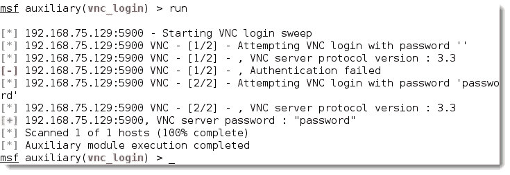
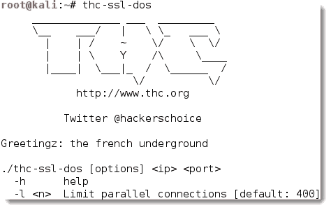
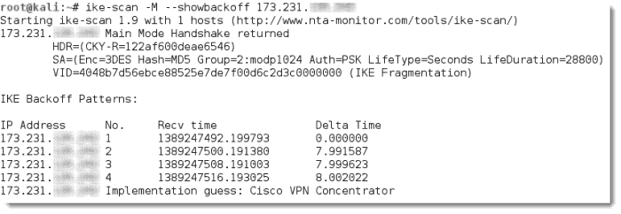

# 第十章：利用远程访问通信

在第九章中，*基于 Web 的应用程序的侦察和利用*，我们对基于 Web 的应用程序应用了杀伤链方法。我们审查了侦察、漏洞扫描和利用方法，这些方法特别适用于网站和其他应用程序。我们还审查了评估基于 Web 的应用程序所需的独特工具，特别是客户端代理和后期利用工具，如 Web shell。

在本章中，我们将重点放在破坏互联网上已经广泛传播的设备和应用程序的远程访问通信上。

攻击者正在利用远程访问通信的普遍性来实现以下目标：

+   利用现有的通信渠道直接远程访问目标系统

+   拦截通信

+   拒绝经过身份验证的用户访问常规通信，并强迫他们使用可能容易受到其他攻击的不安全通道

由于大多数用户认为他们正在使用“安全”的通信工具（甚至银行依赖 SSL 协议来保护在线银行业务），这些攻击可能对被攻击的通信以及受害者对其他在线通信的信任产生重大影响。

本章将重点放在侦察和利用杀伤链的阶段，因为它们与远程访问通信有关。它不涵盖诸如战争拨号、VoIP 和相关电话问题、高度专有的系统（如专门的亭台）以及值得拥有自己的书籍的复杂应用程序。

在本章结束时，您将学到以下内容：

+   利用操作系统通信协议（RDP 和 SSH）

+   利用远程访问应用程序（VNC）

+   配置 Kali 进行安全套接层 v2 扫描

+   对安全套接层进行侦察和利用，包括中间人和拒绝服务攻击。

+   攻击虚拟专用网络

# 利用操作系统通信协议

一些协议以明文传输访问凭据（Telnet 和 FTP）。使用诸如 Wireshark 之类的数据包嗅探器将允许攻击者拦截和重用凭据。

然而，大多数远程访问协议，尤其是嵌入在操作系统中的协议，现在都受到访问控制和加密的保护。尽管这增加了一定程度的安全性，但它们仍然容易受到由于配置错误或使用较差的加密密钥而导致的攻击。在本节中，我们将研究其他可能被利用来破坏所谓安全通信渠道的风险。

## 破坏远程桌面协议

**远程桌面协议**（**RDP**）是微软的专有通信协议，允许客户端使用图形界面连接到另一台计算机。尽管该协议是加密的，但如果攻击者猜到用户名和密码，就可以访问服务器。

### 注意

应该注意到，最常见的破坏 RDP 的方法是利用社交工程。用户被远程服务技术人员联系，说服用户需要远程访问以修复用户系统上的问题。针对 RDP 协议的恶意软件攻击也越来越普遍。

从测试人员（或攻击者）的角度来看，破坏目标的 RDP 服务的第一步是找到 RDP 服务器并确定所使用的加密强度。通常使用`nmap`等工具进行侦察，配置为扫描标准 RDP 端口 3389。

`nmap`工具现在包括专门的脚本，提供有关 RDP 的其他详细信息，包括加密配置。如果时间允许，且隐蔽性不是问题，应在初始扫描阶段使用这些脚本。调用枚举支持的加密协议的脚本的命令行如下：

```
root@kali:~# nmap – p 3389 –-script rdp-enum-encryption <IP>

```

上一个命令的执行结果如下截图所示：



已经发现了一些 RDP 漏洞（尤其是 MS12-020），可以利用精心制作的数据包远程利用这些漏洞。

要确定当前版本的 RDP 是否存在漏洞，请使用适当的`nmap`脚本，通过调用以下命令行来执行：

```
root@kali:~# nmap –sV -p 3389 --script rdp-vuln-ms12-020 
  < IP> 

```

上一个命令的执行结果如下截图所示：


一旦使用`nmap`识别出一个易受攻击的系统，就可以利用 Metasploit Framework 的`auxiliary/dos/windows/rdp/ms12_020_maxchannelids`模块来造成拒绝服务。

RDP 最常见的破解方法是使用基于最常见用户名和密码字典的暴力攻击（也可以使用诸如**CeWL**和**crunch**之类的工具构建特定目标的字典，使用这些字典的暴力攻击比使用通用字典的尝试更快，并且更隐蔽，因为它们生成的网络流量更少）。

Kali 提供了几个工具来暴力破解访问，包括**hydra**、**medusa**、**ncrack**和**patator**。通过测试，我们发现`ncrack`在速度和效果方面是最可靠的。

### 提示

常见用户名和密码列表可以从多个来源获取。大多数破解工具，特别是`hydra`、`ncrack`和`john`（John the Ripper），都在应用程序的主目录中包含列表。测试人员还可以从在线来源下载各种类型的列表。从受损用户帐户派生的列表特别有用，因为它们反映了认证信息的真实世界使用情况。无论您使用哪个列表，您可能希望通过添加当前和以前员工的姓名（用于用户名）或使用诸如 CeWL 之类的工具创建的单词列表来个性化测试。

`ncrack`工具是一个高速身份验证破解工具，支持 FTP、HTTP(S)、POP3、RDP、SMB、SSH、Telnet 和 VNC 协议。可以使用以下命令从终端窗口调用它：

```
root@kali:~# ncrack -vv -U user.lst -P password.list
  <Taget IP>:<Target Port> 

```

上述命令的执行如下截图所示：


`ncrack`工具在大约 1700 秒内发现了所有用户的访问凭据。但所需的时间取决于使用的字典的总体大小以及在成功命中之前必须进行多少次猜测。

## 破解安全外壳

**安全外壳**（**SSH**）协议是一种网络协议，用于在服务器和客户端之间的开放网络上建立加密通道。一般来说，公钥-私钥对允许用户登录系统而无需密码。公钥存在于所有需要安全连接的系统上，而用户保留私钥。认证是基于私钥的；SSH 会验证私钥与公钥。在目标系统上，公钥会与允许远程访问系统的授权密钥列表进行验证。当公钥不具有密码学强度并且可以被猜测时，这种被认为是安全的通信渠道会失败。

与 RDP 一样，SSH 容易受到猜测用户访问凭据的暴力攻击。在这个特定的例子中，我们将使用一个名为`hydra`的工具。`hydra`工具可能是最古老的暴力攻击工具，绝对是功能最丰富的工具。它还支持对最多目标协议的攻击。

`hydra`工具可以在**Kali Linux** | **密码攻击** | **在线攻击**中找到，也可以直接从命令行调用。有两个版本的`hydra`：命令行版本（`hydra`）和 GUI 版本（hydra-gtk）。在这个例子中，我们将使用以下命令从命令行调用`hydra`：

```
root@kali:~# hydra -s 22 -v -V -L <file path/name>
  -P <file path/name> -t 8 <Target IP><protocol> 

```

命令参数如下列表所述：

+   `-s`指定要使用的端口。虽然在打算使用默认端口时不需要输入它，但在这种情况下使用它可以消除歧义并加快测试速度。

+   `-v`和`-V`选择报告的最大详细程度。

+   `-L`选择登录或用户名文件。

+   `-P`选择密码文件。

+   `-t`选择并行任务或连接的数量。数字越大，测试速度越快。但是，如果数字太大，可能会引入错误，并且会错过正确的密码。

以下屏幕截图显示了初始暴力攻击的详细输出：


当使用字典成功登录时，`hydra`报告端口、协议、主机和登录凭据。然后它继续使用字典来识别其他可能的帐户。在以下截图的最顶部行中，Hydra 正确识别了一个具有`DigitalDefence`作为`login`和`darkstar`作为`password`的 SSH 帐户；截图还显示了 Hydra 尝试识别其他帐户的其他尝试。



如果您知道密码配置，还可以使用`hydra`动态创建密码列表，使用以下命令：

```
root@kali:~# hydra –L user.lst –V –x 6:8:aA1 <IP address> SSH

```

上一个命令中使用的参数在以下列表中描述：

+   `-x`指示 Hydra 自动创建用于暴力攻击的密码。密码将根据`-x`后面的参数创建。

+   `6:8`表示密码长度的最小值为六个字符，最大值为八个字符。

+   `aA1`将自动创建使用字母和数字的密码组合。它将使用所有小写字母（由`a`表示）和所有大写字母（由`A`表示），以及数字 0 到 9（由`1`表示）。

您还可以向生成的列表中添加特殊字符，但是需要在`-x`选项周围添加单引号，如下命令所示：

```
root@kali:~# -L user.lst –V –x '6:8:aA1 !@#$' <IP address> SSH

```

# 利用第三方远程访问应用程序

绕过系统协议以提供远程访问的应用程序曾经非常流行。尽管它们目前正在被在线服务如**GoToMyPC**和**LogMeIn**所取代，但它们仍然很常见。此类程序的示例包括 pcAnywhere 和 VNC。

这些工具的实例可能存在于网络上，因为系统管理员的合法操作。然而，它们也可能存在是因为网络已经被入侵，攻击者想要一种远程访问网络的手段。

在以下示例中，我们将使用 Metasploit 框架的内置功能来妥协 VNC。

1.  使用`nmap`在目标上找到远程访问软件。如下截图所示，VNC 通常在 TCP 端口`5900`上找到。

1.  使用终端窗口中的`msfconsole`命令激活 Metasploit 框架。从`msf`提示符，配置它以妥协 VNC，如下截图所示：

1.  启动`run`命令，如下截图所示，并观察成功运行：

1.  最后，一旦 Metasploit 确定了凭据，通过使用`vncviewer`登录到 VNC 客户端验证它们。从终端窗口的命令提示符中，输入以下内容：

```
root@kali:~# vncviewer <Target IP>

```

这将连接到远程主机并提示您输入适当的凭据。当认证成功时，将打开一个新窗口，让您远程访问目标系统。通过发出`whoami`查询验证您是否在目标系统上，如下截图所示，并请求系统的 ID 或 IP 地址：


# 攻击安全套接字层

**安全套接字层**（**SSL**）及其后继者**传输层安全**（**TLS**）是用于在互联网上提供安全通信的加密协议。这些协议已被广泛用于安全应用，如互联网消息传递和电子邮件、网页浏览和 IP 语音。

这些协议在互联网上无处不在，然而，它们起源于上世纪 90 年代中期，并且随着年龄的增长，它们越来越受到攻击。SSL 2.0 版本（1.0 版本从未公开发布）包含大量可以被利用的缺陷，如密钥控制不当和中间人攻击的弱点。尽管大多数用户已经实现了该协议的 3.0 版本或更新版本的 TLS，但配置错误的系统可能仍然允许使用较早的不安全版本。

## 配置 Kali 进行 SSLv2 扫描

在开始侦察阶段之前，请验证 Kali 是否已配置为扫描 SSL 版本 2 协议。在撰写本书时，情况并非如此。

从终端窗口输入以下命令：

```
root@kali:~# openssl_s_client -connect 
  www.opensecurityresearch.com:443 -ssl2 

```

如果返回`unknown option -ssl2`错误（如下面的屏幕截图所示），则需要进行额外的配置。


要应用修复，您必须使用以下步骤重新对 OpenSSL 应用程序进行打补丁（确保使用的路径反映了下载目录的使用）：

1.  使用以下命令安装**quilt**，这是一个用于管理应用程序源代码的多个补丁的程序：

```
root@kali:~# apt-get install devscripts quilt

```

1.  下载`openssl`源代码，验证已应用的补丁，更新配置文件，然后重新构建应用程序。使用以下命令：

```
root@kali:~# apt-get source openssl
root@kali:~# cd openssl-1.0.1e
root@kali:~/openssl-1.0.1e# quilt pop -a

```

1.  编辑`openssl-1.0.1e/debian/patches/series`文件，删除文件中的以下行：

```
ssltest_no_sslv2.patch

```

1.  编辑`openssl-1.0.1e/debian/rules`文件，删除`no-ssl2`参数。然后，重新应用`openssl`的补丁。使用以下命令：

```
root@kali:~/openssl-1.0.1e# quilt push -a
root@kali:~/openssl-1.0.1e#  dch -n 'Allow SSLv2'

```

1.  完成后，重新构建`openssl`软件包，然后重新安装。可以使用以下命令执行此步骤：

```
root@kali:~/openssl-1.0.1e# dpkg-source  --commit
root@kali:~/openssl-1.0.1e# debuild -uc -us
root@kali:~/openssl-1.0.1e# cd /root
root@kali:~# dpkg -i *ssl*.deb

```

1.  确认已成功应用补丁，重新发出使用 SSLv2 连接的命令，如下面的屏幕截图所示：

依赖于`openssl`的 Kali 脚本，特别是`sslscan`，将需要重新编译。要重新编译，首先下载源代码，然后重新构建。完成后，使用以下命令重新安装：

```
root@kali:~# apt-get source sslscan
root@kali:~# cd sslscan-1.8.2
root@kali:~/sslscan-1.8.2# debuild -uc -us
root@kali:~/sslscan-1.8.2# cd /root
rootl@kali:~# dpkg -i *sslscan*.deb

```

Kali 对 SSLv2 的问题可能在将来的版本中得到解决，因此，在测试 SSL 连接之前，请先验证这一点。

## SSL 连接的侦察

在评估 SSL 连接时，侦察阶段仍然很重要，特别是在审查以下项目时：

+   用于识别建立安全 SSL 连接的各方的**x.509**证书

+   正在使用的加密类型

+   配置信息，例如是否允许 SSL 会话的自动重新协商

SSL 证书可以提供可能用于促进社会工程的信息。

更频繁地，测试人员或攻击者想要确定证书是否有效。无效的证书可能是由于检查签名时出现错误、证书链断裂、证书中指定的域与系统不匹配，或者证书已过期、被吊销或已知已被 compromise。

如果用户之前接受了无效证书，他们很可能会接受新的无效证书，这会使攻击者的工作变得更加容易。

用于保护 SSL 连接的加密类型尤为重要。加密密码分为以下几类：

+   **空密码**: 这些密码用于验证传输的真实性和/或完整性。因为没有应用加密，它们不提供任何安全性。

+   **弱密码**: 这是一个用来描述所有密钥长度为 128 位或更少的密码的术语。使用**Diffie-Hellman 算法**进行密钥交换的密码也可能被认为是弱的，因为它们容易受到中间人攻击的影响。由于碰撞攻击，MD5 哈希的使用也可能被认为是弱的。最近对 RC4 的攻击也对其持续使用提出了质疑。

+   **强密码**: 这些是超过 128 位的密码。目前，接受的最安全选项是具有 256 位密钥的 AES 加密。如果可能的话，应该与 Galois/Counter 模式一起使用，这是一种现代的块密码，支持认证和加密。

SSL 和 TLS 依赖于密码套件（特定的身份验证、加密和消息认证码算法的组合）来为每个连接建立安全设置。有 30 多种这样的套件，为了满足每个安全需求而选择最佳选项的复杂性经常导致用户默认选择不太安全的选项。因此，每个 SSL 和 TLC 连接都必须经过彻底测试。

要对 SSL 连接进行侦察，使用`nmap`或 SSL 特定应用的 NSE 模块。`nmap` NSE 模块在下表中描述。

| Nmap NSE 模块 | 模块功能 |
| --- | --- |
| `ssl-cert` | 检索服务器的 SSL 证书。返回的信息量取决于详细级别（无，`-v`和`-vv`）。 |
| `ssl-date` | 从其 TLS ServerHello 响应中检索目标主机的日期和时间。 |
| `ssl-enum-ciphers` | 反复发起 SSL 和 TLS 连接，每次尝试一个新的密码，并记录主机是否接受或拒绝它。密码显示具有强度评级。这是一种高度侵入性的扫描，可能会被目标阻止。 |
| `ssl-google-cert-catalog` | 查询谷歌的证书目录，以获取与从目标检索的 SSL 证书相关的信息。它提供了谷歌对证书的认识时间和持续时间。如果证书未被谷歌认可，可能是可疑/虚假的。 |
| `ssl-known-key` | 检查主机使用的 SSL 证书是否具有与已知的受损或有缺陷的密钥数据库匹配的指纹。目前，它使用 LittleBlackBox 数据库。但是，可以使用任何指纹数据库。 |
| `sslv2` | 确定服务器是否支持已过时且不太安全的 SSL 版本 2，以及支持哪些密码。 |

要从命令行调用单个脚本，请使用以下命令：

```
root@kali:~# nmap --script <script name> -p 443 <Target IP>

```

在以下示例中，使用`-vv`选项调用了`ssl-cert`脚本以获得最大详细信息。来自此脚本的数据显示在以下截图中：


在侦察期间，测试人员可以选择使用以下命令启动所有 SLL 特定模块：

```
root@kali:~# nmap --script "ssl*" <IP address>

```

Kali 专用于 SSL 和 TLS 的侦察和攻击工具可以从命令行调用，也可以通过导航到**Kali Linux** | **信息收集** | **SSL 分析**菜单中选择。这些工具在下表中总结：

| 工具 | 功能 |
| --- | --- |
| `sslcaudit` | 自动化测试 SSL 和 TLS 客户端，以确定其抵抗中间人攻击的能力。 |
| `ssldump` | 对 SSLv3 和 TLS 通信进行网络协议分析。如果提供了适当的加密密钥，它将解密 SSL 流量并以明文显示。 |
| `sslscan` | 查询 SSL 服务以确定支持哪些密码。输出包括首选的 SSL 密码，并以文本和 XML 格式显示。 |
| `sslsniff` | 在特定局域网上对所有 SSL 连接启用中间人攻击条件，动态为正在访问的域生成证书。 |
| `sslsplit` | 对 SSL 和 TLS 网络执行中间人攻击。连接通过网络地址转换引擎透明拦截并重定向到`sslsplit`，终止原始连接并启动到原始目的地的新连接，同时记录所有传输的数据。它支持纯 TCP、SSL、HTTP/HTTPs 以及 IPv4 和 IPv6。 |
| `sslstrip` | 旨在透明地劫持网络上的 HTTP 流量，监视 HTTPS 链接，并将这些链接重定向并映射为伪造的 HTTP 或 HTTPS 链接。它还支持提供一个看起来像锁图标的 favicon 以及拦截通信的选择性记录模式。 |
| `sslyze` | 分析服务器的 SSL 配置。 |
| `tlssled` | 统一了几个其他 SSL 特定应用程序的使用和输出，检查加密强度、证书参数和重新协商能力。 |

最常用的程序是`sslscan`，它查询 SSL 服务以确定证书详细信息和支持的密码。输出格式为文本和 XML。

在测试特定连接时，使用`--no-failed`选项，如下截图所示，让`sslscan`只显示已接受的密码套件。


`sslyze` python 工具分析服务器的 SSL 配置并验证证书，测试弱密码套件，并识别可能支持其他攻击的配置信息。在下面的截图中，它已经识别出可能支持某些攻击类型的证书不匹配。


另一个 SSL 侦察工具是`tlssled`，如下截图所示。它非常快速、操作简单，输出用户友好。


无论您使用何种方法进行 SSL 侦察，都要确保通过运行至少两种不同的工具来交叉验证您的结果。此外，并非所有配置了 SSL 的设备都会同时在线。因此，在大型网络上，在测试过程中多次扫描 SSL 漏洞。

### 提示

目前正在开发中的一个新工具是 OWASP 的 O-Saft ([www.owasp.org/index.php/O-Saft](http://www.owasp.org/index.php/O-Saft))，它提供了 SSL 配置、密码和证书数据的全面概述。

## 使用 sslstrip 进行中间人攻击

尽管 SSL 保护提供了安全性，但协议也存在一些有效的攻击。2009 年，Moxie Marlinspike 演示了`sslstrip`，这是一个透明地劫持网络上的 HTTP 流量，并将流量重定向为 HTTP 或 HTTPS 链接的工具。它去除了 SSL 保护，并将*安全*锁图标返回给受害者的浏览器，以便拦截不容易被检测到。

简而言之，`sslstrip`发起了对 SSL 的中间人攻击，允许先前受保护的数据被拦截。

要使用`sslstrip`，必须首先使用以下命令将拦截系统配置为转发模式：

```
root@kali:~# echo "1" > /proc/sys/net/ipv4/ip_forward

```

接下来，使用以下命令设置`iptables`防火墙，将 HTTP 流量重定向到`sslstrip`：

```
root@kali:~# iptables –t nat –A PREROUTING –p tcp
  –destination-port 80 –j REDIRECT –to-port <listenport> 

```

在这个例子中，监听端口已设置为端口 5353。

现在配置完成后，使用以下命令运行`sslstrip`：

```
root@kali:~# sslstrip –l 5353

```

以下截图显示了先前命令的执行情况：


最小化执行`sslstrip`的活动终端窗口，并打开一个新的终端窗口。使用以下命令使用`ettercap`来欺骗 ARP 并将流量从网络或目标系统直接重定向到拦截系统：

```
root@kali:~# ettercap –TqM arp:remote /192.168.75.128/ /192.168.75.2/

```

在这里，`ettercap -T`开关选择文本界面，`-q`强制控制台进入安静模式，`-M`选项激活中间人攻击以劫持和重定向数据包。`arp:remote`开关实施 ARP 毒化攻击，并将攻击者置为中间人，能够查看和修改传输中的数据包。如果要查看远程 IP 地址和通过网关的通信，则需要`remote`部分的开关。

上面命令的执行结果如下截图所示：


如果目标系统要访问 SSL 安全内容，他们的查询将通过网关定向到拦截系统。

从用户的角度来看，他们将被引导到该网站，并出现**该站点的安全证书存在问题**的安全警报，提示他们做出决定。如果他们选择**是**，他们将被引导到他们选择的页面。浏览器右下角的锁图标仍然表示 SSL 已启用，表明他们的通信是安全的。

在后台，`sslstrip`工具移除 SSL，留下原始内容，可以在`ettercap`日志中查看，如下截图所示：


这种攻击只对相同的第二层网络段有效。然而，它在有线和无线网络上都能成功。虽然 ARP 重定向可以应用于网络段，但这种攻击会影响网络带宽，可能会被检测到。因此，最有效的方法是将这种攻击直接针对单个设备。

### 提示

要禁用 PREROUTING 规则，将`-A`替换为`-D`。要清除防火墙规则，使用`iptables -t nat -F`（清除命令）和`iptables -t nat -L`（验证表已被清除）。

## 针对 SSL 的拒绝服务攻击

建立 SSL 连接时，服务器必须完成一系列计算密集型的计算来启动握手并开始加密。这需要客户端进行少量的计算工作，服务器则需要更多的计算工作。

如果客户端发起 SSL 连接但拒绝服务器的响应，则 SSL 连接将不会建立。但是，如果 SSL 服务器配置为自动重新协商连接，则计算工作量将导致拒绝服务。

Kali Linux 有几个工具可以帮助您确定是否允许自动重新协商，包括`sslyze`和`tssled`。

如果允许自动重新协商，则输入以下命令将允许测试人员评估对拒绝服务攻击的抵抗力：

```
root@kali:~# thc-ssl- dos <IP address> <port>

```

上面命令的执行结果如下截图所示：



# 攻击 IPSec 虚拟专用网络

**虚拟专用网络**（**VPN**）使用互联网在远程位置或同一网络内的用户之间提供安全（加密）通信。有两种类型的 VPN：**IPSec**和**SSL**。

IPSec 是建立网络之间安全连接和在虚拟专用网络中连接主机最常用的协议。

在 IPSec 中，有几个子协议执行特定功能，例如以下内容：

+   **认证头**（**AH**）：为 IP 数据包提供来源证明，保护它们免受重放攻击。

+   **封装安全协议**（**ESP**）：该协议提供传输数据的来源真实性、完整性和机密性。

+   **安全关联**：这是用于加密和验证传输数据的算法集。因为 SA 与单向数据传输相关联，双向通信由一对安全关联保护。安全关联使用**Internet 安全关联和密钥管理协议**（**ISAKMP**）建立，可以通过多种方式实现。在测试 VPN 的安全性时，最脆弱的配置之一依赖于预共享密钥，**Internet 密钥交换**（**IKE**）。

为了评估 VPN 的安全性，测试人员遵循以下基本步骤：

1.  扫描 VPN 网关的存在。

1.  指纹识别 VPN 网关以确定供应商和配置详细信息。

1.  寻找与 VPN 供应商或相关产品相关的漏洞。

1.  捕获预共享密钥。

1.  执行离线 PSK 破解。

1.  检查默认用户帐户。

## 扫描 VPN 网关

要扫描 VPN 网关的存在，使用`nmap`或`ike-scan`。要使用`nmap`，发出以下命令：

```
root@kali@:~# nmap -–sU -Pn –p 500 <IP Address>

```

在这个例子中，`-sU`指示`nmap`使用 UDP 数据包（而不是 TCP）扫描主机范围以寻找可能的目标，`-Pn`确保`nmap`不会发送 ping 扫描（这可能会警告目标有关扫描并识别测试人员），`-p 500`标识要扫描的特定端口。

`nmap`工具由于处理 IKE 数据包的方式而无法定位所有 VPN 网关；最有效的工具是向目标系统发送格式正确的 IKE 数据包并显示返回消息。

定位 VPN 网关的最佳工具是`ike-scan`（可以通过导航到**Kali Linux** | **信息收集** | **VPN 分析**找到）。`ike-scan`命令行工具使用 IKE 协议来发现和指纹私人网络。它还支持在 IKE 主动模式下破解预共享密钥。要使用`ike-scan`定位目标，发出以下命令：

```
root@kali@:~# ike-scan -M <Target IP>

```

以下屏幕截图显示了上一个命令的执行：


`-M`开关将每个有效负载返回为一行，简化输出。

`ike-scan`工具针对目标设备测试各种转换。一个转换包含多个属性：加密算法（DES 和 3DES）、哈希算法（MD5 和 SHA1）、认证方法（预共享密钥）、Diffie-Hellman 组（选项一是 768 位，选项二是 1024 位）和生命周期（28,800 秒）。它将确定哪些转换引发了成功的响应。

完成对每个已识别设备的`ike-scan`后，程序将返回以下之一：

+   `0 个握手返回；0 个通知返回`：这表示目标不是 IPSec 网关

+   `0 个握手返回；1 个通知返回`：这表示虽然存在 VPN 网关，但`ike-scan`提供给它的转换都不可接受

+   `1 个握手返回；0 个通知返回`：如前面的屏幕截图所示，这表示目标已配置为 IPSec，并将对`ike-scan`提供的一个或多个转换执行 IKE 协商

## 指纹识别 VPN 网关

如果您可以与 VPN 网关建立握手，您可以对设备进行指纹识别，返回以下信息：

+   供应商和型号

+   软件版本

这些信息用于识别特定供应商的攻击或微调通用攻击。

### 注意

如果 VPN 由防火墙托管，指纹识别还将识别所使用的防火墙。

由于 IKE 不能保证传输数据包的可靠性，大多数 VPN 网关供应商使用专有协议来处理看似丢失的流量。`ike-scan`工具向 VPN 网关发送 IKE 探测数据包，但不会回复收到的响应。服务器会假装数据包已丢失，并实施其退避策略以重新发送数据包。通过分析数据包之间的时间差和重试次数，`ike-scan`可以识别供应商。

在下面的截图中显示的示例中，`-M`选项导致每个有效负载显示在单独的一行上，使输出更易于阅读。`ike-scan`的`-showbackoff`选项（如下面的截图所示）记录了发送和接收的所有数据包的响应时间，然后在显示结果之前记录了 60 秒的延迟。



在前面的截图中，**供应商 ID**（**VID**）是一个特定于供应商的 MD5 哈希文本字符串，用于识别专有通信或特定通信细节。

`ike-scan`工具还可用于确定网关是否支持主动模式。如果支持，很难与服务器建立握手，因为服务器不会响应，直到作为识别有效负载的一部分提供了有效的 ID。

## 捕获预共享密钥

`ike-scan`工具可用于将 VPN 网关推入主动模式。这很重要，因为 IPSec 的主动模式不保护预共享密钥。认证凭据以明文形式发送，可以被捕获，然后使用离线工具进行破解。

对 Cisco VPN 集中器发出的以下示例使用以下命令：

```
root@kali@:~# ike-scan --pskcrack --aggressive
--id=peer <target>

```

以下截图显示了先前命令的执行：


如果您希望将结果导出到文本文件以进行额外分析和离线密码破解，请使用以下命令：

```
root@kali@:~# ike-scan --pskcrack --aggressive
  --id=peer <target> > <path/psk.txt> 

```

## 执行离线 PSK 破解

在使用离线工具破解捕获的预共享密钥哈希之前，编辑输出文件以仅包含哈希值（应包含九个以冒号分隔的值）。破解密钥的最有效工具是`psk-crack`，它支持字典、暴力和混合模式破解。


与所有离线破解一样，成功取决于工作和付出的努力（时间、计算工作量和能源投入）。像前面截图中显示的那样，一个强大的预共享密钥将需要很长时间才能破解。

## 识别默认用户账户

与大多数其他硬件设备一样，VPN 网关通常在安装时包含默认用户帐户。这些可能不会被管理员更改。使用在指纹识别过程中收集的信息，测试人员可以进行网络搜索以识别标准用户帐户。

如果测试人员可以访问用户的计算机，用户名凭据通常以明文形式存储在系统注册表中。此外，如果测试人员可以访问系统的内存，就可以直接从客户系统的内存转储中获取密码。

### 提示

**VulnVPN**（[www.rebootuser.com](http://www.rebootuser.com)）是一个虚拟操作系统和易受攻击的 VPN 服务器。它允许您应用本章描述的工具来破坏应用程序并在不损坏生产系统的情况下获得 root 访问权限。

# 总结

在本章中，我们研究了如何利用常见的远程访问应用程序，包括已加密以提供额外安全性的应用程序。我们利用了操作系统通信协议（RDP 和 SSH）和应用程序，如 VNC。我们还学习了如何对安全套接字层连接和虚拟专用网络进行侦察，以及减少加密效果的攻击类型。

在下一章中，我们将看到针对特定通信渠道的联合攻击与针对人类的攻击的结果。在检验这些客户端利用的有效性时，我们将审查几种攻击类型以及**浏览器利用框架**（**BeEF**）项目。

