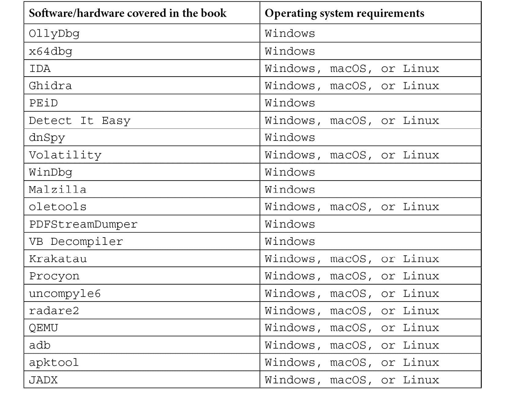

# 前言

新兴和发展中的技术不可避免地带来了新的恶意软件类型，创造了对能够防范这些恶意软件的 IT 专业人员的巨大需求。在这本更新版的《恶意软件分析精通》帮助下，你将为你的简历增添宝贵的逆向工程技能，并学习如何以最有效的方式保护组织。

本书将帮助你熟悉不同恶意软件类型背后的多种通用模式，并教你如何使用多种方法来分析它们。你将学会如何检查恶意软件代码，并确定它对系统可能造成的损害，以确保采取正确的预防或修复措施。在详细涵盖 Windows、Linux、macOS 和移动平台的恶意软件分析的各个方面时，你还将掌握混淆、反调试及其他高级反逆向工程技术。

你在这本网络安全书中获得的技能将帮助你处理几乎所有类型的现代恶意软件，强化防御，并在不管涉及什么平台的情况下，防止或迅速缓解安全漏洞。

本书结束时，你将学会如何高效地分析样本，调查可疑活动，并构建创新的解决方案来应对恶意软件事件。

# 本书适合谁阅读

如果你是恶意软件研究员、法证分析师、IT 安全管理员或任何希望防范恶意软件或调查恶意代码的人，本书适合你。这一新版适合所有知识水平的人，包括完全的初学者，但任何先前的编程或网络安全经验都将进一步加速你的学习过程。

# 本书内容

*第一章*，*网络犯罪、APT 攻击与研究策略*，深入探讨了各种攻击类型及其相关恶意软件，帮助你了解攻击阶段及其背后的逻辑。此外，我们还将学习适用于所有平台的不同方法和技术，帮助恶意软件分析师完成他们的工作。

*第二章*，*汇编语言与编程基础速成课程*，涵盖了最广泛使用的架构基础知识，从著名的 x86 和 x64 **指令集架构**（**ISAs**）到支持多个移动设备和**物联网**（**IoT**）设备的解决方案，这些设备常常被恶意软件家族滥用。

*第三章*，*x86/x64 的基本静态和动态分析*，涵盖了你需要了解的核心基础知识，以便在 Windows 平台上逆向工程 32 位和 64 位恶意软件，重点介绍文件格式以及静态和动态分析的基本概念。

*第四章*，*解包、解密与解混淆*，教你如何识别打包的样本，如何解包它们，如何处理不同的加密算法——从简单的滑动密钥加密到更复杂的算法，如 3DES、AES 和 RSA——以及如何处理 API 加密、字符串加密和网络流量加密。

*第五章*，*检查进程注入与 API 钩子*，探讨各种进程注入技术，包括 DLL 注入和进程空洞（这是 Stuxnet 引入的一种高级技术），并解释如何处理它们。接着，我们将研究 API 钩子、IAT 钩子和其他钩子技术，分析恶意软件作者如何利用这些技术，以及如何应对。

*第六章*，*绕过反逆向工程技术*，涵盖恶意软件作者用来保护其代码免受分析的各种反逆向工程技术。我们将熟悉从检测调试器和其他分析工具到虚拟机检测的不同方法，甚至会涉及攻击反恶意软件工具和产品的技术。

*第七章*，*理解内核模式 Rootkit*，深入探讨 Windows 内核及其内部结构和机制。我们将介绍恶意软件作者用来隐藏恶意软件存在的各种技巧，以避免被用户和杀毒产品发现。

*第八章*，*处理漏洞和 Shellcode*，探讨常见的漏洞类型、Shellcode 的功能及其不同实现方式、漏洞利用缓解技术以及攻击者如何绕过这些技术，并且如何分析 MS Office 和 PDF 恶意软件。

*第九章*，*逆向字节码语言 – .NET、Java 及更多*，探讨跨平台编译程序的优点，即它们的灵活性，因为你无需将每个程序移植到不同的系统。在本章中，我们将分析恶意软件作者如何利用这些优势进行恶意操作，并学习如何快速高效地分析这些样本。

*第十章*，*脚本与宏 – 逆向、解混淆与调试*，聚焦于分析各种恶意脚本，包括但不限于 Batch 和 Bash、PowerShell、VBS、JavaScript 以及不同类型的 MS Office 宏。

*第十一章*，*剖析 Linux 和物联网恶意软件*，聚焦于针对 Linux 和类 Unix 系统的恶意软件。我们将介绍这些系统中使用的文件格式，讲解各种静态和动态分析技术，并通过实际案例解释恶意软件的行为。

*第十二章*，*macOS 和 iOS 威胁介绍*，探讨了各种针对 macOS 和 iOS 用户的威胁，并分析了如何应对这些威胁。

*第十三章*，*分析安卓恶意软件样本*，深入探讨了全球最流行的移动操作系统的内部结构，分析了现有和潜在的攻击向量，并提供了关于如何分析针对安卓用户的恶意软件的详细指南。

# 为了最大限度地利用本书



*本书中提到的工具远不止这些，下面列举的是其中一些最重要的工具。*

**如果你使用的是本书的数字版，我们建议你自己输入代码，或者通过本书的 GitHub 仓库（下一个章节有相关链接）访问代码。这样做将帮助你避免复制和粘贴代码时可能出现的错误。**

*IDA 脚本语言的语法可能会随着时间的推移略有变化。如果出现无法使用的情况，请参考官方文档。*

# 下载示例代码文件

你可以从 GitHub 下载本书的示例代码文件，网址为 [`github.com/PacktPublishing/Mastering-Malware-Analysis-Second-edition`](https://github.com/PacktPublishing/Mastering-Malware-Analysis-Second-edition)。如果代码有更新，它将会在 GitHub 仓库中更新。

我们还提供了其他代码包，来自我们丰富的书籍和视频目录，网址为 [`github.com/PacktPublishing/`](https://github.com/PacktPublishing/)。快来看看吧！

# 下载彩色图片

我们还提供了一个 PDF 文件，包含本书中使用的截图和图表的彩色图片。你可以在这里下载：[`packt.link/uFbey`](https://packt.link/uFbey)。

# 使用的约定

本书中使用了多种文本约定。

`文本中的代码`：表示文本中的代码词汇、数据库表名、文件夹名称、文件名、文件扩展名、路径名、虚拟 URL、用户输入和 Twitter 用户名。例如：值得注意的是，IDT 曾用于将数据传递到 Windows 2000 及更早版本的内核模式，在 `sysenter` 成为首选方法之前。

代码块设置如下：

```
push Arg02
push Arg01
call Func01
```

任何命令行输入或输出如下所示：

```
sc create <service_name> type= own binpath= <path_to_executable>
```

**粗体**：表示一个新术语、一个重要的词或你在屏幕上看到的词。例如，菜单或对话框中的词通常显示为**粗体**。例如：在 VirtualBox 中，打开虚拟机设置并转到**串口**类别。

提示或重要说明

以如下形式出现。

# 联系我们

我们欢迎读者的反馈。

**一般反馈**：如果你对本书的任何部分有疑问，请通过电子邮件联系我们：[customercare@packtpub.com](http://customercare@packtpub.com)，并在邮件主题中注明书名。

**勘误**：虽然我们已尽一切努力确保内容的准确性，但难免会有错误。如果您在本书中发现任何错误，我们将非常感激您能报告给我们。请访问[www.packtpub.com/support/errata](http://www.packtpub.com/support/errata)并填写表单。

**版权问题**：如果您在互联网上遇到任何形式的我们作品的非法复制，我们将非常感激您能提供相关位置或网站名称。请通过[copyright@packt.com](http://copyright@packt.com)与我们联系，并提供相关材料的链接。

**如果您有兴趣成为作者**：如果您对某个主题有专业知识，并且有兴趣写作或为书籍做贡献，请访问[authors.packtpub.com](http://authors.packtpub.com)。

# 分享您的想法

阅读完《恶意软件分析精通（第二版）》后，我们很希望听到您的反馈！[请点击此处直接进入亚马逊评价页面](https://packt.link/r/1803240245)并分享您的意见。

您的评论对我们以及技术社区都非常重要，并将帮助我们确保提供优质内容。

# 第一部分 基础理论

本节将介绍成功进行各平台样本静态分析所需的核心概念，包括架构和汇编的基础知识。虽然您可能已经对 x86 架构有一定了解，但如今恶意软件也大量针对较少见的架构，例如 PowerPC 或 SH-4，因此这些架构不应被低估。

本节包括以下章节：

+   *第一章**，网络犯罪、APT 攻击与研究策略*

+   *第二章**，汇编与编程基础速成课程*
