# 第二章：汇编与编程基础速成课程

在深入了解恶意软件世界之前，我们需要对分析恶意软件的机器核心有一个完整的了解。出于逆向工程的目的，重点关注架构及其支持的**操作系统**（**OS**）是非常有意义的。当然，多个设备和模块构成了一个系统，但主要是这两个因素定义了一套在分析过程中使用的工具和方法。任何架构的物理表现形式就是处理器。处理器就像任何智能设备或计算机的心脏，它使得设备保持运行。

在本章中，我们将涵盖最广泛使用的架构的基础知识，从广为人知的 x86 和 x64 **指令集架构**（**ISAs**）到支持多个移动设备和**物联网**（**IoT**）设备的解决方案，这些设备经常被恶意软件家族（如 Mirai）滥用。这将为你进入恶意软件分析的旅程奠定基调，因为没有理解汇编指令，静态分析是不可能的。尽管现代反编译器变得越来越强大，但它们并不是针对所有恶意软件攻击的平台都能使用。而且，它们可能永远无法处理混淆代码。不要被汇编的复杂性吓倒；只需要时间去适应，过一段时间后，它就能像任何其他编程语言一样被理解。虽然本章提供了一个起点，但通过实践和进一步探索来加深理解总是有意义的。

在本章中，我们将涵盖以下内容：

+   信息学基础

+   架构及其汇编

+   熟悉 x86（IA-32 和 x64）

+   探索 ARM 汇编

+   MIPS 基础

+   覆盖 SuperH 汇编

+   与 SPARC 一起工作

+   从汇编语言过渡到高级编程语言

# 信息学基础

在我们深入了解各种架构的内部结构之前，现在是复习数字系统的好时机，这将为理解数据类型和位运算奠定基础。

## 数字系统

在我们的日常生活中，我们使用从 0 到 9 的十进制系统，这给了我们总共 10 个不同的 1 位选项。这是有充分理由的——因为我们人类总共有 10 根手指，而这些手指总是出现在我们眼前，是很好的计数工具。然而，从数据科学的角度来看，数字 10 并没有什么特别之处。使用其他进制将使我们能够更高效地存储信息。

存储某些信息的绝对最小要求是两个不同的值：是或否，真或假等。这为只使用两个数字 0 和 1 的二进制数制奠定了基础。我们使用它的方式与十进制的情况相同：每次我们到达右侧的最大数字时，我们将其降到 0，并且增加左侧的下一个数字，按照相同的逻辑。因此，*0, 1, 2, 3, 4, ... 9, 10, 11, ...*变成*0, 1, 10, 11, 100, ..., 1001, 1010, 1011, ...*等等。这种方法使得能够有效地编码大量信息，以便由机器自动读取。例如包括磁带和软盘（有无磁化），CD/DVD/BD（由激光读取的缺口有无）和闪存（有无电荷）。为了不混淆二进制值和十进制数，通常对二进制值使用“b”后缀（例如，1010b）。

现在，如果我们想要处理二进制位组，我们需要选择组的大小。三个位组（从 000 到 111）将给出 2³ = 8 种可能的 0 和 1 的组合，允许我们编码八个不同的数字。类似地，四个位组（从 0000 到 1111）将给出 2⁴ = 16 种可能的组合。这就是为什么开始使用八进制和十六进制系统：它们允许您有效地转换二进制数。八进制系统使用 8 为基数，这意味着它可以使用从 0 到 7 的数字。十六进制系统支持 16 个数字，使用数字 0 到 9，然后是英语字母表的前六个字母：A 到 F。在这里，十六进制 A 代表十进制 10，B 代表 11，依此类推，一直到 F 代表十进制 15。我们使用它们的方式与十进制和二进制数制相同：一旦达到右侧的最大数字，下一个值将会回到 0，并且左侧的数字按照相同的逻辑递增。在这种情况下，十进制序列如*14, 15, 16, 17*将被表示为*E, F, 10, 11*的十六进制。为了不混淆十六进制数和十进制数，您可以使用“0x”和“\x”前缀或“h”后缀来标记十六进制数（例如，0x33, \x73 和 70h）。

将二进制值转换为十六进制非常容易。整个二进制值应该分成四位一组，每组代表一个单独的十六进制数字。例如，0001b = 1h 和 00110001b 由 0011b = 3h 和 0001b = 1h 组成，得到 31h。

现在，是时候学习如何使用这种方法编码不同的数据类型了。

## 基本数据单元和数据类型

正如我们所知，最小的数据存储单元应该能够存储两个不同的值——0 或 1；即二进制数字系统中的一个数字。这个单元叫做**比特**。8 个比特组成一个**字节**。一个字节可以用来编码所有可能的零和一的组合，从 00000000b 到 11111111b，总共可以有 2⁸ = 256 种不同的变体，从 0x0 到 0xFF。其他常用的数据单元有**字**（2 字节）、**双字**（4 字节）和**四字**（8 字节）。

现在，让我们来谈谈如何对使用这些数据单元存储的数据进行编码。以下是各种编程语言中常见的一些基本数据类型：

+   **布尔型**：一种二进制数据类型，只能存储两个可能的值：真或假。

+   **整数**：用于存储整数。大小各不相同。在某些情况下，可以通过后缀来指定位数（如 int16、int32 等）。

+   **无符号**：所有比特都用于存储数值。

+   **有符号**：最重要的比特（最左边的那个）用于存储符号，0 表示正数，1 表示负数。所以 0xFFFFFFFF = -1。

+   **短整数**和**长整数**：这些数据类型是比标准整数小或大的整数。short 的大小为 2 字节，long 的大小为 4 或 8 字节。

+   **浮点数**和**双精度浮点数**：这些数据类型用于存储浮动点数（可以有小数的数值）。它们在恶意软件中几乎从不使用。

+   **字符**：通常用于存储字符串中的字符，每个值的大小为 1 字节。

+   **字符串**：由字节组成，定义了可读的字符串。根据编码方式，它可以使用每个字符一个或多个字节。

+   **ASCII**：定义了字符（字母、数字、标点符号等）与字节值之间的映射关系。每个字符使用 7 位：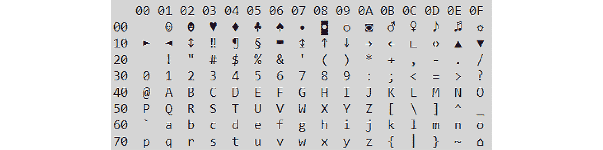

图 2.1 – ASCII 表

图 2.1 – ASCII 表

+   **扩展 ASCII**：每个字符使用 8 位，其中前半部分（0x0-0x7F）与 ASCII 表相同，其余部分取决于代码页（例如 Windows-1252 编码）。

+   **UTF8**：这是一种 Unicode 编码，每个字符使用 1 到 4 个字节。它在*nix 系统中常用。其起始部分与 ASCII 表匹配。

+   **UTF16**：这是一种 Unicode 编码，每个字符使用 2 或 4 个字节。字节的顺序取决于字节序（Endian）。

+   **小端序**：最不重要的字节存放在最低地址（UTF16-LE，是 Windows 操作系统使用的默认 Unicode 编码；在该系统中，相关字符串称为宽字符字符串）。

+   **大端序**：最重要的字节存放在最低地址（UTF16-BE）：

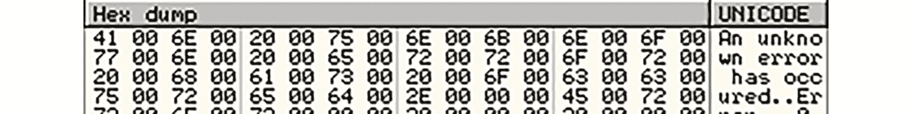

图 2.2 – UTF16-LE 字符串示例

除了知道如何使用比特存储数据外，还需要理解按位操作，因为它们在汇编语言中有很多应用。

## 按位操作

按位操作在位级别上进行，可以是单目操作，这意味着它只需要一个操作数，也可以是双目操作，这意味着它需要两个操作数并将相应的逻辑应用于每一对对齐的位。由于它们执行起来非常快速，按位操作在机器代码中找到了多种应用。让我们看看最重要的一些应用。

### 与（AND，&）

在这里，结果位只有在两个对应操作数的位都为 1 时才会被设置（变为 1）。

以下是一个例子：

*10110111b*

*与（AND）*

*11001001b*

*=*

*10000001b*

这种操作在汇编语言中最常见的应用是通过使用掩码（操作数 #2）来分离提供的十六进制值（操作数 #1）的一部分，并将其余部分置为零。它基于此操作的两个特性：

+   如果一个操作数的位设置为 0，结果将始终为 0

+   如果一个操作数的位设置为 1，结果将等于另一个操作数的位

因此，*0x12345678 & 0x000000FF = 0x00000078*（因为 0xFF = 11111111b）。

### 或（OR，|）

在这种情况下，结果位将为 1，只要任何对应的操作数位为 1。

以下是一个例子：

*10100101b*

*或（OR）*

*10001001b*

*=*

*10101101b*

这种操作的常见应用是通过掩码设置位，同时保留其余的值。它基于此操作的以下特性：

+   如果一个操作数的位设置为 0，结果将等于另一个操作数的位

+   如果一个操作数的位设置为 1，结果将始终为 1

这样，*0x12345678 & 0x000000FF = 0x123456FF*（同样，*0xFF = 11111111b*）。

### 异或（XOR，^）

在这里，结果位只有在对应操作数的位不同的情况下才会为 1，否则结果为 0。

以下是一个例子：

*11101001b*

*异或（XOR）*

*10011100b*

*=*

*01110101b*

这种操作有两个非常常见的应用：

+   **清零**：这一点基于以下原则，如果我们为两个操作数使用相同的值，那么它的所有位都会相等，因此整个结果将为 0。

+   **加密**：这一点基于这样的事实，即如果对同一个密钥的操作数应用两次此操作，将恢复原始值。它所基于的实际性质是，如果一个操作数是 0，结果将等于另一个操作数，这正是最终发生的情况：

    +   *plain_text ^ key = encrypted_text*

    +   *encrypted_text ^ key = (plain_text ^ key) ^ key = plain_text ^ (key ^ key) = plain_text ^ 0 = plain_text*

现在让我们来看一下 NOT (~) 操作。

### 非（NOT，~）

与之前的操作不同，这个操作是单目操作，只需要一个操作数，将其所有位反转为相反的值。

以下是一个例子：

*非（NOT）*

*11001010b*

*=*

*00110101b*

这种操作的常见应用是将有符号整数值的符号改变为相反的符号（例如，将 -3 转为 3，或者将 5 转为 -5）。在这种情况下，公式将是 *~value + 1*。

现在，让我们来看一下位移操作。

### 逻辑移位（<< 或 >>）

此操作需要指定方向（左或右），以及实际的值要改变的数量和移位位置的数量。在移位过程中，原始值的每一位会根据指定的位数向左或向右移动；相对方向的空位则会用零填充。所有移出数据单元的位都将丢失。

以下是一些示例：

*10010011b >> 1 = 01001001b*

*10010011b << 2 = 01001100b*

此操作有两个常见应用：

+   将数据移到寄存器的特定位置（如你稍后将看到的）

+   每移位一个位置时，乘以（左移）或除以（右移）二的幂

### 循环移位（Rotate）

这种按位移位与逻辑移位非常相似，但有一个重要的区别——所有移出数据单元一侧的位将出现在对面一侧。

以下是一些示例：

*10010011b ROR 1 = 11001001b*

*10010011b ROL 2 = 01001110b*

因为与逻辑移位不同，该操作是可逆的，数据不会丢失，所以它可以在加密算法中使用。

其他类型的移位，如算术移位或带进位的旋转，在汇编中一般较少见，尤其是在恶意软件中，因此它们超出了本书的讨论范围。

现在，终于到了学习更多关于各种架构及其汇编指令的时机。

# 架构及其汇编

简单来说，处理器，也就是**中央处理单元**（**CPU**），与计算器非常相似。如果你查看指令（无论是哪种汇编语言），你会发现许多指令涉及数字并进行计算。然而，多个特性使得处理器与普通计算器有所不同。让我们来看一些示例：

+   现代处理器相较于传统计算器支持更大的内存空间。这个内存空间允许它们存储数十亿个值，从而使得执行更复杂的操作成为可能。此外，处理器内部嵌入了多个快速且小型的内存存储单元，称为寄存器。

+   处理器支持多种除算术指令外的其他指令类型，如根据特定条件更改执行流程。

+   处理器可以与其他外部设备如扬声器、麦克风、硬盘、显卡等一起工作。

凭借这些功能和极大的灵活性，处理器成为了支撑各种先进现代技术（如机器学习）的通用机器。在接下来的部分中，我们将探索这些特性，并进一步深入了解不同的汇编语言以及这些特性如何在这些语言的指令集中体现。

## 寄存器

尽管处理器能够访问巨大的内存空间，可以存储数十亿个值，但这些存储是由独立的 RAM 设备提供的，这使得处理器访问数据的速度较慢。因此，为了加速处理器操作，处理器内部含有小而快速的内存存储单元，称为寄存器。

寄存器内置于处理器芯片中，可以存储在执行计算和数据传输时所需的即时值。

寄存器可能有不同的名称、大小和功能，具体取决于架构。以下是一些广泛使用的类型：

+   **通用寄存器**：这些寄存器用于临时存储各种算术、按位和数据传输操作的参数和结果。

+   **栈和帧指针**：这些指向栈的顶部和某个固定点（稍后会看到）。

+   **指令指针/程序计数器**：指令指针用于指向处理器将要执行的下一条指令。

## 内存

内存在我们今天使用的所有智能设备的开发中扮演着重要角色。在快速且易失的内存上管理大量的值、文本、图像和视频的能力，使得 CPU 能够处理更多信息，最终执行更复杂的操作，如显示 3D 图形界面和虚拟现实。

### 虚拟内存

在现代操作系统中，无论是基于 32 位还是 64 位，操作系统都会为每个进程创建一个隔离的虚拟内存（其页面会映射到物理内存页面）。应用程序只能访问它们的虚拟内存。它们可以读取和写入代码和数据，并执行位于虚拟内存中的指令。每个包含虚拟内存页面的内存范围都有一组权限，也称为保护标志，表示应用程序可以在其上执行的操作类型。其中最重要的一些权限包括 READ、WRITE 和 EXECUTE，以及它们的组合。

为了让应用程序尝试访问存储在内存中的值，它需要其虚拟地址。在幕后，**内存管理单元**（**MMU**）和操作系统透明地将这些虚拟地址映射到定义值在硬件中存储位置的物理地址：

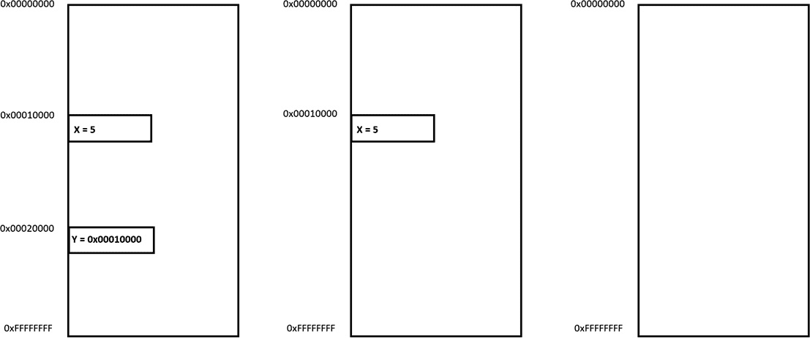

图 2.3 – 虚拟内存地址

为了节省存储和使用值地址所需的空间，开发了栈的概念。

### 栈

栈是一个堆叠的对象。在计算机科学中，栈是一种数据结构，它利用**后进先出**（**LIFO**）原则，将不同大小的值按堆叠结构保存在内存中。

栈的顶部（下一个元素将被放置的位置）由专用的栈指针指向，稍后会对其进行更详细的讨论。

栈在许多汇编语言中是常见的，它可以服务于多个目的。例如，它可以通过临时存储每个计算结果，然后将它们提取出来以计算所有结果的总和，并将其保存在变量*X*中，来帮助解决数学方程式，如 *X = 5*6 + 6*2 + 7(4 + 6)*。

栈的另一个应用是传递参数给函数并存储局部变量。最后，在某些架构上，栈还可以用来在调用函数之前保存下一条指令的地址。这样，一旦该函数执行完毕，就可以从栈顶弹出该返回地址，并将控制权转移回调用它的地方，继续执行。

虽然栈指针始终指向当前栈顶，但帧指针则存储函数开始时栈顶的地址，以便能够访问传递的参数和局部变量，并在例程结束时恢复栈指针的值。我们将在讨论不同架构的调用约定时更详细地介绍这一点。

## 指令（CISC 和 RISC）

指令是以字节形式表示的机器码，CPU 可以理解并执行它们。对于我们人类来说，读取字节非常困难，这就是为什么我们开发了汇编器来将汇编代码转换为指令，并开发了解析器以便能够将其读回。

在本节中，我们将介绍定义汇编语言的两大类架构：**复杂指令集计算机**（**CISC**）和**简化指令集计算机**（**RISC**）。

不深入细节，CISC 汇编语言（如 Intel IA-32 和 x64）与与 ARM 等架构相关的 RISC 汇编语言之间的主要区别在于其指令的复杂性。

CISC 汇编语言的指令更为复杂。它们通常侧重于使用尽可能少的汇编指令完成任务。为了做到这一点，CISC 汇编语言包括可以执行多个操作的指令，例如 Intel 汇编中的 *mul* 指令，它可以同时执行数据访问、乘法和数据存储操作。

在 RISC 汇编语言中，汇编指令通常很简单，一般只执行一个操作。这可能导致为完成特定任务需要更多的代码行。然而，这也可能更加高效，因为它省略了任何不必要的操作。

总的来说，我们可以将所有指令（无论架构如何）分为几组：

+   **数据操作**：包括算术和按位操作。

+   **数据传输**：允许涉及寄存器、内存和立即数值的数据进行移动。

+   **控制流**：这使得可以改变指令执行的顺序。在每种汇编语言中，都有多种比较和控制流指令，通常可以分为以下几类：

    +   **无条件**：这种类型的指令会强制改变执行流转到另一个地址（没有任何给定条件）。

    +   **条件**：这就像一个逻辑门，根据给定的条件（如等于零、大于或小于）切换到另一个分支，如下图所示：

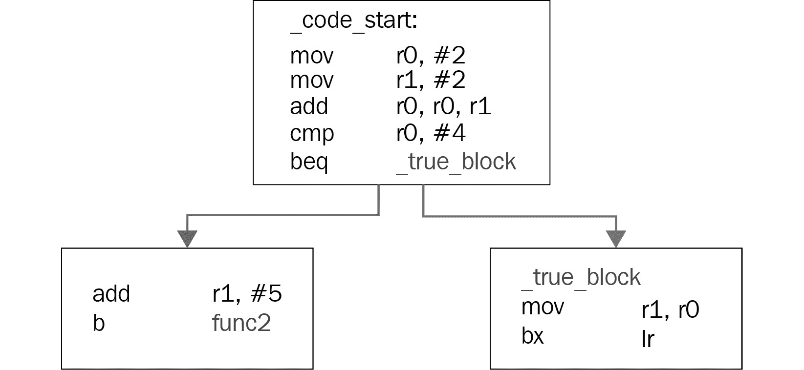

图 2.4 – 条件跳转的示例

+   **子程序调用**：这些指令会将执行转移到另一个函数，并保存返回地址，以便在必要时恢复。

现在，是时候学习在进行逆向工程时常见的指令了。能够流利地阅读这些指令并理解它们组合的含义，是成为专业恶意软件分析师的一个重要步骤。

# 熟悉 x86（IA-32 和 x64）

Intel x86（包括 32 位和 64 位版本）是 PC 中最常见的架构。它为各种类型的工作站和服务器提供支持，因此我们目前看到的大多数恶意软件样本都支持该架构。其 32 位版本 IA-32 也通常被称为 i386（由 i686 替代）或简单地称为 x86，而 64 位版本 x64 也被称为 x86-64 或 AMD64。x86 是一个 CISC 架构，除了简单指令外，还包含多个复杂指令。在这一部分，我们将介绍其中最常见的指令，并介绍函数是如何组织的。

## 寄存器

下表显示了 IA-32 和 x64 架构中寄存器之间的关系：

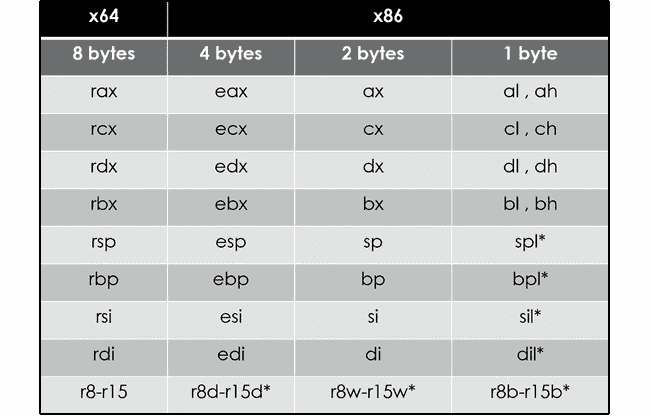

图 2.5 – IA-32 和 x64 架构

在 x86 架构中使用的寄存器（从 8 到 r15 的寄存器）仅在 x64 中可用，而在 IA-32 中不可用，且 spl、bpl、sil 和 dil 寄存器只能在 x64 中访问。

首先要提到的是，关于哪些寄存器应该称为**通用寄存器**（**GPRs**）以及哪些不应如此，可能有多种解释，因为它们中的大多数可能用于某些特定目的。

前四个寄存器（**rax/eax**、**rbx/ebx**、**rcx/ecx**、和 **rdx/edx**）是 GPRs。它们中的一些寄存器在特定指令中有特殊的用途：

+   **rax/eax**：这通常用于存储某些操作的结果以及函数的返回值。

+   **rcx/ecx**：这是在需要重复操作的指令中用作计数寄存器的。

+   **rdx/edx**：这是在乘法和除法中使用的，分别用来扩展结果或被除数。

在 x64 中，r8 到 r15 的寄存器被添加到可用的 GPRs 列表中。

**rsi/esi** 和 **rdi/edi** 主要用于定义在内存中复制字节组的地址。rsi/esi 寄存器始终充当源寄存器，而 rdi/edi 寄存器充当目标寄存器。这两个寄存器都是非易失性的，并且也是 GPR 寄存器。

**rsp/esp** 寄存器作为栈指针使用，这意味着它始终指向栈顶。当一个值被推送到栈时，它的值会减小，而当一个值被从栈中取出时，它的值会增大。

**rbp/ebp** 寄存器主要作为基指针使用，指示栈中的一个固定位置。它帮助访问函数的局部变量和参数，稍后在本节中我们会看到。

### 特殊寄存器

x86 汇编中有两个特殊的寄存器，如下所示：

+   **rip/eip**：这是一个指令指针，指向下一个将要执行的指令。它不能直接访问，但有一些特殊的指令可以与其一起使用。

+   **rflags/eflags/flags**：该寄存器包含处理器的当前状态。其标志位会受到算术和逻辑指令的影响，包括比较指令，如 *cmp* 和 *test*，并且它也用于条件跳转和其他指令。以下是其中的一些标志：

    +   **进位标志**（**CF**）：当算术操作超出范围时，设置该标志，如下所示：

`mov al, FFh ; al = 0xFF & CF = 0`

`add al, 1 ; al = 0 & CF = 1`

+   **零标志**（**ZF**）：当算术或逻辑操作的结果为零时，设置该标志。比较指令也可以设置此标志。

+   **方向标志**（**DF**）：该标志指示某些指令，如 *lods*，*stos*，*scas* 和 *movs*（稍后将看到），应当访问更高地址（当未设置时）还是更低地址（当设置时）。

+   **符号标志**（**SF**）：该标志指示操作结果为负值。

+   **溢出标志**（**OF**）：该标志指示操作中发生了溢出，导致符号发生变化（仅对有符号数有效），如下所示：

`mov cl, 7Fh ; cl = 0x7F (127) & OF = 0`

`inc cl ; cl = 0x80 (-128) & OF = 1`

还有其他寄存器，例如 MMX 和 FPU 寄存器（以及与之配套的指令），但它们在恶意软件中很少使用，因此它们不在本书的讨论范围内。

## 指令结构

许多 x86 汇编器，如 MASM 和 NASM，以及反汇编器，都使用 Intel 语法。在这种情况下，其指令的常见结构是 *opcode*，*dest*，*src*。

*dest* 和 *src* 通常被称为 **操作数**。它们的数量可以根据指令的不同从 0 到 3 不等。另一种选择是 **GNU 汇编器**（**GAS**），它使用 AT&T 语法，并交换 *dest* 和 *src* 来表示。本文中，我们将使用 Intel 语法。

现在，让我们更深入地了解每个指令部分的含义。

### opcode

`n``op`，`pushad`，`popad` 和 `movsb`。

重要说明

`pushad`和`popad`在 x64 架构中不可用。

### dest

*dest*表示目标，即操作结果将被保存的位置，也可以成为计算的一部分，如下所示：

`add eax, ecx ; eax = (eax + ecx)`

`sub rdx, rcx ; rdx = (rdx - rcx)`

*dest*可能如下所示：

+   **REG**：一个寄存器，例如 eax 或 edx。

+   **r/m**：内存中的一个位置，例如以下所示：

    +   *DWORD PTR [00401000h]*

    +   *BYTE PTR [EAX + 00401000h]*

    +   *WORD PTR [EDX*4 + EAX+ 30]*

栈也是内存中的一个地方：

+   *DWORD PTR [ESP+4]*

+   *DWORD PTR [EBP-8]*

### src

*src*表示计算中的源值或其他值，但它不会用于保存结果。它可能如下所示：

+   `add rcx, r8`

+   `add ecx, DWORD PTR [00401000h]`

    +   在这里，我们将位于 00401000h 地址的 DWORD 的大小值加到 ecx 寄存器中。

+   `mov eax, 00100000h`

对于只有一个操作数的指令，它可能同时充当源和目标：

`inc eax`

`dec ecx`

或者，它可能只是源或目标。这适用于以下指令，这些指令将值保存到栈中，然后再将其取回：

`push rdx`

`pop rcx`

## 指令集

在本节中，我们将介绍开始阅读汇编所需的最重要指令。

### 数据操作指令

一些最常见的算术指令如下所示：

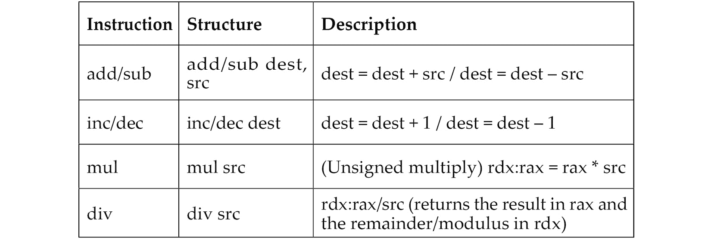

重要说明

对于将操作数视为有符号整数的乘法和除法，相应的指令将是`imul`和`idiv`。

以下指令表示逻辑/位操作：

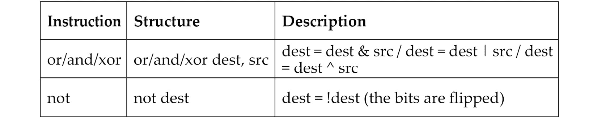

最后，以下指令表示位移和旋转操作：

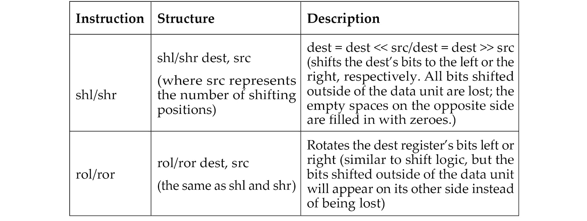

要了解更多关于位运算的潜在应用，请阅读*第一章*，*网络犯罪、APT 攻击与研究策略*。

### 数据传输指令

移动数据的最基本指令是`mov`，它将*src*的值复制到*dest*。该指令有多种形式，如下表所示：

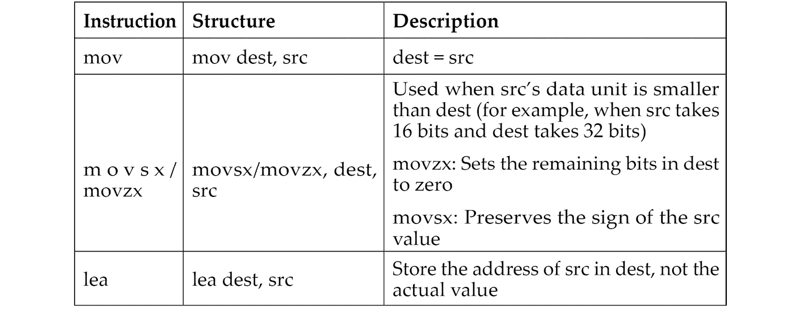

以下是与栈相关的指令：

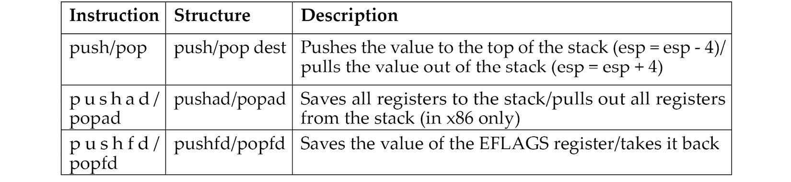

以下是字符串操作指令：

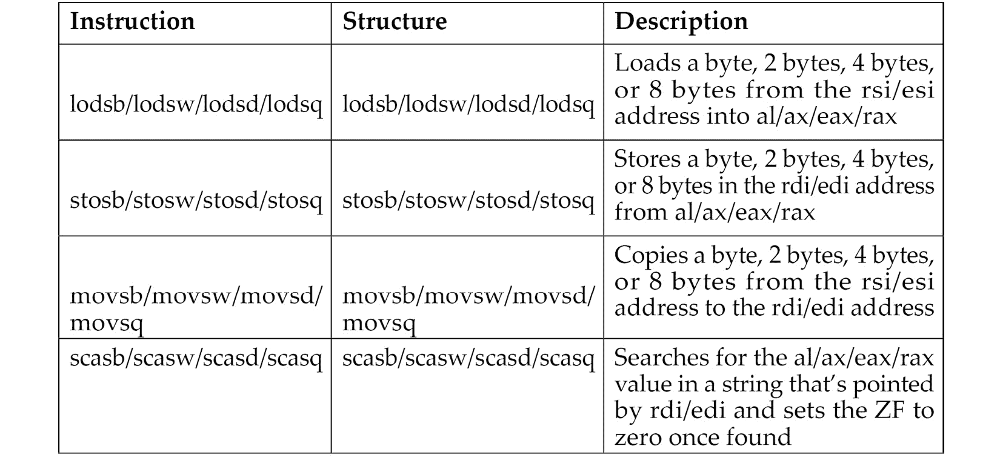

重要说明

如果 EFLAGS 寄存器中的 DF 位为 0，这些指令将根据使用的字节数（1, 2, 4 或 8）增加 rdi/edi 或 rsi/esi 寄存器的值，如果 DF 位被设置（等于 1），则会减少该值。

### 控制流指令

这些指令会改变 rip/eip 寄存器的值，因此接下来要执行的指令可能不是顺序上的下一条。最重要的无条件跳转指令如下：

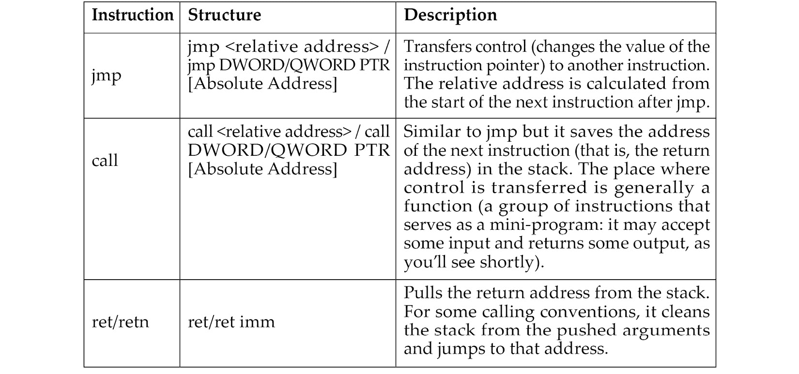

为了实现条件，需要使用某种形式的比较。有专门的指令来实现这一点：

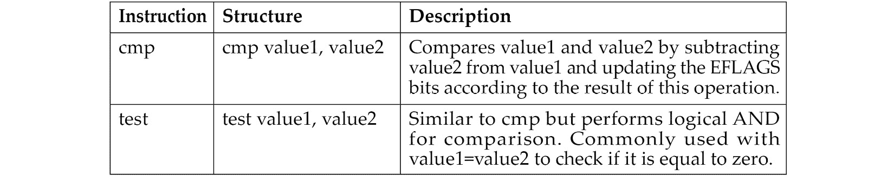

以下表格显示了基于此比较结果的一些最重要的条件重定向：

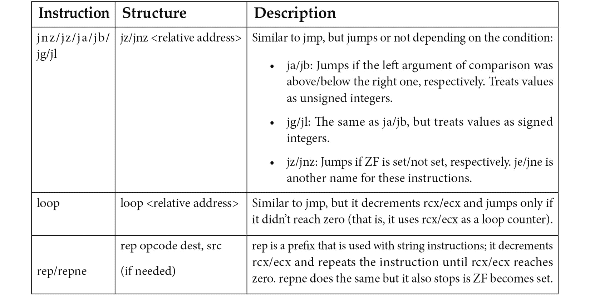

现在，让我们谈谈如何将值传递给函数并在函数中访问它们。

## 参数、局部变量和调用约定（在 x86 和 x64 中）

参数可以通过多种方式传递给函数。这些方式被称为**调用约定**。在本节中，我们将介绍最常见的调用约定。我们将从**标准调用**（**stdcall**）约定开始，它通常用于 IA-32 架构，然后介绍它与其他约定之间的差异。

### stdcall

堆栈，以及 rsp/esp 和 rbp/ebp 寄存器，在处理参数和局部变量时承担了大部分工作。`call`指令在将执行转移到新函数之前，将返回地址保存到堆栈的顶部，而`ret`指令在函数结束时通过堆栈中保存的返回地址将执行返回给调用者函数。

#### 参数

在 stdcall 中，参数从最后一个到第一个（*从右到左*）被压入堆栈，如下所示：

```
push Arg02 
push Arg01 
call Func01
```

在`Func01`函数中，参数可以通过`esp`访问，但每次有新值被推入或弹出时，始终调整偏移量会很困难：

```
mov eax, [esp + 8] ; Arg01
push eax
mov ecx, [esp + C] ; Arg01 keeping in mind the previous push
```

幸运的是，现代静态分析工具，如`ebp`。首先，被调用的函数需要将当前的`esp`保存在`ebp`寄存器中，然后再访问它，如下所示：

```
push ebp
mov ebp, esp
...
mov ecx, [ebp + 8] ; Arg01
push eax
mov ecx, [ebp + 8] ; still Arg01 (no changes)
```

在被调用函数的末尾，它会返回原始的`ebp`和`esp`值，如下所示：

```
mov esp, ebp
pop ebp 
ret
```

由于它是常见的函数尾部处理，Intel 为此创建了一个特殊的指令，称为

`leave`，因此变成如下：

```
leave 
ret
```

#### 局部变量

对于局部变量，被调用的函数通过减小`esp`寄存器的值来为它们分配空间。要为两个每个 4 字节的变量分配空间，可以使用以下代码：

```
push ebp
mov ebp, esp 
sub esp, 8
```

再次，函数的结尾将如下所示：

```
mov ebp, esp 
pop ebp 
ret
```

以下图示例展示了函数开始和结束时堆栈变化的样子：

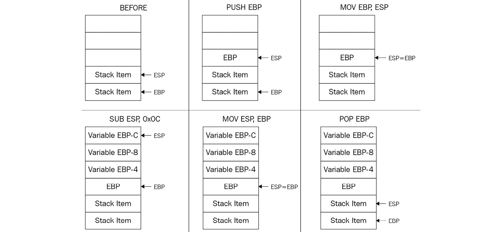

图 2.6 – 函数开始和结束时堆栈变化的示例

此外，如果有参数，`ret`指令会根据需要从堆栈顶部弹出相应的字节，从而清理堆栈，如下所示：

```
ret 8 ; 2 arguments, 4 bytes each
```

### cdecl

*cdecl*（代表 C 声明）是另一种调用约定，许多 C 编译器在 x86 中使用过它。它与 stdcall 非常相似，唯一的区别是调用者在被调用函数（即被调用的函数）返回后清理堆栈，如下所示：

```
Caller:
  push Arg02 
  push Arg01 
  call Callee
  add esp, 8 ; cleans up the stack
```

### fastcall

*fastcall*调用约定也被不同的编译器广泛使用，包括 Microsoft C++编译器和 GCC。此调用约定将前两个参数传递给 ecx 和 edx，将其余的参数通过堆栈传递。同样，它仅在 x86 的 32 位版本中使用。

### thiscall

对于面向对象编程和非静态成员函数（例如类的函数），C 编译器需要将将要访问或操作其属性的对象的地址作为参数传递。

在 GCC 编译器中，*thiscall*几乎与 cdecl 调用约定相同，并且将当前对象的地址（即，*this*）作为第一个参数传递。但在 Microsoft C++编译器中，它类似于 stdcall，并将对象的地址传递给 ecx。这样的模式在某些面向对象的恶意软件家族中很常见。

### Borland 寄存器

这种约定通常出现在使用 Delphi 编程语言编写的恶意软件中。前三个参数通过 eax、edx 和 ecx 寄存器传递，而其余参数通过堆栈传递。然而，与其他约定不同的是，它们按相反的顺序传递——*从左到右*。如果有必要，堆栈清理工作将由被调用函数（callee）来完成。

### Microsoft x64 调用约定

在 x64 中，调用约定更加依赖于寄存器。对于 Windows，调用函数按照以下顺序将前四个参数传递给寄存器：rcx、rdx、r8、r9。其余的通过堆栈传递。调用函数（caller）最终清理堆栈（如果有必要）。

### System V AMD64 ABI

对于其他 64 位操作系统，如 Linux、FreeBSD 或 macOS，前六个参数按以下顺序传递给寄存器：rdi、rsi、rdx、rcx、r8、r9。其余的通过堆栈传递。同样，如果有必要，最终由调用者清理堆栈。这是 64 位操作系统上唯一的处理方式。

# 探索 ARM 汇编

你们大多数人可能对 x86 架构更为熟悉，它实现了 CISC 设计。所以你们可能会想，*为什么我们需要别的东西？* RISC 架构的主要优势在于，实施它们的处理器通常需要较少的晶体管，最终使得它们在能效和热效率方面表现更好，并且降低了相关的制造成本，使其成为便携设备的更好选择。我们选择从 ARM 开始介绍 RISC 架构是有充分理由的——在撰写本文时，它是全球使用最广泛的架构。

解释很简单——实现它的处理器可以在多种移动设备和家电中找到，如手机、视频游戏控制台或数码相机，远远超过了 PC。因此，针对 Android 和 iOS 平台的多种物联网恶意软件家族和移动恶意软件，具有针对 ARM 架构的有效载荷；一个例子可以在以下截图中看到：

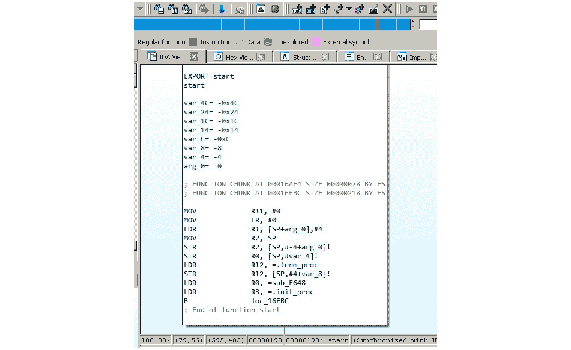

](img/Figure_2.7_B18500.jpg)

图 2.7 – 反汇编的针对 ARM 架构设备的物联网恶意软件

因此，要分析它们，必须了解 ARM 是如何工作的。

ARM 最初代表 Acorn RISC 机器，后来代表高级 RISC 机器。Acorn 是一家英国公司，被许多人认为是英国的苹果公司，生产了当时一些最强大的个人电脑。后来，Acorn 被拆分成多个独立实体，其中 Arm Holdings（目前由软银集团拥有）支持并扩展了当前的标准。

它被多个操作系统支持，包括 Windows、Android、iOS、各种 Unix/Linux 发行版以及许多其他较不知名的嵌入式操作系统。64 位地址空间的支持在 2011 年通过 ARMv8 标准的发布得以增加。

总体而言，以下 ARM 架构配置文件是可用的：

+   **应用程序配置文件（后缀 A，例如 Cortex-A 系列）**：这些配置文件实现了传统的 ARM 架构，并支持基于 MMU 的虚拟内存系统架构。这些配置文件支持 ARM 和 Thumb 指令集（稍后会讨论）。

+   **实时配置文件（后缀 R，例如 Cortex-R 系列）**：这些配置文件实现了传统的 ARM 架构，并支持基于**内存保护单元**（**MPU**）的受保护内存系统架构。

+   **微控制器配置文件（后缀 M，例如 Cortex-M 系列）**：这些配置文件实现了一种程序员模型，并且设计为能够集成到**现场可编程门阵列**（**FPGAs**）中。

每个系列都有其对应的体系结构集（例如，Cortex-A 32 位系列包括 ARMv7-A 和 ARMv8-A 架构），而这些架构又包含多个核心（例如，ARMv7-R 架构包括 Cortex-R4、Cortex-R5 等）。

## 基础知识

本节中，我们将涵盖原始的 32 位架构和更新的 64 位架构。随着时间的推移，发布了多个版本，从 ARMv1 开始。在本书中，我们将重点讨论它们的最新版本。

ARM 是一种加载-存储架构；它将所有指令分为以下两类：

+   **内存访问**：在内存和寄存器之间移动数据

+   **算术逻辑单元（ALU）操作**：执行涉及寄存器的计算

ARM 支持加法、减法和乘法运算，尽管从 ARMv7 开始，一些新版本也支持除法。它还支持大端序，但默认使用小端序。

在 32 位 ARM 中，始终可见 16 个寄存器：R0-R15。这个数字很方便，因为只需要 4 位就能定义将要使用哪个寄存器。其中 13 个（有时称为 14 个，包括 R14 或 15，也包括 R13）是通用寄存器：R13 和 R15 各自具有特殊功能，而 R14 有时也可以使用。让我们更详细地了解它们：

+   **R0-R7**：低寄存器在所有 CPU 模式中都是相同的。

+   **R8-R12**：高寄存器在所有 CPU 模式中都是相同的，除了**快速中断请求**（**FIQ**）模式，该模式无法通过 16 位指令访问。

+   **R13（也称为 SP）**：这是一个栈指针，指向栈顶。每个 CPU 模式都有一个版本。建议不要将其用作通用寄存器。

+   执行`BL`（带链接分支）或`BLX`（带链接分支并交换）指令时。如果返回地址存储在堆栈上，它也可以用作通用寄存器。每个 CPU 模式都有一个版本。

+   **R15（也称为 PC）**：这是一个程序计数器，指向当前执行的指令。它不是一个通用寄存器。

总的来说，在大多数 ARM 架构中，通常有 30 个通用的 32 位寄存器，包括不同 CPU 模式下具有相同名称的实例。

除此之外，还有一些其他重要的寄存器，如下所示：

+   **应用程序状态寄存器**（**APSR**）：该寄存器存储 ALU 状态标志的副本，也称为条件码标志。在后来的架构中，它还保存 Q（饱和）标志和大于或等于（GE）标志。

+   **当前程序状态寄存器**（**CPSR**）：该寄存器包含 APSR 以及描述当前处理器模式、状态、字节序和其他一些值的位。

+   **保存的程序状态寄存器**（**SPSR**）：该寄存器在发生异常时存储 CPSR 的值，以便稍后恢复。每个 CPU 模式都有一个版本，除了用户模式和系统模式，因为它们不是异常处理模式。

**浮点寄存器**（**FPRs**）的数量在 32 位架构中可能有所不同，具体取决于核心。最多可以有 32 个。

ARMv8（64 位）有 31 个通用 X0-X30 寄存器（也可以看到 R0-R30 符号）和 32 个始终可访问的 FPR。每个寄存器的低部分带有 W 前缀，可以作为 W0-W30 进行访问。

一些寄存器具有特定的用途，如下所示：

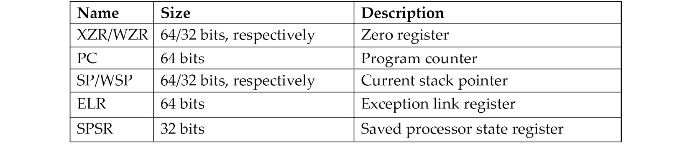

ARMv8 定义了四个异常级别（EL0-EL3），最后三个寄存器每个都保存一份副本；ELR 和 SPSR 没有 EL0 的单独副本。

没有名为 X31 或 W31 的寄存器；在许多指令中，数字 31 代表零寄存器 ZR（WZR/XZR）或 SP（用于栈相关操作）。X29 可以用作帧指针（存储原始栈位置），而 X30 可以用作链接寄存器（存储来自函数的返回值）。

关于调用约定，32 位 ARM 的 R0-R3 和 64 位 ARM 的 X0-X7 用于存储传递给函数的参数值，剩余的参数通过堆栈传递——如果需要，R0-R1 和 X0-X7（以及 X8，也称为 XR 间接）用于保存返回结果。如果返回值的类型太大，无法适配它们，那么需要分配空间并以指针的形式返回。除此之外，R12（32 位）和 X16-X17（64 位）可用作过程调用中的临时寄存器（通过所谓的外壳程序和过程链接表代码），R9（32 位）和 X18（64 位）可用作平台寄存器（用于操作系统特定的目的），如果需要；否则，它们与其他临时寄存器的使用方式相同。

如前所述，几种 CPU 模式是根据官方文档实现的，如下所示：

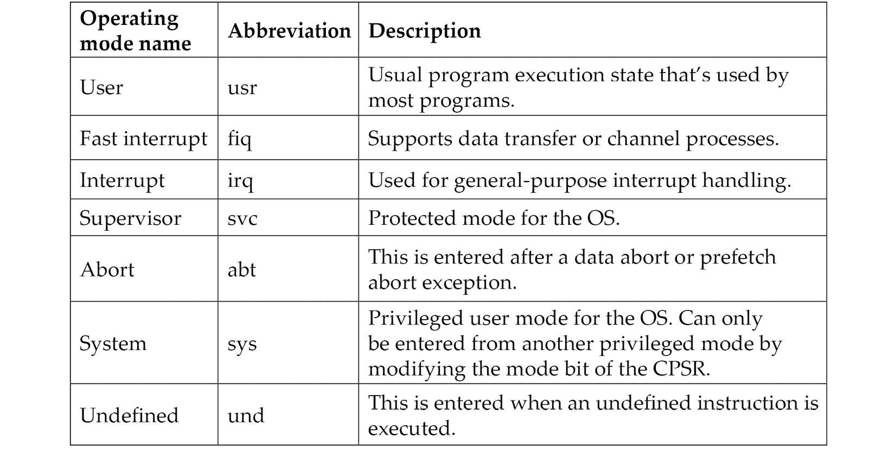

## 指令集

ARM 处理器有几种指令集：ARM 和 Thumb。当处理器执行 ARM 指令时，称其处于 ARM 状态，反之亦然。ARM 处理器通常从 ARM 状态开始；然后，程序可以通过使用 BX 指令切换到 Thumb 状态。**Thumb 执行环境** (**ThumbEE**) 是在 ARMv7 中相对较新引入的，基于 Thumb，并进行了某些更改和添加，以便于动态生成代码。

ARM 指令的长度为 32 位（对于 AArch32 和 AArch64 都是如此），而 Thumb 和 ThumbEE 指令的长度为 16 位或 32 位（最初，几乎所有 Thumb 指令都是 16 位的，而 Thumb-2 引入了 16 位和 32 位指令的混合）。

所有指令都可以根据官方文档分为以下几类：

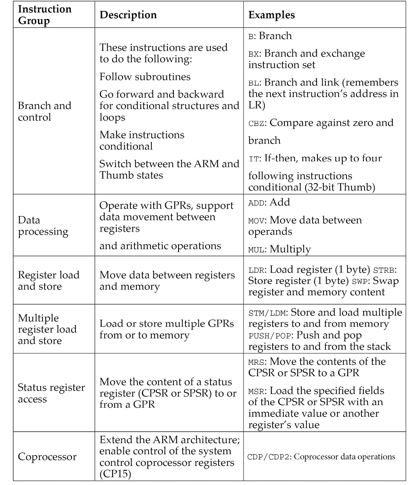

要与操作系统交互，可以通过使用`SWI`指令访问*系统调用*，该指令后来被重命名为`SVC`指令。

请参阅官方 ARM 文档，以获取任何指令的准确语法。下面是一个示例：

```
SVC{cond} #imm
```

在这种情况下，*{cond}*代码将是一个条件码。ARM 支持几种条件码，如下所示：

+   **EQ**: 等于

+   **NE**: 不等于

+   **CS/HS**: 有进位或无符号较高或两者

+   **CC/LO**: 无进位或无符号较低

+   **MI**: 负数

+   **PL**: 正数或零

+   **VS**: 溢出

+   **VC**: 无溢出

+   **HI**: 无符号大于

+   **LS**: 无符号较低或两者

+   **GE**: 大于或等于

+   **LT**: 小于

+   **GT**: 大于

+   **LE**: 小于或等于

+   **AL**: 始终（通常省略）

+   **imm:** 表示立即数值

现在，让我们看看 MIPS 的基础知识。

# MIPS 基础

**无互锁流水线阶段的微处理器**（**MIPS**）由 MIPS 技术公司（前身为 MIPS 计算机系统）开发。与 ARM 类似，最初它是一个 32 位架构，后来增加了 64 位功能。利用 RISC 指令集架构（ISA）的优势，MIPS 处理器的特点是低功耗和低热量消耗。它们通常可以在多种嵌入式系统中找到，如路由器和网关。像索尼 PlayStation 这样的多个游戏主机也采用了它们。不幸的是，由于这一架构的普及，实施它的系统成为了多个物联网恶意软件家族的攻击目标。一个例子可以在以下截图中看到：

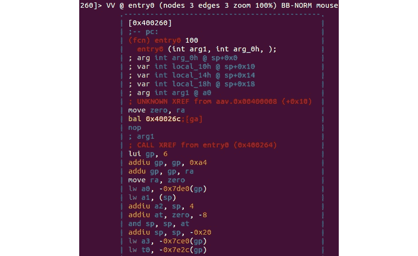

图 2.8 – 针对 MIPS 架构系统的物联网恶意软件

随着架构的演变，出现了多个版本，从 MIPS I 开始，一直到 V 版，然后是多个更新的 MIPS32/MIPS64 版本。MIPS64 与 MIPS32 向后兼容。这些基础架构可以通过可选的架构扩展（称为**应用特定扩展**，**ASEs**）进一步补充，增加某些任务的性能，这些任务通常不被恶意代码广泛使用。MicroMIPS32/64 是 MIPS32 和 MIPS64 架构的超集，几乎具有相同的 32 位指令集，并增加了 16 位指令以减少代码大小。它们用于需要代码压缩的场景，专为微控制器和其他小型嵌入式设备设计。

## 基础知识

MIPS 支持双字节序。以下寄存器可用：

+   32 个 GPR 寄存器 r0-r31 – 在 MIPS32 中为 32 位大小，在 MIPS64 中为 64 位大小。

+   一个特殊用途的 PC 寄存器，仅能通过某些指令间接影响。

+   两个专用寄存器用于存储整数乘法和除法的结果（HI 和 LO）。这些寄存器及其相关指令在第 6 版的基础指令集中被移除，现在存在于**数字信号处理器**（**DSP**）模块中。

32 个 GPR 的原因很简单 – MIPS 使用 5 位来指定寄存器，因此可以有最多 2⁵ = 32 个不同的值。两个 GPR 具有特定的用途，如下所示：

+   寄存器 r0（有时称为$0 或$zero）是一个常量寄存器，始终存储零，并提供只读访问。它可以用作/dev/null 的类似物来丢弃某些操作的输出，或者作为零值的快速源。

+   r31（也称为$ra）在过程调用分支/跳转和链接指令期间存储返回地址。

其他寄存器通常用于特定的目的，如下所示：

+   **r1（也称为$at）**：汇编临时寄存器 – 在解决伪指令时使用

+   **r2-r3（也称为$v0 和$v1）**：值 – 存储返回函数值。

+   **r4-r7（也叫做 $a0-$a3）**：参数寄存器 – 用于传递函数参数。

+   **r8-r15（也叫做 $t0-$t7/$a4-$a7 和 $t4-$t7）**：临时寄存器 – 前四个寄存器在 N32 和 N64 调用约定中也可以用来传递函数参数（另一个 O32 调用约定仅使用 r4-r7 寄存器；后续参数通过栈传递）。

+   **r16-r23（也叫做 $s0-$s7）**：保存的临时寄存器 – 跨函数调用时保持不变。

+   **r24-r25（也叫做 $t8-$t9）**：临时寄存器。

+   **r26-r27（也叫做 $k0-$k1）**：通常保留给操作系统内核使用。

+   **r28（也叫做 $gp）**：全局指针 – 指向全局区域（数据段）。

+   **r29（也叫做 $sp）**：栈指针。

+   **r30（也叫做 $s8 或 $fp）**：保存的值/帧指针 – 存储原始栈指针（函数调用前的值）。

MIPS 还提供以下协处理器：

+   **CP0**：系统控制

+   **CP1**：FPU

+   **CP2**：特定实现

+   **CP3**：FPU（具有专用的 COP1X 操作码类型指令）

## 指令集

大多数主要指令在 MIPS I 和 II 中引入。MIPS III 引入了 64 位整数和地址，而 MIPS IV 和 V 改进了浮点运算，并增加了一组新的指令以提高整体效率。每条指令的长度都是固定的 – 即 32 位（4 字节） – 所有指令都以一个占 6 位的操作码开始。支持的三种主要指令格式是 R、I 和 J：

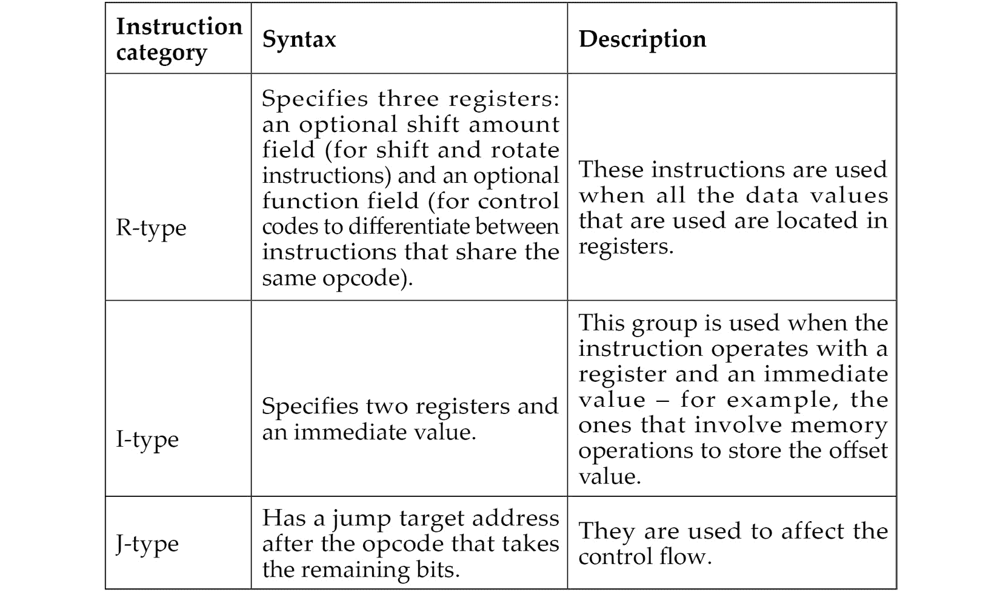

对于与 FPU 相关的操作，存在类似的 FR 和 FI 类型。

除此之外，还存在一些其他不常见的格式，主要是协处理器和扩展相关的格式。

在文档中，寄存器通常会带有以下后缀：

+   源（s）

+   目标（t）

+   目标（d）

所有指令都可以根据功能类型分为以下几组：

+   `JR`：跳转寄存器（J 格式）

+   `BLTZ`：小于零时分支（I 格式）

+   `LB`：加载字节（I 格式）*   `SW`：存储字（I 格式）*   `ADDU`：无符号加法（R 格式）*   `XOR`：异或（R 格式）*   `SLL`：逻辑左移（R 格式）*   `SYSCALL`：系统调用（自定义格式）*   `BREAK`：断点（自定义格式）

浮点指令通常会有类似名称来表示相同类型的操作，比如 `ADD.S`。一些指令则较为独特，例如“检查是否相等”（`C.EQ.D`）。

如我们所见，这些基本组可以适用于几乎任何架构，唯一的区别在于它们的实现。一些常见的操作可能会获得指令以利用优化，从而减少代码大小并提高性能。

由于 MIPS 指令集较为简洁，因此也存在汇编宏，称为伪指令。以下是一些常用的伪指令：

+   `ABS`：绝对值 – 转换为 `ADDU`、`BGEZ` 和 `SUB` 的组合

+   `BLT`：小于分支——相当于`SLT`和`BNE`的组合

+   `BGT/BGE/BLE`：类似于`BLT`

+   `LI/LA`：加载立即数/地址——相当于`LUI`和`ORI`的组合，或者用于 16 位 LI 的`ADDIU`

+   `MOVE`：将一个寄存器的内容移动到另一个寄存器——相当于用零值的`ADD/ADDIU`指令

+   `NOP`：无操作——相当于用零值的`SLL`指令

+   `NOT`：逻辑非——相当于`NOR`

# 深入探讨 PowerPC

**PowerPC**代表**优化性能的增强型 RISC—性能计算**，有时也简称为 PPC。它是由苹果、IBM 和摩托罗拉（常缩写为 AIM）在 1990 年代初创建的。最初旨在用于 PC，并为苹果产品提供动力，包括 PowerBook 和 iMac，直到 2006 年。实现这一架构的 CPU 还出现在游戏机中，如索尼 PlayStation 3、XBOX 360 和 Wii，以及 IBM 服务器和多种嵌入式设备，如汽车和飞机控制器，甚至是著名的 ASIMO 机器人。后来，管理责任转交给了一个开放标准机构 Power.org，一些前创始公司仍然是成员，如 IBM 和 Freescale。后者脱离摩托罗拉并被 NXP 半导体收购。OpenPOWER 基金会是 IBM、谷歌、NVIDIA、Mellanox 和 Tyan 的新兴合作项目，旨在促进这一技术的协作开发。

PowerPC 主要基于 IBM 的 POWER ISA。后来，发布了一个统一的 Power ISA，将 POWER 和 PowerPC 合并为一个单一的 ISA，现在在多个 Power 架构下的产品中使用。

有很多面向该架构的物联网恶意软件家族。

## 基础

Power ISA 被分为多个类别，每个类别可以在规范或书籍的特定部分找到。CPU 根据其类别实现这些类别的集合；只有基础类别是强制性的。

下面是最新第二版标准中主要类别及其定义的列表：

+   **Base**：在第一册（*Power ISA 用户指令集架构*）和第二册（*Power ISA 虚拟环境架构*）中有介绍

+   **Server**：在第三册-S（*Power ISA 操作环境架构—服务器环境*）中有介绍

+   **Embedded**：在第三册-E（*Power ISA 操作环境架构—嵌入式环境*）中有介绍

还有许多更为细化的类别，涵盖了诸如浮点操作和某些指令的缓存等方面。

另一本书，Book VLE（*Power ISA 操作环境架构—可变长度编码（VLE）指令架构*），定义了替代指令和定义，旨在通过使用 16 位指令而非常见的 32 位指令来提高代码的密度。

Power ISA 版本 3 由三本书组成，名称与先前标准的第一至第三本书相同，环境间没有区别。

处理器以大端模式启动，但可以通过改变**机器状态寄存器**（**MSR**）中的一个位来切换，从而支持双端模式。

许多寄存器组在 Power ISA 中有文档记录，主要围绕相关设施或类别进行分组。以下是最常用的一些基本总结：

+   32 个 GPR 用于整数操作，通常仅通过它们的编号使用（64 位）

+   64 个**向量标量寄存器**（**VSRs**）用于向量操作和浮点操作：

    +   作为 VSR 的一部分，32 个**向量寄存器**（**VRs**），用于向量操作（128 位）

    +   作为 VSR 的一部分，32 个 FPR 用于浮点操作（64 位）

+   专用定点设施寄存器，例如以下内容：

    +   定点**异常寄存器**（**XER**），包含多个状态位（64 位）

+   分支设施寄存器：

    +   **条件寄存器 (CR)**：由八个 4 位字段组成，CR0-CR7，涉及控制流和比较等内容（32 位）

    +   **链接寄存器（LR）**：提供分支目标地址（64 位）

    +   **计数寄存器（CTR）**：保存循环计数（64 位）

    +   **目标访问寄存器（TAR）**：指定分支目标地址（64 位）

+   定时器设施寄存器：

    +   **时间基准（TB）**：以定义的频率周期性增加（64 位）

+   来自特定类别的其他专用寄存器，包括以下内容：

    +   **累加器**（**ACC**）（64 位）：**信号处理引擎**（**SPE**）类别

通常，函数可以通过寄存器传递所有参数，用于非递归调用；额外的参数通过栈传递。

## 指令集

大多数指令为 32 位；只有 VLE 组的指令较小，以提供更高的代码密度，适用于嵌入式应用。所有指令分为以下三类：

+   **已定义**：所有指令都在 Power ISA 文档中定义。

+   **非法**：用于 Power ISA 的未来扩展。尝试执行它们将会调用非法指令错误处理程序。

+   **保留**：分配给 Power ISA 范围之外的特定用途。尝试执行这些指令将会导致执行已实现的操作，或在实现不可用时调用非法指令错误处理程序。

位 0 到 5 始终指定操作码，许多指令也具有扩展操作码。支持大量的指令格式；以下是一些示例：

+   I-FORM [OPCD+LI+AA+LK]

+   B-FORM [OPCD+BO+BI+BD+AA+LK]

每个指令字段都有缩写和含义；参考官方 Power ISA 文档获取完整的指令和它们相应格式的列表是有意义的。就 I-FORM 而言，它们如下：

+   **OPCD**：操作码

+   **LI**：立即数字段，用于指定一个 24 位有符号的二进制补码整数

+   **AA**：绝对地址位

+   **LK**: 链接位，影响链接寄存器

指令也根据相关设施和类别分为不同组，因此它们与寄存器非常相似：

+   分支指令：

    +   `b/ba/bl/bla`: 分支

    +   `bc/bca/bcl/bcla`: 分支条件

    +   `sc`: 系统调用

+   固定点指令：

    +   `lbz`: 加载字节并清零

    +   `stb`: 存储字节

    +   `addi`: 加法立即数

    +   `ori`: 或操作立即数

+   浮点指令：

    +   `fmr`: 浮点寄存器移动

    +   `lfs`: 加载单精度浮点数

    +   `stfd`: 存储双精度浮点数

+   SPE 指令：

    +   `brinc`: 位反转递增

# 涵盖了 SuperH 汇编语言

SuperH，通常缩写为 SH，是由日立开发的 RISC 指令集架构（ISA）。SuperH 经历了多个版本，从 SH-1 开始，发展到 SH-4。较新的 SH-5 有两种操作模式，其中一种与 SH-4 的用户模式指令相同，而另一种 SHmedia 则大相径庭。每个系列都有其市场定位：

+   **SH-1**: 家用电器

+   **SH-2**: 汽车控制器和视频游戏控制台，如 Sega Saturn

+   **SH-3**: 移动应用，如车载导航系统

+   **SH-4**: 汽车多媒体终端和视频游戏控制台，如 Sega Dreamcast

+   **SH-5**: 高端多媒体应用

实现此架构的微控制器和 CPU 目前由瑞萨电子生产，瑞萨是日立和三菱半导体集团的合资企业。由于 IoT 恶意软件主要针对基于 SH-4 的系统，因此我们将重点关注此 SuperH 系列。

## 基本概念

在寄存器方面，SH-4 提供了以下功能：

+   16 个通用寄存器 R0-R15（32 位）

+   七个控制寄存器（32 位）：

    +   **全局基址寄存器** (**GBR**)

    +   **状态寄存器** (**SR**)

    +   **保存状态寄存器** (**SSR**)

    +   **保存程序计数器** (**SPC**)

    +   **向量基址计数器** (**VBR**)

    +   **保存通用寄存器 15** (**SGR**)

    +   **调试基址寄存器** (**DBR**)（仅限特权模式）

+   四个系统寄存器（32 位）：

    +   **MACH/MACL**: 乘法累加寄存器

    +   **PR**: 程序寄存器

    +   **PC**: 程序计数器

    +   **FPSCR**: 浮点状态/控制寄存器

+   32 个 FPU 寄存器——即 FR0-FR15（也称为 DR0/2/4/... 或 FV0/4/...）和 XF0-XF15（也称为 XD0/2/4/... 或 XMTRX）；两个银行，每个银行包含 16 个单精度（32 位）或 8 个双精度（64 位）浮点寄存器和 **FPULs** (**浮点通信寄存器**)（32 位）

通常，R4-R7 用于传递函数参数，结果则保存在 R0 中。R8-R13 在多次函数调用之间保存。R14 作为帧指针，R15 作为栈指针。

关于数据格式，在 SH-4 中，一个字占 16 位，一个长字占 32 位，一个四字占 64 位。

支持两种处理器模式：用户模式和特权模式。SH-4 通常在用户模式下操作，并在发生异常或中断时切换到特权模式。

## 指令集

SH-4 具有向后兼容 SH-1、SH-2 和 SH-3 系列的指令集。它使用 16 位固定长度指令来减少程序代码的大小。除了`BF`和`BT`外，所有分支指令和`RTE`（异常返回指令）都实现了所谓的延迟分支，其中分支后面的指令在分支目标指令之前执行。

所有指令分为以下类别（包含一些示例）：

+   定点传输指令：

    +   `MOV`: 移动数据（或指定的特定数据类型）

    +   `SWAP`: 交换寄存器的半部分

+   算术运算指令：

    +   `SUB`: 减去二进制数

    +   `CMP/EQ`: 有条件比较（在这种情况下，比较相等）

+   逻辑运算指令：

    +   `AND`: 逻辑与

    +   `XOR`: 排他性逻辑或

+   移位/旋转指令：

    +   `ROTL`: 左旋转

    +   `SHLL`: 逻辑左移

+   分支指令：

    +   `BF`: 如果为假则跳转

    +   `JMP`: 跳转（无条件分支）

+   系统控制指令：

    +   `LDC`: 加载到控制寄存器

    +   `STS`: 存储系统寄存器

+   浮点单精度指令：

    +   `FMOV`: 浮点移动

+   浮点双精度指令：

    +   `FABS`: 浮点绝对值

+   浮点控制指令：

    +   `LDS`: 加载到 FPU 系统寄存器

+   浮点图形加速指令

    +   `FIPR`: 浮点内积

# 使用 SPARC

**可扩展处理器架构** (**SPARC**) 是一种 RISC 指令集架构，最初由 Sun Microsystems（现为 Oracle 公司的一部分）开发。首个实现被用于 Sun 自家的工作站和服务器系统。之后，它被授权给多个其他制造商，其中之一是富士通。随着 Oracle 在 2017 年终止了 SPARC 设计，未来的开发由富士通继续，成为 SPARC 服务器的主要供应商。

有几种完全开源的 SPARC 架构实现。多个操作系统目前支持它，包括 Oracle Solaris、Linux 和 BSD 系统，同时多种物联网恶意软件家族也为其提供了专门的模块。

## 基本知识

根据 Oracle SPARC 架构文档，实施可能包含 72 到 640 个通用 64 位 R 寄存器。然而，在任何时刻，只有 31/32 个 GPR 是立即可见的；其中八个是全局寄存器，R[0]至 R[7]（也称为 g0-g7），第一个寄存器 g0 是硬连接到 0 的；24 个与以下寄存器窗口相关：

+   **八个输入寄存器 in[0]-in[7] (R[24]-R[31])**: 用于传递参数和返回结果

+   **八个本地寄存器 local[0]-local[7] (R[16]-R[23])**: 用于保留局部变量

+   **八个输出寄存器 out[0]-out[7] (R[8]-R[15])**: 用于传递参数和返回结果

`CALL` 指令将其地址写入 out[7] (R[15]) 寄存器。

要将参数传递给函数，必须将它们放入输出寄存器中。当函数获得控制权时，它将访问这些寄存器。额外的参数可以通过栈传递。结果将放入第一个寄存器中，返回时该寄存器将变为第一个输出寄存器。`SAVE`和`RESTORE`指令在此切换中用于分别分配新的寄存器窗口并恢复先前的窗口。

SPARC 还具有 32 个单精度 FPR（32 位）、32 个双精度 FPR（64 位）和 16 个四倍精度 FPR（128 位），其中一些是重叠的。

此外，还有许多其他寄存器用于特定目的，包括以下内容：

+   **FPRS**：包含 FPU 模式和状态信息

+   **附加状态寄存器（ASR 0、ASR 2-6、ASR 19-22 和 ASR 24-28 不是保留的）**：这些寄存器有多个用途，包括以下内容：

    +   **ASR 2**：**条件代码寄存器（CCR）**

    +   **ASR 5**：PC

    +   **ASR 6**：FPRS

    +   **ASR 19**：**通用状态寄存器**（**GSR**）

+   **寄存器窗口 PR 状态寄存器**（**PR 9-14**）：这些寄存器决定寄存器窗口的状态，包括以下内容：

    +   **PR 9**：当前窗口指针（CWP）

    +   **PR 14**：窗口状态（WSTATE）

+   **非寄存器窗口 PR 状态寄存器（PR 0-3、PR 5-8 和 PR 16）**：仅对在特权模式下运行的软件可见

32 位 SPARC 使用大端序，而 64 位 SPARC 使用大端指令，但可以以任何顺序访问数据。SPARC 还使用陷阱的概念，利用一个专用表将控制转移到特权软件，该表可能包含每个陷阱处理程序的前八条指令（某些常用陷阱有 32 条）。该表的基地址由软件在**陷阱基地址**（**TBA**）寄存器中设置。

## 指令集

从内存位置获取由 PC 指定的指令并执行。然后，新的值被分配给 PC 和**下一个程序计数器**（**NPC**），NPC 是一个伪寄存器。

详细的指令格式可以在各个指令描述中找到。以下是支持的基本指令类别及示例：

+   内存访问：

    +   `LDUB`：加载无符号字节

    +   `ST`：存储

+   算术/逻辑/移位整数：

    +   `ADD`：加法

    +   `SLL`：逻辑左移

+   控制转移：

    +   `BE`：等于时跳转

    +   `JMPL`：跳转并链接

    +   `CALL`：调用并链接

    +   `RETURN`：从函数返回

+   状态寄存器访问：

    +   `WRCCR`：写入 CCR

+   浮点运算：

    +   `FOR`：F 寄存器的逻辑或

+   条件移动：

    +   `MOVcc`：当选择的条件代码（cc）条件为真时移动

+   寄存器窗口管理：

    +   `SAVE`：保存调用者的窗口

    +   `FLUSHW`：刷新寄存器窗口

+   `FPSUB`：F 寄存器的分区整数减法

# 从汇编语言到高级编程语言的转变

开发人员通常不会直接编写汇编代码，而是使用更高级的语言，如 C 或 C++，然后编译器将这些高级代码转换为汇编语言中的低级表示。在本节中，我们将查看不同的汇编代码块。

## 算术语句

让我们看一下不同的 C 语句以及它们在汇编中的表示方式。我们将使用 Intel IA-32 作为示例。相同的概念也适用于其他汇编语言：

+   X = 50 （假设 0x00010000 是 X 变量在内存中的地址）：

    ```
    mov eax, 50
    mov dword ptr [00010000h], eax
    ```

+   X = Y + 50 （假设 0x00010000 表示 X，0x00020000 表示 Y）：

    ```
    mov eax, dword ptr [00020000h]
    add eax, 50
    mov dword ptr [00010000h], eax
    ```

+   X = Y + (50 * 2)：

    ```
    mov eax, dword ptr [00020000h]
    push eax    ; save Y for now
    mov eax, 50 ; do the multiplication first
    mov ebx, 2
    imul ebx    ; the result is in edx:eax
    mov ecx, eax
    pop eax     ; gets back Y value
    add eax, ecx
    mov dword ptr [00010000h], eax
    ```

+   X = Y + (50 / 2)：

    ```
    mov eax, dword ptr [00020000h]
    push eax ; save Y for now
    mov eax, 50
    mov ebx,2
    div ebx  ; the result is in eax, and the remainder is in edx
    mov ecx, eax
    pop eax
    add eax, ecx
    mov dword ptr [00010000h], eax
    ```

+   X = Y + (50 % 2) （% 表示取余运算）：

    ```
    mov eax, dword ptr [00020000h]
    push eax ; save Y for now
    mov eax, 50
    mov ebx, 2
    div ebx  ; the remainder is in edx
    mov ecx, edx
    pop eax
    add eax, ecx
    mov dword ptr [00010000h], eax
    ```

希望这能解释编译器是如何将这些算术语句转换成汇编语言的。

## 如果条件

基本的 *if* 语句可能像这样：

+   If (X == 50) （假设 0x0001000 表示 X 变量）：

    ```
    mov eax, 50
    cmp dword ptr [00010000h], eax
    ```

+   If (X & 00001000b) （| 表示逻辑与运算）：

    ```
    mov eax, 000001000b
    test dword ptr [00010000h], eax
    ```

为了理解分支和流向重定向，我们来看一下下面的图表，它展示了在伪代码中的表现形式：

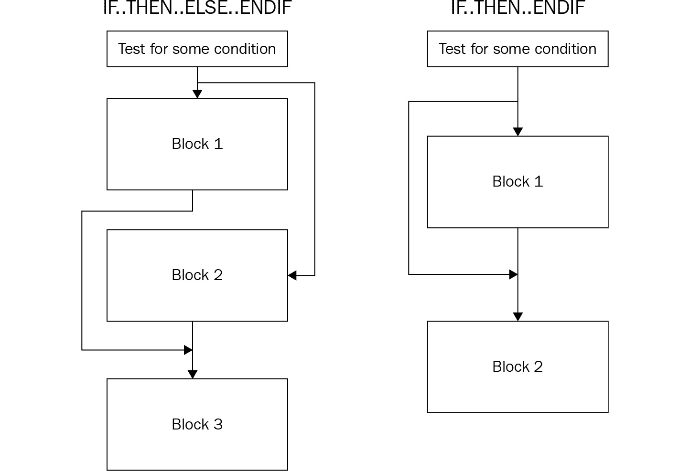

](img/Figure_2.9_B18500.jpg)

图 2.9 – 条件流向重定向

要在汇编中应用此分支序列，编译器使用条件跳转和无条件跳转的混合方式，具体如下：

+   IF.. THEN.. ENDIF：

    ```
    cmp dword ptr [00010000h], 50
    jnz 3rd_Block ; if not true
    …
    Some Code
    …
    3rd_Block:
    Some code
    ```

+   IF.. THEN.. ELSE.. ENDIF：

    ```
    cmp dword ptr [00010000h], 50
    jnz Else_Block ; if not true
    ...
    Some code
    ...
    jmp 4th_Block  ; Jump after Else
    Else_Block:
    ...
    Some code
    ...
    4th_Block:
    ...
    Some code
    ```

## While 循环条件

*while* 循环条件与 *if* 条件在汇编中的表示方式非常相似：

| While (X == 50) {…} | `1st_Block:``cmp dword ptr [00010000h], 50``jnz 2nd_Block ; 如果不成立``…``jmp 1st_Block``2nd_Block:``…` |
| --- | --- |
| Do {} While(X == 50) | `1st_Block:``…``cmp dword ptr [00010000h], 50``jz 1st_Block ; 如果成立` |

# 总结

在本章中，我们介绍了计算机编程的基本知识，描述了多个 CISC 和 RISC 架构之间共享的通用元素。接着，我们详细讲解了多种汇编语言，包括 Intel x86、ARM、MIPS 等，并了解了它们的应用领域，这些都影响了它们的设计和结构。我们还讨论了每种语言的基本概念，学习了最重要的术语（例如使用的寄存器和支持的 CPU 模式），了解了指令集的结构，发现了支持的操作码格式，并探索了使用的调用约定。最后，我们从低级汇编语言讲解到它们在 C 或其他类似语言中的高级表示，并熟悉了一些通用代码块的例子，如 if 条件和循环。

阅读完这一章后，你应该能够阅读不同汇编语言的反汇编代码，并理解它可能代表的高级代码。虽然本章并不旨在全面覆盖所有内容，但其主要目标是为你提供一个坚实的基础，并指引你如何在分析实际恶意代码之前进一步加深知识。这应该是你开始学习如何对不同平台和设备进行静态代码分析的起点。

在*第三章*，*x86/x64 的基本静态与动态分析*中，我们将开始针对特定平台分析实际的恶意软件。我们已熟悉的指令集将作为描述其功能的语言。

# 第二部分：深入解析 Windows 恶意软件

Windows 仍然是最普遍的个人电脑操作系统，因此，现有大多数恶意软件家族都集中在这个平台上也不足为奇。此外，由于高度关注和众多知名攻击者的参与，Windows 恶意软件采用了许多多样化和复杂的技术，这些技术在其他系统中并不常见。在这里，我们将详细讲解这些技术，并通过多个真实世界的示例教你如何进行分析。

本节包括以下章节：

+   *第三章**，x86/x64 的基本静态与动态分析*

+   *第四章**，解包、解密与去混淆*

+   *第五章**，检查进程注入和 API 钩子*

+   *第六章**，绕过反向工程技术*

+   *第七章**，理解内核模式 Rootkit*
