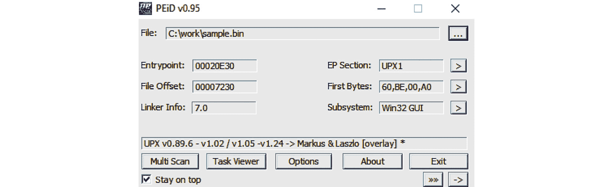
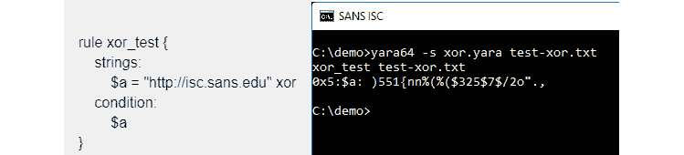
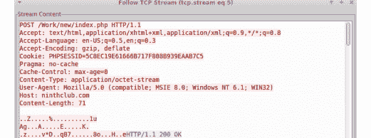
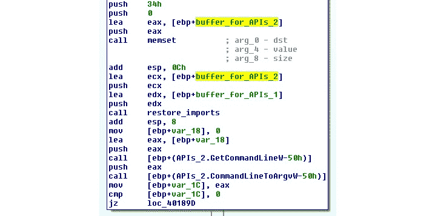

# 第四章：解包、解密与去混淆

在本章中，我们将探讨恶意软件作者为绕过杀毒软件静态签名并欺骗经验不足的逆向工程师而引入的不同技术。主要内容包括打包、加密和混淆。我们将学习如何识别打包样本，如何解包它们，如何处理不同的加密算法——从简单的滑动密钥加密到更复杂的算法，如 3DES、AES 和 RSA——以及如何处理 API 加密、字符串加密和网络流量加密。

本章将帮助你应对使用打包和加密技术来规避检测并阻碍逆向工程的恶意软件。通过本章的信息，你将能够手动解包带有自定义打包工具的恶意软件样本，理解需要解密其代码、字符串、API 或网络流量的恶意软件加密算法，并提取其渗透数据。你还将了解如何使用 IDA Python 脚本自动化解密过程。

在本章中，我们将涵盖以下主题：

+   探索打包工具

+   识别打包样本

+   自动解包打包样本

+   手动解包技术

+   转储解包后的样本并修复导入表

+   识别简单的加密算法和函数

+   高级对称和非对称加密算法

+   现代恶意软件中的加密应用——Vawtrak 银行木马

+   使用 IDA 进行解密和解包

# 探索打包工具

打包工具是一种将可执行文件的代码、数据，有时还包括资源打包在一起的工具，它包含了在运行时解包并执行程序的代码。我们将解决以下几个过程：

+   高级对称和非对称加密算法

+   现代恶意软件中的加密应用——Vawtrak 银行木马

+   使用 IDA 进行解密和解包

这是此过程的高级流程图：


图 4.1 – 解包样本的过程

打包工具帮助恶意软件作者通过这些压缩和/或加密层隐藏其恶意代码。只有在恶意软件执行时（在运行时模式下），这些代码才会被解包并执行，从而帮助恶意软件作者绕过基于静态签名的检测，这些检测通常会针对打包样本进行应用。

## 探索打包和加密工具

多种工具可以对可执行文件进行打包/加密，但每种工具的用途不同。理解它们之间的区别非常重要，因为它们的加密技术是根据其用途量身定制的。我们来逐一了解它们：

+   **打包工具**：这些程序主要是压缩可执行文件，从而减小它们的总体大小。由于它们的目的是压缩，因此并不是为了隐藏恶意特征，也本身不具有恶意。因此，它们不能作为已打包文件可能是恶意的指标。市面上有很多著名的打包工具，它们被良性软件和恶意软件家族同时使用，以下是几个例子：

    +   **UPX**：这是一款开源打包工具，其命令行工具可以解压已打包的文件。

    +   **ASPack**：这是一款常用的打包工具，提供免费版和高级版。提供 ASPack 的同一公司还提供如 ASProtect 这样的保护工具。

+   **合法保护工具**：这些工具的主要目的是保护程序免受逆向工程的尝试——例如，保护共享软件产品的许可系统，或隐藏实现细节以防竞争对手窃取。它们通常集成了加密和各种反逆向工程技巧。虽然其中一些可能被滥用来保护恶意软件，但这并非它们的初衷。

+   **恶意加密工具**：与合法保护工具类似，它们的目的也是使分析过程更为困难；不过这里的重点有所不同：为了避开病毒扫描，需要绕过沙箱并隐藏文件的恶意特征。它们的存在表明加密文件很可能是恶意的，因为它们不在合法市场上出售。

实际上，所有这些工具通常被称为打包工具，它们可能包括保护和压缩功能。

现在我们对打包工具有了更多了解，让我们来讨论如何识别它们。

# 识别已打包样本

有多种工具和方法可以识别样本是否被打包。在这一节中，我们将介绍不同的技术和标志，从最简单的方法到更复杂的技术。

## 技术 1 – 使用静态签名

识别恶意软件是否被打包的第一种方法是使用静态签名。每种打包工具都有独特的特征，能够帮助你识别它。某些 PE 工具，如 **PEiD** 和 **CFF Explorer**，可以使用这些签名或特征扫描 PE 文件，识别用于压缩文件的打包工具（如果文件被打包）；否则，它们将识别用于编译此可执行文件的编译器（如果文件未被打包）。以下是一个示例：



图 4.2 – PEiD 工具检测 UPX

你需要做的就是在 PEiD 中打开这个文件，你会看到触发的签名（在前面的截图中，它被识别为 UPX）。然而，由于它们并不能总是识别使用的打包工具或编译器，你需要其他方法来识别文件是否被打包，以及如果被打包，使用了什么打包工具。

## 技术 2 – 评估 PE 区段名称

段名如果文件被打包，可以透露很多关于编译器或打包工具的信息。解压后的 PE 文件包含如`.text`、`.data`、`.idata`、`.rsrc`、`.reloc`等段，而打包文件包含特定的段名，如`UPX0`、`.aspack`、`.stub`等。以下是一个例子：


图 4.3 – PEiD 工具的段查看器

这些段的名称可以帮助你识别该文件是否被打包。通过在互联网上搜索这些段名，你可以帮助识别使用这些段名的打包工具，或者它们用于打包数据或 stub（解压代码）。你可以通过在 PEiD 中打开文件并点击**EP Section**旁边的**>**按钮，轻松找到段名。这样，你将看到该 PE 文件中所有段的列表以及它们的名称。

## 技术 3 – 使用 stub 执行标志

大多数打包工具会压缩 PE 文件的各个部分，包括代码段、数据段、导入表等，然后在文件末尾添加一个包含解压代码（stub）的新段。由于大多数解压后的 PE 文件是从第一个段开始执行的（通常是`.text`段），而打包后的 PE 文件会从最后一个段中的某个位置开始执行，这清晰地表明将会进行解密过程。以下是这一过程的迹象：

+   入口点不指向第一个段（它通常指向倒数第二个段之一），并且该段的内存权限是`EXECUTE`（在段的特性中）。

+   第一个段的内存权限通常是`READ | WRITE`。

值得一提的是，许多感染可执行文件的病毒家族具有类似的特征。

## 技术 4 – 检测小的导入表

对于大多数应用程序，导入表中充满了来自系统库和第三方库的 API；然而，在大多数打包的 PE 文件中，导入表会非常小，并且只包含来自已知库的少数 API。这足以解压文件。每个库中的一个 API 将在解压后被使用。原因是大多数打包工具在解压 PE 文件后会手动加载导入表，如下图所示：


图 4.4 – 解压样本与使用 UPX 打包样本的导入表

打包样本删除了`ADVAPI32.dll`中的所有 API，只留下一个，因此该库将由 Windows 加载器自动加载。解压后，解压器 stub 代码将再次使用`GetProcAddress` API 加载所有这些 API。

现在我们大致了解了如何识别一个打包的样本，接下来让我们深入探讨如何自动解压打包样本。

# 自动解压打包样本

在深入手动、耗时的解包过程之前，您需要首先尝试一些快速的自动化技术，以便快速获得干净的解包样本。在本节中，我们将解释最常见的几种快速解包技术，针对那些使用常见打包器打包的样本。

## 技巧 1 – 官方解包过程

一些打包器，如**UPX**或**WinRAR**，是自解压包，它们包含了与工具一起提供的解包技术。如你所知，这些工具并非旨在隐藏任何恶意特征，因此其中一些工具提供了解包功能，既面向开发人员，也面向最终用户。

在某些情况下，恶意软件非法使用商业保护程序来保护自己，防止被逆向工程和检测。在这种情况下，您甚至可以直接联系保护提供商，以便为您的分析解保护该恶意软件。

在 UPX 的情况下，攻击者通常会修补打包样本，使其仍然可以执行，但标准工具无法再解包它。例如，在许多情况下，它涉及将其第一个节的*UPX*魔术值替换为其他内容：


图 4.5 – UPX 魔术值和节名称已更改，但样本仍然完全可用

恢复原始值可以使样本通过标准工具无法解包。

## 技巧 2 – 使用 OllyDbg 配合 OllyScript

有一个名为**OllyScript**的 OllyDbg 插件可以帮助自动化解包过程。它通过脚本化 OllyDbg 的操作来实现这一点，比如设置断点、继续执行、将 EIP 寄存器指向不同位置，或者修改一些字节。

如今，OllyScript 的使用已经不那么广泛，但它启发了下一个技巧。

## 技巧 3 – 使用通用解包工具

通用解包器是已经预先编写脚本的调试器，用于解包特定的打包器或自动化手动解包过程，我们将在下一节中详细描述其中的内容。以下是其中一个例子：


图 4.6 – QuickUnpack 工具详细介绍

它们更加通用，能够与多个打包器兼容。然而，恶意软件可能会从这些工具中逃逸，从而导致恶意软件在用户的机器上执行。因此，您应该始终在隔离的虚拟机或安全环境中使用这些工具。

## 技巧 4 – 模拟

另一个值得提到的工具组是模拟器。模拟器是能够模拟执行环境的程序，包括处理器（用于执行指令、处理寄存器等）、内存、操作系统等。

这些工具具有更强大的能力来安全地运行恶意软件（因为所有操作都在模拟环境中），并且对执行过程有更多的控制。因此，它们能够设置更复杂的断点，并且可以轻松编写脚本（如**libemu**和**Pokas x86 模拟器**），如下面的代码所示：

```
from pySRDF import *
emu = Emulator(“upx.exe”)
x = emu.SetBp(“isdirty(eip)”) # which set bp on Execute on modified data
emu.Run() # OR emu.Run(“ins.log”) to log all running instructions
emu.Dump(“upx_unpacked.exe”, DUMP_FIXIMPORTTABLE) # DUMP_FIXIMPORTTABLE create new import table for new API
print(“File Unpacked Successfully\n\nThe Disassembled Code\n---------------”)
```

在这个例子中，我们使用了 Pokas x86 模拟器。通过它，设置更复杂的断点变得更加容易，例如*修改数据时执行*，当指令指针（EIP）指向解密/解包后的内存位置时，该断点会触发。

另一个基于仿真技术的出色工具是**unipacker**。它基于**Unicorn**引擎，并支持多种流行的合法打包工具，包括 ASPack、FSG、MEW、MPRESS 等。

## 技术 5 – 内存转储

我们将提到的最后一种快速技术是结合内存转储。由于其对大多数打包工具和保护器而言是最容易应用的技术之一（特别是当它们具有反调试技术时），因此这一技术被广泛使用。其背后的思路是执行恶意软件并获取其进程的内存快照。一些常见的沙箱工具提供进程的内存转储作为核心功能，或者作为其插件功能之一，例如**Cuckoo**沙箱。

这种技术对静态分析和静态签名扫描非常有益；然而，生成的内存转储与原始样本不同，无法直接执行。除了代码和数据的偏移位置与节表中指定的偏移位置不匹配外，导入表也需要修复，才能进行后续的动态分析。

由于这种技术无法提供干净的样本，并且因为我们之前描述的自动化技术存在局限性，了解如何手动解包恶意软件将帮助你应对那些你偶尔会遇到的特殊情况。通过手动解包，并理解反逆向工程技术（这些将在*第六章*中详细讲解，*绕过反逆向工程技术*），你将能够应对最先进的打包工具。

在下一节中，我们将探讨如何使用 OllyDbg 进行手动解包。

# 手动解包技术

尽管自动解包比手动解包更快、更易使用，但它并不适用于所有的打包工具、加密器或保护器。这是因为其中一些需要特定的定制解包方式。有些工具采用了反虚拟机技术或反逆向工程技术，而其他工具则使用了模拟器无法检测到的非常规 API 或汇编指令。在本节中，我们将探讨不同的手动解包恶意软件的技术。

之前的技术与手动解压的主要区别在于我们何时获取内存转储以及之后怎么处理它。如果我们仅执行原始样本，转储整个进程内存，并希望解压的模块在那里可用，我们将面临多个问题：

+   可能解压后的样本已经按节区映射，且导入表已经填充，因此工程师需要更改每个节区的物理地址，使其与虚拟地址相等，恢复导入，甚至可能需要处理重定位，以使它们重新变得可执行。

+   该样本的哈希值将与原始样本不同。

+   原始加载器可能会将样本解压到分配的内存中，注入到其他地方，并释放内存，这样它就不会成为完整转储的一部分。

+   很容易错过一些模块；例如，原始加载器可能只会为 32 位或 64 位平台解压一个样本。

更为简洁的方法是在样本刚被解压但尚未使用时停止解压。这样，它将只是一个原始文件。在某些情况下，甚至它的哈希值也会与尚未打包的原始样本匹配，因此可以用于威胁狩猎。

在本节中，我们将介绍几种常见的通用解压方法。

## 技术 1 – 执行时的内存断点

该技术适用于将解压样本放置在与已加载打包文件相同位置的内存中的打包器。正如我们所知，打包样本将包含原始文件的各个节区（包括代码节区），解压程序只会解压每个节区，然后将控制权转移到**原始入口点**（**OEP**），以便应用程序正常运行。这样，我们可以假设 OEP 会在第一个节区中，这样我们就可以设置一个断点来捕获那里执行的任何指令。我们一步步地介绍这个过程。

### 步骤 1 – 设置断点

为了拦截第一个节区中的代码接管控制的时刻，我们不能使用执行时的硬件断点，因为它们最多只能设置为四个字节。这样，我们需要确切知道执行将从哪里开始。更有效的解决方案是设置执行时的内存断点。

在 OllyDbg 中隐式提供了在执行时使用内存断点的功能。可以通过进入**视图** | **内存**来访问，在这里我们可以将第一个节区的内存权限更改为**读/写**，如果它原本是**完全访问**的话。以下是一个示例：


图 4.7 – 在 OllyDbg 中更改内存权限

在这种情况下，直到该段获得执行权限之前，我们无法在此段中执行代码。默认情况下，在多个 Windows 版本中，即使内存权限不包含 `EXECUTE` 权限，它仍然会对非关键进程保持可执行状态。因此，你需要强制执行所谓的 `EXECUTE` 权限，并且不允许任何不可执行的数据被执行。

该技术用于防止利用攻击，我们将在 *第八章* 中更详细地讨论 *处理利用和 shellcode*；不过，在我们想要轻松解包恶意软件样本时，它非常有用。

### 步骤 2 – 启用数据执行保护

要启用 DEP，你可以进入 **高级系统设置**，然后选择 **数据执行保护**。你需要为所有程序和服务启用它，如下图所示：


图 4.8 – 更改 Windows 上的 DEP 设置

现在，应该强制这些类型的断点，并防止恶意软件在该段中执行，特别是在解密代码的开头（OEP）。

### 步骤 3 – 防止任何进一步尝试更改内存权限

不幸的是，仅仅强制执行 DEP 是不够的。解包存根可以通过使用 `VirtualProtect` API，再次将该段权限更改为完全访问，从而轻松绕过此断点。

该 API 使程序能够将任何内存块的内存权限更改为任何其他权限。你需要通过转到 `VirtualProtect` 设置一个断点，并在它指向的地址上设置另一个断点。

如果存根尝试调用 `VirtualProtect` 来更改内存权限，调试中的进程将会停止，你可以更改它尝试设置的第一个部分的权限。你可以将 `NewProtect` 参数的值更改为 `READONLY` 或 `READ|WRITE`，并从中移除 `EXECUTE` 位。调试器中显示的情况如下：


图 4.9 – 查找 `VirtualProtect` API 更改权限的地址

处理完这一部分后，是时候让断点触发了。

### 步骤 4 – 执行并获取 OEP

一旦点击 **运行**，调试中的进程最终会将控制权转交给 OEP，这将导致出现访问冲突错误，下面是截图所示：


图 4.10 – 在 OllyDbg 中停留在样本的 OEP

这可能不会立即发生，因为一些加壳器会修改第一节的前几个字节，使用 `ret`、`jmp` 或 `call` 等指令，仅仅是为了使调试过程在此断点处中断；然而，经过几次迭代后，程序会中断。这发生在第一次加密/解压的过程完成后，它会执行程序的原始代码。

## 技巧 2 – 调用堆栈回溯

理解 **调用堆栈** 的概念对加速你的恶意软件分析过程非常有用。首先是解包过程。

看一下以下代码，并想象堆栈会是什么样子：

```
func01:
1: push ebp
2: mov ebp, esp ; now ebp = esp
...
3: call func02
...
func02:
4: push ebp     ; which was the previous esp before the call
5: mov ebp, esp ; now ebp = new esp
...
6: call func03
...
func03:
7: push ebp     ; which is equal to previous esp
8: mov ebp, esp ; ebp = another new esp
...
```

当我们查看在 `call func03` 保存返回地址之后的堆栈时，前一个 `esp` 的值通过 `push ebp` 被保存（它在第 `5` 行被复制到 `ebp`）。在这个之前的 `esp` 值上，存储了第一个 `esp` 值（这是因为 `ebp` 的指令 `4` 等于第一个 `esp` 值），接着是来自 `call func02` 的返回地址，以此类推。这里，存储的 `esp` 值后面跟着一个返回地址。这个 `esp` 值指向先前存储的 `esp` 值，后面跟着先前的返回地址，以此类推。这就是所谓的调用堆栈。下图展示了在 OllyDbg 中的实际情况：


图 4.11 – 在 OllyDbg 中存储的值后跟返回地址

如你所见，存储的 `esp` 值指向下一个堆栈帧（另一个存储的 `esp` 值和先前调用的返回地址），以此类推。

OllyDbg 包括一个可通过 **视图** | **调用堆栈** 访问的调用堆栈视图窗口。它看起来如下：


图 4.12 – OllyDbg 中的调用堆栈

现在，你可能会问：调用堆栈如何帮助我们以快速高效的方式卸载恶意软件？

在这里，我们可以设置一个断点，确保它会使调试过程在解密代码执行的中途中断（解包阶段后的实际程序代码）。一旦执行停止，我们可以回溯调用堆栈，找到解密代码中的第一个调用。到达那里后，我们可以向上滑动，直到找到在解密代码中执行的第一个函数的起始位置，并将该地址声明为 OEP。我们将更详细地描述这个过程。

### 步骤 1 – 设置断点

为了应用这种方法，你需要在程序某个时刻会执行的 API 上设置断点。你可以依赖常见的 API（例如 `GetModuleFileNameA`、`GetCommandLineA`、`CreateFileA`、`VirtualAlloc`、`HeapAlloc` 和 `memset`）、你的行为分析，或者沙盒报告，它会告诉你样本执行过程中使用了哪些 API。

首先，您必须在这些 API 上设置断点（使用您知道的所有 API，除了那些可能被解压缩存根使用的 API），然后执行程序直到执行被中断，如下图所示：


图 4.13 – 在 OllyDbg 的堆栈窗口中的返回地址

现在，您需要检查堆栈，因为接下来的大多数步骤都将在堆栈方面进行。通过这样做，您可以开始跟踪调用堆栈。

### 步骤 2 – 跟踪调用堆栈

跟踪堆栈中存储的 `esp` 值，然后跟踪下一个存储的 `esp` 值，直到您找到第一个返回地址，如下图所示：


图 4.14 – 在 OllyDbg 的堆栈窗口中的最后返回地址

现在，跟踪 CPU 窗口中反汇编部分的返回地址，如下所示：


图 4.15 – 在 OllyDbg 中跟踪最后一个返回地址

一旦您到达解压缩区域中的第一个调用，剩下的唯一步骤就是到达 OEP。

### 步骤 3 – 到达 OEP

现在，您只需要向上滑动，直到找到 OEP。它可以通过标准的函数前言来识别，如下所示：


图 4.16 – 在 OllyDbg 中找到 OEP

这是我们通过之前的方法能够到达的相同入口点。这是一个简单的技术，适用于许多复杂的打包程序和加密器。然而，这种技术很容易导致恶意软件的实际执行，或者至少是其部分代码的执行，因此需要小心使用。

## 技术 3 – 监视解压缩代码的内存分配空间

如果分析样本的时间有限，或者样本数量很多，这种方法非常有用，因为在这里我们不会深入讨论原始样本是如何存储的。

这里的想法是，原始恶意软件通常会分配一个大的内存块来存储解压缩/解密后的嵌入样本。稍后我们将讨论在这种情况不成立时会发生什么。

有多个 Windows API 可以用于在用户模式下分配内存。攻击者通常倾向于使用以下这些：

+   `VirtualAlloc/VirtualAllocEx/VirtualAllocExNuma`

+   `LocalAlloc/GlobalAlloc/HeapAlloc`

+   `RtlAllocateHeap`

在内核模式下，还有其他函数，例如 `ZwAllocateVirtualMemory`；`ExAllocatePoolWithTag` 也可以以类似的方式使用。

如果样本是用 C 编写的，直接监视 `malloc/calloc` 函数是有意义的。对于 C++ 恶意软件，我们还可以监视 `new` 操作符。

一旦我们在样本的入口点（或 TLS 例程的开头，如果它存在的话）停下，就可以在这些函数的执行过程中设置断点。通常，可以在函数的第一条指令上设置断点，但如果担心恶意软件可能会挂钩它（即，用自定义代码替换前几条字节），在最后一条指令上设置断点效果会更好。

这样做的另一个好处是，只需要一个断点来同时监控 `VirtualAllocEx` 和 `VirtualAlloc`（后者是前者 API 的包装器）。在 IDA 调试器中，按 *G* 热键并在 API 名称前加上相应的 DLL 名称（不带文件扩展名，并用下划线分隔）可以直接跳转到该 API，例如，`kernel32_VirtualAlloc`，如下面的截图所示：


图 4.17 – 在 WinAPI 中设置内存分配断点

在此之后，我们继续执行并监控已分配内存块的大小。只要内存块足够大，我们可以在写入操作时设置断点，拦截加密的（或已即时解密的）有效载荷被写入的时刻。如果恶意软件调用这些函数的次数过多，可以考虑设置一个条件断点，仅监控分配大于特定大小的内存块。之后，如果内存块仍然是加密的，我们可以继续在写入时设置断点，直到解密例程开始处理它。最后，当最后一个字节解密时，我们可以将内存块转储到磁盘。

其他可以采用相同方法的 API 函数包括以下几个：

+   `VirtualProtect`：恶意软件作者可以利用这个函数将内存块存储解压后的样本可执行文件，或将头部或代码节区设置为不可写。

+   `WriteProcessMemory`：这通常用于将解压后的有效载荷注入到另一个进程或其自身。

一些打包工具，如 UPX，采用稍微不同的方法，在其节区表中添加一个节区，这个节区在 RAM 中占用大量空间，但在磁盘上不存在（物理大小为 0）。这样，Windows 加载程序会为解压程序准备这个空间，而无需动态分配内存。在这种情况下，在该节区开头设置写入断点的效果与之前描述的相同。

在大多数情况下，恶意软件会一次性解压整个样本，这样在转储后，我们可以获得正确的 MZ-PE 文件，可以独立分析。然而，也有其他选项，如以下所示：

+   解密后的块是一个损坏的可执行文件，依赖于原始的打包工具来正确执行。

+   打包工具按节区逐个解密样本并逐一加载它们。处理这种情况的方式有很多种，如下所示：

    +   转储各个部分，只要它们可用，并稍后将它们合并。

    +   修改解密例程，以一次处理整个样本。

    +   编写一个脚本来解密整个加密块。

如果恶意程序在任何阶段终止，这可能是一个迹象，表明它可能需要一些额外的东西（如命令行参数、外部文件，或者可能需要以特定方式加载），或者它可能需要绕过反逆向工程的技巧。你可以通过多种方式确认这一点——例如，拦截程序即将终止的时刻（例如，通过在`ExitProcess`、`TerminateProcess`或更复杂的`PostQuitMessage` API 调用上放置断点），并追踪哪个部分的代码导致了终止。一些工程师更倾向于手动逐步调试主函数——直到某个子程序导致终止——然后重新启动过程并追踪该子程序的代码。接下来，如果需要，可以继续追踪该子程序内部的代码，直到确认终止逻辑。

## 技巧 4 – 原地解包

虽然不常见，但有可能在样本原始位置所在的同一个节中解密它（该节应该具有`WRITE|EXECUTE`权限），或者在原始文件的另一个节中解密。

在这种情况下，执行以下步骤是有意义的：

1.  搜索一个大的加密块（通常，它具有高熵，并且在十六进制编辑器中肉眼可见）。

1.  找到它将被读取的确切位置（块的前几个字节可能有其他用途——例如，它们可能存储各种类型的元数据，如大小或校验和/哈希值，用于验证解密）。

1.  在那里放置一个读/写断点。

1.  运行程序并等待断点被触发。

只要解密例程访问了这个块，就非常容易获得它的解密版本——无论是通过在解密函数的末尾放置断点，还是在写入加密块最后几个字节时放置断点，拦截它们被处理的时刻。

值得一提的是，这种方法可以与依赖恶意软件分配内存的方法一起使用。这个内容将在*手动解包技巧*一节中讨论。

## 技巧 5 – 搜索并将控制权转移到 OEP

理论上，任何控制流指令都可以在解包完成后将控制转移到 OEP。然而，实际上，许多解包器仅使用`jmp`指令，因为它们不需要任何条件，也不需要将控制返回（另一个不太常见的选项是使用`push <OEP_addr>`和`ret`的组合）。由于 OEP 的地址通常在编译时未知，通常是通过寄存器或存储在特定偏移量的值传递给`jmp`，而不是实际的虚拟地址，因此很容易被发现。另一种可能是，OEP 地址在编译时已知，但由于解包尚未完成，因此那里还没有代码。在这两种情况下，搜索异常的控制转移指令可能是快速定位 OEP 的方法。对于`jmp`，可以通过运行全文搜索所有`jmp`指令（在 IDA 中，您可以使用 *Alt* + *T* 热键组合）并对其进行排序，以便发现异常条目。以下是这种控制转移的示例：


图 4.18 – 涉及寄存器的不常见控制转移

现在让我们进入技术 6。

## 技术 6 – 基于堆栈恢复

这种技术通常比前两种方法更快，但可靠性较差。这里的思路是，一些加壳工具会在解包完成后将控制转移到主函数结束时的解包代码。我们已经知道，在函数结束时，堆栈指针会恢复到函数开始时的相同地址。在这种情况下，可以在访问`[esp-4]`/`[rsp-8]`值时设置断点，并保持在样本的入口点，然后执行它，这样断点就有可能在转移控制到解包代码之前触发。

这可能永远不会发生，这取决于解包代码的实现，也可能会有其他情况会发生这种情况（例如，在开始实际解包过程之前，有多个垃圾调用）。因此，这种方法只能作为花费更多时间在其他方法之前的第一次快速检查。

当我们到达解包样本已加载到内存的阶段时，需要将其保存到磁盘。在下一节中，我们将描述如何将解包后的恶意软件从内存转储到磁盘并修复导入表。

# 转储解包后的样本并修复导入表

在这一节中，我们将学习如何将解包后的恶意软件从内存转储到磁盘并修复其导入表。除此之外，如果导入表已经由加载程序填充了 API 地址，我们还需要恢复原始值。在这种情况下，其他工具将能够读取它，我们也可以执行它进行动态分析。

## 转储进程

要转储进程，可以使用**OllyDump**。 OllyDump 是一个 OllyDbg 插件，可以将进程转储回可执行文件。它将 PE 文件从内存中卸载到必要的文件格式：


图 4.19 – OllyDump UI

一旦从先前的手动解包过程中到达 OEP，您可以将 OEP 设置为新的入口点。 OllyDump 可以修复导入表（正如我们即将描述的那样）。 如果愿意使用其他工具，可以使用它或取消**重建导入**复选框。另一个选择是使用诸如**PETools**或**Lord PE**（用于 32 位）以及**VSD**（用于 32 和 64 位 Windows）之类的工具。除了所谓的**Dump Full**选项，主要是转储与样本相关的原始部分外，这些解决方案还可以转储特定的内存区域 – 例如，用于解密/解包样本的已分配内存，如下面的截图所示：


图 4.20 – PETools 的区域转储窗口

接下来，我们将看看如何修复恶意软件的导入表。

## 修复导入表

现在，你可能会问：需要修复的导入表会发生什么？答案是：当 PE 文件在进程内存中加载或者解包器存根加载导入表时，加载器会遍历导入表（你可以在*第三章*，*x86/x64 的基本静态和动态分析*中找到更多信息），并使用可用于计算机上的 DLL 实际地址填充它们。这里是一个例子：


图 4.21 – PE 加载前后的导入表

在此之后，这些 API 地址将用于在应用程序代码中访问这些 API，通常通过使用`call`和`jmp`指令：


图 4.22 – 不同 API 调用的示例

要恢复导入表，我们需要找到这些 API 地址列表，找到每个地址代表的 API（我们需要逐个库列表地址和相应的 API 名称进行查找），然后用指向 API 名称字符串的偏移量或序数值替换每个地址。如果在文件中找不到 API 名称，可能需要创建一个新的部分，将这些 API 名称添加到其中，并用它们来恢复导入表。

幸运的是，有些工具可以自动完成这些操作。 在本节中，我们将讨论**Import REConstructor**（**ImpREC**）。 这是它的外观：


图 4.23 – ImpREC 接口

要修复导入表，您需要按照以下步骤操作：

1.  使用例如**OllyDump**（并取消选中**Rebuild Import**复选框）或其他首选工具，转储进程或任何库。

1.  打开**ImpREC**并选择当前正在调试的进程。

1.  现在，将 OEP 值设置为正确的值，然后点击**IAT AutoSearch**。

1.  之后，点击**Get Imports**，并删除**Imported Functions Found**部分中任何**valid: NO**的行。

1.  点击**Fix Dump**按钮，然后选择之前转储的文件。现在，你将得到一个工作正常、未打包的 PE 文件。你可以将它加载到 PEiD 或任何其他 PE 浏览器应用程序中，检查它是否正常工作。

重要说明

对于 64 位 Windows 系统，可以使用 Scylla 或 CHimpREC 工具来代替。

在接下来的章节中，我们将讨论基本的加密算法和功能，以增强我们的知识基础，从而丰富我们的恶意软件分析能力。

# 识别简单的加密算法和功能

在本节中，我们将了解广泛使用的简单加密算法。我们将学习对称加密和非对称加密之间的区别，并将学习如何在恶意软件的反汇编代码中识别这些加密算法。

## 加密算法的类型

加密是修改数据或信息的过程，目的是使其在没有密钥的情况下不可读或无法使用，而该密钥仅提供给那些预期会读取消息的人。编码或压缩与加密的区别在于，编码和压缩不使用任何密钥，它们的主要目标与保护信息或限制访问信息无关，而加密则有此目的。

加密算法有两种基本类型：对称算法和非对称算法（也称为公钥算法）。让我们来探讨它们之间的区别：

+   **对称算法**：这些算法使用相同的密钥进行加密和解密。它们使用一个由双方共享的单一密钥：


图 4.24 – 对称算法解释

+   **非对称算法**：在这种情况下，使用了两个密钥，一个用于加密，另一个用于解密。这两个密钥分别称为**公钥**和**私钥**。一个密钥是公开的（公钥），而另一个密钥是保密的（私钥）。以下是一个高层次的示意图，描述了这一过程：


图 4.25 – 非对称算法解释

现在，让我们谈谈恶意软件中常用的简单自定义加密算法。

## 基本加密算法

大多数恶意软件使用的加密算法由基本的数学和逻辑指令组成——即`xor`、`add`、`sub`、`rol`和`ror`。这些指令是可逆的，在加密时使用它们不会丢失数据，而与`shl`或`shr`等指令相比，后者可能会丢失左侧或右侧的一些位。这种情况也会发生在`and`和`or`指令中，当使用`or`与 1 或`and`与 0 时，可能会导致数据丢失。

这些操作可以以多种方式使用，具体如下：

+   `rol`指令：


图 4.26 – `rol`指令示例

+   **运行密钥加密**：在这里，恶意软件在加密过程中更改密钥。以下是一个示例：

    ```
    loop_start:
    mov edx, <secret_key>
    xor dword ptr [<data_to_encrypt> + eax], edx
    add edx, 0x05 ; add 5 to the key
    inc eax
    loop loop_start
    ```

+   `0x23`）。

+   **其他加密算法**：恶意软件作者在创造新的算法时总是有源源不断的创意，这些算法代表了这些算术和逻辑指令的组合。这就引出了下一个问题：我们如何识别加密函数？

## 在反汇编中识别加密函数

以下截图展示了从**1**到**4**编号的区域。这些区域对于理解和识别恶意软件中使用的加密算法至关重要：


图 4.27 – 识别加密算法时需要注意的事项

要识别加密函数，您需要搜索四个要素，如下表所示：


这四个要素是任何加密循环的核心部分。在一个小的加密循环中它们很容易被发现，但在更复杂的加密循环（如 RC4 加密）中，可能更难发现，我们稍后会讨论 RC4 加密。

## 简单算法的字符串搜索检测技术

在本节中，我们将探讨一种名为**X-RAYING**的技术（由 Peter Ferrie 在 VB2004 的*PRINCIPLES AND PRACTICE OF X-RAYING*文章中首次提出）。这种技术被杀毒软件和其他静态签名工具用于检测具有签名的样本，即使它们是加密的。该技术可以深入加密层，揭示样本代码并检测它，而无需知道加密密钥，且无需使用像暴力破解等费时的技术。在这里，我们将描述该技术的理论和应用，以及一些可以帮助我们使用该技术的工具。我们可以使用此技术来检测嵌入的 PE 文件或解密恶意样本。

### X-RAYING 的基础知识

对于我们之前描述的那些算法类型，如果你有加密数据、加密算法和秘密密钥，你可以轻松地解密数据（这也是所有加密算法的目的）；然而，如果你只有加密数据（密文）和一部分已解密的数据，你仍然能够解密剩余的加密数据吗？

在 X 射线技术中，如果你拥有一部分已解密的数据（明文），即使你不知道该明文数据在整个加密数据块中的偏移位置，你也可以暴力破解算法及其秘密密钥。它适用于我们之前描述的几乎所有简单算法，即便是多层加密。对于大多数加密的 PE 文件，明文通常包含诸如`This program cannot run in DOS mode`或`kernel32.dll`的字符串，以及一系列的空字节。

首先，我们将选择第一个候选加密算法，例如，XOR。然后，我们将在密文中搜索一部分明文。为此，我们将使用一部分预期的明文与密文进行 XOR 运算，例如，一个 4 字节的字符串。XOR 运算的结果将为我们提供一个候选解密密钥（这是 XOR 算法的一个特性）。然后，我们将使用这个密钥来测试剩余的明文。如果这个密钥有效，它将揭示密文的剩余部分明文，这意味着我们已经找到了秘密密钥，并且可以解密剩余的数据。

现在，让我们来讨论一些可能帮助我们加速这个过程的工具。

### X 射线工具用于恶意软件分析和检测

一些工具已经被编写出来，帮助恶意软件研究人员使用 X 射线技术进行扫描。以下是您可以使用的这些工具，可以通过命令行或脚本来使用：

+   `rol`和`ror`指令）：


图 4.28 – XORSearch 用户界面

+   `xor`签名：



图 4.29 – 使用 YARA 签名的示例

对于更高级的 X 射线技术，您可能需要编写一个小脚本手动扫描。

## 识别 RC4 加密算法

RC4 算法是恶意软件作者最常用的加密算法之一，主要因为它简单，同时又足够强大，不像其他简单的加密算法那样容易被破解。恶意软件作者通常手动实现它，而不是依赖于 WinAPI，这使得新手逆向工程师更难识别。在本节中，我们将看到该算法的具体样子以及如何识别它。

### RC4 加密算法

RC4 算法是一个对称流加密算法，由两部分组成：**密钥调度算法**（**KSA**）和**伪随机生成算法**（**PRGA**）。让我们更详细地了解一下它们。

### 密钥调度算法

算法的秘钥调度部分从秘钥创建一个称为 `S` 数组的 256 字节数组。这个数组将用于初始化流密钥生成器。它由两部分组成：

+   它按顺序创建一个从 `0` 到 `256` 的 `S` 数组：

    ```
    for i from 0 to 255
      S[i] := i
    endfor
    ```

+   它使用密钥材料排列 `S` 数组：

    ```
    for i from 0 to 255
      j := (j + S[i] + key[i mod keylength]) mod 256
      swap values of S[i] and S[j]
    endfor
    ```

一旦密钥的初始化部分完成，解密算法就开始了。在大多数情况下，KSA 部分是写在一个单独的函数中的，这个函数只接受密钥作为参数，而不需要加密或解密的数据。

### 伪随机生成算法（PRNG）

算法的伪随机生成部分只是生成伪随机值（再次基于字节交换，就像我们为 `S` 数组所做的那样），但也执行与生成的值和数据中的一个字节的 XOR 操作：

```
i := 0
j := 0
while GeneratingOutput:
  i := (i + 1) mod 256
  j := (j + S[i]) mod 256
  swap values of S[i] and S[j]
  K := S[(S[i] + S[j]) mod 256]
  Data[i] = Data[i] xor K
endwhile
```

如你所见，实际的加密算法是 `xor`。然而，所有这些交换旨在每次生成一个不同的密钥值（类似于滑动秘钥算法）。

### 在恶意软件样本中识别 RC4 算法

要识别 RC4 算法，一些关键特征可以帮助你检测它：

+   `RC4` 算法如下：


图 4.30 – RC4 算法中的数组生成

+   **存在大量的交换**：如果你能识别出交换函数或代码，你会发现它无处不在于 RC4 算法中。算法的 KSA 和 PRGA 部分是它是 RC4 算法的一个很好的标志：


图 4.31 – RC4 算法中的交换

+   **实际算法是 XOR**：在循环结束时，你会注意到这个算法是一个 XOR 算法。所有的交换都是在密钥上进行的。唯一影响数据的变化是通过 XOR 进行的：


图 4.32 – RC4 算法中的异或操作

+   **加密和解密的相似性**：你还会注意到加密和解密函数是相同的函数。XOR 逻辑门是可逆的。你可以用 XOR 和秘钥加密数据，然后用相同的秘钥和 XOR 解密这个加密数据（这与加/减算法等不同）。

现在是时候讨论更复杂的算法了。

# 高级对称和非对称加密算法

像对称 DES 和 AES 或非对称 RSA 这样的标准加密算法被恶意软件作者广泛使用。然而，包含这些算法的大多数样本从不实现这些算法自身或将它们的代码复制到它们的恶意软件中。它们通常使用 Windows API 来实现。

这些算法在数学上比简单的加密算法或 RC4 更加复杂。虽然你不一定需要理解它们的数学背景就能理解它们是如何实现的，但了解如何识别它们的使用方式、如何确定涉及的具体算法、加密/解密密钥以及数据是很重要的。

## 从 Windows 加密 API 中提取信息

一些常见的 API 用于提供对加密算法的访问，包括 DES、AES、RSA，甚至 RC4 加密。这些 API 包括`CryptAcquireContext`、`CryptCreateHash`、`CryptHashData`、`CryptEncrypt`、`CryptDecrypt`、`CryptImportKey`、`CryptGenKey`、`CryptDestroyKey`、`CryptDestroyHash`和`CryptReleaseContext`（来自`Advapi32.dll`）。

在这里，我们将看看恶意软件如何通过这些算法加密或解密数据，并且如何识别所使用的具体算法以及密钥。

### 步骤 1 – 初始化并连接到加密服务提供者（CSP）

加密服务提供者是一个在 Microsoft Windows 中实现与加密相关的 API 的库。为了初始化并使用这些提供者，恶意软件样本执行`CryptAcquireContext` API，如下所示：

```
CryptAcquireContext(&hProv,NULL,MS_STRONG_PROV,PROV_RSA_FULL,0);
```

你可以在系统的注册表中的以下密钥找到所有支持的提供者：

```
HKEY_LOCAL_MACHINE\SOFTWARE\Microsoft\Cryptography\Defaults\Provider
```

### 步骤 2 – 准备密钥

准备加密密钥有两种方式。如你所知，这些算法的加密密钥通常是固定大小的。以下是恶意软件作者常用来准备密钥的步骤：

1.  首先，作者使用他们的明文密钥并通过任何已知的哈希算法（如`MD5`、`SHA128`、`SHA256`等）对其进行哈希：

    ```
    CryptCreateHash(hProv,CALG_MD5,0,0,&hHash); CryptHashData(hHash,secretkey,secretkeylen,0);
    ```

1.  然后，它们使用`CryptDeriveKey`从这个哈希值创建会话密钥，如下所示：

    ```
    CryptDeriveKey(hProv, CALG_3DES, hHash, 0, &hKey);
    ```

从这里，他们可以轻松识别从 API 传递的第二个参数值中的算法。最常见的算法/值如下：

```
CALG_DES = 0x00006601  // DES encryption algorithm.
CALG_3DES = 0x00006603 // Triple DES encryption algorithm.
CALG_AES = 0x00006611  // Advanced Encryption Standard (AES).
CALG_RC4 = 0x00006801   // RC4 stream encryption algorithm.
CALG_RSA_KEYX = 0x0000a400 // RSA public key exchange algorithm.
```

1.  一些恶意软件作者使用`KEYBLOB`，其中包含他们的密钥，并与`CryptImportKey`一起使用。`KEYBLOB`是一个简单的结构，包含密钥类型、使用的算法以及加密的秘密密钥。`KEYBLOB`的结构如下：

    ```
    typedef struct KEYBLOB { BYTE bType;
    BYTE bVersion; WORD reserved; ALG_ID aiKeyAlg; DWORD KEYLEN;
    BYTE[] KEY;}
    ```

`bType`短语表示此密钥的类型。最常见的类型如下：

+   `PLAINTEXTKEYBLOB (0x8)`：表示一个对称算法的明文密钥，如`DES`、`3DES`或`AES`

+   `PRIVATEKEYBLOB (0x7)`：表示这是一个非对称算法的私钥

+   `PUBLICKEYBLOB (0x6)`：表示这是一个非对称算法的公钥

`aiKeyAlg`短语包含`CryptDeriveKey`的第二个参数，即算法类型。以下是一些`KEYBLOB`的示例：

```
BYTE DesKeyBlob[] = { 0x08,0x02,0x00,0x00,0x01,0x66,0x00,0x00, // BLOB header 0x08,0x00,0x00,0x00, // key length, in bytes
0xf1,0x0e,0x25,0x7c,0x6b,0xce,0x0d,0x34 // DES key with parity
};
```

如你所见，第一个字节（`bType`）显示我们这是一个`PLAINTEXTKEYBLOB`，而算法（0x01,0x66）表示`CALG_DES (0x6601)`。

另一个示例如下：

```
BYTE rsa_public_key[] = {
0x06, 0x02, 0x00, 0x00, 0x00, 0xa4, 0x00, 0x00,
0x52, 0x53, 0x41, 0x31, 0x00, 0x08, 0x00, 0x00,
...
}
```

这表示一个 `PUBLICKEYBLOB (0x6)`，而算法表示 `CALG_RSA_KEYX (0xa400)`。之后，它们通过 `CryptImportKey` 被加载：

```
CryptImportKey(akey->prov, (BYTE *) &key_blob, sizeof(key_blob), 0, 0, &akey->ckey)
```

下面是它在汇编语言中的示例：


](img/Figure_4.33_B18500.jpg)

图 4.33 – 使用 CryptImportKey API 导入 RSA 密钥

一旦密钥准备就绪，就可以用于加密和解密操作。

### 第 3 步 – 加密或解密数据

现在密钥已经准备好，恶意软件使用 `CryptEncrypt` 或 `CryptDecrypt` 来加密或解密数据。使用这些 API，你可以识别加密数据块（或待加密数据块）的起始位置。这些 API 的使用方式如下：

```
CryptEncrypt(hKey,NULL,1,0,cyphertext,ctlen,sz); CryptDecrypt(hKey,NULL,1,0,plaintext,&ctlen);
```

### 第 4 步 – 释放内存

这是最后一步，我们通过使用 `CryptDestroyKey` API 来释放内存和所有已使用的句柄。

## 下一代密码学 API（CNG）

还有其他方式可以实现这些加密算法。其中一种是使用 **密码学 API: 下一代**（**CNG**），它是微软实现的一组新 API。尽管目前在恶意软件中尚未广泛使用，但它们更容易理解并从中提取信息。使用这些 API 的步骤如下：

1.  `MSDN` 列出了支持的算法：

    ```
    BCryptOpenAlgorithmProvider(&hAesAlg, BCRYPT_AES_ALGORITHM, NULL, 0)
    ```

1.  **准备密钥**：这与对称和非对称算法中密钥的准备方式不同。此 API 可能使用导入的密钥或生成一个密钥。这可以帮助你提取用于加密的秘密密钥，方法如下：

    ```
    BCryptGenerateSymmetricKey(hAesAlg, &hKey, pbKeyObject, cbKeyObject, (PBYTE)SecretKey, sizeof(SecretKey), 0)
    ```

1.  **加密或解密数据**：在此步骤中，你可以轻松识别出要加密（或解密）数据块的起始位置：

    ```
    BCryptEncrypt(hKey, pbPlainText, cbPlainText, NULL, pbIV, cbBlockLen, NULL, 0, &cbCipherText, BCRYPT_BLOCK_PADDING)
    ```

1.  使用 `BCryptCloseAlgorithmProvider`、`BCryptDestroyKey` 和 `HeapFree` 清理数据。

现在，让我们看看这些知识如何帮助我们理解恶意软件的功能。

# 现代恶意软件中加密的应用 —— Vawtrak 银行木马

在本章中，我们已经看到加密或打包如何用于保护整个恶意软件。这里，我们将查看这些加密算法在恶意软件代码中的其他实现，用于混淆和隐藏恶意密钥特征。这些密钥特征可以通过静态签名或甚至网络签名来识别恶意软件家族。

在这一部分中，我们将查看一个已知的银行木马——Vawtrak。我们将看到这个恶意软件家族如何加密它的字符串和 API 名称，并混淆其网络通信。

## 字符串和 API 名称加密

Vawtrak 实现了一个相当简单的加密算法。它基于滑动密钥算法的原理，并使用减法作为主要的加密技术。它的加密过程如下：


](img/Figure_4.34_B18500.jpg)

图 4.34 – Vawtrak 恶意软件中的加密循环

加密算法由两个部分组成：

+   **生成下一个密钥**：此操作生成一个 4 字节的数字（称为种子），并仅使用其中的 1 个字节作为密钥：

    ```
    seed = ((seed * 0x41C64E6D) + 0x3039 ) & 0xFFFFFFFF key = seed & 0xFF
    ```

+   **加密数据**：这部分非常简单，它使用以下逻辑加密数据：

    ```
    data[i] = data[i] - eax
    ```

该加密算法用于加密 API 名称和 DLL 名称，以便解密后，恶意软件可以使用名为`LoadLibrary`的 API 动态加载 DLL，如果 DLL 尚未加载，则加载该库，或者如果已经加载，则仅获取其句柄。

在获取 DLL 地址后，恶意软件通过名为`GetProcAddress`的 API 获取要执行的 API 地址，该 API 通过库的句柄和 API 名称获取该函数地址。恶意软件实现如下：


图 4.35 – 在 Vawtrak 恶意软件中解析 API 名称

相同的函数（`DecryptString`）在恶意软件内部被频繁使用，用于根据需要解密每个字符串（仅在使用时），如下所示：


图 4.36 – Vawtrak 恶意软件中的解密例程交叉引用

要解密此内容，您需要遍历每个调用解密函数的调用，并传递被加密字符串的地址来解密它。这可能是费力的或耗时的，因此自动化（例如，使用 IDA Python 或可脚本化的调试器/模拟器）可能会有所帮助，正如我们将在下一节中看到的那样。

## 网络通信加密

Vawtrak 可以使用不同的加密算法对其网络通信进行加密。它实现了多种算法，包括`RC4`、`LZMA`压缩、`LCG`加密算法（这是用于字符串的，如我们在前一节中提到的）等。在本节中，我们将查看其加密的不同部分。

在请求中，它实现了一些加密，以隐藏基本信息，包括`CAMPAIGN_ID`和`BOT_ID`，如以下截图所示：



图 4.37 – Vawtrak 恶意软件的网络流量

Cookie，即`PHPSESSID`，包含了一个加密密钥。使用的加密算法是 RC4 加密。解密后的消息如下：


图 4.38 – 从 Vawtrak 恶意软件的网络流量中提取的信息

解密后的`PHPSESSID`在前 4 个字节中包含 RC4 密钥。`BOT_ID`和下一个字节表示`Campaign_Id`（0x03），其余的字节表示其他重要信息。

接收到的数据具有以下结构，包括用于解密的第一个种子、总大小以及用于解密的多种算法：


图 4.39 – Vawtrak 恶意软件中用于解密的结构

不幸的是，网络通信没有简单的方法可以抓取所使用的算法或协议结构。你必须搜索网络通信函数，如 `HttpAddRequestHeadersA`（我们在解密过程中看到的那个）和其他网络 API，跟踪接收到的数据，以及跟踪将要发送的数据，直到你找到命令与控制通信背后的算法和结构。

现在，让我们探索 IDA 的各种功能，这些功能可能有助于我们理解并绕过涉及的加密和打包技术。

# 使用 IDA 进行解密和解包

IDA 是一个非常方便的工具，用于存储分析样本的标记。它的嵌入式调试器和多个远程调试器服务器应用程序允许你在一个地方进行静态和动态分析，支持多个平台——即使是那些 IDA 无法独立执行的平台。它还具有多个插件，可以进一步扩展其功能，并且内嵌的脚本语言可以自动化各种繁琐的任务。

## IDA 小贴士和技巧

虽然 OllyDbg 在调试方面提供了相当不错的功能，但总体而言，IDA 在维护标记方面有更多选择。这就是为什么许多逆向工程师倾向于在 IDA 中同时进行静态和动态分析，特别是在解包方面非常有用。以下是一些小贴士和技巧，能够让这个过程更加愉快。

### 静态分析

首先，让我们看一下主要适用于静态分析的一些建议：

+   当使用内存转储而不是原始样本时，可能会出现导入表已经填充了 API 地址的情况。

获取实际 API 名称的简单方法是使用 `pe_dlls.idc` 脚本，该脚本分发在 `pe_scripts.zip` 包中。该包可以在官方 IDA 网站上免费下载。从那里，你需要加载从生成转储的机器上获取的 DLL。指定 DLL 名称时，别忘了去掉文件名扩展名，因为在 IDA 中，文件名中不能使用点号符号。此外，该脚本不允许你选择 DLL 的基址。为了解决这个问题，在 `pe_sections.idc` 脚本的第 692 行添加以下代码：

```
imageBase = long(ask_addr(imageBase, “Enter base address”));
```

+   通常来说，在 IDA 的 **Structures** 标签中重建恶意软件使用的结构比在反汇编代码中添加注释要更有意义，后者通常位于访问其字段的指令旁边。跟踪结构是一种错误更少的方式，并且意味着我们可以将其重复使用在类似的样本中，以及比较恶意软件的不同版本。

之后，你可以简单地右键点击该值并选择**结构体偏移量**选项（*T*热键）。可以通过在**结构体**子视图中按*Ins*热键快速添加结构体并指定其名称。然后，通过将光标放置在结构体末尾并按*D*热键一次、两次或三次，具体取决于所需的大小，添加单个字段。最后，要添加其余大小相同的字段，选择所需的字段，右键点击并选择**数组...**选项，指定具有相同大小的元素数量，并取消选中**使用“dup”构造**和**创建为数组**选项的复选框。

+   对于恶意软件访问存储在堆栈中的结构体字段的情况，可以通过右键点击并选择**手动...**选项（*Alt* + *F1* 热键）来获取实际偏移量，替换变量名为结构体开头的指针名称和剩余的偏移量，然后将偏移量替换为所需的结构体字段，如下图所示：


图 4.40 – 将本地变量映射到相应的结构体字段

确保在重命名操作数时启用**检查操作数**选项，以验证值的总和是否保持准确。

另一种选择是选择变量的文本（而不仅仅是左键点击它），右键点击**结构体偏移量**选项（同样是*T*热键），指定偏移量差值，该值应等于结构体开头的指针偏移量，最后选择建议的结构体字段。

该方法更快捷，但不会保留指针的名称，如下图所示：



图 4.41 – 将本地变量映射到结构体字段的另一种方法

+   许多自定义加密算法使用了`xor`操作，因此找到它们的简单方法是按照以下步骤操作：

    1.  打开包含两个不同寄存器或一个未通过帧指针寄存器（`ebp`）访问的内存值的`xor`指令。

+   不要犹豫使用免费插件，如`–v`命令行参数来获取已识别函数的虚拟地址。

+   如果需要导入包含枚举定义列表的 C 文件，建议使用`h2enum.idc`脚本（不要忘记在第二个对话框中提供正确的掩码）。导入包含结构体的 C 文件时，通常应该在其前面加上`#pragma pack(1)`语句，以保持偏移量正确。**文件** | **加载文件** | **解析 C 头文件...**选项和**Tilib**工具在大多数情况下可以互换使用。

+   如果需要重命名多个指向实际 API 的连续值，选择所有这些值并执行`renimp.idc`脚本，该脚本可以在 IDA 的`idc`目录中找到。

+   如果你需要在一台 Windows 机器上同时使用`IDA <= 6.95`和`IDA 7.0+`，请按照以下步骤操作：

    1.  安装 x86 和 x64 的 Python 到不同的位置——例如，`C:\Python27`和`C:\Python27x64`。

    1.  确保以下环境变量指向`IDA <= 6.95`的设置：

    ```
    set PYTHONPATH=C:\Python27;C:\Python27\Lib;C:\Python27\DLLs;C:\Python27\Lib\lib-tk;
    set NLSPATH=C:\IDA6.95\
    ```

通过这种方式，`IDA <= 6.95`可以像平常一样通过点击其图标使用。要执行 IDA 7.0+，请创建一个特殊的`LNK`文件，该文件将在执行 IDA 之前重新定义这些环境变量：

```
C:\Windows\System32\cmd.exe /c “SET PYTHONPATH=C:\Python27x64;C:\Python27x64\Lib;C:\Python27x64\DLLs;C:\Python27x64\Lib\lib-tk; && SET NLSPATH=C:\IDA7.0 && START /D ^”C:\IDA7.0^” ida.exe”
```

+   如果你的 IDA 版本未包含 Delphi 编程语言的 FLIRT 签名，仍然可以使用**IDR**工具生成的 IDC 脚本进行标记。建议仅应用它生成的脚本中的名称。

+   IDA 的最新版本提供了对 Go 语言编写的程序的良好支持。对于旧版本的 IDA，应该使用像**golang_loader_assist**和**IDAGolangHelper**这样的插件。

+   为了处理变量扩展混淆，如果可以使用 IDA Hex-Rays 反编译器，请使用基于**Z3**项目的**D-810**插件。其界面如下所示：


图 4.42 – D-810 插件支持的去混淆规则

+   通常，恶意软件样本会附带像 OpenSSL 这样的开源库，这些库被静态链接以利用正确实现的加密算法。分析这样的代码可能相当棘手，因为可能不容易看出代码的哪一部分属于恶意软件，哪一部分属于合法的库。此外，弄清楚库中每个函数的目的可能需要相当长的时间。像`.lib`/`.a`文件这样的开源项目用于所需平台的 OpenSSL（在我们的例子中是 Windows）。编译器应该尽量接近恶意软件所使用的编译器。

+   从官方网站获取适用于你的 IDA 的**Flair**工具包。该包包含一套用于从各种对象和库格式（OMF、COFF 等）生成统一 PAT 文件的工具，以及**sigmake**工具。

+   生成 PAT 文件，例如，可以使用**pcf**工具：

```
pcf libcrypto.a libcrypto.pat
```

1.  使用`.sig`文件：

```
sigmake libcrypto.pat libcrypto.sig
```

如有必要，通过编辑创建的`.exc`文件并重新运行`sigmake`来解决冲突。

1.  将生成的`.sig`文件放入 IDA 根目录下的`sig`文件夹中。

1.  按照以下步骤学习如何使用它：

    1.  转到**视图** | **打开** **子视图** | **签名**（*Shift* + *F5*快捷键）。

    1.  右键点击**应用新签名**（*Ins*快捷键）。

    1.  找到你指定名称的签名，并通过按**确定**或双击它来确认。

    1.  另一种方法是使用**文件** | **加载文件** | **FLIRT 签名文件...**选项。

另一个创建自定义 FLIRT 签名的流行选项是**idb2pat**工具。

现在，让我们讨论 IDA 在动态分析方面的功能。

### 动态分析

现在，除了经典的反汇编功能外，IDA 还具备多种调试选项。以下是一些旨在简化 IDA 动态分析的技巧：

+   要在 IDA 中调试样本，请确保样本具有可执行文件扩展名（例如 `.exe`）；否则，旧版本的 IDA 可能会拒绝执行它，提示文件不存在。

+   旧版本的 IDA 没有位于 IDA `dbgsrv` 文件夹中的`win64_remotex64.exe`服务器应用程序。如果需要，可以在同一台机器上运行它，并通过**调试器** | **进程选项...**选项使它们通过本地主机进行交互。

图形视图仅显示已识别或创建的函数的图形。可以使用空格键快速切换文本视图和图形视图。调试开始时，图形视图中的**图形概览**窗口可能会消失，但可以通过选择**视图** | **图形概览**选项来恢复。

+   默认情况下，IDA 在打开文件时会自动执行分析，这意味着后续解压的代码将不会被分析。要动态修复此问题，请按照以下步骤操作：

    1.  如有必要，通过按下*C*热键使 IDA 识别解压块的入口点为代码。通常，将其作为函数处理也是有意义的，可以使用*P*热键来实现。

    1.  将存储解压代码的内存段标记为**加载器段**。按照以下步骤进行操作：

        1.  进入**视图** | **打开子视图** | **段**（*Shift* + *F7* 快捷键组合）。

        1.  找到存储感兴趣代码的段。

        1.  可以右键点击它并选择**编辑段...**选项，或者使用*Ctrl* + *E* 快捷键组合。

        1.  在**加载器段**复选框中打勾。

    1.  重新运行分析，方法是进入**选项** | **常规...** | **分析**，然后按下**重新分析程序**按钮，或者右键点击主 IDA 窗口的左下角，在那里选择**重新分析程序**选项。

+   如果需要解压 DLL，请按照以下步骤进行操作：

    1.  像加载任何其他可执行文件一样将其加载到 IDA 中。

    1.  选择你偏好的调试器：

        +   本地 Win32 调试器，适用于 32 位 Windows

        +   使用`win64_remote64.exe`应用程序进行远程 Windows 调试，适用于 64 位 Windows。

    1.  进入`rundll32.exe`（或`regsvr32.exe`，用于 COM DLL，可通过`DllRegisterServer/DllUnregisterServer`或存在的`DllInstall`导出进行识别）到**应用程序**字段。

    1.  在**参数**字段中设置 DLL 的完整路径。附加参数会根据 DLL 的类型有所不同：

a. 对于使用`rundll32.exe`加载的典型 DLL，追加要调试的导出函数的名称或序数（例如，`#1`），并用逗号与路径分开。即使只想执行主入口点逻辑，也必须提供参数。

b. 对于`CPlApplet`导出，可以在分析的 DLL 路径之前指定`shell32.dll,Control_RunDLL`参数。

c. 对于通常使用`regsvr32.exe`加载的 COM DLL，如果需要调试`DllUnregisterServer`导出，则应在完整路径前添加`/u`参数。对于`DllInstall`导出，应改为使用`/n/i[:cmdline]`参数的组合。

d. 如果 DLL 是一个服务 DLL（通常可以通过`ServiceMain`导出函数和与服务相关的导入来识别），并且您需要正确调试`ServiceMain`，请参阅*第三章*，*x86/x64 的基本静态和动态分析*，获取有关如何调试服务的详细信息。

+   在用于动态分析的其他脚本中，**funcap**工具似乎非常方便，因为它允许您记录在执行过程中传递给函数的参数，并在完成后将它们保留在注释中。

+   如果在解密后，恶意软件不断使用另一个内存段的代码和数据（Trickbot 是一个很好的例子），可以将这些段转储到 IDB 中，然后使用`0`分别添加它们，并在`0`中指定实际虚拟地址，可以通过转到**View** | **Open subviews** | **Selectors**并将相关选择器的值更改为零来修复它。

## IDA 脚本的经典和新语法

谈到脚本编写，最初编写 IDA 脚本的方式是使用专有的 IDC 语言。它提供了多个高级 API，可以在静态和动态分析中使用。后来，IDA 开始支持 Python，并通过`idc`模块提供与同名 IDC 函数的访问。另一个功能（通常更低级）可以在`idaapi`和`idautils`模块中找到，但对于自动化大多数通用操作而言，`idc`模块已经足够好用。

随着 API 列表随着时间的推移不断扩展，累积了越来越多的命名不一致性。最终，在某个阶段，开始需要进行修订，这是不可能同时保持向后兼容性的。因此，从 IDA 版本 7.0 开始（在 6.95 之后的下一个版本），引入了一个新的 API 列表，影响了依赖 SDK 和 IDC 函数的插件。其中一些仅仅从`CamelCase`改为`underscore_case`，而其他一些则被替换为新的函数。

这里有一些示例，展示了它们的原始和新语法：

+   `Functions/NextFunction`：`get_next_func`允许您迭代函数。

+   `Heads/NextHead`：`next_head` 允许你遍历指令。

+   `ScreenEA`：`get_screen_ea` 获取当前光标所在位置的样本虚拟地址。

+   `Byte/Word/Dword`：`byte/word/dword` 读取特定大小的值。*   `PatchByte/PatchWord/PatchDword`：`patch_byte/patch_word/patch_dword` 写入特定大小的块。*   `OpEnumEx`：`op_enum` 将操作数转换为 `enum` 值。

**辅助数据存储**：

+   `AddEnum`：`add_enum` 添加一个新的 `enum`。

+   `AddStrucEx`：`add_struc` 添加一个新的结构。

这是一个实现自定义 XOR 解密算法的 IDA Python 脚本示例，适用于短块：


图 4.43 – 32 位 Windows 的原始 IDA Python API 语法

这里有一个实现相同自定义 XOR 解密算法的脚本，适用于使用新语法的 64 位架构：


图 4.44 – 64 位 Windows 的新 IDA Python API 语法

一些情况可能需要大量时间来分析一个相对较大的样本（或多个样本），如果工程师没有使用 IDA 脚本，并且恶意软件使用动态字符串解密和动态 WinAPI 解析。

## 动态字符串解密

在这种情况下，块状的加密字符串不会一次性解密。相反，每个字符串在使用前会立即被解密，因此它们从未被一次性解密。为了解决这个问题，请按以下步骤操作：

1.  查找负责解密所有字符串的函数。

1.  在脚本中复制解密器的行为。

1.  让脚本通过跟踪交叉引用查找代码中所有调用此函数的地方，并读取将作为其参数传递的加密字符串。

1.  解密它并将其写回加密内容上方，以确保所有引用保持有效。

## 动态 WinAPI 解析

使用动态 WinAPI 解析时，只有一个具有不同参数的函数用于访问所有 WinAPI。它动态地搜索请求的 API（通常是相应的 DLL），通常使用提供的名称的某种校验和作为参数。使其可读的两种常见方法是：

+   `enum` 值。

+   查找所有使用解析函数的地方，获取其校验和参数，并将其转换为相应的 `enum` 名称。

+   **使用注释**：

    1.  查找所有校验和、API 和 DLL 的匹配项。

    1.  将关联存储在内存中。

    1.  查找所有使用解析函数的地方，获取其校验和参数，并在旁边添加带有相应 API 名称的注释。

IDA 脚本实际上是区别初学者与专业分析师之间的关键，它能够帮助分析师高效地解决任何逆向工程问题。一旦你写了几个脚本并采用了这种方法，你就会发现更新或扩展这些脚本，增加新任务的额外功能变得相当简单。

# 总结

在本章中，我们介绍了各种类型的加壳工具并解释了它们之间的差异。我们还给出了如何识别所使用的加壳工具的建议。接着，我们介绍了几种如何自动和手动解包样本的技术，并提供了实际的例子，展示在不同情况下如何以最有效的方式进行解包。之后，我们介绍了更高级的手动解包方法，这些方法通常需要更多的时间来执行，但能让你在合理的时间内解包几乎任何样本。

此外，我们还介绍了不同的加密算法，并提供了如何识别和处理它们的指南。接着，我们通过一个现代恶意软件的例子，结合这些指南，帮助你了解如何将所有这些理论应用到实践中。最后，我们讲解了 IDA 脚本语言——这是一种大大加速分析过程的强大工具。

在 *第五章*，*检查进程注入与 API 钩子* 中，我们将扩展对恶意软件作者用于实现其目标的各种技术的理解，并提供一些应对这些技术的小贴士。
