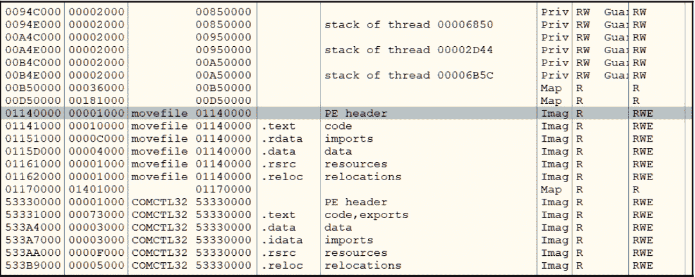

# 第五章：检查进程注入和 API 挂钩

在本章中，我们将探索恶意软件作者为多种目的使用的更高级技术，包括绕过防火墙、欺骗逆向工程师、以及监视和收集用户信息以窃取信用卡数据等。

我们将深入探讨各种进程注入技术，包括 DLL 注入和进程空洞（由 Stuxnet 引入的高级技术），并解释如何处理这些技术。随后，我们将了解 API 挂钩、IAT 挂钩以及恶意软件作者使用的其他挂钩技术，并讲解如何应对它们。

到本章结束时，你将拓展你对 Windows 平台的知识，并能够分析更复杂的恶意软件。你将学习如何分析其他进程中的注入代码，通过内存取证检测它，检测不同类型的 API 挂钩技术，并分析它们以检测**浏览器中人攻击**（**MiTB**）。

为了使学习过程更加顺利，本章分为以下几个主要部分：

+   理解进程注入

+   DLL 注入

+   更深入地了解进程注入

+   代码注入的动态分析

+   进程注入的内存取证技术

+   理解 API 挂钩

+   探索 IAT 挂钩

# 理解进程注入

进程注入是恶意软件作者用来绕过防火墙、执行内存取证技术、以及通过将恶意功能添加到合法进程中并以此方式隐藏来拖慢经验不足的逆向工程师的其中一种最著名的技术。在本节中，我们将介绍进程注入背后的原理，以及为什么它在如今的**高级持续性威胁**（**APT**）攻击中被广泛使用。

## 什么是进程注入？

在 Windows 操作系统中，进程被允许在另一个进程的虚拟地址空间中分配内存、读取和写入数据，还可以创建新线程、挂起线程并更改这些线程的寄存器，包括`explorer.exe`或其他用户的进程。然而，将代码注入到当前用户的浏览器和其他进程中仍然是可以的。

该技术被多个终端安全产品合法使用，用于监控应用程序和沙盒目的（正如我们将在*理解 API 挂钩*一节中看到的那样），但也常常被恶意软件作者滥用。

## 为什么要使用进程注入？

对于恶意软件作者而言，进程注入有助于他们实现以下目标：

+   绕过简单的防火墙，这些防火墙只允许浏览器或其他允许的应用程序连接互联网。通过将代码注入这些应用程序之一，恶意软件可以在没有任何警告或被防火墙阻止的情况下与**指挥与控制**（**C&C**）服务器进行通信。

+   通过在另一个未监控且未调试的进程中运行恶意代码，避开调试器和其他动态分析或监控工具。

+   在恶意软件将代码注入的合法进程中钩取 API，这可以对受害者进程的行为进行独特控制。

+   为无文件恶意软件维持持久性。通过将代码注入到后台进程中，恶意软件可以在几乎不重启的服务器上保持持久性，而不在硬盘上留下可执行文件。

现在，我们将深入探讨各种进程注入技术，了解它们的工作原理以及如何应对这些技术。我们将从最简单、最直接的技术开始：DLL 注入。

# DLL 注入

Windows 操作系统允许进程将 DLL 加载到其他进程中，出于安全原因、沙箱隔离或甚至图形处理。在本节中，我们将探讨合法的、直接的将 DLL 注入进程的方法，以及其他允许攻击者使用 Windows API 将代码注入进程的技术。

## Windows 支持的 DLL 注入

Windows 为符合特定条件的每个进程提供了特殊的注册表项，以便加载 DLL。许多注册表项允许恶意软件 DLL 同时注入到多个进程中，包括浏览器和其他合法进程。这些注册表项有很多，我们将在这里探讨最常见的几个：

```
HKEY_LOCAL_MACHINE\SOFTWARE\Microsoft\Windows NT\CurrentVersion\Windows\AppInit_DLLs
```

这是恶意软件最常误用的注册表项之一，用来将 DLL 代码注入到其他进程中并维持持久性。此处指定的库与每个加载 `user32.dll`（主要用于 UI 的系统库）的进程一起加载。

在 Windows 7 中，DLL 必须签名，默认情况下此逻辑在 Windows 8 及更高版本中被禁用。然而，攻击者仍然可以通过将 `RequireSignedAppInit_DLLs` 设置为 `False`，并将 `LoadAppInit_DLLs` 设置为 `True` 来滥用这一点（请参见下面的截图）。攻击者需要管理员权限才能设置这些条目，可以通过社交工程等手段解决这一问题：


图 5.1 – 使用 AppInit_DLLs 注册表项将恶意软件库注入不同的浏览器

现在， let’s move to the next commonly misused registry key:

```
HKEY_LOCAL_MACHINE\SYSTEM\CurrentControlSet\Control\Session Manager\AppCertDlls
```

该注册表项中列出的库会被加载到使用以下任一函数的每个进程中：

+   `CreateProcess`

+   `CreateProcessAsUser`

+   `CreateProcessWithLogonW`

+   `CreateProcessWithTokenW`

+   `WinExec`

这使得恶意软件可以注入到大多数浏览器中（因为许多浏览器会创建子进程来管理不同的标签页）以及其他应用程序。它仍然需要管理员权限，因为 `HKEY_LOCAL_MACHINE` 对普通用户在 Windows 系统上是不可写的（Vista 及更高版本）：

```
HKEY_CURRENT_USER\Software\Classes\<AppName>\shellex\ContextMenuHandlers
```

该路径加载一个 shell 扩展（一个 DLL 文件），以便为主 Windows shell（`explorer.exe`）添加附加功能。基本上，它可以被滥用来将恶意库加载为 `explorer.exe` 的扩展。此路径可以轻松创建和修改，而无需任何管理员权限。

还有其他注册表项可以将恶意库注入到其他进程中，以及多个软件解决方案，例如 Sysinternals 的 **Autoruns**，可以让你查看是否有任何这些注册表项被用于当前系统的恶意用途：


图 5.2 – Sysinternals 套件中的 Autoruns 应用程序

这些是恶意软件最常用的合法方式，用来将 DLL 注入到不同的进程中。

重要说明

值得一提的是，许多资源称这种技术为 DLL 劫持，并将其与经典的进程注入分开追踪，因为在这种情况下，攻击者依赖操作系统来执行实际的注入，而不是自己进行注入。

现在，我们将探索更高级的技术，这些技术需要使用不同的 Windows API 来分配、写入并执行恶意代码在其他进程中。

## 一种简单的 DLL 注入技术

该技术使用 `LoadLibraryA` API（或其其他变体）作为通过 Windows PE 加载器加载恶意库并执行其入口点的方式。主要目标是将恶意 DLL 的路径注入到进程中，然后将控制权转交给该进程，启动地址为 `LoadLibraryA` API 的地址。当将 DLL 路径作为参数传递给该线程（该参数传递给 `LoadLibraryA` API）时，Windows PE 加载器会将 DLL 加载到进程中并无误地执行其代码。以下是结果内存的样子：


图 5.3 – 一个简单的 DLL 注入机制

恶意软件通常遵循的确切步骤如下：

1.  在其他进程中找到目标进程（更多细节见下节）。

1.  使用 `OpenProcess` API 获取该进程的句柄，作为标识符传递给其他 API。

1.  使用 `VirtualAllocEx`、`VirtualAllocExNuma`、`NtAllocateVirtualMemory` 或类似的 API，在该进程的虚拟内存中分配一个空间。这个空间将用于写入恶意 DLL 文件的完整路径。另一种选择是使用 `CreateFileMapping` -> `MapViewOfFile` 或 `CreateSectionEx` -> `NtCreateSection` API 来准备该空间。

1.  使用 `WriteProcessMemory`、`NtWriteVirtualMemory`、`NtWow64WriteVirtualMemory64` 等 API，或者借助 `NtMapViewOfSection`，将恶意 DLL 的路径写入进程中。

1.  使用诸如`CreateRemoteThread` / `NtCreateThreadEx`、`SuspendThread` -> `SetThreadContext` -> `ResumeThread`、`QueueUserAPC` / `NtQueueApcThread`，甚至`SetWindowHookEx`等 API 加载并执行此 DLL，提供`LoadLibraryA`地址作为起始地址，DLL 路径的地址作为参数。

也可以使用具有类似功能的替代 API，例如，使用未记录的`RtlCreateUserThread` API 替代`CreateRemoteThread`。

与我们将在接下来的章节中介绍的技术相比，这种技术相对简单。然而，该技术会在进程信息中留下恶意 DLL 的痕迹。任何简单的工具，例如`LoadLibraryA`，都可以检测到这一点。

在下一节中，我们将深入探讨并介绍更多高级技术。它们仍然依赖于我们之前描述的 API，但包括更多步骤，以确保进程注入的成功。

# 深入研究进程注入

在本节中，我们将介绍进程注入的中级到高级技术。这些技术不会在磁盘上留下痕迹，可以使无文件恶意软件保持持久性。在介绍这些技术之前，我们先讨论恶意软件如何找到它想要注入的进程——特别是，它是如何获取正在运行的进程列表，包括它们的名称和**进程 ID**（**PID**）。

## 寻找目标进程

为了让恶意软件获取正在运行的进程列表，通常会执行以下步骤：

1.  创建当前所有正在运行的进程快照。该快照包含关于所有运行进程的信息，包括它们的名称、PID 和其他重要信息。可以通过`CreateToolhelp32Snapshot` API 获取此快照。通常，当`TH32CS_SNAPPROCESS`作为参数传递时（用于获取正在运行的进程的快照，而不是线程或已加载的库）。

1.  使用`Process32First` API 获取列表中的第一个进程。此 API 获取快照中的第一个进程，并开始对进程列表进行迭代。

1.  循环调用`Process32Next` API，依次获取列表中的每个进程，包括其名称和 PID，如下图所示：


图 5.4 – 使用 CreateToolhelp32Snapshot 进行进程搜索

一旦找到目标进程，恶意软件就进入下一阶段，通过执行`OpenProcess` API，并传入进程的 PID，就像我们在上一节中学到的那样。

## 代码块注入

这项技术与 DLL 注入非常相似。这里的区别实际上在于目标进程内部执行的代码。在这种技术中，恶意软件注入一段汇编代码（作为字节数组），并直接将控制权转交给它。这段代码是位置无关的。它具有加载自己的导入表、访问自己的数据，并在目标进程内执行所有恶意活动的能力。

恶意软件执行这些代码注入技术的步骤与前面的步骤几乎相同：

1.  搜索目标进程（在*图 5.4*中，恶意软件通过 PID 跳过其他进程）。

1.  获取该进程的句柄或其他标识符。

1.  为这个进程的内存准备好足够的空间，以容纳将要注入的整个恶意代码（请参见*图 5.5*中的`VirtualAllocEx`调用）。

1.  将这段代码复制到目标进程中（请参见*图 5.5*中的`WriteIntoProcessMemory`函数）。

1.  将控制权转移到受害进程地址空间中的这段代码（请参见*图 5.5*中的`CreateRemoteThreadFunc`例程）。

一些恶意软件会将恶意软件进程的名称或 PID 传递给这段注入的代码，以便它能终止恶意软件（并可能删除其文件及所有痕迹），以确保没有恶意软件存在的明确证据。

在以下截图中，我们可以看到典型的代码注入示例：


图 5.5 – 代码注入示例

与 DLL 注入在进程注入步骤上非常相似，但大部分繁重的工作都在这一段汇编代码中。我们将在*第八章* *处理漏洞和 Shellcode* 中深入探讨这种位置独立、PE 独立的代码（即 Shellcode）。我们将解释它如何找到自己在内存中的位置，如何访问 API，以及如何执行恶意任务。

## 反射式 DLL 注入

在这种情况下，恶意软件不是注入代码块，而是将整个 DLL 注入到目标进程的内存中，但这次是直接从内存中读取，而不是从磁盘中读取。在这种情况下，加载程序将负责加载此负载，手动完成 Windows 加载程序的工作。

首先，恶意软件准备与 `ImageBase` 大小相同的内存，并按照 PE 加载步骤执行，包括导入表加载和修复重定位条目（在重定位表中，如我们在*第三章* *x86/x64 基本静态与动态分析* 中所学到的），如以下截图所示：


图 5.6 – Shellcode 中的 PE 加载过程

正如我们在这里看到的，利用`memcpy`函数的帮助，每个部分在`LoopOnSections`循环中被单独复制。这个技术在结果上与 DLL 注入类似，但它不需要恶意 DLL 存储在硬盘上，也不会在**进程环境块**（**PEB**）中留下 DLL 的常见痕迹。因此，只依赖 PEB 来检测 DLL 的内存取证应用程序将无法检测到加载在内存中的这个 DLL。更多细节可以在后面*内存取证技术与进程注入*部分中找到。

## Stuxnet 秘密技术 – 进程空洞化

**空心进程注入**（**process hollowing**）是一种高级技术，它在 Stuxnet 恶意软件中首次出现，然后在 APT 攻击领域广泛传播。空心进程注入的基本原理是将目标进程的 PE 内存镜像从其虚拟内存中移除，并用恶意软件的可执行文件替换它。

例如，恶意软件创建了一个新的进程，比如`svchost.exe`。在进程创建并加载了`svchost`的 PE 文件之后，恶意软件从内存中移除已加载的`svchost` PE 文件，然后在相同的位置加载恶意软件可执行文件的 PE 文件并继续执行。更多信息请参见以下代码示例。

该机制完全将恶意软件可执行文件伪装成一个合法的外衣，因为 PEB 和等同的`EPROCESS`对象仍然保存有关合法进程的信息。这有助于恶意软件绕过防火墙和内存取证工具。

这种形式的代码注入过程与之前的有所不同。以下是恶意软件为了实现这一点所需执行的步骤：

1.  在挂起模式下创建一个合法进程，该进程创建进程及其第一个线程，但不会启动它：


图 5.7 – 在挂起模式下创建进程

使用`VirtualFreeEx`卸载合法应用程序的内存镜像（实现进程空心化）。

1.  在内存中分配与卸载的 PE 镜像相同的空间（例如，使用`VirtualAllocEx`等 API 允许恶意软件选择一个空闲的首选地址进行分配）。

1.  通过加载 PE 文件并修复其导入表（如果需要，解决其重定位表），将恶意软件可执行文件注入该空间。

1.  使用`SetThreadContext` API 将线程的起始点更改为恶意软件的入口点。`GetThreadContext` API 允许恶意软件获取所有寄存器的值、线程状态以及恢复线程所需的所有信息，而`SetThreadContext` API 允许恶意软件更改这些值，包括 EIP/RIP 寄存器（指令指针），使其指向新的入口点。最后一步是恢复该挂起线程，从该点执行恶意软件：


图 5.8 – `SetThreadContext` 和 `ResumeThread`

这是最著名的空心进程注入技术。还有类似的技术，它们不卸载实际进程，而是将恶意软件和合法应用程序的可执行文件一起包括在内。

现在，我们将看看如何在我们的动态分析过程或内存取证过程中提取注入的代码并进行分析。

# 代码注入的动态分析

进程注入的动态分析相当棘手。恶意软件会从调试的进程中逃逸，转而在另一个进程中运行 shellcode 或加载 DLL。以下是一些可能帮助你调试注入代码的技巧。

## 技巧 1 – 在当前位置调试

第一个技巧，许多工程师首选的技巧，是不允许恶意软件注入 shellcode，而是将 shellcode 在恶意软件的内存中调试，仿佛它已经被注入。通常，恶意软件会将其 shellcode 注入另一个进程并从该 shellcode 的特定位置执行。我们可以在恶意软件的二进制文件中（或者如果被解密，可以在内存中）找到该 shellcode，并将 EIP/RIP 寄存器 (**OllyDbg 中的 New origin here**) 设置为该 shellcode 的入口点，然后从那里继续执行。这使得我们能够在调试的进程中执行 shellcode，甚至绕过一些检查，这些检查是用于检查该 shellcode 应该在哪个进程中运行的。

执行此技术的步骤如下：

1.  一旦恶意软件调用诸如 `VirtualAllocEx` 等 API 为目标进程的内存准备 shellcode 空间，保存该分配空间的返回地址（假设返回地址为 `0x300000`）。

1.  在内存写入 API 上设置断点，如 `WriteProcessMemory`，一旦触发，保存源地址和目标地址。源地址是恶意进程内 shellcode 在内存中的地址（假设是 `0x450000`），目标地址可能是 `VirtualAllocEx` 返回的地址。

1.  现在，在控制转移 API 上设置一个断点，比如 `CreateRemoteThread`，并获取目标进程中该 shellcode 的入口点（如果有参数，也要获取参数）（假设入口点是 `0x30012F`）。

1.  现在，计算恶意进程内 shellcode 入口点的地址，假设在此案例中为 `0x30012F` - `0x300000` + `0x450000` = `0x45012F`。

1.  如果使用虚拟机进行调试（强烈推荐），首先保存一个快照，然后将 EIP 值设置为 shellcode 的入口点（`0x45012F`），设置任何必要的参数，并从那里继续调试。

这个技巧非常简单，调试和处理起来也很容易。然而，它仅适用于简单的 shellcode，且不适用于多重注入（多次调用 `WriteProcessMemory`）、进程空洞技术或复杂参数。之后需要小心调试，以避免由于 shellcode 在与预期不同的进程中运行而导致错误或漏洞。

## 技巧 2 – 附加到目标进程

另一个简单的解决方案是在恶意软件执行 `CreateRemoteThread` 之前附加到目标进程，或者修改 `CreateRemoteThread` 的创建标志为 `CREATE_SUSPENDED`，如以下所示：

```
CreateRemoteThread(Process, NULL, NULL, (LPTHREAD_START_ROUTINE)LoadLibrary, (LPVOID)Memory, CREATE_SUSPENDED, NULL);
```

为了能够做到这一点，我们需要知道恶意软件将注入的目标进程。这意味着我们需要在`Process32First`和`Process32Next`这两个 API 上设置断点，并分析搜索 API 的代码，如`strcmp`或等效代码，以找到要注入的目标进程。并非所有的调用都是为了进程注入；例如，它们也可以作为反逆向工程的技巧，正如我们将在*第六章*中看到的那样，*绕过反逆向工程技术*。

## 技术 3 – 处理进程空洞化

不幸的是，前两种技术在进程空洞化（process hollowing）中不起作用。在进程空洞化中，恶意软件创建了一个处于挂起状态的新进程，这使得 OllyDbg 和类似的调试器无法检测到它。因此，在恶意软件恢复进程并执行恶意代码之前，很难附加到它们，因为此时恶意代码已经未调试且未监控地执行了。

正如我们之前提到的，在进程空洞化中，恶意软件将合法的应用程序 PE 镜像空洞化，并将恶意 PE 镜像加载到目标进程内存中。处理此问题的最简单方法是设置在内存写入 API（如`WriteProcessMemory`）上的断点，在 PE 文件加载到目标进程内存之前将其转储。一旦断点触发，跟踪`WriteProcessMemory`的源参数，并向上滚动直到找到 PE 文件的起始位置（通常可以通过`MZ`签名和常见的`This program cannot run in DOS mode`文本识别，如以下屏幕截图所示）：


图 5.9 – 在 OllyDbg 中的 PE 文件十六进制转储

一些恶意软件家族使用`CreateSection`和`MapViewOfSection`代替`WriteProcessMemory`。正如我们之前描述的，这两个 API 创建了一个内存对象，恶意可执行文件可以写入其中。这个内存对象也可以映射到另一个进程中。所以，在恶意软件将恶意 PE 镜像写入内存对象后，它将其映射到目标进程中，然后使用如`CreateRemoteThread`等 API 从其入口点开始执行。在这种情况下，我们可以在`MapViewOfSection`上设置断点，以获取映射内存对象的返回地址（在恶意软件写入任何数据之前）。

现在，可以设置一个写入断点，监视写入到此返回地址的任何操作（写入此内存对象等同于`WriteProcessMemory`）。

一旦您的断点触发，我们就能找出写入到该内存对象的数据（在进程空洞化的情况下，这很可能是一个 PE 文件）以及数据的来源，它包含了所有已卸载的 PE 文件，这样我们就可以轻松地将其转储到磁盘，并将其加载到调试器中，就像它被注入到另一个进程一样。

简而言之，这项技术就是在文件加载之前找到 PE 文件并将其作为普通可执行文件转储。一旦获取到文件，我们就得到了第二阶段的有效载荷。现在，我们只需要在调试器中调试它或对其进行静态分析。

现在，我们将看看如何使用一款名为 **Volatility** 的内存取证工具，从内存转储中检测和转储注入的代码（或注入的 PE 文件）。这可能比使用动态分析处理进程注入更加复杂。

# 进程注入的内存取证技术

由于使用进程注入的主要原因之一是为了隐藏恶意软件在内存取证工具中的存在，使用这些工具进行检测变得相当棘手。在本节中，我们将看看可以使用哪些不同的技术来检测不同类型的进程注入。

在这里，我们将使用一个名为 **Volatility** 的工具。这个工具是一个免费的开源内存取证程序，能够分析受感染机器的内存转储。那么，让我们开始吧。

## 技巧 1 – 检测代码注入和反射式 DLL 注入

检测进程中注入代码的主要红旗是，包含 shellcode 或加载的 DLL 的分配内存总是具有 `EXECUTE` 权限，并且不代表映射文件。当一个模块（可执行文件）通过 Windows PE 加载器加载时，它会被加载并带有 `IMAGE` 标志，以表示它是一个可执行文件的内存映射。但是，当这个内存页面正常通过 `VirtualAlloc` 分配时，它会被分配为 `PRIVATE` 标志，以表示它是为数据分配的：



图 5.10 – 一个 OllyDbg 内存映射窗口（加载的映像内存块和私有内存块）

私有分配内存具有 `EXECUTE` 权限并不常见，通常也不常见（如大多数 shellcode 注入所做的那样）拥有 `WRITE` 权限和 `EXECUTE` 权限（`READ_WRITE_EXECUTE`）。

在 Volatility 中，有一个名为 `malfind` 的命令。该命令可以在进程（或整个系统）中查找隐藏的和注入的代码。执行该命令时（给定镜像名称和操作系统版本），如果需要扫描特定进程，可以使用 PID 作为参数；如果不指定 PID，则会扫描整个系统，如下图所示：


图 5.11 – Volatility 中的 malfind 命令检测到一个 PE 文件（通过 MZ 头部）

如我们所见，`malfind` 命令在 Adobe Reader 进程中通过 MZ 头部检测到了一个注入的 PE 文件，地址为 `0x003d0000`。

现在，我们可以使用 `vaddump` 命令转储此进程中的所有内存镜像。该命令会转储进程内部的所有内存区域，遵循该进程的 `EPROCESS` 内核对象及其虚拟内存映射（以及等效的物理内存页）。`vaddump` 将把所有内存区域转储到一个单独的文件中，如下图所示：


图 5.12 – 使用 Volatility 中的 `vaddump` 命令转储 0x003d000 地址

对于注入的 PE 文件，我们可以使用 `dlldump` 而不是 `vaddump` 将其转储到磁盘（并重建其头部和节，但不重建导入表），如下图所示：


图 5.13 – 使用 `dlldump` 给定 PID 和 DLL 的 ImageBase 作为 --base

之后，我们将获得恶意软件 PE 文件（或 shellcode）的内存转储，用于扫描和分析。这个转储不是完美的，但我们可以使用 `strings` 工具扫描它，或对其进行静态分析。我们可能需要通过在调试器中修复导入表的地址，并重新转储，或直接调试它来手动修复这些地址。

## 技巧 2 – 检测进程空洞化

当恶意软件从其进程中将应用程序 PE 镜像挖空时，Windows 会删除该内存空间与应用程序 PE 文件之间的任何连接。因此，在该地址上的任何分配都变成私有的，并且不代表任何已加载的镜像（或 PE 文件）。

然而，这种脱离仅发生在 `EPROCESS` 内核对象中，而不会发生在进程内存中可以访问的 `PEB` 信息中。在 Volatility 中，有两个命令可以列出进程中所有加载的模块。一个命令列出来自 `PEB` 信息（用户模式）的加载模块，即 `dlllist`，另一个列出来自 `EPROCESS` 内核对象信息（内核模式）的所有加载模块，即 `ldrmodules`。这两个命令的结果之间的任何不匹配都可能表示进程注入空洞化，如下图所示：


图 5.14 – 0x01000000 地址上的 lsass.exe 在 ldrmodules 中未链接到其 PE 文件

存在多种类型的不匹配，它们代表不同类型的进程空洞化，如下所示：

+   当应用程序模块未链接到其 PE 文件时，如*图 5.14*所示，表示该进程已被空洞化，并且恶意软件已加载到同一位置。

+   当应用程序模块出现在 `dlllist` 结果中，但在 `ldrmodules` 结果中完全没有时，这表示进程已被空洞化，且恶意软件可能已加载到另一个地址。`malfind` 命令可以帮助我们找到新地址，或者使用 `vaddump` 导出该进程中的所有内存区域，并扫描它们以查找 PE 文件（搜索 **MZ 魔术字**）。

+   当应用程序出现在两个命令的结果中，并且与应用程序的 PE 文件名相关联，但在两个结果中模块地址不匹配时，这表示该应用程序并未被空洞化，而是恶意软件已被注入，且 PEB 信息已被篡改，以链接到恶意软件而不是合法应用程序的 PE 镜像。

在所有这些情况下，显示恶意软件使用进程空洞技术注入到该进程内部，`vaddump` 或 `procdump` 将帮助导出恶意软件的 PE 镜像。

## 技术 3 – 使用 HollowFind 插件检测进程空洞化

有一个名为 `HollowFind` 的插件，它将所有这些命令结合起来。它可以找到可疑的内存空间或空洞进程的证据，并返回这些结果，如下图所示：


图 5.15 – HollowFind 插件用于检测空洞进程注入

该插件还可以将内存镜像转储到指定目录：


图 5.16 – HollowFind 插件用于导出恶意软件的 PE 镜像

所以，这就是关于进程注入的内容，以及如何使用 OllyDbg（或任何其他调试器）动态分析它，另外如何使用 Volatility 在内存转储中检测它。

在接下来的章节中，我们将介绍恶意软件作者使用的另一种重要技术，称为 API hooking。它通常与进程注入结合使用，用于中间人攻击（MITM）或使用用户模式根套件技术隐藏恶意软件的存在。

# 理解 API hooking

API hooking 是恶意软件作者常用的技术，用来拦截对 Windows API 的调用，以便更改这些命令的输入或输出。它是基于我们之前描述的进程注入技术。

这种技术使恶意软件作者能够完全控制目标进程，因此可以控制用户与该进程交互时的体验，包括浏览器和网页、杀毒软件及其扫描的文件等。通过控制 Windows API，恶意软件作者还可以从进程内存和 API 参数中捕获敏感信息。

由于 API hooking 被恶意软件作者使用，它也有不同的合法用途，例如恶意软件沙箱化和旧应用程序的向后兼容性。

因此，Windows 正式支持 API 钩取，正如我们在本章后续部分将看到的那样。

## 为什么需要 API 钩取？

恶意软件采用 API 钩取的原因有多个。让我们详细了解这一过程，并涵盖恶意软件作者通常钩取的 API，以实现他们的目的：

+   `Process32First` 和 `Process32Next`，这样可以将恶意软件进程从结果中移除

+   文件列举 API，如 `FindFirstFileA` 和 `FindNextFileA`

+   注册表枚举 API，如 `RegQueryInfoKey` 和 `RegEnumKeyEx`

+   `InternetConnectA`、`HttpSendRequestA`、`InternetReadFile` 等 `wininet.dll` API。`ws2_32.dll` 中的 `WSARecv` 和 `WSASend` 也是可能的选择。*   Firefox API，如 `PR_Read`、`PR_Write` 和 `PR_Close`。*   `CreateProcessA`、`CreateProcessAsUserA` 和类似的 API，用于注入到子进程或阻止某些进程启动。钩取 `LoadLibraryA` 和 `LoadLibraryExA` 也是可能的。

WinAPI 的 `A` 和 `W` 版本（分别用于 ANSI 和 Unicode）可以通过相同的方式进行钩取。

## 使用 API 钩取

在本节中，我们将探讨不同的 API 钩取技术，从仅能更改 API 参数的简单方法，到用于不同银行木马（包括 Vawtrak）的更复杂方法。

### 内联 API 钩取

要钩取 API，恶意软件通常会修改 API 汇编代码的前几个字节（通常是 5 个字节），并用 `jmp <hooking_function>` 替换它们，从而改变 API 的参数，甚至跳过对该 API 的调用，返回一个假结果（如错误或 `NULL`）。在钩取之前，代码变化通常如下：

```
API_START:
mov edi, edi
push ebp
mov ebp, esp
...
```

然后，钩取后的代码如下所示：

```
API_START:
jmp hooking_function
...
```

因此，恶意软件将前 5 个字节（在本例中是三条指令）替换为一条指令，即 `jmp` 跳转到钩取函数。Windows 支持 API 钩取，并且添加了一条额外的指令 `mov edi, edi`，该指令占用 2 个字节，使得函数前导代码的大小为 5 个字节。这使得 API 钩取变得更加容易执行。

`hooking_function` 例程保存了替换的前 5 个字节，并使用它们来回调 API，例如，代码如下：

```
hooking_function:
...
<change API parameters>
...
mov edi, edi
push ebp
mov ebp, esp
jmp API+5 ; jump to the API after the first replaced 5 bytes
```

通过这种方式，`hooking_function` 可以无缝运行而不影响程序流。它可以改变 API 的参数，从而控制结果，并且可以直接执行 `ret` 返回程序，而不实际调用 API。

### 带有跳板的内联 API 钩取

在之前的简单钩取函数中，恶意软件可以更改 API 的参数。但是当使用跳板时，恶意软件还可以更改 API 的返回值及其相关数据。跳板只是一个小函数，它只执行 `jmp` 跳转到 API，并包含前 5 个缺失的字节（或三条指令，如前面的例子所示），如下所示：

```
trampoline:
mov edi, edi
push ebp
mov ebp, esp
jmp API+5 ; jump to the API after the first replaced 5 bytes
```

钩子函数不会跳回 API（因为这会最终将控制权交还给程序），而是将跳板作为 API 的替代调用。这个跳板将控制权转交给实际的 API，但当它完成执行后，控制权会被传回给钩子函数，API 的返回值会在返回控制权给程序之前由钩子函数进行修改，如下图所示：


图 5.17 – 带有跳板的钩子函数

钩子函数的代码看起来更加复杂：

```
hooking_function:
...
<change API parameters>
...
push API_argument03
push API_argument02
push API_argument01
call trampoline ; trampoline routine will execute jmp to the API, and, once done, the API will  return control back here
...
<change API return value>
...
ret ; return control back to the main program
```

这一步骤使恶意软件能够更好地控制 API 及其输出，例如，它可以将 JavaScript 代码注入到 `InternetReadFile`、`PR_Read` 或其他 API 的输出中，从而窃取凭据或将钱转入其他银行账户。

### 使用长度反汇编器的内联 API 钩子

正如我们在之前的技术中看到的，API 钩子在你在每个 API 开始使用 `mov edi, edi` 指令时是非常简单的，这使得前 5 个字节在 API 钩子功能中是可预测的。不幸的是，并非所有 Windows API 都是这样，因此有时恶意软件家族不得不反汇编前几个指令，以避免破坏 API。

一些恶意软件家族，如 Vawtrak，使用长度反汇编器将一些指令（大小等于或大于 5 字节）替换为跳转指令（`jmp`），跳转到钩子函数，如下图所示。然后，它们将这些指令复制到跳板中，并向 API 添加一个 `jmp` 指令：


F

图 5.18 – 使用反汇编器的 Vawtrak API 钩子

这样做的主要目的是确保跳板函数不会在指令中途跳回 API，并使 API 钩子能够无缝工作，不会对钩住的进程行为产生不可预测的影响。

## 使用内存取证检测 API 钩子

正如我们已经知道的，API 钩子通常与进程注入一起使用，在动态分析和内存取证中处理 API 钩子与处理进程注入非常相似。在之前的进程注入检测技术（使用 `malfind` 或 `hollowfind`）的基础上，我们可以使用一个叫做 `apihooks` 的 Volatility 命令。这个命令扫描进程的库，搜索钩住的 API（以 `jmp` 或 `call` 开头），并显示钩住的 API 名称以及钩子函数的地址，如下图所示：


图 5.19 – 用于检测 API 钩子的 Volatility 命令 apihooks

然后我们可以使用`vaddump`（如本章前面所描述）转储该内存地址，并使用 IDA Pro 或任何其他静态分析工具对 Shellcode 进行反汇编，从而理解该 API 钩子的动机。

最后，让我们来讨论 IAT 钩子。

# 探索 IAT 钩子

在实际 API 地址上执行`jmp`（或在将 API 参数推送到堆栈后执行调用），然后返回到实际程序，如下图所示：


图 5.20 – IAT 钩子机制

这种钩子方法对于 API 的动态加载（使用`GetProcAddress`和`LoadLibrary`）并不有效，但对于许多合法应用程序仍然有效，这些应用程序的大部分所需 API 都在导入表中。

# 摘要

本章中，我们已经介绍了许多恶意软件家族使用的两种非常著名的技术：进程注入和 API 钩子。这些技术用于多种目的，包括伪装恶意软件、绕过防火墙、维持无文件恶意软件的持久性、MITB 攻击等。

我们已经介绍了如何使用动态分析处理代码注入，以及如何检测代码注入和 API 钩子，并如何通过内存取证分析它们。

阅读本章后，您将对复杂的恶意软件以及它如何注入到合法进程中有更深入的了解。这将帮助您分析包含各种技术的网络攻击，并更有效地保护您的组织免受未来威胁。

在*第六章*，《绕过反调试技术》中，我们将介绍恶意软件作者使用的其他技术，这些技术使逆向工程师更难分析样本并理解其行为。
