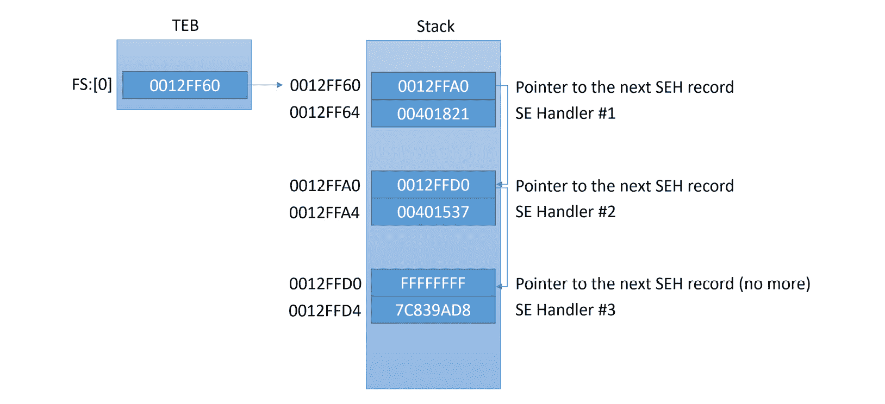

# 第六章：绕过反向工程技术

在本章中，我们将介绍恶意软件作者用来保护其代码免受未经授权的分析师分析的各种反向工程技术。我们将熟悉各种方法，从检测调试器和其他分析工具，到断点检测、**虚拟机**（**VM**）检测，甚至攻击反恶意软件工具和产品。

此外，我们还将介绍恶意软件作者用来避免垃圾邮件检测的虚拟机和沙盒检测技术，以及在各种企业中实现的自动恶意软件检测技术。由于这些反向工程技术被恶意软件作者广泛使用，因此了解如何检测和绕过它们非常重要，以便能够分析复杂或高度混淆的恶意软件。

本章分为以下几个部分：

+   探索调试器检测

+   处理调试器断点的规避

+   摆脱调试器

+   理解混淆技术和反反汇编器

+   检测并规避行为分析工具

+   检测沙盒和虚拟机

# 探索调试器检测

为了让恶意软件作者能够继续其操作而不被防病毒产品或任何打击行动打断，他们必须反击并为他们的工具配备各种反向工程技术。调试器是恶意软件分析师用来剖析恶意软件并揭示其功能的最常用工具。因此，恶意软件作者实施各种反调试技巧，以使分析更加复杂，并隐藏其功能和配置细节（主要是**命令与控制服务器**或**C&C**）。

## 使用 PEB 信息

Windows 提供了多种方法来识别调试器的存在；其中许多方法依赖于`BeingDebugged`中存储的信息，当进程在调试器下运行时，它的值为*True*。为了访问此标志，恶意软件可以执行以下指令：

```
mov  eax, dword ptr fs:[30h]     ; PEB
cmp  byte ptr [eax+2], 1 ; PEB.BeingDebugged
jz  <debugger_detected>
```

如你所见，这里使用`fs:[30h]`技术找到了 PEB 的指针。恶意软件还可以通过许多其他方式获取 PEB：

+   通过使用`fs:[18h]`获取指向 TEB 结构的指针，然后通过偏移量 0x30 查找 PEB。

+   通过使用`NtQueryInformationProcess` API 并传递`ProcessBasicInformation`参数，可以返回`PROCESS_BASIC_INFORMATION`结构，其中第二个字段`PebBaseAddress`将包含 PEB 地址。

可以使用`IsDebuggerPresent` API 来执行完全相同的检查。

`NtGlobalFlag`是 PEB 中的另一个字段，在 32 位系统上位于偏移量 0x68，在 64 位系统上位于 0xBC，可以用于调试器检测。在正常执行过程中，此标志被设置为零，但当调试器附加到进程时，该标志会设置为以下三个值：

+   `FLG_HEAP_ENABLE_TAIL_CHECK (0x10)`

+   `FLG_HEAP_ENABLE_FREE_CHECK (0x20)`

+   `FLG_HEAP_VALIDATE_PARAMETERS (0x40)`

恶意软件可以通过执行以下指令来检查调试器的存在：

```
mov eax, fs:[30h] ; Process Environment Block
mov al, [eax+68h] ; NtGlobalFlag
and al, 70h ; Other flags can also be checked this way 
cmp al, 70h ; 0x10 | 0x20 | 0x40
je <debugger_detected>
```

在这里，恶意软件倾向于通过将这些标志组合成 0x70 的值（使用按位或操作）来检查所有这些标志的存在。

以下逻辑可用于在 64 位环境中检测调试器：

```
push 60h
pop rsi
gs:lodsq ; Process Environment Block
mov al, [rsi*2+rax-14h] ; NtGlobalFlag 
and al, 70h
cmp al, 70h
je <debugger_detected>
```

这个例子更棘手，因为我们应该记住`lodsq`指令会将`rsi`寄存器的值增加 8（QWORD 的大小）。因此，最终的偏移量将是(0x60 + 0x8)*2 – 0x14 = 0xBC，正如之前提到的那样。

最后，为了检测调试器，恶意软件还可以使用存储在 PEB 中的`ProcessHeap`结构（32 位的偏移量为 0x18，64 位为 0x30，WoW64 兼容性级别为 0x1030）。该结构有两个感兴趣的字段：

+   `Flags`（32 位：XP 上的偏移量为 0x0c，Vista+上为 0x40；64 位：XP 上的偏移量为 0x14，Vista+上为 0x70）：通常，恶意软件可以检查 0x40000062 位的存在来揭示调试器，或者反过来检查值是否是默认值（2）。

+   `ForceFlags`（32 位：XP 上的偏移量为 0x10，Vista+上为 0x44；64 位：XP 上的偏移量为 0x18，Vista+上为 0x74）：在这里，恶意软件可以检查当调试器存在时，0x40000060 位是否被设置，或者如果没有调试器，则不会设置这些位。

除了直接访问外，可以使用`GetProcessHeap`和`RtlGetProcessHeaps` API 找到指向`ProcessHeap`结构的指针。可以通过`RtlQueryProcessHeapInformation`和`RtlQueryProcessDebugInformation` API 读取`ProcessHeap`结构中`Flags`字段的值。

最后，设置这些标志的原因是，当调试器附加时，堆尾检查将被启用，系统将在分配的块的末尾添加*0xABABABAB*签名。因此，恶意软件可以分配一个堆块并检查该签名是否存在，从而识别调试器的存在：


图 6.1 – 通过堆尾检查检测调试器的存在

绕过这些检查的常见方法是用`NOP`指令覆盖它们，或在它们的开始设置一个断点以跳过检查。此外，可以使用专用的调试器插件来更改内存中 PEB 结构的值。

## 使用 EPROCESS 信息

`EPROCESS`是另一个系统结构，包含有关进程的信息，可以揭示调试器的存在：

+   如果进程正在使用远程调试器调试，则`DebugPort`字段非零。

+   `Flags`字段包含`NoDebugInherit`标志，当调试器存在时，该标志被设置为 1。

与 PEB 不同，该结构位于内核模式，因此普通进程无法直接读取它。然而，恶意软件可以使用专门的 API 读取其值：

+   `CheckRemoteDebuggerPresent`：它会检查 `EPROCESS` 结构体中的 `DebugPort` 字段。

+   `NtQueryInformationProcess`：这取决于以下参数：

    +   使用 `ProcessDebugPort`（7）参数时，它会检查 `DebugPort` 字段，如果进程正在被调试，则返回 -1。

    +   使用 `ProcessDebugFlags` (0x1F) 时，它会返回一个相反的 `NoDebugInherit` 值。

## 使用 DebugObject

当调试器存在时，系统会创建一个专用的 `DebugObject`。虽然此时恶意软件无法判断是它的样本正在被调试，还是可能是其他东西，但对于某些恶意软件编写者来说，这仍然是一个警示信号。他们可以使用以下 API 来检查其存在：

+   `NtQueryInformationProcess`：使用 `ProcessDebugObjectHandle`（0x1E）参数时，如果存在，它会返回 `DebugObject` 的句柄。

+   `NtQueryObject`：使用 `ObjectAllTypesInformation` 参数，它可以用来通过名称查找 `DebugObject`。

## 使用句柄

在这里，恶意软件可能会利用调试器附加与不附加时句柄管理行为的差异。例如，`CloseHandle`（或 `NtClose`）API 可以用来尝试关闭一个无效句柄。如果调试器已附加，则会触发 `EXCEPTION_INVALID_HANDLE`（0xC0000008）异常，从而揭示其存在。

另一个不太可靠的选项是使用 `CreateFile` 以独占访问模式打开恶意软件的文件。由于某些调试器会保持已分析文件的句柄打开，因此在调试器下此操作可能会失败，从而揭示它。

## 使用异常

调试器被设计用来拦截各种类型的异常，以便能够执行它们的所有功能。恶意软件可以故意触发某些异常，并检测调试器的存在，如果其异常处理程序（关于**结构化异常处理**或 **SEH** 的更多信息将在后面讨论）没有接收到控制权。此方法的示例可以涉及以下 API：

+   `RaiseException` / `RtlRaiseException` / `NtRaiseException` 可用来触发与调试器相关的异常，例如 `DBG_CONTROL_C`、`DBG_CONTROL_BREAK` 或 `DBG_RIPEVENT`。

+   `GenerateConsoleCtrlEvent` 配合 `CTRL_C_EVENT` 或 `CTRL_BREAK_EVENT` 参数可以用来生成 *Ctrl* + *C* 或 *Ctrl* + *Break* 事件。如果 `BeingDebugged` 标志被设置（当调试器附加时），系统会生成 `DBG_CONTROL_C` 异常（或 `DBG_CONTROL_BREAK` 异常），恶意软件可能会尝试拦截它。

+   `SetUnhandledExceptionFilter` 可以用来设置一个自定义函数来处理未处理的异常。如果调试器已附加，函数将不会执行，因为控制权会传递给调试器。

## 使用父进程

还有一种值得一提的技术是，进程可以通过检查父进程的名称来检测它是否是由调试器创建的。Windows 操作系统在进程信息中设置进程 ID 和父进程 ID。通过父进程 ID，你可以检查它是否是正常创建的（例如，使用 `explorer.exe`），或者是否是由调试器创建的（例如，通过检测名称中是否存在 *dbg* 子字符串）。

恶意软件获取父进程 ID 的常见技术有两种，列举如下：

+   使用 `CreateToolhelp32Snapshot`、`Process32First` 和 `Process32Next` 遍历正在运行的进程列表（正如我们在 *第五章* 中所看到的，*检查进程注入与 API 劫持*，涉及进程注入）。这些 API 不仅返回进程名称和 ID，还返回更多信息，例如恶意软件正在寻找的父进程 ID。

+   使用 `NtQueryInformationProcess` API。将 `ProcessBasicInformation` 或 `SystemProcessInformation` 作为参数传递时，该 API 会返回包含父进程 ID 的结构，在 `InheritedFromUniqueProcessId` 字段中，如下图所示：


图 6.2 – 使用 NtQueryInformationProcess 获取父进程

在获取到父进程 ID 后，下一步是获取进程名称或文件名，以检查它是否是常见调试器的名称，或者其名称中是否包含 *dbg* 或 *debug* 子字符串。有两种常见的方法可以从进程 ID 获取进程名称，如下所示：

+   以相同的方式遍历进程以获取父进程 ID，但这次攻击者通过提供先前获取的父进程 ID 来获取进程名称。

+   使用 `GetProcessImageFileNameA` API 获取给定进程句柄的文件名。为了获取有效的句柄，恶意软件将使用 `OpenProcess` API，并将 `PROCESS_QUERY_INFORMATION` 作为必需参数。

此 API 返回进程文件名，稍后可以检查该文件名，以检测它是否是调试器。

另一种常见的恶意软件检测调试过程的方法是断点检测，因此我们接下来将更详细地讨论这个话题。

# 处理调试器断点规避

另一种检测调试器或规避它们的方法是检测其断点。无论是软件断点（如 `INT3`）、硬件断点、单步断点（陷阱标志）还是内存断点，恶意软件都可以检测到这些断点，并可能移除它们以逃避逆向工程控制。

## 检测软件断点（INT3）

这种类型的断点是最容易使用且最容易检测到的。正如我们在*第二章*《汇编语言与编程基础快速教程》中所述，这种断点通过将第一个字节替换为 0xCC（`INT3`指令）来修改指令字节，从而触发异常（错误），并将其传递给调试器处理。

由于它会修改内存中的代码，因此扫描内存中的代码段以寻找`INT3`字节非常容易。一个简单的扫描过程可能像这样：


](img/Figure_6.3_B18500.jpg)

图 6.3 – 一个简单的`INT3`扫描

这种方法的唯一缺点是，一些 C++编译器在每个函数结束时都会写入`INT3`指令作为填充字节。`INT3`字节（0xCC）还可能出现在某些指令内部，作为地址或值的一部分，因此通过代码搜索这个字节可能并不是一个有效的解决方案，且可能会返回大量误报。

恶意软件常用的另外两种技术用于扫描`INT3`断点，如下所示：

+   为整个代码段预计算校验和，并在执行模式下重新计算。如果值发生变化，那么说明有一些字节被修改过，要么是通过修补，要么是通过设置`INT3`断点。这是使用`rol`指令实现的示例：

    ```
    mov esi,<CodeStart>
    mov ecx,<CodeSize>
    xor eax,eax
    ChecksumLoop:
    movzx edx,byte [esi]
    add eax,edx
    rol eax,1
    inc esi
    loop .checksum_loop
    cmp eax, <Correct_Checksum>
    jne <breakpoint_detected>
    ```

+   读取恶意软件样本文件，并将文件中的代码段与内存版本进行比较。如果它们之间有任何差异，意味着恶意软件已在内存中被修补，或代码中加入了软件断点（`INT3`）。这种技术不常用，因为如果恶意软件样本的重定位表已被填充，这种方法并不有效（有关更多信息，请查看*第三章*，《x86/x64 的基本静态和动态分析》）。

避免软件断点检测的最佳解决方案是使用硬件断点、单步执行（代码跟踪），或者在代码段的不同位置设置内存访问断点。一旦内存访问断点被触发，就可以找到校验和计算代码，并通过修补校验和代码本身来处理，如下图所示：


](img/Figure_6.4_B18500.jpg)

图 6.4 – 用于检测`INT3`扫描/校验和计算循环的代码段内存访问断点

在前面的截图中，我们设置了一个断点，`INT3`扫描循环或校验和计算循环。

通过修补校验和计算器末尾的检查或使用与之相反的`jz/jnz`检查，可以轻松绕过此技术。

## 使用陷阱标志检测单步执行断点

另一种广泛使用的断点检测技术是陷阱标志检测。当您逐条跟踪指令，检查它们在内存和寄存器值上的变化时，调试器会在 EFLAGS 寄存器中设置陷阱标志位（TF），该标志位负责在下一条指令停止并将控制权交还给调试器。

这个标志并不容易捕获，因为 EFLAGS 并不是直接可读的。它只能通过 `pushf` 指令读取，该指令将此寄存器的值保存到堆栈中。由于该标志在返回调试器后始终被设置为 *False*，因此很难检查该标志的值并检测单步断点。然而，仍然有一种方法可以做到这一点。

在 x86 架构中，有多个如今不常用的寄存器。这些寄存器在虚拟内存出现之前的 DOS 操作系统中使用，尤其是段寄存器。除了您已经了解的 FS 寄存器外，还有其他段寄存器，例如 CS，指向代码段；DS，指向数据段；以及 SS，指向堆栈段。

`pop SS` 指令相当特殊。该指令用于从堆栈中获取一个值，并根据该值更改堆栈段（或地址）。因此，如果在执行此指令时发生任何异常，可能会导致混乱（例如，哪一个堆栈将用于存储异常信息？）。因此，在执行此指令时不允许有任何异常或中断，包括任何断点或陷阱标志。

如果您正在跟踪这条指令，调试器会移动光标，跳过下一条指令，直接跳到后面的指令。这并不意味着跳过的指令没有执行；它已经执行了，但没有被调试器中断。

例如，在以下代码中，您的调试器光标将从 `POP SS` 移动到 `MOV EAX, 1`，跳过 `PUSHFD` 指令，即使该指令已经执行：

```
PUSH SS
POP SS
PUSHFD ; your debugger wouldn't stop on this instruction
MOV EAX, 1 ; your debugger will automatically stop on this instruction.
```

这里的技巧是，在前面的例子中，陷阱标志会在执行 `pushfd` 指令时保持设置，但它不会被允许返回到调试器。因此，`pushfd` 指令会将 EFLAGS 寄存器推送到堆栈中，包括陷阱标志的实际值（如果已设置，它会显示在 EFLAGS 寄存器中）。然后，恶意软件可以轻松检查陷阱标志是否被设置，并检测到调试器。下面的截图展示了一个例子：


图 6.5 – 使用 SS 寄存器进行陷阱标志检测

值得一提的是，一些调试器，如新版的 x64dbg，已经意识到这一技巧，并且不会以这种方式暴露 TF 位。

这是检查代码跟踪或单步调试的一种直接方法。另一种检测方法是通过监控执行指令或一组指令时经过的时间，这也是我们将在下一节中讨论的内容。

## 使用计时技术检测单步调试

有多种方法可以精确获取系统开启到当前指令执行之间的毫秒级时间。x86 指令`rdtsc`可以返回 EDX:EAX 寄存器中的时间。通过计算执行某条指令前后的时间差，任何延迟都会被清晰显示出来，这代表了通过代码的逆向工程追踪。以下截图展示了一个例子：


图 6.6 – 使用 rdtsc 指令检测单步调试

这条指令不是获取任意时刻时间的唯一方法。Windows 提供了多个 API，帮助程序员获取准确的时间，列举如下：

+   `GetLocalTime`/`GetSystemTime`

+   `GetTickCount`

+   `QueryPerformanceCounter`

+   `timeGetTime`/`timeGetSystemTime`

这种技术使用广泛，且比 SS 段寄存器技巧更常见。最好的解决方法是修补指令。如果你已经在逐步调试指令，检测它非常容易；你可以修补代码，或者直接将指令指针（EIP/RIP）设置为指向检查之后的代码。

## 躲避硬件断点

硬件断点基于在用户模式下无法访问的寄存器。因此，恶意软件很难检查这些寄存器并清除它们以移除这些断点。

为了让恶意软件能够访问它们，它需要将它们压入堆栈并再从中取出。为了实现这一点，许多恶意软件家族依赖于 SEH。

### 什么是 SEH？

为了让任何程序能够处理异常，Windows 提供了一种叫做 SEH 的机制。它基于设置回调函数来处理异常，然后继续执行。如果该回调未能处理异常，它可以将异常传递给上一个设置的回调。如果最后一个回调也无法处理该异常，操作系统会终止进程并通知用户未处理的异常，通常还会建议用户将其发送给开发公司。

第一个回调函数的指针存储在**线程环境块**（**TEB**）中，可以通过 FS:[0x00]访问。该结构是一个链表，这意味着列表中的每一项都包含回调函数的地址，并且跟随在前一项地址之后（即上一个回调）。在堆栈中，链表的结构如下：



图 6.7 – 堆栈中的 SEH 链表

SEH 回调的设置通常如下所示：

```
PUSH <callback_func> // Address of the callback function
PUSH FS:[0] // Address of the previous callback item in the list
MOV FS:[0],ESP // Install the new EXCEPTION_REGISTRATION
```

如你所见，SEH 链表大多数保存在堆栈中。每个项都指向前一个。当发生异常时，操作系统执行这个回调函数，并将关于异常和线程状态的必要信息传递给它（寄存器、指令指针等）。这个回调函数有能力修改寄存器、指令指针和整个线程上下文。回调函数返回后，操作系统采用修改后的线程状态和寄存器（称为上下文），并基于此恢复执行。回调函数如下所示：

```
_cdecl _except_handler( 
   struct _EXCEPTION_RECORD *ExceptionRecord, 
   void * EstablisherFrame, 
   struct _CONTEXT *ContextRecord, 
   void * DispatcherContext 
);
```

重要的参数如下：

+   `ExceptionRecord`：该结构包含与已生成的异常或错误相关的信息。它包含异常代码号、地址和其他信息。

+   `ContextRecord`：这是一个结构体，表示异常发生时该线程的状态。它是一个长结构，包含所有寄存器和其他信息。该结构的一个片段如下所示：

    ```
    struct CONTEXT { 
    DWORD ContextFlags;
    DWORD DR[7];
    FLOATING_SAVE_AREA FloatSave;
    DWORD SegGs;
    DWORD SegFs;
    DWORD SegEs;
    DWORD SegDs;
    DWORD Edi;
    ....
    };
    ```

有多种方法可以通过 SEH 检测调试器。其中一种方法是通过检测并移除硬件断点。

### 检测硬件断点

为了检测或移除硬件断点，恶意软件可以使用 SEH 获取线程上下文，检查 DR 寄存器的值，如果检测到调试器，则退出。代码如下：

```
xor eax, eax
push offset except_callback
push d fs:[eax]
mov fs:[eax], esp
int 3 ; force an exception to occur
...
except_callback:
mov eax, [esp+0ch] ; get ContextRecord
mov ecx, [eax+4] ; Dr0
or ecx, [eax+8]  ; Dr1
or ecx, [eax+0ch] ; Dr2
or ecx, [eax+10h] ; Dr3
jne <Debugger_Detected>
```

另一种检测硬件断点的方法是使用`GetThreadContext` API 访问当前线程（或其他线程）的上下文，并检查是否存在硬件断点，或者使用`SetThreadContext` API 清除它们。

处理这些技术的最佳方法是，在`GetThreadContext`、`SetThreadContext`或异常回调函数上设置断点，以确保它们不会重置或检测到你的硬件断点。

## 内存断点

我们将讨论的最后一种断点类型是内存断点。针对它们的技术并不常见，但它们是可能的。内存断点可以通过使用`ReadProcessMemory` API 并将恶意软件的基址作为参数、其映像大小作为大小来轻松检测。如果恶意软件的任何页面被保护（`PAGE_GUARD`）或设置为无访问保护（`PAGE_NOACCESS`），`ReadProcessMemory`将返回*False*。

对于恶意软件样本，检测写入或执行时的内存断点，它可以通过`VirtualQuery` API 查询任何内存页的保护标志。或者，它可以通过使用带有`PAGE_EXECUTE_READWRITE`参数的`VirtualProtect`来规避这些断点，从而覆盖它们。

处理这些反调试技巧的最佳方法是，在所有这些 API 上设置断点，并强制它们返回所需的结果给恶意软件，从而恢复正常执行。

现在，是时候讨论恶意软件如何尝试逃避调试器了。

# 脱离调试器

除了检测调试器并移除其断点之外，恶意软件还使用多种技巧来完全逃避整个调试环境。我们来看看一些最常见的技巧。

## 进程注入

我们之前在*第五章*中讨论过进程注入，*检查进程注入与 API 挂钩*。进程注入是一种非常著名的技术，不仅用于浏览器中的“中间人”攻击，还用于将调试中的进程逃离，进入一个未被调试的进程。通过将代码注入到另一个进程中，恶意软件可以逃脱调试器的控制，并在调试器附加到进程之前执行代码。

一种常用的绕过该技巧的解决方案是在注入代码的入口点添加一个无限循环指令，直到代码被执行。通常，这个指令是在注入器代码中，通常是在 `WriteProcessMemory` 调用之前（此时代码尚未注入），或者是在 `CreateRemoteThread` 之前，这时代码会注入到另一个进程的内存中。

可以通过写入两个字节（0xEB 0xFE）来创建一个无限循环，这两个字节表示一个 `jmp` 指令，使其跳转到自身，如下截图所示：


图 6.8 – 注入的 JMP 指令，用于创建无限循环

接下来，我们将讨论另一种流行的技术——使用 TLS 回调。继续阅读！

## TLS 回调

许多逆向工程师从恶意软件的入口点开始调试，这通常是有道理的。然而，一些恶意代码可能会在入口点之前就开始执行。有些恶意软件家族使用**线程局部存储**（**TLS**）来执行初始化每个线程的代码（这段代码在线程的实际代码开始之前运行）。这使得恶意软件能够逃避调试，并进行一些初步检查，甚至可能在入口点使用良性代码的同时以这种方式运行大部分恶意代码。

在 PE 头的 *数据目录* 块中，有一个 TLS 条目的入口。它通常存储在 *.tls* 区段中，其结构如下所示：


图 6.9 – TLS 结构

这里，*AddressOfCallBacks* 指向一个以零结尾的回调函数数组（最后一个元素为零），这些回调函数会在每次创建线程后依次调用。任何恶意软件都可以将其恶意代码设置为在 *AddressOfCallBacks* 数组内启动，并确保这些代码在入口点之前执行。

针对这个技巧的一种解决方案是在调试恶意软件之前检查 PE 头，并在 *AddressOfCallBacks* 字段中注册的每个回调函数上设置断点。此外，**IDA** 会将这些回调函数与入口点和导出函数（如果存在）一起显示。

## Windows 事件回调

另一种恶意软件作者用来规避逆向工程师单步调试和断点的方法是通过设置回调函数。回调函数会在特定事件发生时被调用（例如鼠标点击、键盘敲击或窗口移到最前面）。如果你在单步调试恶意软件指令时，回调函数仍会被执行，而你不会注意到。另外，如果你根据代码流设置断点，它仍然会绕过你的断点。

设置回调函数的方式有很多。因此，我们这里只提到其中的两种，如下所示：

+   使用`RegisterClass` API：`RegisterClass` API 用于创建一个窗口类，该类可以用于创建窗口。此 API 接受一个名为`WNDCLASSA`的结构作为参数。`WNDCLASSA`结构包含与窗口相关的所有必要信息，包括图标、光标图标、样式，以及最重要的回调函数，用于接收窗口事件。代码如下所示：

    ```
    MOV  DWORD PTR [WndCls.lpfnWndProc], <WindowCallback>
    LEA  EAX, DWORD PTR SS:[WndCls]
    PUSH EAX ; pWndClass
    CALL <JMP.&user32.RegisterClassA> ; RegisterClassA
    ```

+   使用`SetWindowLong`：设置窗口回调的另一种方法是使用`SetWindowLong`。如果你有窗口句柄（来自`EnumWindows`、`FindWindow`或其他 API），你可以调用`SetWindowLong` API 来更改窗口回调函数。以下是代码示例：

    ```
    PUSH <WindowCallback>
    PUSH GWL_DlgProc
    PUSH hWnd ; Window Handle
    CALL SetWindowLongA
    ```

针对这种情况，最好的解决方案是在所有注册回调或其回调函数的 API 上设置断点。你可以检查恶意软件的导入表、任何调用`GetProcAddress`的函数或其他动态解析和调用 API 的函数。

## 攻击调试器

在某些情况下，恶意软件可能会尝试攻击调试会话。例如，`BlockInput` API 可以用于阻止鼠标和键盘事件，使附加的调试器无法使用。另一个类似的选项是使用`SwitchDesktop`来隐藏调试器的鼠标和键盘事件。

说到线程，`NtSetInformationThread` API 与`ThreadHideFromDebugger`（0x11）参数可以用于将线程隐藏起来，使调试器无法看到。任何发生在隐藏线程中的异常，包括触发的断点，都不会被调试器拦截，反而会导致程序崩溃。最后，恶意软件还可以使用`SuspendThread`/`NtSuspendThread` API 来对调试器的线程本身进行攻击。

这些是恶意软件可能尝试影响调试过程的最常见方式。接下来，让我们谈谈各种类型的混淆技术。

# 理解混淆技术和反反汇编器

反汇编工具是逆向工程中最常用的工具之一，因此它们是恶意软件作者的攻击目标。现在，我们将看看恶意软件在代码混淆上使用的不同技术，使其更难以被逆向工程师分析。

## 加密

加密是最常见的技术，它还能保护恶意软件免受静态杀毒软件签名的检测。恶意软件可以加密自己的代码，并拥有一个小的存根代码，在执行恶意代码之前解密它。此外，恶意软件还可以加密自己的数据，例如包括 API 名称的字符串或整个配置块。

处理加密并不总是容易的。一种解决方案是执行恶意软件并在解密后转储内存。例如，现在许多沙箱可以对被监控的进程进行转储，这有助于你获得解密后的恶意软件。

但是，对于像加密字符串并按需解密每个字符串这样的情况，你需要逆向加密算法，并编写脚本遍历所有解密函数的调用，利用它的参数解密字符串。你可以查看*第四章*，*解包、解密和去混淆*，以了解如何处理加密并编写此类脚本。

## 垃圾代码

另一个在许多样本中使用并在 1990 年代末和 2000 年代初变得越来越流行的技术是垃圾代码插入。通过这种技术，恶意软件作者插入大量永远不会被执行的代码。例如，这些代码可以放在无条件跳转、永不返回的调用或条件跳转且条件永远不会满足的地方。此代码的主要目的是浪费逆向工程师分析无用代码的时间，或者让代码图看起来比实际复杂。

另一个类似的技术是插入无效代码。这些无效代码可能是像`nop`、`push`和`pop`、`inc`和`dec`，或者是重复相同的指令。这些指令的组合看起来像真实的代码；然而，实际上相同的操作会被编码得简单得多，正如你在以下截图中看到的那样：


](img/Figure_6.10_B18500.jpg)

图 6.10 – 无意义的垃圾代码

这种垃圾代码有不同的形式，包括指令的扩展；例如，`inc edx`变成`add edx, 3`和`sub edx, 2`，以此类推。通过这种方式，可以混淆实际的值，如 0x5a4D（*MZ*）或任何其他可能代表此子程序特定功能的值。

这种技术自 1990 年代起就在变形引擎中存在，但一些家族仍然使用它来混淆他们的代码。

值得提到的是，虽然存储在本地变量中的字符串分析起来更复杂，但以下**不是**这种技术的示例，而是一个合法编译器的行为：


](img/Figure_6.11_B18500.jpg)

图 6.11 – 存储在本地变量中的字符串

现在，让我们来谈谈代码传输技术。

## 代码传输

恶意软件作者常用的另一个技巧是代码传输。这种技术不会插入垃圾代码，而是通过大量的无条件跳转（包括`call` + `pop` 或总为真或总为假的条件跳转）重新安排每个子程序中的代码。

这使得函数图看起来非常复杂，难以分析，从而浪费逆向工程师的时间。以下截图展示了这样的代码示例：


图 6.12 – 使用无条件跳转进行代码传输

还有一种更复杂的形式，恶意软件会将每个子程序的代码重新安排到其他子程序的中间。这种形式使得反汇编工具更难连接每个子程序，因为它会错过函数末尾的`ret`指令，从而不将其视为一个函数。

其他一些恶意软件家族不会在子程序末尾放置`ret`指令，而是用`pop`和`jmp`来代替，隐藏该子程序不被反汇编工具识别。这些只是代码传输和垃圾代码插入技术的多种形式之一。

## 使用校验和的动态 API 调用

动态 API 调用是许多恶意软件家族使用的一种著名的反反汇编技巧。其背后的主要原因是，通过这种方式，它们可以将 API 名称隐藏在静态分析工具之外，使得理解恶意软件中每个函数的功能更加困难。

对于恶意软件作者来说，要实现这一技巧，他们需要预先计算该 API 名称的校验和，并将该值作为参数传递给一个扫描不同库的导出表并通过此校验和查找 API 的函数。以下截图展示了这个例子：


图 6.13 – 库和 API 名称的校验和（哈希）

解决函数的代码实际上会通过库的 PE 头，遍历导出表，并计算每个 API 的校验和，与作为参数提供的给定校验和（或哈希值）进行比较。

这种方法的解决方案可能需要编写脚本，遍历所有已知的 API 名称并计算它们的校验和。或者，它可能需要多次执行此函数，分别输入每个校验和，并保存相应的 API 名称。

## 代理函数和代理参数堆叠

Nymaim 银行木马通过增加一些额外的技巧，如代理函数和代理参数堆叠，将反反汇编技巧提升到了另一个层次。

使用代理函数技术，恶意软件不会直接调用所需的函数；相反，它调用一个代理函数，该函数计算所需函数的地址并将执行转移到那里。Nymaim 包含了超过 100 个不同的代理函数，使用了四到五种不同的算法。代理函数调用如下所示：


图 6.14 – 用于计算函数地址的代理函数参数

代理函数的代码如下所示：


图 6.15 – Nymaim 代理函数

对于参数，Nymaim 使用一个函数将参数推送到堆栈，而不是仅仅使用 `push` 指令。这一技巧可以防止反汇编工具识别传递给每个函数或 API 的参数。代理参数堆叠的示例如下：


图 6.16 – Nymaim 中的代理参数堆叠技术

该恶意软件包括了我们在本节中介绍的多种不同形式的技术。因此，只要掌握了主要思路，你应该能够理解所有这些技术。

## 使用 COM 功能

恶意软件可能尝试通过不同的技术实现与动态解析哈希值来隐藏 API 名称相同的效果。一个好的例子是使用 `Wscript.Shell` COM 对象的功能来执行程序，而不是直接调用 `CreateProcess`、`ShellExecute` 或 `WinExec` 等 API，这些 API 会立刻引起研究人员的注意。为了创建该对象，恶意软件可以使用 `CoCreateInstance` API，并指定所需对象的类形式为 IID，如下截图所示：


图 6.17 – 通过其 IID 创建 Wscript.Shell 对象的实例，F935DC21-1CF0-11d0-ADB9-00C04FD58A0B

之后，实际方法将通过其偏移量进行访问。为了通过偏移量查找方法的名称，你可以使用 **COMView** 工具：


图 6.18 – 通过在汇编中找到的偏移量查找 COM 对象方法的名称

如你所见，`Wscript.Shell` 类的 `Run` 方法通过其偏移量 36 (0x24) 来访问。

如我们所见，混淆可以有多种形式，所以你了解的示例越多，找到处理它的正确方法所需的时间就越短。现在，是时候学习如何使用恶意软件检测行为分析工具了。

# 检测和规避行为分析工具

恶意软件可以通过多种方式检测并规避行为分析工具，如 ProcMon、Wireshark、API Monitor 等，即使这些工具并没有直接调试恶意软件或与其交互。在本节中，我们将讨论两种常见的恶意软件规避方法。

## 查找工具进程

恶意软件处理恶意软件分析工具（以及杀毒工具）的一种最简单且最常见的方法是循环检查所有正在运行的进程，并检测任何不需要的条目。然后，它可以终止或停止它们，以避免进一步分析。

在 *第五章*，*检查进程注入和 API Hook* 中，我们讲解了恶意软件如何使用 `CreateToolhelp32Snapshot`、`Process32First` 和 `Process32Next` APIs 循环检查所有正在运行的进程。在这个反反向工程技巧中，恶意软件以完全相同的方式使用这些 API 来检查进程名是否与不需要的进程名或其哈希值匹配。如果匹配，恶意软件会终止自身，或者通过调用 `TerminateProcess` API 来杀死该进程。以下截图展示了这个技巧在 Gozi 恶意软件中的实现：


图 6.19 – Gozi 恶意软件循环检查所有正在运行的进程

以下截图展示了 Gozi 恶意软件代码的一个示例，使用 `TerminateProcess` API 通过自定义的 `ProcOpenProcessByNameW` 程序终止其选择的进程：


图 6.20 – Gozi 恶意软件借助 ProcOpenProcessByNameW 函数终止进程

这个技巧可以通过在执行工具之前重命名它们来绕过。如果你避免在新名称中使用任何已知的关键词，如*dbg*、*反汇编器*、*AV*等，这个简单的解决方案可以完美地隐藏你的工具。

## 查找工具窗口

另一种技巧是，不搜索工具的进程名，而是搜索其窗口名称（窗口标题）。通过搜索程序窗口名称，恶意软件可以绕过任何可能对进程名进行的重命名，这也为它提供了检测新工具的机会（大多数情况下，窗口名称比进程名称更具描述性）。

这个技巧可以通过以下两种方式实现：

+   使用`FindWindow`：恶意软件可以使用完整的窗口标题，如*Microsoft network monitor*，或者窗口类名。窗口类名是在窗口创建时分配给它的名称，它与窗口上显示的标题不同。例如，`OllyDbg`的窗口类名是`OLLYDBG`，而完整标题可能会根据正在分析的恶意软件进程名称而变化。以下是一个示例：

    ```
    push NULL
    push .szWindowClassOllyDbg
    call FindWindowA
    test eax,eax
    jnz <debugger_found>
    push NULL
    push .szWindowClassWinDbg
    call FindWindowA
    test eax,eax
    jnz <debugger_found>
    .szWindowClassOllyDbg db "OLLYDBG",0
    .szWindowClassWinDbg db "WinDbgFrameClass",0
    ```

+   使用`EnumWindows`：另一种避免搜索窗口类名或处理窗口标题变化的方法是遍历所有可访问的窗口名称并扫描它们的标题，寻找诸如*Debugger*、*Wireshark*、*Disassembler*等可疑的窗口名称。这是一种更灵活的处理新工具或恶意软件作者遗忘覆盖的工具的方法。使用`EnumWindows` API 时，你需要设置一个回调函数来接收所有窗口。

对于每个顶级窗口，这个回调函数将接收到该窗口的句柄，从中可以使用`GetWindowText` API 获取其名称。以下是一个示例：


图 6.21 – FinFisher 威胁利用 EnumWindows 设置其回调函数

回调函数的声明如下所示：

```
BOOL CALLBACK EnumWindowsProc(
_In_ HWND hwnd,
_In_ LPARAM lParam);
```

*hwnd*值是窗口的句柄，而*lParam*是用户定义的参数（由用户传递给回调函数）。恶意软件可以使用这个句柄（*hwnd*）与`GetWindowText` API 获取窗口标题，并与预定义的关键词列表进行比对。

修改窗口标题或类比实际上在这些 API 上设置断点并跟踪回调函数要复杂。流行工具如 OllyDbg 和 IDA 的插件可以帮助重命名它们的标题窗口，以避免被检测（如 OllyAdvanced），你也可以使用它作为一种解决方案。

现在我们了解了行为分析工具如何被检测到，接下来让我们了解沙盒和虚拟机检测。

# 检测沙盒和虚拟机

恶意软件作者知道，如果他们的恶意软件样本正在虚拟机上运行，那么它很可能正在被逆向工程师分析，或者它可能正在沙盒等自动化工具的分析下运行。有多种方法可以检测虚拟机和沙盒，接下来我们将逐一介绍。

## 虚拟机和真实机器之间的不同输出

恶意软件作者可以利用一些汇编指令在虚拟机上执行时的独特特征来检测虚拟机。一些例子如下：

+   `CPUID`指令返回有关 CPU 的信息，并提供该信息在`eax`中的叶/ID。对于叶 0x01（*eax = 1*），`CPUID`指令将第 31 位设置为 1，表示操作系统正在虚拟机或虚拟化程序中运行。

+   `CPUID` 指令，给定 *eax = 0x40000000*，它可以返回虚拟化工具的名称（如果存在），并将其作为单个字符串存储在 EBX、ECX 和 EDX 寄存器中。这些名称字符串的示例包括 *VMwareVMware*、*Microsoft Hv*、*VBoxVBoxVBox* 和 *XenVMMXenVMM*。

+   **MMX 寄存器**：MMX 寄存器是英特尔推出的一组寄存器，旨在加速图形计算。虽然很少见，但有些虚拟化工具不支持它们。一些恶意软件或打包工具利用它们进行解包，以检测或避免在虚拟机上运行。

+   `IN` 指令，当在 VMware 虚拟机上执行并将端口参数设置为 0x5658（在 ASCII 中表示 *VX*，即 VMware 超级监视器端口）时，且 EAX 值等于 0x564D5868（*VMXh* 魔术值），将返回 EBX 寄存器中的相同魔术值 *VMXh*，从而揭示虚拟机的存在。

## 检测虚拟化进程和服务

虚拟化软件通常会在客户机上安装一些工具，以启用剪贴板同步、拖放、鼠标同步和其他有用的功能。这些工具可以通过扫描这些进程，使用 `CreateToolhelp32Snapshot`、`Process32First` 和 `Process32Next` API 来轻松检测到。以下是一些此类进程：

+   `VMware`：

    +   `vmacthlp.exe`

    +   `VMwareUser.exe`

    +   `VMwareService.exe`

    +   `VMwareTray.exe`

+   `VirtualBox`：

    +   `VBoxService.exe`

    +   `VBoxTray.exe`

可以使用相同的方法搜索文件系统中的特定文件或目录。

## 通过注册表键检测虚拟化

有多个注册表键可以用来检测虚拟化环境。它们中的一些与硬盘名称（通常以虚拟化软件命名）、已安装的虚拟化同步工具或虚拟化过程中的其他设置相关。以下是一些注册表条目：

```
HKEY_LOCAL_MACHINE\SOFTWARE\Vmware Inc.\Vmware Tools
HKEY_LOCAL_MACHINE\SOFTWARE\Oracle\VirtualBox Guest Additions
HKEY_LOCAL_MACHINE\HARDWARE\ACPI\DSDT\VBOX
```

## 使用 WMI 检测虚拟机

不仅是注册表值能揭示有关虚拟化软件的很多信息——Windows 管理的信息也能揭示这些信息，例如通过 PowerShell 访问的内容，如下图所示：


图 6.22 – 检测 VMWare 的 PowerShell 命令

可以通过 WMI 查询访问此信息，例如以下内容：

```
SELECT * FROM Win32_ComputerSystem WHERE Manufacturer LIKE "%VMware%" AND Model LIKE "%VMware Virtual Platform%"
```

对于 Microsoft Hyper-V，命令如下：

```
SELECT * FROM Win32_ComputerSystem WHERE Manufacturer LIKE "%Microsoft Corporation%" AND Model LIKE "%Virtual Machine%"
```

这些技术使得隐藏恶意软件运行在虚拟化软件中而非真实机器上的事实变得更加困难。

## 其他虚拟机检测技术

恶意软件家族可以使用许多其他技术来检测虚拟化环境，例如以下方法：

+   命名管道和设备，例如 *\\.\pipe\VBoxTrayIPC*

+   窗口标题或类名，例如 *VBoxTrayToolWndClass* 或 *VBoxTrayToolWnd*

+   网络适配器的 MAC 地址的第一部分：

    +   00:1C:14, 00:50:56, 00:05:69, 00:0C:29 – VMWare

    +   08:00:27 – VirtualBox

    +   00:03:FF – Hyper-V

上述列表可以通过许多类似的技巧和方法进一步扩展，用以检测虚拟化环境。

## 使用默认设置检测沙箱

沙箱也很容易被检测到。它们有许多默认设置，恶意软件作者可以用来识别它们：

+   用户名可能是默认值，例如*cuckoo*或*user*。

+   文件系统可以包含相同的诱饵文件和相同的文件结构（如果没有，则是相同数量的文件）。即使是样本本身的名称也可以始终相同，例如*sample.exe*。

这些设置可以很容易地被常用沙箱检测到，甚至不需要查看它们已知的工具和进程。

除此之外，沙箱通常通过以下特点被检测到：

+   系统硬件过于薄弱（主要是磁盘空间和内存）

+   不寻常的系统设置（非常低的屏幕分辨率或没有安装软件）

+   没有用户交互（缺乏鼠标移动或近期的文件修改）

另一种常见的逃避沙箱的方法是避免在它们的分析时间窗口内执行恶意活动。在许多情况下，沙箱只执行恶意软件几秒钟或几分钟，然后收集必要的信息后终止虚拟机。一些恶意软件家族使用如`Sleep`这样的 API，或者执行长时间的计算来延迟执行，或者在机器重启后再执行。这种技巧可以帮助恶意软件逃避沙箱，确保它们不会收集重要信息，比如 C&C 域名或恶意软件持久化技术。

这些是一些最常见的沙箱检测技巧。值得一提的是，恶意软件开发者不断发明更多新颖的方法来实现这一目标，因此，跟上它们的步伐需要持续学习和实践。

# 总结

在本章中，我们介绍了恶意软件作者用来检测和逃避逆向工程的许多技巧，从检测调试器及其断点，到检测虚拟机和沙箱，再到融合混淆和逃避调试器技术。现在你应该能够分析更先进的恶意软件，这些恶意软件配备了多个反调试或反虚拟机的技巧。此外，你还将能够分析实现大量反反汇编技巧的高度混淆恶意软件。

在*第七章*《理解内核模式 Rootkit》中，我们将进入操作系统的核心。我们将覆盖内核模式，学习每个 API 调用和操作如何在 Windows 操作系统内部工作，以及 Rootkit 如何挂钩这些步骤，以隐藏恶意活动，从而避开杀毒软件和用户的眼睛。
