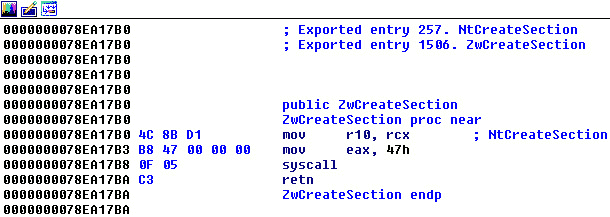
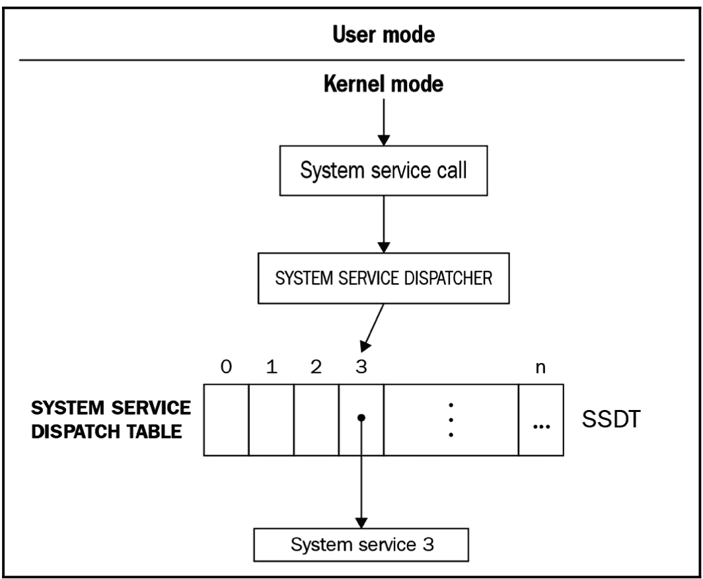
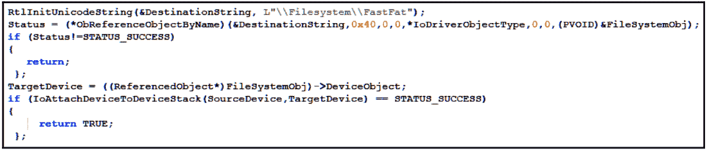
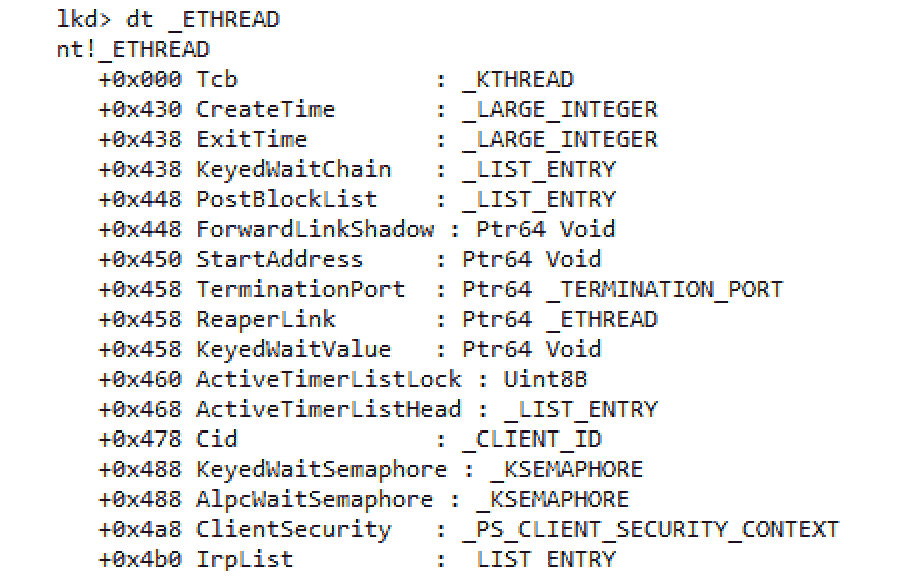

# 第七章：理解内核模式下的 Rootkit

本章我们将深入探讨 Windows 内核及其内部结构和机制。我们将介绍恶意软件作者用来隐藏恶意软件存在的不同技术，避免被用户和杀毒软件发现。

我们将研究不同的高级内核模式挂钩技术、内核模式中的进程注入，以及如何在其中进行静态和动态分析。

在深入了解 Rootkit 和它们是如何实现之前，我们需要理解 **操作系统**（**OS**）是如何工作的，以及 Rootkit 如何针对操作系统的不同部分并加以利用。

本章将涵盖以下主题：

+   内核模式与用户模式

+   Windows 内部结构

+   Rootkit 和设备驱动程序

+   挂钩机制

+   DKOM

+   内核模式中的进程注入

+   x64 系统中的 KPP（PatchGuard）

+   内核模式中的静态和动态分析

# 内核模式与用户模式

你已经看到计算机上运行的多个用户模式进程（所有你看到的应用程序都在用户模式下运行），并学习了如何修改文件、连接互联网并执行大量操作。然而，你可能会惊讶地发现，用户模式应用程序并没有执行所有这些操作的权限。

为了让任何进程创建文件或连接到域，它需要向内核模式发送请求来执行该操作。这个请求是通过所谓的系统调用来完成的，系统调用会切换到内核模式以执行该操作（如果权限允许）。内核模式和用户模式不仅得到操作系统的支持，还得到处理器通过保护环（或硬件限制）的支持。

## 保护环

x86 处理器提供四个特权环（x64 稍有不同）。每个环的特权比前一个低，如下图所示：


图 7.1 – 处理器环

Windows 主要使用这两个环：*RING 0* 用于内核模式，*RING 3* 用于用户模式。现代处理器如 Intel 和 AMD 还有另一个环（*RING 1*）用于虚拟机监控程序（Hypervisor）和虚拟化，以便每个操作系统可以原生运行，同时由虚拟机监控程序控制某些操作，如硬盘访问。

这些保护环用于处理故障（如内存访问故障或任何类型的异常）以及安全性。*RING 3* 具有最少的权限——也就是说，处于此环中的进程无法影响系统，无法访问其他进程的内存，也无法访问物理内存（它们必须在虚拟内存中运行）。相比之下，*RING 0* 可以做任何事——它可以直接影响系统及其资源。因此，只有 Windows 内核和设备驱动程序可以访问该环。

# Windows 内部结构

在我们深入探讨 rootkit 的恶意活动之前，先来了解一下 Windows 操作系统的工作原理以及用户模式与内核模式之间的交互是如何组织的。这些知识将帮助我们理解内核模式恶意软件的具体情况，以及它可能针对系统的哪些部分。

## Windows 解剖图

正如我们之前提到的，操作系统分为两部分：用户模式和内核模式。以下图示展示了这一点：


图 7.2 – Windows 操作系统设计

现在，让我们了解一下这些应用程序的作用范围：

+   `kernel32.dll` 在 Win32 和 Win64 子系统中的作用。

这些 `ntdll.dll`，它直接与内核模式通信。`Ntdll.dll` 是一个库，使用特殊指令（如 `sysenter` 或 `syscall`，具体取决于模式和是 Intel 还是 AMD 处理器；在本章中我们将交替使用它们）向内核发送请求。请求 ID 是通过 `eax` 寄存器传递的：



图 7.3 – 系统调用指令

+   **内核模式**：管理所有资源，包括内存、文件、用户界面、声音、图形等。它还负责调度线程和进程，并管理所有应用程序的 UI。内核模式与直接发送命令或接收硬件输入的设备驱动程序进行通信。它管理所有这些请求以及在操作前后的任何工作。

这是对 Windows 操作系统工作原理的简要解释。现在，我们将深入探讨从用户模式到内核模式的请求生命周期，以便更好地理解这一切是如何协同工作的。此外，我们还将探讨 rootkit 如何干扰系统并执行恶意活动。

## 从用户模式到内核模式的执行路径

首先，来看一下需要内核模式功能的一个 API 调用的生命周期（在这个例子中，我们将使用 `FindFirstFileA`）。我们将详细拆解每一个步骤，以便理解系统中每个部分在处理进程请求时所扮演的角色。这是我们理解恶意软件如何介入这一系列操作的一个重要前提：


图 7.4 – API 调用生命周期

让我们逐步解析前面的图示，如下所示：

1.  首先，进程调用了 `FindFirstFileA` API，该 API 实现于 `kernel32.dll` 库中。

1.  然后，`kernel32.dll`（与所有子系统 DLL 相同）调用 `ntdll.dll` 库中的一个函数。在这个例子中，它调用了一个名为 `ZwQueryDirectoryFile`（或 `ZwQueryDirectoryFileEx`）的 API。

1.  所有 `Zw*` API 都执行 `syscall` 指令，正如你在 *图 7.3* 中看到的那样。`ZwQueryDirectoryFile` 通过将命令 ID 以 `eax` 形式提供来执行 `syscall`（这里，命令 ID 会随着 Windows 版本的不同而变化）。

1.  现在，应用程序进入内核模式，执行被重定向到一个名为系统服务调度器的内核模式函数。它在 32 位机器上以`KiSystemService`（或直接为`KiFastCallEntry`）的名称提供，在 64 位机器上则是`KiSystemCall64`；兼容模式下将使用`KiSystemCall32`名称。系统还可能使用带有`Shadow`后缀的它们的影像版本（例如，`KiSystemServiceShadow`或`KiSystemCall64Shadow`）。

1.  系统服务调度器搜索表示`eax`形式的命令 ID（在本例中为 0x91）在`NtQueryDirectoryFile`中的函数。它调用这个函数，并传递所有传递给`FindFirstFileA`的参数：



图 7.5 – SSDT 解释

1.  接下来，执行`NtQueryDirectoryFile`，此函数会发送一个请求，称为`fastfat.sys`或`ntfs.sys`驱动程序（这取决于已安装的文件系统）。更多关于 IRP 的细节将在稍后提供。

1.  这个请求经过多个附加到文件系统驱动程序的设备驱动程序。这些设备驱动程序可以修改任何请求中的输入以及文件系统返回的输出（或响应）。

1.  最后，文件系统驱动程序处理请求。IRP 请求通过一个名为`sysret`（或`sysexit`）的指令返回到`NtQueryDirectoryFile`。然后，控制权返回到用户模式进程，并带回结果。

这听起来可能相对复杂，但目前为止，这些就是你需要知道的内容，以便理解内核模式 rootkit 是如何工作的，更重要的是，rootkit 如何利用这个过程中存在的弱点来实现它们的目标。

# Rootkit 和设备驱动程序

现在你已经理解了 Windows 内部结构以及用户模式和内核模式交互的工作原理，让我们深入探讨 rootkit。在这一部分，我们将了解 rootkit 是什么以及它们是如何设计的。在我们掌握了 rootkit 的基本概念后，我们将讨论设备驱动程序。

## 什么是 rootkit？

Rootkit 本质上是提供隐匿功能的低级工具。它们的主要目的是通过隐藏相关的伪迹来使恶意模块更难被检测和修复，从而使目标机器的恶意软件检测和修复过程复杂化。实现这一目标有多种方法，接下来我们将详细讨论这些方法。

## Rootkit 的类型

在用户模式、内核模式甚至启动模式中都有各种类型的 rootkit：

+   **用户模式或应用程序 rootkit**：我们在*第五章*中介绍了用户模式 rootkit，*检查进程注入和 API 钩取*；它们将恶意代码注入到其他进程中，并挂钩其 API，以隐藏恶意软件文件、注册表键和其他**妥协指标**（**IoC**）不被这些进程发现。它们可以用来绕过防病毒程序、任务管理器等。

+   **内核模式根套件**：本章将主要介绍这些根套件。它们是设备驱动程序，钩住内核模式中的不同功能，以隐藏恶意软件的存在并赋予恶意软件内核模式的权限。它们还可以向其他进程注入代码和数据，终止 AV 进程，拦截网络流量，执行**中间人攻击**（**MITM**）等。

+   **引导根套件**：引导根套件是修改引导加载程序的根套件。它们用于在操作系统启动之前加载恶意文件。这使得恶意软件可以在操作系统及其安全机制启动之前完全控制计算机。

+   **固件根套件**：这一类威胁针对固件（如**统一可扩展固件接口**（**UEFI**）或**基本输入输出系统**（**BIOS**））进行攻击，以实现尽早的执行。

+   **虚拟机监控程序或虚拟根套件**：在撰写本文时，这些威胁大多以**概念验证**（**PoCs**）的形式存在。它们应该位于环 1（虚拟机监控程序）中。

在本章中，我们将重点关注内核模式根套件及其如何钩住多个功能或修改内核对象来隐藏恶意软件。在了解它们的钩子机制之前，首先，让我们理解什么是设备驱动程序。

## 什么是设备驱动程序？

设备驱动程序是内核模式工具，用于与硬件交互。每个硬件制造商都会创建一个设备驱动程序来与他们自己的硬件通信，并将 IRP 转换为硬件设备能够理解的请求。

操作系统的主要目的之一是标准化与任何类型设备的通信渠道，无论设备供应商如何。例如，如果你将有线鼠标换成了来自不同厂商的无线鼠标，它不应影响与鼠标交互的应用程序。同样，如果你是开发者，你也不必担心用户使用的是什么类型的键盘或打印机。

设备驱动程序使得可以理解 I/O 请求，并以标准化格式返回输出，无论设备的工作方式如何。

还有其他一些驱动程序与实际设备无关，例如防病毒模块，以及在我们的案例中，根套件。内核模式根套件是设备驱动程序，利用内核模式提供的功能来支持实际的恶意软件，确保其隐蔽性和持久性。

现在，让我们看看根套件如何实现它们的目标，以及它们如何利用从用户模式到内核模式的执行路径中的弱点。

# 钩子机制

在本节中，我们将探讨不同类型的钩子机制。在下面的图示中，我们可以看到根套件在请求处理流程的不同阶段使用的各种钩子技术：


图 7.6 – 根套件的钩子机制

根套件可以在这个过程流的不同阶段安装钩子：

+   **用户模式挂钩/API 挂钩**：这些是用于隐藏恶意软件进程、文件、注册表项等的用户模式 API 挂钩机制。我们在*第五章*中讨论过，*检查进程注入和 API 挂钩*。

+   `sysenter`将把执行转移到内核模式，并拦截从用户模式到内核模式的所有请求。

+   **SSDT 挂钩**：该技术与 rootkit 希望挂钩的函数更紧密地合作。这种挂钩类型修改 SSDT，使其将请求重定向到恶意函数，而不是实际处理请求的函数（类似于 IAT 挂钩）。

+   **代码修补**：与其修改 SSDT，这种 rootkit 会修补处理请求的函数，使命令一开始就调用恶意函数（类似于 API 挂钩）。

+   **分层驱动程序/IRP 挂钩**：这是一种合法的挂钩技术，用于拦截请求并修改输入输出。它更难以检测，因为它是微软官方支持的。

我们还将探索 rootkit 使用的其他技术，例如`EPROCESS`和`ETHREAD`，这些我们在*第三章*中提到过，*x86/x64 的基本静态和动态分析*。除此之外，`sysenter`成为了执行这一操作的首选方法。

现在，让我们更详细地了解这些技术。

## 挂钩 SYSENTER 入口函数

当用户模式应用程序执行`sysenter`（在 Windows 2000 及更早版本中为`int 0x2e`）时，处理器会将执行切换到内核模式，特别是切换到存储在**模型特定寄存器**（**MSR**）中的特定地址。MSR 是用于调试、监控、切换或禁用各种 CPU 功能的控制寄存器。

在使用`sysenter`进行用户模式到内核模式的切换过程中，有几个重要的寄存器：

+   `sysenter`；在这里，SS 段寄存器将是一个值为+8 的 CS 值。

+   `sysenter`被执行时，它将是参数被复制到的地方。

+   `sysenter`。它指向系统服务调度器。

+   `KiSystemCall64`).*   `KiSystemCall32`).

这些寄存器可以分别通过`rdmsr`和`wrmsr`汇编指令进行读取和修改。`rdmsr`指令会将寄存器 ID 放入`ecx/rcx`寄存器中，并将结果返回到`edx:eax`（在 x64 中为`rdx:rax`寄存器；这两个寄存器的高 32 位未使用）。以下是一个示例：

```
mov ecx, 0x176 ; IA32_SYSENTER_EIP
rdmsr ; read msr register
mov <eip_low>, eax
mov <eip_high>, edx
```

`wrmsr`与`rdmsr`非常相似。`wrmsr`将寄存器 ID 放入`ecx`中，并将要写入的值放入`edx:eax`寄存器对中。以下是挂钩代码：

```
mov ecx, 0x176 ; IA32_SYSENTER_EIP
xor edx, edx
mov eax, <malicious_hooking_function>
wrmsr ; write this value to IA32_SYSENTER_EIP
```

这种技术有多个缺点，具体如下：

+   对于有多个处理器的环境，仅挂钩一个处理器。这意味着攻击者必须创建多个线程，希望它们能在所有处理器上运行，从而使得挂钩所有处理器成为可能。

+   攻击者需要从用户模式堆栈中获取参数并解析它们。

+   以这种方式，所有函数都被挂钩，因此有必要实现一些过滤，以便只检查应挂钩的函数。

这是恶意软件可以在内核模式下挂钩的第一个地方。接下来我们来看第二个地方，就是修改 SSDT 时。

## 在 x86 环境中修改 SSDT

首先，SSDT 表与 `ntoskrnl.exe` 中的第一个元素不同，并且由其指向，名称为 `KeServiceDescriptorTable`。该表有四个不同的 SDT 条目的插槽，但在写作时，Windows 只使用了其中两个：`KeServiceDescriptorTable` 和 `KeServiceDescriptorTableShadow`。

当用户模式应用程序使用 `sysenter` 时，正如你在 *图 7.3* 中看到的，应用程序会将函数编号或 ID 提供到 `eax` 寄存器中。在 `eax` 中，这个值以如下方式分割：


图 7.7 – sysenter eax 参数值

这些值如下所示：

+   `bits 0-11`：这是 **系统服务编号** (**SSN**)，它是该函数在 SSDT 中的索引。

+   `bits 12-13`：这是 SDT，表示 SDT 编号（这里，`KeServiceDescriptorTable` 是 0x00，`KeServiceDescriptorTableShadow` 是 0x01）

+   `bits 14-31`：此值未使用，填充为零

SDT 存储一个 `SYSTEM_SERVICE_TABLE` 条目的数组，现代操作系统主要使用第一个元素。它包含以下字段：

+   `KiServiceTable`：这是一个 SSDT 表，表示每个可以通过 `eax` 在 `sysenter` 之前传递的 SSN 的函数地址数组。

+   `CounterBaseTable`：在 Windows 的免费（零售）版本中未使用。

+   `nSystemCalls`：这是 `KiServiceTable` 和 `KiArgumentTable` 表中项的数量。

+   `KiArgumentTable`：这是一个数组，其排序方式与 `KiServiceTable` 相同。这里，每个项包含应为每个函数的参数分配的字节数。

为了让恶意软件挂钩这个表，它需要获取由 `ntoskrnl.exe` 导出的 `KeServiceDescriptorTable`，然后移动到 `KiServiceTable` 并修改它想要挂钩的函数。为了能够修改这个表，必须禁用写保护（因为这是一个只读表）。有多种方法可以实现这一点，最常见的方法是通过修改 `CR0` 寄存器值并将写保护位设置为零：

```
PUSH EBX
MOV EBX, CR0
OR EBX, 0x00010000
MOV CR0,EBX
POP EBX
```

完整的挂钩机制如下所示：


图 7.8 – 来自 winSRDF 项目的 SSDT 挂钩代码

如您所见，应用程序能够获取`KeServiceDescriptorTable`的地址，该地址在`ntoskrnl.exe`中以该名称导出。然后，它获取`KiServiceTable`数组，禁用写保护，最后使用`InterlockedExchange`在没有其他线程使用时修改表格（`InterlockedExhange`可以防止应用程序在另一个线程读取时进行写操作）。

## 在 x64 环境中修改 SSDT

对于 x64 环境，Windows 实现了更多的保护措施来阻止对 SSDT 的修改。最初，SSDT hooking 被恶意软件和反恶意软件产品共同使用，也被沙盒和其他行为型病毒防护工具使用。然而，在 64 位版本中，微软决定完全停止这种做法，并开始提供合法应用程序和其他替代方案，而不是 SSDT hooking。

微软实施了多种形式的保护措施来阻止 SSDT hooking，如通过`ntoskrnl.exe`中的`KeServiceDescriptorTable`。

由于`KeServiceDescriptorTable`没有导出，恶意软件家族开始寻找使用该表的函数，以便访问地址。他们使用的其中一个函数是`KiSystemServiceRepeat`。

该功能包含以下代码：

```
lea r10, <KeServiceDescriptorTable>
lea r11, <KeServiceDescriptorTableShadow>
test DWORD PTR [rbx + lOOh] , 80h
```

如您所见，该函数使用了两个 SSDT 条目的地址。然而，找到这个函数及其内部代码并不容易。由于该函数接近`KiSystemCall64`（x64 环境中的`sysenter`入口函数），恶意软件通常使用`IA32_SYSENTER_EIP` MSR 寄存器获取`KiSystemCall64`的地址。通过这样做，它可以从该地址开始搜索，直到找到前面的代码。通常，恶意软件通过搜索特定的操作码来找到这个函数，如下图所示：


图 7.9 – zer0m0n 项目在 x64 环境下的 SSDT hooking

该机制并不完全可靠，且很容易在以后的 Windows 版本中被打破；然而，它是寻找 x64 环境中 SSDT 地址的最著名机制之一。

## 打补丁 SSDT 函数

在 SSDT hooking 中，最后一个值得提及的技巧是钩取 SSDT 中引用的函数。这与 API hooking 非常相似。在这种情况下，恶意软件通过函数 ID 从 SSDT 中获取函数，并用`jmp <malicious_func>`修改前几个字节。然后，在检查调用该函数的进程及其参数后，它将执行返回到原始函数。

采用这一技术是因为 SSDT hooks 很容易被杀毒软件或 rootkit 扫描程序检测到。通过遍历 SSDT 中的所有函数并搜索在合法驱动程序或应用程序内存映像之外的函数，能够轻松地发现钩子。

这就是 SSDT hooking 的全部内容；现在，让我们来看看分层驱动程序，也就是 IRP hooking。

## IRP hooking

IRP 是代表设备输入（请求）和输出（响应）的主要对象。在许多情况下，请求包会通过一链条驱动程序进行处理，直到该消息能够被最终设备或用户模式应用程序理解（取决于请求的方向）：


图 7.10 – IRP 结构，来自官方文档

例如，假设你想播放一个音乐文件（例如 MP3 文件）。一旦文件被理解 MP3 格式的应用程序打开，它将被转换为内核模式驱动程序可以理解的格式。接着，这个驱动程序会简化该格式并传递给下一个驱动程序，直到它到达实际的扬声器，并以编码的波形组的形式输出。另一个例子是来自键盘的电信号，它被简化为通过 ID（例如 *r* 键）点击一个按钮。然后，它被传递给键盘驱动程序，驱动程序理解这是字母 *r* 并将其传递给下一个驱动程序。这一过程一直持续，直到它到达文本编辑器，比如记事本，来写下字母 *r*。

那么，这一切与 rootkit 有什么关系呢？其实，存在于处理 IRP 请求包的驱动链中的 rootkit 可以改变输入或输出，从而操控结果。例如，当研究人员或杀毒软件寻找恶意文件时，驱动程序可以让它变得不可见。这是 Windows 允许开发人员唯一合法的方式，通过它可以挂钩任何来自用户模式的请求并修改其输入和输出。

现在，让我们来看看它在汇编语言中的表现。

### 设备和主要功能

为了让任何驱动程序能够接收和处理 IRP 请求，必须创建一个设备对象。该设备可以附加到处理特定类型 IRP 请求的设备驱动程序链上。例如，如果攻击者想要挂钩文件系统请求，他们需要创建一个设备并将其附加到文件系统设备链上。之后，便可以开始接收与该文件系统相关的 IRP 请求（例如打开文件或查询目录）。

创建设备对象很简单：驱动程序可以直接调用 `IoCreateDevice` API 并提供与其要附加的设备相对应的标志。对于恶意软件分析，这些标志可以帮助你理解该设备的目的，例如 `FILE_DEVICE_DISK_FILE_SYSTEM` 标志。

驱动程序还需要设置所有调度函数（遵循 `DRIVER_DISPATCH` 结构），这些函数将接收并处理这些请求。每个 IRP 请求都有一个 `IRP_MJ_XXX` 格式的主要功能代码。此代码帮助我们理解此 IRP 请求的内容，例如 `IRP_MJ_CREATE`（可用于创建文件或打开文件）或 `IRP_MJ_DIRECTORY_CONTROL`（可用于查询目录）。初始化是通过将调度函数的指针放置到 `DriverObject` 的 `MajorFunction` 数组中的正确位置来完成的（遵循 `_DRIVER_OBJECT` 结构），其中 `IRP_MJ_XXX` 代码充当索引。以下是实现此设置的代码示例：


图 7.11 – 设置主要功能

在这些功能中，驱动程序可以从所谓的 IRP 堆栈中获取此请求的参数。IRP 堆栈包含与此请求相关的所有必要信息，驱动程序可以在处理过程中添加、修改或删除它们。为了获取指向此堆栈的指针，驱动程序调用 `IoGetCurrentIrpStackLocation` API，并提供感兴趣的 IRP 地址。以下是一个示例，展示了一个过滤名称为 `_root_` 文件的主要功能：


图 7.12 – 一个主要功能创建一个过滤器来处理具有“_root_”名称的文件

在 rootkit 创建了其设备并设置了主要功能后，它可以通过将自己附加到接收 rootkit 感兴趣的请求的设备上来拦截相应的请求。

从用户模式侧，软件也可以利用 `DeviceIoControl` API 向驱动程序发送自定义请求。调用此函数会创建一个 `IRP_MJ_DEVICE_CONTROL` 请求。某些 IOCTL 是公开的，它们是系统定义的，并由 Microsoft 文档化，而一些则是私有的，特定于某个软件，包括恶意软件。还值得一提的是，上级驱动程序可以通过 `IRP_MJ_DEVICE_CONTROL` 和 `IRP_MJ_INTERNAL_DEVICE_CONTROL` 请求将 IOCTL 代码发送给下级驱动程序。驱动程序会像处理其他 IRP 一样处理它们，通过在驱动对象中注册专门的 `DRIVER_DISPATCH` 回调函数。

### 附加到设备

为了让 rootkit 附加到一个命名设备（例如，`\\FileSystem\\fastfat`，以接收文件系统请求），它需要获取该命名设备的设备对象。有多种方法可以实现这一点，其中一种方法是使用未记录的 `ObReferenceObjectByName` API。一旦找到设备对象，rootkit 就可以使用 `IoAttachDeviceToDeviceStack` API 将其附加到设备驱动链中，从而接收发送给它的 IRP 请求。代码可能如下所示：



图 7.13 – 附加到 FastFat 文件系统

执行 `IoAttachDeviceToDeviceStack` API 后，驱动程序将被添加到链条的顶部，这意味着 rootkit 驱动程序将是第一个接收到 IRP 请求的驱动程序。然后，它可以通过 `IoCallDriver` API 将请求传递给下一个驱动程序。此外，在设置完成例程后，rootkit 会是最后一个修改 IRP 请求响应的驱动程序。

### 修改 IRP 响应并设置完成例程

完成例程涵盖了请求被最后一个驱动程序处理后仍需要进一步处理的情况。对于 rootkit 来说，完成例程允许它修改请求的输出；例如，从特定目录中的文件列表中删除文件名。设置完成例程时，它需要将请求参数复制到链条中较低的驱动程序。为了将这些参数复制到下一个驱动程序的堆栈，rootkit 可以使用 `IoCopyCurrentIrpStackLocationToNext` API。

一旦所有参数都被复制到下一个驱动程序，恶意软件可以通过 `IoSetCompletionRoutine` 设置完成例程，然后通过 `IoCallDriver` 将请求传递给下一个驱动程序。以下是来自微软文档的示例：

```
IoCopyCurrentIrpStackLocationToNext( Irp ); IoSetCompletionRoutine(
  Irp, // Irp
  MyLegacyFilterPassThroughCompletion, // CompletionRoutine
  NULL, // Context
  TRUE, // InvokeOnSuccess
  TRUE, // InvokeOnError
  TRUE); // InvokeOnCancel
return IoCallDriver(NextLowerDriverDeviceObject, Irp);
```

一旦链条中的最后一个驱动程序执行 `IoCompleteRequest` API，完成例程将按顺序执行，从最低的驱动程序的完成例程开始，依次到最高的。如果 rootkit 是附加到该设备的最后一个驱动程序，它的完成例程将在最后执行。

现在，让我们了解另一种常常被 rootkit 用来隐藏恶意活动的技术。

# DKOM

DKOM 是 rootkit 用来隐藏恶意用户模式进程的最常见技术之一。该技术依赖于操作系统如何表示进程和线程。要理解这一技术，你需要更多地了解 rootkit 操作的对象：`EPROCESS` 和 `ETHREAD`。

## 内核对象 – EPROCESS 和 ETHREAD

Windows 为系统中每个创建的进程创建一个叫做 `EPROCESS` 的对象。该对象包含关于此进程的所有重要信息，例如它的 `ActiveProcessLinks`，该链连接所有进程的 `EPROCESS` 对象。每个 `EPROCESS` 对象包含指向下一个 `EPROCESS` 对象（表示下一个进程）的地址，称为 `FLink`，以及指向前一个 `EPROCESS` 对象（与前一个进程相关）的地址，称为 `BLink`。这两个地址都存储在 `ActiveProcessLinks` 中：


图 7.14 – EPROCESS 结构

`EPROCESS` 的确切结构会随着操作系统版本的不同而变化。也就是说，某些字段会被添加，某些字段会被删除，有时还会发生重排。rootkits 必须跟上这些变化，才能操控这些结构。

在深入探讨对象操控策略之前，还有一个你需要了解的对象：`ETHREAD`。`ETHREAD` 及其核心 `KTHREAD` 包含与特定线程相关的所有信息，包括线程上下文、状态以及相应进程对象 (`EPROCESS`) 的地址：



图 7.15 – ETHREAD 结构

当 Windows 在线程之间切换时，它会遵循 `ETHREAD` 结构中的链接（即连接所有 `ETHREAD` 对象的链表）。从这个对象，它加载线程的进程（跟踪其 `EPROCESS` 地址），然后加载线程上下文来执行它。加载每个线程的过程与连接所有进程的链表（特别是它们的 `EPROCESS` 表示）没有直接关系，这使得 DKOM 攻击非常有效。

## rootkits 如何执行对象操控攻击？

为了隐藏进程，rootkit 只需修改前后两个 `EPROCESS` 对象（相对于恶意软件）的 `ActiveProcessLink`，跳过它想要隐藏的进程的 `EPROCESS` 地址。步骤很简单，具体如下：

1.  使用 `PsLookupProcessByProcessId` API 获取当前进程的 `EPROCESS`。

1.  跟踪 `ActiveProcessLinks`，找到需要隐藏的进程的 `EPROCESS` 对象。

1.  更改前一个 `EPROCESS` 的 `FLink` 属性，使其不指向此 `EPROCESS`，而是指向下一个进程。

1.  更改下一个进程的 `BLink` 属性，使其不指向此 `EPROCESS`，而是指向前一个进程。

在此过程中具有挑战性的一部分是，可靠地找到 `ActiveProcessLinks`，因为 Windows 从一个版本到另一个版本引入了许多变化。处理 `ActiveProcessLinks`（以及进程 ID）偏移量的技术有多种，如下所示：

1.  获取操作系统版本，并根据该版本选择合适的偏移量（从为每个操作系统版本预先计算的偏移量中选择）。

1.  查找进程 ID（可以通过 `PsGetCurrentProcessId` 获取），并找到与进程 ID 相关的 `ActiveProcessLinks` 偏移量。

这是第二种技术的示例：


图 7.16 – 从 EPROCESS 对象中查找进程 ID

一旦 rootkit 能够在 `EPROCESS` 对象（`epocs`）中找到进程 ID（`pids`），它可以使用 `ActiveProcessLinks` 和进程 ID 之间的偏移量（通常是预先计算好的，并且是结构中的下一个字段）。最后一步是删除进程之间的链接，如下图所示：


图 7.17 – 移除进程链接以执行 DKOM 攻击

结果将如下所示：


图 7.18 – DKOM 攻击 – 遍历时跳过中间的进程

检测 DKOM 攻击的最常见技术是遍历所有正在运行的线程，并通过它们的链接找到`EPROCESS`，然后将结果与通过`ActiveProcessLinks`获得的数据进行比较。如果在`ActiveProcessLink`中缺少一个出现在活跃线程中的`EPROCESS`对象，这意味着根套件正在执行 DKOM 攻击，隐藏该进程及其`EPROCESS`对象。

现在，让我们讨论恶意软件如何在内核模式下执行进程注入。

# 内核模式下的进程注入

内核模式下的进程注入是一种被多个恶意软件家族广泛使用的技术，包括**Stuxnet**（其**MRxCls** rootkit）利用该技术在合法进程名称下维护持久性并隐藏恶意活动。为了让设备驱动程序能够读写进程内存，它需要将自身附加到该进程的内存空间。

一旦驱动程序附加到该进程的内存空间，它就可以看到该进程的虚拟内存，并能够直接读写。举个例子，如果进程可执行文件的 ImageBase 是`0x00400000`，那么驱动程序可以正常访问它，如下所示：

```
CMP WORD PTR [00400000h], 'ZM'
JNZ <not_mz>
```

为了让驱动程序能够附加到进程内存，它需要使用`PsLookupProcessByProcessId` API 获取其`EPROCESS`，然后使用`KeStackAttachProcess` API 附加到该进程的内存空间。在反汇编代码中，代码如下所示：


图 7.19 – 使用 PID 获取 EPROCESS 对象（来自 Stuxnet rootkit，MRxCls）

然后，要附加到该进程的内存空间，你可以使用以下代码：


图 7.20 – 附加到进程的内存空间

一旦驱动程序附加，它就可以读取和写入其内存空间，并且可以使用`ZwAllocateVirtualMemory` API 分配内存，通过`ZwOpenProcess` API 提供进程句柄（相当于用户模式下的`OpenProcess`）。

驱动程序要从进程内存中分离，可以执行`KeUnstackDetachProcess` API，如下所示：

```
KeUnstackDetachProcess(APCState);
```

还有其他技术，但这种技术是任何驱动程序轻松访问任何进程虚拟内存作为自身内存的最常见方式。现在，让我们来看一下它是如何在该进程内执行代码的。

## 使用 APC 排队执行注入代码

在调用 `SleepEx`、`SignalObjectAndWait`、`MsgWaitForMultipleObjectsEx`、`WaitForMultipleObjectsEx` 或 `WaitForSingleObjectEx` 等 API 后，线程被恢复之前，所有排队的用户模式和内核模式 APC 函数都将在该线程的上下文中执行，从而使恶意软件能够在该进程内执行用户模式代码，然后再将控制权交还给它。

对于一个恶意软件样本排队 APC 函数，它需要执行以下步骤：

1.  通过提供 `PsLookupThreadByThreadId` API，获取要排队 APC 函数的线程的 `ETHREAD` 对象。

使用 `KeInitializeApc` API 将用户模式函数附加到该线程。

1.  使用 `KeInsertQueueApc` API 将此函数添加到该线程中待执行的 APC 函数队列，如下图所示：


图 7.21 – APC 排队执行用户模式函数（来自 winSRDF 项目）

在这个示例中，`KeInitializeApc` API 将在线程从其可警报状态返回后执行一个内核模式函数 `ApcKernelRoutine` 和一个用户模式函数 `Entrypoint`。

如果线程没有执行之前提到的任何 API，并且在终止之前从未进入可警报状态，那么队列中的 APC 函数将不会被执行。因此，一些恶意软件家族倾向于将它们的 APC 线程附加到应用程序中的多个运行线程上。

其他 rootkit，例如 MRxCls（来自 Stuxnet），在应用程序执行之前修改其入口点。这允许恶意代码在应用程序运行之前在主线程的上下文中执行，并且不使用任何 APC 排队功能。

到这一阶段，我们已经了解了 rootkit 的一般工作原理，接下来让我们谈谈为了对抗 rootkit 所开发的保护机制。

# x64 系统中的 KPP（PatchGuard）

在 x64 系统中，微软引入了一种新的保护机制，防止内核模式钩取和打补丁，称为 **KPP**，也叫 **PatchGuard**。此保护机制禁用了对 SSDT 和核心内核代码的任何打补丁，并且不允许使用内核分配以外的内核栈。

此外，微软只允许在 x64 系统中加载签名的驱动程序，除非系统处于测试模式或禁用了驱动程序签名强制。

当 KPP 最初推出时，受到防病毒和防火墙厂商的强烈批评，因为 SSDT hooking 和其他钩取方法在多个安全产品中被广泛使用。微软为帮助防病毒产品替换其钩取方法，创建了一个新的 API。

尽管已有多种绕过 PatchGuard 的方法被文档化，但在过去的几年里，微软仅发布了少数几个主要更新来应对这些技术。此外，PatchGuard 代码在内核模式中的位置会随着每次更新发生变化，使其成为一个移动目标，并且打破了所有先前能够绕过 PatchGuard 的恶意软件家族。

现在，让我们看看一些之前的恶意软件家族介绍的不同绕过技术。

## 绕过驱动程序签名强制检查

除了能够使用被窃取的证书签名恶意驱动程序（例如 Stuxnet 驱动程序），还可以通过命令提示符禁用驱动程序签名强制选项，如下所示：

```
bcdedit.exe /set testsigning on
```

在这种情况下，系统将开始允许使用未由微软颁发的证书签名的驱动程序。此命令需要管理员权限，并且之后需要重启机器。然而，通过社会工程学的帮助，可以欺骗用户执行此操作。以前可用的另一个选项是以下命令：

```
bcdedit /set nointegritychecks on
```

然而，在撰写时，这个选项在现代版本的 Windows 上被忽视。

此外，一些恶意软件家族滥用合法产品的有漏洞签名驱动程序，这些驱动程序要么存在代码执行漏洞，要么存在允许修改内核内部任意内存的漏洞。一个例子就是 Turla 恶意软件（被认为是国家支持的 APT 恶意软件）。它加载了一个 VirtualBox 驱动程序，并利用它修改了 `g_CiEnabled` 内核变量，从而在运行时禁用驱动程序签名强制检查（无需重启系统）。

## 绕过 PatchGuard – Turla 示例

Turla 还通过禁用系统完整性检查失败时显示蓝屏死机的功能绕过了 PatchGuard。PatchGuard 在检测到未经授权的系统内核修补或其重要表格（如 SSDT 或 IDT）被修改时，调用 `KeBugCheckEx` API 来显示蓝屏死机。Turla 恶意软件挂钩了这个 API，并正常执行。

PatchGuard 的一个后续版本会动态克隆这个 API，以确保验证得到执行并导致系统关闭。然而，Turla 能够挂钩 `KeBugCheckEx` API 中的一个早期子程序，确保在完整性检查失败后能够正常恢复系统执行。以下代码是 `KeBugCheckEx` API 的一个代码片段：

```
mov qword ptr [rsp+8],rcx
mov qword ptr [rsp+10h],rdx
mov qword ptr [rsp+18h],r8
mov qword ptr [rsp+20h],r9
pushfq
sub rsp,30h
cli
mov rcx, qword ptr gs:[20h]
add rcx,120h
call nt!RtlCaptureContext
```

如你所见，它执行了一个名为 `RtlCaptureContext` 的函数，这是 Turla 恶意软件选择挂钩的地方，用来绕过这个更新。

## 绕过 PatchGuard – GhostHook

该技术由 CyberArk 研究团队在 2017 年提出。它利用了英特尔引入的一个新功能，称为 **Intel 处理器跟踪** (**Intel PT**)。该技术允许调试软件跟踪单个进程、用户模式和内核模式的执行，或进行指令指针跟踪。Intel PT 技术设计用于性能监控、诊断代码覆盖、调试、模糊测试、恶意软件分析和漏洞检测。

Intel 处理器及其 `callback` 例程来处理内存空间问题。这个 `callback` 函数（即 PMI 处理程序）是恶意软件的目标，它在被监控的运行线程的上下文中执行。

在特定情况下，恶意软件可以通过使用非常小的缓冲区，在每次 `sysenter` 调用后强制执行其 PMI 处理程序，并执行另一种技术，称为 `sysenter` 钩取，而不会触发 PatchGuard 保护，也不需要进行 API 钩取。

现在，我们将看看如何分析 rootkits，特别是如何动态分析 rootkits。

# 内核模式下的静态和动态分析

一旦我们了解了 rootkits 的工作原理，就可以开始分析它们。值得一提的是，并非所有内核模式恶意软件家族只是隐藏实际负载的存在——其中一些还可以执行恶意操作。在本节中，我们将熟悉一些工具，它们可以促进 rootkit 分析，帮助理解恶意软件功能，并学习一些特定使用的细微差别。

## 静态分析

从静态分析开始总是明智的，尤其是在调试环境无法立即使用的情况下。在某些情况下，使用相同的工具可以同时进行静态和动态分析。

### Rootkit 文件结构

Rootkit 样本通常是实现传统 MZ-PE 结构的驱动程序，并在 `IMAGE_OPTIONAL_HEADER32` 结构的子系统字段中指定 `IMAGE_SUBSYSTEM_NATIVE` 值。它们使用我们已经熟悉的传统 x86 或 x64 指令。因此，任何支持这些指令的工具（不包括用户模式调试器如 OllyDbg）应该能够处理 rootkits，而不会遇到重大问题。它们的例子包括 IDA、radare2 等工具。此外，IDA 插件如 **win_driver_plugin** 和 **DriverBuddy** 对于辅助操作非常有用，比如解码涉及的 IOCTL 代码。

### 分析工作流程

一旦打开样本，第一步是追踪 `DriverObject`，它作为主函数的第一个参数提供（在 32 位系统中通过堆栈，在 64 位系统中通过 `rcx` 寄存器）。通过这种方式，我们可以监视是否有任何主要功能是由恶意软件定义的。这个对象实现了 `_DRIVER_OBJECT` 结构，并在其末尾列出了主要功能。对应的结构成员如下：

```
PDRIVER_DISPATCH MajorFunction[IRP_MJ_MAXIMUM_FUNCTION + 1];
```

在汇编语言中，它们可能通过偏移量进行访问，可以通过应用此结构轻松映射。

此外，值得检查是否通过`IoSetCompletionRoutine` API 指定了任何完成例程。

然后，我们需要搜索允许禁用安全措施的指令，例如前面提到的写保护，涉及使用`CR0`寄存器。通过这种方式，可以轻松识别代码中实现此功能的确切位置。

接下来，我们需要跟踪已经讨论过的重要导入函数，这些函数通常被 rootkit 使用，并检查相应的参数字符串以了解其用途。恶意软件是否附着到任何设备上？是否提到任何进程或文件名？一旦这些问题得到解答，就可以弄清楚 rootkit 的目标。

最后，如果导入函数是动态解析的，在继续分析之前恢复它们是有意义的。通常，可以通过脚本或借助动态分析来完成此操作。

## 动态与行为分析

内核模式威胁的动态分析是一个更为棘手的部分，因为它在低级别进行，任何错误都可能导致系统崩溃。因此，强烈建议在**虚拟机**（**VMs**）上进行操作，这样调试状态可以快速恢复到之前的状态。另一种选择是使用通过串口连接的独立机器。然而，在这种情况下，恢复之前的调试状态通常需要更多的努力。

### 调试器

当我们谈论动态分析时，我们所指的主要工具是调试器。最流行的调试器如下：

+   `.`")，以及扩展命令（以 "`!`" 开头的命令）。以下是进行 rootkit 分析时最常用的一些命令：

    +   `?`：用于显示常规命令。

    +   `.help`：用于显示元命令。

    +   `.hh`：用于打开指定命令的文档。

    +   `bp`，`bu`，和`ba`：用于设置断点，包括常规断点、未解析断点（当模块加载时激活）和访问断点。

    +   `bl`，`bd`，`be`，和`bc`：分别用于列出、禁用、启用和清除断点。

    +   `g`，`p`，和`t`：这些命令分别表示继续执行（go），单步执行（single step）和单步追踪（single trace）。

    +   `d` 和 `u`：分别用于显示内存和反汇编指令。

    +   `e`：用于将指定的值输入内存（即编辑内存）。

    +   `dt`：用于解析和描述数据类型。例如，`dt ntdll!_PEB`将显示带有偏移量、字段名和数据类型的 PEB 结构。

    +   `r`：用于显示或修改寄存器。这里，`r eip=<val>`可以用来更改指令指针。

    +   `x`: 用于列出匹配模式的符号；例如，`x ntdll!*` 将列出来自 `ntdll` 的所有符号。

    +   `lm`: 用于列出模块；它通过显示加载的驱动程序及其对应的内存范围来工作。

    +   `!dh`: 这是一个转储头命令；它可以用来解析和显示 MZ-PE 头信息，通过 ImageBase。

    +   `!process`: 显示指定进程的各种信息，包括 PEB 地址。例如，`!process 0 0 lsass.exe` 将显示 `lsass.exe` 的基本信息，使用 7 标志可以显示完整的细节，包括 TEB 结构。

    +   `.process`: 此命令设置进程上下文。例如，`.process /i <PROCESS>`（其中 `<PROCESS>` 值可以从之前提到的 `!process` 命令的输出中获取），然后执行 `g` 和 `.reload /user` 可以让你切换到指定进程的调试模式。

    +   `!peb`: 解析并显示指定进程的 PEB 结构。此命令可以帮助你通过首先使用 `.process` 命令切换到进程上下文。

    +   `!teb`: 解析并显示指定的 TEB 结构。

    +   `.shell`: 允许你从 WinDbg 使用 Windows 控制台命令。例如，`.shell -ci "<windbg_command>" findstr <value>` 允许你解析执行命令的输出。

    +   `.writemem`: 该命令将内存转储到文件中。

+   **IDA**: 虽然不能单独调试内核模式代码，但它可以作为 WinDbg 的 UI 使用。通过这种方式，它可以让你将静态分析的所有标记和调试代码存储在同一地方。

+   **radare2**: 与 IDA 相同，这个工具可以在 WinDbg 上使用，且有专门的插件支持。

+   **SoftICE (已废弃)**: 这曾是最流行的 Windows 低级动态分析工具之一。本文写作时，该工具已经废弃，不支持新系统。

除此之外，还有一些其他内核模式调试器，如 **Syser**、**Rasta Ring 0 Debugger** (**RR0D**)、**HyperDbg** 和 **BugChecker**，这些工具似乎不再维护。

### 监视器

这些工具可以帮助我们洞察与内核模式相关的各种对象和事件：

+   **DriverView**: 这是 NirSoft 开发的一个工具；它可以让你快速获取已加载驱动程序及其在内存中的位置。

+   **DebugView**: 这是一个 Sysinternals 工具，允许你监视来自用户模式和内核模式的调试输出。

+   **WinObj**: 这是 Sysinternals 提供的另一个有用工具，可以列出与内核模式调试相关的各种系统对象，例如设备和驱动程序。

使用它们可能让你快速了解当前系统的全局状态。

### Rootkit 检测器

这组工具检查系统中是否存在 rootkit 常用的技术，并提供详细信息。它们在行为分析中非常有用，可以确认样本是否已正确加载。此外，它们还可以用来相对快速地确定样本的功能。一些最受欢迎的工具如下：

+   **GMER**：这个强大的工具支持多种 rootkit 模式，并提供相对详细的技术信息。它可以搜索各种隐藏的伪装物，如进程、服务、文件、注册表项等。此外，它还具有 rootkit 清除工具。

+   **RootkitRevealer**：这是另一个先进的 rootkit 检测工具，来自 Sysinternals。与 GMER 不同，它的输出不太技术化，并且已经有一段时间没有更新了。

+   其他 rootkit 检测工具（现已停用）包括 **Rootkit Unhooker**、**DarkSpy** 和 **IceSword**。

除了这些，许多杀毒厂商还在开发多种 rootkit 清除工具；然而，它们通常没有提供足够的技术信息来分析威胁。

## 设置测试环境

有几种可用的选项来执行内核模式调试：

+   **调试器客户端在目标机器上运行**：这种设置的一个例子是 WinDbg 或 KD 调试器，利用本地内核调试或与**LiveKd**工具协作。这种方法不需要工程师设置远程连接，但在这种情况下，并非所有命令都可用。

+   **调试器客户端在主机机器上运行**：在这种情况下，虚拟机或其他物理机用于执行样本，所有调试工具以及以标记形式保存的工作结果都存储在外部。此方法可能需要稍多的设置时间，但通常推荐使用，因为它会在后期节省大量时间和精力。

+   **调试器客户端在远程机器上运行**：这种设置并不常见；这里的想法是，主机机器运行一个调试服务器，可以与目标机器进行交互，工程师从第三台机器远程连接到该服务器。这种技术被微软称为远程调试。

设置主机和目标机器之间的连接的具体方法可能会有所不同，取决于工程师的偏好。通常，通过网络或电缆进行连接。对于虚拟机，通常通过将串口映射到管道来完成；例如，如果使用的是 **COM1** 端口，你可以按照以下步骤进行：

1.  在 VMWare 中，转到 `\\.\pipe\<any_pipe_name>`。在其余选项中，选择 **该端是服务器** 和 **另一端是应用程序**，然后勾选 **在轮询时让 CPU 休眠** 复选框。

1.  在 VirtualBox 中，打开虚拟机的设置并转到 `\\.\pipe\<any_pipe_name>`：


图 7.22 – 使用 VirtualBox 进行内核模式调试通过 COM 端口

也可以通过网络进行远程调试，但在这种情况下，来宾机和主机应该共享网络连接，这可能并不总是可取的。

除此之外，要能够进行内核模式调试，目标系统还需要显式允许。执行以下步骤以实现此功能：

1.  在现代 Windows 操作系统上，以管理员身份运行标准的`bcdedit`工具并输入以下命令：

    ```
    bcdedit /debug on
    ```

1.  如果使用本地内核调试，请执行以下命令：

    ```
    bcdedit /dbgsettings local
    ```

1.  另外，如果使用的是串口，请执行以下命令（适用于 COM1）：

    ```
    bcdedit /dbgsettings serial debugport:1 baudrate:115200
    ```

1.  如果您还想保留原始启动设置，可以创建一个单独的条目，设置如下：

    ```
    bcdedit /copy {current} /d "<any_custom_display_name>"
    ```

1.  然后，您可以获取生成的`<guid>`值，并使用它来将所需的设置应用到新条目中：

    ```
    bcdedit /set <guid> debug on
    bcdedit /set <guid> debugport 1
    bcdedit /set <guid> baudrate 115200
    ```

在较旧的操作系统（如 Windows XP）上，可以通过在`boot.ini`文件中复制默认的启动条目，并使用新的显示名称，添加`/debug`参数来启用内核模式调试。也可以结合设置调试端口，添加`/debugport=com1 /baudrate=115200`参数。最终的条目将如下所示：

```
multi(0)disk(0)rdisk(0)partition(1)\WINDOWS="<any_custom_display_name>" /fastdetect /debug /debugport=com1 /baudrate=115200
```

确保指定的系统位置与原始条目中使用的匹配。

之后，需要重启计算机，并在启动过程中选择新添加的选项。此步骤也可以在稍后进行，方法是禁用安全检查后进行。

如果需要设置网络调试或使用 Hyper-V 机器，请始终遵循最新的官方 Microsoft 文档。

## 设置调试器

现在，我们可以运行调试器并检查一切是否按预期工作。如果使用的是本地调试，可以通过以管理员身份运行 WinDbg 并使用以下命令行来完成：

```
windbg.exe -kl
```

对于通过串口调试，可以使用`_NT_DEBUG_PORT`和`_NT_DEBUG_BAUD_RATE`环境变量，或使用正确的命令行参数来指定端口和波特率。对于 COM 端口，设置如下：

```
windbg.exe -k com:pipe,port=\\.\pipe\<pipe_name>,baud=115200,resets=0,reconnect
```

也可以通过图形界面进行此操作，使用**文件**| **内核调试...**：


图 7.23 – 使用 VirtualBox 和 WinDbg 通过 COM 端口进行内核模式调试

别忘了之后重启来宾机。

另一种选择是使用一个独立的**VirtualKD**项目，它旨在提高内核调试的性能，特别是在使用 VMWare 或 VirtualBox 虚拟机时。请遵循官方安装文档，确保它按预期工作。

如果您使用的是 IDA 和 WinDbg 的组合，可以按以下方式进行设置：

1.  最好确保在`PATH`环境变量或`%IDA%\cfg\ida.cfg`文件中指定了正确的 WinDbg 路径（即`DBGTOOLS`变量）。

1.  对于内核模式调试，通常建议使用 WinDbg 的 32 位版本；请再次确认在 IDA 的 **输出** 窗口中使用的是哪个版本。

1.  打开 IDA 实例，不打开任何文件，但选择 **开始** 快速启动选项。

1.  转到 **调试器** | **附加** | **Windbg 调试器**，并指定以下连接字符串，管道名称与虚拟机中使用的名称匹配：

    ```
    com:pipe,port=\\.\pipe\<pipe_name>,baud=115200,resets=0,reconnect
    ```

1.  然后，在同一对话框中，转到 **调试选项** | **设置特定选项**，并选择 **带有重连和初始中断的内核模式调试** 选项（重连是可选的，但应与连接字符串中指定的值匹配）。

一旦确认，以下对话框将会出现：


图 7.24 – IDA 附加到目标机器上的 Windows 内核

1.  按 **确定**。调试器将中断到内核，WINDBG 命令行将在窗口底部显示。

1.  在 **查看** | **打开子视图** | **类型库** 中添加与内核模式相关的类型库（通常，它们的名称中包含 `ddk` 或 `wdk`），这样可以访问多个标准枚举和结构体（你也可以使用 *Shift* + *F11* 键盘快捷键）。

一旦确认调试器成功执行，就需要设置符号信息，以便可以在各种 WinDbg 命令中使用标准的 Windows 名称。为此，请在 WinDbg 控制台中执行以下命令：

```
.sympath srv*<local_path_for_downloaded_symbols>*https://msdl.microsoft.com/download /symbols
.reload /f
```

在 WinDbg 图形用户界面中，可以通过 `-y` 命令行参数来指定此项。此外，也可以在 `_NT_SYMBOL_PATH` 环境变量中进行设置。

如果目标机器和主机机器没有互联网访问权限，则也可以通过使用在目标机器上创建的符号清单文件，从另一台计算机下载符号。为此，请执行以下步骤：

1.  在目标机器上执行以下命令：

    ```
    symchk /om manifest.txt /ie ntoskrnl.exe /s
    <path_to_any_empty_dir>
    ```

1.  `ntkrnlpa.exe` 可以替代 `ntoskrnl.exe`。最后一个参数 `/s` 旨在避免名称解析延迟。

重要提示

某些 WinDbg 版本存在一个 bug，导致输出文件为空。在这种情况下，请尝试使用不同的版本。

1.  将创建的 `manifest.txt` 文件移动到具有互联网访问权限的机器上。

1.  运行以下命令：

    ```
    symchk /im manifest.txt /s srv*<local_path_for_downloaded_symbols>*https://msdl.microsoft. com/download/symbols
    ```

1.  完成此操作后，可以将下载的符号文件移动到主机机器并用于调试目的：

    ```
    .sympath <local_path_to_downloaded_symbols>
    .reload /f
    ```

请记住，如果更新目标机器，符号可能会变得无效，应该重复该过程。

## 停止在驱动程序入口点

现在，我们应该设置一个调试器来拦截驱动程序代码执行的瞬间，以便在其开始时立即控制它。在大多数情况下，我们没有分析样本的符号信息，因此无法使用常见的 WinDbg 命令（如 `bp <driver_name>!DriverEntry`）来停止在驱动程序入口点。有几种其他方法可以做到这一点，如下所示：

+   **通过设置未解析的断点**：可以使用以下命令设置一个断点，当模块加载时将触发：

    ```
    bu <driver_name>!<any_string>
    ```

尽管调试器在此处不会准确地停在入口点，但在第一次停下后，可以手动到达入口点。为此，从控制台输出窗口获取驱动程序的基址，添加入口点的偏移量，然后为结果地址设置一个断点。接着，移除或禁用先前的断点并继续执行。

+   **通过模块加载中断**：以下命令允许你拦截所有新加载的模块（可以使用冒号或空格）：

    ```
    sxe ld:<driver_name>.sys
    ```

这在调试器中的显示方式如下：


图 7.25 – 在特定模块加载时中断

一旦调试器中断，就可以在驱动程序的入口点设置断点，并继续使执行在那里停下来：


图 7.26 – 在驱动程序入口点设置断点

在 IDA 中，与 WinDbg 一起工作时，可以通过转到**调试器** | **调试器选项...**并启用**在库加载/卸载时挂起**选项来全局实现此功能。

+   `IopLoadDriver` API 将控制权转移到驱动程序。不同版本的 Windows 中会有所不同，可以通过以下命令找到它：

    ```
    .shell -ci "uf /c nt!IopLoadDriver" grep -B 1 -i "call.*ptr
    \.*h"
    Or, on newer systems:
    .shell -ci "uf nt!guard_dispatch_icall" grep -i "jmp.* rax" | head -n 1
    ```

一旦找到了偏移量（它将类似于`nt!IopLoadDriver+N`），就可以在该地址设置断点，并拦截系统将控制权转移到新加载的驱动程序的所有时刻。好处是它可以多次重用，直到系统接收到更新并改变它：

![图 7.27 – 拦截系统将控制权转移到加载的驱动程序的时刻图 7.27 – 拦截系统将控制权转移到加载的驱动程序的时刻+   `int 3` 指令表示软件断点），重新计算其头部中的校验和字段（在**Hiew**编辑器中，可以通过选择头部中的此字段，按一次*F3*重新计算它，然后按*F9*保存更改），并加载它。调试器会在此指令处断开，因此可以恢复修改后的值为原始值。通常，修改后的指令在修补后不会执行。这意味着需要单步执行，确保它不起作用，返回 IP 寄存器到已更改的指令，然后再继续像往常一样进行分析。这种方法通常需要更多时间，而且也会破坏驱动程序的签名，但在必要时仍然可以使用。## 加载驱动程序现代 64 位 Windows 系统或开启了安全启动的 32 位系统不允许加载未签名的驱动程序。如果示例驱动程序未签名，通常需要弄清楚它是如何在实际环境中执行的（例如，通过滥用其他合法驱动程序），并复现它。通过这种方式，我们可以确保恶意软件的行为完全符合预期。或者，也可以禁用系统安全机制。暂时禁用它最可靠的方法是进入启动过程的高级选项，并选择 `bcdedit.exe /set testsigning on` 命令，但不建议用于分析，因为它仍然要求驱动程序必须由某个证书正确签名。现在，是时候加载分析过的驱动程序了。这也可以通过 Windows 控制台直接使用标准的 `sc` 功能来完成：```sc create <any_name> type= kernel binpath= "<path_to_driver>" sc start <same_name>```下面是前面代码块的一个示例：

图 7.28 – 使用 sc 工具加载自定义驱动程序

请注意 `type=` 和 `binpath=` 参数后的空格；它们对于确保操作如预期般顺利至关重要。

## 恢复调试状态

如果使用 IDA，许多工程师在重新加载驱动程序时会遇到一个问题，即它的基地址在内存中发生了变化，导致 IDA 无法应用现有的标记。一个解决方案是将标记保存为 IDC 文件，并创建一个脚本，根据新的位置重新映射所有地址。然而，还有一种更好的组织方式：建议通过调试状态创建 VM 快照，并在必要时通过 IDA 重新连接到这些快照。这样，所有地址都能保持一致，因此可以无更改地应用相同的 IDC 文件。

# 总结

在本章中，我们熟悉了 Windows 内核模式，学习了如何将请求从用户模式传递到内核模式，再从内核模式返回。然后，我们讨论了 Rootkit，它们可能针对这个过程的哪些部分，以及为什么这样做。我们还介绍了现代 Rootkit 中实施的各种技术，包括恶意软件如何绕过现有的安全机制。

最后，我们探讨了用于执行内核模式威胁静态和动态分析的工具，学习了如何设置测试环境，并总结了进行分析时可以遵循的通用指南。通过完成本章，您应该对高级内核模式威胁的工作原理以及如何使用各种工具和方法进行分析有了深入的了解。

在 *第八章*，《处理漏洞与 Shellcode》中，我们将探讨各种类型的漏洞，并了解合法软件如何被滥用，以便攻击者执行恶意操作。

# 第三部分 检查跨平台和字节码恶意软件

能够使用相同的源代码支持多个平台始终是攻击者和专注于有针对性攻击的人士首选的方法。因此，在过去几年中出现了多个跨平台恶意软件家族，这导致了对能够分析它们的工程师的需求增加。通过学习本节，您将了解跨平台恶意软件的具体情况，并深入理解如何处理它们。

本节包括以下章节：

+   *第八章**，处理利用和 Shellcode*

+   *第九章**，逆向字节码语言 – .NET、Java 及其他*

+   *第十章**，脚本和宏 – 逆向、反混淆和调试*
