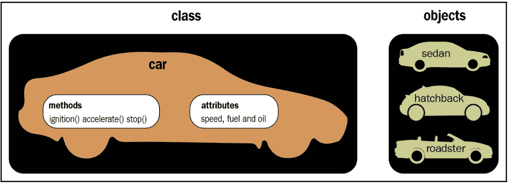

# 第九章：反向字节码语言 – .NET、Java 及更多

跨平台编译程序的美妙之处在于它们的灵活性，因为你无需花费大量精力将每个程序移植到不同的系统上。在本章中，我们将学习恶意软件作者如何利用这些优势进行恶意用途。此外，你将获得一系列旨在使分析快速高效的技术和工具。

在本章中，我们将涵盖以下主题：

+   字节码语言的基本理论

+   .NET 解释

+   .NET 恶意软件分析

+   Visual Basic 的基本要点

+   解析 Visual Basic 示例

+   Java 示例的内部

+   分析编译的 Python 威胁

# 字节码语言的基本理论

.NET、Java、Python 等许多语言设计为跨平台。相应的源代码不会被编译成汇编语言（如 Intel、ARM 等），而是被编译成一种称为字节码语言的中间语言。字节码语言类似于汇编语言，但可以轻松地由解释器执行或即时编译成本地语言（这取决于 CPU 和操作系统）。这种编译方式称为**即时编译**（**JIT**）。

## 面向对象编程

大多数这些字节码语言遵循编程和开发领域的最新技术。它们实现了所谓的**面向对象编程**（**OOP**）。如果你以前没听说过，OOP 基于**对象**的概念。这些对象包含属性（有时称为字段或属性）和包含过程（有时称为函数或方法）。这些对象可以相互交互。

对象可以是相同设计或蓝图的不同实例，这称为**类**。下图显示了汽车类及其不同的实例或对象：



图 9.1 – 一个汽车类和三个不同的对象

在这个类中，有诸如燃料和速度之类的属性，以及诸如`accelerate()`和`stop()`之类的方法。一些对象可以相互交互并调用这些方法或直接修改这些属性。

## 继承

另一个重要的概念是继承。继承允许子类继承（或包含）父类中包含的所有属性和方法（包括内部的代码）。这个子类可以拥有更多的属性或方法，甚至可以重新实现父类中包含的方法（有时称为超类或父类）。

## 多态性

继承使得一个类能够在所谓的多态中表示多种不同类型的对象。一个`Shape`类可以表示不同的子类，例如`Line`、`Circle`、`Square`等。一个绘图应用程序可以遍历所有`Shape`对象（无论它们的子类是什么），并执行`paint()`方法，将它们绘制到屏幕或程序画布上，而无需单独处理每个类。

由于`Shape`类具有`paint()`方法，并且它的每个子类都有该方法的实现，因此应用程序只需执行`paint()`方法，而无需关心其具体实现，这样就变得更加简单。

# .NET 解释

.NET 语言（主要是 C#和 VB.NET）是微软设计的跨平台语言。相应的源代码被编译成字节码语言，最初命名为**Microsoft Intermediate Language**（**MSIL**），现在被称为**Common Intermediate Language**（**CIL**）。此语言由**Common Language Runtime**（**CLR**）执行，CLR 是一个应用程序虚拟机，提供内存管理和异常处理。

## .NET 文件结构

.NET 文件结构基于我们在*第三章*中描述的 PE 结构，*x86/x64 的基本静态和动态分析*。 .NET 结构以 PE 头开始，包含数据目录中的倒数第二个条目，指向.NET 的特殊**CLR 头**（**COR20 头**）。

### .NET COR20 头

`.text`部分，包含有关.NET 文件的基本信息，如以下截图所示：


图 9.2 – CLR 头（COR20 头）和 CLR 流

该结构的一些值如下：

+   **cb**：表示头的大小（始终为 0x48）

+   **MajorRuntimeVersion**和**MinorRuntimeVersion**：始终为 2 和 5（即使是运行时 4）

+   **元数据地址和大小**：包含所有 CLR 流，稍后将详细描述

+   `0x6000012`值，我们得到了以下内容：

    +   `#~`流（我们稍后会详细讨论流）。在以下截图中，我们可以看到它对应于`Methods`表。

    +   `Main`：


图 9.3 – 第一流中的方法表中的入口点方法，#~

现在，让我们来谈谈流。

### 元数据流

元数据包含五个部分，它们类似于 PE 文件的部分，但称为流。流的名称以`#`开头，具体如下：

+   `Methods`表的 ID 是 0x6）。

+   `#~`流。此流包括方法名称、类名称等。每个条目以其长度开始，接着是字符串，然后是下一个条目的长度，再接着是字符串，依此类推。

+   `#Strings` 流，但它包含了应用程序本身使用的字符串，如下图所示（结构与项长度后跟字符串相同）：


图 9.4 – #US Unicode 字符串以长度开头，后跟实际的字符串

+   **#GUID**：存储唯一标识符（GUID）。

+   `#US` 和 `#Strings`，但它包含了与应用程序相关的所有二进制数据。它的格式与项长度相同，后面跟着数据块。

所以，这就是 .NET 应用程序的结构。现在，让我们来看看如何将 .NET 应用程序与其他可执行文件区分开来。

## 如何通过 PE 特征识别 .NET 应用程序

识别 .NET PE 文件的第一种方法是使用 **PEiD** 或 **CFF Explorer**，这些工具包含了覆盖 .NET 应用程序的签名，如下图所示：


图 9.5 – PEiD 检测到恶意软件是一个 .NET 应用程序

第二种方法是检查数据目录中的导入表。.NET 应用程序总是只导入一个 API，即来自 `mscoree.dll` 的`_CorExeMain`，如下所示：


图 9.6 – .NET 应用程序导入表

最后，你可以检查数据目录中的倒数第二个（第 15 个）条目，这代表了 CLR 头。如果它被填充了（即包含非 `NULL` 的值），那么它就是一个 .NET 应用程序，并且这应该是一个 CLR 头（你可以使用 CFF Explorer 来检查）。

## CIL 语言指令集

CIL（也称为 MSIL）语言与**简化指令集计算机**（**RISC**）汇编语言非常相似。然而，它不包含任何寄存器，所有的变量、类、字段、方法等都是通过它们在流和表中的 ID 进行访问。局部变量也通过它们在方法中的 ID 进行访问。大部分代码基于将变量和常量加载到栈中，执行操作（其结果存储在栈中），然后将这个结果弹出并存入局部变量或对象中的字段。

该语言由一组操作码和这些操作码的参数（如果需要的话）组成。大多数操作码占用 1 个字节。让我们来看看这门语言中的指令。

### 推送到栈中的指令

有许多指令用于将值或 ID 存储到栈中。这些可以通过操作后续访问，或者存储在其他变量中。以下是一些示例：


重要提示

对于所有需要 ID 的指令，它们都以 2 字节的形式接收 ID。它们有一个简化版，后缀为`.s`，它们以 1 字节的形式接收 ID。

处理常量或数组元素的指令（`ldc` 和 `ldelem`）带有描述该值类型的后缀。这里是使用的类型：


现在，让我们学习如何将栈中的值提取到另一个变量或字段中。

### 从栈中取出一个值

这里是一些指令，让你从栈中提取（弹出）一个值或引用到另一个变量或字段：


重要提示

需要 ID 的指令也有带 `.s` 后缀的简化版本。某些指令，如 `stind` 和 `stelem`，可能还有值类型后缀（如 `.i4` 或 `.r8`）。

### 数学和逻辑操作

CIL 语言实现了你将在任何汇编语言中看到的相同操作，例如 `add`、`sub`、`shl`、`shr`、`xor`、`or`、`and`、`mul`、`div`、`not`、`neg`、`rem`（除法余数）和 `nop`（无操作）。

这些指令从栈中获取参数，并将结果保存回栈中。可以使用任何存储指令（如 `stloc`）将它们存储在变量中。

### 分支指令

这是学习的最后一组重要指令。这些指令与分支和条件跳转有关。这些指令与汇编语言的区别不大，但它们依赖栈中的值来进行比较和分支：


现在，让我们把这些知识应用到实践中，学习源代码如何转换为这些指令。

## CIL 语言转换为高级语言

到目前为止，我们已经讨论了各种 IL 语言指令以及 .NET 应用程序的主要区别因素和文件结构。在本节中，我们将查看这些高级语言（VB.NET、C# 等）以及它们的语句、分支和循环是如何转换为 CIL 语言的。

### 局部变量赋值

这是一个使用常量值 `10` 设置局部变量值的例子：

```
X = 10;
```

这将被转换为以下内容：

```
ldc.i4 10  // pushes an int32 constant with value 10 to the stack
stloc.0  // pops a value to local variable 0 (X) from stack
```

轻松简单。

### 使用方法返回值进行局部变量赋值

这里是另一个更复杂的例子，展示了如何调用方法，将其参数推送到栈中，并将返回值存储在局部变量中（这里，调用的是类中的静态方法，而不是对象的虚方法）：

```
Process[] Process = System.Diagnostics.Process::GetProcessesByName("App01");
```

中间代码如下所示：

```
ldstr "App01" // here, ldstr accesses that string by its ID and the string itself is located in the #US stream
call class [System]System.Diagnostics.Process[] [System]System.Diagnostics.Process::GetProcessesByName(string)
Stloc.0       // store the return value in local variable 0 (X)
```

### 基本的分支语句

对于 `if` 语句，C# 代码如下所示：

```
if (X == 50)
{
  Y = 20;
}
```

相应的 IL 代码如下所示（这里，我们为分支指令添加了行号）：

```
00: ldloc.0  // load local variable 0 (X)
01: ldc.i4.s 50  // load int32 constant with value 50 into the stack
02: bne 5       // if not equal, branch/jump to line number 5
03: ldc.i4.s 20 // load int32 constant with value 20 into the stack
04: stloc.1     // place the value 20 from the stack to the local variable 1 (Y)
05: nop       // here, it could be any code that goes after the If statement
06: nop
```

这些指令还将帮助我们理解下一个主题——循环。

### 循环语句

我们将在本节中讲解的最后一个示例是`for`循环。这个语句比`if`语句复杂，甚至比`while`语句的循环还要复杂。然而，它在 C#中使用广泛，理解它将有助于你理解 IL 语言中的其他复杂语句。C#代码如下：

```
for (i = 0; i < 50; i++)
{
  X = i + 20;
}
```

等效的 IL 代码如下：

```
00: ldc.i4.0 // pushes a constant with value 0
01: stloc.0  // stores it in local variable 0 (i). This represents i = 0
02: br 11    // unconditional branching to line 11
03: ldloc.0  // loads variable 0 (i) into stack
04: ldc.i4.s 20 // loads an int32 constant with value 20 into stack
05: add      // adds both values from the stack and pushes the result back to stack (i + 20)
06: stloc.1  // stores the result in a local variable 1 (X)
07: ldloc.0  // loads local variable 0 (i)
08: ldc.i4.1 // pushes a constant value of 1
09: add      // adds both values
10: stloc.0  // stores the result in local variable i (i++)
11: ldloc.0  // loads again local variable i (this is the branching destination)
12: ldc.i4.s 50 // loads an int32 constant with value 50 into stack
13: blt.s 3  // compares both values from stack (i and 50) and branches to line number 3 if the first value is lower
```

这就是.NET 文件结构和 IL 语言的介绍。现在，让我们学习如何分析.NET 恶意软件。

# .NET 恶意软件分析

如你所知，.NET 应用程序很容易被反汇编和反编译，以尽可能接近原始源代码。这使得恶意软件更容易受到逆向工程的攻击。我们将在本节中描述多种混淆技术，并介绍去混淆过程。首先，让我们探索用于.NET 逆向工程的工具。

## .NET 分析工具

这里是一些最知名的反编译和分析工具：

+   **ILSpy**：这是一个很好的静态分析反编译工具，但它不能调试恶意软件。

+   **dnSpy**：基于 ILSpy 和 dnlib，它是一个反汇编器和反编译器，还可以让你调试和修补代码。

+   **.NET reflector**：一款用于静态分析和 Visual Studio 调试的商业反编译工具。

+   **.NET IL Editor (DILE)**：另一个强大的工具，允许你反汇编和调试.NET 应用程序。

+   **dotPeek**：一款用于将恶意软件反编译为 C#代码的工具。它适用于静态分析，并且在 Visual Studio 的帮助下可以重新编译和调试。

+   **Visual Studio**：Visual Studio 是.NET 语言的主要 IDE。它允许你编译源代码并调试.NET 应用程序。

+   **SOSEX**：一个用于 WinDbg 的插件，可以简化.NET 调试。

以下是最著名的去混淆工具：

+   **de4dot**：同样基于 dnlib，它非常适用于去除已知混淆工具混淆的样本。

+   **NoFuserEx**：一个用于 ConfuserEx 混淆器的去混淆工具

+   **Detect It Easy (DiE)**：一款用于检测.NET 混淆器的优秀工具。

在以下示例中，我们将主要使用 dnSpy 工具。

## 静态和动态分析

现在，我们将学习如何进行静态分析和动态分析，然后对样本进行修补，以删除或修改混淆代码。

### .NET 静态分析

多种工具可以帮助你反汇编和反编译样本，甚至将其完全转换为 C#或 VB.NET 源代码。例如，你可以通过将样本拖放到应用程序界面中，使用**dnSpy**进行反编译。以下是该应用程序的界面：


图 9.7 – 使用 dnSpy 对恶意样本进行静态分析

你可以点击**文件** | **导出为项目**将反编译的源代码导出为 Visual Studio 项目。现在，你可以阅读源代码、修改代码、写注释，或者修改函数名称以便更好的分析。如果你右键点击并从菜单中选择**编辑 IL 语言**，dnSpy 还可以显示样本的实际 IL 语言。

要跳转到主函数，你可以右键点击程序（从侧边栏），选择`OnRun`、`OnStartup`或`OnCreateMainForm`，以及在表单中进行选择。当分析与表单相关的代码时，从它们的构造函数（`.ctor`）开始，并注意哪些函数被添加到`base.Load`中，以及在此之后调用了哪些函数。一些方法，例如表单的`OnLoad`方法，可能也会被重写。

你还可以使用另一个工具——**dotPeek**。它是一个免费的工具，也可以将样本反编译并导出为 C#源代码。它的界面与 Visual Studio 非常相似。你还可以使用 IDA 分析 CIL 语言。

最后，标准的`ildasm.exe`工具可以反汇编并导出样本的 IL 代码：

```
ildasm.exe <malware_sample> /output output.il
```

### .NET 动态分析

在调试过程中，可用的工具较少。dnSpy 是一个完整的解决方案，适用于静态和动态分析。它允许你设置断点，并进行单步调试。它还会显示变量的值。

要开始调试，你需要在样本的入口点设置一个断点。另一种选择是将源代码导出为 C#，然后在 Visual Studio 中重新编译并调试程序，这样你将完全控制程序的执行。Visual Studio 还会显示变量的值，并具有许多有助于调试的功能。

如果样本经过了过度混淆，无法通过 dotPeek 或 Dnspy 进行调试或导出为 C#代码，可以依赖`ildasm.exe`将样本代码导出为 IL 语言，并使用`ilasm.exe`重新编译并包含调试信息。下面是使用`ilasm.exe`重新编译的步骤：

```
ilasm.exe /debug output.il /output=<new sample exe file>
```

使用`/debug`参数，已经为该样本创建了一个`.pdb`文件，其中包含了调试信息。

### .NET 样本的修补

有多种方法可以修改样本代码，用于去混淆、简化代码或强制执行特定路径。第一种选择是使用 dnSpy 的修补功能。在 dnSpy 中，你可以通过右键点击任何方法或类，选择**编辑方法（C#）**，修改代码后重新编译。你也可以导出整个项目，修改源代码，进入**编辑方法（C#）**，点击 C#图标导入源代码文件，并替换该类的原始代码进行编译。你还可以在 Visual Studio 中修改恶意代码源（导出后），并重新编译以便调试。

在 dnSpy 中，你可以通过从菜单中选择 **Edit IL Instruction**（编辑 IL 指令）并选择 **Locals**（本地变量）来修改本地变量的名称，如下截图所示。对于类和方法，你可以通过更新它们来修改名称，方法是使用 **Edit Method (C#)**（编辑方法）或 **Edit Class (C#)**（编辑类）选项：


图 9.8 – 在 dnSpy 中编辑本地变量

你还可以通过选择 **Edit IL Instruction**（编辑 IL 指令）直接编辑 IL 代码，并修改指令。这使你可以选择指令以及你想要访问的字段或变量。

## 处理混淆

在本节中，我们将研究不同的常见混淆技术，并学习如何解混淆 .NET 样本。

### 混淆的类、方法等名称

最常见的混淆技术之一是混淆类、方法、变量、字段等的名称——基本上是所有有名称的内容。

如果将名称混淆为其他字母表或其他符号（因为名称是 Unicode 格式），例如中文或日文，混淆的难度会更大。

你可以通过在命令行运行 **de4dot** 解混淆工具，尝试自动解混淆此类样本，如下所示：

```
de4dot.exe <sample>
```

这将重命名所有混淆的名称，如下截图所示（这里展示的是 HammerDuke 样本）：


图 9.9 – 在运行 de4dot 解混淆名称前后的 Hammerduke 恶意软件

你还可以手动重命名方法，为其添加更有意义的名称，方法是右键点击方法，选择 **Edit Method**（编辑方法），或点击 *Alt* + *Enter* 并修改方法名称。之后，你需要保存模块并重新加载，以使更改生效。

你还可以通过右键点击方法并选择 **Edit Method Body**（编辑方法体）或 **Edit IL Instructions**（编辑 IL 指令）并选择 **Locals**（本地变量）来编辑本地变量名称。

### 二进制中的加密字符串

.NET 恶意软件使用的另一种常见技术是加密其字符串。这种方法可以将这些字符串隐藏在基于签名的工具以及经验较少的恶意软件分析师面前。处理加密字符串需要找到解密函数，并在每次调用时设置断点，如下截图所示：


图 9.10 – Samsam 勒索病毒加密的字符串在内存中被解密

有时候，会有难以访问的加密字符串，因此你可能不会在恶意软件的默认执行过程中看到它们被解密——例如，因为 C&C 服务器无法连接，或者可能存在额外的 C&C 地址，在第一个 C&C 正常工作的情况下这些地址不会被解密。在这些情况下，你可以执行以下操作：

+   你可以尝试使用 de4dot 通过提供方法 ID 来解密加密字符串。你可以通过检查 `#~` 流中的 `Methods` 表来找到方法 ID，如下图所示：


图 9.11 – Samsam 勒索病毒 myff11() 解密函数，ID 0x0600000C

然后，你可以使用以下命令动态解密字符串：

```
de4dot <sample> --strtyp delegate --strtok <decryption method ID>
```

+   你可以修改入口点代码并添加调用解密函数的代码来解密字符串。前面的截图是通过重新指向对解密函数的调用，包括加密字符串，生成的。为了让 dnSpy 处理此代码，你必须通过更改对象字段或调用 `System.Console.Writeline()` 将字符串打印到控制台来使用这些字符串。你需要在修改后保存模块，并重新打开它以使更改生效。

另一个选择是通过点击 **文件** | **导出到项目**（其他工具也可能有类似功能）将整个恶意软件源代码从 dnSpy 导出，进行修改，然后在 Visual Studio 中重新编译并调试它。

### 样本使用混淆器进行混淆

有很多公开可用的 .NET 混淆器。它们通常用于保护知识产权，但也常被恶意软件作者用来保护他们的样本免受逆向工程。有多种工具可以检测已知的打包器，如 **Detect It Easy**（**DiE**），如下图所示：


图 9.12 – 使用 **Detect It Easy** 检测保护恶意软件的混淆器（ConfuserEx）

你也可以使用 de4dot 工具通过运行 `de4dot.exe -d <sample>` 命令来检测混淆器，或者使用 `de4dot.exe <sample>` 命令解混淆样本。

对于自定义和未知的混淆器，你需要通过调试和修补过程来处理它们。在此之前，请检查不同的资源，看是否有相关的解决方案或解混淆工具。如果该混淆器是共享软件，你可能可以与作者联系并获得他们的帮助来解混淆样本（因为这些混淆器并非为了帮助恶意软件作者保护他们的样本而设计的）。

### 编译后交付并代理代码执行

攻击者可能还会尝试使用标准的`csc.exe`工具，在受害者的机器上动态编译恶意有效负载，而不是直接分发恶意.NET 二进制文件。这种方法通常通过脚本来实现，我们将在下一章中讨论这些脚本。

此外，攻击者可能会使用标准的`InstallUtil.exe`工具加载恶意.NET 样本，而不是直接执行它们。对于攻击者来说，这种方法的主要优势在于，在这种情况下，所有相关活动都会以签名合法应用程序的名义进行。需要知道的是，在这种情况下，加载的模块执行将从继承自标准`System.Configuration.Install.Installer`类的类开始。

### 动态加载的代码块

有时，恶意软件可能会解密或解码下一个代码块，并使用例如标准的`AppDomain.CurrentDomain.Load`方法动态加载它。在这种情况下，可以通过进入此方法并跟踪代码，直到达到`UnsafeInvokeInternal` -> `RuntimeMethodHandle.InvokeMethod`控制转移点，在 dnSpy 中到达该有效负载的第一条指令。以下是来自 AgentTesla 恶意软件的一个示例：


图 9.13 – 将控制权转移到 AppDomain.CurrentDomain.Load 中的有效负载

一旦到达嵌入式有效负载的第一行，dnSpy 将处理剩下的部分，反编译这个新引入的代码块，并将其添加到**程序集浏览器**面板中，用于静态分析。

这就是基于.NET 的恶意软件分析；我们已经学会了开始高效分析相应样本所需的所有知识。现在，让我们来谈谈用 Visual Basic 编写的威胁。

# Visual Basic 的基本知识

Visual Basic 是一种由 Microsoft 开发的高级编程语言，基于 BASIC 系列语言。最初，它的主要特点是能够快速创建图形化界面，并与 COM 模型良好集成，这促进了对**ActiveX 数据对象**（**ADO**）的便捷访问。

它的最后一个版本发布于 1998 年，扩展支持于 2008 年结束。然而，所有现代 Windows 操作系统仍然支持它，尽管 APT 攻击者很少使用它，但许多大规模恶意软件家族仍然使用它。此外，许多恶意打包工具也使用这种编程语言，通常被检测为 Vbcrypt/VBKrypt 或类似的名称。最后，**Visual Basic for Applications**（**VBA**）仍广泛用于 Microsoft Office 应用程序，并且在 2010 年甚至升级到了第 7 版，它与 VB6 语言大致相同，并使用相同的运行时库。

在本节中，我们将深入探讨最新版本 Visual Basic（截至本文编写时为 6.0）支持的两种不同编译模式，并提供关于如何分析使用这些模式的样本的建议。

## 文件结构

编译后的 Visual Basic 样本看起来像标准的 MZ-PE 可执行文件。它们可以通过一个独特的导入 DLL `MSVBVM60.DLL`轻松识别出来（旧版本使用的是`MSVBVM50.DLL`）。PEiD 工具通常非常擅长识别这种编程语言（显然，前提是样本没有被打包）：


图 9.14 – PEiD 识别 Visual Basic

在样本的入口点，我们可以看到调用`ThunRTMain`（`MSVBVM60.100`）运行时函数：


图 9.15 – Visual Basic 样本的入口点

这里的`Thun`前缀是对原始项目名称**BASIC Thunder**的引用。此函数接收一个指向以下结构的指针：


现在，让我们看一下`ProjectInfo`结构：


在这里，最有趣的字段之一是`NativeCode`。这个字段可以用来判断样本是作为 p-code 还是本地代码编译的。现在，让我们看看为什么这些信息很重要。

## P-code 与本地代码

从 Visual Basic 5 开始，该语言支持两种编译模式：p-code 和本地代码（在此之前，p-code 是唯一的选项）。要理解它们之间的区别，我们需要了解什么是 p-code。

`P-code`，即打包代码或伪代码，是一种中间语言，其指令格式类似于机器代码。换句话说，它是一种字节码。引入它的主要原因是通过牺牲执行速度来减小程序的大小。当样本被编译为 p-code 时，字节码将由语言运行时解释执行。与此相对，本地代码选项允许开发者将样本编译成通常的机器代码，这通常运行得更快，但由于使用了多个开销指令，因此占用更多的空间。

知道分析的样本是在哪种模式下编译的非常重要，因为它决定了应使用哪些静态和动态分析工具。至于如何区分它们，最简单的方法是查看我们之前提到的`NativeCode`字段。如果它被设置为`0`，这意味着使用的是 p-code 编译模式。另一个指示器是，`CodeEnd`和`CodeStart`值之间的差异通常只有几个字节，因为没有本地代码函数。

另一种（不太可靠）的方法是查看导入表：

+   `MSVBVM60.DLL`，它提供对所有必要的 VB 函数的访问：


图 9.16 – 以 P-code 模式编译的 Visual Basic 示例的导入表

+   `MSVBVM60.DLL`，还有典型的系统 DLL，如 `kernel32.dll`，以及相应的导入函数：


图 9.17 – 以本地代码模式编译的 Visual Basic 示例的导入表

区分这些模式的一种快速方法是将一个示例加载到免费的 **VB Decompiler Lite** 程序中，查看代码编译类型（加粗标记）以及函数本身。如果那里显示的是典型的 x86 指令，那么该示例是以本地代码编译的；否则，使用的是 P-code 模式：


图 9.18 – 在 VB Decompiler Lite 中，P-code 与本地代码示例的对比

我们将在下一节中更详细地介绍这个工具。

## 常见的 P-code 指令

多个基本操作码占用 1 个字节（`0x00-0xFA`）；较大的 2 字节操作码以 `0xFB-0xFF` 范围内的前缀字节开头，使用频率较低。以下是一些常见的 P-code 指令示例，通常在探索 VB 反汇编时会看到：

+   数据存储和移动：

    +   `LitStr/LitVarStr`：初始化字符串

    +   `LitI2/LitI4/...`：将整数值推入栈中（通常用于传递参数）

    +   `FMemLdI2/FMemLdRf/...`：加载特定类型的值（内存）

    +   `Ary1StI2/Ary1StI4/...`：将特定类型的值压入数组

    +   `Ary1LdI2/Ary1LdI4/...`：从数组中加载特定类型的值

    +   `FStI2/FStI4/...`：将变量值压入栈中

    +   `FLdI2/FLdI4/...`：从栈中将值加载到变量中

    +   `FFreeStr`：释放字符串

    +   `ConcatStr`：连接字符串

    +   `NewIfNullPr`：如果为空则分配空间

+   算术运算：

    +   `AddI2/AddI4/...`：加法运算

    +   `SubI2/SubI4/...`：减法运算

    +   `MulI2/MulI4/...`：乘法运算

    +   `DivR8`：除法运算

    +   `OrI4/XorI4/AndI4/NotI4/...`：逻辑运算

+   比较：

    +   `EqI2/EqI4/EqStr/...`：检查是否相等

    +   `NeI2/NeI4/NeStr/...`：检查是否不等

    +   `GtI2/GtI4/...`：检查是否大于

    +   `LeI2/LeI4/...`：检查是否小于或等于

+   控制流：

    +   `VCallHresult/VCallAd(VCallI4)/...`：调用一个函数

    +   `ImpAdCallI2/ImpAdCallI4/...`：调用导入函数（API）

    +   `Branch/BranchF`：条件满足时跳转

还有许多类似的指令。如果某个新的操作码对你来说不清楚，且你需要理解其功能，可以在非官方文档中找到（尽管不够详细），或者在调试器中进行探索。

以下是操作码名称中最常用的缩写：

+   `Ad`：地址

+   `Rf`：引用

+   `Lit`：字面量

+   `Pr`：指针

+   `Imp`：导入

+   `Ld`：加载

+   `St`：存储

+   `C`：类型转换

+   `DOC`：重复操作码

所有常见的数据类型缩写几乎都可以自我解释：

+   `I`: 整数（`UI1` – 字节，`I2` – 整数，`I4` – 长整型）

+   `R`: 实数（`R4` – 单精度，`R8` – 双精度）

+   `Bool`: 布尔值

+   `Var`: 变体

+   `Str`: 字符串

+   `Cy`: 货币

虽然一开始可能需要一些时间来习惯它们的符号，但其实变种并不多，所以过一段时间后，理解核心逻辑变得相对直接。另一个选择是投资一个合适的反编译器，避免直接处理 p-code 指令。我们稍后会讲到这个。

# 剖析 Visual Basic 样本

现在我们已经掌握了 Visual Basic 的一些基本知识，是时候转移焦点，学习如何剖析 Visual Basic 样本了。在这一部分，我们将进行详细的静态和动态分析。

## 静态分析

VB 恶意软件的共性是代码通常作为 `SubMain` 程序和事件处理程序的一部分执行，其中定时器和表单加载事件特别典型。

正如我们已经提到的，工具的选择将由创建恶意软件样本时使用的编译模式来决定。

### P-code

对于 p-code 样本，可以使用 **VB Decompiler** 来访问其内部结构。Lite 版本是免费的，提供 p-code 反汇编访问，这对于大多数情况来说可能已经足够。如果工程师没有足够的专业知识或时间来处理 p-code 语法，那么付费的完整版提供了强大的反编译器，能够输出更易读的 Visual Basic 源代码：


图 9.19 – 在 VB 反编译器中拆解和反编译的相同 p-code 函数

另一个流行的选择是 **P32Dasm** 工具，它允许你通过几次点击获得 p-code 列表：


图 9.20 – P32Dasm 在操作中

它的一个有用特点是能够生成 MAP 文件，这些文件可以通过专用插件加载到 OllyDbg 或 IDA 中。文档中还提到了用于 IDA 的 Visual Basic 调试插件，但似乎并未公开提供给大众使用。

重要提示

给首次使用者的提示 – 如果需要，可以将所有请求的 `.ocx` 文件（如果不可用，可以单独下载）放入 P32Dasm 的根目录，以使其正常工作。

### 原生代码

对于编译为原生代码的样本，我们已经讨论过的任何 Windows 静态分析工具都可以胜任。在这种情况下，能够有效应用结构的解决方案（如 IDA、Binary Ninja 或 radare2）可以节省时间：


图 9.21 – 在应用 ProjectInfo 结构后原生代码的开始部分

VB 反编译器可以快速访问程序名称，而无需深入挖掘 VB 结构。对于 IDA，通过获取 VB 头的地址（如我们所知，它会传递给样本入口点处的 `ThunRTMain` 函数），然后通过偏移量（`0x2C`）获取 `SubMain` 地址。例如，在 radare2 中，你可以执行以下操作：


]

图 9.22 – 在 radare2 中查找 VB 示例的 SubMain 地址

现在，让我们讨论 Visual Basic 示例的动态分析。

## 动态分析

就像静态分析一样，动态分析在 p-code 和本地代码样本之间是不同的。

### P-code

当需要调试 p-code 编译的代码时，通常有两种可用的选项：调试 p-code 指令本身或调试恢复的源代码。

第二种选择需要一个高质量的反编译器，它能够生成接近原始源代码的内容。通常，VB 反编译器能很好地完成这项工作。在这种情况下，它的输出可以加载到你选择的 IDE 中，并经过一些小的修改后，可以用于调试任何常见的源代码。通常，不需要恢复整个项目，因为只需要追踪代码的某些部分。

尽管这种方法通常更用户友好，但有时调试实际的 p-code 可能是唯一可用的选项，例如，当反编译器无法正常工作或根本无法使用时。在这种情况下，**WKTVBDE** 项目非常有用，它允许你调试 p-code 编译的应用程序。它要求恶意样本被放置在其根目录中，以便正确加载。

### 本地代码

对于本地代码样本，与静态分析类似，可以使用 Windows 的动态分析工具。选择工具主要取决于分析人员的偏好和预算。

到此阶段，我们已经足够了解 VB，可以开始分析前几个样本了。现在，让我们谈谈基于 Java 的威胁。

# Java 示例的内部结构

Java 是一种跨平台编程语言，常用于创建本地应用程序和网页应用程序。其语法受另一种面向对象语言 Smalltalk 的影响。最初由 Sun Microsystems 开发，并于 1995 年首次发布，后来成为甲骨文公司的一部分。本文写作时，它被认为是最流行的编程语言之一。

Java 应用程序被编译成字节码，然后由**Java 虚拟机**（**JVM**）执行。这里的思想是，让经过一次编译的应用程序能够在所有支持的平台上使用，而无需做任何更改。市面上有多个 JVM 实现，且在本文撰写时（从 Java 1.3 开始），HotSpot JVM 是默认的官方选项。它的特点是结合了解释器和 JIT 编译器，能够根据分析器的输出将字节码编译成本地机器指令，以加速代码中较慢部分的执行。大多数 PC 用户通过安装**Java 运行环境**（**JRE**）来获取它，JRE 是一个软件发行包，包含独立的 JVM（HotSpot）、标准库和配置工具集。**Java 开发工具包**（**JDK**）是另一个流行选项，因为它是一个开发环境，用于使用 Java 语言构建应用程序、小程序和组件。对于移动设备，过程则截然不同。我们将在*第十三章*中讨论，*分析 Android 恶意软件样本*。

在恶意软件方面，Java 在**远程访问工具**（**RAT**）开发者中相当受欢迎。例如 jRAT 或者作为 JAR 文件分发的 Frutas/Adwind 家族。利用漏洞曾经是用户面临的另一个大问题，直到行业近期引入了相关变更。在本节中，我们将探讨已编译 Java 文件的内部结构，并学习如何在分析恶意软件时利用它。

## 文件结构

一旦编译完成，`.java` 文件会变成 `.class` 文件，可以直接由 JVM 执行。

以下是根据官方文档提供的结构：

```
ClassFile {
  u4 magic;
  u2 minor_version;
  u2 major_version;
  u2 constant_pool_count;
  cp_info constant_pool[constant_pool_count-1]; 
  u2 access_flags;
  u2 this_class; 
  u2 super_class;
  u2 interfaces_count;
  u2 interfaces[interfaces_count]; 
  u2 fields_count;
  field_info fields[fields_count]; 
  u2 methods_count;
  method_info methods[methods_count]; 
  u2 attributes_count;
  attribute_info attributes[attributes_count];
}
```

在这种情况下使用的魔法值是一个十六进制 DWORD，`0xCAFEBABE`。其他字段是显而易见的。

发布一个更复杂项目的最常见方式是构建一个包含多个已编译模块以及辅助元数据文件（如 `MANIFEST.MF`）的 JAR 文件。JAR 文件遵循常规的 ZIP 压缩格式，可以使用任何支持的解压软件进行提取。

最后，`<jar>` 字段是对实际 JAR 文件的引用，而 `<applet-desc>` 字段则指定了要加载的主 Java 类的名称等信息。

Java 基于的样本有多种分析方式。在本节中，我们将探讨静态和动态分析的多种选择。

## JVM 指令

支持的指令列表有很好的文档记录，所以通常来说，查找任何感兴趣的字节码信息都不成问题。我们来看一些示例，看看它们的样子。

数据传输：


算术和逻辑运算：


控制流程：


有趣的是，其他项目也可以生成 Java 字节码，例如 JPython，它旨在将 Python 文件编译成 Java 风格的字节码。然而，实际上，在绝大多数情况下，不需要处理它们，因为现代的反编译器已经做得非常出色。

## 静态分析

由于 Java 字节码在所有平台上保持一致，它加快了高质量反编译器的创建过程，因为开发人员不必花费大量时间支持不同的架构和操作系统。以下是一些公众常用的工具：

+   在使用时，通过`-path`参数指定来自 Java 文件夹的`rt.jar`文件。

+   **Procyon**：另一个强大的反编译器，可以处理 Java 文件和原始字节码。

+   **FernFlower**：一个作为 IntelliJ IDEA 插件维护的 Java 反编译器。它也有命令行版本。

+   **CFR**：一个用 Java 编写的 JVM 字节码反编译器，可以处理单个类和整个 JAR 文件。

+   **d4j**：一个建立在 Procyon 项目基础上的 Java 反编译器。

+   **Ghidra**：这个逆向工程工具包支持多种文件格式和指令集，包括 Java 字节码：


图 9.23 – 在 Ghidra 中反汇编和反编译的 Java 字节码

+   **JD Project**：一个久负盛名的 Java 反编译项目，它提供了一组用于分析 Java 字节码的工具。包括一个名为**JD-Core**的库，一个名为**JD-GUI**的独立工具，以及多个主要 IDE 的插件。

+   **JAD**：一个经典的反编译器，曾帮助几代逆向工程师进行 Java 恶意软件分析。现已停用：


图 9.24 – 反编译的 Adwind RAT 恶意软件的 Java 代码

尝试多个不同的项目并比较它们的输出是有意义的，因为它们实现了不同的技术，因此质量可能有所不同，具体取决于输入的样本。

要知道从哪里开始分析，可以查看`MANIFEST.MF`文件，它将指示从相应 JAR 样本中的哪个类开始执行（`Main-Class`字段）。

最后，如果需要，可以使用标准的`-c`参数获取 Java 字节码的反汇编。

## 动态分析

现代反编译器通常能生成相当高质量的输出，经过少量修改后，可以像普通的 Java 源代码一样读取和调试。多个 IDE 支持 Java，并提供调试选项：Eclipse、NetBeans、IntelliJ IDEA 等。

如果需要原始字节码追踪，可以使用 `-XX:+TraceBytecodes` 选项，这对于 HotSpot JVM 的调试版本是可用的。如果需要逐步调试字节码，Dr. Garbage 的 **Bytecode Visualizer** 插件在 Eclipse IDE 中显得非常有用。它不仅可以查看 JAR 内部编译模块的反汇编代码，还能进行调试。

## 处理反逆向工程解决方案

截至本文撰写时，市场上有大量商业化的 Java 混淆器可用。至于恶意软件开发者，他们中的许多人使用的是破解版本、演示版或泄露的许可证。例如，Allatori Obfuscator 被 Adwind RAT 恶意软件滥用。

当确认了混淆器的名称（例如，通过唯一的字符串），通常需要检查是否有现成的去混淆工具支持它。以下是一些常见的工具：

+   **Java Deobfuscator**：一个多功能项目，支持大量商业保护器。

+   **JMD**：一个 Java 字节码分析与去混淆工具，能够去除多种知名保护器实施的混淆。

+   **Java DeObfuscator** (**JDO**)：一款通用去混淆工具，实施多种通用技术，比如将混淆后的值重命名为唯一且能表示其数据类型的名称。

+   **jrename**：另一种通用的去混淆工具，专门用于重命名变量，以提高代码的可读性。

如果没有现成可用的工具，建议寻找相关文章，了解该混淆器的工作原理以及哪些方法值得尝试，它们可能会提供宝贵的见解。

如果没有找到相关信息，则需要从头开始探索混淆器的逻辑，尽量先获取最有价值的信息，如字符串，然后是字节码。收集到的关于混淆器的信息越多，后续分析时花费的时间就越少。

以上就是关于 Java 基础的威胁分析，现在，让我们来讨论用 Python 编写的恶意软件。

# 分析编译后的 Python 威胁

Python 是一种高级通用编程语言，首次亮相于 1990 年，自那时以来经历了多个开发迭代。截止本文撰写时，公众常用的有两个分支，Python 2 和 Python 3，它们并不完全兼容。该语言本身非常强大且易于学习，这使得工程师能够快速原型化并开发出创意。

至于为什么恶意软件作者使用编译过的 Python，尽管有许多其他语言，这主要是因为该语言跨平台，允许现有应用程序轻松移植到多个平台。通过使用 **py2exe** 和 **PyInstaller** 等工具，还可以将 Python 脚本转换为可执行文件。

你可能会想，为什么本章要涉及 Python，毕竟它是一个脚本语言？事实上，是否使用字节码取决于实际实现，而不是语言本身。活跃的 Python 用户可能会注意到，当 Python 模块被导入时，出现了带有 `.pyc` 扩展名的文件。这些文件包含了已经编译为 Python 字节码语言的代码，可以用于各种目的，包括恶意目的。此外，从 Python 项目生成的可执行文件通常可以先还原为这些字节码模块。

在本节中，我们将解释如何分析这些示例。

## 文件结构

与 Python 相关的已编译文件有三种类型：`.pyc`、`.pyo` 和 `.pyd`。让我们来了解它们之间的区别：

+   `.pyc`：这些是标准的已编译字节码文件，可用于加快将来模块的导入速度。

+   `.pyo`：这些是使用 `-O`（或 `-OO`）选项构建的已编译字节码文件，负责引入影响加载速度的优化（不是执行速度）。

+   `.pyd`：这些是实现 MZ-PE 结构的传统 Windows DLL 文件（对于 Linux，则是 `.so` 文件）。

由于 MZ-PE 文件在本书中已多次提及，我们不会详细讨论它们，也不会花太多时间讲解 `.pyd` 文件。它们的主要特点是具有一个特定名称的初始化例程，该名称应与模块的名称匹配。

特别是，如果你有一个名为 `foo.pyd` 的模块，它应该导出一个名为 `initfoo` 的函数，这样当使用 `import foo` 语句导入时，Python 就能搜索到具有此名称的模块，并知道要加载的初始化函数的名称。

现在，让我们关注已编译的字节码文件。以下是 `.pyc` 文件的结构：


有趣的是，`.pyc` 模块是平台独立的，但同时依赖于 Python 版本。因此，`.pyc` 文件可以轻松地在安装了相同 Python 版本的系统之间传输，但使用一个版本的 Python 编译的文件通常不能在另一个版本的 Python 上使用，即使是在同一系统上。

## 字节码指令

官方 Python 文档描述了 Python 2 和 3 中使用的字节码。此外，由于它是开源软件，特定 Python 版本的所有字节码指令也可以在相应的源代码文件中找到，主要是 `ceval.c`。

Python 2 和 3 使用的字节码之间的差异并不显著，但仍然可以察觉。例如，一些为版本 2 实现的指令在版本 3 中消失了（如 `STOP_CODE`、`ROT_FOUR`、`PRINT_ITEM`、`PRINT_NEWLINE/PRINT_NEWLINE_TO` 等）：

![图 9.25 – 由 Python 2 和 3 生成的相同 HelloWorld 脚本的不同字节码]

](img/Figure_9.25_B18500.png)

图 9.25 – 由 Python 2 和 3 生成的相同 HelloWorld 脚本的不同字节码

下面是官方文档中使用的 Python 3 指令组，并附带一些示例：

+   `NOP`：什么也不做（通常作为占位符使用）

+   `POP_TOP`：移除栈顶的值

+   `ROT_TWO`：交换栈顶的两个项

+   `UNARY_POSITIVE`：增量*   `UNARY_NOT`：逻辑 `NOT` 操作*   `UNARY_INVERT`：反转*   `BINARY_MULTIPLY`：乘法*   `BINARY_ADD`：加法*   `BINARY_XOR`：异或操作*   `INPLACE_MULTIPLY`：乘法*   `INPLACE_SUBTRACT`：减法*   `INPLACE_RSHIFT`：右移操作*   `GET_AITER`：调用 `get_awaitable` 函数，获取栈顶项的 `__aiter__()` 方法的输出*   `SETUP_ASYNC_WITH`：创建一个新的帧对象*   `BREAK_LOOP`：终止循环*   `SET_ADD`：将栈顶项添加到由第二项指定的集合中*   `MAKE_FUNCTION`：将一个新的函数对象推入栈中

字节码指令名称是非常直观的。有关准确的语法，请查阅官方文档。

在讨论了 Python 作为脚本语言的各个方面之后，我们将重点介绍如何分析编译过的 Python 代码。在这一部分，我们将从 Python 的角度介绍一些实际的分析技巧。

## 静态分析

在许多情况下，分析人员并不会直接获得编译后的 Python 模块。相反，他们会得到一个样本，这个样本是一组 Python 脚本，通过 py2exe 或 PyInstaller 工具被转换成了可执行文件。所以，在深入研究字节码模块之前，我们需要先获取这些字节码模块。幸运的是，有几个项目可以执行这个任务：

+   **unpy2exe.py**：这个脚本可以处理使用 py2exe 构建的样本。

+   **pyinstxtractor.py**：顾名思义，这个工具可以用来从使用 PyInstaller 构建的可执行文件中提取 Python 模块。

一个名为 **python-exe-unpacker** 的开源项目结合了这两个工具，可以直接对可执行文件样本进行处理，无需额外检查。

在提取使用 **PyInstaller** 打包的文件后，对于刚开始分析编译过的 Python 文件的人来说，有一个步骤可能会让人感到非常沮丧。特别是，主要的提取模块可能缺失了编译代码前面的一些字节（具体数量取决于 Python 版本，请参见前面的表格），因此不能直接被其他工具处理。处理这个问题的最简单方法是从当前机器上的任何编译文件中获取这些字节，然后使用十六进制编辑器将它们添加到提取的文件中。可以通过导入（而不是执行）一个简单的 Hello World 脚本来创建这样的文件。

由于分析 Python 源代码相对简单，因此在可能的情况下坚持这种方式是有意义的。在这种情况下，能够恢复原始代码的反编译器显得特别有用。本文写作时，已有多个选项可供选择：

+   **uncompyle6**：一个开源的本地 Python 反编译器，支持多个版本的 Python。它正如其承诺的那样——将字节码转换回等效的源代码。它之前有几个较旧的项目（decompyle、uncompyle 和 uncompyle2）。

+   **decompyle3**：uncompyle6 项目的改进版，支持 Python 3.7 及以上版本。

+   **Decompyle++（也称为 pycdc）**：一个用 C++编写的反汇编器和反编译器，旨在支持任何版本 Python 的字节码。

+   **Meta**：一个 Python 框架，允许你分析 Python 字节码和语法树。

+   **UnPYC**：一个多功能的 Python 反编译 GUI 工具，依赖其他项目来进行实际的代码恢复。

获取源代码后，可以在任何文本编辑器中进行查看，该编辑器具备便捷的语法高亮功能，或者使用您选择的 IDE。

然而，在某些情况下，反编译过程无法立即进行。例如，当模块是使用最新版本的 Python 构建时，它可能在传输过程中损坏，或部分解码/解密，亦或由于某些反逆向工程技术的影响。这类任务也常见于一些 CTF 竞赛中。在这种情况下，工程师必须坚持分析字节码。除了我们之前提到的工具，`marshal.load`和`dis.disassemble`方法也可以用来将字节码转换成可读格式。

## 动态分析

在动态分析方面，通常，反编译器的输出可以直接执行。任何支持 Python 语言的主要 IDE 都支持逐步执行。此外，通过**trepan2/trepan3k**调试器（分别适用于 Python 2 和 3 的最新版本），可以进行逐步调试。如果没有源代码可用，它会自动使用 uncompyle6。对于 Python 2.6 之前的版本，可以使用较旧的工具包，**pydbgr**和**pydb**。

如果需要跟踪字节码，可以通过以下几种方式进行处理：

+   `ceval.c`文件被修改以处理（例如，打印）已执行的指令。

+   **修改.pyc 文件本身**：在这里，源代码行号被替换为每个字节的索引，这最终允许你跟踪已执行的字节码。Ned Batchelder 在他的文章*《恶意黑客：Python 字节码追踪》*中介绍了这一技术。

还有一些现有的项目，例如 `.pyc` 文件，具有由当前版本的 Python 2 生成的头文件格式，因此如果有必要，请进行更新。

一些常见的反逆向工程技术示例包括：

+   操控堆栈上不存在的值

+   设置自定义异常处理程序（为此，可以使用`SETUP_EXCEPT`指令）

在编辑字节码时（例如，去除反调试或反反编译技术，或恢复损坏的代码块），`dis.opmap`映射在查找操作码的二进制值并替换它们时非常有用，`bytecode_graph`模块可以无缝地移除不需要的值。

# 总结

在本章中，我们介绍了字节码语言的基本理论。我们了解了它们的使用场景以及它们如何从内部工作。然后，我们深入探讨了现代恶意软件家族中使用的最流行的字节码语言，解释了它们的工作原理，并分析了它们的独特细节，指出了需要特别关注的方面。最后，我们提供了关于如何分析此类恶意软件的详细指南，以及可以帮助这一过程的工具。

拥有这些知识后，你可以分析这种类型的恶意软件，并深入了解它可能如何影响受害者的系统。

在*第十章*，《脚本与宏 - 逆向工程、去混淆与调试》中，我们将涵盖各种脚本和宏语言，探索恶意软件如何滥用它们，并找出它们之间以及与已讲解技术之间的有趣联系。
