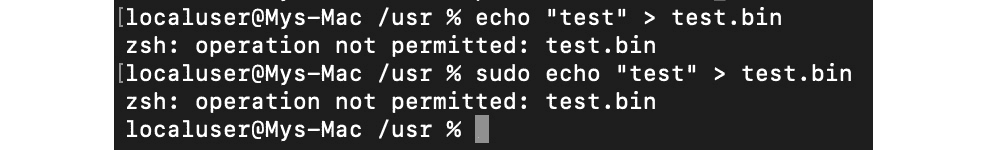
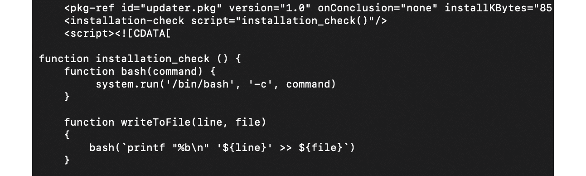

# 第十二章：macOS 和 iOS 威胁简介

Apple 公司（最初为 Apple 计算机公司）成立于 1976 年，旨在销售我们现在所知道的世界上最早的 **个人计算机** (**PCs**) 之一。到目前为止，Apple 公司已经成为一个行业巨头，市值达到数十亿美元。然而，并非每个人都知道，其现代操作系统（如 macOS、iOS、watchOS 和 tvOS）主要基于 **NeXTSTEP** 解决方案，这一解决方案由 **NeXT, Inc.** 开发，后者是 Steve Jobs 在 1985 年离开 Apple 后创立的公司，并在 1997 年被 Apple 收购。所有现代的 Apple 操作系统都基于一组统一的组件，统称为 **Darwin** 操作系统，它基于 XNU 混合内核。

多款 Apple 产品因其高质量和可靠性而闻名，用户享受着安全感，并且通常坚信 Mac 上没有恶意软件。事实上，成功攻击该平台的恶意样本数量远低于 Windows。造成这一现象的原因有多个，包括不同的安全和商业模型，以及这些平台的不同市场。然而，随着使用这些系统的潜在目标数量的增加，我们也会看到针对 Apple 驱动平台的恶意软件开发投入的增加。在这里，我们将了解针对 macOS 和 iOS 操作系统用户的各种威胁，并学习如何分析它们。

为了简化学习，本章分为以下主要部分：

+   理解安全模型的作用

+   文件格式和 API

+   攻击阶段

+   高级技术

+   macOS 和 iOS 样本的静态与动态分析

+   分析工作流程

# 理解安全模型的作用

在许多情况下，恶意软件利用系统架构中的设计弱点来实现其目标。例子可能包括未经授权访问敏感数据、篡改安全措施或修改系统文件以实现持久性或隐匿性。因此，安全模型在减少攻击面方面发挥着至关重要的作用，从而减少恶意软件作者可用的技术手段。

现在，让我们来看看 macOS 和 iOS 中引入的安全模型，并了解它们为何在讨论恶意代码时非常重要。

## macOS

macOS（以前称为 Mac OS X 和 OS X）自 2001 年首次发布以来经历了多次迭代。在此之前，从 1984 年到 2001 年间，为 Macintosh 系列个人计算机开发的一系列操作系统已经在使用；现在，这些操作系统被称为通俗的 **经典 Mac OS**。macOS 属于由 NeXTSTEP 衍生的 Macintosh 操作系统系列。该操作系统最初基于 Unix（特别是 BSD 和 Mach 微内核）。采用基于 Unix 的架构与之前的 Mac OS 解决方案相比，是一个完全新的方向。

除了传统的 C/C++ 语言外，苹果在其产品中主要支持的编程语言是 **Objective-C** 和 **Swift**（自 2014 年起）。应用程序与操作系统之间的交互通过本地 API **Cocoa** 完成，Cocoa 源自 OPENSTEP；在此之前，使用的是 Carbon API。

操作系统中实现了多种机制，旨在增强安全性，同时始终保持可用性。我们来了解其中一些最重要的机制。

### 安全策略

macOS 使用多种源自 BSD 的安全控制措施。特别是，它利用基于用户和组 ID 的传统任意访问限制来管理系统资源和文件的访问。在这种情况下，权限主要在文件夹、文件和应用层级授予，并在多个层级进行控制，包括内核组件。此外，macOS 实施了强制访问控制来支持多个重要功能，如沙盒和 **系统完整性保护**。系统完整性保护于 **OS X 10.11** 中引入，并强制对某些关键文件系统位置进行只读访问，即使是 root 用户也无法修改，这些保护适用于所有运行中的进程。以下位置受到保护：

+   `/usr`

+   `/bin`

+   `/sbin`

+   `/System`

+   macOS 上预装的应用



图 12.1 – 即使使用 sudo，某些受保护目录也无法写入

这些路径仅允许那些经过苹果签名、并且有理由与之交互的进程访问，比如苹果的软件更新。因此，系统文件和资源，包括内核，已与用户的应用空间分离，以防恶意代码轻易访问。默认情况下，root 用户是禁用的，但在必要时可以通过系统偏好设置启用。

任务和资源的管理通过引入安全通信通道来实现，这些通道称为 **Mach 端口**。端口是单向的端点，连接请求服务的客户端与提供服务的服务器，其中端口指定的资源通常有一个接收者和多个可能的发送者。任务通过特定方式访问端口的权限称为端口权限。端口是 macOS **进程间通信**（**IPC**）的核心部分，其中包括多种形式，如经典的消息队列、信号量或远程过程调用。除非发现某些漏洞（如 CVE-2021-30869，曾在 **DazzleSpy** 威胁中被利用），否则不应能绕过相关权限。

### 文件系统层次结构和加密

让我们来看看现代版本的 macOS 上常见的一些目录，并了解它们的一些基本情况。

#### 目录结构

以下是一些最关键的目录（在恶意软件分析中）及其作用：

+   `/Applications:` 该位置会自动用于安装所有用户共享的应用程序。

+   `Library:` 有多个库目录可以供应用程序使用：

    +   `~/Library`：当前用户主目录中的目录。

    +   `/Library`：存储在用户之间共享的库的位置。

    +   `/System/Library`：此位置仅限 Apple 使用。

+   `/Volumes`：存储已挂载磁盘的子目录。

+   `/System`：包含与系统相关的资源。

+   `/Users`：包含用户的主目录。每个主目录包含自己的子目录，包括特定用户的`Applications`和`Library`文件夹（在较新的 macOS 版本中，后者是隐藏的）。

除此之外，还有一些特定于 Unix 的目录，例如`/bin`、`/sbin`、`/var`、`/usr`和`/tmp`。

### 加密

苹果使用自己的**Apple FileSystem**（**APFS**），它提供了多种现代特性，包括强加密。所有 Mac 电脑都配备了**FileVault**磁盘加密系统，该系统利用**高级加密标准**（**AES**）算法来保护关键数据。还可以加密整个磁盘，仅凭有效凭据或恢复密钥（FileVault 2）才能访问。一旦用户启用 FileVault 功能，使用**Target Disk 模式**时需要进行身份验证，在该模式下，设备可以连接到另一台机器并作为外部设备访问（这使得攻击者能够访问敏感数据）。较新的 Mac 电脑配备了专用的 Apple T2 芯片（或其后继产品），并默认启用磁盘加密。在这种情况下，FileVault 提供了额外的保护，要求在解密前提供凭据——否则，通过将加密的 SSD 连接到相应的 Mac，数据可以被解密。此外，Apple T2 安全芯片启用了**Secure Boot**，通过实现硬件根信任链，在每个启动步骤中确保软件完整性，从而使得启动工具包的创建变得极其困难。

所有 Mac 电脑都配备了内建的**Time Machine**备份功能，允许你在文件丢失或损坏后恢复它们，例如由于勒索病毒攻击。在这种情况下，还可以加密备份以增加额外的安全性，并使用外部存储使其不易受到恶意软件（尤其是擦除工具和勒索病毒）的攻击。

最后，可以使用**磁盘工具**创建加密磁盘镜像，并将其作为敏感信息的安全容器。在这种情况下，可以使用 128 位或 256 位 AES 加密。

所有这些技术使得攻击者更难访问敏感信息。

### 应用程序保护

macOS 提供了几项内建功能，确保只有受信任的应用程序才能安装到系统中。

#### Gatekeeper

值得一提的第一项技术叫做**Gatekeeper**。它让用户可以直接控制允许安装哪些应用。因此，可以通过只允许来自 App Store 的应用来强制执行政策。所有想要出现在 App Store 中的应用都应使用 Apple 颁发的证书进行签名，并由其工程师进行审查，以确保应用通常没有漏洞，保持更新，安全且不妥协用户体验。

默认的 Gatekeeper 设置还允许来自 App Store 以外的应用，只要它们具有有效的开发者 ID 签名，这意味着应用是使用 Apple 颁发的证书进行签名的。此外，也可以将应用提交给 Apple 进行**公证**。在这种情况下，文件会经过自动恶意软件扫描和签名检查；因此，公证票证会随应用一起分发并在线提供。所以，当用户执行这样的应用时，他们会收到通知，告知该应用已由 Apple 检查过是否存在恶意功能。未签名的应用将会受到强制访问控制的权限限制，并且会触发警报。

Gatekeeper 中实现的另一个反恶意软件功能是`ls –l@`命令：


图 12.2 – 扩展属性 com.apple.quarantine 的应用

来自 App Store 的所有应用都被沙盒化，并且不能访问其他应用的数据，除非通过专用的 API。对于 App Store 外分发的应用，这一功能是可选的，但强烈推荐启用。

非沙盒化的应用具有与执行它的用户相同的访问权限，这意味着如果应用通过某种漏洞被攻击者攻破，攻击者将获得用户权限。**应用沙盒**通过仅向应用提供它执行任务所需的访问权限来处理这个问题；额外的权限可能会由用户显式授权：


图 12.3 – 应用沙盒解释

以下是沙盒应用必须明确请求才能使用的资源示例：

+   硬件（如摄像头或麦克风）

+   网络

+   应用数据（例如日历或联系人）

+   用户文件

## 其他技术

macOS 具有一个嵌入式的抗病毒解决方案，名为**XProtect**，它使用签名检测恶意软件，并能阻止其安装。这项技术旨在防止感染，但如果发生感染，另一个内置的程序，称为**恶意软件移除工具**（**MRT**），将监控潜在的恶意软件活动并修复感染。

此外，内置的防火墙可以提供网络保护。最后，自动安全更新提升了系统安全性的整体水平。

现在，让我们与 iOS 设置进行比较。

## iOS

与主要为 PC 使用场景开发的 macOS 不同，iOS 是后来为移动设备设计的——这一事实影响了随之引入的安全模型。其他较新的操作系统，如 watchOS 和 tvOS，广泛基于 iOS，因此本章我们将主要关注 iOS。

类似于 macOS，iOS 开发可以使用 Objective-C 和 Swift 编程语言，且该 API 称为 **Cocoa Touch**，它还包括面向移动的特性，如手势识别。所有 iOS 设备都使用基于 ARM 的处理器。

现在，让我们来看看 iOS 中实现的不同保护层。

### 系统安全

这里值得提到的第一件事是安全启动链。这意味着，所有参与系统代码执行的组件都由 Apple 签名，因此构成了一个信任链，包括以下内容：

+   **引导 ROM**：设备开启后执行的第一段代码。它位于只读存储器中，验证下一个阶段，可能是 **iBoot** 引导加载程序（在较新的处理器上）或 **低级引导加载程序**（**LLB**）。此阶段失败会导致设备进入 **设备固件升级**（**DFU**）模式。

+   **LLB**：适用于配备 A9 和较旧 A 系列 CPU 的旧设备，最终负责验证和加载 iBoot。

+   **iBoot**：完成后，它会验证操作系统内核，然后才允许其加载。如果 iBoot 或 LLB 阶段失败，设备将进入恢复模式。

+   **iOS 内核**：初始化后，会启用一个叫做 **内核完整性保护**（**KIP**）的机制。其理念是将内核和驱动程序代码保存在一个受保护的内存区域中，启动完成后，该区域不能进行写操作。

在恢复模式和 DFU 模式下，设备都可以更新或恢复到操作系统的有效状态。它们的区别在于，恢复模式主要通过 iBoot 工作，而 iBoot 本质上是操作系统的一部分，因此在必要时可以更新或修改。相比之下，DFU 是 **只读存储器**（**ROM**）的一部分，无法被篡改。

当可用时，安全协处理器负责进行加密操作，以确认完整性和整体数据保护。它运行一个专门的可更新的安全协处理器操作系统，并且该操作系统也通过安全协处理器引导 ROM 进行验证。

正如我们所见，启动过程确保只有 Apple 签名的代码才能被安装和执行，这可以防止启动劫持和类似的威胁。除此之外，Apple 强烈反对将软件降级到较旧、较不安全的版本（无论是由用户还是攻击者操作），因此它引入了一种名为**系统软件授权**的机制，防止其安装。所有的系统更新可以通过 iTunes 进行安装，当操作系统的完整镜像被下载并安装时，或者通过**空中下载**（**OTA**）机制，只使用与更新相关的组件。

### 数据加密和密码管理

在加密方面，Apple 引入了几个重要特性，使其既极为强大又高效。每个 iOS 设备都有其**唯一 ID**（**UID**）和**组 ID**（**GID**），用于加密操作，其中 UID 是设备特有的，而 GID 在相同类型的所有处理器之间共享。这些值在制造过程中被融合或编译到安全隔离区（Secure Enclave）和 CPU 中；每个设备都有自己独特的值，这些值不能被软件、固件直接访问，也无法通过调试接口（如 JTAG）访问。加密密钥是在安全隔离区内部通过真正的**硬件随机数生成器**（**HRNG**）生成的，通常比**伪随机数生成器**（**PRNGs**）更加安全。此外，还有一种专门的技术叫做**可擦除存储**，它负责在密钥不再需要时安全地删除它们。文件加密基于一种名为数据保护（Data Protection）的技术实现。它为设备上创建的每个文件生成一个新的 256 位 AES 密钥。在较新的设备上，使用 AES-XTS 加密模式，而较旧的设备则使用 AES-CBC 模式。然后，这个每个文件的密钥会被相应的类密钥加密（包装），不同类型的数据使用不同的类密钥，并根据不同的类型进行不同的处理。以下是目前支持的类别：

+   **Class A – 完全保护**：类密钥同时使用 UID 和密码进行包装；解密后的密钥在设备锁定后会被丢弃。

+   **Class B – 除非已打开，否则受保护**：类密钥与椭圆曲线加密一起使用，用于处理在设备锁定时应当写入的文件。

+   **Class C – 直到首次用户身份验证前受保护**：这是所有第三方应用数据的默认类别。它与 Class A 基本相同，但主要的区别在于，解密后的类密钥在设备锁定后不会被清除。这为防止利用重启攻击提供了保护。

+   **Class D – 无保护**：类密钥仅使用 UID 加密。它们存储在可擦除存储中，必要时可以快速擦除。

最后，封装的密钥存储在文件的元数据中，并使用文件系统密钥进行加密。虽然类密钥使用 UID 进行加密/封装，并且有些还使用密码，文件系统密钥则使用存储在可抹除存储中的可抹除密钥进行封装。一旦可抹除密钥被删除（例如，通过远程擦除或使用**抹掉所有内容和设置**选项），它将使所有文件的内容无法通过任何方式访问。

当用户设置密码时，数据保护会自动启用。由于它与设备的 UID（我们现在知道它不可访问）相连接，因此没有设备的物理存在，无法通过暴力破解密码。还实现了几种其他机制来使暴力破解变得更加复杂，例如，使用大量迭代来减慢速度、时间延迟，或者在连续输入多个无效值后自动擦除数据。其他身份验证机制，如 TouchID 和 FaceID，与这项技术紧密合作。

所有属于应用程序的敏感数据可以存储在 iOS 钥匙串中，这是一个 SQLite 数据库，数据使用 AES-256-GCM 算法加密。该钥匙串还引入了自己的类来处理不同类型的数据。这样，开发者可以在特定情况下防止访问某些数据，例如，当设备处于锁定状态时。钥匙串项可以由多个应用程序共享，但只有当它们来自同一开发者时才可以。最后，所有文件保护和钥匙串的类密钥都通过**钥匙包**进行管理。目前，iOS 中使用了几种类型的钥匙包：

+   **用户钥匙包**：它存储与设备正常操作相关的加密类密钥。

+   **设备钥匙包**：它存储与设备特定数据操作相关的加密类密钥。

+   **备份钥匙包**：当使用 iTunes 创建加密备份时，会使用此钥匙包。

+   **iCloud 备份**：类似于备份钥匙包，它用于 iCloud 备份。

+   **托管钥匙包**：它用于 iTunes 同步和**移动设备管理**（**MDM**）。

保存的用户密码保存在专用的存储空间中，称为**密码自动填充**钥匙串。此外，iCloud 钥匙串机制负责在多个设备之间同步凭证。这些技术共同提供了生成强密码、在你选择的网站和应用上填写凭证以及安全共享凭证的功能。

应用程序在没有明确用户同意的情况下无法访问凭证。此外，你可能需要获得应用程序或网站开发者的批准。这种方式使得未经请求的数据访问变得更加困难。

### 应用程序安全

iOS 要求设备上运行的所有代码必须使用有效的苹果签发证书进行签名，以确保其完整性，并且来自受信任的源。与 macOS 不同，这项规则是强制执行的，除非是为了应用开发，否则不支持从 App Store 之外的方式侧加载应用。这个规则的一个显著例外是使用**企业计划**证书签名的代码，主要是为了允许分发用于内部使用或组织内 beta 测试的专有软件。稍后我们将看到恶意软件如何滥用这项技术。通常，这通过 MDM 实现；在这种情况下，会在设备上创建一个特殊的企业配置文件。

一旦开发者加入苹果开发者计划，他们的身份需要验证后才能颁发证书。从 2015 年起，开发者也可以免费签署代码，但这有多项限制，例如较短的到期日期、应用无法访问某些功能、以及应用只能在少数设备上运行。此外，所有应用代码必须经过苹果验证，确认其没有明显的 bug，且不会对用户造成风险。尽管框架可以加载到应用中，系统会在启动时使用团队标识符验证所有加载的库的签名。

攻击者可能很难获得有效的完整证书，但即使成功，苹果也有选项及时撤销被破坏的条目，从而保护大多数设备。

所有应用都处于沙盒环境中，因此它们只能访问执行其功能所必需的资源。它们以非特权的移动用户身份运行，并且没有允许自我提权的 API。每个应用都有自己的目录来存储文件，不能收集或更改与其他应用相关的信息——只有属于同一应用组并且来自同一开发者的应用才能访问一组有限的共享项。

以下目录通常被沙盒应用使用：

+   `<app_name>.app`：应用的捆绑包，可供只读操作使用。

+   `Documents/`：此位置用于存储用户生成的内容。

+   `Library/`：可以用来存储任何非用户文件。这里最常用的子目录包括 `Application Support` 和 `Caches`。

+   `tmp/`：用于存储在应用启动之间不会持久保存的临时文件。

应用的安装位置在不同版本的 iOS 中有所不同。

有专门的 API 可供使用，允许应用之间安全互动。此外，应用的扩展（与应用一起发布的签名可执行文件）也可以用于进程间通信；在这种情况下，每个扩展都有自己的地址空间。这一切使得攻击者非常难以访问或篡改敏感信息，或影响系统。

第三方应用访问敏感数据的方式是通过名为 **授权** 的机制进行控制的。这些是与应用关联的数字签名凭证，用于处理特权操作。除此之外，像 **地址空间布局随机化** (**ASLR**)、ARM 的 **永不执行** (**XN**) 和栈金丝雀等功能也被用来防止利用内存破坏漏洞的攻击。最后，存储操作系统的整个分区以只读方式挂载，以防止篡改。

还有一件值得提及的事，就是 Apple **FairPlay** DRM 保护，它也可能用于在应用下载后对应用进行加密，以便加密的部分只能在请求它的批准设备上解密。这可能会给进行静态分析的逆向工程师带来一些困难，因为需要先获得解密版本，因此这一点值得记住。

现在，是时候深入研究 Apple 操作系统中广泛使用的各种文件格式，以管理可执行文件。

# 文件格式和 API

了解文件格式及其结构对于静态分析至关重要，因为它可以让我们准确知道在哪里搜索特定的兴趣点。就动态分析而言，了解结构特别有用，因为这样我们就知道如何正确运行样本，以及代码将执行的顺序，这样就不会遗漏功能的关键部分。

## Mach-O

这种格式是 macOS 和 iOS 操作系统上的主要可执行格式。它与 Windows 上的 PE 格式或基于 Linux 的系统上的 ELF 格式具有相同的作用。它也用于存储目标代码、共享库和核心转储。这些文件有两种类型：**薄**和**胖**。

### 薄

这是最常见的 Mach-O 文件类型。它由以下部分组成：

+   **标题**：包含关于文件的一般信息。以下是根据官方源代码的结构：

    ```
    struct mach_header {
      unsigned long magic; /* mach magic number identifier */
      cpu_type_t cputype; /* cpu specifier */
      cpu_subtype_t cpusubtype; /* machine specifier */     
      unsigned long filetype; /* type of file */
      unsigned long ncmds; /* number of load commands */
      unsigned long sizeofcmds; /* the size of load commands */
      unsigned long flags; /* flags */
    };
    ```

32 位和 64 位版本的这个标题之间的区别主要在于结构末尾添加的额外保留字段，以及使用的略有不同的魔法值：`0xfeedface` 用于 32 位，`0xfeedfacf` 用于 64 位。

+   **加载命令**：这些命令可以执行多个操作，最重要的是定义文件中存在的段，其中每个块包含有关特定段和相应部分的信息，包括偏移量和大小。此数据可用于正确加载可执行文件到内存中。以下是描述段的命令结构：

    ```
    struct segment_command {
      unsigned long cmd; /* LC_SEGMENT */
      unsigned long cmdsize; /* size of section structs */
      char segname[16]; /* segment name */
      unsigned long vmaddr; /* memory address of this segment */
      unsigned long vmsize; /* memory size of this segment */
      unsigned long fileoff; /* file offset of this segment */
      unsigned long filesize; /* amount to map from the file */ 
      vm_prot_t maxprot; /* maximum VM protection */
      vm_prot_t initprot; /* initial VM protection */
      unsigned long nsects; /* number of sections in segment */ 
      unsigned long flags; /* flags */
     };
    ```

在 32 位和 64 位架构中使用相同的字段（分别为 `LC_SEGMENT` 和 `LC_SEGMENT_64` 命令）——不同之处仅在于字段的大小。

接下来是一组描述各个部分的结构：

```
struct section {
  char sectname[16]; /* name of this section */
  char segname[16]; /* segment this section goes in */
  unsigned long addr; /* memory address of this section */
  unsigned long size; /* size in bytes of this section */
  unsigned long offset; /* file offset of this section */
  unsigned long align; /* section alignment (power of 2) */
  unsigned long reloff; /* file offset of relocation entries */
  unsigned long nreloc; /* number of relocation entries */
  unsigned long flags; /* flags (section type and attributes) */
  unsigned long reserved1; /* reserved */
  unsigned long reserved2; /* reserved */
};
```

就恶意软件分析而言，另一个可能对分析人员有兴趣的加载命令是 `LC_LOAD_DYLIB`，它负责加载额外的库。

+   `__DATA` 或 `__text`，分别如下。以下是恶意软件分析中最重要的一些段和部分，它们可以在大多数 Mach-O 文件中找到：

    +   `TEXT`：此段是只读的，因为它包含可执行代码和常量数据：

        +   `text`：包含实际编译后的机器代码

        +   `const`：可执行文件使用的通用常量数据

        +   `cstring`：存储字符串常量

    +   `DATA`：包含非常量数据，因此可进行读写操作：

        +   `data`：用于存储已初始化的全局变量

        +   `common`：存储未初始化的外部全局变量

        +   `bss`：保存未初始化的静态变量

        +   `const`：包含可重新定位的常量数据

实现该格式的文件仅包含与某一平台相关的机器代码。目前，iOS 使用的是 ARM 架构，macOS 使用的是 x86-64 或 ARM 架构；旧版本的 macOS 基于 PowerPC 和稍后的 IA-32 架构。

该格式随着 Mac OS X 10.6 的推出发生了一些变化，这使得较新的可执行文件与旧版本的操作系统不兼容。这些变化包括以下内容：

+   不同的加载命令

+   用于动态链接器的链接编辑表数据的新格式（`__LINKEDIT` 段）

### Fat

Fat 二进制文件（也称为多架构二进制文件或通用二进制文件）非常独特，因为它们用于存储多个不同架构的代码。该格式包括一个自定义的 fat 头部，后跟一组 Mach-O 文件：


图 12.4 – 一个 fat Mach-O 可执行文件

这是头部结构：

```
struct fat_header {
  unsigned long magic; /* FAT_MAGIC */
  unsigned long nfat_arch; /* number of structs that follow */
};
```

魔术值在本例中是 `0xcafebabe`。

这个头部后面跟着多个 `fat_arch` 结构，其数量等于 `nfat_arch` 字段指定的值：

```
struct fat_arch {
  cpu_type_t cputype; /* cpu specifier (int) */ 
  cpu_subtype_t cpusubtype; /* machine specifier (int) */
  unsigned long offset; /* file offset to this object file */ 
  unsigned long size; /* size of this object file */
  unsigned long align; /* alignment as a power of 2 */
};
```

所有这些结构都可以在官方发布的 Apple 源代码中找到。


图 12.5 – IDA 确认应分析的 fat 二进制中的哪个薄 Mach-O 文件

通常来说，选择工程师最熟悉的架构进行工作是比较明智的。

## 应用程序包（.app）

包含的文件夹是存储应用程序成功执行所需的所有内容的目录。它允许将相关文件组合在一起，并作为一个整体分发。在 macOS 和 iOS 系统中，它们通常包括以下内容：

+   **可执行文件**：包含定义应用程序逻辑的代码，并具有主要的入口点。

+   **资源**：位于可执行文件之外的所有数据文件，如图像、声音或配置文件。

+   **附加支持文件**：例如各种模板、插件和框架。

+   **Info.plist**：这是一个强制性的配置信息列表，包含系统所需的配置信息。

与应用程序包相关的最常见扩展名是 `.app`。iOS 和 macOS 的文件层次结构略有不同；对于前者，所有所需的文件都位于根文件夹中，而对于后者，它们位于专用的 `Contents` 文件夹中，代码位于其中的 `MacOS` 子目录，而资源则位于 `Resources` 子目录中。其他常见的标准子目录包括 `PlugIns`、`Frameworks` 和 `SharedSupport`。

### Info.plist

如前所述，`Info.plist` 在运行时向系统提供了重要的应用程序相关元数据。macOS 和 iOS 的要求值略有不同；让我们逐一了解其中最重要的部分。

### macOS

下面是一个重要值的列表，并附上每个值的简要解释：

+   `CFBundleName`: 程序包的短名称

+   `CFBundleDisplayName`: 应用程序的本地化名称

+   `CFBundleIdentifier`: 一个字符串，用于反向标识系统中的应用程序 `com.example.hello`

+   `CFBundleVersion`: 程序包的构建版本号

+   `CFBundlePackageType`: 对于应用程序始终为 `APPL`

+   `CFBundleSignature`: 程序包的短代码

+   `CFBundleExecutable`: 可能是恶意软件分析中最重要的字段，因为它定义了主可执行文件的名称

### iOS

现在，让我们来看一下 iOS 应用程序的字段：

+   `CFBundleDisplayName`: 应用程序的本地化名称，显示在应用程序图标下方。

+   `CFBundleIdentifier`: 以反向 DNS 格式标识系统中应用程序的字符串，和 macOS 中的相同。

+   `CFBundleVersion`: 程序包的构建版本号。

+   `CFBundleIconFiles`: 存储一个数组，其中包含使用的图标的文件名。

+   `LSRequiresIPhoneOS`: 一个布尔值，指示程序包是否仅应在 iOS 上运行；它由 Xcode IDE 自动设置为 `True`。

+   `UIRequiredDeviceCapabilities`: 定义应用程序运行所需的设备相关功能。

+   `CFBundleExecutable`: 主可执行文件的名称。通常，它应该与应用程序的名称相同，且不带 `.app` 扩展名。


图 12.6 – AceDeceiver 威胁的 Info.plist 文件中的 CFBundleExecutable 字段

除了 XML 和 JSON 格式，`.plist` 文件还可以使用二进制格式进行编码。在这种情况下，它们将如下所示：


图 12.7 – ZergHelper 威胁的二进制编码 .plist 文件

标准的 `file` 工具将显示如下信息：

```
Info.plist; Apple binary property list
```

要将其转换为人类可读的格式，可以使用标准的 `plutil` 工具：`plutil -convert xml1 Info.plist`。

## 安装程序包 (.pkg)

这些文件通常以 `.pkg` 文件扩展名结尾，用于将相关文件组合和存储在一起，保持文件层次结构。然后，您可以使用 macOS 上的安装程序应用程序提取并安装它们。内部实现使用了 `xar` 工具：


](img/Figure_12.8_B18500.jpg)

图 12.8 – 使用 xar 工具列出的 .pkg 文件内容

重要提示

在这种情况下，不建议使用 7-Zip 来进行解压，因为与 `xar` 工具相比，7-Zip 无法识别归档中所有文件，这可能会导致一些从分析角度重要的文件被忽视。*图 12.9* 是使用 7-Zip 时，未显示完整数据的示例。


](img/Figure_12.9_B18500.jpg)

图 12.9 – 与 `xar` 工具相比，7-Zip 仅显示归档中部分文件

除了在 `Payload` 目录中查找 Mach-O 可执行文件外，还应检查 `PackageInfo` 文件，因为它可能指向在安装过程中执行的脚本，通常位于 `Scripts` 归档中。另一个需要检查的地方是 `Distribution` 文件（如果存在），它可能包含可执行的 JavaScript 代码。

## 苹果磁盘映像文件（.dmg）

这是另一种常见的 macOS 应用分发方式；相应的磁盘映像文件通常以 `.dmg` 文件扩展名结尾。它们可以作为可挂载的磁盘或卷，用于存储各种类型的文件。现在使用的原生格式是文件开头的 `koly` 值。为了访问其中的文件，可以使用标准工具挂载或转换磁盘映像，Apple 操作系统自带的 **hdiutil** 控制台工具就可以做到这一点。在其他操作系统上，也可以使用如 **dmg2img** 等工具将这些文件转换为非专有的磁盘映像格式，然后像平常一样挂载它们。或者，可以使用像 7-Zip 这样的工具将其解包。

## iOS 应用商店包（.ipa）

`.ipa` 文件。所有 `.ipa` 文件应包含 `Payload` 目录，目录内有 `.app` 包文件，可能还包含用于 iTunes 和应用商店的各种元数据。在实现上，这里使用了 ZIP 格式，这意味着这些文件可以通过任何能够处理 ZIP 文件的标准工具解压。

现在我们已经熟悉了苹果系统中最常见的文件类型，让我们探索它们的 APIs。

## APIs

苹果为开发者提供了一套丰富的 API，旨在让他们以健壮且安全的方式执行各种任务。`NS`前缀通常用于名称中，代表 NeXTSTEP——最初为其设计的平台。`CF`前缀是**Core Foundation**框架的缩写，这是一个用于 macOS 和 iOS 的 C 语言 API。它们共存并有时提供相似的功能，主要是历史原因，源于经典 Mac OS 工具箱和 OPENSTEP 规范的合并。实际上，有一个专门的术语来描述它们的相互替代使用：免税桥接（toll-free bridging）。

以下是一些常被恶意软件滥用的类的示例：

+   `NSFileHandle` 和 `NSFileManager`。

低级功能也可以通过`InputStream`及其对应类`CFReadStream`来实现。另一种选择是使用`NSString`方法中的`NSWorkspace`类；例如，`stringWithContentsOfFile`。

+   `NSTask`类。`NSWorkspace`类等也可以用来遍历正在运行的应用程序（例如，搜索防病毒解决方案）并启动新的应用程序。也可以使用来自**Streams, Sockets, and Port**组的`Process`类。

+   `NSURLSession`。

+   `NSHost`或`NSSocketPort`。

+   `CFNetwork`：此框架也可以用于处理网络相关的内容。对应的类有`CFHTTP`和`CFFTP`等。

+   `CFSocket`：来自 Core Foundation 框架的这个类也可以使用，它表示通过 BSD 套接字实现的通信通道。

+   `NSString`：此方法也可以用于访问网络功能，例如，`stringWithContentsOfURL`。

在反汇编中，情况会稍微有所不同。特别是，`objc_msgSend`函数会频繁出现，因为编译器通过它与类实例进行交互，发送消息并接收结果。为了弄清楚实际的功能，我们需要将选择器的参数映射到对应的可读值，这通常由反汇编器和反编译器完成。以下是调试器中可能的表现形式：


图 12.10 – XcodeGhost 在 IDA 中反汇编的示例，正在准备一个网页请求

我们已经了解了恶意软件样本可能的外观，现在让我们来探讨一下它们最常见的功能。

# 攻击阶段

无论目标架构如何，通常，恶意软件必须经历相同的阶段才能实现其目标；然而，具体的实现方式可能会有很大不同。让我们逐一了解最重要的阶段。

## 按需越狱

首先，让我们更详细地讨论一下越狱。越狱通常适用于 iOS 移动设备，涉及获得更高权限以移除某些软件限制。用户可能希望对设备进行越狱的原因有很多：

+   **获得额外功能**：在这种情况下，用户能够调整操作系统外观或访问不支持的功能。

+   **解锁运营商锁定的手机**：这有助于解锁设备，以便可以使用其他移动运营商的服务。

+   **安装未批准或盗版软件**：这里的例子包括旧版本的软件、定制输入法（在中国很流行）或来自其他市场的通用应用商店软件，但未支付费用。

尽管“越狱”和“root”这两个术语通常可以互换使用，但越狱实际上是一个更广泛的术语，因为它还涉及解锁引导加载程序，从而修改操作系统，例如，允许轻松安装侧载应用（即安装未签名的应用或分发到应用商店外的应用）。

针对 iOS 的越狱有几种常见类型，基于内核打补丁的方式：

+   **脱离式**：越狱在设备重启后应用，无需在启动过程中使用 PC。

+   **脱离式**：每次重启设备时都需要 PC 来启动该设备，否则设备将无法工作。

+   **半脱离式**：需要 PC 在启动过程中运行修改后的代码，但设备仍能自行启动，提供对一些基本功能的有限访问。

+   **半脱离式**：这种方式要求每次重启设备时都必须打补丁。此时，可以通过安装在设备上的专用应用，无需 PC 的帮助来完成。

较旧的越狱工具，例如文件系统中的`sshd`文件。

正如我们所看到的，通常没有明显的解决方案可以让普通恶意软件在运行时通过设备本身或连接的 PC 静默地应用越狱，而无需与合法用户进行交互。因此，许多恶意软件家族更倾向于选择针对已经越狱的设备，或者依赖其他技术来实现他们的目标。

## 初始访问

正如我们现在所知道的，macOS 和 iOS 在应用程序相关政策上有很大的不同。如果 macOS 仍然允许用户安装应用商店外的程序，降低安全设置以允许未签名的应用程序，并创建不包含应用沙盒的程序，那么在 iOS 上，如果不越狱设备，这一切都无法实现。因此，这些操作系统的常见渗透向量是不同的。

由于 App Store 的基础设施对恶意应用有着相当好的保护，尤其是因为必须签署那些相对昂贵的证书，这些证书可以被迅速撤销，从而在绝大多数设备上禁用相应的威胁，因此，大多数恶意软件作者很少选择这条路径。尽管如此，仍然有一些例外，比如当恶意软件作者获取到被盗的证书或将恶意功能注入合法软件时。例如，**XcodeGhost** 就是一个成功通过第三方网站下载的被感染 Xcode IDE 获取开发者机器访问权限，并将恶意代码注入到合法 iOS 应用中的威胁。**XcodeSpy** 和 **XCSSET** 的作者则采取了不同的方法，他们将恶意软件嵌入到分发的 Xcode 项目中，并在开发者构建这些项目时执行有效载荷。

**AceDeceiver** 的作者使用了一种创造性的方法绕过恶意应用的撤销，他们通过检查物理位置并向位于中国以外的用户展示无害功能，成功将应用上传到 App Store。攻击者成功拦截了 Apple FairPlay DRM 技术所使用的授权令牌，该令牌对于每个应用都是唯一的，但对于所有设备都是相同的。最终，这个令牌使得攻击者能够执行 FairPlay MITM 攻击——当连接的 PC 上的客户端可以利用它将应用安装到非越狱的 iOS 设备上，即使实际应用已经从 App Store 下架。另一个绕过 Apple 审核的应用是**ZergHelper**。为了在非越狱设备上安装应用，它实现了 Xcode 功能的一部分，负责自动获取免费的开发者证书。这个功能本来是用来签署只能在个人开发者设备上运行的应用程序的，但在这里它被用来在安装不受欢迎的应用之前动态签署这些应用，以便它们能安装到与请求的证书关联的受害者设备上：


图 12.11 – ZergHelper 动态获取开发者证书

另一个显著的例子是**WireLurker**，它通过中国的应用商店传播，并将数百个应用程序感染成特洛伊木马。在这种情况下，即使设备没有越狱，也有可能收集到一些关于系统的基本信息，并安装签署了企业计划证书的不受欢迎的应用程序。

总体来说，许多 iOS 威胁主要针对越狱设备，以便访问敏感信息或所需的系统功能——在现代系统中，从设备本身提升权限并不容易，因此用户通常通过手动签名越狱应用并允许它们访问设备设置，来越狱自己的设备。Cydia 仓库是恶意软件作者托管其创作物的最常见地方之一。一个显著的例外是 **Pegasus** 恶意软件，它利用了一个针对 Safari 浏览器的零日漏洞，因此用户只需点击钓鱼链接就会感染。

对于 macOS，当前攻击者主要专注于更简单的方式，例如在第三方网站、应用商店或种子网络上托管恶意应用程序，并利用社会工程学技巧欺骗用户安装它们。在 **KeRanger** 威胁的案例中，一个合法网站被攻陷，相应的软件被植入了木马程序。如今，利用浏览器漏洞的攻击相当罕见。此外，就像 Windows 用户一样，用户也可能通过打开包含恶意宏的 Microsoft Office 文档并允许其执行而感染。某些情况下，恶意软件作者仍可能更倾向于通过 App Store 传播，使用被盗的证书绕过 Gatekeeper。特别是对于那些不在乎自己是否在一两天内被发现并删除的恶意软件家族，因为它们的目标是尽可能快速地影响尽可能多的用户。一个很好的例子是勒索软件，只要它成功加密了受害者的文件并提供了支付赎金的说明，它的工作就算完成了。

## 执行和持久性

一旦第一阶段的恶意软件进入目标机器，它通常需要稳定下来，交付并配置额外的模块（通常通过下载或从其自身提取），然后确保在系统重启后仍能存活。这就是执行和持久性阶段的主要内容。macOS 和 iOS 系统的部署机制各不相同。让我们更详细地看看它们。

### macOS

在 macOS 系统上，有多个地方可以让恶意软件从用户视野中隐藏。以下是一些最常见的位置：

+   `/tmp`：这是存放临时文件的最常用位置之一，因为恶意软件几乎可以确保在任何标准权限下都可以写入此位置。

+   `~/Library` 和 `/Library`：这是恶意软件常常被滥用的另一个位置，旨在看起来无害并隐藏在合法应用程序中。`Application Support` 子目录也常常用于这里。

+   `~/Library/Safari/Extensions`：此位置通常用于为 Safari 安装不需要的浏览器扩展。

+   `~/Library/Application Support/Google/Chrome/Default/Extensions`：此位置用于为 Chrome 安装不需要的浏览器扩展。

通常通过将相应的 `.plist` 文件添加到以下位置来实现持久性：

+   `/Library/LaunchDaemons`：由管理员提供的系统范围守护程序，可以在用户未登录时启动。


图 12.12 – 恶意软件通过复制其 .plist 文件到 /Library/LaunchDaemons/

+   `/Library/LaunchAgents`：由管理员提供的逐用户代理，在用户登录时调用。

+   `~/Library/LaunchAgents`：用户提供的逐用户代理，在用户登录时调用。

+   `/System/Library/LaunchDaemons` 和 `/System/Library/LaunchAgents`：由操作系统提供的逐用户代理，在用户登录时调用。这是恶意软件使用的一个例子：


图 12.13 – WireLurker 威胁使用 /System/Library/LaunchDaemons 路径

持久性也可以通过各种其他方式实现，例如使用`cron`工具或执行`dylib`）放置在合法受害者应用程序在运行时搜索和加载的路径中。

现在，让我们快速看看 iOS 中的组织方式。

### iOS

对于未越狱的设备，恶意软件经常隐藏在木马化的合法软件包中（带有插入的恶意代码的干净软件）。对于最终用户来说，该应用程序看起来和行为都如预期，同时在后台执行恶意操作。

对于越狱设备，恶意软件可以访问系统中的多个位置，因此在这种情况下，选择主要取决于攻击者的偏好。

与 macOS 类似，可以通过将 `.plist` 文件放置在 `.../Library/LaunchDaemons` 目录之一来实现持久性。

## 影响

现在，让我们谈谈恶意软件可能造成的实际负面影响。在许多情况下，攻击背后的动机可能是相同的，无论它是在移动设备还是 PC 上发生。如今，两者都可以访问大量敏感信息，并具有足够的计算能力来执行恶意软件作者可能感兴趣的操作。

### macOS

首先，影响大多数影响 Mac 用户的恶意软件类型与影响 Windows 用户的威胁非常相似 – 主要区别在于范围和实现。因此，macOS Terminal 实际上使用 Unix shell，因此恶意软件可以创建 shell 脚本并利用我们在之前 *Chapter 11* 讨论的各种命令。以下是在 Mac 计算机上常被滥用的一些其他命令：

+   `curl`：与 Linux 一样，此工具可用于与 C＆C 进行交互。

+   `killall`：这允许您通过它们的名称杀死特定进程。

+   `openssl`：这可用于解码下一个阶段的载荷。

+   `funzip`：此标准工具允许攻击者轻松地将解压缩与其他支持 ZIP 和 GZIP 格式的命令链在一起。

+   `sqlite3`：常用于解析已下载文件的历史记录。

+   `pfctl`：允许攻击者与 Linux 上的 `iptables` 通信。

+   `launchctl`：一个与服务交互的命令行工具。例如，正如我们在*图 12.6*中看到的，恶意软件可能会尝试加载另一个有效载荷，执行`launchctl load`功能。

+   `pbcopy` 和 `pbpaste`：允许攻击者复制和粘贴剪贴板的内容。

+   `chflags`：此工具可用于更改文件或文件夹的标志，例如，用于隐藏或取消隐藏文件。

+   `mdfind`：这是经典 `find` 工具的替代工具，允许攻击者搜索 Spotlight 索引的文件。

+   `defaults`：此命令可用于读取和修改系统偏好设置，例如配置文件，以控制浏览器行为。例如，以下条目可以用来更改启动页面：

    +   `HomePage`（Safari）

    +   `HomepageLocation`（Chrome）

    +   `NewTabPageLocation`（Chrome）

    +   `RestoreOnStartupURLs`（Chrome）

同时，以下条目可以用来设置自定义搜索引擎：

+   `NSPreferredWebServices` | `NSWebServicesProviderWebSearch`（Safari）

+   `DefaultSearchProviderSearchURL`（Chrome）

+   `DefaultSearchProviderNewTabURL`（Chrome）

+   `DefaultSearchProviderName`（Chrome）

此外，与许多 Linux 发行版不同，现代 macOS 默认安装了 Python，因此恶意软件也可以依赖其存在。


图 12.14 – CookieMiner 恶意软件使用的 Python 代码

现在，让我们看看一些近期针对 Mac 用户的恶意软件分类常见示例：

+   **信息窃取者**：通常，PC 上存储着大量攻击者可能感兴趣的敏感信息，尤其是财务信息。一个很好的例子是**CookieMiner**家族，它窃取浏览器凭证和 Cookie 以获取加密货币钱包的访问权限。此外，它还访问 iTunes 备份，获取私人短信，以及保存的凭证和信用卡信息。另一个例子是**MaMi**，它安装了一个额外的根 CA 证书，并通过 DNS 劫持进行中间人攻击（MITM），从而拦截受害者的流量。


图 12.15 – MaMi 恶意软件安装自定义根证书

+   **加密货币矿工**：与其他平台一样，这类恶意软件利用感染系统的资源为攻击者挖掘加密货币。此类工具的示例有**mshelper**和前文提到的**CookieMiner**。

+   **广告软件和潜在不需要的程序**（**PUPs**）：有多种类型的程序，虽然它们不执行真正的恶意活动，但仍会给用户带来问题。例如，**Shlayer**（也称为 **Crossrider**）和 **Bundlore**，通常以破解、密钥生成器或 Flash Player 安装程序的形式分发，使用 shell 脚本传送各种不需要的程序。发现的其中一个程序是 **Advanced Mac Cleaner**，它具有独特性，因为它利用 Siri 的语音通知用户有关其机器的虚假问题。一些威胁会更改浏览器的首页或搜索引擎（例如 **Smart Search** 或 **WeKnow**）；在许多情况下，配置文件和浏览器扩展程序会被用来实现这一目的。如果以特定方式实现，PUPs 可能会带来相当严重的后果。一个例子是 **Pirrit** 家族，它可以使用 PF 设置代理，主要通过它重定向用户流量，并通过这种方式注入广告。

+   **后门或远程访问工具**（**RATs**）：一个典型的完整后门例子是 **Fruitfly**，它成功地在多年内未被发现。它具有多种功能，例如截图、控制鼠标和执行任意命令。其传播方式涉及扫描特定端口，如 **Back to My Mac**（**BTMM**，在 macOS Mojave 中已停用）、**Apple Filing Protocol**（**AFP**，前身为 **AppleTalk Filing Protocol**）、**Apple Remote Desktop**（基于 VNC 协议）以及传统的 SSH 端口，然后通过弱密码进行测试。某些臭名昭著的 APT 组织，如 Lazarus，也开发了针对 Mac 用户的工具。在这种情况下，它们的功能与 Windows 平台上的有效负载相同，例如能够搜索、读取、写入和擦除任意文件、执行任意命令，以及执行自我更新和删除机制。

+   **下载器**：微软为 macOS 重新启用了宏支持，从 2011 年起，之后，伪造文档可以针对 Mac 用户，且这些文档内含恶意宏。大多数情况下，这些宏被用来下载并部署其他更强大的模块。虽然如今很多攻击者在 Windows 平台上通过宏执行 PowerShell 命令，但在 macOS 上，通常使用 Python 语言来实现这一功能。

+   **勒索软件**：macOS 用户同样不免受勒索软件的威胁。一个经典的例子是 **KeRanger**，它会加密受害者的文件，并留下支付赎金以恢复文件的说明。


图 12.16 – KeRanger 恶意软件准备一份与赎金相关的说明

KeRanger 威胁通过有效证书签名，以绕过 Gatekeeper，并使用位于 Tor 网络中的 C&C。一个更具创意的方式是使用 `<a href="mailto:..."` 和 `<a href="itunes:..."` 属性。

最近的一个勒索软件例子是**EvilQuest**。

### iOS

值得一提的是，成功攻击 iOS 设备的威胁数量显著低于 macOS，因为 iOS 强大的安全架构得到了严格执行。在过去的几年里，涉及这一平台的重大恶意软件事件非常少。以下是一些最臭名昭著的案例：

+   **掉落器或安装程序**：此类威胁的例子包括**YiSpecter**和**WireLurker**，它们能够同时针对越狱和未越狱的设备，因为这些样本是用企业证书签名的。在这里，私人 API 被滥用来安装任意应用程序。另一个例子是**AceDeceiver**，它滥用 Apple FairPlay DRM 令牌，而不是使用企业证书，在受害者的设备上安装不需要的应用程序。

+   **后门或远程控制木马**（RATs）：这一类恶意软件通常被监控机构和政府用于针对特定个人。在过去的几年中，出现了多起提到这些恶意软件的报告，包括以下内容：

    +   **FinFisher**：由 Gamma Group 开发，该公司向政府销售监控工具，能够访问受害者越狱设备上的各种数据，如通讯（包括消息、电话和电子邮件）、联系人、任意文件、地理位置数据以及窃听实时通话的能力。

    +   **远程控制系统**（**RCS**）：由 HackingTeam 开发的监控工具，要求目标设备必须越狱。该平台的功能包括录制视频和音频通信，以及访问相机和 GPS 数据。

    +   **起源**（也称为**云图**）：此间谍活动中涉及的恶意软件针对多个平台，包括针对越狱 iOS 设备的植入。

    +   **XAgent**：此工具提供丰富的功能，包括获取消息和图片、联系人列表、地理位置数据，并能够控制麦克风进行音频录制。

    +   **Pegasus**：由 NSO Group 开发，除了常规的数据收集外，该威胁还收集用户凭证，并能够进行音频和视频录制。此威胁的一个独特特点是，能够利用一组利用零日漏洞的漏洞，悄无声息地越狱设备。

+   **信息窃取工具**：其中一个例子是**AppBuyer**威胁，它通过挂钩网络 API 获取受害者的 Apple ID 和密码，并用其购买应用程序，导致用户立即遭受财务损失。另一个类似的威胁是**KeyRaider**，它也针对越狱设备，采用了相似的挂钩机制，只不过在这种情况下，它被用来窃取凭证、证书和私钥。

+   **广告软件费用窃取**：在这种情况下，恶意软件通过模拟或劫持用户点击或查看广告来为攻击者创造收入。此类威胁的一个例子是**AdThief**，它基于 Cydia Substrate 构建，针对越狱设备，将广告收入重定向到其作者。

## 其他攻击技术

除了使用传统的恶意代码执行系统外，还有其他攻击途径可以访问敏感信息或启用监控。虽然并非所有攻击都涉及我们通常所知道的恶意软件，但仍然需要注意这些攻击方式，因为在许多情况下，它们可能是系统被攻破的真正原因。以下是 macOS 和 iOS 上一些最臭名昭著的例子。

### macOS

一旦攻击者获得物理访问权限，就可以执行多种类型的攻击。它们通常被称为**邪恶女仆攻击**，这一名称源于酒店女仆可以篡改放在房间内无人看管的设备这一场景。许多这类攻击在过去几年中已经得到解决。让我们来看一下最常见的攻击技术：

+   **DMA 攻击**：攻击者可以通过**直接内存访问**（**DMA**）机制访问包含敏感信息的 RAM 内容。此类威胁的一个例子是**ThunderClap**，它利用 Thunderbolt 端口。

+   **冷启动攻击**：攻击者依赖于 RAM 中的数据残留。目标机器被冷启动（硬重启后），并使用来自可移动磁盘的操作系统。接着，攻击者将预启动的物理内存内容转储到文件中。固件密码旨在通过请求身份验证来防止这种类型的攻击，只有通过验证后才允许从外部驱动器启动。

+   **直接访问物理硬盘**：这种方法在硬盘未加密的情况下效果非常好。攻击者可能会通过可移动驱动器启动或将硬盘连接到另一台机器以读取数据。如果硬盘被加密（例如 Mac 电脑使用 FileVault 2），一种可能的绕过方法是用一个虚假的启动磁盘替换真实的启动磁盘，这个虚假磁盘显示与正常启动界面相同的锁屏，攻击者在用户返回时窃取其输入的凭证，进而访问硬盘。为了解决此问题，可以启用固件密码。虽然通过专用硬件直接连接到 EFI 芯片，仍然可以擦除旧设备的固件密码，但**安全启动**选项应该能防止这种攻击方式。

+   **网络邪恶女仆攻击**：这种攻击可以看作是一种钓鱼攻击，攻击者将受害者的设备替换为一台外观相同的设备，这台设备会将固件或锁屏密码发送给攻击者，之后攻击者便拥有了原始设备。

### iOS

这些技术通常需要对设备的物理访问。它们中的许多被统称为**恶意充电器攻击**，因为一旦移动设备通过其物理端口连接到恶意硬件，就可以执行这些攻击：

+   **Juice jacking**：这个名字源自“充电”（即为设备“注入电量”）的自然需求，这种经典攻击依赖于 USB 传输模式在设备连接到模拟充电插口的攻击者设备时启用，从而让攻击者访问手机的数据。为了解决这个问题，Apple 现在要求用户确认是否信任连接的设备。

+   **视频劫持**：在这种情况下，攻击者利用 Apple 连接器可用作 HDMI 连接器的事实。一旦设备连接，便可以监控移动设备屏幕上发生的所有操作。

+   **Trustjacking**：这是一种相对较新的攻击类型，利用 iTunes Wi-Fi 同步技术。其原理是，一旦用户将设备连接到 PC 或恶意充电器并确认信任该设备，攻击者就可以悄悄启用 iTunes Wi-Fi 同步，这使得攻击者可以在设备连接到网络后远程控制该设备。因此，攻击者具有以下强大的远程控制能力：

    +   通过截取一系列屏幕截图查看设备屏幕

    +   通过 iTunes 备份访问广泛的敏感信息，包括短信/iMessage 历史、私人照片和应用数据

    +   安装其他应用

下面是一些不依赖物理访问的显著例外：

+   **恶意配置文件**：这种攻击利用 iOS 配置文件，通常由移动运营商和 MDM 管理员用来设置网络配置。用户可能通过多种方式接收到这样的配置文件，包括通过社会工程学或通过替换合法配置文件，利用中间人攻击在不安全的连接上进行。这使得攻击者可以执行各种恶意操作，例如安装根证书（Root CA）和设置 VPN 或代理，从而拦截用户的所有流量。为了解决这个问题，更新的 iOS 版本添加了额外的步骤，要求用户手动批准根证书的安装（除非通过 MDM 执行）。

+   **激活锁**：这是一个**查找我的 iPhone**功能，允许用户远程锁定丢失或被盗的设备，从而防止窃贼使用它。然而，一旦 Apple ID 和相应的密码被窃取（例如，通过网络钓鱼），攻击者就可以远程激活它，并要求解锁设备的赎金。这些是影响 macOS 和 iOS 系统的最常见攻击之一。现在，我们来讨论一些不太常见的技术。

# 高级技术

尽管针对 macOS 和 iOS 用户的恶意样本数量明显低于其他更常见的平台，如 Windows 和 Android，但我们仍然可以区分出通用的和更高级的技术实现。它们涉及非标准或难以实施的方法，通常旨在复杂化分析并延长感染时间。

## 反分析和检测技巧

一些针对 macOS 和 iOS 的恶意软件家族采用通用技术来复杂化分析和检测，这些技术对大多数其他平台也有效。以下是一些例子：

+   **保护软件检测**：在这种情况下，恶意软件检查相应的文件或进程是否存在，通常要么终止自身，要么尝试禁用它们，以保持隐匿。例如，**CookieMiner**家族检查 macOS 上是否存在**Little Snitch**防火墙。经典的 AV 检测也可能出现，如下图所示：


图 12.17 – 查找 CrescentCore 恶意软件中的杀毒软件列表

+   **代码和数据混淆**：恶意软件通过使自己在反汇编过程中变得不可读来复杂化分析。


图 12.18 – Pirrit 恶意软件中使用的自定义异或加密

+   **自我完整性检查**：恶意软件计算其自身的校验和，以便检测任何变化。

+   `ptrace` 与 `PT_DENY_ATTACH` 参数。

+   **反工程工具检测**：最常见的方法之一是检测附加的调试器。

+   `ioreg` 和 `sysctl`，返回有关系统硬件的信息，正如**MacRansom**恶意软件家族所做的那样。

+   **沙盒逃逸**：在这种情况下，恶意软件利用沙盒软件的一些限制来避免暴露。最常见的做法是，在一定延迟后启动恶意活动，以达到沙盒的超时限制。如果沙盒意识到这一技巧并跳过睡眠阶段，恶意软件可以通过检查睡眠阶段经过的时间是否符合其预期来轻松检测到这一点。

现在，让我们谈谈其他技术。

## 错误使用动态数据交换（DDE）

除了在 MS Office 文档中使用宏外，还有一种不太常见的执行代码方式。在这种情况下，攻击者依赖于 DDE 功能。实现此功能的一种方式是使用 `DDEAUTO` 语句（默认情况下已禁用）。另一种最近用于传播跨平台 **Adwind** RAT 的方法是滥用 Microsoft Excel 中实现的函数逻辑。更多信息请参考 *第十章*，*脚本与宏 - 逆向、去混淆与调试*。攻击者总是会尝试利用社会工程学技巧来诱使用户启用所需的功能。

## 用户隐藏

该技术可用于从配置和登录屏幕上隐藏新创建的用户。其原理是将 `Hide500Users` 属性设置在 `/Library/Preferences/com.apple.loginwindow.plist` 文件中。在这种情况下，所有 UID 小于 500 的用户将不会出现在这些屏幕上。使用此技术来隐藏非法用户的威胁之一是 Pirrit 恶意软件。

## 使用 AppleScript

AppleScript 最初是为自动化 Apple 系统中的某些任务而开发的。然而，许多恶意软件家族常常滥用其功能。例如，前面提到的 Pirrit 威胁就利用它向浏览器注入 JavaScript 有效载荷。为了执行代码注入，可以使用 `osascript` 命令行工具。以下是不同浏览器的示例片段：

+   Safari:

    ```
    tell application "Safari" to do JavaScript "<payload>" in current tab of first window
    ```

+   Chrome:

    ```
    tell application "Google Chrome" to execute front window's active tab JavaScript "<payload>"
    ```

除此之外，还可以将 `osascript` 用于其他目的；例如，**CookieMiner** 就使用它在交付其他模块之前设置环境，如下图所示：


图 12.19 – CookieMiner 威胁的第一阶段有效载荷滥用 osascript 功能

最后，恶意软件还可以使用所谓的 `.scpt` 文件。`osadecompile` 工具无法反编译仅能运行的脚本，因此必须使用其他工具，如 `applescript-disassembler` 和 `aevt_decompile`，以便将脚本功能以人类可读的形式呈现。

## API 劫持

这种技术出现在信息窃取者针对越狱 iOS 设备时。其原理是拦截某些 API，以便在数据加密之前或解密之后获取敏感数据。一个例子是通过 **Cydia Substrate**（也称为 **MobileSubstrate**）来拦截 `itunesstored` 进程中的 `SSLRead` 和 `SSLWrite`：


图 12.20 – 来自 KeyRaider 模块之一的已解析 .plist 文件

## 其他技术

还有一些其他技术，这些技术在 macOS 恶意软件开发者中并不常见，更多的是某些恶意软件家族的特征。例如，虽然大多数针对 Apple 系统的威胁依赖于 Bash、AppleScript 和 Python 进行脚本编写，但`.pkg`样本中的标准`Distribution` XML 文件中的`installation-check`元素却有所不同：



](img/Figure_12.21_B18500.jpg)

图 12.21 – Silver Sparrow 威胁在安装过程中使用 JavaScript 代码

另一个有趣的例子是`.dmg`文件，它们本身不包含可执行文件。而是通过嵌入的 bash 脚本动态解密并加载下一阶段的有效载荷，正如你在下图中看到的那样：


](img/Figure_12.22_B18500.jpg)

图 12.22 – Bundlore 使用嵌入脚本解密下一阶段有效载荷

有时，恶意软件开发者会非常有创意，想出新的方法来运行他们的恶意软件。例如，**LoudMiner**威胁的作者利用 QEMU 让整个虚拟机运行，用来挖掘加密货币并利用受害者的资源。

最后，我们简要提一下 rootkit 的话题。

## 针对 Mac 的 Rootkit – 它们存在吗？

可能会让一些人感到惊讶，但针对 macOS 的 rootkit 确实存在。这个类别中最著名的一个例子是**Rubylin** rootkit。它的特点之一是能够隐藏文件、目录和进程，以及特定工具中的用户和端口。这个案例中使用的大部分技术与我们在*第七章*中讨论的、专门针对 Windows 内核模式威胁的*理解内核模式 Rootkit*中介绍的方法有所不同，但这次应用于 XNU 内核。由于几乎没有臭名昭著的恶意软件家族广泛使用这些技术进行恶意活动，因此超出了本书的讨论范围。如果你感兴趣，可以通过阅读 Phrack 文章《*Revisiting Mac OS X Kernel Rootkits*》，在*第 69 期*中找到更多关于其内部工作的资料。

现在我们已经了解了 macOS 和 iOS 的组织方式以及它们的可执行文件是什么样子的，接下来我们来谈谈如何分析针对它们的恶意软件。

# macOS 和 iOS 样本的静态与动态分析

如今我们知道，用于编写 Apple 平台代码的最常见编程语言是 Objective-C 和 Swift。根据恶意软件作者选择的语言，反汇编的结果会有所不同，但在这两种情况下，几乎可以使用相同的工具进行分析。

让我们来看看市场上有哪些可用的选项，以便于 macOS 和 iOS 程序的逆向工程。

## 静态分析

对于没有直接访问 Mac 计算机或虚拟机的工程师来说，大多数静态分析工具在多个平台上可用，这样分析也能在其他操作系统上进行。

### 获取样本

在分析任何实际的恶意代码之前，首先需要获取样本。根据它的分发方式，以下是获取方法：

+   **7-Zip**：此工具可以用来从 DMG 和 IPA 包中提取实际的可执行文件：


图 12.23 – 查看 DMG 文件内部

虽然可以使用此工具从`.deb`包中提取一些文件，但更可靠的方法是使用标准的`ar`工具，带上`x`参数，命令为`ar x <sample>.deb`。正如我们之前提到的，对于`.pkg`档案，推荐使用`xar`工具，而非 7-Zip。

+   `Mobile Applications`子目录。

+   **iMazing**：这一商业化的第三方替代工具可以用来管理来自官方 App Store 的应用，并在不越狱的情况下从设备获取应用数据。

### 反汇编器和反编译器

下面是常用的工具列表，用于处理样本的反汇编：

+   **IDA**：与 Windows 和 Linux 类似，这款强大的工具也可以用来分析 Mach-O 文件。

+   **Hopper**：这个产品最初来自 Mac 平台，因此作者对其内部非常熟悉。它具有反汇编器和反编译器，支持 Objective-C 和 Swift 语言。

+   **radare2**：作为前述工具的强大开源替代品，该框架允许工程师反汇编并分析 Mach-O 文件：


图 12.24 – 在 radare2 中反汇编的 ARM 平台 Mach-O 文件示例

为了加载 64 位 ARM 的 Mach-O 样本（无论是作为独立的瘦文件还是作为 fat 二进制文件的一部分），可以使用`-a arm -b 64`参数。

+   **RetDec**：这一跨平台反编译器支持多种文件格式，包括 Mach-O，适用于多种架构。

+   **Ghidra**：作为逆向工程领域的新手，Ghidra 也支持 Apple 的可执行文件。

### 辅助工具和库

以下是静态分析的辅助工具和库：

+   `.plist`转化为可读格式，如 XML。对于非 macOS 平台，它与 iTunes 一起安装。

+   **otool**或**MachOView**：Mac 控制台工具，允许我们查看 Mach-O 文件的不同部分。

+   **class-dump**或**class-dump-z**：这些工具可以用来从 Mach-O 文件生成 Objective-C 头文件。

+   **LIEF**：一个跨平台的库，可以用来解析和修改 Mach-O 可执行文件。

+   **Capstone**：一个跨平台的反汇编框架，支持多个逆向工程工具。

除此之外，许多基本通用工具，如`file`、`strings`或`nm`，都可以用来从可执行文件中提取信息。

## 动态和行为分析

虽然静态分析工具在 macOS 和 iOS 文件中几乎相同，但由于两种操作系统中实施的不同安全模型，动态分析工具集差异巨大。可以在虚拟机上安装 macOS，但对于 iOS，通常只有真实设备才是可靠的选择。

### macOS

对 macOS 可执行文件的动态分析非常简单，不涉及任何特别的额外步骤。

#### 调试器

步骤逐步调试在许多情况下非常有用，例如，当我们必须处理混淆代码并理解某些操作背后的逻辑时。幸运的是，有许多强大的工具可以使这一过程成为可能：

+   `mac_server`和`mac_server64`（以及适用于基于 ARM 的系统的`mac_server_arm64`和`mac_server_arm64e`），使得在首选操作系统下可以对另一台机器进行调试。当使用这些工具进行调试时，请确保它们在远程机器上以 sudo 权限执行。在 IDA 对话框窗口中，选择`23946`后，以及样本所需的参数（如果有的话）。

如果其他字段不正确（例如，保持不变并以这种方式与本地文件相关联，而不是远程机器），现代版本的 IDA 将询问是否应该将**输入文件**字段中指定的文件复制到远程计算机：


图 12.25 – 在位于 Windows 机器上的 IDA 中远程调试针对 macOS 的 WireLurker

+   `r2`，通常需要以 sudo 权限运行该工具或对其进行签名。

+   **GDB 或 LLDB**：也可以使用 GDB 调试器或 LLDB 来调试程序，LLDB 共享许多 GDB 的命令。

这些工具已经在*第十一章*《剖析 Linux 和物联网恶意软件》中详细描述，所有这些知识同样可以在这里应用。

#### 监控和动态仪器

通常称为行为分析，在真实或模拟环境中运行恶意软件，并使用各种监视工具跟踪系统变化，可以快速并有价值地洞察恶意软件的功能。此外，动态修改执行样本的行为也可能很有用。以下是一些在 macOS 上实现此目的的最流行工具：

+   `syscall`细节，作为 Linux 上**strace**的替代工具。

重要提示

为了使该工具正常工作，您可能需要使用`csrutil status`命令检查它当前是否已启用。

+   **fsmon**：允许分析人员检索指定位置的文件系统事件。

除此之外，还有多个标准的 macOS 工具可用于监控系统活动，例如 `lsof` 或 `fs_usage` 用于文件操作。


图 12.26 – 使用 fs_usage 工具进行行为分析

+   `frida-trace` 工具。它理解 Objective-C 方法，因此可以使用 `-m` 参数传递方法名。

+   **Cycrypt**：工程师探索和修改正在运行的应用程序的另一个选项——它使用 Objective-C++ 和 JavaScript 语法。

+   **Mac-A-Mal**：这个项目并不完全是一个监控工具，而是将 Cuckoo Sandbox 扩展到 macOS 威胁。

+   **Qiling**：这个强大的仿真框架支持 Mach-O 文件。

所有这些工具都相当容易设置和使用——只需按照最新的官方文档进行操作即可。

#### 网络分析

就网络分析而言，可以很容易地在设备本身上完成。在这种情况下，可以使用 **Wireshark** 和 **tcpdump** 等流行解决方案。为了拦截和解码 HTTPS 流量，可以使用 **Fiddler** 和商业版的 **Charles** 代理。此外，始终可以将感兴趣的流量（例如，通过设置代理或进行 DNS 劫持）重定向到 MITM 解决方案，如 **Burp Suite**。

### iOS

更严格的安全控制和 iOS 上的应用沙盒通常会阻止研究人员立即进行分析，因此通常会使用已安装**Cydia**包管理器的越狱设备。其名称来源于*Cydia pomonella*，即苹果蛾，是苹果产业中的一种主要害虫。Cydia 提供了一个替代的应用市场，里面有许多对逆向工程非常有用的工具。

除了 Cydia，获取 OpenSSH（如果尚未安装）也是有意义的，因为它使工程师能够从连接的 PC 上执行命令。

#### 安装程序和加载器

第一步可能比较棘手的是将恶意软件传送到测试系统。以下工具应在与越狱设备连接的 PC 上使用：

+   **Cydia Impactor**：一个跨平台的 GUI 工具，用于在 iOS 上安装 IPA 文件。它不一定需要越狱，因为它可以使用与设备所有者关联的免费开发者证书来签名应用。


图 12.27 – Cydia Impactor 工具的界面

使用此工具时，无需通过界面安装 `.ipa` 文件。然后，工具会要求输入 Apple ID 和相应的密码。请记住，这不应是用于登录 Apple 网站的主凭据，而应该是可以在 [`appleid.apple.com`](https://appleid.apple.com) 生成的应用特定密码。

如果开发者证书最近没有被批准，可以通过前往**设置**|**通用**，然后选择**配置文件**或**设备管理**选项（具体名称可能根据 iOS 版本有所不同）来在设备上手动批准加载的应用，这需要连接互联网。

+   **ios-deploy**：设计用于非越狱设备的控制台 Mac 工具，允许在连接的设备上安装和调试应用。

+   **iFunbox**：一款免费的 iOS 设备文件管理和应用管理工具，此外它还支持安装 IPA 包。

+   `.ipa`文件，依赖于标准的`codesign`工具。这些工具以应用和工具的形式分发，需在移动设备上执行：

+   使用命令行中的`-b`参数）调试应用。

+   `.deb`文件在 iOS 设备上的使用。

+   **AppSync Unified**：这个应用允许在 iOS 设备上安装未签名的 IPA 文件。尽管任何人都可以获得免费的证书进行侧载，但它有多个限制，例如允许的设备或应用数量有限，因此用户可能希望绕过它。

现在，我们来谈谈调试器。

#### 调试器

在这种情况下，最常见的调试器列表与 macOS 几乎相同。主要的区别在于设置，因为 iOS 用于驱动移动设备，通常在 PC 上执行调试会更加方便：

+   `debugserver`。为了以这种方式使用 IDA，通常需要从其官方网站获取一个单独的`ios_deploy`工具。

+   **radare2**：毫不意外，这套强大的工具集可以用于 iOS 样本的静态和动态分析。对于调试，可以使用**r2lldb**插件。

+   `debugserver`。

#### 转储和解密

正如我们现在所知，作为 iOS 中实施的版权保护措施的一部分，来自官方 App Store 的应用都是加密的。虽然这一技术旨在打击盗版，但它也可能使恶意软件分析变得更加复杂。以下是一些可以用来解密样本的最佳工具：

+   **Clutch**：这个工具可以用来转储 iOS 应用，以便它们能够被反汇编并分析。对于较新的 iOS 版本，可能需要借助 Cydia 上的**ldid**工具来修复授权问题。

+   **frida-ios-dump**：基于**Frida**框架的更新版 IPA 转储脚本。

那么，如何监控内存中运行的应用程序呢？

#### 显示器和内存补丁

事实上，即使这可能需要一些非标准的方法，也可以设置 iOS 的监控工具。幸运的是，有多个现有工具使得这成为可能：

+   **Cydia Substrate**：以前称为**MobileSubstrate**，这是一个用于开发 iOS 系统函数运行时补丁的框架。

+   **Theos**：一套 iOS 开发工具集，其中包括**logify**，它可以用来生成允许工程师挂钩类方法的文件。

+   **Cycrypt**：一组工具，使工程师能够通过注入所需逻辑来修改正在运行的应用程序的功能。

+   `frida-trace`。

+   **objection**：基于**Frida**的运行时探索工具集，它为工程师在分析 iOS 样本时可能遇到的许多实际情况提供了解决方案，如绕过 SSL pinning。

+   **fsmon**：这个开源工具可以用于监视文件系统事件。

+   **FLEX**：一组独特的工具，可在设备本身上运行，并允许应用内探索，例如网络历史或 App Sandbox 文件系统的状态。

好的，那么分析网络活动呢？

#### 网络分析

苹果在 Mac 上提供了`tcpdump`以记录移动设备的流量。此外，与 macOS 一样，可以将所需的网络流量重定向到您选择的 MITM 解决方案，并在必要时进行审查或修改。

现在我们知道在分析的不同阶段应该使用哪些工具，让我们总结一下可能需要通过的步骤来定义工作流程。

# 分析工作流程

在分析针对苹果系统（无论是 macOS 还是 iOS）的恶意软件时，可以使用以下工作流程：

1.  理解妥协的可用指标。是否可能它们与不涉及恶意代码的活动有关？

1.  一旦确定了恶意样本的候选者，首先获取它及其相关文件，并进行静态分析。

1.  如果一个捆绑包中有多个文件可用，请找出应该首先执行哪个文件。通常在`Info.plist`文件的`CFBundleExecutable`字段中定义。此外，还要检查具有与捆绑包相同但没有`.app`扩展名的名称的可执行文件。

1.  仔细审查二进制载荷中存在的字符串和导入函数，因为它们可能提供有关恶意软件功能的一些见解。特别关注*文件格式和 API*部分提到的导入函数及其类似功能。如果没有有效的字符串，请检查加密和混淆代码的存在。

继续使用字符串作为标志点进行分析，并保持标记的准确性。此外，仔细审查样本入口点附近的代码，因为它可能包含解析功能的参数。

1.  提取所有妥协指标，例如联系的 IP 地址和 URL、使用的文件路径和名称以及提供的其他模块。这些信息不仅可用于查找其他相关样本和确定确切的恶意软件系列，还可通过与其他组织、安全提供商和执法机构共享来更好地保护已受影响的系统并防止进一步感染（这也有助于追踪攻击者）。

1.  如果可能，尽量了解完整的感染链。恶意软件是如何进入目标系统的——它能否进一步传播？为了回答这个问题，你可能需要对受影响的机器进行取证分析，或者查看安全日志。这有助于保护现有系统，并防止感染再次发生。

所有这些信息将帮助你确认恶意软件的确切目的和类型（在这一阶段，我们已经知道它们的样子），这对于评估涉及的风险和损失非常有用。

1.  在进行动态分析之前，在静态分析阶段，确认恶意软件所需的环境以及是否需要任何命令行参数或依赖项。

1.  如果测试系统已经设置好，运行恶意软件并进行监控，以确认在静态分析阶段识别的功能（这通常是一个快速完成的任务）。

1.  如果你需要理解与系统的某些复杂交互，或解密或去混淆某些逻辑，可以在你选择的调试器中对相关代码块进行逐步的动态分析。

根据需要回答的问题，以及可用的时间和环境选择你的分析策略。如果某些步骤超出了报告的范围，它们可能会被修改或完全省略。

# 总结

在本章中，我们了解了 macOS 和 iOS 的安全模型，以了解潜在的攻击路径，并深入探讨了这些操作系统上使用的文件格式，看看恶意样本可能是什么样子。然后，我们介绍了可用于分析针对 macOS 和 iOS 用户的恶意软件的工具，并提供了如何使用它们的指南。之后，我们将这些知识付诸实践，回顾了恶意软件通常实施的所有主要攻击阶段，从初始渗透到行动阶段，并了解它们在现实场景中的表现。最后，我们介绍了更高级的技术，这些技术被一些更高调的恶意软件家族所利用。

凭借这些知识，你现在可以在分析几乎任何类型的针对这些系统的威胁时占据上风。因此，你可以提供更好的保护，防止无理的网络攻击，并减轻进一步的风险。

在*第十三章*，*分析安卓恶意软件样本*中，我们将介绍另一种流行的移动操作系统——安卓，并学习如何应对针对它的恶意软件。继续阅读！
