# 第十三章：分析 Android 恶意软件样本

随着移动设备的兴起，Android 这个名字已经为大多数人熟知，甚至是那些远离 IT 世界的人。它最初由 Android Inc. 开发，并在 2005 年被谷歌收购。Android 这个名字源自公司创始人安迪·鲁宾（Andy Rubin）的昵称。这个开源操作系统基于修改版的 Linux 内核，并且有多个变种，如用于可穿戴设备的 Wear OS 和可以在多款智能电视上找到的 Android TV。

随着移动设备存储并能提供越来越多敏感信息，移动平台逐渐成为攻击者的目标，这也就不足为奇了。攻击者正在探索如何利用这些平台的力量来进行恶意活动。本章将深入探讨全球最受欢迎的移动操作系统的内部机制，分析现有和潜在的攻击向量，并提供如何分析针对 Android 用户的恶意软件的详细指南。

为了便于学习，本章分为以下几个主要部分：

+   （滥用）Android 内部机制

+   理解 Dalvik 和 ART

+   文件格式和 API

+   恶意软件行为模式

+   对威胁的静态与动态分析

让我们开始吧！

# （滥用）Android 内部机制

在分析实际的恶意软件之前，让我们先了解系统本身，并理解其所基于的原理。这些知识在进行分析时至关重要，因为它可以帮助工程师更好地理解恶意代码背后的逻辑，并确保不会错过其功能中的任何重要部分。

## 文件层次结构

由于 Android 基于修改过的 Linux 内核，因此其文件结构与各种 Linux 发行版中的结构相似。文件层次结构是一个单一的树形结构，顶端称为根目录或根（通常使用 `/` 符号表示），并且包含多个标准的 Linux 目录，例如 `/proc`、`/sbin` 等。Android 内核配备了多种支持的文件系统，具体选择取决于操作系统的版本和设备的制造商。从 Android 2.3 开始，默认主文件系统为 EXT4，但在此之前，使用的是 YAFFS。外部存储和 SD 卡通常采用 FAT32 格式，以保持与 Windows 的兼容性。

就目录结构的具体细节而言，官方 Android 文档定义了以下数据存储选项：

+   `/data/data/` 目录及其符号链接，即 `/data/user/0` 目录。

它的主要目的是安全地将文件存储在应用的私有空间中。也就是说，其他任何应用程序，甚至用户，都无法直接访问它们。每个应用都有自己的文件夹，如果用户卸载该应用，其所有内容将被删除。因此，通常的应用程序不会在这里存储任何应独立于它们持久化的内容（例如，用户通过应用拍摄的照片）。接下来，我们将看到恶意应用程序的相应行为。

+   `/storage/emulated/0` 路径。在这种情况下，`/storage/self/primary` 是其主要符号链接，反过来，它有指向它的 `/sdcard` 和 `/mnt/sdcard` 符号链接。`/mnt/user/0/primary` 是另一个指向 `/storage/emulated/0` 的常见符号链接。这个空间是所有应用共享的，且是全局可读的，包括终端用户。这是用户看到如 `Downloads` 或 `DCIM` 等常见文件夹的位置。对于应用程序本身来说，实际上并不能保证它的存在，因此每次访问时都应检查它的可用性。此外，应用程序可以选择拥有自己专用的目录（如果它们需要更多空间），一旦应用程序被卸载，这些目录也会被删除。现代 Android 系统中此数据的主要位置是 `/storage/emulated/0/Android/data/<app_name>`。再次强调，这个位置是全球可访问的。

此外，文档还描述了共享首选项和数据库，这些内容超出了本书的范围。

这里可能会有一定程度的混淆，因为许多文件管理应用将外部存储称为内部存储，以便将其与 SD 卡区分开（SD 卡在操作系统中的处理方式与嵌入式手机的外部存储几乎相同）。事实上，除非设备已经获得 root 权限，否则内部存储是无法访问的，因此普通用户是无法看到它的：

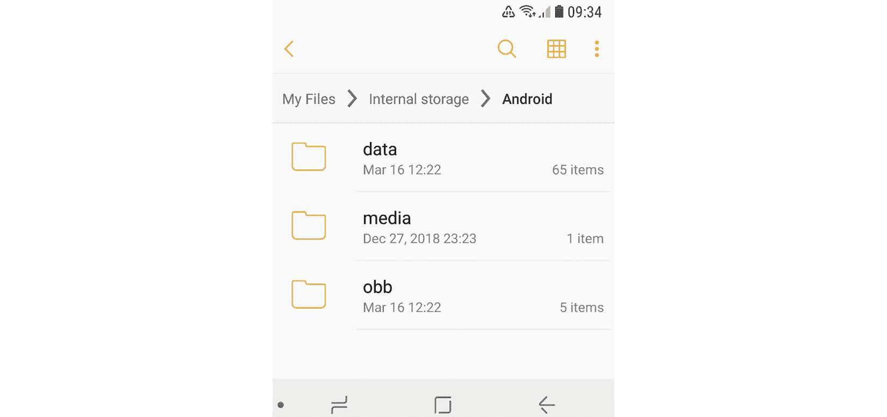

图 13.1 – 文件管理器将外部存储视为内部存储

除此之外，以下是一些其他对 Android 独有的重要文件路径：

+   `/data/app` 及其现代符号链接 `/factory`：包含已安装应用的 APK 和 ODEX 文件。

+   `/data/dalvik-cache`：已安装应用的优化字节码。

+   `/system`：这是操作系统本身的所在位置。它包含通常在根目录中找到的目录。

+   `/vendor`：指向 `/system/vendor` 的符号链接。这个路径包含厂商特定的文件。

+   `/system/app/`：包含预安装的 Android 系统应用，例如用于与相机或消息进行交互。

+   `/data/local/tmp/`：一个可以存储临时文件的目录。

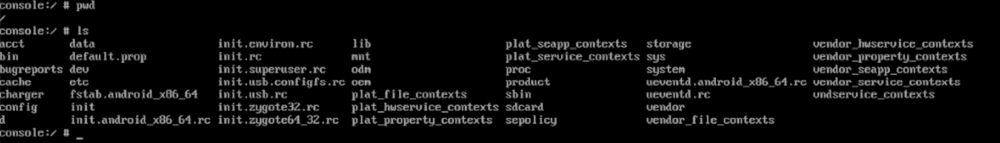

图 13.2 – Android 的根目录

接下来，我们将看到恶意软件在部署过程中通常使用的路径。

## Android 安全模型

Android 实现了多种机制来复杂化攻击者的操作。该系统随着时间的推移逐渐发展，最新版本在安全性方面与早期版本有显著区别。此外，现代 Android 系统从 7.0 版本开始基于更新的 Linux 内核 4.x+。让我们讨论一些最重要的方面。

### 进程管理

Android 实现了**强制访问控制**（**MAC**），并使用**增强安全 Linux**（**SELinux**）模型来执行它。SELinux 基于默认拒绝原则，即一切没有明确允许的行为都是禁止的。其实现已经随着 Android 的不同版本而发展；在 Android 5.0 中启用了强制模式。

在 Android 上，每个应用程序作为独立进程运行，并会创建自己的用户。这就是进程沙盒的实现方式：确保没有进程能够访问另一个进程的数据。在这种情况下，生成的用户名示例是`u2_a84`，其中`2`是实际用户 ID，偏移量为`100000`（实际值为`100002`），`84`是应用程序 ID，偏移量为`10000`（即值本身为`10084`）。应用与其对应用户 ID 之间的映射可以在`/data/system/packages.xml`文件中找到（参见`userId` XML 属性），以及在更简洁的`packages.list`文件中找到。

除了实际用户，Android 系统中还有许多具有预定义 ID 的系统账户。除了用于运行一些原生守护进程的`AID_ROOT`（0）外，还有一些其他示例如下：

+   `AID_SYSTEM`（1000）：这是一个具有特殊权限的常规用户账户，用于与系统服务进行交互。

+   `AID_VPN`（1016）：与**虚拟私人网络**（**VPN**）系统相关。

+   `AID_SHELL`（2000）：当用户使用`adb`工具并传递`shell`参数时，系统分配给用户的账户。

+   `AID_INET`（3003）：此账户可以创建`AF_INET`或`AF_INET6`套接字。

这些账户的完整且最新的列表可以在 Android 源代码中的`android_filesystem_config.h`文件中找到，该文件可以在线轻松访问。

为了支持**进程间通信**（**IPC**），引入了一种专用的**Binder**机制。它提供了远程方法调用功能，其中所有客户端和服务器应用程序之间的通信都通过专用设备驱动程序进行。稍后我们将讨论如何通过它的一个漏洞使攻击者提升权限，从而使设备获取 root 权限。

### 文件系统

正如我们现在所知道的，所有通用用户数据和共享应用数据都存储在`/storage/emulated/0`中。该路径允许读写访问，但不允许为其中的文件设置可执行权限。这里的目的是，用户无法简单地将自定义二进制文件写入磁盘并直接执行，即使是无意间或作为社会工程攻击的结果。

相比之下，每个已安装的应用程序都可以完全访问其在`/data/data`中的目录，但不能访问其他应用程序的目录，除非它们明确允许。这样做的目的是为了防止一个应用程序影响另一个应用程序的工作或访问敏感数据。

### 应用程序权限

应用程序权限的主要目的是通过让用户控制每个应用程序可以访问的数据和系统功能来保护用户隐私。默认情况下，任何应用程序都不能影响其他应用程序的工作，除非明确允许这样做；同样，访问敏感用户数据也适用此规则。根据 Android 的版本和设置，一些权限可能会自动授予，而其他则需要用户手动批准。

请求用户同意的默认行为取决于所使用的 Android 版本和 SDK 版本。对于 Android 6.0+及 SDK 版本>=23，安装时用户不会收到通知。相反，应用程序必须在运行时通过标准系统对话框窗口请求权限。对于较旧的 Android 版本和 SDK 版本，所有权限在安装时一次性请求。用户看到的是一组权限而不是单独的条目，否则逐一查看所有权限可能会感到不堪重负。

每个应用程序都必须在其嵌入的`manifest`文件中声明其所需的权限。为此，可以使用专门的`<uses-permission>`标签。权限分为三个保护级别：

+   `ACCESS_NETWORK_STATE`

+   `BLUETOOTH`

+   `NFC`

+   `VIBRATE`

+   `BIND_AUTOFILL_SERVICE`*   `BIND_VPN_SERVICE`*   `WRITE_VOICEMAIL`*   `READ_CONTACTS`*   `WRITE_CONTACTS`*   `GET_ACCOUNTS`*   位置：

    +   `ACCESS_FINE_LOCATION`

    +   `ACCESS_COARSE_LOCATION`

以下图示为清单文件中请求权限的示例：

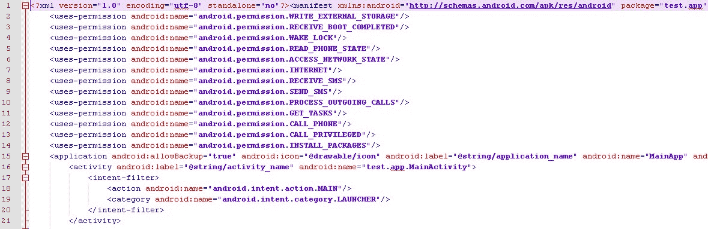

图 13.3 – 恶意软件在清单文件中请求的权限示例

值得一提的是，权限列表随着时间的推移不断发展，最终强制执行了多个新权限，从而提高了系统的安全性。特定权限添加（或弃用）的确切 API 版本可以在最新的官方 Android 文档中找到。

除此之外，还有一些所谓的特殊权限，它们与普通权限或危险权限不同。这些权限特别重要，因此应用程序除了在清单文件中声明它们之外，还应请求用户授权。此类权限的示例包括`SYSTEM_ALERT_WINDOW`和`WRITE_SETTINGS`。

由于不同设备可能具有不同的硬件特性，因此引入了另一个清单标签`<uses-feature>`。在这种情况下，如果`android:required`属性设置为`True`，则如果设备不支持该特性，Google Play 将不允许在该设备上安装该应用。

### 安全服务

Android 平台已推出多个服务，以改善整体安全结构：

+   **Android 更新**：只要漏洞被识别并修复，用户就会收到更新，以提高可靠性和安全性。

+   **Google Play**：引入了多个安全功能，例如应用安全扫描，旨在防止恶意作者上传和推广恶意软件。

+   **Google Play Protect**：一个对从 Google Play 下载的应用程序进行安全检查的系统，并检查设备是否存在来自其他来源的潜在恶意应用。

+   **SafetyNet**：提供多种 API，旨在为处理敏感数据的应用提供额外的安全相关信息（例如，当前设备是否能防御已知威胁，以及提供的 URL 是否安全）。

### 控制台

默认情况下，控制台在设备本身不可用（`adb` 应该在另一台连接的设备上使用）。因此，为了获得执行基本命令的能力，用户必须安装第三方应用程序，例如 **Termux** 或 **Terminal Emulator**。在移动设备上的界面将如下所示：

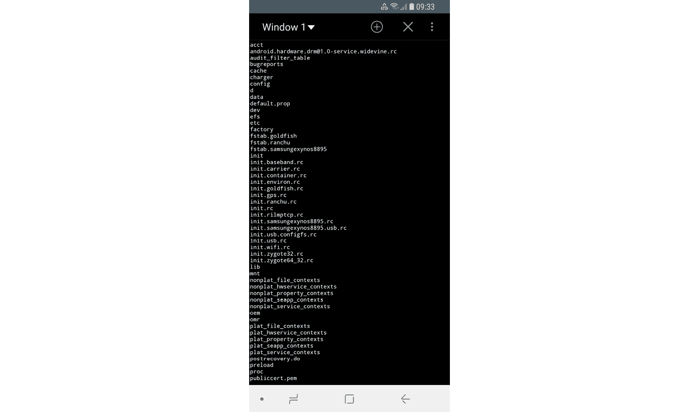

图 13.4 – 使用终端模拟器应用列出根目录中的文件

在这种情况下，只有在已 root 的设备上并且安装了 **BusyBox** 或类似工具集时，才能使用高级命令。

现在，让我们更详细地讨论一下 root。

## 要进行 root 还是不进行 root？

用户偶尔会遇到需要设备进行 root 的应用程序。这到底意味着什么，这个过程是如何运作的呢？在这一部分，我们将探讨不同 Android 版本中实施的安全机制以及如何绕过它们。

如果用户需要一些标准系统 API 不支持的功能（例如，删除某些预装应用或运营商应用、超频 CPU 或完全替换操作系统），他们唯一的选择——除了提交功能请求——就是通过已知漏洞获取 root 权限。这样，用户就能获得提升的权限并完全控制系统。这个过程的合法性因国家而异，但通常情况下，要么不明确（意味着处于灰色地带），要么对于与版权无关的活动是可以接受的，或者由一些专门的豁免进行规范。

有时，root 过程与越狱过程交替使用，一般适用于 iOS 设备。然而，这两者在范围上是不同的。越狱是绕过多种不同类型的最终用户限制的过程；主要的限制列举如下：

+   修改和替换操作系统的能力（由 iOS 上的锁定启动加载器技术控制）

+   安装非官方应用程序（侧载）

+   获取提升的权限（通常称为 root）

与 iOS 不同，Android 上可以正式启用侧加载，且许多设备出厂时解锁了引导加载程序，因此只有 root 权限仍然是一个问题。

每当一个新的与 root 相关的漏洞被发现时，开发人员需要修复它，并发布安全补丁或使操作系统的下一个版本更加安全。因此，研究人员必须想出新的漏洞来利用，从而实现 root。一些 root 方法涉及使用`adb`，而其他方法则可以通过普通的用户界面执行。以下是一些最著名的 Android 操作系统特权升级漏洞：

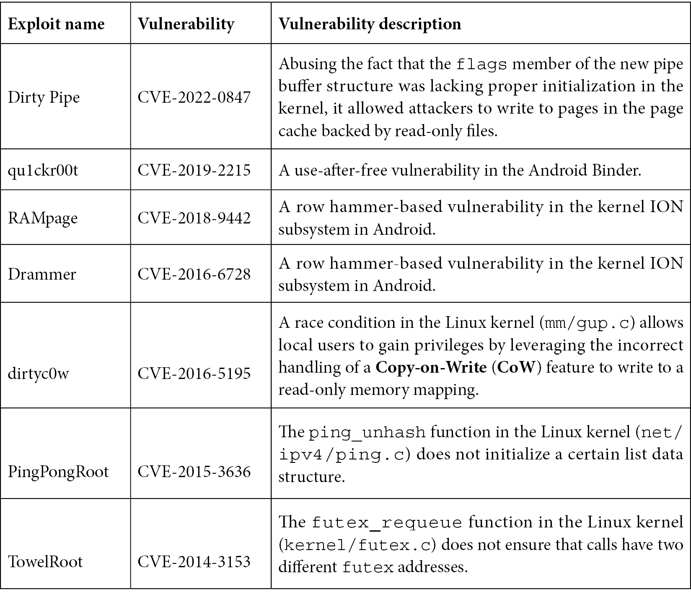

Root 操作伴随着终端用户的安全风险，因为此时用户不再受到系统内嵌的安全机制和限制的保护。获得 root 权限的常见方法是将标准 Linux `su` 工具放置在一个可访问的位置，该工具能够为自定义文件授予所需权限，并按需使用。恶意软件可以检查该工具是否已在受损设备上存在，并可以在不需要额外操作的情况下任意滥用它。

许多 Android 恶意软件家族还与 root 软件捆绑在一起，以便自行提升权限。root 访问对恶意软件作者有多个好处，特别是它使他们能够获取以下内容：

+   访问重要数据

+   改进的持久性能力

+   隐藏能力

这些类型的恶意软件家族的示例包括：

+   **Dvmap**：利用 root 权限修改系统库以实现持久化和特权升级

+   **Zeahache**：提升权限并为其他模块打开后门，允许它们进入受损的系统

+   **Guerrilla**：在这里，需要 root 权限才能访问用户的 Google Play 令牌和凭证，并获得与商店直接交互的能力，从而安装和推广其他应用程序

+   **Ztorg**：提升权限，主要目的是实现更好的隐蔽性，并积极展示广告

+   **CopyCat**：感染 Android 的**Zygote**进程（其他进程的模板），并将自己加载到其他进程中以访问和更改敏感信息

+   **Tordow**：窃取浏览器中的敏感信息，如凭证

值得一提的是，并非所有恶意软件家族都实现 root，因为它也增加了被杀毒软件检测到或损坏设备的概率。最终，是否使用 root 取决于作者，关键看其目的是否使得这些优点超过风险。

现在我们已经对 Android 的基本工作原理有所了解，是时候深入研究其内部机制了。

# 理解 Dalvik 和 ART

为了响应用户和行业的反馈，Android 操作系统在过去几年中发生了巨大的变化，使其变得更加稳定、快速和可靠。在本节中，我们将探讨文件执行过程是如何实现和发展的。此外，我们将深入研究各种原始和更新的文件格式，并了解 Android 可执行文件的实际工作方式。

## Dalvik 虚拟机（DVM）

**Dalvik 虚拟机**（**DVM**）是一个开源的进程虚拟机，曾用于 Android 直到 4.4 版本（KitKat）。它的名字来自冰岛的 Dalvík 村。DVM 实现了基于寄存器的架构，这与基于栈的架构虚拟机（如 Java 虚拟机）不同。这里的区别在于，基于栈的虚拟机使用指令来加载和操作栈上的数据，通常需要比寄存器机器更多的指令来实现相同的高级代码。相比之下，类似的寄存器机器指令通常必须定义所使用的寄存器值（而栈基机器则不需要，因为栈上的值的顺序始终已知，操作数可以通过栈指针隐式寻址），因此这些指令通常更大。

通常，Dalvik 程序是用 `dx` 工具编写的，该工具将 Java 类文件转换为 **Dalvik 可执行文件**（**DEX**）格式。值得一提的是，多个类文件可以被转换为一个单独的 DEX 文件。

一旦生成了 DEX 文件，它们可以与资源和本地代码一起通过 `dexopt` 工具进行合并，生成 **优化 DEX**（**ODEX**）文件，该文件由 DVM 解释执行。

从 Android 2.2 开始，引入了 **即时编译**（**JIT**）编译器用于 Dalvik。其工作原理是它在每次运行时持续分析应用程序，并动态地将最常用的字节码块编译成本地机器代码。然而，独立的基准测试显示，在同一设备上，启用 JIT 的 Dalvik 相比栈基的 Java HotSpot VM 平均慢了两到三倍，且 Dalvik 代码的空间占用也没有减少。为了提高整体性能并引入更多功能，**Android 运行时**（**ART**）应运而生。

## Android 运行时（ART）

ART 最早在 Android 4.4（KitKat）中作为替代运行时环境引入，并在随后的 Android 5.0（Lollipop）版本中完全替代了 Dalvik。

为了探索 Dalvik 和 ART 之间的关系，我们来看一下这张图：

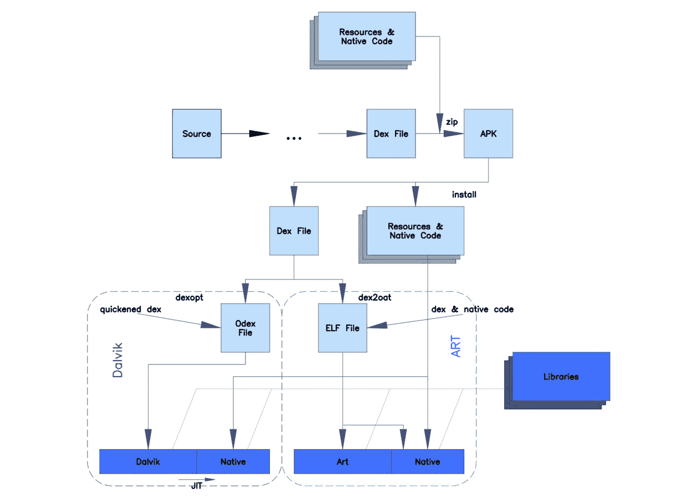

图 13.5 – 描述 Dalvik 和 ART 之间差异的图示（来源：Wikimedia Commons）

如你所见，Dalvik 和 ART 在开始时共享相同的逻辑，并使用相同的 DEX 和 APK 文件以保持向后兼容性。主要的区别在于文件实际如何处理和执行。ART 并不像 Dalvik 那样解释 DEX 字节码，而是将其转换为机器码指令，以实现更好的性能。因此，ART 在安装时不会生成 ODEX 文件，而是通过 `dex2oat` 工具编译应用程序生成包含本地代码的 ELF 文件（在前面章节中已经讲过）。最初，这些 ELF 文件也包含 DEX 代码，但在现代 Android 系统中，DEX 代码被存储在专用的 **VDEX** 文件中，而不是存储在 **OAT** 文件内。这个过程被称为 **提前编译**（**AOT**）编译。

从 Android 7.0（Nougat）开始，JIT 编译器补充了 AOT 编译，并根据分析器输出实时优化代码执行。虽然 JIT 和 AOT 使用相同的编译器，但前者能够在运行时利用信息，以便一般性地获得更好的结果，例如通过改进的内联。下面是一个图示，描述了 JIT 和 AOT 之间的关系：

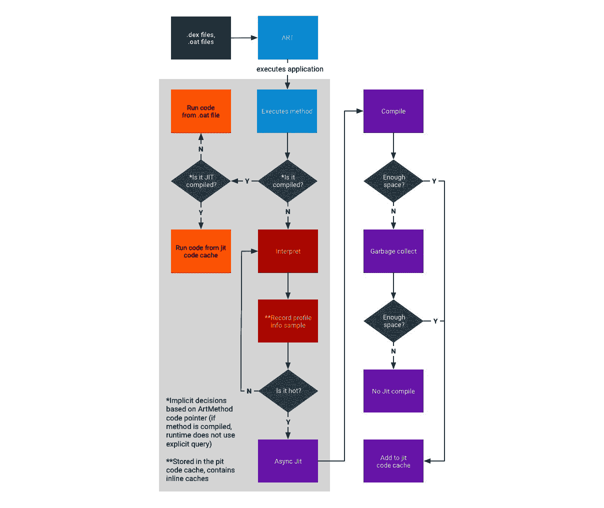

图 13.6 – 在 ART 中编译和执行文件的过程（来源：source.android.com）

如你所见，如果 AOT 二进制文件可用（但并非总是如此），它们会直接执行，无论是从 JIT 代码缓存中执行（如果是 JIT 编译的）还是按常规方式执行。否则，它们会被解释并根据系统的使用情况选择性地由 JIT 编译，特别是是否被其他应用程序使用，以及是否具有有效的分析数据（分析文件在执行过程中记录并生成）。AOT 编译守护进程也会定期运行，并利用这些信息来（重新）编译高频使用的文件。

现在，让我们更深入地探讨 Dalvik 的字节码指令集。

## 字节码集

如我们现在所知，Dalvik 是一种基于寄存器的机器，它定义了字节码的语法。有多个指令通过寄存器进行操作，以访问和操作数据。任何指令的总大小都是 2 字节的倍数。所有指令都是与类型无关的，这意味着它们不会区分不同数据类型的值，只要它们的大小相同。

下面是它们在官方文档中的一些示例。我们将它们分为几个类别，便于浏览。关于如何解读第一列的说明可以在该表格后找到：

+   **数据访问与传输**：

_B18500.jpg)_B18500.jpg)

+   **算术操作**：_B18500.jpg)

_B18500.jpg)

+   **分支和调用**：由于所有指令都是 2 字节的倍数，所有分支指令都以字为单位进行操作：

_B18500.jpg)

_B18500.png)

值得一提的是，某些指令集（例如，用于优化代码的指令）可能在官方文档中标记为未使用，且在旨在实现最大覆盖率的恶意软件中不太可能找到。

现在，让我们来看看第一列中使用的格式符号。

第一个字节是指令的操作码（Dalvik 只使用一个字节的值（00-0xFF）来编码指令）。在官方文档中，一些类似的指令被分组到一行中，`range` 指明它们所属的范围（“`..`”用来定义范围），并在第二列提供对应指令的映射。

支持的指令格式在官方文档中使用特殊的格式 ID 符号表示。格式 ID 通常由三个字符组成——两个数字和一个字母：

+   第一个数字表示结果字节码中两字节代码单元的数量（参见 *Examples* 列）。

+   第二个数字指定使用的寄存器的最大数量（因为一些指令支持可变数量的寄存器）。

+   最后一个字母表示格式编码的额外数据类型。以下是描述这些助记符的官方表格：

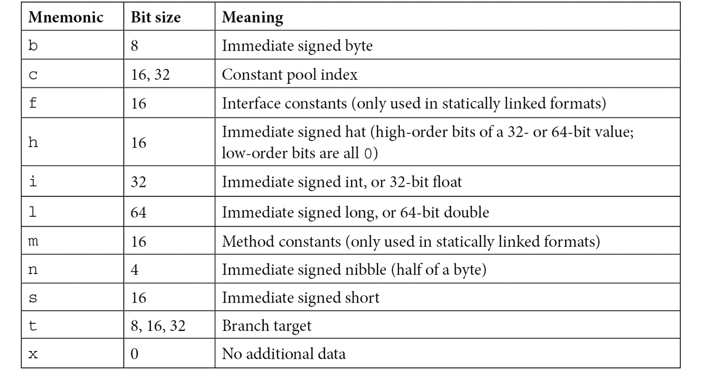

让我们以第一张表的第一行作为例子。在这里，描述 `move v0, v1` 指令的 `01 12x` 值，使用 2 字节 `0110` 编码，意味着以下内容：

+   `01` – 编码实际指令的字节（`0x01`）。

+   `12x` 应该解释为三个单独的值：

    +   `1` – 指令的大小（一个字，2 字节，总共：`0x01` 和 `0x10`）

    +   `2` – 寄存器的数量（共两个，`v0` 和 `v1`）

    +   `x` – 这里不使用额外的数据

关于第一张表格第二列使用的参数前缀，它们的含义如下：

+   `v` 符号用于标记寄存器名称的参数。

+   `#+` 前缀指定表示字面值的参数。

+   `+` 符号用于表示相对指令地址偏移量的参数。

+   `kind@` 前缀表示常量池类型（字符串、类型、字段等）。

有一份单独的官方文档描述了所有可能的格式变体。

下面是一个 Dalvik 字节码序列的示例：


图 13.7 – 反汇编的 Dalvik 字节码示例

总体来说，相关的 Android 文档非常详细且易于访问，因此如果有疑问，最好参考文档。

现在我们了解了 Android 的工作原理，是时候更深入一步，了解其应用程序中使用的主要文件格式。

# 文件格式和 API

以下是与为不同版本 Android 编写的应用程序相关的最重要的文件格式。

## DEX

DEX 格式包含一组类定义和相关数据。文件布局如下：

_B18500.jpg)

_B18500.png)

其余字段定义了其他数据块的大小和偏移量：

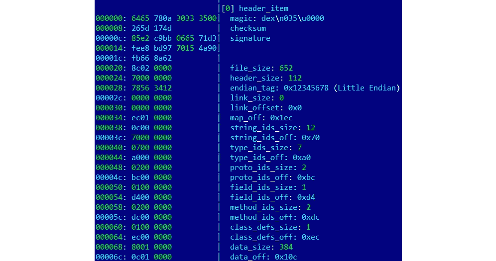

图 13.8 – 详细描述字段的 DEX 头文件

头文件以一个 8 字节的`DEX_FILE_MAGIC`值开始，该值由一个`dex`字符串（`\x64\x65\x78`）后跟换行符（`\x0a`）、定义格式版本的 3 个字节，最后是一个零字节（`\x00`）组成。此格式旨在提供一种识别 DEX 文件及其使用的相应布局的方法，并防止基本的数据损坏。

## ODEX

在 ART 出现之前广泛使用的 ODEX 文件是对设备上 DEX 进行优化的结果，目的是提高性能并减少结果文件大小。ODEX 文件由已描述的 DEX 布局组成，并加上一个简短的 ODEX 头文件：

```
typedef struct DexOptHeader {
  u1 magic[8];
  u4 dexOffset; 
  u4 dexLength;
  u4 depsOffset;
  u4 depsLength;
  u4 auxOffset;
  u4 auxLength;
  u4 flags;
  u4 padding;
} DexOptHeader;
```

`magic`头文件的值与 DEX 相同，但其前三个字节的签名略有不同，使用`dey`（`\x64\x65\x79`），而不是`dex`。此格式在`DexFile.h`源代码文件中定义。

## OAT

OAT 文件旨在替代新 ART 环境中的 ODEX。首先，在处理 Android 可执行文件时，不应仅仅依赖文件扩展名。特别是在近期的 Android 系统上，`.dex`、`.odex`和`.oat`扩展名的文件实际上可能实现了 OAT 格式。该格式文档并不完善，并且在不同版本的 Android 中有所不同，但最重要的一点是，结果数据被封装在 ELF 共享对象中。从 Android Oreo 开始，OAT 文件不再存储 DEX 代码，而是将其交给 VDEX 文件，主要用于存储映射信息和本地代码。

## VDEX

这些文件是在新版 Android 中引入的（从 Android Oreo 开始），并由`dex2oat`工具创建。其思路是将 DEX 代码独立存储，而不是存储在 OAT 结构中，并附加一些元数据以加速验证。与 OAT 一样，该文件格式未公开文档，并且在不同版本的 Android 中有所变化。其描述可以在 Android 的`vdex_file.h`源代码文件中找到。

此外，还有一种新的内部 ART 格式，称为`cdex`。最新的描述可以在`compact_dex_file.h`源代码文件中找到。

## ART

这些文件包含 APK 中列出的 ART 的某些字符串和类的内部表示，并用于加速应用程序启动。此情况下常用的文件扩展名为`.art`。与前面的情况一样，这种文件格式没有文档说明，并且在不同版本的 Android 中有所变化。由于它通常不被恶意软件使用，这里不再详细讨论。

## ELF

除了 Android 特有的文件格式外，还可以执行为相应架构编译的通用 ELF 文件。与主要依赖 **glibc** 的 Linux 系统不同，Android 由于许可问题使用自己的 **Bionic C** 库。目前，支持 x86 和 ARM（32 位和 64 位）架构。除此之外，正如前面所提到的，它还用于存储优化过的 Android 可执行文件的 OAT 数据块。

ELF 格式已经在*第十一章*《剖析 Linux 和物联网恶意软件》中详细讲解过。

## APK

APK 文件是基于 JAR 格式的归档文件，正如我们从*第九章*《反编译字节码语言——.NET、Java 和更多》知道的那样，它实现了 ZIP 格式。这意味着，APK 文件可以通过任何支持 ZIP 压缩文件的软件解压。

通常，APK 文件包含以下文件：

+   `res`：此目录包含各种资源文件（如 XML 和图片）。

+   `META-INF`：存储与包相关的元数据文件，主要包括以下内容：

    +   `MANIFEST.MF`：一个`manifest`文件，包含 APK 内文件的名称和 SHA1/SHA2 摘要

    +   `<name>.RSA`：包含应用程序的签名和证书

    +   `<name>.SF`：包含 `MANIFEST.MF` 中相应行的 SHA1 或 SHA2 摘要，以及相关资源的列表

+   `AndroidManifest.xml`：主要的`manifest`文件，定义了与系统和 Google Play 相关的各种重要应用程序值。它以人类无法读取的格式存储在 APK 中。解码它的最简单方法之一是使用**apktool**进行提取。

+   `classes.dex`：包含应用程序的 DEX 字节码的编译文件；可以有多个，文件名后附数字，格式为 `classes<num>.dex`。

+   `resources.arsc`：此编译文件包含与应用程序使用的资源相关的元数据。

目前，Android 不对应用程序证书执行 CA 验证，因此允许使用自签名证书。除此之外，像 assets 和 files 等其他目录也常见于 APK 文件中。

关于 `AndroidManifest.xml`，只有 `<manifest>` 和 `<application>` 元素是必需存在的。通常，以下数据可以在其中指定：

+   基本的应用程序信息（如包名）

+   应用程序组件及其相应类型（活动、服务、广播接收器或内容提供者）

+   必需的权限（参见相应章节《Android 安全模型》）

+   应用程序所需的硬件和软件特性

+   支持的 Android SDK 信息

与许多其他系统上的程序不同，一般来说，Android 应用程序不一定具有单一的入口点，这意味着没有主函数。可以通过查看应用程序的 `AndroidManifest.xml` 文件，搜索具有 `android.intent.action.MAIN` 值的组件来找到示例的主要活动。还需要检查 `<application>` 元素的 `android:name` 属性中是否提到了类名（这个类名应代表 `Application` 类的子类），如果提到了，那么该类应首先获得控制权。一旦找到，接着搜索这些组件中的 `onCreate` 方法——它们在反汇编中将会是这样的：

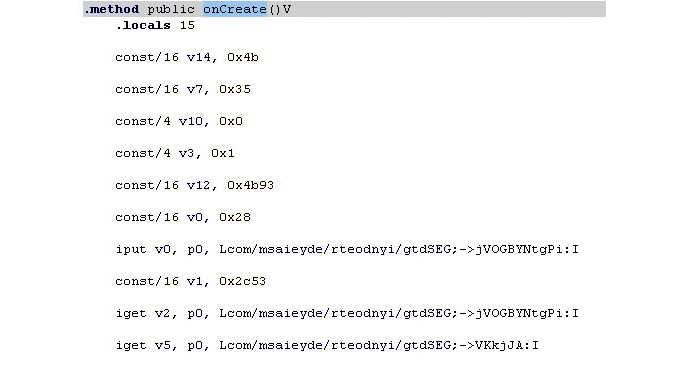

图 13.9 – 反汇编后的 Android 示例中的 onCreate 方法

现在我们已经熟悉了 Android 中最常用的文件格式，接下来让我们来讨论它的 API。

## APIs

Android 平台的大多数代码是用 Java 编写的，因此整个基础架构都是建立在 Java 上的。然而，Android 实现了自己的 API，以便让程序与操作系统交互以实现其目标。虽然某些类可能与 Java 相似（例如，`System` 类），但也有许多不同之处，比如某些属性的含义不同（或有些属性失去了其原本的意义）。此外，一些新引入的类和 API 旨在提供对 Android 中实现的独特功能的访问。例如，`DexClassLoader` 类，它从 JAR 和 APK 文件加载类，并可用于执行不属于应用程序的代码。以下是一些其他 API 及其类的示例，这些类有着易于理解的名称，并且通常可以在恶意软件中看到：

+   `SmsManager`

    +   `sendTextMessage`

+   `ActivityManager`

    +   `GetRunningServices`

    +   `getRunningAppProcesses`

+   `PackageManager`

    +   `GetInstalledApplications`

    +   `getInstalledPackages`

+   `DevicePolicyManager`

    +   `LockNow`

    +   `reboot`

+   `Camera`

    +   `TakePicture`

+   `DownloadManager`

    +   `enqueue`

+   `DownloadManager.Request`

    +   `setDestinationUri`

也可以通过组合使用 `Intent` 类（其中包含描述所请求操作的特定参数）和 `Activity` 类（实际执行操作，通常使用 `startActivityForResult` 方法）来访问某些功能。

关于下载相关的功能，许多恶意软件家族显然更倾向于避免使用标准下载管理器，因为它往往更容易被用户看到，而是使用 Java 类（如 `java.net.URL` 和 `java.net.URLConnection`）来实现下载。当然，正如我们所知道的，某些 API 需要在使用之前请求特定的权限。在这种情况下，至少需要 `android.permission.INTERNET` 权限。

现在我们已经了解了文件的结构以及需要关注的 API，接下来是时候关注恶意软件中常见的特定模式以及其背后的逻辑了。

# 恶意软件行为模式

一般来说，尽管移动设备的恶意软件由于目标系统的不同环境和使用场景而具有其自身的细微差别，但攻击背后的动机模式与 PC 平台上的攻击模式大致相同。在本节中，我们将深入探讨各种移动恶意软件功能的例子，并了解它们为实现恶意目标所使用的方法。

现在我们知道了这些操作本该如何进行，让我们看看恶意软件作者是如何利用这些机制的。在这里，我们将通过对大多数恶意软件常见的各种攻击阶段进行分析，帮助我们在分析样本时识别这些模式，并理解它们的目的。

## 初始访问

恶意软件获取设备访问权限的最常见方式如下：

+   Google Play

+   第三方市场和旁加载

+   恶意广告和漏洞利用

在前两种情况下，恶意软件作者通常依赖社交工程，欺骗用户安装可能有用的应用。为此，使用了多种技术，以下是其中的一些：

+   **相似设计**：该应用可能与其他一些知名的合法应用在外观和名称上相似。

+   **虚假评论**：使应用看起来真实且不令人怀疑。

+   **反检测技术**：绕过自动恶意软件扫描器并延长托管时间。

+   **恶意更新**：上传到应用商店的原始应用是干净的，但其更新包含了隐藏的恶意功能。

+   **诱导描述**：承诺提供免费或禁忌内容、轻松赚钱等。

应用本身可能大部分是合法的，但也可能包含隐藏的恶意功能。用户可能通过多种方式遇到这些应用——例如点击通过即时通讯、短信、电子邮件收到的欺诈链接，或在论坛上留下的链接，或者在搜索特定应用时由于非法的**搜索引擎优化**（**SEO**）技术而遭遇它们。

恶意广告的使用涉及通过广告网络传递恶意代码，并借助漏洞利用来实现。一个例子是**lbxslt**，这是 2017 年黑客团队泄露的一个漏洞，攻击者利用它传播勒索软件。此外，漏洞还可以用于针对特定个人的高调攻击。

## 提权

下一阶段是获得所需的所有权限。除了已经讨论过的 root 权限外，恶意软件还可以滥用所谓的管理员权限。

最初设计用于企业用例，远程管理员工的移动设备，它们可以为恶意软件提供强大的功能，包括擦除重要数据的能力。通常，获得权限的最简单方式是不断地请求用户，直到权限被授予为止。

只要获得了所有必要的权限，恶意软件通常会尝试将其模块部署到设备的某个位置。在此阶段，额外的模块可以通过联系命令和控制服务器后下载。

## 持久性

恶意软件执行后最常安装的位置通常包括以下几种：

+   `/data/data`：所有 Android 应用程序应使用的标准路径。此方法对攻击者构成威胁，因为相对容易修复此类威胁。

+   `/system/(app|priv-app|lib|bin|xbin|etc)`：这些路径要求恶意软件使用 root 漏洞来访问它们，这使得用户更难识别并删除威胁。

在这种情况下，持久性可以通过使用标准的 Android `BroadcastReceiver` 功能来实现，这种功能在所有使用`BOOT_COMPLETED`操作的应用中都很常见。在这种情况下，`RECEIVE_BOOT_COMPLETED`权限是必需的。

虽然许多大规模的恶意软件家族遵循类似的模式以实现其目标，但也存在一个较小——但同时通常更为重要——的例子集，它们采用先进技术来实现更为具体的目标。例如，APT 组织执行高-profile 间谍任务，因此对隐匿性和有效性有更高的要求。一个相关的恶意软件家族示例是修补系统库（如`libdvm.so`和`libandroid_runtime.so`），并在其中注入代码。这些库本应执行一个具有系统权限的标准系统可执行文件，但被攻击者替换，以实现持久性并同时提升权限。

## 影响

只要恶意软件完成安装，它就可以切换到创建它的主要目的。具体的实施方式将根据目标而大不相同。以下是一些在大规模恶意软件中常见的行为：

+   **付费短信发送者**：在某些国家，利用移动恶意软件立即赚钱最简单的方法可能是向付费号码（包括与应用内购买相关的号码）发送付费短信，或者订阅付费服务。每次发送都需要一定的费用，或者会定期扣除自动订阅费用，最终导致受害者余额耗尽。为了绕过验证码保护，可能会使用现有的反验证码服务。

+   **点击器**：一种更为通用的威胁类型，利用移动设备通过多种不同方式赚钱：

    +   **广告点击器**：模拟点击广告网站，无需用户交互，最终从广告公司获取资金。

    +   **WAP 点击器**：这个组与付费短信发送者类似，它使用另一种移动支付形式，这次是通过模拟点击 WAP 计费网页来收费。费用将被计入受害者的手机余额。

    +   增加网站流量以进行非法 SEO 目的的点击器；例如，用于推广恶意应用程序。

    +   留下虚假评论或改变某些应用和服务评分的点击器。

    +   利用辅助功能服务购买 Google Play 上的昂贵应用程序，例如，通过模拟用户点击或实现自己的客户端直接与商店互动。

+   **广告软件**：这些威胁旨在通过向用户展示定制的广告来实现货币化，通常方式过度且具有侵扰性。

+   **信息盗窃程序**：由于移动设备通常包含敏感信息，包括保存的凭证、照片和私人信息，恶意软件作者也可以通过窃取这些信息来赚钱，例如，通过将其出售给地下市场或勒索用户。另一个可能的选项是网络间谍活动。

+   **银行木马**：有时也被称为信息盗窃程序，这种恶意软件旨在窃取用户的银行信息，以访问他们的银行账户或操控支付。最常见的做法是通过在真实银行或流行的预订应用上方显示伪造的窗口，模拟真实的应用程序并让用户在其中输入凭证，或使用辅助功能服务使真实应用执行非法交易。对设备上短信的访问可以用来绕过一些银行引入的双因素身份验证。

+   **勒索软件**：与 PC 世界一样，一些恶意软件家族试图阻止访问某些文件或整个设备，以非法迫使用户支付赎金以恢复访问权限。这种行为通常伴随着声明，指控受影响的用户做错了什么（例如，观看了非法内容），并要求他们支付罚款，否则信息将会公开。

+   **分布式拒绝服务（DDoS）**：多个受感染的移动设备能够产生足够的流量，从而给目标网站带来显著的负载。

+   **代理**：这种功能很少单独使用，它允许恶意行为者利用感染的设备作为免费代理，获取特定资源并增加匿名性。**Sockbot**就是一个这样的家族示例。

+   **加密货币挖矿程序**：这一类恶意软件滥用设备的计算能力来进行加密货币挖矿。虽然每台设备的 CPU 可能不是很强大，但当大量受感染设备汇聚在一起时，攻击者可以获得可观的利润。对于受影响的用户来说，这会导致流量使用增加，设备显著变慢并过度发热，最终可能会造成损坏。

一些木马更倾向于实现**后门**或**RAT**功能，并通过交付可定制的模块来实现扩展恶意软件功能的灵活性。

值得一提的是，并非所有恶意软件家族的名称都基于其实际功能。通常会使用描述其传播方式的共享名称，例如**Fakeapp**。

在传播方面，由于恶意软件可以轻松访问受害者的联系人，因此传播机制通常涉及通过短信、即时通讯软件和电子邮件向用户认识的人发送链接或样本。

至于实际获取资金，最初，恶意软件作者更倾向于通过高级短信服务和本地支付终端来获取资金。后来，随着加密货币的兴起，由于其匿名性和更简便的设置过程，替代选项成为恶意作者的显而易见选择，并提供了详细的支付指导。

## 收集

纯键盘记录而不进行屏幕捕捉在 Android 恶意软件中并不常见。原因有多种，首先在大多数情况下并不需要这样做，而且还因为移动设备上数据输入的特殊性。有时，一些高调的间谍恶意软件会以相当富有创意的方式实现此功能。例如，它可以跟踪屏幕上的触摸操作，并将其与预定义的坐标映射进行匹配，从而推断按下的键。

一个实施该机制的例子是**BusyGasper**，这是一种后门恶意软件。

## 防御规避

移动恶意软件可以集成多种反分析技术以保护自己，包括以下几种：

+   **不可访问的位置**：前面提到的技术，恶意软件通过利用 Root 漏洞，使自己能够部署在标准用户权限无法访问的地方。另一个选项是覆盖现有的系统应用程序。

+   **检测权限撤销**：当权限被撤销时，使用多种技术来吓唬用户，试图阻止其撤销操作。

+   **检测杀毒软件**：在这种情况下，恶意软件会不断搜索与已知杀毒产品相关的文件，一旦检测到这些文件，可能会弹出一个提示窗口，要求卸载杀毒软件。这类消息会循环显示，直到受害者执行请求的操作，否则无法正常使用设备。

+   **模拟器和沙盒检测**：在这种情况下，恶意软件检查其是否正在模拟环境中执行。可以通过多种方式进行检查：检查某些系统文件的存在或其中的值，例如 IMEI 和 IMSI、构建信息、各种产品相关值，以及所使用的电话号码。在这种情况下，恶意软件会根据结果表现出不同的行为，从而干扰自动和手动分析。另一种常见的简单技巧是利用执行时间限制来绕过基本的沙盒，方法是让程序暂停或在一段时间内执行无害操作。

+   **图标隐藏**：这里的想法是用户不能轻松地通过图标卸载应用程序。例如，可以使用一个透明图像且没有可见应用名称的图标。

+   **多重副本**：恶意软件可以将自身安装在多个位置，以期望有些副本能够逃过检测。此外，感染 Zygote 进程允许恶意软件在内存中创建多个副本。

+   **代码打包或混淆**：由于许多安卓程序是用 Java 编写的，因此可以使用相同的代码保护解决方案。市场上目前有多个商业选项。这一主题已经在*第九章*中讨论过，*反向工程字节码语言—.NET、Java 及更多*。

在前几章中，我们介绍了先进的恶意软件，这些恶意软件旨在获取更多对操作系统的控制，从而执行更复杂的任务，例如隐藏文件和进程以防止监控软件检测，或在较低层次修改数据。这些方法同样可以应用于移动操作系统。尽管由于部署的复杂性，恶意软件目前仍未广泛使用这些方法，但已有一些开源项目证明这在技术上是可行的。

其中之一是`sys_call_table`。这里的最终目标是低层次地隐藏样本的存在。

现在是时候总结我们迄今为止所学的内容，并将其应用到实践中，以便能够理解安卓恶意软件样本的功能。

# 威胁的静态和动态分析

在这个阶段，我们已经掌握了足够的知识，开始分析实际的恶意软件。对于静态分析，使用的过程和工具在不同版本的安卓操作系统中大致相同（无论是基于旧的 DVM 还是新的 ART 技术）；区别主要体现在动态分析技术上。现在是时候动手实践，熟悉可以帮助我们完成这个过程的工具了。

## 静态分析

一般来说，字节码恶意软件的静态分析涉及要么反汇编字节码并深入研究字节码指令，要么反编译回原始语言并探索源代码。在很多情况下，后一种方法更为可取，因为阅读人类友好的代码可以减少分析所需的时间。前一种方法通常在反编译因各种原因无法成功时使用，例如缺乏最新工具，或者样本中实施了反逆向工程技术。

下面是一些最常用的工具，用于安卓恶意软件的静态分析。

### 反汇编与数据提取

这些工具旨在从编译后的字节码中恢复 Dalvik 汇编：

+   `.smali`文件扩展名。

在 SMALI 文件的第 1 版和第 2 版之间有一些格式上的变化。要将现有的 SMALI 文件转换为新格式，可以使用最新版本的 Smali 工具（版本 1）将旧文件汇编，然后使用最新版本的 Baksmali 工具（版本 2）将其反汇编。

+   **Apktool**：这是一个基于 Smali 工具的包装器，它提供了方便处理 APK 文件的功能。其界面如下所示：

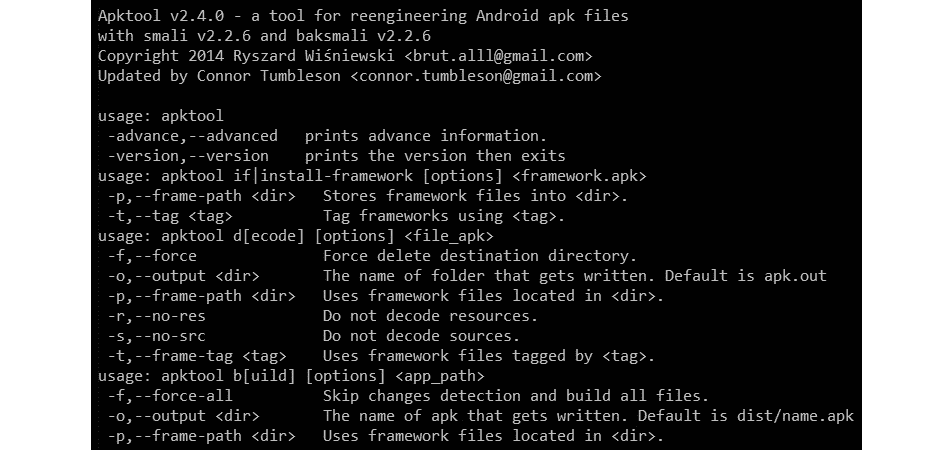

图 13.10 – Apktool 的界面

除此之外，还有一些基于这两者构建的其他在线和桌面解决方案，提供了便捷的用户界面和额外的功能，例如 **APK Studio**：

+   `aapt dump badging <path_to_apk>`，要解析 `AndroidManifest.xml`，使用 `aapt dump xmltree <path_to_apk> AndroidManifest.xml`

+   **oat2dex**（**SmaliEx** 的一部分）：一个非常有用的工具，可以从旧的 ELF 文件中提取 DEX 字节码，并将其存储为 OAT 数据的一部分，以便像往常一样进行分析。

+   **vdexExtractor**：这个工具可以用来从 VDEX 文件中提取 DEX 字节码，因为现代 OAT 文件不再存储它。

+   **LIEF**：这个跨平台库提供了丰富的功能，可以解析和修改各种格式的 Android 文件。

+   **Androguard**：一个多功能的工具集，结合了多个工具来执行各种类型的操作，包括反汇编、解析和解码各种文件。

虽然字节码汇编确实可以用于静态分析，但许多工程师更倾向于使用反编译代码，以节省时间。在这种情况下，反编译工具极为有用。

### 反编译

这个工具集不是恢复汇编指令，而是恢复源代码，这通常是一个更人性化的选择：

+   **JADX**：一个将 DEX 转换为 Java 的反编译器，提供命令行和图形界面工具，可以获得接近原始源代码的 Java 语言代码。此外，它还提供了基本的去混淆功能。它的界面如下所示：

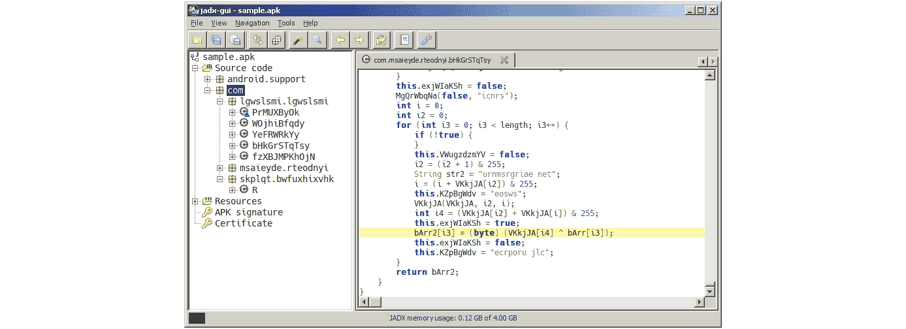

图 13.11 – 在 JADX 中反编译的 Android 示例

+   **AndroChef**：这个商业反编译器支持 Java 和 Android 文件，并提供一个方便的 GUI 来查看结果。

+   **JEB 反编译器**：另一个强大的商业反汇编和反编译解决方案，支持 Dalvik 和机器代码。

+   **dex2jar**：虽然不完全是一个反编译器，这个工具允许工程师将 DEX 文件转换为 JAR 文件。之后，可以使用多个 Java 反编译器来获得 Java 源代码，正如在 *第九章* 中讨论的，*反向工程字节码语言 – .NET、Java 等*。

+   **Ghidra**：除了支持本地可执行文件外，这个强大的工具集还通过将 Android 应用转换为 JAR 文件来支持 Android 应用，并可以用于促进该平台的静态分析。

一旦获得源代码，可以在任何支持语法高亮的 IDE 或文本编辑器中进行分析。

现在是时候探索工程师进行动态分析的选项了。

## 动态分析

有效的动态分析需要某种形式的仿真或远程调试，因为许多移动设备的本地屏幕相对较小，输入能力较为基础。

### Android 调试桥

**Android 调试桥**（**ADB**）是一个多功能命令行工具，允许用户从 PC 与移动设备进行交互，提供多种操作。它是 Android SDK Platform Tools 的一部分，包含三个部分：

+   在 PC 上运行的客户端，提供输入命令的接口。

+   一个守护进程（**adbd**）在移动设备上执行输入的命令。它作为后台进程在所有设备上运行。

+   在 PC 上运行的一个服务器，管理客户端与守护进程之间的通信。

在物理设备上，可以通过在 **设置** 中的 **开发者选项** 启用 **USB 调试** 选项来允许 ADB。 在现代 Android 操作系统中，此选项默认隐藏，可以通过多次点击 **版本号**（通常在 **设置** | **关于手机** 中可以找到）使其显示，然后返回到上一个界面。在实际设备之外，ADB 还可以识别并与 Android 模拟器配合使用，无需任何更改。

除了通过 USB 访问设备外，还可以通过 Wi-Fi 进行无线交互，方法是先通过 USB 发出 `adb tcpip <port>` 命令，然后断开设备连接，再使用 `adb connect <ip_address>:<port>` 命令进行连接。

下面是一些其他命令行选项的示例：

+   `adb devices`：列出连接的设备。


图 13.12 – Adb 识别模拟设备

+   `adb kill-server`：重置 adb 主机

+   `adb install <path_to_apk>`：通过 APK 文件将应用程序安装到设备

+   `adb pull` 或 `adb push`：在移动设备和 PC 之间移动文件

+   `adb root` 或 `adb unroot`：以或不以 root 权限重新启动 `adbd` 守护进程（不建议在生产版本中使用）

+   `adb forward`：将主机的指定端口转发到设备：

    +   示例：`adb forward tcp:1234 tcp:5678` – 将主机的端口 `1234` 转发到设备的端口 `5678`

+   `adb shell [<command>]`：创建远程交互式 shell 或在 shell 中运行命令

除了传统的 Linux 命令，例如 `ls` 或 `cat`，Android shell 还支持多个自定义命令。以下是一些示例：

+   `screencap <filepath>`：截取屏幕截图并将结果保存到设备上。

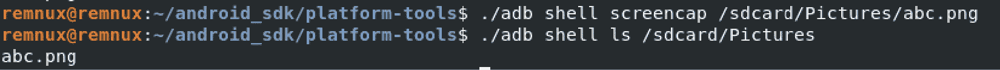

图 13.13 – 使用 screencap 命令

+   `screenrecord <filepath>`：执行屏幕视频录制，直到按下 *Ctrl + C*。

+   `monkey <package_name>`：最初设计用于执行随机操作，从而对应用进行压力测试，也可以通过使用 `adb shell monkey -p <package_name> 1` 语法启动指定的应用程序。

+   `input keyevent <num>`：发起指定的按键事件。以下是一些按键事件及其对应的数字：

    +   `3` – 按下 `4` – 按下 `64` – 打开浏览器

    +   `207` – 打开联系人

完整的最新列表可以通过查看官方 Android 文档中的 `KeyEvent` 类找到。

重要说明

要传递需要引号的参数作为命令的一部分，你必须使用一对不同的引号（单引号或双引号）将引号字符串括起来。

此外，ADB 可用于向额外的模块发出命令：

+   `adb shell pm list packages` – 列出所有包的名称。使用 `–f` 选项还可以获取相应 APK 的路径。可以使用 `–3` 参数过滤掉第三方应用程序。

+   `adb shell am start -a android.intent.action.MAIN -n <package_name>/<main_activity>` – 启动应用的主活动。指定主活动的最可靠方法是提供包内主活动的完整路径（例如 `adb shell am start -a android.intent.action.MAIN -n com.google.android.calendar/com.android.calendar.LaunchActivity`）。*   `adb shell dpm set-active-admin -user current <component>` – 将指定的组件设置为活动管理员，通常用于强制执行安全策略。

所有命令都可以在全面的官方文档中找到。

### 模拟器

和其他平台一样，模拟器旨在通过模拟执行的指令来促进动态分析，无需使用真实设备。有许多第三方解决方案旨在提供更容易访问 Android 应用程序和游戏的途径，例如 BlueStacks。然而，对于逆向工程目的，通常更侧重于为开发人员提供创建和调试应用程序能力的解决方案，通常会提供更好的选项。它们包括以下几种：

+   **Android 模拟器**：官方 Android 模拟器可以作为官方 **Android Studio** 的一部分安装，或使用命令行 **SDK Manager** 安装。它几乎提供了真实物理设备的所有功能，并且配备了预定义的配置集，旨在模拟各种移动设备（无论是手机、平板还是可穿戴设备）在 PC 上的表现。

若要在没有 Android Studio 的情况下安装模拟器（仅使用命令行），请按照以下步骤操作：

+   如果你以前从未安装过 Android SDK，请在你希望存放整个 Android SDK 的位置创建一个空目录，并创建一个名为 `ANDROID_HOME` 的环境变量，指向该目录。

+   下载 Android 命令行工具，解压缩它们，然后将整个解压后的目录 `cmdline-tools`（而不是其内容！）移动到 Android SDK 文件夹。

+   在 `$ANDROID_HOME/cmdline-tools` 内创建一个名为 `latest` 的目录，并将 `cmdline-tools` 的整个内容移动到该目录中。

+   在 `$ANDROID_HOME/cmdline-tools/latest/bin` 目录中，你可以找到 `sdkmanager` 工具。使用此方法获取模拟器和平台工具，包括 `adb`：

    ```
    ./sdkmanager emulator platform-tools
    ```

+   你可以通过运行以下命令列出所有可用的 Android 系统镜像：

    ```
    ./sdkmanager --list | grep "system-images;android"
    ```

+   例如，我们决定模拟 Android 12，对应的 API 级别是 `31`。使用以下命令下载将在 x86-64 机器上模拟的系统镜像，以及相应的包：

    ```
    ./sdkmanager "system-images;android-31;google_apis;x86_64" "platforms;android-31"
    ```

重要说明

使用 `google_apis_playstore` 镜像将启用对 Google Play 的访问，但 `adb root` 命令在这些镜像上将无法使用！

+   使用以下命令创建一个与选定系统镜像关联的虚拟设备（无需创建自定义硬件配置文件）。在这种情况下，使用的名称是 `avd_31_noplay`，但可以使用任何其他名称：

    ```
    ./avdmanager create avd -n "avd_31_noplay" -k "system-images;android-31;google_apis;x86_64"
    ```

+   现在，一切都准备好运行模拟器，模拟器位于 `$ANDROID_HOME/emulator` 目录中，使用以下命令：

    ```
    ./emulator -avd "avd_31_noplay"
    ```

重要提示

在虚拟机上运行模拟器时，可能会提示有关硬件加速的问题——为了解决这个问题，需要在虚拟机设置中启用 Intel VT-x 支持。

这是结果的样子：

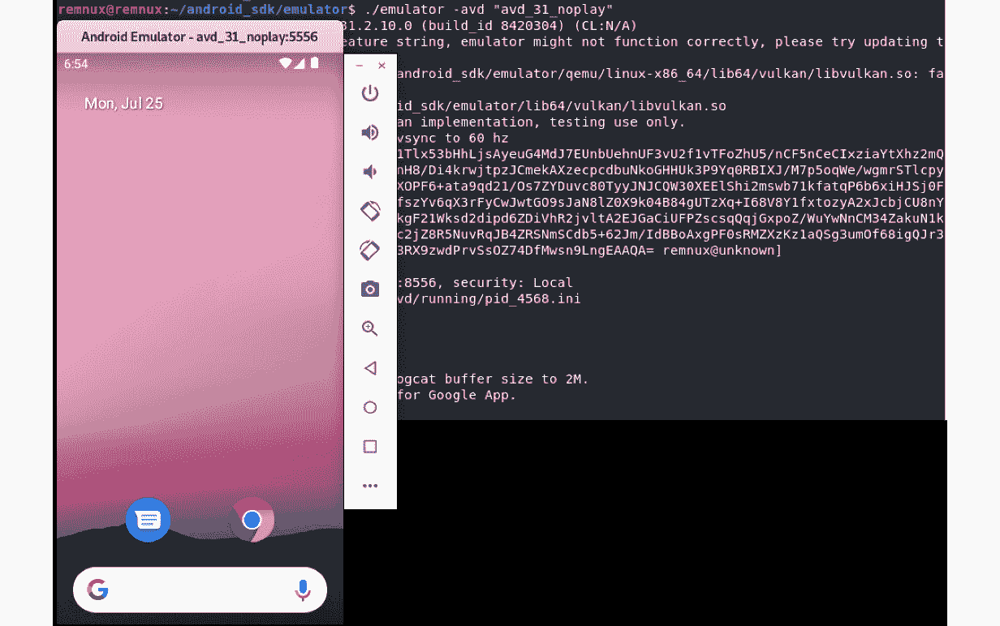

](img/Figure_13.14_B18500.jpg)

图 13.14 – 在虚拟机上运行 Android 模拟器

模拟器还允许我们创建和恢复包含整个模拟设备状态的快照。

+   **VMWare、VirtualBox 或 QEMU**：这些多功能解决方案可以用来运行 **Android-x86** 镜像，并以类似于在 Linux 虚拟机上进行的方式执行动态分析。请记住，Android-x86 通常比最新的 Android 版本滞后几个版本：

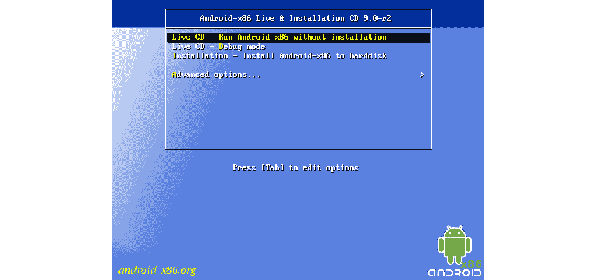

](img/Figure_13.15_B18500.jpg)

图 13.15 – 在虚拟机上运行 Android-x86

获取 Android 系统访问权限的其他方式包括基于云的**Genymotion**和基于容器的**anbox**解决方案。

一旦我们有了运行 Android 程序的环境，就需要调试器以受控的方式执行它。

### 调试器

一旦目标应用程序被反编译回 Java 代码，其部分代码可以像在 IDE 中调试普通源代码一样进行调试，例如 Android Studio。如果使用物理设备而不是模拟器，别忘了启用 USB 调试。此外，代码应在其构建配置中包含 `debuggable true` 选项。

有时，调试原生的 Dalvik 指令或整个应用程序是必要的。幸运的是，有一些工具可以简化这一过程。其中值得特别关注的是 **smalidea**。它是 IntelliJ IDEA（或基于它的 Android Studio）的插件，允许逐步执行分析过的代码。这个项目属于 Smali 作者，并且可以与相应的汇编器和反汇编器工具一起找到。

此外，Android 还提供了调试原生代码的工具。以下是如何开始附加的说明：

+   首先，获取 Android NDK，以便获得预构建的 `lldb-server`，以及 `lldb` 工具（过去曾使用 `gdbserver` 和 `gdb` 工具）。

+   然后，将 `lldb-server` 可执行文件推送到设备上，例如推送到 `/data/local/tmp` 目录，并使其可执行：

    ```
    adb push lldb-server /data/local/tmp
    adb shell chmod +x /data/local/tmp/lldb-server
    ```

+   设置端口转发：

    ```
    adb forward tcp:<host_port> tcp:<device_port>
    ```

现在，我们有两个选择：使用 `lldb-server` 在 `gdbserver` 模式下，或者使用 `platform` 模式。让我们提供两个例子的说明。

使用 `gdbserver` 模式涉及以下操作：

+   在 Android 设备上启动调试器服务器——感兴趣的示例也应复制到那里：

    ```
    adb shell /data/local/tmp/lldb-server g :<device_port> <sample_path_on_device>
    ```

+   在主机上启动`lldb`，并通过转发端口连接到设备上运行的调试器服务器：

    ```
    gdb-remote 127.0.0.1:<host_port>
    ```

使用`platform`模式涉及以下内容：

+   在 Android 设备上启动调试器服务器——无需将示例复制到那里：

    ```
    adb shell /data/local/tmp/lldb-server p --listen "*.<device_port>" --server --gdbserver-port <any_other_forwarded_port>
    ```

重要提示

在这里，我们必须提供`--gdbserver-port`参数，否则`lldb`稍后将无法将示例从主机复制到 Android 设备。需要额外的`adb forward`命令来转发此辅助端口。

+   在主机上启动`lldb`，通过转发端口连接到调试器服务器，然后启动示例——它会自动复制到 Android 设备上：

    ```
    platform select remote-linux
    target create <sample_path_on_host>
    platform connect connect://127.0.0.1:<host_port>
    process launch --stop-at-entry
    ```

以下是调试器服务器端成功连接的显示方式：

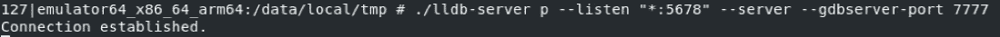

图 13.16 – 成功连接到在 Android 模拟器上运行的调试器服务器

此外，IDA 还附带了一组专有的 Android 调试器服务器，支持 x86 和 ARM 平台的 32 位和 64 位版本（`android_server`或`android_server64`）。

可以通过以下方式调试应用程序启动：

1.  进入`jdb`调试器进行附加。

1.  从启动器或控制台启动应用程序，等待其加载。

1.  附加调试器如`lldb`，设置所需的断点，然后继续执行。

1.  附加`jdb`调试器以让应用程序运行：

    ```
    adb forward tcp:<port> jdwp:<app_pid>
    jdb -attach localhost:<port>
    ```

现在，让我们讨论行为分析。

## 行为分析与跟踪

与许多其他平台一样，**fsmon**工具可用于监控 Android 上的文件操作。以下是它用于检测新文件创建的示例：

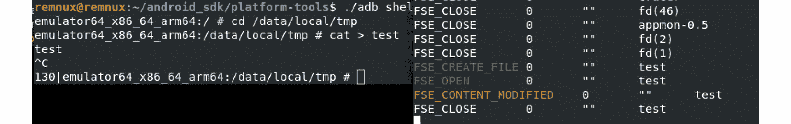

图 13.17 – 在 Android 模拟器上测试 fsmon，通过记录测试文件创建

就 API 而言，**AppMon**解决方案包括一组组件，用于拦截和操作 API 调用。它基于**Frida**项目，后者还提供了自己的多功能工具，如**frida-trace**（与**frida-server**协同工作）。另一个基于 Frida 的工具是**Objection**，它提供了多种选项，包括各种与内存相关的任务、堆操作以及执行自定义脚本。

对于本地程序，还可以使用标准的`strace`工具监控系统调用。如以下截图所示，其界面与 Linux 系统上的界面相同：

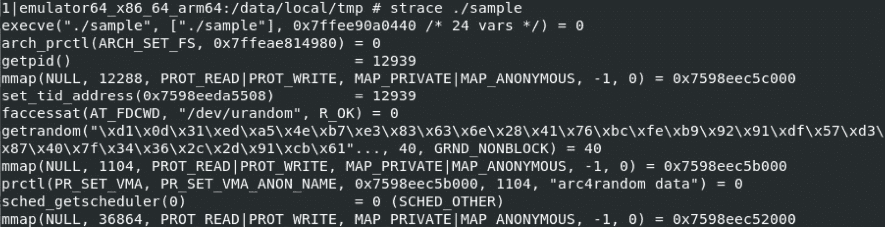

图 13.18 – 在 Android 模拟器上使用 strace 进行行为分析

说到记录网络流量，标准的 `tcpdump` 工具可以在设备上运行，用于此目的，通常是最容易使用的解决方案。Wireshark 的开发者还提供了一种名为 **androiddump** 的工具，用于在 Android 设备上提供捕获接口（通常需要单独构建）。此外，只要恶意样本被反编译，还可以嵌入各种库来拦截 API 调用，例如，**AndroidSnooper** 用于拦截 HTTP 流量。

一旦我们知道可以用于分析的工具，接下来就可以总结分析工作流。

## 分析工作流

这里是一个工作流示例，描述如何执行 Android 样本分析：

1.  `boot.oat` 文件。

1.  `Application` 的子类来自 `<application>` 元素的 `android:name` 属性（如果存在）。

1.  **反编译或反汇编**：尝试获取反编译的源代码总是有意义的，因为通常它更容易阅读并进行动态分析，包括必要时进行修改。如果反编译无法成功，并且预计会有某些反反编译技术，那么可以进行反汇编，从而修改篡改逻辑。ELF 二进制文件中的原生代码可以像 *第十一章* 中描述的那样进行处理，*剖析 Linux 和物联网恶意软件*。

1.  主要活动的 `onCreate` 方法，以及清单中之前提到的可选 `Application` 子类，因为应用程序执行在这里开始。

1.  **去混淆和解密**：如果已确认样本经过混淆，首先值得尝试弄清楚它是否是已知的 Java 解决方案，是否存在任何现成的去混淆工具。如果没有，那么通用方法重命名将会有所帮助。有多种工具可以做到这一点；请参考 *第九章*，*反向工程字节码语言 – .NET、Java 等*。

1.  **行为分析**：执行样本并启用你选择的行为分析工具，可能有助于快速了解潜在功能。如果实现了模拟器检测技术，通常可以很容易地在代码中识别出来，并修改样本以排除这些检测。

1.  **调试**：有时候，很难理解某些功能块，特别是那些恶意软件与操作系统紧密交互的部分。在这种情况下，可能需要通过适当的逐步调试来加速分析过程。始终使用支持快照创建的模拟器，这样就可以回溯并根据需要多次快速重现相同的情况。

显然，每个案例都是独特的，具体的行动选择及其顺序可能会根据情况有所不同。恶意软件分析也是一门艺术，通常需要一定的创造力，以便迅速达成分析结果。

# 总结

在这一章中，我们学习了 Android 内部最重要的方面，涵盖了不同版本中实现的各种运行时环境。此外，我们还熟悉了相关的文件格式，并了解了字节码指令的语法。

然后，我们更深入地探索了现代移动恶意软件的世界，了解了它的不同类型及相关行为。我们还学习了攻击者如何绕过 Android 安全机制以实现他们的目标。最后，我们了解了各种逆向工程工具，旨在促进静态和动态分析，并建立了如何以及何时使用这些工具的指导方针。

拥有这些知识后，你可以更好地追踪试图渗透 Android 设备的威胁行为者，并及时减轻风险。此外，获得的技能可以在事件响应过程中使用，以正确理解攻击的逻辑，从而提高整体安全态势。

这是本书的最后一章——希望你喜欢！接下来的步骤，我们建议将你的新知识付诸实践，分析各种类型的恶意软件，并与社区分享你的结果。恶意软件分析是一个永无止境的旅程。我们真心希望本书能帮助许多新手和经验丰富的工程师更高效地分析现代及未来的威胁，并最终使世界变得更安全。
