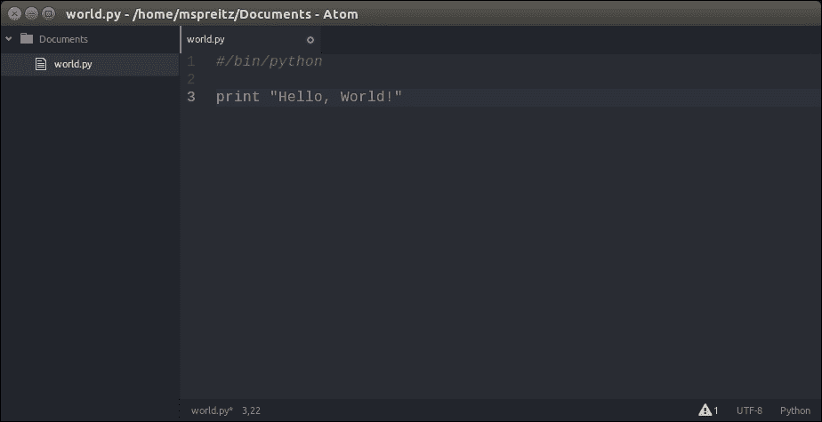

# 第一章：搭建实验室并介绍 Python ctypes

**网络安全**和**数字取证**是两个日益重要的话题。尤其是数字取证，它变得越来越重要，不仅在执法调查中扮演着重要角色，在事件响应领域也越来越关键。在所有前述的调查中，了解安全漏洞的根本原因、系统故障或犯罪行为至关重要。数字取证在克服这些挑战中起着关键作用。

在本书中，我们将教你如何搭建自己的实验室，并借助 Python 进行深入的数字取证调查，这些调查涉及多个平台和系统。我们将从常见的 Windows 和 Linux 桌面机器开始，然后进阶到云平台和虚拟化平台，最终涉及到手机。我们不仅会展示如何检查静态数据或传输中的数据，还将深入探讨易失性内存。

Python 提供了一个出色的开发平台，适合构建自己的调查工具，因为它简化了复杂性、提高了效率、拥有大量的第三方库，并且易于阅读和编写。在阅读本书的过程中，你不仅会学习如何使用最常见的 Python 库和扩展来分析证据，还会学到如何编写自己的脚本和辅助工具，以便在需要分析大量证据的案件或事件中更加高效。

让我们通过搭建实验室环境来开始掌握 Python 取证的旅程，接着简要介绍 Python ctypes。

如果你已经使用过 Python **ctypes**并且有一个可用的实验室环境，可以跳过第一章，直接开始阅读其他章节。第一章之后，其他章节相对独立，可以按任意顺序阅读。

# 搭建实验室

作为我们脚本和调查的基础，我们需要一个全面且强大的实验室环境，能够处理大量不同类型和结构的文件，并支持与移动设备的连接。为了实现这个目标，我们将使用最新的 Ubuntu LTS 版本 14.04.2，并将其安装在虚拟机（VM）中。在接下来的章节中，我们将解释虚拟机的设置，并介绍 Python **virtualenv**，我们将用它来建立我们的工作环境。

## Ubuntu

为了在类似的实验室环境中工作，我们建议你从[`www.ubuntu.com/download/desktop/`](http://www.ubuntu.com/download/desktop/)下载最新的 Ubuntu LTS 桌面版，最好是 32 位版本。该发行版提供了一个易于使用的界面，并且已经安装并预配置了 Python 2.7.6 环境。在本书中，我们将使用 Python 2.7.x，而不是更新的 3.x 版本。本书中的一些示例和案例研究将依赖于已经包含在 Ubuntu 发行版中的工具或库。当本书的某一章节或部分需要第三方软件包或库时，我们会提供如何在**virtualenv**（该环境的设置将在下一节中解释）或在 Ubuntu 上安装它的额外信息。

为了更好的系统性能，我们建议用于实验室的虚拟机至少配备 4 GB 的临时内存和约 40 GB 的存储空间。



图 1：Atom 编辑器

要编写你的第一个 Python 脚本，你可以使用简单的编辑器，如**vi**，或是功能强大但杂乱的集成开发环境（IDE），如**eclipse**。作为一个非常强大的替代方案，我们建议你使用**atom**，一个非常简洁但高度可定制的编辑器，您可以从[`atom.io/`](https://atom.io/)免费下载。

## Python 虚拟环境（virtualenv）

根据官方的 Python 文档，虚拟环境是通过为不同的项目创建虚拟 Python 环境来将它们所需的依赖项存储在不同的位置。它解决了“项目 X 依赖于 1.x 版本，而项目 Y 需要 4.x 版本”的困境，并保持你的全局 site-packages 目录干净且易于管理。

这也是我们在接下来的章节中使用的方式，以确保所有读者都能拥有统一的环境，并避免出现兼容性问题。首先，我们需要安装**virtualenv**包。可以通过以下命令完成安装：

```
user@lab:~$ pip install virtualenv

```

现在我们将在用户的主目录下创建一个文件夹，用于我们的虚拟 Python 环境。这个目录将包含可执行的 Python 文件和 pip 库的副本，后者可以用于在环境中安装其他软件包。虚拟环境的名称（在我们的例子中为**labenv**）可以由你选择。我们可以通过执行以下命令来创建我们的虚拟实验室环境：

```
user@lab:~$ virtualenv labenv
New python executable in labenv/bin/python
Installing setuptools, pip...done.

```

要开始使用新的实验室环境，首先需要激活它。可以通过以下方式进行激活：

```
user@lab:~$ source labenv/bin/activate
(labenv)user@lab:~$

```

现在，你可以看到命令提示符以我们激活的虚拟环境名称开始。从现在起，你使用 pip 安装的任何软件包将被放置在**labenv**文件夹中，与底层 Ubuntu 中的全局 Python 安装隔离。

在本书中，我们将使用这个虚拟 Python 环境，并不时地在其中安装新包和库。因此，每次你尝试回顾示例时，记得或者挑战自己在运行脚本之前切换到 **labenv** 环境。

如果你目前已经完成了虚拟环境中的工作，并且想返回到你的“正常” Python 环境，可以通过执行以下命令来停用虚拟环境：

```
(labenv)user@lab:~$ deactivate
user@lab:~$

```

这会将你带回系统默认的 Python 解释器，并保留其所有已安装的库和依赖项。

如果你在多个虚拟机或物理机上进行调查，虚拟环境可以帮助你保持所有工作站的库和包同步。为了确保你的环境一致，最好“冻结”当前环境包的状态。为此，只需运行：

```
(labenv)user@lab:~$ pip freeze > requirenments.txt

```

这将创建一个 `requirements.txt` 文件，文件中包含当前环境中所有包及其各自版本的简单列表。如果你想在另一台机器上安装相同版本的相同包，只需将 `requirements.txt` 文件复制到目标机器，创建如前所述的 **labenv** 环境并执行以下命令：

```
(labenv)user@lab:~$ pip install -r requirements.txt

```

现在，你将在所有机器上拥有一致的 Python 环境，无需担心不同的库版本或其他依赖项。

在我们创建了带有专用实验室环境的 Ubuntu 虚拟机后，我们几乎准备好开始第一次取证分析。但在此之前，我们需要更多关于有用的 Python 库和背景知识。因此，我们将从下面的 Python **ctypes** 介绍开始。

# Python ctypes 介绍

根据官方 Python 文档，**ctypes** 是一个外部函数库，提供 C 兼容的数据类型，并允许调用 DLL 或共享库中的函数。外部函数库意味着 Python 代码可以仅使用 Python 调用 C 函数，而无需特殊或定制的扩展。

该模块是 Python 开发者可以使用的最强大的库之一。**ctypes** 库不仅可以用于调用动态链接库中的函数（如前所述），还可以用于低级别的内存操作。了解如何使用 **ctypes** 库的基础非常重要，因为它将在本书的许多示例和实际案例中使用。

在接下来的章节中，我们将介绍一些 Python **ctypes** 的基本特性以及如何使用它们。

## 使用动态链接库

Python 的**ctypes**导出了`cdll`和 Windows 上的`windll`或`oledll`对象，用于加载请求的动态链接库。动态链接库是一个在运行时与可执行主进程链接的已编译二进制文件。在 Windows 平台上，这些二进制文件被称为**动态链接库**（**DLL**），在 Linux 上，则称为**共享对象**（**SO**）。你可以通过将这些链接库作为`cdll`、`windll`或`oledll`对象的属性来加载它们。现在，我们将演示一个简短的例子，展示如何在 Windows 和 Linux 上直接通过`time`函数获取当前时间（该函数位于`libc`库中，这个库定义了系统调用和其他基本设施，如`open`、`printf`或`exit`）。

请注意，在 Windows 的情况下，`msvcrt`是包含大多数标准 C 函数的 MS 标准 C 库，并使用`cdecl`调用约定（在 Linux 系统上，相似的库是`libc.so.6`）：

```
C:\Users\Admin>python

>>> from ctypes import *
>>> libc = cdll.msvcrt
>>> print libc.time(None)
1428180920

```

Windows 会自动附加常见的`.dll`文件后缀。在 Linux 上，必须指定文件名，包括扩展名，以加载所选的库。可以使用 DLL 加载器的`LoadLibrary()`方法，或者通过调用构造函数创建`CDLL`实例来加载库，如下代码所示：

```
(labenv)user@lab:~$ python

>>> from ctypes import *
>>> libc = CDLL("libc.so.6")
>>> print libc.time(None)
1428180920

```

如这两个示例所示，调用动态库并使用导出的函数非常简单。你将在整本书中多次使用这种技术，因此理解它的工作原理非常重要。

## C 数据类型

详细查看前一部分的两个示例时，你会发现我们在动态链接的 C 库中使用了`None`作为其中一个参数。这是可能的，因为`None`、`integers`、`longs`、`byte strings`和`unicode strings`是可以直接作为这些函数调用参数使用的本地 Python 对象。`None`被当作 C 语言的`NULL 指针`，`byte strings`和`unicode strings`作为指向包含数据的内存块的指针（`char *`或`wchar_t *`）传递。Python 的`integers`和`longs`作为平台的默认 C 语言`int 类型`传递，它们的值会被掩码以适应 C 类型。Python 类型及其对应的 ctype 类型的完整概览可以见于*表 1*：

| ctypes 类型 | C 类型 | Python 类型 |
| --- | --- | --- |
| c_bool ([`docs.python.org/2/library/ctypes.html#ctypes.c_bool`](https://docs.python.org/2/library/ctypes.html#ctypes.c_bool)) | _Bool | 布尔值（1） |
| c_char ([`docs.python.org/2/library/ctypes.html#ctypes.c_char`](https://docs.python.org/2/library/ctypes.html#ctypes.c_char)) | char | 1 个字符的字符串 |
| c_wchar ([`docs.python.org/2/library/ctypes.html#ctypes.c_wchar`](https://docs.python.org/2/library/ctypes.html#ctypes.c_wchar)) | wchar_t | 1 个字符的 Unicode 字符串 |
| c_byte ([`docs.python.org/2/library/ctypes.html#ctypes.c_byte`](https://docs.python.org/2/library/ctypes.html#ctypes.c_byte)) | 字符型 | int/long |
| c_ubyte ([`docs.python.org/2/library/ctypes.html#ctypes.c_ubyte`](https://docs.python.org/2/library/ctypes.html#ctypes.c_ubyte)) | 无符号字符型 | int/long |
| c_short ([`docs.python.org/2/library/ctypes.html#ctypes.c_short`](https://docs.python.org/2/library/ctypes.html#ctypes.c_short)) | 短整型 | int/long |
| c_ushort ([`docs.python.org/2/library/ctypes.html#ctypes.c_ushort`](https://docs.python.org/2/library/ctypes.html#ctypes.c_ushort)) | 无符号短整型 | int/long |
| c_int ([`docs.python.org/2/library/ctypes.html#ctypes.c_int`](https://docs.python.org/2/library/ctypes.html#ctypes.c_int)) | 整型 | int/long |
| c_uint ([`docs.python.org/2/library/ctypes.html#ctypes.c_uint`](https://docs.python.org/2/library/ctypes.html#ctypes.c_uint)) | 无符号整型 | int/long |
| c_long ([`docs.python.org/2/library/ctypes.html#ctypes.c_long`](https://docs.python.org/2/library/ctypes.html#ctypes.c_long)) | 长整型 | int/long |
| c_ulong ([`docs.python.org/2/library/ctypes.html#ctypes.c_ulong`](https://docs.python.org/2/library/ctypes.html#ctypes.c_ulong)) | 无符号长整型 | int/long |
| c_longlong ([`docs.python.org/2/library/ctypes.html#ctypes.c_longlong`](https://docs.python.org/2/library/ctypes.html#ctypes.c_longlong)) | __int64 或长长整型 | int/long |
| c_ulonglong ([`docs.python.org/2/library/ctypes.html#ctypes.c_ulonglong`](https://docs.python.org/2/library/ctypes.html#ctypes.c_ulonglong)) | 无符号 __int64 或无符号长长整型 | int/long |
| c_float ([`docs.python.org/2/library/ctypes.html#ctypes.c_float`](https://docs.python.org/2/library/ctypes.html#ctypes.c_float)) | 浮动型 | 浮动型 |
| c_double ([`docs.python.org/2/library/ctypes.html#ctypes.c_double`](https://docs.python.org/2/library/ctypes.html#ctypes.c_double)) | 双精度型 | 浮动型 |
| c_longdouble ([`docs.python.org/2/library/ctypes.html#ctypes.c_longdouble`](https://docs.python.org/2/library/ctypes.html#ctypes.c_longdouble)) | 长双精度 | 浮动型 |
| c_char_p ([`docs.python.org/2/library/ctypes.html#ctypes.c_char_p`](https://docs.python.org/2/library/ctypes.html#ctypes.c_char_p)) | 字符串 *（以 NUL 结尾） | 字符串或 None |
| c_wchar_p ([`docs.python.org/2/library/ctypes.html#ctypes.c_wchar_p`](https://docs.python.org/2/library/ctypes.html#ctypes.c_wchar_p)) | wchar_t *（以 NUL 结尾） | unicode 或 None |
| c_void_p ([`docs.python.org/2/library/ctypes.html#ctypes.c_void_p`](https://docs.python.org/2/library/ctypes.html#ctypes.c_void_p)) | void * | int/long 或 None |

> 表 1：基本数据类型

这张表格非常有用，因为除 `整数`、`字符串` 和 `unicode 字符串` 外，所有 Python 类型都必须包装在相应的 ctypes 类型中，以便它们可以转换为链接库中所需的 C 数据类型，而不会抛出 `TypeError` 异常，如以下代码所示：

```
(labenv)user@lab:~$ python

>>> from ctypes import *
>>> libc = CDLL("libc.so.6")
>>> printf = libc.printf

>>> printf("An int %d, a double %f\n", 4711, 47.11)
Traceback (most recent call last):
 File "<stdin>", line 1, in <module>
ctypes.ArgumentError: argument 3: <type 'exceptions.TypeError'>: Don't know how to convert parameter 3

>>> printf("An int %d, a double %f\n", 4711, c_double(47.11))
An int 4711, a double 47.110000

```

### 定义联合体和结构体

**联合体**和**结构体**是重要的数据类型，因为它们在 Linux 上的 `libc` 以及 Microsoft Win32 API 中经常被使用。

联合体只是一个变量的集合，这些变量可以是相同或不同的数据类型，所有成员共享相同的内存位置。通过这种方式存储变量，联合体允许你以不同的类型指定相同的值。对于接下来的示例，我们将从交互式 Python shell 切换到 Ubuntu 实验环境中的 atom 编辑器。你只需要打开 atom 编辑器，输入以下代码，并将其保存为 `new_evidence.py`：

```
from ctypes import *

class case(Union):
        _fields_ = [
        ("evidence_int", c_int),
        ("evidence_long", c_long),
        ("evidence_char", c_char * 4)
        ]

value = raw_input("Enter new evidence number:")
new_evidence = case(int(value))
print "Evidence number as a int: %i" % new_evidence.evidence_int
print "Evidence number as a long: %ld" % new_evidence.evidence_long
print "Evidence number as a char: %s" % new_evidence.evidence_char
```

如果你为 `evidence` 联合体的成员变量 `evidence_int` 赋值 `42`，你就可以使用 `evidence_char` 成员来显示该数字的字符表示，如下例所示：

```
(labenv)user@lab:~$ python new_evidence.py

Enter new evidence number:42

Evidence number as a long: 42
Evidence number as a int: 42
Evidence number as a char: *

```

正如你在前面的示例中看到的，通过为联合体分配一个值，你可以得到该值的三种不同表示方式。对于 `int` 和 `long`，显示的输出是显而易见的，但对于 `evidence_char` 变量来说，可能会有点令人困惑。在这种情况下，`'*'` 是 ASCII 字符，其值等于十进制的 `42`。`evidence_char` 成员变量是如何在 ctypes 中定义 `array` 的一个很好例子。在 ctypes 中，数组是通过将类型乘以你想要在数组中分配的元素数量来定义的。在这个例子中，为成员变量 `evidence_char` 定义了一个四元素的字符数组。

结构体与联合体非常相似，但成员之间不共享同一内存位置。你可以使用点符号访问结构体中的任何成员变量，比如 `case.name`。这将访问 `case` 结构体中的 `name` 变量。以下是一个非常简短的示例，演示如何创建一个包含三个成员的 `结构体`（或称 **struct**）：`name`、`number` 和 `investigator_name`，以便通过点符号访问它们：

```
from ctypes import *

class case(Structure):
        _fields_ = [
        ("name", c_char * 16),
        ("number", c_int),
        ("investigator_name", c_char * 8)
        ]
```

### 提示

**下载示例代码**

你可以从你在 [`www.packtpub.com`](http://www.packtpub.com) 的帐户下载所有你购买的 Packt Publishing 书籍的示例代码文件。如果你是在其他地方购买的这本书，你可以访问 [`www.packtpub.com/support`](http://www.packtpub.com/support) 并注册，让文件直接通过电子邮件发送给你。

# 概述

在第一章，我们创建了实验环境：一个运行**Ubuntu 14.04.2 LTS**的虚拟机。这个步骤非常重要，因为你现在可以在处理真实证据之前创建快照，并且在调查完成后可以恢复到一个干净的机器状态。这尤其在处理被破坏的系统备份时非常有用，这样你可以确保在处理不同的案例时系统是干净的。

在本章的第二部分，我们演示了如何使用 Python 的**虚拟环境（virtualenv）**，这些环境将在全书中被使用和扩展。

在本章的最后一节，我们向你介绍了 Python 的**ctypes**，这是一个非常强大的库，供 Python 开发者使用。通过这些**ctypes**，你不仅能够调用动态链接库中的函数（如微软 Win32 API 或常见的 Linux 共享对象），还可以用于低级内存操作。

完成本章后，你将创建一个基本环境，供本书后续章节使用，同时你也将理解 Python **ctypes**的基础知识，这在接下来的章节中将非常有帮助。
