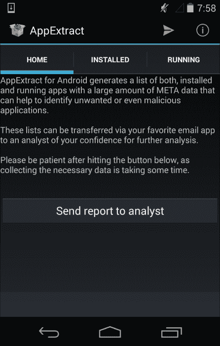

# 第二章。法医算法

法医算法是法医调查员的基本工具。无论具体实现如何，这些算法描述了法医程序的细节。在本章的第一节中，我们将介绍用于法医调查的不同算法，包括它们的优缺点。

# 算法

在本节中，我们将描述**MD5**、**SHA256**和**SSDEEP**之间的主要区别——这些是法医调查中最常用的算法。我们将解释这些算法的使用场景，以及它们背后的局限性和威胁。这将帮助你理解为什么使用 SHA256 比使用 MD5 更好，以及在什么情况下 SSDEEP 可以帮助你进行调查。

在深入探讨不同的哈希函数之前，我们将简要总结一下什么是加密哈希函数。

**哈希函数**是一个将*任意大量*数据映射到一个*固定长度*值的函数。哈希函数确保相同的输入始终产生相同的输出，这个输出称为哈希值。因此，哈希值是特定数据的特征。

**加密哈希函数**是一个被认为在实践中几乎不可能被反转的哈希函数。这意味着，不可能通过除非尝试所有可能的输入值（即*暴力破解*）以外的任何其他方式创建具有预定义哈希值的输入数据。因此，这类算法被称为*单向*加密算法。

理想的加密哈希函数有四个主要特性，具体如下：

1.  必须能够轻松地计算给定输入的哈希值。

1.  必须不可行从哈希值生成原始输入。

1.  必须不可行在不改变哈希值的情况下修改输入。

1.  必须不可行找到两个不同的输入，它们具有相同的哈希值（**抗碰撞**）。

在理想情况下，如果你对给定的输入创建哈希并且只更改了一个比特，那么新计算出的哈希将完全不同，如下所示：

```
user@lab:~$ echo -n This is a test message | md5sum
fafb00f5732ab283681e124bf8747ed1

user@lab:~$ echo -n This is A test message | md5sum
aafb38820e0a3788eb41e9f5805e088e

```

如果满足前面提到的所有特性，则该算法是加密上正确的哈希函数，可以用来比较文件等，以证明它们在分析或被攻击者篡改时没有被修改。

## MD5

MD5 消息摘要算法曾是最常用（并且仍然广泛使用）的加密哈希函数，它产生一个 128 位（16 字节）的哈希值，通常以 32 位十六进制数字的文本格式表示（如前面的示例所示）。这种消息摘要已广泛应用于各种加密应用中，并常用于法医调查中验证数据完整性。该算法由 Ronald Rivest 于 1991 年设计，并自那时以来被广泛使用。

MD5 的一个重要优点是计算速度快且生成的哈希值较小。当您需要在法医调查中存储数千个这些哈希时，小哈希是一个主要关注点。想象一下普通个人电脑硬盘上可能会有多少文件。如果您需要计算每个文件的哈希并将其存储在数据库中，那么每个计算出的哈希长度为 16 字节或 32 字节将产生巨大差异。

如今，MD5 的主要缺点是它不再被认为是抗碰撞的。这意味着可以从两个不同的输入计算出相同的哈希。请记住，无法仅通过比较调查中不同阶段的文件的 MD5 哈希来保证文件未被修改。目前可以非常快速地创建碰撞（参见 [`www.win.tue.nl/hashclash/On%20Collisions%20for%20MD5%20-%20M.M.J.%20Stevens.pdf`](http://www.win.tue.nl/hashclash/On%20Collisions%20for%20MD5%20-%20M.M.J.%20Stevens.pdf)），但仍然很难修改文件，使其成为原文件的恶意版本，并保持原始文件的 MD5 哈希。

非常著名的密码学家布鲁斯·施奈尔曾经写道 ([`www.schneier.com/blog/archives/2008/12/forging_ssl_cer.html`](https://www.schneier.com/blog/archives/2008/12/forging_ssl_cer.html))：

> *"我们早就知道 MD5 是一种已经被攻破的哈希函数"，"没有人应该再使用 MD5 了"。*

我们不会走得那么远（特别是因为许多工具和服务仍在使用 MD5），但在关键情况下，您应尝试切换到 SHA256 或至少使用不同哈希函数来双重检查您的结果。在关键时刻，建议使用多种哈希算法来证明数据的完整性。

## SHA256

SHA-2 是由美国国家安全局（NSA）设计的一组密码哈希函数，代表安全哈希算法第二代。它于 2001 年由美国国家标准与技术研究院（NIST）发布为美国联邦标准（FIPS）。SHA-2 家族包括几种哈希函数，其摘要（哈希值）长度介于 224 位到 512 位之间。SHA256 和 SHA512 是使用 32 位和 64 位字计算的最常见版本的 SHA-2 哈希函数。

尽管这些算法计算速度较慢且计算出的哈希值较大（与 MD5 相比），但它们应该是在法医调查中用于完整性检查的首选算法。如今，SHA256 是广泛使用的密码哈希函数，仍然具有抗碰撞能力和完全可信任。

## SSDEEP

**MD5**、**SHA256** 和 **SSDEEP** 最大的区别在于 **SSDEEP** 并不被认为是一种 **密码哈希函数**，因为当输入变化一个比特时它只会略微改变。例如：

```
user@lab:~$ echo -n This is a test message | ssdeep
ssdeep,1.1--blocksize:hash:hash,filename
3:hMCEpFzA:hurs,"stdin"

user@lab:~$ echo -n This is A test message | ssdeep
ssdeep,1.1--blocksize:hash:hash,filename
3:hMCkrzA:hOrs,"stdin"

```

SSDEEP 软件包可以按照以下网址描述的步骤下载并安装：[`ssdeep.sourceforge.net/usage.html#install`](http://ssdeep.sourceforge.net/usage.html#install)

这种行为不是 SSDEEP 的弱点，而是该功能的一个主要优点。实际上，SSDEEP 是一个计算和匹配**上下文触发的分段哈希**（**CTPH**）值的程序。CTPH 是一种也被称为**模糊哈希**的技术，能够匹配具有同源性的输入。具有同源性的输入在给定的顺序中有相同的字节序列，中间则是完全不同的字节。这些字节之间的内容和长度可以不同。CTPH 最初基于*Andrew Tridgell 博士*的研究，由*Jesse Kornblum*进行了改进，并在 2006 年在 DFRWS 会议上以《使用上下文触发的分段哈希识别几乎相同的文件》为题发表；参见[`dfrws.org/2006/proceedings/12-Kornblum.pdf`](http://dfrws.org/2006/proceedings/12-Kornblum.pdf)。

SSDEEP 可以用来检查两个文件的相似性以及文件中差异所在的部分。这个功能通常用于检查移动设备上的两个不同应用是否具有共同的代码基础，如下所示：

```
user@lab:~$ ssdeep -b malware-sample01.apk > signature.txt

user@lab:~$ cat signature.txt
Ssdeep,1.1--blocksize:hash:hash,filename
49152:FTqSf4xGvFowvJxThCwSoVpzPb03++4zlpBFrnInZWk:JqSU4ldVVpDIcz3BFr8Z7,"malware-sample01.apk"

user@lab:~$ ssdeep –mb signature.txt malware-sample02.apk
malware-sample02.apk matches malware-sample01.apk (75)

```

在之前的示例中，你可以看到第二个样本与第一个样本非常相似。这些匹配表明潜在的源代码重用，或者至少表明 apk 文件中的大量文件是相同的。需要手动检查相关文件，才能确切知道代码或文件的哪些部分是相同的；然而，我们现在知道这两个文件是相似的。

# 支持链条证据的完整性

法医调查的结果可能对组织和个人产生严重影响。根据你的工作领域，你的调查可能成为法庭上的证据。

因此，法医证据的完整性不仅在收集证据时需要确保，而且在整个处理和分析过程中也要得到保证。通常，法医调查的第一步是收集证据。通常，这是通过对原始介质进行逐位复制来完成的。所有后续的分析工作都在这个法医副本上进行。

## 创建完整磁盘映像的哈希值

为了确保法医副本与原始介质完全相同，需要对介质和法医副本进行哈希值计算。这些哈希值必须匹配，以证明副本与原始数据完全相同。如今，至少使用两种不同的加密哈希算法已成为常见做法，以最小化哈希碰撞的风险，并增强整个过程对哈希碰撞攻击的防护能力。

使用 Linux，可以轻松地从驱动器或多个文件创建 MD5 和 SHA256 哈希。在下面的示例中，我们将计算两个文件的 MD5 值和 SHA256 值，以提供相同内容的证明：

```
user@lab:~$ md5sum /path/to/originalfile /path/to/forensic_copy_of_sdb.img

user@lab:~$ sha256sum /path/to/originalfile /path/to/forensic_copy_of_sdb.img

```

这种相同内容的证明是支持保全链的必要条件，即证明分析的数据与磁盘上的原始数据完全相同。术语**sdb**指的是连接到法医工作站的驱动器（在 Linux 中，**第二硬盘**被称为**sdb**）。为了进一步支持保全链，强烈建议在证据和法医工作站之间使用写保护设备，以避免任何意外修改证据。第二个参数表示证据的逐位副本的位置。命令输出原始硬盘和副本的哈希值。如果 MD5 值和 SHA256 值都匹配，那么副本可以被视为法医上有效的。

尽管前面示例中的方法有效，但它有一个很大的缺点——证据及其副本需要被读取两次以计算哈希值。如果硬盘是 1 TB 的大硬盘，这会使整体过程延长几个小时。

以下 Python 代码只读取一次数据，并将其输入到两个哈希计算中。因此，这个 Python 脚本的运行速度几乎是运行`md5sum`再运行`sha256sum`的两倍，并且产生与这些工具完全相同的哈希值：

```
#!/usr/bin/env python

import hashlib
import sys

def multi_hash(filename):
    """Calculates the md5 and sha256 hashes
       of the specified file and returns a list
       containing the hash sums as hex strings."""

    md5 = hashlib.md5()
    sha256 = hashlib.sha256()

    with open(filename, 'rb') as f:
        while True:
            buf = f.read(2**20)
            if not buf:
                break
            md5.update(buf)
            sha256.update(buf)

    return [md5.hexdigest(), sha256.hexdigest()]

if __name__ == '__main__':
    hashes = []
    print '---------- MD5 sums ----------'
    for filename in sys.argv[1:]:
        h = multi_hash(filename)
        hashes.append(h)
        print '%s  %s' % (h[0], filename)

    print '---------- SHA256 sums ----------'
    for i in range(len(hashes)):
        print '%s  %s' % (hashes[i][1], sys.argv[i+1])
```

在以下脚本调用中，我们计算了一些常见 Linux 工具的哈希值：

```
user@lab:~$ python multihash.py /bin/{bash,ls,sh}
---------- MD5 sums ----------
d79a947d06958e7826d15a5c78bfaa05  /bin/bash
fa97c59cc414e42d4e0e853ddf5b4745  /bin/ls
c01bc66da867d3e840814ec96a137aef  /bin/sh
---------- SHA256 sums ----------
cdbcb2ef76ae464ed0b22be346977355c650c5ccf61fef638308b8da60780bdd  /bin/bash
846ac0d6c40d942300de825dbb5d517130d8a0803d22115561dcd85efee9c26b  /bin/ls
e9a7e1fd86f5aadc23c459cb05067f49cd43038f06da0c1d9f67fbcd627d622c  /bin/sh

```

在法医报告中记录原始数据和法医副本的哈希值非常重要。独立方可以读取相同的证据并确认你分析的数据与证据中的数据完全一致。

## 创建目录树的哈希值

一旦完整的镜像被复制，其内容应该被索引，并为每个文件创建哈希值。借助先前定义的`multi_hash`函数和 Python 标准库，可以创建一个报告模板，其中包含所有文件的名称、大小和哈希值，如下所示：

```
#!/usr/bin/env python

from datetime import datetime
import os
from os.path import join, getsize
import sys
from multihash import multi_hash

def dir_report(base_path, reportfilename):
    """Creates a report containing file integrity information.

    base_path -- The directory with the files to index
    reportfilename -- The file to write the output to"""

    with open(reportfilename, 'w') as out:
        out.write("File integrity information\n\n")
        out.write("Base path:      %s\n" % base_path)
        out.write("Report created: %s\n\n" % datetime.now().isoformat())
        out.write('"SHA-256","MD5","FileName","FileSize"')
        out.write("\n")

        for root, dirs, files in os.walk(base_path):
            write_dir_stats(out, root, files)

        out.write("\n\n--- END OF REPORT ---\n")

def write_dir_stats(out, directory, files):
    """Writes status information on all specified files to the report.

    out -- open file handle of the report file
    directory -- the currently analyzed directory
    files -- list of files in that directory"""

    for name in files:
        fullname = join(directory, name)
        hashes = multi_hash(fullname)
        size = getsize(fullname)
        out.write('"%s","%s","%s",%d' % (hashes[1], hashes[0], fullname, size))
        out.write("\n")

if __name__ == '__main__':
    if len(sys.argv) < 3:
        print "Usage: %s reportfile basepath\n" % sys.argv[0]
        sys.exit(1)

    dir_report(sys.argv[2], sys.argv[1])
```

这个 Python 脚本可以生成一个目录树的完整性信息，包括文件大小、文件名和哈希值（SHA256、MD5）。以下是我们脚本目录中的一个示例调用：

```
user@lab:/home/user/dirhash $ python dirhash.py report.txt .
user@lab:/home/user/dirhash $ cat report.txt
File integrity information

Base path:      .
Report created: 2015-08-23T21:50:45.460940

"SHA-256","MD5","FileName","FileSize"
"a14f7e644d76e2e232e94fd720d35e59707a2543f01af4123abc46e8c10330cd","9c0d1f70fffe5c59a7700b2b9bfd50cc","./multihash.py",879
"a4168e4cc7f8db611b339f4f8a949fbb57ad893f02b9a65759c793d2c8b9b4aa","bcf5a41a403bb45974dd0ee331b1a0aa","./dirhash.py",1494
"e3b0c44298fc1c149afbf4c8996fb92427ae41e4649b934ca495991b7852b855","d41d8cd98f00b204e9800998ecf8427e","./report.txt",0
"03047d8a202b03dfc5a310a81fd8358f37c8ba97e2fff8a0e7822cf7f36b5c83","416699861031e0b0d7b6d24b3de946ef","./multihash.pyc",1131

--- END OF REPORT ---

```

然而，生成的报告文件本身没有任何完整性保护。建议对生成的报告进行签名，例如，使用**GnuPG**，如下所示：

```
user@lab:~$ gpg --clearsign report.txt

```

如果你从未使用过`gpg`，你需要先生成一个私钥，然后才能对文档进行签名。可以使用`gpg --gen-key`命令来完成这一步。有关 GnuPG 及其使用的更多详细信息，请参考[`www.gnupg.org/documentation`](https://www.gnupg.org/documentation)。这将生成一个额外的`report.txt.asc`文件，包含原始报告和数字签名。对该文件的任何后续修改都会使数字签名无效。

### 注意

这里描述的技术仅仅是如何支持证据链的示例。如果法医分析将用于法院，强烈建议寻求法律咨询，以了解您所在法域关于证据链的要求。

# 真实世界场景

本节将展示一些使用前述算法和技术来支持调查员的用例。对于本章，我们使用了两个非常常见且有趣的示例，**移动恶意软件**和**国家软件参考库**（**NSRL**）。

## 移动恶意软件

在本示例中，我们将检查安卓智能手机上已安装的应用程序，并与一个在线分析系统**Mobile-Sandbox**进行对比。Mobile-Sandbox 是一个提供免费安卓文件病毒检查或可疑行为检查的网站，[`www.mobilesandbox.org`](http://www.mobilesandbox.org)。它与**VirusTotal**相连接，VirusTotal 使用最多 56 种不同的杀毒产品和扫描引擎来检查用户的杀毒软件可能遗漏的病毒，或验证任何虚假阳性。此外，Mobile-Sandbox 使用自定义技术来检测可能具有恶意行为的应用程序。Mobile-Sandbox 背后的杀毒软件供应商、开发者和研究人员可以接收文件副本，以帮助改进他们的软件和技术。

在本示例中，我们将使用两个步骤成功地将已安装的应用程序与 Mobile-Sandbox 网络服务上已测试的应用程序进行比较。

第一步是获取设备上已安装应用程序的哈希值。这个步骤非常重要，因为这些值可以帮助识别应用程序，并将其与在线服务进行比对。在本示例中，我们将使用来自 Google Play 的一个应用程序，**AppExtract**（[`play.google.com/store/apps/details?id=de.mspreitz.appextract`](https://play.google.com/store/apps/details?id=de.mspreitz.appextract)）。获取这些值的法医正确方法可以参考第六章，*使用 Python 进行移动取证*。



AppExtract for Android 生成一份已安装和正在运行的应用程序列表，并附带大量元数据，帮助识别不需要的甚至恶意的应用程序。这些元数据包含应用程序包的 SHA256 哈希值、指示应用程序是由用户安装还是系统安装的标志，以及许多额外的数据，有助于判断应用程序是否为良性。这些列表可以通过您喜欢的邮件应用程序进行转发，供进一步分析。一旦收到包含生成列表的纯文本邮件，您只需将包含所有已安装应用程序的列表复制到 CSV 文件中。该文件可以用于自动化分析，或者在实验室环境中用**LibreOffice Calc**打开。您可以在下面看到当前版本的 Android Chrome 浏览器的元数据：

```
Type;App_Name;md5;TargetSdkVersion;Package_Name;Process_Name;APK_Location;Version_Code;Version_Name;Certificate_Info;Certificate_SN;InstallTime;LastModified

SystemApp;Chrome;4e4c56a8a7d8d6b1ec3e0149b3918656;21;com.android.chrome;com.android.chrome;/data/app/com.android.chrome-2.apk;2311109;42.0.2311.109;CN=Android, OU=Android, O=Google Inc., L=Mountain View, ST=California, C=US;14042372374541250701;unknown;unknown

```

第二步是将设备的哈希值（CSV 文件中的第三列）与 Mobile-Sandbox 数据库进行比较。可以使用以下脚本完成，我们将其保存为`get_infos_mobilesandbox.py`：

```
#!/usr/bin/env python

import sys, requests

# Authentication Parameters
# if you need an API key and user name please contact @m_spreitz
API_FORMAT = 'json'
API_USER = ''
API_KEY = ''

# parsing input parameters
if (len(sys.argv) < 3):
    print "Get infos to a specific Android app from the Mobile-Sandbox."
    print "Usage: %s requests [type (md5,sha256)] [value]" % sys.argv[0]
    sys.exit(0)

# building the payload
payload = {'format':API_FORMAT,
           'username':API_USER,
           'api_key':API_KEY,
           'searchType':str(sys.argv[1]),   # has to be md5 or sha256
           'searchValue':str(sys.argv[2])}

# submitting sample hash and getting meta data
print "--------------------------------"
r = requests.get("http://mobilesandbox.org/api/bot/queue/get_info/", params=payload)

# printing result and writing report file to disk
if not r.status_code == requests.codes.ok:
    print "query result: \033[91m" + r.text + "\033[0m"
else:
    for key, value in r.json().iteritems():
        print key + ": \033[94m" + str(value) + "\033[0m"
print "--------------------------------"
```

脚本可以如下所示使用：

```
(labenv)user@lab:~$ ./get_infos_mobilesandbox.py md5 4e4c56a8a7d8d6b1ec3e0149b3918656

--------------------------------
status: done
min_sdk_version: 0
package_name: com.android.chrome
apk_name: Chrome.apk
AV_detection_rate: 0 / 56
drebin_score: benign (1.38173)
sample_origin: user upload
android_build_version: Android 1.0
ssdeep: 196608:ddkkKqfC+ca8eE/jXQewwn5ux1aDn9PpvPBic6aQmAHQXPOo:dBKZaJYXQE5u3ajtpvpeaQm1
sha256: 79de1dc6af66e6830960d6f991cc3e416fd3ce63fb786db6954a3ccaa7f7323c
malware_family: ---
md5: 4e4c56a8a7d8d6b1ec3e0149b3918656
--------------------------------

```

利用这三个工具，可以快速检查移动设备上的应用程序是否可能被感染（请参阅响应中的突出部分），或者至少在应用程序之前未经测试时可以从何处开始手动调查。

## NSRL 查询

为了提高取证分析效率，重要的是筛选出属于已知软件且未被修改的任何文件。**国家软件参考库**（**NSRL**）维护多个已知内容的哈希值列表。NSRL 是美国国土安全部的一个项目，更多细节请参阅[`www.nsrl.nist.gov/`](http://www.nsrl.nist.gov/)。重要的是要理解，这些哈希值列表仅表明文件与提交给 NSRL 的版本相比未被修改。因此，在取证调查期间要分析的许多文件可能不在 NSRL 中列出。另一方面，即使列出的文件也可能被攻击者用作工具。例如，`psexec.exe` 这样的工具是微软提供的用于远程管理的程序，在 NSRL 中有列出。然而，攻击者可能将其用于恶意目的。

### 提示

**应该使用哪个 NSRL 列表？**

NSRL 包括几个哈希集合。建议首先使用*最小集*。这个集合每个文件只包含一个哈希值，这意味着只知道一个文件版本。

最小集可以在 NIST 主页免费下载。下载包括一个单独的 ZIP 文件，其中包含哈希列表和支持的软件产品列表作为最突出的内容。

这些哈希值存储在`NSRLFile.txt`文件中，每行一个文件哈希值，例如：

```
"3CACD2048DB88F4F2E863B6DE3B1FD197922B3F2","0BEA3F79A36B1F67B2CE0F595524C77C","C39B9F35","TWAIN.DLL",94784,14965,"358",""
```

此记录的字段如下：

+   使用 SHA-1 计算的文件哈希值，这是早期的 SHA-256 算法描述之前的前身。

+   使用 MD5 计算的文件哈希值。

+   文件的 CRC32 校验和。

+   文件名。

+   文件的字节大小。

+   产品代码，表示该文件所属的软件产品。`NSRLProd.txt` 文件包含所有产品的列表，可以用来查找产品代码。在前面的示例中，代码`14965`表示微软的 Picture It!。

+   此文件所在的操作系统。操作系统代码列表可以在`NSRLOS.txt`中找到。

+   一个指示符，用于指示该文件是否被视为正常（""）、恶意文件（"N"）或特殊文件（"S"）。尽管此标志是规范的一部分，当前 NSRL 最小集中的所有文件均设置为正常。

有关文件规范的更多细节可以在 [`www.nsrl.nist.gov/Documents/Data-Formats-of-the-NSRL-Reference-Data-Set-16.pdf`](http://www.nsrl.nist.gov/Documents/Data-Formats-of-the-NSRL-Reference-Data-Set-16.pdf) 中找到。

### 下载并安装 nsrlsvr

当前，NSRL 数据库包含超过 4000 万个不同的哈希值，属于最小集合。即使在最新的工作站上，基于文本的搜索也需要几分钟。因此，进行高效的数据库查找至关重要。Rob Hanson 的工具 **nsrlsvr** 提供了一个支持高效查找的服务器。可以在 [`rjhansen.github.io/nsrlsvr/`](https://rjhansen.github.io/nsrlsvr/) 上找到该工具。

### 注意

互联网上也有公共的 NSRL 服务器可供使用。这些服务器通常是 *按现状* 提供的。但是，若要测试较小的哈希集，可以使用 Robert Hanson 的公共服务器 `nsrllookup.com`，然后继续阅读下一部分内容。

要在 Linux 系统上编译软件，必须安装 automake、autoconf 和 c++ 编译工具。包括所有要求的详细安装说明请参见 `INSTALL` 文件。

### 提示

**在非默认目录中安装 nsrlsvr**

nsrlsvr 的安装目录可以通过调用 `configure` 脚本并使用 `--prefix` 参数来更改。该参数的值表示目标目录。如果指定了用户可写目录，则安装不需要 root 权限，并且可以通过删除安装目录完全移除。

nsrlsrv 会维护一个包含所有 NSRL 数据库 MD5 哈希值的副本。因此，必须初始化哈希数据库。所需的 nsrlupdate 工具随 nsrlsrv 提供。

```
user@lab:~$ nsrlupdate your/path/to/NSRLFile.txt

```

在数据库完全填充后，可以通过简单地调用以下命令启动服务器：

```
user@lab:~$ nsrlsvr

```

如果一切安装正确，此命令将无输出并且服务器开始监听 TCP 端口 9120 以接收请求。

### 使用 Python 编写 nsrlsvr 客户端

还有一个用于使用 nsrlsvr 的客户端工具，名为 **nsrllookup**。该客户端是用 C++ 编写的，并可在 [`rjhansen.github.io/nsrllookup/`](https://rjhansen.github.io/nsrllookup/) 上获取。然而，也可以很容易地在原生 Python 中实现与 nsrlsvr 交互的客户端。本节将解释该协议并展示一个客户端的示例实现。

nsrlsvr 在其网络端口 9120 上实现了一个面向文本的协议。每个命令由一行文本组成，并以换行符（CR LF）结束。支持以下命令：

+   **版本: 2.0**：版本命令用于 nsrl 客户端与 nsrlsvr 之间的初步握手。客户端应在冒号后提供其版本号。服务器始终会响应 `OK` 并换行。

+   **query** **5CB360EF546633691912089DB24A82EE 908A54EB629F410C647A573F91E80775 BFDD76C4DD6F8C0C2474215AD5E193CF**：查询命令用于实际从服务器查询 NSRL 数据库。关键字 **query** 后跟一个或多个 MD5 哈希值。服务器将返回 `OK`，后跟一串零和一。`1` 表示该 MD5 哈希值在数据库中找到，而 `0` 表示没有匹配。例如，之前显示的查询将导致以下结果：

    ```
    OK 101

    ```

    这意味着第一个和最后一个 MD5 哈希值在 NSRL 中找到了，但中间的哈希值没有找到。

+   **BYE**：bye 命令终止与 nsrlsvr 的连接。

因此，以下 Python 代码足以高效地查询 NSRL 数据库：

```
#!/usr/bin/env python

import socket

NSRL_SERVER='127.0.0.1'
NSRL_PORT=9120

def nsrlquery(md5hashes):
    """Query the NSRL server and return a list of booleans.

    Arguments:
    md5hashes -- The list of MD5 hashes for the query.
    """

    s = socket.socket(socket.AF_INET, socket.SOCK_STREAM)
    s.connect((NSRL_SERVER, NSRL_PORT))

    try:
        f = s.makefile('r')
        s.sendall("version: 2.0\r\n")
        response = f.readline();
        if response.strip() != 'OK':
            raise RuntimeError('NSRL handshake error')

        query = 'query ' + ' '.join(md5hashes) + "\r\n"
        s.sendall(query)
        response = f.readline();

        if response[:2] != 'OK':
            raise RuntimeError('NSRL query error')

        return [c=='1' for c in response[3:].strip()]
    finally:
        s.close()
```

使用这个模块和这里展示的一样简单：

```
import nsrlquery
hashes = ['86d3d86902b09d963afc08ea0002a746',
          '3dcfe9688ca733a76f82d03d7ef4a21f',
          '976fe1fe512945e390ba10f6964565bf']
nsrlquery.nsrlquery(hashes)
```

这段代码查询 NSRL 服务器并返回一个布尔值列表，每个布尔值表示相应的 MD5 哈希值是否在 NSRL 文件列表中找到。

# 总结

本章概述了法医领域及每个领域的示例算法。我们还展示了如何将安装在 Android 设备上的应用程序与 **Mobile-Sandbox** 等 Web 服务进行比较。在第二个实际示例中，我们演示了如何从 Windows 系统中筛选出良性和已知文件，以减少需要手动分析的数据量。借助 **NSRLquery**，法医调查可以专注于新内容或已修改的内容，而不必浪费时间在标准应用程序的广泛已知内容上。

在接下来的章节中，这些算法将应用于各种设备类型、操作系统和应用程序，以供法医调查使用。
