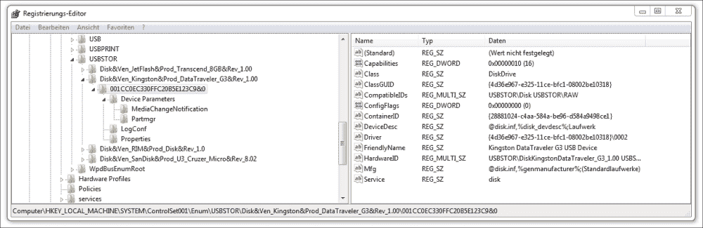

# 第三章：使用 Python 进行 Windows 和 Linux 取证

本章将重点介绍与操作系统特定的取证调查部分。我们选择了桌面和服务器系统中最广泛使用的操作系统——微软 Windows 和 Linux。

对于这两种操作系统，我们选择了一些有趣的证据示例以及如何使用 Python 自动化分析它们。因此，在本章中，您将学习以下内容：

+   分析 Windows 事件日志的基础，选择有趣的部分并自动解析它们

+   组织 Windows 注册表并高效地搜索 **妥协指示器**（**IOC**）

+   搜索 Linux 本地账户信息以查找 IOC

+   理解、使用和解析 Linux 文件元数据，使用 POSIX ACL 和文件基础功能作为标准元数据的最显著扩展

# 分析 Windows 事件日志

Windows 包含许多监控和日志记录功能，并跟踪操作系统中大量和多样化活动的数据和事件。事件数量庞大，这些事件的记录既使管理员难以识别具体的重要事件，也不利于取证调查员找到妥协指示器。因此，我们将从本节开始，简要介绍 Windows 事件日志及其格式随时间的变化，接着描述应帮助调查员快速在大量其他事件中找到可疑行为的关键事件类型。在本章的最后一节中，我们将演示如何解析事件日志并自动找到潜在的 IOC（例如，用户登录、服务创建等）。

## Windows 事件日志

根据微软的说法，Windows 事件日志文件是特殊的文件，用于记录重要事件，例如用户登录计算机时或程序发生错误时（参考[`windows.microsoft.com/en-us/windows/what-information-event-logs-event-viewer#1TC=windows-7`](http://windows.microsoft.com/en-us/windows/what-information-event-logs-event-viewer#1TC=windows-7)）。每当这些类型的事件发生时，Windows 会在事件日志中记录该事件，可以通过事件查看器或类似工具读取。

随着 Windows 7 和 Windows Server 2008 的发布，微软对其事件日志技术进行了重大改变。他们从经典的 **Windows 事件日志**（**EVT**）转变为较新的 **Windows XML 事件日志**（**EVTX**）。在接下来的段落中，我们将解释这两种日志文件类型之间的一些主要区别。

由于微软不再支持 Windows XP，并且 Windows Server 2003 正处于扩展支持阶段（这意味着它很快将停止支持），现在仍然存在一些 XP 和 2003 系统。因此，一些调查人员仍然需要了解旧版 EVT 和新版 EVTX 之间的差异，以及在分析这些文件时可能出现的问题。

除了记录本身和事件日志文件中的二进制差异外，这些日志文件的数量也有所不同。在 Windows XP/2003 系统中，有三个主要的事件日志文件：**系统**、**应用程序**和**安全性**。它们存储在 `C:\Windows\system32\config` 目录下。操作系统的服务器版本可能会根据服务器的功能维护额外的事件日志（如 DNS 服务器、目录服务、文件复制服务等）。在当前的 Windows 7 系统中，你可以找到超过 143 个充满事件日志的文件。如果与 Microsoft Windows 的较新服务器版本进行比较，这个数字会更多。

EVT 日志记录只包含非常少量的可读内容，通过分析时使用的工具（如事件查看器）使其变得人类可读。这些工具将通常存储在系统 DLL 或 EXE 文件中的预定义日志模板与 EVT 文件本身存储的数据结合起来。当其中的某个日志查看工具显示日志记录时，它必须确定哪些 DLL 文件会存储消息模板。这个元信息存储在 Windows 注册表中，并且对之前提到的三种主要事件日志文件（系统、应用程序和安全性）中的每一种都是特定的。

前面提到的所有细节都表明，EVT 文件在没有对应的元文件时并不真正有用，因为元文件存储了日志的核心意义。这就产生了两个主要的分析问题：

+   首先，攻击者可以修改 DLL 文件或 Windows 注册表，以改变事件日志的含义，而不必触及 EVT 文件。

+   其次，当系统上的软件被卸载时，可能会导致 EVT 记录失去其上下文。

作为调查人员，在分析 EVT 日志以及将这些日志写入远程系统以便稍后分析时，必须仔细考虑这些问题。关于 EVT 记录的更详细分析可以在 ForensicsWiki 上找到，[`forensicswiki.org/wiki/Windows_Event_Log_(EVT)`](http://forensicswiki.org/wiki/Windows_Event_Log_(EVT))。

与 EVT 文件相比，EVTX 文件以二进制 XML 文件格式存储。在较新的 Windows 系统中，可以通过事件查看器或大量其他程序和工具查看和分析事件日志（在接下来的章节中，我们也会描述一些可以使用的 Python 脚本）。在使用事件查看器时，必须记住该程序可以以两种不同的格式显示 EVTX 文件：**常规**和**详细**。常规（有时称为格式化）视图可能会隐藏存储在事件记录中的重要事件数据，而这些数据只能在详细视图中看到。因此，如果你计划使用事件查看器分析 EVTX 文件，请始终选择详细选项来显示文件。

如果你对 EVTX 文件格式的详细分析感兴趣，可以查看 ForensicsWiki，[`forensicswiki.org/wiki/Windows_XML_Event_Log_(EVTX)`](http://forensicswiki.org/wiki/Windows_XML_Event_Log_(EVTX))。另一个对 EVTX 文件格式细节的精彩解释是 *Andreas Schuster* 在 DFRWS 2007 上提供的，参考 [`www.dfrws.org/2007/proceedings/p65-schuster_pres.pdf`](http://www.dfrws.org/2007/proceedings/p65-schuster_pres.pdf)。如果你想理解二进制 XML 格式的细节或编写自己的 EVTX 文件解析器，这个演讲非常有帮助。

如果你需要在 Windows 7 或更高版本的系统上打开 EVT 文件，最好在打开之前将旧的 EVT 文件转换为 EVTX 语法。可以通过多种方式完成此操作，具体方法可参考 technet.com 博客文章，[`blogs.technet.com/b/askperf/archive/2007/10/12/windows-vista-and-exported-event-log-files.aspx`](http://blogs.technet.com/b/askperf/archive/2007/10/12/windows-vista-and-exported-event-log-files.aspx)。

## 有趣的事件

可以在 Microsoft 的知识库文章中找到 Windows 系统中新版本事件的完整列表，[`support.microsoft.com/en-us/kb/947226`](https://support.microsoft.com/en-us/kb/947226)。随着每个新版本的系统和每个新安装的应用程序，事件数量不断增加，你可以在单个 Windows 系统上找到几百种不同的事件类型。鉴于这一事实，我们尝试筛选出一些在分析系统或重建用户事件时可能有用的有趣事件类型（关于在什么情况下哪些事件日志有用的更详细解释也可以在 TSA-13-1004-SG 中找到，[`www.nsa.gov/ia/_files/app/spotting_the_adversary_with_windows_event_log_monitoring.pdf`](https://www.nsa.gov/ia/_files/app/spotting_the_adversary_with_windows_event_log_monitoring.pdf)）。

+   **EMET（1，2）**：如果组织正在积极使用 Microsoft **增强型缓解体验工具包**（**EMET**），则这些日志在调查过程中非常有用。

+   **Windows-Update-Failure (20, 24, 25, 31, 34, 35)**：更新失败问题应得到解决，以避免操作系统或应用程序中存在的问题或漏洞被延长。有时，这也有助于识别系统感染。

+   **Microsoft-Windows-Eventlog (104, 1102)**：在正常操作过程中，事件日志数据被清除的可能性较小，更可能的是恶意攻击者会尝试通过清除事件日志来掩盖其痕迹。当事件日志被清除时，这是可疑的。

+   **Microsoft-Windows-TaskScheduler (106)**：它显示新注册的计划任务。如果你正在寻找恶意软件感染的迹象，这可能非常有帮助。

+   **McAfee-Log-Event (257)**：McAfee 恶意软件检测—McAfee 杀毒软件可能检测到恶意软件行为，而不一定检测到 EXE 文件本身。这对于确定恶意软件是如何进入系统非常有价值。一般来说，已安装的 AV 解决方案的事件日志在开始分析潜在被破坏的系统时非常有价值。因此，你应该记得在哪里找到这些日志。

+   **Microsoft-Windows-DNS-Client (1014)**：DNS 名称解析超时；这一事件类型在搜索恶意软件时非常有用，或者在试图找出用户是否尝试连接到特定网站或服务时。

+   **Firewall-Rule-Add/Change/Delete (2004, 2005, 2006, 2033)**：如果客户端工作站利用内置的主机防火墙，则收集事件以跟踪防火墙状态非常有价值。普通用户不应该修改本地计算机的防火墙规则。

+   **Microsoft-Windows-Windows Defender (3004)**：Windows Defender 恶意软件检测日志。

+   **Microsoft-Windows-Security-Auditing (4720, 4724, 4725, 4728, 4732, 4635, 4740, 4748, 4756)**：在这些日志中，你可以找到诸如远程桌面登录、被添加到特权组的用户、账户锁定等信息。应该非常密切地审计被提升到特权组的用户，以确保这些用户确实应该在特权组中。未授权的特权组成员身份是发生恶意活动的强烈迹象。

+   **Service-Control-Manager (7030, 7045)**：它监控服务是否被配置为与桌面交互，或者是否已在系统上安装。

+   **App-Locker-Block/Warning (8003, 8004, 8006, 8007)**：应收集应用程序白名单事件，查看哪些应用程序被阻止执行。任何被阻止的应用程序可能是恶意软件，或者用户尝试运行未批准的软件。

*哈兰·卡维* 在他的博客文章中指出（[`windowsir.blogspot.de/2014/10/windows-event-logs.html`](http://windowsir.blogspot.de/2014/10/windows-event-logs.html)），在新版 Windows（特别是 Windows 7）中，除了单独的事件记录（来源/ID 配对）之外，还有一个特点就是默认会记录许多事件，且跨多个事件日志文件进行记录。因此，当一些事件发生时，多个事件记录会存储在不同类型的事件日志中，并且通常跨不同的事件日志文件。例如，当用户在控制台登录到系统时，安全事件日志中会记录一个事件，一些事件会记录在 `Microsoft-Windows-TerminalServices-LocalSessionManager/Operational` 日志中，还有一些事件会记录在 `Microsoft-Windows-TaskScheduler/Operational` 日志中。

事件日志还可以用来检测攻击者是否使用了某种反取证技术。其中一种技术是通过改变系统时间来误导调查人员。为了检测这种修改，调查人员必须按顺序号和生成时间列出所有可用的事件日志记录。如果系统时间被回滚，某个事件的生成时间将会早于前一个事件。关于如何通过 Windows 事件日志检测反取证技术的更多示例，可以参考 *哈兰·卡维* 的博客文章，地址是 [`windowsir.blogspot.de/2013/07/howto-determinedetect-use-of-anti.html`](http://windowsir.blogspot.de/2013/07/howto-determinedetect-use-of-anti.html)。

## 解析事件日志以获取 IOC

在谈论事件日志并使用 Python 分析这些日志时，**python-evtx** 是绕不开的。这些脚本（[`github.com/williballenthin/python-evtx`](https://github.com/williballenthin/python-evtx)）是使用 Python 编程语言的 2.7+ 标签开发的。由于它完全是用 Python 编写的，这个模块在不同平台上都能很好地工作。该代码不依赖于任何需要单独编译的模块，能够在 Windows 操作系统上运行，特别是 Windows Vista 及以后版本的事件日志文件 EVTX。

我们想要介绍的第二个工具是**plaso**，（参见 [`plaso.kiddaland.net/`](http://plaso.kiddaland.net/)）。该工具集源自 **log2timeline**，现在构建于 Python 之上。借助这个工具集，你可以创建系统事件和其他日志文件（例如 Apache）的有意义时间轴。log2timeline 也有一份非常好的备忘单，[`digital-forensics.sans.org/media/log2timeline_cheatsheet.pdf`](http://digital-forensics.sans.org/media/log2timeline_cheatsheet.pdf)，它展示了这个工具的真正威力。该工具集的一个大优势是，你甚至可以在系统的完整镜像上运行它，以生成所有用户在该系统上执行的操作的时间轴，之后再创建镜像。

在接下来的章节中，我们将展示如何使用 python-evtx 查找 Windows 事件日志中的 IOC，以及 plaso 如何帮助你识别更多 IOC 并以良好的格式展示它们的时间轴。

### python-evtx 解析器

首先，我们要从将 EVTX 文件的二进制 XML 格式转换为可读的 XML 文件开始。这可以通过使用 `evtxdump.py`，[`github.com/williballenthin/python-evtx`](https://github.com/williballenthin/python-evtx) 实现，这也将是我们接下来脚本的基础：

```
#!/usr/bin/env python
import mmap
import contextlib
import argparse

from Evtx.Evtx import FileHeader
from Evtx.Views import evtx_file_xml_view

def main():
    parser = argparse.ArgumentParser(description="Dump a binary EVTX file into XML.")
    parser.add_argument("--cleanup", action="store_true", help="Cleanup unused XML entities (slower)"),
    parser.add_argument("evtx", type=str, help="Path to the Windows EVTX event log file")
    args = parser.parse_args()

    with open(args.evtx, 'r') as f:
        with contextlib.closing(mmap.mmap(f.fileno(), 0, access=mmap.ACCESS_READ)) as buf:

            fh = FileHeader(buf, 0x0)
            print "<?xml version=\"1.0\" encoding=\"utf-8\" standalone=\"yes\" ?>"
            print "<Events>"
            for xml, record in evtx_file_xml_view(fh):
                print xml
            print "</Events>"

if __name__ == "__main__":
    main()
```

在使用之前提到的脚本帮助下转储登录事件（事件 ID 4724），结果将类似于以下内容：

```
<Event ><System><Provider Name="Microsoft-Windows-Security-Auditing" Guid="54849625-5478-4994-a5ba-3e3b0328c30d"></Provider>
<EventID Qualifiers="">4724</EventID>
<Version>0</Version>
<Level>0</Level>
<Task>13824</Task>
<Opcode>0</Opcode>
<Keywords>0x8020000000000000</Keywords>
<TimeCreated SystemTime="2013-11-21 10:40:51.552799"></TimeCreated>
<EventRecordID>115</EventRecordID>
<Correlation ActivityID="" RelatedActivityID=""></Correlation>
<Execution ProcessID="452" ThreadID="1776"></Execution>
<Channel>Security</Channel>
<Computer>windows</Computer>
<Security UserID=""></Security>
</System>
<EventData><Data Name="TargetUserName">mspreitz</Data>
<Data Name="TargetDomainName">windows</Data>
<Data Name="TargetSid">S-1-5-21-3147386740-1191307685-1965871575-1000</Data>
<Data Name="SubjectUserSid">S-1-5-18</Data>
<Data Name="SubjectUserName">WIN-PC9VCSAQB0H$</Data>
<Data Name="SubjectDomainName">WORKGROUP</Data>
<Data Name="SubjectLogonId">0x00000000000003e7</Data>
</EventData>
</Event>
```

当使用`evtxdump.py`，[`github.com/williballenthin/python-evtx`](https://github.com/williballenthin/python-evtx)，处理一个大型 Windows 事件日志文件时，输出将非常庞大，因为你将会在生成的 XML 文件中找到所有记录的日志。对于分析师来说，通常需要快速进行筛查或快速搜索特定事件。因此，我们修改了脚本，使其可以仅提取特定事件，具体如下所示：

```
#!/usr/bin/env python
import mmap
import contextlib
import argparse
from xml.dom import minidom

from Evtx.Evtx import FileHeader
from Evtx.Views import evtx_file_xml_view

def main():
    parser = argparse.ArgumentParser(description="Dump specific event ids from a binary EVTX file into XML.")
    parser.add_argument("--cleanup", action="store_true", help="Cleanup unused XML entities (slower)"),
    parser.add_argument("evtx", type=str, help="Path to the Windows EVTX event log file")
    parser.add_argument("out", type=str, help="Path and name of the output file")
    parser.add_argument("--eventID", type=int, help="Event id that should be extracted")
    args = parser.parse_args()

    outFile = open(args.out, 'a+')
    with open(args.evtx, 'r') as f:
        with contextlib.closing(mmap.mmap(f.fileno(), 0, access=mmap.ACCESS_READ)) as buf:
            fh = FileHeader(buf, 0x0)
            outFile.write("<?xml version=\"1.0\" encoding=\"utf-8\" standalone=\"yes\" ?>")
            outFile.write("<Events>")
            for xml, record in evtx_file_xml_view(fh):
                xmldoc = minidom.parseString(xml)
                event_id = xmldoc.getElementsByTagName('EventID')[0].childNodes[0].nodeValue
                if event_id == str(args.eventID):
                    outFile.write(xml)
                else:
                    continue
            outFile.write("</Events>")

if __name__ == "__main__":
    main()
```

如果你现在想从 Windows 系统的安全事件日志中提取所有登录事件，只需按如下方式执行脚本：

```
user@lab:~$ ./evtxdump.py security.evtx logon_events.xml –eventID 4724

```

### plaso 和 log2timeline 工具

在本节中，我们将演示如何在终端服务器上查找登录和注销事件。可以使用`plasm`标记终端服务的登录和注销事件，并使用`psort`进行过滤，以便快速查看哪些用户何时何地登录了机器。这些信息在寻找安全漏洞时非常有用。首先，你需要使用 plaso 标记所有数据。使用 plaso 标记非常简单，具体如下所示：

```
user@lab:~$ ./plasm.py tag --tagfile=tag_windows.txt storage_file

```

标记成功后，你可以使用以下命令在存储文件中搜索标签：

```
user@lab:~$ ./psort.py storage_file "tag contains 'Session logon succeeded'"

```

执行此命令后，将显示系统上所有成功的登录事件。在搜索已启动的服务或 EMET 故障时，可以执行类似的命令。

现在，您已经看到从 Windows 事件日志中能够提取的数据，我们将展示 Microsoft Windows 的第二个组件，这在搜索 IOC 或试图重建用户行为时非常有帮助。

# 分析 Windows 注册表

Windows 注册表是当前 Microsoft Windows 操作系统的核心组件之一，因此也是法医调查中非常重要的一个点。它为 Windows 操作系统执行两个关键任务。首先，它是 Windows 操作系统和安装在系统上的应用程序的设置存储库。其次，它是所有已安装硬件的配置数据库。微软对注册表的定义如下：

> *“一个在 Microsoft Windows 98、Windows CE、Windows NT 和 Windows 2000 中使用的中央层次数据库，用于存储配置一个或多个用户、应用程序和硬件设备所必需的信息。”（微软计算机词典）*

在接下来的章节中，我们将解释 Windows 注册表中的几个重要元素，这些元素可能对法医调查员很有帮助，并有助于理解在哪里找到最有价值的指示器。我们将从注册表结构的概述开始，帮助您在大量数据中找到正确的方向。之后，我们将演示一些有用的脚本来提取妥协指示器（IOC）。

## Windows 注册表结构

在 Windows 操作系统中，Windows 注册表逻辑地组织为多个根键。Windows 7 系统中的 Windows 注册表有五个逻辑根键，如下所示：


上图显示了 Windows 7 系统中通过 Windows 注册表编辑器（这是最常用的查看和检查 Windows 注册表的工具）显示的五个根键。

根键有两种类型：易失性和非易失性。只有两个根键存储在系统的硬盘上，并且是主存储器中持久存在的数据：**HKEY_LOCAL_MACHINE** 和 **HKEY_USERS**。其他根键要么是这些键的子集，要么是只能在运行时或在开始分析系统镜像之前转储系统内存时检查的易失性键。

Windows 操作系统将注册表组织在多个 hive 文件中。根据微软的定义（参考 [`msdn.microsoft.com/en-us/library/windows/desktop/ms724877%28v=vs.85%29.aspx`](https://msdn.microsoft.com/en-us/library/windows/desktop/ms724877%28v=vs.85%29.aspx)），hive 的定义如下：

> *Hive 是注册表中键、子键和值的逻辑分组，具有一组包含其数据备份的支持文件。*

如果新用户登录到 Windows 机器，将创建一个用户配置文件 hive。此 hive 包含特定的注册表信息（例如，应用程序设置、桌面环境、网络连接和打印机），并位于 **HKEY_USERS** 键下。

每个 hive 都有额外的支持文件，这些文件存储在 `%SystemRoot%\System32\Config` 目录中。每次用户登录时，这些文件都会被更新，这些目录中文件的扩展名表示它们所包含的数据类型。更多详细信息请参阅下表（参考来源：[`msdn.microsoft.com/en-us/library/windows/desktop/ms724877%28v=vs.85%29.aspx`](https://msdn.microsoft.com/en-us/library/windows/desktop/ms724877%28v=vs.85%29.aspx)）：

| 扩展名 | 描述 |
| --- | --- |
| none | hive 数据的完整副本。 |
| `.alt` | 关键 `HKEY_LOCAL_MACHINE\System` hive 的备份副本。只有 System 键具有 `.alt` 文件。 |
| `.log` | 对 hive 中键和值条目的更改的事务日志。 |
| `.sav` | hive 的备份副本。 |

在接下来的部分中，我们将讨论在哪里找到有趣的 hive，并如何借助 Python 工具进行分析。

## 解析注册表以获取 IOC

在本节中，我们将讨论在搜索 IOC 时哪些注册表 hive 是重要的。以下子节将包括以下主题：

+   **连接的 USB 设备**：本节将展示哪些设备曾经连接到系统以及何时连接。这有助于识别通过系统用户进行数据泄露或外泄的可能途径。

+   **用户历史**：本节将展示如何找到已打开文件的历史记录。

+   **启动程序**：本节将展示系统启动时将执行哪些程序。这在尝试识别受感染的系统时非常有帮助。

+   **系统信息**：本节将展示如何找到目标系统的重要信息（例如，用户名）。

+   **Shim Cache 解析器**：本节将展示如何通过常见的 Python 工具（如 Mandiant 的 **Shim Cache 解析器**）来获取重要的 IOC，参考 [`www.mandiant.com/blog/leveraging-application-compatibility-cache-forensic-investigations/`](https://www.mandiant.com/blog/leveraging-application-compatibility-cache-forensic-investigations/)。

### 连接的 USB 设备

事件响应人员最常遇到的一个问题是，是否有用户从系统中外泄了机密数据，或者系统是否因用户连接的恶意 USB 设备而遭到入侵。为了回答这个问题，Windows 注册表是一个很好的起点。

每当一个新的 USB 设备连接到系统时，它会在注册表中留下信息。这些信息可以唯一标识每个已连接的 USB 设备。注册表会存储每个已连接 USB 设备的供应商 ID、产品 ID、修订版和序列号。这些信息可以在`HKEY_LOCAL_MACHINE\SYSTEM\ControlSet001\Enum\USBSTOR`注册表蜂巢中找到，*Windows 法医分析*，*Harlan Carvey*，*Dave Kleiman*，*Syngress Publishing*，这也可以在以下截图中查看：



### 用户历史

在 Windows 系统中，注册表中有多个列表可以帮助识别最近的用户活动（例如，最近访问的网页或最近打开的 Microsoft Word 文件）。下表展示了其中一些列表及其对应的 Windows 注册表子键，所有列表及其 Windows 注册表子键请参考[`ro.ecu.edu.au/cgi/viewcontent.cgi?article=1071&context=adf`](http://ro.ecu.edu.au/cgi/viewcontent.cgi?article=1071&context=adf)：

| 历史列表 | 相关的 Windows 注册表子键 |
| --- | --- |
| 在 Microsoft Internet Explorer 中输入的 URL | HKEY_USERS\S-1-5-21-[用户标识符]\Software\Microsoft\Internet Explorer\TypedURLs |
| 最近使用的 Microsoft Office 文件 | HKEY_USERS\S-1-5-21-[用户标识符]\Software\Microsoft\Office\12.0\Office_App_Name\File MRU |
| 最近映射的网络驱动器 | HKEY_USERS\S-1-5-21-[用户标识符]\Software\Microsoft\Windows\CurrentVersion\Explorer\Map Network Drive MRU |
| 在 RUN 对话框中最近输入的命令 | HKEY_USERS\S-1-5-21-[用户标识符]\Software\Microsoft\Windows\CurrentVersion\Explorer\RunMRU |
| 最近的文件夹 | HKEY_USERS\S-1-5-21-[用户标识符]\Software\Microsoft\Windows\CurrentVersion\Explorer\RecentDocs\Folder |

### 启动程序

在某些调查中，重要的是找出哪些软件是在启动时自动运行的，哪些软件是用户手动启动的。为了解答这个问题，Windows 注册表中的`HKEY_LOCAL_MACHINE\SOFTWARE\Microsoft\Windows\CurrentVersion\Run`可以再次提供帮助。启动程序列表如下图所示，并列在*Windows 注册表蜂巢*中，图表来自*《Windows 注册表快速参考》*，*Farmer, D. J*：


### 系统信息

在本节中，我们将看到一些在分析系统时可能非常重要的注册表蜂巢。首先，注册表中存储了大量关于用户账户的信息，如下所示：

+   用户账户列表

+   每个账户的最后登录时间

+   账户是否需要密码

+   账户是否被禁用或启用

+   用于计算密码哈希值的哈希技术

所有这些信息都保存在以下注册表键中：

`HKEY_LOCAL_MACHINE\SAM\Domains\Account\Users`

Windows 注册表中有许多其他有趣的数据；然而，有一种信息在法医调查中可能非常有用：系统最后一次关机的时间。该信息存储在以下哈希中的`ShutdownTime`值中：

`HKEY_LOCAL_MACHINE\SYSTEM\ControlSet001\Control\Windows`

这个信息通常在服务器系统中很有趣，因为它可能表明上次更新的时间，或者是否有任何系统的非计划重启，这也可能是攻击者导致的。

### Shim 缓存解析器

Windows 注册表包含应用兼容性问题和大量元数据（如文件大小、文件的最后修改时间以及最后执行时间，这取决于操作系统版本），这些可能对**应用兼容性 Shim 缓存**中的应用运行时非常重要。

### 提示

应用兼容性 Shim 缓存的实现和结构可能因操作系统而异。因此，请彻底检查您的发现。

有关应用兼容性和运行时问题的数据，在事件响应或其他类型的法医调查中非常有用，可以帮助识别潜在感染的系统，并创建潜在感染发生的时间线。Mandiant 发布了一款提取这种证据的工具：**Shim 缓存解析器**，（更多信息请参阅[`github.com/mandiant/ShimCacheParser`](https://github.com/mandiant/ShimCacheParser)）

> *Shim 缓存解析器将自动确定缓存数据的格式并输出其内容。它支持多种输入，包括系统注册表哈希、原始二进制数据或当前系统的注册表。*

该工具可以用于导出的注册表哈希或正在运行的系统。使用时，只需执行以下命令：

```
C:\tools\mandiant> python ShimCacheParser.py –l –o out.csv

[+] Dumping Shim Cache data from the current system...
[+] Found 64bit Windows 7/2k8-R2 Shim Cache data...
[+] Found 64bit Windows 7/2k8-R2 Shim Cache data...
[+] Found 64bit Windows 7/2k8-R2 Shim Cache data...
[+] Writing output to out.csv...

```

在查看生成的 CSV 输出时，您可以找到已安装的应用程序及其首次运行时间，具体如下：

```
Last Modified,Last Update,Path,File Size,Exec Flag
05/04/11 05:19:28,N/A,C:\Windows\system32\SearchFilterHost.exe,N/A,True
05/24/15 16:44:45,N/A,C:\Program Files (x86)\Avira\AntiVir Desktop\avwsc.exe,N/A,True
11/21/10 03:24:15,N/A,C:\Windows\system32\wbem\wmiprvse.exe,N/A,True
05/30/14 08:07:49,N/A,C:\Windows\TEMP\40F00A21-D2E7-47A3-AE16-0AFB8E6C1F87\dismhost.exe,N/A,True
07/14/09 01:39:02,N/A,C:\Windows\system32\DeviceDisplayObjectProvider.exe,N/A,True
07/26/13 02:24:56,N/A,C:\Windows\System32\shdocvw.dll,N/A,False
05/24/15 16:46:22,N/A,C:\Program Files (x86)\Google\Update\1.3.27.5\GoogleCrashHandler.exe,N/A,True
05/07/15 21:42:59,N/A,C:\Windows\system32\GWX\GWX.exe,N/A,True
03/26/15 20:57:08,N/A,C:\Program Files (x86)\Parallels\Parallels Tools\prl_cc.exe,N/A,True
10/07/14 16:29:54,N/A,C:\Program Files (x86)\KeePass Password Safe 2\KeePass.exe,N/A,True
10/07/14 16:44:13,N/A,C:\ProgramData\Avira\Antivirus\TEMP\SELFUPDATE\updrgui.exe,N/A,True
04/17/15 21:03:48,N/A,C:\Program Files (x86)\Avira\AntiVir Desktop\avwebg7.exe,N/A,True

```

通过查看之前的数据，可以发现用户在 2015-05-24 安装或更新了 Avira AntiVir，并在 2014-07-10 安装了 KeePass。此外，您还可以找到一些线索，表明该系统似乎是一个虚拟系统，因为可以看到 Parallels 的线索，这是一个 Mac OS X 虚拟化平台。

如果考虑到前面描述的工具以及 Windows 事件日志和 Windows 注册表中包含的信息，就会发现，在法医调查中，并非所有关于系统的问题都可以通过这些信息源来回答。

# 实施特定于 Linux 的检查

在本节中，我们将描述如何实施一些完整性检查，以帮助发现 Linux 和类似系统（例如，BSD 系统）中的系统操作迹象。

这些检查包括以下内容：

+   在本地用户管理中搜索异常

+   理解和分析文件元数据中的特殊权限和特权

+   使用文件元数据的聚类算法获取进一步检查的指示

## 检查本地用户凭据的完整性

Linux 中的本地用户信息大多数存储在两个文件中：`/etc/passwd` 和 `/etc/shadow`。后者是可选的，所有关于本地用户的信息，包括哈希密码，最初都存储在 `/etc/passwd` 中。很快，将密码信息存储在所有用户可读的文件中被认为是一个安全问题。因此，`/etc/passwd` 中的密码哈希被一个表示密码哈希需要在 `/etc/shadow` 中查找的 x 字符所替代。

这一演变过程的副作用是 `/etc/passwd` 中的密码哈希仍然被支持，并且 `/etc/passwd` 中的所有设置可能会覆盖 `/etc/shadow` 中的凭据。

这两个文件都是文本文件，每行包含一个条目。一个条目由多个字段组成，字段之间用冒号分隔。

`/etc/passwd` 的格式如下：

+   **用户名**：此字段包含人类可读的用户名。用户名不必唯一。然而，大多数用户管理工具会强制要求用户名唯一。

+   **密码哈希**：此字段包含根据 Posix `crypt()` 函数对密码进行编码后的形式。如果此字段为空，则对应的用户无需密码即可登录系统。如果此字段包含无法通过哈希算法生成的值，例如感叹号，那么该用户无法使用密码登录。然而，这种情况并不会使账户失效。即便密码被锁定，用户仍然可以使用其他认证机制登录，例如 SSH 密钥。

    如前所述，特殊值 x 表示密码哈希必须在 shadow 文件中查找。

    从系统库 `glibc2` 开始，`crypt()` 函数支持多种哈希算法。在这种情况下，密码哈希具有以下格式：

    ```
    $id$salt$encrypted

    ```

    该 ID 标识已用于对密码进行编码的哈希算法，例如，1 表示 md5，5 表示 sha256，6 表示 sha512。盐是一个随机生成的字符串，用来修改哈希算法。因此，即使密码相同，也会产生不同的哈希值。子字段“加密”保存了密码的实际哈希（经过盐的影响进行修改）。

+   **数字用户 ID**：此字段表示用户的 ID。内核内部仅使用此数字 ID。特殊的 ID 0 分配给具有管理权限的 root 用户。默认情况下，用户 ID 为 0 的用户拥有系统上的无限制权限。

+   **数字组 ID**：此字段指的是用户的主组。

+   **备注字段**：此字段可以包含关于用户的任意信息，通常用于存储用户的全名。有时，它还包含以逗号分隔的全名、电话号码等信息。

+   **用户主目录**：用户主目录是系统文件系统中的一个目录。登录后，新的进程会以此目录作为工作目录启动。

+   **默认命令 shell**：此可选字段表示成功登录后将启动的默认 shell。

`/etc/shadow` 的格式如下：

+   **用户名**字段将条目与具有相同用户名的 `passwd` 条目关联起来。

+   **密码哈希**字段包含以与 `passwd` 文件相同的格式编码的密码。

+   接下来的五个字段包含关于密码过期的信息，例如上次密码更改的日期、密码的最小使用期限、最大使用期限、密码警告期和密码非活动期。

+   如果**账户过期日期**字段不为空，它将被解释为账户的过期日期。这个日期是自 1970 年 1 月 1 日以来的天数。

通过这种格式描述，一个简单的 Python 脚本就足以将文件解析成一个包含多个条目的列表，每个条目包含一组字段，如下所示：

```
def read_passwd(filename):
    """Reads entries from shadow or passwd files and
       returns the content as list of entries.
       Every entry is a list of fields."""

    content = []
    with open(filename, 'r') as f:
        for line in f:
            entry = line.strip().split(':')
            content.append(entry)

    return content
```

使用此脚本时，可能会检测到这些文件中的典型操控。

我们要描述的第一个操控技巧是*创建多个共享相同数字 ID 的用户*。攻击者可以使用这种技巧将后门植入系统。通过为现有的 ID 创建一个额外的用户，攻击者可以创建一个带有单独密码的别名。合法账户的拥有者并不会意识到存在另一个用户名/密码组合可以登录该账户。

一个简单的 Python 脚本可以检测这种操作，如下所示：

```
def detect_aliases(passwd):
    """Prints users who share a user id on the console

       Arguments:
       passwd -- contents of /etc/passwd as read by read_passwd"""

    id2user = {}
    for entry in passwd:
        username = entry[0]
        uid = entry[2]
        if uid in id2user:
            print 'User "%s" is an alias for "%s" with uid=%s' % (username, id2user[uid], uid)
        else:
            id2user[uid] = username
```

在正常操作中，`/etc/passwd` 和 `/etc/shadow` 文件中的信息是同步的，也就是说，每个用户应该出现在这两个文件中。如果*有用户只出现在其中一个文件中*，那么这表明操作系统的用户管理机制可能被绕过了。类似的操作可以通过以下脚本检测到：

```
def detect_missing_users(passwd, shadow):
    """Prints users of /etc/passwd missing in /etc/shadow
       and vice versa.

       Arguments:
       passwd -- contents of /etc/passwd as read by read_passwd
       shadow -- contents of /etc/shadow as read by read_passwd"""

    passwd_users = set([e[0] for e in passwd])
    shadow_users = set([e[0] for e in shadow])

    missing_in_passwd = shadow_users - passwd_users
    if len(missing_in_passwd) > 0:
        print 'Users missing in passwd: %s' % ', '.join(missing_in_passwd)

    missing_in_shadow = passwd_users - shadow_users
    if len(missing_in_shadow) > 0:
        print 'Users missing in shadow: %s' % ', '.join(missing_in_shadow)
```

就像第一个函数一样，正常系统中这个函数不应产生任何输出。如果输出类似于 `Users missing in shadow: backdoor`，那么系统中有一个名为“backdoor”的用户账户，但在 `shadow` 文件中没有相关记录。

在正常系统中，不应该存在没有密码的用户。此外，所有密码哈希应保存在 `shadow` 文件中，而 `passwd` 文件中的所有条目应指向对应的 `shadow` 条目。以下脚本检测违反这一规则的情况：

```
def detect_unshadowed(passwd, shadow):
    """Prints users who are not using shadowing or have no password set

       Arguments:
       passwd -- contents of /etc/passwd as read by read_passwd
       shadow -- contents of /etc/shadow as read by read_passwd"""

    nopass = [e[0] for e in passwd if e[1]=='']
    nopass.extend([e[0] for e in shadow if e[1]==''])
    if len(nopass) > 0:
        print 'Users without password: %s' % ', '.join(nopass)

    unshadowed = [e[0] for e in passwd if e[1] != 'x' and e[1] != '']
    if len(unshadowed) > 0:
        print 'Users not using password-shadowing: %s' % \
              ', '.join(unshadowed)
```

我们最后一个绕过操作系统进行用户帐户创建和操作的示例是 *检测非标准哈希算法* 和 *在多个用户帐户间重用盐值*。虽然 Linux 系统允许为 `shadow` 文件中的每个条目指定哈希算法，但通常所有用户的密码都是使用相同的算法进行哈希的。偏离的算法是一个信号，表示该条目被写入 `shadow` 文件时未使用操作系统工具，这意味着系统被篡改。如果一个盐值在多个密码哈希中被重用，则该盐值可能被硬编码到操作工具中，或者系统的加密例程可能已被破坏，例如通过篡改盐值生成的熵源。

以下 Python 脚本能够检测这种类型的操作：

```
import re
def detect_deviating_hashing(shadow):
    """Prints users with non-standard hash methods for passwords

       Arguments:
       shadow -- contents of /etc/shadow as read by read_passwd"""

    noalgo = set()
    salt2user = {}
    algorithms = set()
    for entry in shadow:
        pwhash = entry[1]
        if len(pwhash) < 3:
            continue

        m = re.search(r'^\$([^$]{1,2})\$([^$]+)\$', pwhash)
        if not m:
            noalgo.add(entry[0])
            continue

        algo = m.group(1)
        salt = m.group(2)

        if salt in salt2user:
            print 'Users "%s" and "%s" share same password salt "%s"' % \
                  (salt2user[salt], entry[0], salt)
        else:
            salt2user[salt] = entry[0]

        algorithms.add(algo)

    if len(algorithms) > 1:
        print 'Multiple hashing algorithms found: %s' % ', '.join(algorithms)

    if len(noalgo) > 0:
        print 'Users without hash algorithm spec. found: %s' % \
              ', '.join(noalgo)
```

### 提示

**正则表达式**

最后一个示例使用 `re` 模块进行 **正则表达式** 匹配，以从密码哈希中提取算法规范和盐值。正则表达式提供了一种快速而强大的文本搜索、匹配、拆分和替换方法。因此，我们强烈建议熟悉正则表达式。`re` 模块的文档可以在线访问 [`docs.python.org/2/library/re.html`](https://docs.python.org/2/library/re.html)。书籍《精通 Python 正则表达式》由 *Felix Lopez* 和 *Victor Romero* 编著，*Packt Publishing* 出版，提供了更多的见解和关于如何使用正则表达式的示例。

本节中的所有检测方法都是异常检测方法的示例。根据系统环境，可以通过遵循示例的模式，使用和实现更具体的异常检测方法。例如，在服务器系统中，设置密码的用户数量应该较少。因此，统计所有设置了密码的用户，可以作为分析此类系统的合理步骤。

## 分析文件元信息

本节将讨论文件元信息，并提供如何在取证分析中使用它的示例。

### 理解 inode

Linux 系统将文件元信息存储在称为 **inode**（**索引节点**）的结构中。在 Linux 文件系统中，每个对象都由一个 inode 表示。每个 inode 存储的数据取决于实际的文件系统类型。inode 的典型内容如下：

+   **索引号**是 inode 的标识符。索引号在每个文件系统中都是唯一的。如果两个文件共享相同的索引号，那么这两个文件是 **硬链接**。因此，硬链接文件仅在文件名上有所不同，内容和元信息始终相同。

+   **文件所有者**由用户的数字 ID（UID）定义。每个文件只能有一个所有者。用户 ID 应该与`/etc/passwd`中的条目对应。然而，并不保证所有文件都对应于`/etc/passwd`中现有的条目。文件可以通过管理员权限转移给不存在的用户。此外，文件的所有者可能已经从系统中删除，这会导致文件成为孤儿文件。对于可移动介质上的文件，例如 USB 驱动器，并没有将用户 ID 从一个系统映射到另一个系统的机制。因此，当 USB 驱动器连接到具有不同`/etc/passwd`的新系统时，文件的所有者似乎发生了变化。此外，如果在连接 USB 驱动器的系统中不存在该 UID，这也可能导致孤儿文件的出现。

+   **文件组**由相应组的数字 ID（GID）定义。一个文件始终分配给恰好一个组。系统的所有组应该在`/etc/groups`中定义。然而，可能存在组 ID 不在`/etc/groups`中列出的文件。这表明对应的组已经从系统中删除，介质已经从另一个系统转移过来（该系统上该组仍然存在），或者具有管理员权限的用户将文件重新分配给了一个不存在的组。

+   **文件模式**（**也称为“保护位”**）定义了对相应文件的一种简单的访问权限形式。它是一个位掩码，用于定义文件所有者、属于文件分配的组的用户以及所有其他用户的访问权限。对于这几种情况，定义了以下位：

    +   **读取**（**r**）：如果这个位在常规文件上设置，则受影响的用户被允许读取文件内容。如果这个位在目录上设置，则受影响的用户被允许列出该目录中内容的名称。读取访问不包括元信息，即目录条目的 inode 数据。因此，目录的读取权限不足以读取该目录中的文件，因为这需要访问文件的 inode 数据。

    +   **写入**（**w**）：如果这个位在常规文件上设置，则受影响的用户被允许以任意方式修改文件内容，包括操纵和删除内容。如果这个位在目录条目上设置，则受影响的用户被允许在该目录中创建、删除和重命名条目。目录中的现有文件有自己的保护位，用于定义它们的访问权限。

    +   **执行**（**x**）：对于常规文件，此标志允许受影响的用户将文件作为程序启动。如果文件是编译后的二进制文件，例如 ELF 格式，那么执行权限足以运行该程序。如果文件是必须解释的脚本，则运行脚本时还需要读取权限（r）。原因是 Linux 内核会确定如何加载程序。如果它检测到文件包含脚本，它会以当前用户的权限加载脚本解释器。对于目录，此标志授予权限读取目录内容的元信息，但不包括条目的名称。因此，这允许受影响的用户将工作目录更改为该目录。

    +   **粘滞**（**t**）：此位每个 inode 仅存在一次。当它在目录上设置时，它限制删除和重命名条目的权限，仅限于拥有该条目的用户。在常规文件上，此标志被忽略或具有文件系统特定的效果。当设置在可执行文件上时，此标志用于防止生成的进程从 RAM 中被交换出去。然而，粘滞位的这一用途已经被弃用，Linux 系统不再遵守可执行文件上的粘滞位。

    +   **执行时设置标识**（**s**）：这个位存在于用户和组上。当在可执行文件上为用户设置（SUID 位）时，相关文件总是以其所有者作为有效用户运行。因此，程序以拥有可执行文件的用户权限运行，而不依赖于实际启动程序的用户。如果文件属于 root 用户（UID 0），则该可执行文件始终以无限权限运行。当为组设置该位（SGID 位）时，程序始终以文件的组作为有效组启动。

+   文件的大小（以字节为单位）。

+   为该文件分配的块数。

+   标记文件内容最后一次更改的时间戳（**mtime**）。

+   标记最后一次读取文件内容的时间戳（**atime**）。

    通过挂载选项**noatime**可以禁用访问时间戳跟踪，以限制对媒体的写访问（例如，延长 SD 卡的使用寿命）。此外，文件系统的只读访问（挂载选项**ro**）会阻止 atime 跟踪。因此，在分析 atime 信息之前，应检查是否为该文件系统启用了 atime 跟踪。相应的初始挂载选项可以在`/etc/fstab`中找到。

+   标记文件 inode 数据最后一次更改的时间戳（**ctime**）。

使用 Python 读取基本文件元数据

[`docs.python.org/2/library/os.html#os.stat`](https://docs.python.org/2/library/os.html#os.stat)上提供了关于`os.stat()`和`os.lstat()`的详细说明。这还包括平台相关属性的示例。

### 结果对象是平台相关的；然而，以下信息始终可用：`st_mode`（保护位）、`st_ino`（inode 号）、`st_dev`（包含文件系统对象的设备标识符）、`st_nlink`（硬链接数）、`st_uid`（所有者用户 ID）、`st_gid`（所有者组 ID）、`st_size`（文件大小，以字节为单位）、`st_mtime`（最后修改时间）、`st_atime`（最后访问时间）、`st_ctime`（最后 inode 更改时间）。这些信息对应于前面部分描述的 inode 数据。

这些标准条目的显著扩展是**POSIX 访问控制列表**（**POSIX ACLs**）。这些访问控制列表受到主要 Linux 文件系统的支持，并允许指定除了三个类（用户、组和其他）之外的额外访问条目。这些条目允许为额外的用户和组定义额外的访问权限（先前列出的位 r、w 和 x）。将详细讨论评估 POSIX ACLs 的内容。

此代码清单输出`lstat`调用的常见返回值。典型输出类似于以下内容：

### 另一个扩展包括向可执行文件添加**能力标志**的规范。这用于比使用 SUID 位更细粒度地指定权限。而不是给根用户拥有的可执行文件设置 SUID 位并允许它拥有无限的权限，可以指定一组所需的权限。能力标志也将在单独的部分详细处理。

Python 提供了内置功能来使用`os`模块读取文件状态信息。通过文件名指定的标准功能来检索元数据是`os.lstat()`。与更常用的`os.stat()`相比，此函数不评估符号链接的目标，而是检索有关链接本身的信息。因此，它不容易遇到由循环符号链接引起的无限循环。此外，它不会在缺少链接目标的链接上引发任何错误。

`st_mtime`、`st_atime`和`st_ctime`时间戳采用 Unix 时间戳格式，即自 1970 年 1 月 1 日以来的秒数。使用 datetime 模块，可以将此时间格式转换为人类可读的形式，如以下脚本所示：

```
from datetime import datetime as dt
from os import lstat

stat_info = lstat('/etc/passwd')

atime = dt.utcfromtimestamp(stat_info.st_atime)
mtime = dt.utcfromtimestamp(stat_info.st_mtime)
ctime = dt.utcfromtimestamp(stat_info.st_ctime)

print 'File mode bits:      %s' % oct(stat_info.st_mode)
print 'Inode number:        %d' % stat_info.st_ino
print '# of hard links:     %d' % stat_info.st_nlink
print 'Owner UID:           %d' % stat_info.st_uid
print 'Group GID:           %d' % stat_info.st_gid
print 'File size (bytes)    %d' % stat_info.st_size
print 'Last read (atime)    %s' % atime.isoformat(' ')
print 'Last write (mtime)   %s' % mtime.isoformat(' ')
print 'Inode change (ctime) %s' % ctime.isoformat(' ')
```

注意

```
File mode bits:      0100644
Inode number:        1054080
# of hard links:     1
Owner UID:           0
Group GID:           0
File size (bytes)    2272
Last read (atime)    2015-05-15 09:25:15.991190
Last write (mtime)   2014-09-20 10:40:46.389162
Inode change (ctime) 2014-09-20 10:40:46.393162

```

该示例输出表示在实验室系统中，`/etc/passwd` 是一个常规文件，所有用户都有读取权限。此信息来自结果的 `st_mode` 成员。在使用 Python 的 `oct()` 函数时，它被转换为八进制表示，即 *输出的每个十进制数字恰好表示保护位的三位二进制数字*。输出中的前导零是八进制表示的常见标志。

输出中的后三个数字（示例中的 `644`）始终表示文件所有者的访问权限（示例中的 `6`），属于文件所在组的用户的权限（示例中的左 `4`），以及所有其他用户的权限（最后一位）。

### 提示

**如何解读文件模式位？**

在其八进制形式中，三个最不重要的数字的位值表示文件所有者、组和其他用户（最后一位）的访问权限。对于每一位，读权限（r）具有位值 4，写权限（w）具有位值 2，执行权限（x）具有位值 1。

因此，在我们的示例中，数字 `6` 表示文件所有者的读写权限（4 + 2）。组 0 的成员和所有其他用户只有读权限（4）。

从右侧起的下一个数字表示粘滞位（值为 1）、SGID 位（值为 2）和 SUID 位（值为 4）。

### 注意

`stat` 模块定义了 `st_mode` 所有位的常量。其文档可以在 [`docs.python.org/2/library/stat.html`](https://docs.python.org/2/library/stat.html) 查看。

这些常量可以作为位掩码从 `st_mode` 中检索信息。之前的示例可以扩展以检测 SGID、SUID 和粘滞模式，如下所示：

```
import stat

if stat.S_ISUID & stat_info.st_mode:
    print 'SUID mode set!'

if stat.S_ISGID & stat_info.st_mode:
    print 'SGID mode set!'

if stat.S_ISVTX & stat_info.st_mode:
    print 'Sticky mode set!'
```

要测试代码，可以使用示例来评估标准 Linux 系统上 `/etc/passwd`、`/tmp` 和 `/usr/bin/sudo` 的模式。通常，`/tmp` 设置了粘滞标志，`/usr/bin/sudo` 设置了 SUID，而 `/etc/passwd` 没有设置任何特殊位。

剩余的位表示文件类型。标准 Linux 文件系统上可能出现以下文件类型：

| 文件类型 | `stat` 模块中的检查函数 | 描述 |
| --- | --- | --- |
| 常规 | S_ISREG() | 用于存储任意数据 |
| 目录 | S_ISDIR() | 用于存储其他文件的列表 |
| 符号链接 | S_ISLNK() | 这是通过名称引用一个目标文件 |
| 字符设备 | S_ISCHR() | 这是文件系统中用于访问字符型硬件的接口，例如终端 |
| 块设备 | S_ISBLK() | 这是文件系统中用于访问块设备的接口，例如磁盘分区 |
| fifo | S_ISFIFO() | 这是文件系统中命名的单向进程间接口的表示 |
| 套接字 | S_ISSOCK() | 这是文件系统中命名的双向进程间接口的表示 |

硬链接不是由特殊的文件类型表示的，而只是同一文件系统中多个共享相同 inode 的目录项。

与 SGID、SUID 和粘滞位的测试不同，文件类型检查作为`stat`模块的函数实现。这些函数需要文件模式位作为参数，例如：

```
from os import readlink,lstat
import stat

path = '/etc/rc5.d/S99rc.local'

stat_info = lstat(path)

if stat.S_ISREG(stat_info.st_mode):
    print 'File type: regular file'

if stat.S_ISDIR(stat_info.st_mode):
    print 'File type: directory'

if stat.S_ISLNK(stat_info.st_mode):
    print 'File type: symbolic link pointing to ',
    print readlink(path)
```

在此示例中，`os.readlink()`函数用于提取目标文件名，如果遇到符号链接。符号链接可以指向绝对路径或从符号链接在文件系统中的位置开始的相对路径。绝对符号链接的目标以字符`/`开头，即目标从系统的根目录开始搜索。

### 注释

如果你在实验环境中挂载了证据的副本进行分析，绝对符号链接要么损坏，要么指向你的实验工作站中的一个文件！只要它们的目标位于与链接相同的分区中，相对符号链接将保持完整。

上述示例代码的可能输出为`- 文件类型：指向../init.d/rc.local 的符号链接 -`，这是一个相对链接的示例。

### 使用 Python 评估 POSIX ACLs

文件模式位在文件的 inode 中定义，只允许三个权限接收者：文件所有者、属于文件组的用户以及其他所有人。

如果需要更细粒度的权限设置，传统的解决方案是创建一个包含所有应有访问权限的用户的组，并将文件转移到该组。然而，创建此类组存在重大缺点。首先，组的列表可能变得过于庞大。其次，创建此类组需要管理员权限，因此会破坏 Linux/Unix 的**自主访问控制**概念。

### 注释

**自主访问控制**是指允许信息的拥有者，即文件拥有者，决定谁应被允许访问该信息。在自主访问控制中，拥有权是授予或撤销访问资源的唯一要求。

最后但同样重要的是，如果没有匹配的组来授权用户，文件所有者可能会将文件和目录开放给系统上的所有人。这破坏了*最小权限原则*，即不授予系统操作所需的权限以外的任何权限。

为了保持自主访问控制以及最小权限原则，文件访问模式定义了一个可选扩展，即**POSIX ACL**。除了允许文件所有者、组和其他人对文件进行读、写和执行权限外，POSIX ACL 还允许指定以下内容：

+   任意用户的特定读、写和执行权限

+   任意组的特定读、写和执行权限

+   访问掩码中未设置的每个权限都不会被授予。只有文件所有者和其他用户的权限不会受到访问掩码的影响。

在命令行中，可以使用 `getfacl` 和 `setfacl` 工具分别读取和修改 POSIX ACL 条目：

```
user@lab:~$ touch /tmp/mytest
user@lab:~$ getfacl /tmp/mytest
getfacl: Removing leading '/' from absolute path names
# file: tmp/mytest
# owner: user
# group: user
user::rw-
group::r--
other::r--

```

此示例还表明，标准权限集在 POSIX ACL 中得到了反映。因此，如果文件系统支持 POSIX ACL，则完整的权限集包含在 POSIX ACL 中。

让我们撤销对 `other` 用户的读取访问，并为用户 `games` 添加读取/写入访问，如下所示：

```
user@lab:~$ setfacl -m o::0 -m u:games:rw /tmp/mytest
user@lab:~$ getfacl /tmp/mytest
getfacl: Removing leading '/' from absolute path names
# file: tmp/mytest
# owner: user
# group: user
user::rw-
user:games:rw-
group::r--
mask::rw-
other::---
user@lab:~$ ls -l /tmp/mytest
-rw-rw----+ 1 user user 0 May 16 16:59 /tmp/mytest

```

`-m o::0` 参数删除了 `other` 用户的所有权限，而 `–m u:games:rw` 为用户 `games` 授予了读取/写入权限。随后的 `getfacl` 调用显示了 `user:games` 的附加条目和 `other` 的更改条目。此外，`mask` 条目会自动创建，以限制所有列出组和用户（除了文件所有者）的读取/写入访问权限。

`ls` 命令的输出通过加号 `+` 来表示存在额外的 ACL 条目。正如 `ls` 输出所示，只有评估文件模式位的工具无法识别这些额外的权限。例如，用户 `games` 的附加访问权限在 `ls` 或其他文件管理应用的标准输出中不会显示。

### 注意

如果取证工具没有查找和解释 POSIX ACL 条目，可能会错过 ACL 条目所引入的附加访问权限！因此，调查员可能会对严格的有效权限产生错误印象。

幸运的是，Python 库 **pylibacl** 可以用来读取和评估 POSIX ACL，从而避免这个陷阱。该库引入了 `posix1e` 模块，这是首次提到 POSIX ACL 的初稿的参考。关于此库的详细文档可以在 [`pylibacl.k1024.org/`](http://pylibacl.k1024.org/) 查阅。

以下脚本是一个示例，演示如何查找具有额外 ACL 条目的文件：

```
#!/usr/bin/env python

import os
from os.path import join
import posix1e
import re
import stat
import sys

def acls_from_file(filename, include_standard = False):
    """Returns the extended ACL entries from the given
       file as list of the text representation.

       Arguments:
       filename -- the file name to get the ACLs from
       include_standard -- if True, ACL entries representing 
                           standard Linux permissions will be
                           included"""
    result = []
    try:
 acl = posix1e.ACL(file=filename)
    except:
        print 'Error getting ACLs from %s' % filename
        return []

    text = acl.to_any_text(options=posix1e.TEXT_ABBREVIATE | posix1e.TEXT_NUMERIC_IDS)

    for entry in text.split("\n"):
        if not include_standard and \
           re.search(r'^[ugo]::', entry) != None:
            continue
        result.append(entry)

    return result

def get_acl_list(basepath, include_standard = False):
    """Collects all POSIX ACL entries of a directory tree.

    Arguments:
    basepath -- directory to start from
    include_standard -- if True, ACL entries representing 
                        standard Linux permissions will be
                        included"""
    result = {}

 for root, dirs, files in os.walk(basepath):
        for f in dirs + files:
            fullname = join(root, f)

            # skip symbolic links (target ACL applies)
 if stat.S_ISLNK(os.lstat(fullname).st_mode):
                continue

            acls = acls_from_file(fullname, include_standard)
            if len(acls) > 0:
                result[fullname] = acls

    return result

if __name__ == '__main__':
    if len(sys.argv) < 2:
        print 'Usage %s root_directory' % sys.argv[0]
        sys.exit(1)

    acl_list = get_acl_list(sys.argv[1], False)

    for filename, acls in acl_list.iteritems():
        print "%s: %s" % (filename, ','.join(acls))
```

`posix1e.ACL` 类表示文件系统中某个特定对象的所有权限。当其构造函数以文件名作为 `file` 参数被调用时，它表示该文件的 ACL。在 `acls_from_file()` 函数中，使用正则表达式来检测并可选地从 ACL 集的文本表示中过滤掉标准权限。

`os.walk()` 函数用于遍历文件系统的子树。如果像示例中那样遍历 `os.walk()`，你会在每次迭代中得到一个三元组，表示以下内容：

+   当前访问的目录

+   包含所有子目录的列表（相对于当前访问的目录）

+   包含所有非目录条目的列表，例如文件和软链接（相对于当前访问的目录）

脚本中最后一行的检查是评估文件类型信息的一个例子，如前一节所述。它用于检测并跳过符号链接。符号链接始终使用其目标的 ACL，因此，符号链接上的 POSIX ACL 不被支持。

当我们在实验机器上使用 `/tmp` 作为参数调用时，它生成以下输出：

```
/tmp/mytest: u:5:rw-,m::rw-

```

该输出显示脚本检测到了我们第一次使用 POSIX ACL 进行测试时的剩余信息：为用户（u）ID 5（即实验机器上的 `games` 用户）提供的额外的读/写权限，以及限制有效权限为读/写的掩码（m）条目。脚本输出数值型的用户 ID，因为如果不这样做，pylibacl 会使用你工作站的 `/etc/passwd` 来查找用户名。

如果你在包含证据的文件系统副本上运行此脚本，它将列出所有超出 Linux 标准权限集的文件系统对象。

### 注意

大多数标准 Linux 系统及其应用程序不使用 POSIX ACL。因此，如果在调查过程中遇到任何额外的 POSIX ACL 条目，建议彻底检查这些 POSIX ACL 是否是合法且无害的系统操作的结果。

### 使用 Python 读取文件能力

在 Linux 中，传统上有两种类型的管理员权限：root 权限和非 root 权限。如果一个进程被授予 root 权限，即它以 UID 0 运行，那么它可以绕过 Linux 内核的所有安全限制。另一方面，如果一个进程没有这些 root 权限，那么所有内核的安全限制都适用。

为了用更精细的系统替代这种**全有或全无**的机制，引入了**Linux 能力**。相应的手册页面描述如下：

> *为了执行权限检查，传统的 UNIX 实现将进程分为两类：特权进程（其有效用户 ID 为 0，称为超级用户或 root），以及非特权进程（其有效 UID 非零）。*
> 
> *特权进程绕过所有内核权限检查，而非特权进程则根据进程的凭证（通常是：有效 UID、有效 GID 和补充组列表）接受完全的权限检查。*
> 
> *从内核 2.2 开始，Linux 将传统上与超级用户相关联的权限划分为独立的单元，称为能力，这些能力可以独立启用或禁用。能力是每个线程的属性。*

### 提示

**有哪些能力存在？**

Linux 能力的列表可以在标准 Linux 系统的`/usr/include/linux/capability.h`文件中找到。更易读的形式可以通过能力的 man 页面查看。可以通过`man 7 capabilities`命令查看。Linux 能力包括授予 root 用户的每项特殊权限，例如，覆盖文件权限、使用原始网络连接等。

能力可以在进程执行期间分配给线程，也可以分配给文件系统中的可执行文件。在这两种情况下，总是有三组能力：

+   **允许集** (**p**): 允许集包含线程可能请求的所有能力。如果一个可执行文件被启动，它的允许集将用于初始化进程的允许集。

+   **可继承能力集** (**i**): 执行集的可继承能力集定义了哪些能力可以从线程转发给子进程。然而，只有在子进程的可执行文件的可继承能力集中定义的能力才会被转发给子进程。因此，只有当能力存在于父进程的可继承能力集和子进程可执行文件的文件属性中时，这个能力才会被继承。

+   **有效能力集** (**e**): 这是 Linux 内核在请求特权操作时，实际检查的能力集。通过调用`cap_set_proc()`，进程可以禁用或启用这些能力。只有在允许集(p)中的能力才能被启用。在文件系统中，有效能力集由一个位表示。如果这个位被设置，执行文件将以所有允许的能力为有效能力启动。如果该位未设置，新进程将启动时没有有效能力。

    ### 注意

    能力赋予可执行文件管理员特权，而无需在文件模式中设置 SUID 位。因此，在进行取证调查时，所有文件能力应该被记录。

使用 Python 的 ctypes，可以利用共享的`libcap.so.2`库来检索来自目录树的所有文件能力，如下所示：

```
#!/usr/bin/env python

import ctypes
import os
from os.path import join
import sys

# load shared library
libcap2 = ctypes.cdll.LoadLibrary('libcap.so.2')

class cap2_smart_char_p(ctypes.c_char_p):
    """Implements a smart pointer to a string allocated
       by libcap2.so.2"""
    def __del__(self):
        libcap2.cap_free(self)

# note to ctypes: cap_to_text() returns a pointer
# that needs automatic deallocation
libcap2.cap_to_text.restype = cap2_smart_char_p

def caps_from_file(filename):
    """Returns the capabilities of the given file as text"""

 cap_t = libcap2.cap_get_file(filename)
    if cap_t == 0:
        return ''
    return libcap2.cap_to_text(cap_t, None).value

def get_caps_list(basepath):
    """Collects file capabilities of a directory tree.

    Arguments:
    basepath -- directory to start from"""

    result = {}
    for root, dirs, files in os.walk(basepath):
        for f in files:
            fullname = join(root, f)
            caps = caps_from_file(fullname)
            if caps != '':
                result[fullname] = caps

    return result

if __name__ == '__main__':
    if len(sys.argv) < 2:
        print 'Usage %s root_directory' % sys.argv[0]
        sys.exit(1)

    capabilities = get_caps_list(sys.argv[1])

    for filename, caps in capabilities.iteritems():
        print "%s: %s" % (filename, caps)
```

第一行突出显示加载了`libcap.so.2`库，以便在 Python 中直接使用。由于能力的文本表示的内存是在这个库中分配的，因此由调用者——也就是我们的脚本——负责在使用后释放这块内存。为此任务选择的解决方案是扩展`ctype`默认表示的**字符指针**，即`ctype.c_char_p`。最终的`cap2_smart_char_p`类是所谓**智能指针**的简单版本：如果该类对象的 Python 表示被销毁，对象将自动调用`cap_free()`来释放之前由`libcap.so.2`分配的相应资源。

使用`cap_get_file()`库函数，可以获取文件的能力。随后的调用`cap_to_text()`将这种内部表示转换为人类可读的文本。

如果脚本保存为`chap03_capabilities.py`，则可以按照如下方式在实验室机器上调用：

```
user@lab:~$ python chap03_capabilities.py /usr

```

当然，输出结果高度依赖于 Linux 版本和发行版。它可能看起来像以下内容：

```
/usr/bin/gnome-keyring-daemon: = cap_ipc_lock+ep

```

该输出意味着只有一个可执行文件在`/usr`中设置了特殊能力：`/usr/bin/gnome-keyring-daemon`。该能力的名称由常量`cap_ipc_lock`给出，这项能力在许可集内，并在启动该程序时立即生效，表示为`+ep`。

为了理解`cap_ipc_lock`的含义，我们将调用以下内容：

```
user@lab:~$ man 7 capabilities

```

然后，我们将搜索 CAP_IPC_LOCK。这表明该能力赋予了锁定进程内存部分或全部到 RAM 中的权限，并防止该进程被换出。由于`gnome-keyring-daemon`将用户凭证存储在 RAM 中，从安全角度看，具有防止这些凭证写入交换空间的权限是非常建议的。

### 注意

目前，大多数标准 Linux 发行版几乎不使用文件能力功能。因此，发现的文件能力——尤其是那些对正常操作不必要的能力——可能是系统操控的首个指示。

## 聚类文件信息

在前一节中，我们向您展示了如何从 Linux/Unix 文件系统中检索和收集文件元数据。在本节中，我们将提供一些示例，帮助定位文件系统元数据中的变化，这可能对进一步的调查者检查有意义。

### 创建直方图

创建直方图是将数据聚类到大小相等的区间，并绘制这些区间的大小的过程。使用 Python，可以通过 Python 的**matplotlib**模块轻松绘制这些直方图。包括用例、示例和 Python 源代码的详细文档可以在[`matplotlib.org/`](http://matplotlib.org/)找到。

以下 Python 脚本可用于生成并显示目录树中文件访问时间和文件修改时间的直方图：

```
#!/usr/bin/env python

from datetime import datetime
from matplotlib.dates import DateFormatter
import matplotlib.pyplot as plt
import os
from os.path import join
import sys

# max. number of bars on the histogram
NUM_BINS = 200

def gen_filestats(basepath):
    """Collects metadata about a directory tree.

    Arguments:
    basepath -- root directory to start from

    Returns:
    Tuple with list of file names and list of
    stat results."""

    filenames = []
    filestats = []

    for root, dirs, files in os.walk(basepath):
        for f in files:
            fullname = join(root, f)
            filenames.append(fullname)
            filestats.append(os.lstat(fullname))
    return (filenames, filestats)

def show_date_histogram(times, heading='', block=False):
    """Draws and displays a histogram over the given timestamps.

    Arguments:
    times -- array of time stamps as seconds since 1970-01-01
    heading -- heading to write to the drawing
    block --- if True, the graph window waits for user interaction"""

    fig, ax = plt.subplots()

 times = map(lambda x: datetime.fromtimestamp(x).toordinal(), times)

 ax.hist(times, NUM_BINS)
    plt.xlabel('Date')
    plt.ylabel('# of files')
    plt.title(heading)

    ax.autoscale_view()

    ax.xaxis.set_major_formatter(DateFormatter('%Y-%m-%d'))
    fig.autofmt_xdate()

    fig.show()
    if block:
        plt.show()

if __name__ == '__main__':
    if len(sys.argv) < 2:
        print 'Usage %s base_directory' % sys.argv[0]
        sys.exit(1)

    path = sys.argv[1]

    (names, stats) = gen_filestats(path)

    # extract time stamps
    mtimes = map(lambda x: x.st_mtime, stats)
    atimes = map(lambda x: x.st_atime, stats)

    show_date_histogram(mtimes, 'mtimes of ' + path)
    show_date_histogram(atimes, 'atimes of ' + path, True)
```

`gen_filestats()`函数遍历目录树并收集所有 inode 数据。`show_date_histogram()`函数用于生成并显示数据的直方图。

在代码的第一行中，时间戳的编码方式发生了变化。这是必要的，因为 inode 数据给出了自 1970 年 1 月 1 日以来的秒数的时间戳。这个格式正是`datetime.fromtimestamp()`所期望的。然而，Matplotlib 需要的时间戳是自公历 0001 年 1 月 1 日以来的天数。幸运的是，`datetime`类可以通过其`toordinal()`方法提供这种表示。

下一行突出显示的是实际生成和绘制下图中的直方图。`show_date_histogram()`的其他所有语句仅仅是为了在图形中添加标签和格式化。

以下是标准 Linux 桌面系统中`/sbin`目录的示例结果：


在这里，主要的系统更新日期非常明显。调查员应当意识到，文件元数据和这些直方图*不包含历史文件信息*。因此，从前面的直方图中不能推断出 2011 年 12 月之前几乎没有或没有进行过安全更新。更可能的情况是，2011 年 12 月之前打过补丁的大部分文件后来被修改了，从而在直方图中掩盖了旧的补丁。

让我们来看一下这个目录的访问时间分布：


这个直方图提供了一些关于该目录访问模式的见解。首先，系统上启用了 atime 时间戳跟踪。否则，直方图中不会显示当前的访问时间戳。大约一半的文件最近被读取过。这些信息可以用来验证获取证据的时间或系统管理员声称将系统下线的时间。

此外，这个目录的内容很可能没有定期进行病毒扫描，也未最近被打包成压缩档案。因为这两种操作通常会更新 atime 时间戳。

如果在系统中执行以下命令，则会对`/sbin`进行病毒扫描。当然，扫描程序必须读取该目录中的每个文件以扫描其内容：

```
user@lab:~$ clamscan –i /sbin

```

`/sbin`的 atime 图反映了如下变化：


变化是显而易见的：大部分条形图在当前时间（即病毒扫描时刻）合并成一个。时间尺度被拉伸到了单一天。结果，左侧的条形图也可以被视为病毒扫描的结果。

### 注意

如果一个目录的所有`atime`时间戳都显示在同一天，那么这个目录最近可能被复制、病毒扫描过，或者被打包成压缩档案。当然，具备足够权限的情况下，时间戳也可能是手动设置的。

### 高级直方图技术

在前一节中，直方图被用来了解文件系统的元数据。然而，这些直方图有一些缺点，具体如下：

+   所有的直方图条形图宽度相同

+   条形图没有按照数据的实际聚集情况进行排列，例如，一个聚集可能被分布在两个条形图上。

+   异常值消失了，即低条形图容易与空条形图混淆。

因此，本节展示了如何使用简单的**机器学习算法**对数据进行更智能的聚类。一个广泛使用的 Python 机器学习库是**scikit-learn**。在多个领域中，它提供了几种用于聚类输入数据的算法。我们推荐访问[`scikit-learn.org`](http://scikit-learn.org)以获取所有算法的概述及其使用示例。以下 Python 脚本使用 scikit-learn 中的`DBSCAN`算法来生成给定宽度（以天为单位）的聚类：

```
#!/usr/bin/python

from datetime import date
import numpy as np
import os
from os.path import join
from sklearn.cluster import DBSCAN
import sys

def gen_filestats(basepath):
    """Collects metadata about a directory tree.

    Arguments:
    basepath -- root directory to start from

    Returns:
    Tuple with list of file names and list of
    stat results."""

    filenames = []
    filestats = []

    for root, dirs, files in os.walk(basepath):
        for f in files:
            fullname = join(root, f)
            filenames.append(fullname)
            filestats.append(os.lstat(fullname))
    return (filenames, filestats)

def _calc_clusters(data, eps, minsamples):
    samples = np.array(data)
 db = DBSCAN(eps=eps, min_samples=minsamples).fit(samples)
    return (db.labels_, db.core_sample_indices_)

def calc_atime_clusters(stats, days=1, mincluster=5):
    """Clusters files regarding to their 'last access' date.

    Arguments:
    stats -- file metadata as returned as 2nd element by gen_filestats
    days  -- approx. size of a cluster (default: accessed on same day)
    mincluster -- min. number of files to make a new cluster

    Returns:
    Tuple with array denoting cluster membership
    and indexes of representatives of cluster cores"""

    atimes = map(lambda x: [x.st_atime], stats)
    return _calc_clusters(atimes, days * 24 * 3600, mincluster)

def calc_mtime_clusters(stats, days=1, mincluster=5):
    """Clusters files regarding to their 'last modified' date.

    Arguments:
    stats -- file metadata as returned as 2nd element by gen_filestats
    days  -- approx. size of a cluster (default: accessed on same day)
    mincluster -- min. number of files to make a new cluster

    Returns:
    Tuple with array denoting cluster membership
    and indexes of representatives of cluster cores"""

    mtimes = map(lambda x: [x.st_mtime], stats)
    return _calc_clusters(mtimes, days * 24 * 3600, mincluster)

def calc_histogram(labels, core_indexes, timestamps):
    # reserve space for outliers (label -1), even if there are none
    num_entries = len(set(labels)) if -1 in labels else len(set(labels))+1

    counters = [0] * num_entries
    coredates = [0] * num_entries

    for c in core_indexes:
        i = int(c)
        coredates[int(labels[i])+1] = timestamps[i]

    for l in labels:
        counters[int(l)+1] += 1

    return zip(coredates, counters)

def print_histogram(histogram):
    # sort histogram by core time stamps
    sort_histo = sorted(histogram, cmp=lambda x,y: cmp(x[0],y[0]))

    print '[date around] [number of files]'
    for h in sort_histo:
        if h[0] == 0:
            print '<outliers>',
        else:
            t = date.fromtimestamp(h[0]).isoformat()
            print t,
        print '    %6d' % h[1]

if __name__ == '__main__':
    if len(sys.argv) < 2:
        print 'Usage %s base_directory [number of days in one cluster]' % sys.argv[0]
        sys.exit(1)

    days = 1
    if len(sys.argv) > 2:
        days = int(sys.argv[2])

    names, stats = gen_filestats(sys.argv[1])

    print '%d files to analyze...' % len(names)

    atime_labels, atime_cores = calc_atime_clusters(stats, days)
    mtime_labels, mtime_cores = calc_mtime_clusters(stats, days)

    atimes = map(lambda x: x.st_atime, stats)
    mtimes = map(lambda x: x.st_mtime, stats)

    ahisto = calc_histogram(atime_labels, atime_cores, atimes)
    mhisto = calc_histogram(mtime_labels, mtime_cores, mtimes)

    print "\n=== Access time histogram ==="
    print_histogram(ahisto)

    print "\n=== Modification time histogram ==="
    print_histogram(mhisto)
```

`gen_filestats()`函数与上一节用于基本直方图的版本相同。`calc_atime_clusters()`和`calc_mtime_clusters()`函数提取收集信息的访问时间和修改时间，并将其传递给`_calc_clusters`中的聚类生成。`DBSCAN`使用两个参数初始化：聚类的大小（`eps`，单位为秒）和构成聚类的最小样本数（`min_samples`）。设置完算法的参数后，数据将通过`fit()`方法进行聚类处理。

该聚类的结果是一个元组，包含**标签**和每个标签的索引列表。标签与输入数据中找到的聚类相关联。其值是聚类中所有日期的中心，即平均日期。特殊标签`-1`作为所有离群点的容器，表示无法分配到任何聚类的数据。

`calc_histogram()`函数计算每个聚类的大小并返回直方图，即标签和条目的数量，作为一个二维数组。

我们可以在`/sbin`目录上运行此 Python 脚本，如下所示：

```
user@lab:~$ python timecluster.py /sbin

```

输出可能类似于以下内容：

```
202 files to analyze...

=== Access time histogram ===
[date around] [number of files]
<outliers>          0
2015-05-24        202

=== Modification time histogram ===
[date around] [number of files]
<outliers>         64
2011-11-20          9
2012-02-09          5
2012-03-02          6
2012-03-31         11
2012-07-26          6
2012-09-11         10
2013-01-18         15
2013-01-26          6
2013-03-07          8
2014-06-18         29
2014-11-20          7
2015-02-16         19
2015-05-01          7

```

这里，访问时间直方图只显示一个条目，反映了我们之前对该目录的扫描。此外，所有最近的主要系统更新都显示在修改时间直方图中。

使用此工具，研究人员能够对文件系统信息进行聚类，以检测目录的扫描或提取，以及忽略的安全补丁。此外，特殊的聚类`-1`可以进行分析，从中获取在主要系统更新之外被修改的文件名。

# 总结

在本章中，我们看到了一些微软 Windows 和 Linux（以及类 Linux）系统特有属性的突出示例。现在，您已经能够从 Windows 事件日志、Windows 注册表、Linux 文件和 Linux 文件系统中提取信息。利用 Python，所有这些信息都可以自动或半自动地分析，以查找妥协指标、重建最近的系统活动和外泄迹象。

此外，读取文件系统功能让我们了解如何使用 ctype 加载本地库来辅助文件系统分析。

在文件信息的聚类中，我们提供了第一个示例，演示如何使用基本的机器学习算法来支持取证分析。

现在我们已经了解了本地系统，我们将进入下一章，看看网络流量以及如何在其中搜索妥协指示器（IOC）。
