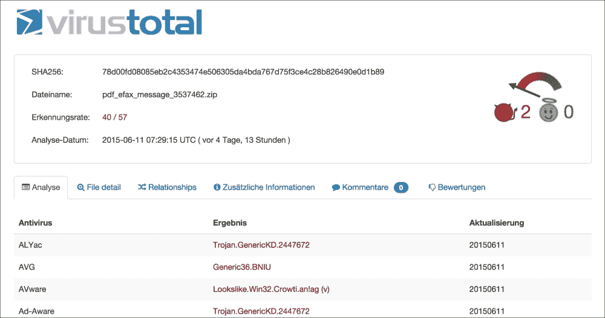

# 第四章：使用 Python 进行网络取证

本章将重点介绍网络层特定的取证调查部分。我们将选择一个最广泛使用的 Python 包，**Scapy**，用于处理和分析网络流量，以及美国陆军研究实验室发布的一个新开源框架 **Dshell**。对于这两个工具包，我们选择了有趣证据的示例。本章将教你以下内容：

+   如何在网络流量中搜索 IOC

+   如何提取文件进行进一步分析

+   如何通过 **服务器消息块**（**SMB**）监控访问的文件

+   如何构建自己的端口扫描器

# 在调查过程中使用 Dshell

**Dshell** 是一个基于 Python 的网络取证分析工具包，由美国陆军研究实验室开发，并在 2014 年末作为开源发布。它可以帮助简化网络层的取证调查。该工具包配备了大量可以开箱即用的解码器，非常有用。以下是其中一些解码器：

+   **dns**: 提取并总结 DNS 查询/响应

+   **reservedips**: 识别落在保留 IP 空间中的 DNS 解析

+   **large-flows**: 显示至少传输了 1MB 的网络流

+   **rip-http**: 从 HTTP 流量中提取文件

+   **protocols**: 识别非标准协议

+   **synrst**: 检测连接失败的尝试（SYN 后跟 RST/ACK）

可以通过从 GitHub 克隆源代码来安装 Dshell 到我们的实验环境，地址为 [`github.com/USArmyResearchLab/Dshell`](https://github.com/USArmyResearchLab/Dshell)，然后运行 `install-ubuntu.py`。此脚本将自动下载缺失的包，并构建之后所需的可执行文件。Dshell 可以用于处理在事件期间记录的 pcap 文件，或作为 IDS 警报的结果。**数据包捕获**（**pcap**）文件是由 libpcap（在 Linux 上）或 WinPcap（在 Windows 上）创建的。

在接下来的章节中，我们将通过展示来自 [`malware-traffic-analysis.net`](http://malware-traffic-analysis.net) 的真实场景，说明调查员如何利用 Dshell 工具包。

第一个示例是用户通过邮件链接遇到的恶意 ZIP 文件。用户登录到 Gmail 并点击邮件中的下载链接。这可以通过 Dshell 的 web 解码器轻松查看，如下所示：

```
user@lab:~$ source labenv/bin/activate
(labenv)user@lab:~$ ./dshell

(labenv)user@lab:~$ Dshell> decode -d web infected_email.pcap

web 2015-05-29 16:23:44     10.3.162.105:62588 ->   74.125.226.181:80    ** GET mail.google.com/ HTTP/1.1 // 200 OK  2015-05-29 14:23:40 **

web 2015-05-29 16:24:15     10.3.162.105:62612 <-    149.3.144.218:80    ** GET sciclubtermeeuganee.it/wp-content/plugins/feedweb_data/pdf_efax_message_3537462.zip HTTP/1.1 // 200 OK  2015-05-28 14:00:22 **

```

查看之前的流量提取时，ZIP 文件可能是第一个妥协指示器（Indicator of Compromise）。因此，我们应当更深入地分析它。最简单的方法是将 ZIP 文件从 pcap 文件中提取出来，并将其 md5 哈希值与 VirusTotal 数据库进行比较：

```
(labenv)user@lab:~$ Dshell> decode -d rip-http --bpf "tcp and port 62612" infected_email.pcap

rip-http 2015-05-29 16:24:15     10.3.162.105:62612 <-    149.3.144.218:80    ** New file: pdf_efax_message_3537462.zip (sciclubtermeeuganee.it/wp-content/plugins/feedweb_data/pdf_efax_message_3537462.zip) **
 --> Range: 0 - 132565
rip-http 2015-05-29 16:24:15     10.3.162.105:62612 <-    149.3.144.218:80    ** File done: ./pdf_efax_message_3537462.zip (sciclubtermeeuganee.it/wp-content/plugins/feedweb_data/pdf_efax_message_3537462.zip) **

(labenv)user@lab:~$ Dshell> md5sum pdf_efax_message_3537462.zip 
9cda66cba36af799c564b8b33c390bf4  pdf_efax_message_3537462.zip

```

在这个简单的案例中，我们的第一次猜测是正确的，因为下载的 ZIP 文件包含了另一个可执行文件，该文件是一个信息窃取恶意软件工具包的一部分，如下图所示：



另一个非常好的例子是通过 SMB 协议搜索网络共享上的访问文件。当试图找出攻击者是否能够访问甚至外泄数据时，这可以非常有帮助——如果成功的话——哪些数据可能已经泄露：

```
(labenv)user@lab:~$ Dshell> decode -d smbfiles exfiltration.pcap

smbfiles 2005-11-19 04:31:58    192.168.114.1:52704 ->  192.168.114.129:445   ** VNET3\administrator \\192.168.114.129\TEST\torture_qfileinfo.txt (W) **
smbfiles 2005-11-19 04:31:58    192.168.114.1:52704 ->  192.168.114.129:445   ** VNET3\administrator \\192.168.114.129\TESTTORTUR~1.TXT (-) **
smbfiles 2005-11-19 04:31:58    192.168.114.1:52705 ->  192.168.114.129:445   ** VNET3\administrator \\192.168.114.129\TEST\testsfileinfo\fname_test_18.txt (W) **

```

在**rip-smb-uploads**解码器的帮助下，Dshell 还能够自动提取记录的 pcap 文件中的所有上传文件。另一个有趣的例子是通过 Snort 规则帮助搜索 IOC，这也可以通过 Dshell 完成，如下所示：

```
(labenv)user@lab:~$ Dshell> decode -d snort malicious-word-document.pcap --snort_rule 'alert tcp any 443 -> any any (msg:"ET CURRENT_EVENTS Tor2Web .onion Proxy Service SSL Cert (1)"; content:"|55 04 03|"; content:"*.tor2web.";)' –snort_alert

snort 2015-02-03 01:58:26      38.229.70.4:443   --  192.168.120.154:50195 ** ET CURRENT_EVENTS Tor2Web .onion Proxy Service SSL Cert (1) **
snort 2015-02-03 01:58:29      38.229.70.4:443   --  192.168.120.154:50202 ** ET CURRENT_EVENTS Tor2Web .onion Proxy Service SSL Cert (1) **
snort 2015-02-03 01:58:32      38.229.70.4:443   --  192.168.120.154:50204 ** ET CURRENT_EVENTS Tor2Web .onion Proxy Service SSL Cert (1) **

```

在这个例子中，我们打开了一个可能含有恶意软件的 Word 文档，该文档是通过垃圾邮件收到的。这个 Word 文档试图下载**Vawtrak**恶意软件，并通过**Tor**网络进行通信。我们使用的 Snort 规则来源于 Emerging Threats（参考 [`www.emergingthreats.net/`](http://www.emergingthreats.net/)），它正在搜索已知的 **Tor2Web** 服务的 SSL 证书（一个允许用户在不使用 Tor 浏览器的情况下访问 **Tor Onion 服务**的服务）。可以使用所有可用的 Snort 规则进行类似的检查，如果你在网络中寻找特定的攻击，这些规则会非常有帮助。

作为示例 pcap 文件的替代方案，所有展示的例子也可以在活动网络连接上运行，通过使用 `–i interface_name` 标志，如下所示：

```
(labenv)user@lab:~$ Dshell> decode -d netflow -i eth0

2015-05-15 21:35:31.843922   192.168.161.131 ->    85.239.127.88  (None -> None)  TCP   52007      80     0      0        0        0  5.1671s
2015-05-15 21:35:31.815329   192.168.161.131 ->    85.239.127.84  (None -> None)  TCP   46664      80     0      0        0        0  5.1976s
2015-05-15 21:35:32.026244   192.168.161.131 ->    208.91.198.88  (None -> None)  TCP   40595      80     9     25     4797   169277  6.5642s
2015-05-15 21:35:33.562660   192.168.161.131 ->    208.91.198.88  (None -> None)  TCP   40599      80     9     19     4740    85732  5.2030s
2015-05-15 21:35:32.026409   192.168.161.131 ->    208.91.198.88  (None -> None)  TCP   40596      80     7      8     3843   121616  6.7580s
2015-05-15 21:35:33.559826   192.168.161.131 ->    208.91.198.88  (None -> None)  TCP   40597      80     5     56     2564   229836  5.2732s

```

在这个例子中，我们正在生成一个活动连接的 NetFlow 数据。Dshell 完全用 Python 编写，这使得它非常适应法医调查人员的各种需求，也可以与其他工具或预定义流程一起使用。

如果你想测试这个，可以从 [`www.emergingthreats.net/`](http://www.emergingthreats.net/) 下载示例文件。

# 在调查过程中使用 Scapy

另一个很棒的基于 Python 的工具是 **Scapy**，它可以分析和操控网络流量。根据开发者网站，[`www.secdev.org/projects/scapy/`](http://www.secdev.org/projects/scapy/)：

> *“Scapy 是一个强大的交互式数据包操控程序。它能够伪造或解码多种协议的数据包，发送它们到网络中，捕获它们，匹配请求和回复，等等。”*

Scapy 与标准工具（以及 Dshell）不同，它提供了一个功能，允许调查人员编写小型 Python 脚本，来操控或分析网络流量——无论是已录制的形式还是实时的。此外，Scapy 还具备执行深度数据包解析、被动操作系统指纹识别或通过第三方工具（如 **GnuPlot**）绘图的能力，因为内建功能已经可以使用。

以下 Python 脚本摘自*Grow Your Own Forensic Tools: A Taxonomy of Python Libraries Helpful for Forensic Analysis*，*SANS Institute InfoSec Reading Room*，是一个简短的示例，展示了 Scapy 的强大功能：

```
import scapy, GeoIP
from scapy import *

geoIp = GeoIP.new(GeoIP.GEOIP_MEMORY_CACHE)
def locatePackage(pkg):
  src=pkg.getlayer(IP).src
  dst=pkg.getlayer(IP).dst
  srcCountry = geoIp.country_code_by_addr(src)
  dstCountry = geoIp.country_code_by_addr(dst)
  print src+"("+srcCountry+") >> "+dst+"("+dstCountry+")\n"
try:
  while True:
    sniff(filter="ip", prn=locatePackage, store=0)
except KeyboardInterrupt:
  print "\n" + "Scan Aborted!"
```

本脚本记录了关于 IP 地址源和正在进行的网络连接目的地的地理位置统计信息。将 Scapy 包导入我们的 Python 脚本后，我们调用 sniff 函数并使用过滤器只检测 IP 数据包。如果计划长时间运行 Scapy 脚本，sniff 函数中的最后一个参数非常重要。通过 store 参数的帮助，可以告诉 Scapy 在运行时不要将所有数据包缓存到内存中，从而使脚本更快速且节省资源。随后的函数查询从每个数据包中提取的源和目的地 IP 地址的地理位置。

在下一个示例中，我们将说明如何在 Scapy 的帮助下构建一个非常简单的端口扫描器，具体如下：

```
#!/usr/bin/env python

import sys
from scapy.all import *

targetRange = sys.argv[1]
targetPort = sys.argv[2]
conf.verb=0

p=IP(dst=targetRange)/TCP(dport=int(targetPort), flags="S")
ans,unans=sr(p, timeout=9)

for answers in ans:
        if answers[1].flags == 2:
                print answers[1].src
```

这个小脚本能够扫描给定开放端口的整个 IP 范围。如果你正在寻找监听在端口 80 上的 Web 服务器，你可以使用如下的脚本：

```
(labenv)user@lab:~$ ./scanner.py 192.168.161.1/24 80
WARNING: No route found for IPv6 destination :: (no default route?)
Begin emission:..........
192.168.161.12
192.168.161.34
192.168.161.111
....

```

我们还可以使用**地址解析协议**（**ARP**）对我们的系统连接的整个网络范围进行侦察。借助以下脚本，我们可以获得一个漂亮打印的表格，列出所有在线的 IP 地址及其相应的 MAC 地址：

```
#! /usr/bin/env python

import sys
from scapy.all import srp,Ether,ARP,conf

if len(sys.argv) != 2:
        print "Usage: arp_ping <net> (e.g.,: arp_ping 192.168.1.0/24)"
        sys.exit(1)

conf.verb=0
ans,unans=srp(Ether(dst="ff:ff:ff:ff:ff:ff")/ARP(pdst=sys.argv[1]),
timeout=9)

print r"+------------------+-----------------+"
print r"|       MAC        |        IP       |"
print r"+------------------+-----------------+"
for snd,rcv in ans:
        print rcv.sprintf(r" %Ether.src% | %ARP.psrc%")
print r"+------------------+-----------------+"
```

执行脚本时，我们将收到类似以下内容的信息：

```
(labenv)user@lab:~$ ./arp_ping.py 192.168.161.131/24
WARNING: No route found for IPv6 destination :: (no default route?)
+------------------+-----------------+
|       MAC        |        IP       |
+------------------+-----------------+
 00:50:56:c0:00:08 | 192.168.161.1
 00:50:56:f5:d3:83 | 192.168.161.2
 00:50:56:f1:2d:28 | 192.168.161.254
+------------------+-----------------+

```

像这两个脚本一样的脚本，在系统上没有可用的端口扫描器，或者你希望将端口扫描器与其他基于 Python 的脚本串联以进行调查时非常有用。

# 摘要

本章提供了基于网络的取证调查领域的概述，并展示了使用 Dshell 和 Scapy 的示例。我们演示了如何查找可疑的 HTTP 连接（如文件下载）或如何通过 SMB 协议搜索泄露的数据。第二部分，我们利用 Scapy 创建了我们自己的端口扫描器，并用它来收集更多关于潜在被攻破系统的信息。

在我们讨论了取证算法、Windows 和 Unix 系统以及网络层之后，下一章将讨论虚拟化系统和虚拟机监控程序（hypervisor），这些已经成为每个公司不可或缺的一部分。
