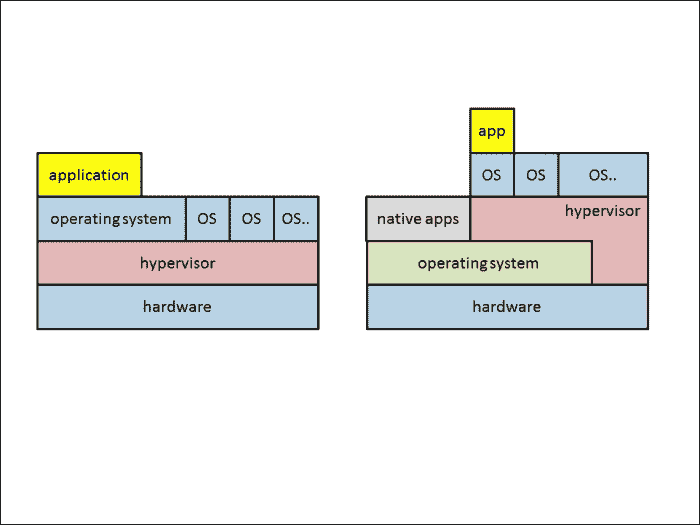
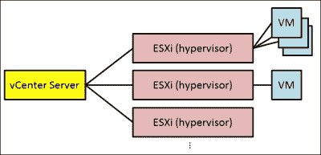
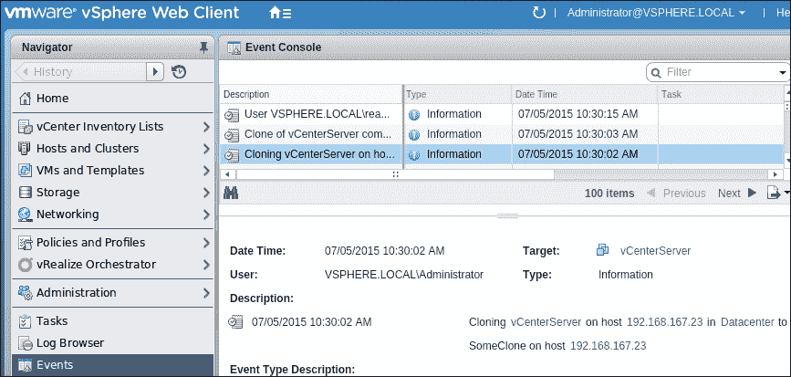
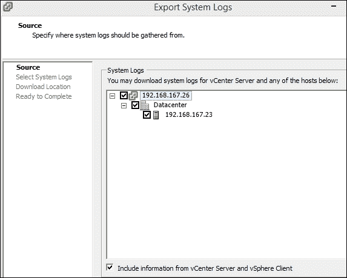
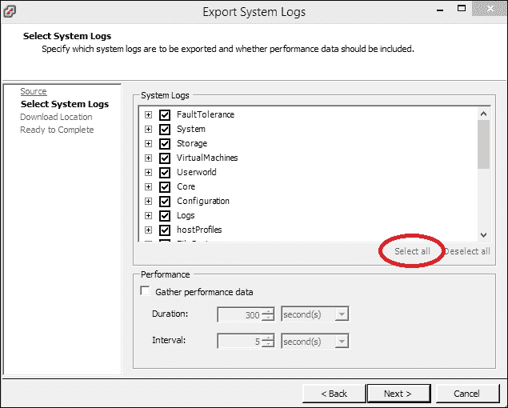
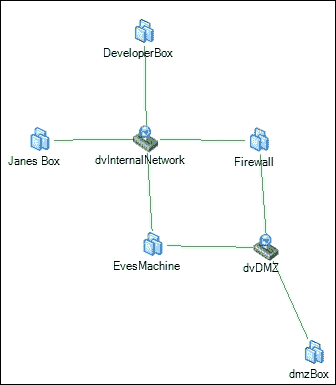

# 第五章：使用 Python 进行虚拟化取证

当前，虚拟化是现代 IT 领域最热门的概念之一。对于取证分析，它既带来了新的挑战，也引入了新的技术。

在本章中，我们将展示虚拟化如何引入以下内容：

+   新的攻击途径

+   收集证据的新机会

+   取证分析的新目标，例如虚拟化层

+   取证数据的新来源

# 将虚拟化视为一个新的攻击面

在开始取证分析之前，理解该寻找什么是非常重要的。通过虚拟化，出现了新的攻击途径和场景。在接下来的章节中，我们将描述一些场景，并讲解如何寻找相应的证据。

## 作为附加抽象层的虚拟化

虚拟化是模拟 IT 系统（如服务器、工作站、网络和存储）的技术。负责虚拟硬件仿真的组件被定义为**虚拟化管理程序**。下图展示了当前使用的两种主要的系统虚拟化类型：



左侧的架构被称为**裸机虚拟化管理程序**架构，也被称为**Type 1**虚拟化管理程序。在这种架构中，虚拟化管理程序替代了操作系统，直接运行在裸机硬件上。Type I 虚拟化管理程序的例子包括 VMware ESXi 和 Microsoft Hyper-V。

图片右侧的架构通常被称为**桌面虚拟化**或**Type 2**虚拟化管理程序。在这种架构中，有一个标准操作系统运行在硬件上，例如标准的 Windows 8 或 Linux 桌面系统。虚拟化管理程序在该操作系统上与其他本地应用程序一起运行。虚拟化管理程序的一些功能可能会直接与底层硬件交互，例如通过提供特殊的驱动程序。对于 Type 2 虚拟化管理程序，直接运行在硬件上的操作系统被称为**主机操作系统**，而运行在虚拟机上的操作系统被称为**客户操作系统**。Type 2 虚拟化管理程序架构的例子包括 Oracle VirtualBox 和 VMware Workstation。这些虚拟化管理程序可以像其他应用程序一样在现有操作系统上安装。

### 注意

尽管 Hyper-V 看起来像 Type 2 虚拟化管理程序，实际上它在安装过程中将主机操作系统转换为另一个客户操作系统，从而建立了 Type 1 架构。

几乎所有虚拟化环境的一个共同特点是能够创建**快照**。虚拟系统的快照包含系统在某一时刻的冻结状态。所有在快照创建之后对系统的更改，可以通过虚拟机监控器（hypervisor）回滚到创建快照时的状态。此外，大多数系统允许对单个系统拥有多个快照，并在不同的快照之间进行回滚和前进。快照可以作为法医数据的来源，我们将在*使用虚拟化作为证据来源*一节中演示这一点。

### 提示

**对于法医分析，快照应当被视为独立的机器！**

如果虚拟系统需要进行法医分析，始终检查该系统是否为虚拟系统以及是否存在快照。如果存在快照，法医分析必须针对每一个快照进行重复，就像每个快照都是一个独立的虚拟机。这样做的理由是，很可能不知道系统何时被攻破，攻击者何时试图销毁证据，最重要的是，攻击发生时运行的是哪个版本的虚拟机。

大多数虚拟化环境由多个虚拟机监控器组成。为了简化多个虚拟机监控器的管理，并启用额外的功能，例如：在虚拟机监控器之间移动机器以实现故障转移、负载均衡以及节省电力，这些环境提供了一个集中管理所有虚拟机监控器的组件。在 VMware vSphere 的情况下，这个管理组件叫做**vCenter Server**，如下所示：



如果使用**vCenter Server**，那么所有的管理任务应该通过这个**vCenter Server**实例来处理。

这个新的虚拟机监控器层是如何影响攻击场景和法医分析的？

新的虚拟机监控器层的引入也带来了一个新的层次，这个层次可以被用来在不被察觉的情况下操控虚拟系统，并且增加了一个新的层次，可能会成为攻击的目标。在接下来的章节中，我们将提供一些通过虚拟机监控器实施的攻击示例。

## 恶意虚拟机的创建

如果攻击者能够访问虚拟机监控器，他可能会创建新的虚拟资源。这些资源可以作为网络中的桥头堡，或者只是窃取环境中的内存和计算资源。因此，在进行虚拟机监控器环境的法医分析时，提取虚拟资源的创建和处置过程至关重要。

幸运的是，每个广泛使用的虚拟化环境都提供了 API 和语言绑定，可以列举该环境中的虚拟机及其他虚拟资源。在本章中，我们选择了 VMware vSphere 作为虚拟化环境的代表性示例。

### 注意

**VMware vSphere** 是最常用的本地虚拟化环境之一。它的基本结构由一个中央管理实例（称为 vCenter Server）和一个或多个实际托管虚拟环境（虚拟化管理程序，简称**ESXi**）的系统组成。要通过 Python 编程控制 vSphere 环境，使用的是 pyVmomi。这个 Python SDK 可以在 GitHub 上找到，网址为 [`github.com/vmware/pyvmomi`](https://github.com/vmware/pyvmomi)。

在接下来的内容中，我们将使用`pyVmomi`创建所有虚拟机的列表。建议定期运行此类清单扫描，将现有虚拟资产的列表与本地库存数据库进行对比。

我们建议使用`pip`安装 pyVmomi：

```
user@lab:~$ pip install --upgrade pyVmomi

```

### 提示

**pyVmomi 的示例代码**

在 GitHub 上有一个社区提供的关于`pyVmomi`的示例代码项目。更多关于这些示例的信息可以在 [`vmware.github.io/pyvmomi-community-samples/`](https://vmware.github.io/pyvmomi-community-samples/) 查阅。

然后，可以使用以下示例脚本来枚举 vSphere 环境中的所有系统：

```
#!/usr/bin/env python

from pyVim import connect
from pyVmomi import vmodl
import sys

def print_vm_info(vm):
    """
    Print the information for the given virtual machine.
    If vm is a folder, recurse into that folder.
    """

    # check if this a folder...
    if hasattr(vm, 'childEntity'):
        vms = vm.childEntity
        for child in vms:
            print_vm_info(child)

    vm_info = vm.summary

    print 'Name:      ', vm_info.config.name
    print 'State:     ', vm_info.runtime.powerState
    print 'Path:      ', vm_info.config.vmPathName
    print 'Guest:     ', vm_info.config.guestFullName
    print 'UUID:      ', vm_info.config.instanceUuid
    print 'Bios UUID: ', vm_info.config.uuid
    print "----------\n"

if __name__ == '__main__':
    if len(sys.argv) < 5:
        print 'Usage: %s host user password port' % sys.argv[0]
        sys.exit(1)

    service = connect.SmartConnect(host=sys.argv[1],
                                   user=sys.argv[2],
                                   pwd=sys.argv[3],
                                   port=int(sys.argv[4]))

    # access the inventory
    content = service.RetrieveContent()
    children = content.rootFolder.childEntity

    # iterate over inventory
    for child in children:
        if hasattr(child, 'vmFolder'):
            dc = child
        else:
            # no folder containing virtual machines -> ignore
            continue

        vm_folder = dc.vmFolder
        vm_list = vm_folder.childEntity
        for vm in vm_list:
            print_vm_info(vm)
```

该脚本创建了一个与 vCenter Server 平台的连接。然而，它也可以用来连接到单个 ESXi 虚拟化管理程序实例。这是因为该脚本所提供的 API 在两种管理模式下是相同的。

### 注意

`pyVmomi`使用的 API 是**vSphere Web Service API**。在 vSphere Web Services SDK 中有详细的描述，网址为 [`www.vmware.com/support/developer/vc-sdk/`](https://www.vmware.com/support/developer/vc-sdk/)。

高亮的行表明脚本使用了递归来枚举所有虚拟机。这是必要的，因为在 VMware vSphere 中，虚拟机可以被放入嵌套组中。

以下是此脚本的示例调用，以及输出的单个虚拟机信息：

```
user@lab:~$ python enumerateVMs.py 192.168.167.26 'readonly' 'mypwd' 443
Name:     vCenterServer
State:      poweredOff
Path:      [datastore1] vCenterServer/vCenterServer.vmx
Guest:     Microsoft Windows Server 2012 (64-bit)
UUID:      522b96ec-7987-a974-98f1-ee8c4199dda4
Bios UUID: 564d8ec9-1b42-d235-a67c-d978c5107179
----------

```

输出列出了虚拟机的名称、当前状态、配置文件路径、操作系统提示信息，以及实例和 BIOS 配置的唯一 ID。路径信息尤其重要，因为它显示了虚拟机配置文件和数据文件的存储位置。

## 系统克隆

在上一节中，我们使用了虚拟化管理程序的 API 来获取取证数据。在本节中，我们将寻找滥用此 API 的痕迹。因此，我们将分析 vSphere 安装的日志信息。

### 注意

**在中央日志系统中收集日志信息**

在本节中，我们假设日志信息是按照 vSphere 安装的默认设置存储的。然而，在设置系统时，我们建议将日志信息存储在专用的日志系统中。这可以使攻击者更难以篡改系统日志，因为他不仅需要访问目标系统，还需要访问中央日志收集系统。许多中央日志收集系统的另一个优势是内置的日志分析功能。

虽然强烈建议为法医分析保留所有系统日志的副本，但也可以使用 VMware vSphere 的事件浏览器单独查看单个事件，如下所示：



vSphere 环境提供收集并存储所有日志文件的归档功能。请按照以下步骤获取所有可用日志数据的归档：

+   使用 Windows 版本的 vSphere Web 客户端登录到**vCenter Server**。

+   在**管理**菜单中，选择**导出系统日志**。

+   选择一个或多个 vCenter Server 导出日志，如下所示：

+   在提示选择**系统日志**时，确保选择所有日志类型，如下所示：

日志文件以压缩归档的形式保存。每个归档代表一个系统的日志信息，即 vCenter Server 或 ESXi 主机。

首先，我们将使用 `tar` 提取收集的日志文件，命令如下：

```
user@lab:~$ tar xfz 192.168.167.26-vcsupport-2015-07-05@11-21-54.tgz

```

该归档的文件名遵循格式：主机/IP—`vcsupport`（用于 vCenter Server）—时间戳。该归档中的目录遵循 vc-主机名-时间戳命名规则，例如 `vc-winserver-2015-07-05--02.19`。归档名称和其中包含的目录的时间戳通常不匹配。这可能是由于时钟漂移以及传输和压缩日志所需的时间造成的。

在接下来的内容中，我们将使用 vCenter Server 的日志重建表示虚拟机克隆的事件。在这个例子中，我们将利用日志的冗余性，使用 vCenter Server 核心服务之一的日志数据：`vpxd`，即核心 vCenter 守护进程：

```
#!/usr/bin/env python

import gzip
import os
from os.path import join
import re
import sys

# used to map session IDs to users and source IPs
session2user_ip = {}

def _logopen(filename):
    """Helper to provide transparent decompressing of compressed logs,
       if indicated by the file name.
    """
    if re.match(r'.*\.gz', filename):
        return gzip.open(filename, 'r')

    return open(filename, 'r')

def collect_session_data(vpxlogdir):
    """Uses vpx performance logs to map the session ID to
       source user name and IP"""
    extract = re.compile(r'SessionStats/SessionPool/Session/Id=\'([^\']+)\'/Username=\'([^\']+)\'/ClientIP=\'([^\']+)\'')

    logfiles = os.listdir(vpxlogdir)
    logfiles = filter(lambda x: 'vpxd-profiler-' in x, logfiles)
    for fname in logfiles:
        fpath = join(vpxlogdir, fname)
        f = _logopen(fpath)

        for line in f:
            m = extract.search(line)
            if m:
                session2user_ip[m.group(1)] = (m.group(2), m.group(3))

        f.close()

def print_cloning_hints(basedir):
    """Print timestamp, user, and IP address for VM cloning without
       by reconstructing from vpxd logs instead of accessing
       the 'official' event logs"""
    vpxlogdir = join(basedir, 'ProgramData',
                              'vCenterServer',
                              'logs',
                              'vmware-vpx')
    collect_session_data(vpxlogdir)

    extract = re.compile(r'^([^ ]+).*BEGIN task-.*?vim\.VirtualMachine\.clone -- ([0-9a-f-]+).*')

    logfiles = os.listdir(vpxlogdir)
    logfiles = filter(lambda x: re.match('vpxd-[0-9]+.log(.gz)?', x), logfiles)
    logfiles.sort()

    for fname in logfiles:
        fpath = join(vpxlogdir, fname)
        f = _logopen(fpath)

        for line in f:
            m = extract.match(line)
            if m == None:
                continue

            timestamp = m.group(1)
            session = m.group(2)
            (user, ip) = session2user_ip.get(session, ('***UNKNOWN***', '***UNKNOWN***'))
            print 'Hint for cloning at %s by %s from %s' % (timestamp, user, ip)

if __name__ == '__main__':
    if len(sys.argv) < 2:
        print 'Usage: %s vCenterLogDirectory' % sys.argv[0]
        sys.exit(1)

    print_cloning_hints(sys.argv[1])
```

首先，这个脚本读取所谓的 `vpxd` 性能日志。该日志包含有关客户端会话的数据，我们使用它提取从唯一会话标识符到客户端用户名及客户端连接的 IP 地址的映射。第二步，搜索 `vpxd` 的主日志，查找 `vim.VirtualMachine.clone` 类型任务的开始，即在服务器端克隆虚拟机。然后，在从性能日志中提取的映射中查找会话信息，以获取可能的克隆事件数据，如下所示：

```
user@lab:~$ python extractCloning.py vc-winserver-2015-07-05--02.19/
Hint for cloning at 2015-07-05T01:30:01.071-07:00 by VSPHERE.LOCAL\Administrator from 192.168.167.26

```

在这个例子中，脚本揭示了`Administrator`账户被用来克隆虚拟机。这个提示可以与 vCenter Server 的事件日志相关联，并且在那里也会显示出来。如果没有显示，那么这就是一个强烈的迹象，表明环境可能已被入侵。

### 注意

根据你的系统环境，像克隆和导出虚拟机这样的操作可能是日常操作的一部分。在这种情况下，可以使用之前的脚本或其变体来检测执行这些操作的异常用户或来源 IP。

类似的搜索和关联也可以应用于其他感兴趣的事件。数据存储区文件的复制或虚拟机的导出是值得关注的候选项。

# 搜索虚拟资源的滥用

我们不仅仅是在寻找有动机的攻击者。通过虚拟化，还有合法的虚拟基础设施管理员，通过改变一些规则来简化自己的工作。此外，攻击者可能利用虚拟化的强大功能，根据自己的需求重塑基础设施的拓扑。在接下来的章节中，我们将展示一些场景和检测方法。

## 检测恶意网络接口

网络虚拟化允许操作人员在静态的物理网络中创建几乎任意的网络基础设施。这种能力有时被称为**数据中心即服务**（**DCaaS**）。DCaaS 允许客户利用物理数据中心的定义部分，在软件中定义虚拟数据中心。

由于恶意访问此功能或人为错误，结果可能导致网络配置暴露内部资源到互联网，绕过防火墙，或允许访问恶意服务。

因此，我们将展示一种简单的方式，使用 Python 编程获取 vSphere 环境的网络配置。

### 提示

**可视化虚拟网络**

大多数虚拟化环境都具备可视化虚拟网络设置的内建能力。例如，VMware vSphere 可以创建网络拓扑图。在取证分析中，这可以作为起点，并支持将下一步的焦点集中在最有潜力的资源上。



这张图是通过 Windows 客户端软件为 VMware vCenter Server 生成的，展示了我们的测试设置。显然，**EvesMachine**未能正确连接，也就是说，它能够绕过**防火墙**。

`pyVmomi`的社区示例脚本已经提供了一个脚本，用于遍历所有网络接口，[`github.com/vmware/pyvmomi-community-samples/blob/master/samples/getvnicinfo.py`](https://github.com/vmware/pyvmomi-community-samples/blob/master/samples/getvnicinfo.py)，并显示虚拟机的连接。因此，我们修改了这个脚本，仅显示那些有多个网络连接的虚拟机，如下所示：

```
#!/usr/bin/env python

from pyVim import connect
from pyVmomi import vmodl
from pyVmomi import vim
import sys

def generate_portgroup_info(content):
    """Enumerates all hypervisors to get
       network infrastructure information"""
    host_view = content.viewManager.CreateContainerView(content.rootFolder,
                                        [vim.HostSystem],
                                        True)
    hostlist = [host for host in host_view.view]
    host_view.Destroy()

    hostPgDict = {}
    for host in hostlist:
        pgs = host.config.network.portgroup
        hostPgDict[host] = pgs

    return (hostlist, hostPgDict)

def get_vms(content, min_nics=1):
    vm_view = content.viewManager.CreateContainerView(content.rootFolder,
                                        [vim.VirtualMachine],
                                        True)
    vms = [vm for vm in vm_view.view]
    vm_view.Destroy()

    vm_with_nics = []
    for vm in vms:
        num_nics = 0
        for dev in vm.config.hardware.device:
            # ignore non-network devices
            if not isinstance(dev, vim.vm.device.VirtualEthernetCard):
                continue

            num_nics = num_nics + 1
            if num_nics >= min_nics:
                vm_with_nics.append(vm)
                break

    return vm_with_nics

def print_vm_info(vm, hosts, host2portgroup, content):
    print "\n=== %s ===" % vm.name

    for dev in vm.config.hardware.device:
        if not isinstance(dev, vim.vm.device.VirtualEthernetCard):
            continue

        dev_backing = dev.backing
        if hasattr(dev_backing, 'port'):
            # NIC is connected to distributed vSwitch
            portGroupKey = dev.backing.port.portgroupKey
            dvsUuid = dev.backing.port.switchUuid
            try:
                dvs = content.dvSwitchManager.QueryDvsByUuid(dvsUuid)
            except:
                portGroup = 'ERROR: DVS not found!'
                vlanId = 'N/A'
                vSwitch = 'N/A'
            else:
                pgObj = dvs.LookupDvPortGroup(portGroupKey)
                portGroup = pgObj.config.name
                vlObj = pgObj.config.defaultPortConfig.vlan
                if hasattr(vlObj, 'pvlanId'):
                    vlanId = str(pgObj.config.defaultPortConfig.vlan.pvlanId)
                else:
                    vlanId = str(pgObj.config.defaultPortConfig.vlan.vlanId)
                vSwitch = str(dvs.name)
        else:
            # NIC is connected to simple vSwitch
            portGroup = dev.backing.network.name
            vmHost = vm.runtime.host

            # look up the port group from the
            # matching host
            host_pos = hosts.index(vmHost)
            viewHost = hosts[host_pos]
            pgs = host2portgroup[viewHost]

            for p in pgs:
                if portgroup in p.key:
                    vlanId = str(p.spec.vlanId)
                    vSwitch = str(p.spec.vswitchName)

        if portGroup is None:
            portGroup = 'N/A'

        print '%s -> %s @ %s -> %s (VLAN %s)' % (dev.deviceInfo.label,
                                                 dev.macAddress,
                                                 vSwitch,
                                                 portGroup,
                                                 vlanId)

def print_dual_homed_vms(service):
    """Lists all virtual machines with multiple
       NICs to different networks"""

    content = service.RetrieveContent()
    hosts, host2portgroup = generate_portgroup_info(content)
    vms = get_vms(content, min_nics=2)
    for vm in vms:
        print_vm_info(vm, hosts, host2portgroup, content)

if __name__ == '__main__':
    if len(sys.argv) < 5:
        print 'Usage: %s host user password port' % sys.argv[0]
        sys.exit(1)

    service = connect.SmartConnect(host=sys.argv[1],
                                   user=sys.argv[2],
                                   pwd=sys.argv[3],
                                   port=int(sys.argv[4]))
    print_dual_homed_vms(service)
```

首先，这个脚本遍历所有（虚拟机监控器）主机，以收集每个 ESXi 系统上存在的虚拟交换机的信息。然后，它遍历所有虚拟机，收集那些拥有多个网络接口卡的虚拟机。接着，虚拟网络卡的信息与虚拟交换机的信息结合，推导出关于网络连接的信息。

这是我们实验环境中的示例输出，如前所述：

```
user@lab:~$ python listDualHomed.py 192.168.167.26 readonly 'mypwd' 443
=== EvesMachine ===
Network adapter 1 -> 00:50:56:ab:04:38 @ dvSwitch -> dvInternalNetwork (VLAN 8)
Network adapter 2 -> 00:50:56:ab:23:50 @ dvSwitch -> dvDMZ (VLAN 0)

=== Firewall ===
Network adapter 1 -> 00:50:56:ab:12:e6 @ dvSwitch -> dvInternalNetwork (VLAN 8)
Network adapter 2 -> 00:50:56:ab:4b:62 @ dvSwitch -> dvDMZ (VLAN 0)

```

我们的脚本正确识别了两个系统，`EvesMachine` 和 `Firewall`，它们同时连接到不同的网络。在这个特定的案例中，两个系统都可以用来在同一个虚拟交换机 `dvSwitch` 上连接 `VLAN 0` 和 `VLAN 8`。

## 检测直接硬件访问

听起来可能像是自相矛盾，但大多数虚拟化技术允许直接硬件访问。允许虚拟系统直接访问某些硬件，而不必通过虚拟机监控器提供服务的合法理由如下：

+   **应连接到虚拟机的特殊硬件**：特殊硬件，如虚拟时间服务器的无线时钟或作为复制保护机制一部分的加密狗。

+   **虚拟系统临时使用物理介质**：有时，这种功能用于从虚拟环境中访问物理系统的介质，例如从物理介质恢复备份到虚拟系统。通常，应该优先使用网络附加存储系统，而不是将物理介质附加到虚拟系统。

+   **虚拟机永久使用虚拟机监控器的驱动器**：如果虚拟系统使用的是通过物理介质提供的软件，因此需要访问真实的物理驱动器来安装和更新软件，这种方式可能是有用的。然而，应该考虑使用下载版本或 ISO 镜像，而不是授予直接访问虚拟机监控器硬件的权限。

    正如你可能猜到的，根据这个列表，直接硬件访问在现代虚拟化数据中心中更像是例外而非常规。此外，直接访问虚拟机监控器硬件会破坏虚拟化的一个基本原则。

    ### 注意

    直接硬件访问绕过了虚拟化环境的安全机制，也就是说，所有虚拟硬件都由虚拟机监控器控制。因此，直接硬件访问总是带来虚拟机监控器资源篡改、数据泄漏和系统不稳定的风险。

以下是一些最可能是恶意的直接附加硬件的示例：

+   网络设备（创建对虚拟机监控器不可见的网络连接）

+   键盘、鼠标等（创建对虚拟机监控器不可见的控制台访问）

+   虚拟机监控器磁盘分区

后者特别危险。如果虚拟机设法获得对虚拟机监控器的原始磁盘访问，它可以操控虚拟化环境。后果包括对虚拟化环境的完全控制，并可以访问所有虚拟机、所有虚拟网络，具备创建新恶意资源的能力，并重塑整个网络拓扑。

### 注意

对于 VMware vSphere，直接硬件访问权限存储在虚拟机的配置中。因此，从未知或不受信任的来源（以 vSphere 的本地格式）导入虚拟机可能会创建恶意硬件访问权限。

以下脚本连接到 VMware vSphere 实例，并列出所有具有直接硬件访问权限的虚拟机：

```
#!/usr/bin/env python

from pyVim import connect
from pyVmomi import vmodl
from pyVmomi import vim
import re
import sys

def get_vms(content):
    """Returns a list of all virtual machines."""
    vm_view = content.viewManager.CreateContainerView(content.rootFolder,
                                                      [vim.VirtualMachine],
                                                      True)
    vms = [vm for vm in vm_view.view]
    vm_view.Destroy()
    return vms

def print_vm_hardware_access(vm):
    findings = []

    for dev in vm.config.hardware.device:
        if isinstance(dev, vim.vm.device.VirtualUSB):
            findings.append('USB access to host device ' + dev.backing.deviceName)
        elif isinstance(dev, vim.vm.device.VirtualSerialPort):
            findings.append('Serial port access')
        elif isinstance(dev, vim.vm.device.VirtualCdrom):
            if not dev.backing is None:
                if 'vmfs/devices/cdrom' in dev.backing.deviceName:
                    findings.append('Access to CD/DVD drive')
        elif isinstance(dev, vim.vm.device.VirtualDisk):
            if dev.backing is None or \
               dev.backing.fileName is None or \
               re.match(r'.*\.vmdk', dev.backing.fileName) is None:
               findings.append('Suspicious HDD configuration')

    if len(findings) > 0:
        print '=== %s hardware configuration findings ===' % vm.name
        for l in findings:
            print l
        print "\n"

def print_direct_hardware_access(content):
    vms = get_vms(content)
    for vm in vms:
        print_vm_hardware_access(vm)

if __name__ == '__main__':
    if len(sys.argv) < 5:
        print 'Usage: %s host user password port' % sys.argv[0]
        sys.exit(1)

    service = connect.SmartConnect(host=sys.argv[1],
                                   user=sys.argv[2],
                                   pwd=sys.argv[3],
                                   port=int(sys.argv[4]))

    # access the inventory
    content = service.RetrieveContent()
    print_direct_hardware_access(content)
```

这个脚本非常急功近利，即它不会检查设备是否实际上处于连接状态，或是否可以通过设备访问媒体。然而，类似以下的输出提示需要更深入的检查：

```
user@lab:~$ python listHardwareAccess.py 192.168.167.26 readonly pwd 443
=== EvesMachine hardware configuration findings ===
Access to CD/DVD drive
Serial port access
USB access to host device path:2/0 version:2

=== DeveloperBox hardware configuration findings ===
Access to CD/DVD drive

=== dmzBox hardware configuration findings ===
Access to CD/DVD drive

```

`EvesMachine` 似乎具有对其虚拟机监控器系统上附加的 USB 设备的直接访问权限。此外，似乎还有与虚拟机监控器的串口的直接连接。通常不应允许访问虚拟机监控器的 `CD/DVD 驱动器`。然而，对于许多安装，人们往往会使用虚拟机监控器的光驱来安装或更新软件。

### 提示

**从 VMX 文件中提取硬件配置**

使用如前所述的脚本需要访问虚拟环境。因此，这类脚本的主要目的是缩小取证调查的范围。为了确保证据和记录的永久性，应该从数据存储区复制虚拟机的目录。在那里，VMX 文件包含所有与虚拟机相关的配置设置，包括硬件访问权限。

在本节和上一节中，虚拟化被视为额外的攻击面。在接下来的章节中，我们将概述虚拟化技术如何真正支持取证调查。

# 将虚拟化作为证据来源

虚拟化不仅在取证调查中是危险且具有挑战性的，它还具有将虚拟化作为收集取证证据的工具的潜力。在接下来的章节中，您将看到可能导致证据的各种来源。

## 创建内存内容的取证副本

通常，创建系统内存内容的副本需要访问目标系统、登录、安装所需工具，并将内存转储复制到外部媒体。这些步骤都是侵入性的，即改变系统的状态，并可能被攻击者或其恶意软件检测到。此外，具有管理员权限的攻击者可能会通过操控内存分配和保护算法来隐藏部分系统内存，例如，隐藏内存转储中的一部分内容。

为了克服这种方法的缺点，可以利用虚拟机监控器层来获取虚拟系统内存的完整、未篡改的副本。以下脚本可用于创建包含虚拟机 RAM 内容的快照：

```
#!/usr/bin/env python

from pyVim import connect
from pyVmomi import vim
from datetime import datetime
import sys

def make_snapshot(service, vmname):
    """Creates a snapshot of all virtual machines with the given name"""

    snap_name = 'Memory_Snapshot'
    snap_desc = 'Snapshot for investigation taken at ' + datetime.now().isoformat()

    content = service.RetrieveContent()
    vm_view = content.viewManager.CreateContainerView(content.rootFolder,
                                                      [vim.VirtualMachine],
                                                      True)
    vms = [vm for vm in vm_view.view if vm.name==vmname]
    vm_view.Destroy()

    for vm in vms:
        print 'Taking snapshot from VM UUID=%s' % vm.summary.config.uuid
        vm.CreateSnapshot_Task(name = snap_name,
                               description = snap_desc,
 memory = True,
                               quiesce=False)
        print "Done.\n"

if __name__ == '__main__':
    if len(sys.argv) < 6:
        print 'Usage: %s host user password port vmname' % sys.argv[0]
        sys.exit(1)

    service = connect.SmartConnect(host=sys.argv[1],
                                   user=sys.argv[2],
                                   pwd=sys.argv[3],
                                   port=int(sys.argv[4]))

    make_snapshot(service, sys.argv[5])
```

此脚本会搜索指定名称的虚拟机并创建快照。突出显示的参数会使 vSphere 将虚拟机的 RAM 内容与其他快照数据文件一起写入数据存储区。

这些 RAM 转储文件位于虚拟机目录中。本章中的枚举脚本显示了该目录的路径。此外，vSphere 客户端允许浏览和下载虚拟机的数据存储区。

RAM 内容存储在扩展名为 `.vmem` 的文件中，例如 `EvesMachine-Snapshot2.vmem`。

## 将快照作为磁盘镜像使用

对于物理系统，创建取证磁盘镜像通常需要将系统下线，关机，拆卸硬盘并进行复制。显然，在此过程中系统无法正常运行，因此，业务所有者通常不愿意批准这些停机时间，因为他们对可能发生的安全漏洞存在模糊的怀疑。

另一方面，创建虚拟机快照基本上不会造成任何停机，但结果是一个具有取证严谨性的虚拟资产磁盘镜像。

### 提示

**始终检查系统是否为虚拟机！**

由于为虚拟系统创建取证数据比为物理系统创建要容易得多，因此取证调查的第一步应该是检查目标系统是否为虚拟系统。

快照的创建与上一节中的脚本相同。对于 VMware vSphere 5，必须从虚拟机监控器的数据存储目录复制所有文件，以获取硬盘的完整转储。如果虚拟系统仍在运行，则某些文件可能无法复制，因为虚拟机监控器在这些文件正在使用时不允许读取访问。通常，这不是问题，因为这些文件仅供快照使用，也就是说，自快照创建以来的所有更改都存储在特殊的快照文件中。

在 VMware vSphere 6 中，快照机制已发生变化。创建快照后所做的磁盘更改不会写入快照文件，而是直接写入表示虚拟硬盘的文件中。快照文件用于保留磁盘驱动器的原始内容（写时复制行为）。

因此，从 VMware vSphere 6 环境中复制的文件将包含虚拟机目录的所有条目。

对于取证分析，捕获的磁盘镜像可以连接到虚拟取证工作站。在那里，这些镜像可以像任何其他物理硬盘一样进行处理。当然，原始副本必须保持完好，以确保取证的严谨性。

## 捕获网络流量

虚拟化环境不仅代表虚拟机和**网络接口卡**（**NIC**），还代表了连接这些系统所需的虚拟网络设备。通过在虚拟交换机上添加一个监控端口并连接一个系统，可以捕获整个虚拟网络的所有网络流量。

### 注意

如果 VMware vSphere 中的虚拟系统被允许将 NIC 切换为混杂模式，那么这将自动使相应的交换机端口进入监控模式。

此外，VMware vSphere 的企业版提供了一种虚拟交换机的高级版本，称为**vSphere 分布式交换机**（**VDS**）。该交换机可以更像物理交换机，并提供端口镜像功能，将选定端口的流量镜像到指定端口以进行流量分析。此外，该交换机还能够将 NetFlow 日志提供给指定端口。

对于标准虚拟交换机，需要执行以下步骤以监控网络流量：

+   在此交换机上创建一个新的端口组进行监控。虽然这并非严格要求，但强烈建议这么做。如果没有一个专用的端口组进行监控，那么交换机上的所有虚拟系统将能够监控交换机的所有流量。

+   修改此端口组的**安全**设置，并将**混杂模式**更改为**接受**。

+   将虚拟捕获系统的网络卡配置到新的端口组。此系统现在可以捕获该交换机的所有网络流量。

具体步骤可能会根据虚拟交换机的类型和版本有所不同。然而，核心信息是，虚拟化环境可以简化网络流量捕获的任务。此外，物理交换机和虚拟交换机的行为有所不同，例如，它们会对连接的网络卡的配置变化做出反应。

在下一章中，我们将看到如何生成和分析这些捕获的网络流量。

# 总结

在本章中，我们概述了虚拟化如何改变不仅仅是 IT 运维的格局，也改变了攻击者和取证专家的工作方式。系统可以因善意或恶意的原因被创建、重构和复制。

我们提供了如何检测 vSphere 虚拟化环境中可能存在的恶意行为或配置的示例。此外，我们演示了虚拟化如何有助于从应分析的系统中获取未经篡改的 RAM 转储。在下一章中，您将看到如何分析这些 RAM 转储的示例。

通过这些知识，您现在已经准备好在取证分析中分析和利用虚拟环境。
