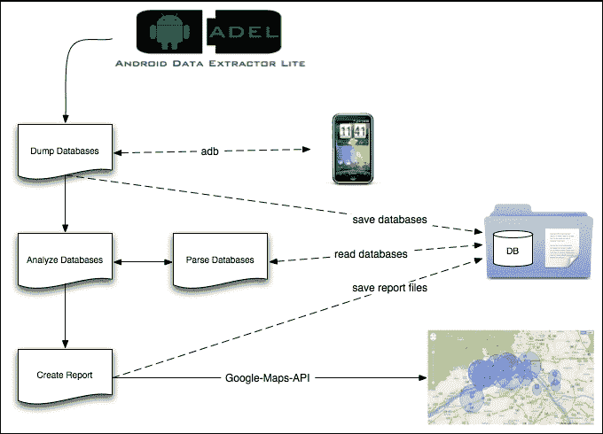
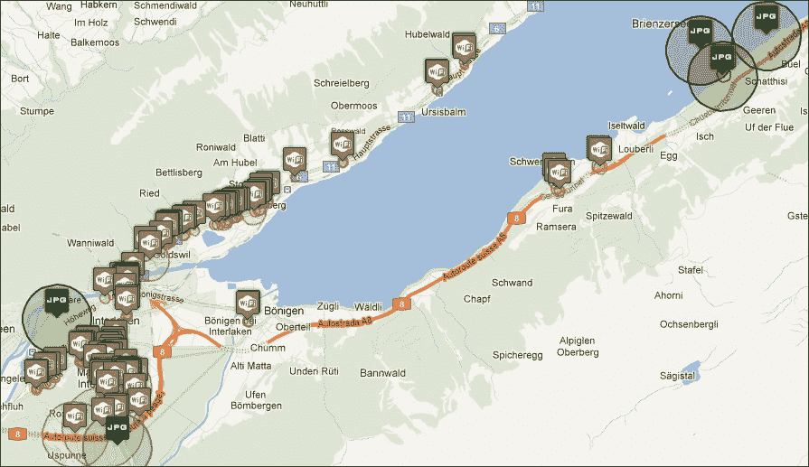

# 第六章：使用 Python 进行移动法医分析

尽管标准计算机硬件（如硬盘）的法医分析已发展为一门稳定的学科，并有许多参考资料，例如*《文件系统法医分析》*一书，作者为*Brian Carrier*，由*Addison-Wesley Professional*出版，以及我们之前的章节，关于分析非标准硬件或瞬态证据的技术仍然存在许多争议。尽管智能手机在数字调查中的作用日益增加，但由于其异质性，智能手机仍被视为非标准设备。在所有调查中，遵循基本的法医原则是必要的。法医调查的两大原则如下：

+   必须非常小心，以确保证据被尽可能少地篡改或改变。

+   数字调查的过程必须易于理解，并且接受审查。最好是，调查结果必须能够被独立调查员复现。

特别是第一个原则，在智能手机的情况下尤其具有挑战性，因为大多数智能手机采用特定的操作系统和硬件保护方法，这些方法会阻止对系统中数据的无限制访问。

硬盘的数据保存在大多数情况下是一个简单且熟知的程序。调查员将硬盘从计算机或笔记本中取出，借助写保护器（例如，Tableau TK35）将其连接到工作站，并使用知名且经过认证的软件解决方案进行分析。与此相比，智能手机世界显然没有这样的程序。几乎每款智能手机都有其自己构建存储的方式，因此对于每款智能手机，调查员需要有自己的方法来获取存储的转储数据。虽然从智能手机中获取数据非常困难，但与数据的多样性相比，可以获取更多的数据。智能手机存储的数据，除了常见的文件（例如，照片和文档），还包括 GPS 坐标以及智能手机在关闭之前所连接的移动基站的位置。

考虑到由此产生的机会，结果表明，额外的支出对于调查员而言是值得的。

本章将涵盖以下主题：

+   *Eoghan Casey*提出的调查模型被智能手机采用

+   Android 智能手机的分析（手动分析以及通过**Android 数据提取器 Lite**（**ADEL**）进行自动化分析）

+   iOS 智能手机的分析

# 智能手机的调查模型

*Eoghan Casey* 的**调查过程模型**，也被称为**楼梯模型**，提供了一个实用的、系统的逐步指南，以进行有效的数字调查。该模型被描绘为一系列上升的楼梯，从事件警报或指控开始，到证言结束。这些步骤的设计尽可能通用。该模型试图融合警方职责和法医专家的任务。以下要点解释了调查过程模型的每个步骤以及处理智能手机与计算机之间的差异：

+   **事件警报或指控**：指控是整个过程的起始信号。在此阶段，来源将被评估并请求详细的询问。

+   **价值评估**：在价值评估范围内，公诉方的利益与起诉犯罪行为所需的成本进行比较。对于公司而言，这通常会导致不提起诉讼（至少对于较小的事件）。起诉的优势在于可能的赔偿、提升自身安全性以及一定的威慑效应。起诉的劣势在于需要资源、在调查过程中可能出现的系统停机无法进行生产性使用，以及大多数时候带来的负面公众扩散效应。

+   **事件或犯罪现场协议**：在经典的刑事学中，通常要求对犯罪现场进行大范围封闭。*Eoghan Casey* 表达了以下观点：

    > *“冻结”证据并为随后的所有活动提供“真实依据”。*

    对于不同种类的数字痕迹，必须根据个别情况检查冷冻过程的具体定义。总的来说，必须最大限度地减少改变痕迹的风险。对于智能手机，这意味着它们必须放入一个连接到外部电源的法拉第袋中。

+   **身份识别或扣押**：在传统的扣押过程中，所有可能作为证据的物品和对象都会被收取。在这里，重要的是不能对证据进行任何更改。此外，证据的环境可能具有重大意义。扣押时，证据链同时开始。关于扣押的推荐读物是由*美国司法部*出版的小册子《电子犯罪现场调查：初步响应者指南》。该小册子为非技术人员提供了准确且详细的建议。另一个好的来源是文件《搜查和扣押计算机及获取电子证据的刑事调查》，同样由*美国司法部*出版。

+   **保留**：在确保证据的过程中，必须确保这些证据未被修改。这就是为什么所有证据都会被记录、拍照、封存，然后锁起来。在数字证据的情况下，这意味着首先创建证据的副本；进一步的调查仅在副本上进行。为了证明证据副本的真实性，使用加密哈希函数。通常情况下，这对于手机取证是最困难的部分，因为某些类型的手机无法创建一对一的副本。我们将在接下来的部分中展示如何创建可以在调查中使用的备份。

+   **恢复**：*Eoghan Casey*将恢复描述为*撒网*。特别是这一阶段包括恢复已删除、隐藏、掩盖或以其他方式无法访问的证据。建议利用与其他证据的协同作用。例如，在需要读取加密数据的情况下，合理的做法是测试是否在犯罪现场找到了包含密码的便签。

+   **采集**：在证据分析过程中，需要一个结构良好的组织来处理大量的数据。因此，应该首先调查元数据，而不是实际数据。例如，数据可以根据文件类型或访问时间进行分组。这直接引导到下一个阶段——**数据缩减**。

+   **缩减**：缩减任务的目的是消除不相关的数据。也可以使用元数据来实现这一目的。例如，数据可以根据数据类型进行缩减。一个合适的场景是，如果指控允许，可以将所有数据缩减为图像数据。该阶段的结果是——根据*Eoghan Casey*的说法：

    > *最小的数字信息集合，具有最高的潜力来包含有证明价值的数据。*

    *这意味着找到最小的、最有可能相关且具有证明价值的数据。在这种情况下，已知文件的哈希数据库，例如**国家软件参考库**（**NIST**），有助于排除已知文件（我们在第二章中描述了如何使用这个库，*法医算法*）。*

+   **组织与搜索**：组织的方面包括结构化数据并使其能够进行扫描。因此，通常会创建索引和概览，或者根据其类型将文件排序到有意义的目录中。这简化了后续步骤中数据的引用。

+   **分析**：此阶段包括对文件内容的详细分析。其中特别需要绘制数据与人员之间的联系，以确定负责人员。此外，内容和背景的评估是根据手段、动机和机会进行的。在此步骤中，实验对于确定未记录的行为和开发新方法是有帮助的。所有结果需要经过测试，并且应该能够通过科学方法进行验证。

+   **报告**：报告不仅仅是呈现结果，还需要展示如何得出这些结果。为此，所有考虑的规则和标准应当记录下来。此外，所有得出的结论需要有依据，并且需要讨论其他解释模型。

+   **说服与证词**：最后，证人出庭作证，提供关于该主题的权威意见。最重要的方面是该权威的可信度。例如，技术排斥的听众或辩护律师提出的困难类比可能会成为问题。

通过查看前面描述的过程，可以发现处理智能手机时，与其他类型证据的处理几乎没有太大变化。然而，对于调查人员来说，了解在哪些步骤上需要特别注意是非常重要的。

# Android

我们将通过 Python 帮助检查的第一个移动操作系统是 Android。在第一小节中，我们将展示如何手动检查智能手机，接下来是使用 ADEL 的自动化方法。最后，我们将演示如何将分析结果的数据合并，创建移动轨迹。

## 手动检查

第一步是获取智能手机的 root 权限。这样做是为了绕过内部系统保护并访问所有数据。获取 root 权限对大多数手机来说是不同的，并且强烈依赖于操作系统版本。最好的方法是创建自己的**恢复镜像**并通过内置的恢复模式启动手机。

获取 root 权限后，下一步是尝试获取明文屏幕锁，因为这个*秘密*通常用于不同的保护措施（例如，屏幕锁可以作为手机应用程序的密码）。破解 PIN 码或密码的屏幕锁可以通过以下脚本完成：

```
import os, sys, subprocess, binascii, struct
import sqlite3 as lite

def get_sha1hash(backup_dir):

    # dumping the password/pin from the device
    print "Dumping PIN/Password hash ..."
    password = subprocess.Popen(['adb', 'pull', '/data/system/password.key', backup_dir], 
        stdout=subprocess.PIPE, stdin=subprocess.PIPE, stderr=subprocess.PIPE)
    password.wait()

    # cutting the HASH within password.key
    sha1hash = open(backup_dir + '/password.key', 'r').readline()[:40]
    print "HASH: \033[0;32m" + sha1hash + "\033[m"

    return sha1hash

def get_salt(backup_dir):

    # dumping the system DB containing the SALT
    print "Dumping locksettings.db ..."
    saltdb = subprocess.Popen(['adb', 'pull', '/data/system/locksettings.db', backup_dir], 
        stdout=subprocess.PIPE, stdin=subprocess.PIPE, stderr=subprocess.PIPE)
    saltdb.wait()
    saltdb2 = subprocess.Popen(['adb', 'pull', '/data/system/locksettings.db-wal', backup_dir], 
        stdout=subprocess.PIPE, stdin=subprocess.PIPE, stderr=subprocess.PIPE)
    saltdb2.wait()
    saltdb3 = subprocess.Popen(['adb', 'pull', '/data/system/locksettings.db-shm', backup_dir], 
        stdout=subprocess.PIPE, stdin=subprocess.PIPE, stderr=subprocess.PIPE)
    saltdb3.wait()

    # extract the SALT
    con = lite.connect(backup_dir + '/locksettings.db')
    cur = con.cursor()    
    cur.execute("SELECT value FROM locksettings WHERE name='lockscreen.password_salt'")
    salt = cur.fetchone()[0]
    con.close()

    # convert SALT to Hex
    returnedsalt =  binascii.hexlify(struct.pack('>q', int(salt) ))
    print "SALT: \033[0;32m" + returnedsalt + "\033[m"

    return returnedsalt

def write_crack(salt, sha1hash, backup_dir):

    crack = open(backup_dir + '/crack.hash', 'a+')

    # write HASH and SALT to cracking file
    hash_salt = sha1hash + ':' + salt
    crack.write(hash_salt)
    crack.close()

if __name__ == '__main__':

    # check if device is connected and adb is running as root
    if subprocess.Popen(['adb', 'get-state'], stdout=subprocess.PIPE).communicate(0)[0].split("\n")[0] == "unknown":
        print "no device connected - exiting..."
        sys.exit(2)

    # starting to create the output directory and the crack file used for hashcat
    backup_dir = sys.argv[1]

    try:
        os.stat(backup_dir)
    except:
        os.mkdir(backup_dir)

    sha1hash = get_sha1hash(backup_dir)
    salt = get_salt(backup_dir)
    write_crack(salt, sha1hash, backup_dir)
```

这个脚本会生成一个名为`crack.hash`的文件，可以用于向**hashcat**提供数据以进行屏幕锁的暴力破解。如果智能手机的用户使用了 4 位数的 PIN 码，执行 hashcat 的命令如下：

```
user@lab:~$ ./hashcat -a 3 -m 110 out/crack.hash -1 ?d ?1?1?1?1
Initializing hashcat v0.50 with 4 threads and 32mb segment-size...

Added hashes from file crack.hash: 1 (1 salts)
Activating quick-digest mode for single-hash with salt

c87226fed37977772be870d722c449f915844922:256c05b54b73308b:0420

All hashes have been recovered

Input.Mode: Mask (?1?1?1?1) [4]
Index.....: 0/1 (segment), 10000 (words), 0 (bytes)
Recovered.: 1/1 hashes, 1/1 salts
Speed/sec.: - plains, 7.71k words
Progress..: 7744/10000 (77.44%)
Running...: 00:00:00:01
Estimated.: --:--:--:--

Started: Sat Jul 20 17:14:52 2015
Stopped: Sat Jul 20 17:14:53 2015

```

通过查看输出中的标记行，可以看到 sha256 哈希值，后面跟着盐值和用于解锁屏幕的暴力破解的 PIN 码。

如果智能手机用户使用了手势解锁，你可以使用一个预生成的彩虹表和以下脚本：

```
import hashlib, sqlite3, array, datetime
from binascii import hexlify

SQLITE_DB = "GestureRainbowTable.db"

def crack(backup_dir):

    # dumping the system file containing the hash
    print "Dumping gesture.key ..."

    saltdb = subprocess.Popen(['adb', 'pull', '/data/system/gesture.key', backup_dir], 
        stdout=subprocess.PIPE, stdin=subprocess.PIPE, stderr=subprocess.PIPE)

    gesturehash = open(backup_dir + "/gesture.key", "rb").readline()
    lookuphash = hexlify(gesturehash).decode()
    print "HASH: \033[0;32m" + lookuphash + "\033[m"

    conn = sqlite3.connect(SQLITE_DB)
    cur = conn.cursor()
    cur.execute("SELECT pattern FROM RainbowTable WHERE hash = ?", (lookuphash,))
    gesture = cur.fetchone()[0]

    return gesture

if __name__ == '__main__':

    # check if device is connected and adb is running as root
    if subprocess.Popen(['adb', 'get-state'], stdout=subprocess.PIPE).communicate(0)[0].split("\n")[0] == "unknown":
        print "no device connected - exiting..."
        sys.exit(2)

    # starting to create the output directory and the crack file used for hashcat
    backup_dir = sys.argv[1]

    try:
        os.stat(backup_dir)
    except:
        os.mkdir(backup_dir)

    gesture = crack(backup_dir)

    print "screenlock gesture: \033[0;32m" + gesture + "\033[m""
```

在寻找潜在感染设备时，另一个可能非常重要的因素是已安装应用的列表及其哈希值，以便将它们与**AndroTotal**或**Mobile-Sandbox**进行对比。可以通过以下脚本完成此操作：

```
import os, sys, subprocess, hashlib

def get_apps():

    # dumping the list of installed apps from the device
    print "Dumping apps meta data ..."

    meta = subprocess.Popen(['adb', 'shell', 'ls', '-l', '/data/app'], 
        stdout=subprocess.PIPE, stdin=subprocess.PIPE, stderr=subprocess.PIPE)
    meta.wait()

    apps = []
    while True:
        line = meta.stdout.readline()
        if line != '':
            name = line.split(' ')[-1].rstrip()
            date = line.split(' ')[-3]
            time = line.split(' ')[-2]
            if name.split('.')[-1] == 'apk':
                app = [name, date, time]
            else:
                continue
        else:
            break
        apps.append(app)

    return apps

def dump_apps(apps, backup_dir):

    # dumping the apps from the device
    print "Dumping the apps ..."

    for app in apps:
        app = app[0]
        subprocess.Popen(['adb', 'pull', '/data/app/' + app, backup_dir], 
            stdout=subprocess.PIPE, stdin=subprocess.PIPE, stderr=subprocess.PIPE)

def get_hashes(apps, backup_dir):

    # calculating the hashes
    print "Calculating the sha256 hashes ..."

    meta = []
    for app in apps:
        sha256 = hashlib.sha256(open(backup_dir + '/' + app[0], 'rb').read()).hexdigest()
        app.append(sha256)
        meta.append(app)

    return meta

if __name__ == '__main__':

    # check if device is connected and adb is running as root
    if subprocess.Popen(['adb', 'get-state'], stdout=subprocess.PIPE).communicate(0)[0].split("\n")[0] == "unknown":
        print "no device connected - exiting..."
        sys.exit(2)

    # starting to create the output directory
    backup_dir = sys.argv[1]

    try:
        os.stat(backup_dir)
    except:
        os.mkdir(backup_dir)

    apps = get_apps()
    dump_apps(apps, backup_dir)
    meta = get_hashes(apps, backup_dir)

    # printing the list of installed apps
    print 'Installed apps:'
    for app in meta:
        print "\033[0;32m" + ' '.join(app) + "\033[m"
```

执行前述打印脚本后，您将得到以下输出，包括重要的元数据：

```
user@lab:~$ ./get_installed_apps.py out

Dumping apps meta data ...
Dumping the apps ...
Calculating the sha256 hashes ...

Installed apps:
com.android.SSLTrustKiller-1.apk 2015-05-18 17:11 52b4d6a1888a6514b62f6607cebf8c2c2aa4e4857319ec67b24be601db5243fb
com.android.chrome-2.apk 2015-06-16 20:50 191cd720626df38eaedf3301826e72330493cdeb8c45da4e309939cfe5633d61
com.android.vending-1.apk 2015-07-25 12:05 7be9f8f99e8c1a6c3be1edb01d84aba14619e3c67c14856755523413ba8e2d98
com.google.android.GoogleCamera-2.apk 2015-06-16 20:49 6936f3c17948c767550c206ff0ae0f44f1f4da0fcb85125da722e0c709787894
com.google.android.apps.authenticator2-1.apk 2015-06-05 10:14 11bcfcf1c853b1eb567c9453507c3413b09a1d70fd3085013f4a091719560ab6
...

```

通过这些信息，您可以将应用程序与在线服务进行对比，以了解它们是否安全可用，或是否潜在恶意。如果您不想提交它们，您可以结合使用`apk_analyzer.py`脚本和**Androguard**进行快速分析，这通常能揭示出重要信息。

在获取所有已安装应用的列表并检查它们是否存在恶意行为后，获取设备的所有分区和挂载点信息也非常有用。可以通过以下脚本实现这一点：

```
import sys, subprocess

def get_partition_info():

    # dumping the list of installed apps from the device
    print "Dumping partition information ..."

    partitions = subprocess.Popen(['adb', 'shell', 'mount'], 
        stdout=subprocess.PIPE, stdin=subprocess.PIPE, stderr=subprocess.PIPE)
    partitions.wait()

    while True:
        line = partitions.stdout.readline().rstrip()
        if line != '':
            print "\033[0;32m" + line + "\033[m"
        else:
            break

if __name__ == '__main__':

    # check if device is connected and adb is running as root
    if subprocess.Popen(['adb', 'get-state'], stdout=subprocess.PIPE).communicate(0)[0].split("\n")[0] == "unknown":
        print "no device connected - exiting..."
        sys.exit(2)

    get_partition_info()
```

根手机的输出可能如下所示：

```
user@lab:~$ ./get_partitions.py 

Dumping partition information ...
rootfs / rootfs rw,relatime 0 0
tmpfs /dev tmpfs rw,seclabel,nosuid,relatime,mode=755 0 0
devpts /dev/pts devpts rw,seclabel,relatime,mode=600 0 0
proc /proc proc rw,relatime 0 0
sysfs /sys sysfs rw,seclabel,relatime 0 0
selinuxfs /sys/fs/selinux selinuxfs rw,relatime 0 0
debugfs /sys/kernel/debug debugfs rw,relatime 0 0
none /acct cgroup rw,relatime,cpuacct 0 0
none /sys/fs/cgroup tmpfs rw,seclabel,relatime,mode=750,gid=1000 0 0
tmpfs /mnt/asec tmpfs rw,seclabel,relatime,mode=755,gid=1000 0 0
tmpfs /mnt/obb tmpfs rw,seclabel,relatime,mode=755,gid=1000 0 0
none /dev/cpuctl cgroup rw,relatime,cpu 0 0
/dev/block/platform/msm_sdcc.1/by-name/system /system ext4 ro,seclabel,relatime,data=ordered 0 0
/dev/block/platform/msm_sdcc.1/by-name/userdata /data ext4 rw,seclabel,nosuid,nodev,noatime,nomblk_io_submit,noauto_da_alloc,errors=panic,data=ordered 0 0
/dev/block/platform/msm_sdcc.1/by-name/cache /cache ext4 rw,seclabel,nosuid,nodev,noatime,nomblk_io_submit,noauto_da_alloc,errors=panic,data=ordered 0 0
/dev/block/platform/msm_sdcc.1/by-name/persist /persist ext4 rw,seclabel,nosuid,nodev,relatime,nomblk_io_submit,nodelalloc,errors=panic,data=ordered 0 0
/dev/block/platform/msm_sdcc.1/by-name/modem /firmware vfat ro,relatime,uid=1000,gid=1000,fmask=0337,dmask=0227,codepage=cp437,iocharset=iso8859-1,shortname=lower,errors=remount-ro 0 0
/dev/fuse /mnt/shell/emulated fuse rw,nosuid,nodev,relatime,user_id=1023,group_id=1023,default_permissions,allow_other 0 0

```

在本节的最后，我们将向您展示如何收集更多有关基于安卓智能手机使用情况的详细信息。在以下示例中，我们将使用联系人数据库，该数据库还存储着通话记录。这个示例可以轻松地被调整，以获取日历条目或从任何其他已安装应用的数据库中提取内容：

```
import os, sys, subprocess
import sqlite3 as lite
from prettytable import from_db_cursor

def dump_database(backup_dir):

    # dumping the password/pin from the device
    print "Dumping contacts database ..."

    contactsDB = subprocess.Popen(['adb', 'pull', '/data/data/com.android.providers.contacts/databases/contacts2.db', 
        backup_dir], stdout=subprocess.PIPE, stdin=subprocess.PIPE, stderr=subprocess.PIPE)
    contactsDB.wait()

def get_content(backup_dir):

    # getting the content from the contacts database
    con = lite.connect(backup_dir + '/contacts2.db')
    cur = con.cursor()    
    cur.execute("SELECT contacts._id AS _id,contacts.custom_ringtone AS custom_ringtone, name_raw_contact.display_name_source AS display_name_source, name_raw_contact.display_name AS display_name, name_raw_contact.display_name_alt AS display_name_alt, name_raw_contact.phonetic_name AS phonetic_name, name_raw_contact.phonetic_name_style AS phonetic_name_style, name_raw_contact.sort_key AS sort_key, name_raw_contact.phonebook_label AS phonebook_label, name_raw_contact.phonebook_bucket AS phonebook_bucket, name_raw_contact.sort_key_alt AS sort_key_alt, name_raw_contact.phonebook_label_alt AS phonebook_label_alt, name_raw_contact.phonebook_bucket_alt AS phonebook_bucket_alt, has_phone_number, name_raw_contact_id, lookup, photo_id, photo_file_id, CAST(EXISTS (SELECT _id FROM visible_contacts WHERE contacts._id=visible_contacts._id) AS INTEGER) AS in_visible_group, status_update_id, contacts.contact_last_updated_timestamp, contacts.last_time_contacted AS last_time_contacted, contacts.send_to_voicemail AS send_to_voicemail, contacts.starred AS starred, contacts.pinned AS pinned, contacts.times_contacted AS times_contacted, (CASE WHEN photo_file_id IS NULL THEN (CASE WHEN photo_id IS NULL OR photo_id=0 THEN NULL ELSE 'content://com.android.contacts/contacts/'||contacts._id|| '/photo' END) ELSE 'content://com.android.contacts/display_photo/'||photo_file_id END) AS photo_uri, (CASE WHEN photo_id IS NULL OR photo_id=0 THEN NULL ELSE 'content://com.android.contacts/contacts/'||contacts._id|| '/photo' END) AS photo_thumb_uri, 0 AS is_user_profile FROM contacts JOIN raw_contacts AS name_raw_contact ON(name_raw_contact_id=name_raw_contact._id)")
    pt = from_db_cursor(cur)
    con.close()

    print pt    

if __name__ == '__main__':

    # check if device is connected and adb is running as root
    if subprocess.Popen(['adb', 'get-state'], stdout=subprocess.PIPE).communicate(0)[0].split("\n")[0] == "unknown":
        print "no device connected - exiting..."
        sys.exit(2)

    # starting to create the output directory
    backup_dir = sys.argv[1]

    try:
        os.stat(backup_dir)
    except:
        os.mkdir(backup_dir)

    dump_database(backup_dir)
    get_content(backup_dir)
```

在您了解如何手动分析智能手机后，我们将在接下来的部分向您展示如何借助 ADEL 自动执行相同的操作。

## 借助 ADEL 进行自动化检查

我们开发了一个名为 ADEL 的工具。最初，这个工具是为 Android 2.x 版本开发的，但随后更新以适应分析 Android 4.x 智能手机的需求。该工具能够自动从 Android 设备中转储所选的 SQLite 数据库文件，并提取存储在转储文件中的内容。作为进一步的选项，ADEL 还能够分析那些事先手动转储的数据库。此选项的实现是为了支持那些由于安全功能（如锁定引导加载程序）使 ADEL 无法访问设备文件系统的智能手机。在接下来的部分，我们将描述 ADEL 的主要任务以及该工具实际执行的步骤。

### 系统背后的理念

在 ADEL 的开发过程中，我们主要考虑了以下设计指南：

+   **取证原则**：ADEL 旨在以取证正确的方式处理数据。这个目标是通过以下方式实现的：操作不是直接在手机上进行，而是在数据库的副本上进行。此过程确保数据不会被 ADEL 的用户或受损操作系统修改。为了提供 ADEL 取证正确性的证明，分析前后会计算哈希值，以确保转储数据在分析过程中未被修改。

+   **可扩展性**：ADEL 是模块化构建的，包含两个独立的模块：分析模块和报告模块。这两个模块之间存在预定义的接口，并且都可以通过附加功能轻松修改。模块化结构使得你能够轻松地转储和分析更多智能手机的数据库，同时为未来系统的更新提供便利。

+   **可用性**：ADEL 的使用目标是尽可能简单，以便专业人员和非专家都能使用。最好是，手机的分析能够自动进行，以便用户不会收到任何内部过程的通知。此外，报告模块会生成一份详细的报告，报告以可读的形式包含所有解码后的数据。在执行过程中，ADEL 可选地会写入一份详细的日志文件，记录执行的所有重要步骤。

### 实现和系统工作流程

显示 ADEL 结构的流程图如下所示：



ADEL 使用 **Android 软件开发工具包** (**Android SDK**) 将数据库文件转储到调查员的计算机中。为了提取 SQLite 数据库文件中的内容，ADEL 会解析底层数据结构。在以只读模式打开要解析的数据库文件后，ADEL 会读取数据库头部（文件的前 100 字节）并提取每个头部字段的值。并非所有字段值都需要，但某些头部字段的值对于解析数据库文件的其余部分是必要的。一个重要的值是数据库文件中页面的大小，这对于解析 B 树结构（逐页面）至关重要。在读取完数据库头部字段后，ADEL 会解析包含 `sqlite_master` 表的 B 树，其中数据库的第一页面始终是根页面。对于每个数据库表，都会提取 SQL CREATE 语句和 B 树根页面的页面编号。此外，SQL CREATE 语句还会进一步分析，以提取对应表中每列的名称和数据类型。

最后，完整的 B 树结构会为每个表解析，从 `sqlite_master` 表提取的 B 树根页面开始。通过跟踪所有内部页面的指针，可以识别出 B 树的每个叶子页面。最终，每个表的行内容会从属于该表 B 树的任何叶子页面中的单元格提取出来。

在接下来的章节中，我们将介绍报告模块及其功能。在当前开发阶段，以下数据库将进行取证处理和解析：

+   电话和 SIM 卡信息（例如 **国际移动用户身份** (**IMSI**) 和序列号）

+   电话簿和通话记录

+   日历条目

+   短信消息

+   Google 地图

通过这种方式检索到的数据会被报告模块写入一个 XML 文件，以便于后续使用和数据呈现。与分析模块类似，它可以轻松更新，以适应未来 Android 版本或底层数据库模式的可能变化。因此，我们创建了不同的元组——例如，[表，行，列]——来定义在两个模块之间交换的数据。如果未来数据库设计发生变化，只需要调整元组即可。报告模块会自动为每种之前列出的数据类型创建 XML 文件。此外，还会生成一份报告，包含从分析的数据库中提取的所有数据。通过 XSL 文件的帮助，报告将被图形化展示。所有由 ADEL 创建的文件都会存储在当前项目的子文件夹中。

为了访问智能手机上的必要数据库和系统文件夹，ADEL 需要设备的 root 权限。

### 与 ADEL 一起使用

在我们描述了 ADEL 是什么以及它如何工作之后，接下来我们将进入本节的实际部分并开始使用它。你可以从以下网址下载 ADEL：[`mspreitz.github.io/ADEL`](https://mspreitz.github.io/ADEL)

你需要做的就是检查设备是否已经包含在 ADEL 的配置文件 `/xml/phone_config.xml` 中。如果设备缺失，有两种方式可以继续操作：

1.  选择一个相同 Android 版本的不同设备（这会生成一个警告，但在大多数情况下是有效的）。

1.  生成一个新的设备配置，匹配目标设备的设备类型和 Android 版本。

如果选择第二种方式，你可以复制一个已经正常工作的设备的配置，并采用 XML 文件中的数字。这些数字表示已记录数据库中的表和列。更准确地说，如果你尝试采用 SMS 数据库，你必须检查以下表和列的数字：

```
<sms>
  <db_name>mmssms.db</db_name>
  <table_num>10</table_num>
  <sms_entry_positions> 
    <id>0</id>
    <thread_id>1</thread_id>
    <address>2</address>
    <person>3</person>
    <date>4</date>
    <read>7</read>
    <type>9</type>
    <subject>11</subject>
    <body>12</body>
  </sms_entry_positions>
</sms>
```

`table_num` 标签的数字必须设置为与名为 `sms` 的表对应的数字。以下数字必须与 `sms` 表中名称相同的列匹配。前面的打印示例适用于 Nexus 5 和 Android 4.4.4。其他数据库也需要进行相同的操作。

在一台已 root 的 Nexus 5 上运行 ADEL，设备安装了 Android 4.4.4 并填充了测试数据——将生成以下输出：

```
user@lab:~$./adel.py -d nexus5 -l 4

 _____  ________  ___________.____
 /  _  \ \______ \ \_   _____/|    |
 /  /_\  \ |    |  \ |    __)_ |    |
 /    |    \|    `   \|        \|    |___
 \____|__  /_______  /_______  /|_______ \ 
 \/        \/        \/         \/
 Android Data Extractor Lite v3.0

ADEL MAIN:     ----> starting script....
ADEL MAIN:     ----> Trying to connect to smartphone or emulator....
dumpDBs:       ----> opening connection to device: 031c6277f0a6a117
dumpDBs:       ----> evidence directory 2015-07-20__22-53-22__031c6277f0a6a117 created
ADEL MAIN:     ----> log file 2015-07-20__22-53-22__031c6277f0a6a117/log/adel.log created
ADEL MAIN:     ----> log level: 4
dumpDBs:       ----> device is running Android OS 4.4.4
dumpDBs:       ----> dumping all SQLite databases....
dumpDBs:       ----> auto dict doesn't exist!
dumpDBs:       ----> weather database doesn't exist!
dumpDBs:       ----> weather widget doesn't exist!
dumpDBs:       ----> Google-Maps navigation history doesn't exist!
dumpDBs:       ----> Facebook database doesn't exist!
dumpDBs:       ----> Cached geopositions within browser don't exist!
dumpDBs:       ----> dumping pictures (internal_sdcard)....
dumpDBs:       ----> dumping pictures (external_sdcard)....
dumpDBs:       ----> dumping screen captures (internal_sdcard)....
dumpDBs:       ----> dumping screen captures (internal_sdcard)....
dumpDBs:       ----> all SQLite databases dumped
Screenlock:    ----> Screenlock Hash: 6a062b9b3452e366407181a1bf92ea73e9ed4c48
Screenlock:    ----> Screenlock Gesture: [0, 1, 2, 4, 6, 7, 8]
LocationInfo:  ----> Location map 2015-07-20__22-53-22__031c6277f0a6a117/map.html created
analyzeDBs:    ----> starting to parse and analyze the databases....
parseDBs:      ----> starting to parse smartphone info
parseDBs:      ----> starting to parse calendar entries
parseDBs:      ----> starting to parse SMS messages
parseDBs:      ----> starting to parse call logs
parseDBs:      ----> starting to parse address book entries
analyzeDBs:    ----> all databases parsed and analyzed....
createReport:  ----> creating report....
ADEL MAIN:     ----> report 2015-07-20__22-53-22__031c6277f0a6a117/xml/report.xml created
compareHash:   ----> starting to compare calculated hash values
ADEL MAIN:     ----> stopping script....

 (c) m.spreitzenbarth & s.schmitt 2015

```

在此输出中，你可以看到所有数据存储的文件夹名称，以及生成的报告所在位置。此外，你还可以看到自动提取的屏幕锁手势，并与预先生成的彩虹表进行比较，如下所示：


## 移动配置文件

除了关于个别通信的数据外，2006 年的*欧盟指令*还要求网络运营商保留某些位置数据。特别是，该指令要求以下数据至少保留六个月：

+   用户开始电话通话时所在无线电小区的身份和准确的 GPS 坐标

+   GPRS 数据传输开始时活动的无线电小区的身份和坐标

+   与这些数据相关的时间戳

这些信息可以帮助调查人员创建嫌疑人的运动档案。此外，这些信息还可以用来定位和监视嫌疑人。

许多欧盟成员国已将此指令纳入国家法律。然而，在一些国家，关于这些法律的公众辩论非常激烈，特别是与隐私威胁相关的讨论。在德国，这些讨论因德国政治家马尔特·斯皮茨提供的数据集而愈加激烈。该数据集包含了六个月的位置信息，这些数据在数据保留法下由他的移动网络运营商保存。一家德国报纸创建了一个图形界面，使用户能够直观地重播斯皮茨的详细行动。

总体来说，有人认为，保留大量数据会带来新的滥用风险。此外，要求存储与数百万无辜人相关的数据，与执法部门仅在少数情况下使用这些数据的情况不成比例。因此，在 2011 年，德国宪法法院驳回了要求数据保留的原始立法。同时，寻找不那么侵入性的技术来分析犯罪分子的活动仍在继续。

近年来，许多新型手机（智能手机）涌入市场。由于它们本质上是小型个人计算机，因此它们提供的功能远远超过了打电话和上网。越来越多的用户使用应用程序（主要是直接安装在手机上的第三方应用程序），并通过社交网络如 Facebook、Google+ 和 Twitter 与朋友和家人进行沟通。

出于性能等原因，移动设备会在本地存储位置数据。2011 年 4 月，报道称安卓和 iOS 系统存储敏感的地理数据。这些数据保存在系统缓存文件中，并定期发送给平台开发者。然而，生成地理数据并不限于操作系统——许多提供基于位置服务的应用程序也会创建和存储此类数据。例如，本福德曾展示过用 iPhone 拍摄的照片包含拍摄位置的 GPS 坐标。这些数据具有敏感性，因为它们可以用于创建运动档案，如下图所示。与网络运营商保留的位置信息不同，存储在智能手机上的位置数据可以通过公开扣押供执法机构访问。



# Apple iOS

在我们了解了如何检查 Android 系统的智能手机后，接下来我们将展示如何在基于 iOS 的设备上执行类似的调查。在第一部分，我们使用 **Secure Shell**（**SSH**）连接到设备，并向您展示如何从越狱的 iOS 设备的钥匙串中获取存储的数据。

在本节的第二部分，我们将使用 **libimobiledevice**。这个库是一个跨平台的库，使用协议支持 iOS 设备，并允许您轻松访问设备的文件系统，检索设备及其内部信息，备份/恢复设备，管理已安装的应用程序，检索个人信息管理（PIM）数据以及书签等等。最重要的一点是，iOS 设备不需要越狱即可使用 libimobiledevice。

## 从越狱的 iDevice 获取钥匙串

在许多情况下，获取用户在 iDevice 上使用的帐户的用户名和密码会非常有帮助。这类数据位于 iOS 钥匙串中，并可以通过以下脚本从 iDevice 中提取：

```
import os, sys, subprocess

def get_kc(ip, backup_dir):

    # dumping the keychain
    print "Dumping the keychain ..."

    kc = subprocess.Popen(['scp', 'root@' + ip + ':/private/var/Keychains/keychain-2.db', backup_dir], 
        stdout=subprocess.PIPE, stdin=subprocess.PIPE, stderr=subprocess.PIPE)
    kc.communicate()

def push_kcd(ip):

    # dumping the keychain
    print "Pushing the Keychain Dumper to the device ..."

    kcd = subprocess.Popen(['scp', 'keychain_dumper' 'root@' + ip + ':~/'], 
        stdout=subprocess.PIPE, stdin=subprocess.PIPE, stderr=subprocess.PIPE)
    kcd.communicate()

def exec_kcd(ip, backup_dir):
    # pretty print keychain
    kcc = subprocess.Popen(['ssh', 'root@' + ip, './keychain_dumper'], 
        stdout=subprocess.PIPE, stdin=subprocess.PIPE, stderr=subprocess.PIPE)
    kcc.communicate()
    kcc.stdout

if __name__ == '__main__':

    # starting to create the output directory
    backup_dir = sys.argv[1]

    try:
        os.stat(backup_dir)
    except:
        os.mkdir(backup_dir)

    # get the IP of the iDevice from user input
    ip = sys.argv[2]

    get_kc(ip, backup_dir)
    push_kcd(ip)
    exec_kcd(ip, backup_dir)
```

在前面脚本的输出中，您还可以找到设备注册的 Apple 帐户的密码：

```
Generic Password
----------------
Service: com.apple.account.AppleAccount.password
Account: 437C2D8F-****-****-****-************
Entitlement Group: apple
Label: (null)
Generic Field: (null)
Keychain Data: *************************

```

## 使用 libimobiledevice 进行手动检查

这个库使用常见的 iOS 协议来进行调查者的机器与连接的 iDevice 之间的通信。为了正确工作，设备必须解锁并配对，因为否则设备上的大量数据仍然是加密的，从而受到保护。

通过以下脚本，您可以创建设备的完整备份（类似于 iTunes 备份）。之后，脚本将解包备份并打印备份中所有文件和文件夹的层级列表。根据 iDevice 的大小，脚本可能会运行几分钟。

```
import os, sys, subprocess

def get_device_info():

    # getting the udid of the connected device
    udid = subprocess.Popen(['idevice_id', '-l'], stdout=subprocess.PIPE).stdout.readline().rstrip()

    print "connected device: \033[0;32m" + udid + "\033[m"
    return udid

def create_backup(backup_dir):

    # creating a backup of the connected device
    print "creating backup (this can take some time) ..."

    backup = subprocess.Popen(['idevicebackup2', 'backup', backup_dir], stdout=subprocess.PIPE)
    backup.communicate()

    print "backup successfully created in ./" + backup_dir + "/"

def unback_backup(udid, backup_dir):

    # unpacking the backup
    print "unpacking the backup ..."

    backup = subprocess.Popen(['idevicebackup2', '-u', udid, 'unback', backup_dir], stdout=subprocess.PIPE)
    backup.communicate()

    print "backup successfully unpacked and ready for analysis"

def get_content(backup_dir):

    # printing content of the created backup
    content = subprocess.Popen(['tree', backup_dir + '/_unback_/'], stdout=subprocess.PIPE).stdout.read()
    f = open(backup_dir + '/filelist.txt', 'a+')
    f.write(content)
    f.close

    print "list of all files and folders of the backup are stored in ./" + backup_dir + "/filelist.txt"

if __name__ == '__main__':

    # check if device is connected
    if subprocess.Popen(['idevice_id', '-l'], stdout=subprocess.PIPE).communicate(0)[0].split("\n")[0] == "":
        print "no device connected - exiting..."
        sys.exit(2)

    # starting to create the output directory
    backup_dir = sys.argv[1]

    try:
        os.stat(backup_dir)
    except:
        os.mkdir(backup_dir)

    udid = get_device_info()
    create_backup(backup_dir)
    unback_backup(udid, backup_dir)
    get_content(backup_dir)
```

该脚本的最终输出将类似于以下内容：

```
user@lab:~$ ./create_ios_backup.py out

connected device: 460683e351a265a7b9ea184b2802cf4fcd02526d
creating backup (this can take some time) ...
backup successfully created in ./out
unpacking the backup ...
backup successfully unpacked and ready for analysis
list of all files and folders of the backup are stored in ./out/filelist.txt

```

借助文件和文件夹的列表，您可以使用常见的工具，如 plist 文件查看器或 SQLite 浏览器，开始分析备份。搜索该生成文件中的 **Cydia App Store** 也有助于识别智能手机是否已被用户或攻击者越狱。

# 总结

在本章中，我们介绍了 *Eoghan Casey* 的调查过程模型，并将其应用到智能手机的案例中。随后，我们通过 Python 脚本和 ADEL 框架以手动和自动化的方式对 Android 智能手机进行了分析。在最后一节中，我们介绍了基于 iOS 的智能手机的分析。

在处理智能手机的取证调查后，我们完成了物理和虚拟获取及分析，并将在下一章中将调查转移到设备的易失性区域。
