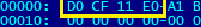
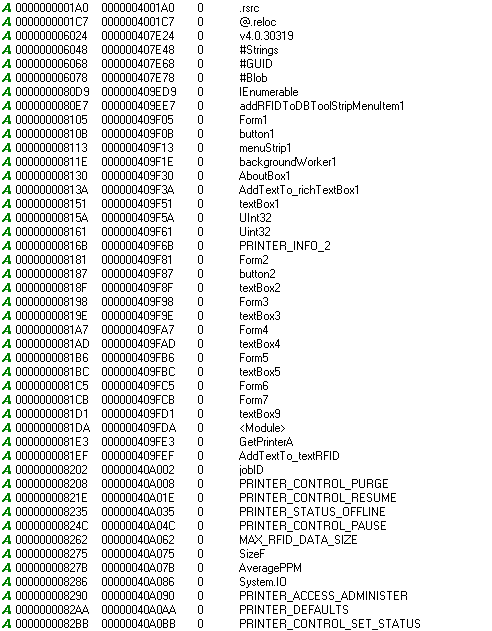
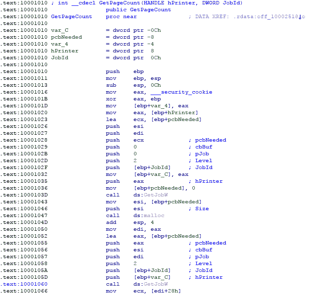
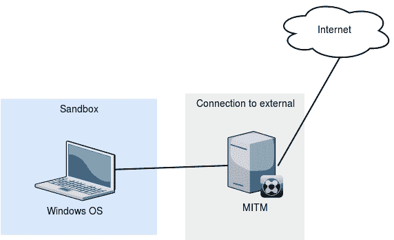
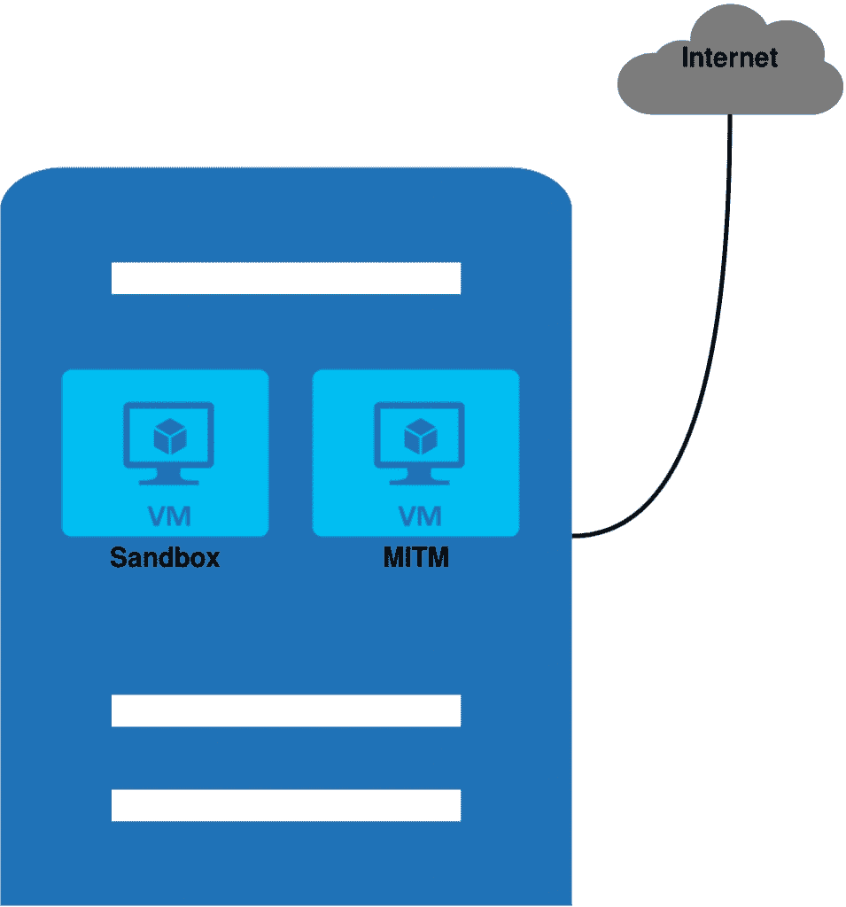
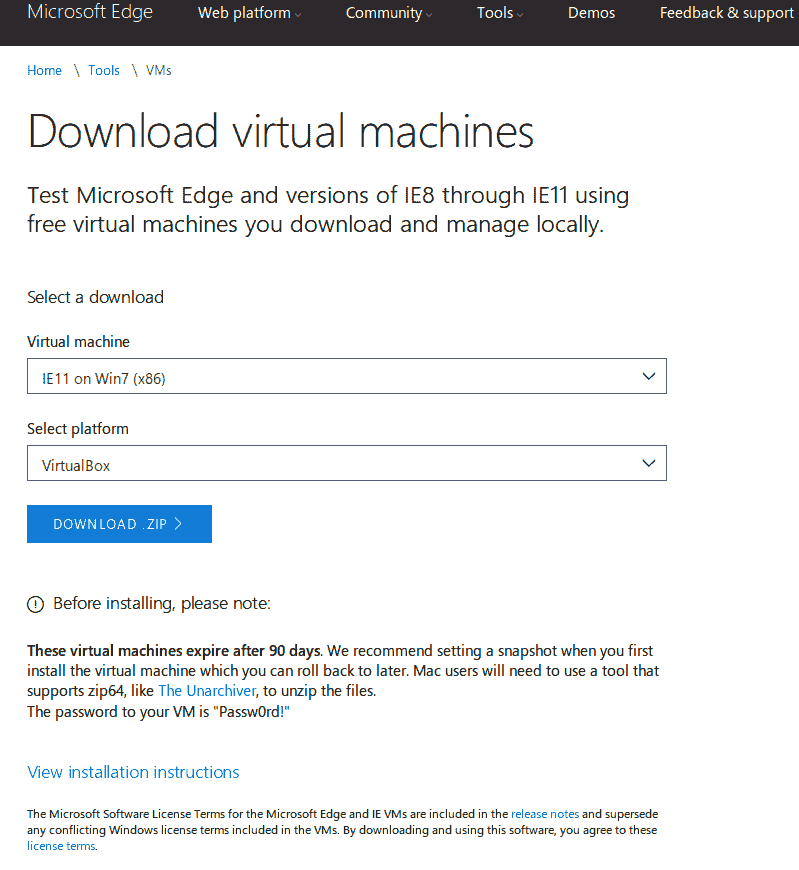
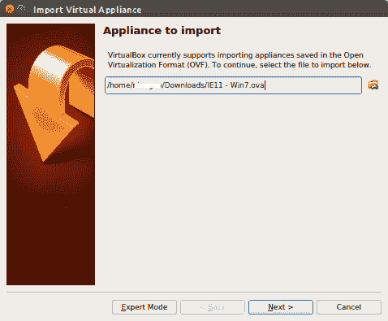
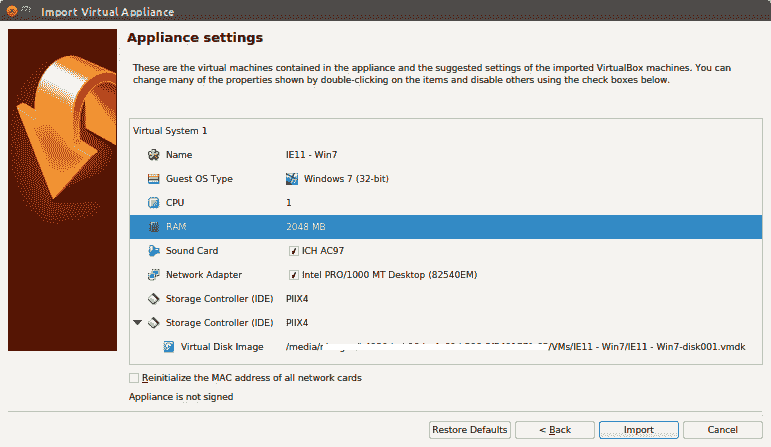
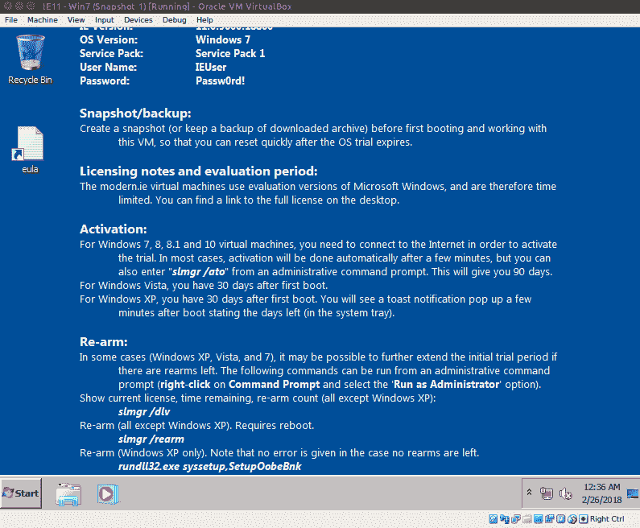

# 第一章：准备进行逆向分析

在本章中，我们将介绍逆向工程并解释它的用途。我们将从讨论已经在各个领域应用的一些见解开始，帮助读者理解逆向工程是什么。在本章中，我们将简要介绍软件逆向工程的过程和使用的工具类型。这里还提供了有关正确处理恶意软件的提示。本章的最后一部分展示了如何使用可以轻松下载的工具设置我们的初始分析环境。以下主题将会覆盖：

+   逆向工程的用途

+   应用逆向工程

+   逆向工程中使用的工具类型

+   恶意软件处理指南

+   设置逆向工程环境

# 逆向工程

将某物拆解并重新组装是一个帮助人们理解事物如何制造的过程。一个人可以通过首先展开折纸来重新制作和复制一件折纸作品。了解汽车的工作原理需要理解每个主要和次要的机械部件及其用途。人体解剖的复杂性要求人们了解身体的每一个部位。如何做到？通过解剖。逆向工程是一种帮助我们理解事物如何设计、为何如此存在、何时触发、如何工作以及它的目的是什么的方法。实际上，这些信息被用来重新设计和改进，以提升性能和降低成本。它甚至可以帮助修复缺陷。

然而，逆向工程涉及伦理问题，并且仍然是一个持续的争论。类似于弗兰肯斯坦的情况，存在一些违反自然法则的问题，这些问题在人类看来是不可接受的。如今，简单的重新设计如果没有经过深思熟虑，可能会引发版权侵权。一些国家和地区有法律规定禁止逆向工程。然而，在软件安全行业，逆向工程是必不可少的，也是一个常见的使用案例。

想象一下，如果特洛伊木马在允许进入城市的大门之前被彻底检查并拆解。这可能会导致一些士兵在城门外为保护城市而牺牲。下次城里再收到一只特洛伊木马时，弓箭手们就知道该把箭指向哪里。这次就没有死士兵了。恶意软件分析也是如此——通过逆向工程了解某种恶意软件的行为，分析师可以为网络推荐各种保护措施。可以把特洛伊木马看作恶意软件，把分析师看作最初检查木马的士兵，而城市则是计算机网络。

任何想要成为逆向工程师或分析师的人都应具备足够的资源整合能力。搜索互联网是逆向工程的一部分。分析师不会仅仅依赖我们在本书中提供的工具和信息。有时，分析可能甚至需要逆向工程师自己开发工具。

软件审计可能需要进行逆向工程。除了高级别的代码审查过程外，一些软件质量验证还涉及实施逆向工程。这些测试活动的目的是确保漏洞被发现并修复。在软件的设计和开发过程中，有许多因素未被考虑。大多数这些因素是随机输入和外部因素，可能会导致泄露，从而产生漏洞。这些漏洞可能会被用于恶意目的，不仅干扰软件的正常运行，还可能造成损害，甚至危及其安装的系统环境。系统监控和模糊测试工具通常在软件测试时使用。今天的操作系统具有更好的保护机制来防止崩溃。操作系统通常会报告发现的任何异常，如内存或文件损坏。同时也提供额外的信息，如崩溃转储。通过这些信息，逆向工程师可以准确定位软件中需要检查的部分。

在软件安全行业中，逆向工程是必备的核心技能之一。每一次攻击，通常以恶意软件的形式出现，都需要进行逆向分析。通常，第一步是清理网络和系统，防止系统进一步被破坏。分析师会确定恶意软件如何安装并保持持久性。然后，他们会制定卸载恶意软件的步骤。在反恶意软件阶段，这些步骤将被用来制定清理程序，一旦反恶意软件产品能够检测到系统已经受到侵害。

该分析提供了恶意软件如何能够侵入系统的信息。通过这些信息，网络管理员能够采取措施来缓解攻击。如果恶意软件是因为用户打开了一个包含 JavaScript 代码的电子邮件附件而进入系统的，网络管理员就会实施阻止包含 JavaScript 附件的电子邮件。

一些管理员甚至被建议重新构建他们的网络基础设施。一旦系统被攻破，攻击者可能已经获取了关于网络的所有信息，并能轻松发起同样的攻击。进行重大改变将大大有助于防止同样的攻击再次发生。

重构基础设施的一部分是教育。防止系统被攻破的最佳方法是通过教育用户如何保护信息，包括他们的隐私。了解社会工程学并拥有之前攻击的经验使用户意识到安全问题。了解攻击者如何能够破坏一个机构，以及他们能够造成的损害是非常重要的。因此，安全政策被实施，备份被设置，持续学习被执行。

更进一步，目标公司可以将攻击报告给相关当局。即使是一小段信息也能为当局提供线索，帮助他们追踪嫌疑人并关闭恶意软件通信服务器。

系统可能通过利用软件漏洞被攻破。在攻击者了解目标后，攻击者可以编写利用已知软件漏洞的代码。除了对基础设施进行更改外，任何使用的软件也应保持最新，具备安全功能和补丁。逆向工程也需要找到脆弱的代码。这有助于通过回溯源代码来定位脆弱的代码。

所有这些活动都是基于逆向工程的输出进行的。从逆向工程中收集的信息会影响基础设施需要如何重构。

# 技术要求

我们将在一个将使用虚拟化软件的环境中工作。建议我们拥有一台启用了虚拟化功能的物理机器，处理器至少有四个核心，4 GB 的内存和 250 GB 的磁盘空间。请预先安装 Windows 或 Linux 操作系统在这台物理机器上。

我们将在我们的设置中使用 VirtualBox。主机操作系统的版本（Windows 或 Linux）将取决于 VirtualBox 的要求。请查看 VirtualBox 的最新版本：[`www.virtualbox.org/`](https://www.virtualbox.org/) 并查看推荐的要求。

你可能需要提前从 Microsoft 下载虚拟机，因为这些下载可能需要一些时间。请参考开发者页面：[`developer.microsoft.com/en-us/microsoft-edge/tools/vms/`](https://developer.microsoft.com/en-us/microsoft-edge/tools/vms/)。Windows 10 可以通过以下链接下载：[`www.microsoft.com/en-us/software-download/windows10`](https://www.microsoft.com/en-us/software-download/windows10)

# 逆向工程作为一个过程

像任何其他活动一样，逆向工程也是一个过程。我们可以遵循一个指南，帮助我们生成对分析师和利益相关者都有帮助的信息。

# 寻求批准

道德要求任何进行软件逆向工程的人必须获得软件所有者的批准。然而，许多软件在操作系统报告时，前台就显示了其漏洞。一些公司对于未经批准的逆向工程更为宽容，但如今的惯例是，任何发现的漏洞应该直接报告给软件所有者，而不是公开。这由所有者决定何时将漏洞报告给社区，以防止攻击者在软件补丁发布之前利用漏洞。

当涉及到恶意软件或黑客攻击时，情况则不同。当然，逆向分析恶意软件不需要得到恶意软件作者的批准。实际上，恶意软件分析的目标之一就是抓住作者。如果不确定，始终咨询律师或公司法务部门。

# 静态分析

在没有执行的情况下，通过查看文件的二进制并解析每个字节，可以提供继续进一步分析所需的大部分信息。仅仅知道文件的类型，就可以帮助分析员准备特定的工具集和参考资料。搜索文本字符串也可以提供关于程序作者的信息、程序的来源以及程序的功能。

# 动态分析

这种分析类型是在被分析的对象被执行时进行的。它需要一个封闭的环境，以防止可能会影响生产系统的行为发生。封闭环境的设置通常通过虚拟机来完成，因为它们可以更容易地进行控制。在动态分析过程中，会实现监控和记录常见环境行为的工具。

# 低级分析

在静态分析和动态分析过程中，有些信息可能会被忽视。程序的流程遵循一条依赖特定条件的路径。例如，只有在特定进程运行时，程序才会创建一个文件。或者，程序只有在 64 位 Windows 操作系统中运行时，才会在`Wow6432Node`注册表项下创建一个条目。调试工具通常用于在低级分析中分析程序。

# 报告

在进行分析时，每一条信息都应该被收集并记录。记录逆向工程对象是常见的做法，这有助于未来的分析。分析作为一个知识库，供开发者用来保护他们未来的程序免受缺陷的影响。例如，通过逆向工程的程序提示可能的缓冲区溢出，现在可以通过设置边界验证来保护一个简单的输入。

一份好的报告回答以下问题：

+   逆向工程对象的工作原理

+   何时触发特定行为

+   为什么在程序中使用了特定的代码

+   它原本打算在什么地方工作

+   整个程序的作用

# 工具

进行逆向工程的第一步是理解每个比特和字节的含义。仅仅查看包含的字节需要开发工具来帮助读取文件和对象。解析并为每个字节添加意义则需要另一个工具。逆向工程随着新软件技术的出现不断演化，工具也在不断更新。在这里，我们将这些工具分为二进制分析工具、反汇编器、反编译器、调试器和监控工具。

# 二进制分析工具

二进制分析工具用于解析二进制文件并提取文件信息。分析员能够识别哪些应用程序能够读取或执行该二进制文件。文件类型通常通过其魔术头字节来识别。这些魔术头字节通常位于文件的开头。例如，一个 Microsoft 可执行文件（`EXE` 文件）以 MZ 头（MZ 被认为是微软 DOS 时期开发者 Mark Zbikowski 的首字母）开头。另一方面，Microsoft Office Word 文档的魔术头字节为以下四个字节：

前面截图中的十六进制字节显示为`DOCFILE`。其他信息，例如文本字符串，也提供了线索。以下截图显示的信息表明该程序很可能是使用 Windows Forms 构建的：

# 反汇编器

反汇编器用于查看程序的低级代码。阅读低级代码需要了解汇编语言。使用反汇编器进行的分析提供了有关程序在执行时将执行的操作条件和系统交互的信息。然而，阅读低级代码时的亮点是程序使用**应用程序接口**（**API**）函数时。以下截图显示了一个使用`GetJob()` API 的程序模块代码片段。此 API 用于获取打印作业的信息，如下所示：

# 调试器

反汇编器可以显示代码树，但分析员可以通过使用调试器验证代码流向的分支。调试器按行执行代码。分析员可以跟踪代码，例如循环、条件语句和 API 执行。由于调试器属于动态分析范畴，并执行逐步代码执行，因此调试是在封闭环境中进行的。不同的文件类型有不同的反汇编器。在 .NET 编译的可执行文件中，最好是反汇编 p-code 并推敲每个操作符的含义。

# 监控工具

监控工具用于监控系统在文件、注册表、内存和网络方面的行为。这些工具通常会通过 API 或系统调用进行拦截或挂钩，然后记录如新创建的进程、更新的文件、新的注册表项以及由报告工具生成的传入 SMB 数据包等信息。

# 反编译器

反编译器类似于反汇编器。它们是尝试恢复程序的高级源代码的工具，而反汇编器则尝试恢复程序的低级（汇编语言）源代码。

这些工具相互配合工作。从监控工具生成的日志可以用来追踪反汇编程序中的实际代码。在调试时也是如此，分析师可以查看反汇编的低级代码概览，同时根据监控工具的日志预测在哪里设置断点。

# 恶意软件处理

本书的读者在处理恶意软件文件时需要采取预防措施。以下是一些初步的建议，可以帮助我们防止主机被攻破：

+   在封闭的环境中进行分析，例如单独的计算机或虚拟机中。

+   如果不需要网络访问，切断网络连接。

+   如果不需要互联网访问，切断网络连接。

+   在手动复制文件时，将文件重命名为不会执行的文件名。例如，将`myfile.exe`重命名为`myfile.foranalysis`。

# 基本分析实验室设置

一个典型的设置要求系统能够运行恶意软件，而不被外部影响。然而，也有一些情况可能需要从互联网获取外部信息。首先，我们将模拟一个家庭用户的环境。我们的设置将尽可能使用免费的开源工具。以下图示显示了理想的分析环境设置：

这里的沙盒环境是我们进行文件分析的地方。图示右侧提到的 MITM，指的是**中间人**环境，它用于监控进出网络的活动。沙盒应该恢复到其原始状态。这意味着每次使用后，我们都应该能够恢复或还原其未被修改的状态。最简单的设置方法是使用虚拟化技术，因为这样就可以轻松地恢复到克隆镜像。有许多虚拟化程序可供选择，包括 VMware、VirtualBox、Virtual PC 和 Bochs。

还应该注意，有些软件能够检测到自己正在被运行，并且不喜欢在虚拟化环境中运行。在这种情况下，可能需要物理机器来设置。可以存储镜像或重新映像磁盘的磁盘管理软件是我们在这里的最佳解决方案。这些程序包括 Fog、Clonezilla、DeepFreeze 和 HDClone。

# 我们的设置

在我们的设置中，我们将使用 VirtualBox，它可以从[`www.virtualbox.org/`](https://www.virtualbox.org/)下载。我们将使用的 Windows 操作系统是 Windows 7 32 位，可以从[`developer.microsoft.com/en-us/microsoft-edge/tools/vms/`](https://developer.microsoft.com/en-us/microsoft-edge/tools/vms/)下载。在以下图示中，系统安装了两个虚拟机：一个来宾沙箱和一个来宾 MITM，且系统已连接互联网：

1.  下载并安装 VirtualBox 并运行它。VirtualBox 有适用于 Windows 和 Linux 的安装程序。下载 Windows 7 32 位镜像，如下所示：

1.  从微软网站下载的镜像是压缩的，应先解压。在 VirtualBox 中，点击文件|导入虚拟机。您将看到一个对话框，允许我们导入 Windows 7 32 位镜像。

1.  只需浏览并选择从 ZIP 文件解压出来的 OVA 文件，然后点击“下一步”，如下所示：

1.  在继续之前，可以更改设置。默认 RAM 设置为 4096 MB。分配更多的 RAM 并设置更多的 CPU 核心时，运行或调试时的性能会有所提升。然而，增加的 RAM 会使得创建镜像快照时消耗相同量的磁盘空间。这意味着，如果我们分配了 1GB 的 RAM，创建一个快照也会消耗至少 1GB 的磁盘空间。我们将 RAM 设置为 2048 MB，这对于我们来说是一个合理的工作量：

1.  点击“导入”，它应该开始生成虚拟磁盘镜像。一旦完成，我们需要创建第一个快照。建议在关闭状态下创建快照，因为此时消耗的磁盘空间最小。找到“快照”标签，然后点击“创建”。填写快照名称和快照描述字段，然后点击“确定”按钮。这将快速创建您的第一个快照。

在开机状态下，虚拟机中的 RAM 和修改后的磁盘空间总和等于快照所消耗的总磁盘空间。

1.  点击“启动”以开始运行 Windows 7 镜像。您应该会看到如下窗口。如果系统要求输入密码，默认密码是`Passw0rd!`：

此时，网络设置为 NAT。这意味着虚拟机所需的任何网络资源将使用主机计算机的 IP 地址。虚拟机的 IP 地址来自 VirtualBox 的虚拟 DHCP 服务。记住，虚拟机中的所有网络通信都将使用主机计算机的 IP 地址。

由于我们无法防止某些恶意软件将信息发送到网络，以便将信息返回到我们的虚拟机，因此需要注意的是，一些 ISP 可能会监控常见的恶意软件行为。最好查看与他们的合同，并在必要时做出决定。

我们的大部分逆向工程都涉及恶意软件，截至目前，攻击者通常以 Windows 系统为目标。我们的设置使用的是 Microsoft Windows 7 32 位。你可以自由选择使用其他版本。我们建议安装 32 位版本的 Microsoft Windows，因为它在低级调试时更容易追踪虚拟地址和物理地址。

# 样本

我们将构建自己的程序来验证和理解低级代码的工作原理。

它的行为和外观。以下是我们将用来构建程序的软件列表：

+   Dev C++ ([`www.bloodshed.net/devcpp.htm`](http://www.bloodshed.net/devcpp.html))

+   Visual Studio C++ ([`www.visualstudio.com/downloads/`](https://www.visualstudio.com/downloads/))

+   MASM32 ([`www.masm32.com/`](http://www.masm32.com/))

如果你对恶意软件感兴趣，可以从以下网站获取样本：

+   [`github.com/PacktPublishing/Mastering-Reverse-Engineering`](https://github.com/PacktPublishing/Mastering-Reverse-Engineering)

+   [`github.com/ytisf/theZoo`](https://github.com/ytisf/theZoo)

# 总结

逆向工程已经存在多年，并且一直是一项有用的技术，用于了解事物的运作方式。在软件行业中，逆向工程有助于验证和修复代码流和结构。通过这些任务获得的信息可以提高软件、网络基础设施以及人类意识的各个方面的安全性。作为反恶意软件行业的核心技能要求，逆向工程有助于创建检测和修复信息；这些信息也被用来构建保护措施，保障机构的服务器安全。它还被当局和法医专家用来追踪犯罪集团。

有一些基本步骤可以帮助建立逆向工程的信息。一旦分析师获得原作者的批准进行逆向工程，他们可以从静态分析、动态分析开始，然后进行低级分析。接下来是报告软件的概述和细节。

在进行分析时，会使用各种工具，包括静态分析工具、反汇编器、反编译器、调试器和系统监控工具。在对恶意软件进行逆向工程时，最好在一个没有或有限访问网络的环境中使用这些工具，以避免个人用途或工作中的网络被入侵。这可以防止你的基础设施被破坏。恶意软件应该得到妥善处理，我们列出了几种防止意外双击的方式。

然而，恶意软件分析仍然需要互联网，以便进一步了解恶意软件的工作原理及其行为。可能会有一些法律问题，需要你查阅所在国家的法律以及当地互联网服务提供商（ISP）的政策，以确保你不会违反其中的任何规定。

分析实验室设置的核心要求是目标操作系统能够恢复到未修改的状态。

恶意软件样本可以从以下链接获取：[`github.com/PacktPublishing/Mastering-Reverse-Engineering/tree/master/tools`](https://github.com/PacktPublishing/Mastering-Reverse-Engineering/tree/master/tools)。这些样本将在本书中贯穿使用。

现在我们已经完成了基本设置，让我们开始逆向工程的旅程吧。
