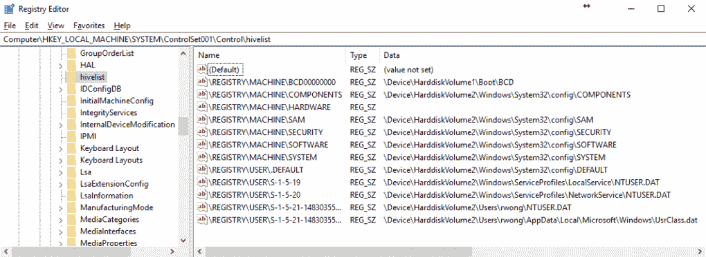

# 第二章：隐藏组件的识别与提取

目前，逆向工程最常见的应用是针对恶意软件。像其他任何软件一样，恶意软件也有其安装过程。不同之处在于它不会请求用户的安装许可。恶意软件甚至不会安装到`Program files`文件夹中，那里是其他合法应用程序的安装位置。相反，它倾向于将恶意软件文件安装到用户不常访问的文件夹中，从而避免被注意到。然而，有些恶意软件会被注意到，并在几乎所有显眼的文件夹中生成其副本，比如桌面。它的目的是让用户通过意外的双击或好奇心来执行其副本。这就是我们通常所说的恶意软件持久性。

持久性是指恶意软件持续在后台运行。在本章中，我们将指出恶意软件通常用来实现持久性的技术方法。我们还将解释恶意软件文件存储的常见位置。还将展示恶意软件的主要行为及一些能够识别恶意软件如何在系统中安装的工具。理解恶意软件的传播方式将帮助逆向工程师解释攻击者是如何成功入侵系统的。

本章我们将学习以下内容：

+   操作系统环境基础

+   典型的恶意软件行为：

    +   恶意软件传递

    +   恶意软件持久性

    +   恶意软件有效载荷

+   用于识别隐藏组件的工具

# 技术要求

讨论将使用 Windows 环境。我们将使用在前一*章节*中创建的虚拟机设置。此外，您还需要下载并安装以下软件：SysInternals 套件（[`docs.microsoft.com/en-us/sysinternals/downloads/sysinternals-suite`](https://docs.microsoft.com/en-us/sysinternals/downloads/sysinternals-suite)）。

# 操作系统环境

进行逆向工程要求分析人员了解正在逆向的软件运行的环境。软件在操作系统中运行所需的主要部分是内存和文件系统。在 Windows 操作系统中，除了内存和文件系统，微软还引入了注册表系统，实际上这些数据存储在被保护的文件中，称为注册表蜂巢。

# 文件系统

文件系统是直接将数据存储到物理硬盘驱动器的地方。这些文件系统管理文件和目录在磁盘上的存储方式。各种磁盘文件系统有自己高效读写数据的变体。

有不同的磁盘文件系统，如`FAT`、`NTFS`、`ex2`、`ex3`、`XFS` 和 `APFS`。Windows 常用的文件系统是 `FAT32` 和 `NTFS`。文件系统中存储了关于目录路径和文件的信息，包括文件名、文件大小、日期戳和权限。

以下截图显示了存储在文件系统中的 `bfsvc.exe` 信息：

在以前的 MacOS X 版本中，文件信息和数据存储在资源分支中。资源分支实际上已被弃用，但在最近版本的 MacOS 中仍然存在向后兼容性。一个文件在文件系统中有两个分支，数据分支和资源分支。数据分支包含非结构化数据，而资源分支包含结构化数据。资源分支包含诸如可执行机器代码、图标、警告框的形状、文件中使用的字符串等信息。例如，如果你想通过简单地将一个 Mac 应用程序移动到 Windows 硬盘上再移动回来来备份它，那么该 Mac 应用程序将无法再打开。在转移过程中，只有文件被转移，而资源分支会被剥离。简单的复制工具不会尊重分支。相反，Mac 开发者开发了同步文件到外部磁盘的工具。

# 内存

当 Windows 可执行文件执行时，系统会分配一个内存空间，将可执行文件从磁盘中读取，写入到分配的内存的预定位置，然后允许代码从该位置执行。这个内存块被称为进程块，并且与其他进程块相连。基本上，每个执行的程序都会消耗一个内存空间，作为一个进程。

以下截图显示了 Windows 任务管理器中进程列表的视图：

# 注册表系统

在 Windows 中，注册表是一个包含系统范围配置和应用程序设置的公共数据库。以下是存储在注册表中的一些信息示例：

+   执行特定文件的关联程序：

    +   DOCX 文件与 Microsoft Word 关联

    +   PDF 文件与 Adobe Reader 关联

+   与特定文件和文件夹关联的图标

+   软件设置：

    +   卸载配置

    +   更新站点

    +   使用的端口

    +   产品 ID

+   用户和组配置文件

+   打印机设置：

    +   默认打印机

    +   驱动程序名称

+   指定服务的驱动程序

注册表存储在蜂窝文件中。蜂窝文件的列表也可以在注册表中找到，如以下截图所示：

从注册表写入和读取信息需要使用 Windows 注册表 API。可以使用注册表编辑器以可视化方式查看注册表。注册表编辑器右侧窗格中的条目是注册表键。在左侧窗格中，注册表值位于名称列下，如以下截图所示：

# 常见恶意软件行为

恶意软件简单定义为恶意软件。一旦恶意软件进入系统，你会预期系统环境会发生不好的事情。一旦典型的恶意软件进入系统，它会做两件基本的事情：安装自身并进行其恶行。为了强制自己安装在系统中，恶意软件不需要通知用户。相反，它直接对系统进行更改。

# 持久化

恶意软件在系统中进行的一个变化是使其成为常驻程序。恶意软件的持久性意味着恶意软件将在后台持续运行，并尽可能长时间运行。例如，恶意软件会在每次系统启动后执行，或者恶意软件会在某个特定时间执行。恶意软件实现持久性最常见的方式是将其副本放入系统的某个文件夹中，并在注册表中创建一个条目。

以下注册表编辑器视图显示了`GlobeImposter`勒索病毒的注册表条目：

在注册表项`HKEY_LOCAL_MACHINE\SOFTWARE\Microsoft\Windows\CurrentVersion\Run`下的任何条目都预计在每次 Windows 启动时运行。在这种情况下，存储在`C:\Users\JuanIsip\AppData\Roaming\huVyja.exe`中的`GlobeImposter`勒索病毒的可执行文件变得持久化。`BrowserUpdateCheck`是注册表值，而路径是注册表数据。在这个注册表项下，重要的是路径，不论注册表值名称是什么。

在注册表中有几个区域可以触发恶意软件可执行文件的执行。

# 启动项

在这些注册表键下的注册表数据中输入文件路径将在 Windows 启动时触发执行，正如以下 Windows 64 位版本的注册表路径所示。

+   `HKEY_LOCAL_MACHINE\Software\Microsoft\Windows\CurrentVersion\Run`

+   `HKEY_LOCAL_MACHINE\Software\Microsoft\Windows\CurrentVersion\RunOnce`

+   `HKEY_LOCAL_MACHINE\Software\Microsoft\Windows\CurrentVersion\RunOnceEx`

+   `HKEY_LOCAL_MACHINE\Software\Microsoft\Windows\CurrentVersion\RunServices`

+   `HKEY_LOCAL_MACHINE\Software\Microsoft\Windows\N\RunServicesOnce`

+   `HKEY_LOCAL_MACHINE\Software\Microsoft\Windows\CurrentVersion\Policies\Explorer\Run`

+   `HKEY_LOCAL_MACHINE\SOFTWARE\Wow6432Node\Windows\CurrentVersion\Run`

在这些注册表键下列出的程序将在当前用户登录时触发执行，正如以下注册表路径所示：

+   `HKEY_CURRENT_USER\Software\Microsoft\Windows\CurrentVersion\Run`

+   `HKEY_CURRENT_USER\Software\Microsoft\Windows\CurrentVersion\RunOnce`

+   `HKEY_CURRENT_USER\Software\Microsoft\Windows\CurrentVersion\RunOnceEx`

+   `HKEY_LOCAL_MACHINE\Software\Microsoft\Windows\CurrentVersion\RunServices`

+   `HKEY_LOCAL_MACHINE\Software\Microsoft\Windows\CurrentVersion\RunServicesOnce`

+   `HKEY_CURRENT_USER\Software\Microsoft\Windows NT\CurrentVersion\Windows\Run`

含有 `Once` 的键名将列出仅运行一次的程序。如果恶意软件继续将其文件路径放置在 `RunOnce`、`RunOnceEx` 或 `RunServicesOnce` 键下，它可能仍会持续存在。

# 加载和运行值

以下注册表值，在其相应的注册表项下，将在任何用户登录时触发执行：

+   `HKEY_CURRENT_USER\Software\Microsoft\Windows NT\CurrentVersion\Windows`

    +   `Load = <文件路径>`

    +   `Run = <文件路径>`

**BootExecute 值**

+   `HKEY_LOCAL_MACHINE\SYSTEM\ControlSetXXX\Control\Session Manager`

    +   `XXX` 在 `ControlSetXXX` 中是一个三位数，通常是 `ControlSet001`、`ControlSet002` 或 `ControlSet003`。

    +   `BootExecute = <文件路径>`

        +   `BootExecute` 的默认值是 `autocheck autochk *`

**Winlogon 键**

+   `HKEY_LOCAL_MACHINE\SOFTWARE\Microsoft\Windows NT\CurrentVersion\Winlogon`

    +   该注册表项下的活动在 Windows 登录时执行

    +   `UserInit = <文件路径>`

        +   `Userinit` 的默认值是 `C:\Windows\system32\userinit.exe`

    +   `Notify = <dll 文件路径>`

        +   默认情况下未设置 `Notify`。它应该是一个动态链接库文件

    +   `Shell = <exe 文件路径>`

        +   `Shell` 的默认值是 `explorer.exe`

+   `HKEY_CURRENT_USER\SOFTWARE\Microsoft\Windows NT\CurrentVersion\Winlogon`

    +   `Shell = <exe 文件路径>`

        +   `Shell` 的默认值是 `` `explorer.exe` ``

**策略脚本键**

+   `HKEY_LOCAL_MACHINE\Software\Microsoft\Windows\CurrentVersion\Group Policy\Scripts\Shutdown\0\N`

    +   其中 `N` 是从 `0` 开始的数字。在关机过程中，可以运行多个脚本或可执行文件

    +   `Script = [可执行文件或脚本的文件路径]`

+   `HKEY_LOCAL_MACHINE\Software\Microsoft\Windows\CurrentVersion\Group Policy\Scripts\Startup\0\N`

    +   这里的 `N` 是从 `0` 开始的数字。在启动过程中，可以运行多个脚本或可执行文件。

    +   `Script = [可执行文件或脚本的文件路径]`

+   `HKEY_CURRENT_USER\Software\Microsoft\Windows\CurrentVersion\Group Policy\Scripts\Logon\0\N`

    +   这里的 `N` 是从 `0` 开始的数字。在用户注销时，可以运行多个脚本或可执行文件。

    +   `Script = [可执行文件或脚本的文件路径]`

+   `HKEY_CURRENT_USER\Software\Microsoft\Windows\CurrentVersion\Group Policy\Scripts\Logoff\0\N`

    +   其中 N 是从 0 开始的数字。在用户注销时，可以运行多个脚本或可执行文件

    +   `Script = [可执行文件或脚本的文件路径]`

**AppInit_DLLs 值**

+   `HKEY_LOCAL_MACHINE\SOFTWARE\Microsoft\Windows NT\CurrentVersion\Windows`

    +   `AppInit_DLLs = [DLL 列表]`

        +   DLL 列表由逗号或空格分隔

    +   `LoadAppInit_DLLs = [1 或 0]`

        +   这里，`1` 表示启用，`0` 表示禁用

**服务键**

+   `HKEY_LOCAL_MACHINE\SYSTEM\CurrentControlSet\Services\[服务名称]`

    +   这里的 `ServiceName` 是服务的名称

    +   `ImagePath = [sys/dll 文件路径]`

    +   加载系统文件（`.sys`）或库文件（`.dll`），这是驱动程序可执行文件

    +   服务触发取决于启动值：

        +   `0` (`SERVICE_BOOT_START`在操作系统加载时触发)

        +   `1` (`SERVICE_SYSTEM_START`在操作系统初始化时触发)

        +   `2` (`SERVICE_AUTO_START`在服务管理器启动时触发)

        +   `3` (`SERVICE_DEMAND_START`在手动启动时触发)

        +   `4` (`SERVICE_DISABLED`。服务被禁用，无法触发)

**文件关联**

+   `HKEY_CLASSES_ROOT`或在`HKEY_LOCAL_MACHINE\SOFTWARE\Classes\[文件类型或扩展名]\shell\open\command`中

    +   (`Default`)注册表值中的条目执行由[文件类型或扩展名]描述的文件

    +   以下代码显示了与可执行文件或`.EXE`文件相关的条目：

        +   `` `<显示 HKEY_LOCAL_MACHINE\SOFTWARE\Classes\exefile\shell\open\command 中的 exefile 条目的图像>` ``

        +   （`Default`）值包含`"%1" %*`。`%1`指的是正在运行的可执行文件，而`%*`指的是命令行参数。恶意软件通过追加自身的可执行文件实现持久性。例如，`(Default)`值被设置为`malware.exe "%1" %*`。因此，`malware.exe`会运行，并使用`%1`（正在运行的可执行文件）和`%*`作为其参数。接着，`malware.exe`负责使用其`%*`运行`%1`。

# 启动值

启动注册表值包含一个文件夹路径，文件夹内的文件在用户登录后执行。默认文件夹位置是`%APPDATA%\Microsoft\Windows\Start Menu\Programs\Startup`。

+   `HKEY_CURRENT_USER\Software\Microsoft\Windows\CurrentVersion\Explorer\Shell Folders`

    +   `Startup = [启动文件夹路径]`

+   `HKEY_CURRENT_USER\Software\Microsoft\Windows\CurrentVersion\Explorer\User Shell Folders`

    +   `Startup = [启动文件夹路径]`

+   `HKEY_LOCAL_MACHINE\SOFTWARE\Microsoft\Windows\CurrentVersion\Explorer\User Shell Folders`

    +   `Common Startup = [启动文件夹路径]`

+   `HKEY_LOCAL_MACHINE\SOFTWARE\Microsoft\Windows\CurrentVersion\Explorer\Shell Folders`

    +   `` `Common Startup = [启动文件夹路径]` ``

# Image File Execution Options 键

设置在`Image File Execution Options`键中的文件路径会在调试进程或通过`CreateProcess` API 运行时执行：

+   `HKEY_LOCAL_MACHINE\Software\Microsoft\Windows NT\CurrentVersion\Image File Execution Options\[进程名称]`

    +   `Debugger = [可执行文件]`

    +   `[进程名称]`指的是正在运行的可执行文件的文件名

    +   这个持久性仅在需要`[进程名称]`调用调试器时触发

**浏览器助手对象键**

+   `HKEY_LOCAL_MACHINE\Software\Microsoft\Windows\CurrentVersion\Explorer\Browser Helper Objects\[CLSID]`

    +   拥有`CLSID`作为子键意味着它作为 Internet Explorer BHO 已安装并启用

    +   `CLSID`在`HKEY_CLASSES_ROOT\CLSID\[CLSID]\InprocServer32`键下注册

        +   `(Default)`值指向与 BHO 关联的 DLL 文件

    +   每次打开 Internet Explorer 时，都会加载 DLL 文件

除了注册表条目，执行文件还可以通过任务调度程序或`cron`作业按计划触发。执行文件或脚本甚至可以在特定条件下被触发。例如，以下是一个 Windows 任务调度程序的截图：

恶意软件持久化的方法有很多种，远不止之前列举的那些。这些是逆向工程师在遇到新技术时学习到的挑战。

# 恶意软件传播

在软件安全行业中，攻击者传播并妥协系统的活动被称为恶意软件攻击活动。恶意软件进入系统的方式有很多种。这些恶意软件可执行文件最常见的传播方式是通过电子邮件附件发送给目标用户。随着通信技术的变化，这些攻击活动的物流也会随之调整，以适应现有技术。这包括寻找目标系统中的漏洞并利用漏洞渗透系统。

# 电子邮件

作为电子邮件传播的恶意软件要求收件人打开附件。邮件的构造方式使收件人对打开附件产生好奇心。这些未经请求的电子邮件被传播到多个地址，这些邮件被称为电子邮件垃圾邮件。它们通常包含一个主题和消息正文，通过社会工程学吸引收件人的注意，最终让收件人执行恶意软件。以下截图展示了一个例子：

欺骗个人或一群人进行某种活动的行为被称为***社会工程学***。由于安全意识差，用户可能会陷入这个著名的俗语陷阱：*好奇害死猫*。

# 即时消息

除了电子邮件，还有我们所称的 SPIM（即时消息垃圾邮件）。这是一种发送到即时消息应用程序的垃圾邮件，如 Facebook、Skype 和 Yahoo Messenger。这还包括通过 Twitter、Facebook 和其他社交网络服务发送的公共或私人消息垃圾邮件。这些消息通常包含指向已被入侵并包含恶意软件或间谍软件的站点的链接。一些支持文件传输的服务被恶意软件垃圾邮件滥用。如今，这些社交网络服务已经实施了后端安全措施以减轻 SPIM 的影响。然而，在撰写本文时，仍然有少数恶意软件通过即时消息传播的事件。下面的截图可以看到一个例子：

图片来自`CSPCert.ph`的 John Patrick Lita

上面的截图是来自 Facebook 即时消息的私人消息，包含一个 ZIP 文件，实际上其中包含了一个恶意软件文件。

# 计算机网络

如今，计算机必须连接到网络，以便用户能够互相访问资源。无论是局域网（LAN）还是广域网（WAN），每台计算机都与其他计算机相连，文件共享协议也为攻击者滥用提供了机会。恶意软件可以尝试将自己的副本拷贝到文件共享中。然而，恶意软件依赖于远程端的用户运行共享中的恶意软件文件。这类恶意软件被称为网络蠕虫。

要列出 Windows 中的共享文件夹，可以使用`net share`命令，如下图所示：

作为分析员，我们可以就如何处理这些共享文件夹提出建议。我们可以建议，如果这些共享文件夹未被使用，则将其删除。我们还可以对这些文件夹的权限进行审核，查看谁可以访问以及哪些用户可以拥有何种权限（如读写权限）。这样，我们可以帮助保护网络不受网络蠕虫的侵害。

# 媒体存储

网络管理员在使用闪存驱动器时非常严格。主要原因是外部存储设备，如 USB 闪存驱动器、光盘、DVD、外部硬盘，甚至智能手机，都是恶意软件可以存储自己的介质。一旦存储设备被挂载到计算机上，它就像一个普通的驱动器一样工作。恶意软件可以直接将自己的副本拷贝到这些存储驱动器中。与网络蠕虫类似，这些蠕虫依赖用户来运行恶意软件。但是，如果启用了 Windows 的自动运行功能，一旦驱动器被挂载，恶意软件可能会自动执行，如下图所示：

上一张图片是插入包含设置软件的光盘时遇到的默认对话框。

驱动器根目录中的`autorun.inf`文件包含有关自动执行文件的信息。此文件由存储在光盘中的软件安装程序使用，这样当磁盘插入时，它会自动运行安装程序。这一功能被恶意软件滥用，步骤如下：

1.  将恶意软件文件的副本投放到可移动驱动器中

1.  随着恶意软件副本的投放，它生成一个`autorun.inf`文件，指向投放的可执行文件，如下例所示：

`autorun.inf`文件用于之前显示的 VirtualBox 设置自动播放对话框，其中包含之前截图中的文本。`open`属性包含需要执行的可执行文件。

# 漏洞利用和被攻陷的网站

漏洞利用也属于恶意软件的一种。漏洞利用是为攻击特定软件或网络服务的漏洞而制作的。这些通常以二进制数据的形式存在。漏洞利用利用了漏洞，从而导致目标软件或服务的行为按照攻击者的意图进行。通常，攻击者的目的是获得对目标系统的控制，或者仅仅是让它瘫痪。

一旦攻击者识别出目标的漏洞，就会制作一个包含恶意代码的漏洞利用程序，该恶意代码可以下载恶意软件，进一步扩大攻击者的访问权限。这个概念被用来开发漏洞利用工具包。漏洞利用工具包是一组已知的漏洞扫描器和已知的漏洞，打包成一个工具包。

以下图示给出了一个例子：

在恶意软件攻击中，社会工程学被用来诱使用户访问实际已被攻陷的链接。通常，这些受害网站是手动黑客攻击的，并且已被注入隐藏的脚本，重定向到另一个网站。恶意链接通过电子邮件、即时消息和社交网络站点进行传播。访问被恶意广告感染的合法网站也可以作为诱饵。这些网站包括软件或媒体盗版站点、暗网，甚至是色情网站。一旦用户点击链接，通常情况下，网站会重定向到另一个被攻陷的网站，接着再重定向到另一个，直到到达漏洞利用工具包的登陆页面。从用户的互联网浏览器中，漏洞利用工具包页面会收集关于机器的信息，例如软件版本，然后确定该软件是否已知存在漏洞。然后，它会将所有适用于该漏洞软件的漏洞程序交付。漏洞程序通常包含下载并执行恶意软件的代码。结果，毫无察觉的用户会感染到受损的系统。

# 软件盗版

黑客工具、盗版软件、序列号生成工具和盗版媒体文件只是一些可能包含恶意软件或广告软件的分发软件。例如，盗版软件的安装程序的安装文件可能会在后台下载恶意软件并在未征得用户同意的情况下进行安装。

# 恶意软件文件属性

常见恶意软件的初始行为是生成一个副本，嵌入恶意软件组件，或者下载其恶意软件组件。它会创建被投放的文件，通常这些文件可以在以下文件夹中找到：

+   Windows 系统文件夹：`C:\Windows\System32`

+   Windows 文件夹：`C:\Windows`

+   用户配置文件文件夹：`C:\Users\[username]`

+   Appdata 文件夹：`C:\Users\[username]\AppData\Roaming`

+   回收站文件夹：`C:\$Recycle.Bin`

+   桌面文件夹：`C:\Users\[username]\Desktop`

+   临时文件夹：`C:\Users\[username]\AppData\Local\Temp`

作为社会工程学的一部分，另一个廉价的技术是将恶意软件文件的图标更改为吸引用户打开它的样式，例如，文件夹图标、Microsoft Office 图标或 Adobe PDF 图标。它还使用具有欺骗性的文件名，如*INVOICE*、*New* *Folder*、*Scandal*、*Expose*、*Pamela*、*Confidential*等。以下截图展示了实际恶意软件模仿已知文档的例子：

注意，突出显示的伪造 PDF 文件实际上是一个应用程序。

# 有效载荷——其中的恶意内容

攻击者开发恶意软件是有目的的，通常是为了对目标造成伤害，可能是出于仇恨、娱乐、金钱或，可能是政治原因。以下是一些在实际情况中见过的典型恶意软件有效载荷：

+   为赎金加密文件

+   删除所有文件

+   格式化驱动器

+   完全访问系统和网络

+   偷取账户和密码

+   偷取文档、图片和视频

+   更改特定配置和设置

+   将计算机转变为代理服务器

+   安装`cryptocoin`矿工

+   持续打开网站——广告或色情网站

+   安装更多恶意软件

+   安装广告软件

逆向工程师在报告中列出的一个结论是有效载荷。这决定了恶意软件在安装后对计算机的实际影响。

# 工具

识别与恶意软件相关的注册表项、已丢弃的文件和正在运行的进程需要工具。我们可以使用现有的工具来提取这些对象。我们应该考虑两种分析事件：恶意软件执行后的分析和恶意软件执行前的分析。由于本章的目标是提取组件，我们将讨论能够帮助我们找到可疑文件的工具。关于我们提取可疑恶意软件后的分析工具将在后续章节中讨论。

当系统已经被攻破时，分析员需要使用可以识别可疑文件的工具。每个可疑文件将进一步分析。首先，我们可以基于持久性来识别它。

1.  列出所有进程及其相关的文件信息

1.  从已知的注册表持久性路径列表中，查找包含文件路径的条目

1.  提取可疑文件

上述步骤可能需要使用微软 Windows 的预安装工具，例如：

+   注册表编辑器（`regedit`/`regedt32`）用于搜索注册表

+   你还可以使用命令行访问注册表`reg.exe`，如下面的截图所示：

+   任务管理器（`taskmgr`）列出进程

+   使用 Windows 资源管理器（`explorer`）或命令提示符（`cmd`）遍历目录并获取文件。

然而，我们也可以使用一些第三方工具来帮助列出可疑文件。以下是我们将简要讨论的几种工具：

+   启动项

+   进程资源管理器

# Autoruns

我们在本章前面看到的启动列表，涵盖了注册表条目、计划任务和文件位置。总体来说，该工具涵盖了所有这些内容，包括我们尚未讨论的其他领域，例如 Microsoft Office 插件、编解码器和打印机监视器，如下屏幕截图所示：

有 32 位和 64 位版本的 autoruns 工具。上述屏幕截图显示了基于 SysInternals 作者 Mark Russinovich 和 Bryce Cogswell 的研究的可执行文件的所有可能触发器。该屏幕截图还对每个 autorun 条目进行了分类，并显示了每个条目的描述，并指示了与条目相关的文件路径。

至于逆向工程师，通过了解在系统受到威胁之前启动的文件，可以确定可疑文件的身份。持续的实践和经验将使逆向工程师能够轻松地识别哪些是好的或可疑的可执行文件。

# 进程资源管理器

本质上，`进程资源管理器`工具类似于任务管理器，如下屏幕截图所示：

该工具的优势在于它可以显示有关进程本身的更多信息，例如如何运行，包括使用的参数，甚至其自启动位置，如下面的示例所示：

此外，进程资源管理器具有工具可以将其发送到 VirusTotal 进行识别，显示从其图像识别的字符串列表以及与其关联的线程。从逆向工程师的角度来看，此处高度使用的信息是命令行用法和自启动位置。VirusTotal 是一个在线服务，可以使用多个安全软件扫描提交的文件或 URL，如下屏幕截图所示：

结果并不是最终结论，但它给提交者一个关于文件是否为合法软件或恶意软件的想法。

# 概要

在第一章中，我们学习了反向工程及其在分析恶意软件时的重要性。要开始我们的反向工程探险，我们必须了解我们正在分析的系统。我们讨论了 Windows 操作系统环境中的三个主要区域：内存、磁盘和注册表。在本章中，我们旨在通过提取可疑文件来从受 Compromise 的 Windows 系统中查找恶意软件。为此，我们列出了系统中可以搜索的常见启动区域。这些区域包括注册表、任务计划和启动文件夹。

我们了解到，典型的恶意软件通过安装自身并运行危害系统的代码来表现。恶意软件基本上是为了持久性而安装自身，这导致恶意软件文件大多数时间触发系统在线状态。然后我们列出了一些行为，解释为何将恶意软件称为恶意。这些恶意代码包括任何涉及经济或政治利益犯罪的行为，例如勒索和后门访问。

我们通过列出可以用来轻松识别可疑文件的工具来结束这一章节。我们首先介绍了预先存在的 Windows 工具，如注册表编辑器、任务管理器和任务计划程序。然后，我们介绍了来自 SysInternals 的另外两个工具：autoruns 和 Process explorer。有了这些工具在手，我们应该能够列出我们怀疑的文件。然而，就像其他任何任务一样，通过实践和经验，我们将能够更快地掌握识别技能。

# 进一步阅读

+   [`msdn.microsoft.com/en-us/library/windows/desktop/ms724871(v=vs.85).aspx`](https://msdn.microsoft.com/en-us/library/windows/desktop/ms724871(v=vs.85).aspx)

+   [`medium.com/@johnpaticklita/cryptomalware-spreads-on-facebook-79a299590116`](https://medium.com/@johnpaticklita/cryptomalware-spreads-on-facebook-79a299590116)
