# 第三章：低级语言

任何反向工程师在开始之前需要掌握的主要知识是汇编语言。理解汇编语言就像学习反向工程的 ABC。它可能一开始看起来很难，但最终会变得像肌肉记忆一样。汇编语言是与计算机交流的语言。程序的源代码是人类可以理解的，但机器无法理解。源代码必须被编译成汇编语言代码形式，才能被计算机理解。

但是，作为人类，如果源代码不可用呢？我们唯一能够理解程序如何运行的方式就是读取它的汇编代码。从某种程度上来说，我们在这里构建的是一种将汇编语言代码还原为源代码的方法。这就是为什么它被称为反向工程。

我们将简要介绍汇编语言，重点讲解 x86 英特尔架构。那么，为什么选择 x86 呢？市面上有很多架构，如 8080、ARM、MIPS、PowerPC 和 SPARC，但我们专注于英特尔 x86，因为它是当今最流行和广泛使用的架构。

在本章中，我们将学习汇编语言的基础知识。我们将从回顾二进制数开始，然后使用汇编语言指令实现二进制算术，接着学习如何编译自己的低级程序，最后学习如何调试程序。

本章已被划分为多个部分。我们将学习以下内容：

+   二进制数、进制和 ASCII 表

+   x86 架构

+   汇编语言指令

+   用于编辑和编译汇编语言源代码的工具

+   调试工具

+   异常和错误处理

+   Windows API

+   高级语言结构

我们将提供设置和开发汇编语言代码的说明。这里还包含一些练习，可能会激发你使用汇编语言开发程序的灵感。

# 技术要求

最好但不是必需的，读者具备一定的编程语言背景。拥有编程背景将帮助读者更快地理解汇编语言。本章末尾提供了一些参考资料，读者可以利用它们进行进一步的编程开发和研究，这些内容在本书中没有提供。

我们将在此使用的一些工具包括：

+   二进制编辑器，如 HxD 编辑器或 HIEW（黑客视图）

+   文本编辑器，如 Notepad++

# 二进制数

计算机是设计用来通过信号进行电子数据处理和存储的。信号就像一个开关，其中“开”和“关”位置分别用数字“1”和“0”表示。这两个数字就是我们所说的二进制数。下一部分将讨论二进制数如何使用，以及它与其他进制的关系。

# 进制

数字中每个位置的值决定了该位置的值。在标准的十进制数字中，一个位置的值是它右边位置值的十倍。十进制数字系统也叫做基数为 10 的系统，它由数字 0 到 9 组成。

假设位置 1 在整个数字的最右边，如下所示：

```
2018
Place value at position 1 is 1 multiplied by 8 represents 8.
Place value at position 2 is 10 multiplied by 1 represents 10.
Place value at position 3 is 100 multiplied by 0 represents 0.
Place value at position 4 is 1000 multiplied by 2 represents 2000.
```

所有表示的数字之和就是实际值。遵循这个概念将帮助我们读取或转换成其他数字基数。

在二进制数中，一个位置的值是它右边位置值的 2 倍。二进制只使用 2 个数字，分别是 0 和 1。在本书中，我们会在数字后面加上小写字母`b`，表示该数字是二进制格式。二进制数字也被称为二进制数。二进制字符串中的每一位被称为比特。以下是一个例子：

```
11010b
Place value at position 1 is 1 multiplied by 0 represents 0.
Place value at position 2 is 2 multiplied by 1 represents 2.
Place value at position 3 is 4 multiplied by 0 represents 0.
Place value at position 4 is 8 multiplied by 1 represents 8.
Place value at position 5 is 16 multiplied by 1 represents 16.

The equivalent decimal value of 11010b is 26.
```

在十六进制数中，一个位置的值是它右边位置值的 16 倍。十六进制由数字 0 到 9 和字母 A 到 F 组成，其中 A 等于 10，B 等于 11，C 等于 12，D 等于 13，E 等于 14，F 等于 15。在本书中，我们将用字母`h`表示十六进制数字。十六进制数字如果位数为奇数，将前面加上`0`（零）。十六进制数字也可以用"0x"（零和小写字母 x）作为前缀。`0x`是多种编程语言中表示该数字为十六进制格式的标准：

```
BEEFh
Place value at position 1 is 1 multiplied by 0Fh (15) represents 15.are
Place value at position 2 is 16 multiplied by 0Eh (14) represents 224.
Place value at position 3 is 256 multiplied by 0Eh (14) represents 3584.
Place value at position 4 is 4096 multiplied by 0Bh (11) represents 45056.

The equivalent decimal value of BEEFh is 48879.
```

# 基数转换

我们已经将十六进制和二进制数转换成了十进制数，或者说是基数为 10 的数。将基数为 10 的数字转换成其他基数，只需要对要转换的基数进行除法运算，同时记录余数。

以下是一个二进制的例子

```
87 to base-2

87 divided by 2 is 43 remainder 1.
43 divided by 2 is 21 remainder 1.
21 divided by 2 is 10 remainder 1.
10 divided by 2 is 5 remainder 0.
5 divided by 2 is 2 remainder 1.
2 divided by 2 is 1 remainder 0.
1 divided by 2 is 0 remainder 1.
and nothing more to divide since we're down to 0.

base-2 has digits 0 and 1.
Writing the remainders backward results to 1010111b. 
```

以下是一个十六进制的例子：

```
34512 to base-16

34512 divided by 16 is 2157 remainder 0.
2157 divided by 16 is 134 remainder 13 (0Dh)
134 divided by 16 is 8 remainder 6.
6 divided by 16 is 0 remainder 6.

base-16 has digits from 0 to 9 and A to F.
Writing the remainders backward results to 66D0h.
```

将十六进制转换为二进制只需要知道十六进制数字中有多少个二进制位。十六进制数中最高的数字是`0Fh`（15），它等于`1111b`。请注意，每个十六进制数字等于 4 个二进制位。这里展示了一个转换的例子：

```
ABCDh
 0Ah = 1010b
 0Bh = 1011b
 0Ch = 1100b
 0Dh = 1101b

 Just combine the equivalent binary number.
 ABCDh = 1010101111001101b
```

在从二进制转换为十六进制时，将二进制数分为每四位一组，如下所示：

```
1010010111010111b
 1010b = 10 (0Ah)
 0101b = 5
 1101b = 13 (0Dh)
 0111b = 7

 1010010111010111b = A5D7h

```

那么，为什么计算机使用二进制和十六进制，而不是我们日常使用的十进制呢？对于二进制来说，有两种状态：开和关信号。状态可以很容易地被电子方式读取和传输。十六进制压缩了十进制数的二进制等效表示。例如，数字 10：这个数字表示为`1010b`，并占用 4 个位。为了最大化 4 个位可以存储的信息，我们可以表示 0 到 15 之间的数字。

4 位值也叫做 nibble，是字节的一半。字节可以表示字母、数字和字符。这些字符的表示在 ASCII 表中进行了映射。ASCII 表有三部分：控制字符、可打印字符和扩展字符。ASCII 表有 255 个字符（`FFh`）。可打印字符的列表以及一些扩展字符与键盘格式，可以在 [`github.com/PacktPublishing/Mastering-Reverse-Engineering/tree/master/ch3`](https://github.com/PacktPublishing/Mastering-Reverse-Engineering/tree/master/ch3) 找到。

尽管从英文键盘上无法直接看到符号，但可以通过使用字符的等效代码来显示。

# 二进制算术

由于字节是计算机中常用的单位，我们来玩玩它。我们可以从基本的算术运算开始：加法、减法、乘法和除法。传统的纸笔方法仍然是进行二进制运算的一种强大方法。二进制算术与十进制数的算术非常相似，唯一的区别是只有 1 和 0 两个数字。

加法按以下方式进行：

```
  1b               10101b
+ 1b             +  1111b 
 10b              100100b
```

一个减法示例如下：

```
 10b               1101b
- 1b              - 111b 
  1b                110b
```

乘法操作如下进行：

```
   101b             1b x 1b = 1b
x   10b             1b x 0b = 0b
   000
  101   
  1010b
```

二进制除法按以下方式进行：

```
       1010b                         1000b 
10b | 10100b                  11b | 11010b
     -10                           -11 
       010                           0010
       -10                           -000
         00                            10b (remainder)
         -0
          0
```

# 有符号数

二进制数可以按有符号或无符号进行构造。对于有符号数或整数，最高有效位决定了数值的符号。这要求二进制数有明确的大小，比如 `BYTE`、`WORD`、`DWORD` 和 `QWORD`。`BYTE` 大小为 8 位，`WORD` 大小为 16 位，`DWORD`（双 `WORD`）为 32 位，`QWORD`（四倍 `WORD`）为 64 位。基本上，随着位数的增加，大小会加倍。

在我们的例子中，假设使用 `BYTE`。识别一个正数的二进制表示很简单。在正数中，最高有效位或字节中的第 8 位为 0，剩余的从第 0 位到第 7 位的值即为实际数值。对于负数的二进制表示，最高有效位设置为 1，然而从第 0 位到第 7 位的值则需要计算为 2 的补码值：

```
01011011b = +91
11011011b = -37
10100101b = -91
00100101b = +37
```

一个值的“2 的补码”通过两步计算：

1.  反转 1 和 0，使得 1 变为 0，0 变为 1，例如，`1010b` 变为 `0101b`。这一步叫做 1 的补码。

1.  将前一步的结果加 1，例如，`0101b + 1b = 0110b`。

要写出 -63 的二进制等价表示，假设它是一个 `BYTE`，我们只取第 0 位到第 7 位：

1.  使用前述方法转换为二进制：

```
63 = 0111111b
```

1.  做“1 的补码”如下：

```
0111111b -> 1000000b
```

1.  在前面的结果上加 1，得到“2 的补码”结果：

```
1000000b + 1 = 1000001b
```

1.  由于这是一个负数，所以将最高有效位设置为 1：

```
11000001b = -63
```

下面是如何写下负二进制数的十进制表示：

1.  请注意，符号位是 1，因此为负号：

```
10111011b
```

1.  先做“1 的补码”，然后加 1：

```
  01000100b
+        1b 
  01000101b
```

1.  将结果转换为十进制，并将负号放在最前面，因为这是一个负数：

```
- 01000101b = -69
```

# x86

和其他编程语言一样，汇编语言有其自身的变量、语法、操作和函数。每一行代码处理的是一小部分数据。换句话说，每一行代码读取或写入一个字节的数据。

# 寄存器

在编程中，处理数据需要使用变量。你可以简单地将寄存器视为汇编语言中的变量。然而，并非所有寄存器都被当作普通变量使用，而是每个寄存器都有其特定的用途。寄存器可以被分类为以下几种类型：

+   通用寄存器

+   段寄存器

+   标志寄存器

+   指令指针

在 x86 架构中，每个通用寄存器都有其指定的用途，并且按`WORD`大小存储，即 16 位，具体如下：

+   累加器（AX）

+   计数器（CX）

+   数据寄存器（DX）

+   基址寄存器（BX）

+   栈指针（SP）

+   基址指针（BP）

+   源索引（SI）

+   目的索引（DI）

对于寄存器 AX、BX、CX 和 DX，可以通过较小的寄存器访问最低和最高有效字节。对于 AX，低 8 位可以使用 AL 寄存器读取，而高 8 位可以使用 AH 寄存器读取，如下所示：

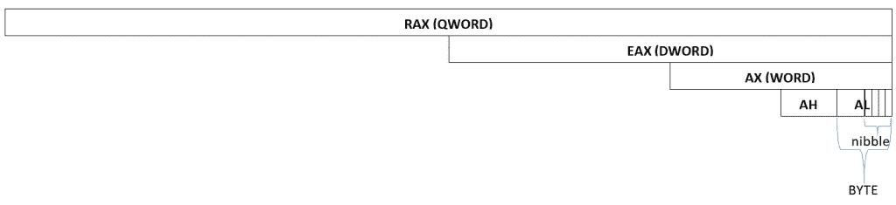

执行代码时，系统需要识别代码所在的位置。指令指针（IP）寄存器包含下一个要执行的汇编指令所在的内存地址。

执行代码的系统状态和逻辑结果存储在**FLAGS 寄存器**中。FLAGS 寄存器的每一位都有其特定的用途，以下表格列出了其中的一些定义：

| **偏移量** | **缩写** | **描述** |
| --- | --- | --- |
| 0 | CF | 进位标志。当加法操作需要进位时，设置此标志。当减法操作需要借位时，也会设置此标志。 |
| 1 |  | 保留 |
| 2 | PF | 奇偶标志。此标志指示上一条指令操作中设置的位数是奇数还是偶数。 |
| 3 |  | 保留 |
| 4 | AF | 调整标志。用于二进制编码十进制（BCD）。当低位到高位的进位或高位到低位的借位发生时，设置此标志。 |
| 6 | ZF | 零标志。当上一条指令操作的结果为零时，设置此标志。 |
| 7 | SF | 符号标志。当上一条指令操作的结果为负数时，设置此标志。 |
| 8 | TF | 陷阱标志。用于调试时。当遇到断点时，设置此标志。设置陷阱标志会导致每条指令都触发异常，从而启用调试工具进行逐步调试。 |
| 9 | IF | 中断标志。如果设置了此标志，处理器会响应中断。中断是指由硬件或软件触发的错误、外部事件或异常。 |
| 10 | DF | 方向标志。当设置时，数据从内存中倒序读取。 |
| 11 | OF | 溢出标志。如果算术操作的结果超过寄存器能容纳的值，则会设置此标志。 |
| 12 到 13 | IOPL | 输入/输出特权级。IOPL 显示程序访问 IO 端口的能力。 |
| 14 | NT | 嵌套任务标志。它控制中断任务或进程的链式执行。如果设置，则与链表链接。 |
| 15 |  | 保留 |
| 16 | RF | 恢复标志。它暂时禁用调试异常，以便下一条正在调试的指令可以在不产生调试异常的情况下被中断。 |
| 17 | VM | 虚拟模式。设置程序与 8086 处理器兼容运行。 |
| 18 | AC | 对齐检查。该标志在内存引用（如栈）上的数据是非字（4 字节边界）或非双字（8 字节边界）时设置。然而，在 486 架构之前，这个标志更为有用。 |
| 19 | VIF | 虚拟中断标志。类似于中断标志，但在虚拟模式下工作。 |
| 20 | VIP | 虚拟中断挂起标志。表示已触发的中断正在等待处理。仅在虚拟模式下工作。 |
| 21 | ID | 标识符标志。指示是否可以使用 CPUID 指令。CPUID 可以确定处理器类型及其他处理器信息。 |
| 22 |  | 保留 |
| 23 到 31 |  | 保留 |
| 32 到 63 |  | 保留 |

所有这些标志都有其目的，但最常被监控和使用的标志是进位标志、符号标志、零标志、溢出标志和奇偶标志。

所有这些寄存器都有一个“扩展”模式用于 32 位。它可以通过前缀“E”访问（`EAX`、`EBX`、`ECX`、`EDX`、`ESP`、`EIP`和`EFLAGS`）。64 位模式也是如此，可以通过前缀“R”访问（`RAX`、`RBX`、`RCX`、`RDX`、`RSP`和`RIP`）。

内存被划分为不同的段，例如代码段、栈段、数据段和其他段。段寄存器用于标识这些段的起始位置，如下所示：

+   栈段（SS）

+   代码段（CS）

+   数据段（DS）

+   扩展段（ES）

+   F 段（FS）

+   G 段（GS）

当程序加载时，操作系统会将可执行文件映射到内存。可执行文件包含有关数据如何映射到相应段的信息。代码段包含可执行代码。数据段包含数据字节，如常量、字符串和全局变量。栈段被分配用于存储运行时函数变量和其他处理过的数据。扩展段与数据段类似，但此空间通常用于在变量之间移动数据。一些 16 位操作系统，如 DOS，由于每个段只分配 64KB 的内存，因此使用 SS、CS、DS 和 ES。然而，在现代操作系统（32 位及更高系统）中，这四个段被设置在同一内存空间中，而 FS 和 GS 分别指向进程和线程信息。

# 内存寻址

一段数据的起始位置，即存储在内存中的一系列字节，可以通过其内存地址来定位。存储在内存中的每个字节都有一个内存地址，用来标识它的位置。当用户执行程序时，系统会读取可执行文件，然后将其映射到一个分配的内存地址。可执行文件包含了如何进行映射的信息，确保所有的可执行代码都在代码段内，所有初始化的数据都在数据段内，未初始化的数据则在 BSS 段内。代码段中的代码指令可以通过内存地址访问数据段中的数据，这些地址可以是硬编码的。数据也可以是一个地址列表，指向另一组数据。

# 字节序

在读取或写入数据到内存时，我们使用寄存器或内存以`BYTE`、`WORD`、`DWORD`甚至`QWORD`的形式来处理它们。根据平台或程序，数据可能以小端或大端格式进行读取。

在小端格式中，当数据块被读取为`DWORD`时，它会被反转。我们以以下数据为例：

`AA BB CC DD`

当文件或内存中的数据以小端格式呈现时，它将在`DWORD`值中读取为`DDCCBBAAh`。这种字节序在 Windows 应用程序中很常见。

在大端系统中，相同的数据块将被读取为`AABBCCDDh`。使用大端格式的优势在于读取流式数据时，例如文件、串行数据和网络流。

使用小端格式读取的优势在于，读取的地址保持固定，无论它是作为`BYTE`、`WORD`还是`DWORD`来读取。例如，考虑以下情况：

```
Address       Byte
0x00000000    AA
0x00000001    00
0x00000002    00
0x00000003    00
```

在前面的例子中，我们尝试从`0x00000000`地址读取数据。当以`BYTE`读取时，它将是`AAh`。当以`WORD`读取时，它将是`AAh`。当以`DWORD`读取时，它将是`AAh`。

但在大端格式中，当以`BYTE`读取时，它将是`AAh`。当以`WORD`读取时，它将是`AA00h`。当以`DWORD`读取时，它将是`AA000000h`。

其实，相较于其他方式，这里有很多优势。这些方式中的任何一种都可以根据应用的目的使用。在`x86`汇编中，小端格式是标准。

# 基本指令

汇编语言由一行行的代码组成，遵循这种语法：

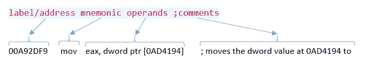

标签用于定义指令行的位置。它通常在没有事先知道代码将放置在哪个内存地址的情况下，在开发汇编代码时使用。一些调试器能够支持用户为地址添加可读的名称。助记符是人类可读的指令，例如 MOV、ADD 和 SUB。每个助记符由一个或多个字节表示，称为操作码。操作数是指令的参数，通常按 `目标，源` 的顺序读取。在上面显示的指令中，`eax` 寄存器是目标，而存储在地址 `0x0AD4194` 处的双字数据是源。最后，我们可以在程序的每条指令行中添加注释。

在汇编语言中，代码注释用分号（;）表示。

# 操作码字节

每条指令都有一个等效的操作码（操作代码）字节：

```
Address     Opcode          Instructions
00A92D7C    B8 00000080     MOV EAX,80000000h
00A92D81    B9 02000000     MOV ECX,2
00A92D86    F7E1            MUL ECX
```

在上述代码中，MOV 指令等价于 `B8` 操作码字节。位于 `00A92D81` 地址的 `MOV` 指令等价于 `B9`。这两条 `MOV` 指令的区别在于它们将 `DWORD` 值移入的寄存器不同。`MOV EAX, 80000000h` 总共消耗了 5 个字节，其中包括操作码字节 `B8` 和操作数值 `80000000h`。`MOV ECX, 2` 也使用了相同数量的字节，而 `MUL ECX` 使用了 2 个字节。

`MOV EAX, 80000000h` 位于 `00A92D7ch`。加上 5 个字节（变为 `00A92D81`），我们就能找到下一个指令的地址。在内存中查看代码会像这样：

```
Address     Bytes
00A92D7C    B8 00 00 00 80 B9 02 00 00 00 F7 E1
```

内存转储通常以段落或每行 16 字节的方式显示在内存转储工具中，地址对齐为 `10h`。

汇编语言指令可以按以下类别划分：

+   数据复制和访问指令（例如，MOV、LEA 和 MOVB）

+   算术指令（例如，ADD、SUB、MUL 和 DIV）

+   二进制逻辑指令（例如，XOR、NOT、SHR 和 ROL）

+   流程控制（例如，JMP、CALL、CMP 和 INT）

# 数据复制

MOV 指令用于移动数据。通过它，数据可以在寄存器和内存地址之间进行移动。

`mov eax, 0xaabbccdd` 将 `0xaabbccdd` 的值放入 `eax` 寄存器。

`mov eax, edx` 将 `edx` 寄存器中的数据值放入 `eax` 寄存器。

让我们以以下内存条目为例：

```
Address   Bytes
00000060: 60 61 62 63 64 65 66 67 68 69 6A 6B 6C 6D 6E 6F 
00000070: 70 71 72 73 74 75 76 77 78 79 7A 7B 7C 7D 7E 7F 
00000080: 80 81 82 83 84 85 86 87 88 89 8A 8B 8C 8D 8E 8F 
00000090: 90 91 92 93 94 95 96 97 98 99 9A 9B 9C 9D 9E 9F 
```

读取数据可能需要使用指令来帮助汇编器。我们使用 `byte ptr`、`word ptr` 或 `dword ptr`：

```
; the following lines reads from memory
mov al, byte ptr [00000071]       ; al = 71h
mov cx, word ptr [00000071]       ; cx = 7271h
mov edx, dword ptr [00000071]     ; edx = 74737271h

; the following lines writes to memory
mov eax, 011223344h
mov byte ptr [00000080], al       ; writes the value in al to address 00000080
mov word ptr [00000081], ax       ; writes the value in ax to address 00000081
mov dword ptr [00000083], eax     ; writes the value in eax to address 00000083
```

内存随后将如下所示：

```
00000060: 60 61 62 63 64 65 66 67 68 69 6A 6B 6C 6D 6E 6F 
00000070: 70 71 72 73 74 75 76 77 78 79 7A 7B 7C 7D 7E 7F 
00000080: 44 44 33 44 33 22 11 87 88 89 8A 8B 8C 8D 8E 8F 
00000090: 90 91 92 93 94 95 96 97 98 99 9A 9B 9C 9D 9E 9F 
```

# MOV 和 LEA

MOV 用于读取给定地址处的值，而 LEA（加载有效地址）则用于获取地址：

```
mov eax, dword ptr [00000060]           ; stores 63626160h to eax
mov eax, dword ptr [00000060]           ; stores 00000060h to eax
```

那么，如果你自己可以计算地址，LEA 指令又有什么帮助呢？让我们以以下 C 代码为例：

```
struct Test {
    int x;
    int y;
} test[10];

int value;
int *p;

// some code here that fills up the test[] array

for (int i=0; i<10, i++) {
    value = test[i].y;
    p = &test[i].y;
}
```

C 代码从定义 `test[10]` 开始，这是一个包含两个整数 `x` 和 `y` 的 `struct Test` 数组。`for` 循环语句取 `y` 的值和 `y` 在 `struct test` 元素中的指针地址。

假设测试数组的基址在 EBX 中，`for-loop`计数器`i`在`ECX`中，整数为`DWORD`类型，因此`struct Test`将包含两个`DWORD`值。知道`DWORD`有 4 个字节，那么`value = test[i].y;`在汇编语言中的等价代码将是`mov edx, [ebx+ecx*8+4]`。接着，`p = &test[i].y;`在汇编语言中的等价代码将是`lea esi, [ebx+ecx*8+4]`。实际上，即使不使用 LEA，地址仍然可以通过算术指令进行计算。然而，使用 LEA 可以更加轻松地计算地址：

```
; using MUL and ADD
mov ecx, 1111h
mov ebx, 2222h
mov eax, 2              ; eax = 2
mul ecx                 ; eax = 2222h
add eax, ebx            ; eax = 4444h
add eax, 1              ; eax = 4445h

; using LEA
mov ecx, 1111h
mov ebx, 2222h
lea eax, [ecx*2+ebx+1]  ; eax = 4445h
```

上面的代码显示，六行代码可以通过使用 LEA 指令优化为三行。

# 算术运算

x86 指令基于 CISC 架构，其中像 ADD、SUB、MUL 和 DIV 这样的算术指令背后有一组更底层的操作。算术指令依赖一组标志来指示在操作过程中需要满足的特定条件。

# 加法与减法

在加法（ADD）和减法（SUB）中，`OF`、`SF`和`CF`标志会受到影响。我们来看一些指令的使用示例。

`add eax, ecx`将`ecx`寄存器中的值加到`eax`中的值，`eax`中存储的是`eax`和`ecx`相加的结果。

让我们通过以下示例来看它是如何设置`OF`、`SF`和`CF`标志的：

```
mov ecx, 0x0fffffff
mov ebx, 0x0fffffff
add ecx, ebx
```

寄存器是 DWORD 类型。`ecx`和`ebx`寄存器被设置为`0x0fffffff`（‭268,435,455‬），将这些结果加上`0x1ffffffe`（‭536,870,910‬）。由于结果没有触及最高有效位（MSB），`SF`标志没有被设置。由于结果仍然在`DWORD`的范围内，`CF`标志没有被设置。假设这两个数是有符号数，结果仍然在有符号`DWORD`的范围内：

```
mov ecx, 0x7fffffff
mov ebx, 0x7fffffff
add ecx, ebx
```

`ecx`中的结果变为`0xfffffffe`（`-2`）。`CF = 0`；`SF = 1`；`OF = 1`。假设`ecx`和`ebx`都是无符号数，`CF`标志不会被设置。假设`ecx`和`ebx`都是有符号数且都是正数，则`OF`标志会被设置。由于最高有效位变为`1`，`SF`标志也被设置。

那么，两个负数相加会怎么样呢？我们来考虑以下示例：

```
mov ecx, 0x80000000
mov ebx, 0x80000000
add ecx, ebx
```

基本上，我们正在将`ecx`和`ebx`相加，这两个寄存器的值为`0x80000000`（-2,147,483,648），结果变为零（0）。`CF = 1`；`SF = 0`；`OF = 1`。由于结果的最高有效位（MSB）是 0，因此`SF`标志没有被设置。将`ecx`和`ebx`的最高有效位相加肯定会超出`DWORD`值的容量。从有符号数的角度来看，由于将两个负值相加超出了有符号`DWORD`的容量，`OF`标志也被设置。

让我们在下一个示例中尝试借位概念：

```
mov ecx, 0x7fffffff
mov edx, 0x80000000
sub ecx, edx
```

这里发生的情况是，我们正在从 `0x7fffffff` (‭2,147,483,647‬) 中减去 `0x80000000` (-2,147,483,648)。事实上，我们期望的是 2,147,483,648 和 2,147,483,647 的和。`ecx` 中的结果变为 `0xffffffff` (-1)。CF = 1；SF = 1；OF = 1。记住，我们正在执行一个减法操作，因此由于借位，CF 会被置为 1。OF 标志也是如此。

# 增加和减少指令

INC 指令简单地加 1，而 DEC 减去 1。以下代码将导致 `eax` 变为零 (0)：

```
mov eax, 0xffffffff
inc eax
```

以下代码将导致 `eax` 变为 `0xffffffff`：

```
mov eax, 0
dec eax
```

# 乘法和除法指令

MUL 用于乘法，DIV 用于除法。在乘法中，我们期望乘积的值超出寄存器的容量。因此，乘积将存储在 AX，`DX:AX` 或 `EDX:EAX`（长整型或 `QWORD`）中：

```
mov eax, 0x80000000
mov ecx, 2
mul ecx
```

存储在 eax 中的乘积为零 (0)，而 `edx` 现在包含 `0x00000001`。`SF =0`；`CF = 1`；`OF = 1`。

对于除法，被除数放入 `AX`，`DX:AX` 或 `EDX:EAX` 中，除法操作后，商放入 `AL`，`AX` 或 `EAX` 中。余数存储在 `AH`，`DX` 或 `EDX` 中。

# 其他有符号操作

**NEG**

此操作执行二进制补码操作。

以以下示例为例：`NEG EAX` 或 `NEG dword ptr [00403000]`。

如果 `EAX` 为 `01h`，它将变为 `FFFFFFFFh` (-1)。

**MOVSX**

此指令将 `BYTE` 移动到 WORD 或将 WORD 移动到 `DWORD`，并包括符号。它比 CBW、CWDE、CWD 更灵活，因为它能容纳更多操作数。

以以下示例为例：`MOVSX EAX, BX`。

如果 BX 为 `FFFFh` (-1) 且符号标志被设置，则 EAX 将为 `FFFFFFFFh` (-1)。

**CBW**

类似于 MOVSX，它将 `BYTE` 转换为 `WORD`，包括符号。受影响的寄存器是 AL 和 AX。这是一条不带操作数的指令，类似于 MOVSX。其效果是将字节 AL 扩展为其对应的字（AX）。这种转换用“->”符号表示。例如，`AL -> AX` 表示我们将 8 位数字扩展为 16 位而不改变存储的值。

如果 AL 为 `FFh` (-1)，则 AX 将变为 `FFFFh` (-1)。

**CWDE**

这与 CBW 类似，但将 `WORD` 转换为 `DWORD`。它影响 `AX->EAX`。

**CWD**

这与 CBW 类似，但将 `WORD` 转换为 `DWORD`。它影响 `AX-> DX:AX`。

**IMUL/IDIV**

这执行 MUL 和 DIV，但接受来自其他寄存器或内存的操作数。

# 位运算代数

布尔代数或位运算在底层编程中是必要的，因为它可以通过改变数字的位来执行简单的计算。它通常用于加密中的混淆和解码。

**NOT**

此操作会反转位。

以以下示例为例：`NOT AL`

如果 AL 等于 `1010101b` (`55h`)，它将变为 `10101010b` (`AAh`)。

**AND**

此操作如果两个值都是 `1`，则将 `bit` 设置为 `1`，否则将 `bit` 设置为 `0`。

以以下示例为例：`AND AL, AH`

如果 AL 等于 `10111010b`（`BAh`）且 AH 等于 `11101101b`（`EDh`），则 AL 变为 `10101000b`（`A8h`）。

**OR**

该操作如果两个比特都是 `0`，则将比特设置为 `0`，否则将比特设置为 `1`。

以以下为例：`OR AL, AH`

如果 AL 等于 `10111010b`（`BAh`）且 AH 等于 `11101100b`（`ECh`），则 AL 变为 `11111110b`（`FEh`）。

**XOR**

该操作如果两个比特相等，则将比特设置为 `0`，否则设置为 `1`。

以以下为例：`XOR EAX, EAX`

对相同的值进行 XOR 操作将结果变为 `0`。因此，`EAX` 变为 `0`：

`XOR AH, AL`

如果 AH 为 `100010b`（`22h`）且 AL 为 `1101011b`（`6Bh`），则 AH 变为 `1001001b`（`49h`）。

**SHL/SAL**

该操作将位向左移动。

以以下为例：`SHL AL, 3`

如果 `AL` 为 `11011101b`（`DDh`），将其向左移动 `3` 位后，AL 等于 `11101000b`（`E8h`）。

**SHR/SAR**

该操作将位向右移动。

以以下为例：`SHR AL, 3`

如果 `AL` 为 `11011101b`（`DDh`），将其向右移动 `3` 位后，AL 等于 `011011b`（`1Bh`）。

**ROL**

该操作将位向左旋转。

以以下为例：`ROL AL, 3`

如果 `AL` 为 `11011101b`（`DDh`），将其向左旋转 `3` 位后，AL 等于 `11101110b`（`EEh`）。

**ROR**

该操作将位向右旋转。

以以下为例：`ROR AL, 3`

如果 `AL` 为 `11011101b`（`DDh`），将其向右旋转 `3` 位后，AL 等于 `10111011b`（`BBh`）。

# 控制流

程序的美妙之处在于，我们可以根据条件和状态执行多种不同的行为。例如，我们可以让某个任务重复执行，直到计数器达到定义的最大值。在 C 语言编程中，程序的流控制由诸如 `if-then-else` 和 `for-loop` 语句来实现。以下是汇编语言中常用的控制流指令，结合程序控制流使用。受影响的寄存器是索引指针 IP/EIP，它保存当前地址，指向下一条待执行的指令。

```
JMP
```

跳转的简写，表示操作数是它将跳转到的地址。它将 EIP 设置为下一条指令行。地址有两种主要的变体：直接和间接。

使用直接地址的 `JMP` 将字面意义地跳转到给定的地址。例如，考虑 `JMP 00401000`。这将把 `EIP` 设置为 `00401000h`。

使用间接地址的 `JMP` 指令将跳转到一个只能在跳转执行时才能知道的地址。该地址必须在 `JMP` 指令之前通过某种方式获取或计算。以下是一些示例：

```
jmp   eax
jmp   dword ptr [00403000]
jmp   dword ptr [eax+edx]
jmp   dowrd ptr [eax]
jmp   dword ptr [ebx*4+eax]
```

**CALL 和 RET**

类似于 `JMP`，这将跳转到操作数中声明的地址，但在 `CALL` 指令执行后，将下一条指令的地址存储到堆栈中。该地址存储在堆栈中，稍后由 `RET` 指令使用，以将 `EIP` 指向该地址。例如，考虑以下情况：

```
Address            Instruction
00401000           CALL 00401100
00401005           MOV ECX, EAX
00401007
...
00401100           MOV EAX, F00BF00B
00401105           RET
```

当调用发生在地址`00401000`时，堆栈顶部将包含值`00401005h`，这是返回地址。代码将它传递给地址`00401100`处的指令，在那里`EAX`被设置为`F00bF00Bh`。然后，`RET`指令从堆栈顶部获取返回地址并设置 EIP。子程序或过程是指从调用到返回地址的指令序列。

`RET`指令可以选择带有一个操作数。操作数是它在获取返回地址之前将释放的堆栈`DWORD`的数量。当堆栈在子程序中被使用时，这非常有用，因为它作为清理已用堆栈的操作。

**条件跳转**

这些是依赖于标志位和计数器寄存器的跳转指令：

| **指令** | **标志位** | **描述** |
| --- | --- | --- |
| `JZ/JE` | ZF = 1 | 如果为零/如果相等，则跳转 |
| `JNZ/JNE` | ZF = 0 | 如果不为零/如果不相等，则跳转 |
| `JS` | SF = 1 | 如果符号位为 1，则跳转 |
| `JNS` | SF = 0 | 如果没有符号位，则跳转 |
| `JC/JB/JNAE` | CF = 1 | 如果有进位/如果小于/如果不大于或等于，则跳转 |
| `JNC/JNB/JAE` | CF = 0 | 如果没有进位/如果不小于/如果大于或等于，则跳转 |
| `JO` | OF = 1 | 如果溢出，则跳转 |
| `JNO` | OF = 0 | 如果没有溢出，则跳转 |
| `JA/JNBE` | CF = 0 且 ZF = 0 | 如果大于/如果不小于或等于，则跳转 |
| `JNA/JBE` | CF = 1 或 ZF = 1 | 如果不大于/如果小于或等于，则跳转 |
| `JG/JNLE` | ZF = 0 且 SF = OF | 如果大于/如果不小于或等于，则跳转 |
| `JNG/JLE` | ZF = 1 或 SF != OF | 如果不大于/如果小于或等于，则跳转 |
| `JL/JNGE` | SF != OF | 如果小于/如果不大于或等于，则跳转 |
| `JNL/JGE` | SF = OF | 如果不小于/如果大于或等于，则跳转 |
| `JP/JPE` | PF = 1 | 如果有奇偶校验/如果偶校验为真，则跳转 |
| `JNP/JPO` | PF = 0 | 如果没有奇偶校验/如果奇偶校验为假，则跳转 |
| `JCXZ` | CX = 0 | 如果 CX 为零，则跳转。 |
| `JECXZ` | ECX = 0 | 如果 ECX 为零，则跳转。 |
| `LOOP` | ECX > 0 | 如果 ECX 不为零，则跳转。减少 ECX。 |
| `LOOPE` | ECX > 0 且 ZF = 1 | 如果 ECX 不为零且零标志设置，则跳转。减少 ECX。 |
| `LOOPNE` | ECX > 0 且 ZF = 0 | 如果 ECX 不为零且零标志未设置，则跳转。减少 ECX。 |

**标志设置指令**

除了算术、位操作、外部中断和函数返回值之外，这些指令还可以设置标志位。

**CMP**执行一个 SUB 指令，在第一个和第二个操作数上，但不修改寄存器或立即数。它只会影响标志位。

**TEST**对第一个和第二个操作数执行 AND 指令，但不修改寄存器或立即数。它只会影响标志位。

# 堆栈操作

栈是一个临时存储数据的内存空间。栈中数据的添加和移除遵循先进后出的原则。由 C 程序编译的子程序最初会在栈中分配空间，称为栈帧，用于其未初始化的变量。栈顶的地址存储在 ESP 寄存器中：

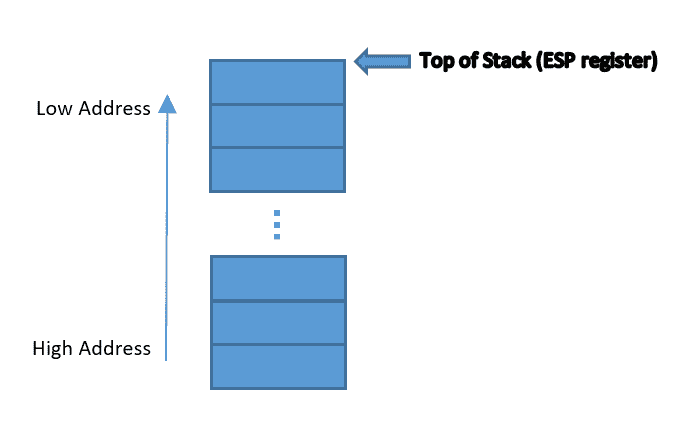

栈由两个常见指令控制：`PUSH`和`POP`。

**PUSH** 将栈顶地址减小`DWORD`大小，在 32 位地址空间中，然后存储其操作数的值。

作为示例，请考虑以下内容：`PUSH 1`

如果栈顶地址（存储在 ESP 中）为地址`002FFFFCh`，则 ESP 变为`002FFFF8h`，并将`1`存储到新的 ESP 地址。

**POP** 从栈顶（ESP）检索值，然后将其存储到操作数指示的寄存器或内存空间中。随后，ESP 增加`DWORD`大小。

作为示例，请考虑以下内容：`POP EAX`

如果栈顶地址（存储在 ESP 中）为地址`002FFFF8h`，并且栈顶存储的`DWORD`值为`0xDEADBEEF`，那么`0xDEADBEEF`将被存储到`EAX`寄存器中，而 ESP 变为`002FFFFCh`。

**PUSHA/PUSHAD** 都会将所有通用寄存器按此顺序压入栈中（适用于 32 位构建）：`EAX`、`ECX`、`EDX`、`EBX`、`EBP`、`ESP`、`EBP`、`ESI` 和 `EDI`。`PUSHA`适用于 16 位操作数，而`PUSHAD`适用于 32 位操作数。不过，二者可能是同义的，取决于当前的操作数大小。

**POPA/POPAD** 都将所有通用寄存器从栈中弹出，并按与`PUSHA`/`PUSHAD`存储顺序的相反顺序恢复。

**PUSHF** 将`EFLAGS`压入栈中。

**POPF** 将`EFLAGS`从栈中弹出。

**ENTER** 通常用于子程序的开始。它用于为子程序创建栈帧。从内部来看，`ENTER 8,0`可能大致等同于以下操作：

```
push ebp                      ; save the current value of ebp
mov ebp, esp                  ; stores current stack to ebp
add esp, 8                    ; create a stack frame with a size of 8 bytes
```

`LEAVE`用于撤销`ENTER`指令的操作，最终销毁创建的栈帧。

# 工具 – 构建器和调试器

在继续更多指令之前，最好尝试一下实际使用汇编语言编程。我们需要的工具是文本编辑器、汇编代码构建器和调试器。

# 流行的汇编器

所有编程语言都需要被构建成可执行文件，以便在程序构建所针对的系统平台上运行。除非你想手动输入每个操作码字节到二进制文件中，开发者们已经制作了工具，将源代码转换为机器可以理解的可执行文件。让我们来看一下目前最流行的汇编语言构建器。

# MASM

也叫做微软宏汇编器（Microsoft Macro Assembler），MASM 已经存在超过 30 年。它由微软维护，是 Visual Studio 产品的一部分。MASM 用于将 x86 源代码编译成可执行代码。

编译分为两个步骤：将源代码编译成目标文件，然后将目标文件所需的所有模块链接成一个单独的可执行文件。

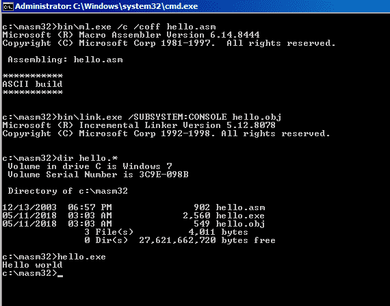

MASM 套件自带一个文本编辑器，菜单中包含编译器和链接器，用于将源代码构建为可执行文件。这非常方便，因为不需要通过命令行运行编译器和链接器来构建可执行文件。只需在以下源代码上执行 "`Console Build All`" 命令，即可生成一个可以在命令终端中运行的可执行文件：

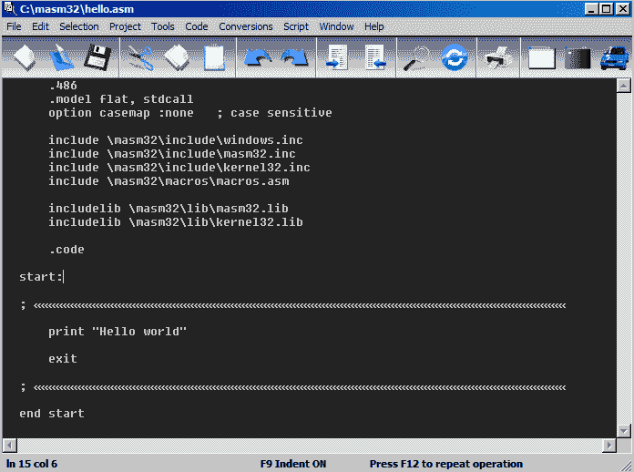

MASM 可以从 [`www.masm32.com/`](http://www.masm32.com/) 下载。

# NASM

**NASM** 是 **Netwide Assembler** 的缩写。NASM 与 MASM 非常相似，主要在语法、指令和变量声明上有些许不同。NASM 的一个优点是代码和数据的分段非常容易识别：

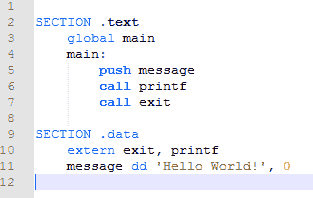

MASM 和 NASM 也都需要编译和链接来构建可执行文件：

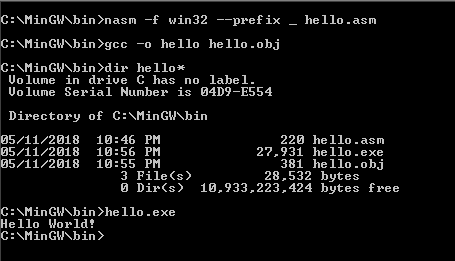

然而，与 MASM 不同，NASM 的安装包没有自带编辑器。NASM 在 Linux 社区非常受欢迎，因为它作为开源软件进行开发。该包仅包含用于目标文件的编译器；你需要下载 GCC 编译器来生成可执行文件。

下载 NASM 的官方网站是 [`www.nasm.us/`](https://www.nasm.us/)。对于 Windows，可以使用 MinGW ([`www.mingw.org/`](http://www.mingw.org/)) 来生成可执行文件。

# FASM

FASM 或 Flat Assembler 类似于 MASM 和 NASM。像 MASM 一样，它有自己的源代码编辑器；像 NASM 一样，代码段易于识别和配置，并且该软件有适用于 Windows 和 Linux 的版本：

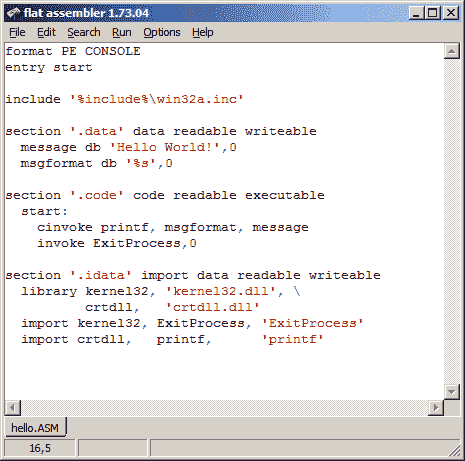

FASM 可以从 [`flatassembler.net/`](http://flatassembler.net/) 下载。

在我们的汇编语言编程中，我们将使用 FASM，因为我们可以在 Windows 和 Linux 上使用它的编辑器。

# x86 调试器

调试器是程序开发者用于跟踪代码的工具。这些工具用于验证程序是否按照预期的行为执行。通过调试器，我们可以逐行跟踪代码，看到每条指令的执行情况，以及它如何更改寄存器和存储在内存中的数据。在逆向工程中，调试器用于分析程序的低级细节。通过我们对汇编语言、目标编译程序和调试器的了解，我们能够进行逆向工程。

除了本书介绍的工具外，互联网上还有许多工具，它们可能有更多或更少的功能。关键是逆向工程依赖于工具，我们需要保持自己对最新工具的了解。随意下载其他你想探索的工具，看看哪个工具让你的逆向过程更舒适。

# WinDbg

`WinDbg`是由微软开发的用于在 Microsoft Windows 上进行调试的强大工具，支持在用户模式和内核模式下调试。它可以加载内存转储和由于 Windows 自身错误标记的崩溃转储。在内核模式下，它可以远程调试设备驱动程序或 Windows 操作系统。它可以加载与程序关联的符号文件，帮助开发人员或分析师识别正确的库函数格式及其他信息。

`WinDbg`有一个图形用户界面，默认情况下显示一个命令框，你可以在其中输入并执行命令。你可以添加一组信息窗口并将其停靠。它可以显示反汇编、寄存器和标志、堆栈（使用内存转储窗口），以及输入的任何地址的内存转储：

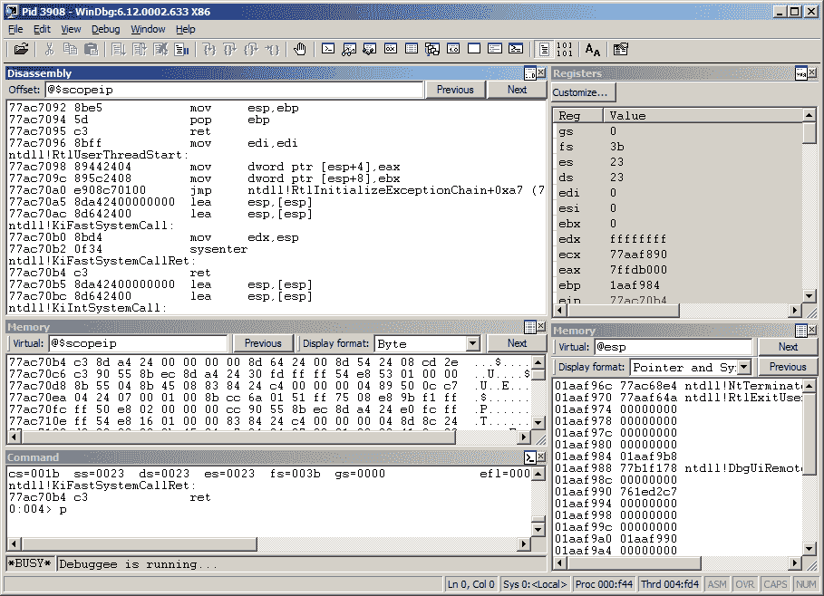

`Windbg`可以从[`docs.microsoft.com/en-us/windows-hardware/drivers/debugger/.`](https://docs.microsoft.com/en-us/windows-hardware/drivers/debugger/.)

# Ollydebug

这是在 x86 32 位 Windows 平台上最流行的调试器，因为它的包文件非常轻量。其默认界面显示了逆向工程师需要的重要信息：一个反汇编视图，用于跟踪；寄存器和标志窗格；以及堆栈和内存视图。

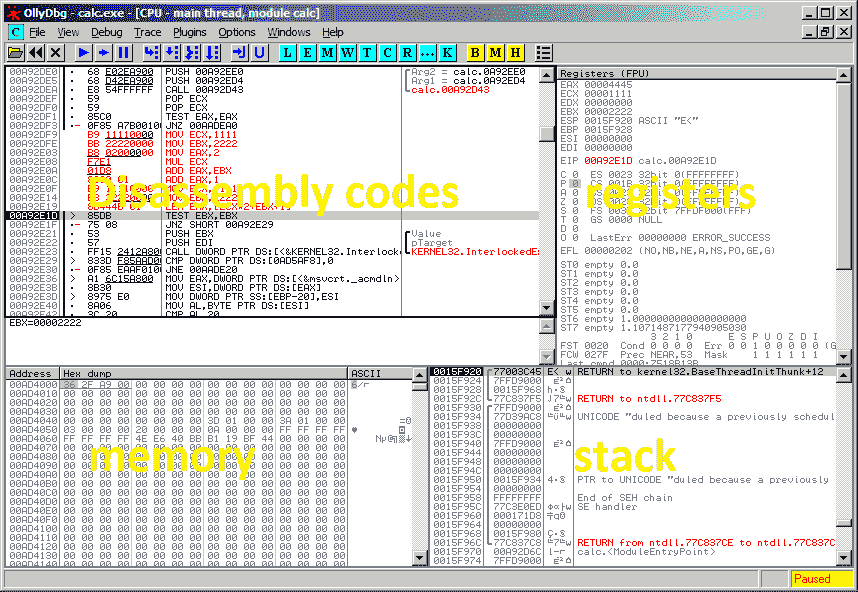

OllyDebug 可以从[`www.ollydbg.de/`](http://www.ollydbg.de/)下载。

# x64dbg

这个调试器最为推荐，因为开发者保持它的更新，并与社区合作。它也支持 64 位和 32 位 Windows 平台，并提供许多有用的插件。它的界面与 Ollydebug 类似。

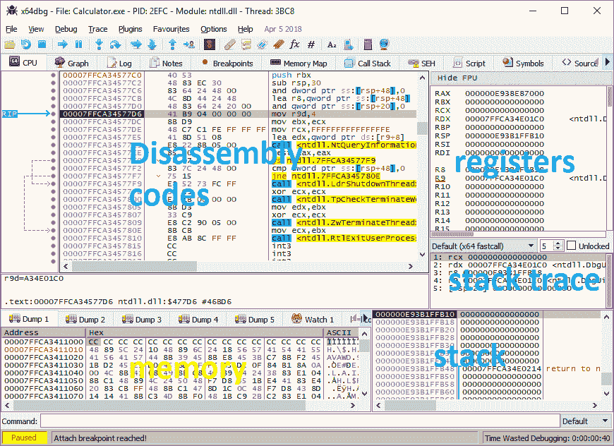

`x64dbg`可以从[`x64dbg.com/`](https://x64dbg.com/)下载。

# Hello World

我们将使用`FASM`来构建我们的第一个汇编语言程序。然后我们将使用`x64dbg`调试该可执行文件。

# 安装 FASM

使用我们的 Windows 设置，从[`flatassembler.net/`](http://flatassembler.net/)下载 FASM，[然后将 FASM 解压到你选择的文件夹中：](http://flatassembler.net/)

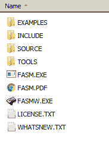

运行`FASMW.EXE`来启动`FASM`图形界面。

# 它可以工作！

在文本编辑器中写下以下代码，或者你可以直接从[`github.com/PacktPublishing/Mastering-Reverse-Engineering/blob/master/ch3/fasmhello.asm`](https://github.com/PacktPublishing/Mastering-Reverse-Engineering/blob/master/ch3/fasmhello.asm)做 Git 克隆。

```
format PE CONSOLE
entry start

include '%include%\win32a.inc' 

section '.data' data readable writeable 
  message db 'Hello World!',0
  msgformat db '%s',0

section '.code' code readable executable 
  start:
    push message
    push msgformat
    call [printf]
    push 0
    call [ExitProcess]

section '.idata' import data readable writeable 
  library kernel32, 'kernel32.dll', \
          msvcrt, 'msvcrt.dll'
  import kernel32, ExitProcess, 'ExitProcess'
  import msvcrt, printf, 'printf'
```

点击“文件”->“另存为...”，然后点击“运行”->“编译”来保存：

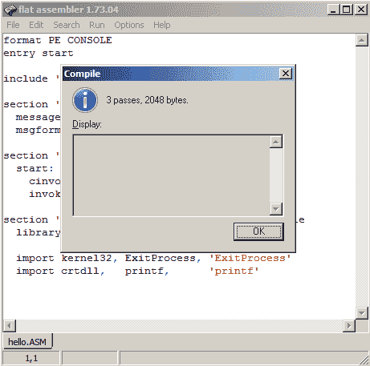

可执行文件将位于源文件保存的位置：

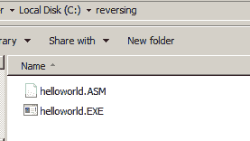

如果没有显示 "`Hello World!`"，需要注意的是，这是一个控制台程序。你必须打开一个命令终端并从那里运行可执行文件：

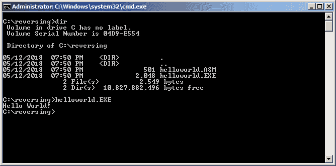

# 处理构建过程中常见的错误

**写入失败错误** — 这意味着构建器或编译器无法写入输出文件。可能是它要构建的可执行文件仍在运行。尝试查找之前运行的程序并终止它。你也可以从进程列表或任务管理器中终止它。

**意外字符** — 检查指定行的语法。有时候，包含的文件也需要因为构建器的最新版本而更新语法。

**无效的参数** — 检查指定行的语法。可能是定义或声明缺少参数。

**非法指令** — 检查指定行的语法。如果你确信指令是有效的，可能是构建器版本与该指令有效的版本不匹配。在更新构建器到最新版本的同时，也要更新源文件以符合最新版本的要求。

# 解剖程序

现在我们已经构建了程序并使其正常工作，让我们讨论一下程序包含了什么以及它的用途。

程序主要由代码部分和数据部分构成。代码部分，顾名思义，就是放置程序代码的地方。而数据部分是程序代码使用的数据，如文本字符串所在的位置。程序在编译之前有一些要求。这些要求定义了程序将如何构建。例如，我们可以告诉编译器将这个程序构建为 Windows 可执行文件，而不是 Linux 可执行文件。我们还可以告诉编译器程序应该从代码的哪一行开始运行。下面给出了一个程序结构的示例：

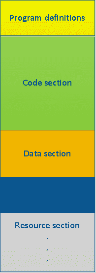

我们还可以定义程序将使用的外部库函数。这个列表在一个单独的部分中描述，称为导入部分。编译器可以支持各种不同的部分。这些扩展部分的一个例子是资源部分，其中包含图标和图片等数据。

有了程序结构的基本概念后，让我们看看我们的程序是如何编写的。第一行，`format PE CONSOLE`，表示程序将被编译为一个 Windows PE 可执行文件，并构建为在控制台上运行，Windows 中更常见的称呼是命令提示符。

下一行，`entry start`，表示程序将开始执行位于`start`标签的代码。标签的名称可以由程序员根据需要进行更改。下一行，`include '%include%\win32a.inc'`，将添加来自 FASM 库文件`win32a.inc`的声明。预期声明的函数用于调用`printf`和`ExitProcess` API 函数，这些函数将在`idata`部分讨论。

该程序中有三个内建部分：`data`、`code`和`idata`部分。这里的部分名称被标记为`.data`、`.code`和`.idata`。每个部分的权限也被指示为`可读`、`可写`和`可执行`。`data`部分是放置整数和文本字符串的地方，并使用定义字节（`db`）指令列出。`code`部分是执行指令代码的地方。`idata`部分是导入的 API 函数声明的地方。

下一行，我们看到数据部分被定义为`可写`部分：

```
section '.data' data readable writeable
```

程序的`.data`部分包含两个常量变量，`message`和`msgformat`。这两个文本字符串是`ASCIIZ`（ASCII-Zero）字符串，这意味着它们以零（0）字节结尾。这些变量是通过`db`指令定义的：

```
 message db 'Hello World!',0
 msgformat db '%s',0
```

下一行定义了代码部分。它被定义为具有读取和执行权限：

```
section '.code' code readable executable
```

`.code`部分是`start:`标签所在的位置，也是我们代码的位置。标签名称前缀是冒号字符。

在 C 编程中，`printf`是一个常用于打印消息到控制台的函数，使用的 C 语法如下：

`int printf ( const char * format, ... );`

第一个参数是包含格式说明符的消息。第二个参数包含填充格式说明符的实际数据。从汇编语言的角度来看，`printf`函数是一个在`msvcrt`库中的 API 函数。通过将参数放入内存堆栈空间中来设置 API 函数，然后调用该函数。如果你的程序是用 C 语言编写的，需要 3 个参数的函数（例如，`myfunction(arg1, arg2, arg3)`）在汇编语言中的等效代码如下：

```
push <arg3>
push <arg2>
push <arg1>
call myfunction
```

对于 32 位地址空间，使用`push`指令将一个`DWORD`（32 位）数据写入堆栈的顶部。堆栈顶部的地址存储在 ESP 寄存器中。当执行`push`指令时，ESP 值减少 4。如果参数是文本字符串或数据缓冲区，则将地址推送到堆栈。如果参数是数值，则将值直接推送到堆栈。

按照相同的 API 调用结构，带有两个参数，我们的程序以这种方式调用了`printf`：

```
 push message
 push msgformat
 call [printf]
```

在数据部分，地址`message`和`msgformat`作为调用`printf`函数前的设置被推入栈中。地址通常放在方括号`[]`中。如前所述，使用的是地址中的值。`printf`实际上是一个标签，它是程序中在`.idata`部分声明的本地地址。[printf]表示我们正在使用`msvcrt`库中`printf` API 函数的地址。因此，`call [printf]`将执行来自`msvcrt`库的`printf`函数。

对于`ExitProcess`也是一样的。`ExitProcess`是一个`kernel32`函数，用于终止正在运行的进程。它需要一个参数，即退出码。退出码为 0 表示程序将无错误地终止：

```
 push 0 
 call [ExitProcess]
```

在 C 语法中，这段代码等同于`ExitProcess(0)`，它终止程序并返回一个由零定义的成功结果。

程序的`.idata`部分包含外部函数，并设置为可读写权限：

```
section '.idata' import data readable writeable
```

在以下代码片段中，有两个部分。第一部分指示函数所在的库文件。`library`命令用于设置所需的库，并使用语法`library <库名>, <库文件>`。反斜杠`\`表示下一行是当前行的延续：

```
 library kernel32, 'kernel32.dll', \
           msvcrt, 'msvcrt.dll'
```

一旦库被声明，使用`import`命令来指定特定的 API 函数。语法为`import <库名>, <函数名>, <库文件中的函数名>`。这里导入了两个外部 API 函数，*kernel32*的*ExitProcess*和*msvcrt*的*printf*：

```
 import kernel32, ExitProcess, 'ExitProcess'
 import msvcrt, printf, 'printf'
```

程序的注释版本可以在[`github.com/PacktPublishing/Mastering-Reverse-Engineering/blob/master/ch3/FASM%20commented.txt`](https://github.com/PacktPublishing/Mastering-Reverse-Engineering/blob/master/ch3/FASM%20commented.txt)找到

API 函数库可以在 MSDN 库中找到（[`msdn.microsoft.com/en-us/library`](https://msdn.microsoft.com/en-us/library)），该库也有一个离线版本，包含在 Visual Studio 安装程序中。它提供了有关 API 函数的用途以及如何使用它的详细信息。在线版本如下所示：

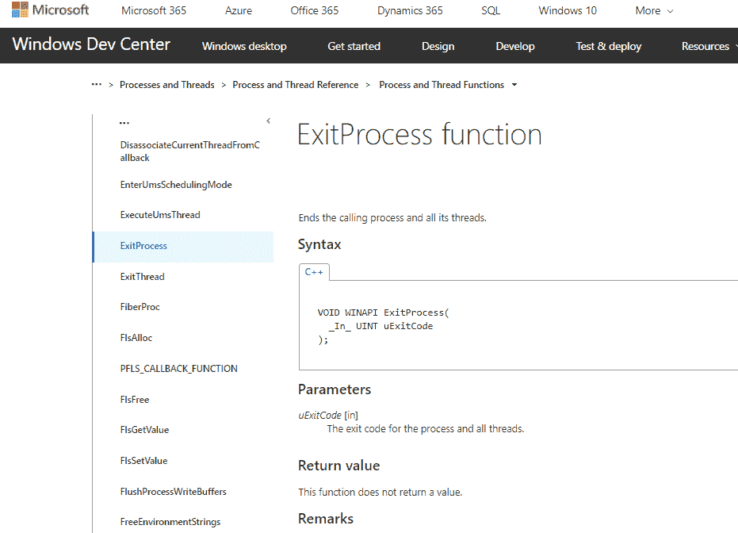

# 在 Hello 之后

我们遇到了对 `printf` 和 `ExitProcess` API 函数的外部调用。这些特定的函数是为 Windows 开发的，作为用户模式和内核模式之间的通信手段。通常，对于大多数操作系统来说，内核负责实际在显示器上显示输出、将文件写入磁盘、读取键盘输入、向 USB 端口传输数据、发送数据到打印机、通过网络传输数据等等。从本质上讲，所有与硬件相关的操作都必须通过内核。然而，我们的程序处于用户模式中，我们使用 API 来告诉内核为我们执行操作。

# 调用 API

在我们的程序中调用 API 只需要定义包含 API 函数的库文件和 API 函数本身的名称。正如我们在 Hello World 程序中所做的，我们通过在导入部分设置它来导入 API 函数：

```
section '.idata' import data readable writeable     ; import section has read and write permissions
  library kernel32, 'kernel32.dll', \               ; functions came from kernel32 and msvcrt dlls
          msvcrt, 'msvcrt.dll'
  import kernel32, ExitProcess, 'ExitProcess'       ; program will use ExitProcess and printf functions
  import msvcrt, printf, 'printf'
```

然后，我们通过 CALL 指令调用 API，如下所示：

```
    call [printf]
    call [ExitProcess]
```

# 常见的 Windows API 库

**KERNEL32** 包含 Windows 的基础函数，负责文件 I/O 操作和内存管理，包括进程和线程管理。有些函数是用于调用 NTDLL 库中更原生 API 的辅助函数。

**USER32** 包含处理显示和图形界面的函数，例如程序窗口、菜单和图标。它还包含控制窗口消息的函数。

**ADVAPI32** 包含与 Windows 注册表相关的函数。

**MSVCRT** 包含来自 Microsoft Visual C++ 运行时的标准 C 库函数，例如 printf、scanf、malloc、strlen、fopen 和 getch。

**WS2_32**、**WININET**、**URLMON** 和 **NETAPI32** 是包含与网络和互联网通信相关的函数的库。

# 常见 API 函数简短列表

API 函数可以根据其用途进行分类。完整列表可以在 MSDN 库中找到，但这里列出了最常见的函数：

| **用途** | **API 函数** |
| --- | --- |
| **控制台输出** | `KERNEL32!GetStdHandle, MSVCRT!printf` |
| **文件处理** | `KERNEL32!ReadFile, KERNEL32!WriteFile, KERNEL32!CreateFile` |
| **内存管理** | `KERNEL32!VirtualAlloc, KERNEL32!VirtualProtect, MSVCRT!malloc` |
| **进程和线程** | `KERNEL32!ExitProcess, KERNEL32!CreateProcess, KERNEL32!CreateThread, SHELL32!ShellExecute` |
| **窗口管理** | `USER32!MessageBoxA, USER32!CreateWindowExA, USER32!RegisterWindowMessageW` |
| **字符串处理** | `MSVCRT!strlen, MSVCRT!printf` |
| **网络通信** | `WININET!InternetAttemptConnect, WS2_32!socket, WS2_32!connect, URLMON!URLDownloadToFile` |
| **加密** | `CryptDecrypt, CryptEncrypt` |
| **注册表** | `RegDeleteKey, RegCreateKey, RegQueryValueExW, RegSetValueExW` |

# 调试

在某些时候，我们的程序可能会产生不可预测的错误或无效输出。在这种情况下，我们需要通过逐行调试代码来追踪出错的原因。但在此之前，有一些常用的调试命令我们需要了解。

单步调试意味着逐行调试程序代码。单步调试有两种模式：step into 和 step over。在调试过程中，当被调试的行是一个 CALL 指令时，使用 **step into** 模式时，单步调试会进入子程序继续调试。而 **step over** 模式则不会进入子程序，而是让子程序继续执行，单步调试会在 CALL 指令后的下一行继续。请看以下对比：

| Step into | Step over |
| --- | --- |

|

```
    CALL 00401000 ; <-- STEP INTO SUBROUTINE
    MOV  EBX, EAX
    ...
00401000:  
    MOV EAX, 37173 ; <- DEBUG POINTER GOES HERE
    RET

```

|

```
    CALL 00401000 ; <-- STEP OVER SUBROUTINE
    MOV  EBX, EAX ; <- DEBUG POINTER GOES HERE
    ...
00401000:  
    MOV EAX, 37173
    RET

```

|

**run** 或 **continue** 使调试器连续执行指令，直到程序终止、遇到错误，或遇到手动设置的断点。

设置 **断点** 是让调试器中断已设置为自由运行的代码的一种方法。例如，如果我在以下代码的地址 0040200A 处设置了一个断点，并让调试器从 00402000 开始自动运行每条指令，调试器会在地址 0040200A 处停止，并允许用户继续进行单步调试或继续运行：

```
00402000  push 0040100D
00402005  push 0040100D
0040200A  call dword ptr [printf]  ; <-- breakpoint set here
00402010  push 0
00402012  call dword ptr [ExitProcess]
```

让我们调试我们的 Hello World 程序。

从[`x64dbg.com/`](https://x64dbg.com/)下载 x64dbg。

这是一个 ZIP 压缩包，你需要解压它。解压后，打开 release 文件夹中的 x96dbg.exe。这将显示启动对话框，你可以选择 x32dbg（用于 32 位调试）和 x64dbg（用于 64 位调试）作为调试器：

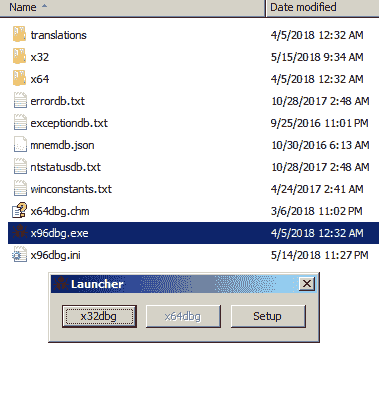

我们开发的 Hello World 程序是一个 32 位程序，因此请选择 x32dbg。然后点击 File->Open，浏览并打开 helloworld.exe 程序。打开后，你会在反汇编窗口中看到 EIP 的位置，如下所示：

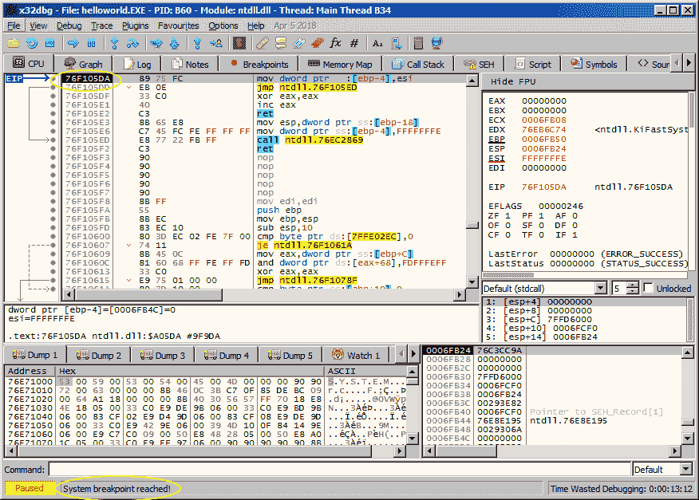

在窗口的底部，它显示：“系统断点已触发！”EIP 位于高内存区域地址，窗口标题也显示“模块：ntdll.dll - 线程：主线程”。所有这些都表明我们还没有进入 helloworld 程序，而是仍然在加载 helloworld 程序到内存、初始化并开始运行的 ntdll.dll 代码中。如果你进入 Options->Preferences，在设置窗口的 Events 表格中，默认情况下，**系统断点** 是勾选的。这会导致调试器在我们进入 helloworld 代码之前就停在 ntdll.dll 中。取消勾选系统断点，点击保存，然后退出调试器，如下所示：

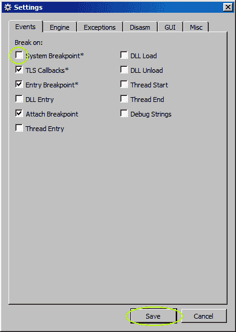

现在我们已经移除了系统断点，请重新加载 helloworld 程序。此时，EIP 应该已经位于 helloworld 代码中：

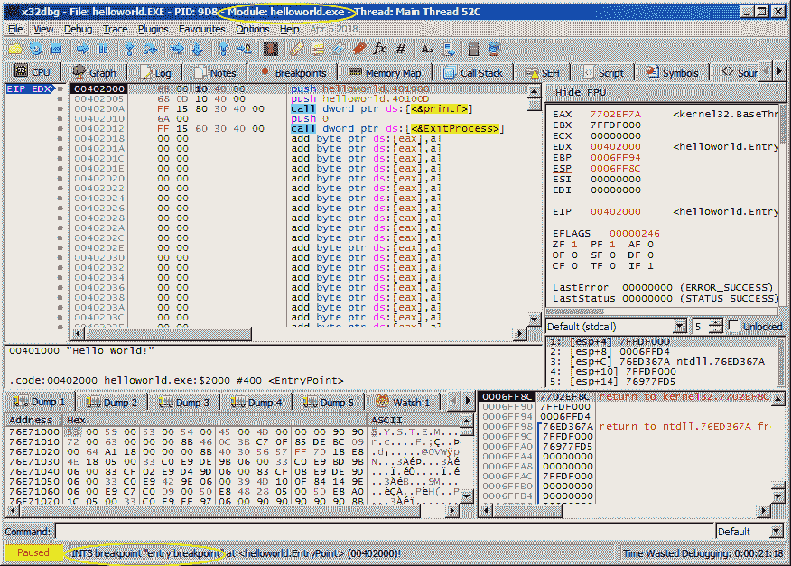

点击调试菜单。你应该会看到有键盘快捷键分配给“单步进入”、“单步跳过”、“运行”以及更多调试选项：

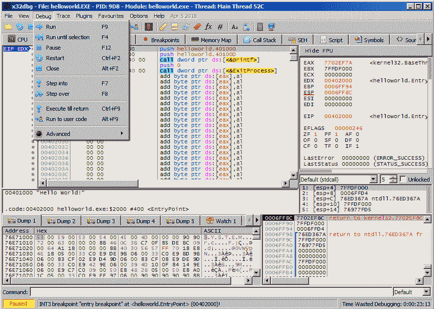

堆栈帧窗口位于右下方。注意那里的信息，然后按 `*F7*` 或 *F8* 执行单步操作。`PUSH helloworld.401000` 指令刚刚将 "`Hello World`" 文本字符串的地址压入堆栈顶部。在右上方的寄存器和标志窗口中，所有变化的文本都会显示为红色。随着堆栈地址的变化，ESP 也会发生变化。由于我们现在执行的是下一条指令代码，EIP 也应有所改变。

再执行一步，推动 "`%s`" 的地址压入堆栈。此时，你应该已经在地址 `0040200A`。此时，执行单步跳过会执行 `printf` 函数，并到达地址 `00402010`。出于好奇，我们不妨选择单步进入。这会带我们进入 `msvcrt` 库，`printf` 函数就在其中：

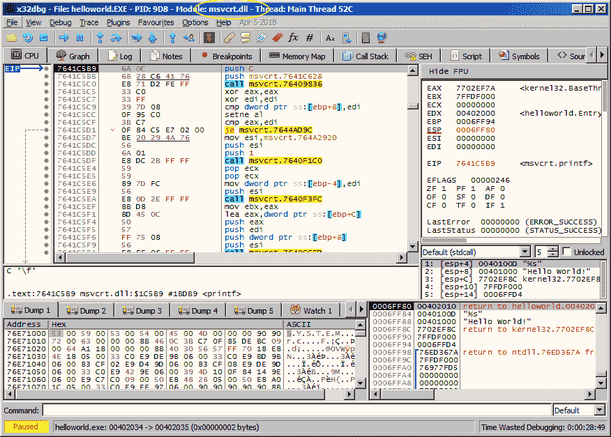

要返回到我们的 `helloworld` 程序，可以执行 "`Run to user code`"（映射快捷键为 *Alt* + *F9*）或 "`Execute till return`"（*Ctrl* + *F9*）。用户代码指的是我们的 Hello World 程序。执行 "`Run to user code`" 会将我们带到地址 `00402010`，即 `printf` 调用之后的指令。执行 "`Execute till return`" 会将我们带到 `RET` 指令所在的地址。我们不妨选择执行 "`Execute till return`"：

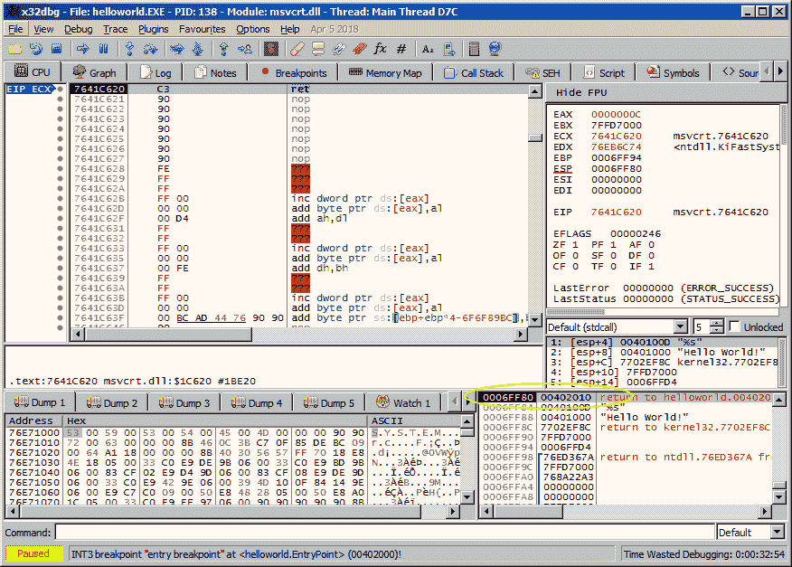

现在查看堆栈。正如之前讨论的 `CALL-RET` 指令，`CALL` 会将下一条指令的地址存储在堆栈顶部。此时，存储在堆栈顶部的地址是 `00402010`。进行单步操作后，我们应该回到我们的 `hello world` 程序。

继续执行单步跳过。最后两条指令应该会终止程序，调试会停止。

# 总结

汇编语言是一种低级语言，通过指令与计算机系统直接通信。计算机中使用的逻辑基于开关概念，从中衍生出了二进制 1 和 0。我们已经学会了如何从不同的数字进制中读写二进制，以及如何进行算术和位运算。

我们介绍了可以用来构建和验证我们程序的流行汇编器和调试器。接着，我们使用 FASM 编写并构建了我们的 Win32 低级 Hello World 程序，该程序使用 API 与内核进行通信。我们通过使用 `x64dbg` 调试器验证了我们构建的可执行程序。调试我们的 Hello World 程序是我们进入逆向工程世界的一个良好开端。

熟能生巧。我们列出了一些可以使用汇编语言开发的推荐程序。

了解代码的最低层次是我们逆向工程之旅的良好起点。当你完成本书的学习时，汇编语言会感觉像是在公园里散步一样轻松。

# 进一步阅读

英特尔的文档包含了完整的 x86 指令列表，并描述了每个指令在汇编语言中的语法和使用方法。你可以从[`www.intel.com/products/processor/manuals/`](http://www.intel.com/products/processor/manuals/)获取这些文档。
