# 第四章：静态与动态逆向分析

就像医院里的病人一样，文件需要经过一些初步评估，以确定资源的正确分配。文件评估的结果将告诉我们需要使用哪些工具，哪些逆向步骤需要执行，以及将使用哪些资源。进行逆向分析的步骤分为静态分析和动态分析。

在本章中，我们将介绍评估文件时使用的方法和工具。我们将以 32 位 Windows 操作系统为示例，接着检查我们可以用于静态和动态分析的工具。本章将帮助你生成一个检查清单，为你提供一个在最短时间内获取文件所有信息的指南。

在本章中，你将做以下内容：

+   了解目标评估

+   执行静态分析

+   执行动态分析

# 评估与静态分析

文件需要经过初步评估，以便我们确定所需的工具和分析方法。这个过程还帮助我们为分析文件制定策略。进行这样的评估需要进行轻量级的静态分析。以下是一些可能作为我们指南的评估思路：

+   它的来源：

    +   逆向工程的一个目的就是帮助网络管理员防止类似的恶意软件渗透到网络中。了解文件的来源有助于确保用于传输文件的渠道。例如，如果分析的文件被确定为电子邮件附件，那么网络管理员应当加强电子邮件服务器的安全。

+   现有信息：

    +   在互联网上搜索已有的信息可以非常有帮助。可能已经对该文件进行了现有的分析。我们可以确定预计的行为，这将有助于加快分析过程。

+   查看文件并提取其文本字符串：

    +   使用工具查看文件帮助我们确定文件类型。从文件中提取可读文本也能为我们提供提示，告诉我们文件在打开或执行时将使用哪些消息、函数和模块。

+   文件信息：

    +   文件类型是什么？

    +   头部与类型分析

# 静态分析

静态分析将帮助我们记录在动态分析过程中需要做的事情。掌握`x86`汇编语言后，我们应该能够理解反汇编的`Win32 PE`文件及其分支。通过这样做，我们将能够根据文件类型准备适当的工具来读取、打开和调试文件，并根据文件格式理解文件的结构。

我们通过确定文件类型开始静态分析，然后继续了解文件格式。我们可以提取文本字符串，这些字符串可能帮助我们立即识别有用信息，例如使用的 API 函数、将使用的库模块、文件从哪种高级语言编译而来、它将尝试访问的注册表项，以及它可能尝试连接的网页或 IP 地址。

# 文件类型和头部分析

文件类型是触发整个分析过程的最重要信息。如果文件类型是 Windows 可执行文件，则会准备一组预设的`PE`工具。如果文件类型是 Word 文档，那么我们将使用的沙箱环境必须安装 Microsoft Office 以及可以读取`OLE`文件格式的分析工具。如果给定的分析目标是一个网站，我们可能需要准备能够读取 HTML 并调试 JavaScript 或 Visual Basic 脚本的浏览器工具。

# 从文件中提取有用信息

使用文件查看工具（如 HxD（[`mh-nexus.de/en/hxd/`](https://mh-nexus.de/en/hxd/)））手动解析文件的每一部分信息是非常有趣的。但由于查找文件文档需要一些时间，已有为逆向工程师开发的工具。这些工具在互联网上随时可用，可以轻松提取和显示文件信息，并具有识别文件类型的功能。这些提取的信息帮助我们确定我们正在处理的文件类型。

# PEid 和 TrID

PEid 和 TrID 是能够检测文件类型、使用的编译器、加密工具以及使用的打包器和保护器的工具。压缩的可执行文件更常被称为打包器。这些打包器的一些例子包括 UPX、PECompact 和 Aspack。另一方面，保护器与打包器有些类似，但更先进，因为原始编译的代码会被保护，防止轻易被逆向。保护器的例子包括 Themida、AsProtect 和 Enigma Protector。

保护软件通常是商业软件。虽然这两个工具都没有再更新，但它们仍然运行得很好。下面是 PEiD 主界面的截图：

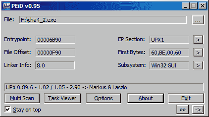

下面是如何在 Linux 终端中使用`TrID`的截图：

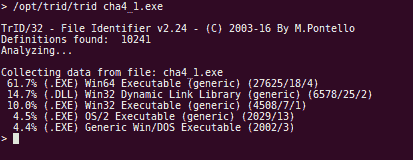

在写这篇文章时，这些工具可以通过以下链接下载：

PEid 可以从[`www.softpedia.com/get/Programming/Packers-Crypters-Protectors/PEiD-updated.shtml`](http://www.softpedia.com/get/Programming/Packers-Crypters-Protectors/PEiD-updated.shtml)下载。[](http://www.softpedia.com/get/Programming/Packers-Crypters-Protectors/PEiD-updated.shtml) TriD 可以从[`mark0.net/soft-trid-e.html`](http://mark0.net/soft-trid-e.html)下载。

# python-magic

这是一个能够检测文件类型的 Python 模块。然而，与 PEiD 和 TrID 不同，它还可以检测编译器和加壳工具：

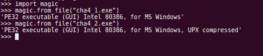

它可以从 [`pypi.org/project/python-magic/`](https://pypi.org/project/python-magic/) 下载。

# 文件

Linux 有一个内置的命令，称为 **file**。**file** 基于 `libmagic` 库，能够识别各种文件格式的文件类型：

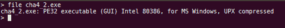

# MASTIFF

MASTIFF 是一个静态分析框架。它可以在 Linux 和 Mac 上运行。作为一个框架，静态分析基于 MASTIFF 作者和社区提供的插件。

这些插件包括以下内容：

**trid**：这是一个用于识别文件类型的工具。

**ssdeep**：`ssdeep` 是一个模糊哈希计算器。模糊哈希，或称为上下文触发的分段哈希（`CTPH`），可用于识别几乎相同的文件。这对于识别恶意软件家族的变种非常有用。

**pdftools**：这是 Didier Stevens 提供的插件，用于提取 PDF 文件的信息。

**exiftool**：显示图像文件的信息。

**pefile**：显示 PE 文件的信息。

**disitool**：这是 Didier Stevens 的另一个 Python 脚本，用于从签名的可执行文件中提取数字签名。

**pyOLEscanner**：这是一个用于从 OLE 文件类型（如 Word 文档和 Excel 表格）中提取信息的工具。

可以通过以下屏幕截图查看 MASTIFF 工作的示例：

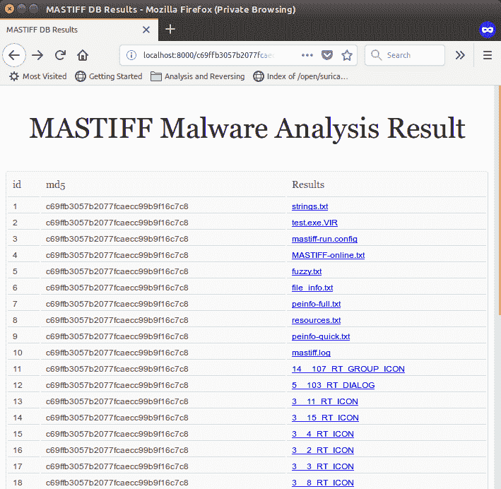

MASTIFF 可以从 [`github.com/KoreLogicSecurity/mastiff`](https://github.com/KoreLogicSecurity/mastiff) 下载。

# 其他信息

作为静态信息收集的一部分，文件会被分配一个唯一的哈希值。这些哈希值用于从文件信息数据库中识别文件。哈希信息通常有助于分析人员共享有关文件的信息，而无需传输文件本身。

下面是 MASTIFF 在测试文件上的 `file_info` 结果示例：

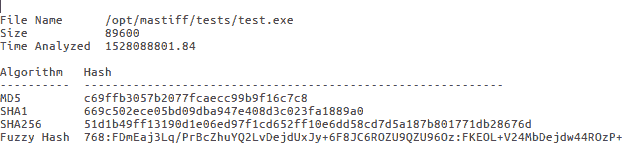

# PE 可执行文件

PE 可执行文件是适用于 Windows 的程序。可执行文件的扩展名为 `.exe`。动态链接库使用相同的 PE 文件格式，并使用 `.dll` 扩展名。Windows 设备驱动程序程序也采用 PE 文件格式，扩展名为 `.sys`。还有其他使用 PE 文件格式的扩展名，例如屏幕保护程序（`.scr`）。

PE 文件格式包含一个头部，分为 MZ 头部、DOS 存根和 PE 头部，随后是数据目录和节表，如下所示：

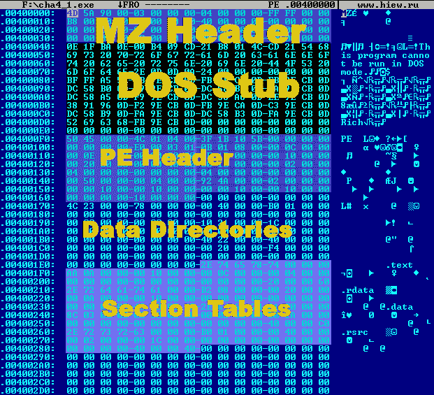

文件格式遵循原始的 `MSDOS EXE` 格式，但通过 PE 头扩展为 Windows 格式。如果在 MSDOS 环境下运行 Windows 程序，会显示以下消息：`This program cannot be run in DOS mode.`。

显示此消息的代码是 DOS 存根的一部分。

PE 头的段表包含了关于代码和数据在文件中位置的所有信息，以及它在作为进程加载到内存时如何映射。PE 头包含程序开始执行代码的地址——一个称为入口点的位置——并且会被设置在 EIP 寄存器中。

数据目录包含指向表的地址，这些表进一步包含诸如导入表之类的信息。导入表包含程序将使用的库和 API。该表遵循一个结构，指向一组地址，这些地址依次指向库的名称及其各自的导出函数：

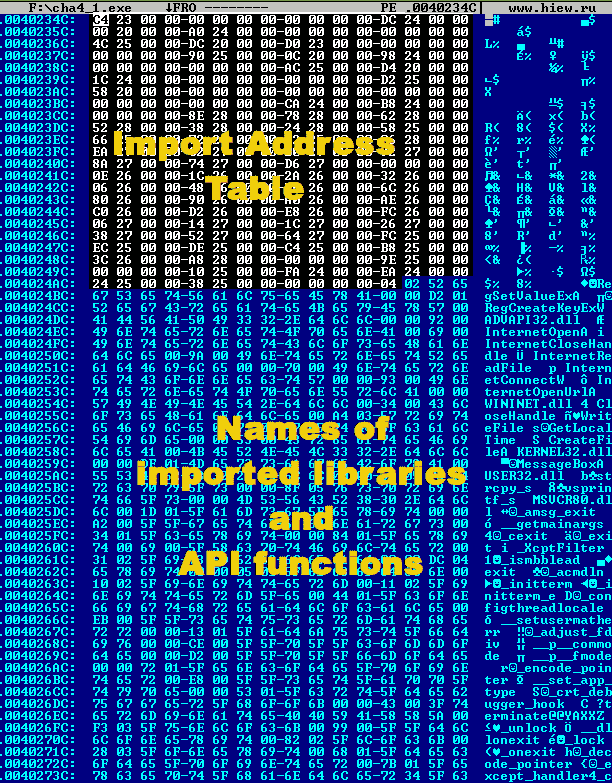

`MASTIFF`中使用的`peinfo`模块能够显示导入的库和函数，如下所示：

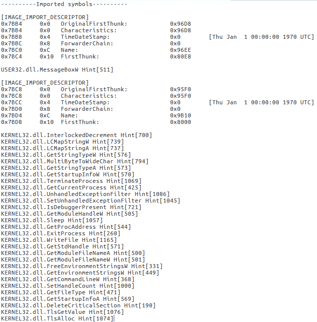

`HxD`和`HIEW`是本章中使用的流行二进制编辑器；`HxD`更为流行，是免费的，可以轻松地用于对文件进行二进制编辑。更多信息和下载链接可以在[`mh-nexus.de/en/hxd/`](https://mh-nexus.de/en/hxd/)找到。如果你尝试使用`HxD`，你会看到类似于此屏幕截图的内容：

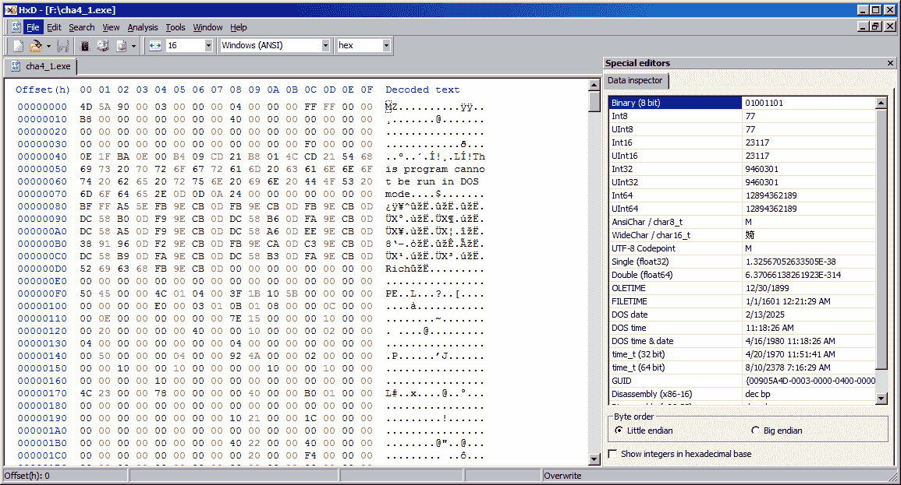

另一个有用的十六进制编辑工具是`HIEW`（黑客视图）。演示版和免费版能够解析`PE`头。该工具还可以显示导出和导入的 API 函数：

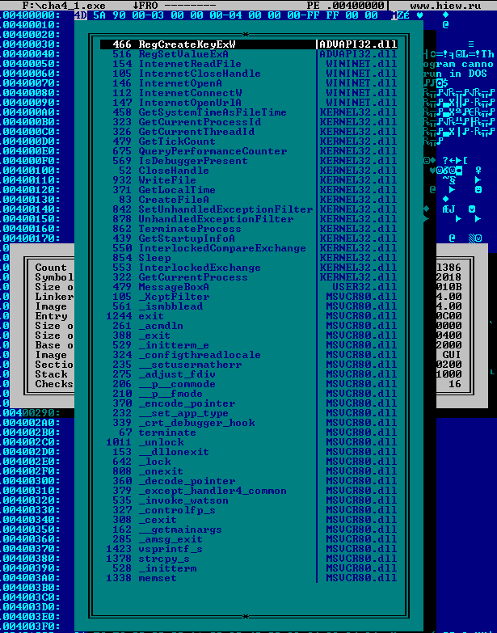

静态导入的模块、库和函数是我们可以预期程序访问的线索。例如，考虑到如果`PE`文件导入了`KERNEL32.DLL`库，那么我们应该预期文件包含核心 API，这些 API 可能会访问文件、进程和线程，或者动态加载其他库并导入函数。以下是我们应当注意的一些常见库：

+   `ADVAPI32.DLL`：此库包含将访问注册表的函数。

+   `MSVCRXX.DLL`（其中 XX 是版本号。示例包括`MSVCRT.DLL`和`MSVCR80.DLL`）——此文件包含 Microsoft Visual C 运行时函数。这直接告诉我们该程序是使用 Visual C 编译的。

+   `WININET.DLL`：此库包含访问互联网的函数。

+   `USER32.DLL`：此库包含与显示在显示器上的任何内容相关的窗口控制函数，如对话框、显示消息框和定位窗口框等。

+   `NTDLL.DLL`：此库包含直接与内核系统交互的原生函数。`KERNEL32.DLL`和像`USER32.DLL`、`WININET.DLL`、`ADVAPI32.DLL`这样的库具有将信息转发到原生函数以执行实际系统级操作的函数。

# 死列出

Deadlisting 是一种分析方法，我们可以分析文件的反汇编或反编译代码，并绘制执行时将发生的事件流。结果呈现的流程图将作为动态分析的指南。

# IDA（交互式反汇编器）

我们之前介绍了 IDA 工具来显示给定文件的反汇编。它具有图形视图功能，显示代码块的概述和条件流的分支。在 Deadlisting 中，我们试图描述每个代码块及其可能产生的结果。这使我们了解程序的功能。

# 反编译器

一些高级程序使用 p-code 编译，例如 C#和 Visual Basic（p-code 版本）。相反，反编译器试图根据 p-code 重新创建高级源代码。高级语法通常有一个等效的 p-code 代码块，可以被反编译器识别。

使用 C 语言编译的程序以纯汇编语言的形式保存在文件中。但由于它仍然是一种高级语言，一些代码块可以被识别并还原为它们的 C 语法。IDA Pro 的付费版本有一个昂贵但非常有用的插件，称为 Hex-Rays，可以识别这些代码块并重新创建 C 源代码。

# ILSpy – C#反编译器

用于反编译 C#程序的流行工具是 ILSpy。一些反编译器只会留下源代码供静态分析。但是，在 ILSpy 中，可以将反编译的源代码保存为 Visual Studio 项目。这使分析人员可以编译和调试以进行动态分析。

# 动态分析

动态分析是一种需要代码实时执行的分析类型。在静态分析中，我们最远可以到达的是 Deadlisting。例如，如果我们遇到一个解密或解压缩大量数据的代码，并且想要查看解码数据的内容，那么最快的选择就是进行动态分析。我们可以运行调试会话，让该代码区域为我们运行。静态分析和动态分析相辅相成。静态分析帮助我们识别代码中需要更深入理解和与系统进行实际交互的点。通过静态分析后进行动态分析，我们还可以看到实际数据，如文件句柄、随机生成的数字、网络套接字和数据包数据以及 API 函数结果。

存在一些可以进行自动化分析的工具，这些工具在沙盒环境中运行程序。这些工具要么记录运行时的更改，要么在快照之间记录：

+   Cuckoo（开源）– 这个工具在本地部署。它需要一个主机和沙盒客户端。主机充当 Web 控制台，文件被提交进行分析。文件在沙盒中执行，所有活动都被记录，然后发送回主机服务器。报告可以从 Web 控制台查看。

+   RegShot（免费） - 这个工具用于在运行程序之前和之后拍摄注册表和文件系统的快照。快照之间的差异使分析人员能够确定发生了哪些变化。这些变化可能包括操作系统所做的更改，分析人员需要识别哪些变化是由程序引起的。

+   Sandboxie（免费增值） - 这个工具用于程序运行的环境中。它声称内部使用了隔离技术。本质上，隔离技术分配磁盘空间，磁盘写入只会在程序通过 Sandboxie 执行时发生。这使得 Sandboxie 只通过查看隔离空间来确定变化。关于 Sandboxie 的下载链接和更多信息可以在[`www.sandboxie.com/HowItWorks`](https://www.sandboxie.com/HowItWorks)找到。

+   Malwr（免费） - 这是一个免费在线服务，使用 Cuckoo。文件可以提交到[`malwr.com/`](https://malwr.com/)。

+   ThreatAnalyzer（付费） - 最初称为 CWSandbox，这是安全行业中最流行的沙箱技术，用于自动提取运行中恶意软件的信息。该技术得到了很大的改进，特别是在报告方面。此外，它报告了发现的描述性行为，包括关于提交文件的云查询。它可以支持定制规则和灵活的 Python 插件，展示分析人员看到的行为。

+   Payload Security 的 Hybrid Analysis（免费） - 这是最受欢迎的免费在线服务之一，类似于 Malwr，报告内容与 ThreatAnalyzer 相似。

提交文件到在线服务减少了设置主机沙箱环境的需求。然而，某些人仍然倾向于自己搭建环境，以避免文件被分享给社区或在线服务。

对于恶意软件分析，建议在收到文件时进行自动化分析和网络信息收集。如果当局足够迅速地关闭这些网站，恶意软件获取更多数据的站点可能无法访问。

# 内存区域和进程的映射

在动态分析中，了解程序加载并执行时内存的状态非常重要。

由于 Windows 和 Linux 都支持多任务处理，每个进程都有自己的**虚拟地址空间（VAS）**。对于 32 位操作系统，VAS 的大小为 4 GB。每个 VAS 都通过其相应的页表映射到物理内存，并由操作系统的内核进行管理。那么，多个 VAS 如何适应物理内存呢？操作系统通过分页管理这一过程。分页有一个使用和未使用的内存列表，包括特权标志。如果物理内存不足，分页可以使用磁盘空间作为扩展物理内存的形式。一个进程及其模块依赖项并不会占用整个 4 GB 的空间，只有这些虚拟分配的内存段在页表中标记为已使用，并映射到物理内存中。

VAS 被分为两个区域：用户空间和内核空间，其中内核空间位于较高的地址区域。虚拟空间的划分在 Windows 和 Linux 之间有所不同：

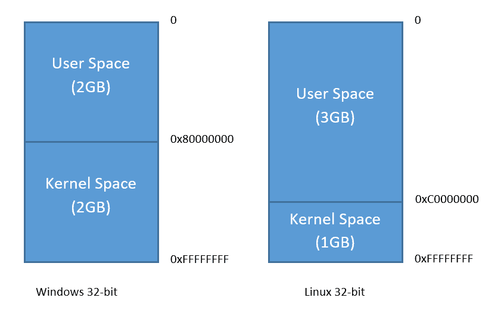

每个 VAS 都有一个内核空间，在页表中列为具有独占权限的空间。通常，这些权限被称为内核模式和用户模式。它们特定地被标识为保护环。内核具有环 0 的特权，而我们使用的应用程序则在环 3 特权上运行。设备驱动程序位于环 1 或环 2 层，也被认为具有内核模式权限。如果用户模式程序尝试直接访问内核模式的内核空间，则会触发页故障。

一旦 VAS 被启用，用户空间最初会为栈、堆、程序和动态库分配空间。进一步的分配会在程序运行时通过调用内存请求 API（如 `malloc` 和 `VirtualAlloc`）进行：

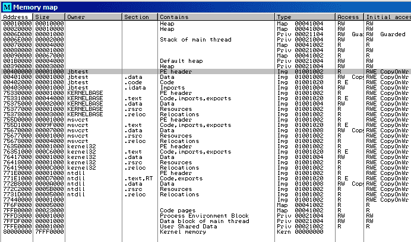

上面的截图是 `jbtest.exe` 刚刚在 32 位 Windows 中加载时的映射视图。这里是一个更具描述性的标准布局，展示了程序在 Windows 中虚拟分配空间中的结构：

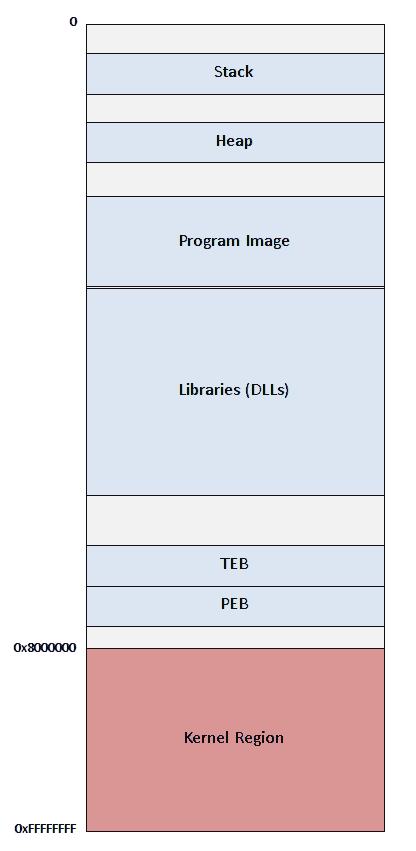

# 进程和线程监控

监控进程和线程，尤其是那些由我们分析的文件创建的线程，告诉我们比表面上看起来的更多行为。一个进程可以创建多个线程，这意味着它可能在同时执行多个行为。一个创建的进程意味着一个新程序刚刚被执行。

在 Windows 中，进程的终止、创建和打开可以通过第三方工具（如 Process Monitor）进行监控。尽管有内置的工具，如任务管理器，能够显示进程信息，但一些第三方工具可以提供更详细的关于进程及其线程的信息。

# 网络流量

服务器和客户端计算机之间传输的数据只有在动态分析过程中才能看到。在传输过程中捕获的数据包将帮助分析员了解程序向服务器发送了什么数据，以及服务器如何响应接收到的任何数据。

流行的工具，如 Wireshark 和 Fiddler，用于捕获数据包并将其存储为 `pcap` 文件。在 Linux 中，`tcpdump` 工具通常用于执行相同的操作。

# 监控系统变化

对于 Windows，我们需要监控三个方面：内存、磁盘和注册表。文件监控工具会监视创建、修改或删除的文件和目录。另一方面，注册表监控工具会监视创建、更新或删除的注册表键、值和数据。我们可以使用诸如 `FileMon` 和 `RegMon` 的工具来完成这项工作。

# 执行后的差异

比较在执行文件之前和之后拍摄的快照之间的差异，能够显示所有系统变化。这种分析方法无法识别发生在两者之间的任何事件。它对于找出软件安装程序如何安装程序非常有用。因此，差异结果在手动卸载软件时尤其有用。这里使用的工具是 RegShot。

# 调试

死列表提供了我们需要的大部分信息，包括程序的分支流程。现在，我们有机会验证程序在调试时将遵循的路径。我们可以看到暂时存储在寄存器和内存中的数据。而且，不必手动尝试理解解密代码，调试它会直接显示解密后的数据。

用于 Windows 调试的工具包括以下几种：

+   `OllyDebug`

+   `x86dbg`

+   `IDA Pro`

用于调试 Linux 的工具包括以下几种：

+   `gdb`

+   `radare2`

# 亲自试试看

为了尝试我们学到的工具，让我们对 `ch4_2.exe` 进行一些静态分析。为了帮助，以下是我们需要找到的内容：

+   文件信息：

    +   文件类型

    +   导入的 DLL 和 API

    +   文本字符串

    +   文件哈希

+   文件的作用

直接获取文件信息，我们将使用 TrID（[`mark0.net/soft-trid-e.html`](http://mark0.net/soft-trid-e.html)）来识别文件类型。执行以下命令：

```
trid cha4_2.exe
```

TrID 结果告诉我们，我们这里有一个 Windows 32 位可执行文件，且经过 UPX 压缩：

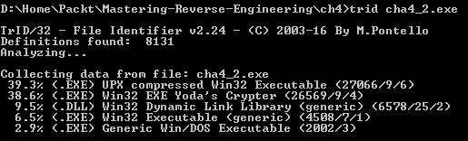

知道这是一个 UPX 压缩文件后，我们可以尝试使用 UPX ([`upx.github.io/`](https://upx.github.io/))工具的解压功能来帮助我们将文件恢复到压缩前的原始状态。压缩文件是一个在运行时会先解压再执行程序的可执行文件。压缩文件的主要目的是在保持程序原有行为的同时，减小可执行文件的大小。我们将在本书的*第十章*，*压缩与加密*，中详细讨论更多关于打包工具的内容。现在，我们只需使用 UPX 工具并加上`-d`参数来解压这个文件：

```
upx -d cha4_2.exe
```

这将导致文件被恢复到其原始形态：

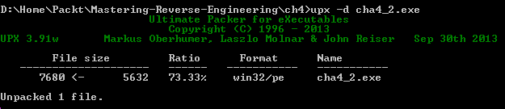

如果这次使用`TrID`，我们应该得到不同的结果：

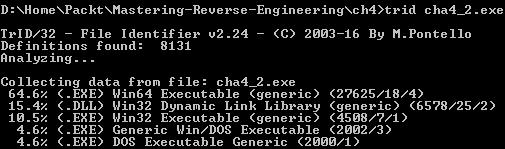

它仍然是一个 Windows 可执行文件，因此我们可以使用 CFF Explorer 来查看更多信息：

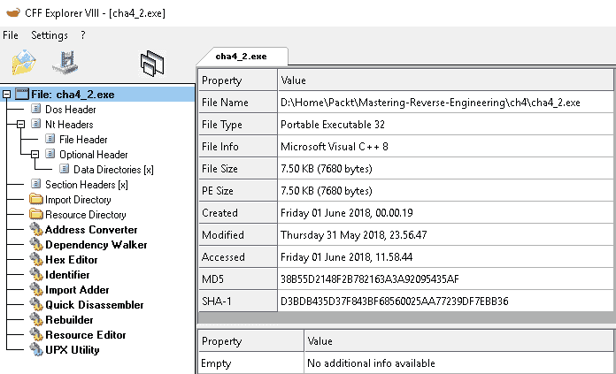

在左侧面板中，如果我们选择导入目录，我们应该看到它将使用的导入库文件和 API 函数列表，如下所示：

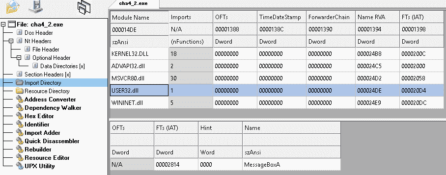

点击`USER32.dll`，我们看到程序将使用`MessageBoxA` API。

使用 bintext ([`b2b-download.mcafee.com/products/tools/foundstone/bintext303.zip`](http://b2b-download.mcafee.com/products/tools/foundstone/bintext303.zip))工具，我们可以看到文件中发现的文本字符串列表：

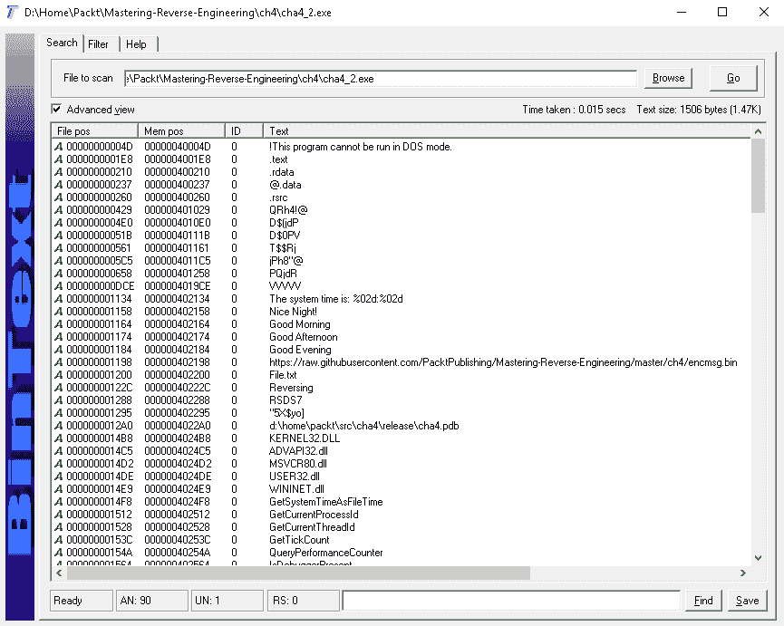

这些似乎是显著的文本字符串，暗示程序会检查时间并显示各种问候语。它可能会从互联网下载一个文件。它可能对`File.txt`文件执行某些操作。但所有这些都只是有根据的猜测，这对逆向工程来说是一个很好的练习，因为它帮助我们构建分析中各个方面之间关系的概览：

```
000000001134 000000402134 0 The system time is: %02d:%02d
000000001158 000000402158 0 Nice Night!
000000001164 000000402164 0 Good Morning
000000001174 000000402174 0 Good Afternoon
000000001184 000000402184 0 Good Evening
000000001198 000000402198 0 https://raw.githubusercontent.com/PacktPublishing/Mastering-Reverse-Engineering/master/ch4/encmsg.bin
000000001200 000000402200 0 File.txt
00000000122C 00000040222C 0 Reversing
```

文件的哈希值（MD5、SHA1、SHA256）将作为我们分析每个文件的参考。互联网上有很多生成文件哈希的工具。为了生成这个文件的哈希值，我们选择了一个名为 HashMyFiles 的工具。这是一个为 Windows 操作系统编译的工具，并且可以添加到 Windows 资源管理器的右键菜单中：

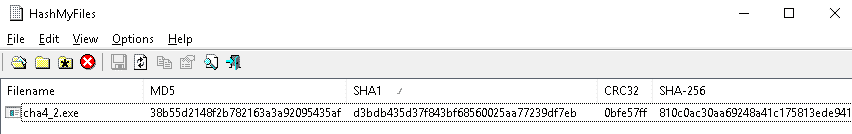

它可以显示文件的`CRC`、`MD5`、`SHA1`、`SHA-256`、`SHA-512`和`SHA-384`，如下所示：

```
MD5: 38b55d2148f2b782163a3a92095435af
SHA1: d3bdb435d37f843bf68560025aa77239df7ebb36
CRC: 0bfe57ff
SHA256: 810c0ac30aa69248a41c175813ede941c79f27ddce68a91054a741460246e0ae
SHA512: a870b7b9d6cc4d86799d6db56bc6f8ad811fb6298737e26a52a706b33be6fe7a8993f9acdbe7fe1308f9dbf61aa1dd7a95015bab72b5c6af7b7359850036890e
SHA384: b0425bb66c1d327d7819f13647dc50cf2214bf00e5fb89de63bcb442535860e13516de870cbf07237cf04d739ba6ae72
```

通常，我们只会使用`MD5`、`SHA1`或`SHA256`。

我们不应忘记通过简单的文件属性检查查看文件的大小和创建时间：

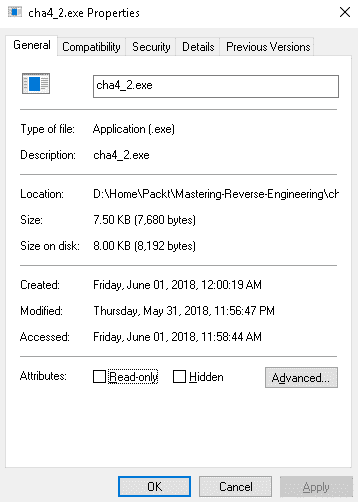

修改日期在文件实际编译时更为相关。创建日期是文件写入或复制到现在目录时的日期。这意味着当文件首次创建时，创建日期和修改日期是相同的。

为了静态分析文件的行为，我们将使用一个叫做 IDA Pro 的反汇编工具。IDA Pro 的免费版本可以在[`www.hex-rays.com/products/ida/support/download_freeware.shtml`](https://www.hex-rays.com/products/ida/support/download_freeware.shtml)找到。但是，如果你能够负担它的付费版本（我们强烈推荐），请务必购买。我们发现付费版的功能和支持的架构要好得多。但对于本书，我们将使用所有不需要购买的工具。

目前已知有两个免费的 IDA Pro 版本。我们已将该工具的备份上传至[`github.com/PacktPublishing/Mastering-Reverse-Engineering/tree/master/tools/Disassembler%20Tools`](https://github.com/PacktPublishing/Mastering-Reverse-Engineering/tree/master/tools/Disassembler%20Tools)。由于我们处理的是一个 32 位的 Windows 可执行文件，请选择 32 位版本。

安装完 IDA Pro 后，打开其中的 `cha4_2.exe`。等待自动分析完成，它将把反汇编重定向到 `WinMain` 函数：

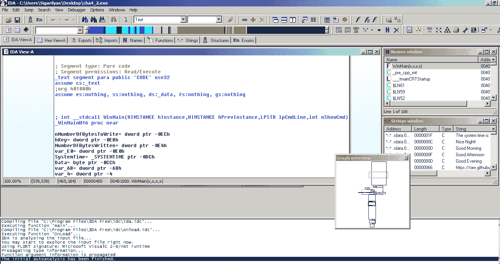

向下滚动将显示我们在*第三章*《低级语言》中学到的更多反汇编代码。对于死链行为，我们通常寻找调用 API 的指令。我们遇到的第一个 API 调用是 `GetSystemTime`：

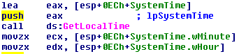

按照代码的顺序，我们依次遇到了以下 API 函数：

1.  `vsprintf_s`

1.  `MessageBoxA`

1.  `InternetOpenA`

1.  `InternetConnectW`

1.  `InternetOpenUrlA`

1.  `memset`

1.  `InternetReadFile`

1.  `InternetCloseHandle`

1.  `strcpy_s`

1.  `CreateFileA`

1.  `WriteFile`

1.  `CloseHandle`

1.  `RegCreateKeyExW`

1.  `RegSetValueExA`

利用我们在*第三章*《低级语言》中学到的知识，试着跟踪代码并推测文件在不执行的情况下会做什么。为了帮助你，这里是程序的预期行为：

1.  根据当前系统时间显示不同的消息。消息可能为以下之一：

    +   `Good Morning`

    +   `Good Afternoon`

    +   `Good Evening`

    +   `` `Nice Night` ``

1.  从互联网读取文件内容，解密内容，并将其保存到名为 `File.txt` 的文件中。

1.  创建一个注册表键 `HKEY_CURRENT_USER\Software\Packt`，并将相同的解密数据存储在 `Reversing` 注册表值中。

对于初学者来说，这可能需要较长时间，但通过持续的练习，分析速度会逐渐加快。

# 摘要

静态分析和动态分析这两种方法都有各自提取信息的手段，并且在正确分析文件时都是必要的。在进行动态分析之前，建议先从静态分析开始。我们坚持从我们获得的信息中生成分析报告的目标。分析师不仅仅局限于使用这里列出的工具和资源来进行分析——互联网中的任何信息都是有用的，但通过自己的分析来验证这些信息将作为证据。提取文件中的所有项目，如显著的文本字符串、导入的 API 函数、系统变化、代码流程以及可能的行为块都很重要，因为这些在构建文件概述时可能会有帮助。

静态分析的结果总结了动态分析所需的准备工作和资源。例如，如果静态分析将文件识别为 `Win32` PE 可执行文件，那么就需要准备分析 PE 文件的工具。

作为动态分析的一部分，我们讨论了**虚拟分配空间（VAS）**以及一个程序如何在内存中映射及其库依赖关系。当尝试进一步反向工程时，这些信息非常有用。

我们还介绍了几种可以用于静态和动态分析的方法，并以对一个 32 位 Windows PE 可执行文件的简短练习结束了本章。在下一章中，我们将展示如何在反向工程文件时更多地使用这些工具。

# 参考资料

本章使用的文件可以从[`github.com/PacktPublishing/Mastering-Reverse-Engineering`](https://github.com/PacktPublishing/Mastering-Reverse-Engineering)下载。 [](https://github.com/PacktPublishing/Mastering-Reverse-Engineering)
