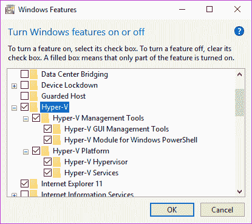

# 第五章：工具介绍

在之前的章节中，我们使用了一些简单的反向工程工具，例如 PEiD、CFF Explorer、IDA Pro 和 OllyDbg，这些工具帮助我们进行反向工程。本章将探讨并介绍更多我们可以使用和选择的工具。工具的选择取决于所需的分析。例如，如果一个文件被识别为 ELF 文件类型，我们就需要使用适合分析 Linux 可执行文件的工具。

本章涵盖了 Windows 和 Linux 的工具，按静态分析和动态分析分类。市场上有很多可用的工具——不要仅仅局限于本书讨论的工具。

在本章中，您将实现以下学习目标：

+   设置工具

+   理解 Windows 和 Linux 的静态及动态工具

+   理解支持工具

# 分析环境

在逆向工程中，环境的设置对结果至关重要。我们需要一个沙箱环境，在其中可以分析和操作文件，而不必担心会破坏某些东西。由于 Microsoft Windows 和 Linux 是最流行的操作系统，我们将在虚拟环境中讨论如何使用这些操作系统。

# 虚拟机

在第一章中，我们介绍了使用 VirtualBox 作为我们的桌面虚拟化系统。我们选择 VirtualBox 的原因是它是免费的。然而，除了 VirtualBox，选择合适的沙箱软件还需要根据用户的偏好和需求。每种沙箱软件都有其优缺点，因此值得探索市场上提供的各种软件，找出您偏好的软件。以下是一些虚拟化软件的简短列表：

+   **VMWare Workstation：** 这是一款商业软件，广泛流行。VMWare Workstation 可以从 **[`www.vmware.com`](https://www.vmware.com)** 下载。

+   **VirtualBox：** 这是一款免费的开源虚拟化软件。可以从 **[`www.virtualbox.org`](https://www.virtualbox.org)** 下载。

+   **Qemu（快速仿真器）：** 这实际上不是虚拟化软件，而是一款仿真器。虚拟化软件利用 CPU 的虚拟化功能，但使用真实的 CPU 资源来实现，而仿真器只是模仿 CPU 及其资源。也就是说，运行在虚拟化环境中的操作系统使用的是实际 CPU，而在仿真环境中运行的操作系统使用的是模仿的 CPU。Qemu 模块可以从 Linux 标准仓库安装。它有 Windows 和 macOS 版本，可以从 **[`www.qemu.org`](https://www.qemu.org)** 下载。

+   **Bochs：** 一款仅限于模拟 x86 CPU 架构的仿真器。它作为开源软件发布，通常用于调试小型磁盘镜像的**主引导记录**（**MBR**）。详细信息请参见 [`bochs.sourceforge.net`](http://bochs.sourceforge.net)。

+   **Microsoft Hyper-V：** Microsoft Windows 版本中的虚拟化功能，包括 Windows 10。通过以下菜单激活它：

****

+   **Parallels：** 一款商业虚拟化程序，主要设计用于在 macOS 主机上运行 Windows。有关此软件的更多信息，请访问[`www.parallels.com/`](https://www.parallels.com/)。

模拟器的优势在于可以模拟其他 CPU 架构，如 ARM。与虚拟化软件不同，模拟器依赖于裸机的虚拟化管理程序。缺点是可能会有性能上的拖慢，因为每个模拟的指令都需要解释执行。

# Windows

推荐在 32 位或 64 位的 Windows 10 系统上进行分析，或使用提供的最新版本。至少，Windows 7 仍然可以使用，因为它轻量且为运行可执行文件提供了稳定的环境。尽可能选择最受欢迎、最广泛使用的 Windows 版本将是最好的选择。选择 XP 等旧版本可能不会非常有用，除非我们要逆向的程序仅为 Windows XP 构建。

在撰写本文时，我们可以通过两种方式获取 Windows 用于分析**：**

+   从[`www.microsoft.com/en-us/software-download/windows10`](https://www.microsoft.com/en-us/software-download/windows10)下载的安装程序或 ISO 镜像安装 Windows 10。

+   部署用于测试旧版本 Edge 和 Internet Explorer 的 Windows 设备。该设备可以从**[`developer.microsoft.com/en-us/microsoft-edge/tools/vms`](https://developer.microsoft.com/en-us/microsoft-edge/tools/vms)**下载。

这些下载没有安装任何许可证，并且会在短时间内到期。对于前面列表中的第二个选项，在部署完设备后，最好在运行虚拟机之前*先*拍一个初始快照。恢复到这个初始快照应将过期时间重置为设备部署时的时间。之后也应创建更多快照，包含配置更新和已安装的工具。

# Linux

由于 Linux 是开源的，因此可以轻松下载。流行的系统通常是从 Debian 或 Red Hat 系统派生的。但由于大多数为分析开发的工具是基于 Debian 系统构建的，我们选择了 Lubuntu 作为我们的分析环境。

**Lubuntu**是 Ubuntu 的轻量版**。**

然而，我们不会把基于 Red Hat 的系统从我们的列表中排除。如果一个程序只设计在 Red Hat-based 系统上运行，我们应该在 Red Hat-based 系统上进行动态逆向和调试。如前所述，逆向工程不仅需要适合目标的工具，还需要适合的环境。

Lubuntu 可从 [`lubuntu.net`](https://lubuntu.net) 下载。但如果您更喜欢使用 Ubuntu，可以从 **[`www.ubuntu.com`](https://www.ubuntu.com)** 下载安装程序。

# 信息收集工具

确定我们正在处理的内容可以进一步为我们做准备。例如，如果识别出一个文件是 Windows 可执行文件，那么我们可以准备相应的 Windows 可执行文件工具。信息收集工具帮助我们确定文件类型及其属性。收集的信息成为分析配置文件的一部分。这些工具通常被分类为文件类型识别、哈希计算、文本字符串收集和监控工具。

# 文件类型信息

这些工具收集有关文件的基本信息。收集的数据包括文件名、文件大小、文件类型及特定于文件类型的属性。这些工具的结果使分析人员能够规划如何分析文件：

+   **PEiD:** 用于识别文件类型、压缩器和编译器的工具。该工具适用于 Windows 系统。虽然不再维护，但仍然非常有用。

+   **TrID:** 类似于 PEiD 的命令行工具。该工具有 Windows 和 Linux 版本。它可以读取各种文件类型的社区驱动签名数据库。

+   **CFF Explorer:** 主要用于读取和编辑 PE 格式文件的工具。它在 Windows 系统下运行，并具有诸如列出进程和将进程转储到文件的功能。还可用于重建进程转储。

+   **PE Explorer:** 用于读取和编辑 PE 文件结构的另一种工具。它还可以解包多种可执行压缩程序，如 UPX、Upack 和 NSPack。PE Explorer 仅在 Windows 系统中运行。

+   **Detect-it-Easy (DiE):** 可从 [`github.com/horsicq/Detect-It-Easy`](https://github.com/horsicq/Detect-It-Easy) 下载，DiE 是一个开源工具，使用社区驱动的一组算法签名来识别文件。该工具提供了 Windows 和 Linux 版本。

+   **ExifTool:** 该工具最初设计用于读取和编辑具有 EXIF 文件格式的图像文件的元数据。后来扩展了对其他文件格式的支持，包括 PE 文件。ExifTool 可在 Windows 和 Linux 上使用，并可从 **[`sno.phy.queensu.ca/~phil/exiftool/`](https://sno.phy.queensu.ca/~phil/exiftool/)** 下载。

# 哈希识别

信息收集还包括通过其哈希标识文件。哈希不仅有助于验证传输的文件，还常被用作文件分析配置文件的唯一标识：

+   **Quickhash:** 这是一个开源工具，可在 Windows、Linux 和 macOS 上生成任何文件的 MD5、SHA1、SHA256 和 SHA512。可从 **[`quickhash-gui.org/`](https://quickhash-gui.org/)** 下载。

+   **HashTab:** 该工具在 Windows 系统中运行，并可以集成为文件属性信息的选项卡。它可以计算 MD5、SHA1 和其他几种哈希算法。

+   **7-zip:** 这个工具实际上是一个文件归档工具，但它有一个扩展工具，可以启用计算文件的 MD5、SHA1、SHA256 等哈希值。

# 字符串

文本字符串收集工具主要用于快速识别程序可能使用的函数或消息。并非所有文本字符串都一定会被程序使用。程序流程仍然依赖于程序中设置的条件。然而，文件中的字符串位置可以作为分析人员可以追踪的标记：

+   **SysInternals Suite's strings:** 这是一个 Windows 下的命令行工具，用于显示任何类型文件中的文本字符串列表。

+   **BinText:** 这是一个基于 GUI 的 Windows 工具，可以显示任何给定文件的 ASCII 和 Unicode 文本字符串。

# 监控工具

无需手动深入挖掘程序的算法，只需运行程序即可获得大量关于其行为的信息。监控工具通常通过在常见或特定的系统库函数中放置传感器来工作，然后记录使用的参数。使用监控工具是快速生成程序初步行为分析的方式：

+   **SysInternals Suite's Procmon 或 Process Monitor:** 仅在 Windows 上运行，这是一个实时监控工具，用于监控进程、线程、文件系统和注册表事件。它可以从 [`docs.microsoft.com/en-us/sysinternals/downloads/procmon`](https://docs.microsoft.com/en-us/sysinternals/downloads/procmon) 下载，并且是 SysInternals Suite 套件的一部分。

+   **API Monitor:** 这个强大的工具通过监控程序运行时的 API 调用来帮助逆向工程。分析人员需要设置工具需要挂钩的 API。一旦 API 被挂钩，所有使用该 API 的用户模式进程都会被记录。API Monitor 可以从 [`www.rohitab.com/apimonitor`](http://www.rohitab.com/apimonitor) 下载。

+   **CaptureBAT:** 除了 Process Monitor 的功能外，这个命令行工具还能够监控网络流量。

# 默认命令行工具

操作系统自带了一些有用的工具，这些工具在没有第三方工具的情况下非常有用：

+   **strings:** 这是一个 Linux 命令，用于列出给定文件中找到的字符串。

+   **md5sum:** 这是一个 Linux 命令，用于计算给定文件的 MD5 哈希值。

+   **file:** 这是在 Linux 中用于识别文件的命令行工具。它使用 libmagic 库。

# 反汇编器

反汇编器是用于查看从高级语言或相同低级语言编译的程序低级代码的工具。作为分析的一部分，死列和识别代码块有助于构建程序的行为。然后，可以更容易地识别只需要彻底调试的代码块，而不需要运行整个程序代码：

+   **IDA Pro：** 这是软件安全行业常用的工具，用于反汇编基于 x86 和 ARM 架构的各种低级语言。它拥有广泛的功能列表，能够生成代码的图形化流程，显示代码块和分支。它还支持脚本编写，可以用来解析代码并将其反汇编成更有意义的信息。IDA Pro 有一个扩展插件，名为 Hex-Rays，能够将汇编代码识别为等效的 C 源代码或语法。IDA Pro 的免费版本可以从**[`www.hex-rays.com/products/ida/support/download_freeware.shtml`](https://www.hex-rays.com/products/ida/support/download_freeware.shtml)**下载。

+   **Radare：** 适用于 Windows、Linux 和 macOS 的开源工具，可以显示给定程序的反汇编结果。它有一个命令行界面视图，但也有现成的插件可以通过计算机的浏览器显示它。Radare 的源代码可以从**[`github.com/radare/radare2`](https://github.com/radare/radare2)**下载并自行构建。有关如何安装二进制文件的信息可以在其网站上找到，网址为**[`rada.re`](https://rada.re)**。

+   **Capstone：** 这是一个开源的反汇编和反编译引擎。许多反汇编和反编译工具，如 Snowman，都使用该引擎。关于此工具的信息可以在**[`www.capstone-engine.org/`](https://www.capstone-engine.org/)**找到。

+   **Hopper：** 一款适用于 Linux 和 macOS 操作系统的反汇编工具。它的界面与 IDA Pro 相似，且能够使用 GDB 进行调试。

+   **BEYE：** 也被称为 Binary EYE，这是一款十六进制查看和编辑工具，新增了反汇编视图模式。BEYE 适用于 Windows 和 Linux 系统，可以从**[`sourceforge.net/projects/beye/`](https://sourceforge.net/projects/beye/)**下载。

+   **HIEW：** 也叫 Hacker's View，类似于 BEYE，但对 PE 文件有更好的信息输出。HIEW 的付费版本支持更多的文件类型和机器架构。

# 调试器

当使用调试工具时，这意味着我们处于分析的代码跟踪阶段。调试器用于逐步执行程序应该执行的每条指令。在调试过程中，可以识别出内存、磁盘、网络和设备中的实际交互和变化：

+   **x86dbg：** 这是一款 Windows 用户模式下的调试器。它是开源的，能够调试 32 位和 64 位程序，且可以接受用户编写的插件。源代码可以从**[`github.com/x64dbg`](https://github.com/x64dbg)**下载，构建版本可以从**[`x64dbg.com`](https://x64dbg.com)**下载。

+   **IDA Pro：** 付费版本的 IDA Pro 能够使用相同的反汇编界面进行调试。当你想查看解密代码的图形视图时，它非常有用。

+   **OllyDebug：** 一款流行的 Windows 调试器，由于其可移植性和丰富的功能而广受欢迎。它可以容纳用户编写的插件，增加例如解压加载的可执行压缩文件（通过到达原始入口点）和内存转储等功能。Ollydebug 可以从 [`www.ollydbg.de/`](http://www.ollydbg.de/) 下载。

+   **Immunity Debugger：** 这个程序的界面看起来像是 OllyDebug 的一个高度改进版本。它支持 Python 和其他工具的插件。Immunity Debugger 可以从 Immunity, Inc. 的网站 [`www.immunityinc.com/products/debugger/`](https://www.immunityinc.com/products/debugger/) 下载。旧版本可以在 [`github.com/kbandla/ImmunityDebugger/`](https://github.com/kbandla/ImmunityDebugger) 找到。

+   **Windbg：** 由微软开发的调试器。界面相当简单，但可以配置为显示逆向工程师需要的各种信息。它能够被设置为远程调试设备驱动程序、内核级软件，甚至整个 Microsoft 操作系统。

+   **GDB：** 也被称为 GNU 调试器，GDB 最初是为 Linux 和其他一些操作系统开发的调试器。它不仅能够调试低级语言，还能用于调试 C、C++ 和 Java 等高级语言。GDB 也可以在 Windows 上使用。GDB 使用命令行界面，但也有现成的 GUI 程序可以使用 GDB 提供更为详细的信息展示。

+   **Radare：** Radare 也有一个随附的调试器。它还可以通过远程使用 GDB 进行远程调试。其界面基于命令行，但也具有集成的可视化视图。其开发者还通过浏览器创建了一个更好的可视化界面。基本上，相较于 GDB，Radare 更受青睐。它主要为 Linux 构建，但也提供 Windows 和 macOS 的编译二进制文件。

# 反编译器

反汇编器用于显示编译后高级程序的低级代码，而反编译器则尝试显示程序的高级源代码。这些工具通过识别与高级程序中对应语法匹配的低级代码块来工作。预计这些工具无法展示原始程序的源代码样式，但尽管如此，它们通过提供更好的伪代码视图，帮助加快分析过程。

+   **Snowman：** 这是一个 C 和 C++ 反编译器。它可以作为独立工具运行，也可以作为 IDA Pro 插件运行。源代码可以在 [`github.com/yegord/snowman`](https://github.com/yegord/snowman) 找到，已编译的二进制文件可以从 [`derevenets.com/`](https://derevenets.com/) 下载。它适用于 Windows 和 Linux。

+   **Hex-Rays：** 这也是一个 C 和 C++ 反编译器，并作为 IDA Pro 的插件运行。它作为 IDA Pro 的一部分进行商业销售。用户应该期待它能提供比 Snowman 更好的反编译输出。

+   **dotPeek: **这是 Jetbrains 提供的一款免费的 .NET 反编译器。可以从[`www.jetbrains.com/decompiler/`](https://www.jetbrains.com/decompiler/)下载。

+   **iLSpy:** 这是一个开源的 .NET 反编译器。源代码和预编译的二进制文件可以在[`github.com/icsharpcode/ILSpy`](https://github.com/icsharpcode/ILSpy)找到。

# 网络工具

以下是用于监控网络的工具列表：

+   **tcpdump:** 这是一个基于 Linux 的工具，用于捕获网络流量。可以从默认的仓库中安装。

+   **Wireshark: **这款工具能够监控网络流量。进出网络流量，包括数据包信息和数据，都会实时记录。Wireshark 原名 Ethereal，支持 Windows、Linux 和 macOS 系统，可以从[`www.wireshark.org/`](https://www.wireshark.org/)下载。

+   **mitmproxy: **也称为中间人代理。顾名思义，它作为代理设置，从而能够控制和监控网络流量，在数据被发送到外部或内部程序接收之前。

+   **inetsim:** 本质上，这个工具模拟网络和互联网连接，从而捕获程序外部发送的任何网络流量。它非常适用于分析恶意软件，防止其向外发送数据，同时了解它连接到哪里，以及它试图发送哪些数据。

# 编辑工具

有时我们需要修改程序的内容以使其正常工作，或者验证代码的行为。修改文件中的数据也可能改变代码流，其中可能会发生条件指令。更改指令还可以绕过反调试技巧：

+   **HxD Hex Editor:** 这是一个 Windows 二进制文件查看器和编辑器。你可以使用它查看文件的二进制内容。

+   **Bless:** 这是一个 Linux 二进制文件查看器和编辑器。

+   **Notepad++:** 这是一个 Windows 文本编辑器，但也可以读取二进制文件，尽管用十六进制数字读取二进制文件需要一个十六进制编辑插件。尽管如此，由于其支持的语言种类丰富，包括 Visual Basic 和 JavaScript，它仍然适用于阅读和分析脚本。

+   **BEYE:** 一个有用的工具，可以查看和编辑任何类型的文件。BEYE 支持 Windows 和 Linux 系统。

+   **HIEW: **这款软件的价值所在是它能够通过汇编语言实时加密。

# 攻击工具

有时我们需要自己构造数据包，让程序认为它正在接收来自网络的实时数据。尽管这些工具主要用于生成利用的网络数据包进行渗透测试，但它们也可以用于逆向工程：

+   **Metasploit** ([`www.metasploit.com/`](https://www.metasploit.com/)): 这是一个包含脚本的框架，能够生成利用包并发送到目标进行渗透测试。脚本是模块化的，用户可以开发自己的脚本。

+   **ExploitPack** ([`exploitpack.com/`](http://exploitpack.com/))：它的概念与 Metasploit 相同，但由不同的研究小组维护。

# 自动化工具

有时，我们必须开发自己的程序进行分析。例如，如果程序包含解密算法，我们可以开发一个独立的程序，运行相同的算法，这可能适用于具有相同解密算法的类似程序。如果我们想识别我们正在分析的文件的变种，我们可以通过以下之一来自动识别进入的文件：

+   **Python:** 这种脚本语言因其在多个平台上的可用性而受到欢迎。它在 Linux 操作系统中是预装的；Windows 的编译二进制文件可以从 [`www.python.org/`](https://www.python.org/) 下载。

+   **Yara:** 由 VirusTotal 的开发者提供的工具和语言。它能够搜索文件内容中的一组二进制或文本特征。其最常见的应用是搜索受损系统中的恶意软件残留。

+   **Visual Studio:** 微软的编程和构建程序软件。当反编译程序需要进行图形化调试时，逆向工程师可以使用它。例如，我们可以使用 Visual Studio 调试反编译后的 C# 程序，而不是尝试理解每个反汇编 C# 代码的 p-code。

# 软件法医工具

逆向工程包括分析程序执行后的行为。这涉及从内存和磁盘镜像中收集和确定对象与事件。使用这些工具，我们可以分析操作系统的挂起状态，并分析程序在运行内存中仍然在执行的过程。

这里列出了可以下载的不同法医软件：

+   Digital Forensics Framework ([`github.com/arxsys/dff`](https://github.com/arxsys/dff))

+   开放计算机法医架构

[`github.com/DNPA/OcfaArch`](https://github.com/DNPA/OcfaArch)

[                    https://github.com/DNPA/OcfaLib](https://github.com/DNPA/OcfaLib)

[                    https://github.com/DNPA/OcfaModules](https://github.com/DNPA/OcfaModules)

[                    https://github.com/DNPA/OcfaDocs](https://github.com/DNPA/OcfaDocs)

[                    https://github.com/DNPA/OcfaJavaLib](https://github.com/DNPA/OcfaJavaLib)

+   CAINE ([`www.caine-live.net/`](https://www.caine-live.net/))

+   X-Ways Forensics Disk Tools ([`www.x-ways.net/forensics/`](http://www.x-ways.net/forensics/))

+   SIFT ([`digital-forensics.sans.org/community/downloads`](https://digital-forensics.sans.org/community/downloads))

+   SleuthKit ([`www.sleuthkit.org/`](http://www.sleuthkit.org/))

+   LibForensics ([`code.google.com/archive/p/libforensics/`](https://code.google.com/archive/p/libforensics/))

+   Volatility ([`github.com/volatilityfoundation`](https://github.com/volatilityfoundation)):

在恶意软件分析中，Volatility 是其中一个非常流行的开源软件。它能够读取虚拟机的挂起状态。此类工具的优势在于，像 rootkit 等恶意软件，通常会试图隐藏自己免受用户领域的监视，但可以通过内存取证工具进行提取。

+   BulkExtractor ([`downloads.digitalcorpora.org/downloads/bulk_extractor/`](http://downloads.digitalcorpora.org/downloads/bulk_extractor/))

+   PlainSight ([`www.plainsight.info/index.html`](http://www.plainsight.info/index.html))

+   Helix3 ([`www.e-fense.com/products.php`](http://www.e-fense.com/products.php))

+   RedLine ([`www.fireeye.com/services/freeware/redline.html`](https://www.fireeye.com/services/freeware/redline.html))

+   Xplico ([`www.xplico.org/`](https://www.xplico.org/))

# 自动化动态分析

这些工具用于通过在封闭沙箱中运行程序来自动收集信息。

+   **Cuckoo:** 这是一款使用 Python 编写的软件，部署在基于 Debian 的操作系统上。通常，Cuckoo 安装在宿主的 Ubuntu 系统中，并将文件发送到 VMWare 或 VirtualBox 沙箱客户端进行分析。它的发展由社区驱动，因此有许多开源插件可供下载。

+   **ThreatAnalyzer:** 商业化销售的 ThreatAnalyzer，之前称为 CWSandbox，在反病毒社区中非常流行，因其能够分析恶意软件并返回非常有用的信息。由于用户可以开发自己的规则，ThreatAnalyzer 作为一个后端系统，可以用来确定提交的文件是否包含恶意行为。

+   **Joe Sandbox:** 这是另一款商业工具，它展示了提交的程序在执行过程中所执行的活动的有意义信息。

+   **Buster Sandbox Analyzer (BSA):** BSA 的设置与前面提到的三个工具不同。它不需要客户端沙箱，而是安装在沙箱环境中。该工具的概念是分配磁盘空间供程序运行。运行后，所有在此空间中发生的事件都会被记录并在之后恢复。尽管如此，仍然建议在封闭环境中使用 BSA。

+   **Regshot:** 这是一个用于捕获磁盘和注册表快照的工具。运行程序后，用户可以拍摄第二次快照。比较这两次快照的差异，从而显示系统中所做的更改。Regshot 应在封闭环境中运行。

# 在线服务网站

目前已有一些在线服务可以帮助我们进行反向分析。

+   **VirusTotal:**  该工具提交文件或 URL，并与各种安全程序的检测结果进行交叉参考。结果能够帮助我们判断该文件是否确实为恶意文件。它还可以展示一些文件信息，如 SHA256、MD5、文件大小以及任何指示信息。

+   **Malwr:**  提交到此处的文件将被提交到后端的 Cuckoo 系统进行分析。

+   **Falcon Sandbox:** 这也被称为混合分析，是一个由 Payload Security 开发的在线自动化分析系统。Cuckoo 和混合分析的结果揭示了相似的行为，但一个可能比另一个提供更多信息。这可能取决于客户端沙箱的设置。例如，如果沙箱中没有安装.NET 框架，那么提交的.NET 可执行文件将无法按预期运行。

+   **whois.domaintools.com:** 这是一个显示域名或 URL 的 whois 信息的网站。当你试图确定一个程序正在连接哪个国家或州时，这个工具可能会派上用场。

+   **robtex.com:** 一个类似 whois 的网站，它显示给定网站的历史信息以及其连接的图形化树状图。

+   **debuggex.com:** 这是一个在线正则表达式服务，你可以在这里测试你的正则表达式语法。在开发脚本或阅读包含正则表达式的脚本或代码时，这个工具非常有用。

向这些在线网站提交文件或 URL 意味着你会将信息分享给它们。最好在提交之前先征得文件或 URL 所有者的许可。

# 总结

在本章中，我们列出了一些用于逆向工程的工具。我们尝试根据工具的用途对其进行分类。但正如我们选择使用每一款软件一样，逆向工程师的工具选择取决于它们所包含的功能、用户友好性，以及最重要的，是否具备执行任务所需的功能。我们已经介绍了可以用于静态分析的工具，包括二进制查看器和反汇编工具。我们还列出了可以用于 Windows 和 Linux 的有用调试工具。

从这个列表中，我个人推荐 HIEW、x86dbg、IDA Pro、Snowman 和 iLSpy 用于 Windows 平台下 PE 二进制可执行文件的分析。而在 Linux 平台上，BEYE、Radare、GDB 和 IDA Pro 非常适合分析 ELF 文件。

我们还介绍了一些在线服务，这些服务可以帮助我们获取更多关于从分析中提取的网站的信息。我们还介绍了在处理大量文件时可以自动化分析的系统。此外，我们列出了几款法医工具，这些工具可以用来分析挂起的内存。

如同往常一样，这些工具各有优缺点，最终选择哪一个将取决于用户和所需的分析类型。这些工具各自拥有独特的功能和使用舒适度。在接下来的章节中，我们将使用这些工具的组合。我们可能不会使用所有工具，但会选择那些能够完成分析的工具。

在下一章中，我们将在 Linux 平台上进行逆向工程时，学习更多工具。
