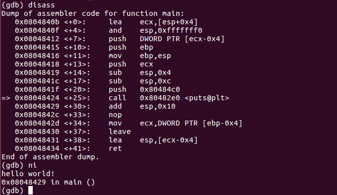

# 第六章：在 Linux 平台上的逆向工程

很多我们的工具在 Linux 中都运行得很好。在上一章中，我们介绍了一些已经默认内置的 Linux 命令行工具。Linux 也已经安装了 Python 脚本语言。在本章中，我们将讨论一个用于分析 Linux 文件和托管 Windows 沙箱客户端的良好设置。

我们将通过探索逆向工具学习如何逆向一个 ELF 文件。我们将通过设置一个 Windows 沙箱客户端、在其中运行程序并监控来自沙箱的网络流量来结束本章。

并不是所有人都喜欢使用 Linux。Linux 是一个开源系统。它是一项将伴随我们的技术。作为逆向工程师，任何技术都不应该成为障碍，学会这项技术永远不会太晚。关于 Linux 系统的基础知识可以轻松地在互联网上找到。本章尽可能详细地描述了安装和执行所需内容的步骤，确保你能跟上。

本章将讨论以下内容：

+   理解 Linux 可执行文件

+   逆向一个 ELF 文件

+   Linux 中的虚拟化 – 在 Linux 主机下分析 Windows 可执行文件

+   网络流量监控

# 设置

本章讨论了 Linux 逆向工程，因此我们需要进行 Linux 设置。对于逆向工程，建议在裸机上部署 Linux。由于大多数已开发的分析工具基于 Debian，因此我们使用 32 位 Ubuntu Desktop。 我选择 Ubuntu 是因为它有一个强大的社区。正因如此，大多数问题可能已经有了解决方案，或者解决方案很容易获得。

为什么要在裸机上构建我们的设置？它是我们沙箱客户端的更好主机，尤其是在监控网络流量时。它还在正确处理 Windows 恶意软件方面具有优势，可以防止由于恶意软件执行而导致的安全问题。

你可以访问 [`www.ubuntu.com/`](https://www.ubuntu.com/) 获取 Ubuntu 安装程序的 ISO 文件。该网站包含了安装指南。如需更多帮助，可以访问社区论坛 [`ubuntuforums.org/`](https://ubuntuforums.org/)。

“裸机”是指直接在硬件上执行代码的计算机。它通常用来指代硬件，而不是虚拟机。

# Linux 可执行文件 – hello world

首先，让我们创建一个 hello world 程序。在此之前，我们需要确保已经安装了构建该程序所需的工具。打开一个终端（终端是 Linux 中类似于 Windows 命令提示符的工具），并输入以下命令。这可能需要你输入超级用户密码：

```
sudo apt install gcc
```

C 程序编译器，***`gcc`,** *通常预装在 Linux 中。

打开任何文本编辑器，输入以下代码，并将其保存为 `*hello.c*`：

```
#include <stdio.h>
void main(void)
{
    printf ("hello world!\n");
}
```

你可以通过在终端中运行 `vi` 来使用 `vim` 作为文本编辑器。

要编译并运行程序，请使用以下命令：


`hello` 文件是我们用于显示控制台消息的 Linux 可执行文件。

现在，开始对这个程序进行逆向分析。

# dlroW olleH

作为一种良好实践，逆向分析程序的过程应从正确的识别开始。让我们从 `file` 命令开始：


它是一个 32 位 ELF 文件类型。ELF 文件是 Linux 平台的原生可执行文件。

下一站，让我们快速查看文本字符串，使用 `strings` 命令：


这个命令将产生类似以下的输出：

```
/lib/ld-linux.so.2
libc.so.6
_IO_stdin_used
puts
__libc_start_main
__gmon_start__
GLIBC_2.0
PTRh
UWVS
t$,U
[^_]
hello world!
;*2$"(
GCC: (Ubuntu 5.4.0-6ubuntu1~16.04.10) 5.4.0 20160609
crtstuff.c
__JCR_LIST__
deregister_tm_clones
__do_global_dtors_aux
completed.7209
__do_global_dtors_aux_fini_array_entry
frame_dummy
__frame_dummy_init_array_entry
hello.c
__FRAME_END__
__JCR_END__
__init_array_end
_DYNAMIC
__init_array_start
__GNU_EH_FRAME_HDR
_GLOBAL_OFFSET_TABLE_
__libc_csu_fini
_ITM_deregisterTMCloneTable
__x86.get_pc_thunk.bx
_edata
__data_start
puts@@GLIBC_2.0
__gmon_start__
__dso_handle
_IO_stdin_used
__libc_start_main@@GLIBC_2.0
__libc_csu_init
_fp_hw
__bss_start
main
_Jv_RegisterClasses
__TMC_END__
_ITM_registerTMCloneTable
.symtab
.strtab
.shstrtab
.interp
.note.ABI-tag
.note.gnu.build-id
.gnu.hash
.dynsym
.dynstr
.gnu.version
.gnu.version_r
.rel.dyn
.rel.plt
.init
.plt.got
.text
.fini
.rodata
.eh_frame_hdr
.eh_frame
.init_array
.fini_array
.jcr
.dynamic
.got.plt
.data
.bss
.comment
```

字符串按文件开头的顺序列出。列表的前两部分包含了我们的消息和编译器信息。前两行还显示了程序使用的库：

```
/lib/ld-linux.so.2
libc.so.6
```

列表的最后部分包含了文件各个区段的名称。我们只知道一些文本片段，它们被放入我们的 C 代码中。其余的则是由编译器本身放入的，作为其准备并结束代码优雅执行的一部分。

在 Linux 中，反汇编只是一个命令行的事情。使用 `objdump` 命令的 `-d` 参数，我们应该能够显示可执行代码的反汇编。你可能需要通过以下命令将输出结果写入文件：

```
objdump -d hello > disassembly.asm
```

输出文件 `disassembly.asm` 应包含以下代码：


如果你注意到，反汇编语法与我们学过的 Intel 汇编语言格式不同。我们在这里看到的是 AT&T 反汇编语法。要获取 Intel 语法，我们需要使用 `-M intel` 参数，如下所示：

```
objdump -M intel -d hello > disassembly.asm
```

输出应该给我们以下的反汇编结果：


结果显示了每个函数的反汇编代码。总的来说，从可执行部分有 15 个函数：

```
Disassembly of section .init:
080482a8 <_init>:

Disassembly of section .plt:
080482d0 <puts@plt-0x10>:
080482e0 <puts@plt>:
080482f0 <__libc_start_main@plt>:

Disassembly of section .plt.got:
08048300 <.plt.got>:

Disassembly of section .text:
08048310 <_start>:
08048340 <__x86.get_pc_thunk.bx>:
08048350 <deregister_tm_clones>:
08048380 <register_tm_clones>:
080483c0 <__do_global_dtors_aux>:
080483e0 <frame_dummy>:
0804840b <main>:
08048440 <__libc_csu_init>:
080484a0 <__libc_csu_fini>:

Disassembly of section .fini:
080484a4 <_fini>:
```

我们代码的反汇编通常位于 `.text` 区段。由于这是一个由 GCC 编译的程序，我们可以跳过所有初始化代码，直接进入 `main` 函数，那里存放着我们的代码：


我已经标出了 `puts` 的 API 调用。`puts` API 也是 `printf` 的一个变种。GCC 足够聪明，选择了 `puts` 而不是 `printf`，原因是该字符串没有被解释为 **C 风格的** **格式化字符串**。格式化字符串或 `formatter` 包含控制字符，这些字符用 `%` 符号表示，例如 `%d` 表示整数，`%s` 表示字符串。实际上，*puts* 用于非格式化字符串，而 `printf` 用于格式化字符串。

# 到目前为止，我们收集了什么信息？

假设我们对源代码没有任何了解，这是我们迄今为止收集到的信息：

+   该文件是一个 32 位 ELF 可执行文件。

+   它是使用 `GCC` 编译的。

+   它有 15 个可执行函数，包括 `main()` 函数。

+   代码使用了常见的 Linux 库：`libc.so`和`ld-linux.so`。

+   根据反汇编代码，预计该程序只是显示一条消息。

+   程序预计会使用*puts*显示消息。

# 动态分析

现在让我们进行一些动态分析。请记住，动态分析应在沙箱环境中进行。Linux 中通常预安装了一些可以用来显示更详细信息的工具。在这次逆向工程中，我们将介绍`ltrace`、`strace`和`gdb`。

这是`ltrace`的使用方法：


`ltrace`的输出显示了程序执行的可读代码。`ltrace`记录了程序调用和接收的库函数。它调用了*puts*来显示一条消息。当程序终止时，它还收到了一个退出状态`*13*`。

地址`*0x804840b*`也是反汇编结果中列出的`main`函数的地址。

`strace`是我们可以使用的另一种工具，但它会记录系统调用。下面是我们在 hello world 程序上运行`strace`的结果：


`strace`记录了所有发生的系统调用，从程序被系统执行开始。`execve`是记录的第一个系统调用。调用*execve*会运行由其函数参数中的文件名指向的程序。`open`和`read`是用来读取文件的系统调用。`mmap2`、`mprotect`和`brk`负责内存活动，如分配、权限和段边界设置。

在`puts`的代码内部，它最终会执行一个`write`系统调用。*write*通常会将数据写入它所指向的对象。通常，它用于写入文件。在这个例子中，*write*的第一个参数值为`1`。`1`的值表示`STDOUT`，这是控制台输出的句柄。第二个参数是消息，因此它将消息写入`STDOUT`。

# 进一步调试

首先，我们需要通过运行以下命令安装`gdb`：

```
sudo apt install gdb
```

安装应该是这样的：


然后，使用`gdb`来调试`hello`程序，如下所示：

```
gdb ./hello
```

`gdb`可以通过命令进行控制。这些命令在在线文档中有详细列出，但只需输入*help*就可以帮助我们掌握基础。

你还可以使用`gdb`显示指定函数的反汇编，通过`disass`命令。例如，让我们看看如果我们使用`disass main`命令会发生什么：


然后，我们再次获得了以 AT&T 语法表示的反汇编。要将`gdb`设置为使用 Intel 语法，请使用以下命令：

```
set disassembly-flavor intel
```

这应该会给我们 Intel 汇编语言语法，如下所示：


要在*main*函数处设置断点，命令是`b *main`。

请注意，星号 (***) 指定了程序中的地址位置。

设置断点后，我们可以使用 `run` 命令运行程序。我们应该最终到达 `main` 函数的地址：


要获取当前寄存器的值，请输入 `info registers`。由于我们处于 32 位环境中，因此会使用扩展寄存器（即 EAX、ECX、EDX、EBX 和 EIP）。如果是 64 位环境，寄存器会以 R 为前缀（即 RAX、RCX、RDX、RBX 和 RIP）。

现在我们已经进入了主函数，我们可以逐步执行每条指令（使用 `stepi` 命令）并跳过指令（使用 `nexti` 命令）。通常，我们会跟随 `info registers` 命令，查看哪些值发生了变化。

`stepi` 和 `nexti` 的简写命令分别是 `si` 和 `ni`。

继续输入 `si` 和 `disass main`，直到你看到包含 `call   0x80482e0 <puts@plt>` 的行。你应该会得到以下 `disass` 和 `info registers` 的结果：


左侧的 `=>` 指示了指令指针所在的位置。寄存器应如下所示：


在 *puts* 函数被调用之前，我们可以检查栈中推入的值。我们可以通过 `x/8x $esp` 查看：


`x` 命令用于显示指定地址的内存转储。语法为 `x/FMT ADDRESS`。FMT 有三个部分：重复次数、格式字母和大小字母。你可以通过 `help x` 查看更多关于 `x` 命令的信息。`x/8x $esp` 会从 `esp` 寄存器指向的地址处显示 8 个 DWORD 十六进制值。由于地址空间是 32 位的，因此默认的大小字母是 `DWORD`。

`puts` 期望一个单一的参数。因此，我们只关注在 `0x080484c0` 栈位置推送的第一个值。我们预计该参数应该是一个消息存放的地址。因此，输入 `x/s` 命令应该给出消息的内容，如下所示：


接下来，我们需要对调用指令行进行跳过（`ni`）。这应该会显示以下消息：



但是，如果你使用了 `si`，指令指针将位于 *puts* 包装代码中。我们仍然可以使用 `until` 命令回到我们离开的地方，简写为 `u`。只使用 `until` 命令将步进一条指令。你需要指定停止的位置地址。这就像是一个临时的断点。记得在地址前加上星号：


剩下的 `6` 行代码会在进入 main 函数后恢复 *ebp* 和 *esp* 的值，然后通过 *ret* 返回。记住，调用指令会在跳转到函数地址之前，将返回地址存储在栈顶。`ret` 指令将读取 *esp* 寄存器指向的返回值。

`esp` 和 `ebp` 的值应在执行 *ret* 指令之前恢复。通常，函数开始时会设置自己的栈帧，以便与函数的局部变量一起使用。

下面是展示给定地址指令执行后 `esp`、`ebp` 和 `ecx` 寄存器值变化的表格。

请注意，栈由 *esp* 寄存器表示，栈从高地址开始，随着数据的存储，地址逐渐下降。

| **地址** | **指令** | **esp** | **ebp** | **ecx** | **备注** |
| --- | --- | --- | --- | --- | --- |
| `0x0804840b` | `lea ecx,[esp+0x04]` | `0xbffff08c` | `0` | `0xbffff090` | 进入 main 后的初始值。[0xbffff08c] = 0xb7e21637，这是返回地址。 |
| `0x0804840f` | `and esp,0xfffffff0` | `0xbffff080` | `0` | `0xbffff090` | 将栈对齐到 16 字节边界。实际上，这将 esp 减去 0xc。 |
| `0x08048412` | `push DWORD PTR [ecx-0x4]` | `0xbffff07c` | `0` | `0xbffff090` | [0xbffff07c] = 0xb7e21637，ecx - 4 = 0xbffff08c 指向返回地址。现在返回地址被放置在两个栈地址中。 |
| `0x08048415` | `push ebp` | `0xbffff078` | `0` | `0xbffff090` | 开始设置栈帧。[0xbffff078] = 0 |
| `0x08048416` | `mov ebp,esp` | `0xbffff078` | `0xbffff078` | `0xbffff090` | 保存 esp。 |
| `0x08048418` | `push ecx` | `0xbffff074` | `0xbffff078` | `0xbffff090` | 保存 ecx。[0xbffff074] = 0xbffff090。 |
| `0x08048419` | `sub esp,0x4` | `0xbffff070` | `0xbffff078` | `0xbffff090` | 为栈帧分配 4 字节空间。 |
| `0x0804841c` | `sub esp,0xc` | `0xbffff064` | `0xbffff078` | `0xbffff090` | 为栈帧分配额外的 12 字节空间。 |
| `0x0804841f` | `push 0x80484c0` | `0xbffff060` | `0xbffff078` | `0xbffff090` | [0xbffff060] = 0x080484c0，[0x080484c0] = "hello world!" |
| `0x08048424` | `call 0x80482e0 <puts@plt>` | `0xbffff060` | `0xbffff078` | `0xffffffff` | 调用后栈没有变化。 |
| `0x08048429` | `add esp,0x10` | `0xbffff070` | `0xbffff078` | `0xffffffff` | 将 0x10 加到 esp，减少栈帧大小。 |
| `0x0804842c` | `nop` | `0xbffff070` | `0xbffff078` | `0xffffffff` | 无操作 |
| `0x0804842d` | `mov ecx,DWORD PTR [ebp-0x4]` | `0xbffff070` | `0xbffff078` | `0xbffff090` | 恢复调用前的 ecx 值。 |

| `0x08048430` | `leave` | `0xbffff07c` | `0` | `0xbffff090` | `leave` 相当于 `mov esp, ebp`。 |

`pop ebp` |

| `0x08048431` | `lea esp,[ecx-0x4]` | `0xbffff08c` | `0` | `0xbffff090` | ecx - 4 = 0xbffff08c，[0xbffff08c] = 0xb7e21637，恢复了 esp 的地址。 |
| --- | --- | --- | --- | --- | --- |
| `0x08048434` | `ret` | `-` | `-` | `-` | 返回到 0xb7e21637。 |

你可以继续探索`ret`后的清理代码，或者通过使用`continue`或它的缩写`c`让程序最终结束，如下所示：


# 一个更好的调试器

在进行更多 Linux 可执行文件逆向操作之前，让我们先探索更多工具。`gdb`看起来可以，但如果我们能使用可视化调试工具进行交互式调试会更好。在第五章，*工具的使用*部分，我们介绍了 Radare，作为一个既能进行反汇编也能进行调试的工具。所以，让我们感受一下使用 Radare 的体验。

# 设置

Radare 已经是第二个版本。要安装它，你需要***git***从 GitHub 仓库进行安装，步骤如下：

```
git clone https://github.com/radare/radare2.git
```

安装说明写在`README`文件中。根据写作时的建议，可以通过运行`sys/install.sh`或`sys/user.sh`的 shell 脚本在终端中安装`Radare2`。

# Radare2 中的 Hello World

除了反汇编器和调试器，`Radare2`还包含了一堆工具。大多数都是静态分析工具。

要获取 hello world 二进制文件的`MD5`哈希值，可以使用`rabin2`：


通过使用`ls`命令和`rahash2`，我们能够确定以下信息：

```
filesize: 7348 bytes
time stamp: July 12 21:26 of this year
md5: 799554478cf399e5f87b37fcaf1c2ae6
sha256: 90085dacc7fc863a2606f8ab77b049532bf454badefcdd326459585bea4dfb29
```

`rabin2`是另一个可以从文件中提取静态信息的工具，例如文件类型、头信息、部分内容和字符串。

首先通过使用`rabin2 -I hello`命令获取文件类型：


*bintype*、*class*、*hascode* 和 *os* 字段表明该文件是一个可执行的 32 位 ELF 文件，并且可以在 Linux 上运行。*arch*、*bits*、*endian* 和 *machine* 表示该文件是用 x86 代码构建的。此外，*lang*字段表明该文件是从 C 语言编译而来的。这些信息无疑将帮助我们在反汇编和调试时做好准备。

要列出导入的函数，我们使用`rabin2 -i hello`：


我们关注的有两个全局函数：`puts`和`__libc_start_main`。如我们所讨论，`puts`用于打印消息。`__libc_start_main`是一个初始化堆栈帧、设置寄存器和一些数据结构、设置错误处理并最终调用`main()`函数的函数。

要获取 ELF 头信息，可以使用`rabin2 -H hello`：


如果我们只对从数据段中找到的字符串感兴趣，可以使用`rabin2 -z hello`命令：


使用`rabin2`，我们获得了关于文件的额外信息，如下所示：

```
filetype: 32-bit elf file and has executable code for Linux
architecture: x86 Intel
functions: imports puts and has a main function
notable strings: hello world!
```

现在让我们尝试使用`radare2`调试器。从终端控制台，你可以使用`radare2`的缩写`r2`，或者直接使用`radare2`，并将`-d <file>`作为参数：


这将带你进入`radare2`控制台。在方括号中，地址表示当前`eip`的位置。这不是 hello 程序的入口点，而是动态加载器中的一个地址。与`gdb`类似，你需要输入命令。要调出帮助，只需使用***?***，它将显示如下命令列表：


我们首先使用`aaa`命令。此命令分析代码中的函数调用、标志、引用，并尝试生成有意义的函数名称：


使用`V!`命令将控制台设置为可视模式。在此模式下，我们应该能够在交互式查看寄存器和栈的同时调试程序。输入`:`应该会显示命令控制台。按*Enter*键将使我们返回可视模式。输入`V?`以显示更多可视模式命令。最好将终端窗口最大化，以便更好地查看调试器：


在命令控制台中，输入`db entry0`。这将设置一个断点，位于我们程序的入口地址。但由于我们也知道该程序有一个主函数，你还可以输入`db sym.entry`，在主函数处设置断点。

在可视模式中，你可以使用默认提供的这些按键开始实际的调试：

```
| F2 toggle breakpoint
| F4 run to cursor
| F7 single step
| F8 step over
| F9 continue
```

通过设置入口点和主函数的断点，按*F9*运行程序。我们应该会到达入口点地址。

你需要通过重新打开`radare2`的可视模式来刷新它，以查看更改。为此，只需按`q`两次退出可视模式。但在再次运行`V!`之前，你需要通过使用`s eip`命令来查找当前的*eip*。

再次按*F9*应该将你带到程序的主函数。记得刷新可视模式：


按*F7*或*F8*可以跟踪程序的执行，同时查看栈和寄存器的变化。在`0x0804840b`这一行地址左侧的字母**b**表示该地址已设置断点。

到目前为止，我们已经了解了基本的命令和按键。随时探索其他命令，你肯定能获取更多信息，并学到一些简单的技巧来分析文件。

# 密码是什么？

既然我们已经知道如何进行“`Unix 风格`”调试，让我们尝试密码程序。你可以从[`github.com/PacktPublishing/Mastering-Reverse-Engineering/raw/master/ch6/passcode`](https://github.com/PacktPublishing/Mastering-Reverse-Engineering/raw/master/ch6/passcode)下载密码程序。

尝试获取一些静态信息。以下是你可以使用的命令列表：

```
ls -l passcode
rahash2 -a md5,sha256 passcode
rabin2 -I passcode
rabin2 -i passcode
rabin2 -H passcode
rabin2 -z passcode
```

此时，我们正在寻找的信息如下：

+   文件大小：7,520 字节

+   MD5 哈希：`b365e87a6e532d68909fb19494168bed`

+   SHA256 哈希：`68d6db63b69a7a55948e9d25065350c8e1ace9cd81e55a102bd42cc7fc527d8f`

+   文件类型：ELF

    +   32 位 x86 Intel

    +   编译后的 C 代码中有一些显著的导入函数：`printf`、`puts`、`strlen` 和 `__isoc99_scanf`

+   显著的字符串如下：

    +   输入密码：

    +   正确的密码！

    +   密码错误！

现在，为了进行快速动态分析，让我们使用`ltrace ./passcode`：


我们尝试了几个密码，但没有一个返回“正确密码！”该文件甚至没有字符串列表中的任何提示供我们使用。让我们尝试`strace`：


包含`read(0, asdf123`的那一行是密码被手动输入的地方。之后的代码进入退出流程。让我们基于反汇编代码做一个死名单活动，但这次我们将使用`radare2`的图形视图。请打开`radare2`，并使用`radare2 -d passcode`命令。在`radare2`控制台中，使用以下命令序列：

```
aaa
s sym.main
VVV
```

这些应该打开来自*main*函数的反汇编代码块的图形表示。向下滚动，你应该能看到条件分支，其中绿色线条表示`true`，红色线条表示`false`流程。继续向下滚动，直到看到`Correct password!`文本字符串。我们将从这里向后工作：


在`0x80485d3`块中，显示`Correct password!`字符串，我们看到该消息是通过*puts*函数显示的。进入该块的是来自`0x80485c7`块的红线。在`0x80485c7`块中，`local_418h`的值与`0x2de`（即十进制的 734）进行了比较。为了跳转到`Correct password!`块，值应该等于 734。如果我们尝试反编译 C 代码，它应该类似于下面这样：

```
...
if (local_418h == 734)
    puts("Correct password!)
...
```

向上滚动查看红线的来源：


从这个图形来看，存在一个循环，退出循环需要`local_414h`的值大于或等于`local_410h`的值。循环会跳转到`0x80485c7`块。在`0x8048582`块中，`local_418h`和`local_414h`的值都被初始化为 0。这些值在`0x80485b9`块中进行比较。

检查`0x8048598`块时，有三个需要关注的变量：`local_40ch`、`local_414h` 和 `local_418h`。如果我们为这个块编写伪代码，它应该是这样的：

```
eax = byte at address [local_40ch + local_414h]
add eax to local_418h 
increment local_414h
```

`local_414h`似乎是指向`local_40c`指向的数据的指针。`local_418`从 0 开始，每次添加`local_40ch`中的一个字节。从概览来看，这里似乎发生了一个校验和算法：

```
...
// unknown variables for now are local_40ch and local_410h
int local_418h = 0;
for (int local_414h = 0; local_414h < local_410h; local_414++)
{
    local_418h += local_40ch[local_414h];
}

if (local_418h == 734)
    puts("Correct password!)
...
```

让我们进一步向上滚动，找出`local_40ch`和`local_410h`应该是什么：


这是主块。这里有三个命名的函数：

+   `printf()`

+   `scanf()`

+   `strlen()`

这里使用了`local_40ch`和`local_410h`。`local_40ch`是`scanf`的第二个参数，而`0x80486b1`地址中的数据应该包含期望的格式。`local_40ch`包含输入的缓冲区内容。要检索`0x80486b1`处的数据，只需输入冒号（`:`），输入`s 0x80486b1`，然后返回可视模式。再次按`q`查看数据：


`local_40ch`中数据的长度被识别并存储在`local_410h`中。`local_410h`中的值与 7 进行比较。如果相等，程序会沿着红线进入`0x8048582`块，即校验和循环的开始。如果不相等，程序会沿着绿线进入`0x80485e5`块，其中包含显示“密码错误！”的代码。

总结来说，代码可能是这样的：

```
...
printf ("Enter password: ");
scanf ("%s", local_40ch);
local_410h = strlen(local_40ch);

if (local_410h != 7)
    puts ("Incorrect password!);
else
{
    int local_418h = 0;
    for (int local_414h = 0; local_414h < local_410h; local_414++)
    {
        local_418h += local_40ch[local_414h];
    }

    if (local_418h == 734)
        puts("Correct password!)
}
```

输入的密码应该有**7 个字符**，并且密码中所有字符的总和应该**等于 734**。因此，密码可以是任何内容，只要满足给定的条件即可。

使用 ASCII 表，我们可以确定每个字符的等效值。如果 7 个字符的总和为 734，我们只需将 734 除以 7，这样得到的结果是 104，或者 0x68，余数为 6。我们可以将余数 6 分配给 6 个字符，得到如下字符集：

| **十进制** | **十六进制** | **ASCII 字符** |
| --- | --- | --- |
| `105` | `0x69` | `i` |
| `105` | `0x69` | `i` |
| `105` | `0x69` | `i` |
| `105` | `0x69` | `i` |
| `105` | `0x69` | `i` |
| `105` | `0x69` | `i` |
| `104` | `0x68` | `h` |

让我们尝试密码`*iiiiiih*`或`*hiiiiii*`，如下面所示：


# 网络流量分析

这次，我们将编写一个接收网络连接并返回一些数据的程序。我们将使用可在[`github.com/PacktPublishing/Mastering-Reverse-Engineering/raw/master/ch6/server`](https://github.com/PacktPublishing/Mastering-Reverse-Engineering/raw/master/ch6/server)下载的文件。下载完成后，通过终端执行该文件，命令如下：


该程序是一个等待连接到端口`9999`的服务器程序。要进行测试，请打开浏览器，使用服务器运行机器的 IP 地址和端口。例如，如果您在自己的机器上尝试，可以使用`127.0.0.1:9999`。您可能会看到如下输出：


要了解网络流量，我们需要使用诸如`tcpdump`之类的工具来捕获一些网络数据包。`tcpdump`通常在 Linux 发行版中预安装。打开另一个终端并使用以下命令：

```
sudo tcpdump -i lo 'port 9999'  -w captured.pcap
```

下面是所用参数的简要解释：

`-i lo` 使用 `loopback` 网络接口。我们在这里使用它，因为我们计划在本地访问该服务器。

`'port 9999'`，带单引号的部分，仅筛选使用端口 9999 的报文。

`-w captured.pcap`将数据包写入名为`captured.pcap`的 PCAP 文件中。

一旦`tcpdump`开始监听数据，尝试通过浏览器访问`127.0.0.1:9999`来连接服务器。如果你希望从服务器所在机器外部连接，则重新运行`tcpdump`，不要加上`-i lo`参数。这样会使用默认的网络接口。而且，你需要使用默认网络接口的 IP 地址，而不是`127.0.0.1`来进行访问。

要停止`tcpdump`，只需通过*Ctrl* + *C*中断它。

要以人类可读的形式查看`captured.pcap`文件的内容，可以使用以下命令：

```
sudo tcpdump -X -r captured.pcap > captured.log
```

此命令应将`tcpdump`的输出重定向到`captured.log`。`-X`参数以十六进制和 ASCII 形式显示数据包的内容。`-r captured.pcap`表示从`PCAP`文件`captured.pcap`中读取数据。打开`captured.log`文件时，应该类似以下内容：


在继续之前，让我们先了解一下两种最常见的网络协议，**传输控制协议**（**TCP**）和**用户数据报协议**（**UDP**）。TCP 是一种网络传输协议，它建立了发送方和接收方之间的通信。通信开始时进行三次握手，发送方向接收方发送 SYN 标志，接收方再向发送方发送 SYN 和 ACK 标志，最后发送方再发送 ACK 标志给接收方，从而开启通信。发送方和接收方之间的进一步数据交换是以分段的方式进行的。每个段都有一个 20 字节的 TCP 头部，包含了发送方和接收方的 IP 地址以及当前的状态标志。接下来是数据的大小和数据本身。UDP 使用较短的头部，因为它只发送数据，并不需要接收方的确认。UDP 不需要进行三次握手。UDP 的主要目的是持续不断地将数据发送给接收方。虽然 TCP 在数据交换方面更可靠，但 UDP 的数据发送速度更快，因为没有必要的开销。UDP 通常用于通过文件传输协议传输大量数据，而 TCP 则用于需要数据完整性的通信。

在前面的截图中，第 1 行到第 15 行显示了一个 TCP 三次握手。第一次从本地主机端口`55704`（客户端）到本地主机端口`9999`（服务器）的连接是一个 SYN，标志位为`S`。然后，服务器响应了一个`S.`标志，表示 SYN 和 ACK。最后是一个 ACK，用` .`表示。这时，客户端端口 55704 是一个临时端口。临时端口是系统为客户端连接生成的端口。服务器端口`9999`在服务器程序中是固定的。

在第 16 行到第 23 行，我们可以看到服务器到客户端的实际响应数据。服务器返回一个包含 55 个字符的数据，包含字符串"*You have connected to the Genie. Nothing to see here.*"和 2 个换行（`0x0A`）字符。55 个字符字符串前的数据是数据包的头部，包含有关数据包的信息。解析后的数据包头部内容在第 16 行中描述。TCP 标志为`P.`，表示 PUSH 和 ACK。数据包头部结构中的信息已在 TCP 和 UDP 规范中进行了文档化。你可以从`RFC 675`（[`tools.ietf.org/html/rfc675`](https://tools.ietf.org/html/rfc675)）和`RFC 768`（[`tools.ietf.org/html/rfc768`](https://tools.ietf.org/html/rfc768)）开始查找这些规范。为了加速处理过程，我们可以使用 Wireshark，稍后会讨论它，来帮助我们解析数据包信息。

在第`24`行到第`28`行，FIN 和 ACK 标志，格式为`F.`，从服务器发送到客户端，表示服务器正在关闭连接。第 29 行到第 33 行是一个 ACK 响应，`.`，确认连接正在关闭。

捕获和查看图形化信息的更好工具是***Wireshark***。之前称为*Ethereal*，Wireshark 具有与`tcpdump`相同的功能。Wireshark 可以从[`www.wireshark.org/`](https://www.wireshark.org/)手动下载和安装。也可以通过以下`apt`命令进行安装：

```
sudo apt install wireshark-qt
```

捕获网络数据包需要 root 权限才能访问网络接口。这也是我们在运行***tcpdump***时使用`sudo`的原因。使用***Wireshark***时也是如此。因此，要在 Linux 中执行***Wireshark***，我们使用以下命令：

```
sudo wireshark
```

除了捕获流量并实时显示外，您还可以在***Wireshark***中打开并查看 PCAP 文件：


要开始捕获，双击接口列表中的`any`。这基本上会同时捕获默认网络接口和回环接口*lo*的流量。你将看到连续的网络流量数据包行。Wireshark 有一个显示过滤器，可以最小化我们看到的所有噪音。对于我们的练习，在过滤器字段中输入以下显示过滤器：

```
tcp.port == 9999
```

这应该只显示使用`9999`端口的 TCP 数据包。你还可以尝试其他过滤器。更多内容请参考 Wireshark 的手册页面。

点击数据包后，可以查看解析的信息，这将帮助你更好地理解数据包字段，如下图所示：


Wireshark 对标准数据包有广泛的知识。这使得 Wireshark 成为每个分析师必备的工具。

# 概要

本章我们讨论了已经内置在 Linux 系统中的逆向工程工具。基于 Debian 的操作系统，如 Ubuntu，由于广泛的社区支持和可用的工具，常被用于逆向工程目的。我们更多地关注了如何分析 Linux 原生可执行文件——ELF 文件。我们首先使用 GCC 将一个 C 程序源代码编译成 ELF 可执行文件。接着，我们使用静态信息收集工具，包括`ls`、`file`、`strings`和`objdump`，对可执行文件进行了分析。然后我们使用`ltrace`和`strace`进行动态分析。之后我们使用`gdb`调试程序，展示了 Intel 汇编语言的语法。

我们还介绍并探讨了`radare2`工具包。我们使用了`rahash2`和`rabin2`来收集静态信息，并使用`radare2`在交互式视图中进行反汇编和调试。网络分析工具也没有被忽视，我们使用了`tcpdump`和`Wireshark`。

在信息安全领域，待分析的大多数文件都是基于微软 Windows 的可执行文件，我们将在下一章进行讨论。虽然在行业中我们可能不会遇到太多 Linux 文件的分析，但了解如何进行分析一定会在任务需要时派上用场。

# 深入阅读

本章使用的文件和源代码可以在[`github.com/PacktPublishing/Mastering-Reverse-Engineering/tree/master/ch6`](https://github.com/PacktPublishing/Mastering-Reverse-Engineering/tree/master/ch6)找到。
