# 第七章：Windows 平台的逆向工程

由于 Windows 是全球最流行的操作系统之一，网络世界中的大多数软件都为其编写。这其中包括恶意软件。

本章聚焦于 Windows 本地可执行文件 PE 文件的分析，并通过文件分析直接进行演变，即收集静态信息并执行动态分析。我们将深入了解 PE 文件如何与 Windows 操作系统交互。以下主题将在本章中进行讲解：

+   分析 Windows PE 文件

+   工具

+   静态分析

+   动态分析

# 技术要求

本章需要读者具备 Windows 环境及其管理的知识。读者还应了解如何在命令提示符中使用命令。本章的第一部分要求读者具备使用 Visual Studio 或类似软件构建和编译 C 程序的基本知识。

# Hello World

Windows 环境中的程序通过使用 Windows API 与系统进行通信。这些 API 是围绕文件系统、内存管理（包括进程、栈和分配）、注册表、网络通信等构建的。在逆向工程方面，广泛覆盖这些 API 及其库模块，在通过低级语言等效视角理解程序的工作方式时具有很大优势。因此，开始探索 API 及其库的最佳方式是自己开发一些程序。

开发者使用的高级语言有很多，比如 C、C++、C# 和 Visual Basic。C、C++ 和 Visual Basic（本地）编译为可执行文件，直接执行 x86 语言的指令。C# 和 Visual Basic（`p-code`）通常会被编译成使用解释器的形式，解释器将 p-code 转换为实际的 x86 指令。本章将重点讨论从 C/C++ 和汇编语言编译的可执行二进制文件。目标是更好地理解使用 Windows API 的程序行为。

对于本章，我们选择使用 Visual Studio Community 版来构建 C/C++ 程序。Visual Studio 是广泛用于构建 Microsoft Windows 程序的工具。由于它也是微软的产品，已包含编译程序所需的兼容库。你可以从 [`visualstudio.microsoft.com/downloads/`](https://visualstudio.microsoft.com/downloads/) 下载并安装 Visual Studio Community 版。

这些程序既不有害也不恶意。以下 C 编程活动可以在裸机上使用 Visual Studio 完成。如果你计划在 Windows 虚拟机上安装 Visual Studio，根据本书的编写时间，Visual Studio 2017 Community 版的推荐系统要求如下：

+   1.8 GHz 双核

+   4 GB 的内存

+   130 GB 的磁盘空间

这些系统要求可以在[`docs.microsoft.com/en-us/visualstudio/productinfo/vs2017-system-requirements-vs`](https://docs.microsoft.com/en-us/visualstudio/productinfo/vs2017-system-requirements-vs)找到。你可能需要执行一些 Windows 更新，并安装.NET 框架。也可以从我们之前下载的 Windows 7 安装包中安装，下载链接为[`developer.microsoft.com/en-us/microsoft-edge/tools/vms/`](https://developer.microsoft.com/en-us/microsoft-edge/tools/vms/)。请访问微软 Visual Studio 网站，了解新版的要求。

有许多 Visual Studio 的替代工具，它们有较小的系统要求，例如 Bloodshed Dev C++、Zeus IDE 和 Eclipse。然而，这些 IDE 中的一些可能不是最新的，或者可能需要正确设置编译器及其依赖项。

# 学习 API

我们将在此跳过`Hello World`，因为我们在前面的章节已经做过了。相反，我们将研究以下示例程序：

+   将键盘记录器保存到`filez`中

+   枚举注册表键并打印输出

+   列出进程并打印输出

+   加密数据并将其存储到文件中

+   解密加密文件

+   监听端口`9999`并在连接时发送回一个消息

这些程序的源代码可以在[`github.com/PacktPublishing/Mastering-Reverse-Engineering/tree/master/ch7`](https://github.com/PacktPublishing/Mastering-Reverse-Engineering/tree/master/ch7)找到。可以随意使用这些程序，添加自己的代码，甚至创建自己的版本。这里的目标是让你学习这些 API 如何协同工作。

确定程序行为的关键之一是学习如何使用 API。每个 API 的使用方法都在微软开发者网络（MSDN）文档库中有记录。我们即将查看的程序只是程序行为的示例。我们利用这些 API 在这些行为的基础上进行扩展。我们在这里的目标是学习这些 API 的使用方法以及它们如何相互交互。

作为一名逆向工程师，读者应当并且要求使用 MSDN 或其他资源进一步了解 API 的工作原理。可以在 MSDN 文档库中搜索 API 名称，网址为[`msdn.microsoft.com`](https://msdn.microsoft.com)。

# 键盘记录器

键盘记录器是一个记录用户按键的程序。日志通常保存在一个文件中。这里使用的核心 API 是`GetAsyncKeyState`。每个可以从键盘或鼠标按下的按钮都有一个被称为虚拟键代码的分配 ID。指定虚拟键代码后，`GetAsyncKeyState`会提供关于该键是否被按下的信息。

这个程序的源代码可以在[`github.com/PacktPublishing/Mastering-Reverse-Engineering/blob/master/ch7/keylogger.cpp`](https://github.com/PacktPublishing/Mastering-Reverse-Engineering/blob/master/ch7/keylogger.cpp)找到。

为了使键盘记录功能正常工作，我们需要检查每个虚拟键码的状态，并将它们放入一个循环中。一旦识别到一个按键被按下，虚拟键码就会被存储到文件中。以下代码实现了这一功能：

```
  while (true) {
 for (char i = 1; i <= 255; i++) {
 if (GetAsyncKeyState(i) & 1) {
 sprintf_s(lpBuffer, "\\x%02x", i);
 LogFile(lpBuffer, (char*)"log.txt");
 }
 }
```

`LogFile` 是一个函数，接受两个参数：它写入的数据和日志文件的文件路径。`lpBuffer` 包含数据，并通过 `sprintf_s` API 格式化为 `\\x%02x`。因此，格式会将任何数字转换为两位数的十六进制字符串。数字 9 会变成 `\x09`，数字 106 会变成 `\x6a`。

我们只需要三个 Windows API 函数来实现将数据存储到日志文件中——`CreateFile`、`WriteFile` 和 `CloseHandle`——如下面的代码所示：

```
void LogFile(char* lpBuffer, LPCSTR fname) {

  BOOL bErrorFlag;
  DWORD dwBytesWritten;

  HANDLE hFile = CreateFileA(fname, FILE_APPEND_DATA, 0, NULL, OPEN_ALWAYS, FILE_ATTRIBUTE_NORMAL, NULL);
  bErrorFlag = WriteFile(hFile, lpBuffer, strlen(lpBuffer), &dwBytesWritten, NULL);
  CloseHandle(hFile);

  return;_
}
```

`CreateFileA` 用于根据文件名和文件的使用方式创建或打开一个新文件。由于这个练习的目的是不断记录按键的虚拟键码，我们需要以追加模式打开文件（`FILE_APPEND_DATA`）。返回的文件句柄存储在 `hFile` 中，并被 `WriteFile` 使用。`lpBuffer` 包含格式化的虚拟键码。`WriteFile` 需要的参数之一是要写入的数据大小。这里使用了 `strlen` API 来确定数据的长度。最后，使用 `CloseHandle` 关闭文件句柄。关闭文件句柄是很重要的，这样文件才会可供使用。

有不同的键盘变体，旨在适应用户的语言。因此，不同的键盘可能具有不同的虚拟键码。在程序开始时，我们使用 `GetKeyboardLayoutNameA(lpBuffer)` 来识别正在使用的键盘类型。在读取日志时，将使用键盘类型作为参考，以正确识别哪些键被按下。

# regenum

如下所述，`regenum` 程序旨在枚举给定注册表项中的所有值和数据。API 所需的参数取决于前一个 API 的结果。就像我们在键盘记录器程序中能够写入数据到文件一样，注册表枚举的 API 也需要一个句柄。在这种情况下，`RegEnumValueA` 和 `RegQueryValueExA` API 使用的是注册表项的句柄。

这个程序的源代码可以在 [`github.com/PacktPublishing/Mastering-Reverse-Engineering/blob/master/ch7/regenum.cpp`](https://github.com/PacktPublishing/Mastering-Reverse-Engineering/blob/master/ch7/regenum.cpp) 找到。

```
int main()
{
 LPCSTR lpSubKey = "Software\\Microsoft\\Windows\\CurrentVersion\\Run";
 HKEY hkResult;
 DWORD dwIndex;
 char ValueName[1024];
 char ValueData[1024];
 DWORD cchValueName;
 DWORD result;
 DWORD dType;
 DWORD dataSize;
 HKEY hKey = HKEY_LOCAL_MACHINE;

 if (RegOpenKeyExA(hKey, lpSubKey, 0, KEY_READ, &hkResult) == ERROR_SUCCESS)
 {
 printf("HKEY_LOCAL_MACHINE\\%s\n", lpSubKey);
 dwIndex = 0;
 result = ERROR_SUCCESS;
 while (result == ERROR_SUCCESS)
 {
 cchValueName = 1024;
 result = RegEnumValueA(hkResult, dwIndex, (char *)&ValueName, &cchValueName, NULL, NULL, NULL, NULL);
 if (result == ERROR_SUCCESS)
 {
 RegQueryValueExA(hkResult, ValueName, NULL, &dType, (unsigned char *)&ValueData, &dataSize);
 if (strlen(ValueName) == 0)
 sprintf((char*)&ValueName, "%s", "(Default)");
 printf("%s: %s\n", ValueName, ValueData);
 }
 dwIndex++;
 }
 RegCloseKey(hkResult);
 }
 return 0;
}
```

枚举从通过 `RegOpenKeyExA` 获取注册表项的句柄开始。成功的返回值应该是非零的，而输出应该显示存储在 `hkResult` 中的句柄。这里要访问的注册表项是 `HKEY_LOCAL_MACHINE\Software\Microsoft\Windows\CurrentVersion\Run`。

`hkResult`中的句柄由`RegEnumValueA`使用，用于开始枚举注册表键下的每个注册表值。后续对`RegEnumValueA`的调用将返回下一个注册表值条目。因此，这段代码被放在循环中，直到返回`ERROR_SUCCESS`结果为止。`ERROR_SUCCESS`结果表示成功检索到注册表值。

对于每个注册表值，都会调用`RegQueryValueExA`。记住，我们只获取了注册表值，但没有获取其对应的数据。通过使用`RegQueryValueExA`，我们应该能够获取到注册表数据。

最后，我们需要通过使用`RegCloseKey`来关闭句柄。

这里使用的其他 API 包括`printf`、`strlen`和`sprintf`。`printf`在程序中用于将目标注册表键、值和数据打印到命令行控制台。`strlen`用于获取文本字符串的长度。每个注册表键都有一个默认值。由于`RegEnumValueA`将返回`ERROR_SUCCEPantf`，我们可以将`ValueName`变量替换为一个名为`(Default)`的字符串：

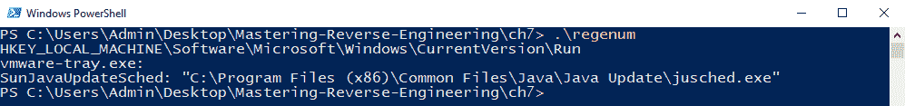

# processlist

类似于枚举注册表值的方式，列出进程也基于相同的概念。由于实时进程变化快速，需要获取进程列表的快照。该快照包含快照创建时的进程信息列表。可以使用`CreateToolhelp32Snapshot`来获取快照。结果存储在`hSnapshot`中，它是快照句柄。

要开始枚举列表，使用`Process32First`来获取列表中的第一个进程信息。该信息存储在`pe32`变量中，类型为`PROCESSENTRY32`。通过调用`Process32Next`来检索后续的进程信息。当处理完列表后，最终使用`CloseHandle`。

再次使用`printf`来打印出可执行文件名和进程 ID：

```
int main()
{
  HANDLE hSnapshot;
  PROCESSENTRY32 pe32;

  hSnapshot = CreateToolhelp32Snapshot(TH32CS_SNAPPROCESS, 0);
  pe32.dwSize = sizeof(PROCESSENTRY32);

  if (Process32First(hSnapshot, &pe32))
  {
    printf("\nexecutable [pid]\n");
    do
    {
      printf("%ls [%d]\n", pe32.szExeFile, pe32.th32ProcessID);
    } while (Process32Next(hSnapshot, &pe32));
    CloseHandle(hSnapshot);
  }
    return 0;
}
```

该程序的源代码可以在[`github.com/PacktPublishing/Mastering-Reverse-Engineering/blob/master/ch7/processlist.cpp`](https://github.com/PacktPublishing/Mastering-Reverse-Engineering/blob/master/ch7/processlist.cpp)找到。

# 加密和解密文件

勒索软件已成为全球传播的最流行恶意软件之一，其核心要素是能够加密文件。

在这些加密和解密程序中，我们将学习一些用于加密和解密的基本 API。

用于加密的 API 是`CryptEncrypt`，而`CryptDecrypt`用于解密。然而，这些 API 至少需要一个加密密钥的句柄。为了获得加密密钥的句柄，需要先获得**加密服务提供商**（**CSP**）的句柄。从本质上讲，在调用`CryptEncrypt`或`CryptDecrypt`之前，必须先调用一些 API 来设置将要使用的算法。

在我们的程序中，`CryptAcquireContextA`用于从 CSP 获取一个`CryptoAPI`密钥容器句柄。在这个 API 中，算法 AES 被指定。加密将使用的密钥由用户定义的密码控制，该密码设置在`password[]`字符串中。为了获取派生密钥的句柄，使用了`CryptCreateHash`、`CryptHashData`和`CryptDeriveKey`这些 API，并将用户定义的`password`传递给`CryptHashData`。要加密并赋值给`buffer`变量的数据，会传递给`CryptEncrypt`。最终加密后的数据会被写入同一数据缓冲区，并在此过程中覆盖原数据：

```
int main()
{
  unsigned char buffer[1024] = "Hello World!";
  unsigned char password[] = "this0is0quite0a0long0cryptographic0key";
  DWORD dwDataLen;
  BOOL Final;

  HCRYPTPROV hProv;

  printf("message: %s\n", buffer);
  if (CryptAcquireContextA(&hProv, NULL, NULL, PROV_RSA_AES, CRYPT_VERIFYCONTEXT))
  {
    HCRYPTHASH hHash;
    if (CryptCreateHash(hProv, CALG_SHA_256, NULL, NULL, &hHash))
    {
      if (CryptHashData(hHash, password, strlen((char*)password), NULL))
      {
        HCRYPTKEY hKey;
        if (CryptDeriveKey(hProv, CALG_AES_128, hHash, NULL, &hKey))_
        {
          Final = true;
          dwDataLen = strlen((char*)buffer);
          if (CryptEncrypt(hKey, NULL, Final, NULL, (unsigned char*)&buffer, &dwDataLen, 1024))
          {
            printf("saving encrypted buffer to message.enc");
            LogFile(buffer, dwDataLen, (char*)"message.enc");
          }
          printf("%d\n", GetLastError());
          CryptDestroyKey(hKey);
        }
      }
      CryptDestroyHash(hHash);
    }
    CryptReleaseContext(hProv, 0);
  }
  return 0;
}
```

使用修改后的`LogFile`函数，该函数现在包括写入数据的大小，已将加密数据存储在`message.enc`文件中：

```
void LogFile(unsigned char* lpBuffer, DWORD buflen, LPCSTR fname) {

  BOOL bErrorFlag;
  DWORD dwBytesWritten;

  DeleteFileA(fname);

  HANDLE hFile = CreateFileA(fname, FILE_ALL_ACCESS, 0, NULL, CREATE_ALWAYS, FILE_ATTRIBUTE_NORMAL, NULL);
  bErrorFlag = WriteFile(hFile, lpBuffer, buflen, &dwBytesWritten, NULL);
  CloseHandle(hFile);

  Sleep(10);

  return;
}
```

为了优雅地关闭`CryptoAPI`句柄，使用了`CryptDestroyKey`、`CryptDestroyHash`和`CryptReleaseContext`。

加密后的消息`Hello World!`现在会变成这样：

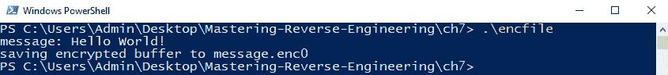

解密消息的方法是使用相同的`CryptoAPI`，但这次使用`CryptDecrypt`。这时，`message.enc`的内容会被读入数据缓冲区，解密后存储在`message.dec`中。CryptoAPI 的使用方式与获取密钥句柄时相同。缓冲区的长度应存储在`dwDataLen`中，初始值应为缓冲区的最大长度：

```
int main()
{
  unsigned char buffer[1024];
  unsigned char password[] = "this0is0quite0a0long0cryptographic0key";
  DWORD dwDataLen;
  BOOL Final;

  DWORD buflen;
  char fname[] = "message.enc";
  HANDLE hFile = CreateFileA(fname, GENERIC_READ, FILE_SHARE_READ, NULL, OPEN_ALWAYS, FILE_ATTRIBUTE_NORMAL, NULL);
  ReadFile(hFile, buffer, 1024, &buflen, NULL);
  CloseHandle(hFile);

  HCRYPTPROV hProv;

  if (CryptAcquireContextA(&hProv, NULL, NULL, PROV_RSA_AES, CRYPT_VERIFYCONTEXT))
  {
    HCRYPTHASH hHash;
    if (CryptCreateHash(hProv, CALG_SHA_256, NULL, NULL, &hHash))
    {
      if (CryptHashData(hHash, password, strlen((char*)password), NULL))
      {
        HCRYPTKEY hKey;
        if (CryptDeriveKey(hProv, CALG_AES_128, hHash, NULL, &hKey))
        {
          Final = true;
          dwDataLen = buflen;
          if ( CryptDecrypt(hKey, NULL, Final, NULL, (unsigned char*)&buffer, &dwDataLen) )
          {
            printf("decrypted message: %s\n", buffer);
            printf("saving decrypted message to message.dec");
            LogFile(buffer, dwDataLen, (char*)"message.dec");
          }
          printf("%d\n", GetLastError());
          CryptDestroyKey(hKey);
        }
      }
      CryptDestroyHash(hHash);
    }
    CryptReleaseContext(hProv, 0);
  }
  return 0;
}

```

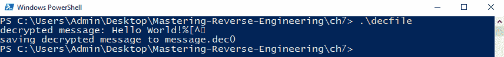

加密和解密程序的源代码可以在以下链接中找到：

加密：[`github.com/PacktPublishing/Mastering-Reverse-Engineering/blob/master/ch7/encfile.cpp`](https://github.com/PacktPublishing/Mastering-Reverse-Engineering/blob/master/ch7/encfile.cpp)。

解密：[`github.com/PacktPublishing/Mastering-Reverse-Engineering/blob/master/ch7/decfile.cpp`](https://github.com/PacktPublishing/Mastering-Reverse-Engineering/blob/master/ch7/decfile.cpp)。

# 服务器

在*第六章，Linux 平台上的逆向工程*中，我们学习了如何使用套接字 API 来控制客户端和服务器之间的网络通信。相同的代码也可以在 Windows 操作系统中实现。对于 Windows，使用套接字 API 之前，需要通过`WSAStartup`API 初始化套接字库。与 Linux 的函数相比，不再使用`write`，而是使用`send`来向客户端发送数据。同时，关于`close`，它在 Windows 中对应的是`closesocket`，用于释放套接字句柄。

这是一个图示，展示了服务器和客户端通常如何通过使用套接字 API 进行通信。请注意，下面图示中显示的函数是 Windows API 函数：

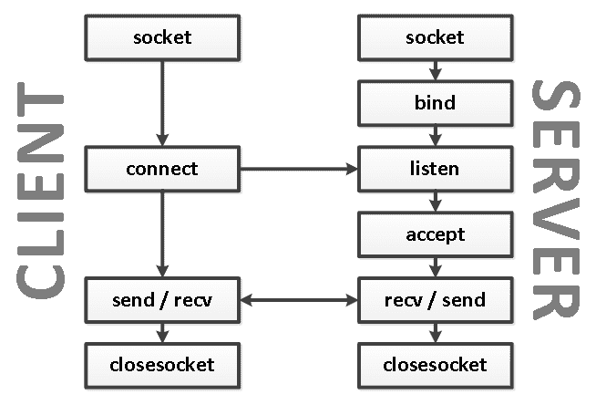

`socket` 函数用于初始化一个套接字连接。完成连接后，通过 `closesocket` 函数关闭通信。服务器要求我们将程序与一个网络端口 `bind` 绑定。`listen` 和 `accept` 函数用于等待客户端连接。`send` 和 `recv` 函数用于服务器和客户端之间的数据传输。`send` 用于发送数据，而 `recv` 用于接收数据。最后，`closesocket` 用于终止传输。以下代码显示了一个实际的服务器端程序 C 源代码，它接受连接并回复 `You have connected to the Genie. Nothing to see here`<q>.</q>

```

int main()
{
 int listenfd = 0, connfd = 0;
 struct sockaddr_in serv_addr;
 struct sockaddr_in ctl_addr;
 int addrlen;
 char sendBuff[1025];

 WSADATA WSAData;

 if (WSAStartup(MAKEWORD(2, 2), &WSAData) == 0)
 {
     listenfd = socket(AF_INET, SOCK_STREAM, 0);
     if (listenfd != INVALID_SOCKET)
     {
         memset(&serv_addr, '0', sizeof(serv_addr));
         memset(sendBuff, '0', sizeof(sendBuff));
         serv_addr.sin_family = AF_INET;
         serv_addr.sin_addr.s_addr = htonl(INADDR_ANY);
         serv_addr.sin_port = htons(9999);
         if (bind(listenfd, (struct sockaddr*)&serv_addr, sizeof(serv_addr)) == 0)
         {
             if (listen(listenfd, SOMAXCONN) == 0)
             {
                 printf("Genie is waiting for connections to port 9999.\n");
                 while (1)
                 {
                     addrlen = sizeof(ctl_addr);
                     connfd = accept(listenfd, (struct sockaddr*)&ctl_addr, &addrlen);
                     if (connfd != INVALID_SOCKET)
                     {
                         printf("%s has connected.\n", inet_ntoa(ctl_addr.sin_addr));

                         snprintf(sendBuff, sizeof(sendBuff), "You have connected to the Genie. Nothing to see here.\n\n");
                         send(connfd, sendBuff, strlen(sendBuff), 0);
                         closesocket(connfd);
                     }
                 }
             }
         }
     closesocket(listenfd);
     }
 WSACleanup();
 }
 return 0;
}
```

该程序的源代码可以在 [`github.com/PacktPublishing/Mastering-Reverse-Engineering/blob/master/ch7/server.cpp`](https://github.com/PacktPublishing/Mastering-Reverse-Engineering/blob/master/ch7/server.cpp) 上找到。

# 密码是什么？

在这一部分，我们将对 `passcode.exe` 程序进行逆向工程。作为练习，我们将通过使用静态和动态分析工具来收集我们需要的信息。我们将使用前几章介绍的一些 Windows 工具。不要仅限于我们在这里使用的工具，实际上有很多其他工具也能完成相同的任务。用于分析该程序的操作系统环境是一个 Windows 10、32 位、2 GB 内存、2 核处理器的虚拟机环境。

# 静态分析

除了文件名，你还需要知道的第二个信息是文件的哈希值。我们可以使用 Quickhash ([`quickhash-gui.org/`](https://quickhash-gui.org/)) 来帮助完成这个任务。在使用 Quickhash 打开 `passcode.exe` 文件后，我们可以获得各种算法的哈希计算。以下截图显示了 `passcode.exe` 文件的 `SHA256` 哈希值：

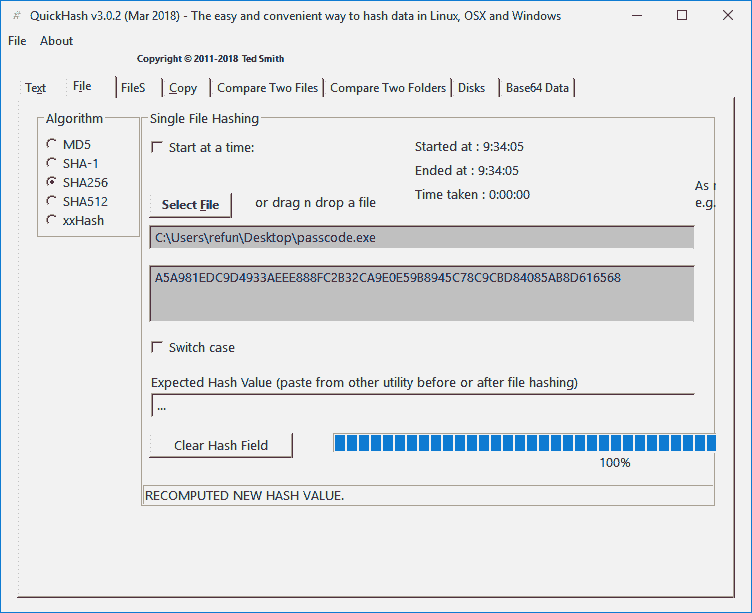

该文件的扩展名为 `.exe`。这使得我们首先想到使用用于分析 Windows 可执行文件的工具。但是，为了确保它确实是一个 Windows 可执行文件，我们可以使用 `TriD` 来获取文件类型。`TrID` ([`mark0.net/soft-trid-e.html`](http://mark0.net/soft-trid-e.html)) 是基于命令行的工具，应在命令提示符下运行。我们还需要从 [`mark0.net/download/triddefs.zip`](http://mark0.net/download/triddefs.zip) 下载并解压 `TrID` 的定义文件。在下面的截图中，我们使用了 `dir` 和 `trid`。通过使用 `dir` 获取目录列表，我们得到了文件的时间戳和文件大小。使用 `trid` 工具后，我们能够识别 `passcode.exe` 是什么类型的文件：

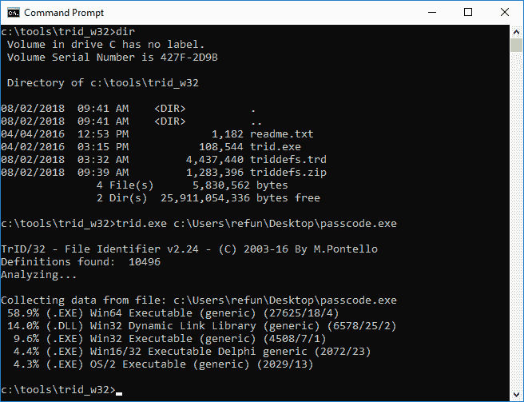

现在我们已经验证它是一个 Windows 可执行文件，使用 CFF Explorer 应该能给我们更多的文件结构细节。从 [`ntcore.com/`](https://ntcore.com/) 下载并安装 CFF Explorer。打开后，你会看到以下界面：

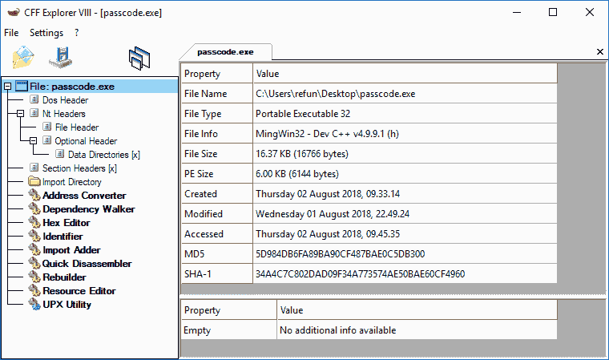

`TrID` 和 CFF Explorer 都将该文件识别为 Windows 可执行文件，但它们的识别结果不一致。这可能会令人困惑，因为 TrID 将该文件识别为 `Win64 可执行文件`，而 CFF Explorer 将其识别为 `可移植可执行文件 32`。这需要从 PE 头文件本身识别机器类型。PE 文件的头文件参考可以在 [`www.microsoft.com/whdc/system/platform/firmware/PECOFF.mspx`](http://www.microsoft.com/whdc/system/platform/firmware/PECOFF.mspx) 查看。

我们可以使用 CFF Explorer 的 `Hex Editor` 查看二进制文件。第一列显示文件偏移量，中间列显示二进制的十六进制表示，最右边一列显示可打印字符：

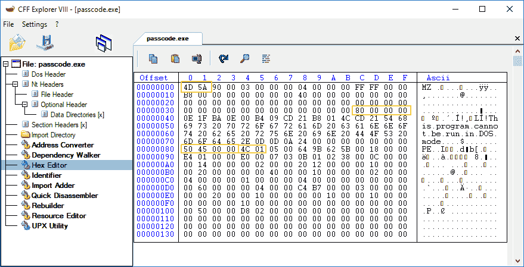

文件以 `MZ` 魔术头（即 `0x4d5a`）开始，表示这是一个 Microsoft 可执行文件。在文件偏移量 `0x3c` 处，`DWORD` 值（按小端格式读取）为 `0x00000080`。这就是 PE 头部所在的文件偏移位置。PE 头部以 `DWORD` 值 `0x00004550` 或 `PE` 开头，后面跟随两个空字节。接下来是一个 `WORD` 值，告诉你程序可以运行的机器类型。在本程序中，我们得到 `0x014c`，这相当于 `IMAGE_FILE_MACHINE_I386`，意味着它可以在 Intel 386（32 位微处理器）及更高版本的处理器上运行，也可以在其他兼容的处理器上运行。

此时，我们已经知道的信息如下：

```
Filename:  passcode.exe
Filesize:  16,766 bytes
MD5:  5D984DB6FA89BA90CF487BAE0C5DB300
SHA256:  A5A981EDC9D4933AEEE888FC2B32CA9E0E59B8945C78C9CBD84085AB8D616568
File Type: Windows PE 32-bit
Compiler: MingWin32 - Dev C++
```

为了更好地了解文件，我们将其在沙盒中运行。

# 快速运行

从虚拟机中打开 Windows 沙盒，然后将 `passcode.exe` 的副本拖放并运行：

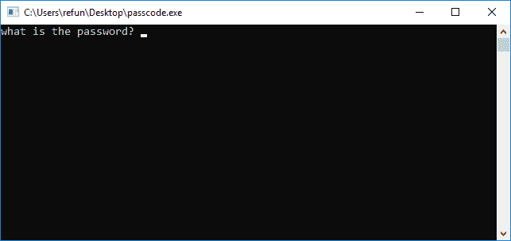

程序要求输入密码。猜测密码后，程序突然关闭。从这一事件中，我们获得的信息如下：

+   第一条信息是关于程序要求输入密码的。

+   第二条信息是程序打开了命令提示符。

这只是意味着程序应该在命令提示符下运行。

# 死亡列表

对于密码，我们可能能在文件本身的文本字符串中找到它。为了从文件中获取字符串列表，我们需要使用 SysInternal Suite 的 Strings 工具（[`docs.microsoft.com/en-us/sysinternals/downloads/strings`](https://docs.microsoft.com/en-us/sysinternals/downloads/strings)）。Strings 是一个基于控制台的工具，输出的字符串列表将打印到控制台上。

该程序的源代码可以在 [`github.com/PacktPublishing/Mastering-Reverse-Engineering/blob/master/ch7/passcode.c`](https://github.com/PacktPublishing/Mastering-Reverse-Engineering/blob/master/ch7/passcode.c) 找到。

我们应该通过运行 `strings.exe passcode.exe > strings.txt` 将输出重定向到文本文件：

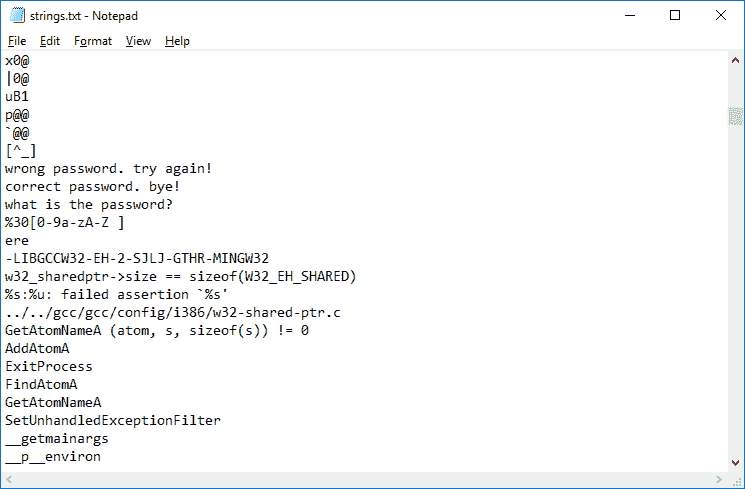

尽管如此，当我们尝试字符串时仍然得到错误密码。也就是说，字符串确实显示了一个正确消息很可能会显示`correct password. bye!`。列表还显示了程序使用的许多 API。但是，知道这是使用 MingWin-Dev C++编译的，大部分使用的 API 可能是程序的初始化的一部分。

使用 IDA Pro 32 位反编译器对文件进行反汇编，我们可以看到主函数的代码。您可以从[`github.com/PacktPublishing/Mastering-Reverse-Engineering/tree/master/tools/Disassembler%20Tools`](https://github.com/PacktPublishing/Mastering-Reverse-Engineering/tree/master/tools/Disassembler%20Tools)下载并安装 IDA Pro。由于我们在 Windows 32 位环境中工作，请安装 32 位的`idafree50.exe`文件。这些安装程序是从官方 IDA Pro 网站获取的，并托管在我们的 GitHub 存储库中以确保可用性。

这个文件是一个 PE 文件，或者可移植可执行文件。应该以可移植可执行文件的形式打开，以读取 PE 文件的可执行代码。如果使用 MS-DOS 可执行文件打开，结果代码将是 16 位 MS-DOS 存根：

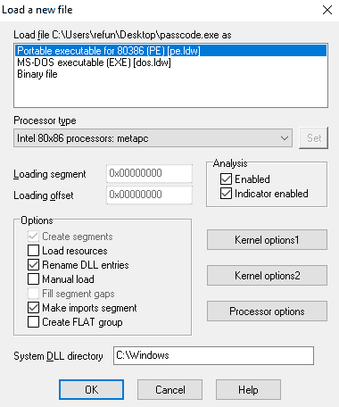

IDA Pro 能够识别主函数。它位于地址`0x004012B8`。向下滚动到图形概览，显示了块的分支情况，可能会让你了解程序代码在执行时的流程。要查看纯汇编代码，即没有图形表示，只需切换到文本视图模式：

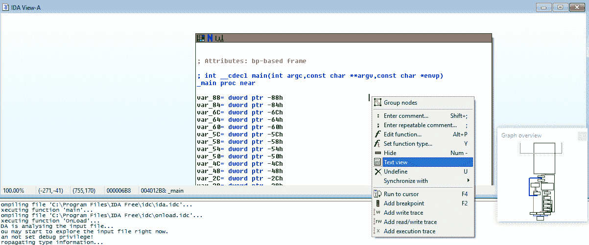

由于这是一个 C 编译代码，我们只需要关注`_main`函数的分析。我们将尝试从分析中生成伪代码。将收集的信息包括 API，因为它们在代码流程中使用，使跳转分支的条件，以及使用的变量。程序中可能会注入一些特定的编译器代码，我们可能需要识别并跳过：

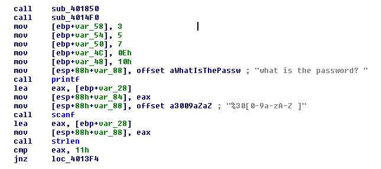

快速检查函数`sub_401850`和`sub_4014F0`，我们可以看到这里使用了`_atexit` API。`atexit` API 用于设置程序正常终止后将执行的代码。`atexit`和类似的 API 通常由高级编译器使用来运行清理代码。这些清理代码通常设计用于防止可能的内存泄漏，关闭已打开但未使用的句柄，释放已分配的内存，和/或为了优雅退出重新调整堆栈和堆：

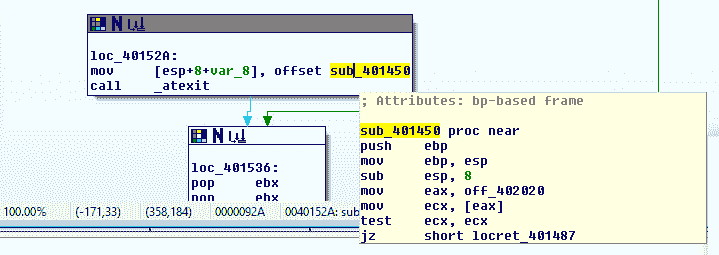

在`_atexit`中使用的参数指向`sub_401450`，包含清理代码。

接下来，我们将调用 `printf` 函数。在汇编语言中，调用 API 需要将其参数按照顺序放置在栈顶。我们通常使用 `push` 指令将数据存入栈中。这段代码正是做了同样的事情。如果你右击 `[esp+88h+var_88]`，会弹出一个下拉菜单，显示可能的变量结构列表。可以将指令行理解为 `mov dword ptr [esp], offset aWhatIsThePassw`：

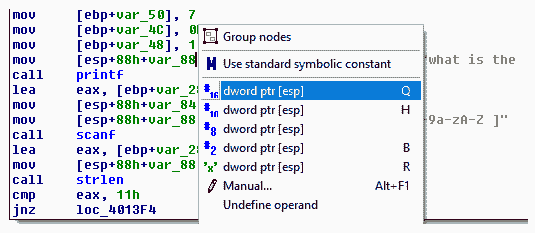

这与 `push offset aWhatIsThePassw` 做的事情相同。方括号用于定义一个数据容器。在这个例子中，`esp` 是容器的地址，容器中存储的是 "`what is the password?`" 的地址。使用 `push` 和 `mov` 之间有区别。在 `push` 指令中，栈指针 `esp` 会被递减。总体而言，`printf` 得到了它需要的参数，用来将信息显示到控制台。

下一个 API 是 `scanf`。`scanf` 需要两个参数：输入格式和存储输入的地址。第一个参数位于栈顶，应该是输入格式，后面是存储输入的地址。修改后的变量结构应该是这样的：

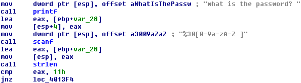

给定的格式是 `"%30[0-9a-zA-Z ]"`，这意味着 `scanf` 只会从输入的开头读取 30 个字符，并且只会接受方括号内的第一个字符集。接受的字符仅限于 "`0`" 到 "`9`"、"`a`" 到 "`z`"、"`A`" 到 "`Z`" 和空格字符。此类型的输入格式用于防止超过 30 个字符的输入。它还用于防止其余代码处理非字母数字字符，空格字符除外。

第二个参数，位于 `[esp+4]`，应该是存储输入的地址。追溯回来，`eax` 寄存器的值设置为 [`ebp+var_28`]。我们只需注意，`var_28` 存储的地址是输入的密码。

`strlen` API 紧接其后，且只需要一个参数。追溯 `eax` 寄存器的值，`var_28`，即输入的密码，它是 `strlen` 将要使用的字符串。字符串的最终长度将存储在 `eax` 寄存器中。字符串大小与 `11h` 或 `17` 进行比较。在 `cmp` 之后，通常会有一个条件跳转。使用了 `jnz` 指令。如果比较结果为*假*，则跟随红线。如果条件为*真*，则跟随绿线。蓝线则直接跳到下一个代码块，如下所示：

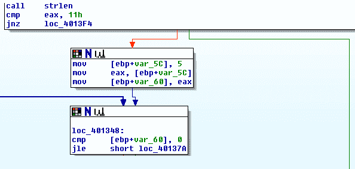

跟随红线表示字符串长度为 17。此时，我们的伪代码如下：

```
main()
{
    printf("what is the password? ");
    scanf("%30[0-9a-zA-Z ]", &password);
    password_size = strlen(password);
    if (password_size == 17)
    { ... }
    else
    { ... }
}
```

如果密码的长度不是 17，很可能会显示错误密码。 让我们首先跟随绿色路径：

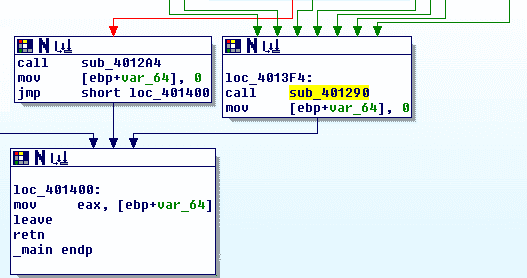

绿线进入 `loc_4013F4` 块，随后是结束 `_main` 函数的 `loc_401400` 块。 `loc_4013F4` 处的指令是对 `sub_401290` 的调用。 该函数包含显示错误密码消息的代码。 请注意，许多行指向 `loc_4013F4`：

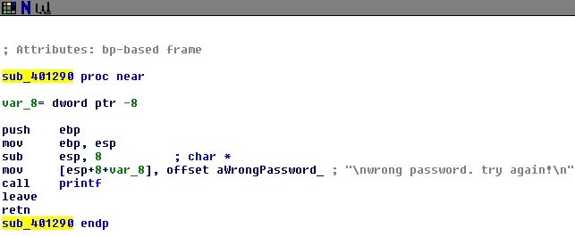

下面是使用错误密码功能构建伪代码的延续：

```
wrong_password()
{
    printf("wrong password. try again!\n");
}

main()
{
    printf("what is the password? ");
    scanf("%30[0-9a-zA-Z ]", &password);
    password_size = strlen(password);
    if (password_size == 17)
    { ... }
    else
    {
        wrong_password();
    }
}
```

在逆向工程中的一个好技巧是尽可能找到最短的退出路径。 然而，这需要实践和经验。 这使得更容易描绘代码的整体结构。

现在，让我们分析 17 个字符长度的代码的其余部分。 让我们跟踪分支指令，并根据条件向后工作：

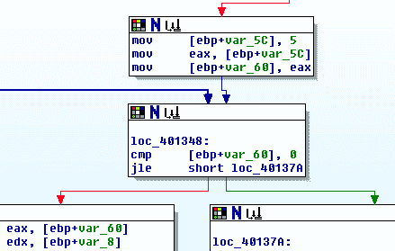

`jle` 的条件是对 `var_60` 和 0 的比较。 `var_60` 的值为 5，来自 `var_5c`。 这促使代码的方向沿着红线进行，如下所示：

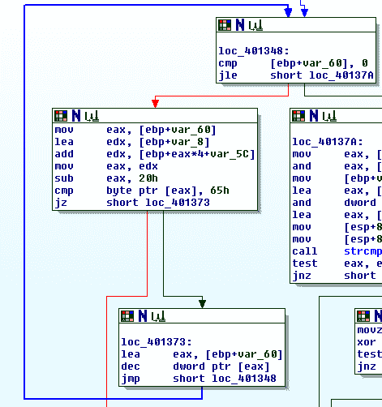

放大一点，我们正在查看的代码实际上是一个具有两个退出点的循环。 第一个退出点是 `var_60` 的值小于或等于 `0` 的条件。 第二个退出点是寄存器 `eax` 指向的字节不应等于 `65h` 的条件。 如果进一步检查循环中的变量，可以看到 `var_60` 的初始值为 `5`。 `var_60` 的值在 `loc_401373` 块中递减。 这意味着循环将迭代 5 次。

我们还可以在循环中看到 `var_8` 和 `var_5c`。 但是，自主代码的开始以来，`var_8` 从未被设置。 `var_5c` 也不是作为变量使用，而是作为计算地址的一部分。 IDA Pro 帮助识别了可能作为 `main` 函数堆栈帧一部分使用的变量，并将其基础设置为 `ebp` 寄存器中。 这次，我们可能需要通过仅在循环代码中选择给出的列表中的结构来取消对 `var_8` 和 `var_5c` 的变量识别。 这可以通过右键单击变量名称来完成：

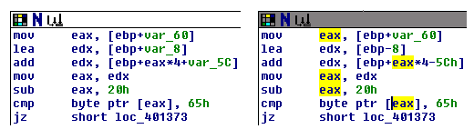

因此，计算 `eax` 中的值时，我们从 `lea` 指令行开始。存储到 `edx` 中的值是从 `ebp` 中减去 8 后得到的差值。这里的 `lea` 并不会获取 `ebp-8` 中存储的值，不同于使用 `mov` 指令时的行为。存储在 `ebp` 中的值是进入 `main` 函数后 `esp` 寄存器中的值。这使得 `ebp` 成为堆栈帧的基址。引用堆栈帧中的变量需要使用 `ebp`。记住，堆栈是通过从高地址向低地址递减来使用的。这就是为什么从 `ebp` 寄存器引用时需要相对减法的原因：

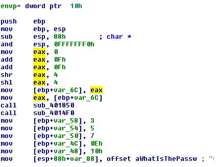

现在，在 `add` 指令行中，要存储到 `edx` 中的值将是 `edx` 和从计算地址中存储的值的总和。这个计算出的地址是 `eax*4-5Ch`。`eax` 是来自 `var_60` 的值，包含从 `5` 到 `0` 递减的值。但由于当 `var_60` 达到 `0` 时循环结束，这行中的 `eax` 只会有从 `5` 到 `1` 的值。计算所有五个地址时，应该得到以下输出：

```
[ebp+5*4-5ch] -> [ebp-48h] = 10h
[ebp+4*4-5ch] -> [ebp-4Ch] = 0eh
[ebp+3*4-5ch] -> [ebp-50h] = 7
[ebp+2*4-5ch] -> [ebp-54h] = 5
[ebp+1*4-5ch] -> [ebp-58h] = 3
```

也正因为如此，在调用第一个 `printf` 函数之前，这些堆栈帧地址中存储的值就已设置。在此时，给定 `eax` 从 `5` 到 `1` 的值，`edx` 应该具有以下结果值：

```
eax = 5;  edx = ebp-8+10h;  edx = ebp+8
eax = 4;  edx = ebp-8+0eh;  edx = ebp+6
eax = 3;  edx = ebp-8+7;    edx = ebp-1
eax = 2;  edx = ebp-8+5;    edx = ebp-3
eax = 1;  edx = ebp-8+3;    edx = ebp-5
```

`edx` 的结果值随后通过 `mov` 指令存储到 `eax` 中。然而，在这之后，`eax` 会被减去 `20h`：

```
from eax = 5;  eax = ebp+8-20h;  eax = ebp-18h
from eax = 4;  eax = ebp+6-20h;  eax = ebp-1ah
from eax = 3;  eax = ebp-1-20h;  eax = ebp-21h
from eax = 5;  eax = ebp-3-20h;  eax = ebp-23h
from eax = 5;  eax = ebp-5-20h;  eax = ebp-25h
```

接下来的两行代码是循环的第二个退出条件。`cmp` 指令将 `65h` 与 `eax` 指向的地址中存储的值进行比较。`65h` 的等效 ASCII 字符是 "e"。如果 `eax` 指向的地址中的值与 `65h` 不匹配，代码将退出循环。如果发生不匹配，跟随红色线条会调用 `sub_401290`，这恰好是错误密码函数。与字符 "`e`" 进行比较的地址必须是输入字符串的一部分。

如果我们将堆栈帧绘制成一个表格，它看起来可能是这样的：

|  | 0 | 1 | 2 | 3 | 4 | 5 | 6 | 7 | 8 | 9 | A | B | C | D | E | F |
| --- | --- | --- | --- | --- | --- | --- | --- | --- | --- | --- | --- | --- | --- | --- | --- | --- |
| -60h |  |  |  |  |  |  |  |  | 03 | 00 | 00 | 00 | 05 | 00 | 00 | 00 |
| -50h | 07 | 00 | 00 | 00 | 0e | 00 | 00 | 00 | 10 | 00 | 00 | 00 |  |  |  |  |
| -40h |  |  |  |  |  |  |  |  |  |  |  |  |  |  |  |  |
| -30h |  |  |  |  |  |  |  |  | X | X | X | e | X | e | X | e |
| -20h | X | X | X | X | X | X | e | X | e |  |  |  |  |  |  |  |
| -10h |  |  |  |  |  |  |  |  |  |  |  |  |  |  |  |  |
| ebp |  |  |  |  |  |  |  |  |  |  |  |  |  |  |  |  |

我们需要考虑 `scanf` 将输入的密码存储在 `ebp-var_28` 或 `ebp-28` 中。知道正确密码恰好有 17 个字符，我们用 X 标记了这些输入位置。我们还需要设置那些应该与 "`e`" 匹配的地址以继续。记住，字符串从偏移量 `0` 开始，而不是 `1`。

现在我们对循环很熟悉了，那么我们的伪代码到目前为止应该是这个样子：

```
wrong_password()
{
    printf("wrong password. try again!\n");
}

main()
{
    e_locations[] = [3, 5, 7, 0eh, 10h];
    printf("what is the password? ");
    scanf("%30[0-9a-zA-Z ]", &password);
    password_size = strlen(password);
    if (password_size == 17)
    {

        for (i = 5; i >= 0; i--)
            if (password[e_locations[i]] != 'e')
            {
                wrong_password();
                goto goodbye;
            }
        ...
    }
    else
    {
        wrong_password();
    }
goodbye:
}
```

在循环之后，我们会看到另一个使用`strcmp`的块，这次我们校正了一些变量结构，以更好地了解我们的栈帧可能是什么样子：

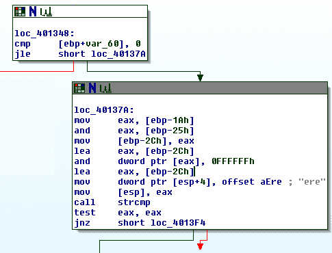

前两条指令从`ebp-1Ah`和`ebp-25h`读取`DWORD`值，并用于计算二进制 AND。查看我们的栈帧，这两个位置都在输入密码字符串区域内。最终再次使用二进制 AND 处理结果值和`0FFFFFFh`。最终值存储在`ebp-2Ch`。然后使用`strcmp`比较存储在`ebp-2Ch`处的值与字符串"`ere`"。如果字符串比较不匹配，绿线会进入错误密码代码块。

使用`AND`指令和`0FFFFFFh`意味着只限于 3 个字符。对来自密码字符串的两个`DWORD`使用`AND`将意味着两者应该相等，至少在 3 个字符上。因此，`ebp-1Ah`和`ebp-25h`应包含"`ere`"：

|  | 0 | 1 | 2 | 3 | 4 | 5 | 6 | 7 | 8 | 9 | A | B | C | D | E | F |
| --- | --- | --- | --- | --- | --- | --- | --- | --- | --- | --- | --- | --- | --- | --- | --- | --- |
| -60h |  |  |  |  |  |  |  |  | 03 | 00 | 00 | 00 | 05 | 00 | 00 | 00 |
| -50h | 07 | 00 | 00 | 00 | 0e | 00 | 00 | 00 | 10 | 00 | 00 | 00 |  |  |  |  |
| -40h |  |  |  |  |  |  |  |  |  |  |  |  |  |  |  |  |
| -30h |  |  |  |  | e | r | e |  | X | X | X | e | r | e | X | e |
| -20h | X | X | X | X | X | X | e | r | e |  |  |  |  |  |  |  |
| -10h |  |  |  |  |  |  |  |  |  |  |  |  |  |  |  |  |
| ebp |  |  |  |  |  |  |  |  |  |  |  |  |  |  |  |  |

让我们继续下一个代码集，按照红线操作：

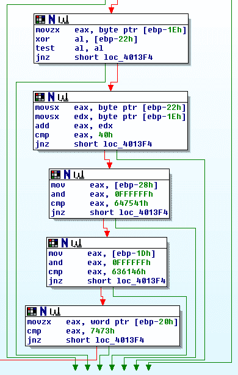

所有的绿线都指向错误密码代码块。因此，为了继续前进，我们必须遵循与红线相关的条件。在前面截图的第一个代码块中，使用`XOR`指令验证`ebp-1Eh`和`ebp-22h`处的字符是否相等。第二个块将来自相同偏移量`ebp-1Eh`和`ebp-22h`的字符值相加。总和应为`40h`。在这种情况下，字符应具有 ASCII 值`20h`，即空格字符。

第三块从`ebp-28h`读取`DWORD`值，然后使用 AND 指令仅取前 3 个字符。结果与`647541h`进行比较。如果转换为 ASCII 字符，读作"`duA`"。

第四个块执行与第三个相同的方法，但从`ebp-1Dh`中取出`DWORD`，并将其与`636146h`或"`caF`"进行比较。

最后一个块从`ebp-20h`读取一个 WORD 值，并将其与`7473h`或"`ts`"进行比较。

把这些写到我们的栈帧表中应该用小端法完成：

|  | 0 | 1 | 2 | 3 | 4 | 5 | 6 | 7 | 8 | 9 | A | B | C | D | E | F |
| --- | --- | --- | --- | --- | --- | --- | --- | --- | --- | --- | --- | --- | --- | --- | --- | --- |
| -60h |  |  |  |  |  |  |  |  | 03 | 00 | 00 | 00 | 05 | 00 | 00 | 00 |
| -50h | 07 | 00 | 00 | 00 | 0e | 00 | 00 | 00 | 10 | 00 | 00 | 00 |  |  |  |  |
| -40h |  |  |  |  |  |  |  |  |  |  |  |  |  |  |  |  |
| -30h |  |  |  |  | e | r | e |  | A | u | d | e | r | e |  | e |
| -20h | s | t |  | F | a | c | e | r | e |  |  |  |  |  |  |  |
| -10h |  |  |  |  |  |  |  |  |  |  |  |  |  |  |  |  |
| ebp |  |  |  |  |  |  |  |  |  |  |  |  |  |  |  |  |

密码应该是 "`Audere est Facere`"。如果成功，它应该会运行正确的密码函数：

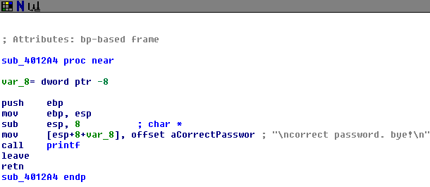

为了完成我们的伪代码，我们需要计算从 `ebp-28h` 开始的字符串相对偏移量。`ebp-28h` 是密码字符串的偏移量，值为 0，而字符串中的最后一个偏移量，即偏移量 16，应位于 `ebp-18h`：

```
wrong_password()
{
    printf("\nwrong password. try again!\n");
}

correct_password()
{
    printf("\ncorrect password. bye!\n");
}

main()
{
    e_locations[] = [3, 5, 7, 0eh, 10h];
    printf("what is the password? ");
    scanf("%30[0-9a-zA-Z ]", &password);
    password_size = strlen(password);
    if (password_size == 17)
    {
        for (i = 5; i >= 0; i--)
            if (password[e_locations[i]] != 'e')
            {
                wrong_password();
                goto goodbye;
            }
        if ( (password[6] ^ password[10]) == 0 )   // ^ means XOR
            if ( (password[6] + password[10]) == 0x40 )
                if ( ( *(password+0) & 0x0FFFFFF ) == 'duA' )
                    if ( ( *(password+11) & 0x0FFFFFF ) == 'caF' )
                        if ( ( *(password+8) & 0x0FFFF ) == 'ts' )
                        {
                            correct_password();
                            goto goodbye
                        }
    }
    wrong_password();
goodbye:
}
```

# 使用调试器进行动态分析

没有什么比验证我们在静态分析中假设的内容更好的了。只需运行程序并输入密码，任务就完成了：

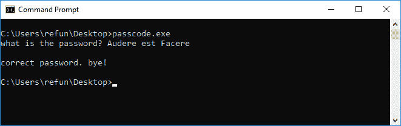

死列表与调试程序同样重要。两者可以同时进行。调试有助于加速死列表过程，因为它也能同时验证。对于本次练习，我们将通过使用 `x32dbg` 重新分析 `passcode.exe`，下载地址为 [`x64dbg.com`](https://x64dbg.com)。

在 `x32dbg` 中打开 `passcode.exe` 后，注册 EIP 时会位于一个较高的内存区域。这绝对不在 `passcode.exe` 映像的任何部分：

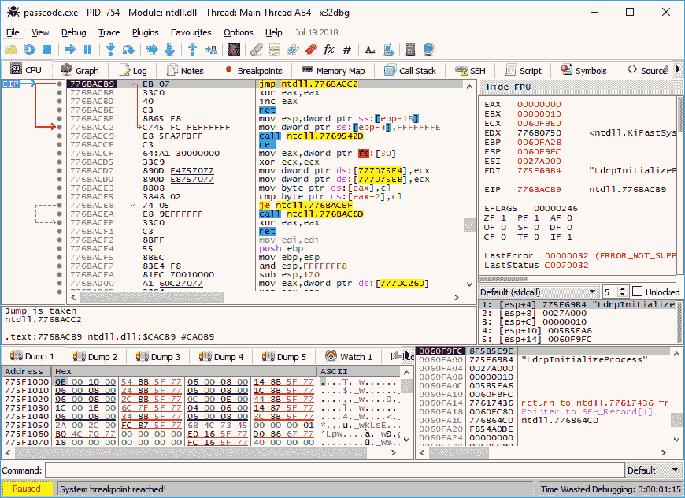

为了绕过这个问题，点击“选项->首选项”，然后在“事件”标签下，取消选中 *系统断点*：

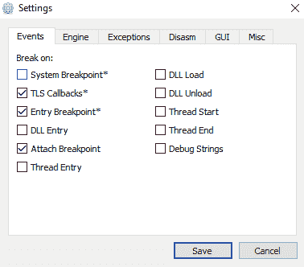

点击保存按钮，然后使用“调试->重启”或按 `Ctrl + F2`。这将重启程序，但现在 EIP 应该会停在 PE 文件的入口点地址：

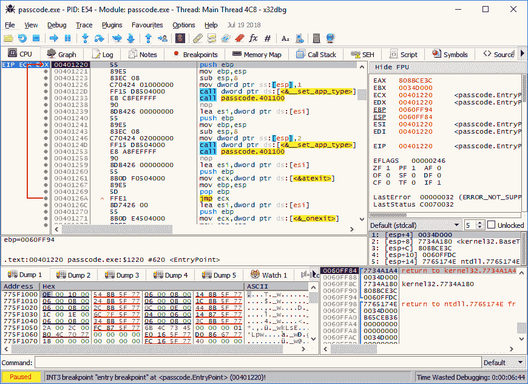

由于我们也知道 `main` 函数的地址，我们需要在该地址设置一个断点并让程序运行（`*F9*`）。为此，在命令框中输入以下内容：

```
bp 004012b8
```

运行后，EIP 应该停在 `main` 函数的地址。我们能看到与死列表时相同的一段代码：

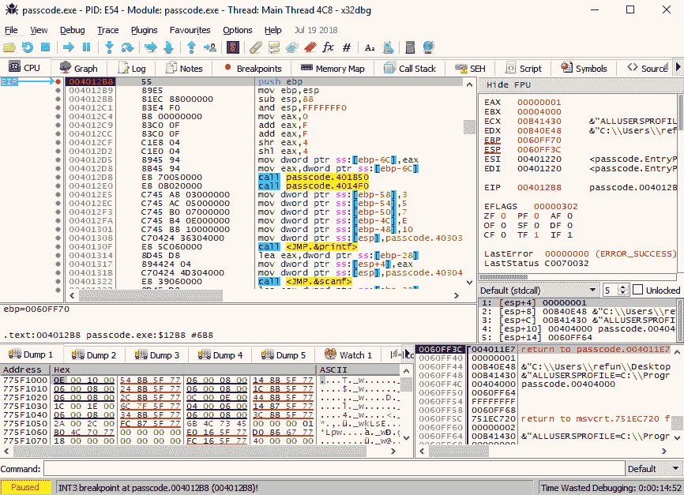

*F7* 和 *F8* 是进入单步执行和单步跳过的快捷键。点击调试菜单，你应该可以看到分配给调试命令的快捷键。继续尝试这些命令；如果弄乱了，随时可以重启。

使用调试器的好处是你应该能轻松看到堆栈帧。有五个内存转储窗口组成堆栈帧。我们来使用转储 2 来展示堆栈帧。执行两步指令，让 `ebp` 设置为堆栈帧的基址。在左侧窗格的寄存器列表中，右击寄存器 EBP，然后选择“跟随转储->转储 2”。这将把转储 2 显示出来。由于堆栈是从较高地址向下移动的，你需要将滚动条向上滚动，显示堆栈帧中的初始数据：

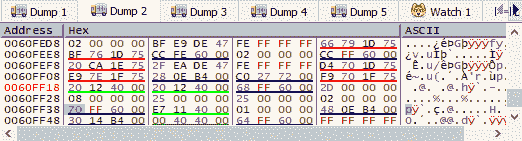

这是输入 `scanf` 后相同的栈帧。另外，在 `scanf` 期间，您需要切换到命令提示符窗口以输入密码，然后再切换回来。以下截图中还包括了栈窗口，位于右侧窗格：

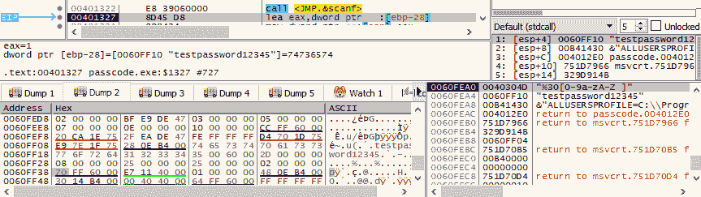

即使在调试器中，我们也可以随时更改输入字符串的内容，从而强制程序继续执行，直到正确的密码条件出现。我们所需要做的就是右键点击 Dump 窗口中的字节，并选择修改值*。* 例如，在比较 `65h` ("`e`") 和寄存器 `eax` 指向地址中存储的值的循环中，在执行 `cmp` 指令之前，我们可以更改该地址处的值。

在下面的截图中，地址 `0060FF20h`（EAX）处存储的值正在从 `35h` 修改为 `65h`：

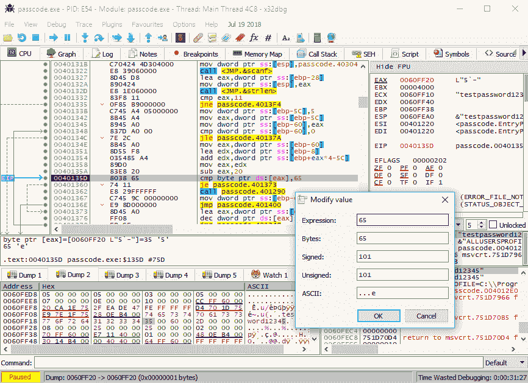

也可以通过右键点击字节进行二进制编辑，然后选择 *Binary*->*Edit* 来进行相同的修改。

如果我们输入了正确的密码，这里应该是我们最终的结果：

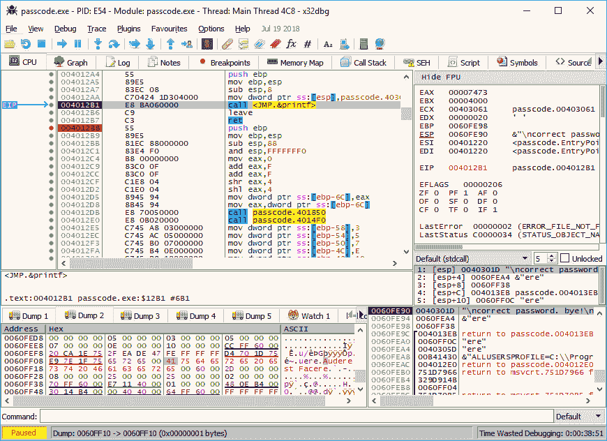

# 反编译器

如果伪代码能够自动提供给我们，那可能会更容易。确实存在一些工具，可能能帮助我们实现这一点。我们来尝试反编译 `passcode.exe`（[`github.com/PacktPublishing/Mastering-Reverse-Engineering/blob/master/ch7/passcode.exe`](https://github.com/PacktPublishing/Mastering-Reverse-Engineering/blob/master/ch7/passcode.exe)）使用 Snowman 的独立版本（[`derevenets.com/`](https://derevenets.com/)）。打开文件后，点击 View->Inspector。这将显示一个包含程序解析函数的框。寻找函数定义 `_main`，选择它以显示与汇编语言等效的伪代码。此时，左侧窗格会突出显示汇编语言行，中央窗格则显示伪代码：

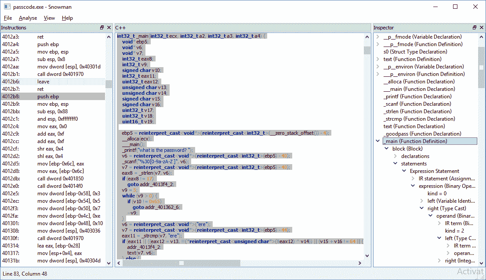

截至撰写本书时，输出的 C 源代码可能有所帮助，但并非所有代码都正确反编译。例如，比较 "`e`" 的循环未能正确反编译。输出显示为一个 `while` 循环，但我们预期 `v10` 变量的值应该是从密码字符串中计算出的偏移量读取的。然而，大部分代码应该能够在某种程度上帮助我们理解程序的工作方式。该反编译器引擎是开源的（[`www.capstone-engine.org/`](https://www.capstone-engine.org/)），因此不应期待过多支持，因为它并非时刻可用。

好消息是，已经有更强大的反编译工具，例如 HexRays。大多数机构以及一些进行逆向工程的独立分析师和研究人员愿意为这些反编译工具付费。对大多数逆向工程师来说，HexRays 性价比非常高。

这是`passcode.exe`的 HexRays 反编译版本：

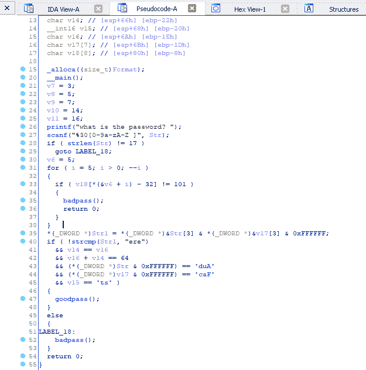

反编译工具在不断发展，因为这些工具可以加快分析速度。它们并不能完美地反编译，但应该接近源代码。

# 总结

在本章中，我们介绍了逆向工程，首先通过学习 API 在功能程序中的使用来开始。接着，我们使用静态和动态分析工具对程序进行了反向分析。

总体来说，Windows 平台上有很多可用的逆向工具。这些工具也包含了大量的关于如何在特定逆向场景中使用它们的信息和研究。逆向工程主要是通过获取来自互联网的资源，以及你已经掌握的知识，我们已经做到了这一点。

# 进一步阅读

+   [`visualstudio.microsoft.com`](https://visualstudio.microsoft.com): 这是 Visual Studio 的下载站点

+   [`docs.microsoft.com/en-us/visualstudio/productinfo/vs2017-system-requirements-vs:`](https://docs.microsoft.com/en-us/visualstudio/productinfo/vs2017-system-requirements-vs) 该网站展示了安装 Visual Studio 的推荐系统要求

+   [`sourceforge.net/projects/orwelldevcpp/`](https://sourceforge.net/projects/orwelldevcpp/): 该网站包含了 Dev C++的二进制下载文件

+   [`developer.microsoft.com/en-us/microsoft-edge/tools/vms/`](https://developer.microsoft.com/en-us/microsoft-edge/tools/vms/): 可以在这里下载预装的 Microsoft Windows 的虚拟机版本

+   [`mark0.net/soft-trid-e.html:`](http://mark0.net/soft-trid-e.html) TrID 工具及其签名数据库文件的下载站点

+   [`www.microsoft.com/whdc/system/platform/firmware/PECOFF.mspx:`](http://www.microsoft.com/whdc/system/platform/firmware/PECOFF.mspx) Microsoft Portable E 的文档
