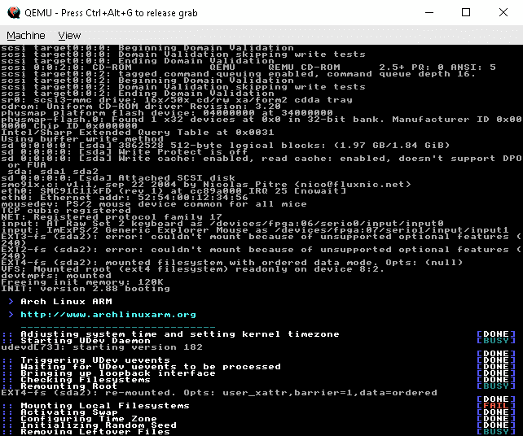
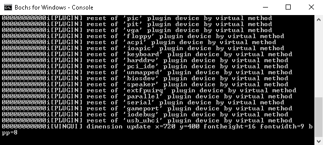

# 第八章：沙盒 - 作为逆向工程组成部分的虚拟化

在之前的章节中，我们使用了虚拟化软件，特别是 VirtualBox 或 VMware，来设置 Linux 和 Windows 环境进行分析。虚拟化工作得很好，因为这些虚拟化软件仅支持 x86 架构。虚拟化是逆向工程中非常有用的组件。事实上，大多数软件都是在 x86 架构下构建的。虚拟化通过虚拟机监控器使用主机计算机的 CPU 资源。

不幸的是，还有其他不支持虚拟化的 CPU 架构。VirtualBox 和 VMware 不支持这些架构。如果我们被给定了一个非 x86 可执行文件来处理，而我们所有的设备都只安装了 x86 操作系统，怎么办？嗯，这并不会阻止我们进行逆向工程。

为了解决这个问题，我们将使用模拟器。模拟器早在虚拟机监控器引入之前就已经存在。模拟器本质上是模拟一个 CPU 机器。把它当作一台新机器，运行在非 x86 架构上的操作系统可以被部署。然后，我们就可以运行原生的可执行文件。

在本章中，我们将学习如何使用 QEMU 部署非 x86 操作系统。我们还将学习如何使用 Bochs 模拟 x86 计算机的启动过程。

# 模拟

模拟的魅力在于它可以欺骗操作系统，让操作系统认为它在某种 CPU 架构上运行。缺点是性能明显较慢，因为几乎每一条指令都需要解释执行。简要说明 CPU，有两种 CPU 架构设计：**复杂指令集计算**（**CISC**）和**简化指令集计算**（**RISC**）。在汇编编程中，CISC 只需要少量指令。例如，一个单一的算术指令，如 MUL，会在其内部执行更低级的指令。而在 RISC 中，低级程序需要仔细优化。实际上，CISC 的优点在于需要较少的内存空间，但每条指令的执行时间较长。另一方面，RISC 由于以简化的方式执行指令，因此具有更好的性能。然而，如果代码没有得到适当的优化，针对 RISC 构建的程序可能无法达到预期的执行速度，且可能会占用较多空间。高级编译器应该能够优化 RISC 的低级代码。

这里有一个简短的 CPU 架构列表，按照 CISC 和 RISC 分类：

+   CISC:

    +   摩托罗拉 68000

    +   x86

    +   z/Architecture

+   RISC:

    +   ARM

    +   ETRAX CRIS

    +   DEC Alpha

    +   LatticeMico32

    +   MIPS

    +   MicroBlaze

    +   Nios II

    +   OpenRISC

    +   PowerPC

    +   SPARC

    +   SuperH

    +   惠普 PA-RISC

    +   英飞凌 TriCore

    +   UNICORE

    +   Xtensa

在 CISC 和 RISC 架构中，x86 和 ARM 都非常流行。x86 由 Intel 和 AMD 的计算机使用，目的是减少程序使用的指令数。新的设备，如智能手机和其他移动设备，采用 ARM 架构，因为它具有低功耗和高性能的优势。

本章讨论的目的是在 x86 机器上模拟 ARM 架构。我们选择 ARM 架构，因为它目前是手持设备中最常用的处理器。

# 在 x86 主机上模拟 Windows 和 Linux

我们解释了在虚拟机上安装操作系统时，它遵循主机机器的架构。例如，Windows x86 版本只能安装在安装在 x86 机器上的虚拟机上。

许多 Linux 操作系统，包括 Arch Linux、Debian、Fedora 和 Ubuntu，都支持在 ARM 处理器上运行。另一方面，Windows RT 和 Windows Mobile 是为使用 ARM CPU 的设备构建的。

由于我们在使用 x86 处理器的 PC 上工作，分析一个非 x86 架构的可执行文件仍然遵循相同的静态和动态分析逆向工程概念。唯一的不同是，我们需要为可执行文件运行设置环境，并学习可以在这个模拟环境中使用的工具。

# 模拟器

我们将介绍两种最流行的模拟器：QEMU（快速模拟器）和 Bochs。

QEMU 因其支持多种架构（包括 x86 和 ARM）而被认为是最广泛使用的模拟器。它还可以安装在 Windows、Linux 和 macOS 上。QEMU 通过命令行使用，但也有可用的 GUI 工具，如 virt-manager，可以帮助设置和管理来宾操作系统镜像。然而，virt-manager 仅适用于 Linux 主机。

Bochs 是另一种模拟器，但仅支持 x86 架构。值得一提的是，这个模拟器用于调试**内存引导记录**（**MBR**）代码。

# 在不熟悉的环境中进行分析

在这里，逆向工程概念是相同的。然而，工具的可用性是有限的。静态分析仍然可以在 x86 环境中进行，但当我们需要执行文件时，它将需要沙箱模拟。

最好在模拟环境中本地调试本地可执行文件。但如果本地调试条件有限，另一种选择是进行远程调试。对于 Windows，最常用的远程调试工具是 Windbg 和 IDA Pro。对于 Linux，我们通常使用 GDB。

分析 ARM 编译的可执行文件与分析 x86 可执行文件的过程差别不大。我们遵循与 x86 相同的步骤：

1.  学习 ARM 低级语言

1.  使用反汇编工具进行死机列表分析

1.  在操作系统环境中调试程序

学习 ARM 低级语言的方式与我们学习 x86 指令的方式相同。我们只需要理解内存地址空间、通用寄存器、特殊寄存器、栈和语言语法。这还包括如何调用 API 函数。

可以使用 IDA Pro 等工具，以及其他 ARM 反汇编工具，来显示本地 ARM 可执行文件的 ARM 反汇编代码。

# QEMU 中的 Linux ARM 客户机

Linux ARM 可以安装在 QEMU 的 ARM CPU 客户机中，该客户机运行在 Windows 系统的 x86 CPU 上。那么，让我们直接开始部署 Arch Linux ARM 吧。由于有很多可供下载的资源，运行 Arch Linux 实例作为 QEMU 客户机并不难。为了演示，我们将使用一个预先安装的 Arch Linux 镜像并在 QEMU 中运行它。准备下载以下文件：

+   QEMU: [`qemu.weilnetz.de/`](https://qemu.weilnetz.de/)

+   Arch Linux 镜像: [`downloads.raspberrypi.org/arch/images/archlinuxarm-29-04-2012/archlinuxarm-29-04-2012.img.zip`](http://downloads.raspberrypi.org/arch/images/archlinuxarm-29-04-2012/archlinuxarm-29-04-2012.img.zip)

+   系统内核: [`github.com/okertanov/pinguin/blob/master/bin/kernel/zImage-devtmpfs`](https://github.com/okertanov/pinguin/blob/master/bin/kernel/zImage-devtmpfs)

在本书中，我们将在 Windows 主机上安装 QEMU。在安装过程中，**注意 QEMU 的安装位置**。这一点尤其重要，因为 QEMU 的路径将在后续使用。

将 `archlinuxarm-29-04-2012.img.zip` 的镜像文件解压到一个新目录中，并将 `zImage-devtmpfs` 复制到同一目录下。

打开镜像和内核文件所在目录的命令行。然后，执行以下命令：

```
"c:\Program Files\qemu\qemu-system-arm.exe" -M versatilepb -cpu arm1136-r2 -hda archlinuxarm-29-04-2012.img -kernel zImage-devtmpfs -m 192 -append "root=/dev/sda2" -vga std -net nic -net user
```

在这里，将 `C:\Program Files\qemu` 更改为 QEMU 安装的路径。这应该会启动 QEMU 并运行 Arch Linux，如下所示：



现在，使用以下凭据登录：

```
alarmpi login: root
Password: root
```

你可以像使用常规的 Linux 控制台一样进行操作。Arch Linux 是一款由 Raspberry Pi 爱好者安装的流行操作系统。

# 使用 Bochs 进行 MBR 调试

当我们开启计算机时，首先执行的代码来自 BIOS（基本输入输出系统），它是嵌入在 CPU 中的程序。它执行一个开机自检（POST），以确保连接的硬件正常工作。BIOS 将主引导记录（MBR）加载到内存中，然后将代码执行传递下去。主引导记录（MBR）是从指定启动磁盘的第一个磁盘扇区读取的。MBR 包含引导加载程序，负责加载操作系统。

例如，如果我们想要调试给定的 MBR 镜像，我们可以使用一个名为 Bochs 的模拟器来进行调试。Bochs 可以从 [`bochs.sourceforge.net/`](http://bochs.sourceforge.net/) 下载。

为了测试这个，我们提供了一个可以从 [`github.com/PacktPublishing/Mastering-Reverse-Engineering/blob/master/ch8/mbrdemo.zip`](https://github.com/PacktPublishing/Mastering-Reverse-Engineering/blob/master/ch8/mbrdemo.zip) 下载的磁盘镜像。这个 ZIP 压缩包解压后约为 10MB，文件中包含 `mre.bin` 磁盘镜像和将传递给 Bochs 的 `bochsrc` 配置文件。

如果我们使用 IDA Pro 打开 `mre.bin`，应该能够静态分析 MBR 代码。MBR 几乎总是从 `0x7c00` 地址开始。它是一个 16 位代码，使用硬件中断来控制计算机。

在 IDA Pro 中加载文件时，请确保将加载偏移量更改为`0x7c00`，如下面的截图所示：


当询问反汇编模式时，选择 16 位模式。由于一切仍然是未定义的，我们需要将数据转换为代码。选择第一个字节代码，右键单击以打开上下文菜单，然后选择 Code，如下所示：


当转换为反汇编代码时，我们可以看到 IDA Pro 也能识别中断函数及其使用方式。以下截图展示了 16 位的反汇编代码，以及使用中断 `13h` 从磁盘扇区读取数据：


要使用 Bochs 调试 MBR，我们必须确保 `bochsrc` 文件中包含以下行：

```
display_library: win32, options="gui_debug"
```

这一行启用了 Bochs 图形界面调试器的使用。

如果我们有不同的磁盘镜像，可以在 `at0-master` 行中更改磁盘镜像文件的文件名。在这个演示中，磁盘镜像的文件名是 `mre.bin`：

```
ata0-master: type=disk, path="mre.bin", mode=flat
```

要模拟该磁盘镜像，执行以下命令：

```
set $BXSHARE=C:\Program Files (x86)\Bochs-2.6.8
"C:\Program Files (x86)\Bochs-2.6.8\bochsdbg.exe" -q -f bochsrc
```

你可能需要将 `C:\Program files (x86)\Bochs-2.6.8` 更改为你安装 Bochs 的路径。请注意，对于 `$BXSHARE` 环境变量，没有引号。

这里 Bochs 是在 Windows 环境下安装的。如果在 Linux 环境下工作，可以更改路径。

一旦运行，控制台将会显示日志输出，如下所示：



这将打开调试控制台，界面应如下面的截图所示：


另一个显示输出的窗口也应该出现：


MBR 代码从 `0x7c00` 地址开始。我们需要在 `0x7c00` 设置一个断点。Bochs 的图形界面有一个命令行，我们可以在这里设置指定地址的断点。它位于窗口的底部。请参阅下面截图中高亮的区域：


要在 `0x7c00` 设置断点，请输入 `lb 0x7c00`。要查看命令列表，请输入 `help`。常用的命令如下：

```
c             Continue/Run
Ctrl-C        Break current execution
s [count]     Step.  count is the number of instructions to step
lb address    Set breakpoint at address
bpe n         Enable breakpoint where n is the breakpoint number
bpd n         Disable breakpoint where n is the breakpoint number
del n         Delete breakpoint where n is the breakpoint number
info break    To list the breakpoints and its respective numbers 
```

GUI 界面还将键盘按键与命令进行了映射。选择命令菜单查看这些按键。

按下*F5*继续代码执行，直到它到达`0x7c00`处的 MBR 代码。我们现在应该能看到与在 IDA Pro 中看到的相同的反汇编代码。然后我们可以开始按*F11*逐步调试每一行指令：


在某个时刻，代码将进入无限循环状态。如果我们查看输出窗口，最终结果应该会显示相同的消息，如以下截图所示：


# 总结

在本章中，我们了解到，即使文件不是 Windows 或 Linux x86 本地可执行文件，我们仍然可以分析非 x86 可执行文件。仅通过静态分析，我们可以分析一个文件，而无需进行动态分析，尽管我们仍然需要参考资料来理解非 x86 架构的低级语言，这些架构被分类为 RISC 或 CISC。正如我们学习 x86 汇编语言一样，像 ARM 汇编语言这样的语言也可以通过相同的概念来学习。

然而，通过实际代码执行，使用动态分析仍然可以证明分析的有效性。为此，我们需要设置一个可以本地运行可执行文件的环境。我们介绍了一种名为 QEMU 的仿真工具，它可以为我们完成这项工作。它支持多种架构，包括 ARM。今天，使用 ARM 架构的最流行操作系统之一是 Arch Linux。这个操作系统通常由树莓派爱好者部署。

我们还学习了如何调试从磁盘镜像中提取的 MBR 代码。通过使用 Bochs，一个能够模拟 x86 系统启动顺序的工具，我们能够演示如何加载和调试使用硬件中断的 16 位代码。此外，一些勒索软件采用了可以注入或替换 MBR 为恶意代码的功能。通过我们在本章学到的内容，没有什么可以阻止我们逆向这些代码片段。

# 进一步阅读

+   KVM 和 CPU 功能启用 - [`wiki.qemu.org/images/c/c8/Cpu-models-and-libvirt-devconf-2014.pdf`](https://wiki.qemu.org/images/c/c8/Cpu-models-and-libvirt-devconf-2014.pdf)

+   在 QEMU 中安装 Windows ARM 的方法 - [`withinrafael.com/2018/02/11/boot-arm64-builds-of-windows-10-in-qemu/`](https://withinrafael.com/2018/02/11/boot-arm64-builds-of-windows-10-in-qemu/)

+   如何在 Windows PC 上使用 Bochs 仿真器调试系统代码 - [`thestarman.pcministry.com/asm/bochs/bochsdbg.html`](https://thestarman.pcministry.com/asm/bochs/bochsdbg.html)
