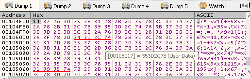

# 第九章：二进制混淆技术

二进制混淆是一种使程序代码难以理解或逆向的技术。它也用于隐藏数据，以防止数据轻易被查看。它可以被归类为一种逆向防护技术，通过增加逆向处理时间来提高难度。混淆还可以使用加密和解密算法，以及其硬编码或代码生成的密码密钥。

本章将讨论数据和代码如何被混淆。我们将展示如何在示例中应用混淆，包括简单的 XOR、简单的算术运算、在堆栈中构建数据，以及关于多态性和变形代码的讨论。

在恶意软件的世界里，二进制混淆是病毒常用的一种技术，旨在击败基于签名的防病毒软件。当病毒感染文件时，它会通过多态性或变形来混淆其代码。

本章将实现以下学习目标：

+   确定正在堆栈上组装的数据

+   确定数据在使用前是否经过 XOR 或解混淆

+   修改文本或其他段中的数据，并在堆上组装

# 堆栈上的数据组装

堆栈是一个内存空间，可以在其中存储任何数据。可以使用堆栈指针寄存器来访问堆栈（对于 32 位地址空间，使用 ESP 寄存器）。让我们考虑以下代码片段的示例：

```
push 0
push 21646c72h
push 6f57206fh
push 6c6c6548h
mov eax, esp
push 74h
push 6B636150h
mov edx, esp
push 0
push eax
push edx
push 0
mov eax, <user32.MessageBoxA>
call eax
```

这最终会显示以下消息框：


在没有引用可见文本字符串的情况下，为什么会发生这种情况？在调用`MessageBoxA`函数之前，堆栈看起来是这样的：


这些 push 指令将以 null 终止的消息文本组装到堆栈中。

```
push 0
push 21646c72h
push 6f57206fh
push 6c6c6548h
```

另一字符串是通过这些 push 指令组装的：

```
push 74h
push 6B636150h
```

实际上，堆栈转储将如下所示。


每次字符串组装后，寄存器 ESP 的值会存储到 EAX 中，然后是 EDX。也就是说，EAX 指向第一个字符串的地址，EDX 指向第二个组装字符串的地址。

`MessageBoxA`接受四个参数。第二个参数是消息文本，第三个参数是标题文本。从上面的堆栈转储中，字符串位于地址`0x22FE50`和`0x22FE54`。

```
push 0
push eax
push edx
push 0
mov eax, <user32.MessageBoxA>
```

`MessageBoxA`已经具备了所需的所有参数。尽管字符串是在堆栈上组装的，但只要数据可以访问，就可以使用它。

# 代码组装

代码方面也可以使用相同的概念。这是另一个代码片段：

```
push c3
push 57006a52
push 50006ad4
push 8b6b6361
push 5068746a
push c48b6c6c
push 6548686f
push 57206f68
push 21646c72
push 68006a5f
mov eax, esp
call eax
mov eax, <user32.MessageBoxA>
call eax
```

这会产生与之前相同的消息框。不同之处在于，这段代码将`opcode`字节推送到堆栈中，并将代码执行传递给它。在进入第一个`call eax`指令之后，堆栈将如下所示：


记住，栈顶的值应包含`call`指令设置的返回地址。到目前为止，我们的指令指针应该在这里：


`pop edi`指令将返回地址存储到`EDI`寄存器中。组装消息文本的同一指令集在这里也被使用。最后，执行`push edi`，然后是`ret`指令，应该会返回到返回地址。

结果栈应该是这样的：


接下来是一些调用`MessageBoxA`的指令。

在栈中运行代码的这种技术被许多恶意软件采用，包括软件漏洞利用。作为防止恶意软件代码执行的措施，一些操作系统已经发布了安全更新，以禁止栈中代码的执行。

# 加密数据识别

杀毒软件的主要功能之一是通过签名检测恶意软件。签名是恶意软件特有的一组字节序列。虽然现在这种检测技术被认为对杀毒软件不再有效，但它仍然在文件检测中扮演着重要角色，尤其是在操作系统断网时。

简单的签名检测可以通过加密恶意软件的数据和/或代码轻松破解。这样，新的签名将从加密数据的独特部分生成。攻击者可以简单地使用不同的密钥重新加密相同的恶意软件，从而生成另一个签名。但恶意软件的行为依然保持不变。

当然，杀毒软件已经做出了很大改进来应对这种技术，使得签名检测成为过去的技术。

另一方面，这是一种混淆技术，增加了逆向软件的额外时间消耗。在静态分析下，识别加密数据和解密例程能让我们了解在分析过程中应该预期什么，尤其是在调试时。首先，我们将查看几个代码片段。

# 循环代码

通过检查在循环中运行的代码，可以轻松识别解密过程：

```
  mov ecx, 0x10
  mov esi, 0x00402000
loc_00401000:
  mov al, [esi]
  sub al, 0x20
  mov [esi], al
  inc esi
  dec ecx
  jnz loc_00401000
```

这个循环代码由条件跳转控制。要识别解密或加密代码，它应该有一个源地址和一个目的地址。在这段代码中，源地址从`0x00402000`开始，目的地址也位于相同的地址。数据中的每个字节都会被算法修改。在这个例子中，算法是从字节中减去`0x20`。只有在`0x10`字节数据被修改时，循环才会结束。`0x20`被确定为加密/解密密钥。

算法可以有所不同，可以使用标准算术和二进制运算，或仅使用标准算术。只要源数据在循环中被修改并写入目的地，我们就可以说已识别出加密例程。

# 简单算术

除了使用按位操作外，基本的数学运算也可以使用。如果加法有一个对应的减法运算，我们可以使用加法对文件进行加密，并使用减法解密，反之亦然。以下代码演示了使用加法进行解密：

```
 mov ecx, 0x10
 mov esi, 0x00402000
loc_00401000:
 mov al, [esi]
 add al, 0x10
 mov [esi], al
 inc esi
 dec ecx
 jnz loc_00401000
```

字节值的美妙之处在于它们可以作为有符号数字处理，例如，给定这组加密信息：

```
data = 0x00, 0x01, 0x02, 0x0a, 0x10, 0x1A, 0xFE, 0xFF
 key = 0x11
 encrypt algorithm = byte subtraction
 decrypt algorithm = byte addition
```

每个字节都减去`0x11`后，加密数据将如下所示：

```
encrypted data = 0xEF, 0xF0, 0xF1, 0xF9, 0xFF, 0x09, 0xED, 0xEE
```

为了恢复它，我们需要加回之前减去的相同值`0x11`：

```
decrypted data = 0x00, 0x01, 0x02, 0x0a, 0x10, 0x1A, 0xFE, 0xFF
```

如果我们查看前面字节在无符号和有符号形式下的等效十进制值，数据将如下所示：

```
data (unsigned) = 0, 1, 2, 10, 16, 26, 254, 255
data (signed) = 0, 1, 2, 10, 16, 26, -2, -1
```

这是以十进制值显示的加密数据：

```
encrypted data (unsigned) = 239, 240, 241, 249, 255, 9, 237, 238
encrypted data (signed) = -17, -16, -15, -7, -1, 9, -19, -18
```

总结一下，如果我们使用基本的算术运算，我们应该以值的有符号形式来看待它。

# 简单的 XOR 解密

XOR 是软件加密中最常用的操作符。如果我们要修改前面代码片段中的代码算法，它会变成这样：

```
 mov ecx, 0x10
 mov esi, 0x00402000
loc_00401000:
 mov al, [esi]
 xor al, 0x20
 mov [esi], al
 inc esi
 dec ecx
 jnz loc_00401000
```

它之所以受欢迎，是因为相同的算法可以用来加密和解密数据。使用相同的密钥，`XOR`可以恢复原始数据。与使用`SUB`时不同，数据恢复的对应操作需要使用`ADD`算法。

这里有一个快速演示：

```
Encryption using the key 0x20:
  data:  0x46 = 01000110b
   key:  0x20 = 00100000b
0x46 XOR 0x20 = 01100110b = 0x66

Decryption using the same key:
  data:  0x66 = 01100110b
   key:  0x20 = 00100000b
0x66 XOR 0x20 = 01000110b = 0x46
```

# 在其他内存区域装配数据

可以在进程的图像空间之外的其他内存区域执行数据。类似于如何在堆栈空间执行代码，堆和新分配的内存空间等内存区域，可以用来操控数据并执行代码。这是一种不仅恶意软件，甚至合法应用程序也常用的技术。

访问堆需要调用 API，如`HeapAlloc`（Windows）或通常的`malloc`（Windows 和 Linux）。每个创建的进程都会分配一个默认的堆空间。`Heap`通常用于请求一小块内存空间。堆的最大大小在操作系统之间有所不同。如果请求的内存空间大小无法适配当前堆空间，`HeapAlloc`或`malloc`会内部调用`VirtualAlloc`（Windows）或`sbrk`（Linux）函数。这些函数会直接向操作系统的内存管理器请求内存空间。

分配的内存空间有明确的访问权限。就像程序的各个段一样，它们通常有读取、写入和执行权限。如果该区域需要执行代码，则应设置读取和执行权限。

查看以下代码片段，它实现了将数据解密到堆空间：

```
                call GetProcessHeap
                push 1000h             ; dwBytes
                mov edi, eax
                push 8 ; dwFlags
                push edi               ; hHeap
                call HeapAlloc
                push 1BEh              ; Size
                mov esi, eax
                push offset unk_403018 ; Src
                push esi               ; Dst
                call memcpy
                add esp, 0Ch
                xor ecx, ecx
                nop
loc_401030:
                xor byte ptr [ecx+esi], 58h
                inc ecx
                cmp ecx, 1BEh
                jl short loc_401030
```

该代码分配了`1000h`字节的堆空间，然后将`1BEh`字节的数据从地址`0x00403018`复制到分配的堆空间中。解密循环可以在这段代码中轻松识别出来。

算法使用`XOR`，密钥值为`58h`。数据大小为`1BEh`，数据直接更新到相同的已分配堆空间中。迭代由`ECX`寄存器控制，而加密数据的位置（在堆地址处）存储在`ESI`寄存器中。

让我们看看在调试工具的帮助下，哪些内容被解密。

# 使用 x86dbg 解密

上述代码片段来自`HeapDemo.exe`文件。你可以从[`github.com/PacktPublishing/Mastering-Reverse-Engineering/tree/master/ch9`](https://github.com/PacktPublishing/Mastering-Reverse-Engineering/tree/master/ch9)下载该文件。开始使用`x86dbg`调试该文件吧。该截图展示了在`x86dbg`中加载文件后的`WinMain`函数反汇编代码：


从可执行文件的代码入口点开始，我们遇到了通过`GetProcessHeap`和`RtlAllocateHeap` API 进行的堆分配。接着使用了`_memcpy`函数，它将`0x1BE`字节的数据从`heapdemo.enc`指定的地址复制过来。让我们来看看`heapdemo.enc`的内存转储。为此，右键点击`push <heapdemo.enc>`，然后选择“Follow in Dump”。点击给定地址，而不是选中的地址。这应该会改变当前聚焦的`Dump`窗口中的内容：


这应该是下一行代码将在循环中解密的数据。我们还应该能在执行`_memcpy`后，在已分配的堆空间中看到相同的加密数据。已分配堆空间的地址应仍然存储在寄存器`ESI`中。在显示寄存器和标志列表的窗口中右键点击`ESI`寄存器的值，然后选择“Follow in Dump”。这将显示堆地址空间中相同的数据内容。下图显示的转储是加密数据：



接下来是有趣的部分——解密。在查看堆的转储时，继续执行调试步骤。你应该注意到随着`xor byte ptr ds:[ecx+esi], 58`指令的执行，值会发生变化：


由于逐步调试这些字节 0x1BE 次会非常繁琐，我们可以简单地在`jl`指令后的行设置断点，然后按*`F9`*继续运行指令。这应该会生成这个解密后的转储：


继续调试代码；它的结束通过清理分配的堆并退出进程来完成。使用`HeapFree` API 来释放已分配的堆。通常，使用`ExitProcess` API 来退出程序。这次，它使用`GetCurrentProcess`和`TerminateProcess`来执行这一操作。

# 其他混淆技术

我们讨论的混淆技术是基于使用简单的加密方法来隐藏实际的字符串和代码。然而，还有其他方法可以混淆代码。只要有阻止数据和代码轻易提取与分析的概念，混淆就会发生。让我们再讨论一些混淆技术。

# 控制流平坦化混淆

控制流平坦化的目的是让简单的代码看起来像一组复杂的条件跳转。我们来考虑这段简单的代码：

```
    cmp byte ptr [esi], 0x20
    jz loc_00EB100C
    mov eax, 0
    jmp loc_00EB1011
loc_00EB100C:
    mov eax, 1
loc_00EB1011:
    test eax, eax
    ret
```

当使用控制流平坦化方法进行混淆时，代码将像这样：

```
    mov ecx, 1
    mov ebx, 0                ; initial value of control variable
loc_00EB100A:
    test ecx, ecx
    jz loc_00EB103C           ; jump will never happen, an endless loop
loc_00EB100E:
    cmp ebx, 0                ; is control variable equal to 0?
    jnz loc_00EB102B
loc_00EB1013:
    cmp byte ptr [esi], 0x20
    jnz loc_00EB1024
loc_00EB1018:
    mov eax, 0
    mov ebx, 2
    jmp loc_00EB103E
loc_00EB1024:
    mov ebx, 1                ; set control variable to 1
    jmp loc_00EB103E
loc_00EB102B:
    cmp ebx, 1                ; is control variable equal to 1?
    jnz loc_00EB103C
loc_00EB1030:
    mov eax, 1
    mov ebx, 2                ; set control variable to 2
    jmp loc_00EB103E
loc_00EB103C:
    jmp loc_00EB1040          ; exit loop
loc_00EB103E:
    jmp loc_00EB100A          ; loop back
loc_00EB1040:
    test eax, eax
    ret
```

混淆后的代码最终将与原始代码产生相同的结果。在控制流平坦化混淆中，代码的流动是由一个控制变量引导的。在前面的代码中，控制变量是`EBX`寄存器。为了直观地查看差异，下面是原始代码的样子：


这是应用混淆后的代码样子：


代码被放置在一个循环中，并通过控制变量`EBX`寄存器中的值来控制。每个代码块都有一个 ID。在离开第一个代码块之前，控制变量会设置为第二个代码块的 ID。流再一次循环，进入第二个代码块，离开之前会设置为第三个代码块的 ID。这个过程会持续下去，直到执行到最后一个代码块。代码块中的条件可以设置控制变量，以选择下一个要跳转的代码块。在我们之前的代码中，循环只会执行两次就结束。

看看前面的两个图表，我们可以看到一个简单的代码在混淆后如何变得复杂。作为一个逆向工程师，挑战在于如何将复杂的代码还原为更易理解的代码。这里的技巧是识别是否存在一个控制变量。

# 垃圾代码插入

垃圾代码插入是一种廉价的让代码看起来复杂的方法。代码中简单地插入一些实际上没有任何作用的代码或代码序列。在下面的代码片段中，尝试识别所有的垃圾代码：

```
    mov eax, [esi]
    pushad
    popad
    xor eax, ffff0000h
    nop
    call loc_004017f
    shr eax, 4
    add ebx, 34h
    sub ebx, 34h
    push eax
    ror eax, 5
    and eax, 0ffffh
    pop eax
    jmp loc_0040180
loc_004017f:
    ret
```

去除垃圾代码后，代码应该简化成这样：

```
    mov eax, [esi]
    xor eax, ffff0000h
    shr eax, 4
    jmp loc_0040180
```

很多恶意软件使用这种技术快速生成其自身代码的变种。它可能增加代码的大小，但结果是使其无法被基于签名的反恶意软件检测到。

# 使用形态变换引擎的代码混淆

一个程序可以用不同的方式编码。要“增加一个变量的值”意味着给它加一。在汇编语言中，`INC EAX`也等同于`ADD EAX, 1`。用等效指令替换相同指令或指令集的概念与形态变换相关。

这里有几个可以互换的代码示例：

|

```
mov eax, 78h
```

|

```
push 78h
pop eax
```

|

|

```
mov cl, 4
mul cl
```

|

```
shl eax, 2
```

|

|

```
jmp 00401000h
```

|

```
push 00401000h
ret
```

|

|

```
xchg eax, edx
```

|

```
xor eax, edx
xor edx, eax
xor eax, edx
```

|

|

```
rol eax, 7
```

|

```
push ebx
mov ebx, eax
shl eax, 7
shr ebx, 25
or eax, ebx
pop ebx
```

|

|

```
push 1234h
```

|

```
sub esp, 4
mov [esp], 1234h
```

|

这个概念最初出现在计算机病毒中，这些病毒能够感染具有不同代际的文件。引入这一概念的计算机病毒包括 Zmist、Ghost、Zperm 和 Regswap。这些病毒中的变形引擎面临的挑战是使感染的文件依然像原始文件一样正常工作，并防止它们被破坏。

那么，变形代码和多态代码有何不同呢？首先，这两种技术都是为了阻止反病毒软件检测多个代际的恶意软件。反病毒软件通常通过签名来检测恶意软件。这些签名是恶意文件中的独特字节序列。为了防止反病毒软件进一步检测，使用加密来隐藏整个病毒代码或其中的部分代码。桩代码负责解密病毒的自加密代码。以下图示展示了多态病毒的文件代际表示：


如我们所见，桩代码通常带有相同的代码，但密钥发生变化。这使得加密后的代码与前一代有所不同。在前面的图示中，我们通过改变加密代码的颜色来表示这种差异。如果代码涉及解密和加密，它可以被称为多态代码。一些反病毒软件使用代码仿真或添加特定的解密算法来解密病毒代码，从而使签名得以匹配并进行检测。

对于变形代码，不涉及加密。这个概念是用不同的代码替换原有代码，且实现相同的行为。每一代病毒代码都会发生变化。多态代码很容易被识别，因为它有固定的桩代码。但是，变形代码的识别几乎是不可能的，因为它看起来就像一段普通的代码。以下是变形代码的文件代际表示：


所有这些变形代际都会产生相同的结果，保持其代码序列不变。反病毒软件的签名很难检测到变形病毒，因为代码本身会发生变化。变形代码只能通过比较两个变体来识别。在变形病毒中，生成新代码的过程涉及变形引擎，该引擎与代码本身一起存在。即使是引擎的代码行本身也可以被修改。

# 动态库加载

在静态分析过程中，我们可以立即看到可供程序使用的导入函数。可能在导入表中只看到两个 API 函数，但程序却使用了几十个 API。在 Windows 系统中，这两个 API 函数是`LoadLibrary`和`GetProcAddress`，而在 Linux 系统中，则是`dlopen`和`dlsym`。

`LoadLibrary` 只需要目标 API 函数所在库的名称。`GetProcAddress` 负责从库中检索该 API 名称对应的 API 函数的地址。库加载完成后，程序就可以通过 API 的地址来调用 API 函数。

以下代码片段演示了如何进行动态库加载。最终代码会显示一个 "`hello world` 消息框：

```

; code in the .text section
push 00403000h
call LoadLibrary
push 00403010h
push eax
call GetProcAddress
push 0
push 00403030h
push 00403020h
push 0
call eax              ; USER32!MessageBoxA

; data in the .data section
00403000h "USER32.DLL", 0
00403010h "MessageBoxA", 0
00403020h "Hello World!", 0
00403030h "Packt Demo", 0
```

一些程序会加密文本字符串，包括 API 函数的名称，并在运行时解密，之后才进行动态导入。这可以防止像 `Strings` 或 `BinText` 这样的工具列出程序可能使用的 API。分析人员在进行调试时，可以看到这些加载的函数。

# 使用 PEB 信息

**进程环境块**（**PEB**）包含关于正在运行的进程的有用信息。这包括为进程加载的模块列表、**结构化错误处理程序**（**SEH**）链，甚至程序的命令行参数。在这里，混淆技术直接从 PEB 读取这些信息，而不是使用如 `GetCommandLine` 和 `IsDebuggerPresent` 等 API 函数。

例如，`IsDebuggerPresent` API 包含以下代码：


单独使用以下代码将返回`1`或`0`的值，保存在`EAX`寄存器中。它位于 FS 段中，其中包含`PEB`和**线程信息块**（**TIB**）。这段代码显示调试标志可以在`PEB`的偏移量`2`处找到。

```
mov eax, large fs:30h
movzx eax, byte ptr [eax+2]
```

混淆的实现方式有很多种。它可以根据开发者的创造力来实现。只要隐蔽显而易见的目标存在，它就能让逆向工程师难以分析二进制文件。对各种混淆技术的更好理解，肯定能帮助我们克服在逆向过程中分析复杂代码的难题。

# 总结

在本章中，我们了解了混淆的含义。作为一种隐藏数据的手段，简单的加密学是最常用的技术之一。识别简单的解密算法需要寻找密码密钥、待解密数据和数据的大小。在识别这些解密参数后，我们只需要在解密代码的退出点设置断点。我们还可以通过调试工具的内存转储来监控解密后的代码。

我们列举了一些混淆中使用的方法，比如控制流扁平化、垃圾代码插入、形态变换代码、动态导入 API 函数以及直接访问进程信息块。识别混淆代码和数据有助于我们克服分析复杂代码的难题。混淆技术的引入是为了隐藏信息。

在下一章，我们将继续介绍相同的概念，特别是我们将探讨它们是如何通过使用 Packer 工具和加密技术在可执行文件中实现的。
