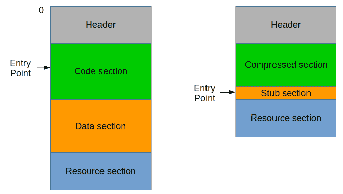

# 第十章：打包和加密

作为我们学习混淆的延续，我们现在将介绍一组工具，这些工具被分类用于防止软件被逆向工程。使用这些工具（如打包器和加密器）的结果是将原始可执行文件转换成一个新的版本，而新版本的文件仍然完全保持原有的代码行为流。根据所使用的工具，我们将讨论转换后的可执行文件会是什么样子，以及转换后的文件是如何执行的。

我们选择了 UPX 工具来演示打包器如何在低级别上工作，并展示可以用来反向工程的技术。

互联网上有很多免费的打包器，通常被恶意作者用来打包他们的软件（如 fsg、yoda、aspack），但为了简便起见，我们将重点介绍最简单的 UPX。

本章将以 Windows 作为我们的环境，并使用`x86Dbg`或`OllyDbg`进行调试。我们还将展示如何使用 Volatility 工具。我们会涉及脚本语言中的混淆，并使用一些 Cyber Chef 来解密数据。

本章将涵盖以下主题：

+   使用 UPX 工具解包

+   识别解包存根，并使用调试器设置断点以提取内存

+   转储内存，提取在内存中执行的程序

+   使用可执行文件中的密钥识别和解密段

# 回顾原生可执行文件如何被操作系统加载

为了更好地理解打包程序如何修改文件，我们先快速回顾一下操作系统如何加载可执行文件。原生可执行文件通常被称为 Windows 的 PE 文件和 Linux 的 ELF 文件。这些文件被编译成低级格式；也就是说，使用类似于`x86`指令的汇编语言。每个可执行文件都由头部、代码段、数据段和其他相关部分组成。代码段包含实际的低级指令代码，而数据段包含代码使用的实际数据。头部包含关于文件、各个段以及文件如何映射为内存中的进程的信息。以下图示展示了这一过程：


头部信息可以分为原始信息和虚拟信息。原始信息包含关于物理文件的相关信息，如文件偏移量和大小。偏移量是相对于文件偏移量 0 的。虚拟信息则包含关于进程中内存偏移的相关信息，虚拟偏移通常是相对于图像基址的，图像基址是进程映像在内存中的起始位置。图像基址是操作系统分配的进程空间中的一个地址。基本上，头部信息告诉我们操作系统应如何将文件（原始）及其各个部分映射到内存（虚拟）。此外，每个部分都有一个属性，告诉我们该部分是否可以用于读取、写入或执行。*在第四章，静态与动态逆向分析*中，我们在“进程的内存区域与映射”一节中展示了如何将原始文件映射到虚拟内存空间。下图显示了当磁盘上的文件（左）映射到虚拟内存空间（右）时的样子：


包含代码所需函数的库或模块也列在文件的一个部分中，该部分可以在代码和数据部分之外的其他部分看到。这部分称为导入表。它是一个 API 函数及其所属库的列表。文件映射后，操作系统在相同的进程空间中加载所有库。这些库的加载方式与可执行文件相同，但位于同一进程空间的较高内存区域。关于库加载位置的更多信息，请参阅*第四章](1017358e-f842-4115-8779-f721299bbe3c.xhtml)，静态与动态逆向分析*中的“进程的内存区域与映射”部分。

当所有内容都正确映射并加载后，操作系统从头部信息中读取入口点地址，然后将代码执行传递到该地址。

文件中还有其他部分会使操作系统以特殊方式运行。例如，文件资源部分中包含的图标就是一个例子，它们会在文件资源管理器中显示。文件还可以包含数字签名，作为指示文件是否允许在操作系统中运行的标志。CFF Explorer 工具应该能帮助我们查看头部信息及这些部分，如下图所示：


到目前为止，我们已经涵盖了基础内容，但所有这些结构都已由微软和 Linux 社区进行良好的文档化。Windows PE 文件的结构可以在以下链接中找到：[`docs.microsoft.com/en-us/windows/desktop/debug/pe-format`](https://docs.microsoft.com/en-us/windows/desktop/debug/pe-format)。而 Linux ELF 文件的结构可以在以下链接中找到：[`refspecs.linuxbase.org/elf/elf.pdf`](http://refspecs.linuxbase.org/elf/elf.pdf)[.](http://refspecs.linuxbase.org/elf/elf.pdf)

# 打包器、加密器、混淆器、保护器和自解压文件（SFX）

可执行文件可以通过打包、加密和混淆来保护其代码，但仍然保持可执行，且程序本身完好无损。这些技术主要旨在防止程序被反向工程。规则是，如果原始程序能够正常运行，那么它是可以被反向的。接下来我们将定义术语“宿主”或“原始程序”，指的是在文件被打包、加密、混淆或保护之前的可执行文件、数据或代码。

# 打包器或压缩器

打包器，也称为压缩器，是用于将宿主文件压缩为更小文件的工具。压缩数据的概念帮助我们减少传输数据时所需的时间。在混淆方面，压缩后的数据通常不会显示完整的可读文本。

在下图中，左侧窗格显示了压缩前的代码的二进制和数据，而右侧则显示其压缩后的形式。注意，压缩后的文本字符串并不完全显示出来：


由于代码和数据现在已被压缩，执行文件时需要一个解压缩的代码。这个代码被称为解压缩代码段。

在下图中，左侧显示的是文件的原始结构，其中程序的入口点位于代码段。一个可能的打包版本将会有一个新的结构（右侧），其中入口点位于解压缩代码段。



当打包的可执行文件被执行时，首先运行的是代码段，然后将代码执行权交给解压后的代码。文件头中的入口点应指向代码段的地址。

打包器减少了部分段的大小，因此必须修改文件头中的值。文件头中各段的原始位置和大小会被修改。事实上，一些打包器会将文件视为一个包含代码和数据的大段。诀窍是将这个大段设置为可读、可写且可执行。然而，这可能会带来错误处理不当的风险，尤其是当代码不小心写入一个应为只读的区域，或执行代码时访问了一个应为不可执行的区域。

打包文件的最终结果是保留宿主的行为完整，同时使打包文件的大小变小。

# 加密器

通过加密进行的混淆是由加密程序完成的。打包程序压缩段，而加密程序则加密段。与打包程序类似，加密程序也有一个存根用于解密加密的代码和数据。因此，加密程序可能会增加宿主文件的大小。

以下图像展示了一个由`Yoda Crypter`加密的文件：


段偏移量和大小已被保留，但已加密。存根被放置在一个新添加的名为`*yC*`的段中。如果我们比较原始操作码字节和加密后的字节，就会注意到操作码字节中有零字节分布。这是一个可以用来识别加密字节的特征。

打包程序和加密程序的另一个特征是它们如何导入 API 函数。使用 CFF Explorer 查看导入目录时，我们只看到两个导入的 API：`LoadLibrary`和`GetProcAddress`。这两个函数都来自`Kernel32.DLL`，并且注意到它的名称使用了混合字符大小写：`KeRnEl32.Dll`，如下所示：


仅通过这两个 API 函数，它所需的每个功能都可以动态加载。

以下图像展示了`GetProcAddress` API：


以下图像展示了`LoadLibrary` API：


看存根时，我们预计它会包含一个包含解密算法的循环代码。以下图像展示了`Yoda Crypter`使用的解密算法：


# 混淆器

混淆器也被归类为代码修改器，它们在保留程序流程的同时更改代码的结构。在前一章中，我们介绍了控制流扁平化（CFF）技术。CFF 技术将小段代码转换为在循环中运行，并通过控制标志进行控制。然而，混淆不仅限于 CFF 技术。编译后的文件结构也可以被修改，特别是对于基于伪代码执行的程序，如 Visual Basic 和.NET 编译程序。

混淆的主要技术之一是使函数名变得模糊不清或加密，使反编译器无法正确识别函数。此类高阶混淆工具的例子有`Obfuscar`、`CryptoObfuscator`和`Dotfuscator`。

变量名的重命名，使用随机生成的文本字符串，转换代码文本为十六进制文本，以及将文本分割供代码拼接，是用于脚本（如 JavaScript 和 Visual Basic 脚本）的一些混淆技术。

以下截图展示了一个使用在线混淆工具的混淆 JavaScript 代码示例：


原始代码在左侧，混淆后的版本在右侧。

# 保护程序

保护工具通过结合使用打包器和加密器，以及其他反调试特性来保护软件。受保护的软件通常有多层解压和解密过程，可能会使用像`blowfish`、`sha512`或`bcrypt`这样的加密算法。一些复杂的保护工具甚至使用自己的代码虚拟化技术，这类似于伪代码的概念。保护工具通常是商业销售的，并用于防止盗版。

Windows 可执行文件保护工具的示例包括`Themida`、`VMProtect`、`Enigma`和`Asprotect`。

# SFX 自解压归档

我们通常使用 ZIP 和 RAR 来归档文件。但是，你知道这些归档文件可以转换为自解压执行文件（SFX）吗？这些工具的目的在于轻松地为任何需要多个文件的软件生成安装程序，比如主程序及其依赖的库模块。SFX 归档中嵌入了一个 SFX 脚本。该脚本负责指示文件要解压到哪些目录。如下图所示：


通常，SFX 具有可以执行以下操作的脚本功能：

+   提取归档文件

+   从提取的文件中运行文件

+   从系统中运行任何文件

+   删除文件

+   创建注册表项

+   从互联网访问网站

+   创建文件

基本上，它几乎可以做任何常规程序能对系统做的事情。SFX 工具的示例包括`Winzip SFX`、`RARSFX`和`NSIS`。

# 解包

在这一阶段，使用`x86dbg`，我们将解包一个已压缩的可执行文件。在这个调试会话中，我们将解包一个 UPX 打包的文件。我们的目标是达到原始主机的入口点。除了这个 UPX 压缩文件外，我们在 GitHub 页面上还提供了可以用于练习的压缩样本。

# UPX 工具

`eXecutables`的终极打包器，也称为 UPX，可以从[`upx.github.io/`](https://upx.github.io/)下载。该工具本身可以打包 Windows 可执行文件。它还能够恢复或解包 UPX 打包的文件。为了展示其功能，我们使用该工具对文件`original.exe`进行了操作，如下所示：


注意，在被打包后，原文件的大小已经减少。

# 通过打包器进行调试

打包器对文件做了重大修改，特别是在 PE 文件头中。为了更好地理解打包器如何工作，让我们比较主机和打包后的可执行文件版本。使用 CFF 工具，我们将检查头部的差异。

上图显示了原始版本和 UPX 压缩版本之间的 NT 头差异：


这里唯一的区别是节的数量，从四个减少到三个，如下例所示：


在前面的示例中的可选头比较中，变化如下：

+   SizeOfCode: `0x0C00 到 0x1000`

+   SizeOfInitializedData: `0x0e00` 到 `0x5000`

+   AddressOfEntryPoint: `0x157e` 到 `0x6b90`

+   BaseOfCode: `0x1000` 到 `0x6000`

+   BaseOfData: `0x2000` 到 `0x7000`

+   SizeOfImage: `0x5000` 到 `0x8000`

+   SizeOfHeaders: `0x0400` 到 `0x1000`

+   CheckSum: `0x4a92` 到 `0`

下图展示了原始和 UPX 压缩后版本的数据目录表之间的对比。


前面的示例展示了数据目录中的变化：

+   导入目录 RVA: `0x234c` 到 `0x71b4`

+   导入目录大小: `0x0078` 到 `0x017c`

+   资源目录 RVA: `0x4000` 到 `0x7000`

+   资源目录大小: `0x01b0` 到 `0x01b4`

+   调试目录 RVA: `0x2110` 到 `0`

+   调试目录大小: `0x001c` 到 `0`

+   配置目录 RVA: `0x2240` 到 `0x6d20`

+   配置目录大小: `0x40` 到 `0x48`

+   导入地址目录 RVA: `0x2000` 到 `0`

+   导入地址目录大小: `0xf4` 到 `0`

下面的图片展示了原始程序和 UPX 压缩后版本之间头部节区的对比。


前面的示例展示了在 UPX 压缩版本中，原始节区头部几乎所有信息都发生了变化。原始和虚拟偏移量、大小及特性都已变化。

对于 `UPX0` 节区，Characteristics 字段中位标志的含义在下面的示例中列出：


以下示例显示，虽然导入的 API 函数数量减少，但原始的静态导入库文件依然保持不变：


下图展示了将要为 `KERNEL32.dll` 导入的 API 函数。它们拥有完全不同的 API 函数：


至于资源目录的内容，似乎大小没有变化，唯一的变化是偏移量，以下示例中可以看到这一点：


以下列表展示了在压缩文件中基于哪些特征所做的更改：

+   有三个节区，即 `UPX0`、`UPx1` 和 `.rsrc`：

    +   `UPX0`具有虚拟节区属性，但没有原始节区属性。这仅意味着该节区将由操作系统分配，但不会从文件中映射数据到该节区。该节区设置了读、写和执行标志。

    +   入口点地址位于 `UPX1` 节区内。存根应位于此节区内，并且压缩的代码和数据也应存放在此处。

    +   `.rsrc` 节区似乎保留了其内容。保留资源节区仍能提供操作系统文件浏览器读取的正确图标和程序详细信息。

+   由于打包程序具有自己结构，导致节区发生了重大变化，像 `BaseOfCode` 和 `BaseOfData` 这样的头部字段已完全修改。

+   虚拟大小是基于`SectionAlignment`对齐的。例如，`.rsrc`的虚拟大小最初为`0x1b0`，通过与`SectionAlignment`对齐，使其变为`0x1000`。

+   由于打包器插入了一个存根，`ImageSize`已经增加。

入口点是`ImageBase`和`AddressOfEntryPoint`之和。原始入口点位于`0x0040157e`。该地址位于`UPX0`区段范围内，`UPX0`从`0x00401000`开始，大小为`0x5000`。存根位于打包文件的入口点，位于`UPX1`区段内。我们期望的结果是，打包器解压代码，动态导入 API 函数，最后将代码执行传递给原始入口点。为了加快调试，我们应该寻找一条或一组指令，将执行传递到`0x0040157e`，即原始入口点。

让我们通过在`x86dbg`中打开`upxed.exe`来观察这一过程。我们从入口点`0x00406b90`开始，如下图所示：


操作系统将文件映射到内存，并且所有虚拟区段也都已分配。第一条指令使用`pushad`保存所有初始标志状态。如果它保存了所有标志，那么在跳转到原始入口点之前，应该恢复这些标志。接下来的指令将地址`0x00406000`存储到寄存器`esi`中。这个地址是`UPX1`区段的起始位置，压缩数据就在这里。下一行将`0x00401000`存储到寄存器`edi`中。可以清楚地看出，压缩数据将从`esi`解压到`edi`。开启调试后，解压代码位于`0x00406b91`到`0x00406c5d`之间。

在`0x00406c62`处放置断点之前，设置一个地址为`0x00401000`的转储窗口。这将帮助我们查看主机的解压部分。一直运行代码直到`0x00406c62`，应完成解压过程。下图展示了这一过程：


下一组指令修复使用相对跳转地址的调用指令。该代码从`0x00406c65`运行到`0x00406c94`。只需放置另一个断点，或者使用“运行直到”选项，选择在`0x00406c96`这一行，便可通过这段修复调用的代码循环。

接下来的几行是打包器动态加载主机使用的 API 函数的部分。代码将`0x00405000`存储到寄存器`edi`中。这个地址包含了数据，可以在其中找到原始模块的名称列表以及与每个模块相关的 API 函数名称。

对于每个模块名称，它使用`LoadLibraryA`来加载主机稍后将使用的库。下图展示了这一过程：


加载模块后，它使用 `GetProcAddress` 获取主机将使用的 API 地址，如以下截图所示：


每个检索到的 API 地址都存储在主机的导入表中，位于 `0x00402000`。将函数地址恢复到相同的导入表地址应该可以让主机正常调用 API。在 `0x00406cde` 处设置断点应执行动态导入例程。

下一例程将设置映射头部的访问权限为只读，防止其被写入或执行代码，如以下截图所示：


VirtualProtect 用于设置内存访问标志，并且还需要四个参数。以下代码显示了根据 MSDN 的参数：

```
BOOL WINAPI VirtualProtect(
  _In_  LPVOID lpAddress,
  _In_  SIZE_T dwSize,
  _In_  DWORD  flNewProtect,
  _Out_ PDWORD lpflOldProtect
);
```

第一次调用 VirtualProtect 时，`lpAddress` 设置为 `0x00400000`，`dwSize` 设置为 0x1000 字节，保护标志设置为 4。值 4 表示 PAGE_READWRITE 常量。之后的 VirtualProtect 调用将保护标志设置为 `PAGE_READONLY`。如以下截图所示：


记住，在代码开始时，我们遇到了一个 `pushad` 指令。此时，我们正处于其对立指令 `popad` 处。这很可能是执行将传递给原始入口点的部分。查看 `0x00406D1B` 处的 `jmp` 指令，地址跳转到 `UPX0` 区段中的某个地址。根据我们的主机打包比较，原始入口点确实位于 `0x0040157e`。

到达原始入口点应结束调试打包程序代码。

# 从内存中转储进程

打包文件的数据无法直接看到，但如果让它运行，所有内容都应解包到其进程空间中。我们的目标是生成一个解包状态下的文件版本。为此，我们需要转储整个内存，然后将可执行文件的进程映像提取到文件中。

# 使用 VirtualBox 进行内存转储

我们将使用 Volatility 从暂停的 VirtualBox 映像中转储进程。首先，我们需要了解如何转储 VirtualBox 映像：

1.  启用 VirtualBox 的调试菜单：

    +   对于 Windows VirtualBox 主机：

        +   输入一个名为 `VBOX_GUI_DBG_ENABLED` 的新环境变量，并将其设置为 `true`。如以下截图所示：


1.  +   对于 Linux 主机：

        +   以 root 用户身份编辑 /etc/environment

        +   添加一个新的条目 `VBOX_GUI_DBG_ENABLED=true`

        +   执行命令：`source /etc/environment`

        +   如果 VirtualBox 已经打开，请重新启动

1.  在 Windows 客户机中运行打包的可执行文件。我们将从我们的 GitHub 页面运行 `upxed.exe`。

1.  在 VBoxDbg 控制台中，执行以下命令将整个内存转储保存到文件中。注意，`pgmphystofile` 命令前应该加上一个点，如下所示：

    ```
    .pgmphystofile memory.dmp
    ```

1.  memory.dmp 是文件名，并存储在登录用户的主目录中。它是 Windows 中的`%userprofile%`文件夹，Linux 中的`~/`文件夹。

接下来，我们将使用 Volatility 解析内存转储并提取我们需要的数据。

# 使用 Volatility 将进程提取到文件

Volatility 可以从[`www.volatilityfoundation.org/releases`](https://www.volatilityfoundation.org/releases)下载。在这一部分中，我们的 VirtualBox 主机运行的是 Linux Ubuntu 系统。这里展示的 Volatility 命令参数，在 Windows 中使用时也应该是一样的。

首先，我们需要使用 Volatility 的`imageinfo`参数来识别确切的操作系统版本，以下是一些示例：

```
vol -f ~/memory.dmp imageinfo
```


再次说明，`~/memory.dmp`是我们刚刚转储的内存文件路径。结果应显示已识别的操作系统配置文件列表。对于 Windows 7 SP1 32 位，我们将使用`Win7SP1x86`作为后续`Volatility`命令的配置文件。

接下来，我们需要列出正在运行的进程并识别哪个是我们的打包可执行文件。为了列出运行的进程，我们将使用`pslist`参数，如以下示例所示：

```
volatility --profile=Win7SP1x86 -f ~/memory.dmp pslist
```


查看上一张截图中第二列的最后一行，我们发现`upxed.exe`。我们需要记下进程 ID（PID），它的值是`2656`。现在我们已经获取了打包可执行文件的 PID，我们可以使用`procdump`参数将进程导出为文件，如以下代码所示：

```
volatility --profile=Win7SP1x86 -f ~/memory.dmp procdump -D dump/ -p 2656
```

`procdump`将把进程可执行文件保存在`-D`参数设置的`dump/`文件夹中，如下图所示：


Volatility 有很多功能可供选择。请随意探索这些参数，它们可能有助于适应分析情况。

# 解包后的可执行文件怎么样？

现在我们从 Volatility 获取了一个可执行文件，将其在我们的 Windows 虚拟沙盒中运行，得到以下信息：


请记住，打包的可执行文件有自己的 PE 头和存根，而不是原始主机的。头部、存根和压缩数据被直接映射到进程空间。每个 API 函数都是动态导入的。即使代码和数据已经解压，头部中设置的入口点仍然是打包可执行文件的，而不是原始主机的。

幸运的是，`x86dbg`有一个插件叫做 Scylla。在到达原始入口点后，这意味着我们已经进入解包状态，我们可以将正在调试的进程重建为一个全新的可执行文件。这个新的可执行文件已经解包，可以单独执行。

这仍然要求我们调试打包后的可执行文件，直到我们到达原始入口点（OEP）。一旦到达 OEP，从插件下拉菜单中打开 Scylla。这应该会打开 Scylla 窗口，如以下示例所示：


当前活动进程已经设置为`upxed.exe`进程。OEP 也已经设置为指令指针所在的位置。接下来要做的是点击 IAT Autosearch，让 Scylla 解析进程空间并定位最可能的导入表。这将填充 IAT 信息框中的 VA 和`Size`字段，显示可能的导入表位置和大小。点击`Get Imports`，让 Scylla 扫描已导入的库和 API 函数。如下图所示：


展开其中一个库，它会显示出它找到的 API 函数。现在，在 Dump 框架下，点击 Dump 按钮。这会弹出一个对话框，询问保存可执行文件的位置。这只是将可执行文件的进程转储出来。我们仍然需要应用 IAT 信息和导入。点击 Fix Dump 并打开转储的可执行文件。这会生成一个新的文件，并在文件名后附加`_SCY`，如下图所示：


运行这个新的可执行文件应该会给我们与原始主机行为相同的结果。

在 Volatility 中，我们没有足够的信息来重建可执行文件。然而，使用`x86dbg`和 Scylla，尽管需要我们绕过打包器的调试，我们仍然能够得到一个重建后的可执行文件。

# 其他文件类型

如今，网站通常将二进制数据转换为可打印的 ASCII 文本，以便网站开发人员轻松地将这些数据与 HTML 脚本一起嵌入。其他网站则将数据转换成不容易被人类读取的形式。在本节中，我们将目标是解码那些已被隐藏的不可直观理解的数据。在*第十三章 反向工程各种文件类型*中，我们将处理如何反向工程除了 Windows 和 Linux 可执行文件之外的其他文件类型。在此之前，我们将仅解码明显的数据。

让我们去浏览器并访问[www.google.com](http://www.google.com)，在写作时（我们存储了该页面的源代码副本，见[`github.com/PacktPublishing/Mastering-Reverse-Engineering/blob/master/ch10/google_page_source.txt`](https://github.com/PacktPublishing/Mastering-Reverse-Engineering/blob/master/ch10/google_page_source.txt)），查看源代码时会显示一部分包含`b64`编码文本，如下图所示：


使用 Cyberchef 工具，这个工具可以帮助解码多种编码数据，包括 base 64，我们可以将这些数据转化为我们能理解的内容。只需将 base-64 数据复制并粘贴到输入框中，然后双击 *From Base64*。这样应该会在输出框中显示解码后的二进制内容，如下图所示：


请注意，输出开头写有 `PNG`。这很可能是一个 PNG 图像文件。此外，如果我们仔细查看源代码，还可以看到在 base-64 编码数据之前也有标明数据类型，如以下示例所示：

```
data:image/png;base64
```

如果我们点击磁盘图标，我们可以将输出数据保存到文件并命名为 `.png` 扩展名。这样我们就能查看图像，如以下截图所示：


Cyberchef 工具支持其他编码类型。如果我们遇到类似的编码文本，互联网提供了所有可用的工具来帮助我们。

# 总结

逆向工程就是如何在正确的情境中使用工具。即使是经过压缩、加密和混淆的可执行文件，隐藏的信息仍然可以被提取出来。

在本章中，我们介绍了如何通过打包工具、加密工具、混淆器、保护器甚至自解压工具隐藏数据的各种概念。我们遇到了一个由 UPX 工具生成的打包文件，并且我们仍然能够通过调试器进行逆向工程。通过注意指令指针的位置，我们可以判断自己是否已经到达原始入口点。通常来说，如果指令指针已经跳转到不同的区域，我们可以认为自己已经到达了原始入口点。

使用另一种查看程序解包状态的方案，我们使用 Volatility 结合来自 VirtualBox 虚拟机的内存转储，并提取了我们刚刚运行的可执行文件的进程。通过 Scylla 工具，我们还能够重建解包后的可执行文件状态。

本章最后我们介绍了 CyberChef 工具，它能够解码流行的编码数据，如 base-64。这个工具可能在我们遇到编码数据时非常有用，不仅在网站上的脚本中，在我们遇到的每个可执行文件中都可能出现。

在下一章中，我们将继续我们的旅程，通过识别恶意软件执行的恶意行为。
