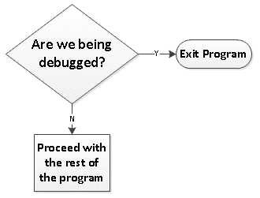
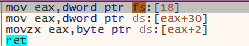
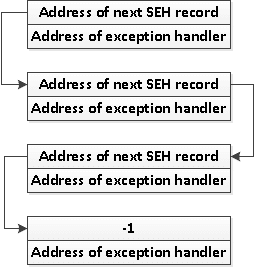

# 第十一章：反分析技巧

反调试、反虚拟机（VM）、反仿真和反转储是一些试图阻止分析的技巧。在本章中，我们将尝试展示这些反分析方法的概念。为了帮助我们识别这些代码，我们将解释这些概念并展示实际的反汇编代码。能够识别这些技巧将帮助我们避开它们。通过初步的静态分析，我们将能够跳过这些代码。

在本章中，我们将实现以下学习成果：

+   识别反分析技巧

+   学习如何克服反分析技巧

# 反调试技巧

反调试技巧的目的是确保代码在没有调试器干预的情况下运行。假设我们有一个程序，其中包含反调试代码。该程序的行为就像它没有反调试代码一样运行。然而，当程序被调试时，情况就不同了。在调试时，我们会遇到直接退出程序或跳转到不合理代码的情况。这个过程在下图中有所说明：



开发反调试代码需要了解程序和系统的特征，无论是在正常运行还是在被调试时。例如，**进程环境块**（**PEB**）包含一个标志，该标志在程序在调试器下运行时被设置。另一个常见的技巧是使用 **结构化异常处理程序**（**SEH**）来继续在调试时强制产生错误异常的代码。为了更好地理解这些技巧的工作原理，我们来更详细地讨论这些技巧。

# IsDebuggerPresent

`IsDebuggerPresent` 是一个 `Kernel32` API 函数，它简单地告诉我们程序是否处于调试器下运行。结果存储在 `eax` 寄存器中，值为真（`1`）或假（`0`）。使用时，代码大致如下所示：

```
call IsDebuggerPresent
test eax, eax
jz notdebugged
```

同样的概念适用于 `CheckRemoteDebuggerPresent` API。不同之处在于，它检查的是另一个进程还是*自身*进程是否正在被调试。`CheckRemoteDebuggerPresent` 需要两个参数：一个进程句柄和一个输出变量，告诉我们该进程是否正在被调试。以下代码检查其自身进程是否正在被调试：

```
call GetCurrentProcess
push edi
push eax
call CheckRemoteDebuggerPresent
cmp dword ptr [edi], 1
jz beingdebugged
```

`GetCurrentProcess` API 用于检索正在运行的进程句柄。它通常返回一个 `-1`（`0xFFFFFFFF`）值，这是它自身进程的句柄。`edi` 寄存器应该是一个变量地址，用于存储 `CheckRemoteDebuggerPresent` 的输出结果。

# PEB 中的调试标志

线程是执行的基本单位。进程本身作为线程实体运行，能够在同一进程空间中触发多个线程。当前正在运行的线程信息存储在线程环境块（TEB）中。TEB 也叫线程信息块（TIB），其中包含线程 ID、结构化错误处理框架、堆栈基地址和限制、以及指向有关线程所在进程的信息的地址。关于进程的信息存储在进程环境块（PEB）中。

PEB 包含诸如指向列出已加载模块的表的指针、用于运行进程的命令行参数、从 PE 头部提取的信息，以及是否被调试等信息。TIB 和 PEB 结构由微软在 https://docs.microsoft.com/en-us/windows/desktop/api/winternl/ 中记录。

`PEB`有可以用来识别进程是否正在被调试的字段：`BeingDebugged`和`NtGlobalFlag`标志。在`PEB`中，它们位于以下位置：

| **偏移量** | **信息** |
| --- | --- |
| `0x02` | BeingDebugged（为真时为 1） - BYTE |
| `0x68` | GlobalNTFlag（通常在调试时为 0x70） - DWORD |

在内部，`IsDebuggerPresent`使用以下代码：



让我们检查一下`IsDebuggerPresent`代码的运行情况：

```
mov eax, dword ptr fs:[18]
```

上述行从**线程信息块**（**TIB**）中检索**线程环境块**（**TEB**）的地址。`FS`段包含`TIB`。`TEB`地址存储在`TIB`的偏移量`0x18`处。`TIB`存储在`eax`寄存器中。

下一行获取`PEB`地址并将其存储在`eax`寄存器中。`PEB`地址位于`TEB`的偏移量`0x30`处：

```
mov eax, dword ptr ds:[eax+30]
```

`PEB`偏移量`2`处的字节包含布尔值`1`或`0`，表示进程是否正在被调试：

```
movzx eax, byte ptr ds:[eax+2]
```

如果我们想创建自己的函数，并且应用了`GlobalNTFlag`，那么我们可以将代码写成这样：

```
mov eax, dword ptr fs:[18]
mov eax, dword ptr ds:[eax+0x30]
mov eax, dword ptr ds:[eax+0x68]
cmp eax, 0x70
setz al
and eax, 1
```

上述代码的前三行基本上是从`PEB`的偏移量`0x68`中检索`GlobalNTFlag`。

接下来的`cmp`指令会在`eax`的值等于`0x70`时将零标志设置为`1`：

```
cmp eax, 0x70
```

`setz`指令会根据`ZF`的值将`al`寄存器设置为`0`或`1`：

```
setz al
```

最后，`and`指令将仅保留`eax`寄存器的第一个位，从而清除寄存器，但保留一个值，值为`1`或`0`，用于表示真假：

```
and eax, 1
```

# 从`NtQueryInformationProcess`获取调试器信息

使用`NtQueryInformationProcess`函数查询进程信息为我们提供了另一种识别进程是否在调试中的方法。根据`MSDN`，`NtQueryInformationProcess`的语法声明如下：

```
NTSTATUS WINAPI NtQueryInformationProcess(
  _In_       HANDLE ProcessHandle,
  _In_       PROCESSINFOCLASS ProcessInformationClass,
  _Out_      PVOID ProcessInformation,
  _In_       ULONG ProcessInformationLength,
  _Out_opt_  PULONG ReturnLength
);
```

有关此函数的更多信息，请参见 [`docs.microsoft.com/en-us/windows/desktop/api/winternl/nf-winternl-ntqueryinformationprocess`](https://docs.microsoft.com/en-us/windows/desktop/api/winternl/nf-winternl-ntqueryinformationprocess)。

根据第二个参数 `PROCESSINFOCLASS` 提供的 ID，返回具体的信息。`PROCESSINFOCLASS` 是一个列举的 ID 列表，我们希望查询的 ID 包含在内。为了确定进程是否正在被调试，我们需要以下 ID：

+   `ProcessDebugPort (7)`

+   `ProcessDebugObjectHandle (30)`

+   `ProcessDebugFlags (31)`

本质上，如果第三个参数 `ProcessInformation` 填充后的输出结果为非零值，则意味着该进程正在被调试。

# 定时技巧

通常，从地址 `A` 到地址 `B` 执行一段程序所需的时间不超过一秒钟。但如果这些指令正在被调试，人工调试可能需要每行约一秒钟。从地址 `A` 调试到地址 `B` 至少需要几秒钟。

本质上，这个概念就像一个计时器。如果几行代码执行的时间过长，技巧就会认为程序正在被调试。

定时技巧可以作为一种反调试方法应用于任何编程语言。设置计时器只需要一个能够读取时间的函数。以下是一些定时技巧在 x86 汇编中的实现示例：

```
rdtsc
mov ebx, eax
nop
nop
nop
nop
nop
nop
nop
nop
rdtsc
sub eax, ebx
cmp eax, 0x100000
jg exit
```

在 x86 处理器中意味着 **读取时间戳计数器** (**RDTSC**)。每次处理器重置（无论是硬重置还是开机）时，时间戳计数器都会被重置为 0。时间戳计数器在每个处理器时钟周期中递增。在之前的 `RDTSC` 代码段中，第一个 `RDTSC` 指令的结果存储在 `ebx` 寄存器中。经过一系列的 `nop` 指令后，存储在 `ebx` 中的值与第二个 `RDTSC` 指令的结果相减。这就是计算第一和第二次 `TSC` 的差值。如果差值大于 `0x100000`，则跳转至退出。如果程序没有被逐行调试，差值应该约小于 `0x500`。

另一方面，`GetSystemTime` 和 `GetLocalTime` 这两个可以获取时间的 API 函数，也可以用来实现定时技巧。为了识别这些技巧，代码必须包含两个时间获取函数。

# 通过 SEH 传递代码执行

最流行的反调试技巧之一是通过 `SEH` 传递代码执行。它是 Windows 计算机病毒中常用的技巧。但在讨论该技巧如何用于反调试之前，我们先简要了解一下 `SEH` 的工作原理。

异常通常由错误引发，例如从无法访问的内存区域读取字节，或像除以零这样简单的操作。它们也可以由调试器中断引发，`INT 3` 和 `INT 1`。当异常发生时，系统会跳转到异常处理程序。通常，异常处理程序的工作是处理错误。

通常，这项工作会给出一个错误消息通知，导致程序优雅地终止。从编程的角度来看，这就是 try-except 或 `try-catch` 处理。以下是 Python 编程中异常处理的示例：

```
try:
    print("Hello World!")

except:
    print("Hello Error!")
```

一个 `SEH` 记录包含两个元素：异常处理程序的地址和下一个 `SEH` 记录的地址。下一个 `SEH` 记录包含指向下一个 `SEH` 记录的地址。总体来说，`SEH` 记录是彼此相连的，这被称为 `SEH` 链。如果当前处理程序无法处理该异常，则下一个处理程序将接管。如果 `SEH` 记录耗尽，可能会导致程序崩溃。这个过程如下所示：



如我们所见，最后一个 `SEH` 记录在 `SEH` 记录指针字段中包含一个 `-1`（对于 32 位地址空间为 `0xFFFFFFFF`）的值。

现在我们知道 `SEH` 是如何工作的，那么如何将其用于反调试呢？使用我们的 try-except Python 代码，滥用它可能会像这样：

```
x = 1
try:
    x = x / 0
    print("This message will not show up!")
except:
    print("Hello World!")
```

我们所做的是强制引发一个错误（准确地说是除以零的错误）以引发异常。异常处理程序会显示 `Hello World!` 消息。那么，在 x86 汇编语言中它是如何工作的呢？

为了设置我们的新 `SEH`，我们首先需要找出当前 `SEH` 的位置。对于每个进程，Windows 操作系统会设置一个 `SEH` 链。当前的 `SEH` 记录可以从 `TIB` 的偏移量 `0` 获取，如 `FS` 段寄存器所示。

以下汇编代码将当前 `SEH` 记录的地址获取到 `eax` 寄存器：

```
mov eax, dword ptr FS:[0]
```

要更改处理程序，我们只需用我们的 `SEH` 记录更改当前 `SEH` 记录的地址，即 `FS:[0]`。假设处理代码的地址为 `0x00401000`，而当前的 SEH 记录位于 `0x00200000`，并且包含以下值：

| 下一个 SEH 记录 | `0xFFFFFFFF` |
| --- | --- |
| 当前处理程序地址 | `0x78000000` |

接下来要做的是构建我们的 `SEH` 记录，并将其存储在栈中。通过 `FS:[0]` 返回 `0x00200000` 的值，而我们的处理程序位于 `0x00401000`，这里是从栈中构建 `SEH` 记录的一种方式：

```
push 0x00401000
push dword ptr FS:[0]
```

栈的状态应该类似于以下样子：

| ESP | `0x00200000` |
| --- | --- |
| ESP+4 | `0x00401000` |

我们需要做的就是将 `FS:[0]` 的值更新为该 `SEH` 记录的地址，这就是 `ESP` 寄存器的值（即栈顶）：

```
mov dword ptr FS:[0], esp
```

前面的代码应该将我们的 `SEH` 添加到 `SEH` 链中。

# 引发异常

接下来要做的是开发一段代码，强制引发一个异常。我们有几种已知的方法来实现这一点：

+   使用调试断点（INT 3 / INT 1）

+   访问不可访问的内存空间

+   除零错误

`SEH` 反调试技巧的目的是将调试分析引导到一个错误。这使得分析师试图追溯可能导致错误的原因，从而浪费时间。而且，如果分析师熟悉 `SEH`，他就能很容易地找到处理程序所在的位置并在那里设置断点。

步骤调试之所以有效，是因为 `Interrupt 1`，而断点是通过 `Interrupt 3` 设置的。当代码执行遇到 `INT 3` 指令时，会发生调试异常。要调用 `Interrupt 1` 异常，必须首先设置陷阱标志。

当读取不可访问的内存时，会发生读取错误。已经有已知的内存区域，例如内核空间，这些区域不允许从用户模式进程直接访问。这些区域大多数被 `PAGE_GUARD` 标志保护。可以通过 `VirtualAlloc` 或 `VirtualProtect` 函数设置 `PAGE_GUARD` 标志。这意味着我们可以创建自己的不可访问内存区域。通常，进程空间中的 `0` 偏移区域是不可访问的。以下代码行将导致访问违规异常：

```
mov al, [0]
```

在数学中，实际的除以零操作是一个无限的任务。系统会明确识别此类错误并引发异常。以下是一个示例代码行：

```
mov eax, 1
xor cl, cl
div cl
```

前述代码的作用是将 `eax` 寄存器设置为 `1`，将 `cl` 寄存器设置为 `0`，然后用 `cl` 除以 `eax`，从而引发除零异常。

# 一个典型的 SEH 设置

基于我们所学的内容，让我们利用常规的代码流程，然后使用 `SEH` 作为反调试技巧。以下代码将是我们的原始代码：

```
push eax
mov eax, 0x12345678
mov ebx, 0x87654321
and eax, ebx
pop eax
```

在添加 `SEH` 反调试技巧后，代码看起来大致如下：

```
    mov eax, dword ptr FS:[0]
    push 0x00401000
    push eax
    mov dword ptr FS:[0], esp
    mov al, [0]

RDTSC (with CPUID to force a VM Exit)

VMM instructions i.e. VMCALL

VMEXIT
0x00401000:
    push eax
    mov eax, 0x12345678
    mov ebx, 0x87654321
    and eax, ebx
    pop eax
```

我们在这里做的是手动设置 `SEH`。幸运的是，Windows 还提供了一个可以设置异常处理程序的功能，称为向量化异常处理程序。注册新处理程序的 API 是 `AddVectoredExceptionHandler`。实现此功能的 C 语言源代码可以在 [`docs.microsoft.com/en-us/windows/desktop/debug/using-a-vectored-exception-handler`](https://docs.microsoft.com/en-us/windows/desktop/debug/using-a-vectored-exception-handler) 找到。

# 反虚拟机技巧

这个技巧的目的是当它检测到程序正在虚拟化环境中运行时退出程序。识别虚拟机环境的最典型方法是检查计算机中是否安装了特定的虚拟化软件痕迹。这些痕迹可能位于注册表或正在运行的服务中。我们列出了一些可以用来识别虚拟机内运行的特定痕迹。

# 虚拟机运行进程名称

程序确定自己是否在虚拟机中的最简单方法是识别运行进程的已知文件名。以下是每种流行虚拟机软件的列表：

| **Virtualbox** | **VMWare** | **QEMU** | **Parallels** | **VirtualPC** |
| --- | --- | --- | --- | --- |

| `vboxtray.exe` `vboxservice.exe`

`vboxcontrol.exe` | `vmtoolsd.exe` `vmwaretray.exe`

`vmwareuser`

`VGAuthService.exe`

`vmacthlp.exe` | `qemu-ga.exe` | `prl_cc.exe` `prl_tools.exe` | `vmsrvc.exe` `vmusrvc.exe` |

# 虚拟机文件和目录的存在

确定至少存在一个虚拟机软件的文件，可以判断该程序是否正在虚拟机中运行。下表列出了可以用来识别程序是否在 VirtualBox 或 VMware 客户机中运行的文件：

| **VirtualBox** | **VMWare** |
| --- | --- |

| `%programfiles%\oracle\virtualbox guest additions` `system32\drivers\VBoxGuest.sys`

`system32\drivers\VBoxMouse.sys`

`system32\drivers\VBoxSF.sys`

`system32\drivers\VBoxVideo.sys`

`system32\vboxdisp.dll`

`system32\vboxhook.dll`

`system32\vboxmrxnp.dll`

`system32\vboxogl.dll`

`system32\vboxoglarrayspu.dll`

`system32\vboxoglcrutil.dll`

`system32\vboxoglerrorspu.dll`

`system32\vboxoglfeedbackspu.dll`

`system32\vboxoglpackspu.dll`

`system32\vboxoglpassthroughspu.dll` | `%programfiles%\VMWare` `system32\drivers\vm3dmp.sys`

`system32\drivers\vmci.sys`

`system32\drivers\vmhgfs.sys`

`system32\drivers\vmmemctl.sys`

`system32\drivers\vmmouse.sys`

`system32\drivers\vmrawdsk.sys`

`system32\drivers\vmusbmouse.sys` |

# 默认 MAC 地址

虚拟机默认 MAC 地址的前三个十六进制数字也可以用来识别。但当然，如果 MAC 地址被更改，这些方法就不适用了：

| **VirtualBox** | **VMWare** | **Parallels** |
| --- | --- | --- |

| `08:00:27` | `00:05:69` `00:0C:29`

`00:1C:14`

`00:50:56` | `00:1C:42` |

# 虚拟机创建的注册表项

软件的信息和配置通常保存在注册表中。这同样适用于虚拟机客户机软件，它会创建注册表项。以下是 VirtualBox 创建的注册表项的简短列表：

```
HARDWARE\ACPI\DSDT\VBOX__ 
HARDWARE\ACPI\FADT\VBOX__ 
HARDWARE\ACPI\RSDT\VBOX__ 
SOFTWARE\Oracle\VirtualBox Guest Additions 
SYSTEM\ControlSet001\Services\VBoxGuest 
SYSTEM\ControlSet001\Services\VBoxMouse 
SYSTEM\ControlSet001\Services\VBoxService 
SYSTEM\ControlSet001\Services\VBoxSF 
SYSTEM\ControlSet001\Services\VBoxVideo 
```

以下是已知来自 VMWare 的注册表项：

```
SOFTWARE\VMware, Inc.\VMware Tools 
```

使用 Wine 模拟的 Linux 有如下注册表项：

```
SOFTWARE\Wine
```

也可以通过注册表识别出 Microsoft 的 Hyper-V：

```
SOFTWARE\Microsoft\Virtual Machine\Guest
```

# 虚拟机设备

这些是虚拟机创建的虚拟设备。以下是 VirtualBox 和 VMWare 创建的可访问设备：

| **VirtualBox** | **VMWare** |
| --- | --- |

| `\\.\VBoxGuest` `\\.\VBoxTrayIPC`

`\\.\VBoxMiniRdrDN` | `\\.\HGFS` `\\.\vmci` |

# CPUID 结果

`CPUID` 是一条 x86 指令，用于返回正在运行的处理器的信息。在执行该指令之前，需要指定信息类型，这些信息被称为“叶子”，并存储在寄存器 EAX 中。根据叶子的不同，它会在寄存器 EAX、EBX、ECX 和 EDX 中返回值。每个寄存器中存储的每一位都可以指示某个 CPU 特性是否可用。关于返回的 CPU 信息的详细内容，可以查看 [`en.wikipedia.org/wiki/CPUID`](https://en.wikipedia.org/wiki/CPUID)。

`CPUID` 返回的信息之一是一个标志，它表示系统是否在超虚拟机监控程序（Hypervisor）上运行。超虚拟机监控程序是一个 CPU 功能，支持运行虚拟机（VM）客户机。对于反虚拟机检测，如果启用此标志，意味着进程运行在虚拟机客户机中。

以下 x86 代码检查是否启用了超虚拟机监控程序标志：

```
mov eax, 1
cpuid
bt ecx, 31
jc inhypervisor
```

前面的代码从 CPUID 第 1 项获取信息。`ecx` 寄存器中的第 31 位结果被放置在进位标志中。如果该位被设置为 1，则表示系统在超虚拟机监控程序上运行。

除了超虚拟机监控程序的信息外，一些特定的虚拟机软件可以通过来宾操作系统识别。CPUID 指令可以返回一个唯一的字符串 ID，以识别客户机所运行的虚拟机软件。以下代码检查是否运行在 VMWare 客户机中：

```
mov eax, 0x40000000
cpuid
cmp ebx, 'awMV'
jne exit
cmp ecx, 'MVer'
jne exit
cmp edx, 'eraw'
jne exit
```

当`ebx`、`ecx` 和 `edx` 寄存器的值拼接在一起时，它会显示为 `VMwareVMware`。以下是其他虚拟机软件使用的已知字符串 ID 列表：

| **VirtualBox 4.x** | **VMware** | **Hyper-V** | **KVM** | **Xen** |
| --- | --- | --- | --- | --- |
| VBoxVBoxVBox | VMwareVMware | Microsoft Hv | KVMKVMKVM | XenVMMXenVMM |

# 反仿真技巧

反仿真或反自动化分析是程序用来防止在代码执行过程中继续推进的一种方法，前提是它识别到自己正在被分析。程序的行为可以使用自动化分析工具如 Cuckoo Sandbox、Hybrid Analysis 和 ThreatAnalyzer 来记录和分析。这些技巧的核心在于能够确定程序运行的系统是由用户控制的，并且是用户设置的。

以下是一些区分用户控制的环境与自动化分析控制的系统之间差异的事项：

+   用户控制的系统具有鼠标移动。

+   用户控制的系统可能包含一个对话框，等待用户向下滚动然后点击按钮。

+   自动化分析系统的设置具有以下特点：

    +   物理内存不足

    +   磁盘空间过小

    +   磁盘上的可用空间几乎耗尽

    +   CPU 数量只有一个

    +   屏幕分辨率过小

简单地设置一个需要用户手动输入的任务即可确定程序是否在用户控制的环境中运行。类似于反虚拟机检测，虚拟机客户机的设置将尽可能使用最低的资源要求，以免占用虚拟机主机的计算机资源。

另一个反分析技巧是检测是否运行分析工具。这些工具包括以下内容：

+   OllyDBG（`ollydbg.exe`）

+   WinDbg（`windbg.exe`）

+   IDA Pro（`ida.exe`，`idag.exe`，`ida64.exe`，`idag64.exe`）

+   SysInternals 套件工具，包括以下内容：

    +   进程浏览器（`procexp.exe`）

    +   进程监视器（`procmon.exe`）

    +   Regmon（`regmon.exe`）

    +   Filemon（`filemon.exe`）

    +   TCPView（`tcpview.exe`）

    +   Autoruns（`autoruns.exe`，`autorunsc.exe`）

+   Wireshark（`wireshark.exe`）

规避这些技巧的一种方法是通过自动化分析进行反制。例如，可以模拟鼠标移动，甚至读取对话框窗口属性，滚动和点击按钮。一个简单的反分析技巧是重命名我们用来监视行为的工具。

# 反转储技巧

这种方法并不会停止将内存转储到文件中。这个技巧实际上是通过让逆向工程师不容易理解转储的数据来起作用。以下是一些应用示例：

+   PE 头的部分内容已经被修改，因此进程转储会显示错误的属性。

+   `PEB` 的部分内容，如 `SizeOfImage`，已经被修改，因此进程转储工具会转储错误的数据。

+   转储对于查看解密后的数据非常有用。反转储技巧会在使用后重新加密解密的代码或数据。

为了克服这个技巧，我们可以识别或跳过修改数据的代码。对于重新加密的情况，我们也可以跳过重新加密的代码，使其保持在解密状态。

# 总结

恶意软件通过加入新技术来规避防病毒软件和逆向工程。这些技术包括进程空洞化、进程注入、进程替换、反调试和反分析。进程空洞化和进程替换技术基本上是用恶意程序替换合法进程的映像，从而伪装成合法进程。另一方面，进程注入技术则是将代码插入并在远程进程空间中运行。

反调试、反分析以及本章讨论的其他技巧是逆向工程的障碍。但了解这些技巧的概念能帮助我们克服它们。通过静态分析和死列表方法，我们可以识别并跳过这些复杂代码，或者在 SEH 的情况下，在异常处理程序处设置断点。

我们讨论了反调试技巧，以及它通过错误导致异常并将剩余代码停留在异常处理程序中的技术。我们还讨论了其他技巧，包括反虚拟机和反仿真技巧，这些技巧能够识别出当前环境是分析环境。

在下一章中，我们将运用这里学到的知识，进行一个可执行文件的逆向工程分析。
