# 第十二章：Windows 可执行文件的实用逆向工程

逆向工程在处理恶意软件分析时非常常见。在本章中，我们将查看一个可执行程序，并使用我们目前所学的工具确定其实际行为流程。我们将直接从静态分析进入动态分析。这要求我们设置好实验环境，以便更容易跟进分析过程。

本章要分析的目标文件具有在实际恶意软件中看到的行为。无论文件是否恶意软件，我们在分析时都必须小心地在封闭环境中处理每个文件。让我们开始进行一些逆向工程。

**本章将涵盖以下主题：**

+   实用的静态分析

+   实用的动态分析

# 准备事项

我们即将分析的文件可以从[`github.com/PacktPublishing/Mastering-Reverse-Engineering/blob/master/ch12/whatami.zip`](https://github.com/PacktPublishing/Mastering-Reverse-Engineering/blob/master/ch12/whatami.zip)下载。它是一个密码保护的压缩文件，密码是"`infected`"，不带引号。

我们需要准备好 Windows 实验室环境。本章讨论的分析将程序运行在一个 VirtualBox 虚拟机中，虚拟机上运行 Windows 10 32 位操作系统。还需要准备以下工具：

+   IDA Pro 32 位版：可以从[`github.com/PacktPublishing/Mastering-Reverse-Engineering/blob/master/tools/Disassembler%20Tools/32-bit%20idafree50.exe`](https://github.com/PacktPublishing/Mastering-Reverse-Engineering/blob/master/tools/Disassembler%20Tools/32-bit%20idafree50.exe)下载免费的版本。

+   x86dbg: 最新版本可以从[`x64dbg.com`](https://x64dbg.com)下载。旧版本的副本可以从[`github.com/PacktPublishing/Mastering-Reverse-Engineering/blob/master/tools/Debuggers/x64dbg%20-%20snapshot_2018-04-05_00-33.zip`](https://github.com/PacktPublishing/Mastering-Reverse-Engineering/blob/master/tools/Debuggers/x64dbg%20-%20snapshot_2018-04-05_00-33.zip)下载。

+   Fakenet: 官方版本可以从[`github.com/fireeye/flare-fakenet-ng`](https://github.com/fireeye/flare-fakenet-ng)下载。也可以从[`github.com/PacktPublishing/Mastering-Reverse-Engineering/tree/master/tools/FakeNet`](https://github.com/PacktPublishing/Mastering-Reverse-Engineering/tree/master/tools/FakeNet)下载副本。

+   SysInternals 套件: [`docs.microsoft.com/en-us/sysinternals/downloads/`](https://docs.microsoft.com/en-us/sysinternals/downloads/)

+   Snowman: [`derevenets.com/`](https://derevenets.com/)

+   HxD: [`mh-nexus.de/en/hxd/`](https://mh-nexus.de/en/hxd/)

+   CFF Explorer: [`ntcore.com/`](https://ntcore.com/)

在分析过程中，我们可能需要其他工具。如果你发现有更方便的工具，可以随时使用它们。

# 初步静态分析

为了帮助我们进行静态信息收集，以下是我们需要获取的信息列表：

+   文件属性（名称、大小、其他信息）

+   哈希值（MD5、SHA1）

+   文件类型（包括头信息）

+   字符串

+   死名单（标记需要信息的地方）

在初步分析的最后，我们需要总结所有获取的信息。

# 初始文件信息

为了获取文件名、文件大小、哈希值、文件类型和其他关于文件的信息，我们将使用 `CFF` Explorer。当打开文件时，可能会遇到一个错误消息，如下截图所示：

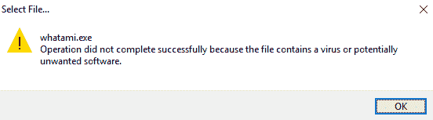

此错误是由 MS Windows 的病毒防护功能引起的。由于我们处于一个沙箱环境中（在虚拟化的客户环境下），禁用此功能应该是可以的。禁用此功能在生产环境中可能会暴露计算机被恶意软件攻击的风险。

要在 Windows 中禁用此功能，请选择“开始”->“设置”->“Windows 安全”->“病毒和威胁防护”->“病毒和威胁防护设置”。然后关闭实时保护。你还可以关闭云传递保护和自动样本提交，以防止任何安全设置阻止程序可能执行的操作。

以下截图显示了禁用实时保护后的状态：

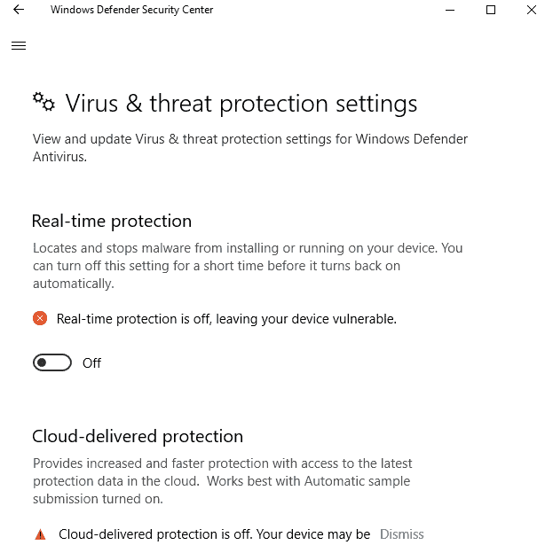

使用 CFF Explorer 打开文件可以揭示很多信息，包括文件被 UPX 打包的打包者信息：

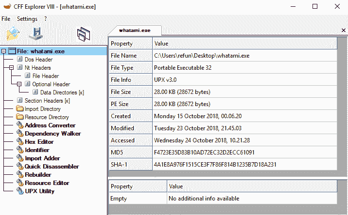

根据前面的结果，我们可以列出以下文件信息：

| 文件名 | `whatami.exe` |
| --- | --- |
| 文件大小 | 28,672 字节 |
| MD5 | F4723E35D83B10AD72EC32D2ECC61091 |
| SHA-1 | 4A1E8A976F1515CE3F7F86F814B1235B7D18A231 |
| 文件类型 | Win32 PE 文件 - 使用 UPX v3.0 打包 |

我们将需要下载 UPX 工具并尝试解压文件。UPX 工具可以从 [`upx.github.io/`](https://upx.github.io/) 下载。使用 UPX，使用 "`-d`" 选项解压文件，方法如下：

```
upx -d whatami.exe
```

解压文件后的结果，如下所示，告诉我们文件最初的大小为 73,728 字节：

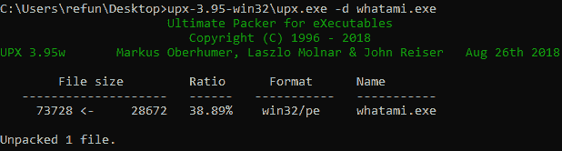

所以，如果我们重新打开文件在 CFF Explorer 中，我们的文件信息表将现在包含以下内容：

| 文件名 | whatami.exe |
| --- | --- |
| 文件大小 | 73,728 字节 |
| MD5 | 18F86337C492E834B1771CC57FB2175D |
| SHA-1 | C8601593E7DC27D97EFC29CBFF90612A265A248E |
| 文件类型 | Win32 PE 文件 - 由 Microsoft Visual C++ 8 编译 |

让我们看看使用 SysInternals 的 strings 工具可以找到哪些值得注意的字符串。Strings 是一个命令行工具，只需将文件名作为工具的参数传递，并将输出重定向到文件。以下是使用方法：

```
strings.exe whatami.exe > filestrings.txt
```

通过去除噪音字符串或与分析无关的文本，我们获得了以下内容：

```
!This program cannot be run in DOS mode.
Rich
.text
`.rdata
@.data
.rsrc
hey
how did you get here?
calc
ntdll.dll
NtUnmapViewOfSection
KERNEL32.DLL
MSVCR80.dll
USER32.dll
Sleep
FindResourceW
LoadResource
LockResource
SizeofResource
VirtualAlloc
FreeResource
IsDebuggerPresent
ExitProcess
CreateProcessA
GetThreadContext
ReadProcessMemory
GetModuleHandleA
GetProcAddress
VirtualAllocEx
WriteProcessMemory
SetThreadContext
ResumeThread
GetCurrentProcess
GetSystemTimeAsFileTime
GetCurrentProcessId
GetCurrentThreadId
GetTickCount
QueryPerformanceCounter
SetUnhandledExceptionFilter
TerminateProcess
GetStartupInfoW
UnhandledExceptionFilter
InterlockedCompareExchange
InterlockedExchange
_XcptFilter
exit
_wcmdln
_initterm
_initterm_e
_configthreadlocale
__setusermatherr
_adjust_fdiv
__p__commode
__p__fmode
_encode_pointer
__set_app_type
_crt_debugger_hook
?terminate@@YAXXZ
_unlock
__dllonexit
_lock
_onexit
_decode_pointer
_except_handler4_common
_invoke_watson
_controlfp_s
_exit
_cexit
_amsg_exit
??2@YAPAXI@Z
memset
__wgetmainargs
memcpy
UpdateWindow
ShowWindow
CreateWindowExW
RegisterClassExW
LoadStringW
MessageBoxA
WHATAMI
t<assembly  manifestVersion="1.0">
  <dependency>
    <dependentAssembly>
      <assemblyIdentity type="win32" name="Microsoft.VC80.CRT" version="8.0.50727.6195" processorArchitecture="x86" publicKeyToken="1fc8b3b9a1e18e3b"></assemblyIdentity>
    </dependentAssembly>
  </dependency>
</assembly>PAD
```

我们突出了多个文本字符串。因此，我们可能会期望通过使用`MessageBoxA`函数弹出多个消息。使用像`LoadResource`和`LockResource`这样的 API 时，我们也可能会遇到处理资源部分数据的代码。在看到像`CreateProcess`和`ResumeThread`这样的 API 后，可能会调用一个挂起的进程。使用`IsDebuggerPresent` API 时，也可能会遇到反调试技术。程序可能已经被编译成使用基于 GUI 的代码，通过`CreateWindowExW`和`RegisterClassExW`，但我们没有看到窗口消息循环函数：`GetMessage`、`TranslateMessage`和`DispatchMessage`。

这些都只是我们在进一步分析后可以更好理解的假设。现在，让我们尝试使用 IDA Pro 对该文件进行死列举。

# 死列举

在 IDA Pro 中打开`whatami.exe`后，自动分析识别出了`WinMain`函数。在接下来的截图中，我们可以看到将要执行的前三个 API 是`LoadStringW`、`RegisterClassExW`和`CreateWindowEx`：

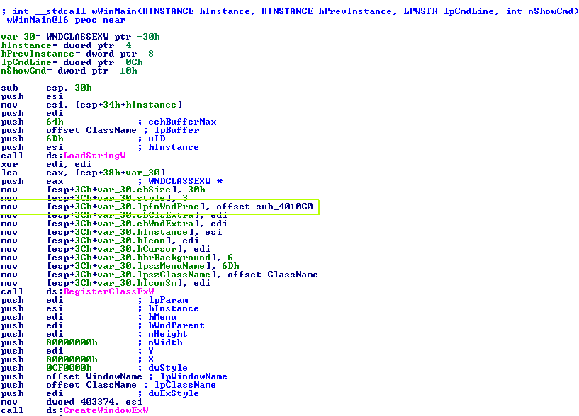

当执行`CreateWindowExW`时，窗口的属性来自`RegisterClassExW`设置的配置。`ClassName`，作为窗口的名称，是通过`LoadStringW`从文件的文本字符串资源中获取的。然而，我们在这里关心的只是`lpfnWindProc`指向的代码。当执行`CreateWindowExW`时，`lpfnWndProc`参数指向的代码将被执行。

在继续之前，先看看`sub_4010C0`。我们来看看`CreateWindowExW`之后的代码：

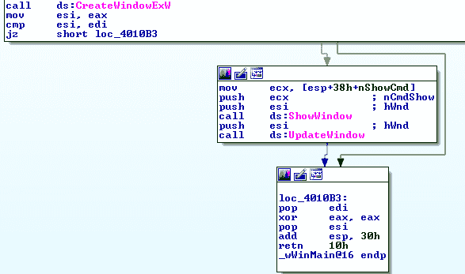

上面的截图显示，在`CreateWindowExW`之后，`ShowWindow`和`UpdateWindow`是可能被执行的唯一 API。然而，确实没有预期中的窗口消息 API 来处理窗口活动。这使得我们假设程序的意图只是运行`lpfnWndProc`参数指向的地址处的代码。

双击`dword_4010C0`，即`lpfnWndProc`的地址，将显示一组 IDA Pro 尚未正确分析的字节。由于我们确定这个区域应该是代码，因此我们需要告诉 IDA Pro 它是代码。通过在地址`0x004010C0`按下`'c'`，IDA Pro 将开始将字节转换为可读的汇编语言代码。当 IDA Pro 询问我们是否将其转换为代码时，选择`是`：

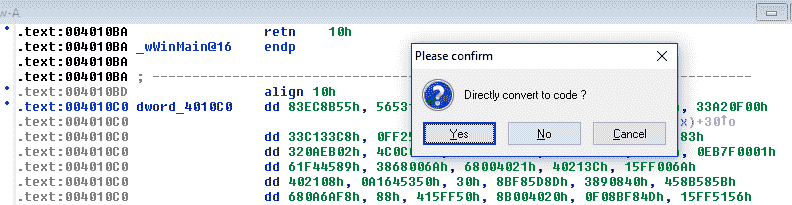

向下滚动，我们将在`0x004011a0`处遇到另一个无法识别的代码。只需执行相同的步骤：

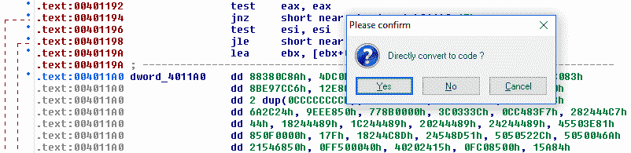

再往下滚动会看到一些无法再转换的数据。这应该是代码的最后一部分。让我们告诉 IDA Pro 将这段代码处理为一个函数。操作方法是高亮选中从`0x004010C0`到`0x004011C0`的行，右键点击高亮部分，然后选择“`创建函数...`”将这段代码变成一个函数。

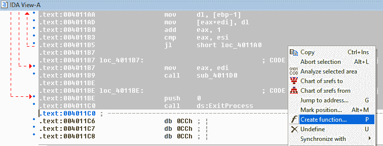

将代码转化为函数可以帮助我们的死链表查看代码的图形视图。为此，右键点击并选择图形视图。下图显示了该函数的第一组代码。我们关心的是`rdtsc`和`cpuid`指令的使用方式：

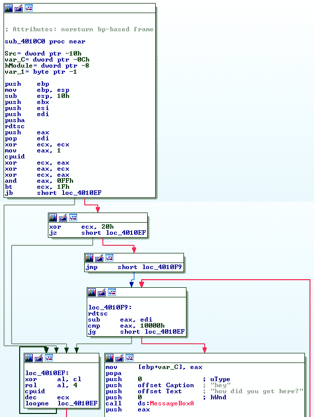

在*第十一章，与 POC 恶意软件的识别*中，在反调试技巧下，我们讨论了`rdtsc`被用作时间计算技巧。差异是在第二次`rdtsc`后计算的。在以下代码中，预期的持续时间应该小于或等于`0x10000`，即`65,536`个周期。如果我们能通过这个时间技巧，就会弹出一个消息框。

第 1 个叶子（设置在寄存器`eax`中）被传递给第一次执行`cpuid`指令。再次在*第十一章*中，`cpuid`可以用于反虚拟机技巧。结果被放置在寄存器 eax 中。接着是三条`xor`指令，最终交换`eax`和`ecx`寄存器的值。

```
xor ecx, eax
xor eax, ecx
xor ecx, eax
```

`bt`指令将第 31 位（`0x1F`）移动到`进位`标志。如果第 31 位被设置，则意味着我们正在一个超级管理程序环境中运行。在后续的调试过程中，我们需要注意这一行。我们希望使结果中第 31 位被设置为`0`。

这之后可能会紧接着用`xor ecx, 20h`检查第 5 位。如果第 5 位被设置，意味着 VMX（虚拟机扩展）指令可用。如果 VMX 指令可用，则意味着系统能够运行虚拟化。通常，VMX 仅在主机虚拟机上可用，程序可以假设它正在物理机上运行。对于位运算，如果`ecx`的第 5 位被设置，`xor 20h`应该使其归零。但如果`ecx`寄存器的其他位被设置，`ecx`寄存器的值就不会是零。我们在调试过程中也要特别注意这一点。

这里展示了两种主要的技巧——一个是时间技巧，另一个是反虚拟机技巧。总体而言，如果我们推测我们分析的内容，程序可以走两个方向：一个是`loc_4010EF`处的循环，它没有意义，另一个是`MessageBoxA`代码。

如果我们仔细看，会发现整个反调试和反虚拟机技巧都被`pusha`和`popa`指令包围。实际上，我们可以跳过整个技巧代码，直接跳到`MessageBoxA`代码，正如下面的截图所示：

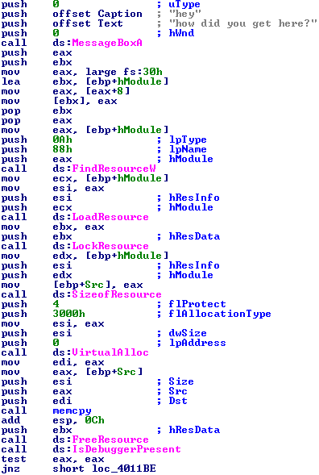

`MessageBoxA`代码后面是读取`RCDATA`（`0x0A`）资源类型，且该资源的序号名称为`0x88`（`136`）的函数。使用 CFF Explorer，点击 Resource Editor 并展开 `RCData`。我们应该能够看到正在读取的数据，如下截图所示：

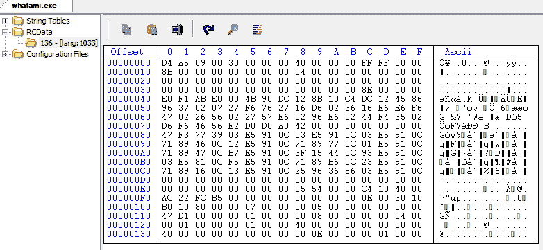

数据通过 `memcpy` 被复制到使用 `VirtualAlloc` 分配的内存空间中。分配的大小是 RCData 属性中指示的大小。可以通过在 CFF Explorer 中展开 Resource Directory 中的 `RCData` 来查看大小。复制的数据地址被存储在 `edi` 寄存器中。

我们还看到 `IsDebuggerPresent` 被使用了，这是另一种反调试技巧。跟随绿色线条最终会到达 `ExitProcess`。

以下截图是红线的去向：

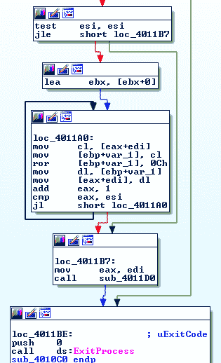

`loc_4011A0` 处的循环似乎在解密数据。记住，数据的地址保存在寄存器 edi 中。解密算法使用 `ror` `0x0c`（向右旋转 12 位）。解密后，数据地址被存储到寄存器 `eax` 中，然后调用 `sub_4011D0` 函数。

了解解密数据的位置和大小后，我们应该能够在调试过程中创建一个内存转储。

在 `sub_4011D0` 内部，存储在 eax 中的地址被转移到 esi 寄存器，随后转移到 edi 寄存器。然后我们看到一个调用 `CreateProcessA` 的函数来运行“calc”：

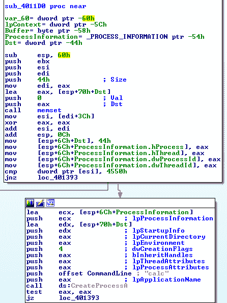

名为“`calc`”的进程实际上是 Windows 默认的计算器应用程序。`CreateProcessA`的第六个参数`dwCreationFlags`在这里是我们关注的重点。值为 4 表示 CREATE_SUSPENDED。计算器以挂起模式作为进程运行，这意味着它并未执行，而是仅仅在计算器自己的进程空间中加载。

如果我们要为 `sub_4011D0` 创建一个包含 API 函数顺序的框图，可能会得到如下图所示的结果。

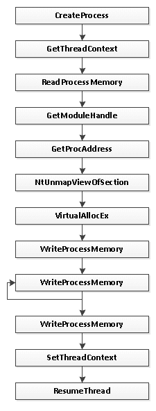

这些 API 的顺序展示了一种名为进程空洞（process hollowing）的行为。进程空洞是一种常被恶意软件使用的技术，通过将其代码隐藏在合法进程下方来掩盖其存在。这项技术会创建一个处于挂起状态的进程，然后卸载其内存并用另一个进程映像替换它。在这个案例中，合法进程是计算器（Calculator）。

`NtUnmapViewOfSection` API 是一个从给定进程空间中卸载或移除 PE 映像布局的函数。这个 API 来自于 `NTDLL.DLL` 库文件。与使用 `LoadLibrary` 不同，这里使用了 `GetModuleHandle`。`LoadLibrary` 用于加载尚未加载的库，而 `GetModuleHandle` 用于检索已加载库的句柄。在这种情况下，程序假设 `NTDLL.DLL` 已经被加载。

以下截图展示了获取`NtUnmapViewOfSection`函数地址的反汇编代码：

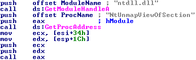

资源部分的 RCData 解密数据会传递给 sub_4011D0。每次调用`WriteProcessMemory`都会从解密数据中读取数据块。鉴于此，我们预期解密数据应该是一个 `Win32` PE 文件的内容。

总结一下，代码最初会创建一个窗口。然而，已注册的窗口属性几乎为空，只有回调函数 `Wndproc`。`Wndproc` 回调是窗口创建时最初执行的代码。因此，使用 `RegisterClassEx` 和 `CreateWindow` API 创建窗口实际上只是用来传递代码执行。换句话说，整个窗口创建过程只是 `jmp` 指令的简单等效。

这是另一张概述 Wndproc 回调中代码流的图示：

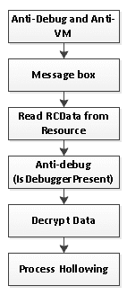

在 `Wndproc` 代码的第一部分，我们遇到了反调试（通过 `rdtsc` 做时间技巧）和反虚拟机（`cpuid` 位 31 和 5）技巧。一旦我们通过这些，弹出了一个消息框。资源中的 RCData 数据被复制到一个分配的内存中。我们又遇到了一个使用 `IsDebuggerPresent` API 的反调试技巧。数据被解密并传递给一个使用计算器的进程劫持代码。

我们接下来的分析目标是通过进程劫持执行的解密镜像。我们将直接开始调试。

# 调试

我们将使用 `x86dbg` 进行调试会话。记住，我们已经使用 UPX 解压了文件。最好打开解压后的版本，而不是原始的 whatami.exe 文件。打开压缩的文件也是可以的，但我们将需要调试 UPX 打包的代码。

与 IDA Pro 不同，`x86dbg` 无法识别 `WinMain` 函数，也就是程序的实际起始点。此外，打开文件后，指令指针可能还会处于 `NTDLL` 内存空间。为了避免在启动时进入 `NTDLL` 区域，我们可能需要在 `x86dbg` 中进行一些简单的配置更改。

选择“选项”->“首选项”。在“事件”标签下，取消勾选“系统断点”和“TLS 回调”。点击保存按钮，然后选择“调试”->“重启”。这应该将我们带到 `whatami.exe` 的入口点，地址为：`0x004016B8`。

既然我们已经通过 IDA Pro 知道了 `WinMain` 的地址，我们可以直接在该地址设置断点。WinMain 地址是 `0x00401000`。按下 CTRL+G，然后输入 `0x00401000`，再按 `F2` 设置断点，最后按 `F9` 运行程序。

这是此时我们应该达到的位置的截图：

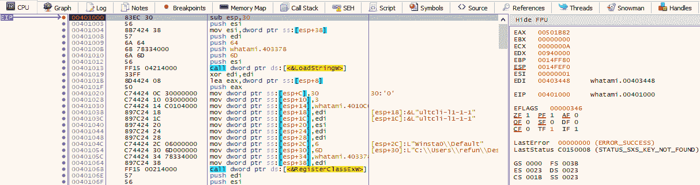

在静态分析中，我们观察到使用了`RegisterClassExW`和`CreateWindowExW`来设置 WndProc 作为窗口处理程序，其中包含更多有趣的代码。请在 WndProc 地址`0x004010c0`处设置断点，然后按 F9 键。这将带我们进入如下截图，其中包含反调试和反虚拟机代码：

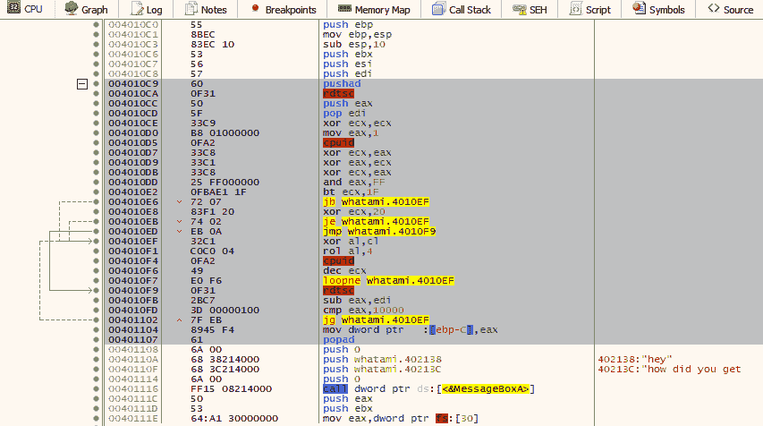

我们在这里突出了反调试和反虚拟机代码。代码从`pushad`指令开始，到`popad`指令结束。我们可以做的是跳过这些反调试和反虚拟机代码。按 F7 或 F8，直到我们到达地址`0x004010C9`。选择`0x00401108`这一行（即`popad`之后的行），然后右键单击它以弹出上下文菜单。选择“Set New Origin Here”。这样，指令指针（寄存器 EIP）就会定位到这个地址。

现在我们应该到达了使用`MessageBoxA`函数显示以下消息的代码。继续按`F8`，直到出现以下消息：

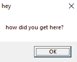

你需要点击“确定”按钮才能继续调试。接下来的代码将从资源部分获取`RCData`。继续按`F8`，直到我们到达`0x0040117D`这一行，调用`memcpy`。仔细观察传递给`memcpy`的三个参数，寄存器 edi 应包含要复制数据的源地址，寄存器`eax`应包含目标地址，而寄存器`esi`应包含要复制的数据大小。为了查看目标将包含的内存内容，在右侧窗格中选择`EDI`的值，然后右键单击它以显示上下文菜单。选择“Follow in Dump”。现在我们应该能够查看 Dump 1 的内存空间，如下图所示：

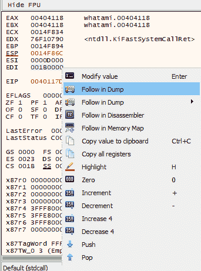

按`F8`键继续执行`memcpy`。以下截图显示了当前的位置：

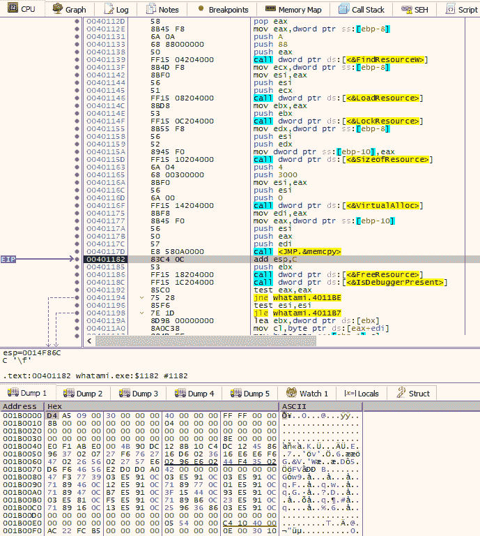

继续按`F8`键，直到我们到达调用`IsDebuggerPresent`之后的行（`0x00401192`）。寄存器`EAX`应该被设置为`1`，表示“`True`”值。我们需要将其改为“`False`”，即零值。为此，双击寄存器`EAX`的值，然后将 1 改为 0。这样，代码就不会直接跳到`ExitProcess`调用。

接下来的代码将是解密例程。左侧窗格中的箭头显示了一个`loopback`代码。该算法使用`ror`指令。继续按`F8`键，同时观察 Dump 1。我们可以逐渐看到数据被解密，从一个`MZ`头开始。你可以在地址`0x004011B7`处设置断点，解密代码结束并完全解密的数据将显示如下：

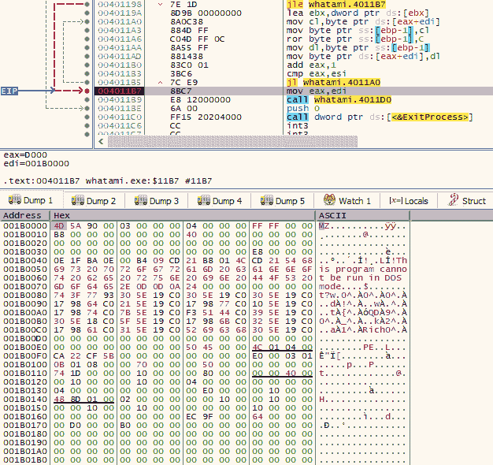

解密的数据是一个大小为`0x0D000`（53,248 字节）的`Win32` PE 文件。我们可以在这里做的是将此解密的内存转储到文件中。要执行此操作，请单击内存映射选项卡或选择视图->内存映射。这显示了进程内存空间，其中包含内存部分的地址和其相应大小。在我们的情况下，解密数据的内存地址是`0x001B000`。这个地址可能因分析而异。选择大小为`0x00D000`的解密数据的内存地址，右键单击以显示上下文菜单，然后选择转储内存到文件。请参考以下示例：

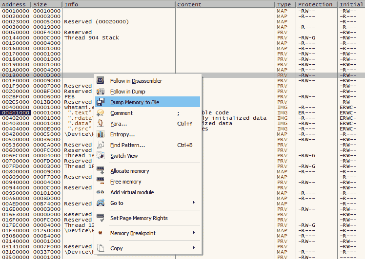

保存文件并使用 CFF Explorer 打开它。这为我们提供了以下文件信息：

| 文件大小 | 53,248 字节 |
| --- | --- |
| MD5 | DD073CBC4BE74CF1BD0379BA468AE950 |
| SHA-1 | 90068FF0C1C1D0A5D0AF2B3CC2430A77EF1B7FC4 |
| 文件类型 | Win32 PE 文件 - 由 Microsoft Visual C++ 8 编译 |

此外，查看导入目录显示了四个库模块：`KERNEL32`、`ADVAPI32`、`WS2_32`和`URLMON`。以下 CFF Explorer 截图显示从`ADVAPI32`导入了注册表和密码学 API：

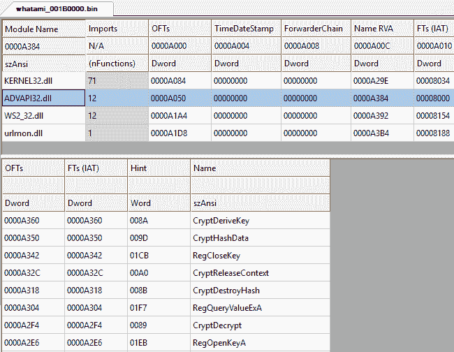

存在`WS2_32`表示程序可能使用网络套接字函数。从`URLMON`导入的单个 API 是`URLDownloadToFile`。我们预计会下载一个文件。

回到我们的调试会话，还剩下两个调用指令。其中一个选择是调用`ExitProcess`，它将终止当前运行的进程。另一个是调用地址`0x004011D0`。使用`F7`进行调试步骤，使调试器进入调用指令。这是执行进程空心化例程的函数。下面的截图是我们在输入`0x004011D0`后应该所处的位置：

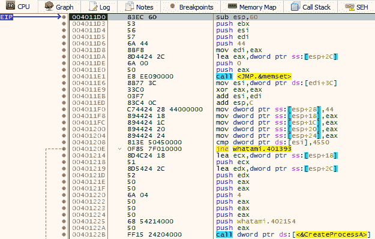

持续按`F8`，直到调用`CreateProcessA`之后。打开 Windows 任务管理器，查看进程列表。您应该看到`calc.exe`处于挂起状态，如下所示：

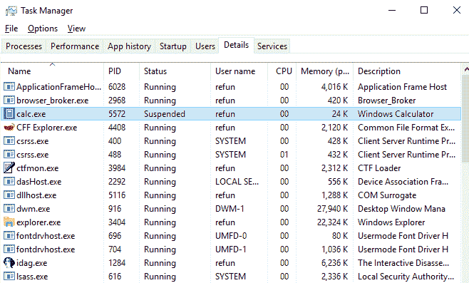

持续按 F8，直到我们到达调用`ResumeThread`（`0x0040138C`）的行。发生的是未知 PE 文件刚刚替换了计算器进程的映像。如果我们回顾一下`sub_4011D0`的块图，我们目前处于该程序的进程空心化行为中。虽然计算器处于挂起模式，但尚未执行任何代码。因此，在`ResumeThread`行上按下 F8 之前，我们将需要附加挂起的计算器，并在其 WinMain 地址或入口点处设置断点。为此，我们将需要打开另一个`x86dbg`调试器，然后选择文件->附加，并查找 calc。如果您看不到它，您将需要通过选择文件->重新启动以管理员身份运行。

让我们使用 IDA Pro 来帮助我们确定`WinMain`的地址。打开 IDA Pro 中的转储内存，并在自动分析后，我们将定位到`WinMain`函数。切换到文本视图，并记录下`WinMain`的地址，如下图所示：

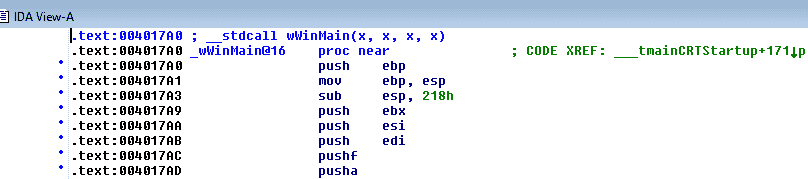

在`x86dbg`中，将断点设置在`0x004017A0`，如以下截图所示：

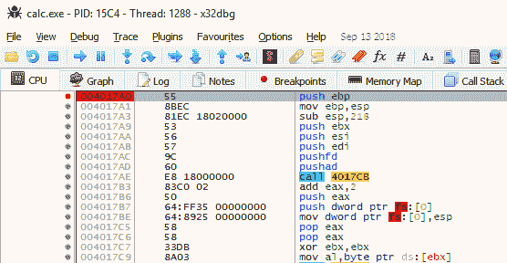

现在我们准备在`ResumeThread`这一行按`F8`键。但在此之前，最好还是创建一个正在运行的虚拟机快照，以防万一出现问题：

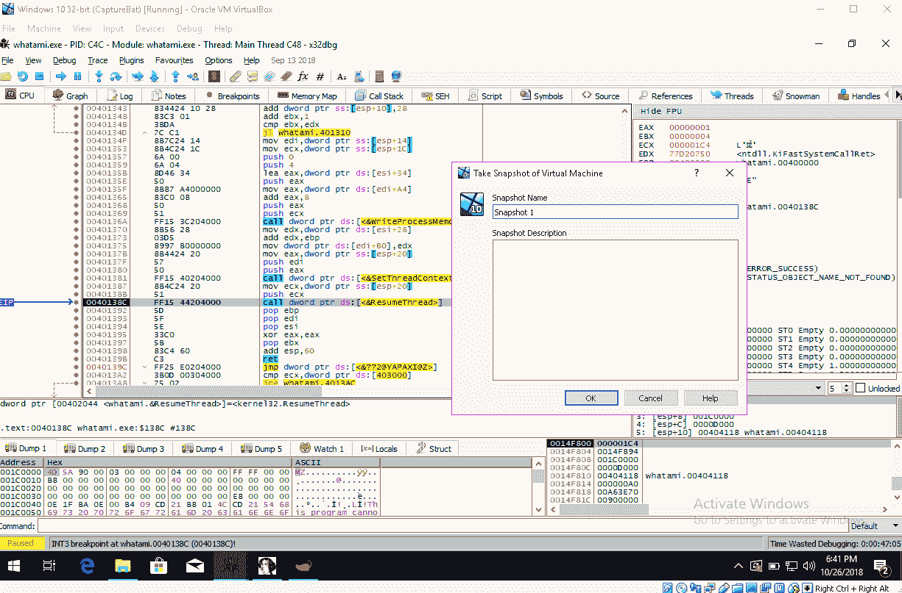

到此为止，`whatami.exe`要执行的唯一 API 是`ExitProcess`。这意味着我们可以按`F9`让该进程结束。

在调用`ResumeThread`后，`calc`进程将被恢复并开始运行。但是由于未知的镜像处于调试器暂停状态，我们观察到`calc`镜像仍停留在附加的断点指令指针处。

# 未知镜像

此时，我们已经在 IDA Pro 中打开了内存转储，并且相同的未知镜像已映射到计算器进程中。我们将使用 IDA Pro 查看反汇编代码，并使用`x86dbg`进行调试。

在`x86dbg`中，我们已经在未知镜像的`WinMain`地址处设置了断点。然而，指令指针仍然停留在`NTDLL`地址处。按`F9`让其继续，直到我们到达`WinMain`。

详细查看`WinMain`的反汇编代码时，我们会注意到这里有一个 SEH 反调试机制：

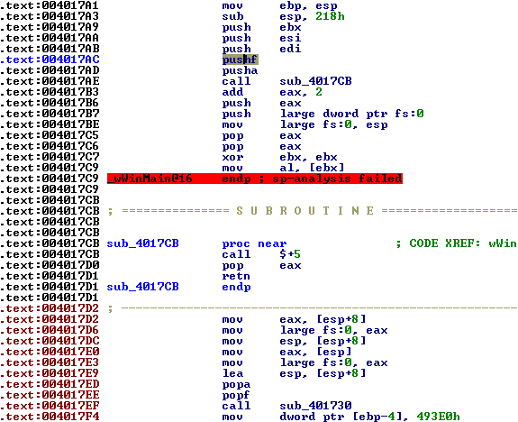

`call sub_4017CB`跳转到一个子程序，里面有`call $+5`、`pop eax`和`retn`指令。`call $+5`调用下一行。记住，当执行`call`时，栈顶会包含返回地址。`call sub_4017CB`会将返回地址`0x004017B3`存储到栈顶。接着，`call $+5`会将`0x004017D0`存储到栈顶。由于`pop eax`，`0x004017D0`被放入 eax 寄存器。`ret`指令会返回到`0x004017AD`地址。随后，地址中存储的值加 2，结果是`eax`中的地址指向`0x004017D2`。这一定是正在设置的 SEH 处理程序地址。

我们可以通过 SEH，或者简单地在调试会话中跳过它。跳过它也非常简单，因为我们可以识别`pushf/pusha`和`popa/popf`指令，并执行与在`whatami.exe`进程中相同的操作。

通过 SEH 的过程应该也很简单。我们可以在处理程序地址`0x004017D2`处设置断点，并按`F9`直到到达处理程序。

我们可以选择其中的任何一个选项。在做出这样的决策时，最好先拍个虚拟机的快照。如果出现问题，我们可以通过恢复虚拟机快照来尝试两个选项。

我们的下一站是`sub_401730`。以下截图显示了`sub_401730`中的代码：


通过调试这段代码，可以发现使用了`LoadLibraryA`和`GetProcAddress`来获取`MessageBoxA`的地址。之后，它只是显示了一个消息。

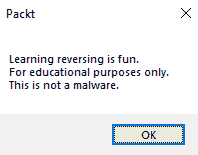

下一行代码是一个反自动化分析的技巧。我们可以看到，两个`GetTickCount`的结果差值正在与值`0x0493e0`或`300000`进行比较。在`GetTickCount`的调用之间，还调用了一个 Sleep 函数。

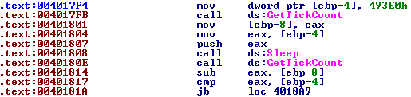

一个 300000 的 Sleep 意味着 5 分钟。通常，自动化分析系统会将较长的 Sleep 时间改为非常短的时间。前面的代码希望确保 5 分钟的时间确实已经过去。作为调试这段代码的分析员，我们可以通过将指令指针设置在`jb`指令之后，简单地跳过这个技巧。

接下来是调用`sub_401500`，并传递两个参数："`mcdo.thecyberdung.net`"和`0x270F`（`9999`）。这个例程包含了套接字 API。像之前一样，让我们列出我们将遇到的 API 序列。

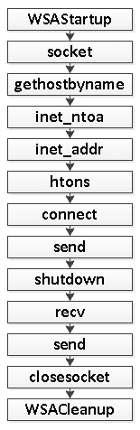

对于网络套接字行为，我们需要关注的是`gethostbyname`、`htons`、`send`和`recv`的参数和结果。同样，在继续之前，建议此时先拍摄一个虚拟机快照。

继续逐步调试，直到我们到达`gethostbyname`的调用。我们可以通过查看`gethostbyname`的参数来获取程序连接的服务器。而这个服务器就是"`mcdo.thecyberdung.net`"。继续调用后，我们可能会遇到`gethostbyname`的结果问题。寄存器 EAX 中的结果是零。这意味着`gethostbyname`失败了，因为它未能将"`mcdo.thecyberdung.net`"解析为一个 IP 地址。我们需要做的是设置`FakeNet`来模拟互联网。恢复虚拟机快照，以便回到执行`WSAStartup`之前的状态。

在运行`FakeNet`之前，通过从 VirtualBox 菜单中选择“机器->设置->网络”来断开电缆。展开“高级”菜单并取消选中“Cable connected”。我们进行这个操作是为了确保在`FakeNet`重新配置网络时不会发生干扰。

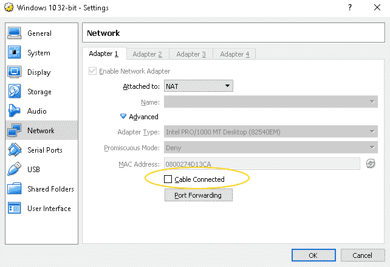

以下截图显示了`FakeNet`成功运行。`FakeNet`可能需要以管理员权限运行。如果发生这种情况，只需以管理员身份运行它：

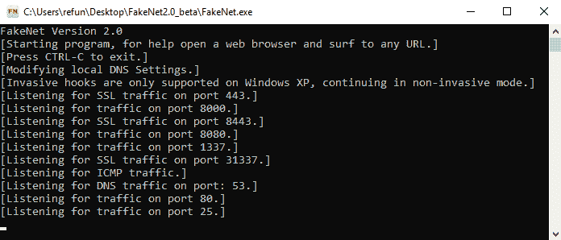

通过勾选虚拟机网络设置中的“Cable Connected”复选框来恢复电缆连接。为了验证一切正常，打开 Internet Explorer 并访问任何网站。结果页面应类似于以下截图：

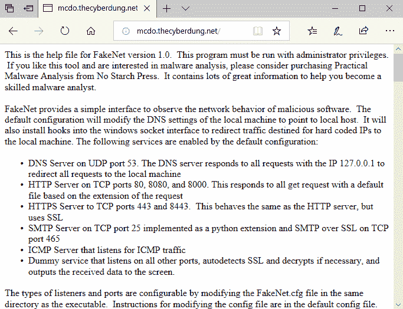

现在，我们可以回到`gethostbyname`地址继续调试。此时，我们应该能在寄存器`EAX`中获得一个结果，同时`FakeNet`正在运行。

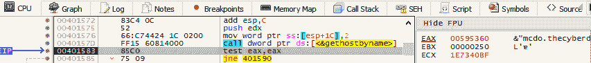

我们接下来要关注的 API 是`htons`。它将为我们提供程序将要连接的服务器的网络端口信息。传递给`htons`的参数存储在寄存器`ECX`中。这就是将使用的端口号，`0x270F`或 9999。

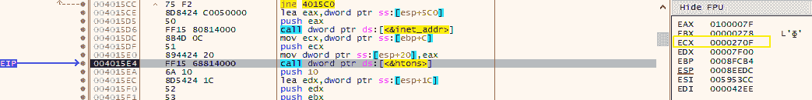

继续调试，我们遇到`connect`函数，实际的连接到服务器和指定端口在此开始。如果连接成功，`connect`函数会返回零给寄存器`EAX`。在我们的情况下，这里返回的是`-1`，说明连接失败。

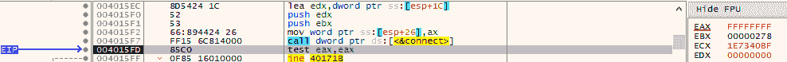

这样做的原因是，FakeNet 只支持常用且已知的恶意软件端口。幸运的是，我们可以编辑 FakeNet 的配置文件并将端口 9999 添加到列表中。FakeNet 的配置文件`FakeNet.cfg`位于与 FakeNet 可执行文件相同的目录中。但是在更新此文件之前，我们需要先恢复到`WSAStartup`调用之前的快照。

使用记事本编辑`FakeNet.cfg`文件。寻找包含“`RawListner`”的那一行。如果没有找到，就将以下几行添加到配置文件中。

```
RawListener Port:9999 UseSSL:No
```

当这行被添加时，配置文件应该如下所示：

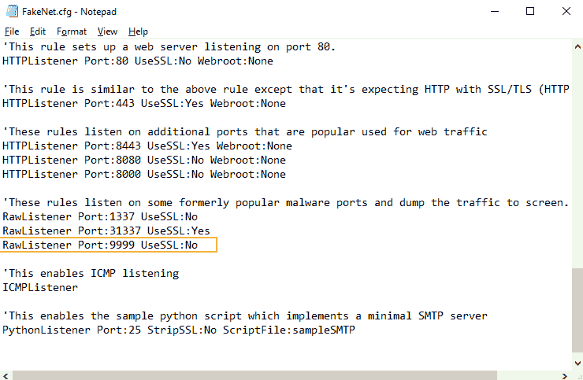

注意我们添加的`RawListener`行。添加之后，重新启动`FakeNet`，然后再次调试，直到我们到达`connect` API。这次我们希望`connect`函数能成功执行。

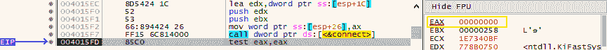

继续调试，直到我们到达`send`函数。`send`函数的第二个参数（看栈顶第二项）指向要发送的数据的地址。按下`F8`继续发送数据，并查看`FakeNet`的命令控制台。

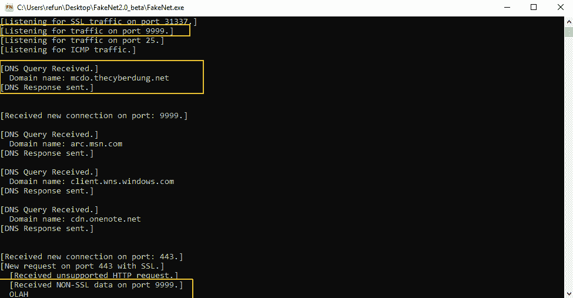

我们已经标出了这个程序与`FakeNet`之间的通信。请记住，`FakeNet`在这里是远程服务器的模拟。发送的数据是“`OLAH`”。

继续调试，直到我们再次遇到`send`或`recv`函数。下一个函数是`recv`。

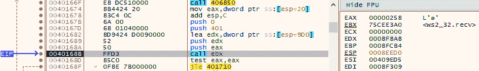

第二个参数是从服务器接收数据的缓冲区。显然，我们不指望`FakeNet`返回任何数据。我们可以做的是监控随后处理这个`recv`缓冲区数据的代码。但是为了让`recv`调用成功，返回值应该是一个非零值。我们必须在执行`recv`调用后修改寄存器 EAX 的值，就像下面的截图所示：

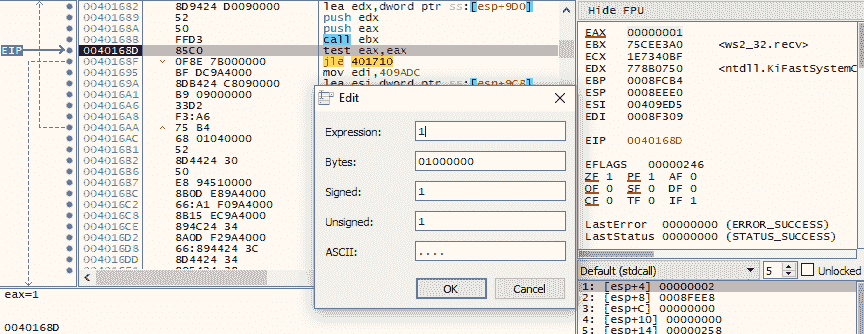

接下来的代码行将接收到的数据与一个字符串进行比较。请参见下面的反汇编代码，使用`repe cmpsb`指令进行字符串比较。该指令比较寄存器`ESI`和`EDI`指向的地址中的文本字符串。要比较的字节数存储在寄存器`ECX`中。假定接收到的数据位于寄存器`ESI`指向的地址。而字符串“`jollibee`”的地址则存储在寄存器`EDI`中。我们希望发生的情况是使两个字符串相等。

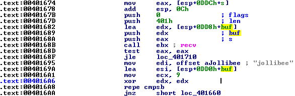

为了在调试会话中实现这一点，我们需要编辑接收到的数据地址上的字节，并将其设置为正在比较的 9 字符字符串。右键点击寄存器 ESI 的值，弹出上下文菜单，选择“Follow in Dump”。在 Dump 窗口中数据的第一个字节，右键点击并选择“Binary->Edit”。

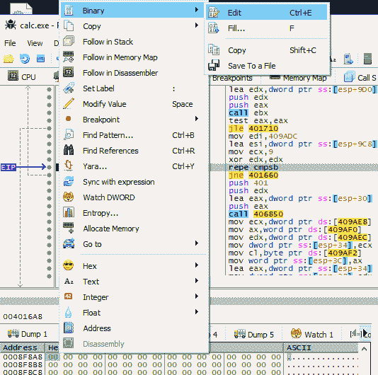

这会弹出一个对话框（如下所示），在其中我们可以输入字符串“jollibee”：

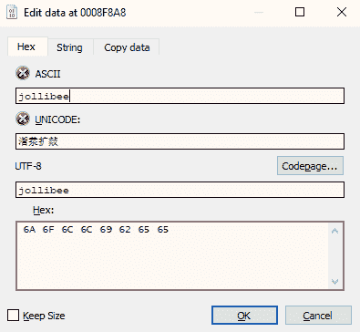

按 F8 继续比较。这**不应**跳转到条件跳转指向的地址。继续调试直到我们到达另一个发送函数。再次查看要发送的数据，这是第二个参数指向的地址。然而，无论这是否成功，结果不会被处理。接下来的 API 通过`closesocket`和 WSACleanup 函数关闭连接，设置`EAX`为`1`，并从当前函数返回。`EAX`只会在最后一个发送函数之后被设置为`1`。

我们在下面的反汇编代码中突出显示了`var_DBD`，以查看在数据发送回服务器后，值`1`已被存储。

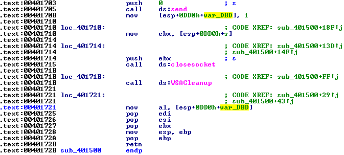

返回到`WinMain`函数后，最好进行一次虚拟机快照。

继续调试直到我们到达调用地址`0x00401280`。将有两个参数传递给该函数，值存储在`EAX`和`ECX`寄存器中。数据在`Dump 1`下被转储，如下所示：

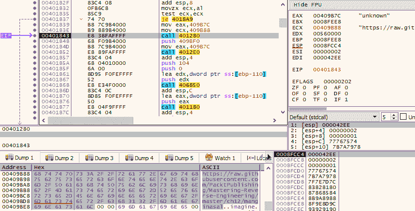

输入函数`0x00401280`后，我们将只遇到一个 URLDownloadToFile 函数。该函数下载`https://raw.githubusercontent.com/PacktPublishing/Mastering-Reverse-Engineering/master/ch12/manginasal`并将其存储到名为`unknown`的文件中，如下截图所示：

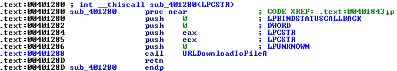

这样做后，我们会遇到一个错误，无法下载文件。原因是我们仍处于模拟的互联网环境中。这一次，我们需要连接到真实的互联网。我们必须回到`URLDownloadToFile`函数之前的快照。

在 FakeNet 控制台中，按下*CTRL + C*退出工具。为了测试是否能够连接到互联网，请从互联网浏览器访问[`testmyids.com`](http://testmyids.com)。结果应该与以下截图类似：

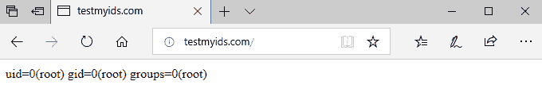

如果无法访问互联网，请检查 VirtualBox 的网络配置和 Windows 的网络设置。

网络连接正常后，程序应该能够成功下载文件。该文件的文件名为`unknown`。如果我们在 CFF Explorer 中加载此文件，我们将看到这些文件属性：

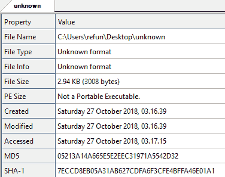

以下截图展示了通过选择 CFF Explorer 的 Hex Editor 查看文件内容：

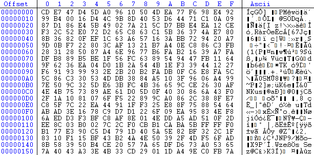

该文件似乎是加密的。我们预计接下来的行为会处理这个文件。继续调试，直到我们到达地址`0x004012e0`。这个函数接受两个参数，一个是存储在`EAX`寄存器中的地址，另一个是压入栈中的地址。该函数从栈顶接收这些`imagine`参数字符串，以及从寄存器`EAX`接收`unknown`。

进入函数后发现正在读取文件"unknown"的内容。读取该文件到新分配的内存空间的反汇编代码如下：

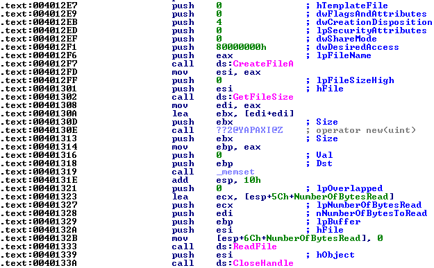

持续按`F8`直到`CloseHandle`调用之后。接下来的代码展示了`Cryptographic` API 的使用。我们在这里再次列出这些 API 的顺序：

```
.text:0040137A call ds:CryptAcquireContextA
.text:0040139B call ds:CryptCreateHash
.text:004013C8 call ds:CryptHashData
.text:004013EC call ds:CryptDeriveKey
.text:004013FF call sub_401290
.text:0040147B call ds:CryptDecrypt
.text:0040149D call ds:CreateFileA
.text:004014AF call ds:WriteFile
.text:004014B6 call ds:CloseHandle
.text:004014BE call ds:Sleep
.text:004014D9 call ds:CryptDestroyKey
.text:004014E4 call ds:CryptDestroyHash
.text:004014F1 call ds:CryptReleaseContext
```

根据列表，似乎所有解密的内容都会存储在文件中。我们想要了解的有以下几点：

+   使用的加密算法

+   使用的加密密钥

+   存储数据的文件名称

要识别所使用的算法，我们应该监视`CryptAcquireContextA`函数中的参数。继续调试直到`CryptAcquireContextA`。第四个参数`dwProvType`应该告诉我们使用了哪种算法。`dwProvType`的值为`0x18`或 24。关于提供者类型值的列表，我们可以参考[`docs.microsoft.com/en-us/dotnet/api/system.security.permissions.keycontainerpermissionattribute.providertype`](https://docs.microsoft.com/en-us/dotnet/api/system.security.permissions.keycontainerpermissionattribute.providertype)。在这种情况下，24 定义为`PROV_RSA_AES`的值。因此，这里的加密算法使用的是`RSA AES`。

该算法使用的加密密钥应该是`CryptHashData`函数的第三个参数。请查看以下截图中的`CryptHashData`函数的第二个参数：

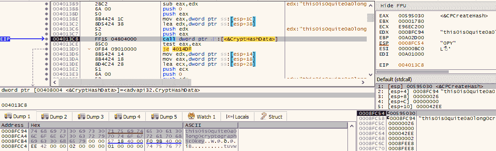

密钥是`this0is0quite0a0long0cryptographic0key`。

对于最后一条信息，我们需要监控`CreateFileA`，以获取解密数据可能被放置的文件名。在调试到`CreateFileA`时，我们应该看到第一个参数是输出文件名，"`imagine`"。`CryptDecrypt`函数接受加密数据的位置（第五个参数），并在同一位置进行解密。该过程以循环的形式运行，每一片解密后的数据都会附加到"imagine"文件中。

以下截图，IDA Pro 图形视图，显示了解密后的数据被附加到输出文件：

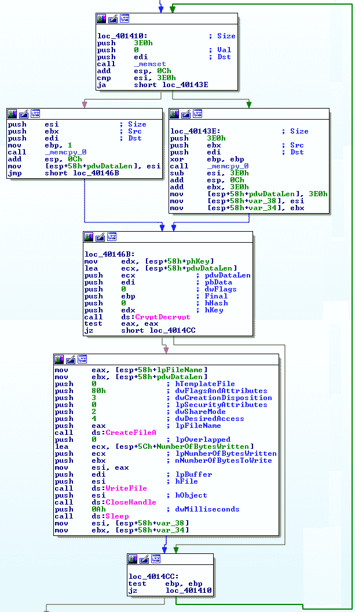

解密过程通过使用`CryptDestroyKey`、`CryptDestroyHash`和`CryptReleaseContext`来关闭加密句柄。

好奇吗？让我们使用 CFF Explorer 从"`imagine`"文件中提取信息：

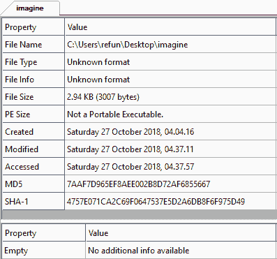

使用 TrID 工具，我们获得了更有意义的文件类型，如下图所示：

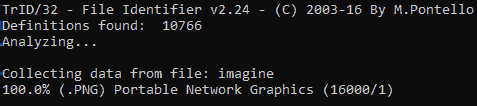

该文件是一个`PNG`图像文件。

继续调试会话，持续按`F8`直到到达`0x00401180`地址的调用。按`F7`进入此函数。这揭示了此序列中注册表 API 的使用：

```
.text:004011BF call ds:RegOpenKeyExA
.text:004011E6 call esi ; RegQueryValueExA
.text:004011F3 call edi ; RegCloseKey
.text:00401249 call ds:RegOpenKeyA
.text:0040126A call esi ; RegQueryValueExA
.text:00401271 call edi ; RegCloseKey
```

基本上，注册表函数仅用于检索注册表中存在的某些值。下面显示的反汇编代码表明，第一个查询从`HKEY_CURRENT_USER\Software\Microsoft\Windows\Shell\Associations\UrlAssociations\http\UserChoice`注册表项中检索`ProgId`的数据值：

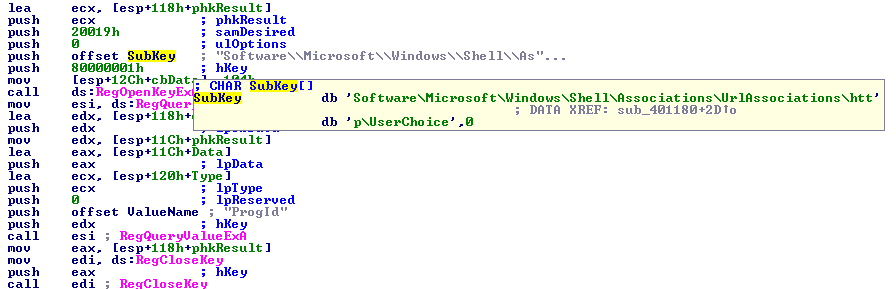

如果我们查看注册表，这个位置指向当前登录用户使用的默认互联网浏览器的 ID。以下截图显示了`Progid`中设置的默认互联网浏览器 ID 的示例，`FirefoxURL-308046B0AF4A39CB`：

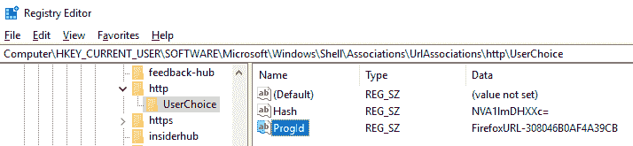

对于下一个注册表查询，`RegOpenKeyExA`打开`HKEY_CLASSES_ROOT\FirefoxURL-308046B0AF4A39CB\shell\open\command`注册表项，其中`FirefoxURL-308046B0AF4A39CB`是默认互联网浏览器的 ID：

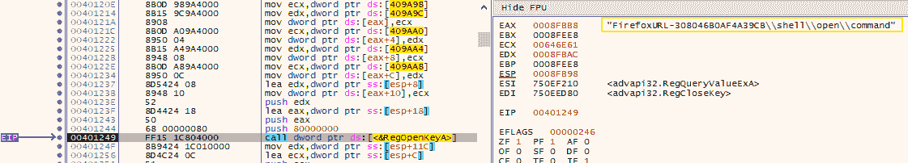

随后的`RegQueryValueExA`有第二个参数`lpValuename`等于`zero`。请参考以下反汇编：

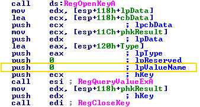

如果`lpValuename`等于`0`，则获取的数据将来自默认值。

查看注册表时，显示为（默认值），如下面所示：

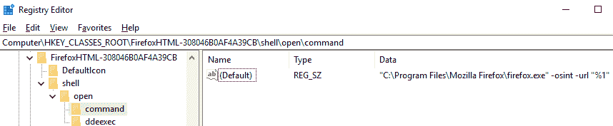

因此，该函数执行的操作是获取默认互联网浏览器的命令行。

以下代码行解析了"`imagine`"文件的完整文件路径，然后将路径传递给最终函数`sub_401000`，然后退出进程：

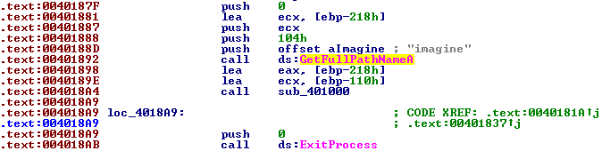

在调试 `sub_401000` 时，我们遇到了一百多行代码，基本上是在移动测试字符串。但最终的`bottomline`是，它将使用 `CreateProcessA` 运行另一个进程。查看将传递给 `CreateProcess` 的参数时，第二个参数是命令行，它将执行的命令包含了默认浏览器的路径，并将 "imagine" 文件的完整路径作为参数。从以下截图可以看到，我们在 Dump 1 中转储了命令行：

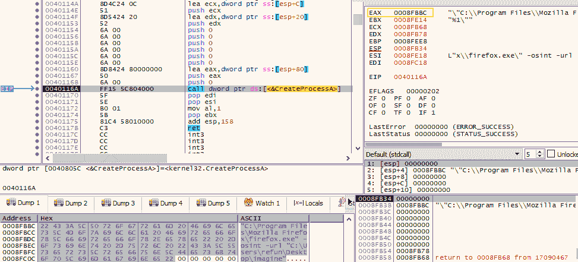

结果是，使用默认的互联网浏览器打开 "imagine" 文件。显示以下截图：

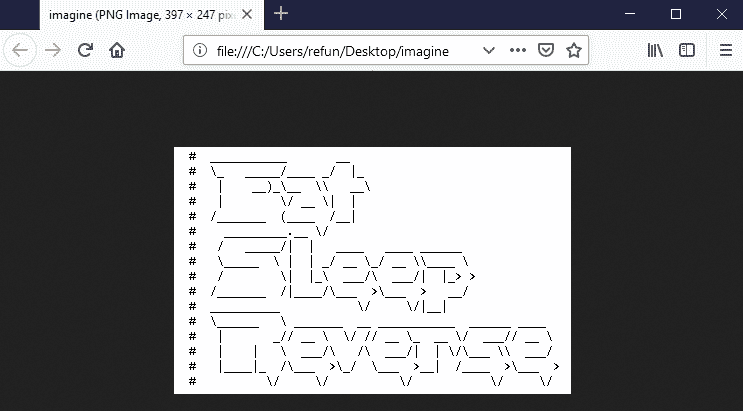

# 分析总结

以下表格涉及我们发现的文件元素。

原始文件是一个 UPX 压缩的 Win32 可执行文件。

| 文件名 | whatami.exe |
| --- | --- |
| 文件大小 | 28,672 字节 |
| MD5 | F4723E35D83B10AD72EC32D2ECC61091 |
| SHA-1 | 4A1E8A976F1515CE3F7F86F814B1235B7D18A231 |
| 文件类型 | Win32 PE 文件 – 使用 UPX v3.0 压缩 |

UPX 解压版本为我们提供了关于该文件的新信息：

| 文件名 | whatami.exe |
| --- | --- |
| 文件大小 | 73,728 字节 |
| MD5 | 18F86337C492E834B1771CC57FB2175D |
| SHA-1 | C8601593E7DC27D97EFC29CBFF90612A265A248E |
| 文件类型 | Win32 PE 文件 – 由 Microsoft Visual C++ 8 编译 |

该程序通过进程空洞技术映射了一个未知的 PE 文件。该 PE 文件包含以下信息：

| 文件大小 | 53,248 字节 |
| --- | --- |
| MD5 | DD073CBC4BE74CF1BD0379BA468AE950 |
| SHA-1 | 90068FF0C1C1D0A5D0AF2B3CC2430A77EF1B7FC4 |
| 文件类型 | Win32 PE 文件 – 由 Microsoft Visual C++ 8 编译 |

从 [`raw.githubusercontent.com/PacktPublishing/Mastering-Reverse-Engineering/master/ch12/manginasal`](https://raw.githubusercontent.com/PacktPublishing/Mastering-Reverse-Engineering/master/ch12/manginasal) 下载的一个文件被作为未知文件存储。以下是该文件的信息：

| 文件名 | unknown |
| --- | --- |
| 文件大小 | 3,008 字节 |
| MD5 | 05213A14A665E5E2EEC31971A5542D32 |
| SHA-1 | 7ECCD8EB05A31AB627CDFA6F3CFE4BFFA46E01A1 |
| 文件类型 | 未知文件类型 |

该未知文件被解密并使用文件名 "`imagine`" 存储，包含以下文件信息：

| 文件名 | imagine |
| --- | --- |
| 文件大小 | 3,007 字节 |
| MD5 | 7AAF7D965EF8AEE002B8D72AF6855667 |
| SHA-1 | 4757E071CA2C69F0647537E5D2A6DB8F6F975D49 |
| 文件类型 | PNG 文件类型 |

为了回顾它执行的行为，以下是一步步的过程：

1.  显示消息框："`你是怎么来到这里的？`"

1.  从资源部分解密一个 PE 映像

1.  使用进程空洞技术将 "`calc`" 替换为解密后的 PE 映像

1.  显示消息框："学习逆向工程很有趣。仅用于教育目的。这不是恶意软件。"

1.  程序休眠 5 分钟

1.  检查与 "`mcdo.thecyberdung.net:9999`" 服务器的连接

1.  从 [raw.githubusercontent.com](http://raw.githubusercontent.com) 下载该文件

1.  解密下载的文件并将结果输出为 PNG 图像文件。

1.  获取默认互联网浏览器的路径。

1.  使用默认的互联网浏览器显示 PNG 图像文件。

# 总结

逆向工程软件需要时间和耐心。分析一款软件可能需要几天的时间。但随着练习和经验的积累，分析文件所需的时间会有所改善。

在这一章中，我们处理了一个可以使用我们所学工具逆向的文件。在调试器、反汇编器和 CFF Explorer、TriD 等工具的帮助下，我们能够提取文件信息和行为。此外，我们还学习了使用 FakeNet 模拟网络和互联网，当我们为套接字函数生成网络信息时，这对我们非常有用。

有很多障碍，包括反调试技巧。然而，对这些技巧的熟悉使我们能够绕过这些代码。

逆向工程中最重要的技巧之一是不断制作快照，以防遇到障碍。我们可以对每个功能所需的数据进行实验。

再次强调，逆向工程是一项需要耐心的工作，通过保存和加载快照，你可以“作弊”。

# 进一步阅读

DLL 注入 - [`en.wikipedia.org/wiki/DLL_injection`](https://en.wikipedia.org/wiki/DLL_injection)

进程空洞化 - [`github.com/m0n0ph1/Process-Hollowing`](https://github.com/m0n0ph1/Process-Hollowing)
