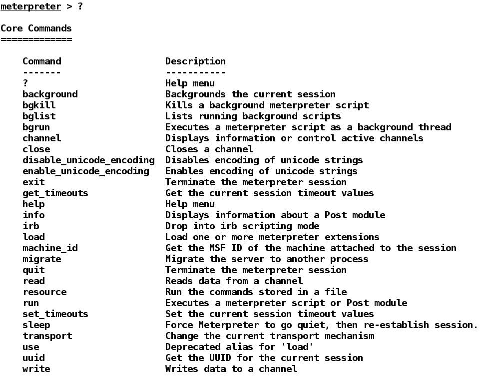
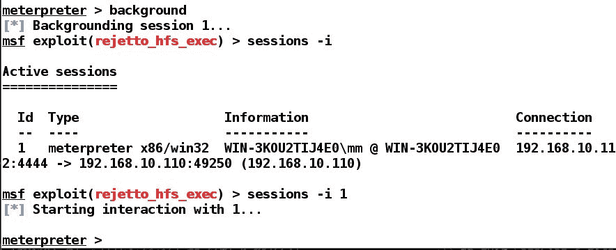
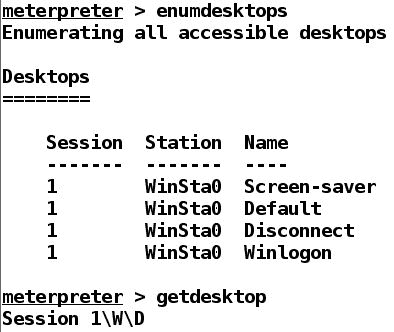
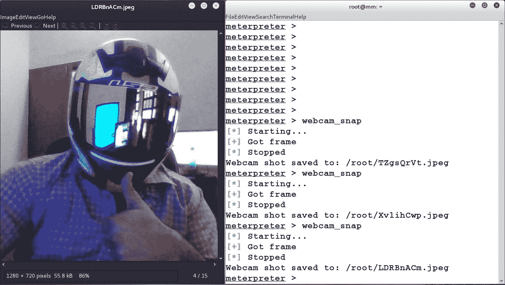
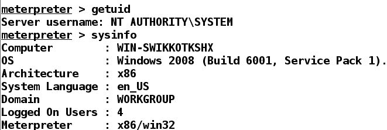
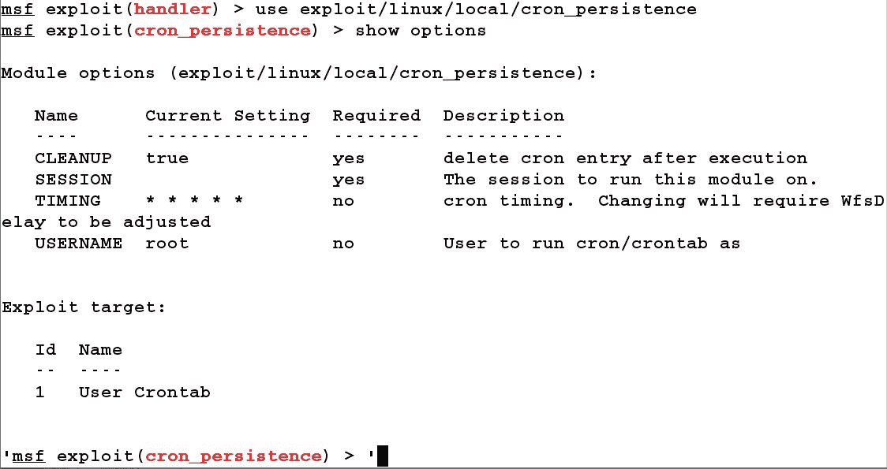

# 第四章：使用 Metasploit 进行后渗透

本章将介绍硬核后渗透。在本章中，我们将专注于后渗透的方法，并将涵盖基本任务，比如特权提升、获取明文密码、查找有价值的信息等。

在本章中，我们将涵盖和理解以下关键方面：

+   执行必要的后渗透

+   使用高级后渗透模块

+   特权提升

+   获得对目标的持久访问

让我们现在跳到下一节，我们将看一下 Metasploit 的后渗透功能的基础知识。

# 使用 Metasploit 进行扩展后渗透

我们已经在前几章中涵盖了一些后渗透模块。然而，在这里，我们将专注于我们没有涵盖的功能。在上一章中，我们专注于利用系统，但现在我们将只专注于已经被利用的系统。所以，让我们开始下一节中用于后渗透的最基本命令。

# 基本后渗透命令

核心 meterpreter 命令是大多数使用 meterpreter 有效载荷的被利用系统上可用的命令，并为后渗透提供必要的核心功能。让我们开始一些最基本的命令，这些命令将帮助你进行后渗透。

# 帮助菜单

我们可以通过发出`help`或`?`命令来查看目标上可用的所有各种命令的帮助菜单列表，如下面的屏幕截图所示：

# 后台命令

在进行后渗透时，我们可能会遇到需要执行额外任务的情况，比如测试不同的漏洞利用、运行提权漏洞利用等。然而，为了实现这一点，我们需要将当前的 meterpreter 会话放到后台。我们可以通过发出`background`命令来实现这一点，如下面的屏幕截图所示：

从前面的屏幕截图中，我们可以看到我们成功地将会话放到后台，并使用`sessions -i`命令后跟会话标识符重新与会话交互。

# 机器 ID 和 UUID 命令

我们总是可以通过发出`machine_id`命令来获取附加会话的机器 ID，如下所示：

要查看 UUID，我们可以简单地发出`uuid`命令，如下面的屏幕截图所示：

# 网络命令

我们可以使用`ipconfig`/`ifconfig`、`arp`和`netstat`命令来快速访问网络信息。我们已经在前几章中涵盖了`arp`命令。让我们看一下`ipconfig`命令生成的输出：

`ipconfig`命令允许我们查看本地 IP 地址和任何其他相关接口。这个命令很重要，因为它会显示与受损主机连接的任何其他内部网络。我留下`netstat`命令作为一个练习，让你们在自己的时间里完成。

# 文件操作命令

我们可以通过发出`pwd`命令来查看目标机器上的当前工作目录：

此外，我们可以使用`cd`命令访问目标文件系统，并使用`mkdir`命令创建目录，就像在系统上一样。meterpreter shell 允许我们使用`upload`命令将文件上传到目标系统。让我们看看它是如何工作的：

我们可以通过发出`edit`命令后跟文件名来编辑目标上的任何文件，如下面的屏幕截图所示：

现在让我们通过发出`cat`命令来查看文件的内容：

我将留下`ls`、`rmdir`和`rm`命令作为练习，让你们在自己的时间里完成。接下来，我们使用`download`命令从目标下载文件，如下所示：

# 桌面命令

Metasploit 具有`desktop`命令，例如枚举桌面、从网络摄像头拍照、从麦克风录音、从摄像头流式传输等等。我们可以如下所示查看可用的功能：

使用`enumdesktops`和`getdesktop`可以破坏与目标桌面相关的信息。`enumdesktop`命令列出所有可用的桌面，而`getdesktop`列出与当前桌面相关的信息。

# 屏幕截图和摄像头枚举

在进行屏幕截图、网络摄像头快照、运行实时流或记录按键日志之前，测试人员必须事先获得许可。然而，我们可以使用`snapshot`命令通过拍摄快照来查看目标的桌面，如下所示：

查看保存的 JPEG 文件，我们有以下内容：

让我们看看我们是否可以枚举摄像头并查看谁正在系统上工作：

使用`webcam_list`命令，我们可以找出与目标关联的摄像头数量。让我们使用`webcam_stream`命令来流式传输摄像头，如下所示：

发出上述命令会在浏览器中打开一个网络摄像头流，如截图所示。我们也可以选择通过发出`webcam_snap`命令来进行快照，而不是流式传输，如下所示：

哈哈哈！嗯，我会说这是一种避免在线侵入的方法。然而，有时，如果在执法机构工作，您可能会被要求监听环境以进行监视。为了实现这一点，我们可以使用`record_mic`命令，如下所示：

我们可以使用`record_mic`命令通过传递秒数来设置捕获的持续时间。从目标获取的另一个有趣的信息是他们的按键日志。我们可以使用`keyscan_start`命令启动键盘嗅探模块来转储按键日志，如下所示：

几秒钟后，我们可以使用`keyscan_dump`命令转储按键日志，如下所示：

在本节中我们看到了许多命令。现在让我们进入后期利用的高级部分。

# 使用 Metasploit 进行高级后期利用

在本节中，我们将利用从基本命令中收集的信息来在目标系统中取得进一步的成功和访问级别。

# 迁移到更安全的进程

正如我们在前一节中看到的，我们的 meterpreter 会话是从临时文件加载的。然而，如果目标系统的用户发现进程异常，他可以终止进程，这将使我们退出系统。因此，迁移到更安全的进程，如`explorer.exe`或`svchost.exe`，可以通过使用`migrate`命令来逃避受害者的注意。然而，我们始终可以使用`ps`命令来找出我们要跳转到的进程的 PID，如下图所示：

我们可以看到`explorer.exe`的 PID 是`1896`。让我们使用`migrate`命令跳转到它，如下图所示：

我们可以看到我们成功地跳转到了`explorer.exe`进程。

从一个进程迁移到另一个进程可能会降低特权。

# 获取系统特权

如果我们侵入的应用程序以管理员特权运行，通过发出`getsystem`命令很容易获得系统级特权，如下所示：

系统级特权提供了最高级别的特权，能够在目标系统上执行几乎任何操作。

`getsystem`模块在较新版本的 Windows 上不太可靠。建议尝试本地特权升级方法和模块来提升权限

# 使用 timestomp 更改访问、修改和创建时间

Metasploit 被广泛应用，从私人组织到执法部门。因此，在进行隐秘行动时，强烈建议您更改文件访问、修改或创建的日期。在 Metasploit 中，我们可以使用`timestomp`命令执行时间更改操作。在上一节中，我们创建了一个名为`creditcard.txt`的文件。让我们使用`timestomp`命令更改它的时间属性，如下所示：

我们可以看到访问时间是 2016-06-19 23:23:15。我们可以使用`-z`开关将其修改为`1999-11-26 15:15:25`，如前面的截图所示。让我们看看文件是否被正确修改了：

我们成功地改变了`creditcard.txt`文件的时间戳。我们还可以使用`-b`开关来清除文件的所有时间细节，如下所示：

使用`timestomp`命令，我们可以单独更改修改的访问和创建时间。

# 使用 hashdump 获取密码哈希

一旦我们获得了系统特权，我们可以通过发出`hashdump`命令来快速找出受损系统的登录密码哈希，如下所示：

一旦我们找到了密码哈希，我们就可以对目标系统发动哈希传递攻击。

有关哈希传递攻击的更多信息，请参阅[`www.offensive-security.com/metasploit-unleashed/psexec-pass-hash/`](https://www.offensive-security.com/metasploit-unleashed/psexec-pass-hash/)。

您可以参考一个很好的视频，解释了哈希传递攻击及其缓解方法，网址为[`www.youtube.com/watch?v=ROvGEk4JG94`](https://www.youtube.com/watch?v=ROvGEk4JG94)。

# Metasploit 和特权升级

在本节中，我们将看看如何使用 Metasploit 在目标系统上获得最高级别的特权。我们瞄准的大多数应用程序都在用户级别特权上运行，这为我们提供了一般访问权限，但并非完全系统访问权限。然而，要获得系统级别的访问权限，我们需要在获得系统访问权限后利用目标系统中的漏洞来提升权限。让我们看看如何在接下来的章节中实现对各种类型操作系统的系统级别访问权限。

# 在 Windows Server 2008 上提升权限

在渗透测试中，我们经常遇到有限的访问权限的情况，当运行诸如`hashdump`之类的命令时，我们可能会得到以下错误：

在这种情况下，如果我们尝试使用`getsystem`命令获得系统特权，我们会得到以下错误：

那么，在这种情况下我们应该怎么办呢？答案是利用后期渗透来提升权限，以实现最高级别的访问。以下演示是在 Windows Server 2008 SP1 操作系统上进行的，我们使用本地漏洞来绕过限制并完全访问目标：

在前面的截图中，我们使用`exploit/windows/local/ms10_015_kitrap0d`漏洞来提升权限并获得最高级别的访问。让我们使用`getuid`命令检查访问级别，如下所示：

我们可以看到我们已经获得了系统级别的访问权限，现在我们可以在目标上执行任何操作。

有关 kitrap0d 漏洞的更多信息，请参阅[`technet.microsoft.com/en-us/library/security/ms10-015.aspx`](https://technet.microsoft.com/en-us/library/security/ms10-015.aspx)。

# 使用 Metasploit 在 Linux 上提升权限

我们在上一节中看到了如何使用 Metasploit 在基于 Windows 的操作系统上提升权限。现在让我们来看看手动运行特权升级漏洞。这个练习将帮助您为竞争和实际的信息安全认证考试做好准备。

假设我们已经在具有有限访问权限的 Linux UBUNTU 14.04 LTS 服务器上获得了一个 shell，如下截图所示：

让我们进入 shell，并通过发出`shell`命令获得更可靠的命令执行访问，如下面的屏幕截图所示：

正如你所看到的，我们在`shell`终端中发出了`id`命令；我们有当前用户的用户 ID，即 1000，用户名为 rootme。通过使用`uname -a`命令收集有关内核的更多信息，我们可以看到操作系统的内核版本是 3.13.0-24，发布年份是 2014 年，机器正在运行 64 位操作系统。

在找到这些细节并浏览互联网之后，我们发现了来自[`www.exploit-db.com/exploits/37292`](https://www.exploit-db.com/exploits/37292)的*Linux Kernel 3.13.0 < 3.19 (Ubuntu 12.04/14.04/14.10/15.04) - 'overlayfs' Privilege Escalation Exploit (CVE:2015-1328)*。接下来，我们下载了基于 C 的漏洞利用，并将其托管在我们的本地机器上，以便我们可以将这个漏洞利用传输到目标机器。由于我们已经可以访问目标上的 shell，我们可以只需发出`wget`命令，然后是托管在我们机器上的原始 C 漏洞利用源文件的位置，如下面的屏幕截图所示：

我们的下一个任务是编译这个漏洞并在目标上运行它。要编译漏洞，我们输入`GCC`，然后是源文件的名称，同时使用`-o`开关指定输出名称。由于我们在漏洞中使用了 pthread 调用，我们还将提供`-lpthread`开关。发出完整的命令，我们可以看到漏洞被编译为名为 bang 的文件。通过发出`chmod +x bang`命令，我们给 bang 文件分配执行权限，并运行漏洞，如下面的屏幕截图所示：

是的！当发出`whoami`命令时，系统告诉我们我们是 root。换句话说，我们已经获得了对目标的最高可能访问权限，可能现在对服务器有更多的访问权限。

有关 CVE 2015-1328 的更多信息，请参阅[`seclists.org/oss-sec/2015/q2/717`](http://seclists.org/oss-sec/2015/q2/717)。

# 使用 Metasploit 实现持久访问

在成为执法机构的一部分时，获得对目标系统的持久访问是很重要的。然而，在传统的渗透测试中，除非可测试的环境非常庞大并且需要很多天才能完成测试，否则持久性可能并不是非常实际的。但这并不意味着不值得知道如何保持对目标的访问。在接下来的部分中，我们将介绍一些可以用来保持对目标系统访问的持久性技术。此外，Metasploit 已经废弃了 meterpreter 中用于保持对目标访问的持久性和`metsvc`模块。让我们介绍一下实现持久性的新技术。

# 在基于 Windows 的系统上实现持久访问

在这个例子中，我们已经获得了对运行 Windows Server 2012 R2 的系统的 meterpreter 访问。让我们使用`background`命令将 meterpreter 移到后台，并使用最新的持久性模块，即`post/windows/manage/persistence_exe`。这个模块的美妙之处在于它不依赖于 Metasploit，这意味着你可以使用任何可执行文件来实现持久性。让我们使用`use`并运行`show options`来检查我们需要设置的所有选项，如下图所示：

我们可以看到有四个选项。REXENAME 是将加载到受害系统上的`.exe`文件的名称。REXEPATH 是我们系统上可执行文件的路径，将上传到目标并重命名为 REXENAME 上设置的值。SESSION 选项将包含用于将文件上传到目标的 meterpreter 的会话标识符。STARTUP 选项将包含来自 USER、SYSTEM、SERVICE 的值之一。在有限访问用户的情况下，我们将在 STARTUP 选项中保持 USER，持久性将仅在该特定用户登录时实现。通过将 STARTUP 的值设置为 SYSTEM，可以在任何用户登录时实现持久性。但是，要在 SYSTEM 级别实现持久性，将需要管理员特权，SERVICE 安装也是如此。因此，我们将保持它为 USER。

对于 REXEPATH，我们使用`msfvenom`创建了一个后门，这是一个针对基于 Windows 的系统的 meterpreter，就像我们在之前的章节中所做的那样。让我们将`SESSION`选项设置为`3`，因为我们的 meterpreter 会话 ID 是`3`，如下屏幕所示：

接下来，让我们将`REXEPATH`设置为我们可执行文件的路径，并按以下方式运行模块：

运行模块，我们可以看到已经实现了持久性。让我们通过设置处理程序来测试一下，以适应我们的`nj.exe`文件，它连接回端口`1337`，如下所示：

在前面的案例中，我们通过 meterpreter 向受害者提供了重启命令，导致系统重新启动。接下来，我们迅速设置了一个处理程序，以在端口`1337`上接收传入的 meterpreter 会话，并且一旦我们运行了`exploit`命令，重新启动的系统就连接到了我们的 meterpreter，这表明成功地实现了对目标系统的持久性。

# 在 Linux 系统上获得持久访问

要在 Linux 系统上实现持久性，我们可以在获得初始 meterpreter 访问后使用`exploit/linux/local/cron_persistence`模块，如下截图所示：

接下来，我们需要将`SESSION`选项设置为我们的 meterpreter 会话标识符，并配置`USERNAME`为目标机器的当前用户，并按以下方式运行模块：

一旦实现了基于 Cron 的持久性，您可以设置一个处理程序来接收类似于我们在 Windows 系统中使用的方法的传入 meterpreter 会话。但是，Linux 操作系统的有效载荷将是`linux/x86/meterpreter/reverse_tcp`。我把这个练习留给你们完成，因为没有比自主学习更好的培训了。

有关 Cron 持久性的更多信息，请参考[`www.rapid7.com/db/modules/exploit/linux/local/cron_persistence`](https://www.rapid7.com/db/modules/exploit/linux/local/cron_persistence)。

# 总结

在本章中，我们涵盖了很多内容。我们从学习基本的后渗透开始，然后转向高级后渗透。我们还涵盖了迁移、获取系统特权、时间戳和获取哈希。我们还看到了如何使用 Metasploit 进行特权升级，并在 Linux 和 Windows 系统上保持访问。

在本章中，您有许多练习要完成。但是，如果您想尝试更多，请尝试执行以下任务：

+   尝试在各种系统上进行特权升级，包括 Windows Server 2003、Windows XP、Windows 7、Windows 8.1 和 Windows 10。注意差异，并保持一个用于在这些系统上提升特权的模块列表。

+   安装两到三年前的 Red Hat、CentOS 和 Ubuntu 操作系统副本，找出内核版本，并尝试在这些机器上提升特权。

+   找出在 OSX、BSD 和 Solaris 操作系统上获得持久性的方法。

在第五章中，*使用 Metasploit 测试服务*，我们将研究如何使用 Metasploit 测试服务。我们的重点将放在可能作为整个项目而不是 VAPT 参与的一部分的服务上。
