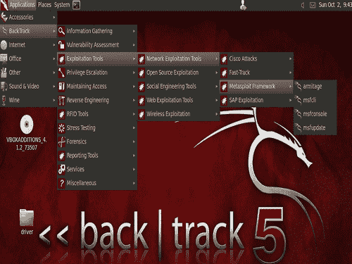
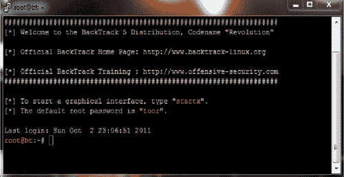
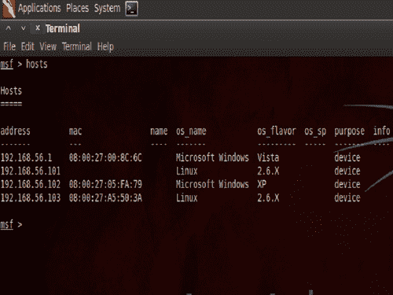

# 第一章：安全专业人员的 Metasploit 快速提示

在本章中，我们将涵盖：

+   在 Windows 上配置 Metasploit

+   在 Ubuntu 上配置 Metasploit

+   使用 BackTrack 5 的 Metasploit-终极组合

+   在单台机器上设置渗透测试实验室

+   在具有 SSH 连接性的虚拟机上设置 Metasploit

+   从接口开始- Metasploit 的“Hello World”

+   在 Metasploit 中设置数据库

+   使用数据库存储渗透测试结果

+   分析数据库中存储的结果

# 介绍

Metasploit 目前是信息安全和渗透测试领域最热门的词汇。它彻底改变了我们进行系统安全测试的方式。使 Metasploit 如此受欢迎的原因是它可以执行的任务范围广泛，以便于渗透测试工作，使系统更加安全。Metasploit 适用于所有流行的操作系统。框架的工作过程对所有操作系统几乎是相同的。在本书中，我们将主要使用 BackTrack 5 操作系统，因为它预装了 Metasploit 框架和其他在框架上运行的第三方工具。

让我们快速介绍一下框架和与之相关的各种术语：

+   **Metasploit 框架：**这是由 H.D. Moore 于 2003 年开始的免费、开源的渗透测试框架，后来被 Rapid7 收购。框架的当前稳定版本是用 Ruby 语言编写的。它拥有世界上最大的已测试利用数据库，每年下载量超过一百万次。这也是迄今为止用 Ruby 构建的最复杂的项目之一。

+   **漏洞：**这是一种允许攻击者/渗透测试者破坏/危害系统安全的弱点。这种弱点可以存在于操作系统、应用软件，甚至网络协议中。

+   **利用：**利用是一种允许攻击者/测试者利用脆弱系统并危害其安全性的代码。每个漏洞都有其对应的利用。Metasploit v4 有超过 700 个利用。

+   **有效载荷：**这是实际执行工作的代码。在利用后在系统上运行。它们主要用于在攻击者和受害者机器之间建立连接。Metasploit v4 有超过 250 个有效载荷。

+   **模块：**模块是完整系统的小构建块。每个模块执行特定任务，通过组合多个模块来构建一个完整的系统单元。这种架构的最大优势是，开发人员可以轻松地将新的利用代码和工具集成到框架中。

Metasploit 框架具有模块化架构，利用、有效载荷、编码器等被视为单独的模块。


让我们仔细研究架构图。

Metasploit 使用不同的库来确保框架的正常运行。这些库是一组预定义的任务、操作和函数，可以被框架的不同模块利用。框架最基本的部分是**Ruby 扩展（Rex）**库。Rex 提供的一些组件包括包装套接字子系统、协议客户端和服务器的实现、日志子系统、利用实用类以及其他一些有用的类。Rex 本身设计为没有依赖性，除了默认的 Ruby 安装。

然后我们有 MSF Core 库，它扩展了 Rex。 Core 负责实现所有必需的接口，允许与利用模块、会话和插件进行交互。这个核心库由框架基础库扩展，旨在为处理框架核心提供更简单的包装例程，并为处理框架的不同方面提供实用类，例如将模块状态序列化为不同的输出格式。最后，基础库由框架的**用户界面（UI）**扩展，实现对框架本身的不同类型用户界面的支持，例如命令控制台和 Web 界面。

框架提供了四种不同的用户界面，即`msfconsole、msfcli、msfgui`和`msfweb`。强烈建议您尝试所有这些不同的界面，但在本书中，我们将主要使用`msfconsole`界面。其背后的原因是`msfconsole`为框架提供了最好的支持，利用了所有功能。

现在让我们转向本章的实际分析和实际分析各个方面的配方。

# 在 Windows 上配置 Metasploit

在 Windows 上安装 Metasploit 框架非常简单，几乎不需要任何努力。框架安装程序可以从 Metasploit 官方网站（[`www.metasploit.com/download`](http://www.metasploit.com/download)）下载。

## 做好准备

您会注意到 Windows 有两种不同类型的安装程序可用。建议下载包含控制台和所有其他相关依赖项以及数据库和运行时设置的 Metasploit 框架的完整安装程序。如果您已经配置了要用于框架的数据库，那么可以选择仅安装控制台和依赖项的框架的迷你安装程序。

## 如何做...

一旦您完成了安装程序的下载，只需运行它并放松一下。它将自动安装所有相关组件并为您设置数据库。安装完成后，您可以通过安装程序创建的各种快捷方式访问框架。

## 它是如何工作的...

您会发现安装程序已经为您创建了许多快捷方式。在 Windows 环境中，大多数事情都是点击即可完成的。您会发现一些选项，如 Metasploit web、cmd 控制台、Metasploit 更新等。

### 注意

在 Windows 上安装 Metasploit 时，应禁用防病毒保护，因为它可能会检测到某些安装文件为潜在病毒或威胁，并可能阻止安装过程。安装完成后，请确保您已在防病毒软件中将框架安装目录列入白名单，因为它将检测到利用和有效载荷为恶意。

## 还有更多...

现在让我们谈谈一些其他选项，或者可能是一些与在 Windows 上明确安装 Metasploit 框架相关的一般信息。

### 安装过程中的数据库错误

在 Windows 机器上安装 Metasploit 框架时，许多用户都会遇到一个常见问题。在运行设置时，您可能会遇到错误消息，如屏幕截图所示：


这是在配置 PostgreSQL 服务器时出现错误的结果。可能的原因是：

+   PostgreSQL 未运行。使用 Netstat 查找端口是否打开并且数据库是否运行。

+   有些安装程序需要默认安装路径。例如，如果默认路径是`C`驱动器，将其更改为`D`驱动器将导致此错误。

+   语言编码。

如果您遇到此问题，可以通过下载仅包含控制台和依赖项的框架的简化版本来克服它。然后，手动配置数据库并将其连接到 Metasploit。

# 在 Ubuntu 上配置 Metasploit

Metasploit 框架完全支持基于 Ubuntu 的 Linux 操作系统。安装过程与 Windows 有些不同。

## 准备工作

从官方 Metasploit 网站（[`www.metasploit.com/download`](http://www.metasploit.com/download/)）下载设置。

同样，您可以选择最小安装或完整安装。根据您的需求选择下载。完整安装将包括所有依赖项、数据库设置、环境等，而最小安装将只包含依赖项，没有数据库设置。

## 如何做...

完整安装的过程与最小安装有些不同。让我们分析一下它们各自：

+   **完整安装程序：** 您需要执行以下命令在您的 Ubuntu 机器上安装框架：

```
$ chmod +x framework-4.*-linux-full.run
$ sudo ./framework-4.*-linux-full.run

```

+   **最小安装程序：** 您需要执行以下命令以最小选项安装框架：

```
$ chmod +x framework-4.*-linux-mini.run
$ sudo ./framework-4.*-linux-mini.run

```

## 它是如何工作的...

上面演示的安装过程是几乎所有软件的简单基于 Ubuntu 的安装过程。安装完成后，您可以运行`hash -r`重新加载您的路径。

### 注意

这个安装过程可以在几乎所有版本和版本的 Linux 上进行。

## 还有更多...

现在让我们谈谈其他一些选项，或者可能与此任务相关的一些一般信息。

### 安装过程中出现错误

有可能安装程序由于某种原因对您不起作用。某些版本的 Ubuntu 带有破损的 Ruby 语言库，这可能是安装失败的原因之一。在这种情况下，我们可以通过执行以下命令单独安装依赖项：

要安装 Ruby 依赖项，请运行：

```
$ sudo apt-get install ruby libopenssl-ruby libyaml-ruby libdl-ruby libiconv-ruby libreadline-ruby irb ri rubygems

```

要安装子版本客户端，请运行：

```
$ sudo apt-get install subversion

```

要构建本机扩展，请运行：

```
$ sudo apt-get install build-essential ruby-dev libpcap-dev

```

安装以下依赖项后，从官方 Metasploit 下载页面下载 Metasploit Unix tarball 并执行以下命令：

```
$ tar xf framework-4.X.tar.gz
$ sudo mkdir -p /opt/metasploit4
$ sudo cp -a msf4/ /opt/metasploit3/msf4
$ sudo chown root:root -R /opt/metasploit4/msf4
$ sudo ln -sf /opt/metasploit3/msf3/msf* /usr/local/bin/

```

在成功执行上述命令后，框架将启动并准备接收您的指令。

# Metasploit 与 BackTrack 5 的终极组合

BackTrack 是安全专业人员最受欢迎的操作系统，原因有两个。首先，它预先安装了所有流行的渗透测试工具，因此减少了单独安装的成本。其次，它是基于 Linux 的操作系统，这使得它不太容易受到病毒攻击，并在渗透测试期间提供更稳定性。它可以节省您安装相关组件和工具的时间，谁知道在安装过程中可能会遇到未知错误。

## 准备工作

您可以在硬盘上单独安装 BackTrack，也可以在虚拟机上使用。安装过程简单，与安装任何基于 Linux 的操作系统相同。

## 如何做...

1.  在启动 BackTrack OS 时，您将被要求输入用户名和密码。root 用户的默认用户名是`root`，密码是`toor`。

1.  成功登录后，您可以在命令行上工作，也可以输入`startx`进入 GUI 模式。

1.  您可以从**应用程序**菜单或命令行启动 Metasploit 框架。要从**应用程序**菜单启动 Metasploit，请转到**应用程序 | BackTrack | Exploitation Tools | Network Exploitation Tools | Metasploit Framework**，如下面的屏幕截图所示：

1.  Metasploit 遵循一个简单的目录结构层次，其中根文件夹是`pentest`。该目录进一步分支到`/exploits/framework3`。要从命令行启动 Metasploit，请启动终端并输入以下命令以移动到 Metasploit 目录：

```
root@bt:~# cd /pentest/exploits/framework3
root@bt:/pentest/exploits/framework3 ~# ./msfconsole

```

## 它是如何工作的...

从命令行启动 Metasploit 将遵循到`msfconsole`的完整路径。从**应用程序**菜单启动将为我们提供直接访问不同可用的 UI。

# 在单台机器上设置渗透测试实验室

您可以通过使用多台机器设置渗透测试实验室，这被认为是理想的设置。但是，如果您遇到紧急情况，需要立即设置测试场景，而您只有一台机器怎么办？使用虚拟机是显而易见的答案。您可以同时在多个操作系统上工作，并执行渗透测试任务。因此，让我们快速看一下如何借助虚拟机在单个系统上设置渗透测试实验室。

## 准备工作

我们将使用虚拟机设置两个虚拟机，分别运行 BackTrack 5 和 Windows XP SP2 操作系统。我们的主机系统是 Windows 7。我们需要虚拟机安装程序，以及两个操作系统的镜像文件或安装光盘。因此，我们的完整设置将包括运行 Windows 7 的主机系统，分别运行 BackTrack 5 和 Windows XP SP2 的两个虚拟系统。

## 如何做...

安装虚拟机的过程简单明了。按照以下步骤进行：

1.  安装虚拟机后，创建一个新的虚拟机。选择适当的选项，然后点击**下一步**。您将需要提供一个安装介质来启动设置。介质可以是镜像文件或安装光盘。有关虚拟机和安装程序的完整手册，您可以访问以下链接：[`www.virtualbox.org/manual/UserManual.html`](http://www.virtualbox.org/manual/UserManual.html)

1.  为了获得更好的虚拟机性能，建议 32 位操作系统至少有 4GB 可用 RAM，64 位操作系统至少有 8GB RAM。在下一个教程中，我将向您展示一种很酷的方法，可以在运行多个虚拟机时降低内存使用量。

1.  一旦创建了**虚拟机（VM）**，您可以使用“克隆”选项。这将创建您的 VM 的精确副本，因此如果操作 VM 中发生故障，您可以切换到克隆的 VM，而不必担心重新安装。您还可以使用“快照”选项保存 VM 的当前状态。快照将保存虚拟机的当前工作设置，您可以在将来的任何时间恢复到保存的快照。

## 它是如何工作的...

在启动虚拟机之前，我们需要进行重要的配置，以使两个虚拟机能够相互通信。选择其中一个虚拟机，点击**设置**。然后转到**网络设置**。在网络适配器中，将有一个预安装的 NAT 适配器用于主机机器的互联网使用。在**适配器 2**下选择**仅主机适配器**。


对两个虚拟机都执行此过程。设置**仅主机适配器**的原因是使两个虚拟机能够相互通信。现在，为了测试一切是否正常，通过在命令提示符中输入`ipconfig`来检查 Windows 虚拟机的 IP 地址。现在从 BackTrack 机器上 ping Windows 机器（使用从`ipconfig`命令获取的本地 IP 地址），以查看它是否接收数据包。按照相反的过程来交叉检查两台机器。

## 还有更多...

现在让我们谈谈其他选项，或者可能与此任务相关的一些一般信息。

### 禁用防火墙和防病毒保护

有时我们可能会发现，当从 BackTrack 机器对 Windows 机器进行 ping 时，数据包没有收到。这意味着 Windows 机器已经关闭。这可能是由于默认的 Windows 防火墙设置。因此，禁用防火墙保护，然后再次 ping，看看数据包是否被接收。还要禁用虚拟机中可能安装的任何防火墙。

### 安装虚拟盒增强功能

虚拟盒提供了一个额外的插件安装，可以改善您的虚拟使用体验。它的一些关键好处是：

+   从主机操作系统到虚拟操作系统的无缝鼠标移动

+   自动键盘集成到虚拟操作系统

+   更好的屏幕尺寸

要安装增强功能，启动虚拟机，转到**设备**选项卡，然后点击**安装增强功能**。

# 在具有 SSH 连接的虚拟机上设置 Metasploit

在上一个步骤中，我们专注于使用虚拟化在单台机器上设置渗透测试实验室。但是在使用多个虚拟机时可能会出现严重的内存使用问题。因此，我们将讨论一种在困难时期非常有用的保护技术。

## 准备工作

我们只需要一个 SSH 客户端。我们将使用 PuTTY，因为它是 Windows 上最流行和免费的 SSH 客户端。我们将建立与 Backtrack 机器的 SSH 连接，因为它的内存消耗比 Windows XP 机器更大。

## 操作步骤...

1.  我们将首先启动我们的 BackTrack 虚拟机。在到达登录提示时，输入凭据启动命令行。现在不要启动 GUI。执行以下任一命令：

```
root@bt:~# /etc/init.d/start ssh
root@bt:~# start ssh

```

这将启动 BackTrack 机器上的 SSH 进程。

1.  现在通过输入以下命令找到机器的 IP 地址：

```
root@bt:~# ifconfig

```

记下这个 IP 地址

1.  现在在主机操作系统上启动 PuTTY。输入 BackTrack 虚拟机的 IP 地址并输入端口`22`：

1.  现在点击**打开**以启动命令行。如果连接成功，您将看到 PuTTY 命令行代表 BackTrack 机器运行。它会要求您登录。输入凭据并输入`ifconfig`来检查 IP 是否与虚拟 BackTrack 的 IP 相同：

## 工作原理...

在这个 SSH 会话中，我们现在可以使用 PuTTY 与 BackTrack 虚拟机进行交互。由于 GUI 没有加载，内存消耗几乎减少了一半。此外，最小化 BackTrack 虚拟机将进一步减少内存消耗，因为 Windows 操作系统为最小化的进程提供较少的内存份额，并提供正在最大化模式下运行的任务更快的执行。这将进一步在一定程度上减少内存消耗。

# 从接口开始，Metasploit 的“Hello World”

接口为用户与软件或平台进行通信提供了一个前端。Metasploit 有四个接口，即`msfgui, msfweb, msfcli`和`msfconsole`。强烈建议您检查所有接口，但在本书中，我们将主要关注`msfconsole`接口。它是其中最强大和完全集成的接口。

## 准备工作

启动已安装 Metasploit 的操作系统。如果您在虚拟机上使用它，请启动它。

## 操作步骤...

启动`msfconsole`是一项简单的任务。按照以下步骤进行：

1.  对于 Windows 操作系统，可以通过**开始 | metasploit framework | msfconsole**来启动`msfconsole`。

1.  对于 BackTrack，您可以浏览到**应用程序 | 渗透测试工具 | 网络渗透测试工具 | Metasploit 框架 | msfconsole**。

1.  直接从终端启动它，添加以下命令：

```
root@bt:~# cd /pentest/exploits/framework3

```

1.  工作目录将更改为`framework3`。输入以下命令将启动我们的`msfconsole`：

```
root@bt:/pentest/exploits/framework3# ./msfconsole

```

现在，我们的`msfconsole`界面已经启动并运行，准备接收命令。

## 它是如何工作的...

Metasploit 接口扩展了基本库，使它们能够调用框架的初始功能。可以执行简单的命令，例如设置利用和有效载荷、运行更新和配置数据库。一旦过程变得更深入，其他功能库将相应地被调用。

## 还有更多...

让我们添加一些您可以在此阶段使用`msfconsole`界面执行的其他内容。

### 一些要尝试并开始的命令

以下是一些您可以尝试以深入探索的命令：

+   `msf > ls：` `ls`命令将列出所有可用的目录和文件。您可以进一步深入其他目录以进行更深入的探索。

+   `msf > help：`此命令将列出我们可以使用的 Metasploit 框架的所有可用命令。这些命令被分类为核心命令和数据库后端命令。前者包含与框架直接相关的命令，而后者提供与数据库交互的命令。

+   `msf > msfupdate：`应经常使用此命令，以便使用最新的利用、有效载荷、库等更新框架。

# 在 Metasploit 中设置数据库

Metasploit 的一个重要特性是存在数据库，您可以使用它来存储渗透测试结果。任何渗透测试都包含大量信息，可能持续几天，因此存储中间结果和发现变得至关重要。因此，一个好的渗透测试工具应该具有适当的数据库集成，以快速有效地存储结果。

## 准备就绪

Metasploit 默认使用 PostgreSQL 作为数据库。对于 BackTrack 机器，我们还有另一个选择—MySQL。您可以使用这两个数据库中的任何一个。让我们首先检查 PostgreSQL 数据库的默认设置。我们将不得不导航到`opt/framework3/config`下的`database.yml`。要做到这一点，请运行以下命令：

```
root@bt:~# cd /opt/framework3/config
root@bt:/opt/framework3/config# cat database.yml
production: adapter: postgresql database: msf3 username: msf3 password: 8b826ac0 host: 127.0.0.1 port: 7175 pool: 75 timeout: 5

```

注意已创建的默认用户名、密码和默认数据库。记下这些值，因为它们将进一步需要。您也可以根据自己的选择更改这些值。

## 如何做...

现在我们的工作是连接数据库并开始使用它。让我们启动`msfconsole`，看看我们如何设置数据库并存储我们的结果。

让我们首先检查可用的数据库驱动程序。

```
msf > db_driver
[*]Active Driver: postgresql
[*]Available: postgresql, mysql

```

PostgreSQL 被设置为默认数据库。如果要更改数据库驱动程序，则可以执行以下命令：

```
Msf> db_driver mysql
[*]Active Driver: Mysql

```

这将把活动驱动程序更改为 MySQL。在本书中，我们主要将使用 PostgreSQL 进行演示。

### 注意

Rapid7 在最近的 Metasploit 版本中放弃了对 MySQL 数据库的支持，因此`db_driver`命令可能无法工作。在这种情况下，框架支持的唯一默认驱动程序将是 PostgreSQL。

## 它是如何工作的...

要将驱动程序连接到`msfconsle`，我们将使用`db_connect`命令。此命令将使用以下语法执行：

```
db_connect username:password@hostIP:port number/database_name 

```

在这里，我们将使用从`database.yml`文件中刚刚记录下的相同默认值的用户名、密码、数据库名称和端口号：

```
msf > db_connect msf3:8b826ac0@127.0.0.1:7175/msf3

```

成功执行命令后，我们的数据库将被完全配置。

## 还有更多...

让我们讨论一些与建立数据库相关的更重要的事实。

### 在连接数据库时出现错误

在尝试建立连接时可能会出现错误。如果出现任何错误，有两件事需要记住：

+   检查`db_driver`和`db_connect`命令，并确保您使用正确的数据库组合。

+   使用`start/etc/init.d`启动数据库服务，然后尝试连接它。

如果错误仍然存在，我们可以使用以下命令重新安装数据库和相关库：

```
msf> gem install postgres
msf> apt-get install libpq-dev

```

### 删除数据库

随时可以删除创建的数据库并重新开始存储新的结果。可以执行以下命令来删除数据库：

```
msf> db_destroy msf3:8b826ac0@127.0.0.1:7175/msf3
Database "msf3" dropped.
msf>

```

# 使用数据库存储渗透测试结果

现在让我们学习如何使用配置好的数据库来存储我们的渗透测试结果。

## 准备工作

如果您已成功执行了前面的步骤，那么您已经准备好使用数据库来存储结果了。在`msfconsole`中输入`help`命令，快速查看我们可以使用的重要数据库命令。

## 如何做...

让我们从一个快速示例开始。`db_nmap`命令将端口扫描的结果直接存储到数据库中，同时包括所有相关信息。在目标机器上启动一个简单的 Nmap 扫描，看看它是如何工作的：

```
msf > db_nmap 192.168.56.102
[*] Nmap: Starting Nmap 5.51SVN ( http://nmap.org ) at 2011-10-04 20:03 IST
[*] Nmap: Nmap scan report for 192.168.56.102
[*] Nmap: Host is up (0.0012s latency)
[*] Nmap: Not shown: 997 closed ports
[*] Nmap: PORT STATE SERVICE
[*] Nmap: 135/tcp open msrpc
[*] Nmap: 139/tcp open netbios-ssn
[*] Nmap: 445/tcp open microsoft-ds
[*] Nmap: MAC Address: 08:00:27:34:A8:87 (Cadmus Computer Systems)
[*] Nmap: Nmap done: 1 IP address (1 host up) scanned in 1.94 seconds

```

正如我们所看到的，Nmap 已经生成了扫描结果，并且将自动填充我们正在使用的`msf3`数据库。

我们还可以在 Nmap 扫描中使用`-oX`参数将结果存储为 XML 格式。这对我们来说将非常有益，可以将扫描结果导入其他第三方软件，比如我们将在下一章中分析的 Dardis 框架。

```
msf > nmap 192.168.56.102 -A -oX report
[*] exec: nmap 192.168.56.102 -A -oX report
Starting Nmap 5.51SVN ( http://nmap.org ) at 2011-10-05 11:57 IST
Nmap scan report for 192.168.56.102
Host is up (0.0032s latency)
Not shown: 997 closed ports
PORT STATE SERVICE
135/tcp open msrpc
139/tcp open netbios-ssn
445/tcp open microsoft-ds
MAC Address: 08:00:27:34:A8:87 (Cadmus Computer Systems)
Nmap done: 1 IP address (1 host up) scanned in 0.76 seconds

```

这里`report`是我们扫描结果将被存储的文件名。这将有助于我们在本书的后续步骤中。

## 工作原理...

`db_nmap`命令创建一个包含与扫描结果相关的各种表列的 SQL 查询。一旦扫描完成，它就开始将值存储到数据库中。以电子表格形式存储结果的灵活性使得更容易在本地或与第三方工具共享结果。

# 分析数据库中存储的结果

在数据库中存储测试结果之后，下一步是对其进行分析。分析数据将使我们更深入地了解我们的目标系统。数据库的结果可以根据使用情况长期或短期存储。

## 准备工作

启动`msfconsole`，并按照前面的步骤建立数据库连接。我们既可以用它来存储新的结果，也可以分析之前存储的结果。在前面的步骤中创建的 Nmap 扫描的 XML 文件可以导入以分析之前的扫描结果。

## 如何做...

让我们分析一些重要的命令，以更清楚地了解存储的结果:

+   `msf > hosts:` 这个命令将显示数据库中所有可用的主机。让我们分析一下这个命令的输出:

前面的屏幕截图反映了主机命令的输出。正如我们所观察到的，这个命令的结果并不是很清晰，因为表中有很多列。因此，我们可以继续添加过滤器，并只查看我们感兴趣的那些列，如下面的命令所示：

```
msf > hosts -c address,os_name
Hosts 
===== 
address os_name 
------- ------ 
192.168.56.1 
192.168.56.101 
192.168.56.102 Microsoft Windows 
192.168.56.103 Linux 

```

+   `msf > services:` 这是另一个有趣的命令，可以为我们提供有关目标机器上运行的不同服务的有用信息:

```
msf > services
Services 
======== 
host port proto name state info 
---- ---- ----- ---- ----- ---- 
192.168.56.101 111 tcp rpcbind open 
192.168.56.102 135 tcp msrpc open 
192.168.56.102 139 tcp netbios-ssn open 
192.168.56.102 445 tcp microsoft-ds open 
192.168.56.102 135 tcp msrpc open Microsoft Windows 
RPC

```

+   `msf > vulns:` 这个命令列出了数据库中存在的所有主机的漏洞。

+   `msf > db_autopwn:` 这是一个强大的命令，用于自动化利用数据库中可用的目标机器的过程。这个命令需要更多关于利用过程的理解，所以我们稍后会分析这个命令。

## 工作原理...

分析过程简单，可以轻松过滤以获得所需的结果。我们已经看到了如何读取数据库输出以及如何有效地管理它。最后两个命令`vulns`和`db_autopwn`是后期利用命令，我们将在后面的章节中处理。
