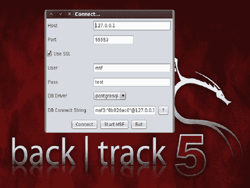
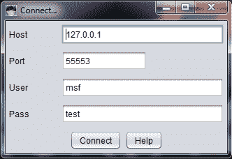
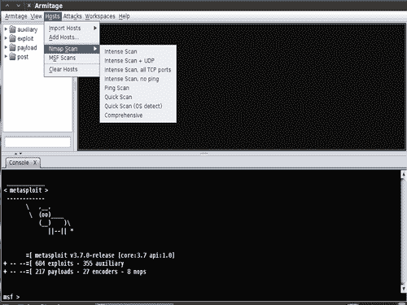
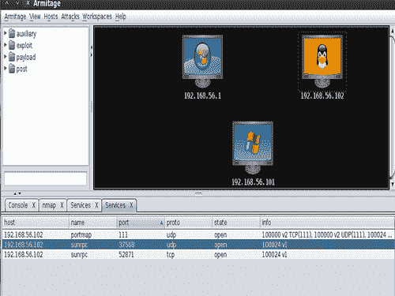
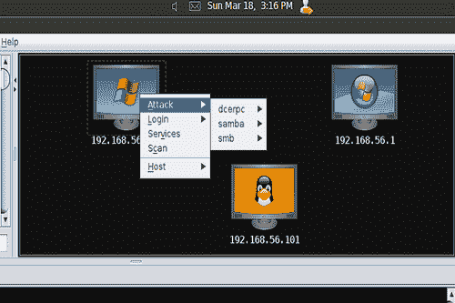
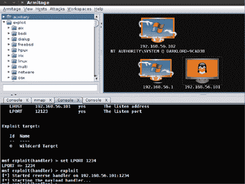
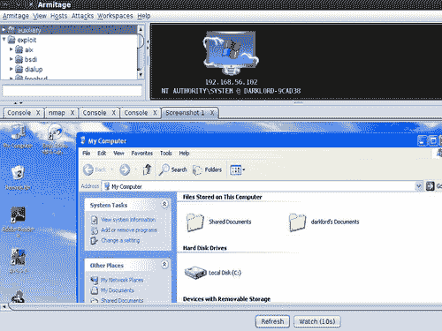
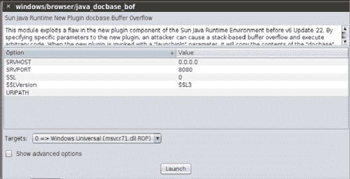
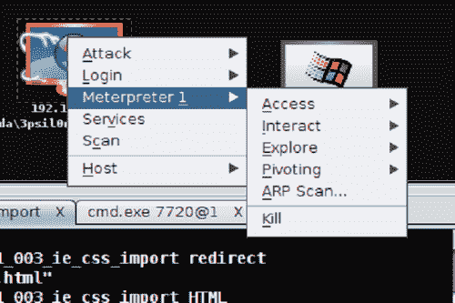

# 第九章：使用 Armitage

在本章中，我们将涵盖：

+   开始使用 Armitage

+   扫描和信息收集

+   查找漏洞和攻击目标

+   使用选项卡切换处理多个目标

+   使用 Armitage 进行后渗透

+   使用 Armitage 进行客户端利用

# 介绍

到目前为止，我们完全专注于 Metasploit 框架，并学习如何使用该框架来进行最佳的渗透测试。现在我们将把重点转移到 Metasploit 扩展工具上，这些工具可以进一步提升渗透测试的水平。我们将从 Armitage 开始我们的旅程，这是一个基于 GUI 的工具，可以在框架上运行。它是一个智能的 Metasploit 工具，可以可视化目标，推荐利用漏洞，并暴露框架中的高级后渗透功能。

Armitage 围绕黑客过程组织了 Metasploit 的功能。它具有用于发现、访问、后渗透和操纵的功能。Armitage 的动态工作区可以让您快速定义和切换目标标准。使用此功能将数千个主机分成目标集。Armitage 还可以启动扫描并从许多安全扫描仪导入数据。Armitage 可视化您当前的目标，因此您将了解您正在使用的主机以及您的会话位置。Armitage 推荐利用漏洞，并且可以选择运行主动检查以告诉您哪些利用漏洞将起作用。如果这些选项失败，请使用 Hail Mary 攻击来释放 Armitage 的智能自动利用攻击您的目标。

一旦进入，Armitage 将公开内置于 meterpreter 代理中的后渗透工具。通过单击菜单，您将提升权限、记录按键、转储密码哈希、浏览文件系统并使用命令行。

因此，通过使用 Armitage，我们可以通过工具提供的各种现成功能进一步简化我们的渗透测试过程。因此，让我们从设置 Armitage 与 Metasploit 的基础知识开始，然后我们将分析使用 Armitage 进行端口扫描、预渗透和后渗透。

# 开始使用 Armitage

让我们从 Armitage 的基本设置指南开始。我们将涵盖 Windows 和 Linux 中 BackTrack 中的 Armitage 设置。Armitage 已预先安装在最新版本的 BackTrack 中。要在 Windows 上设置 Armitage，可以从其官方网页下载 ZIP 文件：

[`www.fastandeasyhacking.com/download`](http://www.fastandeasyhacking.com/download)

## 如何做...

让我们从在 BackTrack 中设置 Armitage 开始。

1.  Armitage 将预先安装在 BackTrack 5 R2 中。可以通过单击桌面上的**应用程序**，然后导航到**Backtrack** | **Exploitation tools** | **Network Exploitation tools** | **Metasploit framework** | **Armitage**来启动它。

您将看到一个 GUI，询问您设置连接。它的默认用户名和密码分别为`msf`和`test`。您可以将 DB 驱动程序保留为`postgressql`，最后将 DB 连接字符串保留为`msf3:"8b826ac0"@127.0.0.1:7175/msf3:`



1.  一旦这些默认设置完成，我们可以通过单击**启动 MSF**来启动 Armitage GUI。

在 Windows 上设置 Armitage，有两个主要要求：

+   Metasploit 版本 4.2 及以上

+   JDK 1.6

1.  您可以从前面提到的 URL 下载 ZIP 文件，但也有一个简单的替代方法。您可以转到**开始** | **程序** | **Metasploit framework** | **Framework Update**。更新完成后，它将自动将 Armitage 添加到您的 Metasploit 库中。

1.  更新完成后，可以通过导航到**开始** | **程序** | **Metasploit framework** | **Armitage**来启动 Armitage。

1.  您将看到连接 GUI，其中设置了**主机、端口、用户**和**密码**的默认值。您可以简单地单击**连接**以在本地启动 Armitage。

1.  一旦你点击**连接**，它将要求你启动 Metasploit RPC 服务器。点击**是**，然后继续到主窗口。要在远程 Metasploit 上使用 Armitage，你可以将 IP 地址从**127.0.0.1**更改为远程 IP。

## 它是如何工作的...

Armitage 通过创建 RPC 调用到 Metasploit 来工作。一旦你点击**连接**，你会注意到一个重复的 RPC 连接失败消息。错误消息是因为 Armitage 不断尝试通过抛出 RPC 调用来连接到 Metasploit 框架，并等待响应。一旦连接成功，我们将看到包含 MSF 控制台的 Armitage GUI 在底部。

## 还有更多...

让我们看看如何在其他 Linux 版本上设置 Armitage。

### 在 Linux 上设置 Armitage

在 Linux 上设置 Armitage 在 Metasploit 上也很简单。你可以从官方网站下载安装程序，或者你可以简单地运行`msfupdate`来获取 Metasploit 版本 4.2 及更高版本上的 Armitage。在 Linux 上使用 Armitage 时，请确保框架数据库正在运行。从终端运行以下命令启动 PostgreSQL：`/etc/init.d/framework-postgres start`。

# 扫描和信息收集

从我们的第一个配方开始，一旦 Armitage 启动并运行，我们现在可以开始使用 Armitage。在这个配方中，我们将从渗透测试的最基本步骤开始，即扫描和信息收集。让我们在 Armitage 中执行一个 Nmap 扫描，看看 GUI 上显示了什么结果。

## 准备就绪

要启动 Nmap 扫描，可以点击**主机**，然后点击**Nmap 扫描**，如下面的屏幕截图所示。让我们进行一个快速的操作系统检测扫描，看看有没有存活的主机：



快速浏览 Armitage 窗口，左侧有一个搜索面板，我们可以在其中搜索框架中的所有不同模块，这在使用 msfconsole 时并不容易。此外，我们可以看到 MSF **控制台**面板，我们可以从中执行到目前为止学到的任何 Metasploit 命令。因此，当我们使用 Armitage 时，我们既有 GUI 的功能，也有命令行的功能。

## 如何做...

要执行扫描，请按照以下步骤进行：

1.  要开始扫描过程，Armitage 将要求我们输入一个 IP 或 IP 范围进行扫描。给出一个扫描范围为 192.168.56.1/24，它将为我们扫描整个网络，并返回存活主机的操作系统版本（如果可以检测到）：

1.  一旦扫描完成，它将以图像的形式反映所有存活的主机及其可能的操作系统，如前面的屏幕截图所示。所以在我们的情况下，有三个存活的主机，其中两个正在运行 Windows，而一个正在运行 Linux。

1.  现在我们的下一步将是收集有关我们存活目标的更多信息，以便我们可以选择相关的漏洞来进行渗透测试。右键单击目标图像将显示**服务**选项。点击它将打开一个新选项卡，列出在这些端口上运行的开放端口和服务。通过这种方式，我们可以通过只需点击几下就收集到有关多个目标的大量相关信息：

这里还要注意的一点是 Armitage 为每个新请求创建的不同选项卡。这有助于我们轻松处理多个目标。我们可以轻松地在不同目标之间切换并获取有关它们的信息。如果在 Armitage 中的选项不足，我们随时可以转到**控制台**选项卡，并直接在那里尝试 Metasploit 命令。这是 Armitage 相对于 Metasploit 的一个巨大优势。处理多个目标可以提高性能测试的效率。

在下一个配方中，我们将开始我们的利用阶段，看看 Armitage 如何轻松快速地为我们提供相关的漏洞和有效载荷，我们可以应用到我们的目标上。

## 它是如何工作的...

Armitage 从 Metasploit 框架中导入了 Nmap 功能。 Nmap 所需的参数以指令的形式从 Armitage GUI 传递到 Metasploit。然后，Metasploit 调用 Nmap 脚本并使用这些指令作为参数。

# 查找漏洞并攻击目标

从我们之前的配方中继续，我们将看到如何自动查找我们在 Nmap 扫描中发现的目标的已知漏洞。Armitage 根据操作系统中存在的开放端口和漏洞自动发现目标的利用过程。这个自动化过程并不总是会产生正确的结果，因为利用搜索完全取决于 Nmap 扫描返回的结果。如果 OS 发现是错误的，那么利用将无法工作。

## 准备工作

让我们启动我们的 Armitage 面板并连接到 Metasploit。然后，启动 Nmap 扫描以查找可用的目标。我们在前两个配方中已经介绍了这些步骤。让我们使用 Armitage 查找我们目标中的漏洞。

## 如何操作...

一旦目标被发现，Armitage 有一个**攻击**选项，可以根据发现的目标的开放端口和操作系统漏洞查找已知的利用。要查找利用，点击**攻击** | **查找攻击** | **按端口或按漏洞**。

## 它是如何工作的...

一旦 Armitage 发现了利用，我们将在目标图像上右键单击找到一个额外的选项——**攻击**。这个选项反映了 Armitage 为特定目标发现的不同攻击：



让我们继续利用我们的 Windows 目标。您可以使用 SMB `ms_08_047 netapi`漏洞来利用目标。您可以通过右键单击目标并转到**攻击** | **SMB** | **MS_08_047 netapi** exploit 来找到此漏洞。您还可以选择**使用反向连接**选项，以便在成功执行利用后获得与您的连接。成功执行利用后，您会注意到三件事：

+   目标的图像变为红色，并围绕其显示成功利用的闪电

+   右键单击目标会给我们提供 meterpreter 通道的选项

+   msfconsole 显示会话的开启

您可以看到在不传递任何命令的情况下利用目标是多么容易。GUI 提供了 Metasploit 中基于命令的所有功能。这就是为什么 Armitage 为框架增加了更多功能的原因。然而，对 msfconsole 命令的良好了解是必不可少的。我们不能完全依赖 GUI。使用 Armitage 的 GUI 无法利用的几个 MSF 功能。

在下一个配方中，我们将分析使用 Armitage 进行后期利用。

# 使用选项卡切换处理多个目标

在之前的几个配方中，我们已经看到了 Armitage GUI 如何简化利用过程。在这个配方中，我们将看到使用 Armitage 的另一个优势。当我们在 Metasploit 中处理多个目标时，我们必须在会话之间切换以管理它们。在 Armitage 中，通过使用不同的选项卡来进一步简化在多个目标之间切换的过程。让我们看看如何做到这一点。

## 如何操作...

在上一个配方中，我们已经攻破了我们的 Windows XP 目标。我们还有两个目标可供选择。我们可以通过右键单击 Windows 2008 Server 来利用它。或者，我们也可以通过转到**查看** | **控制台**来启动一个新的控制台。这将启动一个新的控制台，我们可以使用命令行来攻破目标。

## 它是如何工作的...

让我们设置一个多处理程序，并利用客户端漏洞攻击目标。

```
msf > use exploit/multi/handler
msf exploit(handler) > set payload windows/meterpreter/reverse_tcp
payload => windows/meterpreter/reverse_tcp
msf exploit(handler) > exploit
[-] Handler failed to bind to 192.168.56.101:15263
[-] Handler failed to bind to 0.0.0.0:15263
[-] Exploit exception: The address is already in use (0.0.0.0:15263).
[*] Exploit completed, but no session was created. 
```

您可以看到，利用命令抛出了一个错误，即无法在`192.168.56.101:15263`上绑定反向处理程序。这是因为我们在攻击 Windows XP 目标时已经在此端口上建立了反向连接。因此，我们将不得不更改端口号并再次使用利用命令。

```
msf exploit(handler) > set LPORT 1234
LPORT => 1234
msf exploit(handler) > exploit
[*] Started reverse handler on 192.168.56.101:1234
[*] Starting the payload handler... 
```

现在，一旦客户端利用成功执行，我们将建立一个反向连接，并且我们将对我们的 2008 服务器目标进行攻击。

这里需要注意的重要一点是，不同的目标有不同的标签页。我们可以通过在标签之间切换轻松地与任何受损的目标进行交互：



这是 Armitage 的另一个重要功能，可以简化渗透测试的过程。当我们处理网络中的多个目标时，这可能非常有益。

# 使用 Armitage 进行后渗透

在上一个示例中，我们看到了 Armitage 在处理多个目标时的有用性。一旦目标被攻击，我们的下一步将是执行各种后渗透活动。让我们看看 Armitage 在后渗透阶段也可以派上用场。

## 做好准备

我们将分析我们攻击的 Windows XP 目标，并看看我们如何在其上执行几个后渗透活动。

## 如何做...

一旦目标被攻击，我们可以通过右键单击其图像来跟随几个 meterpreter 选项。我们可以执行一些常用的后渗透操作，例如访问、交互和枢纽。我们只需点击几下就可以执行几个操作。让我们执行后渗透的第一个和最重要的阶段——**提权**。我们可以通过右键单击目标图像并导航到**Meterpreter** | **Access** | **Escalate privileges**来找到此选项。另一个有趣的后渗透活动是**screenshot**，可以通过**Meterpreter** | **Explore** | **Screenshot**浏览。目标桌面的屏幕截图将显示在一个新标签中，您可以随时刷新。以下屏幕截图演示了这一点：



## 工作原理...

您可以看到屏幕截图显示在一个新标签中，底部有两个按钮。**刷新**按钮将显示新的屏幕截图，而**观看**按钮将在每 10 秒后刷新屏幕截图。

同样，您可以尝试 Armitage 中提供的许多“点击到服务器”后渗透选项，以加快渗透测试的过程。

这是使用 Armitage 作为 Metasploit 的潜在扩展以加快利用过程的一个小演示。只有当我们完全掌握 Metasploit 时，才能真正理解 Armitage 的强大之处。强大的命令行与图形界面的结合使 Armitage 成为渗透测试的完美工具。

# 使用 Armitage 进行客户端利用

如果我们无法找到一个易受攻击的操作系统，客户端利用可以成为渗透测试的有用技术。正如在第四章中讨论的那样，*客户端利用和防病毒绕过*，客户端利用技术利用了目标系统上安装的应用程序（如 Internet Explorer 和 Adobe Reader）的漏洞。在本示例中，我们将在 Windows 7 上使用 Armitage 执行基于 Java 的客户端利用。

## 做好准备

我们可以通过启动简单的 Nmap 扫描来开始我们的渗透测试，以找出目标的 IP 地址和其他信息。

## 如何做...

要执行客户端利用，请按照以下步骤进行：

1.  在 Armitage 的左窗格中，转到**Exploit** | **Windows** | **Browser** | **java_docbase_bof**。

您将看到几个参数选项，如下面的屏幕截图所示：



1.  利用模块要求 SRVHOST 和 URI 主机，我们必须提供目标机器的 IP 地址和请求 URI。所有其他参数已经有默认值。

1.  一旦参数值被传递，点击**启动**按钮开始利用过程。

## 工作原理...

一旦点击了**启动**按钮，利用活动将在**控制台**窗口中反映出来。Armitage 将生成一个 URI 位置，目标用户必须在其浏览器中执行该位置以启动攻击。如果利用成功，Armitage 会自动启动一个后台监听器，等待目标机器返回连接。我们可以使用不同的社会工程技术将我们的恶意 URL 传输给目标用户。

一旦攻击成功，我们将在 Armitage GUI 中的目标图像周围看到闪电符号。通过右键单击目标，我们可以找到不同的后渗透选项，比如设置一个 meterpreter 会话和登录。以下截图描述了这种情况：



不同进程的响应，比如设置一个 meterpreter 会话，也可以在**控制台**窗口中进行监视。我们可以注意到在控制台中执行的与我们在之前章节中涵盖的相同一组命令。Armitage 只是通过提供基于 GUI 的交互介质来自动化整个过程。
