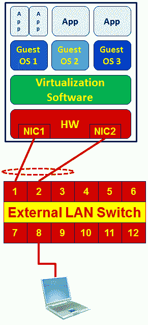
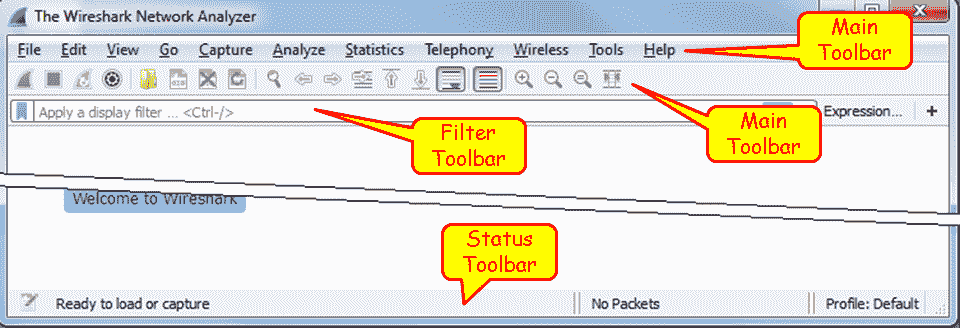

# 一、Wireshark v2 简介

在本章中，您将了解:

*   Wireshark v2 基础知识
*   定位 Wireshark
*   在虚拟机和云上捕获数据
*   开始捕获数据
*   配置开始窗口
*   保存、打印和导出数据

# Wireshark v2 基础知识

在本章中，我们将介绍与 Wireshark 相关的基本任务。在本书的*前言*中，我们稍微谈到了网络故障排除，我们看到了在这个过程中可以帮助我们的各种工具。在我们得出需要使用 Wireshark 协议分析器的结论后，是时候在网络中找到它进行测试了，用基本配置对它进行配置，并使它变得友好。

虽然为基本数据捕获设置 Wireshark 被认为非常简单和直观，但在特殊情况下我们可以使用许多选项；例如，当我们通过连接连续捕获数据并希望将捕获文件分割成小文件时，当我们希望看到参与连接的设备的名称而不仅仅是 IP 地址时，等等。在本章中，我们将学习如何针对这些特殊情况配置 Wireshark。

在简要介绍 Wireshark v2 之后，我们将在本章介绍几个方法来描述如何找到并开始使用该软件。

本章的第一个诀窍是*定位 Wireshark*；它描述了如何以及在哪里找到 Wireshark 来捕获数据。它会在服务器上吗？在交换机端口上？在防火墙之前？之后呢？我们应该将它连接到路由器的哪一侧，局域网侧还是广域网侧？我们应该期望从他们每一个人身上得到什么？第一个食谱描述了这个问题，以及如何做的建议。

下一个诀窍是关于在过去几年中变得非常重要的一个问题，那就是在虚拟机上捕获数据的诀窍*，它描述了如何安装和配置 Wireshark 的实际方面，以便监控在过去几年中被大多数服务器使用的虚拟机。*

近年来出现的另一个问题是如何监控存储在云中的虚拟机。在*在云上捕获数据*方法*、*中，我们有几个问题要讨论，其中包括如何解密大多数情况下在您和云之间加密的数据，如何使用云上可用的分析工具，以及哪些工具可从主要云供应商如 Amazon AWS、Microsoft Azure 等处获得。

本章的下一个诀窍是*开始捕获数据*，这实际上是如何开始使用软件，以及配置、打印和导出数据。我们讨论文件操作，即如何保存捕获的数据，无论我们是想保存全部数据、部分数据还是只保存过滤后的数据。我们将数据导出为各种格式，合并文件(例如，当您想要合并两个不同路由器接口上的捕获文件时)，等等。

# 定位 Wireshark

理解问题并决定使用 Wireshark 后的第一步是决定在哪里放置它。为此，我们需要一个精确的网络图(至少是与我们的测试相关的网络部分)并找到 Wireshark。

基本原理是定位你想要监控的设备，将你的笔记本电脑连接到它所连接的同一个交换机，并配置一个端口镜像，或者在思科它被称为**端口监控器**或**交换端口分析器** ( **SPAN** )到被监控的设备。此操作使您能够看到进出受监控设备的所有流量。这是最简单的情况。

您可以监控 LAN 端口、WAN 端口、服务器或路由器端口，或者连接到网络的任何其他设备。

在此图所示的示例中，Wireshark 软件安装在左侧的笔记本电脑上，以及我们要监控的服务器 S2 上:

在最简单的情况下，我们按照图中所示的方向配置端口镜像；这将监控所有进出服务器 **S2** 的流量。当然，我们也可以直接在服务器上安装 Wireshark，这样我们就可以直接在服务器上观察流量。

一些局域网交换机供应商还提供其他功能，例如:

*   **监控整个 VLAN** :我们可以监控服务器的 VLAN、电话 VLAN 等等。在这种情况下，您将看到特定 VLAN 上的所有流量。
*   **监控几个端口到单个分析器**:我们可以一起监控服务器 **S1** 和 **S2** 上的流量。
*   **过滤**:过滤包括配置是否监控传入流量、传出流量或两者。

# 做好准备

要开始使用 Wireshark，请访问 Wireshark 网站并下载该工具的最新版本。

Wireshark 的更新版本可以在 http://www.wireshark.org/网站上找到；选择下载。这将为您带来下载 Wireshark 页面。下载最新的 Wireshark v2。在 https://www.wireshark.org/#download 的[发布的 X.X 稳定版本。](https://www.wireshark.org/#download)

每个 Wireshark Windows 软件包都带有 WinPcap 的最新稳定版本，这是实时数据包捕获所必需的。WinPcap 驱动程序是用于流量捕获的 UNIX `libpcap`库的 Windows 版本。

在安装过程中，您将看到软件包的安装窗口，如下图所示:

通常在这些设置窗口中，我们简单地检查所有并安装。在这种情况下，我们有一些有趣的事情:

*   Wireshark:这是 Wireshark v2 软件。
*   TSark:命令行协议分析器。
*   Wireshark 1:老版 Wireshark 1。当您选中此项时，将同时安装旧版 Wireshark 版本 1。就我个人而言，我更喜欢在接下来的几个版本中安装它，所以如果 Wireshark v2 出现问题或者您不知道如何使用它，您总是可以使用旧版本。
*   插件和扩展:
    *   剖析器插件:带有一些扩展剖析的插件
    *   树统计插件:扩展统计
    *   Mate:元分析和跟踪引擎:显示过滤引擎的用户可配置扩展
    *   SNMP MIBs:更详细的 SNMP 剖析
*   工具:
    *   Editcap:读取一个捕获文件，并将部分或全部数据包写入另一个捕获文件
    *   Text2Pcap:读入 ASCII 十六进制转储并将数据写入 Pcap 捕获文件
    *   Reordercap:按时间戳对捕获文件进行重新排序
    *   Mergecap:将多个保存的采集文件合并成一个输出文件
    *   Capinfos:提供关于捕获文件的信息
    *   Rawshark:原始数据包过滤器

# 怎么做...

让我们看看典型的网络体系结构、网络设备、它们的工作方式、需要时如何配置它们，以及 Wireshark 的位置:

让我们看看上图中简单而常见的网络架构。

# 监控服务器

这是我们最常见的需求之一。这可以通过为服务器配置端口监视器(在上图中编号为`1`)或在服务器上安装 Wireshark 来实现。

# 监控路由器

为了监控路由器，我们可以使用以下方法:

**案例 1:监控路由器连接的交换机端口:**

1.  在上图中编号为 **2** 的例子中，我们将笔记本电脑连接到路由器所连接的交换机
2.  在交换机上，配置从路由器连接的端口到笔记本电脑连接的端口的端口镜像

**情况 2:具有交换模块的路由器**

1.  在这种情况下，在上图中编号为 **5** 和 **6** ，我们在路由器上有一个交换机模块(例如，**思科以太网交换机**或 **HWIC** 模块)，我们可以像使用标准交换机一样使用它(在上图中，编号为 **5** 用于 LAN 端口，编号为**6 用于 WAN 端口)**

一般来说，路由器不支持端口镜像或 SPAN。在简单的家用/SOHO 路由器中，您将没有此选项。在某些情况下，端口镜像选项可用于 Cisco 2800 或 3800 等路由器的交换机模块，当然也可用于 Cisco 6800 等大型路由器。

2.  在这种情况下，您将只能监控那些连接到交换机模块的端口

**情况 3:没有交换模块的路由器**

1.  在这种情况下，您可以在路由器端口和**服务提供商** ( **SP** )网络之间连接一个交换机，并在该交换机上配置端口监视器，如下图所示:

*   在这种情况下，从路由器连接的端口到笔记本电脑连接的端口配置端口监视器。

连接路由器和服务提供商之间的交换机是一个断开连接的操作，但当您为此做准备时，应该不到一分钟。

**情况 4:具有嵌入式数据包捕获的路由器**

在近年来的路由器中，您还可以选择在路由器中集成数据包捕获功能。比如在**思科 IOS 版本 12.4(20)T** 或更高版本、**思科 IOS-XE 版本 15.2(4)S-3.7.0** 或更高版本，还有来自 **SRX/J 系列**路由器来自**瞻博**、来自**河床**的**stealthead**等众多品牌。

使用此选项时，请确保您的设备有足够的内存，并且不要将设备加载到会降低其运行速度的程度。

当监控路由器时，不要忘记这一点:可能发生的情况是，并非所有进入路由器的数据包都会被转发出去！有些数据包可能会丢失、被丢弃在路由器缓冲区中，或者被路由回它们来自的同一个端口，当然，有些广播不是由路由器转发的。

# 监控防火墙

当然，在监控防火墙时，监控内部端口(下图中编号为 1)还是外部端口(下图中编号为 2)是不同的:

在内部端口上，您将看到所有内部地址和由在内部网络中工作的用户发起的所有流量，而在外部端口上，您将看到我们发出的外部地址(由 NAT 从内部地址转换而来)，您将看不到被防火墙阻止的来自内部网络的请求。如果有人从互联网上攻击防火墙，你将(希望)只在外部端口上看到它。

在某些品牌的防火墙中，您还可以选择使用嵌入式捕获引擎，如上文路由器一节所述。

# 测试接入点和集线器

您可以使用的另外两种设备是分路器和集线器:

*   **测试接入点(TAPs)** :您可以连接一个称为 **TAP** 的设备，这是一个简单的三端口设备，在这种情况下，它将扮演与交换机相同的角色，而不是将交换机连接到您想要监控的链路。与开关相比，分路器的优势在于简单性和价格。TAPs 还转发 Wireshark 可以监控的错误，不像 LAN 交换机会丢弃这些错误。另一方面，交换机要贵得多，需要几分钟来配置，但为您提供了额外的监控功能，例如 SNMP。当您排除网络故障时，最好有一个可用的管理局域网交换机，即使是一个简单的交换机。

*   **集线器**:您可以简单地将一个集线器并联到您想要监控的链路上，由于集线器是一个半双工设备，路由器和 SP 设备之间发送的每个数据包都会在您的 Wireshark 上被监控。这种方法最大的缺点是集线器本身会降低流量，因此会影响测试。在许多情况下，您还希望监控 1 Gbps 端口，由于没有集线器可用于此目的，您必须将速度降低到 100 Mbps，这又会影响流量。因此，集线器通常不用于此目的。

# 它是如何工作的...

要理解端口监视器的工作原理，首先要理解局域网交换机的工作方式。LAN 交换机以下列方式转发数据包:

*   LAN 交换机不断学习与其相连的设备的 MAC 地址
*   现在，如果数据包被发送到目的 MAC，它将只被转发到交换机已经知道该 MAC 地址来自的物理端口
*   如果发送了广播，它将被转发到交换机的所有端口
*   如果发送多播，并且 CGMP 或 IGMP 被禁用，它将被转发到交换机的所有端口(CGMP 和 IGMP 是允许多播数据包仅被转发到特定多播组上的设备的协议)
*   如果数据包被发送到交换机不知道的 MAC 地址(这种情况非常罕见)，它将被转发到交换机的所有端口

在下图中，您可以看到一个基于第 2 层的网络如何工作的示例。连接到网络的每台设备都会定期发送广播。它可以是 ARP 请求、NetBIOS 广告等等。广播一经发送，便会通过整个第 2 层网络转发出去(图中的虚线箭头)。在本例中，所有交换机都从接收 MAC 地址的端口上获知了 MAC 地址 **M1** 。

现在，当 **PC2** 想要向 **PC1** 发送帧时，它会将帧发送到与之相连的交换机 **SW5** 。 **SW5** 已经学习到左边第五个端口上的 MAC 地址 **M1** ，并且那是帧被转发的地方。同样，每台交换机将帧转发到它从中学习到该帧的端口，最后转发到 **PC1** 。

因此，当您为特定端口配置端口监视器时，您将看到进出该端口的所有流量。如果您将笔记本电脑连接到网络，而不进行任何配置，您将只能看到进出笔记本电脑的流量，以及来自网络的广播和组播。

# 还有更多...

在捕获数据时，您应该注意一些棘手的情况。

监控 VLAN-监控 VLAN 时，您应该注意几个重要问题。第一个问题是，即使您监控 VLAN，数据包也必须通过您所连接的交换机进行物理传输才能被看到。例如，如果您监控网络中配置的 VLAN-10，并且您连接到您的楼层交换机，您将看不到从其它交换机到中心交换机上的服务器的流量。这是因为在楼宇网络中，用户通常连接到楼层中的单个或多个位置的楼层交换机，这些楼层交换机连接到楼宇中央交换机(或两个冗余交换机)。要监控 VLAN 上的所有流量，您必须连接到一台交换机，VLAN 的所有流量都通过该交换机，这通常是中央交换机:

在上图中，如果您将 Wireshark 连接到交换机 SW2，并将监视器配置到 VLAN30，您将看到所有数据包进出 **P2** 、 **P4** 和 **P5** ，在交换机内部或外部。您将看不到在 **SW3** 、 **SW1** 上的设备之间传输的数据包，或 **SW1** 和 **SW3** 之间的数据包。

监控 VLAN 的另一个问题是您可能会看到重复的数据包。这是因为当您监控 VLAN 和进出 VLAN 的数据包时，您会看到进出 VLAN 的数据包也是相同的。

您可以在下图中看到原因。例如，当 **S4** 向 **S2** 发送数据包，并且您将端口镜像配置为 **VLAN30** 时，您将会看到数据包曾经从 **S4** 发送到交换机并进入 **VLAN30** ，然后当离开 **VLAN30** 到 **S2** 时:

# 请参见

有关如何配置端口镜像的信息，请参阅供应商的说明。可以叫**端口监视器**、**端口镜像**，或者思科的 **SPAN** 。

还有一些高级功能，如远程监控(当您监控未直接连接到交换机的端口时)、高级过滤(如过滤特定的 MAC 地址)等。还有一些高级交换机，它们本身具有捕获和分析功能。还可以监控虚拟端口(例如，LAG 或 EtherChannel 组)。对于所有情况，以及本配方中描述的其他情况，请参考供应商的规范。

例如，有关供应商信息，您可以查看以下链接:

*   Cisco IOS SPAN(针对 catalyst 交换机):[http://www . Cisco . com/c/en/us/support/docs/switches/catalyst-6500-series-switches/10570-41 . html](http://www.cisco.com/c/en/us/support/docs/switches/catalyst-6500-series-switches/10570-41.html)
*   思科 IOS 嵌入式数据包捕获功能:[http://www . Cisco . com/c/en/us/products/parallels/IOS-NX-OS-software/IOS-Embedded-Packet-Capture/data sheet _ c78-502727 . html](http://www.cisco.com/c/en/us/products/collateral/ios-nx-os-software/ios-embedded-packet-capture/datasheet_c78-502727.html)
*   检查点数据包嗅探器功能:[https://www.checkpoint.com/smb/help/utm1/8.2/2002.htm](https://www.checkpoint.com/smb/help/utm1/8.2/2002.htm)
*   Fortinet FortiOS 包嗅探器:[http://kb.fortinet.com/kb/viewContent.do?externalId=11186](http://kb.fortinet.com/kb/viewContent.do?externalId=11186)

# 捕获虚拟机上的数据

# 做好准备

在过去的几年中，大量的服务器正在迁移到虚拟环境中，即在单个硬件设备上部署大量的服务器。

首先，整理一下术语。在虚拟世界中，有两个主要术语需要记住:

*   虚拟机是安装在单个或多个硬件平台上的计算机系统的模拟。虚拟机主要用于虚拟服务器的环境中。用于服务器虚拟化的主要平台有 **VMware ESX** 、**微软 Hyper-V** 或 **Citrix XenServer。**
*   刀片服务器是一个笼子，里面装有服务器卡和局域网交换机，以便将它们连接到世界各地。

在本节中，我们将了解这些组件中的每一个，并了解如何对它们进行监控。

# 怎么做...

我们来看看怎么做。

# 安装在单个硬件上的虚拟机上的数据包捕获

下图显示了带有虚拟机的单个硬件:

正如您在上图中看到的，我们有运行在操作系统(图中的来宾操作系统)上的应用。几个客户操作系统运行在硬件平台上运行的虚拟化软件上。

正如本章前面提到的，为了捕获数据包，我们有两种可能:在我们想要监控的设备上安装 Wireshark，或者将端口镜像配置到与**网络接口卡** ( **NIC** )连接的 LAN 交换机。

因此，在单个硬件上的虚拟平台的情况下，我们有以下可能性:

1.  在要监控的特定服务器上安装 Wireshark，并开始在服务器上捕获数据包。
2.  将您的笔记本电脑连接到交换机 **8** ，并为服务器配置一个端口镜像。在上图中，将笔记本电脑连接到交换机上的一个空闲端口，端口镜像到端口 **1** 和 **2** 。这里可能发生的问题是你监控。

第一种情况很明显，但第二种情况可能会出现一些问题:

1.  如上图所示，通常有两个或更多端口连接在服务器和 LAN 交换机之间。这种拓扑称为**链路聚合** ( **滞后**)、成组，或者如果您使用思科交换机，称为以太网信道。监控服务器时，检查是否配置了**负载分担**或**端口冗余**(也称为**故障转移**)。如果它配置了端口冗余，那就很简单:检查活动端口是什么，并为其配置端口镜像。如果它配置了负载共享，您必须配置以下选项之一:
    *   端口镜像到 LAG 接口:即端口镜像到包含两个或更多物理接口的虚拟接口。通常被交换机厂商称为**端口组**或**端口通道**接口。

将多个端口组合成一个聚合有不同的术语。最常见的标准是 802.3ad (LAG)，后来被 802.3AX LAG 取代。还有思科 EtherChannel，服务器厂商称之为**组队**或 **NIC 组队**(微软)**绑定**(各种 Linux 系统)**基于负载的组队** ( **LBT** )等术语。重要的是检查它是负载共享还是冗余配置。请注意，所有机制中使用的机制都是共享而非平衡的，这是因为接口之间的负载不平衡。

在任何情况下，Wireshark 都不适合高速数据包捕获，也不适合超过 200-300 Mbps 的速度，因此在监控大流量时，请配置捕获过滤器或使用合适的商业软件。

# 刀片服务器上的数据包捕获

在使用**刀片中心**的情况下，我们有以下硬件拓扑:

如图所示，我们有一个**刀片中心**，它包含以下部件:

*   **刀片服务器**:这些是硬件卡，通常位于刀片服务器的前端。
*   **服务器**:安装在硬件服务器上的虚拟服务器，也称为**虚拟机**。
*   **内部局域网开关**:安装在刀片中心前面或后面的内部局域网开关。这些交换机通常有 12-16 个内部或虚拟端口(图中的 **Int** )和 4-8 个外部或物理端口(图中的 **Ext** )。
*   **外部开关**:安装在通讯架上，不是**刀片中心**的一部分。

监控刀片中心更加困难，因为我们无法直接访问通过它的所有流量。这样做有几种选择:

*   刀片中心的内部监控:
    *   对于特定服务器上的流量，请在虚拟服务器上安装 Wireshark。在这种情况下，您只需确保从哪些虚拟端口发送和接收流量。您将在虚拟机配置中看到这一点，同时在 Wireshark 上选择一个接口，并查看流量流向哪个接口。
    *   第二种选择是在不同的虚拟机上安装 Wireshark，并在您希望监控的服务器和安装了 Wireshark 的虚拟机之间的刀片中心交换机中配置端口镜像。
*   从服务器到刀片中心交换机( **1** )在上图中:
    *   对于从服务器到交换机的流量，配置从服务器连接的虚拟端口到连接笔记本电脑的物理端口的端口镜像。大多数供应商都支持这个选项，并且可以进行配置。
*   对于外部监控，从内部刀片中心交换机到外部交换机的流量:
    *   在内部或外部交换机上使用标准端口镜像

# 它是如何工作的...

如前所述，有几种类型的虚拟平台。我将解释在 VMware 上操作的方式，这是最流行的方式之一。

在每个虚拟平台上，您可以配置主机，为其提供虚拟机使用的 CPU 和内存资源，并授予虚拟机对这些资源的访问权限。

在下一个屏幕截图中，您会看到一个地址为 192.168.1.110 的虚拟化服务器，配置了四个虚拟机:Account1、Account2、Term1 和 Term2。这些是虚拟服务器，在本例中，两台服务器用于记账，两台服务器用于终端:

****

当您转到配置菜单并选择网络时，如下一个屏幕截图所示，您会看到 vSwitch。在左侧，您可以看到连接到服务器的内部端口，在右侧，您可以看到外部端口。

在本例中，我们看到虚拟服务器 Account1、Account2、Term1 和 Term2 在右侧，我们看到物理端口 vmnic0。

# 标准和分布式虚拟交换机

VMware 平台 vSphere 提供两种虚拟交换机，标准和分布式:

*   **标准虚拟交换机**是每个 vSphere 安装都有的，无论它运行的许可证是什么
*   分布式虚拟交换机仅适用于拥有**企业升级版**许可证的用户

分布式 **vSwitch** 中启用端口镜像；怎么配置？您可以在 VMware vSphere 6.0 文档中心的*使用端口镜像*部分找到答案:[http://pubs . VMware . com/VSP here-60/index . JSP # com . VMware . VSP here . networking . doc/GUID-cffd 9157-FC17-440d-BD B4-e 16 FD 447 a1 ba . html](http://pubs.vmware.com/vsphere-60/index.jsp#com.vmware.vsphere.networking.doc/GUID-CFFD9157-FC17-440D-BDB4-E16FD447A1BA.html)。

# 请参见

对于特定供应商的镜像配置:

*   对于 Alteon(现为 Radware)刀片式交换机:[http://www . blade network . net/user files/file/pdf/IBM _ GbE _ L2-3 _ Applicat _ guide . pdf](http://www.bladenetwork.net/userfiles/file/PDFs/IBM_GbE_L2-3_Applicat_Guide.pdf)
*   对于思科刀片式交换机(称为 SPAN):[http://www . Cisco . com/c/dam/en/us/TD/docs/switches/blades/igesm/software/release/12-1 _ 14 _ ay/configuration/guide/25k 8411 b . pdf](http://www.cisco.com/c/dam/en/us/td/docs/switches/blades/igesm/software/release/12-1_14_ay/configuration/guide/25K8411B.pdf)，第 340 页， *SPAN 和 RSPAN 概念和术语*

# 开始捕获数据

在我们找到网络中的 Wireshark 后，我们将学习如何开始捕获数据，以及在各种捕获场景中会得到什么。

# 做好准备

在您的计算机上安装 Wireshark 后，唯一要做的事情就是从桌面、程序文件或快速启动栏启动 analyzer。

为了保持一致性，本书是为 2016 年 2 月开始的 Wireshark 2 . 0 . 2 版编写的。一般来说(但不总是)，如果你查看版本号 X Y Z，当 *X* 改变时，它将是一个主要版本(像 v2)，每隔几年改变一次，并完全出现在软件中。当 *Y* 发生变化时，通常会是额外的功能或某些功能的重大变化，而如果 *Z* 发生变化，通常会是 bug 修复和新的协议解析器。由于新的次要版本通常每隔几周发布一次，您可以快速浏览一下它们的发行说明。

当您这样做时，将会打开以下窗口(v2.0.2):

在开始窗口中，您将看到以下部分:

*   主菜单，具有文件、编辑和查看操作、捕获、统计和各种工具。
*   主工具栏，提供对菜单中常用项目的快速访问。
*   过滤器工具栏，它提供对显示过滤器的访问。

在开始窗口的主区域，我们有以下项目:

*   最近打开的文件列表
*   一个捕获部分，使我们能够配置捕获过滤器，并显示我们的计算机接口上的流量

在计算机接口上看到流量是版本 1 的一个很好的改进，因为它使我们能够快速看到活动的接口并开始捕获它们。

*   学习部分可以将我们直接带到手册页

# 怎么做...

在 Wireshark v2 中，这非常简单。当您运行该软件时，在主窗口中，您会看到所有接口以及通过它们的流量。见以下截图:

开始简单的单界面捕获的最简单方法就是双击活动界面( **1** )。也可以标记活动界面，点击窗口左上角的捕获按钮( **2** ，或者从捕获菜单中选择开始或*Ctrl*+*E*(**3**)。

# 在多个接口上捕获

为了在多个接口上开始捕获，您只需使用 Windows *Ctrl* 或 *Shift* 键，并左键单击选择您想要从中捕获数据的接口。在下面的屏幕截图中，您会看到无线网络连接和本地区域连接被拾取:

而且你会得到的流量会来自两个接口，从下一张截图可以看到:`10.0.0.4`在无线接口上，`169.254.170.9` 1 **自动私有 IP 地址** ( **APIPA** )在局域网接口上。

APIPA 地址是在您将设备配置为使用 DHCP 客户端时自动分配的地址，不会获取任何地址。APIPA 地址与任何其他地址一样，可以在本地使用，但通常用于通知您的 DHCP 服务器不可用。

在许多情况下，在多个接口上使用捕获会很有帮助，例如，当您有多个物理网卡时，您可以同时对两个不同的服务器、路由器的两个端口或任何其他多个端口进行端口监控。典型配置如下图所示:

# 如何配置从中捕获数据的接口

1.  要配置从中捕获数据的接口，请从“捕获”菜单中选择选项。将出现以下窗口:

在此窗口中，您可以配置以下参数:

2.  在窗口上方的主窗口中，选择要从中捕获数据的接口。如果不需要其他配置，请单击 Start 开始捕获。
3.  在左下角，您有复选框在所有接口上使用混杂模式。选中后，Wireshark 将捕获计算机收到的所有数据包。取消选中它将只捕获发往该计算机的数据包。

在某些情况下，选中此复选框时，Wireshark 不会在无线接口上捕获数据，因此如果您开始在无线接口上捕获数据，但什么也看不到，请取消选中它。

4.  在屏幕中间，接口窗口的正下方，您可以配置捕获过滤器。我们将在第 3 章、*中使用捕获过滤器*学习捕获过滤器。

在窗口的顶部，我们有三个选项卡:输入(默认打开)、输出和选项。

# 将数据捕获到多个文件中

单击输出选项卡，将打开以下窗口:

此窗口支持在多个文件中采集。要对此进行配置，请将捕获中的文件名写入永久文件区域。Wireshark 将以此名称保存捕获的文件，扩展名为 0001、0002 等，所有文件都保存在您在浏览中指定的路径下...按钮。当捕获大量数据时，此功能极其重要，例如，当通过负载较重的接口或长时间捕获数据时。您可以告诉软件在特定的时间、文件大小或数据包数量后打开新文件。

# 配置输出参数

1.  当您选择选项选项卡时，将会打开以下窗口。
2.  在左侧(1)，您可以选择显示选项。这些选项是:
    *   实时更新数据包列表:选中此选项后，Wireshark 会实时更新数据包窗格中的数据包
    *   实时捕获期间自动滚动:选中此选项后，Wireshark 会在新数据包进入时在数据包窗格中向下滚动数据包
    *   隐藏捕获信息对话框:选中此项，捕获信息对话框将被隐藏
3.  右边是名称解析选项。在这里，我们可以检查:
    *   将 MAC 地址的第一部分解析为供应商 ID 的 MAC 地址解析。
    *   解析为 DNS 名称的 IP 地址解析。
    *   解析为应用名称的 TCP/UDP 端口号。这些是端口号；例如，TCP 端口 80 将显示为 HTTP，端口 25 显示为 SMTP，以此类推。

Wireshark 名称解析有一些限制。尽管 Wireshark 缓存 DNS 名称，但解析 IP 地址是一个需要 DNS 转换的过程，因此会降低捕获速度。这个过程本身还会产生额外的 DNS 查询和响应，您可以在捕获文件中看到。名称解析经常会失败，因为您查询的 DNS 不一定熟悉捕获文件中的 IP 地址。出于所有这些原因，尽管网络名称解析是一个有用的功能，但您应该小心使用它。

# 管理接口(在输入选项卡下)

1.  正如您在下面的屏幕截图中看到的，在右下角，您有管理界面...有三个选项卡的按钮；本地接口**、**管道和远程接口。Wireshark 可以从以下选项捕获数据:

2.  当您选择管理接口时...按钮和输入选项卡，您将看到一个可用的本地接口列表，包括隐藏的接口，这些接口没有在其他列表中显示:
3.  Wireshark 还可以从另一个应用实时读取捕获的数据包。

# 捕获远程机器上的数据包

要从远程机器捕获数据，请执行以下操作:

1.  在远程机器上安装 **pcap** 驱动程序。你可以在 http://www.winpcap.org/的[找到它或者安装整个 Wireshark 软件包。](http://www.winpcap.org/)
2.  要在远程机器上捕获数据，请选择选项|捕获接口|管理接口|远程接口。以下窗口将会打开:

3.  在本地计算机上:
    *   主机名:远程机器的 IP 地址或主机名
    *   端口:2002:您可以让它保持打开，它使用默认的 2002
    *   密码验证:远程机器的用户名和密码。
4.  在远程计算机上:
    *   在您要从中收集数据的远程 PC 上安装 WinPcap。你可以从 http://www.winpcap.org/那里得到它。不需要安装 Wireshark 本身，只需要安装 WinPcap。
    *   配置防火墙从您的机器上打开 TCP 端口`2002`。
    *   在远程 PC 上，将用户添加到 PC 用户列表，为其提供密码和管理员权限。您可以通过控制面板|用户帐户和家庭安全|添加或删除用户帐户|创建新帐户来进行配置。
    *   右键单击 Windows 屏幕左侧的开始符号，选择打开 Windows 资源管理器，右键单击计算机，然后选择管理。在“管理”窗口中，打开服务，如下所示:

5.  您将在远程接口上看到您已配置的接口，当您单击 OK 时，您也将在本地接口列表上看到它。现在，您可以在它上面捕获数据包，就好像它是您机器上的本地接口一样。

例如，当您监控您的 PC 和一台远程计算机之间的连接，甚至两台远程计算机之间的连接时，此功能会非常有用。当你实现它时，你会看到设备上的数据包；然后你会看到他们到达(或者没有！)在另一个设备上，这是一个非常强大的工具。

该文件作为`Cap_B05518_01_01`附后。

# 开始捕获数据–在 Linux/Unix 机器上捕获数据

在 Linux 和 Unix 设备中，我们有很好的旧 TCPDUMP 实用工具，实际上是 Wireshark 的来源命令。

要使用 **TCPDUMP** ，您可以使用以下命令(最常用的命令):

*   在特定接口上捕获数据包:
    *   语法是 **tcpdump -i <接口 _ 名称>**
    *   例如 **tcpdump -i eth0**
*   捕获数据包并保存在文件中:
    *   语法是 **tcpdump -w <文件名> -i <接口名>**
    *   例如 **tcpdump -w test001 -i eth1**
*   读取捕获的数据包文件:
    *   语法是 **tcpdump -r <文件名>**
    *   例如 **tcpdump -r test001**

要使用捕获过滤器，使用第 3 章、*使用捕获过滤器*中描述的捕获过滤器格式。

# 从远程通信设备收集

在本节中，我们将描述如何从远程通信设备捕获数据。由于有许多供应商支持该功能，我们将为一些主要供应商提供该功能的一般指南，以及他们网站的链接，以获得准确的配置。

这里的一般想法是，有些供应商允许您在本地收集捕获的数据，然后将捕获文件下载到外部计算机。

对于思科设备来说，这个功能叫做**嵌入式数据包捕获** ( **EPC** ，你可以在下面的链接中找到如何实现:[http://www . Cisco . com/c/en/us/support/docs/IOs-NX-OS-software/IOs-Embedded-Packet-Capture/116045-product config-EPC-00 . html](http://www.cisco.com/c/en/us/support/docs/ios-nx-os-software/ios-embedded-packet-capture/116045-productconfig-epc-00.html)。在此链接中，您可以找到如何为 Cisco IOS 和 IOS-XE 操作系统配置捕获。

对于 Juniper 设备，该命令被称为 monitor traffic，您可以在[http://www . Juniper . net/tech pubs/en _ US/Junos 14.1/topics/reference/command-summary/monitor-traffic . html](http://www.juniper.net/techpubs/en_US/junos14.1/topics/reference/command-summary/monitor-traffic.html)找到它的详细描述。

对于 check point 防火墙，您可以使用实用工具 fw monitor，在[http://dl3 . check point . com/payed/a4/How _ to _ use _ FW _ monitor . pdf？HashKey = 1415034974 _ a3 BCA 5785 be 6 cf 8 B4 d 627 cfbc 56 ABC 97&xtn =。pdf](http://dl3.checkpoint.com/paid/a4/How_to_use_FW_Monitor.pdf?HashKey=1415034974_a3bca5785be6cf8b4d627cfbc56abc97&xtn=.pdf) 。

如需更多信息，请查看具体的供应商。虽然在 LAN 交换机、路由器、防火墙或其他通信设备上捕获数据，然后下载文件进行分析通常不是首选选项，但请记住，如果需要，它就在那里。

# 它是如何工作的...

这里答案很简单。当 Wireshark 连接到有线或无线网络时，在物理或无线接口与捕获引擎之间有一个软件驱动程序。在 Windows 中，我们有 WinPcap 驱动程序；在 Unix 平台中，我们有 **Libpcap** 驱动程序；对于无线接口，我们有**air cap**驱动程序。

# 还有更多...

如果捕获时间很重要，并且您希望在一个或多个接口上捕获数据，并且希望与您正在监控的服务器保持时间同步，您可以使用**网络时间协议** ( **NTP** )来实现这一目的，并使用中央时间源同步您的 Wireshark 和被监控的服务器。

这在您希望并行浏览 Wireshark 捕获文件和服务器日志文件，并寻找两者上显示的事件时非常重要。例如，如果您在捕获文件中看到重新传输的同时，被监控服务器上出现服务器或应用错误，那么您将知道重新传输是因为服务器错误而不是因为网络。

Wireshark 软件从操作系统时钟(Windows、Linux 等)获取时间。要将操作系统配置为使用时间服务器，请转到您使用的操作系统的相关手册。

在 Microsoft Windows 7 中，按如下方式进行配置:

1.  转到控制面板
2.  选择时钟、语言和地区
3.  在日期和时间下，选择设置时间和日期。转到互联网时间选项卡
4.  点击更改设置按钮
5.  更改服务器名称或 IP 地址

在 Microsoft Windows 7 和更高版本中，时间服务器有一个默认设置。只要所有设备都调谐到它，您就可以像使用任何其他时间服务器一样使用它。

NTP 是用于时间同步的网络协议。当您将网络设备(路由器、交换机、防火墙等)和服务器配置为相同的时间源时，它们将与该时间源保持时间同步。同步的精度取决于时间服务器的精度，时间服务器的精度以级别或阶层来衡量。级别越高，会越准确。1 级最高。级别越高，准确度越低。通常你会有 2 到 4 级。

NTP 首先在 RFC 1059 (NTPv1)中标准化，然后在 RFC 1119 (NTPv2)中标准化。最近几年常见的版本是 NTPv3 (RFC1305)和 NTPv4 (RFC 5905)。

你可以在各种网站上获得 NTP 服务器的列表，其中有:[http://support . NTP . org/bin/view/Servers/StratumOneTimeServers](http://support.ntp.org/bin/view/Servers/StratumOneTimeServers)和【http://wpollock.com/AUnix2/NTPstratum1PublicServers.htm】T2

# 请参见

您可以从以下网址获得有关 Pcap 驱动程序的更多信息:

*   对于 WinPcap 访问:[http://www.winpcap.org](http://www.winpcap.org)
*   对于 Libpcap 访问:[http://www.tcpdump.org](http://www.tcpdump.org)

# 配置开始窗口

在这个菜谱中，我们将看到开始窗口的一些基本配置。我们将讨论配置主窗口、文件格式和查看选项。

# 做好准备

启动 Wireshark，您将看到开始窗口。您可以在这里更改几个参数，以使捕获窗口适应您的要求:

*   工具栏配置
*   主窗口配置
*   时间格式配置
*   名字解析
*   实时捕获中的自动滚动
*   一款云视频会议软件
*   柱构型

首先，让我们看看软件使用的菜单和工具栏:

# 主菜单

Wireshark 的主菜单位于主窗口的顶部。在主工具栏中有以下符号:

*   文件:文件操作，如打开和保存文件、导出数据包、打印等。
*   编辑:查找数据包、标记数据包、添加注释，最重要的是，使用首选项的子菜单。这将在[第二章](c06944ec-d283-4455-8ffc-dfac39377d39.xhtml) *中描述，掌握 Wireshark 进行网络故障排除*。
*   View:用于配置 Wireshark 显示、数据包着色、缩放、字体更改、在单独的窗口中显示数据包、展开和折叠数据包详细信息中的树，等等。
*   Go:转到特定的数据包，例如，转到捕获中的第一个数据包、最后一个数据包、数据包编号等。
*   捕获:配置捕获选项和捕获过滤器。
*   分析:用于分析和显示选项，如显示过滤器配置、解码选项、跟踪特定流等。
*   统计数据:显示统计数据，从基本的主机和会话统计数据到智能 IO 图和流图。
*   电话:用于显示 IP 电话和蜂窝协议信息，例如，RTP 和 RTCP、SIP 流和统计、GSM 或 LTE 协议等。
*   无线:用于显示蓝牙和 IEEE 802.11 无线统计，稍后在[第 9 章](d9b20754-743b-4534-a4ef-9c402890a3c0.xhtml) *、* *无线局域网*中描述。
*   工具:用于附录 4*Lua 编程中描述的 Lua 操作。*
*   帮助:获取用户帮助、样本采集更新等。

# 主工具栏

主工具栏提供对菜单中常用项目的快速访问。使用**视图**菜单可以隐藏该工具栏。

最左边的四个符号用于捕获操作，然后是文件操作符号，*转到数据包*操作，自动滚动，使用着色规则绘制数据包，缩放和调整大小。

# 显示过滤器工具栏

在“过滤器”工具栏中，有以下符号:

在显示过滤器工具栏中，我们可以:

*   键入一个显示过滤器字符串，自动完成，同时显示我们以前配置的过滤器
*   管理过滤器表达式，允许您打开过滤器构造对话框以获得过滤器构造帮助
*   配置新过滤器并将其添加到首选项中
*   使用过滤器预定义表达式，并选择一个过滤器

在第 4 章、*使用显示过滤器*中提供了展曲过滤器的增强描述。

# 状态栏

在 Wireshark 窗口下方的状态栏中，您可以看到以下数据:

你可以在这里看到:

*   专家系统中的任何错误。
*   捕获文件属性，包括文件信息，捕获时间，时间和一般统计。
*   捕获文件的名称(在捕获过程中，它会显示软件分配的临时名称)。
*   捕获的数据包总数、显示的数据包(实际显示在屏幕上的数据包)和加载时间，即加载捕获文件所用的时间。
*   您使用的配置文件。关于 profiles 的更多信息，可以阅读[第二章](c06944ec-d283-4455-8ffc-dfac39377d39.xhtml) *，掌握 Wireshark 进行网络故障排除* *。*

# 怎么做...

在这一部分，我们将一步一步地配置主菜单。

# 工具栏配置

通常对于常规的数据包捕获，你不需要做任何改变。当你想通过网络(不仅仅是从你的笔记本电脑)捕获无线数据时，这是不同的；您必须启用无线工具栏，这是通过在“查看”菜单下单击它来完成的，如下面的屏幕截图所示:

无线工具栏

在查看菜单中标记无线工具栏选项时，无线工具栏会打开。当前版本中唯一可用的选项是启动首选项的配置窗口。在[第 9 章](d9b20754-743b-4534-a4ef-9c402890a3c0.xhtml) *、* *无线局域网中有更多关于无线局域网的分析。*

# 主窗口配置

要配置用于捕获的主菜单，您可以将 Wireshark 配置为显示以下窗口:

在大多数情况下，您不需要做任何更改。在某些情况下，当您不需要查看数据包字节时，您可以取消它们，您将获得更多的空间来显示数据包列表和详细信息。

# 名字解析

名称解析是将第 2 层(MAC 地址)、第 3 层(IP 地址)和第 4 层(端口号)转换成有意义的信息。

名字解析

截图中我们看到 MAC 地址 34:08:04:16:09:78(来自 D-Link)，网址(也就是[www.facebook.com](http://www.facebook.com))，HTTPs 端口号(也就是 443)。

MAC 地址是最简单的翻译:Wireshark 看翻译表(存储在 Wireshark 目录下的`.manuf`文件中)。IP 地址使用 DNS 进行转换，如本章前面所述，这会导致一些性能问题。TCP/UDP 端口号存储在 Wireshark 目录下的服务文件中。

# 彩色数据包列表

通常，您开始捕获是为了建立网络上正常流量的基线配置文件。在捕获过程中，您查看捕获的数据，可能会发现可疑的 TCP 连接、IP 或以太网连接，并且您希望以另一种颜色查看它们。

为此，右键单击属于您要着色的会话的数据包，选择以太网、IP 或 TCP/UDP(将根据数据包显示 TCP 或 UDP)，然后选择会话的颜色。

在本例中，您可以看到我们想要对 TCP 对话进行着色。

彩色对话

要取消着色规则:

1.  转到视图菜单
2.  在菜单的下半部分，选择给对话着色，然后重置着色，或者简单地点击 *Ctrl* +空格键

# 一款云视频会议软件

正如您在下面的截图中看到的，对于放大和缩小:

1.  转到视图菜单
2.  点击主工具栏上的放大按钮或按下 *Ctrl* + *+* 进行放大
3.  点击主工具栏上的缩小或按下 *Ctrl* +-缩小

